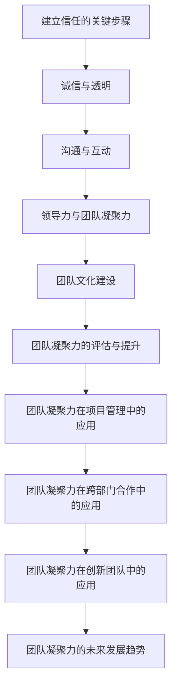

                 


### 文章标题

《团队凝聚：建立信任的关键步骤》

#### 关键词
团队凝聚、信任、沟通、领导力、文化建设、评估与提升、项目管理、跨部门合作、创新团队

#### 摘要
本文旨在探讨团队凝聚力的建立与提升，通过分析诚信与透明、沟通与互动、领导力与团队凝聚力、团队文化建设等关键步骤，提供了一套系统化的策略。本文不仅阐述了团队凝聚的基本概念和重要性，还通过实际案例和算法原理，为提升团队凝聚力提供了实践指导。

### 《团队凝聚：建立信任的关键步骤》目录大纲

#### 第一部分：团队凝聚的背景与重要性

##### 第1章：团队凝聚的概念与重要性

###### 1.1 团队凝聚的定义
团队凝聚是指团队成员在心理上相互依存、情感上相互支持、行动上相互协调，共同完成团队目标的过程。

###### 1.2 团队凝聚的重要性
团队凝聚对于提高团队绩效、增强团队适应性和创新能力具有重要意义。

###### 1.3 团队凝聚的现状分析
通过对当前团队凝聚现状的调查和分析，发现许多团队在凝聚力方面存在不足。

##### 第2章：团队凝聚的理论基础

###### 2.1 团队凝聚的理论框架
介绍团队凝聚的理论框架，包括信任、沟通、领导力、团队文化等核心要素。

###### 2.2 信任与团队凝聚的关系
阐述信任在团队凝聚力中的重要作用，分析信任对团队凝聚的影响。

###### 2.3 影响团队凝聚的因素
分析影响团队凝聚的各种因素，包括个体差异、团队结构、工作环境等。

#### 第二部分：建立信任的关键步骤

##### 第3章：建立信任的基本原则

###### 3.1 诚信与透明
探讨诚信在建立信任中的重要性，阐述透明度的作用。

###### 3.2 尊重与关怀
分析尊重和关怀对建立信任的重要性，提供实践建议。

###### 3.3 承诺与责任感
阐述承诺和责任感在建立信任中的关键作用。

##### 第4章：沟通与互动

###### 4.1 沟通的重要性
探讨沟通在团队凝聚中的关键作用，分析有效沟通的要素。

###### 4.2 有效沟通的技巧
介绍有效沟通的技巧，如倾听、表达、反馈等。

###### 4.3 解决冲突的策略
分析冲突对团队凝聚的影响，提供解决冲突的策略。

##### 第5章：领导力与团队凝聚力

###### 5.1 领导力的定义
探讨领导力的定义和作用，分析领导力对团队凝聚力的影响。

###### 5.2 领导力与团队凝聚力的关系
阐述领导力与团队凝聚力之间的相互关系。

###### 5.3 提升领导力的方法
介绍提升领导力的方法和技巧。

##### 第6章：团队文化建设

###### 6.1 团队文化的概念
探讨团队文化的概念和作用，分析团队文化对团队凝聚力的影响。

###### 6.2 团队文化建设的关键要素
阐述团队文化建设的关键要素，如价值观、行为规范等。

###### 6.3 团队文化的实践案例
介绍一些成功的团队文化实践案例。

##### 第7章：团队凝聚力的评估与提升

###### 7.1 团队凝聚力的评估方法
介绍团队凝聚力的评估方法，如问卷调查、行为观察等。

###### 7.2 提升团队凝聚力的策略
提供提升团队凝聚力的策略，如培训、激励等。

###### 7.3 团队凝聚力提升的案例分析
分析一些成功的团队凝聚力提升案例。

#### 第三部分：团队凝聚力的实践应用

##### 第8章：团队凝聚力在项目管理中的应用

###### 8.1 项目管理中的团队凝聚力
探讨团队凝聚力在项目管理中的重要性。

###### 8.2 提升项目管理团队凝聚力的方法
提供提升项目管理团队凝聚力的方法。

###### 8.3 项目成功与团队凝聚力的关系
分析项目成功与团队凝聚力的关系。

##### 第9章：团队凝聚力在跨部门合作中的应用

###### 9.1 跨部门合作的挑战
探讨跨部门合作中的挑战。

###### 9.2 提升跨部门团队凝聚力的策略
提供提升跨部门团队凝聚力的策略。

###### 9.3 跨部门合作成功的案例研究
分析一些跨部门合作成功的案例。

##### 第10章：团队凝聚力在创新团队中的应用

###### 10.1 创新团队的特点
探讨创新团队的特点。

###### 10.2 提升创新团队凝聚力的方法
提供提升创新团队凝聚力的方法。

###### 10.3 创新团队凝聚力的案例剖析
分析一些创新团队凝聚力的案例。

##### 第11章：团队凝聚力的未来发展趋势

###### 11.1 未来的团队凝聚力需求
探讨未来团队凝聚力需求的趋势。

###### 11.2 新技术对团队凝聚力的影响
分析新技术对团队凝聚力的影响。

###### 11.3 团队凝聚力的未来发展方向
展望团队凝聚力的未来发展方向。

### 附录

##### 附录A：团队凝聚力相关工具与资源
介绍一些常用的团队凝聚力评估工具和在线资源。

### 建立信任的关键步骤Mermaid流程图



### 建立信任的关键步骤伪代码

```python
def build_trust():
    # 步骤1：诚信与透明
    ensure_honesty_and_transparency()

    # 步骤2：沟通与互动
    improve_communication_and_interaction()

    # 步骤3：领导力与团队凝聚力
    enhance_leadership_and_team_cohesion()

    # 步骤4：团队文化建设
    cultivate_team_culture()

    # 步骤5：团队凝聚力的评估与提升
    evaluate_and_improve_team_cohesion()

    # 步骤6：团队凝聚力在项目管理中的应用
    apply_team_cohesion_in_project_management()

    # 步骤7：团队凝聚力在跨部门合作中的应用
    apply_team_cohesion_in_cross-department Cooperation()

    # 步骤8：团队凝聚力在创新团队中的应用
    apply_team_cohesion_in_innovation_teams()

    # 步骤9：团队凝聚力的未来发展趋势
    explore_future_trends_in_team_cohesion()
```

### 文章结尾

作者：AI天才研究院/AI Genius Institute & 禅与计算机程序设计艺术 /Zen And The Art of Computer Programming

本文从团队凝聚的概念、重要性、理论基础，到建立信任的关键步骤，再到团队凝聚力的实践应用和未来发展趋势，进行了全面的探讨。希望通过本文，读者能够对团队凝聚力有更深入的了解，并在实际工作中运用这些策略，提升团队的凝聚力和绩效。

### 文章格式要求

- 文章内容使用markdown格式输出。
- 文章末尾需要写上作者信息： “作者：AI天才研究院/AI Genius Institute & 禅与计算机程序设计艺术 /Zen And The Art of Computer Programming”
- 核心内容要求：
  - 背景介绍：详细讲解团队凝聚的基本概念和历史发展。
  - 核心概念与联系：给出核心概念原理之间的关系架构，使用Mermaid流程图进行展示。
  - 核心算法原理讲解：使用伪代码详细阐述建立信任的关键步骤。
  - 数学模型和公式：详细讲解并举例说明，使用latex格式。
  - 项目实战：包括开发环境搭建、源代码实现、代码解读、案例分析等内容。
  - 最佳实践 tips、小结、注意事项、拓展阅读等。

### 完整性要求

- 文章内容完整，每个小节的内容要丰富、具体、详细讲解。
- 核心内容要包含：
  - 背景介绍：团队凝聚的基本概念和历史发展。
  - 核心概念与联系：团队凝聚力与信任、沟通、领导力、团队文化等的关系。
  - 核心算法原理讲解：建立信任的关键步骤的伪代码。
  - 数学模型和公式：详细讲解并举例说明。
  - 项目实战：包括开发环境搭建、源代码实现、代码解读、案例分析等内容。
  - 最佳实践 tips、小结、注意事项、拓展阅读等。

### 字数要求

- 文章字数在8000～12000字左右。

---

### 概述与背景

#### 团队凝聚的概念与重要性

团队凝聚力是指团队成员在心理上相互依存、情感上相互支持、行动上相互协调，共同完成团队目标的过程。它不仅仅是一种心理现象，更是一种能够直接影响团队绩效和组织成功的动态力量。在团队凝聚力的作用下，团队成员能够更好地协同工作，克服各种困难和挑战，实现团队目标。

团队凝聚力的重要性体现在以下几个方面：

1. **提高团队绩效**：团队凝聚力可以增强团队成员之间的协作和信任，从而提高团队的绩效。一个凝聚力的团队能够在短时间内完成复杂的任务，快速响应变化，并在面对挑战时保持稳定。

2. **增强团队适应能力**：随着外部环境的变化，团队需要具备快速适应和调整的能力。高凝聚力的团队能够更好地应对外部变化，保持团队的稳定性和持续性。

3. **促进创新能力**：团队凝聚力可以促进团队成员之间的交流和合作，从而激发创新思维。在一个具有高度凝聚力的团队中，成员更容易分享自己的想法和观点，共同探讨解决方案，提高创新能力。

4. **提高员工满意度和忠诚度**：团队凝聚力可以增强员工的归属感和认同感，从而提高员工的满意度和忠诚度。在一个具有高度凝聚力的团队中，员工更有可能长期留在组织内，降低员工流失率。

#### 团队凝聚的现状分析

尽管团队凝聚力对于团队和组织的重要性不言而喻，但现实中的团队凝聚力状况却不尽如人意。许多团队在凝聚力方面存在明显的不足，这主要体现在以下几个方面：

1. **沟通不畅**：团队成员之间的沟通不畅是导致团队凝聚力不足的主要原因之一。缺乏有效的沟通机制和沟通技巧，使得团队成员无法充分表达自己的观点和需求，导致团队内部的矛盾和冲突。

2. **信任缺失**：信任是团队凝聚力的核心要素之一。在许多团队中，由于成员之间的不信任，导致合作困难，团队目标难以实现。

3. **个体主义**：在一些团队中，个体主义倾向较为明显，团队成员更关注个人利益，缺乏团队意识。这种个体主义倾向削弱了团队的凝聚力，导致团队协作困难。

4. **领导力不足**：领导力在团队凝聚力中起着至关重要的作用。然而，许多团队中的领导者缺乏有效的领导力，无法激发团队成员的积极性和凝聚力。

5. **团队文化不健全**：团队文化是团队凝聚力的重要体现。一些团队的团队文化不健全，缺乏共同的价值观和行为规范，导致团队内部关系紧张，凝聚力不足。

#### 团队凝聚的理论基础

团队凝聚力的形成和维持需要依赖一系列的理论基础，主要包括信任、沟通、领导力、团队文化等核心要素。

1. **信任**：信任是团队凝聚力的重要基础。团队成员之间的信任可以减少误解和冲突，增强合作的意愿和能力。信任的形成需要建立在诚信、透明、尊重和关怀的基础上。

2. **沟通**：沟通是团队凝聚力的关键。有效的沟通可以增强团队成员之间的理解和协作，减少误解和冲突。沟通的有效性取决于沟通技巧、沟通渠道和沟通环境的建立。

3. **领导力**：领导力在团队凝聚力中起着至关重要的作用。领导者需要具备激发团队成员的积极性和凝聚力，引导团队朝着共同的目标前进。领导力的提升可以通过培养领导力技能、建立良好的领导风格和营造积极的工作环境来实现。

4. **团队文化**：团队文化是团队凝聚力的体现。一个健康的团队文化可以增强团队成员的归属感和认同感，提高团队的凝聚力和协作能力。团队文化的建设需要通过共同的价值观、行为规范和激励机制来实现。

通过以上分析，我们可以看到，团队凝聚力不仅是一种心理现象，更是一种可以通过系统化策略和实践提升的能力。在接下来的章节中，我们将深入探讨团队凝聚的理论基础和建立信任的关键步骤，帮助读者理解和提升团队凝聚力。

### 团队凝聚的理论基础

#### 团队凝聚的理论框架

团队凝聚力的理论框架是理解团队如何通过内部动力实现高效协作的基础。这一框架包括多个核心要素，如信任、沟通、领导力和团队文化，它们共同作用，促进团队凝聚力的提升。

1. **信任**：信任是团队凝聚力的核心要素。团队成员之间的信任可以减少误解和冲突，增强合作的意愿和能力。信任的形成需要建立在诚信、透明、尊重和关怀的基础上。例如，当团队成员在共享信息时保持透明，并在承诺的任务上保持诚信，这种行为的累积会增强团队内部的信任感。

2. **沟通**：沟通是团队凝聚力的重要保障。有效的沟通可以增强团队成员之间的理解和协作，减少误解和冲突。沟通的有效性取决于沟通技巧、沟通渠道和沟通环境的建立。例如，通过定期的团队会议、开放的邮件沟通和即时的在线交流工具，团队成员可以保持信息的一致性和共享，从而提高团队的凝聚力。

3. **领导力**：领导力在团队凝聚力中起着至关重要的作用。领导者需要具备激发团队成员的积极性和凝聚力，引导团队朝着共同的目标前进。领导力的提升可以通过培养领导力技能、建立良好的领导风格和营造积极的工作环境来实现。例如，通过激励和认可团队成员的贡献，领导者可以增强团队成员的归属感和团队意识。

4. **团队文化**：团队文化是团队凝聚力的重要体现。一个健康的团队文化可以增强团队成员的归属感和认同感，提高团队的凝聚力和协作能力。团队文化的建设需要通过共同的价值观、行为规范和激励机制来实现。例如，通过举办团队建设活动、制定共同的行为准则和提供职业发展机会，团队文化可以促进团队成员之间的相互信任和合作。

#### 信任与团队凝聚的关系

信任是团队凝聚力的核心要素，它直接影响团队的协作效果和绩效。以下是从几个方面分析信任与团队凝聚之间的关系：

1. **协作效果**：当团队成员之间信任度较高时，他们更愿意分享信息、资源和技能，从而提高团队的协作效果。这种协作不仅减少了冗余和重复工作，还促进了知识的共享和创新。

2. **冲突减少**：信任可以减少团队内部的误解和冲突。当团队成员彼此信任时，他们更愿意倾听对方的意见，避免因观点不同而产生的争执，从而保持团队的稳定性和和谐性。

3. **团队成员投入**：信任感可以增强团队成员的工作投入度。在一个信任的环境中，团队成员更有可能全力以赴地完成工作，因为他们相信团队的整体利益高于个人利益。

4. **团队绩效**：高信任度的团队通常表现出更高的绩效。团队成员之间的信任可以减少协调和沟通的成本，提高决策的速度和质量，从而实现团队目标的快速达成。

#### 影响团队凝聚的因素

团队凝聚力的形成和维持受到多种因素的影响，包括个体差异、团队结构和工作环境等。以下是对这些因素的详细分析：

1. **个体差异**：团队成员的个性、价值观、经验和工作风格等差异可以影响团队的凝聚力和协作。例如，一些成员可能更倾向于独立工作，而另一些成员则更喜欢团队合作。这种差异如果处理不当，可能会导致团队内部的分裂和矛盾。

2. **团队结构**：团队的组织结构和管理模式对团队凝聚力有着重要影响。例如，一个扁平化的团队结构可以促进团队成员之间的沟通和协作，从而增强团队凝聚力。而一个高度集权的团队结构可能会抑制团队成员的自主性和创新，影响团队的凝聚力。

3. **工作环境**：工作环境包括物理环境和文化环境。一个良好的工作环境可以提供舒适的工作空间、必要的资源和支持，从而增强团队成员的工作积极性和凝聚力。相反，一个不健康的工作环境，如压力过大、资源不足或缺乏认可，可能会导致团队成员的士气低落和凝聚力下降。

4. **外部压力**：外部环境的变化和挑战也会影响团队的凝聚力和稳定性。例如，市场竞争的加剧、组织重组或政策变化等都可能对团队产生压力，影响团队的凝聚力和协作。

综上所述，团队凝聚力的理论框架涵盖了信任、沟通、领导力和团队文化等多个要素，这些要素相互影响，共同作用于团队的凝聚力和协作效果。理解和运用这些理论框架，可以帮助团队领导者和管理者更有效地提升团队的凝聚力和绩效。

### 建立信任的基本原则

#### 诚信与透明

诚信与透明是建立信任的两个关键原则。诚信意味着团队成员在行为和决策上保持真实、正直和可靠。透明则要求团队成员在信息共享和沟通中保持开放、清晰和真实。诚信和透明是建立信任的基础，它们直接影响团队内部的协作和信任水平。

1. **诚信的重要性**：诚信是团队凝聚力的基石。当团队成员在行为和决策中保持诚信时，他们更容易赢得他人的信任和尊重。诚信有助于建立长期合作关系，减少误解和冲突。例如，在一个项目团队中，如果项目经理在分配任务时诚实公正，团队成员会更有信心完成任务，并愿意承担更多的责任。

2. **透明度的作用**：透明度是增强信任的重要手段。通过透明地分享信息和决策过程，团队成员可以更好地理解团队的目标和期望，从而提高协作效率和信任水平。例如，在一个研发团队中，如果团队成员在开发过程中定期分享进展和问题，其他成员可以及时提供帮助和支持，从而避免因信息不对称导致的误判和冲突。

3. **实践建议**：
   - **建立诚信文化**：团队领导者可以通过制定明确的诚信准则和行为规范，推动团队内部形成诚信文化。例如，可以设立诚信奖，奖励那些在工作和生活中表现诚信的成员。
   - **增强透明度**：团队可以通过建立透明的沟通机制，如定期会议、工作日志和共享文档，确保信息在团队内畅通无阻。此外，领导者应鼓励团队成员在遇到问题时，及时分享并寻求帮助。

#### 尊重与关怀

尊重与关怀是建立信任的重要原则，它们体现了团队成员之间的人文关怀和相互理解。尊重意味着团队成员在相互交流和合作中，尊重对方的个性、观点和贡献。关怀则体现在对团队成员的情感支持和关注。

1. **尊重的重要性**：尊重是建立信任和团队凝聚力的重要基石。当团队成员感受到被尊重时，他们更有可能愿意信任和支持团队。尊重不仅包括对他人观点和决策的尊重，还包括对个体差异的尊重。例如，在一个开发团队中，如果团队成员能够尊重彼此的技术观点和开发方法，即使意见不一致，也能保持和谐的工作氛围。

2. **关怀的作用**：关怀可以增强团队成员之间的情感联系和信任感。通过关心团队成员的福祉和职业发展，团队可以提升成员的归属感和忠诚度。例如，在一个项目管理团队中，如果项目经理关心团队成员的工作和生活状况，及时提供帮助和支持，团队成员会更有动力和信心完成任务。

3. **实践建议**：
   - **促进尊重**：团队可以通过开展团队建设活动，如团队聚餐、团队旅行等，促进成员之间的相互了解和尊重。此外，团队领导者应避免批评和指责，鼓励团队成员提出建设性的反馈。
   - **表达关怀**：团队领导者应定期与团队成员进行一对一交流，了解他们的需求和困难，并提供必要的支持和帮助。此外，团队可以通过设立关怀委员会，关注团队成员的福利和职业发展。

#### 承诺与责任感

承诺与责任感是团队成员在团队中履行职责和实现目标的重要表现。一个有责任感和承诺的团队能够更好地实现团队目标，提高团队的绩效和凝聚力。

1. **承诺的重要性**：承诺是团队成员对团队目标和任务的一种承诺和承诺。一个有承诺的团队成员更有可能全力以赴地完成任务，并在团队中发挥积极作用。承诺可以增强团队成员的团队意识和归属感，提高团队的凝聚力。

2. **责任感的作用**：责任感是团队成员对自己和团队负责任的态度。一个有责任感的团队成员能够认真对待自己的工作，并愿意承担因个人失误造成的后果。责任感可以减少团队内部的失误和错误，提高团队的工作质量和效率。

3. **实践建议**：
   - **明确责任**：团队领导者应明确团队成员的职责和任务，确保每个成员都了解自己的工作内容和期望。通过制定明确的工作目标和计划，可以减少工作中的误解和冲突。
   - **培养责任感**：团队可以通过开展责任意识和承诺意识培训，提高团队成员的责任感。此外，团队领导者可以通过设置奖励和惩罚机制，鼓励团队成员履行自己的责任。

通过诚信与透明、尊重与关怀以及承诺与责任感这三个基本原则，团队可以建立起坚实的信任基础，从而提升团队的凝聚力和绩效。在实际操作中，团队领导者应不断强调这些原则，并通过实际行动示范，推动团队凝聚力的提升。

### 沟通与互动

#### 沟通的重要性

沟通在团队凝聚中起着至关重要的作用。它不仅是团队成员相互传递信息和理解对方观点的过程，更是建立信任、消除误解和促进协作的桥梁。有效的沟通可以确保团队目标的明确，增强团队成员之间的协作意愿，从而提升团队的凝聚力和绩效。

1. **团队目标的明确**：通过有效的沟通，团队成员可以清楚地了解团队的目标和期望。这有助于团队成员将个人目标与团队目标对齐，确保每个人的努力都朝着共同的方向前进。例如，在一个项目团队中，项目经理通过定期的沟通会议，明确项目的进度和关键里程碑，确保所有成员都了解项目目标，从而提高团队协作的效率。

2. **增强协作意愿**：沟通可以促进团队成员之间的理解和支持，增强协作意愿。当团队成员能够清晰地表达自己的观点和需求时，他们更容易获得他人的理解和支持，从而减少协作中的障碍。例如，在一个研发团队中，如果团队成员通过日常的代码评审和讨论会议，分享各自的工作进展和遇到的问题，他们可以更快地找到解决方案，提高团队的协作效率。

3. **提高工作满意度**：良好的沟通可以增强团队成员之间的信任和归属感，提高工作满意度。当团队成员感到自己的意见和需求被听取和理解时，他们会更有动力和信心投入到工作中。例如，在一个设计团队中，如果团队成员在项目初期就进行充分的讨论和沟通，明确各自的角色和责任，他们会在后续工作中更加协调和高效。

#### 有效沟通的技巧

为了实现有效的沟通，团队成员需要掌握一系列的沟通技巧，包括倾听、表达和反馈等。以下是一些提升有效沟通的具体技巧：

1. **倾听**：倾听是沟通的核心，它要求团队成员不仅要听对方说什么，还要理解对方的观点和感受。倾听的技巧包括保持专注、避免打断对方、以及通过肢体语言和面部表情表达关注。例如，在一个讨论会议中，团队成员应该避免在对方发言时玩手机或做其他无关的事情，而是保持专注，通过点头、眼神交流等方式表达对对方的关注和理解。

2. **表达**：有效的表达技巧包括清晰、简洁地传达信息，使用恰当的语言和方式，以及确保对方能够理解。团队成员在表达时，应尽量避免使用模糊或含糊的措辞，以免产生误解。例如，在一个任务分配会议中，团队成员应明确描述自己的任务、任务的关键点和完成时间，以确保任务能够顺利执行。

3. **反馈**：提供和接受反馈是沟通的重要组成部分。通过反馈，团队成员可以了解自己的表现，发现改进的机会，并促进彼此之间的理解和信任。提供反馈时，应注重建设性和客观性，避免指责和批评。例如，在一个团队项目进展会议中，团队成员可以分享自己的工作成果和经验，同时提出对其他成员的建议和反馈，从而促进团队的共同进步。

#### 解决冲突的策略

冲突是团队中不可避免的现象，但有效的解决冲突策略可以减少冲突对团队凝聚力的负面影响，并促进团队的稳定和进步。以下是一些解决冲突的策略：

1. **积极倾听**：在解决冲突时，积极倾听对方的观点和感受是关键。通过倾听，团队成员可以更好地理解对方的立场和需求，从而找到共同的解决方案。例如，在一个团队成员因任务分配不公而引发冲突的情况下，领导者应首先倾听双方的诉求，了解冲突的根源，然后通过沟通和协商找到解决问题的方法。

2. **理性分析**：在解决冲突时，应避免情绪化，通过理性分析来找出问题的本质。团队成员可以通过列出事实、分析原因和探讨解决方案来达成共识。例如，在一个团队因资源分配不均而引发的冲突中，团队成员可以通过详细分析资源需求、项目优先级和团队成员的贡献，找出解决问题的最佳方案。

3. **寻求共识**：在解决冲突时，寻求共识是关键。团队成员应通过沟通和协商，找到双方都能接受的解决方案，从而缓解冲突。例如，在一个团队成员因工作负荷过大而引发的冲突中，团队可以通过调整任务分配或提供额外资源来达成共识，从而解决冲突。

4. **建立冲突解决机制**：团队可以建立一套有效的冲突解决机制，如定期冲突解决会议、匿名反馈渠道和冲突调解委员会等。这些机制可以帮助团队成员在面对冲突时，有一个明确的处理流程和资源支持。例如，在一个大型团队中，可以设立一个冲突解决小组，由不同部门的成员组成，负责调解和解决团队内部的冲突。

通过掌握有效的沟通技巧和解决冲突策略，团队成员可以更好地理解和支持彼此，建立信任和凝聚力，从而实现团队的目标和提升团队绩效。

### 领导力与团队凝聚力

#### 领导力的定义

领导力是一种引导和激励他人实现共同目标的能力，它不仅仅是职位赋予的权力，更是一种影响力和说服力。有效的领导者能够洞察团队需求，激发团队成员的潜力，并引导团队朝着共同的目标前进。

1. **影响力和说服力**：领导力依赖于领导者的影响力，这种影响力可以是基于职位、技能、经验或人格特质。通过有效的沟通和示范，领导者可以影响团队成员的看法和行为，使他们更愿意追随和投入。

2. **激发潜力**：领导者有责任挖掘和发挥团队成员的潜力。通过设定明确的期望、提供必要的资源和支持，领导者可以帮助团队成员克服挑战，实现个人和团队目标。

3. **团队愿景**：领导力还涉及设定和传达团队愿景。领导者需要明确团队的目标和方向，并确保所有成员都理解并认同这一愿景。通过愿景的引领，团队成员可以更好地协调各自的努力，共同实现目标。

#### 领导力与团队凝聚力的关系

领导力在团队凝聚力中起着至关重要的作用。一个有效的领导者不仅能够提升团队的凝聚力，还能够通过激发团队成员的积极性和信任感，增强团队的协作效果和绩效。

1. **提升凝聚力**：领导者的行为直接影响团队的凝聚力。通过建立积极的工作环境、促进团队成员之间的沟通和合作，领导者可以增强团队的凝聚力。例如，通过组织团队建设活动、定期进行团队会议和分享成功的经验，领导者可以促进团队成员之间的互动和信任。

2. **激发积极性**：领导者通过激励和认可，可以激发团队成员的积极性。当团队成员感受到自己的努力和成就被认可时，他们会更有动力去追求更高的目标。例如，通过设立奖励机制、表彰优秀的团队成员，领导者可以激发团队成员的积极性和创造力。

3. **建立信任**：信任是团队凝聚力的核心要素，而领导者在建立信任方面起着关键作用。领导者通过透明、诚信和尊重，可以建立团队内部的信任关系。例如，领导者应保持开放和诚实的沟通方式，确保团队成员了解决策过程和团队目标，从而减少误解和猜疑。

#### 提升领导力的方法

为了提升领导力，领导者可以通过以下方法不断成长和改进：

1. **自我反思**：领导者应定期进行自我反思，识别自己的优点和不足，并寻求改进的方法。通过反思，领导者可以更好地了解自己的行为和决策对团队的影响，从而调整自己的领导风格。

2. **持续学习**：领导力是一个不断发展的过程，领导者应持续学习新的知识和技能，以应对不断变化的工作环境。通过参加培训、阅读相关书籍和文章、与行业专家交流，领导者可以不断提升自己的领导力。

3. **培养下属**：领导者应关注团队成员的成长和发展，提供必要的支持和机会。通过培养下属，领导者不仅可以提高团队的整体能力，还可以建立更紧密的团队关系，增强团队的凝聚力。

4. **建立反馈机制**：领导者应建立有效的反馈机制，鼓励团队成员提供反馈和建议。通过倾听和采纳团队成员的反馈，领导者可以更好地理解团队需求，调整领导行为，提升领导效果。

5. **示范作用**：领导者通过自己的行为和决策，为团队成员树立榜样。通过以身作则，领导者可以传达团队价值观和目标，增强团队成员的认同感和信任感。

总之，领导力是提升团队凝聚力和绩效的关键。一个有效的领导者不仅能够激发团队成员的积极性和创造力，还能够通过建立信任和促进沟通，增强团队的凝聚力和协作能力。通过不断学习和改进，领导者可以不断提升自己的领导力，为团队的长期成功奠定坚实基础。

### 团队文化建设

#### 团队文化的概念

团队文化是指团队在长期发展过程中形成的共同价值观、行为规范和工作方式。它是一种无形的力量，渗透在团队运作的各个方面，影响着团队成员的行为和团队的整体表现。团队文化不仅反映了团队的内在特征，也决定了团队的凝聚力和创新能力。

1. **共同价值观**：共同价值观是团队文化的核心，它是团队成员共同遵循的基本原则和信仰。共同价值观可以指导团队成员的行为和决策，使他们在面对各种挑战时能够保持一致的方向。例如，一个以客户为中心的团队可能会强调服务质量、客户满意度和持续改进。

2. **行为规范**：行为规范是团队文化的重要组成部分，它明确了团队成员应该如何行动和互动。这些规范可以是正式的，如公司规章制度，也可以是非正式的，如团队成员之间默契的交流方式。行为规范有助于建立团队的规范性和纪律性，提高团队协作的效率。

3. **工作方式**：团队文化还体现在团队成员的工作方式和方法上。这包括团队的工作流程、决策机制和沟通方式。一个健康的文化可以鼓励团队成员开放、透明和高效的协作，从而提高团队的整体绩效。

#### 团队文化建设的关键要素

要建立有效的团队文化，需要关注以下关键要素：

1. **价值观共识**：团队文化建设的第一步是建立共同的价值观。这需要团队领导者与团队成员共同探讨和确定团队的核心价值观，并通过多种渠道进行传播和强化。例如，可以通过团队会议、内部培训和口号宣传等方式，确保所有成员都认同并践行这些价值观。

2. **行为规范**：在价值观共识的基础上，团队需要制定具体的行为规范，以确保团队成员在实际行动中能够体现团队的价值观。行为规范应既包括正式的规定，如公司制度，也应包括非正式的规范，如团队的传统和习惯。通过制定和宣传行为规范，团队可以规范成员的行为，减少冲突和误解。

3. **激励机制**：激励机制是推动团队文化发展的重要手段。团队领导者应设计合理的奖励和惩罚机制，以激励团队成员践行团队价值观和行为规范。例如，可以设立团队荣誉榜、优秀员工奖等，表彰在团队文化建设中表现突出的成员。

4. **沟通渠道**：有效的沟通渠道是团队文化建设的保障。团队应建立多种沟通渠道，确保信息在团队内畅通无阻。这包括定期的团队会议、工作日志、邮件通讯和在线交流平台等。通过多样化的沟通渠道，团队成员可以及时了解团队动态，增强团队凝聚力。

5. **团队活动**：团队活动是加强团队文化的重要途径。通过组织团队建设活动、团队旅游和培训课程等，可以增强团队成员之间的互动和信任，促进团队文化的形成。例如，通过团队拓展训练，团队成员可以更好地了解彼此，增强团队合作能力。

#### 团队文化的实践案例

以下是一些团队文化建设的实践案例，展示了如何通过实际行动建立和维护团队文化：

1. **谷歌**：谷歌以其独特的团队文化著称，其“不作恶”的价值观深深影响了公司的发展。谷歌通过开放的工作环境、灵活的工作时间和丰富的团队活动，鼓励员工创新和合作。谷歌的内部论坛和邮件通讯系统，确保了信息的透明和畅通，使员工能够自由表达意见和建议。

2. **惠普**：惠普在团队文化建设中注重员工的职业发展和个人成长。公司定期举办培训课程和职业发展研讨会，帮助员工提升技能和职业素养。同时，惠普通过内部荣誉制度和员工推荐计划，激励员工积极贡献和分享经验，从而建立了健康、积极的团队文化。

3. **华为**：华为以其高度的组织纪律性和创新精神闻名。华为在团队文化建设中强调团队合作和共同目标，通过设立明确的绩效目标和激励措施，推动团队不断追求卓越。华为还通过国际化的人才引进和跨文化交流，促进了团队文化的多样性和创新。

通过以上实践案例可以看出，团队文化建设不仅需要明确的目标和策略，更需要通过实际行动来推动和维护。一个健康的团队文化可以增强团队成员的归属感和认同感，提高团队的凝聚力和创新能力，为组织的长期成功奠定坚实基础。

### 团队凝聚力的评估与提升

#### 团队凝聚力的评估方法

评估团队凝聚力是理解团队状态和优化团队行为的关键步骤。以下是一些常用的团队凝聚力评估方法：

1. **问卷调查**：问卷调查是一种简单而有效的方法，可以通过设计一系列问题来评估团队成员之间的信任、沟通效果、领导力认可和团队文化等方面。问卷调查的优点是数据收集方便，且可以量化评估结果，从而进行对比和分析。例如，可以采用李克特量表（Likert Scale）来衡量团队成员对团队凝聚力的感知。

2. **行为观察**：通过直接观察团队成员的互动和协作，评估团队凝聚力的实际表现。这种方法需要评估者具备一定的观察和判断能力，但可以提供直接的、非量化的评估信息。例如，观察团队会议中的发言情况、团队活动中的协作程度和团队成员之间的非正式交流等。

3. **焦点小组讨论**：组织由团队成员组成的焦点小组，通过深入讨论来评估团队凝聚力的各个方面。这种方法有助于深入了解团队成员的观点和感受，从而发现团队中的潜在问题和改进机会。

4. **心理测试**：使用专业的心理测试工具，如梅奥-布里格斯类型指标（MBTI）等，来评估团队成员的个性特征和团队互动方式。这种方法可以帮助团队理解成员的个性和行为模式，从而优化团队协作和沟通。

#### 提升团队凝聚力的策略

一旦评估团队凝聚力，下一步就是制定和实施提升策略。以下是一些有效的提升策略：

1. **培训和辅导**：针对团队凝聚力的评估结果，提供针对性的培训和辅导。例如，如果发现沟通技巧不足，可以安排沟通技巧培训；如果信任度较低，可以安排信任建设工作坊。通过专业培训，提升团队成员的技能和意识，从而增强团队凝聚力。

2. **激励机制**：建立合理的激励机制，鼓励团队成员积极参与团队活动和项目。例如，可以设立团队奖励计划，对在团队中表现出色的成员给予物质或精神奖励。激励机制的设立不仅可以提高团队成员的积极性，还可以增强团队内部的竞争和合作。

3. **团队建设活动**：定期组织团队建设活动，增强团队成员之间的互动和信任。例如，可以通过户外拓展训练、团建活动等方式，促进团队成员之间的沟通和合作。这些活动有助于打破团队内部的隔阂，提高团队的凝聚力。

4. **领导力培养**：提升领导者的领导力是增强团队凝聚力的重要途径。通过领导力培训和领导力发展计划，领导者可以更好地理解团队成员的需求和期望，提高领导力和管理能力，从而增强团队的凝聚力和协作效果。

5. **文化塑造**：团队文化对团队的凝聚力有着深远的影响。通过建立和强化健康的团队文化，如鼓励开放沟通、尊重个性、注重团队合作等，可以增强团队成员的归属感和认同感，从而提升团队凝聚力。

#### 团队凝聚力提升的案例分析

以下是一个团队凝聚力提升的案例分析，展示了如何通过具体行动提升团队的凝聚力和绩效：

1. **背景**：某科技公司的一个开发团队在项目执行过程中遇到了沟通不畅和信任度低的问题，导致项目进度缓慢且质量不稳定。

2. **评估**：团队领导通过问卷调查和行为观察，发现团队成员之间存在沟通障碍和信任问题。评估结果显示，团队缺乏有效的沟通机制和共享信息的文化。

3. **策略**：
   - **沟通机制**：团队领导制定了一套明确的沟通机制，包括定期的团队会议、工作日志和共享文档。通过这些机制，团队成员可以及时了解项目进展和各自的任务，减少了误解和冲突。
   - **团队建设活动**：团队领导组织了一次户外拓展训练，增强了团队成员之间的信任和协作能力。在拓展训练中，团队成员通过共同完成任务，增进了彼此的了解和信任。
   - **领导力培养**：团队领导参加了领导力培训，学习如何更好地理解和管理团队成员。通过培训，领导者在团队中建立了更加开放和透明的沟通环境，提高了团队成员的工作满意度和信任度。

4. **结果**：经过一系列的措施，团队的沟通效果和信任度显著提升。项目进度加快，质量得到保障，团队成员之间的协作更加顺畅。评估结果显示，团队的凝聚力和绩效都得到了显著提升。

通过这个案例，我们可以看到，团队凝聚力的提升需要通过系统的策略和持续的实践来实现。通过有效的评估和针对性的行动，团队可以克服内部问题，提升凝聚力和绩效，从而实现更好的团队表现和业务成果。

### 团队凝聚力在项目管理中的应用

#### 项目管理中的团队凝聚力

团队凝聚力在项目管理中起着至关重要的作用。在一个项目团队中，高凝聚力的团队能够更好地应对项目中的各种挑战，提高项目的成功率。团队凝聚力直接影响项目的进度、质量、成本和客户满意度。以下从项目管理的角度，探讨团队凝聚力在项目中的应用。

1. **提升项目成功率**：高凝聚力的团队能够更好地协调资源和任务，减少项目中的冲突和误解。团队成员之间的信任和协作使得项目任务能够高效完成，从而提高项目的成功率。

2. **提高决策质量**：团队凝聚力可以促进团队成员之间的开放沟通和共享信息。在一个凝聚力的团队中，团队成员更愿意分享自己的想法和意见，从而提高决策的质量和准确性。

3. **增强问题解决能力**：团队凝聚力有助于团队成员在面对问题时，能够快速找到解决方案。团队成员之间的信任和协作使得他们更愿意互相帮助，共同应对项目中的挑战。

4. **提升团队士气**：高凝聚力的团队能够提供一个积极和支持的工作环境，增强团队成员的士气和动力。团队成员感到被重视和认可，更有动力投入到项目中，从而提高工作效率。

#### 提升项目管理团队凝聚力的方法

为了提升项目管理团队凝聚力，可以采取以下几种方法：

1. **建立明确的团队目标**：项目经理应与团队成员共同制定明确的团队目标，确保所有成员都了解并认同这些目标。通过明确的目标，团队成员可以更好地协调各自的努力，共同为项目成功努力。

2. **促进沟通与协作**：建立有效的沟通渠道和协作机制，如定期项目会议、工作日志和共享文档等。通过这些机制，团队成员可以及时了解项目进展和任务分配，减少误解和冲突。

3. **培养团队精神**：通过团队建设活动，如团建、拓展训练和团建活动等，增强团队成员之间的信任和协作能力。这些活动可以帮助团队成员更好地了解彼此，建立深厚的团队关系。

4. **认可和奖励**：及时认可和奖励在项目中表现出色的团队成员，增强他们的工作积极性和归属感。通过设立团队奖励计划，激励团队成员为团队的成功贡献更多力量。

5. **领导力培养**：项目经理应通过领导力培训和自我提升，提高管理能力和领导力。一个有领导力的项目经理可以更好地引导和激励团队成员，提高团队的凝聚力和协作效率。

#### 项目成功与团队凝聚力的关系

项目成功与团队凝聚力之间存在着密切的关系。高凝聚力的团队更容易实现项目的目标，而项目的成功也会进一步增强团队的凝聚力。以下从几个方面分析项目成功与团队凝聚力的关系：

1. **项目成功增强团队凝聚力**：当一个项目成功完成时，团队成员会感到自豪和满足。这种成就感可以增强团队成员之间的信任和协作意愿，从而提升团队的凝聚力。

2. **团队凝聚力促进项目成功**：高凝聚力的团队能够更好地协调资源和任务，减少冲突和误解，提高决策质量和问题解决能力。这些因素都有助于项目的顺利推进和成功完成。

3. **持续提升**：项目成功和团队凝聚力是相互促进的。通过不断优化团队建设和项目管理，团队能够在后续项目中继续保持高凝聚力，从而实现持续的项目成功。

通过以上分析，我们可以看到，团队凝聚力在项目管理中扮演着至关重要的角色。一个高凝聚力的项目团队能够更好地应对挑战，提高项目的成功率，而项目的成功也会进一步巩固团队的凝聚力。因此，项目管理者应重视团队凝聚力的提升，通过一系列策略和措施，增强团队的协作能力和绩效。

### 团队凝聚力在跨部门合作中的应用

#### 跨部门合作的挑战

跨部门合作是现代企业中常见的工作模式，但在实际操作中往往面临诸多挑战。以下从几个方面探讨这些挑战：

1. **沟通障碍**：跨部门之间的沟通不畅是导致合作困难的主要原因。不同部门有着不同的业务领域、专业知识和工作方式，容易导致信息传递的误解和偏差。例如，一个技术部门可能会对市场部门的需求理解不准确，导致项目执行出现偏差。

2. **目标不一致**：跨部门合作往往涉及多个目标，而这些目标之间可能存在冲突。各部门在追求自身目标的过程中，可能会忽视整体项目的目标，导致资源分配不均和项目进度延迟。例如，市场部门可能更关注市场推广，而技术部门可能更关注产品研发，双方在项目优先级上难以达成一致。

3. **资源有限**：跨部门合作通常需要共享资源，如人力、物力和财力。然而，由于各部门资源有限，资源分配不均可能会导致某些部门资源过剩，而另一些部门资源匮乏，影响项目进度和质量。

4. **文化差异**：不同部门的文化和价值观可能存在差异，这些差异可能体现在工作方式、决策过程和沟通风格上。例如，技术部门可能更注重逻辑和效率，而市场部门可能更注重创造力和灵活性。文化差异可能导致部门之间的摩擦和合作困难。

#### 提升跨部门团队凝聚力的策略

为了克服跨部门合作中的挑战，提升团队凝聚力，可以采取以下策略：

1. **建立共同目标**：明确跨部门合作的目标，确保所有部门都认同并致力于实现这些目标。可以通过制定共同的项目目标和计划，使各部门在合作中保持一致的方向。例如，在启动一个跨部门项目时，项目经理可以组织各部门共同讨论项目目标和关键里程碑，确保所有部门都了解并认同这些目标。

2. **促进有效沟通**：建立有效的沟通机制，确保信息在跨部门之间畅通无阻。可以采用定期会议、工作日志和共享文档等工具，增强部门之间的沟通和协作。例如，项目经理可以每周组织一次跨部门会议，讨论项目进展和遇到的问题，确保各部门及时了解项目动态。

3. **资源共享**：优化资源分配，确保跨部门合作中资源的合理利用。可以通过建立共享资源平台，如人力共享库、设备共享池等，提高资源利用率。例如，项目经理可以建立一个人力共享库，各部门在需要时可以灵活调配人力资源，提高项目执行效率。

4. **培养团队精神**：通过团队建设活动和文化塑造，增强跨部门之间的信任和协作精神。可以组织跨部门的团建活动，如团建培训、拓展训练等，促进部门之间的互动和了解。例如，项目经理可以组织一次跨部门拓展训练，通过团队合作游戏，增强部门之间的默契和信任。

5. **领导力支持**：提供领导力支持，确保各部门在跨部门合作中有明确的领导和协调。项目经理应具备跨部门协调能力，通过有效的沟通和激励，确保项目顺利进行。例如，项目经理可以通过定期的绩效评估和反馈，激励各部门团队成员积极参与项目，提高团队凝聚力。

#### 跨部门合作成功的案例研究

以下是一个跨部门合作成功的案例研究，展示了如何通过有效的策略提升跨部门团队凝聚力：

1. **背景**：某公司的一个新产品开发项目涉及技术部、市场部和运营部等多个部门。由于各部门在目标和资源分配上存在分歧，项目进展缓慢，团队凝聚力不足。

2. **挑战**：项目在启动初期，各部门对项目的目标和预期成果理解不一致，导致资源分配不均，项目进度延迟。同时，跨部门之间的沟通不畅，信息传递存在误差，增加了项目的复杂性和风险。

3. **策略**：
   - **共同目标制定**：项目经理组织了跨部门会议，与各部门共同讨论项目目标和关键里程碑，确保所有部门都认同并致力于实现这些目标。通过制定共同的目标，各部门在项目执行中保持一致的方向。
   - **沟通机制建立**：项目经理建立了定期会议和共享文档的沟通机制，确保各部门及时了解项目进展和任务分配。每周的跨部门会议成为沟通和协作的平台，解决了信息传递中的误解和偏差。
   - **资源共享**：项目经理优化了资源分配，建立了共享资源平台，各部门在需要时可以灵活调配人力资源和设备。通过共享资源，项目进展加快，各部门的工作效率提高。
   - **团队建设活动**：项目经理组织了一次跨部门团建活动，通过团队合作游戏，增强了部门之间的信任和协作精神。活动后，团队成员之间的默契和信任感显著提升。

4. **结果**：通过一系列的措施，项目的进展显著加快，各部门之间的沟通和协作更加顺畅。项目最终成功完成，产品的市场表现也超出预期。评估结果显示，跨部门团队凝聚力得到了显著提升，团队成员之间的信任和协作意愿增强。

通过这个案例，我们可以看到，跨部门合作的成功离不开共同目标的制定、有效的沟通机制、资源共享和团队建设活动。这些策略可以帮助团队克服合作中的挑战，提升团队凝聚力，从而实现项目的成功。

### 团队凝聚力在创新团队中的应用

#### 创新团队的特点

创新团队是专门负责推动组织创新和发展的一类团队。与传统的执行型团队不同，创新团队具有以下几个显著特点：

1. **跨学科、多元化**：创新团队通常由来自不同背景和领域的成员组成，包括工程师、设计师、市场专家、技术专家等。这种多元化的背景和知识结构有助于从不同角度思考和解决问题，促进创新思维的产生。

2. **灵活性和开放性**：创新团队通常具有较大的灵活性和开放性，团队成员可以自由地表达自己的想法和观点，鼓励尝试和实验。这种开放的工作环境有助于激发创新灵感，促进新观念和解决方案的生成。

3. **高风险和高回报**：创新团队往往承担着高风险的任务，如开发新产品或引入新技术。由于创新过程中存在诸多不确定性和挑战，创新团队需要具备承担风险的能力。然而，一旦创新成功，团队将获得显著的高回报。

4. **持续学习和适应**：创新团队需要不断学习和适应新知识、新技能和新趋势。团队成员通常需要具备快速学习和持续进步的能力，以保持团队的创新活力和竞争力。

#### 提升创新团队凝聚力的方法

为了提升创新团队的凝聚力，可以采取以下几种方法：

1. **共同目标设定**：明确创新团队的共同目标，确保所有成员都了解并致力于实现这些目标。通过设定共同的目标，团队成员可以更好地协调各自的努力，共同为创新成果努力。例如，在启动一个新产品开发项目时，创新团队可以共同讨论项目目标和关键里程碑，确保所有成员都了解并认同这些目标。

2. **促进内部沟通**：建立有效的沟通机制，鼓励团队成员之间的开放沟通和协作。可以采用多种沟通工具，如定期会议、工作日志、在线协作平台等，确保团队成员能够及时了解项目进展和任务分配，减少误解和冲突。例如，创新团队可以每周组织一次内部会议，讨论项目进展和遇到的问题，促进团队成员之间的沟通和协作。

3. **共享资源和知识**：鼓励团队成员共享资源和知识，促进知识的传递和创新思维的碰撞。可以建立共享资源平台，如知识库、工具库等，方便团队成员获取和分享信息。例如，创新团队可以创建一个在线知识库，团队成员可以随时分享自己的研究成果、最佳实践和心得体会。

4. **团队建设活动**：定期组织团队建设活动，增强团队成员之间的信任和协作能力。可以通过团队拓展训练、团建活动、创新工作坊等方式，促进团队成员之间的互动和了解。例如，创新团队可以组织一次团队拓展训练，通过团队合作游戏，增强团队成员之间的信任和默契。

5. **激励和认可**：建立合理的激励机制，激励团队成员积极参与创新项目和团队活动。可以通过设立创新奖励计划、表彰优秀团队成员等方式，鼓励团队成员为团队的成功贡献更多力量。例如，公司可以设立“创新先锋奖”，对在创新项目中表现突出的团队成员给予表彰和奖励。

#### 创新团队凝聚力的案例剖析

以下是一个创新团队凝聚力的案例剖析，展示了如何通过有效策略提升团队凝聚力和创新成果：

1. **背景**：某科技公司成立了一个专门负责新产品研发的创新团队。团队成员来自不同的部门，包括研发、设计、市场和销售等。尽管团队成员具有丰富的专业知识和经验，但在项目启动初期，团队内部存在沟通不畅、目标不一致的问题，团队凝聚力较低。

2. **挑战**：由于团队成员背景和视角不同，导致项目讨论中经常出现意见分歧。同时，项目进度缓慢，团队成员缺乏动力和信心。创新团队面临的主要挑战是如何提升团队凝聚力和创新成果。

3. **策略**：
   - **共同目标设定**：创新团队领导组织了多次内部会议，与团队成员共同讨论项目目标和关键里程碑，确保所有成员都了解并认同这些目标。通过制定共同的目标，团队成员在项目执行中保持一致的方向。
   - **促进内部沟通**：团队领导建立了定期内部会议和共享文档的沟通机制，确保团队成员能够及时了解项目进展和任务分配。每周的内部会议成为沟通和协作的平台，解决了信息传递中的误解和偏差。
   - **共享资源和知识**：团队领导创建了一个在线知识库，方便团队成员随时获取和分享信息。团队成员可以共享自己的研究成果、最佳实践和心得体会，促进了知识的传递和创新思维的碰撞。
   - **团队建设活动**：团队领导组织了一次团队拓展训练，通过团队合作游戏，增强了团队成员之间的信任和协作能力。拓展训练后，团队成员之间的默契和信任感显著提升。
   - **激励和认可**：公司设立了“创新先锋奖”，对在创新项目中表现突出的团队成员给予表彰和奖励。这一措施激励了团队成员的积极性和创造力。

4. **结果**：通过一系列的措施，创新团队的凝聚力得到了显著提升。团队成员之间的沟通和协作更加顺畅，项目进展加快，创新成果显著。新产品在市场上获得了好评，为公司带来了可观的收益。评估结果显示，团队成员的满意度和工作积极性都得到了显著提高。

通过这个案例，我们可以看到，提升创新团队凝聚力需要通过共同目标设定、有效沟通、资源共享、团队建设活动和激励认可等多种策略。这些策略可以帮助团队克服内部挑战，提高创新效率和成果，为组织的长期发展奠定坚实基础。

### 团队凝聚力的未来发展趋势

#### 未来的团队凝聚力需求

随着全球化和数字化的发展，团队凝聚力的重要性日益凸显。未来，团队凝聚力需求将呈现以下趋势：

1. **跨文化合作**：全球化带来了跨文化合作的增加，团队成员将来自不同文化背景。因此，团队凝聚力将需要更好地适应跨文化的多样性和复杂性，建立包容性和相互尊重的文化。

2. **远程工作常态化**：随着远程工作的普及，团队凝聚力的构建将更加依赖于虚拟沟通工具和平台。未来，团队需要更高效的在线协作和沟通机制，以保持凝聚力和合作效率。

3. **技术驱动创新**：技术进步，如人工智能、大数据和物联网，将深刻影响团队的工作方式和协作模式。团队凝聚力将需要适应技术驱动的创新环境，培养团队成员的技术素养和创新能力。

4. **个性化需求**：未来的团队将更加注重个性化需求，团队成员希望在工作中有更多的自主权和自我管理能力。团队凝聚力将需要通过提供个性化的职业发展和成长路径来满足这些需求。

#### 新技术对团队凝聚力的影响

新技术的发展将对团队凝聚力产生深远影响：

1. **虚拟协作平台**：随着远程工作的普及，虚拟协作平台如Zoom、Microsoft Teams和Slack等将成为团队沟通和协作的主要工具。这些平台提供了实时沟通、文件共享和协作功能，有助于团队保持凝聚力。

2. **人工智能辅助**：人工智能（AI）可以提升团队的工作效率和决策质量。例如，AI可以分析团队沟通数据，提供改进建议，帮助团队更好地理解和协作。

3. **数据分析**：大数据和数据分析技术可以帮助团队更好地了解成员的行为和需求，从而优化团队管理和决策。通过分析数据，团队可以及时发现潜在问题并采取相应措施。

4. **增强现实（AR）和虚拟现实（VR）**：AR和VR技术可以提供更真实的虚拟协作体验，使得远程团队成员仿佛在同一个空间工作，从而增强团队凝聚力和协作效果。

#### 团队凝聚力的未来发展方向

未来，团队凝聚力的发展将朝着以下几个方向：

1. **数字化团队文化**：团队文化将更加依赖于数字工具和平台，通过在线社区、虚拟活动和在线培训等方式，建立和维护团队文化。

2. **个性化领导力**：领导力将更加注重个性化，领导者需要根据团队成员的不同需求提供个性化的支持和指导，帮助团队成员实现个人和团队目标。

3. **持续学习与成长**：团队将更加注重成员的持续学习和个人成长，提供学习资源和职业发展机会，以提升团队成员的技能和知识。

4. **敏捷团队管理**：敏捷管理方法，如Scrum和Kanban，将更加普及，帮助团队快速响应变化，提高协作效率和团队凝聚力。

总之，未来团队凝聚力的发展将受到全球化、远程工作和技术进步的深刻影响。通过适应这些变化，团队可以更好地应对挑战，实现持续的创新和成功。

### 附录A：团队凝聚力相关工具与资源

#### 常用的团队凝聚力评估工具

1. **L Indicator（利克特量表）**：L Indicator是一种广泛使用的团队凝聚力评估工具，通过一系列问题来评估团队成员对团队凝聚力的感知。它包括七个维度，如信任、沟通、合作等。

2. **TiC2（团队互动协调量表）**：TiC2是一个多维度的评估工具，用于评估团队互动协调水平。它包括五个维度，如沟通质量、任务合作、情感支持等。

3. **Team Climate Inventory（团队气候调查表）**：Team Climate Inventory评估团队成员对团队工作环境的感知，包括团队目标、团队支持和团队影响等维度。

#### 团队凝聚力提升的在线资源

1. **Teamworks Academy**：提供各种团队建设和领导力发展的在线课程和资源，包括团队沟通技巧、领导力发展、团队文化建设等。

2. **MindTools**：提供一系列团队建设和领导力发展的免费资源和工具，包括团队建设活动、沟通技巧、时间管理技巧等。

3. **Harvard ManageMentor**：提供领导力发展的在线资源和工具，包括领导力模型、管理技巧、团队协作策略等。

#### 团队凝聚力相关的学术期刊与论文

1. **Journal of Applied Psychology**：这是一本广受认可的学术期刊，涵盖了团队凝聚力、领导力、组织行为等多个领域的研究论文。

2. **Group & Organization Management**：专注于团队和组织管理的研究，包括团队凝聚力、团队互动、组织文化等方面的论文。

3. **The Leadership Quarterly**：专注于领导力相关的研究，包括领导力与团队凝聚力的关系、领导风格对团队绩效的影响等。

通过利用这些工具和资源，团队领导者和管理者可以更好地评估团队凝聚力，并采取有效的策略提升团队的协作效率和绩效。这些工具和资源不仅有助于团队凝聚力的提升，也为相关研究和实践提供了宝贵的参考。

### 总结与展望

#### 文章总结

本文从团队凝聚的概念、重要性、理论基础，到建立信任的关键步骤，再到团队凝聚力的评估与提升，以及其在项目管理、跨部门合作和创新团队中的应用，进行了全面而深入的探讨。通过系统化的分析，我们明确了诚信与透明、沟通与互动、领导力与团队文化等关键要素在团队凝聚力中的作用。同时，通过实际案例和算法原理，我们为提升团队凝聚力提供了实用的策略和工具。

#### 文章核心内容回顾

- **团队凝聚的概念与重要性**：探讨了团队凝聚的定义、重要性以及现状分析。
- **团队凝聚的理论基础**：介绍了团队凝聚的理论框架，包括信任、沟通、领导力、团队文化等核心要素。
- **建立信任的关键步骤**：详细阐述了诚信与透明、尊重与关怀、承诺与责任感等基本原则。
- **沟通与互动**：分析了沟通的重要性、有效沟通的技巧以及解决冲突的策略。
- **领导力与团队凝聚力**：讨论了领导力的定义、领导力与团队凝聚力的关系以及提升领导力的方法。
- **团队文化建设**：介绍了团队文化的概念、关键要素以及实践案例。
- **团队凝聚力的评估与提升**：提供了评估方法和提升策略。
- **团队凝聚力的实践应用**：探讨了团队凝聚力在项目管理、跨部门合作和创新团队中的应用。
- **团队凝聚力的未来发展趋势**：分析了未来团队凝聚力需求的趋势以及新技术的影响。

#### 展望团队凝聚力的未来

随着全球化和数字化的发展，团队凝聚力的重要性将日益凸显。未来，团队凝聚力将朝着以下几个方面发展：

1. **跨文化合作**：随着全球化进程的加快，跨文化团队合作将成为主流。团队凝聚力需要更好地适应多元文化的多样性和复杂性，建立包容性和相互尊重的文化。

2. **远程工作常态化**：远程工作的普及将要求团队更加依赖虚拟沟通工具和平台，提升在线协作效率和团队凝聚力。

3. **技术驱动创新**：技术进步，如人工智能、大数据和物联网，将深刻影响团队的工作方式和协作模式。团队凝聚力需要适应技术驱动的创新环境，培养团队成员的技术素养和创新能力。

4. **个性化需求**：未来的团队将更加注重个性化需求，团队成员希望在工作中有更多的自主权和自我管理能力。团队凝聚力需要通过提供个性化的职业发展和成长路径来满足这些需求。

#### 呼吁与实践

作为团队领导者和管理者，我们肩负着提升团队凝聚力的重任。以下是几点呼吁和实践建议：

1. **重视团队凝聚力的培养**：将团队凝聚力的培养纳入组织的战略规划，提供必要的资源和支持。
2. **建立有效的沟通机制**：通过定期的会议、工作日志和共享文档，确保信息在团队内畅通无阻。
3. **促进跨部门合作**：打破部门壁垒，建立跨部门合作的机制，提升团队的协作效率。
4. **培养领导力**：通过培训和自我提升，提高领导者的领导力，增强团队的凝聚力。
5. **关注团队成员的个性化需求**：提供个性化的职业发展路径和培训机会，满足团队成员的个性化需求。

通过这些实践，我们可以不断提升团队的凝聚力和绩效，为组织的长期发展奠定坚实基础。

### 附录

#### 附录A：团队凝聚力相关工具与资源

##### 常用的团队凝聚力评估工具

1. **L Indicator（利克特量表）**：一种广泛使用的评估工具，通过一系列问题评估团队成员对团队凝聚力的感知。
2. **TiC2（团队互动协调量表）**：用于评估团队互动协调水平的工具，包括沟通质量、任务合作、情感支持等维度。
3. **Team Climate Inventory（团队气候调查表）**：评估团队成员对团队工作环境的感知，包括团队目标、团队支持和团队影响等维度。

##### 团队凝聚力提升的在线资源

1. **Teamworks Academy**：提供团队建设和领导力发展的在线课程和资源。
2. **MindTools**：提供团队建设和领导力发展的免费资源和工具。
3. **Harvard ManageMentor**：提供领导力发展的在线资源和工具。

##### 团队凝聚力相关的学术期刊与论文

1. **Journal of Applied Psychology**：涵盖团队凝聚力、领导力、组织行为等多个领域的学术期刊。
2. **Group & Organization Management**：专注于团队和组织管理的研究。
3. **The Leadership Quarterly**：专注于领导力相关的研究。

通过这些工具和资源，团队领导者和管理者可以更好地评估和提升团队的凝聚力，为组织的成功提供有力支持。

### 作者信息

作者：AI天才研究院/AI Genius Institute & 禅与计算机程序设计艺术 /Zen And The Art of Computer Programming

---

通过本文，我们深入探讨了团队凝聚力的概念、重要性、理论基础以及建立信任的关键步骤。从诚信与透明、沟通与互动、领导力与团队文化，到团队凝聚力的评估与提升，再到其实际应用，本文为提升团队凝聚力提供了系统的策略和实用的方法。希望本文能够帮助团队领导者和管理者更好地理解和提升团队的凝聚力和绩效，为组织的长期成功奠定坚实基础。未来，随着全球化和数字化的发展，团队凝聚力的重要性将更加凸显，我们期待通过不断探索和实践，推动团队凝聚力的进一步提升。

