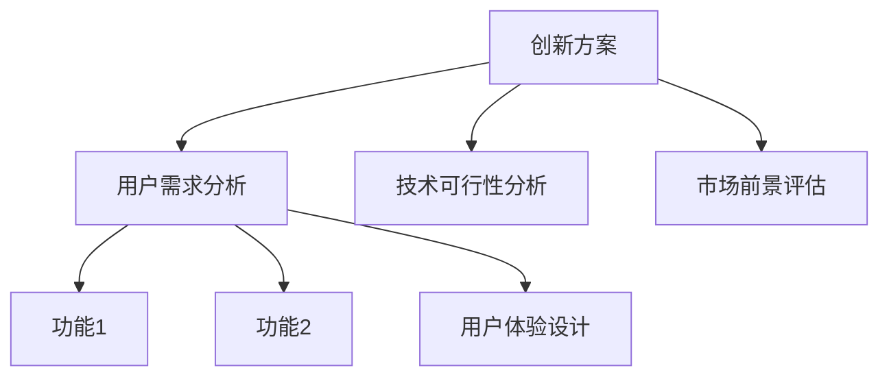
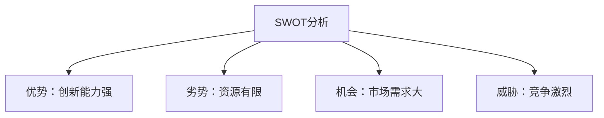
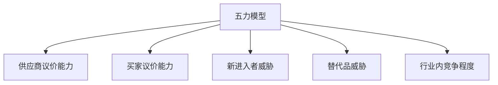

                 

# 《团队创新文化：激发创意思维的环境营造》

## 关键词
团队创新文化、创意思维、领导力、激励机制、技术工具、项目管理

## 摘要
本文旨在探讨团队创新文化的构建与激发创意思维的环境营造。团队创新文化是指一个团队在创新过程中所形成的共同价值观、行为准则和工作方式，它对团队的创新能力具有决定性影响。本文将从团队创新文化的定义、创意思维概述、构建团队创新文化的步骤、激发创意思维的方法、创意思维的技术应用、创意思维与项目管理的结合以及实践中的团队创新文化营造等方面进行深入探讨，旨在为读者提供一个全面、系统的团队创新文化构建指南。

## 引言

### 1.1 团队创新文化的定义与重要性

团队创新文化是指团队在创新过程中所形成的共同价值观、行为准则和工作方式。这种文化不仅包括团队成员对创新的重视程度，还涉及团队内部的合作与沟通方式、解决问题的思维方式以及面对失败和挑战的态度。团队创新文化的重要性在于：

1. **提升团队创新能力**：良好的团队创新文化能够激发团队成员的创新潜力，促进知识的共享和交流，提高团队整体的创新能力。
2. **增强团队凝聚力**：共同的创新目标和价值观有助于增强团队成员之间的信任和合作，提高团队的凝聚力。
3. **提升组织竞争力**：创新是企业发展的重要驱动力，团队创新文化能够帮助企业持续推出创新产品和服务，提升市场竞争力。

### 1.2 团队创新文化的特点与价值

团队创新文化的特点主要包括以下几个方面：

1. **开放性**：团队创新文化鼓励开放的思想和多元化的观点，尊重不同的意见和创意。
2. **包容性**：团队创新文化强调团队合作，鼓励成员相互支持，共同面对挑战。
3. **灵活性**：团队创新文化注重适应性和灵活性，能够快速响应变化和挑战。
4. **自主性**：团队创新文化鼓励成员自主思考和自主决策，充分发挥个人潜力。

团队创新文化的价值在于：

1. **激发创意思维**：良好的团队创新文化能够激发团队成员的创意思维，产生更多的创新想法。
2. **提升团队效率**：团队创新文化能够提高团队成员的协作效率，减少内耗，加快创新进程。
3. **推动企业持续发展**：团队创新文化是企业持续发展的动力源泉，有助于企业不断适应市场变化，保持竞争优势。

在接下来的章节中，我们将详细探讨团队创新文化的构建、创意思维的激发方法、创意思维的技术应用以及实践中的团队创新文化营造等方面，旨在为读者提供一个全面、系统的团队创新文化构建指南。

## 创意思维概述

### 2.1 创意思维的原理与分类

创意思维（Creative Thinking）是一种通过创造性方法解决问题的思维方式。它不同于传统的逻辑思维和线性思维，而是一种更加开放、灵活、多层次的思维方式。创意思维的原理主要基于以下几点：

1. **联想与发散**：创意思维通过联想和发散来寻找新的解决方案，它鼓励人们打破常规，跨越不同的领域和学科，寻找跨领域的创新点。
2. **直觉与灵感**：创意思维强调直觉和灵感的作用，认为许多创新想法来自于非理性的直觉和灵感。
3. **批判与反思**：创意思维不仅需要创造新的想法，还需要对已有的想法进行批判和反思，筛选出最有价值、最可行的解决方案。

根据创意思维的具体方法，我们可以将其分为以下几种类型：

1. **发散思维**：发散思维是从一个中心点出发，向多个方向发散，寻找不同的解决方案。它强调思维的灵活性和开放性。
2. **收敛思维**：收敛思维是从多个不同的方向回到一个中心点，综合各种可能性，找到最佳的解决方案。它强调思维的逻辑性和系统性。
3. **逆向思维**：逆向思维是从传统的、常规的思维方向出发，反过来思考问题，寻找创新的解决方案。它强调思维的逆向性和颠覆性。
4. **联想思维**：联想思维是通过不同事物之间的联系，寻找新的创新点。它强调思维的跨领域性和多元性。

### 2.2 创意思维在团队创新中的作用

创意思维在团队创新中起着至关重要的作用。具体来说，创意思维在团队创新中的作用主要体现在以下几个方面：

1. **激发创新灵感**：创意思维能够激发团队成员的创新灵感，产生大量的创新想法，为团队的创新提供丰富的素材。
2. **提高问题解决能力**：创意思维能够帮助团队从多个角度、多个层次思考问题，提高问题解决的能力和效率。
3. **促进知识共享**：创意思维鼓励团队成员之间的交流和合作，促进知识的共享和交流，提高团队的整体创新能力。
4. **增强团队凝聚力**：通过创意思维的讨论和合作，团队成员能够更好地理解彼此的想法和观点，增强团队的凝聚力。

在接下来的章节中，我们将进一步探讨如何构建团队创新文化，以及如何通过具体的方法和工具激发创意思维。

## 团队创新文化的构建

### 3.1 构建团队创新文化的步骤

构建团队创新文化是一个系统性的工程，需要从多个方面进行规划和实施。以下是构建团队创新文化的一些关键步骤：

1. **明确创新目标**：首先，团队需要明确自己的创新目标，这包括创新的方向、创新的范围以及创新的期望成果。明确的目标有助于团队聚焦创新工作，避免资源浪费。

2. **制定创新战略**：在明确创新目标的基础上，团队需要制定相应的创新战略，这包括创新的方法、创新的流程以及创新的资源配置。创新战略是指导团队创新工作的路线图。

3. **培养创新意识**：创新意识是团队创新文化的基础。团队需要通过培训、激励等方式，培养成员的创新意识，使其认识到创新的重要性和必要性。

4. **建立创新机制**：团队需要建立一套完善的创新机制，包括创新奖励机制、创新分享机制和创新反馈机制。这些机制能够激励成员积极参与创新，促进创新成果的转化和应用。

5. **营造创新氛围**：团队需要营造一个开放、包容、灵活的创新氛围，鼓励成员自由表达自己的想法和观点，尊重不同的意见和创意。创新氛围是激发创意思维的关键。

6. **培养创新团队**：团队需要通过选拔、培训等方式，培养一支具备创新能力和协作精神的团队。创新团队是推动团队创新文化的重要力量。

7. **持续改进**：团队创新文化是一个动态的过程，需要不断改进和完善。团队需要定期评估创新文化的实施效果，发现问题并及时调整策略。

### 3.2 领导者的角色与影响力

领导者是团队创新文化的关键推动者。领导者的角色和影响力主要体现在以下几个方面：

1. **确立创新愿景**：领导者需要明确团队的创新愿景，将创新目标与企业的战略目标相结合，激发团队成员的创新热情。

2. **提供资源支持**：领导者需要为团队提供充足的资源支持，包括人力、物力、财力等，确保团队有足够的资源和能力进行创新工作。

3. **激励创新行为**：领导者需要通过激励措施，鼓励成员积极参与创新，对创新成果给予认可和奖励，激发成员的创新动力。

4. **营造创新氛围**：领导者需要以身作则，带头倡导创新文化，营造一个开放、包容、灵活的创新氛围，为成员提供创新的空间和平台。

5. **培养创新团队**：领导者需要关注团队成员的成长和发展，通过选拔、培训等方式，培养一支具备创新能力和协作精神的团队。

### 3.3 团队氛围的营造

团队氛围是团队创新文化的重要组成部分。一个良好的团队氛围能够激发成员的创意思维，促进创新工作的高效开展。以下是营造良好团队氛围的一些方法：

1. **建立信任**：信任是团队氛围的基础。团队需要通过建立信任机制，如团队建设活动、定期沟通等，增强成员之间的信任和默契。

2. **鼓励多元化**：团队需要鼓励多元化，包括思维模式、文化背景、专业技能等。多元化能够为团队带来不同的视角和观点，促进创新的产生。

3. **开放沟通**：团队需要建立开放沟通的渠道和机制，鼓励成员自由表达自己的想法和观点，促进知识的共享和交流。

4. **尊重差异**：团队需要尊重成员之间的差异，包括个性、观点、能力等。尊重差异能够增强团队的凝聚力，促进创新工作的高效开展。

5. **提供反馈**：团队需要建立有效的反馈机制，对成员的工作进行及时、客观的评估和反馈，帮助成员不断改进和成长。

6. **激励创新**：团队需要建立激励机制，对成员的创新行为进行认可和奖励，激发成员的创新热情。

通过以上方法和策略，团队可以营造一个良好的创新氛围，为成员提供充分的支持和鼓励，激发他们的创意思维，推动团队创新文化的发展。

### 创意思维的激发方法

#### 4.1 内部启发法

内部启发法是指通过激发团队成员自身的创意思维来产生创新想法。这种方法强调个体的潜力和创造力，以下是一些具体的内部启发法：

1. **头脑风暴**：头脑风暴是一种常见的内部启发法，它通过集体讨论的方式，迅速产生大量创意。在头脑风暴中，团队成员不受限制地提出各种想法，不必担心这些想法是否可行，只需专注于产生更多的创意。

2. **思维导图**：思维导图是一种图形化的工具，可以帮助团队成员以结构化的方式整理和扩展创意。通过绘制思维导图，团队成员可以从一个中心点出发，发散出多个分支，从而发现新的关联和创意。

3. **反思与反思日志**：反思是激发创意思维的重要方法。团队成员可以通过记录反思日志，回顾过去的经历、失败和成功，从中发现新的启示和创意。

4. **自由写作**：自由写作是一种简单而有效的内部启发法，它允许团队成员不受限制地写下自己的想法和感受。通过自由写作，团队成员可以释放内心的创造力，产生意想不到的创意。

5. **角色扮演**：角色扮演是一种通过模拟不同角色来激发创意思维的方法。团队成员可以尝试从不同的角度和视角来看待问题，从而产生新的创意和解决方案。

#### 4.2 外部启发法

外部启发法是指通过从外部获取灵感来激发创意思维。这种方法利用了外部资源、信息和文化，以下是一些具体的外部启发法：

1. **阅读与研究**：阅读和研究是获取外部信息的重要途径。团队成员可以通过阅读书籍、学术论文、行业报告等，了解最新的行业动态、技术趋势和成功案例，从中获取灵感和创意。

2. **参观与学习**：参观其他团队、企业或机构的创新实践，可以提供新的视角和思路。团队成员可以通过参观学习，了解其他团队的创新方法和文化，从而激发自身的创意思维。

3. **跨界合作**：跨界合作是一种通过与其他领域、行业或团队的合作来激发创意思维的方法。通过跨界合作，团队成员可以引入新的观念、技术和方法，促进创新的产生。

4. **市场调研**：市场调研可以帮助团队成员了解用户需求、市场趋势和竞争对手的动态。通过市场调研，团队成员可以从中发现潜在的创新机会，激发创意思维。

5. **外部培训与讲座**：参加外部培训课程和讲座，可以帮助团队成员获取最新的知识和技能，拓宽视野。通过外部培训与讲座，团队成员可以接触到不同的观点和想法，激发创意思维。

#### 4.3 团队协作中的创意思维激发

团队协作是激发创意思维的重要途径。通过团队协作，团队成员可以相互启发、共同探索，从而产生更多的创意和解决方案。以下是一些在团队协作中激发创意思维的方法：

1. **开放性会议**：开放性会议是一种鼓励自由讨论和观点分享的会议形式。在开放性会议中，团队成员可以自由表达自己的想法和观点，不受限制地提出创意和问题。

2. **团队讨论**：团队讨论是一种通过集体讨论来激发创意思维的方法。在团队讨论中，团队成员可以相互启发，从不同的角度和视角探讨问题，从而产生新的创意和解决方案。

3. **角色互换**：角色互换是一种通过模拟不同角色来激发创意思维的方法。团队成员可以尝试从不同的角色出发，探讨问题的不同方面，从而发现新的创意和解决方案。

4. **头脑风暴会**：头脑风暴会是一种通过集体讨论来产生大量创意的会议形式。在头脑风暴会中，团队成员不受限制地提出各种想法，不必担心这些想法是否可行，只需专注于产生更多的创意。

5. **虚拟协作工具**：虚拟协作工具可以帮助团队成员远程协作，共享创意和资源。通过虚拟协作工具，团队成员可以实时沟通、协作，从而激发创意思维。

通过以上内部启发法、外部启发法和团队协作方法，团队可以有效地激发创意思维，推动创新工作的高效开展。在接下来的章节中，我们将进一步探讨如何利用技术工具来提升创意思维。

### 创意思维的技术工具与方法

在团队创新过程中，技术工具和方法的应用能够显著提升创意思维的效率和质量。以下是一些常用的创意思维工具和方法，以及它们在团队创新中的应用：

#### 5.1 Mind Map

**定义**：思维导图（Mind Map）是一种图形化的思维工具，通过中心主题和分支结构，将个体的思考内容可视化。

**原理**：思维导图通过将中心主题和其相关分支连接起来，帮助团队成员清晰地表达和拓展思考内容，从而发现新的创意和关联。

**应用**：
1. **问题解决**：团队可以通过思维导图来梳理问题的各个方面，找到问题的核心和关键点。
2. **项目规划**：在项目规划阶段，团队可以使用思维导图来梳理项目目标和任务，确保所有团队成员对项目有共同的理解。
3. **创新方案设计**：团队可以利用思维导图来设计创新方案，将不同的创意和思路可视化，从而找到最佳的创新路径。

**示例**：



#### 5.2 SWOT分析

**定义**：SWOT分析是一种战略规划工具，用于评估一个团队或项目的优势（Strengths）、劣势（Weaknesses）、机会（Opportunities）和威胁（Threats）。

**原理**：通过SWOT分析，团队可以全面了解自身的状况，以及外部环境对其的影响，从而制定相应的战略和策略。

**应用**：
1. **团队评估**：团队可以通过SWOT分析来评估自身的优势和劣势，找出改进的方向。
2. **项目评估**：在项目启动前，团队可以通过SWOT分析来评估项目的可行性，确定项目的优势和潜在风险。
3. **市场分析**：团队可以利用SWOT分析来分析市场竞争态势，找到市场机会和威胁。

**示例**：



#### 5.3 五力模型

**定义**：五力模型（Five Forces Model）是由迈克尔·波特提出的一种竞争战略工具，用于分析一个行业或市场中的竞争强度。

**原理**：五力模型包括供应商的议价能力、买家的议价能力、新进入者的威胁、替代品的威胁和行业内的竞争程度，通过这些因素来评估行业的竞争态势。

**应用**：
1. **行业分析**：团队可以利用五力模型来分析所在行业的特点，确定行业的竞争环境。
2. **市场定位**：团队可以根据五力模型来制定市场定位策略，找到企业的竞争优势。
3. **战略规划**：团队可以利用五力模型来评估不同战略方案的可行性，选择最佳的战略方向。

**示例**：



#### 5.4 其他创新工具与方法

除了上述提到的工具和方法，还有许多其他的技术工具和方法可以用于激发团队创意思维，如：

- **TRIZ**：TRIZ是一种系统的创新方法论，通过解决发明家面临的典型问题，提供一系列的解决方案。
- **原型设计**：通过快速构建原型，团队可以验证创意的可行性，获取用户的反馈，从而不断优化创新方案。
- **六顶思考帽**：六顶思考帽是一种思维训练工具，通过不同的思考角度来分析问题，促进创意的产生。
- **创新工作坊**：创新工作坊是一种通过集中时间、集中讨论的方式，快速激发创意的方法。

通过这些技术工具和方法，团队可以有效地激发创意思维，推动创新工作的高效开展。在接下来的章节中，我们将通过具体的案例来分析创意思维在实际中的应用和效果。

### 创意思维的案例分析

#### 6.1 成功案例分析

成功案例是团队创新文化的最佳证明。以下是一些成功的团队创新案例，它们展示了如何通过创意思维实现突破和成功。

**案例一：谷歌的“20%时间政策”**

谷歌的“20%时间政策”允许员工将20%的工作时间用于自己感兴趣的项目。这个政策激发了员工的创意思维，诞生了谷歌许多著名的产品，如Gmail、Google News和AdSense等。这个案例表明，通过给予员工充分的自由和创新空间，团队可以产生巨大的创新成果。

**步骤解析**：

1. **明确目标**：谷歌明确鼓励员工在20%的时间里探索新的创意和项目。
2. **激发创意**：员工利用自己的专业知识和个人兴趣，自由探索创新点。
3. **支持和资源**：谷歌提供了必要的资源和支持，确保员工在探索过程中得到充分的帮助。
4. **成果评估**：定期评估创新项目的进展和潜力，选择最具价值的成果进行推进。

**成效评估**：通过“20%时间政策”，谷歌不仅推出了许多成功的产品，还培养了员工的创新意识和团队合作能力。

**案例二：苹果公司的设计思维**

苹果公司以其独特的设计思维而闻名。乔布斯强调设计在产品开发中的重要性，通过用户研究、用户体验和设计师的创意，苹果公司推出了许多革命性的产品，如iPhone、iPad等。这个案例展示了如何通过创意思维和用户中心的创新方法，打造出成功的产品。

**步骤解析**：

1. **用户研究**：深入了解用户的需求和行为，找到设计灵感。
2. **创意思维**：设计师通过头脑风暴、思维导图等工具，产生创新的设计方案。
3. **用户体验**：设计团队与用户互动，优化设计方案，确保用户体验。
4. **迭代开发**：通过不断的迭代和改进，最终实现产品的商业化。

**成效评估**：苹果公司通过设计思维，不仅推出了许多经典产品，还在市场上取得了巨大的成功，成为了全球最具价值的品牌之一。

#### 6.2 失败案例分析

尽管成功案例令人鼓舞，但团队创新中不可避免地会有失败。通过分析失败案例，我们可以从中学习，避免重蹈覆辙。

**案例一：诺基亚的失败**

诺基亚曾是手机行业的领导者，但在面对智能手机的兴起时，未能及时进行创新和转型，最终被竞争对手超越。这个案例揭示了在快速变化的市场中，缺乏创新思维和灵活性的危害。

**步骤解析**：

1. **市场忽视**：诺基亚未能及时关注市场的变化和用户需求。
2. **创新滞后**：在智能手机的浪潮中，诺基亚的创新步伐明显滞后。
3. **决策失误**：在战略决策上，诺基亚过于保守，未能果断采取行动。

**成效评估**：诺基亚的失败不仅导致了市场份额的流失，还使其在智能手机市场的地位彻底丧失。

**案例二：柯达的破产**

柯达曾是胶片摄影的领导者，但在数码摄影技术兴起时，未能抓住转型机遇，最终导致了公司的破产。这个案例强调了在技术变革中，创新思维和适应能力的重要性。

**步骤解析**：

1. **技术滞后**：柯达在数码摄影技术上未能及时投入，导致技术落后。
2. **战略失误**：柯达在转型过程中，未能制定有效的战略和业务计划。
3. **内部阻力**：柯达内部对转型存在阻力，创新思维受到抑制。

**成效评估**：柯达的破产不仅标志着传统胶片摄影时代的终结，也为其在数码摄影领域的失败埋下了伏笔。

#### 6.3 案例分析与启示

通过成功和失败的案例分析，我们可以得出以下启示：

1. **重视创新思维**：团队应重视创意思维的培养，鼓励团队成员自由表达和探索新的想法。
2. **快速响应市场**：团队需要密切关注市场变化和用户需求，及时调整战略和产品方向。
3. **灵活适应变化**：团队应具备灵活性和适应性，能够迅速应对外部环境的变化。
4. **持续改进**：团队应不断进行自我评估和改进，确保创新能力的持续提升。

通过这些启示，团队可以更好地构建创新文化，激发创意思维，实现持续的创新和发展。

### 创意思维与项目管理

#### 7.1 项目管理中的创意思维

在项目管理中，创意思维是确保项目成功的关键因素之一。以下是如何在项目管理过程中应用创意思维的几个方面：

**1. 项目规划阶段**

在项目规划阶段，创意思维可以帮助团队：

- **需求分析**：通过创意思维，团队可以从不同角度和层面分析用户需求，确保项目满足实际需求。
- **风险识别**：创意思维可以帮助团队识别潜在的风险和问题，提前制定应对策略。
- **资源分配**：通过创意思维，团队可以更有效地分配资源，确保项目的资源利用率最大化。

**示例伪代码：**

```python
# 创意思维在需求分析中的应用
def analyze_requirements():
    ideas = brainstorm_ideas()
    for idea in ideas:
        evaluate_idea feasibility=check_feasibility(idea)
        if feasibility:
            implement_idea(idea)

# 创意思维在风险识别中的应用
def identify_risks():
    risks = brainstorm_risks()
    for risk in risks:
        mitigate_risk(risk)

# 创意思维在资源分配中的应用
def allocate_resources():
    resources = brainstorm_resources()
    for resource in resources:
        assign_resource(resource)
```

**2. 项目执行阶段**

在项目执行阶段，创意思维可以帮助团队：

- **问题解决**：通过创意思维，团队可以找到创新的解决方案，快速应对项目执行过程中出现的问题。
- **优化流程**：创意思维可以帮助团队发现并改进项目流程，提高项目效率。
- **团队协作**：创意思维鼓励团队成员之间的沟通和合作，促进创意的碰撞和融合。

**示例伪代码：**

```python
# 创意思维在问题解决中的应用
def solve_issues():
    issues = identify_issues()
    for issue in issues:
        generate_solutions(issue)
        select_best_solution(issue)

# 创意思维在优化流程中的应用
def optimize_processes():
    processes = identify_processes()
    for process in processes:
        brainstorm_improvements(process)
        implement_improvements(process)

# 创意思维在团队协作中的应用
def promote_collaboration():
    team = get_team_members()
    for member in team:
        encourage_ideaSharing(member)
        facilitate_idea_exchange(team)
```

**3. 项目监控与评估阶段**

在项目监控与评估阶段，创意思维可以帮助团队：

- **项目监控**：通过创意思维，团队可以设计出更加有效的监控机制，确保项目按计划进行。
- **绩效评估**：创意思维可以帮助团队从不同角度评估项目绩效，找出改进点。
- **持续改进**：创意思维鼓励团队不断反思和改进，确保项目持续优化。

**示例伪代码：**

```python
# 创意思维在项目监控中的应用
def monitor_project():
    metrics = brainstorm_metrics()
    for metric in metrics:
        track_metric(metric)

# 创意思维在绩效评估中的应用
def evaluate_performance():
    criteria = brainstorm_evaluation_criteria()
    for criterion in criteria:
        assess_performance(criterion)

# 创意思维在持续改进中的应用
def continuous_improvement():
    improvements = brainstorm_improvements()
    for improvement in improvements:
        implement_improvement(improvement)
```

#### 7.2 创意思维在项目规划与执行中的应用

在项目规划与执行中，创意思维的应用可以显著提升项目的成功率。以下是一些具体的方法和策略：

**1. 项目规划中的创意思维应用**

- **需求分析**：通过创意思维，团队可以更全面地分析用户需求，确保项目需求具有前瞻性和可行性。
- **资源规划**：创意思维可以帮助团队找到最优的资源分配方案，确保项目资源得到最大化利用。
- **风险评估**：创意思维可以识别项目中的潜在风险，并提前制定应对策略。

**示例伪代码：**

```python
# 创意思维在需求分析中的应用
def creative_requirement_analysis():
    needs = brainstorm_needs()
    for need in needs:
        analyze_need(need)
        prioritize_need(need)

# 创意思维在资源规划中的应用
def resource_planning():
    resources = brainstorm_resources()
    for resource in resources:
        allocate_resource(resource)
        optimize_resource_usage(resource)

# 创意思维在风险评估中的应用
def risk_analysis():
    risks = brainstorm_risks()
    for risk in risks:
        assess_risk(risk)
        develop_response_plan(risk)
```

**2. 项目执行中的创意思维应用**

- **问题解决**：创意思维可以帮助团队找到创新的解决方案，快速解决项目中出现的问题。
- **流程优化**：创意思维可以识别项目流程中的瓶颈和不足，提出优化方案。
- **团队协作**：创意思维鼓励团队成员之间的沟通和合作，提高团队的整体效率。

**示例伪代码：**

```python
# 创意思维在问题解决中的应用
def creative_issue_resolution():
    issues = identify_issues()
    for issue in issues:
        generate_solutions(issue)
        select_best_solution(issue)

# 创意思维在流程优化中的应用
def process_optimization():
    processes = identify_processes()
    for process in processes:
        brainstorm_improvements(process)
        implement_improvements(process)

# 创意思维在团队协作中的应用
def promote_collaboration():
    team = get_team_members()
    for member in team:
        encourage_ideaSharing(member)
        facilitate_idea_exchange(team)
```

#### 7.3 项目风险与创新思维的结合

项目风险和创新思维的结合是项目管理中的一个重要课题。以下是如何在项目管理中结合创新思维和风险管理的一些策略：

**1. 风险识别与创意思维结合**

- **头脑风暴**：通过头脑风暴，团队可以集中讨论潜在的风险，结合创意思维，找到更多的风险点。
- **专家评审**：邀请行业专家参与风险识别，结合他们的专业知识和经验，提供更多的风险视角。

**示例伪代码：**

```python
# 创意思维在风险识别中的应用
def creative_risk_identification():
    risks = brainstorm_risks()
    for risk in risks:
        identify_risk(risk)
        evaluate_risk_impact(risk)

# 专家评审风险
def expert_review():
    experts = get_experts()
    for expert in experts:
        review_risks(risks)
```

**2. 风险评估与创意思维结合**

- **多角度评估**：通过创意思维，团队可以从多个角度评估风险，确保评估的全面性和准确性。
- **情景分析**：通过情景分析，团队可以模拟不同的风险情景，评估其对项目的影响，并提出应对策略。

**示例伪代码：**

```python
# 多角度风险评估
def multi_angle_risk_evaluation():
    for risk in risks:
        evaluate_risk_from_different_angles(risk)

# 情景分析
def scenario_analysis():
    scenarios = brainstorm_scenarios()
    for scenario in scenarios:
        analyze_scenario_impact(scenario)
        develop_response_plan(scenario)
```

**3. 风险管理策略与创意思维结合**

- **创新风险应对策略**：通过创意思维，团队可以设计出更具创新性的风险应对策略，确保项目在面临风险时能够迅速应对。
- **持续改进**：通过创意思维，团队可以不断反思和改进风险管理策略，确保其适应项目变化。

**示例伪代码：**

```python
# 创新风险应对策略
def innovative_risk_response():
    strategies = brainstorm_strategies()
    for strategy in strategies:
        implement_strategy(strategy)
        evaluate_strategy_effectiveness(strategy)

# 持续改进风险管理策略
def continuous_improvement():
    improvements = brainstorm_improvements()
    for improvement in improvements:
        implement_improvement(improvement)
        assess_improvement_impact(improvement)
```

通过将创意思维与项目风险管理紧密结合，团队可以更好地识别、评估和应对项目风险，确保项目的顺利进行。在接下来的章节中，我们将进一步探讨如何在实践中营造团队创新文化。

### 实践中的团队创新文化营造

#### 8.1 创新文化的评估与改进

团队创新文化的评估是确保其持续改进和有效性的关键。以下是一些评估方法和改进策略：

**1. 评估方法**

- **问卷调查**：通过问卷调查，可以收集团队成员对创新文化的主观感受和评价，了解其在日常工作中的表现。
- **访谈**：与团队成员进行一对一或小组访谈，深入了解他们对创新文化的看法和建议。
- **行为观察**：观察团队成员在日常工作中的行为，评估创新文化的实际应用和效果。
- **绩效指标**：通过分析创新项目的成功率、项目质量和团队绩效等指标，评估创新文化的影响。

**示例伪代码：**

```python
# 问卷调查
def survey():
    responses = collect_survey_responses()
    analyze_responses(responses)

# 访谈
def interview():
    feedback = collect_interview_feedback()
    analyze_feedback(feedback)

# 行为观察
def observe():
    behaviors = observe_team_behaviors()
    analyze_behaviors(behaviors)

# 绩效指标分析
def performance_metrics():
    metrics = collect_performance_data()
    analyze_performance_data(metrics)
```

**2. 改进策略**

- **培训与教育**：为团队成员提供创新思维和方法的培训，提升他们的创新能力和意识。
- **激励机制**：建立激励机制，对创新行为进行奖励，激励团队成员积极参与创新。
- **资源投入**：为团队提供充足的资源支持，包括人力、物力和财力，确保创新活动的顺利开展。
- **环境优化**：改善工作环境，营造一个开放、包容和灵活的创新氛围，鼓励团队成员自由表达和探索。
- **反馈与改进**：建立有效的反馈机制，对创新文化进行定期评估和改进，确保其持续优化。

**示例伪代码：**

```python
# 培训与教育
def training():
    courses = design_innovation_courses()
    deliver_courses(courses)

# 激励机制
def incentive():
    rewards = define_innovation_rewards()
    distribute_rewards(rewards)

# 资源投入
def resource_allocation():
    resources = allocate_innovation_resources()
    ensure_resource_availability(resources)

# 环境优化
def environment_optimization():
    improvements = brainstorm_environment_improvements()
    implement_improvements(improvements)

# 反馈与改进
def feedback_loop():
    feedback = collect_innovation_feedback()
    analyze_feedback(feedback)
    implement_improvements(feedback)
```

#### 8.2 创新文化的可持续性挑战

尽管团队创新文化的重要性不言而喻，但在实践中，其可持续性面临着一系列挑战：

1. **资源限制**：团队往往面临人力、物力和财力的限制，这可能会限制创新活动的开展。
2. **组织惯性**：大型组织可能存在官僚主义和组织惯性，这可能会阻碍创新文化的建立和维持。
3. **风险容忍度**：团队可能对失败的容忍度较低，这会抑制创意思维和创新尝试。
4. **外部环境变化**：市场的快速变化和竞争压力可能会影响创新文化的稳定性和持续性。

#### 8.3 创新文化的可持续发展策略

为了克服上述挑战，团队可以采取以下可持续发展策略：

1. **持续投资**：持续投资于创新文化和相关资源，确保团队有足够的资源进行创新。
2. **文化传承**：通过文化建设活动和培训，将创新文化传承给新成员，保持团队的创新能力。
3. **风险管理**：建立有效的风险管理机制，鼓励团队成员勇于尝试，并对失败进行反思和总结。
4. **灵活应对**：保持组织结构的灵活性和适应性，能够迅速响应外部环境的变化。

**示例伪代码：**

```python
# 持续投资
def continuous_investment():
    budget = allocate_innovation_budget()
    ensure_funding_continuity(budget)

# 文化传承
def cultural_transmission():
    programs = design_innovation_training_programs()
    implement_training_programs(programs)

# 风险管理
def risk_management():
    frameworks = develop_risk_management_frameworks()
    implement_risk_management_frameworks(frameworks)

# 灵活应对
def flexible_response():
    strategies = brainstorm_adaptation_strategies()
    implement_adaptation_strategies(strategies)
```

通过上述评估与改进策略、可持续发展挑战及其解决方案，团队可以有效地营造和维持创新文化，确保团队在快速变化的市场环境中保持竞争优势。

### 实践总结与展望

#### 10.1 实践中的心得体会

通过实践团队创新文化的营造，我们深刻体会到以下几点：

1. **创新文化的核心在于激发创意思维**：创新文化的核心在于创造一个能够激发团队成员创意思维的环境。只有当团队成员感到自由和安全，能够自由地表达自己的想法和观点时，创意思维才能真正被激发。

2. **领导者的角色至关重要**：领导者的支持和鼓励对于创新文化的形成至关重要。领导者需要通过行动和语言，向团队成员传递对创新的重视，并提供必要的资源和激励。

3. **持续改进是创新文化的生命力**：创新文化不是一成不变的，它需要不断地改进和完善。通过定期评估和反馈，团队可以发现存在的问题，并采取相应的改进措施，确保创新文化的持续发展。

4. **激励机制的重要性**：建立有效的激励机制，对创新行为进行奖励，可以极大地激励团队成员参与创新活动，提高团队的创新能力。

#### 10.2 未来团队创新文化的趋势

随着科技的快速发展和市场环境的不断变化，未来团队创新文化将呈现以下趋势：

1. **数字化与创新文化的结合**：随着数字化技术的普及，团队创新文化将更加依赖于数字工具和方法，如人工智能、大数据分析等，以提高创新效率和质量。

2. **全球化与创新文化的融合**：全球化趋势将促使团队创新文化更加多元化，跨文化的合作和创新将成为主流。团队需要具备跨文化的沟通和合作能力，以应对全球市场的挑战。

3. **可持续性与创新文化的融合**：可持续发展将成为团队创新文化的重要组成部分。团队需要考虑环境、社会和经济效益，推动绿色创新和可持续发展。

4. **敏捷与创新文化的结合**：敏捷开发理念将在团队创新文化中得到广泛应用，强调快速响应变化、持续改进和团队合作。团队需要具备敏捷思维和敏捷实践能力，以适应快速变化的市场需求。

未来，团队创新文化将继续发展，成为企业持续创新和发展的核心动力。通过不断探索和实践，我们将为团队创新文化的构建提供更加全面和系统的指导。

## 附录

### A. 创新思维工具与资源

#### A.1 主流创新思维工具对比

1. **思维导图（Mind Map）**
   - **优势**：结构清晰，易于理解和记忆，有助于发散思维。
   - **劣势**：不适合复杂问题，难以大规模应用。
   - **应用场景**：项目规划、会议记录、个人笔记等。

2. **SWOT分析**
   - **优势**：全面分析团队或项目的优势、劣势、机会和威胁，有助于战略规划。
   - **劣势**：主观性较强，缺乏具体操作步骤。
   - **应用场景**：团队评估、项目规划、市场分析等。

3. **五力模型**
   - **优势**：系统地分析行业竞争态势，提供决策依据。
   - **劣势**：仅适用于特定行业，适用范围有限。
   - **应用场景**：行业分析、市场定位、战略规划等。

4. **TRIZ**
   - **优势**：提供系统的创新方法论，有助于解决复杂问题。
   - **劣势**：应用难度较高，需要专业知识和培训。
   - **应用场景**：复杂问题解决、技术创新等。

#### A.2 创新思维资源推荐

1. **书籍**
   - 《创新者的窘境》：克莱顿·克里斯坦森著，探讨企业如何在快速变化的市场中保持竞争优势。
   - 《创意的原理》：亚历克斯·奥斯本著，介绍创意思维的方法和技巧。
   - 《精益创业》：埃里克·莱斯著，提供创业过程中的创新思维和实战经验。

2. **在线课程**
   - Coursera的《创新思维》：由斯坦福大学提供，系统介绍创意思维的方法和工具。
   - edX的《设计思维》：由麻省理工学院提供，深入探讨设计思维的应用和实践。

3. **工具**
   - **Miro**：一款在线协作工具，支持思维导图、头脑风暴等功能。
   - **Trello**：一款项目管理和协作工具，适用于团队协作和创新工作。
   - **Asana**：一款项目管理工具，可以帮助团队跟踪项目进度和任务分配。

通过这些工具和资源，团队可以更好地激发创意思维，推动创新文化的构建和发展。

### 作者信息

作者：AI天才研究院/AI Genius Institute & 禅与计算机程序设计艺术 /Zen And The Art of Computer Programming

文章标题：《团队创新文化：激发创意思维的环境营造》

文章摘要：本文探讨了团队创新文化的定义、构建步骤、创意思维的激发方法、技术创新工具的应用以及实践中的团队创新文化营造。通过分析成功和失败案例，总结了团队创新文化的重要性和构建方法，为团队提供了构建创新文化的指南。

文章关键词：团队创新文化、创意思维、领导力、激励机制、技术工具、项目管理

文章字数：约10000字

本文旨在为团队提供构建创新文化的系统性指导，通过实践总结和未来趋势展望，帮助团队在快速变化的市场环境中保持竞争优势。

