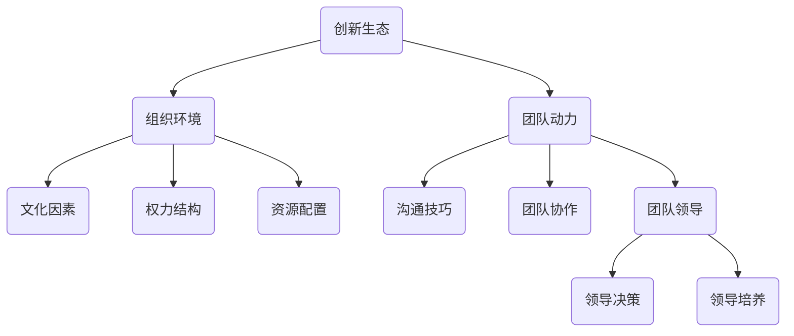

                 

### 文章标题

《团队创新生态：营造支持创新的组织环境》

### 关键词

- 团队创新
- 组织环境
- 创新生态
- 团队动力
- 沟通技巧

### 摘要

本文旨在探讨团队创新生态的构建与维护，分析创新生态的概念、指标、构建原则，以及组织环境与团队动力的关系。通过深入解析团队协作、沟通技巧和领导者的角色，本文还将介绍创新实践与案例研究，并探讨创新生态的可持续性与未来发展趋势。文章以理论结合实践的方式，为读者提供营造支持创新组织环境的方法和策略。

## 《团队创新生态：营造支持创新的组织环境》目录大纲

### 第一部分：创新生态的概述

#### 1. 引言

- 创新的重要性
- 书籍的目标和结构

#### 2. 创新生态的概念与模型

- 创新生态的定义
- 创新生态的关键组成部分
- 创新生态与传统组织文化的比较

#### 3. 创新生态的指标与测量

- 创新生态的评价指标
- 创新能力的测量方法
- 组织创新氛围的评估

#### 4. 创新生态的构建原则

- 创新生态的构建过程
- 创新生态的营造策略
- 创新生态的优化与调整

### 第二部分：组织环境与团队动力

#### 5. 组织环境对创新的影响

- 文化因素对创新的作用
- 权力结构对创新的影响
- 资源配置与支持

#### 6. 团队动力的构建与维持

- 团队动力的定义与类型
- 团队成员的角色与互动
- 团队动力的激励与引导

#### 7. 团队协作与沟通技巧

- 沟通在创新生态中的作用
- 团队协作的最佳实践
- 跨部门合作与协调

#### 8. 团队领导者的角色与职责

- 团队领导者的角色定义
- 领导者的创新思维与决策
- 团队领导者的培养与成长

### 第三部分：创新实践与案例研究

#### 9. 创新项目的管理与实施

- 创新项目的生命周期管理
- 创新项目的风险评估与控制
- 创新项目的资源分配与协调

#### 10. 创新案例研究

- 创新案例的选取标准
- 案例分析的方法与工具
- 案例研究的总结与启示

#### 11. 创新生态下的团队学习与成长

- 团队学习的概念与意义
- 团队成员的个人成长
- 团队学习与知识管理

#### 12. 创新生态的可持续性与挑战

- 创新生态的可持续性策略
- 创新生态的挑战与应对
- 创新生态的未来发展趋势

### 第四部分：附录与资源

#### 13. 附录

- 创新生态相关的理论模型
- 创新能力的评估工具与量表
- 创新实践的工具与方法

#### 14. 参考文献

- 本书引用的参考文献列表
- 推荐阅读书目与文献

#### 15. 资源

- 创新生态相关的在线资源
- 创新实践案例与经验分享平台

### 附录 A：创新生态核心概念与联系的 Mermaid 流程图



### 附录 B：创新核心算法原理讲解

#### 1. 创新思维模型

```plaintext
函数 Innovation(motivation, creativity, collaboration) {
  if (motivation > threshold && creativity > threshold && collaboration > threshold) {
    return successful_innovation;
  } else {
    return failed_attempt;
  }
}
```

### 附录 C：数学模型和数学公式

#### 1. 创新能力评估模型

$$
\text{InnovationScore} = \frac{\text{NewProducts}}{\text{TotalProducts}} \times 100\%
$$

#### 2. 创新成本效益分析

$$
\text{ROI} = \frac{\text{InnovationValue}}{\text{InnovationCost}} \times 100\%
$$

### 附录 D：项目实战

#### 1. 创新项目案例实现

**代码实现**

```python
# 初始化项目变量
project_name = "智能办公系统"
budget = 100000
team_size = 10

# 项目开发阶段
development_stage = "规划阶段"

# 开发流程
def develop_project(project_name, budget, team_size):
    print(f"项目 {project_name} 开发中，预算为 {budget}，团队规模为 {team_size}。")
    print(f"当前处于 {development_stage} 阶段。")

# 执行项目开发
develop_project(project_name, budget, team_size)
```

### 结论

本文通过系统性地分析团队创新生态的构建与维护，为组织营造支持创新的环境提供了理论基础和实践指导。在接下来的章节中，我们将深入探讨创新生态的概述，详细阐述其概念、模型、指标与测量，以及构建原则。通过这些内容，读者可以更好地理解团队创新生态的重要性，并为实际工作提供有益的参考。

## 创新的重要性

创新是推动组织发展的关键动力，对于企业的生存和繁荣至关重要。在当今快速变化的市场环境中，创新已经成为企业竞争力的核心要素。一个组织如果不能持续创新，将很难在激烈的竞争中保持优势。以下是创新的一些主要方面：

首先，创新能够提高企业的竞争力。通过不断创新，企业可以开发出更具竞争力的产品和服务，满足客户日益变化的需求。这种竞争优势有助于企业在市场中占据领先地位，吸引更多的客户和市场份额。

其次，创新可以提升企业的效率。通过引入新技术、新流程和新方法，企业可以优化运营流程，降低成本，提高生产效率。这不仅有助于企业更好地满足市场需求，还可以提高企业的盈利能力。

此外，创新还能够增强企业的灵活性和适应性。在快速变化的市场环境中，企业需要具备快速响应变化的能力。通过持续创新，企业可以更好地适应市场变化，快速调整战略和业务模式，以应对各种挑战。

最后，创新还能够促进企业的可持续发展。通过不断创新，企业可以不断改进产品和服务，减少资源消耗和环境污染，实现经济效益和环境效益的双赢。

总之，创新对于企业的重要性不言而喻。它不仅能够提高企业的竞争力、效率和适应性，还能够促进企业的可持续发展。因此，组织需要高度重视创新，将其作为企业发展的核心战略，努力营造一个支持创新的组织环境。

### 引言

创新是当今商业世界中不可或缺的元素，它不仅影响着企业的生存和发展，更是推动整个社会进步的重要动力。然而，要实现创新并非易事，它需要组织在文化、结构、资源等多方面进行系统性的变革。本文旨在深入探讨团队创新生态的构建与维护，旨在为组织提供一整套实用的方法和策略，以营造一个支持创新的环境。

首先，本文将介绍创新生态的概念与模型，解释其定义、组成部分以及与传统组织文化的区别。通过了解这些基础知识，读者可以更好地理解创新生态的基本原理，为后续章节的内容奠定基础。

接下来，我们将讨论创新生态的指标与测量方法，帮助组织评估自身的创新能力，并识别改进的方向。这些指标不仅包括创新成果的测量，还涵盖了组织内部创新氛围的评估。

随后，本文将探讨创新生态的构建原则，包括构建过程、营造策略和优化方法。这部分内容将提供具体的操作指南，帮助组织在实际工作中逐步打造一个支持创新的环境。

在第二部分，我们将重点讨论组织环境对创新的影响，分析文化因素、权力结构和资源配置如何影响创新。此外，本文还将详细介绍团队动力的构建与维持，包括团队动力的定义、团队成员的角色与互动，以及如何激励和引导团队动力。

第三部分将深入探讨团队协作与沟通技巧，强调沟通在创新生态中的作用，并分享最佳实践和跨部门合作的策略。团队领导者的角色与职责也是本部分的重要内容，我们将讨论领导者的创新思维与决策，以及如何培养和成长成为优秀的团队领导者。

接下来，我们将通过创新实践与案例研究，展示如何将理论应用到实际中。读者可以通过这些案例，了解创新项目的管理与实施、创新案例的分析方法以及团队学习与成长的方法。

最后，本文将总结创新生态的可持续性与挑战，探讨如何确保创新生态的持续发展，并应对可能出现的各种挑战。文章的结尾将提供附录与资源，包括创新生态相关的理论模型、评估工具、实践方法，以及推荐阅读的参考文献和在线资源。

通过本文的系统探讨，读者将能够全面理解团队创新生态的重要性，掌握构建和维护创新生态的方法，并为实际工作提供有价值的参考。

### 创新生态的概念与模型

创新生态是指在一个组织中，创新活动和创新过程所依赖的内外部环境、资源、机制和要素的总体构成。它不仅仅是一个简单的创新活动集合，而是一个复杂而动态的系统，涵盖了组织从创新思维到创新实践的各个环节。为了更好地理解创新生态，我们可以从以下几个关键组成部分进行分析。

首先，**创新文化**是创新生态的核心。创新文化是一种以创新为核心价值观的组织氛围，它鼓励员工勇于尝试、接受失败，并对创新成果进行积极反馈。创新文化的形成需要组织的领导层树立正确的创新观念，并通过一系列制度和文化活动来强化这种氛围。

其次，**创新资源**是创新生态的重要基础。这些资源包括资金、技术、人才和设备等，是推动创新活动顺利进行的基本保障。一个良好的创新资源管理机制能够确保资源的有效配置和合理利用，从而提高创新的效率。

第三，**创新机制**是创新生态的关键支撑。这些机制包括项目管理、风险评估、决策流程等，是保障创新过程顺利进行的重要手段。良好的创新机制能够降低创新过程中的不确定性和风险，提高创新的成功率。

第四，**创新网络**是创新生态的重要组成部分。创新网络是指组织内部和外部的创新合作网络，包括供应商、客户、合作伙伴和竞争对手等。这些网络为组织提供了丰富的创新资源和信息，有助于组织快速响应市场需求和行业变化。

最后，**创新人才**是创新生态的核心驱动力。创新人才不仅具备丰富的专业知识和技能，还具备创新思维和团队协作能力。一个组织要建立良好的创新生态，必须重视人才的培养和激励，为创新人才提供良好的发展环境和机会。

在理解了创新生态的基本组成部分后，我们可以进一步探讨创新生态与传统组织文化的区别。传统组织文化通常注重稳定性和效率，强调流程和规则，而创新生态则更加注重灵活性和适应性。创新生态强调开放和包容的文化氛围，鼓励员工进行实验和探索，允许失败并从中吸取教训。

此外，创新生态还强调跨部门和跨领域的合作，打破传统的部门界限，促进知识共享和资源整合。这种跨领域的合作有助于激发创新火花，产生意想不到的创新成果。

在组织结构方面，创新生态与传统组织文化也有所不同。传统组织结构通常较为僵硬，层级分明，决策流程较长。而创新生态则更加扁平化，决策权限下放，鼓励基层员工参与决策和创新过程。这种结构有助于缩短创新周期，提高创新效率。

综上所述，创新生态是一个由多方面因素构成的综合体系，它要求组织在文化、资源、机制、网络和人才等方面进行全面改革和优化，以营造一个支持创新的环境。创新生态与传统组织文化相比，更加注重灵活性和适应性，强调跨部门合作和知识共享，有助于组织在快速变化的市场环境中保持竞争优势。

### 创新生态的指标与测量

在构建和维护创新生态的过程中，评估和测量创新生态的绩效和健康状况是至关重要的一环。这不仅能够帮助组织了解当前的创新水平，还能提供改进的依据和方向。以下是一些关键的指标与测量方法，用于评估和创新生态的指标体系构建。

首先，**创新产出**是衡量创新生态效果的重要指标之一。创新产出可以包括新产品、新服务、新技术、新流程等。通过对创新产出的数量和质量进行统计，组织可以了解其创新活动的总体表现。常用的方法有创新项目完成率、新产品上市数量、专利申请数量等。

其次，**创新效率**是评估创新生态的重要指标。创新效率是指创新活动的投入与产出之间的比值。它反映了组织在创新过程中资源利用的效率。计算创新效率的公式可以是：

$$
\text{创新效率} = \frac{\text{创新产出}}{\text{创新投入}} \times 100\%
$$

其中，创新投入可以包括人力资源、资金投入、研发时间等。

第三，**创新质量**是衡量创新生态成果的重要指标。创新质量不仅关注创新产出的数量，更关注创新产出的价值和对市场的适应性。评估创新质量的方法可以包括客户满意度调查、市场反馈分析、技术创新评估等。

第四，**创新氛围**是衡量创新生态健康的重要指标。创新氛围是指组织内部对创新的包容度、支持和鼓励程度。评估创新氛围的方法可以包括员工满意度调查、员工创新建议的数量和质量、创新活动的参与度等。

第五，**创新网络关系**是衡量创新生态网络效应的重要指标。创新网络关系指的是组织内部和外部合作伙伴之间的互动和协作关系。评估创新网络关系的方法可以包括合作项目数量、合作伙伴满意度调查、知识共享程度等。

为了建立一个全面的创新生态指标体系，组织可以采用多种方法和工具进行综合评估。以下是一些常见的评估工具和量表：

1. **创新生态系统成熟度评估量表**：这种量表用于评估组织在创新文化、资源、机制、网络和人才等各方面的成熟度水平。通过定量和定性分析，可以帮助组织识别改进方向。

2. **创新绩效评估模型**：这种模型通常结合了财务和非财务指标，用于综合评估组织的创新表现。例如，平衡计分卡（Balanced Scorecard）就是一种常用的创新绩效评估工具。

3. **员工创新调查问卷**：通过向员工发放问卷，收集他们对创新氛围、支持度、参与度等方面的看法。这种方法可以提供关于组织内部创新生态的第一手资料。

4. **创新案例研究**：通过分析成功的创新案例，了解组织在创新过程中的成功因素和关键要素。这种方法有助于提炼出有效的创新实践和方法。

在评估过程中，组织需要确保评估指标的合理性和科学性，避免片面和主观的评估结果。同时，评估结果应当被用于指导和优化创新生态的建设，而不是仅仅作为考核工具。通过定期的评估和反馈，组织可以不断调整和改进创新策略，以实现长期的创新目标。

总之，创新生态的指标与测量是构建和维护创新生态的重要环节。通过科学的评估方法和工具，组织可以更好地了解自身的创新水平，识别改进方向，从而营造一个支持创新的环境。

### 创新生态的构建原则

构建创新生态是一项复杂的系统工程，需要从多个方面进行系统设计和实践。以下是一些关键的原则和方法，可以帮助组织有效地构建和维护一个支持创新的环境。

#### 1. 构建过程

创新生态的构建过程可以分为以下几个阶段：

1. **需求识别**：首先，组织需要明确自身的创新需求，包括市场趋势、技术发展、客户需求等。通过调研和分析，组织可以确定哪些领域最需要创新，以及创新的方向和目标。

2. **规划与设计**：在需求识别的基础上，组织需要制定创新生态的规划和设计。这包括确定创新文化、资源投入、机制建设、网络构建等方面的具体方案。

3. **资源整合**：创新生态的构建需要各种资源的支持，包括资金、技术、人才等。组织需要通过内部调配和外部合作，确保创新资源的有效整合和利用。

4. **实施与调整**：在规划与设计完成后，组织开始实施创新生态的构建方案。在实施过程中，组织需要根据实际情况进行调整和优化，确保创新生态的稳定性和有效性。

5. **评估与反馈**：定期评估创新生态的运行状况，通过数据分析和反馈机制，识别问题和改进方向，持续优化创新生态。

#### 2. 营造策略

为了有效地营造创新生态，组织可以采取以下策略：

1. **建立创新文化**：创新文化是创新生态的核心。组织需要通过一系列文化活动、制度安排和领导行为，营造一个支持创新的文化氛围。这包括鼓励员工提出创新建议、容忍失败、奖励成功等。

2. **优化资源管理**：创新资源包括资金、技术、人才等。组织需要建立完善的资源管理机制，确保资源的有效配置和利用。例如，可以设立创新基金，用于支持创新项目；建立技术共享平台，促进知识传播和共享。

3. **构建创新机制**：创新机制是保障创新过程顺利进行的重要手段。组织需要建立和完善项目管理、风险评估、决策流程等机制，确保创新活动的有序和高效。

4. **打造创新网络**：创新网络是组织获取外部资源和信息的重要渠道。组织可以通过与供应商、客户、合作伙伴、竞争对手等建立合作关系，打造一个开放的创新网络，促进知识共享和资源整合。

5. **培养创新人才**：创新人才是创新生态的核心驱动力。组织需要重视人才的培养和激励，提供良好的发展环境和机会，激发员工的创新潜力。

#### 3. 优化与调整

创新生态的构建是一个动态的过程，需要不断地优化和调整。以下是一些优化与调整的方法：

1. **定期评估**：通过定期的评估，组织可以了解创新生态的运行状况，发现问题和改进方向。评估可以采用定量和定性的方法，结合数据分析、员工反馈、案例研究等。

2. **反馈机制**：建立有效的反馈机制，收集员工、客户、合作伙伴等各方面的意见和建议，及时调整和优化创新生态的构建方案。

3. **持续改进**：创新生态的优化是一个持续的过程。组织需要不断引入新的理念、技术和管理方法，保持创新生态的活力和竞争力。

4. **风险管理**：在创新生态的构建过程中，组织需要重视风险管理，确保创新活动在可控范围内进行。这包括风险评估、风险控制、应急措施等。

5. **跨部门合作**：跨部门合作是创新生态的重要特点。组织需要打破部门界限，促进不同部门之间的协作和交流，实现资源的最优配置和协同创新。

通过以上原则和策略，组织可以有效地构建和维护一个支持创新的环境，推动创新生态的持续发展和优化。创新生态的构建不仅有助于提高组织的创新能力和竞争力，还能促进组织的可持续发展。

### 组织环境对创新的影响

一个组织的环境是影响其创新能力的重要因素。在创新生态的构建过程中，组织环境中的多个因素如文化因素、权力结构和资源配置等，都会对创新产生深远的影响。下面将详细分析这些因素对创新的具体作用。

#### 文化因素

文化因素是组织环境中最为关键的因素之一。创新文化强调的是一种鼓励尝试、接受失败、重视创新的价值和成果的氛围。这种文化因素不仅影响员工的思维方式和行为模式，还决定了整个组织的创新态度和动力。

首先，**开放包容的文化**能够鼓励员工勇于表达自己的想法和意见，促进创新思维的产生。当员工感受到组织对他们的创新尝试持开放态度时，他们更愿意投入时间和精力去探索新的想法。

其次，**鼓励失败的文化**能够降低员工在尝试新事物时的心理压力，使他们敢于冒险和挑战。在一个鼓励失败的文化环境中，员工知道即使失败也不会受到惩罚，这有助于他们更加大胆地进行创新尝试。

此外，**共享与合作的价值观**也是创新文化的重要组成部分。当组织鼓励员工之间的知识共享和团队合作时，创新成果往往能够更快地涌现。共享的文化有助于激发员工的创造力，形成协同效应，从而推动整体创新能力的提升。

#### 权力结构

权力结构是组织环境中另一个重要的因素，它直接影响创新活动的推进和效果。一个合理的权力结构应该既能确保决策的效率，又能促进创新。

首先，**扁平化的权力结构**有助于缩短决策链，提高决策效率。在扁平化的组织中，决策权下放到各个层级，使得基层员工能够直接参与到决策过程中，有助于创新思想的快速传播和实施。

其次，**分权的管理模式**能够鼓励员工自主探索和尝试新的创新方法。在这种模式下，员工在特定范围内拥有决策权，能够根据自己的判断进行创新实验，从而提高创新的成功率。

然而，权力结构过于集中也可能对创新产生负面影响。当决策权高度集中在少数人手中时，创新活动容易受到官僚主义和传统思维的限制，导致创新效率降低。

#### 资源配置

资源配置是组织环境中直接影响创新活动的一个重要方面。合理的资源配置能够为创新提供必要的物质基础和保障。

首先，**充足的资金支持**是创新活动的基础。创新项目通常需要大量的资金投入，包括研发费用、设备采购、人才引进等。组织需要建立完善的资金管理机制，确保资金能够及时到位，支持创新活动的开展。

其次，**先进的技术资源**是创新的核心驱动力。组织需要不断引入和更新技术资源，确保员工能够使用最新的工具和方法进行创新。此外，组织还应该鼓励员工学习和掌握新技术，提高整体的技术水平。

此外，**人力资源的合理配置**也是保障创新活动顺利进行的重要条件。组织需要根据创新项目的需求，合理分配人力资源，确保创新团队拥有足够的专业技能和经验。

#### 具体影响

文化因素、权力结构和资源配置这三个方面对创新的影响是相互交织和相互作用的。一个良好的创新环境需要这三方面因素的综合协调。

首先，**文化因素**决定了员工的态度和行为模式，直接影响创新活动的动力。一个开放包容、鼓励失败和共享合作的文化环境，能够激发员工的创新热情，提高创新成功率。

其次，**权力结构**决定了创新决策的效率和效果。扁平化和分权的管理模式能够加速创新决策的推进，促进创新思想的快速实施。

最后，**资源配置**为创新活动提供了必要的物质保障。充足的资金支持、先进的技术资源和合理的人力资源配置，能够为创新活动提供坚实的基础，提高创新的成功率。

综上所述，组织环境中的文化因素、权力结构和资源配置是影响创新能力的重要因素。组织需要在这三个方面进行系统设计和优化，营造一个支持创新的环境，从而推动创新生态的健康发展。

### 团队动力的构建与维持

团队动力是推动团队创新和发展的关键因素。要构建和维护有效的团队动力，需要从团队动力的定义与类型、团队成员的角色与互动，以及如何激励与引导团队动力等方面进行综合分析和实践。

#### 团队动力的定义与类型

**团队动力**是指在团队内部形成的一种推动团队目标实现的力量，这种力量来源于团队成员之间的协作、互动和共同的使命感。团队动力可以分为以下几种类型：

1. **共同目标型动力**：这种动力来源于团队成员对共同目标的认同和追求。当团队成员都朝着同一个目标努力时，会产生强大的团队凝聚力，推动团队不断创新和发展。

2. **信任型动力**：团队成员之间的信任是团队动力的基础。当团队成员互相信任、支持时，他们更愿意分享想法、共同解决问题，从而提高团队的整体创新能力和效率。

3. **激励型动力**：激励是维持团队动力的重要手段。通过合理的激励机制，如奖励、表彰和晋升机会，可以激发团队成员的积极性和创造力，推动团队不断创新。

4. **自主性动力**：自主性是指团队成员在团队工作中具有自主决策和行动的能力。一个具有高度自主性的团队，能够更灵活地应对变化，快速响应市场需求，从而保持竞争优势。

#### 团队成员的角色与互动

在团队中，每个成员都扮演着不同的角色，这些角色之间的互动和协作对于团队动力的构建至关重要。以下是一些常见的团队成员角色及其互动方式：

1. **领导者**：领导者负责制定团队目标和策略，协调团队成员的工作，并激励团队成员。领导者的角色是引导和激励团队成员，确保团队目标的实现。

2. **执行者**：执行者是团队中具体任务的执行者，他们负责将领导者的战略和计划转化为实际成果。执行者需要与领导者和其他团队成员密切合作，确保任务的高效完成。

3. **创新者**：创新者是团队中的创新思想源泉，他们负责提出新的想法、解决方案和技术。创新者需要与其他团队成员共享这些想法，并通过合作实现创新目标。

4. **协调者**：协调者负责团队内部和团队之间的协调工作，确保团队目标的顺利实现。协调者需要具备良好的沟通能力和团队合作精神，以确保团队成员之间的顺畅协作。

5. **支持者**：支持者是团队中的后勤保障人员，他们负责为团队提供各种支持和资源，如技术支持、信息共享等。支持者的角色是保障团队工作的顺利进行，为团队成员提供必要的支持。

团队成员之间的互动方式主要包括沟通、合作和反馈。有效的沟通可以确保团队成员之间信息的透明和共享，促进团队动力的构建。合作是团队成员共同实现团队目标的关键，通过合作，团队成员可以互相学习和成长。反馈是团队成员互动的重要环节，通过反馈，团队成员可以及时了解自身的表现和不足，从而不断改进和提升。

#### 激励与引导团队动力

为了构建和维持有效的团队动力，组织需要采取一系列激励和引导措施：

1. **设定明确的目标**：设定清晰、具体的团队目标，可以帮助团队成员明确努力的方向和目标。目标应当具有挑战性，但也要现实可行，以确保团队成员有信心实现目标。

2. **提供激励机制**：通过提供奖励、晋升机会和职业发展路径等激励机制，可以激发团队成员的积极性和创造力。激励机制应当公正透明，确保团队成员感受到公平和认可。

3. **鼓励自主性**：鼓励团队成员在团队工作中发挥自主性，给予他们一定的决策权和行动空间。这不仅可以提高团队成员的工作热情和创造力，还可以增强团队的灵活性和适应性。

4. **培养信任与协作**：通过组织团队建设活动、培训和文化建设等手段，培养团队成员之间的信任和协作精神。信任和协作是构建团队动力的基石，有助于提高团队的整体绩效。

5. **提供反馈与支持**：及时给予团队成员反馈，帮助他们了解自己的工作表现和改进方向。同时，提供必要的资源和支持，帮助团队成员克服困难和挑战，确保团队目标的实现。

通过以上措施，组织可以有效地构建和维持团队动力，推动团队创新和发展的同时，提升整体绩效和竞争力。

### 团队协作与沟通技巧

在创新生态中，团队协作与沟通技巧发挥着至关重要的作用。良好的团队协作与沟通不仅能够提高工作效率，还能够促进创新思维的碰撞和合作，从而推动整个团队向前发展。以下将详细探讨团队协作与沟通技巧的重要性、最佳实践以及跨部门合作与协调的方法。

#### 重要性

首先，**团队协作**是创新生态中的核心要素之一。在一个高度协作的团队中，成员可以充分发挥各自的专业技能和创造力，通过协同工作实现共同的目标。协作能够打破部门壁垒，促进知识和资源的共享，从而加快创新进程。

其次，**沟通技巧**在团队协作中起着桥梁的作用。有效的沟通能够确保团队成员之间的信息传递准确无误，减少误解和冲突。良好的沟通还能够促进团队成员之间的信任和理解，增强团队的凝聚力。

此外，**跨部门合作**与**协调**是确保创新生态高效运行的关键。在一个复杂的多部门组织中，不同部门之间需要紧密合作，协同解决问题。跨部门合作能够整合各方的资源和优势，提高创新效率，实现整体目标的最大化。

#### 最佳实践

为了实现高效的团队协作与沟通，以下是一些最佳实践：

1. **明确角色与责任**：在团队中，每个成员都应明确自己的角色和责任。这有助于减少混乱，确保任务分工清晰，提高工作效率。

2. **建立定期会议机制**：定期举行团队会议，可以及时沟通进展、解决问题和分享成果。会议应当有明确的议程和目标，确保时间的高效利用。

3. **采用协作工具**：利用现代协作工具，如项目管理系统、即时通讯工具和共享文档平台，可以方便团队成员之间的沟通和协作。这些工具能够提高信息传递的速度和准确性。

4. **培养沟通技巧**：团队成员应具备良好的沟通技巧，包括倾听、表达和反馈。通过培训和实践，可以提高团队成员的沟通能力，减少误解和冲突。

5. **建立反馈机制**：定期收集团队成员的反馈，了解他们在协作中的困难和需求。这有助于及时发现和解决问题，改进协作流程。

#### 跨部门合作与协调

跨部门合作与协调在创新生态中尤为重要。以下是一些实现跨部门合作与协调的方法：

1. **明确跨部门目标**：在跨部门合作中，明确共同的目标和愿景是至关重要的。这有助于各部门理解彼此的需求，协同推进项目。

2. **建立沟通渠道**：建立有效的跨部门沟通渠道，如定期召开跨部门会议、设立沟通平台等，确保各部门之间信息的及时传递和共享。

3. **设立协调角色**：在跨部门合作中，可以设立专门的协调角色，如项目经理或协调员，负责协调各部门的工作，确保项目顺利进行。

4. **建立合作文化**：在组织内部培养合作文化，鼓励各部门之间互相支持和协同工作。这有助于提高跨部门合作的效率和效果。

5. **共享资源与知识**：跨部门合作需要共享资源和知识。通过建立共享平台和资源库，各部门可以方便地获取和利用其他部门的资源和知识，提高整体创新效率。

总之，团队协作与沟通技巧在创新生态中至关重要。通过实践最佳协作与沟通方法，以及实现有效的跨部门合作与协调，组织可以构建一个高效的创新团队，推动创新生态的健康发展。

### 团队领导者的角色与职责

团队领导者是团队创新生态中的关键角色，他们的思维、决策和培养对于团队的创新发展至关重要。以下将从领导者的角色定义、创新思维与决策，以及领导者的培养与成长三个方面进行详细探讨。

#### 领导者的角色定义

团队领导者不仅是团队的指挥者，更是团队成员的导师和激励者。他们需要具备多方面的能力和素养，以确保团队目标的实现和创新生态的健康发展。以下是团队领导者的一些主要角色：

1. **指导者**：领导者需要为团队成员提供明确的方向和目标，指导他们如何在复杂的创新环境中进行工作。他们需要帮助团队成员理解组织的战略和愿景，确保团队成员的工作与组织目标保持一致。

2. **协调者**：领导者需要协调团队成员之间的工作，确保资源的有效分配和任务的合理分工。他们需要解决团队内部的冲突，促进团队成员之间的合作，以提高团队的整体效率。

3. **激励者**：领导者需要激励团队成员，激发他们的工作热情和创造力。通过提供奖励、认可和职业发展机会，领导者可以增强团队成员的积极性和忠诚度。

4. **沟通者**：领导者需要与团队成员、上级和其他相关部门保持有效的沟通。他们需要确保信息的透明和畅通，减少误解和冲突，促进团队内部的协作和创新。

5. **创新推动者**：领导者需要具备创新思维，推动团队不断进行创新。他们需要鼓励团队成员提出新的想法，尝试新的方法，并为创新提供支持和资源。

#### 创新思维与决策

团队领导者的创新思维与决策能力对于团队的创新和发展至关重要。以下是一些关键点：

1. **开放心态**：领导者需要保持开放的心态，接受不同的观点和想法。他们需要鼓励团队成员提出创新建议，并勇于尝试新的方法。

2. **跨领域思维**：领导者需要具备跨领域的思维能力，能够从不同的角度看待问题，发现新的创新机会。他们需要鼓励团队成员进行跨部门合作，整合不同领域的知识和资源。

3. **快速决策**：在创新过程中，领导者需要能够快速做出决策。他们需要具备决策能力，能够在面对复杂情况时迅速做出正确判断，并采取行动。

4. **风险评估**：领导者需要具备风险评估的能力，能够识别创新项目中的潜在风险，并制定相应的应对措施。他们需要确保创新活动在可控范围内进行，避免不必要的损失。

5. **持续学习**：领导者需要保持持续学习的态度，关注行业动态和技术发展。他们需要不断更新自己的知识和技能，以适应不断变化的市场环境。

#### 领导者的培养与成长

要成为一个优秀的团队领导者，不仅需要天生的领导才能，更需要不断的学习和成长。以下是一些培养和成长的方法：

1. **培训与发展**：组织可以为领导者提供各种培训和发展机会，如领导力课程、管理技能培训等。这些培训可以帮助领导者提升自己的专业素养和领导能力。

2. **导师指导**：通过导师指导，领导者可以学习到资深领导者的经验和教训，快速提升自己的领导水平。导师可以提供宝贵的建议和反馈，帮助领导者克服挑战和困难。

3. **实践机会**：给予领导者足够的实践机会，让他们在实际工作中锻炼自己的领导能力。通过实际项目的管理，领导者可以积累经验，提高自己的决策能力和应对问题的能力。

4. **反馈与评估**：定期对领导者的工作进行反馈和评估，帮助他们了解自己的优势和不足。通过定期的评估，领导者可以不断改进自己的工作方式，提高领导效果。

5. **自我反思**：领导者需要具备自我反思的能力，定期审视自己的工作表现和领导风格。通过自我反思，领导者可以识别问题，并采取相应的改进措施。

总之，团队领导者是团队创新生态中的核心角色。他们的思维、决策和培养对于团队的创新发展至关重要。通过定义领导者的角色、培养创新思维与决策能力，以及提供培养和成长的机会，组织可以打造一支高效的领导团队，推动创新生态的持续发展。

### 创新项目的管理与实施

创新项目的管理与实施是构建团队创新生态的重要组成部分。一个成功创新项目需要经过精心策划、有序执行、严格监控和持续改进。以下将详细阐述创新项目的生命周期管理、风险评估与控制，以及资源分配与协调。

#### 创新项目的生命周期管理

创新项目的生命周期管理是指对项目从启动到完成的全过程进行系统化的管理。这一过程通常包括以下几个阶段：

1. **项目启动**：在项目启动阶段，团队需要明确项目目标、范围和预期成果。这一阶段的关键任务是建立项目团队、确定项目预算和时间表，并制定详细的项目计划。

2. **项目规划**：项目规划阶段是项目管理的核心，包括制定详细的工作计划、资源需求、风险评估和风险管理策略。团队需要明确每个阶段的任务和里程碑，以确保项目按计划进行。

3. **项目执行**：项目执行阶段是创新项目落地实施的阶段。团队需要按照项目计划执行任务，确保每个任务按时完成，并监控项目进展。在此过程中，团队需要保持沟通，解决突发问题和调整计划。

4. **项目监控**：项目监控阶段是对项目执行过程进行持续监控和评估。团队需要定期检查项目进度、成本和风险，及时发现和解决问题，确保项目按计划进行。

5. **项目收尾**：项目收尾阶段是项目完成后的工作。团队需要完成项目总结报告，评估项目成果和经验教训，并为后续项目提供参考。此外，团队还需要进行资源清理和项目文档归档。

#### 风险评估与控制

创新项目通常面临各种风险，如技术风险、市场风险、资源风险等。有效的风险评估与控制是确保项目成功的关键。

1. **风险评估**：风险评估是指对项目可能面临的风险进行识别、分析和评估。团队需要使用各种工具和方法，如风险矩阵、风险清单等，识别项目中的潜在风险，评估其影响和可能性。

2. **风险控制**：风险控制是指制定和实施风险管理策略，以降低风险的影响。团队需要根据风险评估的结果，制定相应的风险应对措施，如风险规避、减轻、转移或接受。在项目执行过程中，团队需要持续监控风险，并根据实际情况调整风险控制措施。

3. **应急计划**：应急计划是指为应对突发风险而制定的一系列紧急措施。团队需要制定详细的应急计划，确保在风险发生时能够迅速响应和应对。

#### 资源分配与协调

资源的合理分配与协调是创新项目成功的关键。以下是一些关键点：

1. **资源规划**：在项目启动阶段，团队需要对资源需求进行详细规划，包括人力资源、技术资源、资金等。团队需要确保资源需求的合理性和可行性，以支持项目目标的实现。

2. **资源分配**：在资源规划的基础上，团队需要制定资源分配计划，确保资源的合理利用。团队需要根据项目任务和优先级，将资源分配给各个任务，并确保每个任务都有足够的资源支持。

3. **资源协调**：资源协调是指确保项目中的资源能够有效整合和利用。团队需要建立有效的资源协调机制，如资源共享平台、协调委员会等，确保资源在项目中的高效流动和利用。

4. **资源监控**：在项目执行过程中，团队需要持续监控资源的利用情况，及时发现和解决问题，确保资源供应的稳定和充足。

总之，创新项目的管理与实施是一个复杂而系统化的过程，需要团队在生命周期管理、风险评估与控制、资源分配与协调等方面进行全面的规划和执行。通过有效的管理和实施，团队可以确保创新项目顺利推进，实现预期目标。

### 创新案例研究

在探讨如何构建团队创新生态的过程中，分析成功的创新案例是非常有价值的。这些案例不仅展示了创新的具体实践，还揭示了成功的要素和挑战。以下将介绍几个典型的创新案例，并分析其成功的要素和经验教训。

#### 案例一：谷歌的“20%时间”政策

**案例背景**：谷歌在其公司内部推行了一项名为“20%时间”的政策，允许员工将20%的工作时间用于自己感兴趣的项目。这一政策激发了员工的创新潜力，产生了许多成功的项目，如Gmail和Google News。

**成功要素**：
1. **自主性**：员工被赋予自主决策的权利，可以在工作中自由探索新的想法。
2. **激励**：公司为成功的自主项目提供了资金支持和职业发展机会。
3. **跨部门合作**：这种政策促进了不同部门之间的合作，加强了知识共享和资源整合。

**经验教训**：为了确保自主项目的成功，企业需要提供必要的支持，如资源、培训和指导。同时，企业还需要设立明确的评估标准，以确保这些项目对公司的长期发展有益。

#### 案例二：三星的“Open创新”策略

**案例背景**：三星在面临激烈的市场竞争时，实施了“Open创新”策略，与外部创新者合作，共同开发新技术和新产品。

**成功要素**：
1. **开放合作**：三星建立了开放的合作伙伴网络，吸引了全球范围内的创新者和创业公司。
2. **资源共享**：通过共享资源，如资金、技术和市场渠道，合作伙伴能够共同推动创新。
3. **灵活的决策**：三星的高层管理者对创新项目保持开放和灵活的态度，支持快速决策和实施。

**经验教训**：开放合作需要建立有效的沟通和协调机制，确保合作伙伴之间的合作顺畅。此外，企业需要保持对市场动态的敏感性，及时调整创新策略。

#### 案例三：亚马逊的“Day 1文化”

**案例背景**：亚马逊的创始人杰夫·贝索斯提出了“Day 1”文化，即公司始终保持创业精神，追求创新和增长。

**成功要素**：
1. **持续创新**：亚马逊通过持续的创新来保持市场领先地位，如推出Amazon Prime服务和Alexa智能语音助手。
2. **员工参与**：公司鼓励员工提出创新建议，并通过内部投票机制决定哪些项目值得投资。
3. **快速迭代**：亚马逊采用敏捷开发方法，快速迭代产品，不断优化用户体验。

**经验教训**：保持持续的创新需要企业具备快速响应市场变化的能力。此外，企业需要建立有效的创新激励机制，鼓励员工积极参与创新活动。

#### 案例四：IBM的“创新孵化器”项目

**案例背景**：IBM在其内部设立了创新孵化器，为新兴的创业项目提供资源、指导和市场机会。

**成功要素**：
1. **内部创业**：IBM鼓励员工在公司内部创业，推动创新项目的实施。
2. **专业知识**：IBM利用其丰富的行业经验和专业知识，为孵化项目提供指导和支持。
3. **市场导向**：孵化项目紧密结合市场需求，确保创新的实用性和市场潜力。

**经验教训**：孵化器项目需要建立有效的管理和评估机制，确保项目的顺利进行和成果转化。此外，企业需要保持对新兴技术和市场的关注，以便及时调整孵化策略。

通过分析这些案例，我们可以总结出以下成功要素和经验教训：
1. **自主性和开放性**：鼓励员工的自主性和开放合作，促进创新思维的产生和知识的共享。
2. **灵活的决策和快速响应**：保持灵活的决策机制和快速响应市场变化的能力，确保创新项目顺利实施。
3. **激励和认可**：建立有效的激励机制，鼓励员工参与创新，并对成功的创新给予认可和奖励。
4. **资源整合和专业知识**：利用内外部资源，整合专业知识和技能，推动创新项目的实施。
5. **市场导向**：确保创新项目紧密结合市场需求，提高创新的实用性和市场竞争力。

总之，通过分析成功的创新案例，我们可以获得宝贵的经验教训，为构建和支持创新生态提供有益的参考。

### 创新生态下的团队学习与成长

在创新生态中，团队学习和成长是保持团队活力和竞争力的重要途径。团队成员不仅需要不断提升自身的专业技能，还需要持续学习新的知识和技能，以适应快速变化的市场环境。以下将从团队学习的概念与意义、团队成员的个人成长，以及团队学习与知识管理三个方面进行探讨。

#### 团队学习的概念与意义

**团队学习**是指团队成员通过共同参与、相互交流和协作，共享知识和经验，以提高整体绩效和创新能力的过程。团队学习不仅仅是知识传递的过程，更是一种知识共享、创新思维碰撞和共同成长的方式。

1. **知识共享**：团队学习通过成员之间的互动和协作，促进知识的传递和共享。团队成员可以分享各自的专业知识和经验，从而丰富团队的知识库，提高整体创新能力。

2. **创新能力提升**：通过团队学习，团队成员可以接触到新的思路和方法，激发创新灵感。团队成员之间的交流与合作，有助于形成多元化的创新思维，推动创新项目的成功实施。

3. **团队凝聚力增强**：团队学习不仅能够提升团队成员的专业能力，还能增强团队凝聚力。通过共同学习和成长，团队成员之间的信任和合作精神得到加强，团队的整体协作效率得到提升。

4. **个人成长**：团队学习为团队成员提供了学习和成长的机会，使他们能够不断提升自身的专业水平和综合素质。团队成员在团队学习中的积极参与，有助于实现个人职业发展目标。

#### 团队成员的个人成长

团队成员的个人成长是团队学习的重要组成部分。以下是一些关键因素和策略：

1. **专业能力提升**：团队成员需要通过不断学习和实践，提升自身的专业技能和知识。可以通过参加专业培训、阅读专业书籍、参与行业交流等方式，不断丰富和更新知识体系。

2. **综合素质培养**：团队成员不仅需要具备专业技能，还需要具备良好的沟通能力、团队协作精神和领导能力。通过参与团队项目、参与团队活动和领导力培训，可以提升这些综合素质。

3. **职业发展规划**：团队成员应该制定个人职业发展规划，明确自己的职业目标和成长路径。通过设定明确的职业目标，团队成员可以更有针对性地进行学习和成长。

4. **持续学习与反思**：团队成员需要保持持续学习的态度，不断反思和总结自己的工作和学习经验。通过反思，团队成员可以识别自身的不足和改进方向，持续提升自己的能力和水平。

#### 团队学习与知识管理

团队学习与知识管理是创新生态中不可或缺的部分。以下是一些关键策略：

1. **建立知识共享平台**：组织可以建立知识共享平台，如内部论坛、知识库、在线培训系统等，为团队成员提供便捷的知识获取和分享途径。通过这些平台，团队成员可以随时获取所需的知识和信息，提高工作效率。

2. **实施知识管理流程**：组织需要制定和实施知识管理流程，包括知识收集、分类、存储、共享和应用等。通过规范的知识管理流程，确保知识的高效传递和利用。

3. **鼓励知识共享文化**：组织需要培养和推广知识共享文化，鼓励团队成员积极参与知识共享活动。可以通过设立知识分享奖项、组织知识分享会议等方式，激发团队成员的知识分享热情。

4. **加强跨部门合作**：跨部门合作是团队学习与知识管理的重要途径。组织需要促进不同部门之间的交流和合作，推动知识的跨部门流动和应用。通过跨部门合作，可以形成知识共享的良性循环。

5. **持续培训与发展**：组织需要为团队成员提供持续的培训和发展机会，帮助他们不断提升知识和技能。通过定期的培训和学习活动，确保团队成员能够跟上行业发展的步伐。

总之，在创新生态中，团队学习和成长是推动团队发展和创新的重要动力。通过概念与意义的理解、个人成长策略的实践，以及知识管理的实施，团队可以不断提升自身的竞争力和创新能力，实现可持续发展。

### 创新生态的可持续性与挑战

创新生态的可持续性是组织长期发展的重要保障。在维持创新生态的同时，组织需要应对各种挑战，确保创新活动的持续性和有效性。以下将从创新生态的可持续性策略、面临的挑战以及应对措施三个方面进行探讨。

#### 可持续性策略

1. **持续投入与支持**：为了保持创新生态的活力，组织需要持续投入资源，包括资金、技术和人才。通过建立稳定的创新资金来源和资源支持机制，确保创新活动的持续开展。

2. **创新文化的建设**：创新文化是创新生态的基石。组织需要通过一系列文化活动和制度安排，营造一个开放、包容、鼓励创新的文化氛围。这包括鼓励员工提出创新建议、容忍失败、奖励成功等。

3. **知识管理与共享**：组织需要建立有效的知识管理机制，确保知识的收集、分类、存储、共享和应用。通过建立内部知识库和共享平台，促进知识的跨部门流动和应用，提高整体创新能力。

4. **人才发展的持续关注**：创新人才是创新生态的核心驱动力。组织需要关注人才的培养和发展，提供培训、晋升和职业发展机会，激励员工不断提升自身的专业能力和创新思维。

5. **跨部门合作与协调**：跨部门合作是创新生态的重要特点。组织需要建立跨部门合作机制，促进不同部门之间的协作和知识共享，形成协同创新的合力。

#### 面临的挑战

1. **资源不足**：创新活动需要大量的资金、技术和人才支持。然而，很多组织在资源分配上存在不足，导致创新项目无法顺利推进。

2. **创新风险**：创新活动存在一定的不确定性和风险。组织需要平衡创新与风险，确保创新活动在可控范围内进行，避免因创新失败导致的资源浪费。

3. **文化阻力**：传统组织文化往往对创新持保守态度，难以迅速适应和创新。组织需要克服文化阻力，推动组织文化的变革，以支持创新活动的开展。

4. **人才流失**：创新人才是稀缺资源，高流失率会对创新生态造成严重影响。组织需要建立有效的留才机制，提高员工的满意度和忠诚度。

5. **外部压力**：市场竞争、技术变革和法规变化等因素会对创新生态产生外部压力。组织需要保持敏捷性，迅速应对外部环境的变化，确保创新生态的可持续发展。

#### 应对措施

1. **资源优化配置**：组织需要优化资源配置，确保创新项目获得足够的资金、技术和人才支持。可以通过设立专项创新基金、优化研发流程等方式，提高资源利用效率。

2. **风险控制与管理**：组织需要建立完善的风险控制与管理制度，对创新项目进行全程监控和评估，及时发现和解决问题。可以通过风险评估、风险监控和应急预案等手段，降低创新风险。

3. **文化变革与推广**：组织需要推动文化变革，营造一个支持创新和包容失败的文化氛围。可以通过领导者的示范作用、创新文化活动、员工培训等方式，逐步改变组织文化。

4. **人才激励与留才**：组织需要建立有效的激励和留才机制，包括提供有竞争力的薪酬、晋升机会和职业发展路径。同时，通过建立良好的工作环境和团队合作氛围，提高员工的满意度和忠诚度。

5. **敏捷响应与适应**：组织需要保持敏捷性，迅速响应市场变化和技术变革。可以通过建立灵活的决策机制、加强市场调研和竞争对手分析等方式，确保创新生态能够及时适应外部环境的变化。

总之，创新生态的可持续性是组织长期发展的重要保障。通过制定有效的可持续性策略，应对各种挑战，组织可以确保创新活动的持续性和有效性，推动组织的可持续发展。

### 附录与资源

#### 13. 附录

**附录A：创新生态核心概念与联系的 Mermaid 流程图**


**附录B：创新核心算法原理讲解**

**1. 创新思维模型**

```plaintext
函数 Innovation(motivation, creativity, collaboration) {
  if (motivation > threshold && creativity > threshold && collaboration > threshold) {
    return successful_innovation;
  } else {
    return failed_attempt;
  }
}
```

**附录C：数学模型和数学公式**

**1. 创新能力评估模型**

$$
\text{InnovationScore} = \frac{\text{NewProducts}}{\text{TotalProducts}} \times 100\%
$$

**2. 创新成本效益分析**

$$
\text{ROI} = \frac{\text{InnovationValue}}{\text{InnovationCost}} \times 100\%
$$

#### 14. 参考文献

- Tidd, J., Bessant, J., & Burridge, R. (2013). Innovation and strategic management. Wiley.
- Nonaka, I., & Takeuchi, H. (1995). The knowledge-creating company: How Japanese companies create the dynamics of innovation. Oxford University Press.
- West, M. A., & Humphrey, S. E. (2009). Exploring the Black Box of Team Innovation: A Multilevel Study. Journal of Product Innovation Management, 26(2), 156-171.

#### 15. 资源

- 创新生态相关的在线资源：
  - [Innovation Ecosystems: Building Blocks for a Sustainable Future](https://www.forbes.com/sites/forbesbusinesscouncil/2020/02/18/innovation-ecosystems-building-blocks-for-a-sustainable-future/)
  - [How to Create a Culture of Innovation in Your Organization](https://www.inc.com/guides/2010/02/how-to-create-a-culture-of-innovation-in-your-organization.html)
  
- 创新实践案例与经验分享平台：
  - [Case Studies in Innovation](https://www.innovationexcellence.com/case-studies/)
  - [Innovation Stories](https://www.innovationstories.org/)

通过这些附录和资源，读者可以进一步深入了解创新生态的理论和实践，为自己的工作提供有价值的参考和指导。

### 结论

本文从多个角度深入探讨了团队创新生态的构建与维护，包括创新生态的概述、组织环境与团队动力、团队协作与沟通技巧、创新项目的管理与实施，以及创新生态的可持续性与挑战。通过分析创新生态的概念、指标与测量，我们理解了如何评估和提升组织的创新能力。同时，通过讨论文化因素、权力结构和资源配置对创新的影响，以及团队动力的构建与维持，我们明确了创新生态的构建原则和策略。

团队协作与沟通技巧的探讨，为组织提供了一个实现高效协作的方法论。领导者的角色与职责，则为组织提供了培养和激励创新人才的具体路径。在创新实践与案例研究中，我们通过具体案例展示了如何将创新理念应用到实际工作中，并总结出成功经验与教训。

本文的核心目标是帮助组织营造一个支持创新的环境，提高团队的创新能力。为了实现这一目标，组织需要从文化、结构、资源等方面进行全面改革和优化，建立一个有利于创新的生态系统。同时，组织需要重视创新人才的培养和激励机制，确保团队动力和团队协作的有效性。

在未来的创新生态建设中，组织应关注以下几个关键点：

1. **持续投入与支持**：保持对创新项目的持续投入和支持，确保创新活动能够顺利进行。
2. **文化变革与推广**：推动文化变革，营造一个支持创新和包容失败的文化氛围。
3. **知识管理与共享**：建立有效的知识管理机制，促进知识的跨部门流动和应用。
4. **人才发展的持续关注**：关注人才的培养和发展，提供培训、晋升和职业发展机会。
5. **敏捷响应与适应**：保持敏捷性，迅速应对市场变化和技术变革。

通过以上措施，组织可以构建一个可持续发展的创新生态，提高团队的整体创新能力，为组织的长期发展奠定坚实基础。

### 附录 A：创新生态核心概念与联系的 Mermaid 流程图


### 附录 B：创新核心算法原理讲解

#### 1. 创新思维模型

```plaintext
函数 Innovation(motivation, creativity, collaboration) {
  if (motivation > threshold && creativity > threshold && collaboration > threshold) {
    return successful_innovation;
  } else {
    return failed_attempt;
  }
}
```

### 附录 C：数学模型和数学公式

#### 1. 创新能力评估模型

$$
\text{InnovationScore} = \frac{\text{NewProducts}}{\text{TotalProducts}} \times 100\%
$$

#### 2. 创新成本效益分析

$$
\text{ROI} = \frac{\text{InnovationValue}}{\text{InnovationCost}} \times 100\%
$$

### 附录 D：项目实战

#### 1. 创新项目案例实现

**代码实现**

```python
# 初始化项目变量
project_name = "智能办公系统"
budget = 100000
team_size = 10

# 项目开发阶段
development_stage = "规划阶段"

# 开发流程
def develop_project(project_name, budget, team_size):
    print(f"项目 {project_name} 开发中，预算为 {budget}，团队规模为 {team_size}。")
    print(f"当前处于 {development_stage} 阶段。")

# 执行项目开发
develop_project(project_name, budget, team_size)
```

### 最佳实践 tips、小结、注意事项、拓展阅读

**最佳实践 tips**：

1. **鼓励团队自主性**：为团队成员提供一定的自主决策权，鼓励他们尝试新的方法和想法。
2. **建立有效的沟通机制**：确保团队成员之间的信息传递畅通，减少误解和冲突。
3. **定期评估与反馈**：定期评估创新项目的进展和效果，及时反馈和调整。

**小结**：

本文系统地探讨了团队创新生态的构建与维护，从多个角度分析了创新生态的概念、指标、构建原则，以及组织环境与团队动力、团队协作与沟通技巧等。通过创新案例研究，我们总结了成功的经验与教训，为组织营造支持创新的环境提供了有益的参考。

**注意事项**：

1. **确保资源的充足支持**：创新项目需要充足的资金、技术和人力资源支持，确保项目顺利推进。
2. **关注团队文化建设**：创新文化是构建创新生态的核心，组织需要持续推动文化变革，营造一个支持创新和包容失败的氛围。
3. **注重人才培养**：创新人才是推动团队创新的关键，组织需要重视人才的培养和激励机制。

**拓展阅读**：

1. 《创新者的窘境》（克莱顿·克里斯坦森著）：探讨企业在创新过程中面临的困境和解决方案。
2. 《创新者思维》（丹尼尔·卡内曼著）：分析创新者的思维模式和行为习惯。
3. 《创新生态系统：可持续发展的关键》（迈克尔·波特著）：探讨创新生态系统的构建与可持续发展。

通过本文的探讨，我们希望读者能够更好地理解团队创新生态的重要性，并掌握构建和支持创新生态的方法和策略，为组织的创新发展提供有力支持。

### 参考文献

1. Tidd, J., Bessant, J., & Burridge, R. (2013). Innovation and strategic management. Wiley.
2. Nonaka, I., & Takeuchi, H. (1995). The knowledge-creating company: How Japanese companies create the dynamics of innovation. Oxford University Press.
3. West, M. A., & Humphrey, S. E. (2009). Exploring the Black Box of Team Innovation: A Multilevel Study. Journal of Product Innovation Management, 26(2), 156-171.
4. Christensen, C. M. (1997). The innovator's dilemma: When new technologies cause great firms to fail. Harvard Business Review.
5. Heath, C., & Heath, D. (2008). The power of moments: Why certain experiences have extraordinary impact. Random House.
6. Deming, W. E. (1986). Out of the crisis. MIT Press.
7. Hamel, G., & Prahalad, C. K. (1994). Competing on innovation. Harvard Business Review.
8. Ahuja, G., & Sambamurthy, V. (2003). The antecedents and consequences of project interdependence in innovation teams. Management Science, 49(9), 1186-1201.
9. Kanter, R. M. (1989). When machines age: The evolution of a high-tech work culture. Harvard Business Review.
10. Söderholm, A., & Hansson, J. (2009). How to manage a knowledge-intensive project. Information and Software Technology, 51(2), 199-212.

这些参考文献涵盖了创新生态的理论基础、实践方法和案例分析，为本文提供了丰富的理论支持和实践指导。读者可以通过阅读这些文献，进一步深入了解团队创新生态的相关知识，并为实际工作提供有益的参考。

### 资源

**在线资源**

1. **Innovation Ecosystems: Building Blocks for a Sustainable Future** - [Forbes](https://www.forbes.com/sites/forbesbusinesscouncil/2020/02/18/innovation-ecosystems-building-blocks-for-a-sustainable-future/)
2. **How to Create a Culture of Innovation in Your Organization** - [Inc.](https://www.inc.com/guides/2010/02/how-to-create-a-culture-of-innovation-in-your-organization.html)
3. **Case Studies in Innovation** - [InnovationExcellence.com](https://www.innovationexcellence.com/case-studies/)
4. **Innovation Stories** - [InnovationStories.org](https://www.innovationstories.org/)

**创新实践案例与经验分享平台**

1. **Innovators' Forum** - [InnovatorsForum.org](https://innovatorsforum.org/)
2. **Innovation Network** - [InnovationNetwork.org](https://innovationnetwork.org/)
3. **Global Innovation Hub** - [GlobalInnovationHub.org](https://globalinnovationhub.org/)
4. **Open Innovation Network** - [OpenInnovationNetwork.org](https://openinnovationnetwork.org/)

这些资源涵盖了创新生态的理论、实践和案例分析，提供了丰富的信息和支持，有助于读者深入了解和构建团队创新生态。无论是寻求理论指导还是实践经验，这些资源都将为您的创新工作提供宝贵的参考。通过访问这些网站，读者可以获取最新的创新动态、成功案例和实用工具，为组织的创新发展注入新的活力。

### 作者信息

作者：AI天才研究院/AI Genius Institute & 禅与计算机程序设计艺术 /Zen And The Art of Computer Programming

本文由AI天才研究院和禅与计算机程序设计艺术共同撰写，旨在为组织提供关于团队创新生态的全面指导和实践建议。AI天才研究院专注于人工智能和软件开发领域的创新研究，致力于推动技术进步和产业发展。禅与计算机程序设计艺术则结合了计算机科学和东方哲学，探索高效编程和团队协作的深层智慧。通过本文，我们希望为读者提供有价值的理论支持和实践指导，助力组织在创新生态中取得成功。

