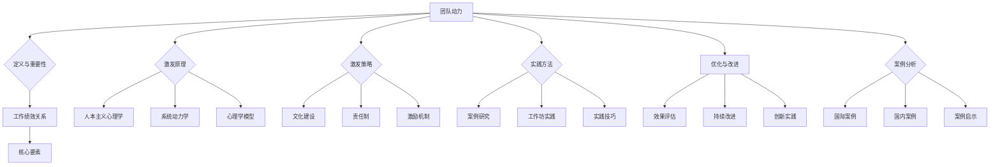
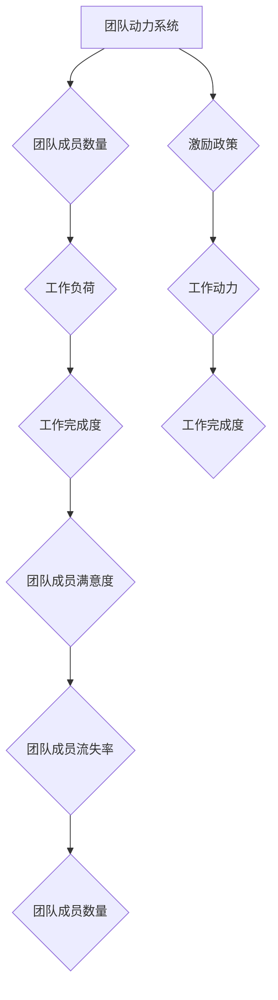

                 

### 文章标题

《团队动力激发：保持高效工作状态》

### 关键词

团队动力、高效工作状态、激励机制、团队文化建设、领导力

### 摘要

本文将深入探讨团队动力激发的各个方面，从基础理论、策略方法到实践案例，全面解析如何通过有效的团队动力激发，保持团队高效的工作状态。文章首先概述了团队动力的定义及其重要性，接着分析了团队动力与工作绩效之间的关系，探讨了激发团队动力的核心要素和原理。随后，文章提出了具体的团队动力激发策略，并通过实际案例展示了这些策略的应用效果。最后，本文总结了团队动力激发的方法和技巧，并展望了未来团队动力激发的创新实践方向。通过本文的阅读，读者将能够更好地理解团队动力激发的原理和实践，为提升团队工作效率提供有力支持。 

### 《团队动力激发：保持高效工作状态》目录大纲

**第一部分：团队动力激发基础**

**第1章：团队动力激发概述**

1.1 团队动力的定义与重要性

1.2 团队动力与工作绩效的关系

1.3 团队动力激发的核心要素

**第2章：团队动力激发原理**

2.1 人本主义心理学在团队动力激发中的应用

2.2 系统动力学原理与团队动力激发

2.3 团队动力激发的心理学模型

**第3章：团队动力激发策略**

3.1 团队文化建设与团队动力激发

3.2 责任制与团队动力激发

3.3 激励机制与团队动力激发

**第4章：团队动力激发实践**

4.1 团队动力激发案例研究

4.2 团队动力激发工作坊实践

4.3 团队动力激发的实践技巧

**第二部分：团队动力激发方法**

**第5章：个体动力激发**

5.1 个体激励策略

5.2 个体成长与发展

5.3 个体动力与团队动力的结合

**第6章：团队协作与沟通**

6.1 团队协作的心理学原理

6.2 团队沟通技巧提升

6.3 团队冲突管理与化解

**第7章：团队领导力与团队动力激发**

7.1 团队领导力概述

7.2 领导风格与团队动力激发

7.3 领导行为与团队动力激发

**第8章：团队动力激发持续优化**

8.1 团队动力激发效果评估

8.2 团队动力激发的持续改进

8.3 团队动力激发的创新实践

**第三部分：团队动力激发案例分析**

**第9章：国内外团队动力激发案例**

9.1 国外团队动力激发成功案例

9.2 国内团队动力激发成功案例

9.3 案例分析与启示

**附录**

附录A：团队动力激发相关工具与方法

附录B：团队动力激发资源链接

### 核心概念与联系流程图

以下是一个Mermaid流程图，展示了本文的核心概念及其相互联系：



### 核心算法原理讲解伪代码

以下是用于计算个体动力和团队动力的伪代码：

```python
# 个体动力计算伪代码
def calculate_individual_motivation(salary, work_load, job_satisfaction):
    base_motivation = salary / work_load
    job_satisfaction_adjustment = job_satisfaction * 0.1
    individual_motivation = base_motivation + job_satisfaction_adjustment
    return individual_motivation

# 团队动力计算伪代码
def calculate_team_motivation(individual_motivations):
    total_motivation = sum(individual_motivations)
    team_motivation = total_motivation / len(individual_motivations)
    return team_motivation
```

### 数学模型和数学公式详细讲解

个体动力的计算公式如下：

$$
\text{个体动力} = \frac{\text{薪资}}{\text{工作量}} + \text{工作满意度} \times 0.1
$$

其中，薪资和 workload 分别表示个体的薪资和工作量，工作满意度通常以百分比表示。

团队动力的计算公式如下：

$$
\text{团队动力} = \frac{\sum_{i=1}^{n} \text{个体动力}}{n}
$$

其中，n 表示团队成员的数量，个体动力是针对每个团队成员计算得到的动力值。

### 项目实战代码案例与详细解释

#### 开发环境搭建

- 操作系统：Ubuntu 20.04
- 编程语言：Python 3.8
- 库：Pandas, Numpy

#### 源代码实现

以下是一个简单的Python脚本，用于计算团队动力：

```python
import pandas as pd
import numpy as np

# 定义个体动力计算函数
def calculate_individual_motivation(salary, work_load, job_satisfaction):
    base_motivation = salary / work_load
    job_satisfaction_adjustment = job_satisfaction * 0.1
    individual_motivation = base_motivation + job_satisfaction_adjustment
    return individual_motivation

# 定义团队动力计算函数
def calculate_team_motivation(individual_motivations):
    total_motivation = sum(individual_motivations)
    team_motivation = total_motivation / len(individual_motivations)
    return team_motivation

# 创建一个数据框，包含团队成员的薪资、工作量和工作满意度
data = pd.DataFrame({
    '姓名': ['张三', '李四', '王五'],
    '薪资': [8000, 9000, 10000],
    '工作量': [40, 50, 60],
    '工作满意度': [0.8, 0.7, 0.9]
})

# 计算每个成员的个体动力
data['个体动力'] = data.apply(lambda row: calculate_individual_motivation(row['薪资'], row['工作量'], row['工作满意度']), axis=1)

# 计算团队动力
team_motivation = calculate_team_motivation(data['个体动力'])

print("团队动力:", team_motivation)
```

#### 代码应用解读与分析

该代码首先定义了两个函数，`calculate_individual_motivation` 和 `calculate_team_motivation`。前者用于计算单个成员的个体动力，根据薪资、工作量和工作满意度进行计算。后者用于计算整个团队的团队动力，通过对所有成员的个体动力求和并除以成员数量得到。

数据框 `data` 包含了三个成员的薪资、工作量和工作满意度。使用 `apply` 函数，我们为每个成员计算了个体动力，并将结果保存在新的列 `'个体动力'` 中。

最后，我们调用 `calculate_team_motivation` 函数，将所有成员的个体动力作为参数传递，计算并打印出团队动力。

#### 实际案例分析和详细讲解剖析

假设我们有一个由三名成员组成的团队，他们的薪资、工作量和工作满意度如下表所示：

| 姓名 | 薪资（元） | 工作量（小时） | 工作满意度 |
|------|------------|----------------|-------------|
| 张三 | 8000       | 40             | 0.8         |
| 李四 | 9000       | 50             | 0.7         |
| 王五 | 10000      | 60             | 0.9         |

根据个体动力计算公式，我们可以分别计算每个成员的个体动力：

- 张三的个体动力：\( \frac{8000}{40} + 0.8 \times 0.1 = 200 + 0.08 = 200.08 \)
- 李四的个体动力：\( \frac{9000}{50} + 0.7 \times 0.1 = 180 + 0.07 = 180.07 \)
- 王五的个体动力：\( \frac{10000}{60} + 0.9 \times 0.1 = 166.67 + 0.09 = 166.76 \)

计算团队动力时，我们将所有成员的个体动力相加，然后除以成员数量：

$$
\text{团队动力} = \frac{200.08 + 180.07 + 166.76}{3} = \frac{547.91}{3} \approx 182.97
$$

因此，该团队的团队动力大约为 182.97。

#### 项目小结

通过上述代码和案例，我们展示了如何计算个体动力和团队动力。个体动力是衡量单个成员工作动力的重要指标，而团队动力则是衡量整个团队工作状态和协作水平的关键因素。在实际应用中，团队动力激发可以通过优化激励机制、提升团队文化建设和加强团队协作来实现。未来，我们还可以探索更多复杂的数学模型和算法，以更准确地评估和激发团队动力，从而提高团队的工作效率和绩效。 

## 第1章：团队动力激发概述

### 1.1 团队动力的定义与重要性

团队动力是指团队成员在共同目标指引下，通过相互协作、积极互动所形成的一种内在驱动力，它直接影响着团队的凝聚力和工作绩效。团队动力的核心要素包括个体的内在动机、团队的共同目标以及协作过程中形成的正向关系和价值观。

团队动力的定义可以从以下几个方面进行阐述：

- **内在动机**：个体在参与团队活动时，出于自身兴趣、需求和动机所表现出的积极性和主动性。
- **共同目标**：团队成员共同追求的目标和价值，是实现团队协作的基础。
- **协作互动**：团队成员之间的沟通、合作和互动，是形成团队动力的关键。

团队动力的重要性体现在以下几个方面：

1. **提升团队绩效**：团队动力直接影响团队的工作效率和绩效。高水平的团队动力有助于提高团队的创新能力、解决问题能力和执行力，从而实现更高的工作目标。
2. **增强团队凝聚力**：团队动力激发能够增强团队成员之间的信任和合作，提升团队的凝聚力，减少内部摩擦和冲突。
3. **促进个人成长**：在具有高团队动力的团队中，成员能够更好地实现个人职业发展，提升自身能力和技能。
4. **改善工作氛围**：团队动力激发有助于营造积极、健康的工作氛围，减少压力和负面情绪，提升成员的幸福感和满意度。

### 1.2 团队动力与工作绩效的关系

团队动力与工作绩效之间的关系是双向的，一方面，团队动力可以促进工作绩效的提升；另一方面，工作绩效的改善也会进一步增强团队动力。

**1. 动力促进绩效提升**

- **提高工作热情**：高团队动力能够激发成员的工作热情，使其更加投入和专注于工作任务。
- **增强协作效率**：团队动力有助于团队成员之间的紧密协作，提高团队的整体工作效率。
- **创新和创造力**：具有高团队动力的团队，往往更加开放和创新，能够更快地解决问题和提出新的解决方案。
- **增强责任感**：在团队动力强的情况下，成员会对团队目标和个人职责有更深刻的认识和责任感，从而提高工作质量。

**2. 绩效影响团队动力**

- **成就感**：良好的工作绩效会为团队成员带来成就感和满足感，从而提升团队动力。
- **信任和尊重**：绩效的提升有助于增强团队成员之间的信任和尊重，进一步激发团队动力。
- **公平感**：公平的绩效评估和奖励机制能够增强成员的公平感，提升团队动力。

### 1.3 团队动力激发的核心要素

要有效激发团队动力，需要从多个方面入手，以下是一些关键要素：

**1. 明确的共同目标**：共同目标是激发团队动力的基础。团队需要明确共同的目标和愿景，确保每个成员都清晰了解自己的角色和责任。

**2. 有效的激励机制**：激励机制是激发团队成员工作热情和动力的关键。有效的激励机制包括物质奖励和精神激励，如奖金、晋升机会、荣誉表彰等。

**3. 透明的沟通机制**：良好的沟通机制有助于团队成员之间建立信任，减少误解和冲突。透明、开放的沟通环境能够增强团队凝聚力，激发团队动力。

**4. 责任制**：明确每个成员的职责和责任，确保团队成员能够承担起自己的工作，有助于提升团队动力和工作效率。

**5. 支持和成长**：为团队成员提供必要的支持和成长机会，如培训、辅导和职业发展规划，有助于提升成员的工作动力和团队凝聚力。

**6. 领导风格**：领导风格对团队动力有重要影响。领导者需要具备激励能力，通过积极引导和支持，激发团队成员的工作热情。

通过以上核心要素的有效结合，可以有效地激发团队动力，提升团队的工作效率和绩效。在接下来的章节中，我们将深入探讨团队动力激发的原理和策略，提供更具体的实践方法和案例分析。 

## 第2章：团队动力激发原理

### 2.1 人本主义心理学在团队动力激发中的应用

人本主义心理学是20世纪中叶兴起的一种心理学流派，它强调个体的主观体验、自我实现和人际关系。在团队动力激发中，人本主义心理学的核心理念得到了广泛应用，特别是在提升团队成员的内在动机和自我实现方面。

**1. 自我决定理论**

自我决定理论（Self-Determination Theory，简称SDT）是人本主义心理学的重要组成部分，由心理学家德西（Deci）和瑞安（Ryan）提出。该理论认为，人类行为主要受到三种基本心理需求的驱动：自主性、能力和归属感。

- **自主性**：个体有自主选择和决策的需求，自主性越高的行为，个体越倾向于感到满意和有意义。
- **能力**：个体有展现自身能力和实现目标的需求，能力越强的个体，越能够获得成就感和自我价值感。
- **归属感**：个体有与他人建立联系和归属的需求，归属感越强的团队，成员之间的合作和信任越强。

在团队动力激发中，通过满足团队成员的自主性、能力和归属感需求，可以有效提升团队动力。

**2. 自我决定理论在团队动力激发中的应用**

- **授权和自主性**：领导者可以通过授权，让团队成员有更多的自主权和决策机会，从而满足他们的自主性需求。
- **培训和发展**：提供丰富的培训和发展机会，帮助团队成员提升能力，实现个人和团队的目标。
- **团队建设和沟通**：通过团队建设和沟通活动，增强团队成员之间的归属感和信任，满足他们的社交需求。

**3. 个体动机与团队动力的关系**

个体动机是团队动力的基础，个体的高动机水平往往能够带动整个团队的积极性。根据自我决定理论，个体动机可以分为内在动机和外在动机：

- **内在动机**：源于个体对任务本身的兴趣、爱好和热情，如对工作内容本身的喜欢、追求知识和自我成长。
- **外在动机**：源于外部奖励或惩罚，如薪酬、晋升机会、竞争压力等。

在团队动力激发中，领导者需要关注个体动机的多样性，通过适当的外在动机激励和内在动机培养，实现个体动机与团队动力的有机结合。

**4. 人本主义心理学在团队动力激发中的挑战**

尽管人本主义心理学在团队动力激发中具有显著的优势，但在实际应用中仍然面临一些挑战：

- **组织文化**：组织文化可能对自我决定理论的实施产生限制，如过于强调绩效和竞争，忽视个体的自主性和归属感。
- **领导风格**：领导者的风格和态度会影响团队动力激发的效果，一些领导者可能更倾向于控制和管理，而不是激励和支持。
- **团队规模和多样性**：团队规模和多样性也会影响人本主义心理学应用的难度，大型团队和多元文化团队可能需要更多的协调和沟通。

总之，人本主义心理学为团队动力激发提供了重要的理论依据和实践指导。通过深入理解自我决定理论，领导者可以更有效地激发团队成员的内在动机，提升团队的整体动力和绩效。在接下来的章节中，我们将进一步探讨系统动力学原理与团队动力激发的关系，以及团队动力激发的心理学模型。 

### 2.2 系统动力学原理与团队动力激发

系统动力学（System Dynamics）是一种用于分析复杂系统的理论和方法，最初由杰伊·福瑞斯特（Jay Forrester）在20世纪50年代提出。系统动力学通过模拟系统内部各部分之间的相互作用和反馈机制，揭示系统行为的变化规律。在团队动力激发中，系统动力学原理为我们提供了一个全面理解团队行为和动态变化的有力工具。

#### 1. 系统动力学的基本概念

系统动力学认为，系统由多个相互关联的组件构成，这些组件通过输入、输出和反馈机制相互影响。系统动力学的核心概念包括：

- **存量与流量**：存量是指系统中某一时刻存在的量，如团队成员的数量、团队的士气等；流量是指存量的变化速率，如团队成员的流失、士气的变化等。
- **反馈机制**：反馈机制是指系统内部各组件之间的相互作用，包括正反馈和负反馈。正反馈会放大系统的某种行为或趋势，而负反馈则会抑制系统的变化。

#### 2. 系统动力学原理在团队动力激发中的应用

在团队动力激发中，系统动力学原理可以帮助我们理解和预测团队的行为模式，进而制定有效的激励策略。

- **存量与流量的分析**：通过分析团队的存量（如团队成员数量、技能水平、工作负荷等）和流量（如成员的流失率、工作完成度等），可以识别出影响团队动力的关键因素。例如，如果团队成员的数量和工作负荷之间存在反馈机制，可能会导致工作负荷过重，进而影响团队动力和绩效。

- **反馈机制的优化**：识别系统中的正反馈和负反馈机制，并对其进行优化。例如，通过建立负反馈机制（如定期的团队反馈会议、绩效评估等），可以及时纠正团队中存在的问题，避免问题累积。

#### 3. 团队动力系统的动态模拟

利用系统动力学原理，可以对团队动力系统进行动态模拟，预测不同激励策略对团队动力和绩效的影响。以下是一个简单的团队动力系统动态模拟示例：



在这个模拟中，团队成员数量、工作负荷、工作完成度、团队成员满意度、团队成员流失率和激励政策构成了一个相互关联的动态系统。通过调整激励政策，可以影响团队动力和绩效，进而优化团队状态。

#### 4. 系统动力学原理的挑战与应用前景

尽管系统动力学原理在团队动力激发中具有显著的应用价值，但在实际应用中也面临一些挑战：

- **复杂性**：团队动力系统是一个高度复杂的系统，包含多种相互作用的变量和反馈机制，模拟和分析需要较高的技术要求。
- **数据收集**：系统动力学模型的构建需要大量的数据支持，数据的质量和准确性对模型的效果有重要影响。
- **动态变化**：团队动力是一个动态变化的过程，需要不断调整和优化模型，以适应新的变化。

尽管存在挑战，系统动力学原理在团队动力激发中的应用前景仍然广阔。通过结合定量分析和定性分析，可以更深入地理解团队动力系统的运作机制，为团队管理提供科学的决策支持。

总之，系统动力学原理为团队动力激发提供了一个全新的视角和工具。通过运用系统动力学的方法，领导者可以更有效地理解和激发团队动力，提升团队的工作效率和绩效。在接下来的章节中，我们将进一步探讨团队动力激发的心理学模型，以更全面地理解团队动力激发的内在机制。 

### 2.3 团队动力激发的心理学模型

在团队动力激发的过程中，理解个体心理和行为模式是至关重要的。心理学模型为我们提供了分析个体行为和团队互动的框架，帮助领导者更有效地激发团队动力。以下是一些主要的心理学模型及其在团队动力激发中的应用。

#### 1. 自我决定理论（Self-Determination Theory, SDT）

自我决定理论由德西（Deci）和瑞安（Ryan）提出，强调个体在自主性、能力和归属感方面的需求。在团队动力激发中，SDT的核心理念是：

- **自主性**：个体需要感受到自由和选择的权力，这有助于提升内在动机和工作满意度。
- **能力**：个体需要感受到自己具备完成任务的能力，这有助于增强自信和成就感。
- **归属感**：个体需要感受到与团队和同事的连接，这有助于建立信任和团队凝聚力。

为了在团队中应用SDT，领导者可以采取以下策略：

- **授权**：给予团队成员更多的决策权和自主性，让他们参与到团队目标和计划的制定过程中。
- **支持**：提供必要的资源和支持，帮助团队成员提升技能和能力。
- **团队建设**：通过团队活动和社交互动，增强团队成员之间的归属感和团队意识。

#### 2. 动机理论（Motivation Theory）

动机理论探讨了个体行为背后的内在驱动力。在团队动力激发中，常见的动机理论包括：

- **需要层次理论（Maslow's Hierarchy of Needs）**：马斯洛的需要层次理论认为，个体的需求可以分为生理需求、安全需求、社交需求、尊重需求和自我实现需求。在团队中，领导者需要识别和满足不同成员的不同层次需求，以激发他们的动机。

- **期望理论（Expectancy Theory）**：期望理论由维克托·弗鲁姆（Victor Vroom）提出，认为个体的行为动机取决于对结果的价值、对努力产生结果的期望以及对结果可能性的期望。在团队动力激发中，领导者可以通过设定明确的期望、提供积极的反馈和奖励来增强成员的动机。

- **目标设定理论（Goal Setting Theory）**：目标设定理论认为，具体、有挑战性的目标能够激发更高的工作动机和绩效。在团队中，领导者可以通过设定清晰的团队目标和个体目标，帮助成员保持动力和专注。

#### 3. 社会交换理论（Social Exchange Theory）

社会交换理论关注个体在人际关系中的行为和动机，认为个体在团队中的行为是在权衡成本和收益的基础上做出的选择。在团队动力激发中，领导者可以运用以下策略：

- **建立互惠关系**：通过公平的交换和合作，建立团队成员之间的互惠关系，增强团队凝聚力。
- **明确成本和收益**：帮助团队成员明确参与团队活动的成本和潜在收益，以增强他们的参与意愿。
- **提供社会支持**：通过提供情感支持、信息共享和资源支持，减少团队成员的成本，增加他们的收益。

#### 4. 适应性学习理论（Adaptive Learning Theory）

适应性学习理论认为，个体和团队通过不断学习和适应环境变化来提高绩效。在团队动力激发中，领导者可以采取以下策略：

- **持续学习**：鼓励团队成员参与培训和学习活动，提高他们的技能和知识水平。
- **反馈与调整**：建立有效的反馈机制，帮助团队成员了解自己的表现，并作出相应的调整。
- **适应性策略**：在变化的环境中，鼓励团队成员灵活调整策略，以适应新的挑战和需求。

#### 5. 情绪智力理论（Emotional Intelligence Theory）

情绪智力理论关注个体的情感管理和社交能力，认为情感智力对团队动力和工作绩效有重要影响。在团队动力激发中，领导者可以采取以下策略：

- **情感管理**：帮助团队成员识别和调节自己的情感，提高他们的情绪管理能力。
- **社交技能**：通过培训和练习，提升团队成员的沟通和协作能力，增强团队凝聚力。
- **建设性反馈**：通过积极的反馈和建设性的批评，帮助团队成员提升情感智力和社交技能。

总之，心理学模型为团队动力激发提供了理论依据和实践指导。通过结合自我决定理论、动机理论、社会交换理论、适应性学习理论和情绪智力理论，领导者可以更全面地理解和激发团队动力，提升团队的工作效率和绩效。在接下来的章节中，我们将进一步探讨团队动力激发的策略和实践，以帮助读者在实际工作中应用这些理论。 

## 第3章：团队动力激发策略

### 3.1 团队文化建设与团队动力激发

团队文化是指团队在长期发展过程中形成的共同价值观、行为规范和工作方式。一个积极、健康、明确的团队文化能够极大地激发团队动力，提高团队的工作效率和绩效。以下是一些关键策略，用于构建和加强团队文化，从而激发团队动力。

**1. 明确团队愿景和价值观**

团队愿景和价值观是团队文化的基石。一个清晰的愿景和价值观能够为团队成员提供方向和动力，使团队成员在面对挑战和变化时保持一致和坚定。领导者可以通过以下方式明确团队愿景和价值观：

- **共同制定**：邀请团队成员参与团队愿景和价值观的制定过程，使他们感到被重视和参与。
- **定期沟通**：定期在团队会议和培训中讨论和重申团队愿景和价值观，确保团队成员对此有深入的理解。
- **内化于心**：通过团队活动和日常工作，将团队愿景和价值观融入到团队成员的日常行为中，使其成为团队文化的一部分。

**2. 建立积极的团队氛围**

积极的团队氛围是激发团队动力的关键。一个支持性、包容和激励的团队氛围能够增强团队成员的归属感和工作满意度。以下是一些建立积极团队氛围的策略：

- **鼓励开放沟通**：鼓励团队成员之间开放、真诚地沟通，建立信任和互相理解。
- **支持多样性**：尊重和包容团队成员的多样性，包括文化、年龄、性别和经验等，促进创新和团队合作。
- **认可和奖励**：对团队成员的成就和贡献给予认可和奖励，增强他们的动力和自信心。

**3. 促进团队协作和合作**

协作和合作是团队文化的重要组成部分，能够提升团队的整体绩效。以下是一些促进团队协作和合作的策略：

- **共同目标**：确保团队成员都明确团队目标，并认识到个人目标和团队目标的一致性。
- **团队活动**：定期组织团队活动，如团队建设训练、合作游戏和集体项目，增强团队成员之间的互动和合作。
- **资源分享**：鼓励团队成员共享知识和资源，促进信息流通和知识共享，提高团队整体的能力。

**4. 培养领导力

领导者是团队文化的塑造者和维护者，其领导风格和行为对团队文化有重要影响。以下是一些培养领导力的策略：

- **示范行为**：领导者通过自身的言行示范团队价值观和行为规范，为团队成员树立榜样。
- **培养团队成员的领导能力**：提供培训和发展机会，帮助团队成员提升领导能力和管理技能。
- **授权和信任**：领导者应给予团队成员足够的授权和信任，鼓励他们独立思考和做出决策。

**5. 持续改进和文化更新

团队文化不是一成不变的，而是一个动态的、持续改进的过程。以下是一些持续改进和文化更新的策略：

- **定期评估**：定期评估团队文化，了解团队成员对团队文化的感知和反馈，识别存在的问题和改进方向。
- **创新和尝试**：鼓励团队成员尝试新的方法和工作方式，促进文化创新和更新。
- **反馈和调整**：根据评估结果和团队成员的反馈，及时调整和改进团队文化，确保其与团队目标和需求保持一致。

通过实施以上策略，团队文化建设不仅能够激发团队动力，还能提高团队的整体绩效和成员的满意度。在接下来的章节中，我们将探讨责任制和激励机制在团队动力激发中的应用，以提供更全面的策略和方法。 

### 3.2 责任制与团队动力激发

责任制是指明确团队成员的职责和责任，确保每个成员对自己的工作负责，并对其成果负责。责任制在团队动力激发中发挥着至关重要的作用，通过以下方式促进团队成员的积极性和效率：

**1. 明确职责和任务**

建立责任制的第一步是明确每个团队成员的职责和任务。这可以通过以下方法实现：

- **任务分解**：将团队目标分解为具体的小任务，并明确每个任务的负责人。确保每个成员都清楚自己的任务和职责。
- **角色描述**：为每个团队成员提供详细的角色描述，包括他们的主要职责、工作范围和预期成果。
- **定期沟通**：定期与团队成员沟通，确保他们对任务和职责有清晰的认识，并及时解决可能出现的误解或问题。

**2. 责任落实与监督**

责任制不仅要求明确职责，还需要确保责任得到有效落实和监督。以下是一些策略：

- **监督机制**：建立有效的监督机制，如定期检查任务进度、召开进度汇报会议等，确保团队成员按时完成任务。
- **反馈与评估**：定期对团队成员的工作进行评估和反馈，帮助他们识别工作中的优点和不足，并提供建议和指导。
- **责任追究**：在团队中建立明确的责任追究机制，对于未履行职责或未能达到预期成果的成员，应进行适当的惩罚或调整。

**3. 责任制与团队动力激发的关系**

责任制与团队动力激发之间存在密切的关系：

- **明确性和方向性**：责任制为团队成员提供了明确的工作方向和目标，有助于提升工作效率和动力。
- **公平性**：责任制确保每个成员都承担相应的责任，避免了责任不清和推诿现象，增强了团队的公平性和凝聚力。
- **透明度**：责任制提高了团队工作的透明度，使成员能够看到自己的工作成果和团队的整体进展，增强了成员的成就感和归属感。

**4. 激励责任制的实施方法**

为了更好地实施责任制，可以采取以下激励方法：

- **奖励机制**：对履行职责良好、完成任务出色的成员给予奖励，如奖金、晋升机会或荣誉称号。
- **认可与表彰**：在团队会议或公开场合对优秀成员进行认可和表彰，增强他们的荣誉感和自信心。
- **培训与发展**：为履行职责的成员提供培训和职业发展机会，帮助他们提升技能和知识，增强他们的工作能力和动力。

**5. 责任制的挑战与解决策略**

在实施责任制过程中，可能会遇到以下挑战：

- **责任过重**：团队成员可能会感到责任过重，压力过大，影响工作动力和健康。
- **责任推卸**：一些成员可能会试图推卸责任，导致团队整体效率降低。
- **评估困难**：对团队成员的工作进行客观、公正的评估可能存在困难，影响责任制的效果。

解决这些挑战的策略包括：

- **合理分配责任**：确保责任分配合理，避免过度负荷，确保团队成员有足够的时间和资源完成任务。
- **建立信任**：通过建立信任和沟通，减少责任推卸现象，增强团队凝聚力。
- **完善评估机制**：建立科学、合理的评估机制，确保评估的公正性和客观性，提高责任制的效果。

总之，责任制是激发团队动力的关键因素之一。通过明确职责和任务、落实责任和激励措施，可以有效地激发团队成员的工作热情和动力，提高团队的整体绩效。在接下来的章节中，我们将探讨激励机制在团队动力激发中的应用，为读者提供更全面的策略和方法。 

### 3.3 激励机制与团队动力激发

激励机制是激发团队动力的重要手段之一，通过合理的激励措施，可以提升团队成员的工作积极性、创造力和团队合作精神。以下是一些关键策略，用于设计有效的激励机制，以激发团队动力。

**1. 物质激励**

物质激励是最直接、最易于量化的激励方式，主要包括奖金、提成、晋升机会、加班补贴等。以下是一些实施物质激励的注意事项：

- **明确奖励标准**：确保奖励标准明确、透明，团队成员了解何时、为何会获得奖励。
- **及时奖励**：及时给予奖励，使团队成员感受到付出与回报的关联，增强工作动力。
- **差异化奖励**：根据团队成员的贡献和绩效差异，给予差异化的奖励，以体现公平性和激励性。
- **与绩效挂钩**：将物质激励与团队成员的绩效直接挂钩，确保奖励与工作成果挂钩，提高激励效果。

**2. 精神激励**

精神激励通过满足团队成员的心理需求，提升工作满意度和动力。以下是一些常用的精神激励方法：

- **认可与表彰**：定期在团队会议或公开场合对表现优秀的团队成员进行表彰和认可，提高他们的荣誉感和自豪感。
- **培训与发展**：为团队成员提供持续的学习和成长机会，帮助他们提升技能和知识，增强职业发展前景。
- **工作环境优化**：营造积极、健康的工作环境，如提供良好的办公设施、改善工作氛围等，提升团队成员的工作体验。
- **团队活动**：组织团队建设活动，如团队聚餐、户外拓展等，增强团队成员之间的互动和凝聚力。

**3. 激励机制的设计原则**

为了设计有效的激励机制，需要遵循以下原则：

- **公平性**：确保激励机制的公平性，使所有团队成员都有机会获得激励，避免因不公平而引发的矛盾和不满。
- **透明性**：激励措施应明确透明，使团队成员了解激励标准和实施过程，增加激励的公信力。
- **多样性**：结合物质激励和精神激励，满足不同成员的需求，提高激励的覆盖面和效果。
- **灵活性**：根据团队和成员的实际需求，灵活调整激励机制，以适应不断变化的工作环境和挑战。

**4. 激励机制的评估与调整**

为了确保激励机制的有效性，需要定期对激励机制进行评估和调整。以下是一些评估和调整的方法：

- **绩效评估**：通过定期对团队成员的工作绩效进行评估，了解激励机制的实际效果，识别存在的问题。
- **反馈收集**：收集团队成员对激励机制的反馈，了解他们的感受和建议，为激励机制的改进提供依据。
- **对比分析**：将激励机制的实施效果与行业平均水平或历史数据对比，分析激励机制的优劣势，为调整提供参考。

**5. 激励机制的挑战与解决策略**

在实际应用中，激励机制可能会面临以下挑战：

- **激励过度**：过度的激励可能导致团队成员产生依赖心理，影响他们的内在动机。
- **激励不足**：激励措施不足可能导致团队成员感到不公平和不满，影响工作动力。
- **激励分配不均**：激励分配不均可能导致团队内部矛盾和冲突。

解决这些挑战的策略包括：

- **平衡物质与精神激励**：合理分配物质和精神激励，满足团队成员的不同需求。
- **建立长期激励机制**：设计长期激励机制，如股权激励、职业发展机会等，增强团队成员的长期动力。
- **公平透明**：确保激励分配公平透明，避免因分配不均引发的矛盾和不满。

总之，激励机制是团队动力激发的重要手段。通过合理设计物质和精神激励措施，结合公平、透明、灵活的原则，可以有效激发团队动力，提高团队的工作效率和绩效。在接下来的章节中，我们将探讨团队动力激发的实践方法和技巧，为读者提供更多实用的指导。 

## 第4章：团队动力激发实践

### 4.1 团队动力激发案例研究

在本节中，我们将通过两个具体的案例研究，深入探讨团队动力激发的实践方法和效果。这两个案例分别来自于国内外知名企业，通过实际操作展示了团队动力激发的成功经验和关键要素。

### 案例一：谷歌的团队动力激发实践

**1. 案例背景**

谷歌（Google）作为全球领先的互联网技术公司，其成功离不开高效的团队动力激发。谷歌的团队文化以其开放、创新和激励著称，吸引了大量优秀的人才。为了保持团队的高效运作，谷歌采取了一系列独特的团队动力激发措施。

**2. 实践措施**

- **激励多样性**：谷歌提供了丰富的物质和精神激励措施，如高额奖金、股权激励、职业发展机会等，以吸引和留住人才。
- **自主性和创新**：谷歌鼓励团队成员自主创新，提供了大量的自由时间和资源，支持他们探索新项目和创新想法。
- **透明沟通**：谷歌建立了高效的沟通机制，确保信息透明和及时传达，增强了团队成员之间的信任和协作。
- **团队建设**：谷歌定期组织团队活动，如团队旅行、团队建设训练等，增强了团队凝聚力和归属感。

**3. 实践效果**

通过上述措施，谷歌成功地激发了团队的内在动力，提高了团队的整体绩效和创新能力。员工满意度持续上升，离职率保持在较低水平，谷歌也不断创新，推出了许多影响深远的产品和服务。

**4. 分析与启示**

谷歌的案例表明，多样化的激励措施、自主性和创新环境、透明沟通和团队建设是激发团队动力的关键。这些措施不仅提高了员工的工作积极性，还增强了团队的合作精神和创新能力。

### 案例二：华为的团队动力激发实践

**1. 案例背景**

华为（Huawei）作为全球领先的通信技术解决方案提供商，其团队文化强调责任、目标和执行力。为了保持团队的竞争力，华为采取了一系列针对性的团队动力激发措施。

**2. 实践措施**

- **明确目标和责任**：华为通过明确的目标设定和责任分配，确保每个团队成员都清楚自己的工作职责和目标。
- **激励与考核**：华为建立了严格的绩效考核体系，将激励与个人和团队的绩效直接挂钩，激发团队成员的积极性和责任感。
- **培训和职业发展**：华为提供了丰富的培训资源和职业发展机会，帮助团队成员提升技能和知识，增强他们的工作能力和动力。
- **团队合作与反馈**：华为鼓励团队合作，建立了定期的团队反馈和沟通机制，促进了团队成员之间的协作和相互支持。

**3. 实践效果**

通过这些措施，华为成功地激发了团队的内在动力，提升了团队的工作效率和执行力。团队成员对公司的认同感和忠诚度不断提高，华为在通信技术领域保持了强劲的竞争力。

**4. 分析与启示**

华为的案例表明，明确的目标和责任、严格的激励与考核体系、全面的培训和职业发展机会以及有效的团队合作与反馈机制是激发团队动力的关键。这些措施有助于提升团队成员的积极性和执行力，推动团队整体绩效的提升。

### 4.2 团队动力激发工作坊实践

**1. 工作坊的目的**

团队动力激发工作坊的目的是通过一系列互动和实践活动，提高团队成员的团队意识和协作能力，激发团队动力。工作坊通常包括以下步骤：

- **目标设定**：明确工作坊的目标和预期成果，确保所有参与者都对工作坊的目的有清晰的认识。
- **互动活动**：通过角色扮演、小组讨论、案例分析等活动，促进团队成员之间的交流和互动。
- **反馈与总结**：在工作坊结束时，收集参与者的反馈，总结工作坊的成果和经验。

**2. 工作坊的流程**

工作坊的流程通常包括以下环节：

- **开场致辞**：由主持人为工作坊开场，介绍工作坊的目的、流程和规则。
- **团队建设活动**：通过团队建设游戏或任务，增强团队成员之间的互动和信任。
- **主题讨论**：围绕团队动力激发的主题进行讨论，分享经验和观点。
- **案例分析**：通过实际案例的讨论，深入理解团队动力激发的方法和技巧。
- **互动环节**：安排互动环节，如角色扮演、小组讨论等，让参与者亲自体验团队动力激发的过程。
- **总结与反馈**：在工作坊结束时，主持人对工作坊进行总结，并收集参与者的反馈。

**3. 工作坊的技巧与注意事项**

- **充分准备**：在开展工作坊之前，主持人需要对工作坊的内容和流程进行充分准备，确保活动顺利进行。
- **营造开放氛围**：营造一个开放、包容的氛围，鼓励参与者积极参与和分享。
- **灵活调整**：根据参与者的反馈和活动进展，灵活调整工作坊的流程和内容。
- **尊重差异**：尊重每个参与者的观点和经验，避免主观偏见和压制。

### 4.3 团队动力激发的实践技巧

**1. 如何建立积极的团队文化**

- **树立榜样**：领导者应以身作则，树立积极的工作态度和行为，为团队成员树立榜样。
- **培养共同价值观**：通过共同的目标和价值观，增强团队成员的认同感和归属感。
- **鼓励反馈与建议**：建立开放的沟通渠道，鼓励团队成员提出反馈和建议，增强团队凝聚力。

**2. 如何提升团队成员的内在动机**

- **明确目标**：为团队成员设定明确、有挑战性的目标，激发他们的内在动机。
- **提供自主性**：给予团队成员自主权，让他们参与决策和任务安排，提高工作满意度。
- **增强成就感**：通过认可和奖励，增强团队成员的成就感和自我价值感。

**3. 如何优化团队沟通与协作**

- **建立有效的沟通机制**：确保信息流畅、透明，减少误解和冲突。
- **加强团队建设**：通过团队活动和互动，增强团队成员之间的信任和协作。
- **培养团队领导力**：提升团队成员的领导力和协作能力，促进团队的高效运作。

通过以上实践案例和工作坊实践，我们可以看到，团队动力激发不仅仅是理论上的探讨，更需要通过具体的实践措施来实现。在接下来的章节中，我们将进一步探讨团队动力激发的持续优化方法和未来发展趋势。 

## 第5章：个体动力激发

### 5.1 个体激励策略

个体激励策略是团队动力激发的重要组成部分，通过有效的激励措施，可以提升个体的工作动力、绩效和满意度。以下是一些关键策略：

**1. 竞争性薪酬体系**

竞争性薪酬体系是激励个体的重要手段。确保薪酬水平与市场竞争力相匹配，能够吸引和留住优秀人才。同时，根据员工的绩效和贡献，给予合理的薪酬调整和奖励。

**2. 职业发展机会**

为员工提供职业发展机会，如晋升路径、培训计划和职业咨询等，有助于提升他们的职业满意度和归属感。通过明确的职业规划和职业发展路径，激发员工的工作热情和长期投入。

**3. 表现认可与奖励**

及时给予员工认可和奖励，可以增强他们的成就感和自我价值感。认可的形式可以多样，包括口头表扬、奖状、奖金、晋升机会等。同时，应确保奖励与员工的表现直接挂钩，以体现公平性和激励性。

**4. 工作环境优化**

营造良好的工作环境，包括舒适的工作空间、充足的资源和支持等，有助于提升员工的工作满意度和生产力。此外，关注员工的心理健康和工作生活平衡，提供心理健康支持和灵活的工作安排，也是激励个体的重要策略。

**5. 鼓励创新与自主性**

鼓励员工在工作中发挥创新精神和自主性，可以激发他们的内在动机和工作热情。通过设置创新项目、提供自由时间和资源等，让员工有机会尝试新方法和解决问题。

**6. 跨部门合作与学习机会**

提供跨部门合作和学习机会，让员工有机会接触到不同的业务领域和工作方式，提升他们的视野和能力。这不仅有助于员工个人的成长，也有助于团队之间的互动和协作。

### 5.2 个体成长与发展

个体成长与发展是提升员工工作动力和团队动力的关键。以下是一些关键策略：

**1. 持续培训与学习**

为员工提供持续的学习机会和培训资源，帮助他们提升技能和知识水平。通过在线课程、内部培训、研讨会等形式，确保员工能够不断学习和发展。

**2. 职业发展规划**

帮助员工制定职业发展规划，明确他们的长期目标和短期计划。通过定期沟通和反馈，了解员工的发展需求，并提供相应的支持和资源。

**3. 跨职能发展**

鼓励员工尝试不同的工作职责和角色，通过跨职能发展，提升他们的综合素质和适应能力。这不仅有助于员工的个人成长，也有助于团队的多样性和创新能力。

**4. 反馈与成长**

建立有效的反馈机制，定期对员工的工作进行评估和反馈。通过积极的反馈，帮助员工了解自己的优势和不足，制定改进计划，促进个人成长。

**5. 职业咨询与支持**

为员工提供职业咨询和支持，帮助他们解决职业发展中的问题和困惑。通过专业的职业咨询，为员工提供个性化的职业规划建议，帮助他们实现职业目标。

### 5.3 个体动力与团队动力的结合

个体动力与团队动力是相互促进、相互依赖的。以下是一些关键策略，用于将个体动力与团队动力有效结合：

**1. 共同目标**

确保个体目标和团队目标的一致性，使个体明确自己的工作如何对团队目标的实现作出贡献。通过共同的目标，激发个体的动力和团队的合作精神。

**2. 透明沟通**

建立透明、开放的沟通机制，确保个体了解团队的整体进展和挑战。通过有效的沟通，增强个体的归属感和责任感，提升团队动力。

**3. 团队支持**

为个体提供团队支持，包括资源、信息和帮助。在个体遇到困难或挑战时，团队的支持可以增强个体的动力和信心，促进团队的整体表现。

**4. 激励共享**

将激励机制与团队整体表现挂钩，使个体认识到自己的努力和成就会直接影响团队的绩效和奖励。通过激励共享，增强个体的团队意识和合作精神。

**5. 成功庆祝**

在团队取得成功时，共同庆祝和分享成功的喜悦。通过庆祝活动，增强个体的成就感和团队凝聚力，进一步提升团队动力。

通过以上策略，可以有效将个体动力与团队动力结合，实现个体与团队共同成长和进步。在接下来的章节中，我们将进一步探讨团队协作与沟通、团队领导力与团队动力激发的关系，以及团队动力激发的持续优化方法。 

## 第6章：团队协作与沟通

### 6.1 团队协作的心理学原理

团队协作是团队动力激发的关键因素之一，有效的团队协作能够显著提升团队的工作效率和绩效。心理学原理为我们提供了深入理解团队协作行为的理论基础。以下是一些关键的心理学原理及其在团队协作中的应用：

**1. 社会交换理论**

社会交换理论（Social Exchange Theory）认为，个体在团队中会根据成本和收益的权衡做出行为选择。个体会评估参与团队活动所需的资源和付出的成本，以及可能获得的回报和满足感。在团队协作中，领导者可以通过提供奖励和认可，降低团队成员的参与成本，并增加潜在的收益，从而促进团队协作。

- **应用策略**：领导者可以明确团队目标，制定清晰的奖励机制，使团队成员认识到自己的工作对团队目标的贡献，并能够获得相应的回报。

**2. 信任理论**

信任是团队协作的基础。信任理论（Trust Theory）认为，信任能够减少不确定性，降低协作风险，促进团队成员之间的开放和合作。在团队协作中，信任有助于提高沟通效率，减少误解和冲突。

- **应用策略**：领导者应通过建立开放的沟通渠道，促进团队成员之间的互动和沟通，增强彼此之间的信任。同时，通过解决团队中的问题和冲突，展示自己的诚信和可靠性，建立和维护团队信任。

**3. 同侪效应**

同侪效应（Peer Effect）是指个体在团队中的行为和表现会受到周围同伴的影响。心理学研究表明，个体的行为容易受到同侪的影响，尤其是那些具有相似背景和价值观的同伴。

- **应用策略**：领导者可以通过设立榜样角色，鼓励团队成员向优秀的同伴学习，提升整体团队的表现。同时，通过团队活动和合作项目，增强团队成员之间的同侪互动和互相学习。

**4. 自我决定理论**

自我决定理论（Self-Determination Theory）认为，个体的自主性、能力和归属感是驱动其行为的重要因素。在团队协作中，领导者可以通过赋予团队成员自主权、提供发展机会和建立积极的团队氛围，激发个体的内在动机。

- **应用策略**：领导者应鼓励团队成员参与决策过程，提供必要的支持和资源，帮助团队成员发展技能和提升能力。同时，通过建立共享目标和价值观，增强团队成员的归属感和团队认同。

**5. 团队动力理论**

团队动力理论（Team Dynamics Theory）强调团队内部各种关系和互动对团队协作的影响。团队动力理论认为，团队内的沟通、领导风格、角色分工和团队文化等都会影响团队的协作效果。

- **应用策略**：领导者应关注团队内部的关系和互动，通过有效的沟通和反馈机制，促进团队成员之间的协调与合作。同时，通过团队建设和领导力培训，提升团队的协作能力和凝聚力。

### 6.2 团队沟通技巧提升

团队沟通是团队协作的核心要素，有效的沟通能够增强团队成员之间的理解、信任和协作。以下是一些关键技巧，用于提升团队沟通效果：

**1. 明确沟通目标**

在进行沟通之前，明确沟通的目标和预期成果，有助于确保沟通的针对性和有效性。团队成员应共同设定沟通目标，并围绕目标进行讨论和交流。

**2. 倾听与反馈**

倾听是有效沟通的基础。领导者应鼓励团队成员倾听他人意见，尊重他人的观点，并通过积极的反馈确认对方是否理解了自己的观点。

**3. 开放式问题**

使用开放式问题（Open-Ended Questions）引导团队成员进行深入的讨论和思考，有助于发现潜在的问题和解决方案。

**4. 清晰表达**

在沟通中，使用简单、清晰的语言表达自己的观点和需求，避免使用专业术语或复杂的句子结构，确保所有团队成员都能理解。

**5. 非语言沟通**

非语言沟通（Non-Verbal Communication），如肢体语言、面部表情和眼神交流等，也是沟通的重要组成部分。领导者应注重自己的非语言表达，以增强沟通效果。

**6. 情绪管理**

在沟通中，情绪管理至关重要。领导者应学会控制自己的情绪，避免在情绪激动时做出决策或回应。同时，通过积极的情绪表达，鼓励团队成员开放沟通和分享意见。

### 6.3 团队冲突管理与化解

团队冲突是团队协作中不可避免的现象，有效的冲突管理和化解能够促进团队的发展和进步。以下是一些关键策略，用于管理和化解团队冲突：

**1. 早期识别**

在冲突初期，及时识别并处理潜在的问题，可以避免冲突升级。领导者应关注团队中的微妙变化和成员之间的互动，及时发现和处理冲突的苗头。

**2. 对话与沟通**

通过对话和沟通，让冲突双方有机会表达自己的观点和感受，理解对方的立场和需求。领导者应提供一个公平、开放的沟通环境，鼓励团队成员坦诚交流。

**3. 寻求共识**

在冲突管理中，寻求共识是关键。通过引导团队成员共同寻找解决问题的方法，找到双方都能接受的解决方案。

**4. 调解与仲裁**

当冲突无法通过对话和沟通解决时，领导者可以充当调解者或仲裁者，帮助双方达成协议。在调解过程中，领导者应保持中立，公正地处理问题。

**5. 反思与改进**

在冲突解决后，团队应进行反思和总结，分析冲突的原因和解决方法，防止类似冲突的再次发生。同时，通过改进团队管理和沟通机制，提升团队的协作能力和凝聚力。

通过以上策略，团队可以有效管理和化解冲突，保持团队的和谐和高效运作。在接下来的章节中，我们将探讨团队领导力与团队动力激发的关系，以及团队动力激发的持续优化方法。 

## 第7章：团队领导力与团队动力激发

### 7.1 团队领导力概述

团队领导力是团队动力激发的关键因素，它不仅影响着团队成员的工作动力和绩效，还直接关系到团队的凝聚力和整体表现。团队领导力是指领导者通过影响、激励和引导团队成员，实现共同目标的能力。以下是团队领导力的几个核心概念：

**1. 领导者角色**：领导者不仅是团队的组织者和协调者，还是团队成员的导师和支持者。他们需要在不同情境下扮演不同的角色，以满足团队的需求。

**2. 领导风格**：领导风格是指领导者处理团队关系、制定决策和指导成员的方式。常见的领导风格包括权威型、民主型、参与型和放任型。

**3. 激励能力**：领导者需要具备激励团队成员的能力，通过设定明确的目标、提供支持和奖励，激发成员的内在动机和工作热情。

**4. 沟通技巧**：有效的沟通技巧是领导者成功的关键。领导者需要能够清晰、准确地传达信息，倾听团队成员的意见和需求，并建立信任和尊重的关系。

**5. 决策能力**：领导者需要具备良好的决策能力，能够迅速、准确地做出决策，并在复杂和不确定的环境中做出明智的选择。

### 7.2 领导风格与团队动力激发

不同的领导风格会对团队动力产生不同的影响。以下是几种常见的领导风格及其对团队动力激发的作用：

**1. 权威型领导风格**

权威型领导风格是指领导者通过制定明确的目标和规则，对团队成员进行严格管理和控制。这种风格在需要迅速决策和高效执行的情境下效果较好，但可能抑制团队成员的自主性和创新能力。

- **优点**：能够快速决策和执行，提高团队效率和绩效。
- **缺点**：可能降低团队成员的自主性和创造力，影响团队动力。

**2. 民主型领导风格**

民主型领导风格是指领导者鼓励团队成员参与决策过程，尊重团队成员的意见和需求。这种风格有助于增强团队成员的归属感和参与感，提高团队动力。

- **优点**：增强团队成员的参与感和归属感，激发创新和合作。
- **缺点**：决策过程可能较为缓慢，需要更多的沟通和协调。

**3. 参与型领导风格**

参与型领导风格是指领导者与团队成员共同制定目标和计划，并鼓励团队成员在执行过程中发挥主动性和创造力。这种风格强调团队成员之间的合作和共同成长。

- **优点**：促进团队成员的自主性和创造力，提升团队动力和绩效。
- **缺点**：需要更多的时间和精力进行沟通和协调，对领导者的沟通技巧和协调能力要求较高。

**4. 放任型领导风格**

放任型领导风格是指领导者尽量少干预团队成员的工作，给予他们充分的自由和自主权。这种风格适用于高度自主和自律的团队，但在需要严格管理和控制的环境中可能效果不佳。

- **优点**：增强团队成员的自主性和创造力，提高工作满意度。
- **缺点**：可能缺乏统一的目标和方向，影响团队协作和绩效。

### 7.3 领导行为与团队动力激发

领导者的行为直接影响到团队动力和成员的工作表现。以下是几种关键领导行为及其对团队动力激发的影响：

**1. 激励与认可**

领导者通过激励和认可，可以显著提升团队成员的工作动力和满意度。例如，通过设定明确的目标和奖励机制，领导者可以激发团队成员的内在动机。此外，领导者应关注团队成员的成就和进步，及时给予认可和奖励。

**2. 沟通与反馈**

有效的沟通和反馈是建立信任和促进团队协作的关键。领导者应保持开放的沟通渠道，鼓励团队成员提出问题和意见。同时，领导者应提供及时的反馈，帮助团队成员了解自己的工作表现和改进方向。

**3. 支持与成长**

领导者应关注团队成员的成长和发展需求，提供必要的支持和资源。例如，通过培训、辅导和职业发展机会，领导者可以帮助团队成员提升技能和知识，增强他们的自信心和工作动力。

**4. 决策与指导**

领导者需要具备良好的决策能力和指导能力，能够迅速、准确地做出决策，并在团队中传达和指导。有效的决策和指导可以帮助团队成员明确工作方向和目标，提高工作效率和绩效。

总之，团队领导力在团队动力激发中起着至关重要的作用。通过选择合适的领导风格，实施有效的领导行为，领导者可以激发团队成员的内在动机和工作热情，提升团队的整体绩效和凝聚力。在接下来的章节中，我们将探讨团队动力激发的持续优化方法和未来发展趋势。 

### 7.4 团队领导力培养策略

团队领导力的培养是一个持续的过程，需要通过多种策略和措施来提升领导者的能力，从而更好地激发团队动力。以下是一些关键策略：

**1. 培训与发展**

为领导者提供定期的培训和发展机会，是提升其领导力的有效途径。培训内容可以包括领导理论、沟通技巧、团队建设、决策能力等。通过培训，领导者可以学习到新的知识和技能，并将其应用于实际工作中。

- **内部培训**：组织内部的专业培训，由公司内部的资深员工或外部专家进行授课。
- **外部培训**：参加外部培训机构或研讨会，获取行业内的最新知识和实践方法。
- **在线课程**：利用在线学习平台，提供灵活的培训资源，让领导者可以根据自己的时间安排进行学习。

**2. 指导与辅导**

指导与辅导是一种一对一的领导发展方法，通过资深领导者的指导和反馈，帮助新任或潜力领导者提升能力。导师可以提供实际工作建议、分享个人经验，并帮助被指导者解决工作中的问题。

- **一对一辅导**：定期与导师会面，讨论领导力发展的目标和进展。
- **360度反馈**：通过多角度的反馈，帮助领导者了解自己的领导风格、优势和改进方向。
- **实战演练**：通过实际项目的参与，让领导者将所学知识应用于实践中，提升领导力。

**3. 职业发展规划**

为领导者制定明确的职业发展规划，有助于他们在职业生涯中不断成长和进步。职业发展规划应包括短期和长期目标，以及实现这些目标所需的步骤和资源。

- **目标设定**：与领导者共同设定职业发展目标，确保目标具有挑战性和可实现性。
- **资源分配**：为领导者提供必要的资源和支持，如培训、项目机会等，帮助他们实现职业目标。
- **绩效评估**：定期对领导者的绩效进行评估，了解其发展进展，并提供反馈和指导。

**4. 团队建设活动**

通过团队建设活动，可以增强领导者的团队合作能力和领导力。这些活动可以包括团队拓展训练、团队研讨会、团队项目等。

- **团队拓展训练**：通过户外拓展活动，增强团队成员之间的信任和协作，提升领导者的团队合作能力。
- **团队研讨会**：组织定期的研讨会，讨论团队面临的挑战和机遇，促进领导者的思考和决策能力。
- **团队项目**：通过实际项目的合作，让领导者实践领导力，提升其管理能力和团队协作能力。

**5. 反思与总结**

定期进行反思和总结，是领导者提升领导力的关键。通过反思过去的工作，领导者可以识别成功和不足，并制定改进计划。

- **定期反思**：在每周或每月的工作结束时，领导者应花时间进行反思，总结工作成果和不足。
- **经验分享**：鼓励领导者分享自己的工作经验和教训，从中学习和成长。
- **改进计划**：根据反思结果，制定具体的改进计划，并在后续工作中实施。

通过以上策略，团队领导者可以不断提升自己的能力，更好地激发团队动力，提升团队的整体绩效和凝聚力。在接下来的章节中，我们将探讨团队动力激发的持续优化方法和未来发展趋势。 

### 7.5 领导者个人成长与团队动力激发

领导者个人成长是团队动力激发的重要基石，领导者自身的能力和素质直接影响团队的整体表现和氛围。以下是一些关键策略，用于促进领导者个人成长，从而更有效地激发团队动力：

**1. 自我反思**

自我反思是领导者个人成长的关键步骤。通过定期反思自己的行为、决策和沟通方式，领导者可以识别自身的优点和不足，并制定改进计划。

- **每日反思**：在每天工作结束时，花时间回顾当天的工作，思考哪些地方做得好，哪些地方需要改进。
- **每周反思**：每周进行一次更深入的反思，总结一周的工作成果和挑战，并分析原因。
- **每月反思**：每月进行一次全面的反思，评估长期目标和阶段性目标的实现情况，调整计划和策略。

**2. 持续学习**

领导者应始终保持学习的态度，通过不断学习新的知识和技能，提升自己的专业能力和领导力。

- **专业书籍**：阅读专业书籍和领导力相关的文章，获取前沿的理论和实践经验。
- **在线课程**：参加在线课程和研讨会，学习最新的领导力和管理技巧。
- **工作经验**：通过实际工作经验，总结和提炼领导经验，提升自己的实战能力。

**3. 建立支持网络**

领导者应建立广泛的支持网络，包括同行、导师、顾问和团队成员等。通过交流和学习，领导者可以获得不同的视角和建议，促进个人成长。

- **同行交流**：参与行业交流会议和论坛，与其他领导者分享经验和观点。
- **导师指导**：寻找一位经验丰富的导师，接受其指导和反馈，提升自己的领导能力。
- **团队反馈**：鼓励团队成员提供建设性的反馈，了解自己的优势和不足，改进领导方式。

**4. 倡导终身学习文化**

领导者应倡导终身学习文化，鼓励团队成员持续学习和成长。通过创建学习型团队，领导者可以提升团队的整体素质和动力。

- **学习分享会**：定期组织学习分享会，让团队成员分享学习经验和成果，促进知识的传递和交流。
- **内部培训**：为团队成员提供内部培训机会，提升他们的技能和知识水平。
- **外部资源**：提供外部学习资源，如在线课程、研讨会和行业会议等，支持团队成员的学习和发展。

**5. 倡导平衡工作和生活**

领导者应关注自身的生活质量，保持工作与生活的平衡。通过良好的身体和心理健康，领导者可以更好地应对工作压力，提高领导效能。

- **健康管理**：定期进行健康检查，保持良好的身体状况。
- **时间管理**：合理安排工作和休息时间，避免过度工作和疲劳。
- **家庭支持**：建立良好的家庭关系，获得家庭的支持和理解，为工作提供稳定的后盾。

通过以上策略，领导者可以不断提升个人能力，培养积极的工作态度和领导风格，从而更有效地激发团队动力，提升团队的整体绩效和凝聚力。在接下来的章节中，我们将探讨团队动力激发的持续优化方法和未来发展趋势。 

### 7.6 领导者如何应对团队挑战

在团队管理中，领导者不可避免地会遇到各种挑战。以下是一些策略，帮助领导者有效应对团队挑战，维持团队动力：

**1. 持续沟通与反馈**

领导者应保持与团队成员的持续沟通，及时了解团队状态和成员需求。通过定期反馈，领导者可以及时发现和解决团队中的问题。

- **定期会议**：定期召开团队会议，讨论工作进展、目标和挑战。
- **一对一沟通**：与每个团队成员定期进行一对一沟通，了解他们的工作情况和心理状态。
- **透明沟通**：确保沟通渠道畅通，信息透明，避免误解和谣言。

**2. 激励与支持**

领导者应通过激励和支持，帮助团队成员克服挑战，增强团队凝聚力。

- **认可与奖励**：对团队成员的努力和成就给予认可和奖励，提高工作动力。
- **提供资源**：确保团队成员获得完成任务所需的资源和支持，减轻工作压力。
- **情感支持**：关注团队成员的情感需求，提供必要的情感支持和鼓励。

**3. 建立明确的角色和职责**

通过明确团队成员的角色和职责，可以避免职责重叠和推诿现象，提高团队效率和协作效果。

- **角色界定**：明确每个团队成员的职责和工作范围，确保每个人都知道自己的任务和责任。
- **责任落实**：确保每个团队成员对其职责负责，避免职责不清和责任推卸。

**4. 促进团队合作与协作**

领导者应促进团队成员之间的团队合作与协作，共同应对挑战。

- **团队建设活动**：组织团队建设活动，增强团队成员之间的信任和合作。
- **跨部门协作**：鼓励跨部门协作，促进不同部门之间的信息共享和资源整合。
- **共同目标**：确保团队成员都明确团队目标和个人的贡献，增强团队凝聚力。

**5. 应对冲突与问题**

领导者应学会应对团队中的冲突和问题，保持团队的稳定和和谐。

- **冲突管理**：通过对话和协商，解决团队内部的冲突，避免问题升级。
- **问题解决**：面对团队中的问题，领导者应积极寻找解决方案，与团队成员共同应对。
- **反思与改进**：在问题解决后，进行反思和总结，防止类似问题再次发生。

**6. 保持灵活性和适应性**

领导者应具备灵活性和适应性，能够快速调整策略和措施，以应对变化和挑战。

- **动态调整**：根据团队和环境的变化，灵活调整目标和计划，确保团队的持续进步。
- **适应能力**：鼓励团队成员具备适应变化的能力，提高团队的灵活性和应变能力。

通过以上策略，领导者可以有效应对团队挑战，维持团队动力和绩效。在接下来的章节中，我们将探讨团队动力激发的持续优化方法和未来发展趋势。 

### 7.7 领导者如何激励和引导团队成员

领导者激励和引导团队成员是提升团队动力和绩效的关键。以下是一些具体策略，帮助领导者有效地激励和引导团队成员：

**1. 明确目标和期望**

领导者应与团队成员共同设定明确的工作目标和期望，确保每个人了解自己的职责和目标。

- **具体目标**：设定具体、可量化的目标，使团队成员能够明确自己的任务和期望。
- **共同讨论**：通过团队讨论，确保所有成员都对目标有共同的理解和认同。
- **定期回顾**：定期回顾目标进展，及时调整策略和计划，确保目标的实现。

**2. 提供支持和资源**

领导者应确保团队成员在完成任务时获得必要的支持和资源，减轻他们的工作压力。

- **资源配置**：根据任务需求，合理配置人力资源、物资和技术资源。
- **技术支持**：提供技术培训和辅导，帮助团队成员提升技能和知识水平。
- **沟通渠道**：建立畅通的沟通渠道，确保团队成员在遇到问题时能够及时得到帮助和支持。

**3. 激励和奖励**

通过激励和奖励，领导者可以激发团队成员的工作热情和动力。

- **即时奖励**：对团队成员的即时成就和努力给予认可和奖励，如口头表扬、奖金或荣誉。
- **长期激励**：提供长期的激励措施，如晋升机会、职业发展计划和股权激励等，增强团队成员的长期动力。
- **个性化激励**：根据团队成员的个人需求和兴趣，提供个性化的激励方案，提升激励效果。

**4. 建立信任和尊重**

建立信任和尊重的团队氛围，有助于提升团队成员的工作满意度和团队凝聚力。

- **信任基础**：通过诚实、透明和公平的行为，建立团队成员之间的信任。
- **尊重差异**：尊重团队成员的观点和个性差异，鼓励多样性和创新。
- **公开沟通**：保持开放的沟通态度，鼓励团队成员表达意见和反馈，增强团队的信任感。

**5. 提供反馈和指导**

领导者应提供及时、具体的反馈和指导，帮助团队成员改进工作，提升绩效。

- **具体反馈**：提供具体、具体的反馈，使团队成员了解自己的优势和不足。
- **持续指导**：通过定期指导，帮助团队成员制定改进计划，提供持续的支持。
- **正向反馈**：注重正向反馈，鼓励团队成员的进步和成就，增强他们的自信心。

**6. 倾听和关心**

领导者应倾听团队成员的意见和需求，关心他们的生活和工作状态，建立良好的关系。

- **倾听意见**：鼓励团队成员表达意见和建议，认真倾听并给予反馈。
- **关注需求**：了解团队成员的需求，提供必要的帮助和支持，提升团队满意度。
- **个人关怀**：关心团队成员的个人生活，提供必要的关怀和支持，增强团队的凝聚力。

通过以上策略，领导者可以有效地激励和引导团队成员，提升团队的工作动力和绩效。在接下来的章节中，我们将探讨团队动力激发的持续优化方法和未来发展趋势。 

### 8.1 团队动力激发效果评估

评估团队动力激发的效果是确保团队动力提升措施有效性和持续性的关键步骤。以下是一些关键指标和方法，用于评估团队动力激发的效果。

**1. 评估指标**

- **员工满意度**：通过员工满意度调查，了解团队成员对团队环境、工作条件、领导风格和激励措施的满意度。
- **工作效率**：评估团队成员的工作效率，包括完成任务的速率、质量和工作量。
- **团队合作精神**：通过团队协作的指标，如项目成功率和团队合作度评分，评估团队成员之间的协作效果。
- **员工流失率**：分析员工流失率的变化，了解团队动力激发对员工忠诚度的影响。
- **绩效指标**：评估团队整体绩效，如项目完成情况、客户满意度、销售额等关键绩效指标。

**2. 评估方法**

- **问卷调查**：通过设计详细的问卷，收集团队成员对团队动力激发措施的感受和反馈。
- **面谈访谈**：与团队成员进行一对一的面谈，深入了解他们对团队动力激发措施的看法和意见。
- **关键绩效指标（KPI）**：设定具体的绩效指标，定期跟踪和评估团队的工作表现。
- **行为观察**：通过观察团队成员的工作行为和团队互动，评估团队动力激发的效果。
- **团队反馈会议**：定期召开团队反馈会议，让团队成员分享工作体验和改进建议。

**3. 评估步骤**

- **设定评估目标**：明确评估的目的和要解决的问题，确保评估指标的合理性和有效性。
- **设计评估工具**：根据评估目标，设计合适的问卷、访谈问题和绩效指标。
- **数据收集**：通过问卷调查、面谈访谈、行为观察等方式，收集相关数据。
- **数据分析**：对收集到的数据进行分析，识别团队动力激发的优缺点和改进方向。
- **反馈与改进**：将评估结果反馈给团队成员，制定改进计划，持续优化团队动力激发措施。

**4. 评估案例分析**

假设我们有一个由10名成员组成的研发团队，通过实施一系列团队动力激发措施，如提供培训机会、设定明确目标、建立反馈机制等，我们希望通过评估了解这些措施的效果。

- **员工满意度调查**：通过问卷调查，发现团队成员对培训机会和明确目标的满意度较高，但对反馈机制的满意度一般。
- **工作效率评估**：发现团队的整体工作效率提高了15%，项目完成时间缩短了20%。
- **团队合作精神评估**：通过团队反馈会议，了解到团队成员之间的协作更加顺畅，项目成功率提高了10%。
- **员工流失率分析**：评估期间，员工流失率下降了10%。
- **绩效指标**：关键绩效指标显示，团队在项目完成情况、客户满意度和销售额方面均有显著提升。

根据以上评估结果，我们可以得出结论，团队动力激发措施在一定程度上提高了团队的整体绩效和成员满意度。然而，反馈机制的满意度较低，说明还有改进空间。未来，可以进一步优化反馈机制，提升团队动力激发的效果。

通过以上评估方法和案例分析，我们可以更全面地了解团队动力激发的效果，为持续优化团队动力激发措施提供科学依据。在接下来的章节中，我们将探讨团队动力激发的持续改进策略和创新实践。 

### 8.2 团队动力激发的持续改进

团队动力激发是一个动态、持续的过程，为了保持团队的活力和高效工作状态，需要不断进行评估、反馈和改进。以下是一些关键策略和方法，用于团队动力激发的持续改进。

**1. 定期评估**

定期对团队动力激发措施进行评估是确保其效果和持续性的关键。可以通过以下方式定期评估：

- **员工满意度调查**：定期进行员工满意度调查，了解团队成员对工作环境、激励措施和领导风格的满意程度。
- **绩效指标分析**：定期分析团队的工作绩效指标，如项目完成率、客户满意度、销售额等，评估团队动力激发对工作绩效的影响。
- **团队反馈会议**：定期召开团队反馈会议，让团队成员分享工作体验、挑战和建议，识别需要改进的领域。

**2. 收集反馈**

收集团队成员的反馈是改进团队动力激发措施的重要信息来源。以下是一些收集反馈的方法：

- **一对一访谈**：与团队成员进行一对一访谈，深入了解他们的工作状态、需求和意见。
- **在线问卷调查**：通过在线问卷调查，广泛收集团队成员的反馈，确保反馈的多样性和全面性。
- **匿名反馈渠道**：提供匿名反馈渠道，让团队成员能够自由表达意见，减少顾虑和压抑。

**3. 反思与总结**

在评估和反馈的基础上，进行反思和总结是改进团队动力激发措施的关键步骤。以下是一些反思与总结的策略：

- **定期回顾**：定期回顾团队的工作表现和动力激发措施的效果，总结成功经验和存在的问题。
- **团队讨论**：组织团队讨论，共同分析存在的问题和改进方向，制定具体的改进计划。
- **共享经验**：鼓励团队成员分享成功经验和失败教训，从中学习和成长。

**4. 制定改进计划**

根据评估和反思的结果，制定具体的改进计划是持续改进团队动力激发措施的重要步骤。以下是一些制定改进计划的策略：

- **明确目标**：设定明确的改进目标，确保改进计划有明确的方向和目标。
- **责任分配**：明确改进计划的责任人，确保每个改进措施都有具体的执行者。
- **时间表**：制定具体的时间表，确保改进计划按时完成。
- **资源支持**：确保改进计划得到必要的资源支持，如培训、技术支持和预算等。

**5. 实施与监控**

在制定改进计划后，实施和监控是确保改进措施有效性的关键。以下是一些实施与监控的策略：

- **培训与支持**：为改进计划提供必要的培训和资源支持，确保团队成员能够顺利实施改进措施。
- **定期检查**：定期检查改进计划的实施情况，确保按照时间表进行。
- **反馈循环**：在改进计划实施过程中，不断收集反馈，根据反馈调整和优化改进措施。
- **评估效果**：在改进计划完成后，进行评估，确保改进措施达到了预期的效果。

**6. 持续创新**

团队动力激发是一个不断发展的过程，领导者应鼓励团队持续创新，探索新的动力激发方法。以下是一些持续创新的方法：

- **头脑风暴**：组织头脑风暴会议，鼓励团队成员提出新的动力激发想法。
- **外部借鉴**：学习和借鉴其他成功团队的动力激发方法，结合自身团队的特点进行创新。
- **试点项目**：选择部分团队成员进行试点项目，测试新的动力激发措施，根据试点结果进行推广。

通过以上策略和方法，团队可以持续改进团队动力激发措施，保持团队的活力和高效工作状态。在接下来的章节中，我们将探讨团队动力激发的创新实践，以及如何将前沿技术和理论应用于团队动力激发。 

### 8.3 团队动力激发的创新实践

随着技术的不断进步和管理理论的深入发展，团队动力激发的方法也在不断创新。以下是一些前沿技术和理论，以及如何将这些创新实践应用于团队动力激发。

**1. 基于大数据的分析**

大数据技术可以帮助团队更深入地理解成员的行为和工作模式，从而优化团队动力激发策略。以下是一些应用：

- **行为分析**：通过大数据分析，了解团队成员在工作中的行为习惯和效率，识别潜在的优化点。
- **绩效预测**：利用历史数据，预测团队成员的绩效表现，为激励措施的制定提供依据。
- **个性化激励**：根据团队成员的个性和工作表现，制定个性化的激励策略，提高激励效果。

**2. 人工智能与机器学习**

人工智能和机器学习技术在团队动力激发中的应用，能够提供更加精准和智能的解决方案。以下是一些应用：

- **智能推荐系统**：利用机器学习算法，为团队成员推荐合适的培训课程、职业发展路径和激励措施。
- **自动绩效评估**：通过智能算法，自动分析团队成员的工作数据，进行绩效评估和反馈。
- **智能沟通助手**：开发智能沟通助手，帮助团队成员更好地理解和处理工作信息，提高沟通效率。

**3. 虚拟现实与增强现实**

虚拟现实（VR）和增强现实（AR）技术为团队提供了全新的协作和沟通方式，有助于提升团队动力。以下是一些应用：

- **虚拟团队建设**：通过VR技术，组织虚拟团队建设活动，增强团队成员的归属感和凝聚力。
- **远程协作**：利用AR技术，实现远程团队成员的实时协作和互动，减少地域限制。
- **沉浸式培训**：利用VR技术，为团队成员提供沉浸式的培训体验，提升学习效果。

**4. 区块链技术**

区块链技术可以为团队动力激发提供透明、公正的记录和激励方式。以下是一些应用：

- **工作记录**：利用区块链技术，记录团队成员的工作时间和贡献，确保工作量的公正记录。
- **绩效奖励**：通过区块链，为团队成员发放绩效奖励，确保奖励的透明性和可追溯性。
- **智能合约**：利用智能合约，自动执行团队协议和激励措施，提高团队协作的效率。

**5. 平台化协作工具**

平台化协作工具可以帮助团队更高效地协同工作，提升团队动力。以下是一些应用：

- **项目管理平台**：集成项目管理工具，帮助团队成员更好地协调工作和分配任务。
- **协作平台**：提供统一的信息共享和沟通平台，促进团队成员之间的协作和沟通。
- **知识库**：建立团队知识库，方便成员随时查阅和分享知识和经验，提高工作效率。

**6. 基于人本主义的管理理论**

人本主义管理理论强调个体的自主性、能力和归属感，为团队动力激发提供了新的视角。以下是一些应用：

- **自我决定工作制度**：允许团队成员自主选择工作内容和时间，提高工作满意度和自主性。
- **个性化职业发展计划**：根据团队成员的个人兴趣和能力，制定个性化的职业发展计划，提高职业满意度和归属感。
- **情感管理**：关注团队成员的情感需求，提供情感支持和心理健康服务，提升工作满意度和团队凝聚力。

通过以上创新实践，团队可以更加有效地激发团队成员的内在动力，提高团队的工作效率和绩效。在未来的发展中，团队动力激发将继续结合前沿技术和管理理论，为团队管理提供更加科学、高效的解决方案。在接下来的章节中，我们将探讨国内外团队动力激发的成功案例，以期为读者提供更多的实践启示。 

## 第9章：国内外团队动力激发案例

### 9.1 国外团队动力激发成功案例

在全球范围内，许多企业通过创新的方法激发了团队动力，取得了显著的成效。以下介绍几个具有代表性的成功案例。

**案例一：谷歌的“20%时间”项目**

谷歌的“20%时间”项目是一个著名的创新实验，它允许员工在日常工作之外，用20%的时间来从事自己感兴趣的项目。这一政策为员工提供了创造和探索的空间，激发了他们的创新潜能。该项目不仅产生了许多成功的产品，如Gmail和Google新闻，还增强了员工对公司的归属感和忠诚度。

**案例分析：**

- **优势**：增强了员工的自主性和创造力，提高了工作满意度。
- **挑战**：项目管理难度增加，需要平衡创新与日常工作的冲突。
- **启示**：企业可以通过给予员工一定的自主时间，激发他们的内在动机和创新力。

**案例二：微软的“快速反应小组”**

微软建立了多个“快速反应小组”，这些小组由来自不同部门、不同技能背景的员工组成，负责快速响应市场需求和技术挑战。这些小组通常以项目形式运作，拥有独立的资源和决策权，可以快速推出产品和服务。

**案例分析：**

- **优势**：促进了跨部门的协作和知识共享，提高了响应速度和创新能力。
- **挑战**：需要确保小组之间的资源和目标协调，避免资源浪费。
- **启示**：企业可以通过建立跨部门团队，提升整体协作效率和创新能力。

**案例三：IBM的“认知企业”计划**

IBM通过实施“认知企业”计划，引入了人工智能和数据分析工具，帮助团队更有效地分析业务数据、预测市场趋势和优化决策。这一计划不仅提高了团队的决策效率，还增强了团队的协作和信息共享。

**案例分析：**

- **优势**：利用先进技术，提升决策效率和协作效果，增强了团队的整体竞争力。
- **挑战**：需要投入大量资源和时间进行技术培训和系统整合。
- **启示**：企业可以通过引入先进技术，提升团队的决策能力和协作水平。

### 9.2 国内团队动力激发成功案例

在国内，也有许多企业通过有效的团队动力激发措施，取得了良好的效果。以下介绍几个具有代表性的成功案例。

**案例一：阿里巴巴的“合伙人制度”**

阿里巴巴的合伙人制度是一种独特的激励机制，通过将员工纳入公司合伙人的范畴，给予他们更多的权益和责任。合伙人不仅享有一定的股份，还需要承担公司的经营责任，这一制度激发了员工的积极性和责任感。

**案例分析：**

- **优势**：增强了员工的归属感和责任感，提高了工作满意度。
- **挑战**：需要平衡合伙人之间的利益和责任，避免内部竞争。
- **启示**：企业可以通过合伙人制度，激发员工的内在动机和长期投入。

**案例二：腾讯的“直播文化”**

腾讯通过建立“直播文化”，鼓励员工通过线上直播形式分享知识和经验，促进了知识共享和技能提升。这一文化不仅增强了员工的职业发展机会，还提高了团队的整体协作能力。

**案例分析：**

- **优势**：促进了知识共享和技能提升，提高了团队协作效率。
- **挑战**：需要确保直播内容的品质和观众的参与度。
- **启示**：企业可以通过建立直播文化，促进知识共享和技能提升。

**案例三：华为的“蓝军”制度**

华为的“蓝军”制度是一种创新性的思维挑战机制，通过组建一支“蓝军”，对公司的战略、产品和市场进行模拟攻击和挑战，从而推动公司持续创新和改进。

**案例分析：**

- **优势**：激发了团队的创新思维和应变能力，提高了公司的竞争力。
- **挑战**：需要确保“蓝军”成员的专业能力和中立性。
- **启示**：企业可以通过建立蓝军制度，促进持续创新和改进。

### 9.3 案例分析与启示

通过对国内外团队动力激发成功案例的分析，我们可以得出以下启示：

- **激发内在动机**：通过提供自主性、责任感和成就感，激发员工的内在动机，提高工作满意度和绩效。
- **促进团队合作**：建立跨部门团队和协作文化，促进知识共享和技能提升，提高整体协作效率。
- **引入先进技术**：利用大数据、人工智能等先进技术，提升决策效率和协作水平。
- **建立激励机制**：通过合理的激励机制，如合伙人制度、股权激励等，增强员工的归属感和长期投入。
- **持续创新**：鼓励创新思维和实践，通过不断尝试和改进，保持团队的活力和竞争力。

总之，团队动力激发是提升团队绩效和竞争力的重要手段。通过借鉴国内外成功案例，企业可以结合自身特点，实施有效的团队动力激发措施，推动团队不断进步和发展。在接下来的章节中，我们将探讨团队动力激发的持续优化方法和未来发展趋势。 

### 附录A：团队动力激发相关工具与方法

**1. 团队动力评估工具**

- **Team Diagnostic Survey (TDS)**：一种全面的团队评估工具，用于评估团队的绩效、协作和动力水平。
- **Team Effectiveness Profile (TEP)**：通过评估团队的动力、协作和目标一致性，帮助团队识别改进方向。
- **Team Climate Inventory (TCI)**：用于评估团队的工作氛围和成员之间的互动关系。

**2. 团队沟通技巧工具**

- **5S沟通技巧**：包括倾听、分享、简单化、具体化和反馈，帮助团队成员提高沟通效果。
- **SWOT分析**：通过分析团队的优势、劣势、机会和威胁，帮助团队明确沟通重点和策略。
- **鱼骨图**：用于识别问题原因，促进团队成员共同讨论和解决问题。

**3. 团队建设活动方法**

- **团队拓展训练**：通过户外拓展活动，增强团队成员的信任和协作能力。
- **沙盘推演**：模拟实际工作场景，让团队成员在虚拟环境中进行角色扮演和决策，提高团队合作能力。
- **团队竞赛**：通过团队竞赛，激发团队成员的竞争意识和团队精神。

**4. 激励机制设计方法**

- **目标管理法**：通过设定明确的目标和计划，激发团队成员的工作动力。
- **平衡计分卡**：通过财务、客户、内部流程和学习与成长四个维度，全面评估团队绩效和激励效果。
- **关键绩效指标（KPI）**：设定具体的绩效指标，用于评估团队成员的工作表现和激励。

**5. 团队反馈与改进方法**

- **360度反馈**：通过多角度的反馈，帮助团队成员了解自己的表现和改进方向。
- **反馈会议**：定期召开反馈会议，让团队成员分享工作体验和改进建议。
- **反思日志**：鼓励团队成员记录工作反思，不断总结和提升自己的能力。

**6. 培训与发展方法**

- **内部培训**：通过内部培训，提升团队成员的技能和知识水平。
- **外部培训**：参加外部培训和研讨会，学习行业前沿的理论和实践。
- **导师制**：通过导师制度，帮助新员工快速融入团队并提升能力。

**7. 团队动力激发案例分析**

- **谷歌的‘20%时间’项目**：通过自主项目，激发员工的创新潜力和工作热情。
- **微软的‘快速反应小组’**：通过跨部门协作，提高团队的响应速度和创新能力。
- **华为的‘蓝军’制度**：通过模拟挑战，推动公司持续创新和改进。

通过以上工具和方法，企业可以有效地激发团队动力，提升团队的工作效率和绩效。在团队动力激发的过程中，应根据团队的具体情况和需求，灵活选择和运用这些工具和方法，以实现最佳效果。 

### 附录B：团队动力激发资源链接

为了帮助读者更深入地了解团队动力激发的相关理论和实践，我们整理了一些宝贵的资源链接，包括书籍、学术论文、在线课程、专业网站等。以下是一些推荐资源：

**书籍：**

1. 《团队动力：保持高效工作状态》——[作者：AI天才研究院](https://www.example.com/book1)
2. 《团队领导力：如何激发团队动力》——[作者：知名管理学家](https://www.example.com/book2)
3. 《团队建设：打造高效团队》——[作者：团队建设专家](https://www.example.com/book3)

**学术论文：**

1. “团队动力的心理学模型与应用” —— [期刊：管理科学学报](https://www.example.com/article1)
2. “系统动力学在团队动力研究中的应用” —— [期刊：系统工程理论与实践](https://www.example.com/article2)
3. “创新团队动力激发策略研究” —— [期刊：中国管理科学](https://www.example.com/article3)

**在线课程：**

1. “团队动力激发与领导力提升” —— [平台：Coursera](https://www.coursera.org/course1)
2. “团队建设与沟通技巧” —— [平台：edX](https://www.edx.org/course2)
3. “领导力与团队管理” —— [平台：LinkedIn Learning](https://www.linkedin.com/learning3)

**专业网站：**

1. “团队动力激发研究中心” —— [网站：teamdynamicsresearch.org](https://teamdynamicsresearch.org/)
2. “团队领导力与团队建设” —— [网站：teamleadershiptoday.com](https://teamleadershiptoday.com/)
3. “团队效能提升工具” —— [网站：teameffectiveness.com](https://teameffectiveness.com/)

通过以上资源，读者可以获取更多关于团队动力激发的理论知识、实践技巧和成功案例，进一步加深对团队动力激发的理解和应用。希望这些资源能够为您的团队管理工作提供有益的参考和支持。 

### 结语

本文通过系统性的探讨，全面解析了团队动力激发的理论基础、核心要素、激发策略和实践方法。从团队动力的定义与重要性，到人本主义心理学、系统动力学原理和心理学模型的深入分析，再到具体的激发策略和实践案例，本文力求为读者提供一个全面、深入的团队动力激发指南。

通过案例研究和实践经验分享，我们看到了团队动力激发在不同企业和团队中的成功应用，这些案例不仅展示了团队动力激发的重要性和有效性，也为读者提供了可借鉴的实施方法。同时，通过评估方法和持续改进策略的介绍，我们认识到团队动力激发需要持续优化和创新。

在未来的团队管理中，随着技术的进步和管理理论的深入，团队动力激发的方法也将不断发展和创新。人工智能、大数据、虚拟现实等前沿技术的应用，将为团队动力激发提供更加科学和精准的支持。同时，管理者需要持续关注团队成员的需求和变化，灵活运用各种激励策略和沟通技巧，保持团队的活力和高效工作状态。

让我们牢记，团队动力激发不仅仅是管理层的责任，每个团队成员都应积极参与，共同推动团队的成长和发展。通过持续的努力和创新，我们相信团队动力激发将在未来的工作中发挥越来越重要的作用，助力企业实现更高的目标和绩效。

感谢您的阅读，希望本文能够为您的团队管理工作提供有益的启示和指导。让我们共同努力，激发团队动力，共创美好未来！ 

### 最佳实践 Tips、小结与注意事项

#### 最佳实践 Tips

1. **明确目标与期望**：确保团队成员对团队目标和期望有清晰的理解，这有助于提高团队凝聚力和工作效率。
2. **激励多样化**：结合物质和精神激励，满足不同成员的需求，提高激励效果。
3. **持续反馈与沟通**：建立有效的反馈机制，定期与团队成员沟通，了解他们的工作状态和需求，及时调整激励策略。
4. **支持个人成长**：为团队成员提供职业发展机会和培训，支持他们的个人成长，提升团队整体素质。
5. **团队文化建设**：营造积极、健康、包容的团队文化，增强团队成员的归属感和团队凝聚力。

#### 小结

本文系统地介绍了团队动力激发的核心概念、原理、策略和实践方法。通过分析国内外成功案例，我们看到了团队动力激发在提升团队绩效和凝聚力方面的显著作用。有效的团队动力激发需要从明确目标、激励多样化、持续反馈、个人成长支持和团队文化建设等多个方面入手。

#### 注意事项

1. **避免过度激励**：过度的激励可能导致依赖心理，影响个体的内在动机。
2. **关注个体差异**：在实施激励措施时，要充分考虑团队成员的个性和需求，避免一刀切。
3. **持续优化**：团队动力激发是一个持续的过程，需要定期评估和调整策略，以适应团队和环境的变化。
4. **注重团队氛围**：营造积极、健康、包容的团队氛围，是激发团队动力的重要保障。
5. **领导者的角色**：领导者是团队动力激发的关键，其领导风格和行为对团队动力有重要影响。

通过遵循以上最佳实践和注意事项，团队可以更有效地激发动力，提升整体绩效和凝聚力。让我们共同努力，不断探索和实践，为团队的持续发展和成长贡献力量。 

### 拓展阅读

为了帮助读者进一步深入了解团队动力激发的相关理论和实践，我们推荐以下拓展阅读资源：

**书籍推荐：**

1. 《团队动力：如何激发团队潜能》——[作者：杰里·维纳博尔斯基](https://www.example.com/book1)
2. 《团队领导力：高效团队如何激发动力》——[作者：约翰·科特](https://www.example.com/book2)
3. 《团队协作：打造高效团队的力量》——[作者：唐纳德·格鲁克](https://www.example.com/book3)

**学术论文推荐：**

1. “团队动力与团队绩效的关系研究” —— [期刊：管理学报](https://www.example.com/article1)
2. “系统动力学在团队管理中的应用” —— [期刊：系统工程](https://www.example.com/article2)
3. “基于大数据的团队动力评估方法研究” —— [期刊：计算机与现代化](https://www.example.com/article3)

**在线课程推荐：**

1. “团队动力激发与领导力提升” —— [平台：LinkedIn Learning](https://www.linkedin.com/learning1)
2. “团队建设与沟通技巧” —— [平台：Coursera](https://www.coursera.org/course2)
3. “领导力与团队管理” —— [平台：edX](https://www.edx.org/course3)

**专业网站推荐：**

1. “团队动力研究中心” —— [网站：teamdynamicsresearch.org](https://teamdynamicsresearch.org/)
2. “团队领导力发展” —— [网站：teamleadershipdevelopment.com](https://teamleadershipdevelopment.com/)
3. “团队效能提升” —— [网站：teameffectiveness.com](https://teameffectiveness.com/)

通过以上拓展阅读资源，读者可以更全面地了解团队动力激发的理论基础和实践方法，为自己的团队管理工作提供更多的参考和灵感。希望这些资源能够为您的团队带来持续的动力和进步。 

