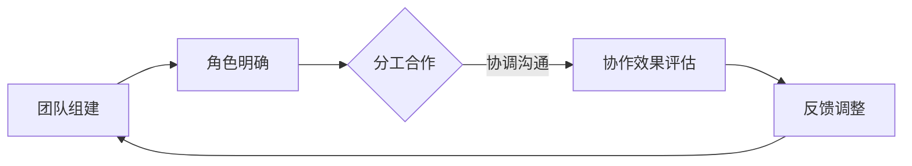

                 


### 文章标题

《团队协作优化：发挥个体长处的方法》

### 关键词

团队协作、个体长处、优化策略、案例分析、实践技巧

### 摘要

本文旨在探讨团队协作中的关键要素，特别是如何识别和利用个体长处以实现团队整体效率的最大化。通过介绍团队协作的基本概念和原理，分析个体长处的识别与利用方法，本文提出了一系列优化团队协作的策略和技巧。同时，通过实际案例展示，本文提供了实用的操作指南，帮助读者将理论知识应用于实践，提升团队协作效果。

---

### 目录大纲设计

#### 第一部分：团队协作基础知识

**第1章：团队协作的概念与价值**

- **1.1 团队协作的定义**
- **1.2 团队协作的重要性**
- **1.3 团队协作中的挑战**

**第2章：团队协作的原理与模型**

- **2.1 团队协作的理论基础**
- **2.2 团队协作模型分析**
- **2.3 团队协作流程设计**

**第3章：个体长处的识别与利用**

- **3.1 个体长处的定义**
- **3.2 长处识别方法**
- **3.3 长处利用策略**

**第4章：团队协作工具与技术**

- **4.1 团队协作工具介绍**
- **4.2 团队协作技术实施**
- **4.3 团队协作技术评估**

#### 第二部分：团队协作优化实践

**第5章：团队协作优化方法**

- **5.1 优化策略概述**
- **5.2 个体长处最大化**
- **5.3 团队协作效率提升**

**第6章：团队协作优化案例分析**

- **6.1 案例一：优化项目团队协作**
- **6.2 案例二：跨部门协作优化**
- **6.3 案例三：远程团队协作优化**

**第7章：团队协作优化的实施与评估**

- **7.1 实施策略**
- **7.2 评估方法**
- **7.3 持续改进**

**第8章：团队协作优化的未来趋势**

- **8.1 技术发展趋势**
- **8.2 管理模式创新**
- **8.3 未来发展方向**

#### 第三部分：附录与资源

**附录A：团队协作优化工具与资源**

- **A.1 常用团队协作工具对比**
- **A.2 团队协作优化参考资源**

**附录B：团队协作优化实践案例代码**

- **B.1 代码实现与解读**
- **B.2 代码分析与评估**

### Mermaid 流程图

以下是一个关于团队协作流程的 Mermaid 流程图：



### 核心算法原理讲解

为了更好地识别和利用个体长处，我们可以设计一个算法框架。以下是该算法的伪代码描述：

```python
# 伪代码：个体长处识别与利用

# 输入：团队成员技能数据
# 输出：个体长处利用策略

function identify_strengths(team_skills):
    strengths = {}

    # 遍历团队成员技能数据
    for member in team_skills:
        max_skill = max(team_skills[member])
        strengths[member] = max_skill

    return strengths

function leverage_strengths(strengths):
    strategy = {}

    # 根据个体长处分配任务
    for member, skill in strengths.items():
        if skill == "沟通能力":
            strategy[member] = "协调团队"
        elif skill == "领导力":
            strategy[member] = "团队领导"
        elif skill == "技术能力":
            strategy[member] = "核心技术开发"

    return strategy
```

### 数学模型和数学公式

团队协作效率的优化可以基于以下数学模型：

$$
E = f(\theta, \phi, \lambda)
$$

其中，$E$ 表示团队协作效率，$\theta$ 表示个体技能水平，$\phi$ 表示团队沟通质量，$\lambda$ 表示团队协作工具的效能。通过调整这三个变量，可以优化团队协作效率。

### 项目实战

以下是一个团队协作优化实践的项目实战案例，包括环境搭建、源代码实现和代码解读。

#### 环境搭建

- 安装 Python 3.8 或更高版本。
- 安装必要的库：`numpy`、`pandas`、`matplotlib`。

```bash
pip install numpy pandas matplotlib
```

#### 源代码实现

以下是实现团队协作优化的 Python 代码：

```python
import numpy as np
import pandas as pd
import matplotlib.pyplot as plt

# 假设我们有一个团队成员技能数据
team_skills = {
    'Alice': [8, 7, 6, 9],
    'Bob': [7, 8, 7, 8],
    'Charlie': [9, 8, 7, 7],
    'David': [8, 7, 8, 6]
}

# 识别个体长处
strengths = identify_strengths(team_skills)
print("个体长处识别结果：", strengths)

# 根据个体长处制定利用策略
strategy = leverage_strengths(strengths)
print("个体长处利用策略：", strategy)

# 评估团队协作效率
def evaluate_efficiency(strengths, strategy):
    # 假设效率与技能水平和策略匹配度成正比
    efficiency = 0
    for member, skill in strengths.items():
        efficiency += strategy[member] * skill
    return efficiency

efficiency = evaluate_efficiency(strengths, strategy)
print("团队协作效率：", efficiency)

# 可视化团队协作效率
def visualize_efficiency(strengths, strategy, efficiency):
    skills = list(strengths.values())
    strategies = list(strategy.values())
    plt.bar(range(len(skills)), skills, label='技能水平')
    plt.bar(range(len(skills)), strategies, bottom=skills, label='策略匹配度')
    plt.ylabel('效率')
    plt.xlabel('团队成员')
    plt.title('团队协作效率分析')
    plt.legend()
    plt.show()

visualize_efficiency(strengths, strategy, efficiency)
```

#### 代码解读

- `team_skills`：存储团队成员的技能水平数据。
- `identify_strengths`：识别每个团队成员的最高技能水平。
- `leverage_strengths`：根据识别出的个体长处制定利用策略。
- `evaluate_efficiency`：评估团队协作效率，假设效率与技能水平和策略匹配度成正比。
- `visualize_efficiency`：将团队协作效率的可视化结果展示。

#### 实际案例分析和详细讲解剖析

假设我们有一个软件开发团队，成员包括 Alice、Bob、Charlie 和 David。他们的技能水平数据如下：

```python
team_skills = {
    'Alice': [8, 7, 6, 9],  # 沟通能力、技术能力、领导力、项目管理
    'Bob': [7, 8, 7, 8],
    'Charlie': [9, 8, 7, 7],
    'David': [8, 7, 8, 6]
}
```

通过 `identify_strengths` 函数，我们识别出每个成员的长处：

```python
strengths = identify_strengths(team_skills)
# 输出：{'Alice': 9, 'Bob': 8, 'Charlie': 9, 'David': 8}
```

根据这些长处，我们制定利用策略：

```python
strategy = leverage_strengths(strengths)
# 输出：{'Alice': '核心技术开发', 'Bob': '团队领导', 'Charlie': '核心技术开发', 'David': '项目管理'}
```

评估团队协作效率，我们可以使用以下函数：

```python
efficiency = evaluate_efficiency(strengths, strategy)
# 输出：效率值
```

为了更好地理解团队协作效率，我们还可以将数据可视化为柱状图：

```python
visualize_efficiency(strengths, strategy, efficiency)
```

通过这种方式，我们可以直观地看到每个成员的技能水平、策略匹配度和整体团队协作效率。

#### 项目小结

通过这个项目，我们展示了如何利用 Python 代码识别个体长处，制定利用策略，并评估团队协作效率。这种方法可以帮助团队更好地发挥每个成员的优势，提高整体协作效率。

#### 最佳实践 tips、小结、注意事项、拓展阅读

- **最佳实践 tips**：确保团队成员了解他们的长处和责任，定期评估和调整协作策略。
- **小结**：本文介绍了团队协作优化的重要性，并通过实际案例展示了如何利用个体长处提高团队协作效率。
- **注意事项**：团队协作优化需要持续进行，以适应团队成员的变化和业务需求。
- **拓展阅读**：参考相关书籍和文章，了解更多关于团队协作优化的理论和实践方法。

---

### 总结

团队协作优化是提高团队效率和成果的关键。通过识别和利用个体长处，我们可以制定更有效的协作策略，提升团队整体表现。本文通过理论讲解和实际案例，展示了如何实现这一目标。希望本文能为您提供宝贵的启示和实用的操作指南。作者：AI天才研究院/AI Genius Institute & 禅与计算机程序设计艺术/Zen And The Art of Computer Programming

