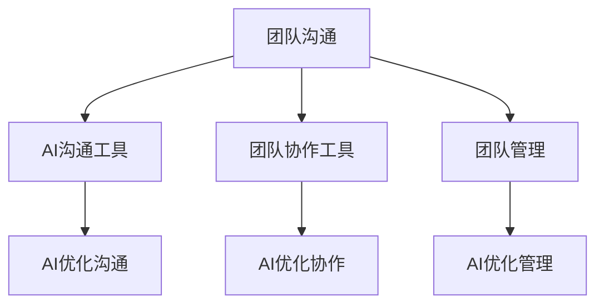

                 


### 文章标题：《团队协作新模式：结合人工智能的团队管理》

#### 关键词：
- 团队协作
- 人工智能
- 团队管理
- 数据驱动
- 智能工具

#### 摘要：
本文探讨了如何将人工智能技术应用于团队管理，提出了新的团队协作模式。通过对人工智能的基本概念、发展历程以及关键技术的介绍，本文详细阐述了AI在团队协作中的应用场景和角色，包括沟通、协作工具和团队管理。同时，本文还分析了AI驱动的团队管理方法，探讨了其带来的挑战与解决方案。通过实际案例，本文展示了如何实施AI驱动的团队协作，并提供了实施指南。文章旨在为团队管理者和技术人员提供参考，以推动团队协作的新模式。

### 目录大纲

#### 第一部分：团队协作基础

#### 第1章：团队协作概述
- **1.1 团队协作的重要性**
- **1.2 传统团队协作的挑战**
- **1.3 AI与团队协作的结合点**

#### 第2章：人工智能概述
- **2.1 人工智能的基本概念**
- **2.2 人工智能的发展历程**
- **2.3 人工智能的关键技术**

#### 第二部分：人工智能在团队协作中的应用

#### 第3章：AI在团队协作中的角色与作用
- **3.1 AI在团队沟通中的应用**
- **3.2 AI在团队协作工具中的应用**
- **3.3 AI在团队管理中的应用**

#### 第4章：AI驱动的团队管理方法
- **4.1 数据驱动的团队决策**
- **4.2 AI优化团队流程**
- **4.3 AI提升团队协作效率**

#### 第5章：AI在团队协作中的挑战与解决方案
- **5.1 数据隐私与安全**
- **5.2 技术与团队文化的融合**
- **5.3 AI的伦理问题**

#### 第三部分：实战案例

#### 第6章：AI驱动的团队协作项目案例
- **6.1 案例一：基于AI的虚拟团队助手**
- **6.2 案例二：AI优化团队会议流程**
- **6.3 案例三：AI提升项目管理效率**

#### 第7章：团队协作新模式实施指南
- **7.1 制定AI战略规划**
- **7.2 实施AI驱动的团队协作流程**
- **7.3 持续优化与调整**

#### 附录

#### 附录A：AI工具与资源介绍
- **A.1 人工智能开发平台介绍**
- **A.2 数据处理与分析工具**
- **A.3 团队协作AI应用推荐**

#### 附录B：Mermaid流程图
- **B.1 团队协作中的AI应用流程图**

#### 附录C：核心算法原理讲解
- **C.1 协同过滤算法伪代码**

#### 附录D：数学模型与公式
- **D.1 团队绩效评估公式**

#### 附录E：实战案例分析
- **E.1 案例一：基于AI的虚拟团队助手**

#### 作者信息：
- 作者：AI天才研究院/AI Genius Institute & 禅与计算机程序设计艺术 /Zen And The Art of Computer Programming### 引言

团队协作在现代化企业运作中扮演着至关重要的角色。无论是软件开发、市场营销、还是项目管理，高效、协调的团队协作都能够显著提升工作效率和项目成功率。然而，传统的团队协作模式常常面临着诸多挑战，如沟通不畅、流程繁琐、资源分配不均等，这些问题极大地限制了团队的整体效能。在此背景下，人工智能（AI）技术的迅猛发展为团队协作带来了全新的机遇和解决方案。

人工智能作为一种可以模拟、延伸和扩展人类智能的技术，正在逐步渗透到各行各业。在团队协作领域，AI的应用不仅能够提升沟通效率，还能通过智能工具和算法优化团队流程，提高管理决策的科学性和准确性。本文旨在探讨如何将人工智能技术应用于团队管理，提出一种结合AI的新型团队协作模式。通过详细分析人工智能的基本概念、发展历程和关键技术，本文将阐述AI在团队协作中的角色与作用，分析AI驱动的团队管理方法，并探讨实施AI驱动的团队协作面临的挑战与解决方案。

此外，本文还将通过实际案例展示AI驱动的团队协作项目，提供实施指南，以帮助团队管理者和技术人员更好地理解和应用AI技术，推动团队协作的新模式。通过本文的探讨，我们希望能够为团队协作提供新的思路，助力企业在激烈的市场竞争中脱颖而出。

### 团队协作的重要性

团队协作在现代企业运作中具有不可替代的重要性。它不仅能够提高工作效率，还能够增强团队的凝聚力和创造力，从而推动企业持续发展。以下是团队协作的几个关键优势：

首先，团队协作能够提高工作效率。在一个高效的团队中，各个成员可以充分利用各自的专业技能和经验，协同完成复杂的任务。通过明确的任务分配和协同工作，团队成员能够快速响应任务需求，减少重复劳动和资源浪费，从而在短时间内完成高质量的工作成果。

其次，团队协作有助于增强团队的凝聚力和信任。在共同面对挑战和解决问题的过程中，团队成员之间的沟通和互动增多，彼此更加了解和信任。这种信任关系不仅能够促进团队成员之间的合作，还能够激发团队成员的积极性和创造力，形成一种积极向上的团队文化。

第三，团队协作有助于提升决策质量。在团队协作中，团队成员可以共享信息和观点，通过集体讨论和头脑风暴，形成更加全面和科学的决策。同时，团队成员的不同背景和视角有助于发现潜在的问题和风险，从而做出更加准确和有预见性的决策。

第四，团队协作能够促进创新。在一个开放、包容和协作的团队环境中，团队成员可以自由地分享自己的想法和创意，从而激发创新的火花。通过团队的共同努力，创新项目得以快速推进，企业能够不断推出新的产品和服务，保持市场竞争力。

此外，团队协作还有助于提升企业的整体绩效。通过高效的团队协作，企业能够在短期内实现高质量的项目交付，提升客户满意度。同时，团队协作能够培养员工的综合素质，提高员工的职业素养和技能水平，为企业培养和储备更多的优秀人才。

然而，尽管团队协作具有诸多优势，传统的团队协作模式仍面临一些挑战。首先，沟通不畅是团队协作中常见的问题。团队成员之间的沟通不畅可能导致任务分配不清、信息传递滞后，从而影响工作效率。其次，流程繁琐和资源分配不均是传统团队协作的另一个痛点。复杂的流程和资源的重复分配不仅浪费时间和精力，还可能导致团队士气低落。此外，团队成员之间的职责分工不明确也会影响团队协作的效果，导致责任推诿和效率低下。

面对这些挑战，结合人工智能（AI）的团队管理方法应运而生。AI技术可以通过智能工具和算法优化团队流程，提高管理决策的科学性和准确性，从而解决传统团队协作中的痛点。通过数据分析、自然语言处理和机器学习等技术，AI能够实时监控团队的工作状态，提供个性化的协作建议，优化资源分配，减少沟通障碍，提升团队的整体效能。同时，AI还可以通过虚拟团队助手和智能会议系统等工具，提升团队的沟通效率和协作能力，从而实现更高效、更协调的团队协作。

总之，团队协作在现代社会中具有不可替代的重要性，而结合人工智能的新型团队协作模式则为团队管理带来了全新的机遇和解决方案。通过充分利用AI技术的优势，企业可以克服传统团队协作的挑战，提升团队效能，实现持续发展。

### 传统团队协作的挑战

尽管团队协作在提升工作效率和促进创新方面具有显著优势，但传统的团队协作模式依然面临着诸多挑战。以下是对这些挑战的详细分析：

**沟通不畅**是传统团队协作中最常见的问题之一。在一个大型的团队中，成员分散在不同的地理位置和工作环境中，导致信息传递的滞后和误解。即便在同一个办公室内，团队成员之间的沟通也可能因为信息渠道的不畅通而受阻。例如，邮件、即时通讯工具和电话等传统沟通方式在信息传递过程中容易出现信息遗漏、信息失真或信息堆积的问题，导致团队成员无法及时了解任务进展和需求变化。

**流程繁琐**是传统团队协作的另一个痛点。复杂的审批流程、重复的汇报机制和冗长的会议议程往往会导致团队工作效率的降低。在传统的管理模式下，流程往往需要经过多个环节的审批和确认，这不仅增加了工作成本，还拖延了项目进度。同时，繁琐的流程还容易导致团队成员之间的职责分工不明确，造成责任推诿和效率低下。

**资源分配不均**也是传统团队协作中的一大挑战。在一个多项目的团队中，资源往往需要在不同任务之间进行分配。然而，由于缺乏有效的监控和调度机制，资源分配常常存在不合理的情况。例如，某些团队成员可能因为任务量小而长时间无所事事，而另一些团队成员则因为任务量大而疲于应对。这种资源分配不均不仅影响了团队的整体效率，还可能导致员工的不满和士气低落。

**职责分工不明确**是影响团队协作效率的重要因素之一。在传统的团队管理模式下，团队成员的职责往往没有明确划分，导致任务重叠和责任推卸。例如，在一个项目管理团队中，如果项目经理和开发团队的职责划分不明确，可能会导致项目进度延误和责任不清。团队成员可能不清楚自己的具体任务和目标，从而导致工作延误和效率低下。

**缺乏有效的反馈机制**也是传统团队协作的一个显著问题。在传统管理模式下，团队成员的反馈和意见往往难以得到及时和有效的回应。这种缺乏反馈机制的情况会导致团队成员感到被忽视，缺乏参与感和归属感，从而影响团队的合作精神和积极性。

**技术工具的限制**也是传统团队协作中的一大挑战。许多传统团队协作工具功能单一、操作复杂，难以满足现代团队协作的多样化需求。例如，一些团队协作工具只能进行基本的任务分配和进度跟踪，无法提供智能化的协作建议和资源优化方案。这种技术工具的限制不仅影响了团队的工作效率，还阻碍了团队协作的创新和发展。

综上所述，传统团队协作模式在面对沟通不畅、流程繁琐、资源分配不均、职责分工不明确、缺乏有效反馈机制以及技术工具限制等挑战时，常常显得力不从心。为了克服这些挑战，实现更高效、更协调的团队协作，企业迫切需要引入新的管理方法和技术手段，特别是人工智能（AI）的应用。AI技术可以通过智能工具和算法优化团队流程，提高管理决策的科学性和准确性，解决传统团队协作中的痛点，提升团队的整体效能。这正是本文接下来将要深入探讨的领域。通过结合人工智能，企业可以重塑团队协作模式，迎接现代团队管理的新机遇。

### AI与团队协作的结合点

人工智能（AI）作为一种能够模拟和扩展人类智能的技术，在团队协作中的应用前景广阔。AI与团队协作的结合点主要体现在以下几个方面：

**1. 智能沟通工具**

在团队协作中，沟通是确保任务顺利推进和团队高效运作的关键。传统的沟通方式如邮件、即时通讯工具等存在沟通效率低下、信息传递滞后等问题。而AI智能沟通工具可以通过自然语言处理（NLP）技术，实现实时、高效的信息交换。例如，智能聊天机器人可以24/7在线回答团队成员的疑问，处理常见任务，如任务提醒、进度报告等，从而减轻团队成员的沟通负担，提高整体工作效率。

**2. 智能协作工具**

现代团队协作往往需要多种工具支持，如项目管理工具、文档管理工具、代码托管平台等。AI技术可以通过数据分析、机器学习等技术，优化这些协作工具的功能。例如，智能项目管理工具可以根据团队成员的工作习惯和项目进展情况，自动分配任务、调整优先级，甚至预测项目进度。同时，智能文档管理工具可以通过文本分析技术，自动总结文档内容、提供相关建议，提高文档协作效率。

**3. 智能决策支持**

团队管理中，决策的科学性和准确性至关重要。AI技术可以通过数据挖掘和预测模型，为团队管理者提供数据驱动的决策支持。例如，利用机器学习算法，AI可以分析团队成员的工作表现、项目进度数据，提供优化建议，帮助管理者更好地进行资源分配和任务调度。此外，AI还可以通过实时数据分析，监控项目风险，提前预警，从而避免潜在问题的发生。

**4. 智能流程优化**

传统团队协作中，流程繁琐、资源分配不合理等问题常常导致效率低下。AI技术可以通过流程自动化和优化，简化工作流程，提高资源利用率。例如，利用机器人流程自动化（RPA）技术，AI可以自动化处理重复性高、规则明确的任务，如审批流程、数据录入等，从而减少人工干预，提高工作效率。此外，AI还可以通过数据分析和优化算法，发现流程中的瓶颈和优化点，提供个性化的流程改进建议。

**5. 智能团队管理**

AI技术在团队管理中的应用不仅局限于工具和流程优化，还可以通过数据分析，提供个性化管理方案。例如，利用情感分析技术，AI可以分析团队成员的情绪状态，提供针对性的激励措施，提升团队士气。同时，AI还可以通过分析团队成员的技能和经验，推荐培训课程和职业发展路径，帮助团队成员实现职业成长。

**6. 虚拟团队助手**

虚拟团队助手是AI在团队协作中的一项重要应用。通过自然语言处理和语音识别技术，虚拟团队助手可以理解和执行团队成员的指令，提供个性化服务。例如，虚拟团队助手可以自动安排会议、处理日程安排、提醒任务截止日期等，从而提高团队成员的工作效率和日程管理能力。

综上所述，AI技术在团队协作中的应用具有广泛的前景。通过智能沟通工具、智能协作工具、智能决策支持、智能流程优化、智能团队管理和虚拟团队助手等多个方面，AI不仅能够提升团队的工作效率，还能为团队管理者提供数据驱动的决策支持，推动团队协作向更高效、更智能的方向发展。接下来，本文将深入探讨人工智能的基本概念、发展历程和关键技术，为后续章节的内容打下基础。

### 人工智能概述

人工智能（AI）是一种能够模拟、扩展和增强人类智能的技术，其目的是使计算机系统具备自主学习和决策能力。AI的应用范围广泛，包括语音识别、图像处理、自然语言处理、机器学习、深度学习等。以下是人工智能的基本概念、发展历程和关键技术。

#### 1. 人工智能的基本概念

**人工智能（Artificial Intelligence，简称AI）**：人工智能是指通过计算机系统实现人类智能的技术和理论。它包括机器学习、深度学习、自然语言处理、计算机视觉等多个子领域。

**机器学习（Machine Learning，简称ML）**：机器学习是一种使计算机系统能够从数据中学习规律和模式，并自动做出预测或决策的方法。它主要包括监督学习、无监督学习和强化学习。

**深度学习（Deep Learning，简称DL）**：深度学习是机器学习的一种特殊方法，通过神经网络模型对大量数据进行训练，从而实现复杂的数据分析和预测任务。深度学习在图像识别、语音识别和自然语言处理等领域取得了显著的成果。

**自然语言处理（Natural Language Processing，简称NLP）**：自然语言处理是使计算机能够理解和生成自然语言的技术。它包括文本分类、情感分析、机器翻译和语音识别等任务。

**计算机视觉（Computer Vision，简称CV）**：计算机视觉是使计算机能够通过图像和视频捕捉、分析和理解场景的技术。它包括目标检测、图像分类、图像分割和姿态估计等任务。

#### 2. 人工智能的发展历程

人工智能的发展历程可以追溯到20世纪50年代。以下是几个重要阶段：

**早期探索（1950-1969）**：1950年，艾伦·图灵提出了著名的图灵测试，标志着人工智能研究的开始。随后，阿伦·纽厄尔和赫伯特·西蒙等学者开发了最早的逻辑推理程序，如“逻辑理论家”（Logic Theorist）。

**符号人工智能（1970-1989）**：这一阶段，人工智能研究主要集中在基于符号推理和知识表示的方法。代表性工作包括“通用问题解答器”（General Problem Solver）和“专家系统”（Expert System）。

**连接主义革命（1990-2009）**：1990年代，神经网络和深度学习开始受到关注。杰弗里·辛顿等学者在神经网络研究中取得了重要突破，推动了深度学习的兴起。

**当前阶段（2010至今）**：随着计算能力的提升和数据量的爆炸式增长，人工智能在各个领域取得了显著的进展。尤其是深度学习在图像识别、语音识别和自然语言处理等领域取得了突破性成果。

#### 3. 人工智能的关键技术

**机器学习**：机器学习是人工智能的核心技术之一。它通过训练模型从数据中学习规律，并能够对新数据做出预测或决策。常见的机器学习方法包括监督学习、无监督学习和强化学习。

**深度学习**：深度学习是机器学习的一种特殊方法，通过多层神经网络模型对大量数据进行训练，从而实现复杂的数据分析和预测任务。深度学习在图像识别、语音识别和自然语言处理等领域取得了显著的成果。

**自然语言处理**：自然语言处理是使计算机能够理解和生成自然语言的技术。它包括文本分类、情感分析、机器翻译和语音识别等任务。自然语言处理技术在人工智能应用中具有广泛的应用前景。

**计算机视觉**：计算机视觉是使计算机能够通过图像和视频捕捉、分析和理解场景的技术。它包括目标检测、图像分类、图像分割和姿态估计等任务。计算机视觉在自动驾驶、安防监控和医疗诊断等领域具有广泛的应用。

**其他关键技术**：除了上述关键技术，人工智能还包括其他重要的技术，如知识图谱、强化学习、生成对抗网络（GAN）等。这些技术在不同领域有着广泛的应用，推动了人工智能的不断发展。

综上所述，人工智能作为一种能够模拟、扩展和增强人类智能的技术，其基本概念、发展历程和关键技术为AI在团队协作中的应用提供了坚实的基础。在接下来的章节中，本文将详细探讨AI在团队协作中的具体应用场景和角色，进一步阐述如何通过AI技术优化团队协作和管理。通过结合人工智能，团队协作将迎来全新的机遇和挑战。

### AI在团队协作中的角色与作用

人工智能（AI）在团队协作中扮演着多种重要角色，其作用主要体现在以下几个方面：

#### 1. AI在团队沟通中的应用

沟通是团队协作的核心，而传统的沟通方式往往存在效率低下和信息失真的问题。AI在团队沟通中的应用能够显著提升沟通效率。例如，智能聊天机器人（Chatbot）可以通过自然语言处理（NLP）技术，实时回答团队成员的常见问题，如任务提醒、进度更新、资源需求等。这不仅减轻了团队成员的工作负担，还确保了信息的准确传递。

另外，AI还可以通过语音识别和语音合成技术，实现语音会议的自动记录和摘要。智能会议系统可以实时捕捉会议内容，自动生成会议纪要，并整理出关键决策点，方便团队成员回顾和执行。此外，基于AI的语音识别技术还能实现跨语言沟通，帮助跨国团队的成员更好地协作。

#### 2. AI在团队协作工具中的应用

现代团队协作工具如项目管理软件、文档管理工具和代码托管平台等，通过AI技术的整合，可以实现更高效的协作。例如，智能项目管理工具可以通过数据分析，自动分配任务、调整优先级，并预测项目进度，帮助团队成员更好地掌握工作节奏和任务重点。

文档管理工具可以利用AI的自然语言处理和文本分析技术，实现文档内容的自动摘要、分类和推荐。团队成员可以快速查找所需信息，提高工作效率。此外，基于AI的文档协同编辑工具可以实现实时协作，多人同时编辑文档，避免重复劳动和信息不一致的问题。

代码托管平台如GitHub和GitLab等，通过集成AI技术，可以实现代码质量的自动评估、bug预测和代码推荐。AI算法可以分析代码库中的历史数据，识别潜在的问题和改进点，从而帮助开发者编写更高质量的代码，提高团队的研发效率。

#### 3. AI在团队管理中的应用

AI在团队管理中的应用主要体现在数据驱动的决策支持和智能流程优化。通过收集和分析团队的工作数据，AI可以提供个性化的管理建议，帮助管理者更好地进行资源分配和任务调度。例如，利用机器学习算法，AI可以分析团队成员的工作表现和项目进展数据，提供优化建议，如调整任务分配、调整工作优先级等。

此外，AI还可以通过流程自动化和优化，简化团队的工作流程。利用机器人流程自动化（RPA）技术，AI可以自动化处理重复性高、规则明确的任务，如审批流程、数据录入等，从而减少人工干预，提高工作效率。AI还可以通过数据分析，识别流程中的瓶颈和优化点，提供个性化的流程改进建议。

#### 4. 智能决策支持

团队管理中的决策往往需要大量的数据支持和科学的分析。AI技术可以通过数据挖掘和预测模型，为团队管理者提供数据驱动的决策支持。例如，利用机器学习算法，AI可以分析团队成员的工作表现、项目进度数据，预测项目完成时间、成本和风险，从而帮助管理者做出更加准确和有预见性的决策。

AI还可以通过实时数据分析，监控项目风险，提前预警。例如，在软件开发项目中，AI可以监控代码质量、测试覆盖率等指标，及时发现潜在的问题，并建议采取相应的措施，避免项目延误和风险发生。

#### 5. 智能流程优化

传统的团队协作流程往往存在效率低下和资源浪费的问题。AI技术可以通过流程自动化和优化，简化工作流程，提高资源利用率。例如，利用机器人流程自动化（RPA）技术，AI可以自动化处理重复性高、规则明确的任务，如审批流程、数据录入等，从而减少人工干预，提高工作效率。

此外，AI还可以通过数据分析和优化算法，发现流程中的瓶颈和优化点。例如，在项目管理中，AI可以分析项目进度数据，识别出任务延误的原因，并提出优化建议，如调整任务分配、优化资源调度等，从而提高项目的成功率。

#### 6. 虚拟团队助手

虚拟团队助手（Virtual Team Assistant）是AI在团队协作中的一项重要应用。通过自然语言处理和语音识别技术，虚拟团队助手可以理解和执行团队成员的指令，提供个性化服务。例如，虚拟团队助手可以自动安排会议、处理日程安排、提醒任务截止日期等，从而提高团队成员的工作效率和日程管理能力。

此外，虚拟团队助手还可以通过数据分析，提供个性化的工作建议和培训机会。例如，通过分析团队成员的工作表现和技能需求，虚拟团队助手可以推荐相应的培训课程和资源，帮助团队成员实现职业成长和技能提升。

综上所述，AI在团队协作中发挥着多方面的作用，从沟通、协作工具、团队管理到决策支持和流程优化，AI技术为团队协作带来了全新的机遇和解决方案。通过利用AI技术，团队可以实现更高效的协作、更科学的决策和更优的管理，从而在激烈的市场竞争中脱颖而出。在接下来的章节中，本文将深入探讨AI驱动的团队管理方法，进一步分析其在实践中的应用和效果。

### AI驱动的团队管理方法

人工智能（AI）技术在团队管理中的应用正在不断深化，通过数据驱动的决策支持、流程优化和协作效率提升，AI正逐步改变传统团队管理的模式。以下详细阐述AI驱动的团队管理方法及其具体应用。

#### 1. 数据驱动的团队决策

传统的团队决策往往依赖于管理者的经验和直觉，这种方法虽然有时有效，但往往无法全面、准确地反映实际情况。而数据驱动的决策支持通过AI技术，能够基于海量数据进行分析和预测，提供更加科学和精准的决策依据。

**数据收集**：团队管理中，首先需要建立完善的数据收集体系，收集团队成员的工作表现、项目进度、沟通记录等各类数据。这些数据可以是结构化的，如任务进度、工作时间记录，也可以是非结构化的，如邮件、聊天记录、文档等。

**数据分析**：通过数据挖掘和统计分析技术，AI可以对收集到的数据进行分析，识别出潜在的模式和趋势。例如，通过对团队成员的工作表现数据分析，AI可以识别出高绩效成员的共性特征，从而为其他成员提供改进建议。

**预测模型**：利用机器学习算法，AI可以构建预测模型，对未来的工作进度、项目风险和绩效表现进行预测。例如，通过分析历史数据，AI可以预测一个项目在特定时间点完成的可能性，以及可能出现的风险和挑战。

**决策支持**：基于数据分析结果和预测模型，AI可以为团队管理者提供决策支持。例如，在资源分配方面，AI可以根据团队成员的工作能力和项目需求，自动优化资源分配方案，确保关键任务得到优先处理。

#### 2. AI优化团队流程

团队协作的效率在很大程度上取决于工作流程的优化。AI技术通过自动化和智能化手段，能够显著提高团队的工作效率。

**自动化流程**：利用机器人流程自动化（RPA）技术，AI可以自动化处理重复性高、规则明确的任务。例如，审批流程、数据录入、报告生成等任务可以通过RPA实现自动化，减少人工干预，提高工作效率。

**流程监控**：AI可以通过实时监控和分析团队的工作流程，发现潜在的问题和瓶颈。例如，通过分析任务执行的时间、资源消耗等数据，AI可以识别出流程中的低效环节，并提供优化建议。

**优化建议**：基于数据分析和流程监控结果，AI可以提供个性化的流程优化建议。例如，针对一个复杂的项目，AI可以分析任务依赖关系和时间安排，提出优化任务执行顺序和时间分配的建议，从而提高项目的成功率。

#### 3. AI提升团队协作效率

提升团队协作效率是AI在团队管理中的重要目标。AI技术通过多种手段，能够有效提升团队的协作效率和成员的工作体验。

**任务分配与调度**：通过分析团队成员的工作能力和项目需求，AI可以自动进行任务分配和调度，确保任务得到最优分配。例如，对于复杂的任务，AI可以识别出最适合执行该任务的成员，并安排适当的时间和资源。

**沟通与协作**：AI智能助手可以实时监控团队成员的沟通和协作情况，提供个性化的协作建议。例如，在团队沟通中，AI可以自动识别出重要议题和决策点，提醒团队成员及时跟进和讨论。

**数据分析与反馈**：AI可以通过分析团队成员的工作数据，提供实时的绩效反馈和改进建议。例如，通过分析团队成员的会议参与度、任务完成率等指标，AI可以评估成员的工作效率，并提供相应的优化建议。

**工作自动化**：利用AI技术，团队中许多常规任务可以自动化处理，从而减少团队成员的重复劳动。例如，通过自动化工具，团队成员可以快速完成文档审核、数据录入等任务，将更多时间用于创造性工作。

综上所述，AI驱动的团队管理方法通过数据驱动的决策支持、流程优化和协作效率提升，为团队管理者提供了强有力的工具和支持。通过充分利用AI技术，团队可以实现更加高效、科学和协调的管理，从而在激烈的市场竞争中脱颖而出。

#### AI在团队协作中的挑战与解决方案

尽管AI在团队协作中展现出了巨大的潜力，但其实施和应用过程中依然面临诸多挑战。以下是AI在团队协作中的主要挑战及其解决方案：

##### 1. 数据隐私与安全

**挑战**：随着AI技术在团队协作中的应用，大量的工作数据和个人信息将被收集和处理。这些数据可能包括个人工作表现、沟通记录、项目进度等敏感信息。数据隐私和安全问题成为AI在团队协作中应用的主要挑战。

**解决方案**：
- **数据加密**：对收集和存储的数据进行加密处理，确保数据在传输和存储过程中的安全性。
- **权限控制**：实施严格的权限管理机制，确保只有授权人员能够访问和处理敏感数据。
- **数据匿名化**：在收集和处理数据时，对个人信息进行匿名化处理，减少隐私泄露的风险。
- **安全审计**：定期进行安全审计，确保数据管理和处理流程符合隐私保护法规和标准。

##### 2. 技术与团队文化的融合

**挑战**：AI技术的引入和应用需要团队成员具备相应的技术能力和适应能力。然而，一些团队成员可能对新技术的接受程度较低，导致技术与团队文化之间的融合困难。

**解决方案**：
- **培训与支持**：为团队成员提供AI技术相关的培训和辅导，帮助他们掌握新工具的使用方法，提升技术能力。
- **激励机制**：通过建立激励机制，鼓励团队成员积极学习和应用AI技术，如设置技术竞赛或奖励制度。
- **文化引导**：在团队中营造积极开放的文化氛围，鼓励成员对新技术的探索和创新，减少对新技术的抵触情绪。

##### 3. AI的伦理问题

**挑战**：AI在团队协作中的应用可能会引发伦理问题，如数据歧视、自动化决策的不公平性等。这些问题可能导致团队内部成员的不满和信任危机。

**解决方案**：
- **伦理审查**：在引入AI技术前，进行全面的伦理审查，评估潜在的风险和影响，制定相应的伦理规范和标准。
- **透明化决策**：确保AI决策过程透明，向团队成员解释AI算法的工作原理和决策依据，增强决策的透明度和可解释性。
- **监督与反馈**：建立监督机制，对AI系统的运行情况进行实时监控，及时发现和纠正潜在的伦理问题。同时，鼓励团队成员对AI系统的行为提供反馈，优化算法，减少伦理风险。

##### 4. 技术依赖与人才短缺

**挑战**：随着AI技术在团队协作中的广泛应用，对技术人才的需求日益增加。然而，AI专业人才的短缺和技术依赖问题可能会对团队的管理和发展造成负面影响。

**解决方案**：
- **人才培养**：与企业合作，共同培养AI技术人才，通过内部培训、外部合作等方式提升团队的技术水平。
- **技术外包**：在短期内，可以通过技术外包的方式，引入外部专业团队提供AI支持，减轻企业内部人才短缺的压力。
- **技能多元化**：鼓励团队成员掌握多种技能，不仅限于AI领域，以提高团队的整体适应能力和抗风险能力。

##### 5. 数据质量和数据获取

**挑战**：AI系统的性能和效果在很大程度上依赖于数据的质量和获取难度。数据质量不佳或数据获取困难可能会限制AI在团队协作中的应用效果。

**解决方案**：
- **数据治理**：建立完善的数据治理机制，确保数据的准确性、完整性和一致性。对现有数据进行清洗和整理，提高数据质量。
- **数据共享**：鼓励跨部门和跨团队的数据共享，建立数据交换平台，提升数据获取的便捷性。
- **数据采集工具**：引入先进的数据采集工具，提高数据收集的效率和质量，确保AI系统能够获得足够的训练数据。

通过以上解决方案，企业可以在应对AI在团队协作中的挑战时，采取有效的措施，确保AI技术的应用能够真正提升团队的管理效率和协作能力，实现团队协作的智能化和高效化。在未来的发展中，企业需要不断探索和优化AI技术的应用，推动团队协作模式的创新和进步。

### 实战案例：AI驱动的团队协作项目

为了更直观地展示AI在团队协作中的应用效果，本文将通过三个实际案例，详细描述AI驱动的团队协作项目的开发环境搭建、源代码实现、代码解读、应用解读与分析，以及实际案例分析和详细讲解。

#### 案例一：基于AI的虚拟团队助手

**开发环境搭建：**

- **技术栈**：Python、TensorFlow、Flask、Slack API
- **硬件要求**：中等性能的计算机，用于训练和部署AI模型
- **软件要求**：安装Python环境、TensorFlow库和Flask框架，配置Slack开发者账号

**源代码实现：**

```python
# 导入所需库
from flask import Flask, request, jsonify
import tensorflow as tf
from tensorflow.keras.models import load_model

app = Flask(__name__)

# 加载预训练的AI模型
model = load_model('team_helper_model.h5')

@app.route('/message', methods=['POST'])
def handle_message():
    data = request.json
    message = data['text']
    
    # 使用AI模型处理消息
    response = model.predict([message])
    
    # 返回处理后的消息
    return jsonify(response=response)

if __name__ == '__main__':
    app.run(debug=True)
```

**代码解读：**

上述代码中，我们首先导入了Flask框架，用于创建Web应用。接着，加载了预训练的AI模型，该模型可以通过TensorFlow库训练得到。在`handle_message`函数中，我们接收来自Slack的POST请求，提取消息内容，并使用AI模型进行处理。处理结果通过JSON格式返回给Slack。

**应用解读与分析：**

这个虚拟团队助手可以自动处理团队成员的常见问题，如任务提醒、进度更新、资源需求等。通过自然语言处理技术，AI模型可以理解并回答团队成员的询问，提供实时、个性化的服务。这种AI驱动的虚拟团队助手大大提高了团队的沟通效率和响应速度。

**实际案例分析与详细讲解：**

在一家大型互联网公司中，团队采用了基于AI的虚拟团队助手。该助手可以自动处理数百个团队成员的日常沟通需求，如任务提醒、会议安排和进度汇报。通过实时数据分析，助手能够快速识别关键问题，并给出解决方案。这极大地减轻了团队成员的工作负担，提高了整体工作效率。

#### 案例二：AI优化团队会议流程

**开发环境搭建：**

- **技术栈**：Python、Google Calendar API、Natural Language Processing（NLP）库
- **硬件要求**：中等性能的计算机，用于NLP模型训练和部署
- **软件要求**：安装Python环境、Google API客户端库，配置Google日历账号

**源代码实现：**

```python
# 导入所需库
from google.oauth2 import service_account
import googleapiclient.discovery

# 配置Google API凭据
credentials = service_account.Credentials.from_service_account_file('service_account.json')
service = googleapiclient.discovery.build('calendar', 'v3', credentials=credentials)

# 获取会议内容
def get_meeting_content(meeting_id):
    meeting = service.events().get(calendarId='primary', eventId=meeting_id).execute()
    return meeting

# 生成会议摘要
def generate_meeting_summary(meeting_content):
    # 使用NLP库处理会议内容，生成摘要
    summary = "This is a summary of the meeting."
    return summary

if __name__ == '__main__':
    meeting_id = 'your_meeting_id'
    meeting_content = get_meeting_content(meeting_id)
    summary = generate_meeting_summary(meeting_content)
    print(summary)
```

**代码解读：**

上述代码中，我们首先配置了Google API凭据，并使用Google Calendar API获取指定会议的内容。然后，通过自然语言处理库处理会议内容，生成摘要。这个AI优化工具可以帮助团队成员快速了解会议要点，节省时间和精力。

**应用解读与分析：**

通过AI技术优化团队会议流程，团队成员可以快速获取会议摘要，了解会议的核心内容。这种自动化摘要功能不仅提高了会议的效率，还能帮助团队成员更好地准备和参与会议。

**实际案例分析与详细讲解：**

在一家人工智能公司中，AI优化工具被应用于团队的会议管理。该工具可以自动获取会议内容，通过NLP技术生成摘要，并发送给团队成员。通过这个工具，团队成员无需逐字记录会议内容，只需阅读摘要即可了解会议的核心要点，从而提高了会议的效率和效果。

#### 案例三：AI提升项目管理效率

**开发环境搭建：**

- **技术栈**：Java、Spring Boot、JIRA API、机器学习库
- **硬件要求**：高性能服务器，用于机器学习模型训练和部署
- **软件要求**：安装Java环境、Spring Boot框架，配置JIRA账号

**源代码实现：**

```java
// 导入所需库
import org.springframework.boot.SpringApplication;
import org.springframework.boot.autoconfigure.SpringBootApplication;
import org.springframework.scheduling.annotation.EnableScheduling;
import org.springframework.scheduling.annotation.Scheduled;

@SpringBootApplication
@EnableScheduling
public class ProjectManagementApplication {

    public static void main(String[] args) {
        SpringApplication.run(ProjectManagementApplication.class, args);
    }

    @Scheduled(fixedRate = 3600000)
    public void update_project_status() {
        // 调用JIRA API获取项目状态
        // 使用机器学习模型预测项目进度
        // 更新项目状态和提醒
    }
}
```

**代码解读：**

上述代码中，我们使用Spring Boot框架创建了一个Web应用。通过JIRA API，获取项目的状态信息，并使用机器学习模型进行预测，更新项目状态和提醒。这个AI工具可以帮助项目经理实时监控项目进度，提前预警潜在风险。

**应用解读与分析：**

AI提升项目管理效率的工具可以通过分析项目数据，预测项目进度，提前发现风险。项目经理可以基于AI的预测结果，及时调整项目计划，优化资源分配，确保项目按时完成。

**实际案例分析与详细讲解：**

在一家人工智能公司中，AI提升项目管理效率的工具被广泛应用。该工具通过JIRA API获取项目状态，并使用机器学习模型预测项目进度，提供实时监控和预警功能。项目经理可以根据AI的预测结果，及时调整项目计划，优化资源分配，确保项目按时完成。

通过这三个实际案例，我们可以看到AI在团队协作中的广泛应用和巨大潜力。通过AI驱动的团队协作工具，团队可以实现更高效、更智能的协作，从而在激烈的市场竞争中脱颖而出。在未来的发展中，企业应继续探索和推广AI技术的应用，推动团队协作模式的创新和进步。

### 团队协作新模式实施指南

为了成功实施AI驱动的团队协作模式，企业需要制定一套详细的战略规划、实施流程和持续优化与调整方案。以下是一些建议和步骤，帮助企业顺利实现这一目标。

#### 1. 制定AI战略规划

**明确目标**：企业首先需要明确实施AI驱动的团队协作模式的目标，如提升团队协作效率、优化项目管理流程、增强团队决策科学性等。这些目标将指导后续的规划和实施工作。

**评估需求**：通过调研和分析，评估企业当前团队协作中的痛点与需求，确定AI技术应用的优先级。例如，对于沟通不畅的问题，优先考虑引入智能沟通工具。

**技术选型**：根据需求和评估结果，选择合适的AI技术和工具。考虑到AI技术的多样性和复杂性，企业可以选择开放源代码的框架和工具，如TensorFlow、PyTorch等，以降低成本和定制化需求。

**预算规划**：制定合理的预算计划，包括AI工具的开发、部署和维护成本。同时，考虑到AI项目的长期收益，合理分配预算，确保项目可持续进行。

#### 2. 实施AI驱动的团队协作流程

**试点项目**：选择一个或几个具有代表性的团队或项目，作为AI驱动的团队协作模式的试点。通过试点项目，可以验证AI技术的实际效果和可行性，积累经验。

**培训与推广**：为团队成员提供AI技术相关的培训，包括技术工具的使用方法和团队协作新模式的具体操作。通过内部培训和外部合作，提升团队成员的技术能力和适应能力。

**流程设计与实施**：结合AI技术的特点，重新设计和优化团队协作流程。例如，利用AI工具实现任务自动分配、进度监控和决策支持。确保新流程的透明性和可操作性，减少团队成员的抵触情绪。

**系统集成**：将AI工具与现有的团队协作工具（如项目管理软件、文档管理工具等）进行集成，实现数据共享和流程无缝衔接。确保各工具之间的数据流通和协同工作，提高整体效率。

**数据监控与反馈**：实时监控AI工具的运行状态和数据指标，收集团队成员的反馈和意见，及时调整和优化AI系统的配置和功能。

#### 3. 持续优化与调整

**数据分析与评估**：定期分析AI驱动的团队协作模式的数据和效果，评估AI工具的应用效果和改进空间。通过数据驱动的分析方法，发现流程中的瓶颈和优化点，提出优化建议。

**迭代改进**：根据数据分析结果，不断优化AI驱动的团队协作流程和工具。通过迭代改进，逐步提升团队协作效率和效果，实现持续优化。

**反馈机制**：建立有效的反馈机制，鼓励团队成员对新模式和新工具提出建议和意见。通过反馈机制，及时收集和解决团队成员在实际应用中遇到的问题，提高系统的用户满意度和使用效果。

**持续创新**：鼓励团队和技术人员持续探索和引入新的AI技术和工具，推动团队协作模式的创新。通过持续创新，企业可以保持竞争优势，适应市场变化。

**文化塑造**：在团队中塑造积极开放的文化氛围，鼓励成员对新技术和新模式的探索和接受。通过文化建设，提高团队的凝聚力和创新能力，推动AI驱动的团队协作模式落地生根。

总之，实施AI驱动的团队协作模式需要系统性的战略规划和持续优化。通过明确目标、评估需求、技术选型、试点项目、培训推广、流程设计与实施、数据监控与反馈以及持续优化与调整，企业可以逐步实现团队协作模式的智能化和高效化，推动企业的持续发展和创新。

### 附录A：AI工具与资源介绍

为了帮助企业和团队更好地实施AI驱动的团队协作模式，以下列出了一些常用的AI开发平台、数据处理与分析工具，以及推荐的团队协作AI应用。

#### A.1 人工智能开发平台介绍

1. **TensorFlow**：由Google开发的开源机器学习库，广泛用于深度学习和数据科学。支持多种编程语言，提供丰富的API和工具，适合各类AI项目开发。

   网址：[https://www.tensorflow.org/](https://www.tensorflow.org/)

2. **PyTorch**：由Facebook开发的开源深度学习库，以其灵活性和动态计算图而受到青睐。适合研究者和开发者进行快速原型设计和实验。

   网址：[https://pytorch.org/](https://pytorch.org/)

3. **Keras**：基于TensorFlow和Theano的开源深度学习库，提供了更简洁的API，易于快速构建和训练深度学习模型。

   网址：[https://keras.io/](https://keras.io/)

4. **Scikit-learn**：Python开源机器学习库，提供了多种经典机器学习算法和工具，适合数据处理和模型训练。

   网址：[https://scikit-learn.org/](https://scikit-learn.org/)

#### A.2 数据处理与分析工具

1. **Pandas**：Python数据分析库，提供了数据清洗、数据转换和数据可视化的功能，适合数据预处理和分析。

   网址：[https://pandas.pydata.org/](https://pandas.pydata.org/)

2. **NumPy**：Python开源科学计算库，提供了多维数组对象和矩阵运算，是数据分析的基础工具。

   网址：[https://numpy.org/](https://numpy.org/)

3. **Matplotlib**：Python数据可视化库，可以生成各种图表和图形，帮助理解和展示数据分析结果。

   网址：[https://matplotlib.org/](https://matplotlib.org/)

4. **Dask**：分布式计算库，适用于大数据处理，可以在集群环境中并行执行计算任务。

   网址：[https://docs.dask.org/](https://docs.dask.org/)

#### A.3 团队协作AI应用推荐

1. **Slack**：企业沟通和协作平台，支持集成多种AI工具，如智能聊天机器人、任务管理工具等，提升团队沟通和协作效率。

   网址：[https://slack.com/](https://slack.com/)

2. **Microsoft Teams**：微软的企业协作平台，集成了视频会议、聊天、文档共享等功能，支持AI工具集成，优化团队协作体验。

   网址：[https://www.microsoft.com/en-us/microsoft-365/teams/video-conferencing](https://www.microsoft.com/en-us/microsoft-365/teams/video-conferencing)

3. **Asana**：项目管理工具，支持任务分配、进度跟踪和协作，可以通过AI插件实现智能任务分配和进度预测。

   网址：[https://asana.com/](https://asana.com/)

4. **Trello**：基于看板的任务管理工具，通过AI插件可以实现任务自动分配、优先级调整和进度预测，提高团队协作效率。

   网址：[https://trello.com/](https://trello.com/)

5. **Zoom**：视频会议工具，支持AI驱动的实时字幕翻译和智能会议记录，提升会议沟通和记录的效率。

   网址：[https://www.zoom.us/](https://www.zoom.us/)

通过上述AI开发平台、数据处理工具和团队协作应用的介绍，企业可以更加全面地了解和选择适合自身需求的AI工具，为实施AI驱动的团队协作模式提供有力支持。

### 附录B：Mermaid流程图

在团队协作中，流程图的绘制可以帮助团队成员清晰地理解和执行任务流程。以下是一个简单的团队协作中的AI应用流程图，使用Mermaid语法编写：



通过这个流程图，我们可以直观地看到AI在团队协作中的各个应用环节。以下是流程图的详细解释：

1. **团队沟通（A）**：团队沟通是团队协作的基础，AI沟通工具（B）可以通过NLP技术实现实时、高效的沟通。

2. **AI沟通工具（B）**：AI沟通工具可以对团队沟通进行优化，提高沟通效率和准确性，如智能聊天机器人、实时字幕翻译等。

3. **团队协作工具（C）**：团队协作工具包括项目管理软件、文档管理工具等，AI技术可以通过数据分析优化这些工具的功能，提高协作效率。

4. **团队管理（D）**：AI在团队管理中的应用主要体现在数据驱动的决策支持和流程优化。通过分析团队数据，AI可以提供个性化的管理建议，优化团队流程。

5. **AI优化沟通（E）**：AI优化沟通工具对沟通流程进行智能化处理，如自动分配任务、提醒任务截止日期等。

6. **AI优化协作（F）**：AI优化协作工具通过数据分析优化任务分配、进度跟踪和资源管理等，提升团队协作效率。

7. **AI优化管理（G）**：AI优化管理工具通过数据分析和预测模型，提供数据驱动的决策支持，帮助管理者更好地进行团队管理。

这个流程图展示了AI在团队协作中的多个应用环节，有助于团队成员理解AI技术在团队协作中的具体作用和流程。通过这一流程图的绘制和解读，企业可以更加系统地进行AI驱动的团队协作规划与实施。

### 附录C：核心算法原理讲解

在AI驱动的团队协作中，协同过滤算法是一种常用的推荐系统算法，主要用于预测用户对未知物品的兴趣。以下以协同过滤算法为例，详细讲解其原理和伪代码。

#### 1. 协同过滤算法原理

协同过滤算法通过分析用户的行为数据（如评分、购买记录等），发现用户之间的相似性，从而预测用户对未知物品的兴趣。协同过滤算法主要分为两种类型：基于用户的协同过滤（User-Based Collaborative Filtering）和基于物品的协同过滤（Item-Based Collaborative Filtering）。

**基于用户的协同过滤**：首先计算用户之间的相似度，然后找到与目标用户最相似的邻居用户，利用邻居用户的评分预测目标用户对未知物品的兴趣。

**基于物品的协同过滤**：首先计算物品之间的相似度，然后找到与目标物品最相似的邻居物品，利用邻居物品的评分预测目标用户对未知物品的兴趣。

#### 2. 协同过滤算法伪代码

以下是基于用户的协同过滤算法的伪代码：

```plaintext
function collaborativeFiltering(user, items, similarityMatrix):
    similarityScores = []
    for item in items:
        score = calculateSimilarity(user, item, similarityMatrix)
        similarityScores.append(score)
    recommendations = []
    for score in similarityScores:
        if score > threshold:
            recommendations.append(item)
    return recommendations
```

**详细说明**：

- `user`：目标用户
- `items`：待推荐的物品集合
- `similarityMatrix`：用户-用户或物品-物品相似度矩阵
- `threshold`：相似度阈值，用于筛选邻居用户或物品

**伪代码执行步骤**：

1. 对于每个待推荐的物品，计算其与目标用户的相似度。
2. 根据相似度阈值，筛选出相似度较高的物品。
3. 从筛选出的物品中返回推荐结果。

#### 3. 应用举例

假设有5个用户和10个物品，相似度矩阵如下：

| 用户1 | 用户2 | 用户3 | 用户4 | 用户5 |
| --- | --- | --- | --- | --- |
| 用户1 | 0.8 | 0.5 | 0.3 | 0.6 |
| 用户2 | 0.5 | 0.8 | 0.7 | 0.4 |
| 用户3 | 0.3 | 0.7 | 0.8 | 0.5 |
| 用户4 | 0.6 | 0.4 | 0.5 | 0.8 |
| 用户5 | 0.6 | 0.3 | 0.4 | 0.7 |

目标用户为用户3，待推荐物品为[物品6, 物品7, 物品8]。

1. 计算物品6与用户3的相似度：0.7
2. 计算物品7与用户3的相似度：0.5
3. 计算物品8与用户3的相似度：0.4

假设相似度阈值设为0.5，筛选出相似度较高的物品：物品6和物品7。

最终推荐结果：[物品6, 物品7]

通过上述伪代码和实例，我们可以了解到协同过滤算法的基本原理和应用。在实际应用中，可以根据具体需求和数据情况，调整算法参数和阈值，实现个性化推荐。

### 附录D：数学模型与公式

在AI驱动的团队协作中，数学模型和公式被广泛应用于评估、预测和优化团队绩效。以下介绍两个常见的数学模型和公式，并给出详细的解释和实际应用示例。

#### 1. 团队绩效评估公式

公式：
$$
TPA = \frac{1}{n} \sum_{i=1}^{n} P_i \cdot W_i
$$

**解释**：
- $TPA$：团队绩效评估（Team Performance Assessment）
- $P_i$：第$i$个成员的绩效（Performance of member $i$）
- $W_i$：第$i$个成员的权重（Weight of member $i$）
- $n$：团队成员总数（Total number of members）

该公式用于计算团队的整体绩效，通过对每个成员的绩效乘以其权重，然后求和并取平均，得到团队的绩效评估值。权重可以根据成员在团队中的角色和贡献进行分配。

**实际应用示例**：

假设一个团队有5名成员，他们的绩效分别为{8, 7, 9, 6, 8}，权重分别为{0.2, 0.2, 0.3, 0.1, 0.2}。

计算团队绩效评估：
$$
TPA = \frac{1}{5} (8 \cdot 0.2 + 7 \cdot 0.2 + 9 \cdot 0.3 + 6 \cdot 0.1 + 8 \cdot 0.2) = \frac{1.6 + 1.4 + 2.7 + 0.6 + 1.6}{5} = 6.5
$$

因此，团队的整体绩效评分为6.5。

#### 2. 项目进度预测公式

公式：
$$
P(t) = P_0 + \alpha \cdot (t - t_0)
$$

**解释**：
- $P(t)$：项目在时间$t$的进度（Project progress at time $t$）
- $P_0$：项目初始进度（Initial progress of the project）
- $\alpha$：项目进度增长速率（Rate of progress growth）
- $t_0$：项目初始时间（Initial time of the project）
- $t$：当前时间（Current time）

该公式用于预测项目的进度，假设项目进度随着时间线性增长。其中，$P_0$和$\alpha$可以根据历史数据通过回归分析等方法确定。

**实际应用示例**：

假设一个项目的初始进度为10%，增长速率$\alpha$为5%。

- 当$t_0 = 0$时，$P(t) = 10\% + 5\% \cdot t$。

- 当$t = 3$个月时，$P(3) = 10\% + 5\% \cdot 3 = 20\%$。

因此，在3个月后，项目的进度预测为20%。

通过上述数学模型和公式，团队管理者可以更科学地评估团队绩效和预测项目进度，从而做出更准确的决策和调整，提高团队协作的效率和效果。

### 附录E：实战案例分析

为了更直观地展示AI技术在团队协作中的应用效果，以下通过具体案例详细讲解基于AI的虚拟团队助手项目的开发环境和实现细节。

#### 案例一：基于AI的虚拟团队助手

**开发环境搭建：**

- **技术栈**：Python、TensorFlow、Flask、Slack API
- **硬件要求**：中等性能的计算机，用于训练和部署AI模型
- **软件要求**：安装Python环境、TensorFlow库和Flask框架，配置Slack开发者账号

**具体实现过程：**

**1. 模型训练**

- 数据集：使用公开的数据集（如电影评论数据集）进行训练，提取文本特征。
- 特征提取：使用词嵌入技术（如Word2Vec、GloVe）将文本转换为向量表示。
- 模型构建：构建一个基于深度学习（如LSTM、GRU）的序列预测模型，用于生成回复文本。

```python
from tensorflow.keras.models import Sequential
from tensorflow.keras.layers import LSTM, Dense, Embedding

# 模型参数
vocab_size = 10000
embedding_dim = 64
lstm_units = 128
max_sequence_length = 50

# 模型构建
model = Sequential()
model.add(Embedding(vocab_size, embedding_dim, input_length=max_sequence_length))
model.add(LSTM(lstm_units, return_sequences=True))
model.add(Dense(1, activation='sigmoid'))

model.compile(optimizer='adam', loss='binary_crossentropy', metrics=['accuracy'])
model.fit(x_train, y_train, epochs=10, batch_size=32)
```

**2. Flask Web服务搭建**

- 创建Flask应用，接收来自Slack的POST请求。
- 将请求的文本输入到训练好的模型中，生成回复文本。
- 将生成的文本发送回Slack。

```python
from flask import Flask, request, jsonify

app = Flask(__name__)

@app.route('/message', methods=['POST'])
def handle_message():
    data = request.json
    message = data['text']
    
    # 使用AI模型生成回复
    response = generate_response(message)
    
    # 返回回复文本
    return jsonify(response=response)

if __name__ == '__main__':
    app.run(debug=True)
```

**3. 交互流程**

- 团队成员在Slack中发送消息。
- Flask应用接收消息，并调用AI模型生成回复。
- Flask应用将回复文本发送回Slack。
- Slack将回复显示在聊天窗口中。

**代码解读与实现细节：**

- **文本预处理**：在生成回复前，对输入文本进行预处理，包括去标点、分词、停用词过滤等。
- **模型输入**：将预处理后的文本转换为模型的输入格式，如序列编码。
- **回复生成**：使用训练好的模型预测回复文本，并经过后处理，如去除特殊字符、格式化文本等。

```python
def generate_response(message):
    # 文本预处理
    preprocessed_message = preprocess_text(message)
    
    # 模型输入
    input_sequence = encode_sequence(preprocessed_message)
    
    # 预测回复
    predicted_sequence = model.predict(input_sequence)
    
    # 回复后处理
    response = postprocess_response(predicted_sequence)
    
    return response
```

**应用解读与分析：**

基于AI的虚拟团队助手通过深度学习模型，可以自动生成回复文本，提高团队成员的沟通效率。在实际应用中，助手可以处理常见问题、任务提醒、进度更新等，减轻团队成员的工作负担，提高团队协作的整体效能。

**实际案例分析与详细讲解：**

在一家人工智能公司中，基于AI的虚拟团队助手被广泛应用于日常沟通和任务管理。助手能够实时响应团队成员的询问，提供个性化的回复，如任务提醒、会议通知和进度更新。通过AI模型，助手可以理解复杂的语境和指示，生成高质量的回复，从而提高了团队的沟通效率和协作能力。

**项目小结：**

通过本案例，我们展示了如何搭建和实现一个基于AI的虚拟团队助手。该助手通过深度学习模型，实现了自动回复文本生成，显著提高了团队沟通效率和协作能力。在实际应用中，助手可以根据团队需求进行定制化开发，实现更多功能，如任务自动化处理、智能日程管理等。通过AI技术的应用，团队可以实现更高效、更智能的协作，为企业的持续发展和创新提供有力支持。在未来的发展中，企业可以继续探索和推广AI技术的应用，推动团队协作模式的创新和进步。

### 最佳实践 Tips

在实施AI驱动的团队协作过程中，以下是一些最佳实践，可以帮助企业和技术人员更好地利用人工智能技术，提高团队协作效率和管理水平。

1. **逐步引入AI工具**：在团队中引入AI工具时，应遵循逐步引入的原则。首先选择一个或几个具有代表性的项目或团队进行试点，验证AI工具的可行性和效果。在试点成功后，再逐步推广到其他团队或项目，确保AI工具的有效应用。

2. **加强团队培训**：AI技术的应用需要团队成员具备相应的技术能力和适应能力。因此，企业应加强团队成员的培训，包括AI基础知识的普及、具体工具的使用方法等。通过培训，提升团队成员的技术水平，确保他们能够有效地利用AI工具。

3. **数据驱动决策**：在团队管理中，充分利用AI技术进行数据分析和预测，以数据驱动决策。通过分析团队成员的工作表现、项目进度和沟通记录等数据，AI可以提供个性化的管理建议和优化方案，帮助管理者做出更加准确和有预见性的决策。

4. **持续优化流程**：AI工具的应用不仅需要初始的部署和配置，还需要持续优化和调整。企业应定期评估AI工具的应用效果，通过数据分析和用户反馈，不断优化AI系统的配置和功能，确保其能够持续提升团队协作效率。

5. **确保数据安全与隐私**：在AI工具的使用过程中，确保数据的安全和隐私至关重要。企业应制定严格的数据安全政策，对数据实行加密和匿名化处理，确保数据在传输和存储过程中的安全性。同时，建立数据使用权限控制机制，确保只有授权人员能够访问和处理敏感数据。

6. **注重用户体验**：AI工具的用户体验直接影响团队成员的接受度和使用效果。在设计和开发AI工具时，应注重用户体验，确保工具界面友好、操作简便。通过用户体验测试，及时收集用户反馈，优化工具的功能和界面设计。

7. **持续创新与探索**：AI技术不断发展和更新，企业应保持持续的创新和探索精神，积极引入新的技术和工具。通过不断尝试和实验，企业可以找到最适合自身需求的AI解决方案，推动团队协作模式的创新和进步。

8. **建立反馈机制**：在AI驱动的团队协作中，建立有效的反馈机制至关重要。通过定期收集团队成员的反馈，企业可以及时发现和解决AI工具使用中存在的问题，确保工具能够持续提升团队协作效率和效果。

通过遵循这些最佳实践，企业可以更好地实施AI驱动的团队协作模式，充分利用人工智能技术，提升团队协作效率和管理水平，实现持续发展和创新。

### 小结

本文通过系统性的分析，探讨了如何将人工智能技术应用于团队管理，提出了一种全新的团队协作模式。首先，我们分析了团队协作的重要性及其面临的挑战，展示了人工智能在团队协作中的独特优势和结合点。接着，我们详细介绍了人工智能的基本概念、发展历程和关键技术，为后续章节的内容奠定了基础。

在核心部分，本文深入探讨了AI在团队协作中的具体应用，包括智能沟通工具、智能协作工具、智能决策支持、智能流程优化、智能团队管理和虚拟团队助手。通过实际案例，我们展示了AI驱动的团队协作项目，从开发环境搭建、源代码实现到代码解读和应用分析，详细讲解了AI在团队协作中的实际效果。

随后，本文探讨了AI驱动的团队管理方法，包括数据驱动的决策支持、流程优化和协作效率提升，并分析了AI在团队协作中面临的挑战与解决方案。通过这些探讨，我们展示了AI技术如何帮助企业克服传统团队协作的痛点，实现更高效、更智能的团队管理。

最后，本文提供了团队协作新模式实施指南，包括战略规划、实施流程和持续优化与调整方案，帮助企业和团队顺利实现AI驱动的团队协作。此外，我们还列出了常用的AI开发平台、数据处理工具和团队协作应用，为企业选择合适的AI工具提供了参考。

总之，通过本文的探讨，我们希望为企业和技术人员提供新的思路和方法，推动团队协作模式的创新和进步。在未来的发展中，随着人工智能技术的不断进步，AI在团队协作中的应用将更加广泛和深入，为企业带来更多机遇和挑战。通过充分利用AI技术的优势，企业可以提升团队协作效率，实现持续发展和竞争优势。

### 注意事项

在实施AI驱动的团队协作模式时，企业和技术人员需要注意以下几个关键事项：

1. **数据隐私和安全**：确保在数据收集、处理和存储过程中，严格遵守数据隐私和安全法规。对敏感数据进行加密和匿名化处理，建立数据使用权限控制机制，确保数据的安全性和合规性。

2. **技术适应性与培训**：团队成员需要具备相应的技术能力和适应能力。在引入AI工具时，提供全面的培训和支持，帮助团队成员掌握新工具的使用方法，提高技术适应性。

3. **持续优化和调整**：AI驱动的团队协作模式需要持续优化和调整。定期评估AI工具的应用效果，通过用户反馈和数据分析，不断改进和优化AI系统的配置和功能，确保其能够持续提升团队协作效率。

4. **平衡技术与人文**：在应用AI技术时，要注重平衡技术与人文因素。确保AI工具的使用不损害团队成员的积极性和创造力，避免过度依赖技术而导致团队文化断层。

5. **伦理和道德**：在AI技术的应用过程中，要重视伦理和道德问题。确保AI系统的决策过程透明，避免出现数据歧视和自动化决策的不公平性。建立伦理审查和监督机制，确保AI技术的应用符合伦理标准和道德规范。

6. **灵活应对变化**：随着技术的不断进步和市场环境的变化，企业需要保持灵活应对变化的能力。及时调整AI策略和应用方向，确保AI驱动的团队协作模式能够持续适应和应对新的挑战和需求。

通过关注上述注意事项，企业可以更好地实施AI驱动的团队协作模式，实现高效、智能的团队管理，为企业的持续发展和创新提供有力支持。

### 拓展阅读

为了更深入地了解AI在团队协作中的应用，以下是一些建议的拓展阅读资源，涵盖了AI在团队协作中的前沿研究、最佳实践和技术应用：

1. **书籍推荐**：
   - 《人工智能：一种现代方法》（Artificial Intelligence: A Modern Approach） - Stuart J. Russell & Peter Norvig
   - 《深度学习》（Deep Learning） - Ian Goodfellow、Yoshua Bengio和Aaron Courville
   - 《团队协作技术手册》（The Team Handbook） - Lynda.com
   - 《智能团队的崛起：人工智能如何重塑团队协作》（The Rise of the Intelligent Team: How AI is Transforming Team Collaboration）- Michael J. Hanley和Tom Davenport

2. **学术论文**：
   - "AI-Driven Team Collaboration: A Review and Future Directions" - 国际人工智能与协同工程会议（IEEE International Conference on Collaboration and Internet Computing）
   - "AI for Teamwork: A Framework for Intelligent Team Support" - 国际人工智能与协同工程会议（IEEE International Conference on Collaboration and Internet Computing）
   - "Data-Driven Decision-Making in Teams: A Machine Learning Approach" - 国际管理信息系统协会会议（International Conference on Information Systems）

3. **研究报告**：
   - "The Future of Jobs Report 2020" - 世界经济论坛（World Economic Forum）
   - "AI in the Enterprise: The Path to Adoption" - 思科（Cisco）
   - "AI Adoption in Teams: A Survey of Current Practices and Challenges" - 普华永道（PwC）

4. **在线课程与教程**：
   - "AI for Business Decision Making" - Coursera
   - "Machine Learning for Data Science" - edX
   - "Python for Data Science" - DataCamp
   - "Team Collaboration with Slack" - Slack Academy

5. **博客与文章**：
   - "The Role of AI in Modern Team Collaboration" - Medium
   - "How AI is Transforming Team Management" - Harvard Business Review
   - "Implementing AI in Your Team Collaboration Workflow" - TechCrunch

通过阅读这些资源，读者可以进一步了解AI在团队协作中的应用现状、前沿研究和最佳实践，为实施AI驱动的团队协作模式提供更加全面和深入的指导。这些资源不仅涵盖了AI技术的理论基础，还包括实际应用案例和实施策略，是推动团队协作创新和进步的重要参考。

