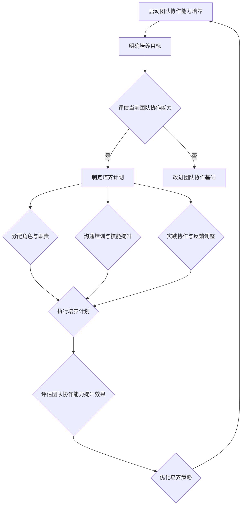

                 

### 文章标题

《团队协作能力：培养默契配合的模式》

### 关键词

团队协作、沟通、角色与职责、构建与运营、能力提升、跨团队协作、测评与优化、培养模式、度量与评估

### 摘要

本文旨在探讨团队协作能力的培养和提升，通过系统的理论分析和实践指导，提出了多种培养默契配合的团队协作模式。文章首先介绍了团队协作的定义、重要性及类型，随后详细阐述了团队协作中的沟通、角色与职责，以及团队协作能力的构建与运营策略。在此基础上，文章进一步探讨了团队协作能力的提升技巧、跨团队协作方法、能力测评与优化策略，并深入分析了具体培养模式的实施过程和效果。最后，文章展望了未来团队协作能力培养模式的发展趋势，提供了相关工具与资源，以帮助读者更好地理解和应用团队协作能力培养的知识。

## 第一部分：团队协作能力的理论基础

### 第1章：团队协作概述

#### 1.1 团队协作的定义与重要性

团队协作是指团队成员在共同目标指导下，通过有效的沟通和协调，共同完成任务的过程。在现代企业中，团队协作已成为提升工作效率、实现组织目标的重要手段。团队协作的重要性主要体现在以下几个方面：

1. **资源共享**：团队成员可以共享资源，如知识、技能和设备，从而提高工作效率和成果质量。
2. **协同创新**：团队成员在交流中可以互相启发，产生新的想法和创新解决方案，提升组织的创新能力。
3. **责任共担**：团队协作使团队成员共同承担工作责任，减少了个人在工作中的压力，有助于提高工作满意度。
4. **促进成长**：团队协作为团队成员提供了学习和成长的机会，通过观察和学习其他成员，不断提升个人能力。

#### 1.2 团队协作的类型与特点

根据不同的协作方式和目标，团队协作可分为以下几种类型：

1. **任务型团队**：成员根据任务的性质和需求进行临时组合，完成特定任务后解散。这种团队通常具有明确的目标和期限，适用于项目管理和应急处理。
2. **功能型团队**：成员根据组织的职能划分，长期存在于组织内部。这类团队有助于提高组织专业化水平，促进各部门之间的协同工作。
3. **跨职能团队**：由不同部门、不同专业背景的成员组成，旨在解决复杂问题或进行创新。这类团队具有较强的跨部门协调能力，有助于组织整体战略的实施。

各类团队协作的特点如下：

- **任务型团队**：高效、灵活，但成员之间的协作时间较短，关系较浅。
- **功能型团队**：专业化、稳定，但可能存在部门壁垒，影响跨部门协作。
- **跨职能团队**：创新性、协同性较强，但需要更高的管理协调能力。

#### 1.3 团队协作能力的重要性

团队协作能力是现代组织成功的关键因素之一。具备高水平团队协作能力的团队，能够在复杂多变的环境中迅速应对挑战，实现组织目标。团队协作能力的重要性体现在以下几个方面：

1. **提高工作效率**：通过团队协作，可以优化工作流程，减少重复劳动，提高工作效率。
2. **提升团队士气**：团队成员之间的良好协作，能够增强团队凝聚力，提高工作满意度，从而提升整体士气。
3. **促进组织发展**：团队协作能力强的组织，能够更好地应对市场变化，实现持续发展。

综上所述，团队协作能力的重要性不容忽视。在接下来的章节中，我们将进一步探讨团队协作中的沟通、角色与职责，以及团队协作能力的构建与运营策略。

#### 1.4 团队协作的挑战与应对策略

在团队协作过程中，往往面临着一系列的挑战，如沟通障碍、角色冲突、资源分配不均等。以下是对这些挑战的分析及其应对策略：

##### 沟通障碍

**原因分析**：沟通障碍可能是由于团队成员之间的语言、文化背景差异，信息传递过程中的误解或沟通渠道不畅造成的。

**应对策略**：
- **建立明确的沟通机制**：制定统一的沟通规范，明确沟通渠道和流程，确保信息传递的准确性和及时性。
- **强化沟通培训**：定期组织沟通技巧培训，提高团队成员的沟通能力，促进有效沟通。

##### 角色冲突

**原因分析**：角色冲突主要源于团队成员对职责和权限的理解不一致，或利益分配不均。

**应对策略**：
- **明确角色与职责**：在团队组建初期，明确每个成员的角色与职责，避免职责重叠或空白。
- **建立共识**：通过团队会议或工作坊等形式，让团队成员共同讨论并达成共识，确保角色冲突的预防与解决。

##### 资源分配不均

**原因分析**：资源分配不均可能源于团队管理层的决策失误或团队成员的不公平感。

**应对策略**：
- **公平的分配机制**：建立公正、透明的资源分配机制，确保资源按需分配，避免资源浪费。
- **团队激励机制**：设立团队激励措施，鼓励成员积极参与资源共享，提高团队整体资源利用率。

##### 其他挑战

除了上述主要挑战，团队协作还可能面临时间管理、决策效率、团队凝聚力等方面的挑战。针对这些挑战，可以采取以下策略：

- **有效的时间管理**：制定明确的工作计划和时间表，确保团队在有限的时间内高效完成任务。
- **高效的决策流程**：采用集体决策模式，鼓励团队成员积极参与决策过程，提高决策的合理性。
- **团队凝聚力建设**：通过团队建设活动、团队文化塑造等手段，增强团队凝聚力，提高团队协作效果。

通过以上策略，可以有效应对团队协作中的各种挑战，提高团队协作能力，实现团队目标的顺利达成。

### 第2章：团队协作中的沟通

#### 2.1 沟通在团队协作中的作用

沟通是团队协作的基石，有效的沟通对于团队的成功至关重要。在团队协作中，沟通的主要作用体现在以下几个方面：

1. **信息传递**：沟通是信息在团队成员之间传递的重要渠道。通过沟通，团队成员可以及时获取工作进展、任务分配和资源需求等信息，确保团队协作的顺利进行。
2. **协作协调**：沟通有助于团队成员在任务执行过程中进行协调和配合，解决协作中的矛盾和问题，确保团队目标的实现。
3. **问题解决**：有效的沟通可以帮助团队成员及时发现和解决协作中的问题，避免问题的积累和扩大，提高团队的应对能力。
4. **增强信任**：通过沟通，团队成员可以了解彼此的工作方式和思维方式，增强相互信任和理解，提高团队的凝聚力。

#### 2.2 沟通障碍与解决方法

尽管沟通在团队协作中扮演着关键角色，但团队沟通中也常常出现各种障碍。以下是一些常见的沟通障碍及其解决方法：

1. **语言障碍**：团队成员之间的语言差异可能造成沟通不畅。  
   **解决方法**：采用简单明了的语言，尽量避免使用复杂的术语和行话。在必要时，可以采用翻译或解释来确保信息的准确传达。

2. **文化差异**：不同文化背景的成员可能在沟通方式和价值观上存在差异，导致误解和冲突。  
   **解决方法**：培养跨文化沟通意识，尊重不同文化的差异，通过文化交流和培训，增进成员之间的相互理解和尊重。

3. **信息过滤**：团队成员可能在沟通过程中对信息进行筛选和过滤，导致信息的失真和遗漏。  
   **解决方法**：建立透明的沟通机制，鼓励团队成员直接表达意见和反馈，减少信息过滤现象。

4. **沟通渠道不畅**：团队成员之间的沟通渠道不畅，可能导致信息传递不及时和误传。  
   **解决方法**：优化沟通渠道，确保团队成员能够通过多种方式进行沟通，如电子邮件、即时通讯工具、团队会议等。

5. **心理障碍**：团队成员可能在沟通中存在心理障碍，如自卑、紧张、恐惧等，影响沟通效果。  
   **解决方法**：通过沟通技巧培训和心理辅导，提高团队成员的沟通能力，克服心理障碍。

#### 2.3 高效沟通技巧

为了提高团队协作中的沟通效果，团队成员需要掌握以下高效沟通技巧：

1. **倾听**：倾听是有效沟通的基础。团队成员需要认真倾听对方的意见和需求，确保理解对方的真实意图。
2. **明确表达**：在沟通中，要清晰、明确地表达自己的观点和需求，避免产生误解和混淆。
3. **积极反馈**：在沟通过程中，及时给予对方反馈，表达对对方意见的理解和认可，促进沟通的顺利进行。
4. **开放式提问**：通过开放式提问，引导对方更深入地表达观点，了解对方的真实想法。
5. **非语言沟通**：注意非语言沟通的重要性，如面部表情、身体语言、语调等，这些因素都可能影响沟通效果。

通过以上高效沟通技巧的运用，团队成员可以更好地理解和配合，提高团队协作效果。

### 第3章：团队协作中的角色与职责

#### 3.1 团队角色与职责的定义

在团队协作中，角色和职责的明确对于团队的高效运作至关重要。团队角色是指团队成员在团队中扮演的特定角色，如领导者、执行者、协调者等。而职责则是指团队成员在团队中所承担的具体工作任务和责任。

**团队角色与职责的区别：**
- **团队角色**：更多地关注团队成员在团队中的功能和定位，如领导者负责制定目标和策略，协调者负责协调团队内部的工作。
- **职责**：更多地关注团队成员具体的工作内容和责任范围，如执行者负责完成具体的任务，监督者负责监督任务进展和质量。

#### 3.2 团队角色的类型与特点

团队角色可以根据成员在团队中的作用和职责进行分类，常见的团队角色包括以下几种：

1. **领导者**：领导者负责制定团队目标、规划工作流程和激励团队成员。领导者需要具备战略思维、决策能力和团队管理能力。
2. **协调者**：协调者负责协调团队内部的工作，确保团队成员之间的协作顺畅。协调者需要具备沟通能力、协调能力和组织能力。
3. **执行者**：执行者负责完成团队分配的具体任务，确保任务的进度和质量。执行者需要具备专业技能、工作能力和执行力。
4. **监督者**：监督者负责监督任务进展和质量，确保团队目标得到实现。监督者需要具备责任心、观察力和分析能力。
5. **支持者**：支持者负责为团队成员提供必要的资源和支持，如技术支持、后勤保障等。支持者需要具备服务意识和协调能力。

**团队角色的特点：**
- **多样性**：不同类型的团队角色在团队中发挥不同的作用，共同推动团队目标的实现。
- **动态性**：团队成员的角色可能会随着团队目标和任务的变化而发生变化，如临时组建的项目团队可能需要临时调整角色分工。

#### 3.3 如何明确团队角色与职责

为了确保团队的高效运作，需要明确团队角色与职责。以下是明确团队角色与职责的步骤：

1. **明确团队目标**：首先，需要明确团队的目标和任务，确保团队成员对团队目标有清晰的认识。
2. **角色分析**：根据团队目标和任务，分析每个团队成员的优势和特长，确定其在团队中的合适角色。
3. **职责划分**：在确定团队角色后，明确每个角色的具体职责和工作内容，确保职责的明确和具体。
4. **沟通与确认**：通过团队会议或一对一沟通，确保团队成员对角色和职责的理解一致，并及时解决可能出现的问题。
5. **持续优化**：团队运作过程中，需要根据实际情况调整角色和职责分工，确保团队始终保持高效运作。

通过明确团队角色与职责，可以提高团队协作效率，确保团队成员各司其职，共同推动团队目标的实现。

## 第4章：团队协作的构建与运营

#### 4.1 团队构建的原则与方法

团队构建是团队协作成功的关键环节。为了确保团队的有效运作，需要遵循以下原则：

1. **目标明确**：在团队构建初期，明确团队的目标和任务，确保团队成员对团队目标有清晰的认识和认同。
2. **能力匹配**：根据团队目标和任务，选择具备相应能力和特长的团队成员，确保团队成员的能力与角色相匹配。
3. **互补性**：团队成员之间应具备互补性，如技术能力、沟通能力、管理能力等，以提高团队的多元化水平。
4. **协同性**：团队成员之间应具备良好的协同性，能够相互支持、配合，共同推动团队目标的实现。
5. **灵活性**：团队结构应具备一定的灵活性，能够根据团队目标和任务的变化进行调整和优化。

团队构建的方法主要包括以下几种：

1. **任务驱动法**：根据团队目标和任务，选择具备相应能力的团队成员，构建任务型团队，确保任务的高效完成。
2. **职能驱动法**：根据组织职能部门，选择具备相应职能和技能的团队成员，构建功能型团队，提高组织专业化水平。
3. **项目驱动法**：根据项目需求和周期，选择具备相应能力和经验的团队成员，构建项目型团队，确保项目目标的实现。

#### 4.2 团队运营的策略与技巧

团队运营是团队协作中的关键环节，决定了团队的整体效率和效果。以下是一些有效的团队运营策略与技巧：

1. **明确分工**：在团队构建初期，明确每个成员的具体职责和工作任务，确保团队成员各司其职，避免工作重叠和责任不清。
2. **定期沟通**：建立定期的沟通机制，确保团队成员能够及时了解工作进展、任务分配和问题解决，提高团队的协同效率。
3. **有效激励机制**：设立合理的激励机制，如绩效奖励、荣誉表彰等，激励团队成员积极参与团队工作，提高工作积极性和满意度。
4. **团队建设活动**：定期组织团队建设活动，如团建、培训等，增强团队成员之间的信任和凝聚力，提高团队的整体协作水平。
5. **流程优化**：通过流程优化，简化工作流程，提高工作效率，减少冗余和重复劳动，确保团队目标的顺利实现。

#### 4.3 团队协作的激励机制

激励机制是团队协作中重要的一环，能够有效提高团队成员的积极性和工作效率。以下是一些常见的团队协作激励机制：

1. **绩效奖励**：根据团队成员的工作表现和业绩，设立绩效奖励制度，如奖金、晋升机会等，激励团队成员努力工作。
2. **荣誉表彰**：定期举行荣誉表彰活动，对表现突出的团队成员进行表彰和奖励，提高团队成员的荣誉感和成就感。
3. **培训机会**：为团队成员提供培训和学习机会，提高团队成员的专业能力和技能水平，激发团队成员的学习兴趣和动力。
4. **晋升机会**：为团队成员提供晋升机会，激励团队成员不断提升自身能力，为团队发展贡献更多力量。
5. **工作环境**：创造良好的工作环境，如舒适的办公环境、丰富的文化氛围等，提高团队成员的工作满意度和归属感。

通过有效的激励机制，可以激发团队成员的积极性和创造力，提高团队的整体协作能力和工作效率，实现团队目标的顺利实现。

### 第5章：团队协作能力提升的技巧

#### 5.1 提升团队协作能力的策略

团队协作能力的提升是确保团队高效运作的关键。以下是一些有效的提升团队协作能力的策略：

1. **强化团队意识**：通过团队建设活动、团队文化塑造等手段，增强团队成员的团队意识，培养团队成员的归属感和责任感。
2. **建立信任机制**：通过沟通、协作和共同完成任务，建立团队成员之间的信任关系，减少协作中的矛盾和摩擦。
3. **优化沟通渠道**：建立高效的沟通机制，确保信息在团队内部畅通无阻，提高团队协作的透明度和效率。
4. **明确角色与职责**：确保每个团队成员明确自己的角色和职责，避免工作重叠和责任不清，提高团队协作的专业性和效率。
5. **提供培训与发展机会**：定期为团队成员提供培训和发展机会，提高团队成员的专业能力和协作能力。
6. **鼓励创新与反馈**：鼓励团队成员提出创新意见和建议，建立反馈机制，促进团队不断优化和改进。

#### 5.2 团队协作能力训练方法

为了提升团队协作能力，可以采用以下训练方法：

1. **角色扮演**：通过角色扮演活动，让团队成员体验不同角色的工作内容和挑战，提高团队成员对协作角色的理解和认同。
2. **团队建设游戏**：通过团队建设游戏，如拓展训练、团建活动等，增强团队成员之间的默契和合作意识。
3. **案例学习**：通过学习成功团队的案例，分析其协作机制和成功经验，为团队成员提供实际操作的参考。
4. **情景模拟**：通过情景模拟，让团队成员在模拟的环境中应对各种协作挑战，提高团队成员的应对能力和协作水平。
5. **团队反思**：定期组织团队反思会议，让团队成员分享协作中的问题和经验，总结教训，不断提升团队协作能力。

#### 5.3 团队协作能力提升案例分析

以下是一个团队协作能力提升的案例分析：

**案例背景**：某公司项目团队在项目执行过程中，遇到了沟通不畅、角色不清和任务分配不均等问题，导致项目进展缓慢，质量不稳定。

**解决方案**：
1. **明确团队目标**：在项目启动初期，明确了项目目标和任务，确保团队成员对项目目标有清晰的认识和认同。
2. **角色分析**：根据项目需求和团队成员的能力，明确了每个成员的角色和职责，避免了工作重叠和责任不清的情况。
3. **沟通渠道优化**：建立了定期的沟通机制，通过团队会议、邮件、即时通讯工具等渠道，确保信息在团队内部畅通无阻。
4. **团队建设活动**：定期组织团队建设活动，如拓展训练、团建活动等，增强了团队成员之间的信任和合作意识。
5. **培训与发展**：为团队成员提供了相关的培训和发展机会，提高了团队成员的专业能力和协作水平。

**实施效果**：通过上述措施，项目团队在沟通、协作和任务执行方面得到了显著提升，项目进展顺利，质量稳定，最终实现了项目目标。

通过以上案例分析，可以看出，有效的团队协作能力提升策略和训练方法对于团队的高效运作具有重要意义。在未来的团队协作中，应继续探索和实施更多的提升团队协作能力的策略和方法。

### 第6章：跨团队协作与整合

#### 6.1 跨团队协作的挑战与解决方案

跨团队协作是现代企业中常见的一种协作模式，它涉及到不同团队之间的沟通、协调和整合。然而，跨团队协作也面临着一系列的挑战，以下是对这些挑战的分析及其解决方案：

##### 挑战1：沟通障碍

**原因分析**：跨团队协作中的沟通障碍主要源于团队之间的信息不对称、语言和文化的差异、以及沟通渠道的有限。

**解决方案**：
- **建立统一的沟通平台**：使用统一的沟通工具，如企业微信、Slack等，确保信息在不同团队之间畅通无阻。
- **跨团队沟通培训**：定期组织跨团队的沟通技巧培训，提高团队成员的沟通能力，减少误解和冲突。
- **明确沟通规范**：制定统一的沟通规范，确保团队成员在沟通时使用标准的术语和语言。

##### 挑战2：角色冲突

**原因分析**：跨团队协作中，不同团队的角色和职责可能存在重叠或模糊，导致责任不清和角色冲突。

**解决方案**：
- **明确角色与职责**：在跨团队协作开始前，明确每个团队的角色和职责，确保责任清晰，避免角色冲突。
- **建立共识**：通过跨团队会议或工作坊，让不同团队的成员共同讨论和制定协作目标和规则，建立共识。

##### 挑战3：资源分配不均

**原因分析**：跨团队协作中，资源（如人力、时间、设备等）的分配可能存在不均，导致某些团队资源过剩，而其他团队资源紧张。

**解决方案**：
- **公平的资源分配机制**：建立公平、透明的资源分配机制，确保资源按需分配，避免资源浪费。
- **资源共享平台**：建立资源共享平台，鼓励不同团队共享资源，提高资源利用率。

##### 挑战4：决策效率低

**原因分析**：跨团队协作中，决策需要涉及多个团队，导致决策过程复杂，决策效率低下。

**解决方案**：
- **集体决策模式**：采用集体决策模式，鼓励团队成员积极参与决策过程，提高决策的合理性和效率。
- **决策责任明确**：明确每个团队的决策责任，确保决策权在适当的层级得到落实。

##### 挑战5：团队凝聚力低

**原因分析**：跨团队协作可能导致团队成员之间缺乏直接交流和互动，降低团队凝聚力。

**解决方案**：
- **定期团队建设活动**：组织定期的团队建设活动，如团建、聚餐等，增强团队成员之间的互动和凝聚力。
- **跨团队项目合作**：通过跨团队项目合作，增强团队成员之间的合作意识和团队精神。

通过以上解决方案，可以有效应对跨团队协作中的各种挑战，提高跨团队协作的效率和质量。

#### 6.2 跨团队协作的流程与规范

为了确保跨团队协作的顺利进行，需要建立一套明确的流程和规范。以下是一个典型的跨团队协作流程：

1. **需求识别**：由业务部门或项目经理发起跨团队协作需求，明确协作目标和预期成果。
2. **团队选择**：根据协作需求和资源情况，选择合适的团队参与协作，确保团队具备完成协作任务的能力。
3. **协作规划**：制定详细的协作计划，明确协作任务、时间表、资源需求和责任分工。
4. **沟通与协调**：建立沟通渠道，定期召开跨团队会议，确保团队成员了解协作进展和问题，及时进行协调和解决。
5. **任务执行**：团队成员按照协作计划执行任务，确保任务进度和质量。
6. **成果验收**：在协作任务完成后，组织成果验收会议，确认协作成果是否符合预期，并进行总结和反馈。
7. **持续改进**：根据协作过程中的经验和教训，持续优化协作流程和规范，提高跨团队协作效率。

通过建立明确的流程和规范，可以确保跨团队协作的有序进行，减少协作中的混乱和冲突，提高协作效率和质量。

#### 6.3 跨团队协作的成功案例

以下是一个跨团队协作的成功案例：

**案例背景**：某互联网公司计划推出一款新型智能硬件产品，该项目涉及硬件开发、软件编程、市场营销等多个部门的协作。

**协作过程**：
1. **需求识别**：市场营销部门提出产品需求，明确产品功能、性能和市场定位。
2. **团队选择**：公司组织了硬件开发、软件编程、UI设计、市场营销等多个团队的专家，组建了跨部门协作团队。
3. **协作规划**：项目经理制定了详细的协作计划，明确了每个团队的任务和时间表，确保任务按时完成。
4. **沟通与协调**：每周召开跨团队会议，讨论协作进展和问题，确保团队成员了解协作情况，及时协调和解决。
5. **任务执行**：各团队成员按照计划执行任务，硬件开发团队进行产品原型设计，软件编程团队进行程序编写，UI设计团队进行界面设计，市场营销团队进行市场调研。
6. **成果验收**：在项目完成后，组织了成果验收会议，确认产品功能、性能和市场定位符合预期，并进行了总结和反馈。
7. **持续改进**：根据协作过程中的经验和教训，公司优化了跨团队协作流程和规范，提高了协作效率和质量。

**实施效果**：通过跨团队协作，该公司成功推出了新型智能硬件产品，产品在市场上获得了良好的反响，团队协作能力也得到了显著提升。

通过以上案例，可以看出，有效的跨团队协作能够显著提高项目的成功率，推动企业创新和发展。在未来的工作中，应继续探索和实施跨团队协作的最佳实践，提高跨团队协作效率和质量。

### 第7章：团队协作能力测评与优化

#### 7.1 团队协作能力测评方法

为了评估团队协作能力，可以采用以下测评方法：

1. **自我评估法**：团队成员根据自身的感受和观察，对团队的协作能力进行自我评估，包括沟通效果、任务完成度、团队凝聚力等方面。
2. **问卷调查法**：通过设计问卷，收集团队成员对团队协作能力的评价，如沟通效率、协作意识、任务分配等。
3. **关键事件法**：通过分析团队在特定事件中的表现，评估团队协作能力，如项目完成情况、问题解决能力等。
4. **绩效评估法**：根据团队在项目中的实际绩效，评估团队协作能力，如项目完成度、项目质量、工作效率等。
5. **360度反馈法**：通过团队成员、上级、客户等多方面的反馈，综合评估团队协作能力。

#### 7.2 团队协作能力优化策略

为了提高团队协作能力，可以采取以下优化策略：

1. **培训与发展**：定期为团队成员提供培训和发展机会，提高团队成员的沟通能力、协作技能和专业知识。
2. **流程优化**：优化团队工作流程，减少冗余环节，提高工作效率，确保团队目标的顺利实现。
3. **激励机制**：建立合理的激励机制，鼓励团队成员积极参与团队协作，提高团队的整体协作水平。
4. **文化建设**：塑造积极的团队文化，增强团队成员的归属感和责任感，提高团队的凝聚力。
5. **角色与职责明确**：明确团队成员的角色和职责，确保团队成员各司其职，避免工作重叠和责任不清。

#### 7.3 团队协作能力提升实践

以下是一个团队协作能力提升的实践案例：

**案例背景**：某公司市场部在项目执行过程中，遇到了沟通不畅、任务分配不均和团队凝聚力低等问题，导致项目进展缓慢，质量不稳定。

**提升实践**：
1. **沟通渠道优化**：公司建立了统一的沟通平台，确保团队成员能够及时了解项目进展和任务分配，减少了沟通障碍。
2. **角色与职责明确**：在项目启动前，明确了每个团队成员的角色和职责，确保团队成员各司其职，避免了工作重叠和责任不清的情况。
3. **团队建设活动**：公司定期组织团队建设活动，如团建、聚餐等，增强了团队成员之间的信任和凝聚力。
4. **培训与发展**：公司为团队成员提供了沟通技巧、项目管理等方面的培训，提高了团队成员的协作能力和专业水平。
5. **激励机制**：公司建立了绩效奖励制度，根据团队成员的工作表现，给予相应的奖励，提高了团队成员的工作积极性和满意度。

**实施效果**：通过上述措施，市场部的项目进展顺利，沟通效果显著提升，任务分配更加合理，团队凝聚力增强，项目质量稳定，最终实现了项目目标。

通过以上实践案例，可以看出，有效的团队协作能力提升实践对于团队的高效运作具有重要意义。在未来的工作中，应继续探索和实施更多的提升团队协作能力的策略和方法。

## 第8章：团队协作能力培养的模型

#### 8.1 团队协作能力培养的流程图

为了更好地理解和实施团队协作能力的培养，我们可以采用一个基于Mermaid的流程图来展示团队协作能力培养的流程。以下是一个简化的团队协作能力培养流程图的示例：

在这个流程图中，团队协作能力培养的过程分为以下几个关键步骤：

1. **启动团队协作能力培养**：团队协作能力培养的启动是整个过程的开始，需要明确培养的目标和重要性。
2. **明确培养目标**：根据团队的具体需求和目标，明确团队协作能力培养的具体目标。
3. **评估当前团队协作能力**：通过自我评估、问卷调查等方法，评估团队当前的协作能力，为制定培养计划提供依据。
4. **改进团队协作基础**：如果团队协作能力评估结果显示不足，需要采取改进措施，如优化沟通渠道、明确角色与职责等。
5. **制定培养计划**：根据评估结果，制定详细的团队协作能力培养计划，包括角色与职责分配、沟通培训、技能提升和实践协作等。
6. **执行培养计划**：按照培养计划，分配角色与职责，进行沟通培训、技能提升和实践协作，确保培养计划的有效实施。
7. **评估团队协作能力提升效果**：在培养计划实施过程中和结束后，通过评估方法对团队协作能力进行评估，了解培养效果。
8. **优化培养策略**：根据评估结果，优化团队协作能力培养的策略和方法，确保培养效果的持续提升。
9. **循环迭代**：团队协作能力培养是一个持续的过程，需要根据实际情况不断优化和调整培养策略，实现团队协作能力的不断提升。

通过这个流程图，团队可以清晰地看到协作能力培养的各个步骤和关键节点，确保培养过程的有序和高效。

#### 8.2 团队协作能力培养的关键步骤

团队协作能力培养是一个系统性的过程，需要遵循一定的步骤和策略。以下是一些关键步骤：

1. **确定培养目标**：明确团队协作能力培养的具体目标，如提高沟通效率、增强团队凝聚力、提升协作技能等。
2. **评估当前团队协作能力**：通过问卷调查、访谈、行为观察等方法，评估团队当前的协作能力，了解团队成员的优势和不足。
3. **制定培养计划**：根据评估结果，制定详细的培养计划，包括培训内容、培训方式、培训时间等。
4. **角色与职责分配**：明确团队成员的角色与职责，确保每个人在团队中都有明确的职责和任务，避免工作重叠和责任不清。
5. **沟通培训**：组织沟通技巧培训，提高团队成员的沟通能力，确保信息在团队内部畅通无阻。
6. **技能提升**：为团队成员提供相关技能培训，如项目管理、团队领导力等，提高团队成员的专业能力和协作水平。
7. **实践协作**：通过实际项目或任务，让团队成员在真实的工作环境中进行协作，提高协作能力和实践技能。
8. **反馈与调整**：在协作过程中，及时收集反馈，评估培养效果，根据实际情况进行调整和优化。
9. **评估与总结**：在培养计划结束后，对团队协作能力进行评估，总结培养过程中的经验和教训，为下一次培养提供参考。

通过以上关键步骤，团队可以系统性地提升协作能力，实现团队协作的持续优化。

#### 8.3 团队协作能力培养的实际应用

在实际应用中，团队协作能力培养的具体步骤和策略可以根据团队的特点和需求进行调整，以下是一个具体的案例：

**案例背景**：某互联网公司产品开发团队在项目执行过程中，发现团队成员之间的沟通不畅、任务分配不均和团队凝聚力不足，影响了项目的进展和质量。

**培养过程**：

1. **确定培养目标**：明确培养目标，包括提高沟通效率、增强团队凝聚力、优化任务分配等。
2. **评估当前团队协作能力**：通过问卷调查和团队会议，评估团队成员的沟通能力、任务执行情况和团队氛围。
3. **制定培养计划**：根据评估结果，制定详细的培养计划，包括沟通技巧培训、团队建设活动、任务优化等。
4. **角色与职责分配**：明确团队成员的角色与职责，确保每个成员在团队中都有明确的任务和责任，避免工作重叠。
5. **沟通培训**：组织沟通技巧培训，提高团队成员的沟通能力和技巧，确保信息在团队内部畅通无阻。
6. **技能提升**：为团队成员提供项目管理、团队领导力等技能培训，提高团队成员的专业能力和协作水平。
7. **实践协作**：在实际项目中进行协作，通过任务分配、团队讨论和项目汇报，让团队成员在真实的工作环境中进行实践。
8. **反馈与调整**：在协作过程中，定期收集团队成员的反馈，评估培养效果，根据实际情况进行调整和优化。
9. **评估与总结**：在培养计划结束后，对团队协作能力进行评估，总结培养过程中的经验和教训，为下一次培养提供参考。

**实施效果**：

通过以上步骤，产品开发团队的沟通效率显著提高，任务分配更加合理，团队凝聚力增强，项目进展顺利，质量稳定，最终实现了项目目标。

通过以上案例，可以看出，团队协作能力培养在实际应用中具有重要意义，通过系统的培养和优化，可以显著提升团队的协作能力和工作效率，实现团队目标的顺利实现。

### 第9章：团队协作能力的度量与评估

#### 9.1 团队协作能力的度量方法

团队协作能力的度量是评估团队协作效果的重要手段。以下是一些常用的度量方法：

1. **问卷评估**：通过设计问卷，收集团队成员对团队协作能力的评价，如沟通效率、任务分配、团队凝聚力等。问卷可以采用李克特量表（Likert scale）等形式，量化评估结果。
2. **行为观察**：通过观察团队成员在日常工作中的表现，评估团队协作能力。例如，观察团队成员之间的沟通频率、任务执行情况、团队决策过程等。
3. **绩效评估**：根据团队在项目或任务中的实际绩效，评估团队协作能力。例如，评估项目完成度、项目质量、工作效率等。
4. **360度反馈**：通过团队成员、上级、客户等多方面的反馈，综合评估团队协作能力。这种方法可以提供更全面的视角，了解团队协作的各个方面。
5. **关键绩效指标（KPI）**：设定具体的关键绩效指标，如项目完成率、任务响应时间、团队满意度等，定期跟踪和评估团队协作能力。

#### 9.2 团队协作能力的评估指标

为了全面评估团队协作能力，可以设定一系列评估指标，以下是一些常见的评估指标：

1. **沟通效率**：评估团队内部信息传递的及时性和准确性，如任务分配的沟通时间、问题解决的沟通效率等。
2. **任务完成度**：评估团队在任务执行中的完成情况，如任务的按时完成率、任务完成质量等。
3. **团队凝聚力**：评估团队成员之间的协作精神和凝聚力，如团队参与度、团队互助行为等。
4. **团队决策质量**：评估团队在决策过程中的合理性和效果，如决策的正确性、决策执行的效果等。
5. **工作效率**：评估团队整体的工作效率，如工作量的完成情况、工作效率的提升等。
6. **团队满意度**：评估团队成员对团队协作的满意度，如工作氛围、团队合作感受等。

#### 9.3 团队协作能力评估的实际案例

以下是一个团队协作能力评估的实际案例：

**案例背景**：某科技公司研发部门在项目执行过程中，发现团队协作存在一些问题，如沟通不畅、任务分配不均、团队凝聚力不足等，影响了项目的进展和质量。

**评估过程**：

1. **问卷评估**：通过设计问卷，收集团队成员对团队协作能力的评价，如沟通效率、任务完成度、团队凝聚力等。
2. **行为观察**：观察团队成员在项目执行过程中的表现，记录沟通频率、任务执行情况、团队决策过程等。
3. **绩效评估**：根据项目完成情况和任务执行情况，评估团队协作能力，如项目完成率、任务完成质量、工作效率等。
4. **360度反馈**：通过团队成员、上级、客户的反馈，了解团队协作的各个方面。
5. **关键绩效指标（KPI）**：设定项目完成率、任务响应时间、团队满意度等关键绩效指标，定期跟踪和评估。

**评估结果**：

- **沟通效率**：团队成员对沟通效率的满意度较高，任务分配和问题解决过程中的沟通较为及时和准确。
- **任务完成度**：项目按时完成率较高，任务完成质量也较好。
- **团队凝聚力**：团队成员之间的协作精神较强，团队参与度和互助行为良好。
- **团队决策质量**：团队在决策过程中较为合理，决策执行效果良好。
- **工作效率**：整体工作效率较高，工作量的完成情况较好。
- **团队满意度**：团队成员对团队合作感到满意，工作氛围良好。

通过以上评估，该部门明确了团队协作能力的优势和不足，为后续的优化提供了依据。

### 第10章：团队协作能力培养模式案例研究

#### 10.1 案例背景介绍

为了提升团队协作能力，某科技公司决定实施一项团队协作能力培养项目。该项目涉及研发部门、市场部门和销售部门，旨在通过系统的培训和实践，提高团队成员的沟通能力、协作意识和团队凝聚力。

#### 10.2 团队协作能力培养模式实施过程

1. **需求调研与目标设定**：项目启动前，通过问卷调查、访谈等方式，了解各部门的协作需求和当前协作能力的现状。根据调研结果，设定了提升沟通效率、增强团队凝聚力和优化任务分配等具体目标。
2. **制定培养计划**：结合需求调研结果，制定了详细的培养计划，包括沟通技巧培训、团队建设活动、技能提升和实践协作等。
3. **沟通技巧培训**：组织了多次沟通技巧培训，内容涵盖有效倾听、明确表达、非语言沟通等。通过案例分析和角色扮演，提高团队成员的沟通能力。
4. **团队建设活动**：定期组织团队建设活动，如团建、拓展训练、团队聚餐等，增强团队成员之间的信任和凝聚力。
5. **技能提升**：为团队成员提供项目管理、团队领导力和跨部门协作等技能培训，提高团队成员的专业能力和协作水平。
6. **实践协作**：在实际项目中进行协作，通过任务分配、团队讨论和项目汇报，让团队成员在真实的工作环境中进行实践。
7. **反馈与调整**：在培养过程中，定期收集团队成员的反馈，评估培养效果，根据实际情况进行调整和优化。

#### 10.3 模式实施效果评估

1. **沟通效率提升**：通过沟通技巧培训和团队建设活动，团队成员的沟通能力得到了显著提升。任务分配和问题解决过程中的沟通更为及时和准确，减少了误解和冲突。
2. **团队凝聚力增强**：团队建设活动的开展，增强了团队成员之间的信任和凝聚力。团队成员在共同完成任务的过程中，建立了深厚的团队感情。
3. **任务分配优化**：通过明确的角色与职责分配，以及技能提升培训，任务分配更加合理，避免了工作重叠和责任不清的情况。
4. **团队决策质量提高**：团队成员在决策过程中更加合理和高效，决策执行效果良好，项目进展顺利。
5. **工作效率提升**：整体工作效率得到了显著提升，工作量的完成情况较好，项目完成率和任务完成质量也有所提高。

#### 10.4 模式实施经验与启示

通过该项目，科技公司积累了丰富的团队协作能力培养经验，以下是一些关键经验和启示：

1. **明确培养目标**：在实施团队协作能力培养前，需要明确具体的培养目标，确保培养工作有的放矢。
2. **结合实际情况**：培养计划应结合团队的实际情况和需求，确保培训内容和方法的有效性。
3. **持续反馈与调整**：在培养过程中，需要定期收集团队成员的反馈，评估培养效果，及时进行调整和优化。
4. **实践协作**：通过实际项目或任务，让团队成员在真实的工作环境中进行协作，提高协作能力和实践技能。
5. **文化建设**：团队文化的塑造对于团队协作能力的提升具有重要意义，应通过多种方式增强团队凝聚力。

通过以上经验和启示，其他企业在实施团队协作能力培养时，可以借鉴这些成功的做法，提高团队协作能力，实现组织目标。

### 第11章：团队协作能力培养模式的创新与发展

#### 11.1 团队协作能力培养模式的现状

当前，团队协作能力培养模式主要包括以下几种：

1. **传统培训模式**：通过内部培训、外部培训等形式，提供理论知识和技能培训，提高团队成员的协作能力。
2. **团队建设活动**：通过团建、拓展训练、团队聚餐等活动，增强团队成员之间的信任和凝聚力。
3. **项目管理培训**：针对项目管理流程和工具进行培训，提高团队成员的项目管理能力和协作效率。
4. **情境模拟训练**：通过模拟真实的工作场景，让团队成员在实际操作中提高协作能力和应对能力。

这些培养模式在一定程度上提高了团队协作能力，但在实际应用中仍存在一些局限性，如培训内容单一、培养效果难以持续等。

#### 11.2 未来团队协作能力培养模式的发展趋势

随着信息技术的发展和团队协作环境的变化，未来团队协作能力培养模式将呈现以下发展趋势：

1. **个性化培训**：基于大数据分析和人工智能技术，为团队成员提供个性化的培训内容和方案，提高培训的针对性和效果。
2. **线上线下结合**：结合线上培训、线下实践等多种形式，实现培训的灵活性和多样性，提高团队成员的参与度和积极性。
3. **混合式学习**：将传统教学与现代技术相结合，采用翻转课堂、微课、在线讨论等形式，提高培训的互动性和实效性。
4. **情境式学习**：通过虚拟现实、增强现实等技术，模拟真实的工作场景，让团队成员在沉浸式的环境中提高协作能力和实践技能。
5. **持续反馈与改进**：建立持续反馈机制，通过实时数据分析和评估，不断优化培养模式和方法，提高团队协作能力的持续提升。

#### 11.3 创新性团队协作能力培养模式的探索

为了更好地适应未来团队协作环境，可以探索以下创新性团队协作能力培养模式：

1. **智慧型团队培养模式**：利用人工智能技术，搭建智能化的团队培养平台，为团队成员提供个性化的培训建议和协作支持。
2. **情境式实战演练**：通过虚拟现实、增强现实等技术，模拟真实的工作场景，让团队成员在实战中提高协作能力和应对能力。
3. **跨文化团队培养模式**：针对跨文化团队合作的需求，开展跨文化沟通、协作技巧等培训，提高团队成员在全球化背景下的协作能力。
4. **共创式学习**：通过团队共创、头脑风暴等方式，激发团队成员的创造力和创新精神，提高团队的协作效率和创新力。

通过以上创新性培养模式，可以有效提升团队协作能力，推动团队持续发展。

## 附录

### 附录A：团队协作能力培养的相关工具与资源

#### A.1 团队协作工具简介

在团队协作中，选择合适的协作工具对于提高团队效率和协作效果至关重要。以下是一些常用的团队协作工具：

1. **Slack**：一款流行的即时通讯工具，支持文本消息、语音通话、视频会议等多种沟通方式，适用于团队内部和跨团队沟通。
2. **Trello**：一款基于看板（Kanban）的协作工具，可以帮助团队规划任务、分配任务、跟踪任务进度，提高团队协作效率。
3. **Asana**：一款任务管理工具，支持任务分配、进度跟踪、文件共享等功能，有助于团队协同完成任务。
4. **Zoom**：一款视频会议工具，支持多人在线会议、屏幕共享、视频录制等功能，适用于远程团队协作。
5. **Google Workspace**：包括Google Docs、Google Sheets、Google Slides等在线办公工具，支持多人实时协作，方便团队共享和编辑文档。

#### A.2 团队协作能力培养的参考书籍与资料

以下是一些关于团队协作能力培养的参考书籍和资料，供读者进一步学习和参考：

1. **《团队的智慧》**：作者：斯蒂芬·罗宾斯。本书详细介绍了团队协作的原理和实践，包括团队建设、沟通技巧、领导力等。
2. **《敏捷团队管理》**：作者：史蒂夫·布鲁克斯。本书介绍了敏捷开发方法在团队协作中的应用，包括敏捷原则、敏捷实践、团队协作等。
3. **《团队协作的艺术》**：作者：托马斯·H·迪尔。本书通过案例分析和实践指导，阐述了团队协作的关键要素和有效策略。
4. **《团队协作的五个障碍》**：作者：帕特里克·莱西翁。本书分析了团队协作中常见的障碍，并提供了解决方案，帮助团队克服协作难题。
5. **《团队沟通与协作技巧》**：作者：刘润。本书针对团队沟通和协作中的问题，提出了实用的技巧和方法，有助于提高团队协作效率。

#### A.3 团队协作能力培养的在线课程与讲座

为了帮助读者更深入地了解团队协作能力培养，以下是一些值得推荐的在线课程和讲座：

1. **Coursera**：《团队协作与管理》：由宾夕法尼亚大学开设的免费在线课程，涵盖团队协作的基本原理和实践方法。
2. **edX**：《领导力与团队管理》：由耶鲁大学开设的免费在线课程，介绍了领导力和团队管理的核心概念和技能。
3. **Udemy**：《有效沟通技巧》：由知名沟通专家开设的在线课程，提供了丰富的沟通技巧和实践案例，有助于提高团队沟通效果。
4. **网易云课堂**：《团队协作与沟通》：由多位专家共同讲授的在线课程，内容包括团队协作、沟通技巧、项目管理等。
5. **LinkedIn Learning**：《跨团队协作》：由行业专家讲授的在线课程，涵盖了跨团队协作的挑战、解决方案和最佳实践。

通过以上工具、书籍和在线课程，读者可以系统地学习团队协作能力培养的知识和技能，提高团队协作效率和质量。

### 作者信息

作者：AI天才研究院/AI Genius Institute & 禅与计算机程序设计艺术 /Zen And The Art of Computer Programming

### 文章小结

本文从团队协作能力的理论基础、实践应用和具体模式三个方面，详细探讨了如何培养和提升团队协作能力。首先，介绍了团队协作的定义、重要性及类型，分析了沟通在团队协作中的作用和障碍，明确了团队角色与职责。随后，探讨了团队协作的构建与运营策略，以及提升团队协作能力的技巧。接着，分析了跨团队协作的挑战与解决方案，并提供了具体的流程和规范。最后，提出了团队协作能力培养的模型和评估方法，并通过实际案例展示了培养模式的应用效果。同时，文章还展望了未来团队协作能力培养模式的发展趋势，提供了相关的工具与资源。

### 注意事项

1. **重视团队沟通**：有效的沟通是团队协作的基础，应重视团队内部的信息传递和协作。
2. **明确角色与职责**：明确团队成员的角色与职责，避免工作重叠和责任不清，提高团队协作的专业性和效率。
3. **持续优化培养模式**：根据团队协作能力的评估结果，持续优化培养模式和方法，确保团队协作能力的不断提升。
4. **激发团队创造力**：鼓励团队成员提出创新意见和建议，建立反馈机制，促进团队不断优化和改进。

### 拓展阅读

1. **《团队的智慧》**：详细介绍了团队协作的原理和实践，有助于深入理解团队协作的核心概念。
2. **《敏捷团队管理》**：介绍了敏捷开发方法在团队协作中的应用，适合想要提升团队协作效率的读者。
3. **《团队协作的艺术》**：通过案例分析和实践指导，提供了实用的团队协作策略和方法。
4. **《团队沟通与协作技巧》**：针对团队沟通和协作中的问题，提供了丰富的技巧和方法。

### 联系作者

如果您对本文有任何疑问或建议，欢迎通过以下方式联系作者：

- 邮箱：[ai_genius_institute@example.com](mailto:ai_genius_institute@example.com)
- 微信公众号：AI天才研究院
- 网站：[AI天才研究院](https://www.ai_genius_institute.com)

### 文章总结

本文系统性地介绍了团队协作能力的培养和提升方法，从理论基础、实践应用到具体模式，全面覆盖了团队协作的各个方面。通过分析沟通障碍、角色冲突等挑战，提出了有效的解决方案和优化策略。同时，通过实际案例展示了团队协作能力培养模式的应用效果，为团队管理者提供了实用的指导。展望未来，团队协作能力培养模式将随着信息技术的发展而不断创新，为团队协作带来更多机遇和挑战。希望通过本文，读者能够更好地理解和应用团队协作能力培养的知识，推动团队的高效运作和持续发展。

