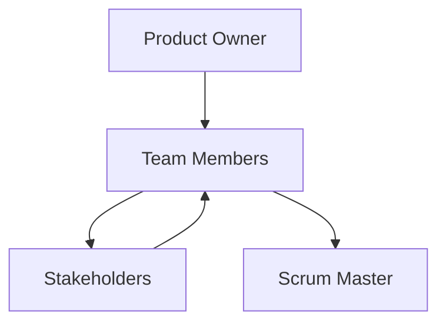
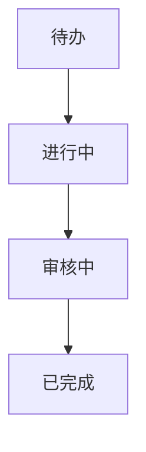

                 

## 文章标题：团队协作：1+1>2的管理哲学

### 关键词：团队协作、管理哲学、效率提升、沟通技巧、领导力、跨部门协作、敏捷管理、数字化工具、冲突管理、持续改进

### 摘要

在现代企业中，团队协作已成为提升组织效率、实现创新的关键因素。本文旨在探讨团队协作的管理哲学，解析其核心概念、实践方法与成功策略。通过深入分析团队协作的重要性、架构设计、核心要素、领导力、跨部门协作、敏捷管理、冲突管理与持续改进等方面，本文提出了一套系统化、可操作的团队协作管理方法论，帮助企业在快节奏的市场环境中实现1+1>2的协同效应。

### 目录

1. **团队协作概述**
   - 1.1 团队协作的重要性
   - 1.2 团队协作与个人成长
   - 1.3 团队协作的挑战与机遇

2. **团队协作的架构与设计**
   - 2.1 团队架构的类型
   - 2.2 团队角色的定义与职责
   - 2.3 团队协作工具与技术

3. **团队协作的核心要素**
   - 3.1 目标设定与共识达成
   - 3.2 沟通与协作技巧
   - 3.3 团队成员的角色和责任

4. **团队协作中的领导力**
   - 4.1 领导力与团队协作
   - 4.2 领导者的角色与职责
   - 4.3 领导力发展策略

5. **跨部门团队协作**
   - 5.1 跨部门协作的挑战
   - 5.2 跨部门协作的方法与技巧
   - 5.3 跨部门协作的成功案例

6. **团队协作中的敏捷管理**
   - 6.1 敏捷管理概述
   - 6.2 敏捷团队的组织结构
   - 6.3 敏捷管理工具与方法

7. **团队协作中的冲突管理**
   - 7.1 冲突的类型与原因
   - 7.2 冲突管理的策略
   - 7.3 实战案例：冲突管理的成功实践

8. **团队协作中的持续改进**
   - 8.1 持续改进的理念
   - 8.2 持续改进的方法
   - 8.3 实战案例：持续改进的实际应用

9. **团队协作中的数字化工具应用**
   - 9.1 数字化工具的作用
   - 9.2 常见数字化工具介绍
   - 9.3 数字化工具的最佳实践

10. **团队协作中的创新思维**
    - 10.1 创新思维的重要性
    - 10.2 创新思维的方法
    - 10.3 创新实践

**附录：团队协作工具与应用案例汇总**

- 附录 A：团队协作工具汇总
- 附录 B：团队协作应用案例

## 第1章：团队协作概述

在竞争日益激烈的市场环境中，企业如何提高效率和创新能力成为关键课题。团队协作作为实现这些目标的重要手段，越来越受到企业的关注。本章将介绍团队协作的基本概念、重要性以及面临的挑战与机遇。

### 1.1 团队协作的基本概念

团队协作是指团队成员通过共同的沟通、协作和共同努力，实现共同目标的过程。团队协作不仅仅是简单的分工合作，更是一种通过相互信任、尊重和支持，达到1+1>2效果的管理哲学。

**团队协作的定义：** 团队协作是一种协同工作的方式，通过整合团队成员的专业技能和资源，以实现共同的目标。

**团队协作的核心特征：**
- **目标一致性：** 团队成员共同认可并追求共同的目标。
- **信息共享：** 成员之间及时、透明的信息交流与共享。
- **相互支持：** 成员在合作过程中互相帮助、共同进步。
- **相互信任：** 成员之间建立信任关系，降低沟通和协作成本。

### 1.2 团队协作的重要性

团队协作在企业管理中的重要性不可忽视。以下是团队协作对组织的几个关键影响：

**1. 提高工作效率：** 通过团队成员的协作，可以将复杂的工作分解成可执行的任务，并通过分工和协作迅速完成。

**2. 促进知识共享：** 团队协作鼓励成员分享知识和经验，从而提高整个团队的专业水平。

**3. 增强创新能力：** 团队成员的多样性和不同视角有助于激发创新思维，推动组织不断创新。

**4. 培养团队精神：** 团队协作可以增强团队成员之间的联系和信任，培养团队合作精神。

**5. 提升组织竞争力：** 通过高效的团队协作，企业可以更快地响应市场变化，提高竞争力。

### 1.3 团队协作的挑战与机遇

尽管团队协作具有众多优势，但在实践中也面临诸多挑战。以下是团队协作中常见的挑战及其应对策略：

**挑战1：沟通障碍**  
**策略：** 建立有效的沟通机制，如定期会议、即时通讯工具等，确保信息传递的及时性和准确性。

**挑战2：角色冲突**  
**策略：** 明确团队角色和职责，确保每个成员都清楚自己的任务和责任，减少因角色重叠或模糊导致的冲突。

**挑战3：缺乏信任**  
**策略：** 通过建立信任机制，如团队成员之间的相互反馈和认可，增强团队成员之间的信任感。

**挑战4：资源分配不均**  
**策略：** 合理分配资源，确保每个团队成员都能得到足够的时间和资源来完成其任务。

**机遇1：协同创新**  
**策略：** 充分利用团队成员的多样性和不同视角，激发创新思维，推动组织发展。

**机遇2：个人成长**  
**策略：** 团队协作提供成员展示自我、提升能力的机会，促进个人成长。

通过以上分析，可以看出团队协作在企业中具有不可替代的重要性。面对挑战，企业需要采取有效的策略，抓住机遇，实现团队协作的1+1>2效果。在接下来的章节中，我们将深入探讨团队协作的架构与设计、核心要素以及具体实践方法。

### 第2章：团队协作的架构与设计

在实现高效的团队协作过程中，团队架构与设计起着至关重要的作用。合适的团队架构和明确的角色定义不仅有助于提高工作效率，还能确保团队成员之间的协作顺畅。本章将探讨团队架构的类型、团队角色的定义与职责，以及团队协作工具与技术的应用。

#### 2.1 团队架构的类型

团队架构是指团队内部组织结构的设计，不同的团队架构适用于不同的工作环境和项目需求。以下是几种常见的团队架构类型：

**1. 矩阵式团队**

矩阵式团队是一种结合职能式团队和项目式团队特点的团队架构。团队成员既有职能部门的归属，又参与项目组的工作。这种架构的优势在于能够充分利用团队成员的专业技能，同时保持职能部门的协调性。

**矩阵式团队架构的优缺点：**
- **优点：** 灵活性高，资源利用率高，能快速响应项目需求。
- **缺点：** 决策路径复杂，容易导致角色冲突和责任不清。

**2. 项目式团队**

项目式团队是为特定项目组建的临时团队，团队成员通常来自不同部门或职能领域。项目结束后，团队通常会解散或转型。项目式团队的优势在于能够集中资源、高效完成任务。

**项目式团队架构的优缺点：**
- **优点：** 专注于项目目标，资源集中，效率高。
- **缺点：** 成员对其他项目的影响较小，专业技能可能得不到全面发展。

**3. 跨功能团队**

跨功能团队是由不同部门或领域的专业人员组成的团队，旨在解决复杂问题或推动创新。这种团队架构强调跨领域的合作和知识共享。

**跨功能团队架构的优缺点：**
- **优点：** 促进知识共享，激发创新思维，提升团队整体能力。
- **缺点：** 需要较高的沟通协调能力，资源分配可能存在冲突。

**4. 平行团队**

平行团队是在主要团队之外成立的辅助团队，通常负责项目中的某些特定任务或功能。这种架构适用于需要多个团队协同工作的项目。

**平行团队架构的优缺点：**
- **优点：** 明确任务分工，提高工作效率，减轻主团队的负担。
- **缺点：** 可能导致团队之间的协调困难，影响整体进度。

#### 2.2 团队角色的定义与职责

团队角色是指团队成员在团队中承担的不同职责和角色。明确团队角色的定义与职责有助于确保团队协作的顺畅进行。以下是几种常见的团队角色及其职责：

**1. 团队领导者**

团队领导者负责制定团队目标和计划，协调团队成员的工作，确保项目顺利进行。其主要职责包括：

- 制定和传达团队目标
- 分配和监督团队成员的任务
- 解决团队内部和团队之间的冲突
- 提供必要的资源和支持

**2. 团队成员**

团队成员是团队中最基本的角色，负责完成分配给他们的任务。其主要职责包括：

- 理解并执行团队目标
- 按时完成个人任务
- 与其他团队成员协作，共享信息和资源
- 提供专业知识和建议

**3. 团队支持者**

团队支持者通常为团队成员提供行政支持、技术支持和心理支持。其主要职责包括：

- 提供必要的行政和后勤支持
- 协助解决技术问题
- 提供心理支持和激励

**4. 沟通协调者**

沟通协调者是团队中的沟通桥梁，负责确保信息的及时传递和有效沟通。其主要职责包括：

- 组织和主持团队会议
- 维护团队成员之间的沟通渠道
- 监控项目进度和风险，及时报告

#### 2.3 团队协作工具与技术

团队协作工具和技术的应用对于提高团队协作效率至关重要。以下是一些常见的团队协作工具及其特点：

**1. 项目管理工具**

项目管理工具用于规划、执行和监控项目进度。常见的项目管理工具有Trello、Asana和JIRA等。这些工具能够帮助团队：

- 制定项目计划和任务分配
- 跟踪任务进度和团队绩效
- 管理项目资源和预算

**2. 沟通协作工具**

沟通协作工具用于团队成员之间的实时沟通和信息共享。常见的沟通协作工具有Slack、Microsoft Teams和WhatsApp等。这些工具能够帮助团队：

- 进行实时消息传递和文件共享
- 组织视频会议和在线讨论
- 跨地域、跨时区协作

**3. 源代码管理工具**

源代码管理工具用于版本控制和代码协作。常见的源代码管理工具有Git和GitHub等。这些工具能够帮助团队：

- 管理项目代码版本
- 支持多人协作开发
- 进行代码审查和合并

**4. 团队协作平台**

团队协作平台是一个综合性的协作平台，集成了项目管理、沟通协作和知识共享等功能。常见的团队协作平台有Confluence和Notion等。这些平台能够帮助团队：

- 创建和共享项目文档
- 组织会议和讨论
- 跟踪项目进展和团队绩效

通过选择合适的团队架构、明确团队角色和职责，以及应用高效的团队协作工具和技术，企业可以构建一个高效、协作的团队，实现团队协作的1+1>2效果。在下一章中，我们将探讨团队协作的核心要素，包括目标设定、沟通技巧和角色责任等。

### 第3章：团队协作的核心要素

在实现高效的团队协作过程中，核心要素起到了至关重要的作用。这些要素包括目标设定、沟通技巧和角色责任等。有效的目标设定有助于团队明确方向，沟通技巧则确保团队成员之间的信息传递顺畅，而明确的角色责任则保障了团队运作的有序性。以下将详细探讨这些核心要素及其在团队协作中的具体应用。

#### 3.1 目标设定与共识达成

目标设定是团队协作的基础，有助于确保团队成员在同一个方向上共同努力。有效的目标设定应遵循以下原则：

**1. 明确性原则：** 目标应具体、清晰，避免模糊和含糊其辞。例如，“提高产品销量”不如“在接下来的三个月内，将产品销量提高20%”。

**2. 可衡量性原则：** 目标应具备可衡量的标准，以便团队评估进展和成果。例如，“提升客户满意度”可以通过“客户满意度调查得分提高5分”来衡量。

**3. 可实现性原则：** 目标应具有挑战性，但也要确保在现有资源和条件下可实现。例如，如果团队资源有限，设定“在一个月内完成一个大型项目”可能过于激进。

**4. 时限性原则：** 目标应设定明确的完成时限，以激励团队成员按时完成任务。例如，“在明年第一季度完成市场调研报告”。

在设定目标后，团队需要通过共识达成过程确保所有成员对目标的理解和认同。共识达成的步骤如下：

**1. 分享目标：** 团队领导者将目标详细解释给团队成员，确保每个人都能理解目标的意义和期望。

**2. 沟通反馈：** 成员就目标提出疑问、意见和建议，通过讨论和沟通达成共识。

**3. 确认承诺：** 成员对目标达成共识后，需明确承诺并签署相关文档，确保每个人都能全力以赴。

#### 3.2 沟通与协作技巧

沟通技巧在团队协作中至关重要，有效的沟通不仅能够传递信息，还能增进团队成员之间的信任和合作。以下是一些关键的沟通技巧：

**1. 清晰表达：** 成员在沟通时应确保语言清晰、简洁，避免使用模糊的表述。例如，使用“我们需要在明天完成这项任务”而不是“可能需要在明天完成这项任务”。

**2. 倾听技巧：** 倾听是有效沟通的重要组成部分。团队成员应学会倾听他人的意见和观点，并在必要时给予反馈和回应。

**3. 情绪管理：** 在沟通过程中，成员应学会管理自己的情绪，避免情绪化影响沟通效果。如果遇到冲突或分歧，应保持冷静，通过理性讨论解决问题。

**4. 跨文化沟通：** 在国际团队或多元文化团队中，成员应了解和尊重不同文化背景的影响，采用适当的沟通方式和策略。

协作技巧则是确保团队成员在共同目标下高效合作的关键。以下是一些协作技巧：

**1. 分工合作：** 根据团队成员的能力和特长分配任务，确保每个成员都能发挥其优势。

**2. 定期会议：** 定期召开团队会议，讨论项目进展、问题和解决方案，确保团队成员之间的信息同步。

**3. 信息共享：** 建立信息共享机制，如共享文档和项目进度报告，确保团队成员能够及时获取所需信息。

**4. 协作工具：** 应用协作工具，如项目管理软件和即时通讯工具，提高团队协作的效率。

#### 3.3 团队成员的角色和责任

明确团队成员的角色和责任有助于确保团队运作的有序性和高效性。以下是一些关键的角色和责任：

**1. 团队领导者：** 负责制定团队目标和计划，协调团队成员的工作，解决团队内部和跨部门之间的冲突，提供必要的资源和支持。

**2. 项目经理：** 负责项目规划、执行和监控，确保项目按时、按质量完成。

**3. 技术专家：** 负责技术解决方案的设计和开发，为团队提供技术支持。

**4. 沟通协调者：** 负责维护团队成员之间的沟通渠道，确保信息传递的及时性和准确性。

**5. 质量管理专家：** 负责项目的质量控制和评估，确保项目成果符合预期标准。

**6. 成员：** 负责完成分配给自己的任务，与其他成员协作，共同推进项目进展。

通过明确团队成员的角色和责任，可以避免角色重叠和责任不清，提高团队协作的效率。以下是一个团队成员角色和责任的示例：

**团队成员角色与责任表**

| 角色        | 职责                                                     |
| ----------- | -------------------------------------------------------- |
| 团队领导者  | 制定团队目标，协调团队成员工作，解决冲突，提供资源支持。 |
| 项目经理    | 规划项目，监控进度，管理项目资源，确保项目按时完成。     |
| 技术专家    | 设计技术方案，开发软件，提供技术支持。                 |
| 沟通协调者  | 维护沟通渠道，确保信息传递准确及时。                   |
| 质量管理专家 | 质量控制，项目评估，确保项目符合预期标准。             |
| 成员        | 完成分配的任务，与其他成员协作，共同推进项目进展。     |

通过以上分析，可以看出目标设定、沟通技巧和角色责任是团队协作的核心要素。有效的目标设定有助于明确团队方向，沟通技巧确保团队成员之间的协作顺畅，而明确的角色责任则保障了团队运作的高效性。在下一章中，我们将探讨团队协作中的领导力，包括领导力的重要性、领导者的角色与职责以及领导力发展策略。

### 第4章：团队协作中的领导力

在团队协作中，领导力是推动团队前进、实现目标的关键因素。有效的领导力不仅能够激励团队成员，还能协调各方资源，解决团队中的冲突和问题。本章将探讨领导力在团队协作中的重要性、领导者的角色与职责，以及领导力的发展策略。

#### 4.1 领导力与团队协作

领导力是指领导者通过激励、指导和影响团队成员，实现共同目标的能力。在团队协作中，领导力的重要性体现在以下几个方面：

**1. 激励团队成员：** 领导者通过激发团队成员的内在动力，提高团队士气和积极性，使团队充满活力。

**2. 协调资源：** 领导者能够协调团队内外部的资源，确保团队有足够的资源和支持来完成任务。

**3. 解决冲突：** 领导者能够在团队中处理和解决冲突，确保团队保持和谐和高效运作。

**4. 指明方向：** 领导者能够为团队设定明确的目标和方向，使团队成员明白自己的职责和使命。

**5. 促进创新：** 领导者能够鼓励团队成员发挥创新思维，推动团队不断进步和成长。

#### 4.2 领导者的角色与职责

领导者在团队中扮演着多种角色，承担着不同的职责。以下是领导者常见的角色与职责：

**1. 指导者：** 领导者需要为团队成员提供指导和支持，帮助他们理解任务、掌握技能，并在工作中提供帮助。

**2. 激励者：** 领导者需要激发团队成员的内在动力，鼓励他们积极参与工作，并提供正面的反馈和激励。

**3. 协调者：** 领导者需要协调团队内部和外部的关系，确保团队成员之间的协作顺畅，以及团队与上级、客户和其他利益相关者之间的沟通。

**4. 冲突解决者：** 领导者需要在团队中解决冲突，通过沟通和协商，找到解决问题的最佳方案。

**5. 沟通者：** 领导者需要保持与团队成员的沟通，了解他们的需求和意见，并及时传达团队的目标和计划。

**6. 持续改进者：** 领导者需要推动团队持续改进，通过不断学习和创新，提高团队的工作效率和质量。

以下是领导者职责的详细描述：

**指导者：** 领导者需要了解团队成员的能力和特长，为他们提供针对性的指导和支持。在项目初期，领导者可以通过培训和示范来帮助团队成员掌握必要的技能和知识。在项目执行过程中，领导者需要及时提供反馈和建议，帮助团队成员解决遇到的问题。

**激励者：** 领导者需要了解团队成员的需求和期望，通过激励措施来提高他们的工作积极性。激励措施可以包括奖励、晋升机会、培训和学习机会等。此外，领导者还需要关注团队成员的心理健康，提供必要的支持和鼓励。

**协调者：** 领导者需要协调团队内部和外部的关系，确保团队成员之间的协作顺畅。这包括组织会议、分配任务、解决冲突等。同时，领导者还需要与上级、客户和其他利益相关者保持良好的沟通，确保项目目标的实现。

**冲突解决者：** 领导者需要具备良好的沟通和协商能力，能够在团队中解决冲突。在冲突发生时，领导者需要保持冷静，通过对话和协商来找到解决问题的最佳方案。

**沟通者：** 领导者需要建立有效的沟通渠道，确保团队成员之间的信息传递及时、准确。这可以通过定期会议、即时通讯工具和邮件等方式实现。

**持续改进者：** 领导者需要推动团队持续改进，通过不断学习和创新，提高团队的工作效率和质量。这可以通过引入新的技术和管理方法、组织团队培训和分享经验等方式实现。

#### 4.3 领导力发展策略

为了提升领导力，领导者需要采取一系列发展策略。以下是一些关键策略：

**1. 自我反思：** 领导者需要定期进行自我反思，评估自己的领导力水平，发现自身的优势和不足，并制定改进计划。

**2. 学习与培训：** 领导者需要不断学习和参加培训，掌握新的管理知识和技能，提升自身的领导力。

**3. 倾听与反馈：** 领导者需要倾听团队成员的意见和建议，并给予及时的反馈。这有助于了解团队成员的需求和期望，并促进团队的发展。

**4. 培养下属：** 领导者需要关注下属的职业生涯发展，提供晋升机会和培训机会，帮助他们提升能力和成长。

**5. 领导力实践：** 领导者需要在实际工作中运用领导力，通过实践来提升自己的领导能力。

以下是领导力发展策略的详细描述：

**自我反思：** 领导者可以通过日记、工作总结等方式进行自我反思，回顾自己的工作表现和领导行为，分析成功和失败的原因，并提出改进措施。

**学习与培训：** 领导者可以通过参加领导力培训课程、阅读领导力书籍、参加研讨会等方式来学习新的领导力知识和技能。此外，领导者还可以关注行业趋势和管理创新，了解最新的管理实践。

**倾听与反馈：** 领导者需要建立开放的沟通渠道，鼓励团队成员提出意见和建议，并给予积极的反馈。这可以通过定期的一对一沟通、团队会议和员工满意度调查等方式实现。

**培养下属：** 领导者需要关注下属的职业发展，为他们提供培训和晋升机会。这可以通过制定个人发展计划、组织技能培训、提供跨部门工作机会等方式实现。

**领导力实践：** 领导者需要在实际工作中运用领导力，通过实践来提升自己的领导能力。这可以通过参与重要项目、承担责任、挑战自我等方式实现。

通过以上分析，可以看出领导力在团队协作中具有至关重要的作用。有效的领导力能够激励团队成员、协调资源、解决冲突，推动团队实现目标。在下一章中，我们将探讨跨部门团队协作的挑战、方法和技巧。

### 第5章：跨部门团队协作

在大型企业中，跨部门协作是确保项目顺利进行、提高工作效率的关键。跨部门团队协作不仅涉及不同职能部门之间的合作，还涉及到不同文化背景和利益诉求的整合。本章将探讨跨部门协作的挑战、方法与技巧，以及成功跨部门协作的案例。

#### 5.1 跨部门协作的挑战

跨部门协作面临着多种挑战，以下是其中一些主要挑战：

**1. 文化差异：** 不同部门拥有不同的工作习惯、价值观和行为规范，这可能导致协作中的误解和冲突。

**2. 目标不一致：** 各部门可能有各自的目标和优先级，跨部门协作可能导致资源的竞争和冲突。

**3. 信息不对称：** 不同部门之间的信息传递可能不够及时和全面，导致协作过程中出现信息孤岛。

**4. 责任归属不清：** 跨部门协作中，各部门的职责和任务界限可能不明确，导致责任归属不清，影响工作效率。

**5. 沟通障碍：** 跨部门沟通可能因为部门间沟通渠道不畅通、沟通频率低等原因，导致协作效率低下。

#### 5.2 跨部门协作的方法与技巧

为了克服跨部门协作的挑战，企业需要采取有效的方法和技巧，以下是几种常见的策略：

**1. 建立跨部门沟通机制：** 企业可以建立跨部门沟通的常态机制，如定期召开跨部门会议、设立专门的沟通协调小组等，确保各部门之间信息的及时传递和沟通的畅通。

**2. 明确目标和责任：** 在跨部门协作项目中，需要明确各方的目标和责任，确保每个部门都清楚自己的任务和期望。可以通过制定详细的项目计划和责任分配表来实现。

**3. 建立信任关系：** 通过跨部门合作项目，建立各部门之间的信任关系，减少协作中的猜疑和误解。可以通过开展团队建设活动、共同解决难题等方式来增强信任。

**4. 采用信息化工具：** 利用项目管理工具和沟通协作工具，如Trello、Slack等，提高跨部门协作的效率和信息传递的准确性。

**5. 激励与考核：** 通过激励机制和绩效考核，鼓励各部门积极参与跨部门协作，确保项目目标的实现。

以下是具体的方法与技巧：

**1. 建立跨部门沟通机制：**
   - **定期召开跨部门会议：** 固定时间召开跨部门会议，讨论项目进展、问题解决方案和资源需求。
   - **设立沟通协调小组：** 成立专门的沟通协调小组，负责协调各部门之间的沟通和信息传递。

**2. 明确目标和责任：**
   - **制定项目计划：** 制定详细的项目计划和责任分配表，明确各部门的任务和目标。
   - **设置关键绩效指标（KPI）：** 为各部门设定关键绩效指标，确保项目目标的实现。

**3. 建立信任关系：**
   - **团队建设活动：** 定期组织团队建设活动，加强部门之间的交流和互动。
   - **共同解决问题：** 通过共同解决难题，增强各部门之间的协作和信任。

**4. 采用信息化工具：**
   - **项目管理工具：** 采用Trello、JIRA等项目管理工具，跟踪项目进度和任务分配。
   - **沟通协作工具：** 使用Slack、Microsoft Teams等沟通协作工具，提高信息传递的及时性和准确性。

**5. 激励与考核：**
   - **激励机制：** 设立跨部门协作奖励制度，对表现优秀的部门和个人进行奖励。
   - **绩效考核：** 将跨部门协作的表现纳入绩效考核范围，激励各部门积极参与。

#### 5.3 跨部门协作的成功案例

以下是一个成功跨部门协作的案例：

**案例：某科技公司新产品开发项目**

某科技公司计划开发一款智能家居产品，该项目涉及研发、市场、设计、生产和客服等多个部门。为了确保项目的顺利进行，公司采取了以下措施：

**1. 建立跨部门沟通机制：** 公司成立了专门的项目管理办公室（PMO），负责协调各部门之间的沟通和信息传递。每周召开跨部门会议，讨论项目进展和问题解决方案。

**2. 明确目标和责任：** 项目经理制定了详细的项目计划，明确了各部门的任务和目标。为各部门设定了关键绩效指标（KPI），确保项目目标的实现。

**3. 建立信任关系：** 通过组织团队建设活动和共同解决难题，增强了各部门之间的协作和信任。

**4. 采用信息化工具：** 使用Trello进行项目管理，Slack进行沟通协作，提高了项目管理的效率和信息传递的准确性。

**5. 激励与考核：** 设立了跨部门协作奖励制度，对在项目中表现优秀的部门和个人进行了奖励，将跨部门协作的表现纳入绩效考核范围。

通过以上措施，该项目在预定时间内顺利完成，产品顺利上市，取得了良好的市场反响。这个案例展示了成功跨部门协作的关键要素和策略。

通过以上分析，可以看出跨部门协作在大型企业中具有重要意义。面对挑战，企业需要采取有效的方法和技巧，建立跨部门沟通机制，明确目标和责任，建立信任关系，采用信息化工具，以及激励与考核机制，确保跨部门协作的高效进行。在下一章中，我们将探讨团队协作中的敏捷管理。

### 第6章：团队协作中的敏捷管理

在快速变化的市场环境中，敏捷管理已成为提高团队协作效率、应对不确定性的重要策略。敏捷管理通过灵活的团队结构、高效的沟通机制和迭代式的工作方法，帮助团队快速响应变化，持续交付高质量的产品。本章将探讨敏捷管理的概述、组织结构以及敏捷管理工具与方法。

#### 6.1 敏捷管理概述

敏捷管理是一种以客户需求为导向、注重迭代和持续改进的管理理念。它强调快速响应变化、持续交付价值，并通过跨职能团队的协作实现高效工作。以下是敏捷管理的基本概念和原则：

**1. 敏捷管理的定义：** 敏捷管理是一种灵活、迭代的管理方法，旨在通过持续交付、快速响应变化和客户需求，实现项目的高效完成。

**2. 敏捷管理的原则：**
   - **客户价值优先：** 以客户需求为导向，优先完成对客户价值最大的工作。
   - **迭代开发：** 通过短周期迭代，不断交付可用的产品版本，及时获取反馈并进行调整。
   - **跨职能团队：** 团队成员具备多种技能，能够共同完成项目任务，提高协作效率。
   - **持续改进：** 通过反思和改进，不断优化团队工作流程和产品开发过程。
   - **透明沟通：** 建立开放的沟通渠道，确保团队信息透明，促进协作和决策。

#### 6.2 敏捷团队的组织结构

敏捷团队的组织结构通常采用扁平化结构，强调团队成员之间的平等和协作。以下是敏捷团队的主要角色和组织结构：

**1. 产品负责人（Product Owner）：** 负责制定产品愿景和需求，确保团队按照客户需求优先级进行工作。产品负责人与客户保持密切沟通，获取反馈，调整产品方向。

**2. 团队成员（Team Members）：** 包括开发人员、设计师、测试人员等，具备多种技能，能够共同完成项目任务。团队成员在敏捷团队中扮演多个角色，灵活应对变化。

**3. 沿线人员（Stakeholders）：** 包括项目管理者、客户代表、技术专家等，提供指导和支持，参与关键决策和反馈。

**4. 敏捷教练（Scrum Master）：** 负责指导和支持团队采用敏捷方法，确保团队遵循敏捷原则和流程。敏捷教练帮助团队解决协作和流程中的问题，提高团队效率。

以下是敏捷团队的组织结构图：

#### 6.3 敏捷管理工具与方法

敏捷管理中常用的工具与方法包括迭代式开发、用户故事、看板和回顾会议等。以下是这些工具与方法的具体应用：

**1. 迭代式开发（Iterative Development）：** 通过短周期迭代，团队在每个迭代中交付一个可用的产品版本，及时获取客户反馈并进行调整。

**2. 用户故事（User Stories）：** 用户故事是一种描述用户需求的方法，通常以“作为XX，我想XX，以便XX”的形式编写。用户故事有助于团队理解用户需求，明确产品功能。

**3. 看板（Kanban）：** 看板是一种可视化管理工具，用于展示团队的工作流程和任务状态。看板帮助团队识别瓶颈，优化流程，提高工作效率。

以下是看板的示例：

**4. 回顾会议（Retrospective Meeting）：** 回顾会议是团队在迭代结束时进行的反思会议，用于讨论工作中的优点和改进点。回顾会议有助于团队不断优化工作流程，提高协作效率。

#### 6.4 敏捷管理工具与方法的应用

以下是一个敏捷管理工具与方法的应用案例：

**案例：某互联网公司项目迭代管理**

某互联网公司开发一款在线教育平台，采用敏捷管理方法进行项目迭代。以下是具体应用：

**1. 迭代式开发：** 团队将项目划分为多个迭代，每个迭代周期为两周。在每个迭代中，团队交付一个可用的产品版本，并进行用户测试和反馈。

**2. 用户故事：** 团队根据客户需求编写用户故事，确保每个迭代交付的功能与客户期望一致。

**3. 看板：** 团队使用看板管理任务状态，识别瓶颈和优化流程。看板分为“待办”、“进行中”、“审核中”和“已完成”四个阶段。

**4. 回顾会议：** 团队在每次迭代结束时进行回顾会议，讨论工作中的优点和改进点，为下一个迭代做好准备。

通过以上应用，团队在项目开发过程中保持了高效和灵活，成功交付了高质量的产品。

通过以上分析，可以看出敏捷管理在团队协作中的重要作用。通过迭代式开发、用户故事、看板和回顾会议等工具与方法，敏捷管理帮助团队快速响应变化，持续交付高质量的产品。在下一章中，我们将探讨团队协作中的冲突管理。

### 第7章：团队协作中的冲突管理

在团队协作过程中，冲突是不可避免的现象。有效的冲突管理不仅能够解决团队内部的矛盾，还能促进团队成员之间的沟通和理解，提高团队的整体协作效率。本章将探讨冲突的类型与原因、冲突管理的策略以及冲突管理的成功实践。

#### 7.1 冲突的类型与原因

团队协作中的冲突可以分为以下几种类型：

**1. 目标冲突：** 由于团队成员对项目的目标有不同的理解和期望，导致在执行过程中出现矛盾。

**2. 沟通冲突：** 由于团队成员之间的信息传递不畅或误解，导致协作过程中出现分歧。

**3. 角色冲突：** 由于团队成员对各自角色的职责和权限有不同的理解，导致在任务分配和执行过程中出现矛盾。

**4. 文化冲突：** 由于团队成员来自不同的文化背景，导致在价值观和行为规范上存在差异，影响团队协作。

冲突产生的原因主要有以下几个方面：

**1. 资源有限：** 团队资源有限，如人力、资金和时间等，导致成员在资源分配和利用上产生冲突。

**2. 利益冲突：** 团队成员在利益上存在冲突，如绩效评估、奖金分配等，导致团队成员之间的矛盾。

**3. 信息不对称：** 团队成员之间信息传递不充分，导致成员对项目的理解不一致，从而引发冲突。

**4. 文化差异：** 由于团队成员来自不同的文化背景，导致在沟通方式和行为规范上存在差异，影响团队协作。

#### 7.2 冲突管理的策略

有效的冲突管理策略可以帮助团队及时解决冲突，避免冲突升级，提高团队协作效率。以下是几种常见的冲突管理策略：

**1. 预防策略：** 通过建立良好的沟通机制和明确的规则，减少冲突的发生。例如，定期召开团队会议，确保团队成员之间的信息传递畅通；制定明确的目标和责任分配，避免角色冲突。

**2. 解决策略：** 在冲突发生后，采取积极的措施解决冲突。解决策略包括：

   - **直接解决：** 成员直接沟通，面对面解决问题。
   - **调解解决：** 通过第三方调解者协助解决冲突。
   - **妥协解决：** 成员在利益上做出妥协，达成共识。

**3. 转移策略：** 将冲突转化为积极的动力，通过解决问题促进团队成长。例如，通过反思和总结，找出冲突背后的原因，提出改进措施。

以下是具体策略的应用：

**1. 预防策略：**
   - **建立沟通机制：** 设立定期团队会议，确保信息传递畅通。
   - **明确目标与责任：** 制定详细的项目计划，明确各成员的职责和任务。

**2. 解决策略：**
   - **直接解决：** 成员面对面沟通，解决问题。
   - **调解解决：** 通过第三方调解者协助，解决复杂冲突。
   - **妥协解决：** 成员在利益上做出让步，达成共识。

**3. 转移策略：**
   - **反思与总结：** 通过反思和总结，找出冲突原因，提出改进措施。
   - **培训与沟通：** 通过培训提高团队成员的沟通技巧，减少冲突。

#### 7.3 实战案例：冲突管理的成功实践

以下是一个冲突管理的成功实践案例：

**案例：某科技公司项目冲突管理**

某科技公司进行一个大型软件开发项目，由于团队成员来自不同部门和文化背景，在项目执行过程中出现了多次冲突。公司采取以下措施进行冲突管理：

**1. 预防策略：**
   - **建立沟通机制：** 公司设立了每周的团队会议，确保团队成员之间的信息传递畅通。
   - **明确目标与责任：** 项目经理制定了详细的项目计划，明确了各成员的职责和任务。

**2. 解决策略：**
   - **直接解决：** 成员面对面沟通，解决问题。
   - **调解解决：** 公司聘请了一位冲突管理顾问，协助解决复杂冲突。

**3. 转移策略：**
   - **反思与总结：** 每个迭代结束时，团队进行反思和总结，找出冲突原因，提出改进措施。
   - **培训与沟通：** 公司组织了多次团队建设活动和培训，提高团队成员的沟通技巧和团队协作能力。

通过以上措施，团队成功解决了冲突，项目进展顺利，最终按时交付了高质量的产品。

通过以上分析，可以看出冲突管理在团队协作中具有重要意义。有效的冲突管理策略可以帮助团队避免冲突升级，提高协作效率，实现项目目标。在下一章中，我们将探讨团队协作中的持续改进。

### 第8章：团队协作中的持续改进

在团队协作过程中，持续改进是提升团队效率、优化工作流程、实现团队目标的关键。持续改进不仅有助于解决现有问题，还能为团队带来创新和进步。本章将探讨持续改进的理念、方法以及其实际应用。

#### 8.1 持续改进的理念

持续改进是一种管理理念，强调不断优化工作流程和团队表现。其核心思想是通过不断反思、改进和创新，提高团队的整体效率和质量。以下是持续改进的几个关键理念：

**1. PDCA循环：** 持续改进通常采用PDCA（计划、执行、检查、行动）循环模型。这个模型将改进过程分为四个阶段，形成一个闭环，确保改进的持续性和有效性。

**2. Kaizen（持续改进）实践：** Kaizen是一种源自日本的持续改进方法，强调通过不断的小改进积累，实现显著的效果。这种方法强调全员参与，鼓励每个人提出改进建议，共同推动团队进步。

**3. 客户导向：** 持续改进应以客户需求为导向，关注客户体验和满意度，确保团队能够快速响应客户变化，提供高质量的产品和服务。

**4. 数据驱动：** 持续改进应基于数据和事实，通过数据分析和反馈，找出问题根源，制定有效的改进措施。

#### 8.2 持续改进的方法

持续改进的方法包括以下几种：

**1. PDCA循环模型：**
   - **计划（Plan）：** 确定改进目标、制定改进计划和方法。
   - **执行（Do）：** 实施改进计划，执行改进措施。
   - **检查（Check）：** 检查改进效果，收集数据和反馈。
   - **行动（Act）：** 根据检查结果，进行总结和调整，持续改进。

**2. Kaizen实践：**
   - **识别问题：** 通过数据分析、客户反馈等方式，识别团队中的问题和瓶颈。
   - **提出改进建议：** 鼓励团队成员提出改进建议，包括小改进和重大改进。
   - **实施改进：** 评估改进建议的可行性，制定实施计划，实施改进措施。
   - **评估效果：** 监测改进措施的效果，收集反馈数据，进行总结和反思。

**3. 基于事实的改进：**
   - **数据收集：** 收集相关数据，如工作效率、客户满意度等，作为改进的基础。
   - **数据分析：** 对收集到的数据进行分析，找出问题根源。
   - **制定改进方案：** 根据数据分析结果，制定具体的改进方案。
   - **实施改进：** 执行改进方案，监测改进效果。

#### 8.3 实战案例：持续改进的实际应用

以下是一个持续改进的实际应用案例：

**案例：某互联网公司客服部门改进**

某互联网公司客服部门在服务过程中遇到了以下问题：
- 客户满意度较低，投诉较多。
- 客服人员工作效率低下，处理速度慢。
- 客服部门内部流程复杂，沟通不畅。

公司采取了以下措施进行持续改进：

**1. PDCA循环模型：**
   - **计划：** 确定改进目标，如提高客户满意度、提高客服人员工作效率等。
   - **执行：** 实施改进措施，如优化客服流程、培训客服人员等。
   - **检查：** 收集数据，分析改进效果，如客户满意度调查、客服处理速度等。
   - **行动：** 根据检查结果，进行总结和调整，持续改进。

**2. Kaizen实践：**
   - **识别问题：** 通过客户反馈和内部数据，识别客服部门的问题和瓶颈。
   - **提出改进建议：** 鼓励客服人员提出改进建议，如简化客服流程、提高沟通效率等。
   - **实施改进：** 评估改进建议的可行性，实施改进措施。
   - **评估效果：** 监测改进措施的效果，收集客户反馈和内部数据，进行总结和反思。

**3. 基于事实的改进：**
   - **数据收集：** 收集客户满意度调查数据和客服处理速度数据。
   - **数据分析：** 对数据进行分析，找出客服部门的问题根源。
   - **制定改进方案：** 根据数据分析结果，制定具体的改进方案，如简化客服流程、提高客服人员技能等。
   - **实施改进：** 执行改进方案，监测改进效果。

通过以上持续改进措施，客服部门的客户满意度显著提高，客服人员工作效率也得到提升，部门内部流程更加顺畅。

通过以上分析，可以看出持续改进在团队协作中具有重要意义。通过PDCA循环模型、Kaizen实践和基于事实的改进方法，团队可以不断优化工作流程，提高工作效率，实现持续改进。在下一章中，我们将探讨团队协作中的数字化工具应用。

### 第9章：团队协作中的数字化工具应用

在现代团队协作中，数字化工具的应用已经成为提高效率、降低沟通成本、实现透明化管理的重要手段。本章将探讨数字化工具的作用、常见工具的介绍以及最佳实践。

#### 9.1 数字化工具的作用

数字化工具在团队协作中发挥着多种关键作用：

**1. 提高工作效率：** 数字化工具能够自动化许多重复性的工作，如任务分配、进度跟踪等，从而节省时间，提高工作效率。

**2. 降低沟通成本：** 通过数字化工具，团队成员可以随时随地交流信息，减少因地理位置、工作时间差异带来的沟通障碍。

**3. 实现透明化管理：** 数字化工具使得项目进展、任务状态、资源分配等信息透明化，有助于团队领导者和管理者实时监控和调整项目进度。

**4. 促进知识共享：** 数字化工具提供了知识共享的平台，团队成员可以方便地共享文档、代码和经验，提高团队的总体知识水平。

**5. 提升协作效果：** 数字化工具支持多人在线协作，如实时编辑文档、共同开发代码等，有助于提升团队协作的效果。

#### 9.2 常见数字化工具介绍

以下是团队协作中常用的几种数字化工具：

**1. 项目管理工具：** 如Trello、Asana、JIRA等，用于任务分配、进度跟踪、项目规划等。

**2. 沟通协作工具：** 如Slack、Microsoft Teams、WhatsApp等，用于实时消息传递、视频会议和文件共享。

**3. 源代码管理工具：** 如Git、GitHub、GitLab等，用于版本控制和代码协作。

**4. 团队协作平台：** 如Confluence、Notion、Slack等，提供综合性的协作功能，包括文档管理、知识共享、任务追踪等。

**5. 数据分析工具：** 如Tableau、Google Analytics等，用于数据收集、分析和可视化。

以下是这些工具的具体功能：

- **项目管理工具：** 提供任务分配、进度跟踪、时间管理等功能，帮助团队高效管理项目。
- **沟通协作工具：** 提供实时消息传递、视频会议、文件共享等功能，确保团队成员之间的沟通畅通。
- **源代码管理工具：** 提供版本控制、代码审查、分支管理等功能，支持多人协作开发。
- **团队协作平台：** 提供文档管理、知识共享、任务追踪等功能，支持团队成员的协作和知识积累。
- **数据分析工具：** 提供数据收集、分析和可视化等功能，帮助团队了解项目进展和绩效。

#### 9.3 数字化工具的最佳实践

为了充分发挥数字化工具的作用，团队需要遵循一些最佳实践：

**1. 工具选型：** 根据团队的具体需求和项目特点，选择适合的数字化工具。例如，对于需要高度协作的项目，可以选择集成多种功能的团队协作平台。

**2. 工具培训：** 对团队成员进行数字化工具的培训，确保他们能够熟练使用工具，提高工作效率。

**3. 工具应用：** 在日常工作中充分利用数字化工具，如使用项目管理工具规划任务、使用沟通协作工具保持团队沟通等。

**4. 工具整合：** 将不同工具整合起来，形成一套完整的协作体系。例如，将项目管理工具与源代码管理工具整合，实现任务分配与代码协作的联动。

**5. 工具优化：** 定期评估工具的使用效果，根据反馈和需求进行优化调整，确保工具能够持续满足团队需求。

以下是最佳实践的具体措施：

**1. 工具选型：**
   - **需求分析：** 根据团队的需求，分析各种工具的功能和适用场景，选择最适合的工具。
   - **试用评估：** 在选择工具后，进行试用评估，确保工具能够满足团队的需求。

**2. 工具培训：**
   - **培训计划：** 制定详细的培训计划，包括培训内容、培训时间、培训方式等。
   - **培训实施：** 组织培训课程，确保团队成员掌握工具的基本使用方法。

**3. 工具应用：**
   - **任务规划：** 使用项目管理工具制定任务计划，分配任务，跟踪进度。
   - **团队沟通：** 使用沟通协作工具进行日常沟通，确保信息传递的及时性和准确性。

**4. 工具整合：**
   - **系统集成：** 将项目管理工具与源代码管理工具、协作平台等系统集成，实现数据共享和联动。
   - **流程优化：** 根据工具的集成情况，优化工作流程，提高协作效率。

**5. 工具优化：**
   - **定期评估：** 定期评估工具的使用效果，收集团队成员的反馈，进行工具优化。
   - **持续改进：** 根据评估结果和反馈，持续改进工具的使用方法，提高团队协作效率。

通过以上分析，可以看出数字化工具在团队协作中的重要作用。通过合理选型、培训应用、工具整合和持续优化，团队可以充分发挥数字化工具的潜力，实现高效协作。在下一章中，我们将探讨团队协作中的创新思维。

### 第10章：团队协作中的创新思维

在团队协作中，创新思维是推动团队不断进步、突破瓶颈的关键因素。通过创新思维，团队可以挖掘新的解决方案，提升竞争力，实现持续发展。本章将探讨创新思维的重要性、创新思维的方法以及创新实践。

#### 10.1 创新思维的重要性

创新思维在团队协作中的重要性体现在以下几个方面：

**1. 提升竞争力：** 创新思维可以帮助团队开发出独特的产品和服务，提高市场竞争力。

**2. 促进成长：** 创新思维鼓励团队成员不断学习和尝试，促进个人和团队的成长。

**3. 解决问题：** 创新思维通过多样化的思维方式和解决方案，帮助团队有效解决复杂问题。

**4. 激发潜力：** 创新思维激发团队成员的创造力和潜能，实现更高水平的工作表现。

**5. 提高士气：** 创新思维带来的成功和成就感，可以提高团队的士气和凝聚力。

#### 10.2 创新思维的方法

以下是一些常用的创新思维方法：

**1. 头脑风暴：** 头脑风暴是一种集体创新方法，通过快速产生和分享大量想法，激发创意。

**2. 设计思维：** 设计思维是一种以用户为中心的创新方法，通过理解用户需求，提出解决方案。

**3. 思维导图：** 思维导图是一种图形化的思考工具，用于组织和展示创意和思路。

以下是这些方法的详细说明：

**1. 头脑风暴：**
   - **步骤：** 邀请团队成员自由发言，记录所有的想法，不分好坏，鼓励数量而非质量。
   - **注意事项：** 避免批评和打断，确保每个人都有发言的机会。

**2. 设计思维：**
   - **步骤：** 理解用户需求，提出原型，测试和反馈，不断迭代优化。
   - **注意事项：** 保持用户参与，关注用户体验，不断验证和调整方案。

**3. 思维导图：**
   - **步骤：** 从一个中心主题出发，通过分支和子主题，将相关的想法和思路进行组织和展示。
   - **注意事项：** 保持结构清晰，便于理解和记忆。

#### 10.3 创新实践

以下是一个创新实践案例：

**案例：某科技公司新产品开发**

某科技公司计划开发一款智能家居产品，为了确保产品的创新性和市场竞争力，团队采用了以下创新实践：

**1. 头脑风暴：**
   - **步骤：** 组织团队成员进行头脑风暴，列出所有可能的创新功能和特性。
   - **结果：** 产生了多个有潜力的创意，如智能安防、智能家居控制等。

**2. 设计思维：**
   - **步骤：** 研究用户需求，提出初步的原型设计方案，进行用户测试和反馈。
   - **结果：** 根据用户反馈，优化了产品的功能界面，提升了用户体验。

**3. 思维导图：**
   - **步骤：** 使用思维导图，将产品的功能模块和交互流程进行组织和展示。
   - **结果：** 清晰地展示了产品的整体架构和功能，便于团队协作和沟通。

通过以上创新实践，团队成功开发了一款具有竞争力的智能家居产品，并在市场上取得了良好的反响。

**创新实践步骤：**
1. **问题识别：** 确定需要解决的问题或需要创新的方向。
2. **创意生成：** 通过头脑风暴、设计思维等方法，生成多个创意和解决方案。
3. **方案筛选：** 根据可行性、市场潜力和团队资源，筛选出最优的方案。
4. **原型设计：** 设计原型并进行测试，验证方案的可行性和用户需求。
5. **迭代优化：** 根据测试结果，不断优化方案，直至实现最终目标。

通过以上分析，可以看出创新思维在团队协作中的重要作用。通过头脑风暴、设计思维和思维导图等方法，团队可以激发创意，提升创新能力，实现持续发展。在下一章中，我们将汇总团队协作工具和应用案例。

### 附录：团队协作工具与应用案例汇总

在团队协作中，选择合适的工具和最佳实践对于提升团队效率至关重要。以下是对常用团队协作工具的汇总，以及团队协作应用案例的详细介绍。

#### 附录 A：团队协作工具汇总

**1. 项目管理工具：**
   - **Trello**：简单直观的任务管理工具，适合中小型项目。
   - **Asana**：功能全面的任务和项目管理系统，适用于大型团队。
   - **JIRA**：专业的敏捷项目管理工具，适用于软件开发团队。

**2. 沟通协作工具：**
   - **Slack**：实时消息传递和文件共享工具，支持多平台使用。
   - **Microsoft Teams**：集成了聊天、视频会议和文件共享等功能，适用于企业级应用。
   - **WhatsApp**：适用于个人和团队之间的实时沟通。

**3. 源代码管理工具：**
   - **Git**：分布式版本控制系统，支持多人协作开发。
   - **GitHub**：基于Git的代码托管平台，提供代码审查和协作功能。
   - **GitLab**：自建版本控制和代码托管平台，支持内部使用。

**4. 团队协作平台：**
   - **Confluence**：文档管理和协作工具，适用于知识共享和项目协作。
   - **Notion**：多功能协作平台，支持笔记、任务和数据库管理。
   - **Slack**：提供集成多种协作功能的平台，适用于日常沟通和任务管理。

**5. 数据分析工具：**
   - **Tableau**：数据可视化和分析工具，适用于数据驱动决策。
   - **Google Analytics**：网站和移动应用分析工具，提供详细的数据报告。

#### 附录 B：团队协作应用案例

**案例一：敏捷开发团队的协作实践**

某软件公司采用敏捷开发方法，使用JIRA进行任务管理，Slack进行团队沟通，GitLab进行源代码管理。团队每周举行Scrum会议，使用思维导图工具进行项目规划和进度跟踪。通过这些工具，团队实现了高效的协作，快速响应市场变化，成功推出了多个创新产品。

**案例二：跨部门团队的项目协作**

某大型企业的市场营销部门与研发部门合作开展一个新产品推广项目。项目团队使用Trello进行任务分配和进度跟踪，Microsoft Teams进行日常沟通，Confluence进行文档管理。通过这些工具，团队克服了部门之间的文化差异和信息不对称，成功完成了项目目标，提高了市场推广效果。

**案例三：远程团队的协同工作**

某互联网公司的远程团队使用Slack进行即时沟通，Trello进行任务管理，Google Analytics进行数据分析和报告。团队成员分布在全球各地，通过这些数字化工具，他们实现了高效的协作，保持了团队凝聚力和工作节奏。

**案例经验总结：**

1. **工具选择要符合团队需求：** 根据团队的具体需求和项目特点，选择合适的工具，避免工具过多导致混乱。

2. **工具培训与支持：** 对团队成员进行工具培训，确保他们能够熟练使用工具，提高工作效率。

3. **工具整合与优化：** 将不同工具整合起来，形成一套完整的协作体系，减少重复工作，提高协作效率。

4. **持续改进与创新：** 定期评估工具的使用效果，根据反馈和需求进行优化调整，鼓励团队创新和改进。

通过以上分析，可以看出团队协作工具在提升团队效率、实现高效协作中的重要作用。结合实际应用案例，企业可以更好地选择和运用这些工具，实现团队协作的1+1>2效果。

### 文章小结与未来展望

本文从团队协作的重要性、架构与设计、核心要素、领导力、跨部门协作、敏捷管理、冲突管理、持续改进、数字化工具应用以及创新思维等多个角度，全面探讨了团队协作的管理哲学。通过实际案例和最佳实践，我们揭示了团队协作在提高工作效率、促进创新、增强组织竞争力等方面的关键作用。

**核心观点总结：**

1. **团队协作是提高工作效率的关键因素。** 通过明确的角色分配、有效的沟通机制和高效的协作工具，团队可以快速响应任务，实现协同效应。

2. **领导力是团队协作的核心驱动力。** 领导者通过激励、指导和协调，能够激发团队成员的潜力，推动团队实现共同目标。

3. **持续改进是团队发展的动力源泉。** 通过不断优化工作流程、引入新的技术和方法，团队可以保持竞争力，实现持续成长。

4. **数字化工具的应用是现代团队协作的重要支撑。** 数字化工具不仅提高了团队的工作效率，还实现了信息透明化和资源优化配置。

5. **创新思维是推动团队进步的关键。** 通过头脑风暴、设计思维和思维导图等方法，团队可以激发创意，突破瓶颈，实现创新。

**未来展望：**

随着技术的发展和市场竞争的加剧，团队协作的管理哲学将不断演变和优化。未来的团队协作将更加注重个性化、灵活性和适应性，以下是一些可能的发展趋势：

1. **智能化协作工具：** 智能助手和自动化工具将更加普及，提高团队协作的智能化水平。

2. **多元化团队结构：** 跨学科、跨领域的团队将成为主流，促进知识共享和协同创新。

3. **敏捷化组织管理：** 敏捷管理将更加普及，企业将采用更加灵活和迭代的管理方法，以适应快速变化的市场环境。

4. **数字化文化的培养：** 企业将更加重视数字化文化的培养，推动员工适应数字化工具和技术的应用。

5. **个性化学习与发展：** 企业将提供更多个性化学习和发展机会，帮助团队成员不断提升技能和知识。

总之，团队协作的管理哲学在未来将继续发挥着重要作用，推动企业实现持续发展和创新。企业需要不断探索和实践，结合自身特点，构建适合的团队协作体系，以实现1+1>2的协同效应。在快速变化的市场环境中，灵活、高效和创新的团队协作将为企业赢得竞争优势，实现长远发展。

### 拓展阅读与参考资源

为了深入理解和实践团队协作的管理哲学，以下是几本推荐阅读的书籍、学术论文和在线资源：

1. **书籍推荐：**
   - 《敏捷开发：原则、实践与模式》（Agile Software Development: Principles, Patterns, and Practices） - Robert C. Martin
   - 《团队协作工具与技术》（Team Collaboration Tools and Techniques） - David R. Starkey
   - 《Scrum敏捷实践指南》（The Scrum Guide） - Ken Schwaber & Jeff Sutherland

2. **学术论文：**
   - "Agile Project Management: Creating Competitive Advantage" - Michael A. Jackson
   - "The Impact of Agile Methodologies on Team Collaboration" - Dikai Liu, et al.

3. **在线资源：**
   - 敏捷联盟（Agile Alliance）网站：提供敏捷管理相关的最新资讯、资源和案例研究。
   - GitHub：开源代码平台，可以查找和分析各种团队协作工具和项目。
   - 知乎专栏：关于团队协作、敏捷管理等多个主题的高质量文章和讨论。

通过这些资源和书籍，您可以进一步了解团队协作的理论和实践，提升团队协作的管理水平。

