                 

# 文章标题：《团队协作：发挥个体优势的艺术》

> 关键词：团队协作、个体优势、沟通技巧、冲突管理、领导力、实践应用

> 摘要：本文深入探讨了团队协作的重要性及其艺术性，分析了个体优势在团队协作中的作用。通过阐述团队协作的基础理论、沟通技巧、个体优势与团队目标的结合、团队协作工具与方法、冲突管理、领导力以及实践应用等方面，帮助读者理解如何在实际工作中发挥团队协作的效用，提升团队整体效能。

## 目录

### 《团队协作：发挥个体优势的艺术》

#### 引言

在当今高度分工和快速变化的商业环境中，团队协作已成为企业成功的关键因素。有效的团队协作不仅能够提升工作效率，还能够激发团队成员的潜能，实现团队目标的最佳效果。本文旨在通过一系列逻辑分析，探讨团队协作的基础理论、沟通技巧、个体优势的发挥、团队协作工具与方法、冲突管理、领导力以及实践应用，为读者提供一套系统化的团队协作指南。

#### 第一部分：团队协作基础理论

### 第1章：团队协作概述

#### 1.1 团队协作的重要性

**背景介绍**：团队协作是现代企业中不可或缺的要素，它能够促进信息的流通、激发创意、提高问题解决能力。

**核心概念与联系**：通过Mermaid流程图，展示团队协作的基本流程和关键环节，如图1.1所示。

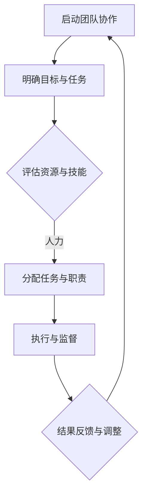

**核心算法原理讲解**：无，此章节更多是介绍性内容。

**数学模型和公式**：无，此章节主要介绍团队协作的概念和重要性。

**项目实战**：无，此章节主要是理论概述。

#### 1.2 团队协作的基本原则

**背景介绍**：团队协作需要遵循一定的基本原则，如明确目标、分工合作、相互信任等。

**核心概念与联系**：通过Mermaid流程图，展示团队协作的基本原则，如图1.2所示。

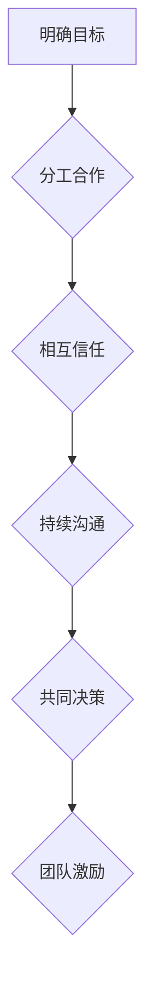

**核心算法原理讲解**：无，此章节更多是关于基本原则的介绍。

**数学模型和公式**：无，此章节主要介绍基本原则。

**项目实战**：无，此章节主要是理论概述。

#### 1.3 团队协作的常见问题及解决策略

**背景介绍**：团队协作过程中常会遇到沟通不畅、目标不明确、分工不清等问题。

**核心概念与联系**：通过Mermaid流程图，展示团队协作中的常见问题及解决策略，如图1.3所示。

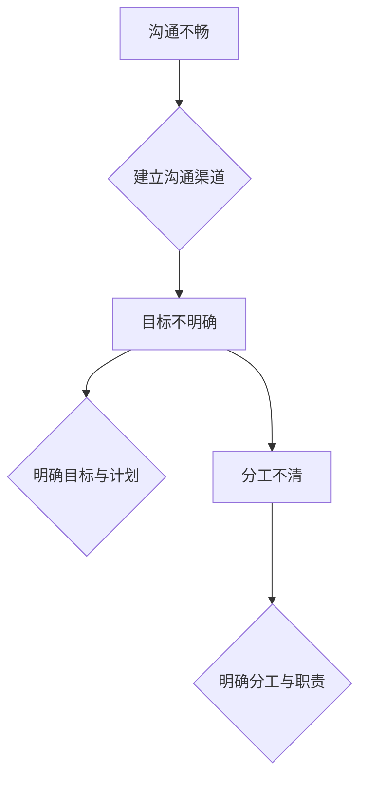

**核心算法原理讲解**：无，此章节更多是关于问题解决的介绍。

**数学模型和公式**：无，此章节主要介绍问题解决方法。

**项目实战**：无，此章节主要是理论概述。

### 第2章：团队角色与沟通技巧

#### 2.1 团队角色的识别与定位

**背景介绍**：团队成员的角色对于团队协作至关重要，准确的识别与定位能够提升团队效能。

**核心概念与联系**：通过Mermaid流程图，展示团队角色的识别与定位过程，如图2.1所示。

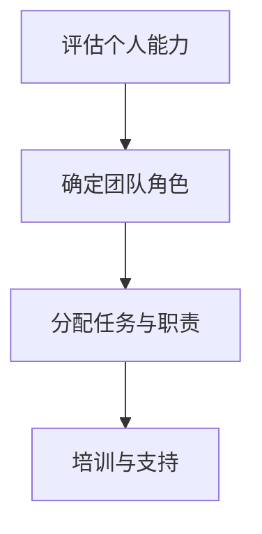

**核心算法原理讲解**：无，此章节更多是关于角色定位的介绍。

**数学模型和公式**：无，此章节主要介绍角色定位方法。

**项目实战**：提供实际角色定位案例，展示如何识别与定位团队成员。

#### 2.2 有效的沟通技巧

**背景介绍**：沟通是团队协作的桥梁，有效的沟通技巧能够促进团队协作的顺利进行。

**核心概念与联系**：通过Mermaid流程图，展示有效的沟通技巧，如图2.2所示。

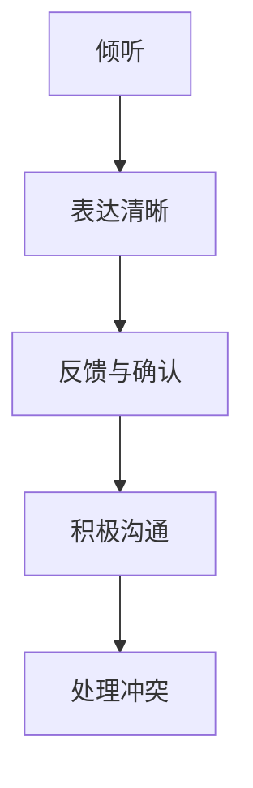

**核心算法原理讲解**：无，此章节更多是关于沟通技巧的介绍。

**数学模型和公式**：无，此章节主要介绍沟通技巧。

**项目实战**：提供实际沟通案例和沟通技巧应用的示例。

### 第3章：个体优势与团队协作

#### 3.1 发挥个体优势的原则

**背景介绍**：个体优势在团队协作中具有重要的推动作用，正确发挥个体优势能够提升团队整体效能。

**核心概念与联系**：通过Mermaid流程图，展示发挥个体优势的原则，如图3.1所示。

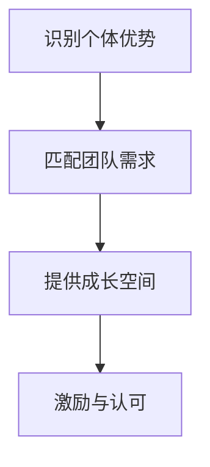

**核心算法原理讲解**：无，此章节更多是关于优势发挥的介绍。

**数学模型和公式**：无，此章节主要介绍优势发挥方法。

**项目实战**：通过具体案例展示如何识别和发挥个体优势。

#### 3.2 个体优势与团队目标的结合

**背景介绍**：个体优势与团队目标的结合能够实现协同效应，提升团队绩效。

**核心概念与联系**：通过Mermaid流程图，展示个体优势与团队目标的结合，如图3.2所示。

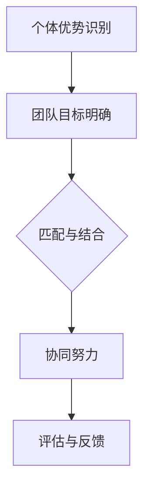

**核心算法原理讲解**：无，此章节更多是关于优势结合的介绍。

**数学模型和公式**：无，此章节主要介绍优势结合方法。

**项目实战**：通过具体案例展示如何将个体优势融入团队协作。

### 第4章：团队协作工具与方法

#### 4.1 团队协作工具的选择

**背景介绍**：团队协作工具能够提高团队协作的效率，选择合适的工具至关重要。

**核心概念与联系**：通过Mermaid流程图，展示团队协作工具的选择过程，如图4.1所示。

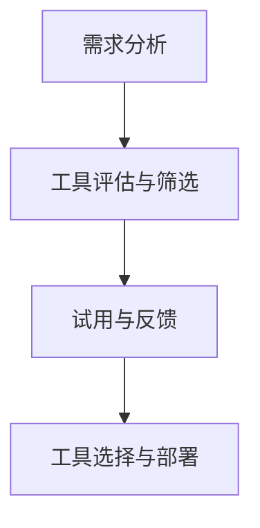

**核心算法原理讲解**：无，此章节更多是关于工具选择的介绍。

**数学模型和公式**：无，此章节主要介绍工具选择方法。

**项目实战**：介绍如何使用特定工具提高团队协作效率。

### 第5章：团队协作中的冲突管理

#### 5.1 冲突的定义与类型

**背景介绍**：冲突是团队协作中不可避免的现象，正确处理冲突能够维护团队和谐。

**核心概念与联系**：通过Mermaid流程图，展示冲突的定义与类型，如图5.1所示。

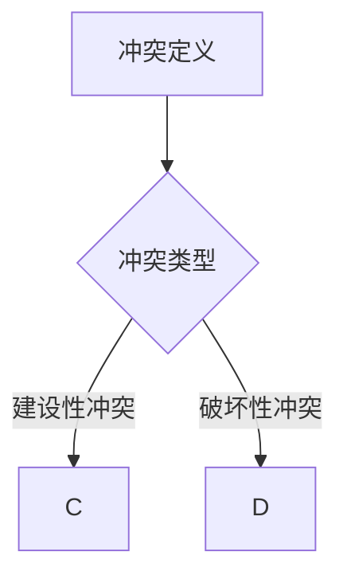

**核心算法原理讲解**：无，此章节更多是关于冲突定义的介绍。

**数学模型和公式**：无，此章节主要介绍冲突类型。

**项目实战**：提供实际冲突管理案例，展示冲突解决的策略。

### 第6章：团队协作与领导力

#### 6.1 领导力与团队协作的关系

**背景介绍**：领导力在团队协作中发挥着重要作用，优秀的领导能够促进团队协作的顺利进行。

**核心概念与联系**：通过Mermaid流程图，展示领导力与团队协作的关系，如图6.1所示。

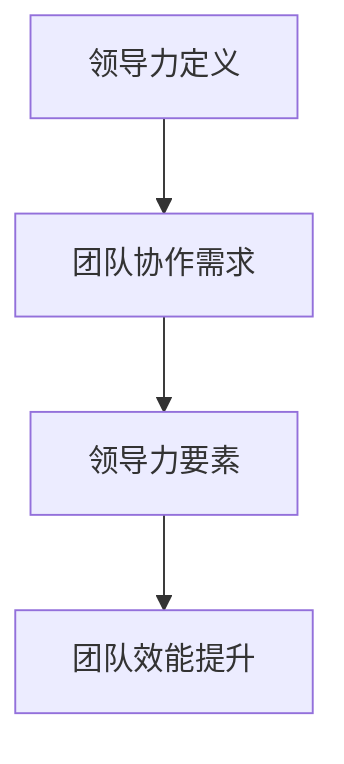

**核心算法原理讲解**：无，此章节更多是关于领导力与团队协作关系的介绍。

**数学模型和公式**：无，此章节主要介绍领导力要素。

**项目实战**：介绍领导力的提升方法和实践。

### 第7章：团队协作案例分析

#### 7.1 成功的团队协作案例

**背景介绍**：成功的团队协作案例能够为其他团队提供宝贵的经验。

**核心概念与联系**：通过Mermaid流程图，展示成功团队协作的关键因素，如图7.1所示。

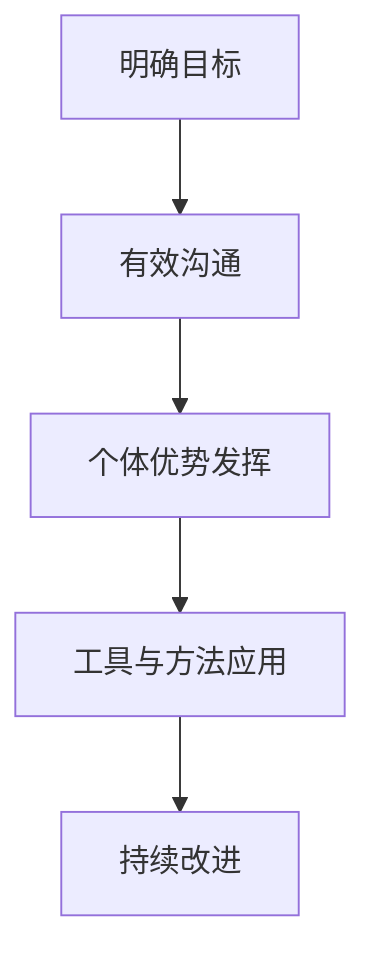

**核心算法原理讲解**：无，此章节更多是关于成功案例的介绍。

**数学模型和公式**：无，此章节主要介绍成功案例的关键因素。

**项目实战**：分析成功案例的细节，提供可借鉴的经验。

#### 7.2 团队协作中的失败案例分析

**背景介绍**：失败案例分析有助于识别团队协作中的潜在问题，避免重复错误。

**核心概念与联系**：通过Mermaid流程图，展示失败案例的主要原因，如图7.2所示。

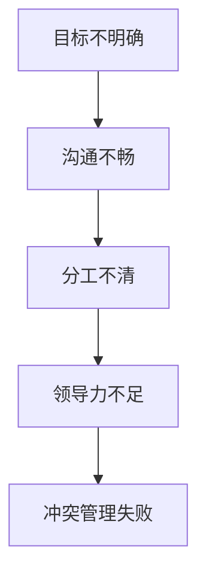

**核心算法原理讲解**：无，此章节更多是关于失败案例的分析。

**数学模型和公式**：无，此章节主要介绍失败原因。

**项目实战**：分析失败案例的具体情况，提供改进建议。

#### 7.3 团队协作的持续改进策略

**背景介绍**：持续改进是团队协作的关键，能够不断提升团队效能。

**核心概念与联系**：通过Mermaid流程图，展示持续改进的策略，如图7.3所示。

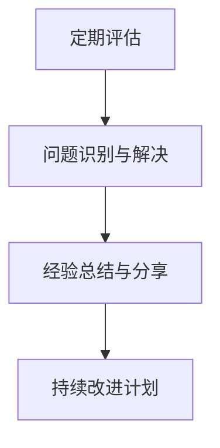

**核心算法原理讲解**：无，此章节更多是关于持续改进的介绍。

**数学模型和公式**：无，此章节主要介绍持续改进策略。

**项目实战**：提供持续改进的实践案例，展示如何在实际工作中实施改进计划。

## 第二部分：团队协作实践应用

### 第8章：团队协作项目启动

#### 8.1 项目启动的准备工作

**背景介绍**：项目启动是团队协作的起点，准备工作至关重要。

**核心概念与联系**：通过Mermaid流程图，展示项目启动的准备工作，如图8.1所示。

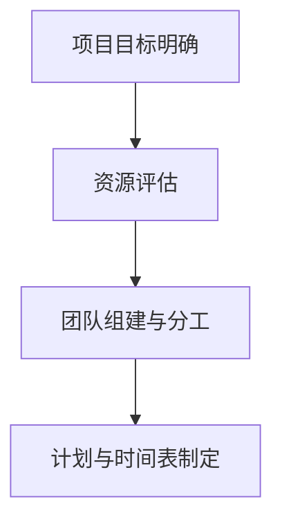

**核心算法原理讲解**：无，此章节更多是关于项目启动准备的介绍。

**数学模型和公式**：无，此章节主要介绍启动准备步骤。

**项目实战**：介绍项目启动的详细步骤和注意事项。

#### 8.2 项目目标的明确

**背景介绍**：明确项目目标是确保项目顺利进行的前提。

**核心概念与联系**：通过Mermaid流程图，展示明确项目目标的过程，如图8.2所示。

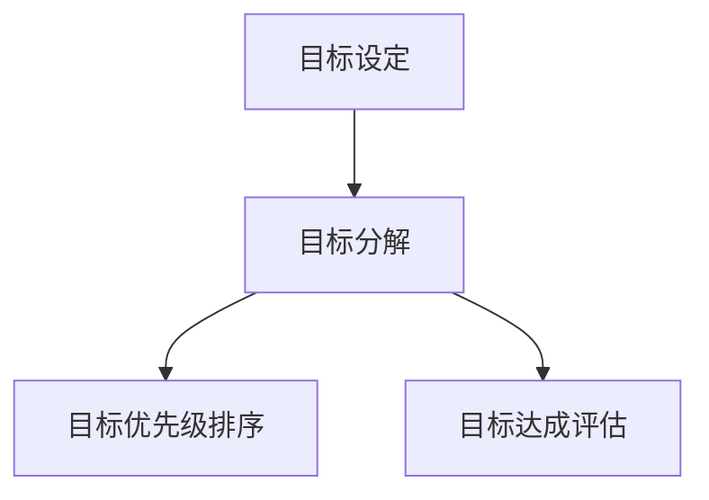

**核心算法原理讲解**：无，此章节更多是关于目标明确的介绍。

**数学模型和公式**：无，此章节主要介绍目标明确的方法。

**项目实战**：通过实际案例展示如何明确项目目标。

#### 8.3 项目团队的组建与管理

**背景介绍**：项目团队的组建与管理对于项目成功至关重要。

**核心概念与联系**：通过Mermaid流程图，展示项目团队组建与管理的过程，如图8.3所示。

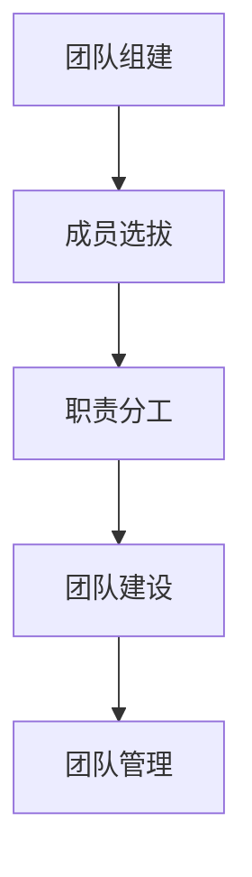

**核心算法原理讲解**：无，此章节更多是关于团队组建与管理的介绍。

**数学模型和公式**：无，此章节主要介绍团队组建与管理方法。

**项目实战**：介绍项目团队组建与管理的实践方法。

### 第9章：团队协作项目实施

#### 9.1 项目计划与进度管理

**背景介绍**：项目计划与进度管理是确保项目按时完成的保障。

**核心概念与联系**：通过Mermaid流程图，展示项目计划与进度管理的过程，如图9.1所示。

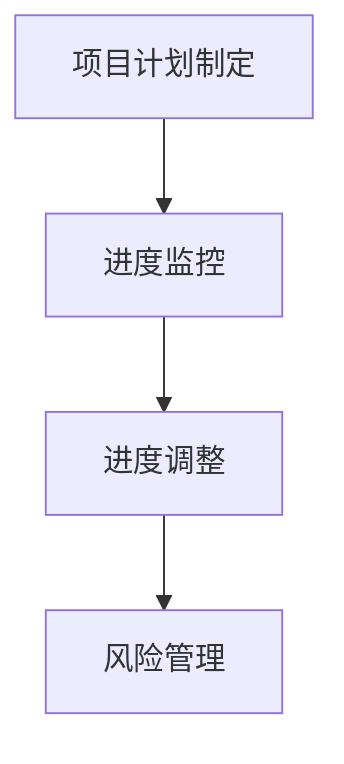

**核心算法原理讲解**：无，此章节更多是关于项目计划与进度管理的介绍。

**数学模型和公式**：无，此章节主要介绍项目计划与进度管理方法。

**项目实战**：通过实际案例展示项目计划与进度管理的实施方法。

#### 9.2 项目沟通与协作

**背景介绍**：项目沟通与协作是项目成功的关键因素。

**核心概念与联系**：通过Mermaid流程图，展示项目沟通与协作的过程，如图9.2所示。

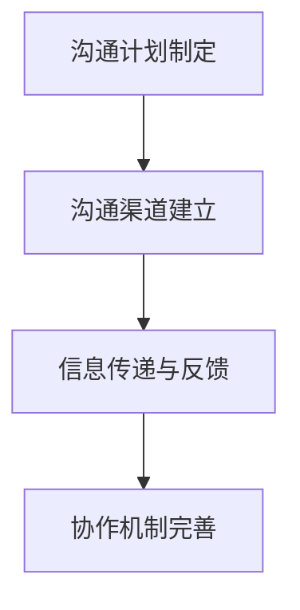

**核心算法原理讲解**：无，此章节更多是关于项目沟通与协作的介绍。

**数学模型和公式**：无，此章节主要介绍项目沟通与协作方法。

**项目实战**：通过实际案例展示项目沟通与协作的实施方法。

#### 9.3 项目风险与问题应对

**背景介绍**：项目风险与问题的应对是确保项目顺利推进的重要环节。

**核心概念与联系**：通过Mermaid流程图，展示项目风险与问题应对的过程，如图9.3所示。

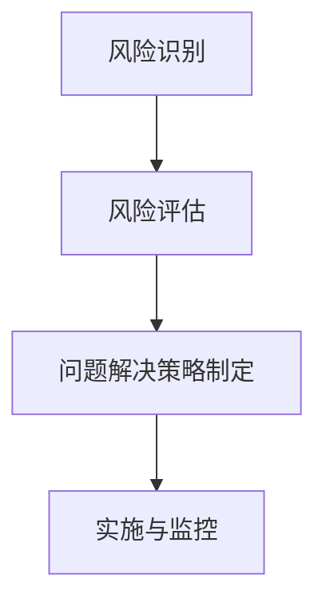

**核心算法原理讲解**：无，此章节更多是关于风险与问题应对的介绍。

**数学模型和公式**：无，此章节主要介绍风险与问题应对方法。

**项目实战**：通过实际案例展示风险与问题应对的实施方法。

### 第10章：团队协作项目评估与总结

#### 10.1 项目成果评估

**背景介绍**：项目成果评估是项目结束的重要环节，能够为后续项目提供参考。

**核心概念与联系**：通过Mermaid流程图，展示项目成果评估的过程，如图10.1所示。

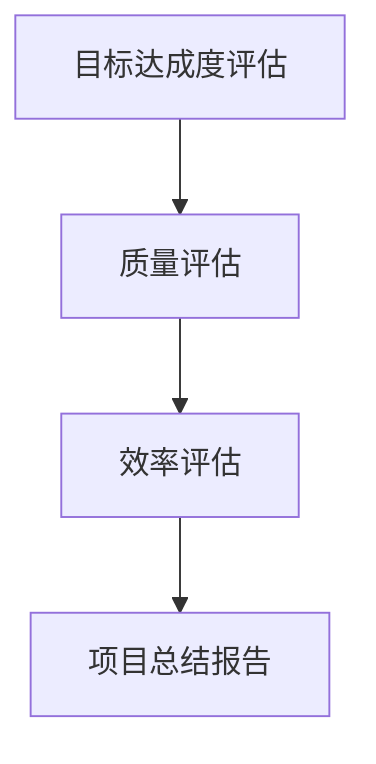

**核心算法原理讲解**：无，此章节更多是关于项目成果评估的介绍。

**数学模型和公式**：无，此章节主要介绍成果评估方法。

**项目实战**：通过实际案例展示项目成果评估的实施方法。

#### 10.2 项目经验总结

**背景介绍**：项目经验总结能够帮助团队积累经验，提高项目执行力。

**核心概念与联系**：通过Mermaid流程图，展示项目经验总结的过程，如图10.2所示。

```mermaid
graph TD
    A[问题总结] --> B[经验分享]
    B --> C[教训汲取]
    C --> D[持续改进]
```

**核心算法原理讲解**：无，此章节更多是关于经验总结的介绍。

**数学模型和公式**：无，此章节主要介绍经验总结方法。

**项目实战**：通过实际案例展示项目经验总结的实施方法。

#### 10.3 团队协作能力的提升路径

**背景介绍**：团队协作能力的提升是团队持续发展的关键。

**核心概念与联系**：通过Mermaid流程图，展示团队协作能力提升的路径，如图10.3所示。

```mermaid
graph TD
    A[基础能力培养] --> B[沟通技巧提升]
    B --> C[团队文化建设]
    C --> D[个体与团队融合]
```

**核心算法原理讲解**：无，此章节更多是关于能力提升的介绍。

**数学模型和公式**：无，此章节主要介绍能力提升路径。

**项目实战**：通过实际案例展示团队协作能力提升的方法。

### 第11章：团队协作与数字化管理

#### 11.1 数字化管理工具的应用

**背景介绍**：数字化管理工具能够提高团队协作效率，优化管理流程。

**核心概念与联系**：通过Mermaid流程图，展示数字化管理工具的应用，如图11.1所示。

```mermaid
graph TD
    A[工具选择] --> B[工具配置]
    B --> C[工具培训]
    C --> D[工具应用与反馈]
```

**核心算法原理讲解**：无，此章节更多是关于数字化管理工具的介绍。

**数学模型和公式**：无，此章节主要介绍数字化管理工具的应用方法。

**项目实战**：介绍数字化管理工具的具体应用实例。

#### 11.2 数据驱动的团队协作管理

**背景介绍**：数据驱动管理能够为团队协作提供客观依据，提升决策效率。

**核心概念与联系**：通过Mermaid流程图，展示数据驱动的团队协作管理，如图11.2所示。

```mermaid
graph TD
    A[数据收集与分析] --> B[数据可视化]
    B --> C[数据驱动决策]
    C --> D[数据反馈与改进]
```

**核心算法原理讲解**：无，此章节更多是关于数据驱动的介绍。

**数学模型和公式**：无，此章节主要介绍数据驱动的管理方法。

**项目实战**：通过实际案例展示数据驱动的团队协作管理。

#### 11.3 数字化团队协作的未来发展趋势

**背景介绍**：数字化团队协作正在快速发展，了解未来发展趋势有助于团队适应变革。

**核心概念与联系**：通过Mermaid流程图，展示数字化团队协作的未来发展趋势，如图11.3所示。

```mermaid
graph TD
    A[人工智能与协作] --> B[自动化与智能化]
    B --> C[云计算与协作]
    C --> D[物联网与协作]
```

**核心算法原理讲解**：无，此章节更多是关于未来发展趋势的介绍。

**数学模型和公式**：无，此章节主要介绍未来发展趋势。

**项目实战**：探讨数字化团队协作的发展趋势及其对团队协作的影响。

## 第三部分：附录

### 附录A：团队协作工具推荐

#### A.1 常用团队协作工具介绍

**背景介绍**：介绍几种常用的团队协作工具，包括其特点和适用场景。

**核心概念与联系**：通过Mermaid流程图，展示常用团队协作工具的功能和应用场景，如图A.1所示。

```mermaid
graph TD
    A[Trello] --> B[项目管理]
    A --> C[协作沟通]
    B --> D[任务追踪]
    C --> E[文件共享]
```

**核心算法原理讲解**：无，此章节更多是关于工具介绍的介绍。

**数学模型和公式**：无，此章节主要介绍工具功能。

**项目实战**：提供工具的实际应用案例。

#### A.2 工具选择指南

**背景介绍**：根据团队需求选择合适的协作工具。

**核心概念与联系**：通过Mermaid流程图，展示工具选择指南，如图A.2所示。

```mermaid
graph TD
    A[需求分析] --> B[工具评估与筛选]
    B --> C[试用与反馈]
    C --> D[工具选择与部署]
```

**核心算法原理讲解**：无，此章节更多是关于工具选择的介绍。

**数学模型和公式**：无，此章节主要介绍工具选择方法。

**项目实战**：提供工具选择的具体步骤。

#### A.3 实战案例分享

**背景介绍**：分享一些团队协作工具的实际应用案例。

**核心概念与联系**：通过Mermaid流程图，展示实战案例的应用效果，如图A.3所示。

```mermaid
graph TD
    A[案例一] --> B[应用效果评估]
    A --> C[经验总结]
    B --> D[案例分享]
```

**核心算法原理讲解**：无，此章节更多是关于实战案例的介绍。

**数学模型和公式**：无，此章节主要介绍案例应用效果。

**项目实战**：提供实际案例的详细解读。

### 附录B：团队协作相关资源

#### B.1 基础理论资源

**背景介绍**：提供一些关于团队协作的基础理论资源，包括书籍、论文和网站等。

**核心概念与联系**：无，此章节主要提供资源信息。

**数学模型和公式**：无，此章节主要介绍资源内容。

**项目实战**：无，此章节主要是资源推荐。

#### B.2 实践经验分享

**背景介绍**：分享一些团队协作的实际经验，包括成功案例和失败教训。

**核心概念与联系**：通过Mermaid流程图，展示实践经验的应用效果，如图B.2所示。

```mermaid
graph TD
    A[成功经验] --> B[经验总结]
    A --> C[实践应用]
    B --> D[案例分享]
```

**核心算法原理讲解**：无，此章节更多是关于经验分享的介绍。

**数学模型和公式**：无，此章节主要介绍实践经验。

**项目实战**：提供实践经验的具体案例。

#### B.3 研究报告与趋势分析

**背景介绍**：提供一些关于团队协作的研究报告和趋势分析，帮助读者了解行业发展动态。

**核心概念与联系**：通过Mermaid流程图，展示研究报告和趋势分析的内容，如图B.3所示。

```mermaid
graph TD
    A[研究报告] --> B[趋势分析]
    A --> C[行业洞察]
    B --> D[未来展望]
```

**核心算法原理讲解**：无，此章节更多是关于研究报告和趋势分析的介绍。

**数学模型和公式**：无，此章节主要介绍报告内容。

**项目实战**：无，此章节主要是行业分析和趋势解读。

