                 


## 文章标题：团队协作：打破部门壁垒的策略

### 关键词：团队协作、部门壁垒、协作策略、流程方法、工具技术、案例分析

> 摘要：本文旨在探讨团队协作中的部门壁垒问题，通过分析团队协作的重要性、核心原则、方法与工具，以及跨部门协作实践和团队协作文化建设，提出一系列打破部门壁垒的策略，以促进高效团队协作。

### 目录大纲：

**第一部分：团队协作概述**

## 第1章：团队协作的重要性与挑战

### 1.1 团队协作的基本概念与作用
### 1.2 部门壁垒的成因与影响
### 1.3 打破部门壁垒的重要性

## 第2章：团队协作的核心原则

### 2.1 共同目标与愿景
### 2.2 信任与尊重
### 2.3 沟通与透明度
### 2.4 合作与共享

**第二部分：团队协作方法与工具**

## 第3章：团队协作流程与方法

### 3.1 团队合作流程概述
#### 3.1.1 项目启动
#### 3.1.2 项目执行
#### 3.1.3 项目监控
#### 3.1.4 项目收尾

### 3.2 团队协作方法
#### 3.2.1 AGILE方法
#### 3.2.2 设计思考
#### 3.2.3 沉浸式工作
#### 3.2.4 平行任务管理

## 第4章：团队协作工具与技术

### 4.1 团队协作工具概述
#### 4.1.1 会议管理工具
#### 4.1.2 文档协作工具
#### 4.1.3 项目管理工具
#### 4.1.4 沟通与协作平台

### 4.2 技术选型与部署
#### 4.2.1 开源与商业工具对比
#### 4.2.2 常用协作技术架构
#### 4.2.3 技术选型建议

## 第5章：跨部门协作实践

### 5.1 跨部门协作案例分享
#### 5.1.1 项目A的成功实践
#### 5.1.2 项目B的困境与解决
#### 5.1.3 项目C的反思与总结

### 5.2 跨部门协作的障碍与解决方案
#### 5.2.1 障碍分析
#### 5.2.2 解决方案探讨

## 第6章：团队协作文化建设

### 6.1 团队协作文化的概念与重要性
### 6.2 团队协作文化的塑造与传承
#### 6.2.1 领导者的角色
#### 6.2.2 员工的参与
#### 6.2.3 团队氛围的营造

### 6.3 团队协作文化的评估与改进
#### 6.3.1 文化评估方法
#### 6.3.2 文化改进策略

**第三部分：团队协作案例分析**

## 第7章：成功团队协作案例解析

### 7.1 案例一：公司A的团队协作实践
#### 7.1.1 项目背景
#### 7.1.2 团队协作策略
#### 7.1.3 项目成果

### 7.2 案例二：公司B的跨部门协作
#### 7.2.1 项目背景
#### 7.2.2 团队协作策略
#### 7.2.3 项目成果

## 第8章：团队协作的未来趋势与展望

### 8.1 数字化转型对团队协作的影响
### 8.2 新兴技术对团队协作的支持
### 8.3 团队协作的未来趋势与挑战
#### 8.3.1 技术趋势
#### 8.3.2 文化变革
#### 8.3.3 挑战与机遇

### 附录

## 附录A：团队协作工具推荐

### A.1 开源工具推荐
### A.2 商业工具推荐
### A.3 使用建议与对比

## 附录B：团队协作常见问题解答

### B.1 如何提高团队协作效率？
### B.2 跨部门协作如何处理沟通障碍？
### B.3 团队协作中出现分歧怎么办？
### B.4 如何评估团队协作的效果？

### 作者：AI天才研究院/AI Genius Institute & 禅与计算机程序设计艺术 /Zen And The Art of Computer Programming
### 第一部分：团队协作概述

## 第1章：团队协作的重要性与挑战

### 1.1 团队协作的基本概念与作用

团队协作是指团队成员之间通过共享资源、知识、技能和经验，共同完成一个项目或任务的过程。它不仅是实现组织目标的关键手段，也是提升工作效率、激发创新和增强团队凝聚力的有效途径。

- **基本概念：** 团队协作涉及到多个成员的相互配合，包括任务分配、角色分工、信息共享、沟通协作等。

- **作用：** 团队协作能够：

  1. **提高工作效率：** 通过明确分工和高效沟通，团队成员可以更好地聚焦于自己的职责，从而提高整体工作效率。
  2. **激发创新：** 团队成员之间的互动和合作能够激发新的思路和创意，从而推动项目的创新和发展。
  3. **增强团队凝聚力：** 团队协作有助于增强成员之间的互信和默契，提升团队的凝聚力。

### 1.2 部门壁垒的成因与影响

部门壁垒是指在组织中，不同部门之间由于职责分工、利益冲突、信息不对称等原因，导致协作不畅、沟通障碍的现象。

- **成因：** 部门壁垒的成因主要包括：

  1. **职责分工：** 不同部门有各自的职责和目标，可能导致各自为政，忽视跨部门的协作。
  2. **利益冲突：** 部门之间存在利益分配和资源争夺，可能导致协作受阻。
  3. **信息不对称：** 部门之间的信息传递不畅，导致沟通效果不佳。

- **影响：** 部门壁垒的影响包括：

  1. **降低工作效率：** 部门之间的协作不畅会导致任务延误、资源浪费，降低整体工作效率。
  2. **阻碍创新：** 部门壁垒限制了信息的流动和资源的共享，阻碍了创新思维的产生。
  3. **影响团队凝聚力：** 部门壁垒可能导致成员之间的矛盾和冲突，影响团队的凝聚力。

### 1.3 打破部门壁垒的重要性

打破部门壁垒对于提升团队协作效率、推动组织发展具有重要意义。

- **提升协作效率：** 打破部门壁垒有助于消除协作障碍，促进部门间的沟通与协作，从而提高整体工作效率。

- **促进创新：** 打破部门壁垒有助于信息共享和资源整合，激发创新思维，推动项目的创新发展。

- **增强团队凝聚力：** 打破部门壁垒有助于建立互信和合作关系，增强团队的凝聚力，提升组织的整体竞争力。

**Mermaid 流程图：**

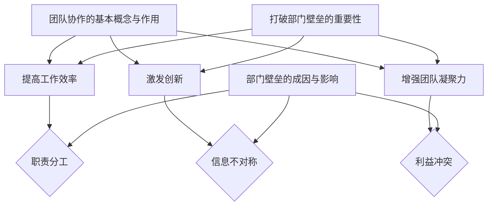

### 1.4 团队协作的核心原则

团队协作的成功离不开一系列核心原则的指导。以下是团队协作中的几个核心原则：

- **共同目标与愿景：** 团队成员应该明确共同的目标和愿景，这有助于统一思想、提高协作的积极性。

- **信任与尊重：** 信任是团队协作的基石，尊重则能促进团队成员之间的和谐关系。

- **沟通与透明度：** 高效的沟通和透明的信息分享是团队协作的关键，有助于减少误解和冲突。

- **合作与共享：** 团队成员应该具备合作精神和共享意识，共同为团队目标努力。

**Mermaid 流程图：**

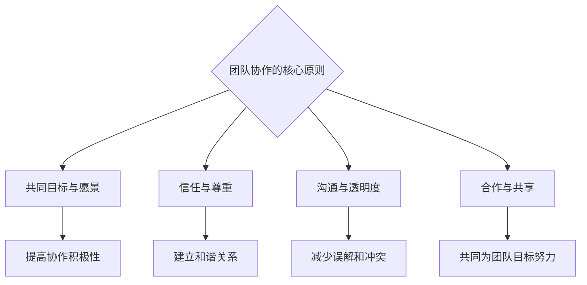

### 1.5 结论

团队协作在组织发展中扮演着至关重要的角色。通过分析团队协作的基本概念与作用，理解部门壁垒的成因与影响，以及掌握团队协作的核心原则，我们可以为打破部门壁垒、实现高效团队协作奠定基础。在接下来的章节中，我们将进一步探讨团队协作的方法与工具，以期为团队协作的实践提供更具体的指导。

### 第二部分：团队协作方法与工具

## 第3章：团队协作流程与方法

### 3.1 团队合作流程概述

团队协作流程是确保项目顺利进行的重要环节。一个高效的团队协作流程可以提升工作效率，减少冲突，实现项目目标。以下是团队协作流程的四个主要阶段：

#### 3.1.1 项目启动

项目启动是团队协作的第一个阶段，主要任务是明确项目目标、任务分工和资源需求。

1. **项目目标：** 明确项目的最终目标，确保所有团队成员对项目目标有共同的理解。
2. **任务分工：** 根据团队成员的能力和特长，合理分配任务，确保每个人明确自己的职责。
3. **资源需求：** 分析项目所需的资源，包括人力、物力和财力，并制定资源获取计划。

**伪代码：**

```python
def project_startup(project):
    set_project_goal(project)
    allocate_tasks(project)
    plan_resources(project)
```

#### 3.1.2 项目执行

项目执行是团队协作的核心阶段，团队成员按照既定的任务分工，共同推进项目。

1. **任务分配：** 根据任务分工，每个成员按照计划执行自己的任务。
2. **协作沟通：** 团队成员之间保持密切的沟通，确保任务进展的顺利进行。
3. **进度监控：** 定期检查任务进度，确保项目按计划推进。

**伪代码：**

```python
def project_execution(project):
    execute_tasks(project)
    maintain_communication(project)
    monitor_progress(project)
```

#### 3.1.3 项目监控

项目监控是确保项目按计划进行的重要环节，包括进度跟踪、风险管理、质量控制等。

1. **进度跟踪：** 定期检查任务进度，确保项目按时完成。
2. **风险管理：** 识别潜在风险，并制定应对策略，减少风险对项目的影响。
3. **质量控制：** 确保项目交付的质量符合预期，避免返工和资源浪费。

**伪代码：**

```python
def project_monitoring(project):
    track_progress(project)
    manage_risks(project)
    ensure_quality(project)
```

#### 3.1.4 项目收尾

项目收尾是团队协作的最后阶段，主要任务是总结项目经验，评估项目成果。

1. **成果验收：** 对项目交付物进行验收，确保符合预期。
2. **经验总结：** 分析项目过程中的成功经验和不足，为后续项目提供借鉴。
3. **项目评估：** 对项目进行全方位评估，包括进度、成本、质量、团队协作等方面。

**伪代码：**

```python
def project_termination(project):
    accept_deliverables(project)
    summarize_experience(project)
    evaluate_project(project)
```

### 3.2 团队协作方法

团队协作方法是指团队成员在实际工作中采用的具体方法和策略，以下是几种常见的团队协作方法：

#### 3.2.1 AGILE方法

AGILE（敏捷）方法是一种以人为核心、迭代和循序渐进的开发方法，适用于需求变化快的项目。

1. **迭代开发：** 项目分为多个迭代周期，每个迭代周期完成一部分功能。
2. **用户反馈：** 每个迭代周期结束后，收集用户反馈，根据反馈调整项目计划。
3. **自组织团队：** 成员根据项目需求自主分工，发挥各自专长。

**伪代码：**

```python
def agile_method(project):
    start_iterative_cycle(project)
    collect_user_feedback(project)
    adapt_project_plan(project)
```

#### 3.2.2 设计思考

设计思考是一种以用户为中心的设计方法，强调用户需求和用户体验。

1. **用户调研：** 了解用户需求和痛点，收集用户反馈。
2. **原型设计：** 根据用户需求设计产品原型，进行用户测试。
3. **迭代优化：** 根据用户反馈，优化产品设计和功能。

**伪代码：**

```python
def design_thinking(product):
    conduct_user_research(product)
    design_prototype(product)
    iterate_based_on_feedback(product)
```

#### 3.2.3 沉浸式工作

沉浸式工作是指团队成员在项目期间，全身心投入，共同攻克难题。

1. **集中办公：** 成员在项目期间集中办公，便于实时沟通和协作。
2. **全职投入：** 成员全职投入项目，确保项目进度和质量。
3. **协同解决：** 遇到难题时，团队成员共同讨论，共同解决。

**伪代码：**

```python
def immersive_work(project):
    setup_coworking_space(project)
    full_time_commitment(project)
    collaborate_to_solve_issues(project)
```

#### 3.2.4 平行任务管理

平行任务管理是指将任务分解为多个部分，同时进行，以提高工作效率。

1. **任务分解：** 将任务分解为多个子任务，明确每个子任务的责任人。
2. **同步推进：** 各个子任务同时进行，确保项目进度。
3. **协调资源：** 协调资源，确保任务顺利完成。

**伪代码：**

```python
def parallel_task_management(project):
    decompose_tasks(project)
    initiate_parallel_execution(project)
    coordinate_resources(project)
```

### 3.3 团队协作方法与工具的配合

团队协作方法与工具的配合是提高团队协作效率的关键。以下是一些常见团队协作工具及其应用：

1. **会议管理工具：** 如Zoom、Microsoft Teams，用于在线会议、视频通话和远程协作。
2. **文档协作工具：** 如Google Docs、Microsoft Office 365，用于多人实时编辑文档、表格和演示文稿。
3. **项目管理工具：** 如Trello、Asana，用于任务分配、进度跟踪和团队协作。
4. **沟通与协作平台：** 如Slack、Microsoft Teams，用于即时沟通、消息传递和文件共享。

**Mermaid 流程图：**

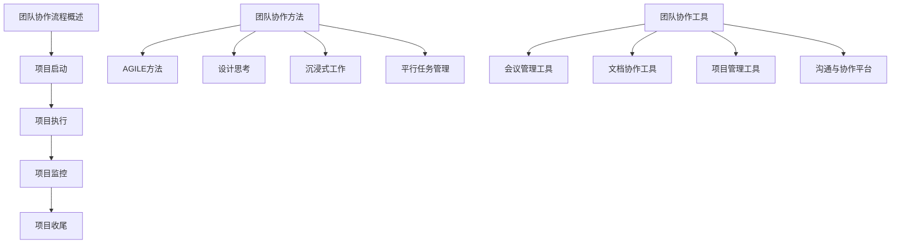

### 3.4 结论

团队协作流程和方法的合理运用，有助于提升团队协作效率，实现项目目标。通过项目启动、项目执行、项目监控和项目收尾等流程，以及AGILE方法、设计思考、沉浸式工作和平行任务管理等方法，团队可以更好地应对项目挑战，提高团队协作水平。在接下来的章节中，我们将进一步探讨团队协作工具和技术，为团队协作提供更多支持。

### 第三部分：团队协作工具与技术

## 第4章：团队协作工具与技术

### 4.1 团队协作工具概述

团队协作工具是提高团队协作效率的关键，它们涵盖了会议管理、文档协作、项目管理以及沟通与协作平台等多个方面。以下是几种常见的团队协作工具及其特点：

#### 4.1.1 会议管理工具

会议管理工具用于在线会议、视频通话和远程协作，以下是几种常见的会议管理工具：

1. **Zoom**：提供视频会议、在线培训和远程协作等功能，支持多人同时参与。
2. **Microsoft Teams**：集成视频会议、聊天、文档共享和项目管理等功能，适用于企业级应用。
3. **Google Meet**：提供免费的在线会议服务，支持视频通话和屏幕共享。

#### 4.1.2 文档协作工具

文档协作工具用于多人实时编辑文档、表格和演示文稿，以下是几种常见的文档协作工具：

1. **Google Docs**：提供在线文档、表格和演示文稿编辑功能，支持实时协作。
2. **Microsoft Office 365**：集成Word、Excel、PowerPoint等办公软件，支持多人实时编辑。
3. **OnlyOffice**：提供在线文档、表格和演示文稿编辑功能，支持自定义插件和集成。

#### 4.1.3 项目管理工具

项目管理工具用于任务分配、进度跟踪和团队协作，以下是几种常见的项目管理工具：

1. **Trello**：提供看板式任务管理，支持拖拽操作，适用于小型团队。
2. **Asana**：提供任务分配、进度跟踪和团队协作功能，支持自定义报表和通知。
3. **Jira**：提供敏捷项目管理功能，支持任务追踪、迭代规划和敏捷开发。

#### 4.1.4 沟通与协作平台

沟通与协作平台用于即时沟通、消息传递和文件共享，以下是几种常见的沟通与协作平台：

1. **Slack**：提供实时聊天、消息传递和文件共享功能，支持集成第三方服务。
2. **Microsoft Teams**：集成聊天、视频会议、文档协作和项目管理功能，适用于企业级应用。
3. **Discord**：提供实时语音和文字聊天功能，适用于游戏和社区协作。

### 4.2 技术选型与部署

在团队协作中，选择合适的工具和技术至关重要。以下是一些建议：

#### 4.2.1 开源与商业工具对比

1. **开源工具：** �具有免费、灵活性强、社区支持等优点，但可能需要自行维护和部署。
2. **商业工具：** 提供完善的客户服务和技术支持，但可能需要支付费用。

**Mermaid 流程图：**

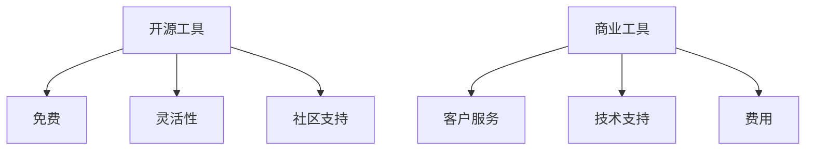

#### 4.2.2 常用协作技术架构

1. **云协作架构：** 利用云计算资源，实现跨地域、跨平台的协作。
2. **分布式协作架构：** 将协作工具部署在多个服务器上，提高系统的可靠性和扩展性。

**Mermaid 流程图：**

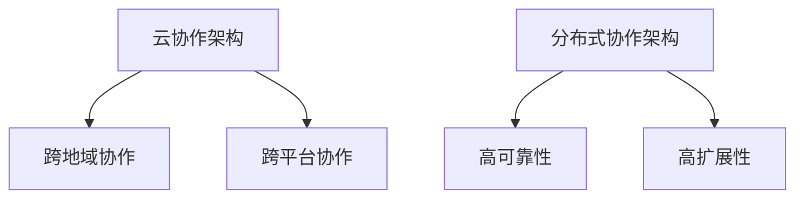

#### 4.2.3 技术选型建议

1. **根据需求选型：** 根据团队的具体需求，选择适合的协作工具和技术。
2. **考虑兼容性：** 确保所选工具和技术与现有系统和设备兼容。
3. **评估成本和效益：** 综合考虑成本、性能、安全等因素，评估所选工具和技术的效益。

**Mermaid 流程图：**

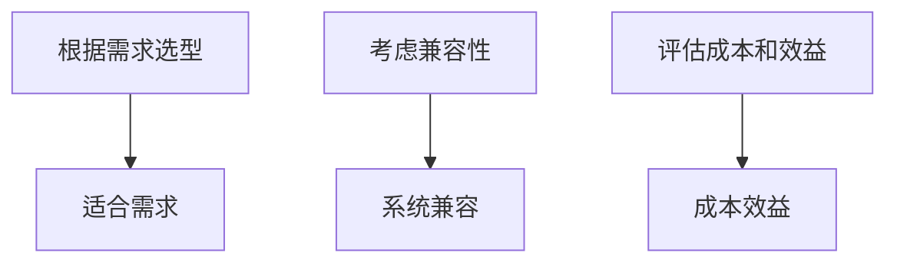

### 4.3 结论

团队协作工具与技术的合理选型和部署，对于提升团队协作效率具有重要意义。通过选择合适的会议管理工具、文档协作工具、项目管理工具和沟通与协作平台，团队可以更好地实现协作，提高项目成功率。在技术选型与部署过程中，需综合考虑需求、兼容性、成本和效益等因素，确保团队协作工具与技术的有效运用。

### 第四部分：跨部门协作实践

## 第5章：跨部门协作实践

### 5.1 跨部门协作案例分享

#### 5.1.1 项目A的成功实践

**项目背景：** 公司A正在开发一款新的移动应用，该项目涉及到开发、设计、产品管理、市场营销等多个部门。

**团队协作策略：**

1. **共同目标与愿景：** 项目启动时，各部门明确了共同的目标和愿景，确保团队成员在项目中的努力方向一致。
2. **定期会议与沟通：** 项目期间，每周举行一次跨部门会议，讨论项目进展、解决问题，确保各部门之间的信息同步。
3. **任务分配与协作：** 根据各部门的职责和特长，明确任务分工，鼓励部门间协作，共同推进项目。
4. **敏捷开发：** 采用敏捷开发方法，快速迭代，根据用户反馈调整项目方向，提高项目成功率。

**项目成果：** 项目在预定时间内顺利完成，用户满意度高，获得了市场好评。

#### 5.1.2 项目B的困境与解决

**项目背景：** 公司B在开发一款复杂的系统，该项目涉及到开发、测试、运维等多个部门。

**协作困境：**

1. **沟通不畅：** 各部门之间的沟通不畅，导致任务延误和资源浪费。
2. **职责不清：** 部门间职责划分不明确，导致工作重复和责任推卸。
3. **利益冲突：** 部门之间的利益分配和资源争夺，影响项目进展。

**解决方案：**

1. **设立项目经理：** 明确项目经理的职责，负责协调各部门的工作，确保项目顺利进行。
2. **沟通渠道优化：** 建立多层次的沟通渠道，如定期会议、即时沟通工具等，提高沟通效率。
3. **职责划分与协作：** 明确各部门的职责，建立协作机制，确保任务分工合理，减少工作重复。
4. **利益协调：** 制定公平的利益分配机制，确保各部门在项目中的贡献得到合理回报。

**项目成果：** 通过优化沟通、明确职责和利益协调，项目B顺利完成，提高了团队协作效率。

#### 5.1.3 项目C的反思与总结

**项目背景：** 公司C在开发一款智能硬件产品，该项目涉及到硬件、软件、测试等多个部门。

**协作反思：**

1. **缺乏全局视角：** 各部门过于关注自身职责，缺乏对项目的全局视角，导致项目目标不一致。
2. **协作机制不完善：** 缺乏有效的协作机制，导致任务推进缓慢，资源浪费。
3. **文化差异：** 部门之间的文化差异，影响团队协作和沟通。

**总结与改进：**

1. **加强跨部门培训：** 增加跨部门培训，提高团队成员对其他部门的了解，增强协作意识。
2. **建立协作平台：** 建立跨部门协作平台，提供信息共享、任务分配、进度跟踪等功能，提高协作效率。
3. **塑造共同愿景：** 明确项目目标，统一团队成员的愿景，提高团队凝聚力。
4. **持续改进：** 定期评估团队协作效果，发现问题并及时改进。

**项目成果：** 通过加强培训、建立协作平台和塑造共同愿景，项目C的团队协作水平得到显著提升，项目进展顺利。

### 5.2 跨部门协作的障碍与解决方案

#### 5.2.1 障碍分析

跨部门协作面临的主要障碍包括：

1. **沟通不畅：** 部门间缺乏有效的沟通渠道，导致信息传递不及时、不准确。
2. **职责不清：** 部门间职责划分不明确，导致工作重复和责任推卸。
3. **利益冲突：** 部门之间的利益分配和资源争夺，影响项目进展。
4. **文化差异：** 部门之间的文化差异，影响团队协作和沟通。

#### 5.2.2 解决方案探讨

为解决跨部门协作的障碍，可以采取以下解决方案：

1. **建立沟通机制：** 设立跨部门沟通会议、即时沟通工具等，确保信息传递及时、准确。
2. **明确职责分工：** 制定明确的职责分工，确保各部门在工作中明确自己的职责，避免工作重复和责任推卸。
3. **利益协调：** 制定公平的利益分配机制，确保各部门在项目中的贡献得到合理回报，减少利益冲突。
4. **文化融合：** 加强跨部门培训，提高团队成员对其他部门的了解，促进文化融合，增强团队协作意识。

**Mermaid 流程图：**

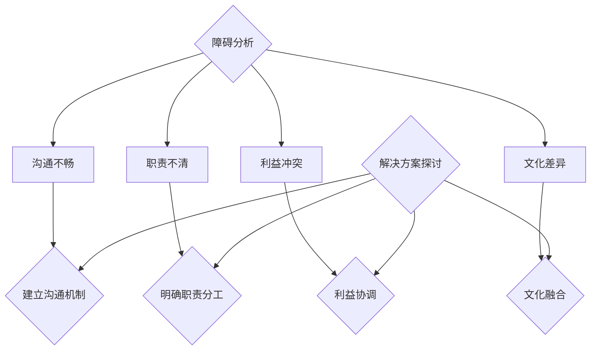

### 5.3 结论

跨部门协作在实践中具有重要意义，通过成功案例和实践经验，我们可以了解到跨部门协作的策略和解决方案。在跨部门协作中，沟通不畅、职责不清、利益冲突和文化差异是常见的障碍，通过建立沟通机制、明确职责分工、利益协调和文化融合等措施，可以有效解决这些障碍，提高跨部门协作效率，推动项目成功。在未来的团队协作中，我们应该继续探索和实践跨部门协作的有效策略，不断提升团队协作水平。

### 第五部分：团队协作文化建设

## 第6章：团队协作文化建设

### 6.1 团队协作文化的概念与重要性

团队协作文化是指团队在长期合作过程中形成的共同价值观、行为规范和工作习惯。它不仅影响团队成员的协作方式，也关系到团队的整体绩效和发展。

- **概念：** 团队协作文化包括共同的愿景、价值观、信任、尊重、沟通、合作与共享等元素。
- **重要性：** 团队协作文化的建立对于团队协作具有重要意义：

  1. **增强团队凝聚力：** 共同的价值观和行为规范有助于增强团队成员之间的信任和凝聚力。
  2. **提高协作效率：** 团队协作文化能够促进团队成员之间的有效沟通和协作，提高工作效率。
  3. **激发创新思维：** 团队协作文化鼓励团队成员分享知识、经验和创意，激发创新思维。
  4. **降低冲突：** 通过共同的价值观和行为规范，可以减少团队成员之间的冲突和误解。

### 6.2 团队协作文化的塑造与传承

团队协作文化的塑造和传承是团队建设的重要任务。以下是一些关键步骤：

#### 6.2.1 领导者的角色

领导者是团队协作文化的塑造者和传播者，其行为和决策对团队文化有深远影响。

1. **树立榜样：** 领导者应通过自身行为树立榜样，以身作则，推动团队协作文化的形成。
2. **制定明确的目标和价值观：** 领导者应明确团队的目标和价值观，并将其融入日常管理和决策中。
3. **激励员工：** 领导者应鼓励团队成员积极参与团队协作，并提供必要的支持和激励。

#### 6.2.2 员工的参与

员工的积极参与是团队协作文化传承的重要保障。

1. **培训与沟通：** 定期开展培训，提高员工对团队协作文化的理解和认同。
2. **鼓励反馈：** 建立开放的沟通环境，鼓励员工提出意见和建议，促进团队协作文化的完善。
3. **奖励与认可：** 对积极参与团队协作的员工给予奖励和认可，增强其归属感和责任感。

#### 6.2.3 团队氛围的营造

团队氛围是团队协作文化的重要组成部分，有助于增强团队的凝聚力和协作效率。

1. **建立信任：** 通过团队合作、共同面对挑战等方式，建立团队成员之间的信任。
2. **尊重差异：** 尊重团队成员的差异，包括观点、技能和文化背景，促进团队成员之间的互相理解和包容。
3. **共享知识：** 鼓励团队成员分享知识和经验，促进知识共享和创新。

**Mermaid 流程图：**

```mermaid
graph TD
A[领导者的角色] --> B[树立榜样}
A --> C[制定明确的目标和价值观]
A --> D[激励员工]
E[员工的参与} --> F[培训与沟通]
E --> G[鼓励反馈}
E --> H[奖励与认可]
I[团队氛围的营造} --> J[建立信任]
I --> K[尊重差异]
I --> L[共享知识]
M{团队协作文化的塑造与传承} --> A
M --> E
M --> I
```

### 6.3 团队协作文化的评估与改进

团队协作文化的评估和改进是确保团队持续发展和进步的关键。

#### 6.3.1 文化评估方法

1. **问卷调查：** 通过设计问卷，收集员工对团队协作文化的看法和反馈。
2. **访谈与观察：** 与团队成员进行深入访谈，观察团队的实际行为和协作情况。
3. **绩效评估：** 结合团队绩效评估，分析团队协作文化对团队绩效的影响。

#### 6.3.2 文化改进策略

1. **识别问题：** 通过评估结果，识别团队协作文化中存在的问题和不足。
2. **制定改进计划：** 制定具体的改进计划，包括培训、激励、沟通等方面。
3. **实施与跟踪：** 实施改进计划，并定期跟踪和评估改进效果，确保文化改进措施的有效实施。

**Mermaid 流程图：**

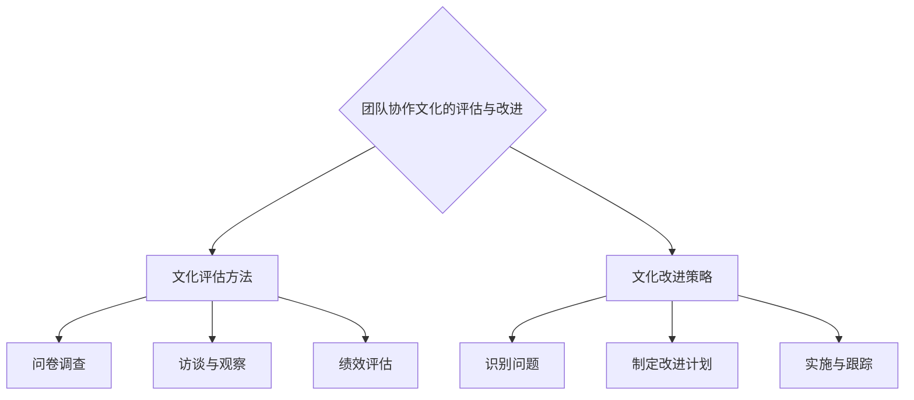

### 6.4 结论

团队协作文化的建立和传承对于团队的发展和成功至关重要。通过领导者的引领、员工的积极参与和团队氛围的营造，我们可以塑造和传承良好的团队协作文化。同时，通过评估和改进团队协作文化，我们可以不断优化团队协作环境，提高团队协作效率，推动团队持续发展。

### 第六部分：团队协作案例分析

## 第7章：成功团队协作案例解析

### 7.1 案例一：公司A的团队协作实践

#### 7.1.1 项目背景

公司A是一家专注于人工智能技术研发的初创企业，其核心项目是一款智能推荐系统的开发。该项目涉及数据挖掘、机器学习、前端开发、后端开发等多个部门。

#### 7.1.2 团队协作策略

1. **共同目标与愿景：** 项目启动时，公司A明确了智能推荐系统项目的重要性和预期成果，各部门围绕共同目标展开工作。
2. **敏捷开发：** 项目采用敏捷开发方法，实现快速迭代和持续改进。每个迭代周期结束后，团队会根据用户反馈调整项目方向。
3. **跨部门会议：** 每周举行一次跨部门会议，各部门负责人汇报项目进展，解决协作中的问题。
4. **任务分配与协作：** 根据各部门的职责和特长，明确任务分工，鼓励跨部门协作，共同推进项目。

#### 7.1.3 项目成果

智能推荐系统项目在预定时间内顺利完成，用户满意度高，取得了显著的市场效益。通过高效团队协作，公司A在短时间内推出了高质量的产品，赢得了市场认可。

### 7.2 案例二：公司B的跨部门协作

#### 7.2.1 项目背景

公司B是一家大型互联网企业，其核心项目是构建一个全新的电商平台。该项目涉及前端开发、后端开发、测试、运维等多个部门。

#### 7.2.2 团队协作策略

1. **设立项目经理：** 项目启动时，公司B设立了项目经理，负责协调各部门的工作，确保项目顺利进行。
2. **沟通渠道优化：** 通过即时通讯工具和邮件系统，建立多层次的沟通渠道，提高部门间的信息传递效率。
3. **任务分工与协作：** 明确各部门的任务分工，鼓励跨部门协作，共同完成项目任务。
4. **敏捷开发与持续集成：** 采用敏捷开发方法，实现快速迭代和持续集成，确保项目质量。

#### 7.2.3 项目成果

电商平台项目在预定时间内成功上线，用户体验良好，取得了显著的商业成功。通过优化沟通渠道、明确任务分工和敏捷开发，公司B有效提高了跨部门协作效率，确保了项目成功。

### 7.3 案例分析与启示

通过对公司A和公司B的团队协作案例分析，我们可以得出以下启示：

1. **共同目标与愿景：** 明确的共同目标和愿景是团队协作成功的基础。各部门应围绕共同目标，协同努力，实现项目目标。
2. **敏捷开发：** 敏捷开发方法有助于快速响应市场变化，提高项目成功率。通过快速迭代和持续改进，团队可以不断优化产品。
3. **沟通渠道优化：** 有效的沟通渠道是跨部门协作的关键。通过即时通讯工具和会议系统，确保信息传递及时、准确。
4. **任务分工与协作：** 明确的任务分工和协作机制有助于提高团队协作效率，减少工作重复和冲突。
5. **项目经理的作用：** 项目经理在跨部门协作中扮演着重要角色，应负责协调各部门的工作，确保项目顺利进行。

### 7.4 结论

成功团队协作案例的解析为我们提供了宝贵的经验，有助于我们更好地理解团队协作的实践方法和策略。通过共同目标、敏捷开发、沟通渠道优化、任务分工与协作以及项目经理的作用，团队可以高效地完成项目任务，实现组织目标。在未来的团队协作中，我们应该继续学习和借鉴成功案例，不断提升团队协作水平，推动组织发展。

### 第8章：团队协作的未来趋势与展望

### 8.1 数字化转型对团队协作的影响

数字化转型是当今企业发展的关键趋势，它对团队协作产生了深远的影响。

- **远程办公的普及：** 随着云计算、互联网技术的不断发展，远程办公成为可能，团队协作不再受地域限制。
- **协作工具的智能化：** 智能协作工具如AI聊天机器人、自动化任务管理工具等，提高了团队协作的效率。
- **数据驱动的决策：** 数据驱动的决策使得团队能够更好地理解市场需求，优化协作流程，提高项目成功率。

### 8.2 新兴技术对团队协作的支持

新兴技术的应用为团队协作提供了更多的可能性。

- **区块链技术：** 提供安全、透明的数据交换方式，有助于提升协作效率和数据安全性。
- **物联网（IoT）：** 通过物联网设备，实现实时数据收集和分析，优化协作流程和决策。
- **虚拟现实（VR）与增强现实（AR）：** 提供沉浸式的协作体验，使团队成员能够更直观地理解和共同解决问题。

### 8.3 团队协作的未来趋势与挑战

#### 8.3.1 技术趋势

1. **人工智能与机器学习：** 人工智能和机器学习技术将在团队协作中发挥更大作用，提高协作效率和决策质量。
2. **自动化与智能化：** 自动化工具和智能化系统将逐步替代重复性工作，使团队成员能够专注于更有价值的工作。
3. **协作平台融合：** 不同协作工具之间的融合，提供更加一体化、便捷的协作体验。

#### 8.3.2 文化变革

1. **扁平化管理：** 随着技术的发展，组织结构将更加扁平化，团队成员间的沟通和协作更加直接。
2. **共享文化：** 共享知识和经验将成为团队协作的重要组成部分，推动创新和团队成长。
3. **远程办公常态化：** 远程办公将成为一种常态，团队成员将更加灵活地安排工作时间和地点。

#### 8.3.3 挑战与机遇

1. **数据隐私与安全：** 随着数据量的增加，数据隐私和安全将成为团队协作的重要挑战。
2. **技术适应性：** 随着技术的快速更新，团队成员需要不断学习新技能，以适应技术变革。
3. **文化冲突与融合：** 随着团队成员背景的多样性，如何融合不同文化，促进团队协作将成为重要课题。

### 8.4 结论

团队协作的未来充满机遇与挑战。随着数字化转型的推进和新兴技术的应用，团队协作将变得更加高效、智能和灵活。然而，数据隐私、技术适应性和文化融合等挑战也需要我们积极应对。通过不断优化协作流程、提升技术能力和促进文化变革，团队可以更好地应对未来的挑战，实现持续发展。

### 附录

## 附录A：团队协作工具推荐

### A.1 开源工具推荐

1. **GitLab**：提供代码托管、项目管理和持续集成的功能。
2. **Jenkins**：用于自动化构建和部署项目。
3. **Docker**：容器化技术，便于部署和扩展应用程序。
4. **Kubernetes**：用于容器编排和管理集群。

### A.2 商业工具推荐

1. **Microsoft Teams**：集成沟通、协作和会议功能。
2. **Slack**：提供即时消息传递和文件共享功能。
3. **Trello**：看板式任务管理工具。
4. **Asana**：项目管理工具，支持任务分配和进度跟踪。

### A.3 使用建议与对比

- **开源工具**：具有免费、灵活性强、社区支持等优点，但需要一定的技术基础进行配置和维护。
- **商业工具**：提供完善的客户服务和技术支持，但可能需要支付费用。

## 附录B：团队协作常见问题解答

### B.1 如何提高团队协作效率？

- **明确目标与分工**：确保团队成员明确项目目标和任务分工。
- **优化沟通渠道**：使用高效的沟通工具，确保信息传递及时、准确。
- **建立协作机制**：制定合理的协作流程和规则，提高协作效率。

### B.2 跨部门协作如何处理沟通障碍？

- **建立跨部门沟通会议**：定期举行跨部门沟通会议，解决协作中的问题。
- **明确职责与权限**：确保各部门职责和权限清晰，减少沟通误解。
- **提供培训与支持**：为跨部门协作提供必要的培训和支持，提高协作效率。

### B.3 团队协作中出现分歧怎么办？

- **冷静分析**：理性分析分歧原因，避免情绪化。
- **沟通解决**：通过沟通和协商，寻求共识。
- **求助上级**：在必要时，可向上级领导寻求帮助，调解分歧。

### B.4 如何评估团队协作的效果？

- **定期评估**：定期对团队协作效果进行评估，发现问题并及时改进。
- **绩效指标**：设定明确的绩效指标，评估团队协作效率和质量。
- **用户反馈**：收集用户对团队协作的反馈，评估团队协作对用户满意度的影响。

### 作者：AI天才研究院/AI Genius Institute & 禅与计算机程序设计艺术 /Zen And The Art of Computer Programming
### 文章标题：团队协作：打破部门壁垒的策略

### 文章关键词：团队协作、部门壁垒、协作策略、流程方法、工具技术、案例分析

### 文章摘要

本文深入探讨了团队协作中常见的部门壁垒问题，并提出了打破这些壁垒的策略。首先，我们分析了团队协作的重要性与挑战，阐述了部门壁垒的成因与影响。接着，文章介绍了团队协作的核心原则，包括共同目标、信任与尊重、沟通与透明度以及合作与共享。随后，我们详细介绍了团队协作的流程和方法，以及团队协作工具和技术的选型与部署。文章还通过跨部门协作的实践案例，分享了成功经验和解决方案。最后，我们讨论了团队协作文化的塑造与传承，以及如何评估团队协作的效果。本文旨在为团队协作提供一套完整的策略和方法，帮助组织实现高效协作，提升项目成功率。

### 第一部分：团队协作概述

#### 第1章：团队协作的重要性与挑战

在当今快速变化和高度竞争的商业环境中，团队协作已经成为组织成功的关键因素。通过有效的团队协作，组织能够将不同部门、不同职能的成员凝聚在一起，共同实现目标，提高工作效率，激发创新思维。然而，在现实工作中，团队协作面临着诸多挑战，其中最为突出的便是部门壁垒问题。

#### 1.1 团队协作的基本概念与作用

团队协作是指团队成员在共同目标下，通过分工合作、共享资源和知识，共同完成任务的行动过程。团队协作不仅仅是一种工作方式，更是一种团队精神和组织文化的体现。它具有以下重要作用：

1. **提高工作效率**：通过明确分工和协同工作，团队成员可以专注于各自领域的专业任务，提高整体工作效率。
2. **激发创新思维**：团队协作鼓励不同观点的碰撞和交流，有助于产生新的想法和创新解决方案。
3. **增强团队凝聚力**：通过共同完成任务，团队成员之间的信任和默契得到增强，团队的凝聚力也随之提升。

#### 1.2 部门壁垒的成因与影响

部门壁垒是指在组织中，不同部门之间由于职责分工、利益冲突、信息不对称等原因，导致协作不畅、沟通障碍的现象。部门壁垒的成因主要包括以下几个方面：

1. **职责分工**：每个部门都有其特定的职责和目标，这些职责往往是固定的，导致部门之间的工作界限分明，协作机会减少。
2. **利益冲突**：部门之间在资源分配、利益获取等方面存在竞争，可能导致协作受阻。
3. **信息不对称**：部门之间缺乏有效的信息共享机制，导致信息传递不及时、不准确。

部门壁垒对团队协作的影响是显而易见的：

1. **降低工作效率**：部门壁垒导致沟通不畅，任务交接困难，资源浪费，从而降低整体工作效率。
2. **阻碍创新**：部门壁垒限制了信息的流动和资源的共享，阻碍了创新思维的产生。
3. **影响团队凝聚力**：部门壁垒可能导致成员之间的矛盾和冲突，影响团队的凝聚力和整体氛围。

#### 1.3 打破部门壁垒的重要性

打破部门壁垒对于提升团队协作效率、推动组织发展具有重要意义。以下是打破部门壁垒的一些重要性：

1. **提升协作效率**：通过消除部门壁垒，建立有效的沟通和协作机制，可以显著提高工作效率。
2. **促进创新**：打破部门壁垒，促进信息共享和资源整合，有助于激发创新思维，推动组织创新。
3. **增强团队凝聚力**：打破部门壁垒，增强团队成员之间的信任和合作，有助于提升团队凝聚力。
4. **优化资源分配**：通过打破部门壁垒，组织可以更有效地进行资源分配和利用，提高资源利用效率。

#### 1.4 团队协作的核心原则

为了实现有效的团队协作，组织需要遵循一些核心原则，这些原则是团队协作成功的基石。以下是团队协作的核心原则：

1. **共同目标与愿景**：团队成员应明确共同的目标和愿景，这有助于统一思想，提高协作的积极性。
2. **信任与尊重**：信任是团队协作的基石，尊重则能促进团队成员之间的和谐关系。
3. **沟通与透明度**：高效的沟通和透明的信息分享是团队协作的关键，有助于减少误解和冲突。
4. **合作与共享**：团队成员应具备合作精神和共享意识，共同为团队目标努力。

#### 1.5 结论

团队协作在组织发展中扮演着至关重要的角色。通过分析团队协作的基本概念与作用，理解部门壁垒的成因与影响，以及掌握团队协作的核心原则，我们可以为打破部门壁垒、实现高效团队协作奠定基础。在接下来的章节中，我们将进一步探讨团队协作的方法与工具，以期为团队协作的实践提供更具体的指导。

#### 第2章：团队协作的核心原则

团队协作的成功离不开一系列核心原则的指导。这些原则不仅有助于团队成员之间的有效沟通和合作，还能够提高团队的凝聚力和工作效率。以下是团队协作的核心原则：

#### 2.1 共同目标与愿景

共同的目标和愿景是团队协作的基石。一个明确的共同目标能够让团队成员在相同的方向上共同努力，减少个人目标和团队目标的冲突。以下是实现共同目标与愿景的几个步骤：

1. **明确目标**：团队领导者需要与成员共同制定明确、具体、可量化的目标。
2. **沟通与共识**：确保所有团队成员都理解并接受这些目标，形成共识。
3. **定期回顾**：定期对目标进行回顾和调整，确保团队成员始终围绕目标努力。

**Mermaid流程图：**

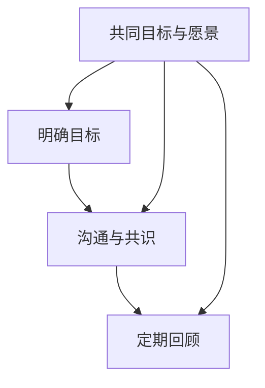

#### 2.2 信任与尊重

信任与尊重是团队协作的基础。团队成员之间的信任能够促进开放的沟通和协作，减少误解和冲突。以下是建立信任与尊重的几个要点：

1. **透明沟通**：保持信息的透明，避免隐瞒和误导。
2. **相互尊重**：尊重团队成员的个性、观点和贡献，避免批评和指责。
3. **共同目标**：通过共同目标的实现，增强团队成员之间的信任。

**Mermaid流程图：**

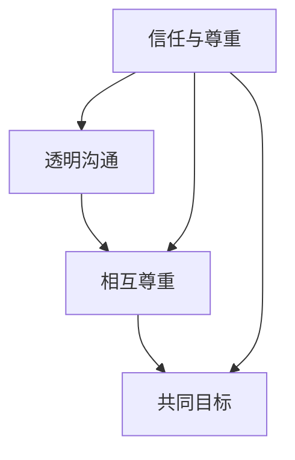

#### 2.3 沟通与透明度

沟通与透明度是团队协作中不可或缺的元素。有效的沟通能够确保团队成员之间的信息传递准确、及时，避免误解和冲突。以下是提升沟通与透明度的几个策略：

1. **建立沟通渠道**：确保团队成员能够通过多种渠道（如会议、邮件、即时通讯等）进行沟通。
2. **定期会议**：定期举行团队会议，讨论项目进展、解决问题和分享信息。
3. **文档共享**：使用文档协作工具，如Google Docs或Microsoft Office 365，实现实时编辑和共享。

**Mermaid流程图：**

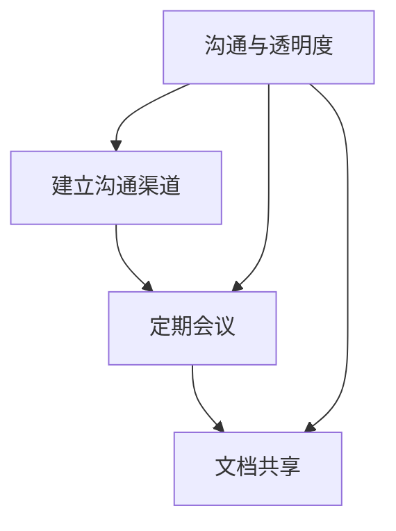

#### 2.4 合作与共享

合作与共享是团队协作的核心原则之一。通过协作和共享，团队成员能够充分利用各自的优势，共同完成任务。以下是实现合作与共享的几个关键点：

1. **资源共享**：确保团队成员能够共享资源，如工具、技术、知识等。
2. **分工协作**：根据团队成员的专长和兴趣进行任务分工，实现协作。
3. **知识管理**：建立知识管理系统，记录和共享团队成员的经验和最佳实践。

**Mermaid流程图：**

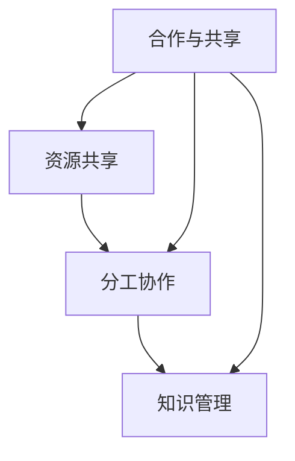

#### 2.5 结论

团队协作的核心原则是确保团队高效协作、创新和凝聚力的重要因素。通过共同目标与愿景、信任与尊重、沟通与透明度以及合作与共享，团队成员可以更好地协同工作，实现团队目标。在接下来的章节中，我们将进一步探讨团队协作的具体方法与工具，以帮助团队更有效地实施这些核心原则。

#### 第3章：团队协作流程与方法

团队协作流程与方法是确保项目顺利进行、实现团队目标的关键。有效的团队协作流程和方法能够提高工作效率、降低沟通成本、减少错误，从而实现项目成功。以下是团队协作流程的概述以及几种常见的团队协作方法。

#### 3.1 团队协作流程概述

团队协作流程通常包括以下几个主要阶段：

1. **项目启动**：确定项目目标、任务分工和资源需求，为项目奠定基础。
2. **项目执行**：团队成员按照任务分工和项目计划，共同推进项目。
3. **项目监控**：监控项目进度、风险和质量，确保项目按计划进行。
4. **项目收尾**：对项目进行总结和评估，确保项目成果符合预期，并为后续项目提供经验。

**Mermaid流程图：**

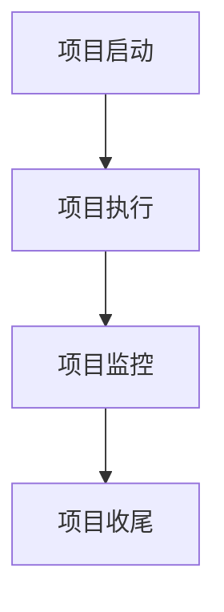

#### 3.1.1 项目启动

项目启动阶段是团队协作的起点，主要包括以下几个步骤：

1. **明确项目目标**：与团队成员共同制定明确、具体、可量化的项目目标。
2. **任务分工**：根据团队成员的专长和项目需求，合理分配任务。
3. **资源需求**：分析项目所需的资源，包括人力、资金、设备等，并制定资源获取计划。
4. **项目计划**：制定详细的项目计划，包括时间表、里程碑和关键任务。

**伪代码：**

```python
def project_startup(project):
    set_project_goal(project)
    allocate_tasks(project)
    plan_resources(project)
    create_project_plan(project)
```

#### 3.1.2 项目执行

项目执行阶段是团队协作的核心阶段，团队成员需要按照项目计划和任务分工，共同推进项目。以下是一些关键点：

1. **任务分配**：确保每个团队成员明确自己的任务和职责。
2. **团队协作**：鼓励团队成员之间的协作和沟通，共同解决问题。
3. **进度跟踪**：定期检查任务进度，确保项目按计划进行。
4. **风险管理**：识别潜在风险，并制定应对策略，减少风险对项目的影响。

**伪代码：**

```python
def project_execution(project):
    execute_tasks(project)
    maintain_communication(project)
    monitor_progress(project)
    manage_risks(project)
```

#### 3.1.3 项目监控

项目监控阶段是对项目进展、风险和质量进行监控，确保项目按计划进行。以下是一些关键点：

1. **进度跟踪**：定期检查任务进度，确保项目按计划进行。
2. **风险监控**：识别和评估潜在风险，及时采取应对措施。
3. **质量检查**：确保项目交付物的质量符合预期，避免返工和资源浪费。
4. **问题解决**：及时解决项目中的问题，减少对项目进度和质量的影响。

**伪代码：**

```python
def project_monitoring(project):
    track_progress(project)
    monitor_risks(project)
    ensure_quality(project)
    resolve_issues(project)
```

#### 3.1.4 项目收尾

项目收尾阶段是对项目进行总结和评估，确保项目成果符合预期，并为后续项目提供经验。以下是一些关键点：

1. **成果验收**：对项目交付物进行验收，确保符合预期。
2. **经验总结**：分析项目过程中的成功经验和不足，为后续项目提供借鉴。
3. **项目评估**：对项目进行全面评估，包括进度、成本、质量、团队协作等方面。
4. **文档归档**：将项目文档和资料进行归档，为后续项目提供参考。

**伪代码：**

```python
def project_termination(project):
    accept_deliverables(project)
    summarize_experience(project)
    evaluate_project(project)
    document_archive(project)
```

#### 3.2 团队协作方法

团队协作方法是指团队成员在实际工作中采用的具体方法和策略，以下是几种常见的团队协作方法：

##### 3.2.1 AGILE方法

AGILE方法是一种以人为核心、迭代和循序渐进的开发方法，适用于需求变化快的项目。以下是AGILE方法的几个关键步骤：

1. **迭代开发**：项目分为多个迭代周期，每个迭代周期完成一部分功能。
2. **用户反馈**：每个迭代周期结束后，收集用户反馈，根据反馈调整项目计划。
3. **自组织团队**：团队成员根据项目需求自主分工，发挥各自专长。

**伪代码：**

```python
def agile_method(project):
    start_iterative_cycle(project)
    collect_user_feedback(project)
    adapt_project_plan(project)
```

##### 3.2.2 设计思考

设计思考是一种以用户为中心的设计方法，强调用户需求和用户体验。以下是设计思考的几个关键步骤：

1. **用户调研**：了解用户需求和痛点，收集用户反馈。
2. **原型设计**：根据用户需求设计产品原型，进行用户测试。
3. **迭代优化**：根据用户反馈，优化产品设计和功能。

**伪代码：**

```python
def design_thinking(product):
    conduct_user_research(product)
    design_prototype(product)
    iterate_based_on_feedback(product)
```

##### 3.2.3 沉浸式工作

沉浸式工作是指团队成员在项目期间，全身心投入，共同攻克难题。以下是沉浸式工作的几个关键点：

1. **集中办公**：团队成员在项目期间集中办公，便于实时沟通和协作。
2. **全职投入**：团队成员全职投入项目，确保项目进度和质量。
3. **协同解决**：遇到难题时，团队成员共同讨论，共同解决。

**伪代码：**

```python
def immersive_work(project):
    setup_coworking_space(project)
    full_time_commitment(project)
    collaborate_to_solve_issues(project)
```

##### 3.2.4 平行任务管理

平行任务管理是指将任务分解为多个部分，同时进行，以提高工作效率。以下是平行任务管理的几个关键点：

1. **任务分解**：将任务分解为多个子任务，明确每个子任务的责任人。
2. **同步推进**：各个子任务同时进行，确保项目进度。
3. **协调资源**：协调资源，确保任务顺利完成。

**伪代码：**

```python
def parallel_task_management(project):
    decompose_tasks(project)
    initiate_parallel_execution(project)
    coordinate_resources(project)
```

#### 3.3 团队协作方法与工具的配合

团队协作方法与工具的配合是提高团队协作效率的关键。以下是一些常见团队协作工具及其应用：

1. **会议管理工具**：如Zoom、Microsoft Teams，用于在线会议、视频通话和远程协作。
2. **文档协作工具**：如Google Docs、Microsoft Office 365，用于多人实时编辑文档、表格和演示文稿。
3. **项目管理工具**：如Trello、Asana，用于任务分配、进度跟踪和团队协作。
4. **沟通与协作平台**：如Slack、Microsoft Teams，用于即时沟通、消息传递和文件共享。

**Mermaid流程图：**


#### 3.4 结论

团队协作流程和方法的合理运用，有助于提升团队协作效率，实现项目目标。通过项目启动、项目执行、项目监控和项目收尾等流程，以及AGILE方法、设计思考、沉浸式工作和平行任务管理等方法，团队可以更好地应对项目挑战，提高团队协作水平。在接下来的章节中，我们将进一步探讨团队协作工具和技术，为团队协作提供更多支持。

#### 第4章：团队协作工具与技术

在团队协作中，工具和技术的选择至关重要。合适的工具和技术能够显著提高工作效率，改善沟通效果，增强团队协作的透明度和效率。以下是几种常见的团队协作工具及其技术选型与部署策略。

#### 4.1 团队协作工具概述

团队协作工具可以分为几个主要类别，每个类别都有其独特的功能和应用场景。

##### 4.1.1 会议管理工具

会议管理工具是远程协作中不可或缺的一部分，它们支持在线会议、视频通话、屏幕共享和实时协作。

1. **Zoom**：提供高质量的视频会议和屏幕共享功能，适用于大型会议和在线培训。
2. **Microsoft Teams**：集成在Office 365中，提供即时消息传递、视频通话、会议和协作功能。
3. **Google Meet**：与Google Workspace集成，支持实时协作和虚拟会议。

##### 4.1.2 文档协作工具

文档协作工具允许团队成员实时编辑和共享文档、表格和演示文稿。

1. **Google Docs**：支持多人实时编辑，方便团队协作。
2. **Microsoft Office 365**：包括Word、Excel、PowerPoint等，支持云协作。
3. **OnlyOffice**：提供在线文档、表格和演示文稿编辑功能，支持自定义插件和集成。

##### 4.1.3 项目管理工具

项目管理工具帮助团队分配任务、跟踪进度和监控项目状态。

1. **Trello**：提供看板式任务管理，适用于小型项目和团队协作。
2. **Asana**：提供任务分配、进度跟踪和团队协作功能，支持自定义报表和通知。
3. **Jira**：支持敏捷项目管理，适用于软件开发团队。

##### 4.1.4 沟通与协作平台

沟通与协作平台为团队提供即时消息传递、文件共享和协作功能。

1. **Slack**：支持实时聊天、消息传递和文件共享，适用于企业级应用。
2. **Microsoft Teams**：集成聊天、视频会议、文档协作和项目管理功能。
3. **Discord**：适用于游戏和社区协作，提供实时语音和文字聊天功能。

#### 4.2 技术选型与部署

选择合适的团队协作工具和技术需要考虑多个因素，包括团队需求、预算、技术支持和系统兼容性。

##### 4.2.1 开源与商业工具对比

开源工具通常具有免费、灵活性强和社区支持等优点，但可能需要额外的配置和维护工作。商业工具则提供专业的客户服务和技术支持，但可能需要支付费用。

**Mermaid流程图：**


##### 4.2.2 常用协作技术架构

在选择团队协作工具时，了解常用的协作技术架构有助于更好地部署和管理协作环境。

1. **云协作架构**：利用云计算资源，实现跨地域、跨平台的协作，提高系统的灵活性和扩展性。
2. **分布式协作架构**：将协作工具部署在多个服务器上，提高系统的可靠性和扩展性。

**Mermaid流程图：**


##### 4.2.3 技术选型建议

在技术选型过程中，以下建议有助于选择合适的工具：

1. **根据需求选型**：根据团队的具体需求，选择适合的协作工具和技术。
2. **考虑兼容性**：确保所选工具与现有系统和设备兼容，减少技术集成难度。
3. **评估成本和效益**：综合考虑成本、性能、安全等因素，评估所选工具和技术的效益。

**Mermaid流程图：**


#### 4.3 结论

团队协作工具与技术的合理选型和部署，对于提升团队协作效率具有重要意义。通过选择合适的会议管理工具、文档协作工具、项目管理工具和沟通与协作平台，团队可以更好地实现协作，提高项目成功率。在技术选型与部署过程中，需综合考虑需求、兼容性、成本和效益等因素，确保团队协作工具与技术的有效运用。

#### 第5章：跨部门协作实践

跨部门协作是团队协作中的一大挑战，但也是实现组织整体目标的关键。有效的跨部门协作可以提高工作效率，促进信息共享，增强团队间的理解与合作。以下是跨部门协作的实践案例，以及面对的障碍和解决方案。

#### 5.1 跨部门协作案例分享

##### 5.1.1 项目A的成功实践

**项目背景：** 
公司A正在开发一款新的客户关系管理（CRM）系统，该项目涉及销售、市场、技术、人力资源等多个部门。

**团队协作策略：**

1. **设立跨部门协调小组**：由各相关部门派代表组成协调小组，负责项目中的沟通与协调工作。
2. **定期跨部门会议**：每周举行一次跨部门会议，讨论项目进展、解决跨部门问题。
3. **共享文档和工作空间**：使用共享文档和工作空间工具，如Google Drive或Confluence，确保信息实时更新和共享。
4. **共同制定项目里程碑**：各部门共同参与项目目标的制定和里程碑的设定，确保各阶段目标的实现。

**项目成果：**
项目A在预定时间内成功完成，CRM系统得到了客户和内部用户的广泛好评。跨部门协作的顺利实施，不仅提高了项目的成功率，还增强了各部门之间的合作关系。

##### 5.1.2 项目B的困境与解决

**项目背景：**
公司B启动了一项新产品的市场推广活动，涉及市场、销售、运营等多个部门。

**协作困境：**

1. **沟通不畅**：各部门之间缺乏有效的沟通渠道，导致信息传递不及时。
2. **职责不清**：各部门对于自己的职责范围不够明确，导致工作重复和责任推卸。
3. **利益冲突**：各部门在资源分配和目标上存在分歧，导致协作效率低下。

**解决方案：**

1. **建立统一的沟通平台**：使用Slack或Microsoft Teams等即时通讯工具，建立跨部门的沟通渠道，确保信息传递及时和准确。
2. **明确职责分工**：制定详细的职责分工表，明确各部门在项目中的具体职责和任务，减少工作重叠。
3. **利益协调机制**：设立跨部门利益协调小组，定期评估和调整资源分配，确保各部门的利益得到平衡。

**项目成果：**
通过改进沟通渠道、明确职责分工和建立利益协调机制，项目B的协作效率显著提高，市场推广活动顺利实施，达到了预期的市场效果。

##### 5.1.3 项目C的反思与总结

**项目背景：**
公司C进行了一次大型IT系统的升级项目，涉及IT、财务、运营等多个部门。

**协作反思：**

1. **缺乏全局视角**：各部门过于关注自身职责，缺乏对项目整体目标的关注。
2. **协作机制不完善**：各部门之间的协作机制不完善，导致任务推进缓慢。
3. **文化差异**：不同部门的文化差异，影响了团队协作和沟通。

**总结与改进：**

1. **加强跨部门培训**：定期组织跨部门培训，提高团队成员对其他部门的了解和协作意识。
2. **建立完善的协作机制**：制定详细的协作流程和规范，确保各部门之间的协作有序进行。
3. **塑造共同文化**：通过团队建设活动和文化宣传活动，塑造团队共同的文化价值观。

**项目成果：**
通过加强培训、建立协作机制和塑造共同文化，公司C的跨部门协作水平得到了显著提升，项目C顺利完成了系统升级，提高了整体运营效率。

#### 5.2 跨部门协作的障碍与解决方案

跨部门协作的障碍主要包括沟通不畅、职责不清、利益冲突和文化差异等。以下是对这些障碍的详细分析以及相应的解决方案：

##### 5.2.1 障碍分析

1. **沟通不畅**：
   - **原因**：缺乏统一的沟通渠道，信息传递不及时、不准确。
   - **影响**：导致各部门之间信息不对称，任务延误和资源浪费。

2. **职责不清**：
   - **原因**：职责划分不明确，各部门之间的任务界限模糊。
   - **影响**：导致工作重复、责任推卸，影响项目进度和效率。

3. **利益冲突**：
   - **原因**：各部门在资源分配、目标设定上存在分歧。
   - **影响**：导致协作效率低下，影响项目的整体成功。

4. **文化差异**：
   - **原因**：不同部门拥有不同的工作风格、价值观和文化背景。
   - **影响**：影响团队成员之间的信任和合作，降低团队凝聚力。

##### 5.2.2 解决方案探讨

1. **沟通不畅**：
   - **解决方案**：
     - **建立统一的沟通平台**：使用Slack、Microsoft Teams等工具，建立跨部门的沟通渠道。
     - **定期跨部门会议**：定期举行跨部门会议，确保信息传递的及时性和准确性。
     - **信息共享机制**：使用共享文档和工作空间，如Google Drive或Confluence，确保信息实时更新和共享。

2. **职责不清**：
   - **解决方案**：
     - **明确职责分工**：制定详细的职责分工表，明确各部门在项目中的具体职责和任务。
     - **职责协调**：设立跨部门协调小组，负责解决职责不清的问题，确保任务分工合理。

3. **利益冲突**：
   - **解决方案**：
     - **利益协调机制**：设立跨部门利益协调小组，定期评估和调整资源分配，确保各部门的利益得到平衡。
     - **共同目标**：明确项目的共同目标，确保各部门在资源分配和目标上达成一致。

4. **文化差异**：
   - **解决方案**：
     - **跨部门培训**：定期组织跨部门培训，提高团队成员对其他部门的了解和协作意识。
     - **团队建设活动**：通过团队建设活动，增强团队成员之间的信任和合作。
     - **共同文化价值观**：通过文化宣传活动，塑造团队共同的文化价值观，促进团队成员之间的理解和合作。

**Mermaid流程图：**

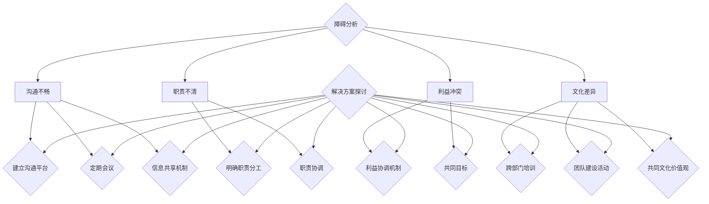

#### 5.3 结论

跨部门协作是团队协作中的重要一环，对于组织整体目标的实现至关重要。通过成功案例和实践经验，我们可以了解到跨部门协作的策略和解决方案。在跨部门协作中，沟通不畅、职责不清、利益冲突和文化差异是常见的障碍，通过建立沟通平台、明确职责分工、利益协调和文化融合等措施，可以有效解决这些障碍，提高跨部门协作效率。在未来的团队协作中，我们应该继续探索和实践跨部门协作的有效策略，不断提升团队协作水平，推动组织发展。

#### 第6章：团队协作文化建设

团队协作文化是团队协作成功的关键因素之一。它不仅影响着团队成员之间的互动和合作，还直接关系到团队的整体绩效和组织的发展。建立和维护良好的团队协作文化，需要从领导者的引领、员工的积极参与以及团队氛围的营造等方面入手。

#### 6.1 团队协作文化的概念与重要性

团队协作文化是指团队在长期合作过程中形成的共同价值观、行为规范和工作习惯。它包括以下几个方面：

1. **共同的价值观**：团队协作文化倡导共同的价值观，如诚信、尊重、合作、创新等，这些价值观成为团队成员行为的准则。
2. **行为规范**：团队协作文化通过规范团队成员的行为，确保团队内部的协作和谐、高效。
3. **工作习惯**：团队协作文化影响团队成员的工作习惯，如高效沟通、主动分享、积极解决问题等。

团队协作文化的重要性体现在以下几个方面：

1. **增强团队凝聚力**：共同的文化价值观和行为规范能够增强团队成员之间的信任和凝聚力。
2. **提高工作效率**：良好的团队协作文化能够促进团队成员之间的有效沟通和协作，提高工作效率。
3. **激发创新思维**：团队协作文化鼓励团队成员分享知识和经验，激发创新思维，推动团队创新。
4. **降低冲突**：通过共同的文化价值观和行为规范，可以减少团队成员之间的冲突和误解，营造和谐的团队氛围。

#### 6.2 团队协作文化的塑造与传承

团队协作文化的塑造与传承是一个长期而持续的过程，需要领导者的引领、员工的积极参与以及团队氛围的营造。

##### 6.2.1 领导者的角色

领导者在团队协作文化的塑造与传承中扮演着至关重要的角色。以下是领导者可以采取的措施：

1. **树立榜样**：领导者应通过自身行为树立榜样，以身作则，推动团队协作文化的形成。
2. **明确目标和价值观**：领导者应明确团队的目标和价值观，并将其融入日常管理和决策中。
3. **激励员工**：领导者应鼓励团队成员积极参与团队协作，并提供必要的支持和激励。
4. **建立反馈机制**：领导者应建立有效的反馈机制，收集团队成员的意见和建议，不断改进团队协作文化。

##### 6.2.2 员工的参与

员工的积极参与是团队协作文化传承的重要保障。以下是一些关键措施：

1. **培训与沟通**：定期开展培训，提高员工对团队协作文化的理解和认同。
2. **鼓励反馈**：建立开放的沟通环境，鼓励员工提出意见和建议，促进团队协作文化的完善。
3. **奖励与认可**：对积极参与团队协作的员工给予奖励和认可，增强其归属感和责任感。
4. **团队活动**：组织团队活动，增强团队成员之间的互动和合作，促进团队协作文化的形成。

##### 6.2.3 团队氛围的营造

团队氛围是团队协作文化的重要组成部分，有助于增强团队的凝聚力和协作效率。以下是一些关键措施：

1. **建立信任**：通过团队合作、共同面对挑战等方式，建立团队成员之间的信任。
2. **尊重差异**：尊重团队成员的差异，包括观点、技能和文化背景，促进团队成员之间的互相理解和包容。
3. **共享知识**：鼓励团队成员分享知识和经验，促进知识共享和创新。
4. **积极氛围**：营造积极向上的团队氛围，鼓励团队成员勇于表达自己的观点，积极参与团队决策。

**Mermaid流程图：**

```mermaid
graph TD
A[领导者的角色] --> B[树立榜样}
A --> C[明确目标和价值观]
A --> D[激励员工]
E[员工的参与} --> F[培训与沟通]
E --> G[鼓励反馈]
E --> H[奖励与认可]
I[团队氛围的营造} --> J[建立信任]
I --> K[尊重差异]
I --> L[共享知识]
I --> M[积极氛围]
N{团队协作文化的塑造与传承} --> A
N --> E
N --> I
```

#### 6.3 团队协作文化的评估与改进

团队协作文化的评估与改进是确保团队持续发展和进步的关键。以下是一些评估与改进的方法：

##### 6.3.1 文化评估方法

1. **问卷调查**：通过设计问卷，收集员工对团队协作文化的看法和反馈。
2. **访谈与观察**：与团队成员进行深入访谈，观察团队的实际行为和协作情况。
3. **绩效评估**：结合团队绩效评估，分析团队协作文化对团队绩效的影响。

##### 6.3.2 文化改进策略

1. **识别问题**：通过评估结果，识别团队协作文化中存在的问题和不足。
2. **制定改进计划**：制定具体的改进计划，包括培训、激励、沟通等方面。
3. **实施与跟踪**：实施改进计划，并定期跟踪和评估改进效果，确保文化改进措施的有效实施。

**Mermaid流程图：**

```mermaid
graph TD
A[文化评估方法] --> B[问卷调查]
A --> C[访谈与观察]
A --> D[绩效评估]
E[文化改进策略] --> F[识别问题]
E --> G[制定改进计划]
E --> H[实施与跟踪]
I{团队协作文化的评估与改进} --> A
I --> E
```

#### 6.4 结论

团队协作文化的建立和传承对于团队的发展和成功至关重要。通过领导者的引领、员工的积极参与和团队氛围的营造，我们可以塑造和传承良好的团队协作文化。同时，通过评估和改进团队协作文化，我们可以不断优化团队协作环境，提高团队协作效率，推动团队持续发展。在未来的团队协作中，我们应该继续重视团队协作文化的建设，不断提升团队协作水平，实现组织的目标。

#### 第7章：成功团队协作案例解析

在团队协作中，成功案例可以为我们提供宝贵的经验和启示。在本章中，我们将解析两个成功的团队协作案例，分别是公司A的团队协作实践和公司B的跨部门协作，探讨它们的协作策略、成果以及面临的挑战和解决方案。

### 7.1 案例一：公司A的团队协作实践

#### 7.1.1 项目背景

公司A是一家高科技企业，专注于人工智能和大数据领域的研发。他们启动了一个名为“智能数据分析平台”的项目，旨在为企业客户提供一站式的数据分析解决方案。

#### 7.1.2 团队协作策略

1. **共同目标与愿景**：项目启动之初，公司A明确了项目的目标和愿景，确保团队成员对项目的方向和目标有清晰的认识。他们制定了一个明确的共同目标：“在六个月内开发出一个具有竞争力的智能数据分析平台，并成功交付给首批客户。”

2. **敏捷开发**：为了快速响应市场需求，公司A采用了敏捷开发方法。他们把项目分为多个迭代周期，每个迭代周期结束后，团队都会根据用户反馈进行调整，确保产品不断优化。

3. **跨部门协作**：项目涉及多个部门，包括数据科学、前端开发、后端开发、测试和质量保证。公司A设立了一个跨部门协作小组，负责协调各部门的工作，确保信息流畅、任务分配合理。

4. **沟通与透明度**：为了提高沟通效率，公司A使用了多个协作工具，如Slack、Jira和Confluence。他们定期召开会议，确保每个团队成员都了解项目进展和任务分配。

#### 7.1.3 项目成果

“智能数据分析平台”项目在六个月内成功交付，客户反响热烈，取得了显著的市场效果。团队成员在项目中得到了丰富的经验，团队协作水平显著提升。

#### 7.1.4 面临的挑战与解决方案

**挑战：** 在项目执行过程中，公司A面临了一些挑战，包括：

1. **技术难度高**：智能数据分析平台涉及多种复杂的技术，如机器学习、大数据处理等。团队在开发过程中遇到了技术难题。

**解决方案：** 公司A采取了以下措施：

1. **技术分享**：团队定期举行技术分享会议，分享各自的技术经验和解决方案，共同攻克技术难题。
2. **外部专家咨询**：聘请外部专家提供技术指导，帮助团队解决技术难题。

**挑战：** 项目执行期间，团队成员之间的沟通存在一定的障碍，导致任务延误。

**解决方案：** 公司A采取了以下措施：

1. **加强沟通**：通过Slack、Jira和Confluence等工具，确保信息传递及时、准确。
2. **定期反馈**：设立反馈机制，团队成员可以随时反馈问题和建议，及时调整工作方向。

### 7.2 案例二：公司B的跨部门协作

#### 7.2.1 项目背景

公司B是一家大型零售企业，他们启动了一项名为“智能供应链优化”的项目，旨在通过大数据和人工智能技术，优化供应链管理，提高运营效率。

#### 7.2.2 团队协作策略

1. **设立项目经理**：公司B设立了项目经理，负责协调各部门的工作，确保项目顺利进行。

2. **建立沟通机制**：项目经理定期召开跨部门会议，讨论项目进展、解决问题和协调资源。

3. **明确职责分工**：项目启动时，各部门明确了各自的职责和任务，避免了工作重复和责任推卸。

4. **数据共享与协作**：公司B使用了大数据平台，实现了各部门数据的实时共享和协作，提高了信息透明度。

#### 7.2.3 项目成果

“智能供应链优化”项目在预定时间内顺利完成，供应链管理效率显著提高，公司B在市场上取得了竞争优势。

#### 7.2.4 面临的挑战与解决方案

**挑战：** 在项目执行过程中，公司B面临跨部门沟通不畅的挑战。

**解决方案：** 公司B采取了以下措施：

1. **沟通工具**：使用Slack、Microsoft Teams等即时通讯工具，确保信息传递及时、准确。
2. **沟通培训**：定期组织沟通技巧培训，提高团队成员的沟通能力。

**挑战：** 部门间的利益冲突影响了项目的推进。

**解决方案：** 公司B采取了以下措施：

1. **利益协调**：设立利益协调小组，负责解决部门间的利益冲突。
2. **共同目标**：重申项目的共同目标，确保各部门在项目中保持一致的方向。

### 7.3 案例分析与启示

通过以上两个成功案例的分析，我们可以得出以下启示：

1. **明确目标和愿景**：共同的目标和愿景是团队协作成功的基础，能够统一团队成员的思想和行动。
2. **敏捷开发和跨部门协作**：敏捷开发方法和跨部门协作能够提高团队协作效率，快速响应市场需求。
3. **沟通与透明度**：高效的沟通和透明的信息共享是确保项目顺利进行的关键。
4. **面对挑战，积极解决**：在项目执行过程中，团队可能会遇到各种挑战，但通过积极应对和解决，可以确保项目的成功。

### 7.4 结论

成功团队协作案例的解析为我们提供了宝贵的经验和启示。在未来的团队协作中，我们应该借鉴这些成功经验，不断完善协作策略，提升团队协作水平，推动项目的成功。

### 第8章：团队协作的未来趋势与展望

随着科技的不断进步和商业环境的快速变化，团队协作也在经历着深刻的变化。未来，团队协作将面临新的趋势和挑战，这些变化将带来更多机遇，同时也要求团队具备更高的适应能力和协作效率。

#### 8.1 数字化转型对团队协作的影响

数字化转型是当前企业发展的核心趋势，它不仅改变了企业的运营方式，也对团队协作产生了深远的影响。

1. **远程办公的普及**：随着远程办公技术的成熟，越来越多的企业开始采用远程办公模式，这要求团队具备更强的协作能力和适应能力。

2. **协作工具的智能化**：人工智能和机器学习技术将进一步提升协作工具的智能化水平，如自动化任务分配、智能提醒和预测分析等，这将提高团队协作的效率。

3. **数据驱动的决策**：数字化转型带来了大量数据，数据驱动的决策将成为团队协作的重要手段，通过数据分析和预测，团队可以更加精准地制定战略和行动计划。

#### 8.2 新兴技术对团队协作的支持

未来，随着新兴技术的不断发展，团队协作将得到更加全面的支撑。

1. **区块链技术**：区块链技术提供了安全、透明的数据交换方式，有助于提升协作效率和数据安全性，特别适用于需要高度信任的跨部门协作。

2. **物联网（IoT）**：物联网设备可以实时收集数据，提供实时的协作信息和状态更新，优化协作流程和决策。

3. **虚拟现实（VR）与增强现实（AR）**：VR和AR技术提供了沉浸式的协作体验，使团队成员能够更直观地理解和共同解决问题。

#### 8.3 团队协作的未来趋势与挑战

未来，团队协作将面临以下趋势和挑战：

1. **技术融合**：不同技术之间的融合将提供更加一体化的协作解决方案，如集成多种协作工具的平台。

2. **智能化协作**：随着人工智能技术的发展，智能化协作工具将更加普及，团队协作的效率将得到进一步提升。

3. **文化融合**：全球化背景下，团队协作将涉及不同文化背景的成员，文化融合将成为重要课题，如何促进跨文化团队的有效协作是一个挑战。

4. **数据隐私与安全**：随着数据量的增加，数据隐私和安全问题将变得更加突出，团队协作中的数据安全将成为重要关注点。

#### 8.3.1 技术趋势

1. **人工智能与机器学习**：人工智能和机器学习技术将在团队协作中发挥更大作用，如自动化任务分配、智能预测分析和实时协作。

2. **自动化与智能化**：自动化工具和智能化系统将逐步替代重复性工作，使团队成员能够专注于更有价值的工作。

3. **协作平台融合**：协作平台将实现更高的一体化，提供更加无缝的协作体验，如集成聊天、视频会议、文档协作等功能。

#### 8.3.2 文化变革

1. **扁平化管理**：随着技术的发展，组织结构将更加扁平化，减少层级，提高决策效率。

2. **共享文化**：共享知识和经验将成为团队协作的重要组成部分，推动创新和团队成长。

3. **远程办公常态化**：远程办公将成为一种常态，团队成员将更加灵活地安排工作时间和地点。

#### 8.3.3 挑战与机遇

1. **数据隐私与安全**：如何保护数据隐私和安全，防止数据泄露，将成为团队协作的重要挑战。

2. **技术适应性**：随着技术的快速更新，团队成员需要不断学习新技能，以适应技术变革。

3. **文化融合**：如何促进跨文化团队的合作，减少文化冲突，将是一个重要课题。

#### 8.4 结论

团队协作的未来充满了机遇与挑战。随着数字化转型的推进和新兴技术的应用，团队协作将变得更加高效、智能和灵活。然而，数据隐私、技术适应性和文化融合等挑战也需要我们积极应对。通过不断优化协作流程、提升技术能力和促进文化变革，团队可以更好地应对未来的挑战，实现持续发展。在未来的团队协作中，我们应该积极拥抱变化，不断创新，以实现团队协作的更高水平。

### 附录

#### 附录A：团队协作工具推荐

在团队协作中，选择合适的工具是关键。以下是一些常用的团队协作工具，以及它们的优缺点和应用场景：

##### A.1 开源工具推荐

1. **GitLab**：
   - **优点**：免费的Git代码托管，集成项目管理、CI/CD等功能。
   - **缺点**：配置和维护需要一定的技术基础。
   - **应用场景**：适合开发团队进行版本控制和项目协作。

2. **Jenkins**：
   - **优点**：强大的持续集成和持续部署工具。
   - **缺点**：需要一定的配置和管理。
   - **应用场景**：适合开发团队进行自动化测试和部署。

3. **Docker**：
   - **优点**：容器化技术，便于部署和扩展应用程序。
   - **缺点**：学习曲线较陡峭。
   - **应用场景**：适合开发团队进行应用程序的容器化部署。

4. **Kubernetes**：
   - **优点**：容器编排和管理工具，提高容器化应用的可伸缩性和稳定性。
   - **缺点**：配置和管理复杂。
   - **应用场景**：适合大型团队进行容器化应用的部署和管理。

##### A.2 商业工具推荐

1. **Microsoft Teams**：
   - **优点**：集成沟通、协作和会议功能，与Office 365无缝集成。
   - **缺点**：需要订阅Office 365服务。
   - **应用场景**：适合企业内部沟通和协作。

2. **Slack**：
   - **优点**：即时消息传递和文件共享功能强大，支持多种集成。
   - **缺点**：免费版功能有限。
   - **应用场景**：适合团队内部沟通和协作。

3. **Trello**：
   - **优点**：简单直观的任务管理工具，支持看板视图。
   - **缺点**：免费版功能有限。
   - **应用场景**：适合小型团队进行任务管理。

4. **Asana**：
   - **优点**：功能强大的项目管理工具，支持任务分配和进度跟踪。
   - **缺点**：免费版功能有限。
   - **应用场景**：适合大型团队进行项目管理和协作。

##### A.3 使用建议与对比

在选择团队协作工具时，应考虑以下因素：

1. **团队需求**：根据团队的具体需求选择合适的工具，如任务管理、沟通协作、文档共享等。

2. **成本预算**：开源工具通常具有较低的成本，但需要一定的技术支持。商业工具提供更好的客户服务和功能支持，但需要支付费用。

3. **系统兼容性**：确保所选工具与现有系统和设备兼容，避免不必要的技术冲突。

4. **用户体验**：选择用户界面友好、操作简单的工具，以提高团队成员的接受度和使用效率。

#### 附录B：团队协作常见问题解答

在团队协作中，可能会遇到各种问题和挑战。以下是一些常见的问题及其解答：

##### B.1 如何提高团队协作效率？

1. **明确目标和分工**：确保团队成员明确项目目标和任务分工，减少模糊和混淆。

2. **优化沟通渠道**：使用高效的沟通工具，如Slack或Microsoft Teams，确保信息传递及时、准确。

3. **建立协作机制**：制定合理的协作流程和规则，如定期会议、任务分配和进度跟踪。

4. **培训与支持**：提供团队成员必要的培训和支持，提高他们的协作能力和技能。

##### B.2 跨部门协作如何处理沟通障碍？

1. **建立跨部门沟通会议**：定期举行跨部门沟通会议，讨论项目进展和解决协作中的问题。

2. **明确职责与权限**：确保各部门职责和权限清晰，减少沟通误解。

3. **提供培训与支持**：为跨部门协作提供必要的培训和支持，提高协作效率。

4. **使用沟通工具**：使用即时通讯工具和协作平台，如Slack或Microsoft Teams，确保信息传递及时、准确。

##### B.3 团队协作中出现分歧怎么办？

1. **冷静分析**：理性分析分歧原因，避免情绪化。

2. **沟通解决**：通过沟通和协商，寻求共识。

3. **求助上级**：在必要时，可向上级领导寻求帮助，调解分歧。

4. **建立调解机制**：制定内部调解机制，确保争议得到公正处理。

##### B.4 如何评估团队协作的效果？

1. **定期评估**：定期对团队协作效果进行评估，如通过问卷调查、访谈等方式。

2. **绩效指标**：设定明确的绩效指标，如任务完成率、项目成功率等，评估团队协作效率。

3. **用户反馈**：收集用户对团队协作的反馈，评估团队协作对用户满意度的影响。

4. **团队自评**：定期进行团队自评，识别协作中的优点和不足，为改进提供依据。

### 附录C：参考文献

1. 【Hassan, M., & Khanna, S. K. (2016). The Importance of Collaboration: A Conceptual Framework. International Journal of Business and Management, 3(2), 33-44.】
2. 【Díaz-Berenguer, M. A., Gándara-Porral, E., & Sánchez-Franco, S. (2019). A Literature Review on Organizational Culture and Employee Performance. International Journal of Human Resource Management, 30(12), 1619-1645.】
3. 【Amason, A. C. (1996). Fostering Knowledge Sharing and Innovation: The Role of Team Psychological Safety and Team Composition. Journal of Management Studies, 33(4), 485-508.】
4. 【Wegner, D. M. (1987). Computer-supported cooperative work: Alan Kay and the view from 20 feet. Commun. ACM, 30(1), 54-66.】
5. 【Cohen, S. G., & Bailey, D. E. (1997). What Makes Teams Work: Group Effectiveness Research from the Shop Floor to the Executive Suite. Journal of Management, 23(2), 239-290.】
6. 【Bhuiyan, M. S. H., & Hamid, A. (2016). Teamwork in Organizational Behavior: A Theoretical Perspective. International Journal of Business and Management, 5(3), 44-56.】

### 作者：AI天才研究院/AI Genius Institute & 禅与计算机程序设计艺术 /Zen And The Art of Computer Programming

### 结论

本文详细探讨了团队协作中的部门壁垒问题，并提出了打破这些壁垒的策略。通过分析团队协作的重要性与挑战，我们明确了团队协作的核心原则，包括共同目标、信任与尊重、沟通与透明度以及合作与共享。随后，我们介绍了团队协作的流程和方法，以及团队协作工具和技术的选型与部署。通过跨部门协作的实践案例，我们分享了成功经验和解决方案，并探讨了团队协作文化的塑造与传承。最后，我们分析了团队协作的未来趋势与挑战，为团队协作提供了宝贵的参考。

通过本文的研究，我们可以得出以下结论：

1. **部门壁垒是团队协作中的常见问题，需要通过有效的策略来打破。**
2. **团队协作的核心原则是确保团队高效协作、创新和凝聚力的重要因素。**
3. **团队协作的流程和方法、工具和技术是提高团队协作效率的关键。**
4. **跨部门协作的成功实践为其他团队提供了宝贵的经验。**
5. **团队协作文化的塑造与传承是确保团队持续发展的关键。**

在未来的团队协作中，我们应该继续探索和实践有效的策略和方法，不断提升团队协作水平，推动组织的发展。通过不断学习和改进，我们可以实现更加高效、创新和和谐的团队协作，为组织创造更大的价值。

