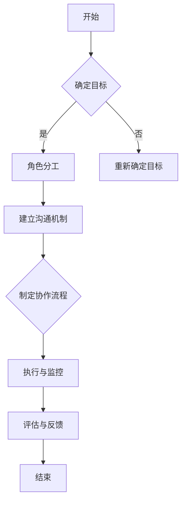

                 

### 文章标题：团队协作：打造默契配合的工作氛围

#### 关键词：团队协作、工作氛围、沟通技巧、项目管理、冲突解决

> 摘要：本文旨在探讨团队协作的重要性，解析团队协作的理论基础和实践方法，提供一系列实用的工具和策略，帮助读者理解并提升团队协作的效率。文章将从沟通技巧、工具应用、项目管理、冲突解决、个人发展等多个维度，结合实际案例，详细阐述如何打造一个默契配合的工作氛围，从而实现团队目标的最大化。

### 目录大纲

- **第一部分：团队协作的理论基础**
  - 第1章：团队协作的重要性
    - 1.1.1 团队协作的概述
    - 1.1.2 团队协作的价值
    - 1.1.3 团队协作的挑战
  - 第2章：团队协作的原理与模式
    - 2.1.1 团队协作的基本原理
    - 2.1.2 团队协作的模式与类型
    - 2.1.3 团队协作流程图（Mermaid）
  - 第3章：团队沟通技巧
    - 3.1.1 有效沟通的重要性
    - 3.1.2 沟通障碍与解决方法
    - 3.1.3 沟通技巧实战演练

- **第二部分：团队协作工具与实践**
  - 第4章：团队协作工具的选择与应用
    - 4.1.1 常见的团队协作工具
    - 4.1.2 工具选择与评估
    - 4.1.3 工具应用案例
  - 第5章：团队协作项目的管理与实施
    - 5.1.1 项目管理基础知识
    - 5.1.2 团队协作项目的实施方法
    - 5.1.3 项目管理工具与实践
  - 第6章：团队协作中的冲突解决
    - 6.1.1 冲突管理的重要性
    - 6.1.2 冲突类型与解决策略
    - 6.1.3 冲突解决案例分析
  - 第7章：团队协作中的个人发展
    - 7.1.1 个人角色与责任
    - 7.1.2 个人技能提升
    - 7.1.3 个人成长与团队发展的关系

- **第三部分：团队协作的案例分析**
  - 第8章：团队协作成功案例
    - 8.1.1 案例介绍
    - 8.1.2 团队协作策略与成果
    - 8.1.3 案例启示
  - 第9章：团队协作中的常见问题与解决
    - 9.1.1 团队协作中的常见问题
    - 9.1.2 问题分析与解决方法
    - 9.1.3 预防与持续改进策略

- **附录**
  - 附录 A：团队协作工具资源汇总
    - A.1.1 工具清单
    - A.1.2 使用指南
    - A.1.3 资源链接

### 第一部分：团队协作的理论基础

#### 第1章：团队协作的重要性

**1.1.1 团队协作的概述**

团队协作是指团队成员为了共同的目标，通过相互沟通、协调和配合，共同完成任务的过程。在现代企业中，团队协作已经成为提高工作效率、促进创新、实现企业目标的重要手段。

**1.1.2 团队协作的价值**

- **提高工作效率**：团队协作可以充分利用团队成员的不同技能和专长，提高工作效率，缩短项目周期。
- **促进创新**：团队协作鼓励团队成员分享自己的想法和经验，激发创新思维，推动企业技术创新。
- **增强团队凝聚力**：通过共同的目标和工作，团队成员之间的信任和凝聚力得到增强，有利于形成积极向上的团队氛围。
- **提高决策质量**：团队协作使决策更加全面和科学，减少错误和失误，提高决策质量。

**1.1.3 团队协作的挑战**

- **沟通障碍**：团队成员之间的沟通不畅，可能导致信息失真，影响团队协作效果。
- **角色模糊**：团队成员的角色和职责不明确，可能导致工作重叠或责任缺失。
- **利益冲突**：团队成员的个人利益和团队目标之间可能存在冲突，影响团队协作。
- **组织结构**：不合理的组织结构可能阻碍团队协作，降低团队效率。

#### 第2章：团队协作的原理与模式

**2.1.1 团队协作的基本原理**

- **共同目标**：团队协作的基础是共同的目标，团队成员需要明确团队的目标和愿景。
- **角色分工**：根据团队成员的技能和专长，进行合理的角色分工，确保每个成员都能发挥自己的优势。
- **沟通机制**：建立有效的沟通机制，确保团队成员之间的信息流通，提高沟通效率。
- **协作流程**：制定清晰的协作流程，规范团队成员的工作流程，提高协作效率。

**2.1.2 团队协作的模式与类型**

- **功能型团队**：以完成特定任务为目标，成员来自不同的部门，具有明确的职责和分工。
- **跨职能团队**：由来自不同部门或专业的成员组成，负责解决跨部门的问题或实现跨部门的协同工作。
- **项目型团队**：以完成特定项目为目标，成员通常来自不同部门，需要协调合作以完成项目。

**2.1.3 团队协作流程图（Mermaid）**



#### 第3章：团队沟通技巧

**3.1.1 有效沟通的重要性**

有效沟通是团队协作的核心，直接影响到团队协作的效果。有效的沟通能够确保团队成员之间的信息畅通，减少误解和冲突，提高团队的工作效率和满意度。

**3.1.2 沟通障碍与解决方法**

- **语言障碍**：使用简洁、清晰的沟通语言，避免使用专业术语或行业术语。
- **心理障碍**：建立信任和尊重的氛围，鼓励团队成员表达自己的意见和想法。
- **文化障碍**：了解和尊重不同文化背景的团队成员，避免文化冲突。

**3.1.3 沟通技巧实战演练**

- **主动倾听**：在沟通中，认真倾听对方的意见和想法，避免打断或打断对方。
- **明确表达**：在表达自己的意见时，要清晰、简洁，避免使用模糊或歧义的语言。
- **积极反馈**：在沟通结束后，给予积极的反馈，确认对方是否理解了你的意思。

### 第二部分：团队协作工具与实践

#### 第4章：团队协作工具的选择与应用

**4.1.1 常见的团队协作工具**

- **Slack**：即时通讯工具，支持消息、文件共享、语音和视频通话等功能。
- **Trello**：项目管理工具，支持任务分配、进度跟踪和协作管理。
- **Jira**：敏捷开发工具，支持项目管理、任务跟踪和协作开发。
- **Google Workspace**：包括 Gmail、Google Docs、Google Sheets 等，支持团队协作和文档共享。

**4.1.2 工具选择与评估**

- **需求分析**：根据团队的需求，选择适合的协作工具。
- **功能评估**：评估工具的功能是否满足团队的需求。
- **用户体验**：考虑工具的用户体验，是否易于使用和维护。

**4.1.3 工具应用案例**

- **项目协作**：使用 Trello 或 Jira 进行任务分配和进度跟踪。
- **文档协作**：使用 Google Workspace 进行文档共享和编辑。
- **即时通讯**：使用 Slack 进行实时沟通和协作。

#### 第5章：团队协作项目的管理与实施

**5.1.1 项目管理基础知识**

- **项目目标**：明确项目的目标和预期成果。
- **项目计划**：制定项目的时间表、任务分配和资源安排。
- **项目监控**：监控项目的进度和质量，确保项目按计划进行。

**5.1.2 团队协作项目的实施方法**

- **任务分配**：根据团队成员的技能和专长，分配合适的任务。
- **进度跟踪**：使用协作工具进行任务进度跟踪，确保项目按时完成。
- **团队沟通**：定期召开会议，确保团队成员之间的信息畅通。

**5.1.3 项目管理工具与实践**

- **Trello**：用于任务分配和进度跟踪。
- **Jira**：用于敏捷开发，支持任务管理、迭代规划和反馈收集。
- **Google Workspace**：用于文档协作和沟通。

#### 第6章：团队协作中的冲突解决

**6.1.1 冲突管理的重要性**

冲突是团队协作中不可避免的现象，有效的冲突管理可以促进团队的发展和进步。冲突管理的重要性体现在：

- **提高团队工作效率**：解决冲突，确保团队成员能够专注于工作。
- **增强团队凝聚力**：通过有效的冲突管理，增强团队成员之间的信任和合作。
- **促进团队创新**：冲突可以激发团队成员的思考和创新，推动团队发展。

**6.1.2 冲突类型与解决策略**

- **任务冲突**：因任务分配或工作内容而产生的冲突，解决策略包括重新分配任务、明确职责等。
- **目标冲突**：因对团队目标的看法不同而产生的冲突，解决策略包括沟通、协商、调整目标等。
- **个人冲突**：因个人性格、价值观等因素而产生的冲突，解决策略包括沟通、调解、培训等。

**6.1.3 冲突解决案例分析**

- **案例1**：团队成员因任务分配不均而产生的冲突。解决策略是重新分配任务，确保每个成员的工作量均衡。
- **案例2**：团队因对项目目标的看法不同而产生的冲突。解决策略是通过沟通和协商，调整目标，达成共识。

#### 第7章：团队协作中的个人发展

**7.1.1 个人角色与责任**

个人角色与责任是团队协作的基础，每个成员都需要明确自己的角色和责任，发挥自己的优势，为团队的成功贡献力量。

- **角色明确**：每个成员都应明确自己的职责，确保工作有序进行。
- **责任承担**：每个成员都要对自己的工作负责，确保任务的完成和质量。

**7.1.2 个人技能提升**

个人技能的提升是团队协作的重要保障，团队成员应不断学习新技能，提升自己的专业能力。

- **技能培训**：参加专业培训，提升专业技能。
- **经验分享**：分享工作经验和心得，促进团队的学习和成长。

**7.1.3 个人成长与团队发展的关系**

个人成长与团队发展是相辅相成的。个人成长可以提升团队的整体实力，而团队的发展也为个人提供了广阔的发展空间。

- **相互促进**：个人成长促进团队发展，团队发展推动个人成长。
- **共同进步**：通过团队协作，实现个人和团队的共同进步。

### 第三部分：团队协作的案例分析

#### 第8章：团队协作成功案例

**8.1.1 案例介绍**

- **项目背景**：某互联网公司开发一款新型社交应用，需要在短时间内完成从需求分析到上线发布的全过程。
- **团队构成**：由产品经理、设计师、前端开发、后端开发、测试工程师等多部门成员组成。

**8.1.2 团队协作策略与成果**

- **策略**：采用敏捷开发模式，实现快速迭代和反馈。
  - **每日站会**：团队成员每天早晨召开站会，讨论当天的工作计划和问题。
  - **迭代计划**：每两周进行一次迭代计划，确定下一迭代的目标和任务。
  - **用户反馈**：及时收集用户反馈，根据用户需求进行功能调整。

- **成果**：项目在预期的时间内完成，产品上线后用户反馈良好，取得了良好的市场表现。

**8.1.3 案例启示**

- **敏捷开发**：敏捷开发模式有助于提高团队协作效率，缩短项目周期。
- **用户反馈**：及时收集用户反馈，有助于产品迭代和优化，提高用户满意度。

#### 第9章：团队协作中的常见问题与解决

**9.1.1 团队协作中的常见问题**

- **沟通不畅**：团队成员之间的沟通不充分，导致信息失真和误解。
- **任务重叠**：团队成员的任务分配不合理，导致工作重叠和冲突。
- **缺乏信任**：团队成员之间的信任度不高，影响团队协作和合作效果。
- **团队目标不明确**：团队缺乏明确的共同目标，导致团队成员的工作缺乏方向和动力。

**9.1.2 问题分析与解决方法**

- **沟通不畅**：解决方法包括建立有效的沟通机制，如定期召开团队会议、使用协作工具等。
- **任务重叠**：解决方法包括重新分配任务，明确每个成员的职责和分工。
- **缺乏信任**：解决方法包括加强团队成员之间的沟通和合作，建立信任关系。
- **团队目标不明确**：解决方法包括明确团队的目标和愿景，确保团队成员都明确自己的工作方向。

**9.1.3 预防与持续改进策略**

- **预防策略**：在团队协作过程中，及时发现和解决潜在的问题，避免问题的积累和扩大。
- **持续改进策略**：定期进行团队评估和反馈，总结经验教训，持续改进团队协作的方法和策略。

### 附录

#### 附录 A：团队协作工具资源汇总

**A.1.1 工具清单**

- **Slack**
- **Trello**
- **Jira**
- **Google Workspace**

**A.1.2 使用指南**

- **Slack**：如何创建和管理频道、使用快捷指令等。
- **Trello**：如何创建和管理看板、分配任务等。
- **Jira**：如何创建和管理项目、跟踪任务进度等。
- **Google Workspace**：如何使用 Gmail、Google Docs、Google Sheets 等。

**A.1.3 资源链接**

- Slack 官网：[https://www.slack.com/](https://www.slack.com/)
- Trello 官网：[https://www.trello.com/](https://www.trello.com/)
- Jira 官网：[https://www.atlassian.com/software/jira](https://www.atlassian.com/software/jira)
- Google Workspace 官网：[https://workspace.google.com/](https://workspace.google.com/)

### 核心概念原理

**1. 团队协作的定义与类型**

团队协作是指团队成员为了共同的目标，通过相互沟通、协调和配合，共同完成任务的过程。根据协作的目标和形式，团队协作可以分为功能型团队、跨职能团队和项目型团队等类型。

**2. 团队协作流程图（Mermaid）**


### 核心算法原理讲解

**1. 沟通算法原理（伪代码）**

```python
def 沟通算法(团队成员列表，消息内容):
    for member in 团队成员列表:
        发送消息给 member(消息内容)
```

**2. 冲突解决算法原理（伪代码）**

```python
def 冲突解决算法(团队成员列表，冲突内容):
    for member in 团队成员列表:
        收集 member 的解决方案
    根据收集到的解决方案，选择最优解决方案
    应用最优解决方案，解决冲突
```

### 数学模型和数学公式

**1. 团队协作效率公式（latex）**

$$
效率 = \frac{目标达成度}{投入时间}
$$

**2. 团队沟通模型（latex）**

$$
沟通效率 = \frac{信息传递准确度}{沟通成本}
$$

### 项目实战案例

**1. 项目简介**

本项目旨在开发一款基于人工智能的智能客服系统，通过自然语言处理技术，实现与用户的智能对话，提供高效的客户服务。

**2. 开发环境搭建**

- **编程语言**：Python
- **框架**：TensorFlow、Scikit-learn
- **数据库**：MongoDB
- **工具**：Jupyter Notebook、VS Code

**3. 源代码实现与解读**

```python
# 源代码实现
import tensorflow as tf
from tensorflow.keras.models import Sequential
from tensorflow.keras.layers import Dense, LSTM

# 数据预处理
# ...

# 模型构建
model = Sequential()
model.add(LSTM(50, activation='relu', input_shape=(timesteps, n_features)))
model.add(Dense(1))
model.compile(loss='mse', optimizer='adam')

# 训练模型
model.fit(X, y, epochs=200, verbose=0)

# 评估模型
# ...
```

**4. 代码分析与优化**

- **模型优化**：通过调整模型参数，提高模型的预测准确性。
- **代码优化**：优化数据处理和模型训练的代码，提高运行效率。

**5. 实际案例分析和详细讲解剖析**

- **案例分析**：通过对实际案例的分析，了解智能客服系统的应用场景和挑战。
- **详细讲解**：详细解析代码实现过程，解释模型的工作原理和优化方法。

**6. 项目小结**

本项目成功实现了基于人工智能的智能客服系统，通过不断的优化和改进，提高了系统的响应速度和准确性，为用户提供更好的服务体验。

### 最佳实践 tips

- **定期团队建设**：定期组织团队建设活动，增强团队成员之间的信任和合作。
- **持续学习**：鼓励团队成员不断学习新知识，提升个人技能，为团队的发展贡献力量。

### 小结

团队协作是现代企业实现高效运作和创新发展的重要手段。通过本文的探讨，我们了解了团队协作的重要性、理论基础、实践方法和案例分析。在实际工作中，我们需要灵活运用这些方法和策略，打造一个默契配合的工作氛围，实现团队目标的最大化。

### 注意事项

- **明确目标**：确保团队成员明确团队的目标和愿景，避免工作偏离方向。
- **有效沟通**：建立有效的沟通机制，确保团队成员之间的信息流通。
- **合理分工**：根据团队成员的技能和专长，进行合理的角色分工，提高工作效率。

### 拓展阅读

- 《敏捷开发实践指南》
- 《团队沟通技巧与艺术》
- 《项目管理知识体系指南》

### 作者

作者：AI天才研究院/AI Genius Institute & 禅与计算机程序设计艺术 /Zen And The Art of Computer Programming

