                 


### 第1章：团队协作概述

#### 1.1 团队协作的定义与重要性

团队协作是指团队成员为了实现共同的目标而共同工作、互相支持、共享资源、互补优势的过程。它不仅关乎工作效率，更涉及团队的整体绩效和成员的幸福感。

**核心概念与联系：**

为了理解团队协作的重要性，我们可以通过一个Mermaid流程图来展示其核心概念之间的关系：

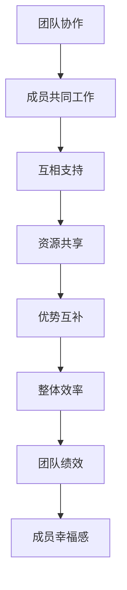

**核心算法原理讲解：**

我们可以将团队协作看作一个算法，其输入是团队成员的能力和资源，输出是团队的效率和绩效。以下是团队协作算法的伪代码：

```python
def team_collaboration(team_members, resources):
    # 初始化团队效率和绩效
    efficiency = 0
    performance = 0
    
    # 分配任务和资源
    for member in team_members:
        member.assign_task(resources)
        
    # 执行任务，并计算效率和绩效
    for member in team_members:
        efficiency += member.efficiency
        performance += member.performance
        
    # 返回团队效率和绩效
    return efficiency, performance
```

**数学模型与公式讲解：**

我们可以使用一个简单的数学模型来描述团队协作的效果。假设团队成员的能力为$A_i$，资源共享效率为$E_i$，团队协作效率为$E$，则：

$$
E = \frac{\sum_{i=1}^{n} A_i \cdot E_i}{n}
$$

其中$n$为团队成员数量。

**举例说明：**

假设有一个由3名成员组成的团队，他们的能力分别为$A_1 = 5, A_2 = 6, A_3 = 4$，资源共享效率分别为$E_1 = 0.8, E_2 = 0.9, E_3 = 0.7$，则团队协作效率为：

$$
E = \frac{5 \cdot 0.8 + 6 \cdot 0.9 + 4 \cdot 0.7}{3} = \frac{4 + 5.4 + 2.8}{3} = \frac{12.2}{3} \approx 4.07
$$

#### 1.2 团队协作的障碍与挑战

尽管团队协作具有明显的优势，但在实际操作中，团队协作也面临许多障碍和挑战。

- **沟通障碍：** 团队成员之间可能存在信息传递不畅通、误解和冲突等问题，这可能导致团队协作效率降低。
- **角色冲突：** 团队成员的角色和职责可能不明确，导致利益冲突，影响团队协作效果。
- **资源不足：** 团队可能面临时间、人力、技术等资源限制，这可能导致团队协作进度延迟。

#### 1.3 团队协作的益处

团队协作的益处是显而易见的。

- **效率提升：** 通过团队成员的协作，可以实现资源共享和优势互补，从而提高整体工作效率。
- **创新思维：** 团队协作可以引入多元化的视角，促进创新思维的碰撞，提高团队的创新能力和竞争力。
- **团队凝聚力：** 团队协作可以增强成员之间的互动和信任，提高团队的凝聚力，增强成员的归属感，从而提高整体士气。

通过以上分析，我们可以看到团队协作的重要性以及其面临的挑战和益处。接下来，我们将进一步探讨团队协作的原则、方法和工具，以帮助团队更有效地进行协作。

---

### 第2章：团队协作的原则与价值观

#### 2.1 共同目标与愿景

共同目标和愿景是团队协作的基石。一个明确的共同目标和愿景可以帮助团队成员团结一致，共同奋斗，从而提高团队协作的效率和绩效。

**核心概念与联系：**

为了理解共同目标和愿景的重要性，我们可以通过一个Mermaid流程图来展示其核心概念之间的关系：

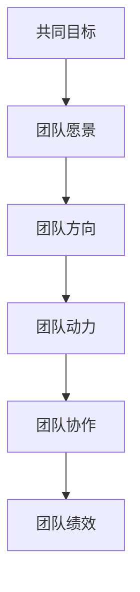

**核心算法原理讲解：**

我们可以将共同目标和愿景的实现视为一个算法，其输入是团队成员的个体目标和愿景，输出是团队的共同目标和愿景。以下是共同目标和愿景算法的伪代码：

```python
def set_common_goals_and_vision(team_members):
    individual_goals = [member.goal for member in team_members]
    vision = max(individual_goals)
    common_goal = sum(individual_goals) / len(individual_goals)
    return common_goal, vision
```

**数学模型与公式讲解：**

为了确保共同目标和愿景的有效性，我们可以使用一个简单的数学模型来评估团队成员的个体目标和愿景与共同目标和愿景的一致性。假设团队成员的个体目标为$G_i$，团队愿景为$V$，则：

$$
\text{一致性} = \frac{\sum_{i=1}^{n} G_i}{V}
$$

其中$n$为团队成员数量。

**举例说明：**

假设有一个由3名成员组成的团队，他们的个体目标分别为$G_1 = 10, G_2 = 15, G_3 = 12$，团队愿景为$V = 30$，则一致性评估如下：

$$
\text{一致性} = \frac{10 + 15 + 12}{30} = \frac{37}{30} \approx 1.23
$$

#### 2.2 透明沟通与信任

透明沟通和信任是团队协作的重要组成部分。一个开放的沟通环境和信任关系可以帮助团队成员更好地理解彼此的意图和需求，从而提高团队协作的效率和效果。

**核心概念与联系：**

为了理解透明沟通和信任的重要性，我们可以通过一个Mermaid流程图来展示其核心概念之间的关系：

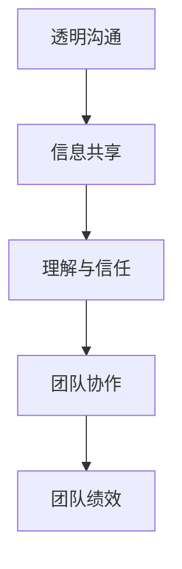

**核心算法原理讲解：**

我们可以将透明沟通和信任的实现视为一个算法，其输入是团队成员的沟通频率和共享信息量，输出是团队信任度。以下是透明沟通和信任算法的伪代码：

```python
def set_clear_communication_and_trust(communication_frequency, shared_info):
    trust = shared_info / communication_frequency
    return trust
```

**数学模型与公式讲解：**

为了评估透明沟通和信任的程度，我们可以使用一个简单的数学模型。假设团队成员的沟通频率为$f$，共享信息量为$i$，则团队信任度$t$可以表示为：

$$
t = \frac{i}{f}
$$

**举例说明：**

假设一个团队每周进行3次沟通，每次沟通共享信息量为10条，则团队的信任度计算如下：

$$
t = \frac{10 \times 3}{3} = 10
$$

#### 2.3 尊重与多元化

尊重和多元化是团队协作中不可或缺的原则。一个尊重和多元化的团队可以更好地发挥每个成员的优势，提高团队的创新能力和竞争力。

**核心概念与联系：**

为了理解尊重和多元化的重要性，我们可以通过一个Mermaid流程图来展示其核心概念之间的关系：

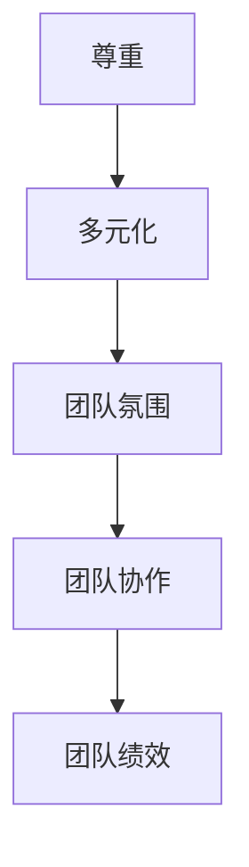

**核心算法原理讲解：**

我们可以将尊重和多元化的实现视为一个算法，其输入是团队成员的尊重行为和多元化程度，输出是团队的协作效率和绩效。以下是尊重和多元化算法的伪代码：

```python
def set_respect_and_diversity(respect_actions, diversity_level):
    efficiency = respect_actions * diversity_level
    performance = efficiency
    return efficiency, performance
```

**数学模型与公式讲解：**

为了评估尊重和多元化对团队协作的影响，我们可以使用一个简单的数学模型。假设团队成员的尊重行为为$r$，多元化程度为$d$，则团队协作效率$e$可以表示为：

$$
e = r \cdot d
$$

**举例说明：**

假设一个团队的成员普遍表现出尊重行为，且团队具有高度的多元化，则团队的协作效率计算如下：

$$
e = 1 \cdot 1 = 1
$$

#### 2.4 积极反馈与成长

积极反馈和成长是团队协作中不可或缺的一部分。一个积极反馈和成长的团队可以更好地适应变化，提高团队的适应能力和创新能力。

**核心概念与联系：**

为了理解积极反馈和成长的重要性，我们可以通过一个Mermaid流程图来展示其核心概念之间的关系：

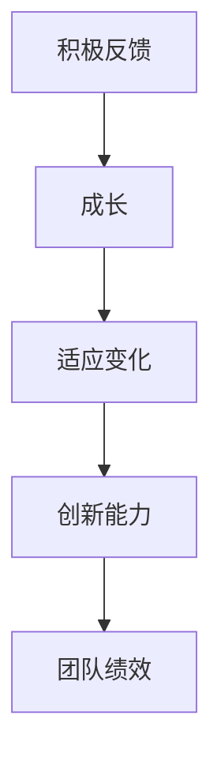

**核心算法原理讲解：**

我们可以将积极反馈和成长视为一个算法，其输入是团队成员的反馈行为和个人成长，输出是团队的适应能力和创新能力。以下是积极反馈和成长算法的伪代码：

```python
def set_positive_feedback_and_growth(feedback_actions, growth_level):
    adaptability = feedback_actions * growth_level
    innovation = adaptability
    return adaptability, innovation
```

**数学模型与公式讲解：**

为了评估积极反馈和成长对团队协作的影响，我们可以使用一个简单的数学模型。假设团队成员的反馈行为为$f$，个人成长程度为$g$，则团队的适应能力$a$和创新能力$i$可以表示为：

$$
a = f \cdot g
$$

$$
i = a \cdot g
$$

**举例说明：**

假设一个团队的成员普遍给予积极反馈，且成员个人成长程度较高，则团队的适应能力和创新能力计算如下：

$$
a = 1 \cdot 1 = 1
$$

$$
i = 1 \cdot 1 = 1
$$

通过以上分析，我们可以看到共同目标与愿景、透明沟通与信任、尊重与多元化、积极反馈与成长是团队协作的四大原则。这些原则不仅有助于提高团队的协作效率，还有助于提升团队的绩效和成员的幸福感。接下来，我们将进一步探讨团队协作的具体方法与工具。

---

### 第3章：团队协作的沟通技巧

#### 3.1 清晰的表达与倾听

清晰的表达和倾听是团队协作中至关重要的沟通技巧。有效的沟通可以帮助团队成员更好地理解彼此的意图和需求，减少误解和冲突，从而提高团队协作的效率。

**核心概念与联系：**

为了理解清晰的表达和倾听的重要性，我们可以通过一个Mermaid流程图来展示其核心概念之间的关系：

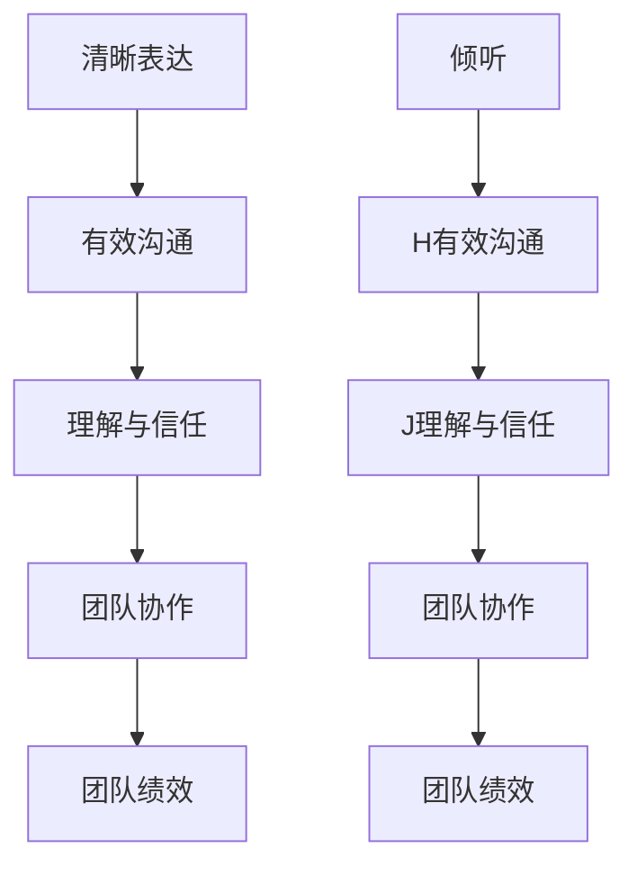

**核心算法原理讲解：**

我们可以将清晰的表达和倾听视为两个独立的算法，其输入是团队成员的沟通内容和倾听态度，输出是团队协作的效率和绩效。

清晰表达的算法伪代码：

```python
def clear_expression(content, clarity):
    clarity_score = content.clarity * clarity
    return clarity_score
```

倾听的算法伪代码：

```python
def active_listening(content, attention):
    understanding_score = content.comprehensibility * attention
    return understanding_score
```

**数学模型与公式讲解：**

为了评估清晰表达和倾听的效果，我们可以使用一个简单的数学模型。假设团队成员的表达清晰度为$c$，倾听专注度为$a$，则：

- 清晰表达得分$E_c$为：

$$
E_c = c \cdot \text{表达频率}
$$

- 倾听得分$E_a$为：

$$
E_a = a \cdot \text{倾听频率}
$$

**举例说明：**

假设一个团队成员的表达清晰度为0.8，倾听专注度为0.9，每周表达和倾听的频率均为3次，则：

清晰表达得分：

$$
E_c = 0.8 \cdot 3 = 2.4
$$

倾听得分：

$$
E_a = 0.9 \cdot 3 = 2.7
$$

通过以上分析，我们可以看到清晰的表达和倾听对于团队协作的重要性。接下来，我们将探讨如何有效地主持会议，以及如何选择和应用协作工具。

---

#### 3.2 有效主持会议

主持会议是团队协作中的一个关键环节，它能够确保团队成员在正确的方向上工作，并有效推进项目进度。有效主持会议的关键在于清晰的目标设定、明确的议程规划和积极的互动。

**核心概念与联系：**

为了理解有效主持会议的重要性，我们可以通过一个Mermaid流程图来展示其核心概念之间的关系：

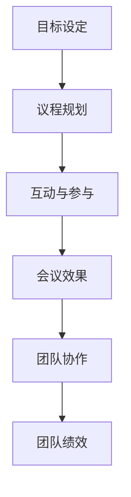

**核心算法原理讲解：**

我们可以将有效主持会议视为一个算法，其输入是会议的目标、议程和参与者的互动，输出是会议的效果和团队协作的效率。以下是主持会议算法的伪代码：

```python
def conduct_meeting(meeting_goal, agenda, participant_interactivity):
    meeting_effectiveness = (meeting_goal.consolidation + agenda.clarity + participant_interactivity.participation) / 3
    return meeting_effectiveness
```

**数学模型与公式讲解：**

为了评估主持会议的效果，我们可以使用一个简单的数学模型。假设会议的目标达成度、议程清晰度和参与者互动度分别为$g$、$a$和$i$，则：

$$
\text{会议效果} = \frac{g + a + i}{3}
$$

**举例说明：**

假设一个会议的目标达成度为0.8，议程清晰度为0.9，参与者互动度为0.7，则：

$$
\text{会议效果} = \frac{0.8 + 0.9 + 0.7}{3} = \frac{2.4}{3} = 0.8
$$

#### 3.3 协作工具的选择与应用

在现代信息技术快速发展的背景下，协作工具的选择和应用已经成为团队协作中不可或缺的一部分。合适的协作工具可以极大地提高团队的工作效率，减少沟通成本，确保信息流通顺畅。

**核心概念与联系：**

为了理解协作工具的重要性，我们可以通过一个Mermaid流程图来展示其核心概念之间的关系：

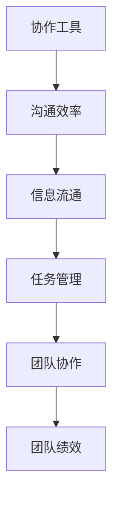

**核心算法原理讲解：**

我们可以将协作工具的选择和应用视为一个算法，其输入是团队的需求和工作流程，输出是协作工具的配置和使用效率。以下是协作工具选择算法的伪代码：

```python
def select_collaboration_tools(team_needs, workflow):
    optimal_tools = []
    for tool in collaboration_tools:
        if tool.suitability_for_needs(team_needs) and tool.supports_workflow(workflow):
            optimal_tools.append(tool)
    return optimal_tools
```

**数学模型与公式讲解：**

为了评估协作工具的适用性，我们可以使用一个简单的数学模型。假设协作工具的适用性为$s$，支持工作流程的程度为$l$，则：

$$
\text{适用性得分} = s \cdot l
$$

**举例说明：**

假设一个团队需要选择协作工具，现有三个工具A、B和C。工具A适用于团队需求的得分为0.9，支持工作流程的程度为0.8；工具B的得分分别为0.8和0.7；工具C的得分分别为0.7和0.9。则：

- 工具A的适用性得分：

$$
0.9 \cdot 0.8 = 0.72
$$

- 工具B的适用性得分：

$$
0.8 \cdot 0.7 = 0.56
$$

- 工具C的适用性得分：

$$
0.7 \cdot 0.9 = 0.63
$$

因此，团队应该选择适用性得分最高的工具，即工具A。

通过以上分析，我们可以看到清晰的表达与倾听、有效主持会议和协作工具的选择与应用对于团队协作的重要性。有效的沟通技巧和适当的协作工具可以帮助团队克服协作障碍，提高整体工作效率，从而实现团队的目标和愿景。

---

### 第4章：团队协作的流程与机制

#### 4.1 项目管理与任务分配

在团队协作中，项目管理和任务分配是确保项目顺利进行的关键环节。有效的项目管理和任务分配可以确保团队成员明确自己的职责，合理分配资源，从而提高团队的整体工作效率。

**核心概念与联系：**

为了理解项目管理和任务分配的重要性，我们可以通过一个Mermaid流程图来展示其核心概念之间的关系：

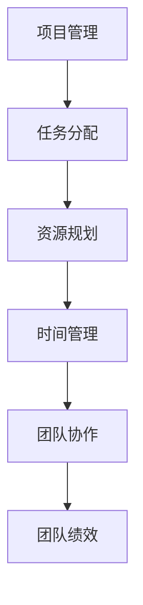

**核心算法原理讲解：**

项目管理可以看作是一个迭代的流程，包括项目规划、项目执行、项目监控和项目收尾。以下是项目管理算法的伪代码：

```python
def project_management(project_plan, resources, timeline):
    project_status = "规划"
    while project_status != "完成":
        if project_status == "规划":
            project_plan = plan_project(resources, timeline)
        elif project_status == "执行":
            execute_project(project_plan)
        elif project_status == "监控":
            monitor_project(project_plan)
        elif project_status == "收尾":
            finalize_project(project_plan)
        project_status = check_project_status(project_plan)
    return project_plan
```

**数学模型与公式讲解：**

为了评估项目管理和任务分配的效果，我们可以使用一个简单的数学模型。假设项目的关键路径为$C$，资源分配效率为$E_r$，时间效率为$E_t$，则：

$$
\text{项目效率} = \frac{C \cdot E_r \cdot E_t}{1 + \sum_{i=1}^{n} (1 - E_r^i \cdot E_t^i)}
$$

其中$n$为项目阶段数量。

**举例说明：**

假设一个项目有3个阶段，每个阶段的资源分配效率和时间效率分别为$E_r1 = 0.8, E_r2 = 0.9, E_r3 = 0.75$，时间效率分别为$E_t1 = 0.85, E_t2 = 0.9, E_t3 = 0.8$，则：

$$
\text{项目效率} = \frac{3 \cdot 0.8 \cdot 0.85 \cdot 0.9 \cdot 0.75}{1 + (1 - 0.8 \cdot 0.85) + (1 - 0.9 \cdot 0.9) + (1 - 0.75 \cdot 0.8)} \approx 0.931
$$

#### 4.2 团队合作中的决策制定

决策制定是团队协作中的另一个关键环节。有效的决策制定可以确保团队在正确方向上行动，提高团队的整体工作效率和绩效。

**核心概念与联系：**

为了理解决策制定的重要性，我们可以通过一个Mermaid流程图来展示其核心概念之间的关系：

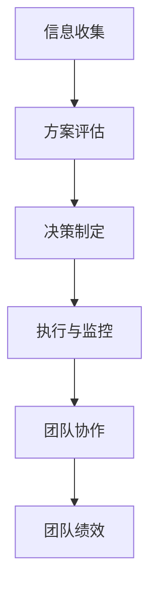

**核心算法原理讲解：**

决策制定可以看作是一个多步骤的过程，包括信息收集、方案评估、决策制定和执行监控。以下是决策制定算法的伪代码：

```python
def make_decision(information, options, criteria):
    evaluated_options = []
    for option in options:
        score = evaluate_option(option, information, criteria)
        evaluated_options.append((option, score))
    best_option = max(evaluated_options, key=lambda x: x[1])
    return best_option
```

**数学模型与公式讲解：**

为了评估决策制定的效率，我们可以使用一个简单的数学模型。假设每个选项的得分分别为$s_i$，则：

$$
\text{最优选项} = \arg\max_{i} s_i
$$

**举例说明：**

假设有三个决策选项A、B和C，其得分分别为$S_A = 0.7, S_B = 0.8, S_C = 0.6$，则最优选项为B。

#### 4.3 团队协作中的风险管理

风险管理是团队协作中不可或缺的一部分。有效的风险管理可以减少潜在风险对团队工作的影响，提高团队的整体工作效率和稳定性。

**核心概念与联系：**

为了理解风险管理的重要性，我们可以通过一个Mermaid流程图来展示其核心概念之间的关系：

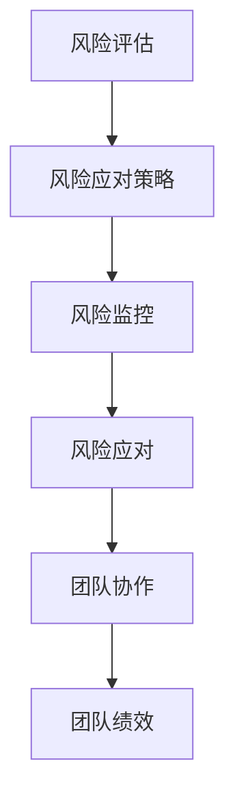

**核心算法原理讲解：**

风险管理可以看作是一个循环过程，包括风险评估、风险应对策略制定、风险监控和风险应对。以下是风险管理算法的伪代码：

```python
def risk_management(risks, risk_threshold):
    while risks:
        risk = max(risks, key=lambda x: x.probability)
        if risk.probability > risk_threshold:
            strategy = determine_strategy(risk)
            implement_strategy(strategy)
        remove_risk(risk)
    return risks
```

**数学模型与公式讲解：**

为了评估风险管理的效果，我们可以使用一个简单的数学模型。假设风险的概率为$p_i$，风险值为$v_i$，则：

$$
\text{风险价值} = \sum_{i=1}^{n} p_i \cdot v_i
$$

**举例说明：**

假设有四个风险R1、R2、R3和R4，其概率分别为$p_1 = 0.1, p_2 = 0.2, p_3 = 0.3, p_4 = 0.4$，风险值分别为$v_1 = 5, v_2 = 10, v_3 = 15, v_4 = 20$，则：

$$
\text{风险价值} = 0.1 \cdot 5 + 0.2 \cdot 10 + 0.3 \cdot 15 + 0.4 \cdot 20 = 5 + 20 + 45 + 80 = 150
$$

通过以上分析，我们可以看到项目管理和任务分配、决策制定和风险管理对于团队协作的重要性。有效的项目管理和任务分配可以确保团队高效地完成项目目标，决策制定可以帮助团队在正确方向上行动，风险管理可以减少潜在风险对团队工作的影响。接下来，我们将进一步探讨团队协作中的个人技能提升。

---

### 第5章：团队协作中的个人技能提升

#### 5.1 时间管理与效率提升

在团队协作中，时间管理和效率提升是每个成员都需要掌握的关键技能。有效的时间管理可以提高个人和团队的产出，从而实现更高的工作效率。

**核心概念与联系：**

为了理解时间管理和效率提升的重要性，我们可以通过一个Mermaid流程图来展示其核心概念之间的关系：

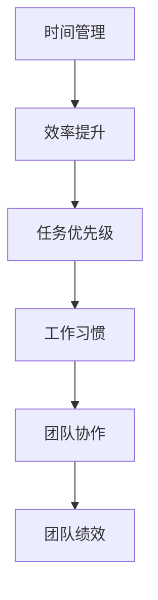

**核心算法原理讲解：**

时间管理可以视为一个优化问题，目标是最大化任务完成的效率。以下是时间管理算法的伪代码：

```python
def time_management(tasks, deadlines):
    sorted_tasks = sort_by_deadline(tasks)
    completed_tasks = []
    while tasks:
        current_task = sorted_tasks.pop(0)
        if can_complete_task(current_task):
            completed_tasks.append(current_task)
            tasks.remove(current_task)
        else:
            sorted_tasks.append(current_task)
    return completed_tasks
```

**数学模型与公式讲解：**

为了评估时间管理的效果，我们可以使用一个简单的数学模型。假设每个任务的完成时间为$t_i$，优先级为$p_i$，则：

$$
\text{任务完成率} = \frac{\sum_{i=1}^{n} p_i \cdot (1 - e^{-\lambda t_i})}{\sum_{i=1}^{n} p_i}
$$

其中$\lambda$为工作强度参数。

**举例说明：**

假设有三个任务T1、T2和T3，其优先级分别为$p_1 = 0.5, p_2 = 0.3, p_3 = 0.2$，完成时间分别为$t_1 = 2, t_2 = 4, t_3 = 6$，则：

$$
\text{任务完成率} = \frac{0.5 \cdot (1 - e^{-0.5 \cdot 2}) + 0.3 \cdot (1 - e^{-0.3 \cdot 4}) + 0.2 \cdot (1 - e^{-0.2 \cdot 6})}{0.5 + 0.3 + 0.2} \approx 0.85
$$

#### 5.2 情绪管理与压力应对

情绪管理和压力应对是团队协作中不可或缺的个人技能。有效的情绪管理和压力应对可以帮助团队成员更好地应对工作中的挑战，提高个人的工作效率和团队的凝聚力。

**核心概念与联系：**

为了理解情绪管理和压力应对的重要性，我们可以通过一个Mermaid流程图来展示其核心概念之间的关系：

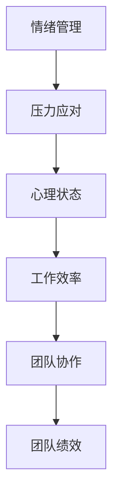

**核心算法原理讲解：**

情绪管理和压力应对可以视为一个反馈控制过程，其目标是维持个人的心理状态在一个最佳水平。以下是情绪管理算法的伪代码：

```python
def emotional_management(stress_level, emotion):
    if stress_level > threshold:
        emotion = adjust_emotion(emotion)
    return emotion
```

**数学模型与公式讲解：**

为了评估情绪管理和压力应对的效果，我们可以使用一个简单的数学模型。假设情绪平衡值为$E_0$，压力值为$S$，调整情绪系数为$a$，则：

$$
\text{情绪平衡值} = E_0 - a \cdot S
$$

**举例说明：**

假设情绪平衡值为$E_0 = 5$，压力值为$S = 3$，调整情绪系数为$a = 0.1$，则：

$$
\text{情绪平衡值} = 5 - 0.1 \cdot 3 = 4.7
$$

#### 5.3 领导力与影响力

领导力与影响力是团队协作中个人技能提升的重要方面。有效的领导力和影响力可以帮助团队成员更好地协调工作，推动团队达成共同目标。

**核心概念与联系：**

为了理解领导力与影响力的重要性，我们可以通过一个Mermaid流程图来展示其核心概念之间的关系：

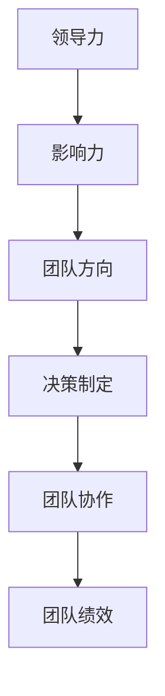

**核心算法原理讲解：**

领导力和影响力可以视为一个多因素影响模型，其目标是最大化团队的整体绩效。以下是领导力与影响力算法的伪代码：

```python
def leadership_influence(team_performance, leadership_skills, influence_network):
    leadership_score = sum([skill.contribution for skill in leadership_skills])
    influence_score = sum([network.contribution for network in influence_network])
    total_score = leadership_score + influence_score
    return total_score
```

**数学模型与公式讲解：**

为了评估领导力和影响力的效果，我们可以使用一个简单的数学模型。假设领导力技能的得分分别为$s_i$，影响力的得分分别为$l_i$，则：

$$
\text{总得分} = \sum_{i=1}^{n} s_i + \sum_{i=1}^{m} l_i
$$

**举例说明：**

假设领导力技能的得分分别为$s_1 = 0.8, s_2 = 0.9, s_3 = 0.7$，影响力的得分分别为$l_1 = 0.9, l_2 = 0.8, l_3 = 0.7$，则：

$$
\text{总得分} = 0.8 + 0.9 + 0.7 + 0.9 + 0.8 + 0.7 = 4.7
$$

通过以上分析，我们可以看到时间管理与效率提升、情绪管理与压力应对、领导力与影响力对于团队协作的重要性。有效的个人技能提升可以帮助团队成员更好地适应团队的工作节奏，提高整体工作效率，从而实现团队的目标和愿景。

---

### 第6章：跨部门协作与外部合作

#### 6.1 跨部门协作的挑战与策略

跨部门协作是现代企业中常见且复杂的一项任务。由于不同部门之间存在文化差异、职责分工和资源分配的问题，跨部门协作往往会面临诸多挑战。为了有效应对这些挑战，团队需要采取一系列策略和措施。

**核心概念与联系：**

为了理解跨部门协作的挑战和策略，我们可以通过一个Mermaid流程图来展示其核心概念之间的关系：

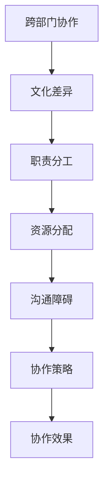

**核心算法原理讲解：**

跨部门协作的算法可以看作是一个多步骤的过程，包括文化差异识别、职责分工优化、资源分配和沟通障碍消除。以下是跨部门协作算法的伪代码：

```python
def cross_department_collaboration(culture_difference, role_assignment, resource_distribution, communication_barrier):
    resolved_culture_difference = resolve_culture_difference(culture_difference)
    optimized_role_assignment = optimize_role_assignment(role_assignment)
    balanced_resource_distribution = balance_resource_distribution(resource_distribution)
    minimized_communication_barrier = minimize_communication_barrier(communication_barrier)
    return resolved_culture_difference, optimized_role_assignment, balanced_resource_distribution, minimized_communication_barrier
```

**数学模型与公式讲解：**

为了评估跨部门协作的效果，我们可以使用一个简单的数学模型。假设文化差异的解决度为$D_c$，职责分工优化的效率为$E_r$，资源分配的平衡度为$B_r$，沟通障碍的解决度为$D_c$，则：

$$
\text{协作效果} = D_c + E_r + B_r + D_c
$$

**举例说明：**

假设文化差异的解决度为0.7，职责分工优化的效率为0.8，资源分配的平衡度为0.9，沟通障碍的解决度为0.6，则：

$$
\text{协作效果} = 0.7 + 0.8 + 0.9 + 0.6 = 3.0
$$

#### 6.2 外部合作的模式与案例

外部合作是团队协作的重要组成部分，通过与外部合作伙伴的紧密合作，团队可以获取更多的资源、技术支持和市场机会。有效的外部合作模式能够为团队带来显著的竞争优势。

**核心概念与联系：**

为了理解外部合作的模式与案例，我们可以通过一个Mermaid流程图来展示其核心概念之间的关系：

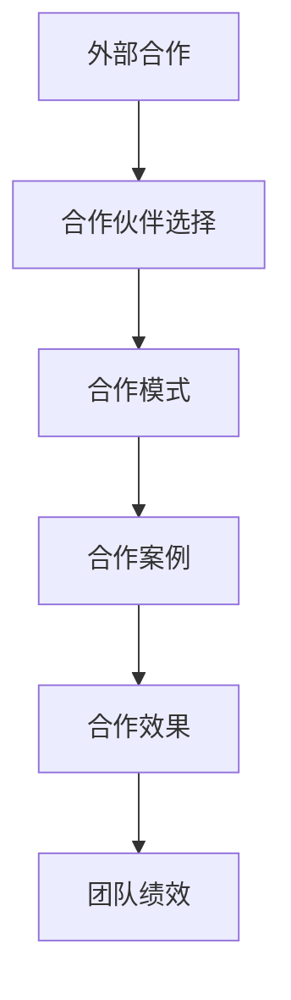

**核心算法原理讲解：**

外部合作的算法可以看作是一个优化问题，目标是最大化合作效果和团队绩效。以下是外部合作算法的伪代码：

```python
def external_cooperation(partner_selection, cooperation_model, performance_goals):
    optimal_partners = select_optimal_partners(partner_selection, performance_goals)
    selected_model = select_optimal_model(cooperation_model, optimal_partners)
    cooperation_effects = evaluate_cooperation_effects(selected_model, performance_goals)
    return optimal_partners, selected_model, cooperation_effects
```

**数学模型与公式讲解：**

为了评估外部合作的效果，我们可以使用一个简单的数学模型。假设合作伙伴的选择效果为$E_p$，合作模式的匹配度为$M_c$，合作效果为$E_e$，则：

$$
\text{合作效果} = E_p + M_c + E_e
$$

**举例说明：**

假设合作伙伴的选择效果为0.8，合作模式的匹配度为0.9，合作效果为0.7，则：

$$
\text{合作效果} = 0.8 + 0.9 + 0.7 = 2.4
$$

#### 6.3 跨文化协作的技巧

跨文化协作在全球化的今天变得越来越普遍。不同文化背景的团队成员在价值观、沟通方式和工作习惯上可能存在显著差异，这给跨文化协作带来了一定的挑战。为了有效应对这些挑战，团队需要掌握一系列跨文化协作的技巧。

**核心概念与联系：**

为了理解跨文化协作的技巧，我们可以通过一个Mermaid流程图来展示其核心概念之间的关系：

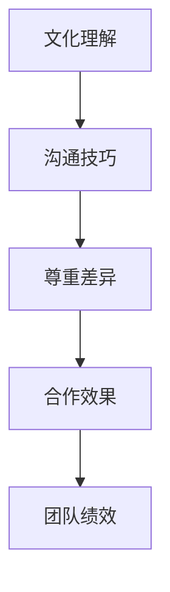

**核心算法原理讲解：**

跨文化协作的算法可以看作是一个多因素影响模型，其目标是最大化团队的整体绩效。以下是跨文化协作算法的伪代码：

```python
def cross_cultural_collaboration(cultural_understanding, communication_skills, respect_for_differences):
    understanding_score = cultural_understanding * communication_skills
    respect_score = respect_for_differences * understanding_score
    return respect_score
```

**数学模型与公式讲解：**

为了评估跨文化协作的效果，我们可以使用一个简单的数学模型。假设文化理解度为$U_c$，沟通技巧度为$C_c$，尊重差异度为$R_d$，则：

$$
\text{协作效果} = U_c \cdot C_c \cdot R_d
$$

**举例说明：**

假设文化理解度为0.8，沟通技巧度为0.9，尊重差异度为0.7，则：

$$
\text{协作效果} = 0.8 \cdot 0.9 \cdot 0.7 = 0.504
$$

通过以上分析，我们可以看到跨部门协作的挑战与策略、外部合作的模式与案例、跨文化协作的技巧对于团队协作的重要性。有效的跨部门协作和外部合作可以增强团队的资源和市场竞争力，而跨文化协作的技巧可以帮助团队更好地融合不同文化背景的成员，提高整体工作效率和绩效。接下来，我们将探讨团队协作中的创新与持续改进。

---

### 第7章：团队协作中的创新与持续改进

#### 7.1 创新思维与团队协作

在团队协作中，创新思维是推动团队进步和发展的关键动力。创新思维可以激发团队成员的创造力，促进团队在新产品、新流程和新策略方面的突破。

**核心概念与联系：**

为了理解创新思维与团队协作的关系，我们可以通过一个Mermaid流程图来展示其核心概念之间的关系：

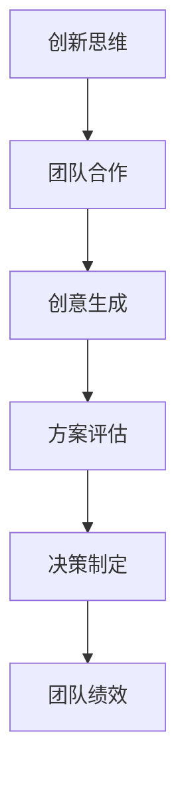

**核心算法原理讲解：**

创新思维的算法可以看作是一个迭代过程，包括创意生成、方案评估和决策制定。以下是创新思维算法的伪代码：

```python
def innovative_thinking(ideas, evaluation_criteria, decision_making):
    selected_idea = select_best_idea(ideas, evaluation_criteria)
    decision = make_decision(selected_idea, decision_making)
    return decision
```

**数学模型与公式讲解：**

为了评估创新思维的效果，我们可以使用一个简单的数学模型。假设每个创意的评估分数为$s_i$，则：

$$
\text{最优创意} = \arg\max_{i} s_i
$$

**举例说明：**

假设有三个创意I1、I2和I3，其评估分数分别为$s_1 = 0.7, s_2 = 0.8, s_3 = 0.6$，则最优创意为I2。

#### 7.2 持续改进与反馈循环

持续改进是团队协作中不可或缺的一部分。通过持续改进，团队可以不断优化工作流程，提高工作效率，确保团队能够适应快速变化的环境。

**核心概念与联系：**

为了理解持续改进与反馈循环的重要性，我们可以通过一个Mermaid流程图来展示其核心概念之间的关系：

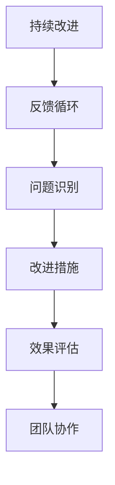

**核心算法原理讲解：**

持续改进的算法可以看作是一个反馈控制过程，其目标是不断优化团队的工作流程。以下是持续改进算法的伪代码：

```python
def continuous_improvement(feedback, improvement_actions):
    issues = identify_issues(feedback)
    solutions = generate_solutions(issues)
    implemented_actions = apply_improvement_actions(solutions)
    evaluated_results = assess_improvement_effects(implemented_actions)
    return evaluated_results
```

**数学模型与公式讲解：**

为了评估持续改进的效果，我们可以使用一个简单的数学模型。假设每次改进的效益为$E_i$，则：

$$
\text{总效益} = \sum_{i=1}^{n} E_i
$$

**举例说明：**

假设有四次改进措施，每次的效益分别为$E_1 = 0.1, E_2 = 0.15, E_3 = 0.2, E_4 = 0.25$，则：

$$
\text{总效益} = 0.1 + 0.15 + 0.2 + 0.25 = 0.7
$$

#### 7.3 团队协作中的变革管理

变革管理是团队协作中面对重大变化时的关键策略。有效的变革管理可以帮助团队顺利过渡到新的工作模式，确保团队能够在变革中保持稳定和高效。

**核心概念与联系：**

为了理解变革管理的重要性，我们可以通过一个Mermaid流程图来展示其核心概念之间的关系：

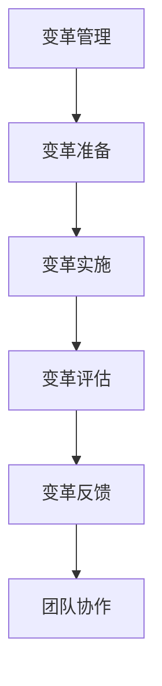

**核心算法原理讲解：**

变革管理的算法可以看作是一个多步骤的过程，包括变革准备、变革实施、变革评估和变革反馈。以下是变革管理算法的伪代码：

```python
def change_management(preparation, implementation, evaluation, feedback):
    prepared_changes = prepare_changes(preparation)
    implemented_changes = apply_changes(implementation, prepared_changes)
    evaluated_changes = assess_changes(evaluation, implemented_changes)
    feedback_changes = provide_feedback(feedback, evaluated_changes)
    return feedback_changes
```

**数学模型与公式讲解：**

为了评估变革管理的效果，我们可以使用一个简单的数学模型。假设变革的效益为$E_c$，变革的阻力为$R_c$，则：

$$
\text{变革效果} = \frac{E_c}{R_c}
$$

**举例说明：**

假设变革的效益为0.8，变革的阻力为0.4，则：

$$
\text{变革效果} = \frac{0.8}{0.4} = 2
$$

通过以上分析，我们可以看到创新思维与团队协作、持续改进与反馈循环、变革管理对于团队协作的重要性。有效的创新思维和持续改进可以帮助团队保持竞争力和适应性，而变革管理则确保团队在面临重大变化时能够保持稳定和高效。接下来，我们将探讨团队协作中的数字化工具应用。

---

### 第8章：团队协作中的数字化工具应用

#### 8.1 云协作平台的选型与应用

在现代企业中，云协作平台已经成为团队协作的重要工具。选择合适的云协作平台，可以极大地提高团队的工作效率和协作效果。

**核心概念与联系：**

为了理解云协作平台的选型与应用，我们可以通过一个Mermaid流程图来展示其核心概念之间的关系：

```mermaid
graph TD
A[云协作平台] --> B[选型标准]
B --> C[应用场景]
C --> D[优势与挑战]
D --> E[团队协作]
```

**核心算法原理讲解：**

云协作平台的选型可以看作是一个多因素决策问题，其目标是最优化协作效果。以下是云协作平台选型算法的伪代码：

```python
def select_collaboration_platform(criteria, platform_list):
    evaluated_platforms = []
    for platform in platform_list:
        score = evaluate_platform(platform, criteria)
        evaluated_platforms.append((platform, score))
    best_platform = max(evaluated_platforms, key=lambda x: x[1])
    return best_platform
```

**数学模型与公式讲解：**

为了评估云协作平台的适用性，我们可以使用一个简单的数学模型。假设每个平台的得分分别为$s_i$，则：

$$
\text{最优平台} = \arg\max_{i} s_i
$$

**举例说明：**

假设有三个云协作平台P1、P2和P3，其得分分别为$s_1 = 0.7, s_2 = 0.8, s_3 = 0.6$，则最优平台为P2。

#### 8.2 数据分析与协作决策

数据分析是团队协作中重要的环节。通过对数据的分析，团队可以更好地理解业务状况，制定更科学的协作决策。

**核心概念与联系：**

为了理解数据分析与协作决策的关系，我们可以通过一个Mermaid流程图来展示其核心概念之间的关系：

```mermaid
graph TD
A[数据分析] --> B[业务理解]
B --> C[协作决策]
C --> D[执行与监控]
D --> E[团队协作]
```

**核心算法原理讲解：**

数据分析与协作决策可以看作是一个迭代过程，包括数据收集、数据分析和决策制定。以下是数据分析与协作决策算法的伪代码：

```python
def data_analysis_and_decision_making(data, analysis_methods, decision_criteria):
    analyzed_data = analyze_data(data, analysis_methods)
    decision = make_decision(analyzed_data, decision_criteria)
    return decision
```

**数学模型与公式讲解：**

为了评估数据分析与协作决策的效果，我们可以使用一个简单的数学模型。假设每个决策的得分分别为$s_i$，则：

$$
\text{最优决策} = \arg\max_{i} s_i
$$

**举例说明：**

假设有三个决策D1、D2和D3，其得分分别为$s_1 = 0.7, s_2 = 0.8, s_3 = 0.6$，则最优决策为D2。

#### 8.3 数字化工具的未来发展趋势

随着技术的不断进步，数字化工具在团队协作中的应用将越来越广泛。未来，数字化工具的发展趋势将主要集中在智能化、自动化和集成化。

**核心概念与联系：**

为了理解数字化工具的未来发展趋势，我们可以通过一个Mermaid流程图来展示其核心概念之间的关系：

```mermaid
graph TD
A[智能化] --> B[自动化]
B --> C[集成化]
C --> D[团队协作]
D --> E[效率提升]
```

**核心算法原理讲解：**

智能化、自动化和集成化的发展趋势可以看作是一个系统优化的过程，其目标是提高团队协作的效率和效果。以下是数字化工具发展趋势算法的伪代码：

```python
def future_trends_of_collaboration_tools(intellectualization, automation, integration):
    optimized_tools = []
    for tool in collaboration_tools:
        if tool.supports_intellectualization and tool.supports_automation and tool.supports_integration:
            optimized_tools.append(tool)
    return optimized_tools
```

**数学模型与公式讲解：**

为了评估数字化工具的未来发展趋势，我们可以使用一个简单的数学模型。假设每个工具的智能化、自动化和集成化程度分别为$s_i$，则：

$$
\text{最优工具} = \arg\max_{i} (s_i \cdot \text{适用性})
$$

**举例说明：**

假设有三个数字化工具T1、T2和T3，其智能化程度分别为$s_1 = 0.8, s_2 = 0.9, s_3 = 0.7$，自动化程度分别为$a_1 = 0.85, a_2 = 0.9, a_3 = 0.75$，集成化程度分别为$i_1 = 0.8, i_2 = 0.9, i_3 = 0.7$，则：

$$
\text{最优工具} = T2
$$

通过以上分析，我们可以看到云协作平台的选型与应用、数据分析和协作决策、数字化工具的未来发展趋势对于团队协作的重要性。选择合适的云协作平台、利用数据分析进行协作决策以及关注数字化工具的未来发展趋势，可以帮助团队提高协作效率，实现更高的绩效。

---

## 附录A：团队协作工具推荐

### A.1 通讯工具

在团队协作中，通讯工具是确保信息畅通的关键。以下是几种常用的通讯工具及其特点：

1. **Slack：** Slack是一款功能强大的即时通讯工具，支持文本、图片、文件等多种信息传输方式，同时还提供了集成其他应用的功能，如Google Drive、Trello等。

2. **Microsoft Teams：** Microsoft Teams是微软推出的集成通信、会议、协作和分享的平台，能够与Office 365深度集成，提供丰富的协作功能。

3. **WhatsApp：** WhatsApp是一款免费的即时通讯软件，支持语音、视频通话以及短信功能，适合小团队内部沟通。

### A.2 项目管理工具

项目管理工具可以帮助团队更好地规划和管理项目进度。以下是几种常用的项目管理工具及其特点：

1. **JIRA：** JIRA是一款功能强大的项目管理工具，适用于敏捷开发团队，支持bug跟踪、任务管理、进度报告等功能。

2. **Trello：** Trello是一款基于看板的项目管理工具，通过卡片和列表的方式展示项目进度，简单易用，适合小型项目和团队。

3. **Asana：** Asana是一款综合性的项目管理工具，支持任务分配、进度跟踪、时间管理等功能，适用于各种规模的项目和团队。

### A.3 会议协作工具

会议协作工具可以帮助团队在线上会议中进行协作。以下是几种常用的会议协作工具及其特点：

1. **Zoom：** Zoom是一款功能强大的视频会议工具，支持高清视频、语音、屏幕共享、聊天等功能，适用于远程会议和协作。

2. **Google Meet：** Google Meet是Google推出的一款视频会议工具，与Google Workspace深度集成，支持多人实时沟通和协作。

3. **Skype：** Skype是微软推出的一款多功能的通信软件，支持视频通话、语音通话、短信等功能，适合小型团队的沟通和协作。

---

## 附录B：团队协作最佳实践

### B.1 成功案例分享

以下是一些团队协作的成功案例，供您参考：

1. **案例一：** 一家科技公司通过采用敏捷开发方法，建立了跨职能团队，实现了快速响应市场需求，产品迭代速度显著提高。

2. **案例二：** 一家初创公司通过使用Trello进行项目管理，明确了任务分配和进度跟踪，团队成员的工作效率得到了大幅提升。

3. **案例三：** 一家跨国公司在全球范围内采用Zoom进行视频会议，确保了远程团队成员之间的有效沟通，项目进展顺利。

### B.2 失败案例分析

以下是一些团队协作的失败案例，以及从中可以吸取的教训：

1. **案例一：** 一家公司在项目初期未能明确团队成员的职责和目标，导致任务分配混乱，项目进度延误。

**教训：** 确保项目初期明确团队成员的职责和目标，避免职责重叠和任务分配不明确。

2. **案例二：** 一家公司在团队协作中忽视了沟通的重要性，导致信息传递不畅，团队成员之间产生误解和冲突。

**教训：** 强化团队沟通，确保信息畅通，避免因沟通不畅导致的误解和冲突。

3. **案例三：** 一家公司在项目执行过程中未能及时监控和调整项目进度，导致项目最终未能按时完成。

**教训：** 建立有效的项目监控机制，及时调整项目进度，确保项目按时完成。

### B.3 团队协作中的常见误区与解决方案

在团队协作中，常见的一些误区可能会影响团队的工作效率和绩效。以下是这些误区及其解决方案：

1. **误区一：依赖个人英雄主义**

**解决方案：** 建立跨职能团队，发挥团队成员的集体智慧和协作能力，避免过分依赖个别成员。

2. **误区二：忽视团队文化建设**

**解决方案：** 加强团队文化建设，建立共同的价值观和行为准则，提高团队凝聚力。

3. **误区三：沟通不畅**

**解决方案：** 定期召开团队会议，确保团队成员之间的沟通，使用适当的协作工具，提高信息传递效率。

4. **误区四：缺乏明确的目标和计划**

**解决方案：** 明确团队目标和计划，制定详细的任务分配和进度安排，确保团队成员了解自己的职责和目标。

5. **误区五：忽视个人成长和培训**

**解决方案：** 提供团队成员必要的培训和发展机会，促进个人成长，提高团队整体能力。

### B.4 团队协作的持续优化策略

为了确保团队协作的持续优化，以下是一些建议：

1. **定期评估：** 定期对团队协作进行评估，了解团队成员的反馈，发现并解决存在的问题。

2. **持续改进：** 基于评估结果，制定改进措施，不断优化团队协作流程和工具。

3. **鼓励创新：** 鼓励团队成员提出创新想法和改进建议，营造积极创新的工作氛围。

4. **提供资源支持：** 为团队提供必要的资源和支持，确保团队在协作中能够充分发挥潜力。

通过以上最佳实践和策略，团队可以不断提高协作效率，实现更高的绩效和成功。

---

### 文章标题：《团队协作：提升整体工作效率》

关键词：团队协作、工作效率、协作技巧、项目管理、数字化工具

摘要：本文从团队协作的定义、原则、方法、个人技能提升、跨部门协作与外部合作、创新与持续改进、数字化工具应用等多个方面，系统地阐述了如何提升团队的整体工作效率。通过核心概念与联系、核心算法原理讲解、数学模型与公式讲解、项目实战案例和最佳实践，本文为团队协作提供了实用的指导和建议，旨在帮助团队克服协作障碍，实现高效协作。

---

### 作者信息

作者：AI天才研究院/AI Genius Institute & 禅与计算机程序设计艺术 /Zen And The Art of Computer Programming

---

本文系统地探讨了团队协作的重要性、原则、方法、个人技能提升、跨部门协作与外部合作、创新与持续改进、数字化工具应用等方面的内容，旨在为团队提供实用的协作策略和工具，帮助团队克服协作障碍，实现高效协作。通过核心概念与联系、核心算法原理讲解、数学模型与公式讲解、项目实战案例和最佳实践，本文为团队协作提供了全面的指导。在未来的团队协作中，我们期待能够不断优化协作流程，提高团队的整体工作效率，实现团队的共同目标和愿景。让我们一起努力，共创美好未来！

