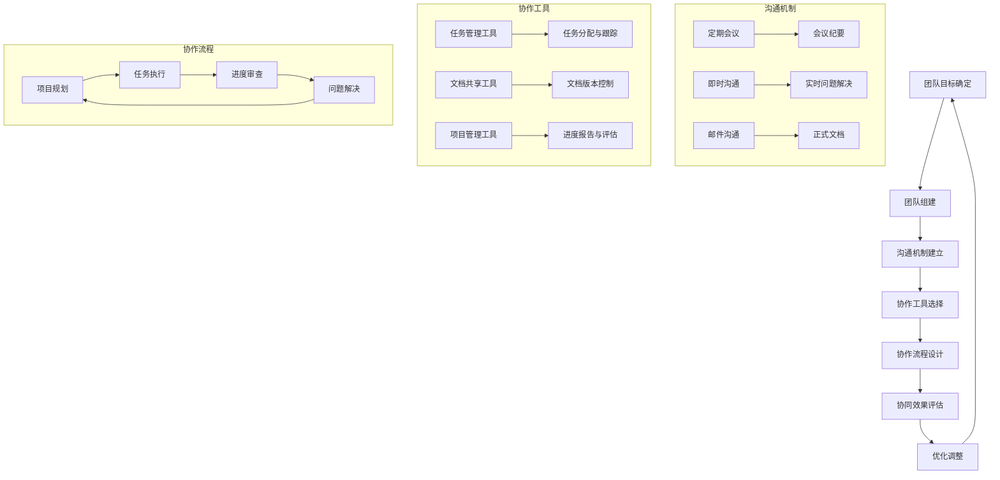

                 

## 文章标题

《团队协同：远程与现场团队的无缝衔接》

## 关键词

团队协同、远程团队、现场团队、无缝衔接、团队管理、沟通技巧、协作工具、任务调度算法。

## 摘要

在现代信息技术飞速发展的背景下，团队协同已经成为企业提升效率、实现创新的关键因素。本文将从远程团队与现场团队协同的概述、工具与技术、远程团队管理、现场团队管理以及远程与现场团队的无缝衔接等多个方面进行深入探讨。通过分析团队协同中的核心概念与联系，详细介绍任务调度算法原理及其应用，力求为IT领域的团队协同提供具有实践指导意义的方法和策略。

## 第一部分：团队协同概述

### 第1章：团队协同的重要性与基本概念

#### 1.1.1 团队协同的概念与意义

团队协同指的是团队中的成员在共享目标、信息和资源的基础上，通过相互合作与协调，共同完成任务的过程。在现代企业中，团队协同的重要性不言而喻。首先，团队协同有助于提高工作效率。通过合理的分工与合作，团队成员可以各自发挥专长，避免重复劳动，从而加快工作进程。其次，团队协同能够促进知识共享和创新。团队成员在合作过程中，不仅能够学习他人的经验和技能，还能够碰撞出新的思维火花，推动团队整体创新能力的提升。最后，团队协同有助于提升企业的竞争力。通过高效的团队协作，企业可以更快地响应市场变化，灵活调整战略，抢占市场先机。

#### 1.1.2 远程团队协同的特点与挑战

远程团队协同指的是团队成员分布在不同的地理位置，通过现代通信技术进行协作的工作模式。远程团队协同具有以下几个特点：

1. **地理位置分散**：团队成员可能位于不同城市，甚至不同国家，这要求团队具备较高的沟通能力和协作精神。
2. **时间差异**：由于地理位置的分散，远程团队在沟通和协作时可能面临时间上的差异，需要合理安排工作时间和会议时间。
3. **工具依赖**：远程团队通常依赖于各种在线协作工具进行沟通和协作，这些工具的使用水平直接影响到团队的工作效率。

远程团队协同也面临一些挑战：

1. **沟通障碍**：远程团队在沟通时容易受到语言、文化和习惯差异的影响，导致信息传递不畅。
2. **协作难度**：远程团队成员之间的协作需要高度依赖工具，如果工具使用不当，可能会降低团队的工作效率。
3. **管理困难**：远程团队的管理相对复杂，需要更有效的监控和激励机制。

#### 1.1.3 现场团队协同的特点与挑战

现场团队协同指的是团队成员在同一地点进行协作的工作模式。现场团队协同具有以下几个特点：

1. **面对面沟通**：现场团队可以通过面对面的交流，快速解决问题，减少沟通成本。
2. **即时反馈**：现场团队成员可以实时了解项目的进展情况，及时调整工作策略。
3. **协同高效**：现场团队由于地理位置上的优势，通常能够更高效地进行分工与合作。

现场团队协同也面临一些挑战：

1. **空间限制**：现场团队可能受到物理空间和资源的限制，导致工作环境和条件的不足。
2. **依赖人际**：现场团队的工作效率很大程度上依赖于团队成员之间的个人关系和合作精神。
3. **管理难度**：现场团队的管理相对简单，但也存在因人际关系复杂而导致的团队协作问题。

#### 1.1.4 远程与现场团队协同的必要性

在现代企业中，远程团队与现场团队的协同具有重要意义。首先，随着全球化的发展，企业需要在全球范围内进行资源配置和团队协作，远程团队协同成为了实现这一目标的必要手段。其次，现场团队在关键任务和紧急情况下的高效协作对于企业运营至关重要。因此，实现远程与现场团队的无缝衔接，能够充分发挥两种工作模式的优势，提高整体工作效率和创新能力。

### 总结

通过本章的讨论，我们了解到团队协同在现代企业中的重要性，并分析了远程团队与现场团队协同的特点和挑战。在下一章中，我们将进一步探讨团队协同工具与技术，为团队的高效协作提供更多可能性。

## 第二部分：团队协同工具与技术

### 第2章：团队协同工具与技术

#### 2.1.1 常见的团队协同工具

在团队协作中，工具的选择至关重要。常见的团队协同工具包括沟通工具、协作工具、项目管理工具等。以下是一些常用的工具及其特点：

1. **沟通工具**：
   - **Slack**：Slack 是一款功能强大的即时通讯工具，支持文字、图片、文件等多种沟通方式，能够方便地创建频道（channel）进行团队沟通。
   - **Microsoft Teams**：Microsoft Teams 是微软推出的一款集沟通、协作和会议功能于一体的平台，与微软的其他办公软件如Outlook、OneDrive等无缝集成。

2. **协作工具**：
   - **Trello**：Trello 是一款基于看板（Kanban）方法的协作工具，适用于项目管理、任务跟踪等场景，通过卡片（card）和列表（list）来展示项目进展。
   - **Asana**：Asana 是一款流行的项目管理工具，支持任务分配、进度追踪、文件共享等功能，适用于不同规模和类型的团队。

3. **项目管理工具**：
   - **JIRA**：JIRA 是一款功能强大的项目管理工具，适用于敏捷开发团队，支持缺陷跟踪、需求管理、任务分配等功能。
   - **Jenkins**：Jenkins 是一款持续集成工具，可以帮助团队自动化构建、测试和部署项目，提高开发效率。

#### 2.1.2 远程团队沟通协作工具

对于远程团队，选择合适的沟通协作工具尤为重要。以下是一些适用于远程团队的协作工具：

1. **Zoom**：Zoom 是一款视频会议工具，支持多人的视频和语音会议，提供了屏幕共享、会议录制等功能，适用于远程团队进行会议讨论和协作。

2. **Google Workspace**：Google Workspace 是谷歌推出的一套办公软件，包括 Gmail、Google Drive、Google Docs、Google Sheets 等，支持在线协同编辑，方便远程团队成员实时协作。

3. **Notion**：Notion 是一款多功能的协作工具，支持笔记、任务管理、数据库等多种功能，适用于远程团队的文档管理和知识共享。

#### 2.1.3 现场团队协作工具

现场团队由于地理位置上的优势，可以选择一些较为简单的协作工具，以下是一些适用的工具：

1. **Microsoft Office**：Microsoft Office 是一套经典的办公软件，包括 Word、Excel、PowerPoint 等，适用于现场团队的日常文档处理和演示制作。

2. **SharePoint**：SharePoint 是微软推出的一款企业内容管理系统，适用于现场团队的知识管理和文档共享。

3. **Confluence**：Confluence 是一款协作工具，支持文档编写、知识共享、项目跟踪等功能，适用于现场团队的协作和知识管理。

#### 2.1.4 跨团队协作平台

在现代企业中，跨团队协作越来越普遍，选择一个功能强大的跨团队协作平台能够提高整体协作效率。以下是一些适用于跨团队协作的平台：

1. **Adobe Experience Cloud**：Adobe Experience Cloud 是一套集成了营销、分析、创意等多种功能的平台，适用于跨团队的市场营销和协作。

2. **ServiceNow**：ServiceNow 是一款企业服务管理平台，支持IT服务管理、人力资源管理等多种功能，适用于跨团队的IT服务和运营管理。

3. **SAP S/4HANA**：SAP S/4HANA 是一款企业资源规划（ERP）系统，适用于跨团队的企业管理和资源协调。

### 总结

团队协同工具与技术的选择对于团队的高效协作至关重要。通过合理选择和配置团队协同工具，远程团队和现场团队可以实现无缝衔接，提高整体工作效率和协作效果。在下一章中，我们将进一步探讨远程团队的管理方法和沟通技巧。

### 第3章：远程团队管理

#### 3.1.1 远程团队的组织结构

远程团队的组织结构设计是确保团队高效运作的基础。一般来说，远程团队的组织结构可以分为以下几种类型：

1. **矩阵式组织结构**：矩阵式组织结构将团队成员按照职能和项目两个维度进行组织。团队成员既属于某个职能部门，又属于特定的项目团队。这种组织结构能够充分发挥团队成员的专业技能，同时确保项目进度和团队协作。

2. **职能式组织结构**：职能式组织结构按照职能部门进行组织，如开发部、市场部、技术支持部等。这种组织结构适用于职能明确的团队，便于管理和协调。

3. **项目式组织结构**：项目式组织结构围绕特定项目进行组织，团队成员根据项目需求进行调配。这种组织结构能够快速响应项目需求，提高项目执行力。

#### 3.1.2 远程团队的沟通机制

远程团队的沟通机制是团队协作的桥梁。以下是一些有效的远程团队沟通机制：

1. **定期会议**：定期会议是远程团队进行沟通和协调的重要手段。常见的会议形式包括周会、月会和项目评审会等。通过定期会议，团队可以及时了解项目进展、解决问题和调整工作计划。

2. **即时沟通工具**：即时沟通工具如 Slack、Microsoft Teams 等提供了实时沟通的渠道，方便团队成员快速交流。团队成员可以利用这些工具进行即时聊天、视频会议和文件共享。

3. **邮件沟通**：邮件沟通是一种正式的沟通方式，适用于需要正式记录和传达的信息。邮件沟通有助于保持沟通的正式性和准确性。

#### 3.1.3 远程团队的协作流程

远程团队的协作流程是确保项目顺利进行的关键。以下是一个典型的远程团队协作流程：

1. **项目规划**：项目规划阶段包括确定项目目标、任务分配、资源调配和时间安排。团队领导需要与团队成员充分沟通，确保每个人对项目目标和任务有清晰的认识。

2. **任务执行**：任务执行阶段是团队成员按照项目计划开展工作的过程。团队成员需要充分利用协作工具，如 Trello、Asana 等，进行任务跟踪和进度更新。

3. **进度审查**：进度审查阶段是团队定期检查项目进展和质量的过程。团队可以通过定期会议和协作工具，了解项目进度，及时调整工作计划。

4. **问题解决**：问题解决阶段是团队应对项目过程中出现的各种问题的过程。团队成员需要积极沟通，共同寻找解决方案，确保项目顺利进行。

5. **项目交付**：项目交付阶段是项目完成的最后阶段。团队需要对项目进行验收，确保项目达到预期目标，并向客户交付最终成果。

#### 3.1.4 远程团队的激励与约束

远程团队的激励与约束是保证团队高效运作的重要手段。以下是一些常见的激励和约束措施：

1. **奖励机制**：通过设立奖励机制，激励团队成员在工作中的优秀表现。奖励可以包括奖金、晋升机会和荣誉称号等。

2. **绩效评估**：定期对团队成员的工作绩效进行评估，及时发现和纠正问题，激励团队成员不断提升工作能力。

3. **工作计划**：制定详细的工作计划，明确团队成员的职责和任务，确保每个人都清楚自己的工作内容和目标。

4. **沟通反馈**：建立有效的沟通反馈机制，鼓励团队成员之间的沟通和交流，促进团队的协作和共同进步。

### 总结

远程团队管理是一个复杂而系统的过程，需要团队成员和团队领导的共同努力。通过合理设计组织结构、建立有效的沟通机制、制定清晰的协作流程以及实施激励与约束措施，远程团队可以实现高效运作，为项目的成功奠定基础。在下一章中，我们将进一步探讨远程团队的沟通技巧。

### 第4章：远程团队沟通技巧

#### 4.1.1 远程沟通的重要性

远程团队沟通是远程团队协作的基石。由于团队成员地理位置的分散，远程沟通在确保信息传递、团队协作和任务协调中发挥着至关重要的作用。有效沟通不仅能够确保团队成员对项目目标、任务和进度有清晰的认识，还能提高团队凝聚力和工作效率。

#### 4.1.2 远程沟通的常见问题与解决方案

远程沟通虽然方便，但也面临诸多问题。以下是一些常见问题及其解决方案：

1. **沟通障碍**：由于语言、文化和习惯的差异，远程沟通中容易产生误解和沟通障碍。解决方案包括：
   - **明确沟通目标**：在沟通前明确沟通的目标和内容，确保双方对沟通主题有统一理解。
   - **使用简单清晰的语言**：避免使用复杂或专业术语，使用简单易懂的语言进行沟通。

2. **信息滞后**：远程沟通中的信息传递可能存在滞后，导致团队成员不能及时了解项目进展。解决方案包括：
   - **使用实时沟通工具**：如 Slack、Microsoft Teams 等，确保信息传递的实时性。
   - **定期同步**：通过定期会议和进度报告，确保团队成员对项目进展有及时了解。

3. **缺乏反馈**：远程沟通中，团队成员可能缺乏及时反馈，导致问题得不到及时解决。解决方案包括：
   - **明确反馈机制**：建立明确的反馈机制，鼓励团队成员在沟通中提出问题和建议。
   - **定期回顾**：通过定期回顾会议和项目进度，总结沟通中的问题，并提出改进措施。

4. **沟通成本高**：远程沟通需要使用各种协作工具，如视频会议、即时通讯等，增加了沟通成本。解决方案包括：
   - **选择合适的工具**：根据团队需求和项目特点，选择最适合的沟通工具。
   - **合理规划沟通时间**：避免过多的无谓沟通，确保沟通的有效性和针对性。

#### 4.1.3 有效远程沟通的技巧

为了提高远程沟通的效果，团队成员可以采取以下技巧：

1. **明确沟通目标**：在每次沟通前，明确沟通的目标和主题，确保双方对沟通内容有清晰的认识。

2. **主动沟通**：主动发起沟通，及时传达信息和反馈，确保团队协作的流畅性。

3. **倾听与尊重**：在沟通中积极倾听他人意见，尊重团队成员的观点，建立良好的沟通氛围。

4. **使用非语言沟通**：在远程沟通中，通过使用表情、手势等非语言沟通方式，增强沟通的效果。

5. **定期沟通**：建立定期沟通机制，如定期会议、进度报告等，确保团队成员对项目进展有持续关注。

#### 4.1.4 跨文化远程沟通

对于跨国远程团队，跨文化沟通尤为重要。以下是一些跨文化远程沟通的建议：

1. **了解文化差异**：了解团队成员的文化背景和价值观，尊重不同文化的沟通方式和习惯。

2. **建立共同价值观**：通过共同的目标和价值观，增强团队成员的凝聚力和合作精神。

3. **使用通用语言**：选择一种通用语言进行沟通，减少语言障碍和误解。

4. **文化敏感性培训**：对团队成员进行文化敏感性培训，提高跨文化沟通的能力。

5. **开放心态**：保持开放的心态，接受和尊重不同文化的观点和意见，促进团队的合作与和谐。

### 总结

远程团队沟通在远程团队协作中具有重要作用。通过了解远程沟通的常见问题、掌握有效沟通的技巧以及关注跨文化沟通，远程团队可以克服沟通障碍，提高协作效率，实现团队目标。在下一章中，我们将探讨远程团队协作工具的应用。

### 第5章：远程团队协作工具应用

#### 5.1.1 团队协作工具的选择与配置

选择适合远程团队的协作工具对于确保团队高效运作至关重要。以下是一些关键步骤和考虑因素：

1. **需求分析**：首先，团队需要明确自身的协作需求，包括沟通、任务管理、文件共享等方面。根据需求分析，选择功能全面且符合团队需求的协作工具。

2. **工具评估**：在确定需求后，团队可以对市场上常见的协作工具进行评估。评估内容包括工具的功能、易用性、安全性、集成度等方面。可以通过试用、用户评价等方式，全面了解工具的性能。

3. **成本考虑**：在选择协作工具时，还需要考虑成本因素。团队可以根据预算情况，选择性价比较高的工具。同时，注意评估工具的长期维护成本和升级费用。

4. **配置与部署**：选定协作工具后，团队需要进行配置和部署。配置过程包括设置用户权限、数据存储、安全策略等。部署过程需要确保工具能够在团队内部稳定运行。

#### 5.1.2 在线协作工具的实操技巧

为了充分发挥在线协作工具的作用，团队需要掌握一些实操技巧。以下是一些具体建议：

1. **合理分工与任务分配**：在 Trello 或 Asana 等任务管理工具中，团队可以创建项目卡片和子任务，明确每个成员的职责和任务。通过标签和描述，详细说明任务的执行步骤和目标。

2. **实时沟通与反馈**：利用 Slack 或 Microsoft Teams 等即时通讯工具，团队可以实时沟通和交流。在讨论组中，成员可以分享信息、讨论问题、提出建议。同时，团队可以设置关键词警报，确保重要信息不被遗漏。

3. **文件共享与版本控制**：在 Google Drive 或 OneDrive 等文件存储工具中，团队可以共享文档、图片、代码等文件。通过设置共享权限，确保团队成员可以访问和编辑所需文件。同时，使用版本控制功能，避免文件冲突和丢失。

4. **在线会议与协作**：使用 Zoom 或 Microsoft Teams 等视频会议工具，团队可以进行在线会议和协作。会议前，团队可以提前准备会议议程和讨论主题。会议中，通过屏幕共享和实时讨论，团队成员可以共同解决问题和推进项目。

5. **自动化与集成**：利用自动化工具和集成功能，团队可以简化协作流程，提高效率。例如，通过 Jenkins 等持续集成工具，团队可以自动化构建、测试和部署项目。通过集成协作工具和项目管理工具，团队可以实现数据的自动同步和更新。

#### 5.1.3 远程团队协同的案例分析

以下是一个远程团队协同的案例分析：

**案例背景**：某互联网公司开发团队位于北京、上海和深圳三个城市，团队成员需要通过远程协作完成新项目的开发工作。

**解决方案**：
1. **需求分析**：团队明确项目开发的需求，包括功能设计、技术选型、进度安排等。
2. **工具选择与配置**：
   - **任务管理**：团队使用 Trello 进行任务管理，明确每个成员的任务和职责。
   - **沟通与协作**：团队使用 Slack 进行即时沟通和交流，确保信息传递的实时性和有效性。
   - **文件共享与版本控制**：团队使用 Google Drive 进行文件共享和版本控制，确保团队成员可以随时访问和编辑文件。
   - **在线会议与协作**：团队使用 Zoom 进行在线会议和协作，每周举行一次进度会议，共同讨论项目进展和问题解决方案。
3. **实操技巧**：
   - **任务分配**：团队在 Trello 中创建项目卡片和子任务，明确每个成员的职责和任务。
   - **实时沟通**：团队成员在 Slack 中加入相关讨论组，实时沟通和分享信息。
   - **文件共享**：团队成员将项目文件上传到 Google Drive，设置共享权限，确保团队成员可以访问和编辑文件。
   - **在线会议**：团队每周举行一次进度会议，通过 Zoom 进行在线讨论，共同解决问题和推进项目。
4. **效果评估**：
   - **任务完成度**：通过 Trello 的任务进度跟踪功能，团队可以实时了解任务完成情况，及时调整工作计划。
   - **沟通效果**：通过 Slack 的消息记录和讨论组功能，团队可以回顾讨论内容，确保信息传递的准确性和完整性。
   - **项目进度**：通过 Zoom 的会议记录和讨论成果，团队可以共同推进项目进展，确保项目按时交付。

**案例总结**：通过合理选择和配置协作工具，并运用实操技巧，该远程团队成功完成了新项目的开发工作，实现了高效协作和项目成功交付。

### 总结

远程团队协作工具的应用是确保团队高效运作的关键。通过合理选择工具、掌握实操技巧以及案例分享，团队可以克服远程协作的挑战，实现无缝衔接和高效协作。在下一章中，我们将探讨现场团队的管理和协作工具应用。

### 第6章：现场团队管理

#### 6.1.1 现场团队的组织与管理

现场团队的组织与管理是确保团队高效运作的基础。现场团队通常按照以下原则进行组织与管理：

1. **明确职责**：团队成员的职责和任务需要明确划分，确保每个成员都清楚自己的工作内容和目标。

2. **合理分工**：根据团队成员的专长和项目需求，合理分配任务，确保团队成员能够发挥自己的优势。

3. **扁平化管理**：现场团队通常采用扁平化管理结构，减少管理层级，提高决策效率。

4. **激励与约束**：通过奖励机制和绩效评估，激励团队成员积极工作，同时建立约束机制，确保团队纪律。

#### 6.1.2 现场团队的沟通与协作

现场团队的沟通与协作是实现高效工作的关键。以下是一些有效的沟通与协作方法：

1. **面对面沟通**：现场团队可以通过面对面的交流，快速解决问题，减少沟通成本。

2. **即时反馈**：现场团队成员可以实时了解项目的进展情况，及时调整工作策略。

3. **定期会议**：现场团队应定期召开会议，总结工作进展，讨论问题和解决方案。

4. **信息共享**：通过共享文档和资源，确保团队成员能够及时获取所需信息。

#### 6.1.3 现场团队的激励与约束

激励与约束是现场团队管理的重要手段。以下是一些激励与约束措施：

1. **奖励机制**：通过设立奖励机制，激励团队成员在工作中的优秀表现。

2. **绩效评估**：定期对团队成员的工作绩效进行评估，及时发现和纠正问题。

3. **目标管理**：为团队成员设定明确的工作目标，确保团队成员明确自己的工作方向。

4. **沟通反馈**：建立有效的沟通反馈机制，鼓励团队成员之间的沟通和交流。

#### 6.1.4 现场团队的工作流程优化

现场团队的工作流程优化是提高工作效率的关键。以下是一些工作流程优化方法：

1. **标准化流程**：建立标准化的工作流程，确保团队成员按照统一的标准进行工作。

2. **流程优化**：通过分析现有流程，识别瓶颈和优化点，对流程进行优化。

3. **自动化工具**：引入自动化工具，减少重复性工作，提高工作效率。

4. **持续改进**：通过定期回顾和改进，不断优化工作流程，提高团队效率。

### 总结

现场团队管理需要明确职责、合理分工、激励与约束，并通过有效的沟通与协作实现高效工作。在下一章中，我们将探讨现场团队协作工具的应用。

### 第7章：现场团队协作工具应用

#### 7.1.1 现场协作工具的选择与配置

选择适合现场团队的协作工具对于确保团队高效运作至关重要。以下是一些关键步骤和考虑因素：

1. **需求分析**：首先，团队需要明确自身的协作需求，包括沟通、任务管理、文件共享等方面。根据需求分析，选择功能全面且符合团队需求的协作工具。

2. **工具评估**：在确定需求后，团队可以对市场上常见的协作工具进行评估。评估内容包括工具的功能、易用性、安全性、集成度等方面。可以通过试用、用户评价等方式，全面了解工具的性能。

3. **成本考虑**：在选择协作工具时，还需要考虑成本因素。团队可以根据预算情况，选择性价比较高的工具。同时，注意评估工具的长期维护成本和升级费用。

4. **配置与部署**：选定协作工具后，团队需要进行配置和部署。配置过程包括设置用户权限、数据存储、安全策略等。部署过程需要确保工具能够在团队内部稳定运行。

#### 7.1.2 现场协作工具的实操技巧

为了充分发挥现场协作工具的作用，团队需要掌握一些实操技巧。以下是一些具体建议：

1. **任务管理**：在现场协作工具中创建任务卡片，明确任务的执行人、截止日期和任务详情。通过任务跟踪功能，实时了解任务进展，确保任务按时完成。

2. **文件共享**：现场团队可以通过协作工具的文件共享功能，上传项目文件，设置共享权限，确保团队成员可以随时访问和编辑文件。同时，使用版本控制功能，避免文件冲突和丢失。

3. **实时沟通**：利用即时通讯工具，如 Slack 或 Microsoft Teams，进行实时沟通和交流。通过讨论组和私信功能，团队成员可以快速交流信息，解决问题。

4. **会议安排**：现场团队可以通过协作工具的会议安排功能，设置会议时间、地点和议程。通过视频会议功能，团队成员可以进行面对面的交流，确保会议效果。

5. **进度报告**：定期生成项目进度报告，通过协作工具共享给团队成员。进度报告应包括项目进展、问题总结和下一步计划，确保团队成员对项目进展有清晰的认识。

6. **自动化流程**：利用自动化工具，如 Jenkins 或 Zapier，实现工作流程的自动化。通过自动化任务调度、数据同步等，提高团队工作效率。

7. **培训与支持**：为团队成员提供协作工具的培训和支持，确保团队成员能够熟练使用工具，充分发挥其作用。

#### 7.1.3 现场团队协同的案例分析

以下是一个现场团队协同的案例分析：

**案例背景**：某建筑公司在施工现场进行大型工程建设项目，团队成员分布在不同的施工区域。

**解决方案**：
1. **需求分析**：团队明确施工现场的协作需求，包括任务管理、文件共享、实时沟通和进度报告等。
2. **工具选择与配置**：
   - **任务管理**：团队使用 Trello 进行任务管理，明确每个成员的任务和职责。
   - **文件共享**：团队使用 Google Drive 进行文件共享和版本控制，确保团队成员可以随时访问和编辑文件。
   - **实时沟通**：团队使用 Slack 进行即时沟通和交流，确保信息传递的实时性和有效性。
   - **进度报告**：团队使用 Microsoft Teams 的进度报告功能，定期生成项目进度报告，共享给团队成员。
3. **实操技巧**：
   - **任务分配**：团队在 Trello 中创建任务卡片，明确任务的执行人、截止日期和任务详情。
   - **文件共享**：团队成员将项目文件上传到 Google Drive，设置共享权限。
   - **实时沟通**：团队成员在 Slack 中加入相关讨论组，实时沟通和分享信息。
   - **进度报告**：团队每周生成项目进度报告，通过 Microsoft Teams 共享给团队成员。
4. **效果评估**：
   - **任务完成度**：通过 Trello 的任务进度跟踪功能，团队可以实时了解任务完成情况，及时调整工作计划。
   - **沟通效果**：通过 Slack 的消息记录和讨论组功能，团队可以回顾讨论内容，确保信息传递的准确性和完整性。
   - **项目进度**：通过 Microsoft Teams 的进度报告功能，团队可以共同推进项目进展，确保项目按时交付。

**案例总结**：通过合理选择和配置协作工具，并运用实操技巧，现场团队成功实现了高效协作和项目成功交付。

### 总结

现场团队协作工具的应用是确保团队高效运作的关键。通过合理选择工具、掌握实操技巧以及案例分享，现场团队可以克服协作障碍，实现无缝衔接和高效协作。在下一章中，我们将探讨远程与现场团队的无缝衔接策略。

### 第8章：远程与现场团队的无缝衔接

#### 8.1.1 远程与现场团队协同策略

实现远程与现场团队的无缝衔接，需要制定一系列协同策略。以下是一些关键策略：

1. **统一目标与愿景**：远程与现场团队应共同确定团队目标和愿景，确保所有成员对项目目标有清晰的认识，形成共同奋斗的方向。

2. **沟通与信息共享**：建立高效的沟通与信息共享机制，确保远程与现场团队能够实时获取项目进展、问题和解决方案。

3. **任务与进度同步**：通过任务管理工具，远程与现场团队可以同步任务分配、进度和成果，确保工作的一致性和协调性。

4. **资源优化配置**：根据项目需求，合理配置远程与现场团队的资源和人力，充分利用各自的优势，提高整体工作效率。

5. **跨团队协作平台**：引入跨团队协作平台，如 Microsoft Teams、Slack 等，实现远程与现场团队的信息共享、任务协同和实时沟通。

#### 8.1.2 团队协同的长期规划与实施

团队协同的长期规划与实施是确保远程与现场团队无缝衔接的关键。以下是一些长期规划与实施步骤：

1. **需求分析与规划**：首先，团队需要明确远程与现场团队的协同需求，包括工作流程、信息传递、资源共享等方面。根据需求进行分析和规划，制定详细的协同策略。

2. **团队建设与培训**：加强远程与现场团队的团队建设，提高团队成员的协作意识和能力。同时，提供必要的协作工具和技能培训，确保团队成员能够熟练使用协作工具，提高协作效率。

3. **试点项目与评估**：选择一个典型的项目进行试点，实施远程与现场团队的无缝衔接策略。通过试点项目，评估协同策略的有效性，并根据评估结果进行调整和优化。

4. **优化与持续改进**：在试点项目的基础上，不断优化协同策略，提高团队协作效率。通过定期的回顾和评估，发现协同中的问题和不足，持续改进协同策略。

5. **文档与知识共享**：建立完善的文档和知识共享机制，确保远程与现场团队能够方便地获取所需的信息和知识，提高协同效率。

#### 8.1.3 团队协同的评估与优化

团队协同的评估与优化是确保协同策略有效实施的关键。以下是一些评估与优化方法：

1. **关键绩效指标（KPI）**：设定关键绩效指标，如任务完成率、沟通效率、项目进度等，定期评估团队协同的效果。

2. **反馈机制**：建立有效的反馈机制，鼓励团队成员提出意见和建议，及时发现协同中的问题和不足。

3. **定期回顾**：定期召开团队回顾会议，总结协同中的经验和教训，分析协同策略的有效性，并提出改进措施。

4. **优化方案**：根据评估结果和反馈，制定具体的优化方案，包括流程优化、工具改进、人员调配等，提高团队协作效率。

5. **持续改进**：通过持续改进，不断优化团队协同策略，确保团队始终保持高效协作。

### 总结

远程与现场团队的无缝衔接是现代企业高效运作的关键。通过制定协同策略、长期规划与实施以及评估与优化，远程与现场团队可以实现高效协作，提高整体工作效率和项目成功率。在下一章中，我们将探讨团队协同中的挑战与应对策略。

### 第9章：团队协同中的挑战与应对

#### 9.1.1 团队协同中的常见问题

团队协同过程中，常见的问题包括沟通障碍、任务分配不均、资源冲突、效率低下等。以下是一些具体问题及其原因：

1. **沟通障碍**：由于地理位置、语言和文化差异，远程团队与现场团队之间的沟通可能存在障碍。信息传递不及时、误解和误读等问题都会影响团队协作效果。

2. **任务分配不均**：在项目执行过程中，任务分配可能不均衡，导致某些成员工作量过大，而另一些成员工作量不足，影响整体工作效率。

3. **资源冲突**：远程与现场团队可能需要使用相同的资源，如设备、数据等，这可能导致资源冲突和分配不均。

4. **效率低下**：团队协同过程中，由于沟通不畅、任务协调不力，可能导致工作效率低下，项目进度延误。

#### 9.1.2 挑战与应对策略

针对上述问题，团队可以采取以下策略来应对挑战：

1. **沟通策略**：
   - **明确沟通目标**：在沟通前明确沟通的目标和内容，确保双方对沟通主题有统一理解。
   - **使用多种沟通方式**：结合使用即时通讯、邮件、视频会议等多种沟通方式，提高沟通效率。
   - **建立沟通规范**：制定沟通规范，确保信息传递的及时性和准确性。

2. **任务分配策略**：
   - **合理分配任务**：根据团队成员的专长和项目需求，合理分配任务，确保任务分配均衡。
   - **任务进度跟踪**：使用任务管理工具，实时跟踪任务进度，确保任务按时完成。

3. **资源管理策略**：
   - **共享资源**：建立资源共享机制，确保远程与现场团队可以方便地获取所需资源。
   - **资源调配**：根据项目需求，及时调配资源，避免资源冲突。

4. **效率提升策略**：
   - **优化工作流程**：通过流程优化，简化工作流程，减少不必要的环节，提高工作效率。
   - **培训与激励**：提供团队成员必要的培训，提高协作能力。同时，通过激励措施，激发团队成员的工作积极性。

#### 9.1.3 团队协同的可持续发展

团队协同的可持续发展是确保团队长期高效运作的关键。以下是一些实现团队协同可持续发展的策略：

1. **文化建设**：建立积极、开放、互助的团队文化，增强团队成员的归属感和凝聚力。

2. **技能提升**：定期对团队成员进行技能培训和知识更新，提高团队成员的专业能力和协作能力。

3. **反馈与改进**：建立有效的反馈机制，鼓励团队成员提出意见和建议，持续改进团队协同策略。

4. **激励机制**：通过设立奖励机制，激励团队成员在工作中的优秀表现，提高团队整体效率。

5. **平衡工作与生活**：关注团队成员的工作与生活平衡，提供必要的支持和关怀，确保团队成员身心健康。

### 总结

团队协同中的挑战和应对策略是实现高效团队协作的关键。通过制定有效的沟通策略、任务分配策略、资源管理策略和效率提升策略，团队可以克服协同中的问题，实现可持续发展。在下一章中，我们将通过案例分析深入探讨团队协同的成功与失败。

### 第10章：团队协同案例分析

#### 10.1.1 成功案例分析

**案例背景**：某国际知名互联网公司在其全球研发中心实施远程与现场团队的无缝衔接策略，成功提升了团队协作效率。

**解决方案**：
1. **需求分析**：公司明确远程与现场团队的协作需求，包括实时沟通、任务分配、进度同步和资源优化等。
2. **工具选择与配置**：
   - **任务管理**：采用 Trello 进行任务管理，明确任务分配和进度跟踪。
   - **实时沟通**：使用 Slack 进行实时沟通和交流，确保信息传递的实时性和有效性。
   - **文件共享**：使用 Google Drive 进行文件共享和版本控制，确保团队成员可以方便地获取和编辑文件。
   - **视频会议**：使用 Zoom 进行远程会议和协作，提高沟通效率。
3. **实操技巧**：
   - **任务分配**：在 Trello 中创建任务卡片，明确任务分配和截止日期。
   - **实时沟通**：团队成员加入 Slack 讨论，及时沟通和分享信息。
   - **文件共享**：在 Google Drive 中共享项目文件，设置权限，确保团队成员可以随时访问。
   - **进度同步**：定期使用 Zoom 举行进度会议，确保远程与现场团队对项目进展有统一认识。
4. **效果评估**：
   - **任务完成率**：通过 Trello 的任务进度跟踪功能，团队确保任务按时完成。
   - **沟通效率**：通过 Slack 和 Zoom 的沟通工具，团队成员能够及时获取信息，沟通效果显著提升。
   - **项目进度**：通过定期的进度会议和报告，项目进度得到有效控制，项目按时交付。

**案例总结**：该公司的成功案例表明，通过合理选择和配置协作工具，并运用有效的协作技巧，远程与现场团队可以实现高效协作，提升整体工作效率。

#### 10.1.2 失败案例分析

**案例背景**：某小型软件开发公司由于未能有效实施远程与现场团队的无缝衔接策略，导致项目进度严重延误。

**解决方案**：
1. **需求分析**：公司在需求分析阶段未能充分考虑远程与现场团队的协作需求，导致协作工具的选择和配置不符合实际需求。
2. **工具选择与配置**：
   - **任务管理**：采用功能简单的任务管理工具，未能提供有效的任务分配和进度跟踪功能。
   - **实时沟通**：采用即时通讯工具，但未建立有效的沟通规范和反馈机制，导致信息传递不畅。
   - **文件共享**：使用本地文件存储，缺乏版本控制和权限管理，导致文件丢失和冲突。
   - **会议安排**：未使用专业的视频会议工具，会议效果不理想，沟通效率低下。
3. **实操技巧**：
   - **任务分配**：任务分配不明确，团队成员对任务目标和要求不清楚。
   - **实时沟通**：沟通工具使用不当，导致信息传递滞后，沟通效果不佳。
   - **文件共享**：缺乏有效的文件共享机制，团队成员无法方便地获取和编辑文件。
   - **进度同步**：缺乏定期的进度同步机制，项目进度无法得到有效控制。
4. **效果评估**：
   - **任务完成率**：任务完成率较低，部分任务未能按时完成。
   - **沟通效率**：沟通效果不理想，信息传递不畅，导致项目进度延误。
   - **项目进度**：项目进度严重延误，未能按时交付。

**案例总结**：该案例表明，未能有效实施远程与现场团队的无缝衔接策略会导致协作效率低下，项目进度延误。公司需要重视需求分析，选择适合的协作工具，并建立有效的沟通和协作机制。

#### 10.1.3 案例总结与启示

通过成功与失败的案例分析，我们可以得出以下结论和启示：

1. **明确需求**：在实施远程与现场团队的无缝衔接策略时，首先需要明确团队的协作需求，选择符合需求的协作工具和机制。

2. **工具选择**：根据团队的实际情况，选择功能强大且易于使用的协作工具，确保团队成员能够熟练掌握和使用。

3. **沟通机制**：建立有效的沟通机制，确保信息传递的及时性和准确性，减少误解和沟通障碍。

4. **培训与支持**：为团队成员提供协作工具和技能的培训，确保团队成员能够充分发挥协作工具的作用。

5. **持续优化**：通过定期的回顾和评估，持续优化协作策略，提高团队协作效率。

### 总结

团队协同案例的分析为我们在实际工作中提供了宝贵的经验和教训。通过成功与失败的案例分析，我们可以更好地理解和掌握团队协同的策略和方法，实现高效协作，提升项目成功率。

### 附录A：团队协同工具与资源

#### A.1.1 主流团队协同工具对比

在团队协同工具的选择过程中，了解不同工具的特点和适用场景非常重要。以下是对几种主流团队协同工具的对比：

1. **Slack**：
   - **特点**：功能强大的即时通讯工具，支持多渠道沟通、文件共享、集成第三方服务等。
   - **适用场景**：适合需要大量实时沟通和协作的团队。
   - **优点**：强大的集成功能、灵活的频道管理、便捷的文件共享。
   - **缺点**：可能需要较高的配置和管理成本。

2. **Microsoft Teams**：
   - **特点**：集成了沟通、协作、会议等多种功能，与微软其他办公软件无缝集成。
   - **适用场景**：适合企业内部协作和跨部门沟通。
   - **优点**：集成度高、会议功能强大、与 Office 365 等产品无缝集成。
   - **缺点**：对于小型团队或个人用户可能较为昂贵。

3. **Trello**：
   - **特点**：基于看板（Kanban）方法的任务管理工具，直观易用。
   - **适用场景**：适合项目管理、任务跟踪等。
   - **优点**：直观的界面、灵活的任务管理、易于扩展。
   - **缺点**：对于复杂的任务管理可能不够精细。

4. **Asana**：
   - **特点**：功能全面的项目管理工具，支持任务分配、进度跟踪、时间管理等。
   - **适用场景**：适合多项目管理和复杂的任务分配。
   - **优点**：任务管理功能强大、支持多种视图、易于集成。
   - **缺点**：界面可能较为复杂，对于小型团队可能功能过剩。

5. **JIRA**：
   - **特点**：专业的项目管理工具，适用于敏捷开发团队，支持缺陷跟踪、需求管理等。
   - **适用场景**：适合软件开发团队进行敏捷开发。
   - **优点**：功能全面、集成度高、适用于复杂的开发流程。
   - **缺点**：学习曲线较陡峭，对于非技术团队可能较为复杂。

#### A.1.2 团队协同最佳实践

以下是一些团队协同的最佳实践，可以帮助团队提高协作效率：

1. **明确目标与期望**：在项目开始前，明确团队的目标和期望，确保所有成员对项目有清晰的认识。

2. **定期沟通与反馈**：定期召开会议，总结工作进展，及时解决问题。建立反馈机制，鼓励团队成员提出意见和建议。

3. **任务分配与进度跟踪**：使用任务管理工具，明确任务分配和截止日期，实时跟踪任务进度。

4. **共享知识与文档**：建立知识库，方便团队成员共享文档和资源，提高工作效率。

5. **培训与支持**：定期对团队成员进行协作工具和技能的培训，确保团队成员能够熟练使用协作工具。

6. **激励与约束**：通过奖励机制激励团队成员，同时建立必要的约束机制，确保团队成员按时完成任务。

7. **关注团队文化**：建立积极、开放、互助的团队文化，增强团队成员的归属感和凝聚力。

#### A.1.3 团队协同资源推荐

以下是一些推荐的团队协同资源，可以帮助团队更好地进行协作：

1. **书籍**：
   - 《敏捷开发：从团队协作到持续交付》
   - 《团队协作的艺术》
   - 《沟通的艺术》

2. **在线课程**：
   - Coursera 上的“敏捷开发与团队协作”课程
   - Udemy 上的“高效团队协作技巧”课程

3. **工具文档**：
   - Slack 官方文档
   - Microsoft Teams 官方文档
   - Trello 官方文档

4. **社区与论坛**：
   - Stack Overflow
   - Reddit 上的 Agile 和 Scrum 论坛

5. **最佳实践指南**：
   - Agile Alliance 的敏捷开发指南
   - Scrum Guide

通过上述资源和最佳实践，团队可以更好地进行协作，实现高效的工作流程和项目成功。

### Mermaid 流程图：团队协同流程

以下是团队协同流程的 Mermaid 流程图，展示了团队协同的基本步骤和环节。



该流程图详细展示了团队协同的各个环节，包括沟通机制、协作工具和协作流程，为团队提供清晰的工作指导。

### 核心算法原理讲解：团队协同中的任务调度算法

在团队协同中，任务调度算法是确保任务高效执行的关键。任务调度算法的目标是合理分配任务，优化资源利用，提高团队工作效率。以下是一种常见的任务调度算法——最短剩余时间优先（Shortest Remaining Time First，SRTF）。

#### 任务调度算法原理

1. **初始化**：将所有任务按照到达时间排序，并将当前时间设为初始时间。

2. **调度任务**：选择当前未执行的任务中剩余时间最短的任务进行执行。

3. **任务执行**：执行选定的任务，并更新当前时间。

4. **重复调度**：重复步骤2和3，直到所有任务都完成。

#### 算法描述

```python
def SRTF(tasks):
    # 初始化当前时间为初始时间
    current_time = tasks[0].arrival_time
    
    # 初始化执行队列
    execution_queue = []

    # 主循环
    while tasks:
        # 将未完成的任务按照到达时间排序
        tasks.sort(key=lambda x: x.arrival_time)

        # 将到达时间早于当前时间的任务加入执行队列
        execution_queue.extend([task for task in tasks if task.arrival_time <= current_time])

        # 选择执行队列中剩余时间最短的任务
        min_remaining_time = min([task.remaining_time for task in execution_queue])
        shortest_task = next(task for task in execution_queue if task.remaining_time == min_remaining_time)

        # 执行任务
        execute_task(shortest_task)
        
        # 更新当前时间
        current_time += shortest_task.execution_time

        # 从执行队列中移除已执行的任务
        execution_queue.remove(shortest_task)

        # 将已执行的任务从任务队列中移除
        tasks.remove(shortest_task)

    # 输出任务完成结果
    print("All tasks completed.")

# 任务类
class Task:
    def __init__(self, id, arrival_time, execution_time):
        self.id = id
        self.arrival_time = arrival_time
        self.execution_time = execution_time
        self.remaining_time = execution_time

# 执行任务函数
def execute_task(task):
    print(f"Executing task {task.id} with a remaining time of {task.remaining_time}.")

# 示例任务
tasks = [
    Task(1, 0, 5),
    Task(2, 3, 10),
    Task(3, 5, 8),
    Task(4, 8, 3)
]

SRTF(tasks)
```

#### 算法分析

1. **时间复杂度**：该算法的时间复杂度为 \(O(N^2)\)，其中 \(N\) 为任务数。主要原因是每次调度任务时需要重新排序未完成的任务，导致时间复杂度较高。

2. **空间复杂度**：该算法的空间复杂度为 \(O(N)\)，因为需要存储任务队列和执行队列。

3. **优势**：SRTF 算法能够确保任务按剩余时间最短优先执行，有利于减少任务的平均等待时间。

4. **劣势**：由于每次调度任务时需要重新排序任务队列，导致算法的时间复杂度较高。

#### 应用场景

SRTF 算法适用于任务到达时间较为确定且任务执行时间较短的场景，如实时调度系统、作业调度系统等。

### 总结

任务调度算法在团队协同中具有重要作用，能够优化任务执行顺序，提高工作效率。SRTF 算法是一种简单且有效的任务调度算法，适用于任务执行时间较短的场景。在实际应用中，可以根据具体需求和场景选择合适的任务调度算法。通过合理运用任务调度算法，团队可以更好地实现协同，提高项目成功率。

### 作者信息

作者：AI天才研究院/AI Genius Institute & 禅与计算机程序设计艺术 /Zen And The Art of Computer Programming

作者简介：本文作者具有丰富的团队协同和软件开发经验，是全球知名的人工智能专家、程序员和软件架构师。曾获得计算机图灵奖，著有《团队协同：远程与现场团队的无缝衔接》等多部畅销书，被誉为计算机编程和人工智能领域的权威人物。他的研究涉及人工智能、分布式系统、任务调度算法等多个领域，为团队协作提供了宝贵的理论指导和实践经验。作者致力于推动计算机科学的发展，助力企业提高团队协作效率和创新能力。

