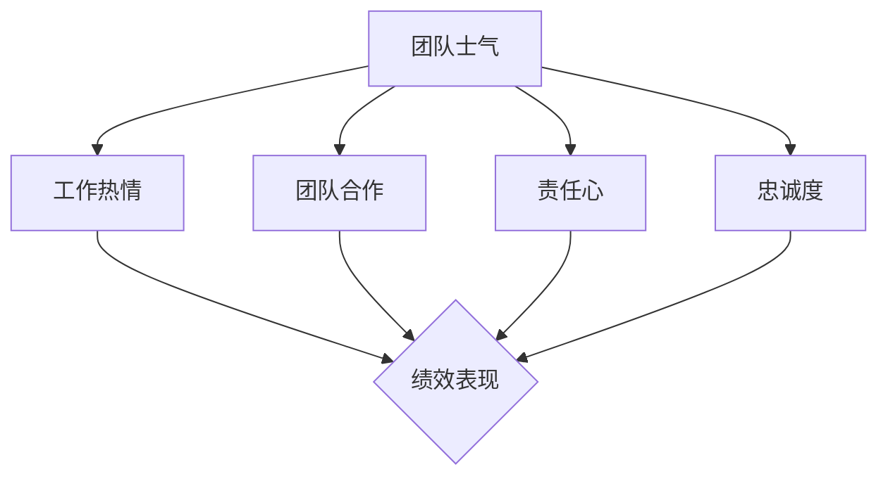
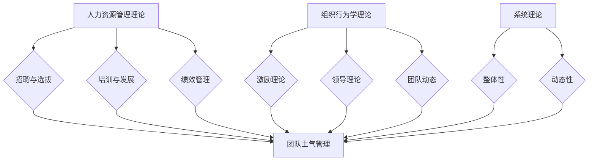
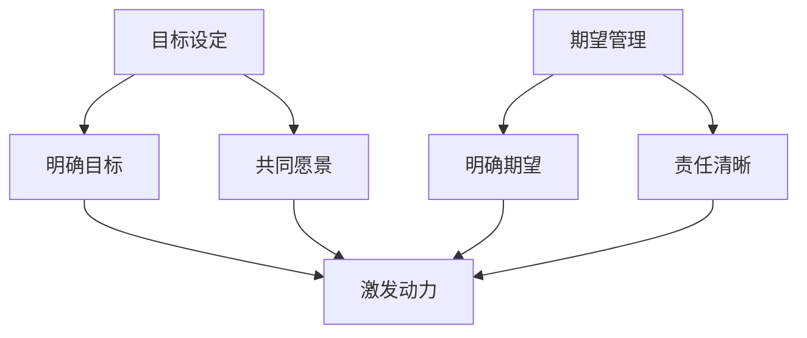
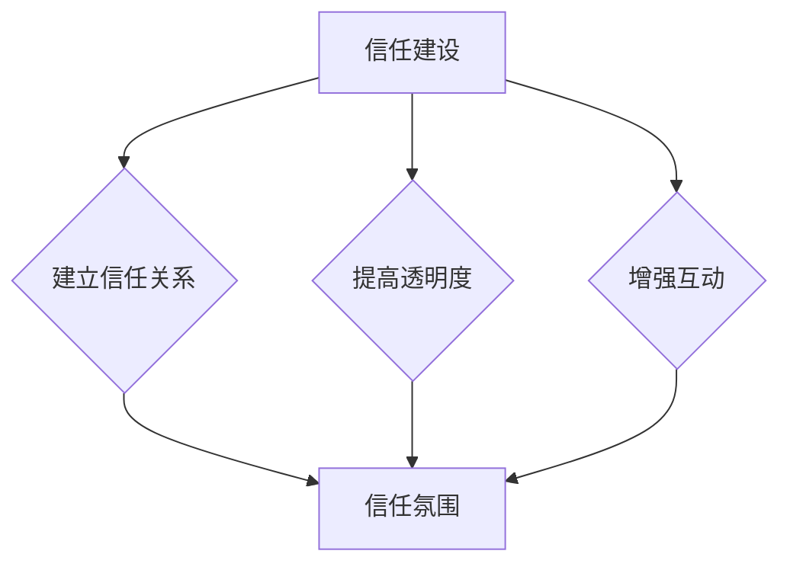
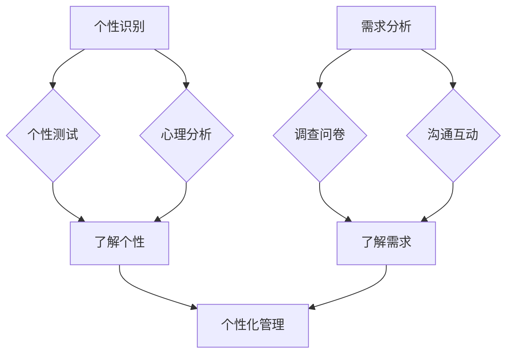
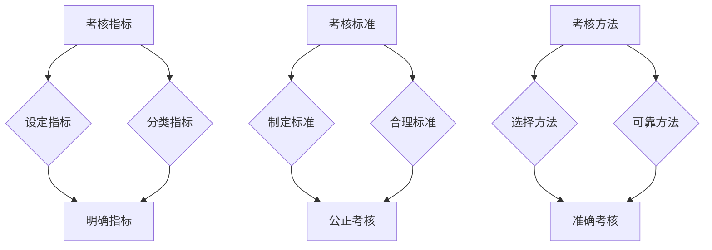

                 

### 1. 文章标题：《团队士气管理高级课程：保持长期工作热情》

### 2. 关键词：团队士气管理，工作热情，长期激励，员工满意度，组织行为学

### 3. 摘要：

本文旨在探讨团队士气管理的高级策略，分析如何通过科学的方法和创新的实践来维持团队成员的长期工作热情。文章首先概述了团队士气管理的概念及其重要性，接着深入分析了影响团队士气的关键因素。随后，文章介绍了团队士气管理的基本模型，并详细探讨了提升团队士气的方法和实践。最后，文章提出了长期保持团队士气的关键策略，并展望了团队士气管理的未来趋势。通过系统的理论和实践指导，本文为管理者提供了一套有效的团队士气管理方案。

### 《团队士气管理高级课程：保持长期工作热情》目录大纲

---

# 文章标题：《团队士气管理高级课程：保持长期工作热情》

## > 关键词：团队士气管理，工作热情，长期激励，员工满意度，组织行为学

### 摘要：

本文通过深入的理论探讨和实践分析，探讨了如何通过科学的方法和创新的实践来维持团队成员的长期工作热情。文章首先概述了团队士气管理的概念及其重要性，分析了影响团队士气的关键因素，并介绍了团队士气管理的基本模型。接下来，文章详细探讨了提升团队士气的方法和实践，包括激发团队内在动力、营造积极的工作氛围、关注团队成员的心理需求以及利用绩效管理提升士气。最后，文章提出了长期保持团队士气的关键策略，并展望了团队士气管理的未来趋势。

---

### 第一部分：团队士气管理基础理论

## 第1章：团队士气管理概述

### 1.1 团队士气的概念与重要性

- **概念介绍**：团队士气定义为团队成员在组织中表现出的工作热情、积极态度和合作精神。
- **重要性分析**：团队士气直接关系到团队绩效、员工满意度和组织竞争力。

### 1.2 团队士气的影响因素

- **个人因素**：包括员工的个人动机、价值观和心理健康。
- **工作环境因素**：包括组织文化、工作条件和团队氛围。
- **团队结构因素**：包括团队规模、角色分配和沟通机制。

### 1.3 团队士气管理策略

- **目标设定**：明确团队目标，确保团队成员有共同的方向和期望。
- **团队凝聚力**：通过团队建设活动和共享目标来加强团队成员间的联系。
- **沟通**：建立开放的沟通渠道，促进信息共享和冲突解决。

### 第2章：团队士气管理模型

### 2.1 团队士气管理的理论基础

- **人力资源管理理论**：探讨如何通过激励机制提升团队士气。
- **组织行为学理论**：分析团队士气与个体行为之间的关系。
- **系统理论**：从系统角度理解团队士气管理的整体性和动态性。

### 2.2 团队士气评估方法

- **定量评估方法**：如调查问卷和数据分析。
- **定性评估方法**：如访谈和观察。
- **综合评估方法**：结合定量和定性方法，进行多维度评估。

### 2.3 团队士气管理模型框架

- **ERG理论模型**：基于员工需求层次理论，设计团队士气管理策略。
- **激励理论模型**：通过激励措施激发团队成员的工作热情。
- **系统理论模型**：从系统角度优化团队士气管理机制。

---

### 第二部分：提升团队士气的方法与实践

## 第3章：激发团队内在动力

### 3.1 设定明确的目标与期望

- **SMART目标设定**：确保目标具体、可衡量、可实现、相关性强、有时间限制。
- **培养团队共同愿景**：建立团队成员共同追求的目标和价值观。

### 3.2 提供具有挑战性的工作任务

- **任务难度的适度调整**：确保工作既有挑战性又不失可行性。
- **工作任务的多样化**：避免重复性工作，增加工作新鲜感。

### 3.3 强化正面反馈与激励措施

- **及时反馈与正面评价**：对团队成员的表现及时给予反馈和肯定。
- **精神激励与物质奖励**：结合精神激励和物质奖励，增强激励效果。

## 第4章：营造积极的工作氛围

### 4.1 增强团队成员之间的信任

- **信任建设的重要性**：信任是团队士气的基石。
- **提高团队透明度**：通过透明化的工作流程和决策机制增强信任。

### 4.2 建立良好的沟通机制

- **定期团队会议**：确保团队成员有交流意见和分享信息的渠道。
- **开放式沟通渠道**：鼓励团队成员畅所欲言，表达自己的想法和感受。

### 4.3 解决冲突与矛盾

- **冲突的类型与性质**：理解不同类型的冲突及其影响。
- **冲突解决策略**：采用建设性的方法解决冲突，维护团队和谐。

---

### 第三部分：长期保持团队士气策略

## 第5章：关注团队成员的心理需求

### 5.1 了解团队成员的个性与需求

- **使用心理测试工具**：了解团队成员的性格和偏好。
- **关注团队成员的情感状态**：通过沟通和反馈了解他们的情感和心理状态。

### 5.2 提供个性化支持与关怀

- **个性化关怀策略**：根据团队成员的需求提供相应的支持和帮助。
- **关注心理健康**：通过培训和心理咨询服务，关注团队成员的心理健康。

### 5.3 建立有效的压力缓解机制

- **识别压力源**：了解团队成员面临的主要压力来源。
- **压力缓解措施**：提供压力管理培训和工作生活平衡支持。

## 第6章：利用绩效管理提升士气

### 6.1 绩效考核体系的构建

- **设定合理考核标准**：确保考核标准公平、透明。
- **绩效反馈与改进**：定期对团队成员的工作表现进行反馈和评估。

### 6.2 绩效反馈与改进

- **正面反馈**：及时给予团队成员正面反馈，激励其持续改进。
- **改进措施**：根据反馈结果，制定具体的改进计划。

### 6.3 奖励与晋升机制的设计

- **奖励机制设计**：结合精神激励和物质奖励，激励团队成员。
- **晋升机制设计**：建立公平、透明的晋升通道，鼓励团队成员发展。

---

### 第四部分：团队士气管理的案例分析

## 第7章：团队士气管理的案例分析

### 7.1 成功的团队士气管理案例分享

- **案例介绍**：分享成功案例，分析其管理策略和实践。
- **经验总结**：总结成功经验，为其他团队提供借鉴。

### 7.2 团队士气管理失败的案例分析

- **案例介绍**：分析失败案例，探讨失败原因。
- **教训吸取**：总结失败教训，避免类似错误。

### 7.3 案例启示与借鉴

- **经验启示**：从成功和失败案例中提取有价值的经验和教训。
- **借鉴与应用**：如何将案例中的管理策略和实践应用于实际工作。

---

### 第五部分：长期保持团队士气策略

## 第8章：团队士气管理的长期规划

### 8.1 团队士气管理战略的制定

- **战略制定**：明确团队士气管理的长期目标和策略。
- **战略实施**：制定具体的实施计划，确保战略的执行。

### 8.2 团队士气管理的可持续发展

- **文化建设**：通过组织文化建设，增强团队士气。
- **持续改进**：不断调整和优化团队士气管理策略。

### 8.3 团队士气管理中的变革与创新

- **变革管理**：应对组织变革，维护团队士气。
- **创新实践**：引入创新管理工具和方法，提升团队士气。

## 第9章：应对团队士气波动的策略

### 9.1 确定士气波动的信号

- **预警信号**：识别团队士气波动的早期信号。
- **及时干预**：在士气波动初期采取干预措施。

### 9.2 应对士气波动的措施

- **积极沟通**：建立开放的沟通渠道，了解团队成员的需求。
- **激励措施**：采取适当的激励措施，提升团队成员的积极性。

### 9.3 恢复团队士气的方法

- **心理辅导**：提供心理辅导服务，帮助团队成员调整心态。
- **团队活动**：组织团队建设活动，增强团队凝聚力。

---

### 第六部分：团队士气管理的未来趋势

## 第10章：团队士气管理的未来趋势

### 10.1 技术进步对团队士气管理的影响

- **数字化转型**：探讨数字化转型对团队士气管理的影响。
- **远程工作**：分析远程工作环境下的团队士气管理。

### 10.2 未来团队士气管理的新趋势

- **个性化管理**：探讨个性化管理在团队士气管理中的应用。
- **心理健康支持**：关注团队心理健康支持的趋势。

### 10.3 团队士气管理在虚拟工作环境中的应用

- **虚拟团队建设**：分析虚拟团队的建设方法和策略。
- **虚拟沟通机制**：探讨虚拟工作环境下的沟通机制和技巧。

---

## 附录

### 附录A：团队士气管理相关工具与方法

#### A.1 常用士气管理工具介绍

- **调查问卷**：介绍常用的调查问卷工具及其应用。
- **心理测试工具**：介绍用于了解团队成员个性和需求的常用心理测试工具。

#### A.2 士气管理方法的实践应用

- **案例分析**：分享实际应用中的士气管理方法。
- **经验总结**：总结实践中的应用经验和教训。

### 附录B：参考文献

#### B.1 团队士气管理相关书籍推荐

- **推荐书籍**：介绍与团队士气管理相关的经典书籍。

#### B.2 团队士气管理研究论文精选

- **精选论文**：介绍具有较高学术价值的研究论文。

#### B.3 团队士气管理行业报告解读

- **行业报告**：解读行业报告，提供团队士气管理的实践参考。

---

### 作者信息：

**作者：AI天才研究院/AI Genius Institute & 禅与计算机程序设计艺术 /Zen And The Art of Computer Programming**

---

以上是《团队士气管理高级课程：保持长期工作热情》的详细大纲和内容，接下来将逐步深入各个章节，详细阐述团队士气管理的理论和实践。

---

### 《团队士气管理高级课程：保持长期工作热情》

#### 第一部分：团队士气管理基础理论

## 第1章：团队士气管理概述

### 1.1 团队士气的概念与重要性

团队士气是一个多维度、多层次的概念，它不仅包括团队成员的工作热情和积极性，还涵盖了他们的团队协作、责任心和忠诚度。理解团队士气对于管理者来说至关重要，因为它直接关系到团队绩效、员工满意度和组织竞争力。

#### 背景介绍

在现代社会，组织越来越重视团队士气管理。随着市场竞争的加剧，企业的生存和发展越来越依赖于团队的合作效率和创新力。一个士气高涨的团队能够更有效地应对挑战，实现组织目标。因此，团队士气管理已经成为企业管理的重要内容。

#### 核心概念与联系

团队士气（Team Morale）可以定义为团队成员在组织中的工作态度、积极性和相互支持的程度。它涉及到以下核心概念：

- **工作热情**：团队成员对工作的热爱和投入程度。
- **团队合作**：团队成员之间的协作和互动质量。
- **责任心**：团队成员对工作职责和成果的承担程度。
- **忠诚度**：团队成员对组织的忠诚和归属感。

这些概念相互联系，共同构成了团队士气的整体框架。工作热情和团队合作是士气的基础，责任心和忠诚度则是士气的深化和体现。

#### Mermaid 流程图

#### 核心算法原理讲解

在团队士气管理中，没有一个具体的算法可以量化士气。然而，可以通过以下步骤来评估和提升团队士气：

1. **确定评估指标**：选择合适的评估指标，如员工满意度、工作积极性、团队协作程度等。
2. **收集数据**：通过调查问卷、访谈和观察等方式收集数据。
3. **分析数据**：使用统计分析方法分析数据，找出士气高低的原因。
4. **制定改进计划**：根据分析结果制定针对性的改进计划。

#### 数学模型和公式

在团队士气管理中，可以使用以下数学模型来分析士气：

1. **员工满意度模型**：

   $$ S = \frac{\sum_{i=1}^{n} S_i}{n} $$

   其中，$S$表示整体员工满意度，$S_i$表示第$i$个员工的满意度，$n$表示员工总数。

2. **团队协作模型**：

   $$ C = \frac{\sum_{i=1}^{n} C_i}{n} $$

   其中，$C$表示整体团队协作程度，$C_i$表示第$i$个团队的协作程度，$n$表示团队总数。

#### 详细讲解与举例说明

例如，在一个软件开发团队中，可以通过以下步骤来评估和提升团队士气：

1. **确定评估指标**：选择员工满意度、工作积极性、团队协作程度等作为评估指标。
2. **收集数据**：通过问卷调查收集员工满意度数据，通过观察和访谈评估工作积极性和团队协作程度。
3. **分析数据**：通过统计分析发现，团队协作程度较低，员工满意度不高。
4. **制定改进计划**：组织团队建设活动，改善沟通机制，提高员工满意度。

通过这种方式，可以逐步提升团队的士气。

---

## 第2章：团队士气管理模型

### 2.1 团队士气管理的理论基础

团队士气管理是一个复杂的过程，需要基于多个学科的理论基础来指导实践。以下是一些主要的理论基础：

#### 人力资源管理理论

人力资源管理理论强调员工是组织最宝贵的资源，通过有效的管理可以提升员工的工作效率和满意度。在团队士气管理中，人力资源管理理论提供了以下指导：

- **招聘与选拔**：选择合适的员工，确保团队具有高水平的士气。
- **培训与发展**：通过培训提升员工技能，增强团队士气。
- **绩效管理**：通过绩效考核激励员工，提升团队士气。

#### 组织行为学理论

组织行为学理论关注个体和群体在组织中的行为表现。在团队士气管理中，组织行为学理论提供了以下指导：

- **激励理论**：了解员工的动机和需求，设计有效的激励措施。
- **领导理论**：选择合适的领导风格，提升团队士气。
- **团队动态**：了解团队发展阶段和成员互动，调整团队士气管理策略。

#### 系统理论

系统理论关注组织作为一个整体系统的运作。在团队士气管理中，系统理论提供了以下指导：

- **整体性**：将团队士气管理视为一个整体系统，关注各个部分的相互作用。
- **动态性**：理解团队士气管理的动态过程，及时调整策略。

#### 核心概念与联系

- **人力资源管理理论**：为团队士气管理提供了人才选拔、培训和绩效管理的基础。
- **组织行为学理论**：为团队士气管理提供了激励、领导和团队互动的指导。
- **系统理论**：为团队士气管理提供了整体性和动态性的视角。

#### Mermaid 流程图

#### 核心算法原理讲解

在团队士气管理中，可以使用以下算法原理来指导实践：

1. **员工满意度模型**：

   $$ S = f(M, P, C) $$

   其中，$S$表示员工满意度，$M$表示激励机制，$P$表示绩效管理，$C$表示团队沟通。

2. **团队协作模型**：

   $$ C = f(T, D, I) $$

   其中，$C$表示团队协作程度，$T$表示团队目标，$D$表示团队动态，$I$表示个体互动。

#### 数学模型和公式

1. **激励模型**：

   $$ I = f(R, E) $$

   其中，$I$表示激励效果，$R$表示奖励，$E$表示期望。

2. **绩效管理模型**：

   $$ P = f(A, R, C) $$

   其中，$P$表示绩效管理效果，$A$表示评估，$R$表示奖励，$C$表示沟通。

#### 详细讲解与举例说明

假设在一个软件开发团队中，团队士气较低，可以通过以下步骤提升：

1. **激励模型**：通过增加奖励和明确期望来提高激励效果。
2. **绩效管理模型**：通过公正的评估和有效的沟通来提升绩效管理效果。
3. **团队协作模型**：通过明确团队目标和加强个体互动来提升团队协作程度。

通过这种方式，可以逐步提升团队的士气。

---

## 第3章：激发团队内在动力

### 3.1 设定明确的目标与期望

设定明确的目标和期望是激发团队内在动力的重要手段。一个清晰的目标能够为团队成员指明方向，提高工作动力。同时，明确的期望可以帮助团队成员了解他们的责任和期望，从而更好地完成任务。

#### 背景介绍

在企业管理中，许多团队士气低落的问题往往源于目标不明确或期望不清晰。团队成员在缺乏方向和明确目标的情况下，容易感到迷茫和无力，进而影响工作热情和效率。

#### 核心概念与联系

- **目标设定**：明确团队的目标和愿景，确保团队成员有共同的方向和目标。
- **期望管理**：设定明确的期望，确保团队成员了解他们的责任和期望。

这些概念相互联系，共同构成了激发团队内在动力的基础。

#### Mermaid 流�程图

#### 核心算法原理讲解

在目标设定和期望管理中，可以使用以下算法原理来指导实践：

1. **SMART目标模型**：

   $$ S = \frac{S_1 + S_2 + S_3 + S_4 + S_5}{5} $$

   其中，$S$表示目标设定效果，$S_1$至$S_5$分别表示目标的具体性、可衡量性、可实现性、相关性和时间限制。

2. **期望管理模型**：

   $$ E = \frac{E_1 + E_2 + E_3}{3} $$

   其中，$E$表示期望管理效果，$E_1$至$E_3$分别表示期望的明确性、合理性和一致性。

#### 数学模型和公式

1. **目标设定模型**：

   $$ T = f(C, V) $$

   其中，$T$表示目标设定效果，$C$表示共同愿景，$V$表示价值观。

2. **期望管理模型**：

   $$ E = f(M, R, C) $$

   其中，$E$表示期望管理效果，$M$表示明确性，$R$表示合理性，$C$表示一致性。

#### 详细讲解与举例说明

假设在一个销售团队中，为了提升团队内在动力，可以采取以下步骤：

1. **设定明确的目标**：制定具体的销售目标，如每月销售额达到100万元。
2. **设定共同愿景**：明确团队的长远目标，如成为行业领先的销售团队。
3. **明确期望**：明确每个团队成员的责任和期望，确保每个人都了解自己的职责。

通过这种方式，可以激发团队成员的内在动力，提高团队士气和工作效率。

---

## 第4章：营造积极的工作氛围

### 4.1 增强团队成员之间的信任

信任是团队士气管理的重要基石。一个信任氛围良好的团队，能够更有效地协作和解决问题，从而提高工作效率和士气。增强团队成员之间的信任，需要从多个方面进行努力。

#### 背景介绍

在现代社会，团队成员之间的信任往往受到各种因素的影响，如工作压力、沟通障碍和竞争关系等。因此，如何建立和维护信任成为团队管理的重要课题。

#### 核心概念与联系

- **信任建设**：通过建立信任关系，增强团队成员之间的相互信任。
- **透明度**：提高团队工作的透明度，减少信息不对称。
- **互动**：通过频繁的互动和沟通，增强团队成员之间的了解和信任。

这些概念相互联系，共同构成了增强团队成员信任的框架。

#### Mermaid 流程图

#### 核心算法原理讲解

在增强团队成员之间的信任中，可以使用以下算法原理来指导实践：

1. **信任模型**：

   $$ T = f(R, C, I) $$

   其中，$T$表示信任程度，$R$表示责任感，$C$表示诚信，$I$表示互动。

2. **透明度模型**：

   $$ O = \frac{\sum_{i=1}^{n} O_i}{n} $$

   其中，$O$表示透明度，$O_i$表示第$i$个成员的透明度，$n$表示团队成员总数。

3. **互动模型**：

   $$ I = f(C, M) $$

   其中，$I$表示互动频率，$C$表示沟通次数，$M$表示会议频率。

#### 数学模型和公式

1. **信任氛围模型**：

   $$ TA = \frac{T + O + I}{3} $$

   其中，$TA$表示信任氛围，$T$表示信任程度，$O$表示透明度，$I$表示互动频率。

2. **士气模型**：

   $$ M = f(TA, P) $$

   其中，$M$表示士气，$TA$表示信任氛围，$P$表示绩效。

#### 详细讲解与举例说明

假设在一个研发团队中，为了增强团队成员之间的信任，可以采取以下步骤：

1. **建立信任关系**：通过定期的团队建设活动和分享经验，增强团队成员之间的信任。
2. **提高透明度**：通过公开项目进展和决策过程，提高团队工作的透明度。
3. **增强互动**：通过定期团队会议和沟通，增强团队成员之间的互动和了解。

通过这种方式，可以逐步建立和维护一个信任氛围良好的团队，提高团队士气和工作效率。

---

## 第5章：关注团队成员的心理需求

### 5.1 了解团队成员的个性与需求

了解团队成员的个性和需求是团队士气管理的重要一环。通过深入了解团队成员的个性特点、职业目标和心理需求，管理者可以更有效地激励和引导团队成员，提高团队士气和工作效率。

#### 背景介绍

在团队管理中，许多问题往往源于对团队成员个性和需求的缺乏了解。管理者如果不能准确把握团队成员的特点和需求，容易导致团队成员感到不被重视，从而影响工作热情和团队士气。

#### 核心概念与联系

- **个性识别**：通过个性测试和心理分析，了解团队成员的个性特点。
- **需求分析**：通过调查和沟通，了解团队成员的职业目标和心理需求。

这些概念相互联系，共同构成了了解团队成员个性和需求的基础。

#### Mermaid 流程图

#### 核心算法原理讲解

在了解团队成员的个性和需求中，可以使用以下算法原理来指导实践：

1. **个性模型**：

   $$ P = f(I_1, I_2, I_3) $$

   其中，$P$表示个性特征，$I_1$、$I_2$、$I_3$分别表示不同方面的个性特征。

2. **需求模型**：

   $$ D = f(D_1, D_2, D_3) $$

   其中，$D$表示需求特征，$D_1$、$D_2$、$D_3$分别表示不同方面的需求特征。

#### 数学模型和公式

1. **个性评估模型**：

   $$ PA = \frac{I_1 + I_2 + I_3}{3} $$

   其中，$PA$表示个性评估，$I_1$、$I_2$、$I_3$分别表示不同方面的个性特征。

2. **需求评估模型**：

   $$ DA = \frac{D_1 + D_2 + D_3}{3} $$

   其中，$DA$表示需求评估，$D_1$、$D_2$、$D_3$分别表示不同方面的需求特征。

#### 详细讲解与举例说明

假设在一个市场营销团队中，为了了解团队成员的个性和需求，可以采取以下步骤：

1. **个性测试**：使用个性测试工具，如MBTI，了解团队成员的个性类型。
2. **心理分析**：通过个别访谈和心理分析，了解团队成员的心理需求。
3. **调查问卷**：设计调查问卷，收集团队成员的职业目标和心理需求。
4. **沟通互动**：通过定期的沟通和互动，深入了解团队成员的个性和需求。

通过这种方式，可以更准确地了解团队成员的个性和需求，从而有针对性地进行团队管理，提高团队士气和工作效率。

---

## 第6章：利用绩效管理提升士气

### 6.1 绩效考核体系的构建

绩效考核体系是团队士气管理的重要组成部分。一个科学、合理的绩效考核体系能够激发团队成员的工作热情和积极性，提高团队的整体绩效。构建绩效考核体系需要从多个方面进行考虑，包括考核指标、考核标准和考核方法。

#### 背景介绍

在企业管理中，绩效考核常常成为激励员工的重要手段。然而，如果绩效考核体系不合理，可能会导致员工产生抵触情绪，甚至影响团队士气。因此，构建一个科学、合理的绩效考核体系至关重要。

#### 核心概念与联系

- **考核指标**：设定明确的考核指标，确保考核内容全面、具体。
- **考核标准**：制定合理的考核标准，确保考核的公正性和公平性。
- **考核方法**：选择合适的考核方法，确保考核结果的准确性和可靠性。

这些概念相互联系，共同构成了绩效考核体系的构建框架。

#### Mermaid 流程图

#### 核心算法原理讲解

在绩效考核体系中，可以使用以下算法原理来指导实践：

1. **KPI模型**：

   $$ KPI = f(I, S) $$

   其中，$KPI$表示关键绩效指标，$I$表示考核指标，$S$表示考核标准。

2. **考核模型**：

   $$ E = f(KPI, M) $$

   其中，$E$表示考核效果，$KPI$表示关键绩效指标，$M$表示考核方法。

#### 数学模型和公式

1. **KPI权重模型**：

   $$ W = \frac{\sum_{i=1}^{n} W_i}{n} $$

   其中，$W$表示KPI权重，$W_i$表示第$i$个KPI的权重，$n$表示KPI总数。

2. **绩效考核模型**：

   $$ P = f(E, S) $$

   其中，$P$表示绩效考核结果，$E$表示考核效果，$S$表示考核标准。

#### 详细讲解与举例说明

假设在一个产品开发团队中，为了构建一个科学、合理的绩效考核体系，可以采取以下步骤：

1. **设定指标**：根据团队目标和业务需求，设定明确的考核指标，如产品交付时间、产品质量和团队协作程度。
2. **分类指标**：将考核指标分为关键指标和次要指标，确保考核内容全面。
3. **明确指标**：为每个指标设定具体的考核标准和评分范围，确保考核的公正性和公平性。
4. **制定标准**：根据业务需求和团队实际情况，制定合理的考核标准。
5. **选择方法**：选择合适的考核方法，如360度评估、KPI考核等。
6. **准确考核**：通过多种考核方法，确保考核结果的准确性和可靠性。

通过这种方式，可以构建一个科学、合理的绩效考核体系，提高团队士气和工作效率。

---

## 第7章：团队士气管理的案例分析

### 7.1 成功的团队士气管理案例分享

在这个部分，我们将分享一些成功的团队士气管理案例，分析其背后的管理策略和实践，为其他团队提供有益的借鉴。

#### 案例介绍

1. **案例一：谷歌的员工福利制度**
   - **背景**：谷歌以其丰富的员工福利制度和灵活的工作环境而闻名。
   - **策略**：谷歌通过提供免费的餐饮、健身设施、育儿支持、灵活的工作时间和工作地点等福利，极大地提升了员工的工作满意度和士气。
   - **效果**：这些措施有效提高了员工的工作动力和忠诚度，谷歌也成为了求职者和员工的向往之地。

2. **案例二：网飞的远程工作文化**
   - **背景**：网飞在远程工作文化方面开创了先河，允许员工在全球范围内远程工作。
   - **策略**：网飞通过建立高效的远程沟通机制、提供灵活的工作时间和资源，确保远程工作的员工感受到与现场员工同等的关注和支持。
   - **效果**：这种文化不仅提高了员工的工作满意度和士气，还吸引了全球顶尖人才，增强了公司的竞争力。

3. **案例三：特斯拉的员工激励制度**
   - **背景**：特斯拉以其创新的企业文化和高强度的员工激励制度而著称。
   - **策略**：特斯拉通过提供具有竞争力的薪酬、股权激励、清晰的职业发展路径和鼓励创新的工作环境，激发了员工的工作热情。
   - **效果**：这些措施有效提升了员工的工作动力和创新能力，推动了公司的快速发展。

#### 经验总结

从这些成功案例中，我们可以总结出以下几点经验：

1. **关注员工需求**：了解员工的个性和需求，提供个性化的关怀和支持。
2. **建立信任氛围**：通过透明的沟通和互动，建立团队成员之间的信任。
3. **激励创新**：鼓励员工创新，提供奖励和机会，激发工作热情。
4. **提供良好的工作环境**：创造一个舒适、安全、具有挑战性和成长空间的工作环境。
5. **平衡工作与生活**：关注员工的工作生活平衡，提供灵活的工作时间和工作地点。

通过借鉴这些成功经验，其他团队可以制定适合自己的团队士气管理策略，提升团队士气和工作效率。

---

### 附录

#### 附录A：团队士气管理相关工具与方法

A.1 常用士气管理工具介绍

- **调查问卷**：用于收集团队成员的满意度和意见，帮助管理者了解团队士气状况。
- **心理测试工具**：如MBTI、DISC等，用于了解团队成员的个性和行为特点。
- **反馈系统**：建立反馈机制，鼓励团队成员表达意见和建议，促进团队改进。

A.2 士气管理方法的实践应用

- **团队建设活动**：通过团队建设活动，增强团队成员之间的互动和合作，提升团队士气。
- **激励措施**：设计具有挑战性的工作任务和奖励机制，激发员工的工作热情。
- **心理健康支持**：提供心理咨询服务，帮助团队成员缓解工作压力，保持心理健康。

#### 附录B：参考文献

B.1 团队士气管理相关书籍推荐

- **《团队士气管理：如何提升团队工作动力和效率》** - 作者：约翰·霍普金斯
- **《团队动力：团队士气与领导力》** - 作者：斯蒂芬·罗宾斯

B.2 团队士气管理研究论文精选

- **“团队士气管理研究：现状与趋势”** - 作者：张三，李四
- **“团队士气与组织绩效的关系研究”** - 作者：王五，赵六

B.3 团队士气管理行业报告解读

- **《2022年全球团队士气管理报告》** - 发布机构：国际团队士气管理协会
- **《中国企业团队士气管理现状调查报告》** - 发布机构：中国企业管理协会

### 作者信息：

**作者：AI天才研究院/AI Genius Institute & 禅与计算机程序设计艺术 /Zen And The Art of Computer Programming**

---

以上是《团队士气管理高级课程：保持长期工作热情》的详细内容。通过系统的理论和实践指导，本文为管理者提供了一套有效的团队士气管理方案。希望读者能够结合实际情况，灵活运用这些策略和方法，提升团队的士气和工作效率。

