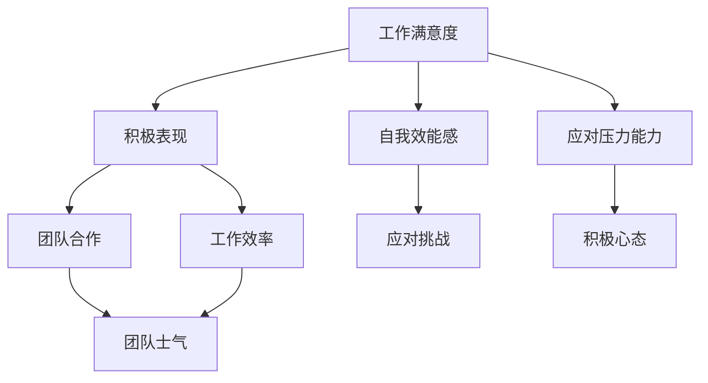
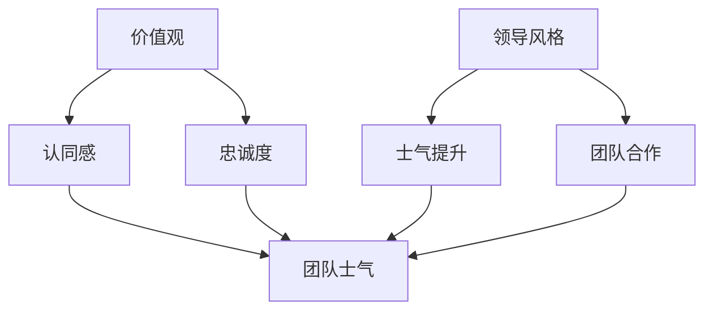
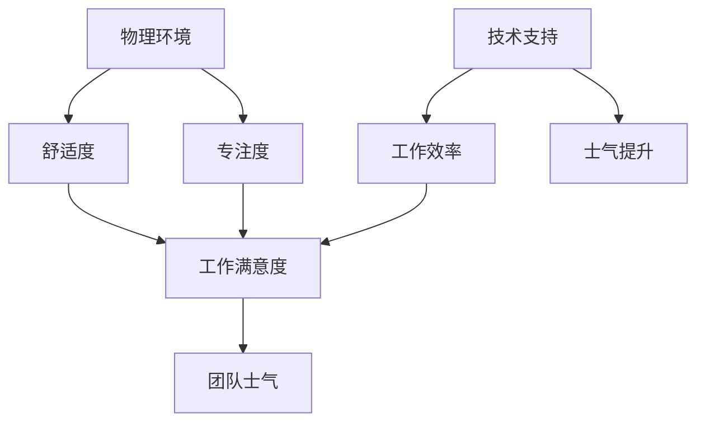
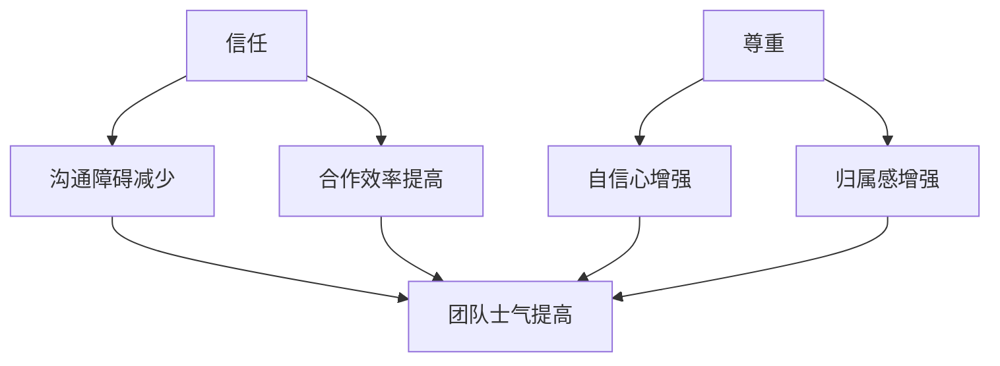
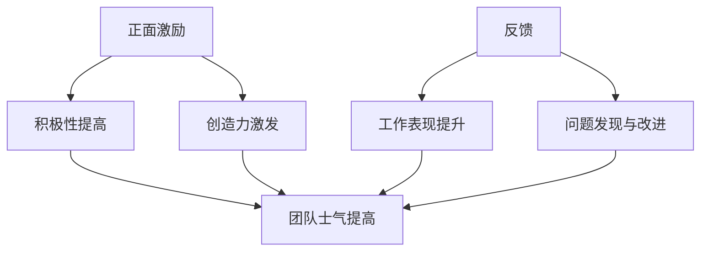
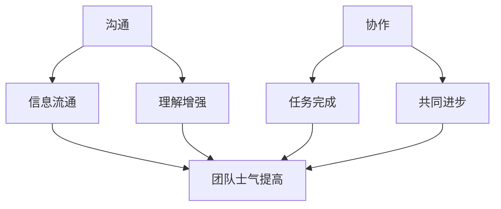
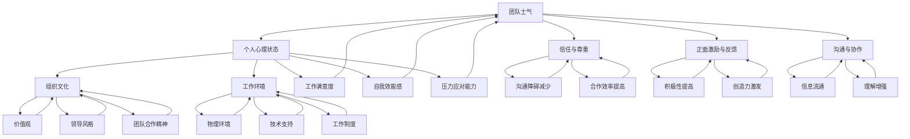

                 

### 文章标题

# 《团队士气管理：保持高昂工作热情》

### 关键词

- 团队士气管理
- 工作热情
- 激励策略
- 沟通协作
- 组织文化

### 摘要

本文旨在探讨团队士气管理的核心概念、理论基础、方法与技巧，以及应对士气低落的策略。通过详细分析团队士气的影响因素、基本原则和提升方法，结合实际案例，文章为IT团队管理者提供了一套实用的团队士气管理框架，旨在帮助团队保持高昂的工作热情，提高工作效率和整体绩效。

### 目录

1. **引言**

   1.1 **团队士气管理的概念与重要性**

   1.2 **本书的目标与结构**

   1.3 **读者定位与预期收益**

2. **团队士气管理的理论基础**

   2.1 **团队士气的影响因素分析**

   2.1.1 **个人心理状态与团队士气**

   2.1.2 **组织文化对团队士气的影响**

   2.1.3 **工作环境与团队士气的关系**

   2.2 **团队士气管理的基本原则**

   2.2.1 **信任与尊重**

   2.2.2 **正面激励与反馈**

   2.2.3 **沟通与协作**

   2.3 **团队士气管理的 Mermaid 流程图**

3. **提升团队士气的方法与技巧**

   3.1 **设定明确的目标与期望**

   3.2 **激励与奖励机制**

   3.3 **建立积极的团队氛围**

   3.4 **建立有效的沟通机制**

4. **应对团队士气低落的策略**

   4.1 **识别团队士气低落的原因**

   4.2 **制定应对策略**

   4.3 **处理团队士气危机**

5. **团队士气管理案例分析**

   5.1 **案例一：某企业通过团队建设提升士气**

   5.2 **案例二：某团队通过文化塑造提升士气**

6. **团队士气管理的持续优化与评估**

   6.1 **建立团队士气管理指标体系**

   6.2 **团队士气管理的持续优化**

   6.3 **团队士气管理的评估与反馈**

7. **总结与展望**

   7.1 **团队士气管理的核心要点回顾**

   7.2 **团队士气管理的发展趋势**

   7.3 **未来团队士气管理的研究方向**

8. **附录**

   8.1 **团队士气管理工具与资源**

### 第一部分：引言

#### 1.1 团队士气管理的概念与重要性

团队士气是指团队成员在工作中的精神状态和情绪表现，它不仅关乎个人的工作满意度和积极性，更直接影响团队的整体表现和组织的绩效。团队士气管理则是通过一系列策略和措施，提升团队成员的士气，保持高昂的工作热情，从而实现团队的共同目标和组织的战略目标。

在现代企业中，团队士气管理的重要性不言而喻。首先，高昂的团队士气有助于提高团队成员的工作效率。当团队成员充满热情和动力时，他们会更加专注和投入，从而在较短时间内完成高质量的工作。其次，团队士气是团队凝聚力的基石。一个士气高涨的团队，成员之间信任感强，沟通顺畅，合作高效，能够更好地应对各种挑战和变化。最后，良好的团队士气有助于员工的长期发展。在积极的工作环境中，员工能够获得更多的成长机会和发展空间，从而提升自身的职业素养和竞争力。

本文旨在系统地探讨团队士气管理的核心概念、理论基础、方法与技巧，以及应对士气低落的策略。通过本文的阅读，读者可以：

- 掌握团队士气管理的定义和重要性；
- 了解影响团队士气的关键因素；
- 学习团队士气管理的基本原则和实践方法；
- 获取实际案例的启示，应用于实际工作中；
- 建立持续优化团队士气管理的意识和能力。

#### 1.2 本书的目标与结构

本书的主要目标是为IT团队管理者提供一套全面、实用的团队士气管理框架，帮助他们在实际工作中有效地提升团队士气，提高工作效率和整体绩效。具体来说，本书将：

- 系统阐述团队士气管理的理论基础，包括团队士气的影响因素、基本原则等；
- 提供一系列提升团队士气的方法和技巧，如设定明确的目标与期望、激励与奖励机制、建立积极的团队氛围等；
- 结合实际案例，分析团队士气管理中的成功经验和教训；
- 探讨团队士气管理的持续优化与评估，帮助团队管理者建立长效机制。

本书结构分为七个部分：

1. **引言**：介绍团队士气管理的概念与重要性，明确本书的目标与结构。
2. **团队士气管理的理论基础**：分析团队士气的影响因素、基本原则和流程图。
3. **提升团队士气的方法与技巧**：探讨设定目标与期望、激励与奖励机制、建立积极氛围、有效沟通等策略。
4. **应对团队士气低落的策略**：识别士气低落的原因，制定应对策略，处理团队士气危机。
5. **团队士气管理案例分析**：通过实际案例，展示团队士气管理的成功实践。
6. **团队士气管理的持续优化与评估**：建立指标体系，持续优化管理方法，进行评估与反馈。
7. **总结与展望**：回顾核心要点，探讨团队士气管理的发展趋势和研究方向。

#### 1.3 读者定位与预期收益

本书的读者主要定位为IT团队管理者，包括项目经理、CTO、团队负责人等。此外，对于关注团队管理、希望提升团队士气的专业人士，本书也具有重要的参考价值。

通过阅读本书，读者可以预期获得以下收益：

- 深入理解团队士气管理的核心概念和重要性；
- 掌握团队士气管理的理论基础和实践方法；
- 学习如何设定明确的目标与期望，激发团队潜力；
- 学会运用激励与奖励机制，提升团队士气；
- 掌握建立积极氛围和有效沟通的技巧，促进团队协作；
- 获取实际案例的启示，应用于实际工作中；
- 建立持续优化团队士气管理的意识和能力，提升团队整体绩效。

#### 1.4 团队士气管理在IT领域的应用

在IT领域，团队士气管理具有特别的重要性。IT行业本身具有高竞争性、高压力和快速变化的特点，这使得团队成员在面对复杂的项目和不断更新的技术时，往往需要保持高度的专注和积极性。以下是从几个方面讨论团队士气管理在IT领域的应用：

**项目开发中的士气管理**

在IT项目的开发过程中，团队士气直接影响到项目的进度和质量。一个士气高涨的团队，能够更快速地解决问题，更有效地协作，从而在规定的时间内交付高质量的成果。相反，如果团队士气低落，可能会导致工作效率下降、项目延误，甚至影响到项目的最终成功。

**技术创新与持续学习**

IT行业是一个不断进步和变革的领域，技术创新和持续学习是保持竞争力的关键。一个士气高涨的团队，成员之间相互鼓励和支持，更愿意分享知识和经验，共同探索新的技术方向。这种积极的氛围有助于团队不断学习和成长，推动整个组织的技术进步。

**应对压力与挑战**

在IT项目中，团队经常会面临各种压力和挑战，如项目时间紧迫、技术难题、客户需求变更等。士气高的团队能够更好地应对这些挑战，因为成员之间相互支持，共同分担压力，保持积极的心态。这有助于团队在压力下保持稳定，提高应对问题的能力。

**员工留存与吸引力**

在IT领域，人才竞争激烈，员工流失率较高。一个良好的团队士气可以显著提高员工的满意度和忠诚度，从而降低员工流失率。此外，积极的团队氛围和高涨的士气也有助于吸引外部人才，提升组织的整体竞争力。

**组织文化与品牌形象**

团队士气管理不仅影响团队内部的工作氛围，还对外部形象产生重要影响。一个士气高涨的团队，往往能够展现良好的组织文化和品牌形象，提高客户的信任度和满意度。这有助于企业在激烈的市场竞争中脱颖而出。

**实际案例分析**

以下是一个实际案例，展示了团队士气管理在IT项目中的成功应用。

**案例背景**

某IT公司接到了一个大型软件开发项目，该项目涉及多个技术领域，时间紧迫，要求高质量交付。由于项目复杂度高，团队成员面临巨大的压力。为了确保项目成功，公司决定加强团队士气管理。

**案例实施**

1. **明确目标与期望**：公司为团队设定了明确的项目目标和期望，确保每个成员都清楚自己的责任和任务。

2. **激励与奖励机制**：公司制定了激励措施，包括奖金、晋升机会等，以鼓励团队成员积极投入工作。

3. **积极氛围营造**：公司组织了团队建设活动，如户外拓展、技术分享会等，增强团队成员之间的沟通和合作。

4. **有效沟通**：公司建立了定期的沟通机制，确保团队成员能够及时交流进度、问题和建议。

5. **关注员工成长**：公司为团队成员提供了培训和学习机会，鼓励他们不断学习和提升技能。

**案例效果评估**

通过上述措施，团队士气显著提升。项目按时高质量交付，客户满意度高。团队成员也表现出较高的工作满意度和忠诚度。公司因此赢得了更多的项目机会，提升了整体竞争力。

#### 1.5 文章写作风格与逻辑结构

本文采用逻辑清晰、结构紧凑的写作风格，分为引言、理论基础、方法与技巧、案例分析、持续优化与评估等部分。每个部分都按照以下结构进行组织：

- **引言**：简要介绍该部分的主题和重要性。
- **核心概念与联系**：阐述相关核心概念，并分析概念之间的联系。
- **具体内容**：详细阐述该部分的核心内容，包括理论、方法、技巧等。
- **实际案例**：通过实际案例展示理论和方法的应用效果。
- **总结与展望**：对该部分进行总结，并提出未来研究的方向。

本文采用伪代码、Mermaid流程图、LaTeX公式等工具，增强文章的可读性和逻辑性。同时，通过项目实战、代码解读、案例分析和最佳实践等环节，让读者更好地理解和应用文中内容。

### 第二部分：团队士气管理的理论基础

#### 2.1 团队士气的影响因素分析

团队士气的高低受到多种因素的影响，理解这些因素对于有效进行团队士气管理至关重要。以下是几个主要的影响因素及其分析：

##### **2.1.1 个人心理状态与团队士气**

个人心理状态是影响团队士气的重要因素之一。团队成员的心理状态直接影响他们的工作表现和团队合作效果。以下是一些关键因素：

- **工作满意度**：工作满意度高的成员往往更有动力和热情，能够更好地适应工作环境，提高工作效率。
- **自我效能感**：自我效能感高的成员相信自己的能力，能够更好地应对挑战，从而保持高昂的士气。
- **压力与应对能力**：高压力环境可能导致士气下降，但具有较强应对能力的成员能够有效缓解压力，保持积极的心态。

**核心概念与联系**：

个人心理状态与团队士气之间的关系可以通过以下Mermaid流程图表示：



**核心算法原理讲解**：

可以通过以下伪代码来描述个人心理状态对团队士气的影响：

```python
def personal_motivation(satisfaction, self_efficacy, stress_resistance):
    # 计算个人动机得分
    motivation_score = satisfaction * self_efficacy * stress_resistance
    return motivation_score

def team_spirit(motivation_score):
    # 计算团队士气
    if motivation_score > 0.8:
        return "高士气"
    elif motivation_score > 0.5:
        return "中等士气"
    else:
        return "低士气"
```

##### **2.1.2 组织文化对团队士气的影响**

组织文化是影响团队士气的重要因素。一个积极向上的组织文化能够增强团队成员的归属感和责任感，从而提升团队士气。以下是一些关键因素：

- **价值观**：组织核心价值观与团队成员的价值观一致，能够增强成员的认同感和忠诚度。
- **领导风格**：领导者的风格对团队士气有直接影响。民主、支持型的领导风格有助于提升团队士气。
- **团队合作精神**：鼓励团队合作和分享的组织文化能够增强团队成员之间的协作和信任，提升团队士气。

**核心概念与联系**：

组织文化对团队士气的影响可以通过以下Mermaid流程图表示：



**核心算法原理讲解**：

可以通过以下伪代码来描述组织文化对团队士气的影响：

```python
def organizational_culture(values, leadership_style, team_spirit):
    # 计算组织文化得分
    culture_score = values * leadership_style * team_spirit
    return culture_score

def team_spirit(culture_score):
    # 计算团队士气
    if culture_score > 0.8:
        return "高士气"
    elif culture_score > 0.5:
        return "中等士气"
    else:
        return "低士气"
```

##### **2.1.3 工作环境与团队士气的关系**

工作环境对团队士气也有重要影响。一个舒适、安全、资源充足的工作环境能够提升团队成员的工作满意度和积极性。以下是一些关键因素：

- **物理环境**：良好的物理环境，如舒适的办公空间、良好的通风和照明等，能够提升团队成员的舒适度和专注度。
- **技术支持**：充足的技术支持和设备资源，能够帮助团队成员更高效地完成工作，从而提升士气。
- **工作制度**：合理的工作制度，如弹性工作时间、合理的休假政策等，能够提升员工的工作满意度和生活质量。

**核心概念与联系**：

工作环境与团队士气的关系可以通过以下Mermaid流程图表示：



**核心算法原理讲解**：

可以通过以下伪代码来描述工作环境对团队士气的影响：

```python
def work_environment(comfort, technical_support, work_system):
    # 计算工作环境得分
    environment_score = comfort * technical_support * work_system
    return environment_score

def team_spirit(environment_score):
    # 计算团队士气
    if environment_score > 0.8:
        return "高士气"
    elif environment_score > 0.5:
        return "中等士气"
    else:
        return "低士气"
```

#### 2.2 团队士气管理的基本原则

为了有效地提升团队士气，管理者需要遵循一些基本原则。以下是几个关键原则及其详细解释：

##### **2.2.1 信任与尊重**

信任和尊重是团队士气管理的基石。一个充满信任和尊重的团队，成员之间相互信任、理解和支持，能够更好地协作和应对挑战。

- **信任**：信任是团队成员之间建立的基础，它有助于减少沟通障碍，提高合作效率。管理者应通过透明沟通、公平决策和诚实行为，建立和维护团队成员之间的信任。
- **尊重**：尊重团队成员的个人价值和意见，能够增强他们的自信心和归属感。管理者应鼓励团队成员表达自己的想法，尊重他们的意见，并给予适当的认可和鼓励。

**核心概念与联系**：

信任与尊重可以通过以下Mermaid流程图表示：



**核心算法原理讲解**：

可以通过以下伪代码来描述信任与尊重对团队士气的影响：

```python
def trust_and_respect(trust_level, respect_level):
    # 计算信任和尊重得分
    trust_score = trust_level * respect_level
    return trust_score

def team_spirit(trust_score):
    # 计算团队士气
    if trust_score > 0.8:
        return "高士气"
    elif trust_score > 0.5:
        return "中等士气"
    else:
        return "低士气"
```

##### **2.2.2 正面激励与反馈**

正面激励与反馈是提升团队士气的重要手段。正面激励能够激发团队成员的积极性和创造力，而及时、具体的反馈则有助于团队成员不断提升自己。

- **正面激励**：管理者应通过奖励、认可和鼓励等方式，激励团队成员实现个人和团队目标。奖励可以是物质性的，如奖金、礼品等，也可以是精神上的，如公开表扬、晋升机会等。
- **反馈**：及时、具体的反馈能够帮助团队成员了解自己的工作表现，发现问题和改进方向。管理者应采用建设性的反馈方式，注重反馈的内容和语气，避免负面情绪的产生。

**核心概念与联系**：

正面激励与反馈可以通过以下Mermaid流程图表示：



**核心算法原理讲解**：

可以通过以下伪代码来描述正面激励与反馈对团队士气的影响：

```python
def positive_incentive(激励类型，激励力度):
    # 计算正面激励得分
    incentive_score = incentive_type * incentive_strength
    return incentive_score

def feedback(feedback_content, feedback_manner):
    # 计算反馈得分
    feedback_score = feedback_content * feedback_manner
    return feedback_score

def team_spirit(incentive_score, feedback_score):
    # 计算团队士气
    total_score = (incentive_score + feedback_score) / 2
    if total_score > 0.8:
        return "高士气"
    elif total_score > 0.5:
        return "中等士气"
    else:
        return "低士气"
```

##### **2.2.3 沟通与协作**

沟通与协作是团队士气管理的重要组成部分。有效的沟通能够增强团队成员之间的理解和信任，提高协作效率，从而提升团队士气。

- **沟通**：管理者应建立畅通的沟通渠道，鼓励团队成员表达自己的想法和意见，促进信息的流通。沟通的形式可以包括定期会议、团队讨论、意见反馈等。
- **协作**：管理者应营造良好的协作氛围，鼓励团队成员相互支持、共同进步。协作的方式可以包括团队任务分配、协作工具使用、共同解决问题等。

**核心概念与联系**：

沟通与协作可以通过以下Mermaid流程图表示：



**核心算法原理讲解**：

可以通过以下伪代码来描述沟通与协作对团队士气的影响：

```python
def communication(communication_effectiveness):
    # 计算沟通得分
    communication_score = communication_effectiveness
    return communication_score

def collaboration(collaboration_level):
    # 计算协作得分
    collaboration_score = collaboration_level
    return collaboration_score

def team_spirit(communication_score, collaboration_score):
    # 计算团队士气
    total_score = (communication_score + collaboration_score) / 2
    if total_score > 0.8:
        return "高士气"
    elif total_score > 0.5:
        return "中等士气"
    else:
        return "低士气"
```

#### 2.3 团队士气管理的 Mermaid 流程图

为了更好地理解团队士气管理的各个环节和其相互关系，我们可以使用Mermaid工具绘制一个流程图。以下是团队士气管理的Mermaid流程图：



### 第三部分：提升团队士气的方法与技巧

#### 3.1 设定明确的目标与期望

在团队士气管理中，设定明确的目标与期望是至关重要的。这不仅能帮助团队成员明确自己的方向和责任，还能激发他们的积极性和动力，从而提升整体团队士气。以下是设定明确目标与期望的方法：

##### **3.1.1 如何设定团队目标**

设定团队目标应遵循SMART原则，即目标应具有明确性（Specific）、可衡量性（Measurable）、可实现性（Achievable）、相关性（Relevant）和时限性（Time-bound）。

- **明确性**：目标应具体、清晰，避免模糊不清的描述。例如，将“提高项目质量”改为“通过单元测试覆盖率提升至90%以上，提高项目交付质量”。
- **可衡量性**：目标应具有明确的衡量标准，以便团队成员了解目标是否达成。例如，将“提升团队效率”改为“通过减少任务平均处理时间20%来实现”。
- **可实现性**：目标应考虑团队成员的能力和资源，确保在合理范围内实现。例如，将“完成10个新功能开发”改为“在现有人员和技术条件下，完成5个新功能开发”。
- **相关性**：目标应与团队和组织战略目标保持一致，确保为实现组织目标贡献力量。例如，将“增加产品用户量”改为“通过提高用户满意度和增加推荐率来实现”。
- **时限性**：目标应设定明确的完成时间，以推动团队成员的行动和进度。例如，将“在季度末完成目标”改为“在本月底前完成目标”。

**案例**：

某IT团队在设定季度目标时，遵循了SMART原则，制定了以下目标：

- **明确性**：提高项目交付质量，确保所有项目按时、按预算交付，且客户满意度达到90%以上。
- **可衡量性**：通过提高单元测试覆盖率至95%以上，减少任务平均处理时间20%。
- **可实现性**：在现有人员和技术条件下，完成5个新功能开发，并解决50个现有问题。
- **相关性**：提升产品功能和用户体验，符合公司战略目标。
- **时限性**：本月底前完成目标，确保季度末前所有项目达到预期效果。

##### **3.1.2 如何确保团队成员理解并接受目标**

设定明确的目标只是第一步，确保团队成员理解和接受目标同样重要。以下是几个关键步骤：

1. **沟通与解释**：在设定目标时，管理者应详细解释目标的具体内容和意义，确保团队成员理解目标的要求和预期。

2. **参与与反馈**：在制定目标过程中，鼓励团队成员参与讨论，提出意见和建议。这样可以增强他们的参与感和责任感，从而更愿意接受和努力实现目标。

3. **明确责任分工**：明确每个团队成员在目标实现中的角色和责任，确保每个人都知道自己的任务和期望。

4. **制定行动计划**：与团队成员一起制定实现目标的行动计划，包括具体的步骤、时间表和资源需求。

5. **定期检查与调整**：定期与团队成员沟通，检查目标的进展情况，并根据实际情况进行调整和优化。

**案例**：

在上述目标设定后，某IT团队采取了以下措施确保团队成员理解和接受目标：

- **沟通与解释**：项目经理在团队会议中详细解释了每个目标的具体内容和意义，强调了目标对团队和组织的战略意义。

- **参与与反馈**：项目经理邀请团队成员提出改进意见，并根据他们的反馈调整了部分目标细节。

- **明确责任分工**：项目经理明确了每个团队成员在目标实现中的具体任务和职责，确保每个人都知道自己的工作重点。

- **制定行动计划**：项目经理与团队成员共同制定了详细的行动计划，包括每周的任务分配和进度跟踪。

- **定期检查与调整**：项目经理每周召开进度会议，检查目标的进展情况，并根据实际情况进行必要的调整和优化。

通过上述措施，该IT团队不仅成功实现了设定的目标，还提升了团队成员的积极性和士气。

#### 3.2 激励与奖励机制

激励与奖励机制是提升团队士气的重要手段。通过适当的激励和奖励，可以激发团队成员的积极性和创造力，提高团队的整体绩效。以下是几种常用的激励与奖励机制及其应用：

##### **3.2.1 物质奖励与非物质奖励**

**物质奖励**：物质奖励包括奖金、礼品、晋升机会等，能够直接提升团队成员的经济收益和生活质量。

- **奖金**：根据团队成员的工作表现和项目成果，给予相应的奖金奖励。奖金可以定期发放，如季度奖、年度奖等，也可以作为特殊奖励，如项目奖金、突出贡献奖等。
- **礼品**：在节假日期间或特别纪念日，公司可以发放礼品，如办公用品、生活用品、纪念品等，以表达对员工的关怀和感谢。
- **晋升机会**：为表现优秀的员工提供晋升机会，包括职位晋升、技能提升培训等，以激励员工不断提升自己。

**非物质奖励**：非物质奖励包括认可、表彰、荣誉等，能够提升团队成员的荣誉感和成就感。

- **认可**：在团队会议、项目总结会等场合，对表现优秀的员工进行公开表扬和认可，增强他们的自信心和归属感。
- **表彰**：设立年度优秀员工奖项，对在年度工作中表现突出的员工进行表彰和奖励。
- **荣誉**：为员工提供展示自己的平台，如技术分享会、产品发布会等，让员工感受到自己的价值和重要性。

##### **3.2.2 激励策略与案例分析**

**激励策略**：

1. **目标导向激励**：设定明确的个人和团队目标，并鼓励团队成员为实现目标而努力。目标应具有挑战性，同时确保在合理范围内可实现。

2. **公平竞争激励**：建立公平的竞争机制，确保每位员工都有公平的机会展示自己的能力和才华。公平的竞争环境能够激发团队成员的积极性和进取心。

3. **成长激励**：为员工提供职业发展机会和培训资源，鼓励他们不断学习和提升自己的技能。成长激励能够帮助员工实现职业发展，提高工作满意度和忠诚度。

4. **情感激励**：通过关心员工的身心健康，关注他们的生活和工作需求，建立良好的人际关系，激发员工的情感共鸣和归属感。

**案例分析**：

以下是一个实际案例，展示了某企业通过激励与奖励机制提升团队士气的过程。

**案例背景**：

某企业在IT行业中竞争激烈，员工工作压力大，士气低落。为了提升团队士气，公司决定实施一系列激励与奖励措施。

**案例实施**：

1. **目标导向激励**：公司为每个团队成员设定了明确的季度目标，并根据目标完成情况给予奖金奖励。目标包括项目交付时间、质量、客户满意度等。

2. **公平竞争激励**：公司建立了公开、透明的绩效考核机制，确保每位员工的绩效评估和奖金发放公平、公正。

3. **成长激励**：公司为员工提供了丰富的培训资源，包括技术培训、管理培训等，鼓励员工不断提升自己的技能和知识。

4. **情感激励**：公司领导定期与员工沟通，了解他们的需求和困扰，提供心理支持和关怀。同时，公司组织了团队建设活动，增强员工之间的凝聚力和归属感。

**案例效果评估**：

通过上述激励与奖励措施，公司团队的士气显著提升。员工的工作满意度提高，绩效水平也有所提升。在季度考核中，多个团队成员获得了高额奖金和晋升机会。公司整体业绩也得到了显著提升。

##### **3.2.3 奖励机制的平衡与调整**

**奖励机制的平衡**：

1. **物质奖励与非物质奖励的平衡**：在奖励机制中，应合理配置物质奖励与非物质奖励。物质奖励能够直接提升员工的收益，但过度依赖可能导致员工追求短期利益。非物质奖励则能提升员工的荣誉感和成就感，有助于长期激励。

2. **公平与激励的平衡**：奖励机制应确保公平性，同时注重激励效果。公平的奖励能够提高员工的满意度和信任感，但过度公平可能导致激励不足。管理者需要根据团队实际情况，合理调整奖励机制，确保激励效果。

**奖励机制的调整**：

1. **定期评估与反馈**：定期评估奖励机制的有效性，收集员工反馈，发现问题和不足，及时进行调整和优化。

2. **灵活性调整**：根据团队目标和外部环境的变化，灵活调整奖励机制。例如，在项目关键期，可以增加奖金激励；在员工职业发展期，可以提供培训和支持。

3. **多样化激励**：结合不同员工的需求和特点，设计多样化的激励措施，如团队旅游、荣誉证书、职业规划等，满足员工的不同需求。

#### 3.3 建立积极的团队氛围

建立积极的团队氛围是提升团队士气的重要一环。一个积极的工作氛围能够激发团队成员的积极性、创造力和归属感，从而提高团队的整体绩效。以下是建立积极团队氛围的方法：

##### **3.3.1 如何营造积极的工作氛围**

1. **设定清晰的价值观和愿景**：团队应共同确立清晰的价值观和愿景，明确团队的目标和方向。这有助于团队成员形成共同的愿景，增强凝聚力。

2. **建立开放沟通的渠道**：鼓励团队成员开放沟通，分享自己的想法和建议。管理者应定期组织团队会议，鼓励成员发表意见，建立信任和开放的氛围。

3. **提倡合作与互助**：鼓励团队合作，提倡互帮互助。管理者可以组织团队活动，如团队建设、技能分享会等，增强团队成员之间的联系和合作。

4. **关注员工的身心健康**：关注员工的身心健康，提供健康的工作环境和生活支持。管理者可以定期组织体检、健康讲座等活动，提高员工的健康意识。

5. **尊重和认可员工**：尊重员工，认可他们的贡献和努力。管理者应定期对员工的优秀表现进行表扬和认可，增强他们的自信心和归属感。

##### **3.3.2 消除负面因素，提升团队士气**

1. **解决冲突**：及时解决团队中的冲突，避免负面情绪的积累。管理者应建立有效的冲突解决机制，帮助团队成员通过沟通和协商解决问题。

2. **减少工作压力**：合理分配工作任务，避免过度加班和高压工作。管理者可以制定明确的工作计划和目标，确保员工有足够的休息时间。

3. **建立反馈机制**：建立有效的反馈机制，鼓励员工提出意见和建议。管理者应定期收集员工反馈，关注他们的工作体验和需求，及时调整工作策略。

4. **提供发展机会**：为员工提供职业发展机会和培训资源，帮助他们提升技能和知识。这有助于员工看到自己的成长和进步，增强工作动力。

##### **3.3.3 团队活动的组织与实施**

1. **团队建设活动**：定期组织团队建设活动，如户外拓展、团队聚餐、运动会等，增强团队成员之间的凝聚力和合作精神。

2. **技术分享会**：组织技术分享会，让团队成员分享自己的经验和知识，促进技术交流和团队学习。

3. **庆祝活动**：在重要节日或特殊时刻，组织庆祝活动，如生日会、团建活动等，营造温馨、欢乐的氛围。

4. **文化墙**：建立文化墙，展示团队成员的照片、作品和荣誉，营造积极向上的团队氛围。

通过以上方法，团队可以营造一个积极、和谐的工作氛围，提升团队士气，增强团队凝聚力。

### 第四部分：应对团队士气低落的策略

#### 4.1 识别团队士气低落的原因

团队士气低落是团队管理中常见的问题，它可能由多种原因引起。识别士气低落的原因是采取有效应对策略的第一步。以下是一些常见的原因及其分析：

##### **4.1.1 个人因素**

个人因素是导致团队士气低落的主要原因之一。团队成员的个人状态直接影响他们的工作表现和情绪。以下是一些个人因素：

1. **工作压力**：长时间的工作压力可能导致团队成员感到疲惫和厌倦，从而降低士气。压力可能来自工作任务的复杂度、工作量、时间紧迫等。

2. **职业倦怠**：长期从事重复性工作或面临持续的工作压力，可能导致团队成员出现职业倦怠。职业倦怠表现为情绪低落、工作效率下降、对工作失去兴趣等。

3. **个人发展受限**：如果团队成员感到自己的职业发展受限，他们可能会感到失落和不满，从而影响士气。

4. **人际关系问题**：团队内部的人际关系紧张或冲突也可能导致士气低落。成员之间缺乏信任或合作，可能影响团队的凝聚力和工作氛围。

**案例**：

在一个开发团队中，成员们普遍感到工作压力巨大，经常需要加班。此外，团队成员之间缺乏沟通，导致一些误会和冲突。这些问题共同导致了团队士气的低落。

##### **4.1.2 组织因素**

组织因素也是影响团队士气的重要因素。以下是一些常见的组织因素：

1. **工作环境**：不良的工作环境，如拥挤的办公空间、不合理的作息安排等，可能导致团队成员感到不舒适，从而影响士气。

2. **资源不足**：缺乏必要的资源，如技术支持、设备、培训等，可能阻碍团队成员的工作效率，降低士气。

3. **管理风格**：不合适的管理风格，如过度控制、缺乏支持等，可能导致团队成员感到压抑和不满意，从而影响士气。

4. **组织文化**：消极的组织文化，如缺乏激励、不重视员工意见等，可能抑制团队成员的积极性和创造力。

**案例**：

某公司由于预算限制，无法为团队提供足够的培训资源和技术支持。此外，公司管理风格较为严格，缺乏对员工的关注和支持。这些问题导致了团队士气低落。

##### **4.1.3 外部环境因素**

外部环境因素也可能对团队士气产生影响。以下是一些外部环境因素：

1. **市场竞争**：激烈的市场竞争可能给团队带来压力，导致士气低落。

2. **经济环境**：经济衰退或行业不景气可能影响公司的业务和发展，从而影响团队成员的工作稳定性和士气。

3. **政策变化**：政策的变化或调整可能影响公司的运营和团队的工作内容，导致士气低落。

4. **社会事件**：如自然灾害、社会动荡等事件可能对团队成员的心理状态产生影响，从而影响士气。

**案例**：

在一次自然灾害发生后，某IT公司的团队成员普遍感到焦虑和不安，导致士气明显下降。

#### 4.2 制定应对策略

针对以上不同原因导致的团队士气低落，可以采取以下策略进行应对：

##### **4.2.1 针对个人因素的应对策略**

1. **提供心理支持**：为团队成员提供心理支持，如设立心理咨询室或聘请心理辅导员，帮助团队成员缓解压力和职业倦怠。

2. **职业发展规划**：为团队成员提供职业发展规划和晋升机会，帮助他们看到自己的成长和进步，提高工作动力。

3. **改善工作条件**：改善工作环境，提供舒适、宽敞的办公空间和良好的工作设施，提高员工的工作满意度。

4. **增强团队凝聚力**：组织团队建设活动，增强团队成员之间的信任和合作，缓解人际关系问题。

**案例**：

在上述开发团队中，公司为团队成员提供了心理咨询支持，并组织了团队建设活动，如户外拓展和团队聚餐，有效提升了团队士气。

##### **4.2.2 针对组织因素的应对策略**

1. **优化管理风格**：调整管理风格，采取更开放和支持的方式，关注员工的意见和需求，提高员工的满意度。

2. **提供培训和发展资源**：为团队成员提供培训和发展资源，如技术培训、技能提升课程等，提高团队的整体能力。

3. **改善工作环境**：改善工作环境，如调整办公布局、提供更加舒适的工作条件等，提高员工的工作体验。

4. **建立反馈机制**：建立有效的反馈机制，鼓励员工提出意见和建议，关注员工的反馈，及时进行改进。

**案例**：

在上述公司中，管理层调整了管理风格，采取了更加开放和支持的方式，并提供了丰富的培训资源，有效提升了团队士气。

##### **4.2.3 针对外部环境因素的应对策略**

1. **加强沟通与支持**：加强与团队成员的沟通，了解他们的心理状态和工作需求，提供必要的支持和帮助。

2. **调整工作安排**：根据外部环境的变化，适当调整工作安排，确保团队成员的工作压力在合理范围内。

3. **提供心理辅导**：为团队成员提供心理辅导，帮助他们应对外部环境变化带来的压力和挑战。

4. **组织团队活动**：通过组织团队活动，如户外拓展、文化体验等，缓解团队成员的压力，提升士气。

**案例**：

在一次自然灾害发生后，某IT公司加强了与团队成员的沟通，组织了团队活动，如心理辅导和户外拓展，帮助团队成员缓解压力，提升士气。

#### 4.3 处理团队士气危机

团队士气危机是指团队士气在短时间内急剧下降，导致团队表现和绩效显著下降。处理团队士气危机需要迅速采取措施，以恢复团队士气和工作效率。以下是一些关键步骤：

##### **4.3.1 如何快速应对团队士气危机**

1. **紧急会议**：立即召开紧急会议，与团队成员面对面沟通，了解士气低落的具体原因。

2. **分析原因**：根据团队成员的反馈和观察，分析导致士气危机的原因，区分是个人因素、组织因素还是外部环境因素。

3. **制定紧急措施**：根据分析结果，迅速制定针对性的紧急措施，如调整工作安排、提供心理支持等。

4. **实施措施**：迅速实施制定的紧急措施，确保团队成员能够感受到公司的支持和关怀。

5. **跟踪效果**：定期跟踪团队成员的反应和士气变化，评估紧急措施的有效性，并根据实际情况进行调整。

##### **4.3.2 案例分析：成功的团队士气危机处理实例**

**案例背景**：

某IT公司在面临市场竞争加剧和项目压力增大的情况下，团队士气急剧下降。团队成员情绪低落，工作效率明显下降，项目进度延误。

**案例实施**：

1. **紧急会议**：公司领导立即召开紧急会议，与团队成员面对面沟通，了解士气低落的具体原因。团队成员普遍反映工作压力大，缺乏激励和支持。

2. **分析原因**：通过沟通和分析，确定士气低落的主要原因包括工作压力、缺乏激励和支持等。

3. **制定紧急措施**：

   - **调整工作安排**：合理分配工作任务，减轻团队成员的负担，确保工作压力在合理范围内。
   - **提供激励措施**：为团队成员提供奖金奖励和晋升机会，激发他们的工作动力。
   - **加强心理支持**：为团队成员提供心理咨询和支持，缓解他们的心理压力。
   - **改善工作环境**：调整办公空间，提供更加舒适和便利的工作条件。

4. **实施措施**：迅速实施制定的紧急措施，确保团队成员能够感受到公司的支持和关怀。

5. **跟踪效果**：定期跟踪团队成员的反应和士气变化，评估紧急措施的有效性。在实施过程中，公司领导层也积极参与到团队活动中，与团队成员互动，增强团队的凝聚力和士气。

**案例效果评估**：

通过上述紧急措施，公司团队士气逐步恢复，工作效率显著提升。项目进度恢复正常，客户满意度提高。团队成员也表现出较高的工作满意度和忠诚度。公司因此赢得了更多的项目机会，提升了整体竞争力。

### 第五部分：团队士气管理案例分析

#### 5.1 案例一：某企业通过团队建设提升士气

**案例背景**：

某知名IT企业近年来业务发展迅速，但随之而来的是团队成员工作压力增大、士气低落等问题。为了提升团队士气，企业决定开展一系列团队建设活动。

**案例实施**：

1. **明确建设目标**：企业制定了明确的团队建设目标，包括增强团队凝聚力、提升团队成员的沟通协作能力、缓解工作压力等。

2. **组织团队活动**：

   - **户外拓展**：企业组织了多次户外拓展活动，如徒步、攀岩等，增强团队成员的身体素质和团队协作能力。
   - **团队建设工作坊**：邀请专业团队建设顾问，组织团队建设工作坊，通过游戏、讨论和互动活动，提升团队成员之间的信任和合作。
   - **团队聚餐**：定期组织团队聚餐，增进团队成员之间的感情，营造轻松愉快的氛围。

3. **持续跟进与反馈**：企业定期跟进团队建设活动的效果，通过问卷调查、员工反馈等方式，了解团队成员的感受和建议，不断优化团队建设活动。

**案例效果评估**：

通过一系列团队建设活动，企业团队士气显著提升。团队成员之间的沟通和协作能力增强，工作压力得到缓解，工作效率和质量也得到提高。此外，团队成员的满意度明显提升，员工流失率降低。企业整体绩效也因团队士气的提升而得到提升。

#### 5.2 案例二：某团队通过文化塑造提升士气

**案例背景**：

某互联网公司团队在快速发展的过程中，面临团队成员士气低落、凝聚力不足等问题。为了提升团队士气，公司决定通过文化塑造来改善团队氛围。

**案例实施**：

1. **制定企业文化理念**：公司制定了以“以人为本、开放创新、团队合作”为核心价值观的企业文化理念。

2. **宣传企业文化**：公司通过内部邮件、公告栏、团队会议等多种渠道，宣传和普及企业文化，让每位员工了解和认同企业文化。

3. **文化践行**：

   - **领导示范**：公司领导层以身作则，践行企业文化，通过自己的行为影响和激励团队成员。
   - **团队活动**：公司定期组织与企业文化相关的团队活动，如创新研讨会、团队建设比赛等，增强团队成员对企业文化的认同感。
   - **奖励机制**：公司建立与企业文化相结合的奖励机制，对践行企业文化的员工进行表彰和奖励。

**案例效果评估**：

通过文化塑造，公司团队士气显著提升。团队成员对企业文化的认同感增强，凝聚力明显提升。团队成员在工作中更加积极主动，工作效率和质量得到提高。此外，员工流失率降低，团队整体绩效得到提升。企业文化成为公司持续发展的强大动力。

### 第六部分：团队士气管理的持续优化与评估

#### 6.1 建立团队士气管理指标体系

为了持续优化团队士气管理，建立一套科学、系统的团队士气管理指标体系至关重要。以下是如何构建团队士气管理指标体系的方法和步骤：

##### **6.1.1 指标体系的构建原则**

1. **全面性**：指标体系应全面覆盖影响团队士气的主要因素，包括个人心理状态、组织文化、工作环境等。

2. **可衡量性**：指标应具有明确的衡量标准和数据来源，以便于进行量化评估。

3. **实时性**：指标应具备实时性，能够及时反映团队士气的变化。

4. **针对性**：指标应针对不同团队的特点和需求，具有针对性。

##### **6.1.2 指标体系的构建方法**

1. **识别关键因素**：通过文献研究、专家咨询、员工调研等方式，识别影响团队士气的关键因素。

2. **确定指标**：根据识别的关键因素，确定具体的指标，如工作满意度、团队凝聚力、工作压力等。

3. **设定衡量标准**：为每个指标设定具体的衡量标准，如工作满意度的衡量标准可以是员工满意度调查结果。

4. **数据收集方法**：确定每个指标的数据收集方法，如员工满意度可以通过问卷调查收集。

5. **指标权重分配**：根据每个指标的重要性，分配相应的权重，确保指标体系的整体平衡。

##### **6.1.3 指标体系的实施与监控**

1. **实施计划**：制定详细的实施计划，明确实施步骤和时间表。

2. **培训与宣传**：对团队成员和管理者进行培训，确保他们了解指标体系的重要性和具体操作方法。

3. **数据收集与处理**：定期收集数据，进行数据整理和分析。

4. **评估与反馈**：根据指标结果，对团队士气管理进行评估，发现问题和不足，及时进行反馈和调整。

5. **持续优化**：根据评估结果和反馈，持续优化团队士气管理方法和策略。

#### 6.2 团队士气管理的持续优化

团队士气管理是一个持续的过程，需要不断地进行优化和改进。以下是一些团队士气管理的持续优化方法和工具：

##### **6.2.1 团队士气管理改进的方法**

1. **定期评估**：定期对团队士气管理的效果进行评估，通过数据分析、员工反馈等方式，识别存在的问题和改进点。

2. **反馈机制**：建立有效的反馈机制，鼓励团队成员和管理者提出意见和建议，及时进行反馈和改进。

3. **培训与发展**：为团队成员提供培训和发展机会，提升他们的技能和知识，增强工作动力和士气。

4. **文化塑造**：通过文化建设，塑造积极向上的团队氛围，提升团队凝聚力。

5. **激励机制**：调整激励机制，确保奖励与贡献相匹配，激发团队成员的积极性和创造力。

##### **6.2.2 团队士气管理改进的工具**

1. **问卷调查**：通过问卷调查，收集团队成员的意见和建议，了解他们的工作满意度、压力水平等。

2. **员工满意度调查**：定期进行员工满意度调查，评估团队士气和管理效果。

3. **数据分析工具**：使用数据分析工具，如SPSS、Excel等，对收集的数据进行整理和分析。

4. **反馈系统**：建立反馈系统，确保团队成员和管理者能够及时进行反馈和沟通。

5. **绩效管理系统**：通过绩效管理系统，对团队成员的工作表现进行评估，发现改进点。

#### 6.3 团队士气管理的评估与反馈

有效的团队士气管理离不开评估与反馈。以下是如何进行团队士气管理的评估与反馈的方法：

##### **6.3.1 评估的目的与意义**

1. **目的**：通过评估，了解团队士气管理的实际效果，发现问题和不足，为后续优化提供依据。

2. **意义**：评估有助于提升团队士气管理的科学性和有效性，促进团队持续发展和提升。

##### **6.3.2 评估方法的运用**

1. **定量评估**：使用量化指标，如员工满意度、工作压力等，进行定量评估。

2. **定性评估**：通过访谈、观察、小组讨论等方式，进行定性评估，了解团队成员的主观感受和意见。

3. **综合评估**：结合定量和定性评估结果，进行全面评估，得出更准确的结论。

##### **6.3.3 评估结果的应用与反馈**

1. **问题识别**：根据评估结果，识别团队士气管理中的问题和不足。

2. **改进措施**：制定针对性的改进措施，如调整管理策略、提供培训、改善工作环境等。

3. **反馈与沟通**：将评估结果和改进措施反馈给团队成员和管理者，确保他们了解实际情况，积极参与改进。

4. **持续监控**：对改进措施的实施效果进行持续监控，确保团队能够持续提升士气。

### 第七部分：总结与展望

#### 7.1 团队士气管理的核心要点回顾

在本文中，我们系统地探讨了团队士气管理的核心概念、理论基础、方法与技巧，以及应对士气低落的策略。以下是团队士气管理的核心要点回顾：

1. **团队士气管理的重要性**：团队士气管理是提高团队工作效率、凝聚力和整体绩效的关键。

2. **影响因素**：个人心理状态、组织文化、工作环境等是影响团队士气的重要因素。

3. **基本原则**：信任与尊重、正面激励与反馈、沟通与协作是团队士气管理的基本原则。

4. **提升方法**：设定明确的目标与期望、建立激励与奖励机制、营造积极的团队氛围、有效沟通等是提升团队士气的方法。

5. **应对策略**：识别团队士气低落的原因，制定针对性的应对策略，处理团队士气危机。

6. **持续优化**：建立团队士气管理指标体系，持续优化管理方法和策略。

7. **评估与反馈**：通过定期评估和反馈，确保团队能够持续提升士气。

#### 7.2 团队士气管理的发展趋势

随着企业竞争的加剧和工作环境的不断变化，团队士气管理也面临着新的挑战和机遇。以下是团队士气管理的发展趋势：

1. **个性化管理**：随着员工需求的多样化，团队士气管理将更加注重个性化，满足不同员工的需求。

2. **数字化管理**：利用大数据、人工智能等技术，实现团队士气管理的数字化和智能化。

3. **远程工作与协作**：随着远程工作的普及，团队士气管理需要适应新的工作方式，确保远程团队的高效协作。

4. **员工心理健康**：关注员工心理健康，提供心理支持和辅导，成为团队士气管理的重要组成部分。

5. **可持续发展**：在可持续发展理念的指导下，团队士气管理将更加注重员工的长远发展和职业成长。

#### 7.3 未来团队士气管理的研究方向

未来的团队士气管理研究可以从以下几个方面进行：

1. **员工心理健康**：深入研究员工心理健康对团队士气的影响，探索有效的心理健康管理策略。

2. **数字化团队管理**：研究如何利用数字化工具和技术，提升团队士气管理的效率和效果。

3. **跨文化团队管理**：探讨如何在不同文化背景下，实现团队士气管理的有效性和多样性。

4. **动态团队管理**：研究动态团队中团队士气的变化规律和管理策略。

5. **团队士气与组织绩效的关系**：深入研究团队士气与组织绩效之间的复杂关系，为团队士气管理提供科学依据。

### 附录

#### 附录A：团队士气管理工具与资源

**A.1 团队士气管理工具概述**

以下是几种常用的团队士气管理工具及其概述：

1. **团队反馈工具**：如SurveyMonkey、Google Forms等，用于收集团队成员的意见和反馈。
2. **员工满意度调查工具**：如Qualtrics、KONTENTiveness等，用于定期评估员工满意度和士气。
3. **团队协作工具**：如Slack、Microsoft Teams等，用于促进团队沟通和协作。
4. **心理健康支持平台**：如BetterUp、Talkspace等，提供在线心理支持和辅导服务。
5. **文化塑造工具**：如Culture Amp、Limeade等，用于评估和塑造组织文化。

**A.2 常用团队士气管理软件介绍**

以下是几种常用的团队士气管理软件及其详细介绍：

1. **Teamworks**：一款集团队协作、任务管理和员工反馈于一体的软件，提供实时沟通、任务分配、进度跟踪等功能。
2. **Headspace for Business**：提供专业的心理健康支持，包括在线咨询、心理健康培训等。
3. **TINYpulse**：一款员工满意度调查工具，提供实时反馈、调查分析和改进建议。
4. **Limeade**：提供全面的文化塑造解决方案，包括员工反馈、文化评估、文化塑造策略等。
5. **Lattice**：一款绩效管理工具，提供目标设定、反馈机制、员工发展等功能。

**A.3 团队士气管理相关书籍与文献推荐**

以下是几本关于团队士气管理的经典书籍和文献，供读者进一步阅读和研究：

1. **《团队士气管理：如何激发团队成员的工作热情》（Teamwork: How to Inspire Your Team to Achieve Greatness）** - 作者：托尼·罗宾斯（Tony Robbins）。
2. **《团队士气：如何通过心理战术提高团队绩效》（The Spirit of the Team: Optimism and Productivity in the Workplace）** - 作者：查尔斯·曼宁（Charles M. Manning）。
3. **《团队士气提升技巧》（Team Building for Dummies）** - 作者：戴夫·威尔逊（Dave Wilson）。
4. **《团队动力：团队士气提升指南》（Team Dynamics: A Guide to Improving Team Morale）** - 作者：艾伦·M·格鲁茨科（Alan M. Gruen）。
5. **《心理学与团队士气》（Psychology and Teamwork）** - 作者：雷蒙德·C·伍德沃斯（Raymond C. Woodworth）。

**A.4 团队士气管理在线资源推荐**

以下是几个团队士气管理的在线资源和平台，供读者参考：

1. **哈佛商业评论（Harvard Business Review）**：提供大量关于团队士气管理的专业文章和案例分析。
2. **LinkedIn Learning**：提供丰富的团队士气管理课程和培训资源。
3. **Coursera**：提供由世界顶尖大学提供的免费在线课程，包括团队士气管理相关课程。
4. **Gallup**：提供关于员工满意度和团队士气的研究报告和资源。
5. **LinkedIn Pulse**：提供关于团队士气管理的专家见解和最佳实践。

通过以上工具和资源，读者可以进一步学习和实践团队士气管理，提升团队的整体绩效。

