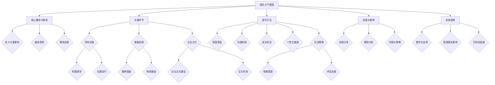

                 

### 《团队士气管理：维持高昂工作热情的秘诀》

> 关键词：团队士气管理、士气提升方法、领导风格、激励机制、企业文化

> 摘要：本文将探讨团队士气管理的重要性和方法，通过分析领导风格、激励机制和企业文化的影响，提供一系列提升团队士气的实用策略。文章旨在帮助管理者维持团队的高昂工作热情，提高团队的整体绩效。

#### 目录大纲：

----------------------------------------------------------------

### 第一部分：团队士气管理概述

#### 1. 团队士气管理的核心概念

#### 1.1. 团队士气的定义与重要性

团队士气是指团队成员在组织中的精神状态和工作热情。高昂的团队士气能够激发团队成员的积极性和创造力，从而提高团队的整体绩效。团队士气管理是管理者的一项重要任务，它关系到团队的凝聚力和成员的工作满意度。

#### 1.2. 团队士气管理的基本原则

- **尊重个体**：尊重团队成员的个人差异和意见，鼓励个体表达和参与。
- **公平公正**：在激励和评价机制中保持公平，确保团队成员感受到公正对待。
- **积极沟通**：建立有效的沟通机制，确保信息的透明和双向流动。
- **共同目标**：明确团队目标，使团队成员感受到自己的工作价值。

#### 1.3. 团队士气的影响因素

- **领导风格**：领导者的风格直接影响团队成员的士气。
- **激励机制**：合理的激励机制能够有效提升团队成员的士气。
- **企业文化**：积极向上的企业文化能够营造良好的团队氛围。

#### 2. 团队士气管理的关键环节

#### 2.1. 领导风格对团队士气的影响

- **积极领导**：领导者应以身作则，激发团队成员的积极性。
- **沟通技巧**：良好的沟通技巧有助于建立信任和团队凝聚力。

#### 2.2. 激励机制的设定与实施

- **精神激励**：通过认可和表扬激发团队成员的热情。
- **物质激励**：适当的物质激励能够提高团队成员的工作积极性。

#### 2.3. 企业文化的塑造

- **文化传承**：通过企业文化的传播和传承，提升团队士气。
- **氛围营造**：创造积极向上的团队氛围，增强团队成员的归属感。

### 第二部分：提升团队士气的方法

#### 3. 增强员工参与感和归属感

#### 3.1. 营造积极的团队氛围

- **鼓励团队成员分享经验**：通过分享会等形式，让团队成员相互学习。
- **提供团队活动**：组织团队建设活动，增强团队成员之间的联系。

#### 3.2. 建立有效的沟通机制

- **定期会议**：定期举行团队会议，确保信息畅通。
- **在线沟通工具**：利用在线工具，方便团队成员之间的交流。

#### 3.3. 提供成长机会与发展路径

- **培训与学习**：为团队成员提供培训和学习机会。
- **职业规划**：帮助团队成员制定职业规划，明确发展路径。

#### 4. 针对性激励策略

#### 4.1. 精神激励与物质激励的平衡

- **激励方式的多样性**：根据不同成员的需求，采用不同的激励方式。
- **激励措施的及时性**：及时给予激励，以保持团队成员的热情。

#### 4.2. 个性化激励策略的制定

- **了解个体差异**：根据团队成员的特点，制定个性化的激励策略。
- **关注长期激励**：注重长期激励，提升团队成员的职业发展前景。

#### 4.3. 跨部门协同与激励

- **跨部门合作**：促进跨部门之间的协作，提升团队整体绩效。
- **协同激励**：对跨部门合作给予激励，激发团队成员的积极性。

#### 5. 管理层与员工的互动

#### 5.1. 领导与员工的沟通技巧

- **倾听与反馈**：领导者应倾听员工的意见和建议，给予及时的反馈。
- **情感共鸣**：领导者应与员工建立情感联系，增强团队的凝聚力。

#### 5.2. 情绪管理在团队士气管理中的应用

- **情绪识别**：帮助团队成员识别和管理自己的情绪。
- **情绪支持**：为团队成员提供情绪支持，缓解工作压力。

#### 5.3. 处理团队冲突的策略

- **冲突识别**：及时识别和处理团队冲突。
- **协商解决**：通过协商和沟通，寻求冲突的解决方案。

### 第三部分：团队士气管理的实践与案例

#### 6. 成功的团队士气管理实践

#### 6.1. 实践分享：如何提高团队士气

- **建立信任**：通过团队活动和互动，建立团队成员之间的信任。
- **明确目标**：明确团队目标，使团队成员明确自己的工作方向。

#### 6.2. 案例分析：成功团队士气管理案例分析

- **案例1**：某公司通过培训和文化活动，成功提升了团队士气。
- **案例2**：某团队通过跨部门协作，提高了团队的整体绩效。

#### 6.3. 团队士气管理实践中的常见问题与解决策略

- **问题1**：团队成员缺乏积极性。
- **解决策略**：通过激励措施和培训，提升团队成员的积极性。

### 第四部分：团队士气管理的未来趋势

#### 7. 团队士气管理的未来趋势

#### 7.1. 数字化技术在团队士气管理中的应用

- **数据分析**：利用数据分析，了解团队成员的工作状态和需求。
- **在线协作工具**：使用在线协作工具，提高团队的沟通效率。

#### 7.2. 新兴管理理论对团队士气管理的影响

- **敏捷管理**：敏捷管理强调团队的灵活性和协作性，有助于提升团队士气。
- **人本管理**：人本管理注重员工的个人成长和需求，有助于提高团队士气。

#### 7.3. 团队士气管理的可持续发展

- **员工参与**：鼓励员工参与团队决策，提高团队士气。
- **社会责任**：承担社会责任，提升企业的社会形象，有助于提高团队士气。

### 附录

#### 附录A：团队士气管理工具与资源推荐

#### A.1. 团队士气调查工具介绍

- **问卷调查**：通过问卷调查，了解团队成员的工作状态和需求。
- **反馈系统**：建立反馈系统，及时收集和处理团队成员的意见和建议。

#### A.2. 团队士气管理相关书籍推荐

- **《团队士气管理艺术》**：介绍团队士气管理的理论和实践。
- **《领导力与团队管理》**：探讨领导风格对团队士气的影响。

#### A.3. 团队士气管理在线课程推荐

- **《团队士气管理实战课程》**：提供实用的团队士气管理技巧。
- **《领导力提升课程》**：帮助领导者提升团队士气管理能力。

#### 图1：团队士气管理架构图



#### 图2：团队士气管理中的核心算法原理（伪代码）

```latex
% 团队士气提升算法伪代码

function TeamMoraleBoost(team, leader, incentives, culture):
    % 初始化团队士气为0
    morale = 0
    
    % 根据领导风格调整士气
    morale += leaderStyleAdjustment(leader)
    
    % 根据激励机制提升士气
    morale += incentiveAdjustment(incentives)
    
    % 根据企业文化提升士气
    morale += cultureAdjustment(culture)
    
    % 根据团队参与感和归属感调整士气
    morale += participationAdjustment(team)
    
    return morale
end function

% 领导风格调整士气
function leaderStyleAdjustment(leader):
    if leader is motivating:
        return 1
    else:
        return 0
    end if
end function

% 激激励机制调整
function incentiveAdjustment(incentives):
    if incentives are effective:
        return 1
    else:
        return 0
    end if
end function

% 企业文化调整士气
function cultureAdjustment(culture):
    if culture is positive:
        return 1
    else:
        return 0
    end if
end function

% 团队参与感和归属感调整士气
function participationAdjustment(team):
    if team participation is high:
        return 1
    else:
        return 0
    end if
end function
```

### 结束语

团队士气管理是企业管理中的一项重要任务。通过本文的探讨，我们了解了团队士气管理的核心概念、关键环节和提升方法。在实际管理过程中，管理者应根据团队的具体情况，灵活运用这些方法，提高团队士气，从而提升团队的整体绩效。希望本文能为您的团队士气管理提供有益的启示。作者：AI天才研究院/AI Genius Institute & 禅与计算机程序设计艺术/Zen And The Art of Computer Programming

---

#### 第一部分：团队士气管理概述

#### 1. 团队士气管理的核心概念

团队士气管理，作为一个企业管理的关键领域，其实质在于通过一系列策略和措施，提升团队成员的工作热情和积极性。高昂的团队士气能够促进团队成员之间的协作，激发创新思维，提高工作效率，从而实现团队的目标。因此，团队士气管理不仅关乎个体的心理健康和工作状态，更影响到整个团队的凝聚力和绩效。

团队士气管理涉及多个方面的内容，包括团队士气的基本概念、核心原则、关键环节以及提升方法等。首先，团队士气的基本概念是理解和管理团队士气的基础。团队士气是指团队成员在组织中的精神状态和工作热情，它是团队文化的重要组成部分。团队士气的高低直接影响到团队成员的工作表现和团队的整体绩效。

其次，团队士气管理的基本原则是指导管理者在提升团队士气过程中的基本理念和方法。基本原则包括尊重个体、公平公正、积极沟通和共同目标等。尊重个体意味着管理者应充分认识到每个团队成员的个性和需求，给予他们足够的尊重和关注。公平公正是团队士气管理的重要保障，管理者应在激励和评价机制中保持公正，确保团队成员感受到公正对待。积极沟通则是提升团队士气的重要手段，通过有效的沟通，管理者可以及时了解团队成员的需求和问题，并采取相应的措施。共同目标则是团队士气管理的核心，明确团队目标并确保每个成员都明确自己的工作方向和贡献，有助于提升团队成员的归属感和责任感。

接下来，团队士气管理的关键环节是具体实施团队士气管理策略的重要步骤。这些关键环节包括领导风格、激励机制和企业文化的塑造等。领导风格对团队士气有着直接的影响，一个积极、激励性的领导风格能够激发团队成员的积极性和创造力。激励机制则是提升团队士气的重要手段，通过合理的精神和物质激励，可以增强团队成员的工作动力和满意度。企业文化的塑造则是团队士气管理的长期任务，一个积极向上的企业文化能够营造良好的团队氛围，增强团队成员的归属感和认同感。

综上所述，团队士气管理是一个复杂而重要的领域，涉及多个层面的内容。通过理解团队士气管理的核心概念和基本原则，管理者可以更好地把握团队士气管理的方向和方法。而在具体实施过程中，通过关注领导风格、激励机制和企业文化的塑造，管理者可以有效地提升团队士气，促进团队的整体发展。因此，团队士气管理不仅是企业管理者的一项重要职责，也是提升团队绩效和实现组织目标的关键途径。

---

#### 1.1. 团队士气的定义与重要性

团队士气，作为一个抽象却极其重要的概念，其定义和内涵在不同的组织和管理理论中有着多样化的解释。从广义上讲，团队士气是指团队成员在组织环境中的精神状态和工作热情。具体而言，它包括了团队成员的情感态度、动机水平、工作满意度和参与感等多个方面。

团队士气并非一种单一的情感状态，而是一个多维度的概念。它不仅涵盖了个体的积极情绪和动机，还包括了团队成员之间的相互支持和协作氛围。一个高士气的团队往往表现出更高的工作投入度、更好的团队合作精神和更高的创新能力。因此，团队士气不仅仅是个体层面的心理状态，更是团队整体表现和绩效的关键因素。

在组织中，团队士气的重要性不可低估。首先，高昂的团队士气能够显著提升工作效率。当团队成员充满热情和动力时，他们更愿意投入时间和精力，高效地完成任务。这种高效的工作状态有助于缩短项目周期，提高产出质量，从而增强组织的竞争力。

其次，团队士气直接影响到团队成员的工作满意度。一个士气高昂的团队，成员之间相互支持，工作环境和谐，个体感受到自己的努力和贡献被认可和重视。这种良好的工作氛围有助于提高员工的工作满意度，减少员工流失率，提高员工的忠诚度和长期留存率。

此外，团队士气对团队的凝聚力和合作精神也有着显著的促进作用。高士气团队的成员往往具有更强的归属感和认同感，他们更愿意为了共同的目标而努力，更愿意在团队中扮演积极的角色。这种高度的合作精神不仅有助于团队目标的实现，还能促进团队成员之间的情感交流和人际关系的发展。

最后，团队士气对组织的整体绩效有着深远的影响。一个士气高昂的团队能够更有效地应对外部挑战，更迅速地适应变化，更具创新性和灵活性。这种团队精神不仅能够提升组织的运营效率，还能为组织带来持续的竞争优势。

总之，团队士气是组织管理中不可忽视的重要方面。通过提升团队士气，管理者能够激发团队成员的潜力，提高工作效率，增强团队凝聚力，从而实现组织的战略目标和长期发展。因此，对团队士气进行有效的管理和提升，是每个管理者都应关注的重要任务。

---

#### 1.2. 团队士气管理的基本原则

在团队士气管理中，基本原则是确保管理者能够有效地提升团队士气，并实现组织目标的基石。这些基本原则包括尊重个体、公平公正、积极沟通和共同目标等，每一个原则都有其独特的价值和重要性。

首先，**尊重个体**是团队士气管理的基础。每个团队成员都有其独特的个性和需求，管理者应充分认识到这一点，并在日常管理中体现对个体的尊重。这包括尊重团队成员的意见和决策，关注他们的个人发展，并在工作中给予他们适当的自主权。通过尊重个体，管理者能够增强团队成员的归属感和认同感，使他们感受到自己在团队中的价值和重要性。这种情感上的认同不仅能够提升士气，还能促进团队成员之间的信任和合作。

其次，**公平公正**是团队士气管理的重要保障。在团队中，公平公正体现在多个方面，如激励机制的设定、工作分配的合理性、评价标准的透明性等。当团队成员感受到组织内部的公平和公正时，他们会更加信任管理层，并对组织产生更强的忠诚度。反之，不公平的现象容易导致团队内部的不满和冲突，进而影响团队士气。因此，管理者应在激励机制和工作评价中坚持公平公正，确保每个团队成员都能公平地分享组织的资源和成果。

**积极沟通**是提升团队士气的关键手段。有效的沟通能够确保信息在团队中的透明和准确传递，使团队成员能够及时了解工作动态和任务要求。此外，积极沟通还有助于建立团队内部的信任和协作氛围。管理者应鼓励团队成员之间的开放性沟通，提供一个安全、开放的沟通环境，使成员能够自由表达意见和建议。通过定期的团队会议、一对一沟通、反馈机制等方式，管理者可以及时了解团队成员的需求和问题，并采取相应的措施予以解决。这种积极的沟通不仅有助于提升团队士气，还能提高团队的工作效率和创新能力。

最后，**共同目标**是团队士气管理的重要驱动力。一个明确的、共同的团队目标能够激发团队成员的积极性和动力，使他们更加专注于实现团队目标。管理者应确保团队成员对团队目标有清晰的认识，并在工作中不断强化这一目标。通过制定具体的行动计划和阶段性目标，管理者可以引导团队成员朝着共同目标努力，同时也能够提高他们的工作满意度和成就感。当团队成员感受到自己的工作与团队目标紧密相连时，他们会更加投入和积极，从而提升整体团队士气。

综上所述，团队士气管理的基本原则是管理者在提升团队士气过程中应遵循的基本理念和方法。通过尊重个体、公平公正、积极沟通和共同目标等原则，管理者可以有效地激发团队成员的潜力，提升团队士气，实现组织的战略目标。因此，这些基本原则不仅是团队士气管理的核心，也是组织长期发展的关键。

---

#### 1.3. 团队士气的影响因素

团队士气的高低受到多种因素的影响，其中领导风格、激励机制和企业文化是三大核心因素，这些因素相互交织，共同影响着团队士气的形成和变化。

首先，**领导风格**对团队士气有着直接且深远的影响。领导者的风格决定了团队成员的工作氛围和态度。一个积极、激励性的领导风格能够激发团队成员的积极性和创造力，使他们更加愿意投入工作并实现团队目标。例如，民主型领导风格注重团队成员的参与和意见，能够增强团队成员的归属感和责任感，从而提升团队士气。相反，专制型领导风格可能会压制团队成员的创造力和自主性，导致士气低落。因此，领导者应通过提高自身的沟通技巧、建立信任关系和鼓励创新等方式，塑造积极的领导风格，以提升团队士气。

其次，**激励机制**是团队士气的重要驱动力。激励机制包括精神激励和物质激励两种形式。精神激励主要通过认可和奖励团队成员的成就和努力，增强他们的工作动力和满意度。例如，定期举行表彰大会、颁发荣誉称号、开展团队活动等方式，可以有效提升团队成员的士气。物质激励则通过提供薪酬、奖金、晋升机会等物质奖励，来激励团队成员的工作积极性。合理的激励机制不仅能激发团队成员的工作热情，还能提高他们的工作满意度。然而，激励机制的设计应充分考虑个体差异，避免过度依赖物质激励，以保持团队士气的高涨。

最后，**企业文化**在团队士气管理中扮演着关键角色。企业文化是指组织内部的价值观、信念和行为准则，它影响着团队成员的行为和态度。一个积极向上的企业文化能够营造良好的团队氛围，增强团队成员的归属感和认同感，从而提升团队士气。例如，强调团队合作、创新和持续学习的企业文化，能够激发团队成员的积极性和创造力。而消极的企业文化，如官僚作风、内部竞争和缺乏信任，则可能导致团队士气低落。因此，管理者应注重企业文化的建设，通过树立榜样、传递正能量和优化组织氛围等方式，塑造积极向上的企业文化。

综上所述，领导风格、激励机制和企业文化是影响团队士气的重要因素。一个积极、激励性的领导风格，合理的激励机制和积极向上的企业文化，共同作用，能够提升团队士气，促进团队的健康发展。因此，管理者应高度重视这些因素，通过不断优化和改进，打造一个士气高昂的团队。

---

#### 2. 团队士气管理的关键环节

在团队士气管理中，关键环节的设定和有效运作是确保团队士气持续高涨的重要保障。这些关键环节包括领导风格、激励机制和企业文化，每一个环节都对团队士气有着至关重要的影响。

首先，**领导风格**是团队士气管理的重要一环。领导者的风格直接影响团队成员的情绪和行为。一个积极、激励性的领导风格能够激发团队成员的积极性和创造力，从而提升团队士气。例如，民主型领导风格鼓励团队成员参与决策，增强他们的归属感和责任感。此外，领导者的沟通技巧也是关键，良好的沟通能够建立信任，减少误解和冲突，营造和谐的团队氛围。因此，领导者应通过开放性沟通、倾听团队成员的意见和建议、及时反馈等方式，建立积极的领导风格。

其次，**激励机制**是提升团队士气的重要手段。激励机制包括精神激励和物质激励两种形式。精神激励主要通过认可和奖励团队成员的成就和努力，增强他们的工作动力和满意度。例如，定期举行表彰大会、颁发荣誉称号、开展团队活动等方式，可以有效提升团队成员的士气。物质激励则通过提供薪酬、奖金、晋升机会等物质奖励，来激励团队成员的工作积极性。然而，激励机制的设计应充分考虑个体差异，避免过度依赖物质激励，以保持团队士气的高涨。

最后，**企业文化**是团队士气管理中的核心要素。企业文化是指组织内部的价值观、信念和行为准则，它影响着团队成员的行为和态度。一个积极向上的企业文化能够营造良好的团队氛围，增强团队成员的归属感和认同感，从而提升团队士气。例如，强调团队合作、创新和持续学习的文化，能够激发团队成员的积极性和创造力。而消极的企业文化，如官僚作风、内部竞争和缺乏信任，则可能导致团队士气低落。因此，管理者应注重企业文化的建设，通过树立榜样、传递正能量和优化组织氛围等方式，塑造积极向上的企业文化。

在具体实施过程中，管理者应综合考虑领导风格、激励机制和企业文化这三个关键环节，以实现团队士气管理的目标。例如，领导者可以通过定期与团队成员沟通，了解他们的需求和意见，及时调整领导风格。在激励机制方面，管理者可以设计多样化的激励方案，既包括物质奖励，也涵盖精神激励，以满足不同成员的需求。在企业文化建设方面，管理者可以通过组织团队建设活动、推广企业价值观等方式，营造积极向上的团队氛围。

综上所述，领导风格、激励机制和企业文化是团队士气管理的关键环节。通过优化和改进这些环节，管理者可以有效地提升团队士气，促进团队的健康发展。因此，管理者应高度重视这些环节，并在实际管理过程中不断实践和完善，以打造一个士气高昂的团队。

---

#### 2.1. 领导风格对团队士气的影响

领导风格对团队士气的影响是显而易见的，不同类型的领导风格会带来不同的团队氛围和士气。以下是几种主要的领导风格及其对团队士气的影响：

**1. 民主型领导风格**

民主型领导风格注重团队成员的参与和意见，鼓励开放的沟通和团队合作。在这种领导风格下，团队成员能够感受到他们的声音被听取和尊重，这有助于增强他们的归属感和责任感。具体表现为：

- **提高团队士气**：团队成员参与决策，增加了他们的责任感和参与感，士气自然高涨。
- **增强团队凝聚力**：团队成员之间通过沟通和合作，建立起深厚的信任和友谊，团队凝聚力显著增强。
- **促进创新和创造力**：民主型领导风格鼓励创新和尝试，团队成员敢于提出新想法，这有助于团队的持续进步。

**2. 专制型领导风格**

专制型领导风格则强调领导者的权威和决策的集中。在这种风格下，团队成员的参与度较低，他们往往按照领导的指示行事。具体表现为：

- **降低团队士气**：团队成员缺乏自主性和决策权，容易感到被忽视和缺乏成就感，士气容易低落。
- **减少团队凝聚力**：团队成员之间缺乏交流和合作，信任度较低，团队凝聚力较差。
- **抑制创新和创造力**：专制型领导风格往往对创新和尝试持保守态度，这可能会抑制团队成员的创造力和积极性。

**3. 参与型领导风格**

参与型领导风格是民主型领导风格的一种变体，它更加注重团队成员的参与和反馈。参与型领导者不仅关注团队成员的工作表现，还关注他们的个人发展和职业规划。具体表现为：

- **提升团队士气**：参与型领导鼓励团队成员提出建议和反馈，使他们感受到自己的意见被重视，士气得到提升。
- **增强个人成长和职业发展**：参与型领导关注团队成员的职业规划，提供发展机会和资源，有助于提高团队成员的工作满意度和忠诚度。
- **促进团队合作**：通过鼓励团队成员参与决策和项目，参与型领导能够促进团队成员之间的协作和互助。

**4. 支持型领导风格**

支持型领导风格强调领导者对团队成员的支持和帮助。在这种风格下，领导者不仅关注团队成员的工作表现，还关心他们的个人生活和心理健康。具体表现为：

- **提升团队士气**：支持型领导提供情感支持和资源帮助，使团队成员感受到关怀和安全感，士气提升。
- **增强心理健康和工作满意度**：支持型领导关注团队成员的身心健康，帮助他们应对工作压力，提高工作满意度。
- **增强团队凝聚力**：通过提供心理支持和资源帮助，支持型领导能够增强团队成员之间的情感联系，提高团队凝聚力。

综上所述，不同的领导风格对团队士气有着显著的影响。民主型领导风格和支持型领导风格通常能够提升团队士气，增强团队凝聚力和创新力，而专制型领导风格则可能导致士气低落和团队分裂。因此，管理者应根据团队的具体情况，选择和运用合适的领导风格，以实现团队士气管理的最佳效果。

---

#### 2.2. 激励机制的设定与实施

激励机制是提升团队士气的关键手段之一，它通过提供精神激励和物质激励来激发团队成员的工作动力和积极性。有效的激励机制能够确保团队成员感受到自己的努力被认可和回报，从而提高工作满意度和绩效。

**1. 精神激励**

精神激励是通过认可、表扬和奖励等方式来激发团队成员的工作热情和积极性。具体方法包括：

- **表扬和认可**：领导者应定期对团队成员的出色表现进行表扬和认可，可以通过口头表扬、电子邮件、内部通讯等方式传递。这种即时反馈能够增强团队成员的自信心和成就感。
- **表彰大会**：定期举行表彰大会，对在项目中表现突出的成员进行表彰，颁发荣誉证书或奖项。这种公开的表彰能够提高团队成员的荣誉感和归属感。
- **团队活动**：组织团队建设活动，如团建旅游、团队竞赛等，增强团队成员之间的互动和信任，提升团队士气。

**2. 物质激励**

物质激励是通过提供薪酬、奖金、晋升机会等物质奖励来激励团队成员。具体方法包括：

- **薪酬激励**：根据团队成员的工作表现和贡献，提供具有竞争力的薪酬待遇。通过薪酬激励，确保团队成员感受到自己的付出得到公正的回报。
- **奖金激励**：设立项目奖金或绩效奖金，对在特定项目中表现优秀的团队成员进行奖励。这种奖励能够激发团队成员在项目中更加努力工作。
- **晋升机会**：提供晋升通道，使团队成员看到职业发展的前景。通过晋升激励，鼓励团队成员不断提升自己的能力和业绩。

**3. 精神激励与物质激励的平衡**

在设定激励机制时，应平衡精神激励和物质激励，以满足不同成员的需求和期望。以下是一些平衡建议：

- **多样化激励方式**：根据团队成员的特点和需求，设计多样化的激励方式。例如，对于重视职业发展的成员，可以提供晋升机会和培训资源；对于注重工作生活平衡的成员，可以提供弹性工作时间和福利待遇。
- **个性化激励**：针对不同成员的个性化需求，制定个性化的激励策略。例如，对于特别优秀的成员，可以给予更高的奖金或更快的晋升机会；对于新入职的成员，可以提供培训指导和职业发展规划。
- **即时反馈**：确保激励措施能够及时地传递给团队成员。例如，在项目完成后立即进行奖金发放，或者在团队成员表现突出时及时给予表扬和认可。

总之，有效的激励机制是提升团队士气的重要手段。通过合理的精神激励和物质激励，管理者能够激发团队成员的潜力，提高工作满意度和绩效，从而实现团队的长期发展。

---

#### 2.3. 企业文化的塑造

企业文化是团队士气管理的核心要素之一，它不仅影响着团队成员的行为和态度，还决定了团队的整体氛围和工作效率。一个积极向上的企业文化能够激发团队成员的创造力和团队合作精神，从而提升团队士气。以下是企业文化对团队士气的影响以及如何塑造积极的企业文化。

**企业文化对团队士气的影响**

1. **增强归属感和认同感**：一个积极向上的企业文化能够使团队成员感受到自己是组织的一部分，增强他们的归属感和认同感。这种情感上的认同感能够提升团队成员的工作热情和投入度，从而提高团队士气。

2. **促进团队合作精神**：企业文化中的价值观和理念能够引导团队成员之间的互动和行为。例如，强调团队合作、共享和互帮互助的企业文化能够促进团队成员之间的合作，提高团队的凝聚力和工作效率。

3. **激励创新和进步**：积极的企业文化通常鼓励创新和尝试，使团队成员敢于挑战现状，勇于尝试新方法。这种创新氛围能够激发团队成员的创造力和积极性，从而提升团队士气。

4. **提升工作满意度**：企业文化中的价值观和理念影响着团队成员的工作体验和满意度。例如，尊重员工、提供公平竞争机会的企业文化能够提高团队成员的工作满意度和忠诚度。

**如何塑造积极的企业文化**

1. **明确核心价值观**：组织应明确其核心价值观，并确保这些价值观被全体成员所认同和遵循。这些核心价值观可以是团队合作、创新、诚信、客户至上等，它们将成为企业文化建设的基石。

2. **领导者的示范作用**：领导者是企业文化塑造的关键人物，他们应通过自身的言行示范，将核心价值观融入到日常工作中。领导者的行为将直接影响团队成员的行为和态度，从而塑造积极的企业文化。

3. **内部沟通与交流**：组织应建立有效的内部沟通机制，鼓励团队成员之间的交流和反馈。通过定期的团队会议、工作坊和培训活动，组织可以加强团队成员之间的互动，促进企业文化的传播和传承。

4. **认可与奖励**：组织应通过认可和奖励制度，鼓励团队成员践行企业文化。例如，设立“企业文化之星”奖项，表彰那些在工作中积极践行企业文化价值观的团队成员。这种认可和奖励能够强化企业文化的影响力。

5. **持续优化与改进**：企业文化不是一成不变的，组织应根据外部环境和内部需求的变化，不断优化和改进企业文化。例如，通过员工满意度调查、企业文化研讨会等方式，了解团队成员对企业文化的看法和建议，并采取相应的改进措施。

总之，企业文化的塑造是提升团队士气的重要手段。通过明确核心价值观、领导者的示范作用、内部沟通与交流、认可与奖励以及持续优化与改进，组织可以塑造一个积极向上的企业文化，从而提升团队成员的工作热情和绩效。

---

#### 3.1. 营造积极的团队氛围

营造积极的团队氛围是提升团队士气的重要方法之一。一个充满活力、和谐、信任和合作的团队氛围能够显著提高团队成员的工作积极性、创造力和满意度。以下是几个关键步骤和具体方法来营造积极的团队氛围：

**1. 创造良好的物理环境**

- **舒适的工作环境**：为团队成员提供一个舒适的工作环境，包括适宜的照明、通风、温度和噪音控制等。一个舒适的工作环境能够减少疲劳和压力，提高工作效率。
- **开放式的办公空间**：开放式办公空间有助于促进团队成员之间的交流和合作，增强团队凝聚力。同时，它也能够减少物理隔阂，提高团队的透明度和信任感。

**2. 建立信任和尊重的文化**

- **鼓励开放沟通**：鼓励团队成员在团队内部进行开放、真诚的沟通，分享意见和建议。领导者应成为沟通的桥梁，确保信息的透明和双向流动。
- **尊重个体差异**：尊重团队成员的个性和需求，鼓励他们发挥自己的优势。通过承认和赞赏每个人的贡献，增强团队成员的归属感和认同感。

**3. 提供支持和激励**

- **及时反馈和认可**：对团队成员的工作表现给予及时反馈和认可，增强他们的自信心和动力。领导者应通过表扬、奖励和晋升等方式，激励团队成员持续改进和追求卓越。
- **提供成长机会**：为团队成员提供培训和发展机会，帮助他们提升技能和知识。这种投资不仅能够提高团队成员的职业素养，还能增强他们对组织的忠诚度和满意度。

**4. 组织团队建设活动**

- **定期团建活动**：通过组织团队建设活动，如团队拓展训练、团建旅游、体育比赛等，增强团队成员之间的情感联系和团队合作精神。这些活动能够打破团队成员之间的隔阂，建立深厚的信任和友谊。
- **庆祝团队成就**：在团队取得重要成就时，及时组织庆祝活动，如团队聚餐、表彰大会等。这些活动能够增强团队成员的荣誉感和归属感，提升团队士气。

**5. 培养积极向上的企业文化**

- **传递正能量**：通过内部通讯、会议和培训等活动，传递积极向上的信息和价值观。领导者应成为正能量的传播者，鼓励团队成员面对困难和挑战时保持乐观和积极。
- **鼓励创新和尝试**：鼓励团队成员勇于创新和尝试新方法，创造一个包容失败、鼓励学习的企业文化。这种文化能够激发团队成员的创造力和积极性。

综上所述，营造积极的团队氛围是提升团队士气的重要方法。通过创造良好的物理环境、建立信任和尊重的文化、提供支持和激励、组织团队建设活动和培养积极向上的企业文化，管理者可以有效地营造一个充满活力、和谐和信任的团队氛围，从而提升团队的整体绩效和士气。

---

#### 3.2. 建立有效的沟通机制

建立有效的沟通机制是提升团队士气和管理效率的关键。有效的沟通不仅能够确保团队成员之间信息的透明和准确传递，还能促进团队协作和减少冲突。以下是如何建立和优化团队沟通机制的几个关键步骤：

**1. 明确沟通目标**

- **设定清晰的沟通目标**：在团队内部明确沟通的具体目标和预期成果，确保所有成员都了解沟通的目的和重要性。例如，在项目启动时，可以制定详细的沟通计划，明确每次会议的目的、内容和议程。

**2. 选择合适的沟通工具**

- **利用多种沟通工具**：根据不同的沟通需求和场景，选择合适的沟通工具。例如，电子邮件适用于正式、详细的沟通，而即时通讯工具如Slack或Microsoft Teams则适合快速、简短的交流。
- **优化沟通渠道**：确保沟通渠道的多样性和灵活性，满足团队成员的沟通需求。例如，除了传统的面对面会议和电子邮件外，还可以使用视频会议工具、协作平台和项目管理工具，提高沟通的效率和质量。

**3. 制定沟通计划**

- **定期沟通**：制定定期的沟通计划，确保团队成员能够定期交流和分享信息。例如，每周或每月举行一次团队会议，讨论项目进展、问题解决方案和下一步计划。
- **会议议程**：在会议前制定详细的议程，明确会议的主题、讨论内容、参与人员和时间安排，确保会议的效率。

**4. 建立反馈机制**

- **及时反馈**：鼓励团队成员在沟通后及时提供反馈，确保信息的准确性和有效性。例如，在会议结束后，可以通过邮件或即时通讯工具发送会议纪要，并征求团队成员的意见和补充。
- **双向沟通**：建立双向沟通机制，鼓励团队成员不仅表达自己的意见，也要倾听和理解他人的观点。这种开放性的沟通能够减少误解和冲突，增强团队的凝聚力。

**5. 提高沟通技巧**

- **培训与指导**：为团队成员提供沟通技巧的培训，提高他们的沟通能力和表达能力。例如，可以邀请专业沟通教练进行培训，或组织内部沟通技巧分享会。
- **倾听与反馈**：鼓励团队成员在沟通中倾听他人意见，并给予及时的反馈。有效的倾听和反馈不仅能够提高沟通效果，还能增强团队成员之间的信任和合作。

**6. 创造开放性沟通环境**

- **鼓励开放性沟通**：营造一个开放、支持和鼓励沟通的环境，使团队成员感到安全和放心地表达自己的意见和问题。例如，可以设立匿名反馈渠道，使团队成员能够自由地提出建议和反馈。
- **避免打压和批评**：领导者应避免打压和批评团队成员的意见和想法，即使意见不同，也要以尊重和理解的态度进行沟通。这种积极的沟通氛围能够增强团队的凝聚力和创新能力。

综上所述，建立有效的沟通机制是提升团队士气和管理效率的关键。通过明确沟通目标、选择合适的沟通工具、制定沟通计划、建立反馈机制、提高沟通技巧和创造开放性沟通环境，管理者可以有效地提升团队沟通的质量和效率，从而增强团队士气，促进团队的持续发展。

---

#### 3.3. 提供成长机会与发展路径

提供成长机会和发展路径是提升团队士气的重要手段之一。当团队成员看到自己的职业前景和成长空间时，他们会更加积极和投入工作。以下是如何提供成长机会和发展路径的几个关键步骤：

**1. 培训与发展计划**

- **制定个性化的培训计划**：根据团队成员的技能水平和职业发展需求，制定个性化的培训计划。例如，为新入职的员工提供入职培训，为有一定经验的员工提供高级技能培训或专业认证课程。
- **提供持续的学习资源**：鼓励团队成员利用内部和外部资源进行持续学习。例如，提供在线课程、书籍、研讨会等，帮助团队成员不断提升自己的知识和技能。

**2. 职业发展规划**

- **明确职业发展路径**：为团队成员提供清晰的职业发展路径，使他们了解在组织中的晋升机会和职业发展方向。例如，可以制定职业发展图谱，明确每个职位的职责、技能要求和晋升条件。
- **定期职业规划咨询**：定期为团队成员提供职业规划咨询，帮助他们制定和调整职业目标，并提供职业发展的建议和指导。

**3. 职业晋升机会**

- **提供内部晋升机会**：为团队成员提供内部晋升机会，鼓励他们在组织中不断发展和成长。例如，设立内部晋升渠道，定期进行人才盘点和选拔，为符合条件的员工提供晋升机会。
- **设立专项晋升计划**：为某些关键岗位或潜力员工设立专项晋升计划，例如管理培训生计划、领导力发展计划等，帮助这些员工快速提升能力和晋升。

**4. 成长激励**

- **奖励成长成果**：对在职业发展过程中取得显著成果的团队成员进行奖励，例如颁发荣誉证书、奖金或晋升机会。这种奖励能够激励其他团队成员积极追求成长和进步。
- **提供发展资金**：为有意愿参加外部培训或进修的团队成员提供资金支持，帮助他们实现职业发展目标。

**5. 跨部门交流与合作**

- **促进跨部门交流**：鼓励团队成员跨部门交流与合作，通过项目合作、轮岗等方式，丰富他们的工作经验和技能。这种跨部门合作不仅能够提升团队成员的综合能力，还能促进团队之间的沟通和协作。

**6. 关注个人成长**

- **定期评估和反馈**：定期对团队成员的工作表现和职业发展进行评估，并提供详细的反馈和指导。这种评估和反馈有助于团队成员了解自己的优势和不足，明确改进方向。
- **关注心理健康**：关注团队成员的心理健康，提供心理支持和咨询。一个健康的心理状态能够帮助团队成员更好地应对工作和生活中的挑战，提高工作效率和士气。

总之，提供成长机会和发展路径是提升团队士气的重要手段。通过制定个性化的培训计划、明确职业发展路径、提供职业晋升机会、奖励成长成果、促进跨部门交流与合作以及关注个人成长，管理者可以有效地提升团队成员的积极性和满意度，从而增强团队的整体绩效和士气。

---

#### 4.1. 精神激励与物质激励的平衡

在团队士气管理中，精神激励与物质激励的平衡至关重要。两者在激发团队成员的工作动力和积极性方面各有优势，但如何合理配置两者的比例，确保激励效果最大化，是管理者需要仔细考量的课题。

**精神激励与物质激励的优势**

1. **精神激励**

- **提升工作满意度**：精神激励通过认可、表扬和奖励等方式，增强团队成员的心理满足感。例如，公开表扬、荣誉称号等，能够提升团队成员的荣誉感和成就感，从而提高工作满意度。
- **增强归属感和忠诚度**：精神激励能够使团队成员感受到组织的关心和认可，增强他们对组织的归属感和忠诚度。这种情感上的激励对长期员工尤其重要，有助于降低员工流失率。
- **促进个人成长**：精神激励往往与职业发展、技能提升等挂钩，能够激励团队成员不断学习和进步，提升个人能力和职业素养。

2. **物质激励**

- **提高工作积极性**：物质激励如薪酬、奖金、晋升等，能够直接提高团队成员的工作积极性。例如，通过高额奖金或晋升机会，可以激发团队成员在特定项目或任务中的努力程度。
- **吸引和保留人才**：在市场竞争激烈的环境下，有竞争力的薪酬待遇和福利是吸引和保留人才的关键因素。合理的物质激励能够提高组织的吸引力，吸引更多优秀人才加入。
- **提高工作效率**：物质激励能够通过提高团队成员的经济收入，减少他们的经济压力，使他们能够更加专注于工作，从而提高工作效率。

**如何平衡精神激励与物质激励**

1. **多样化激励方式**

- **结合使用**：根据团队和个体的具体需求，结合使用精神激励和物质激励。例如，在重要的项目节点或里程碑完成时，可以通过颁发奖金或晋升来物质激励团队成员，而在平时可以通过表扬和认可等方式进行精神激励。
- **因人而异**：了解团队成员的个性和需求，制定个性化的激励策略。对于重视职业发展的成员，可以提供晋升和培训机会；对于更注重经济收益的成员，可以提供具有竞争力的薪酬待遇。

2. **合理配置比例**

- **适时调整**：根据团队的绩效和成员的工作表现，适时调整精神激励与物质激励的比例。在团队成员表现优异时，可以增加精神激励的比例，以保持他们的积极性和热情；在项目目标和经济目标明确时，可以适当提高物质激励的比例。
- **长期与短期结合**：在激励策略中，既要关注短期绩效的提升，也要注重长期激励的效果。例如，可以通过设立长期激励机制，如股票期权、年终奖等，激励团队成员为组织的长期发展贡献力量。

3. **注重激励的及时性**

- **及时反馈**：在团队成员取得成绩或表现突出时，及时给予激励和认可。例如，在项目完成后，及时进行表彰和奖励，使团队成员感受到自己的努力被看到和认可。
- **持续激励**：保持激励措施的持续性和稳定性，使团队成员能够长期感受到组织的关心和支持。例如，定期举行表彰大会、开展团队活动等，保持团队士气的高涨。

4. **强化激励的公平性**

- **公平激励**：确保激励措施在团队成员之间的公平性，避免因不公平激励导致的不满和冲突。例如，在制定薪酬和奖励政策时，应充分考虑到团队成员的贡献和工作负荷，确保激励的公平性。
- **透明激励**：建立透明的激励机制，使团队成员了解激励的标准和流程。例如，通过内部公示、员工手册等方式，公开激励政策，增加团队成员对激励措施的信任和满意度。

综上所述，精神激励与物质激励在团队士气管理中各有优势，通过多样化激励方式、合理配置比例、注重激励的及时性和强化激励的公平性，管理者可以有效地平衡两者，激发团队成员的潜力，提升团队士气，实现组织的长期发展目标。

---

#### 4.2. 个性化激励策略的制定

在团队士气管理中，个性化激励策略的制定至关重要。每个团队成员都有其独特的个性和需求，只有针对个体特点的激励策略，才能真正激发他们的工作动力和热情。以下是制定个性化激励策略的几个关键步骤：

**1. 了解个体需求**

- **进行个体访谈**：通过一对一的访谈，与每个团队成员深入交流，了解他们的个人目标、职业规划、兴趣和需求。这种个性化的沟通有助于管理者全面了解团队成员的内心世界。
- **开展满意度调查**：定期开展员工满意度调查，收集团队成员对工作环境、薪酬福利、职业发展等方面的意见和建议。满意度调查能够提供量化数据，帮助管理者更全面地了解团队成员的需求。

**2. 分析个体差异**

- **技能与潜力分析**：对团队成员的技能水平、专业知识和工作潜力进行详细分析，识别他们的优势和劣势。通过分析，管理者可以确定哪些成员在哪些方面需要更多的支持和激励。
- **评估工作表现**：定期评估团队成员的工作表现和贡献，了解他们在团队中的角色和价值。这种评估有助于管理者制定具有针对性的激励策略，确保激励措施与工作表现相匹配。

**3. 制定个性化激励方案**

- **职业发展激励**：为有明确职业发展目标的团队成员提供个性化的职业发展激励。例如，为有管理潜力的人提供领导力培训，为希望提升专业技能的人提供进修机会或认证课程。
- **工作内容激励**：根据团队成员的兴趣和特长，为他们提供具有挑战性和趣味性的工作任务。这种个性化的工作内容不仅能够提高团队成员的工作满意度，还能激发他们的创造力和主动性。
- **奖励机制激励**：设计个性化的奖励机制，以满足不同团队成员的需求。例如，对于重视经济收益的成员，可以提供具有竞争力的薪酬和奖金；对于注重职业发展的成员，可以提供晋升机会和培训资源。

**4. 实施和反馈**

- **实施个性化激励方案**：根据制定的个性化激励方案，实施具体的激励措施。在实施过程中，管理者应密切关注团队成员的反应和反馈，及时调整和优化激励策略。
- **定期评估和调整**：定期对个性化激励方案进行评估和反馈，了解激励效果和团队成员的满意度。通过持续的评估和调整，管理者可以确保激励策略的实效性和适应性。

**5. 强化情感联系**

- **建立信任关系**：通过建立信任关系，使团队成员感受到组织的关心和支持。例如，定期与团队成员进行一对一沟通，了解他们的工作情况和心理状态，提供必要的帮助和指导。
- **鼓励情感表达**：鼓励团队成员在团队中表达自己的情感和意见。通过开放的沟通环境，管理者可以更好地了解团队成员的真实需求和想法，从而制定更有效的激励策略。

综上所述，制定个性化激励策略是提升团队士气的重要手段。通过了解个体需求、分析个体差异、制定个性化激励方案、实施和反馈以及强化情感联系，管理者可以有效地激发团队成员的潜力，提升团队整体绩效。

---

#### 4.3. 跨部门协同与激励

在现代化企业中，跨部门协同工作已成为提升整体效率和团队士气的重要途径。有效的跨部门协同不仅能够促进资源的共享和信息的流通，还能激发团队成员的创造力和团队合作精神。以下是如何在团队士气管理中促进跨部门协同与激励的几个关键策略：

**1. 明确跨部门目标**

- **设定共同目标**：确保各部门在跨部门合作中具有共同的目标和愿景。通过设定明确的目标，可以使团队成员更加专注于团队的整体绩效，而不仅仅是部门利益。例如，在一个大项目中，各个部门可以共同制定项目目标和时间表，确保每个人都清楚自己的职责和贡献。

**2. 建立有效的沟通机制**

- **定期会议**：定期召开跨部门的会议，确保各部门之间的沟通畅通无阻。例如，每月或每季度召开跨部门协调会议，讨论项目进展、问题和解决方案。这些会议有助于团队成员之间建立信任和合作关系。
- **信息共享平台**：利用内部信息共享平台或协作工具，促进各部门之间的信息流通。通过共享文件、项目进度报告和通讯日志，团队成员可以实时了解项目的最新动态，从而提高工作效率。

**3. 跨部门任务分配**

- **合理分配任务**：在跨部门协同工作中，合理分配任务至关重要。管理者应充分了解各部门的资源和能力，确保任务分配的公平性和合理性。例如，可以将复杂的项目分解成多个子任务，分配给不同部门，以便各个部门能够专注于自己的核心领域。
- **灵活调整任务**：在任务执行过程中，管理者应保持灵活性，根据实际情况调整任务分配。这种灵活性不仅能够应对突发状况，还能增强团队成员的应变能力和合作精神。

**4. 奖励与认可**

- **共同奖励**：对于跨部门协同工作的成功，应设立共同奖励机制。通过奖励整个团队，可以增强团队成员的凝聚力和归属感。例如，可以设立“最佳跨部门协作团队”奖项，对表现优秀的跨部门团队进行表彰和奖励。
- **个性化认可**：在跨部门协同工作中，管理者应注重对团队成员的个性化认可。通过表彰在跨部门合作中表现突出的个人，可以激发他们的积极性和创造力。例如，可以设立“跨部门优秀员工”称号，对贡献突出的个人进行表彰。

**5. 培养跨部门文化**

- **推动文化融合**：通过组织跨部门的文化活动和交流，促进各部门之间的文化融合。例如，可以定期组织跨部门的团队建设活动、分享会或培训，增强团队成员之间的了解和信任。
- **建立跨部门互助机制**：鼓励各部门在资源、信息和经验上相互支持，形成良好的互助机制。例如，可以设立跨部门的互助小组，成员来自不同部门，共同解决项目中的难题，提高整体协作效率。

**6. 优化激励策略**

- **多样化激励**：根据跨部门工作的特点和团队成员的需求，设计多样化的激励策略。例如，可以结合精神激励和物质激励，通过表扬、奖金、晋升等手段，激发团队成员的积极性。
- **长期激励**：在跨部门协同工作中，应注重长期激励的效果。例如，可以设立长期激励机制，如项目奖金、股票期权等，激励团队成员为项目的长期成功贡献力量。

总之，跨部门协同与激励是提升团队士气和管理效率的重要策略。通过明确跨部门目标、建立有效的沟通机制、合理分配任务、奖励与认可、培养跨部门文化和优化激励策略，管理者可以有效地促进跨部门协同工作，提升团队士气，实现组织的整体目标。

---

#### 5.1. 领导与员工的沟通技巧

有效的领导与员工沟通是提升团队士气的关键因素之一。通过良好的沟通技巧，领导者不仅能够了解团队成员的需求和问题，还能建立信任和合作关系，从而提高团队的整体绩效。以下是如何提升领导与员工的沟通技巧的几个关键步骤：

**1. 倾听与反馈**

- **倾听**：领导者应学会倾听，给予员工充分的时间表达自己的观点和意见。通过倾听，领导者可以更好地理解员工的情感和需求，从而提供更有针对性的支持和指导。
- **反馈**：领导者应及时给予员工反馈，认可他们的努力和成就。积极的反馈能够增强员工的自信心和动力，帮助他们更好地发展。

**2. 情感共鸣**

- **理解员工**：领导者应设身处地地理解员工的情感和处境，展示同理心。这种情感共鸣能够使员工感受到领导者的关心和支持，增强他们的归属感。
- **表达关心**：领导者应通过适当的语言和行为表达对员工的关心，如问候、关注他们的生活状况等。这些细微的关怀能够增强员工对领导的信任和尊重。

**3. 明确表达**

- **清晰传达**：领导者应确保自己的表达清晰明确，避免使用模糊或含糊的语言，以免引起误解。例如，在分配任务或说明项目目标时，应详细阐述期望和标准，确保员工理解。
- **透明沟通**：领导者应保持沟通的透明度，及时分享信息和决策过程。透明沟通能够增强员工的参与感和信任感，使他们更加愿意为团队的目标而努力。

**4. 鼓励提问**

- **开放性问题**：领导者应鼓励员工提问，提供开放性的问题，以激发他们的思考和参与。例如，在会议中，领导者可以提出如“你有什么想法？”或“你对这个项目怎么看？”等问题。
- **积极回应**：领导者应对员工的提问给予积极回应，无论问题大小，都应认真对待。这不仅能增强员工的自信心，还能提高他们的沟通技巧。

**5. 处理冲突**

- **冷静应对**：在处理冲突时，领导者应保持冷静和理性，避免情绪化的行为。通过冷静分析问题，领导者可以找到合理的解决方案。
- **寻求共识**：领导者应与员工共同寻找解决问题的方法，寻求共识。通过合作和妥协，领导者可以化解冲突，恢复团队的和谐。

**6. 培训与发展**

- **沟通技巧培训**：领导者应积极参加沟通技巧的培训，提高自己的沟通能力。例如，可以参加沟通工作坊、阅读相关书籍等。
- **员工沟通培训**：鼓励员工参与沟通技巧的培训，提高他们的沟通能力和自信心。通过培训，员工可以更好地表达自己的观点，与领导建立有效的沟通。

总之，通过倾听与反馈、情感共鸣、明确表达、鼓励提问、处理冲突和培训与发展，领导者可以提升与员工的沟通技巧，建立信任和合作关系，从而提升团队士气，实现团队的目标。

---

#### 5.2. 情绪管理在团队士气管理中的应用

情绪管理是团队士气管理中的重要一环，尤其是在高压力和复杂的工作环境中。有效的情绪管理不仅有助于提升团队成员的心理健康和工作满意度，还能促进团队的协作和整体绩效。以下是如何在团队士气管理中应用情绪管理的几个关键策略：

**1. 识别情绪**

- **自我情绪识别**：团队成员应学会识别和了解自己的情绪，包括正面情绪如兴奋、满意，以及负面情绪如焦虑、沮丧。通过自我情绪识别，团队成员可以更好地控制自己的情绪，减少情绪波动对工作效率的影响。
- **情绪反馈机制**：团队应建立情绪反馈机制，鼓励成员在遇到情绪困扰时及时表达。这种反馈机制可以是定期的情绪交流会议，也可以是匿名反馈渠道，确保团队成员能够在一个安全的环境中表达自己的情绪。

**2. 管理情绪**

- **情绪调节技巧**：团队成员应掌握一些情绪调节技巧，如深呼吸、正念冥想、运动等。这些技巧可以帮助他们在压力下保持冷静和专注，提高情绪稳定性。
- **情绪支持系统**：团队应建立一个情绪支持系统，包括领导者的支持和同伴互助。领导者可以通过定期询问和关心团队成员的情绪状态，提供必要的帮助和资源。同伴互助则可以通过团队建设活动和社交互动，增强团队成员之间的情感联系和支持。

**3. 情绪沟通**

- **积极情绪沟通**：团队成员应学会如何积极沟通情绪，包括表达感激、鼓励和赞美。这种积极的沟通能够增强团队的凝聚力，提升团队成员之间的信任和合作。
- **解决冲突**：在团队内部，冲突是不可避免的。有效的情绪沟通可以帮助团队成员更好地处理冲突，减少情绪对立。例如，领导者可以通过中立和开放的沟通方式，引导团队成员表达自己的观点和感受，共同寻找解决方案。

**4. 情绪教育**

- **情绪教育课程**：团队可以定期开展情绪教育课程，帮助团队成员了解情绪管理的基本知识和技巧。这些课程可以包括心理健康的讲座、情绪调节训练等。
- **员工心理辅导**：组织可以提供员工心理辅导服务，帮助团队成员解决深层次的情绪问题。心理辅导可以是定期的心理咨询，也可以是专项辅导，如压力管理和情绪调节。

**5. 情绪管理领导力**

- **领导者榜样作用**：领导者应成为情绪管理的榜样，通过自己的言行展示情绪调节和沟通的技巧。领导者的情绪稳定和积极态度能够激励团队成员，建立积极的团队氛围。
- **情绪管理培训**：领导者应参加情绪管理的专业培训，提高自己在情绪识别、调节和沟通方面的能力。这种培训不仅有助于提升领导者的个人素质，还能提升团队的情绪管理能力。

综上所述，情绪管理在团队士气管理中发挥着重要作用。通过识别情绪、管理情绪、情绪沟通、情绪教育和情绪管理领导力，团队可以建立健康的情绪环境，提升士气，实现更高效的工作和团队合作。

---

#### 5.3. 处理团队冲突的策略

团队冲突是组织管理中难以避免的现象，但有效的处理策略能够减少冲突带来的负面影响，提高团队士气和工作效率。以下是如何处理团队冲突的几个关键策略：

**1. 识别冲突**

- **主动发现**：管理者应主动关注团队中的潜在冲突信号，如成员间的消极情绪、频繁的误解和沟通障碍等。通过定期的团队反馈会议和员工访谈，管理者可以及时发现冲突的早期迹象。
- **明确冲突类型**：了解冲突的类型和性质是有效处理冲突的第一步。常见的冲突类型包括利益冲突、价值观冲突和沟通冲突等。通过识别冲突类型，管理者可以采取针对性的处理方法。

**2. 确认冲突原因**

- **面对面交流**：在冲突发生时，领导者应立即与冲突双方进行面对面交流，了解冲突的具体原因和背景。这种直接沟通有助于澄清事实，减少误解。
- **多角度分析**：冲突的原因往往涉及多个方面，包括个人动机、工作压力和资源分配等。管理者应从多个角度分析冲突原因，全面了解问题的本质。

**3. 解决冲突**

- **协商解决**：在冲突双方情绪较为稳定时，领导者应引导他们进行协商解决。通过双方沟通和妥协，找到双方都能接受的解决方案。协商解决不仅能够缓解冲突，还能增强团队成员之间的信任和合作。
- **公正裁决**：在某些情况下，冲突双方无法通过协商达成一致，管理者可以采取公正裁决的方式。领导者应以事实为依据，公平地处理冲突，确保冲突的公正解决。

**4. 预防冲突**

- **明确规则和期望**：管理者应制定明确的团队规则和期望，确保团队成员了解自己的职责和行为的界限。通过明确的规则和期望，可以减少因模糊不清而产生的冲突。
- **增强沟通**：建立有效的沟通机制，确保团队成员能够畅通地交流意见和反馈。通过定期的团队会议、一对一沟通和反馈渠道，管理者可以及时发现和解决潜在冲突。

**5. 提高团队凝聚力**

- **团队建设活动**：通过组织团队建设活动，如团建培训、拓展训练和团队旅行等，增强团队成员之间的情感联系和信任感。这些活动有助于缓解工作压力，减少冲突的发生。
- **共同目标**：确保团队成员对共同目标的认同和追求，通过共同目标来减少因个人利益冲突而产生的对立。管理者可以通过明确的任务目标和团队愿景，引导团队成员共同努力。

综上所述，处理团队冲突需要识别冲突、确认冲突原因、解决冲突和预防冲突等多方面的策略。通过有效的冲突管理，管理者可以提升团队士气和工作效率，营造和谐的团队氛围。

---

#### 6.1. 实践分享：如何提高团队士气

在实际工作中，提升团队士气并非一蹴而就的任务，需要管理者结合实际情况，采取一系列具体而有效的措施。以下是几个提升团队士气的方法，并结合实际案例进行分析。

**1. 建立信任**

- **案例**：某科技公司通过定期开展团队信任活动，如团队拓展训练和信任游戏，增强团队成员之间的信任。在一次团队拓展训练中，团队成员共同完成了一项高难度的任务，这不仅增强了他们的信任感，还提高了团队的凝聚力。

**2. 提供成长机会**

- **案例**：某互联网公司注重员工的职业发展，定期组织内部培训和外部研讨会，帮助员工提升技能和知识。在一次内部培训中，员工不仅学习了新技能，还获得了与行业专家面对面交流的机会，这大大提升了他们的工作满意度和职业认同感。

**3. 营造积极氛围**

- **案例**：某制造企业通过改善工作环境，如增设休息区和放松室，以及定期举办团队活动，如生日会、团队聚餐等，营造了一个轻松、愉悦的工作氛围。这种积极的工作环境让员工感到更加舒适和放松，从而提升了士气。

**4. 强化激励机制**

- **案例**：某咨询公司通过设立多种激励措施，如项目奖金、绩效奖金和晋升机会，激励团队成员在工作中表现出色。在一次大型项目中，团队成员通过共同努力，成功完成了项目目标，并获得了高额的奖金，这极大地提升了他们的工作热情和士气。

**5. 沟通与反馈**

- **案例**：某电子商务公司建立了定期的团队反馈机制，通过每周的团队会议和员工调查问卷，及时了解团队成员的意见和建议。这种及时的沟通和反馈机制不仅解决了团队成员的疑问和问题，还增强了他们的参与感和责任感。

**6. 解决员工问题**

- **案例**：某初创公司在员工遇到个人问题时，提供了灵活的工作安排和心理支持。例如，当一位员工因家庭原因需要请假时，公司领导亲自关心并提供帮助，这使员工感受到组织的关怀和支持，士气显著提升。

**7. 鼓励创新**

- **案例**：某科技公司设立了创新基金，鼓励员工提出创新想法并实施。通过这种方式，员工不仅有机会展示自己的创新能力，还能为公司的持续发展贡献自己的力量，这极大地激发了他们的工作热情和创造力。

综上所述，提升团队士气需要从多个方面入手，通过建立信任、提供成长机会、营造积极氛围、强化激励机制、沟通与反馈、解决员工问题和鼓励创新等方法，结合实际案例进行具体实施。管理者应根据团队的具体情况，灵活运用这些方法，不断提升团队士气，实现团队的目标。

---

#### 6.2. 案例分析：成功团队士气管理案例分析

**案例1：谷歌的员工满意度和士气提升**

谷歌以其独特的企业文化和管理策略而闻名，这些策略在提升员工满意度和士气方面取得了显著成效。以下是谷歌团队士气管理的几个成功要素：

1. **开放和透明的沟通**：谷歌强调开放性沟通，鼓励员工在任何时间、任何地点与领导层进行沟通。公司内部设有“黑板报”，员工可以在这里提出问题、分享意见和建议。这种透明度使员工感到自己的声音被听见，增强了他们的参与感和归属感。

2. **个性化激励**：谷歌提供了多种个性化的激励措施，如弹性工作制、健身俱乐部、免费餐饮等。公司还注重员工个人职业发展，提供丰富的培训机会和晋升通道。这些措施不仅满足了员工的不同需求，还提高了他们的工作满意度和忠诚度。

3. **创新文化**：谷歌鼓励员工敢于尝试和失败，提倡“不作恶”的价值观。公司内部的创新实验室允许员工自由探索新的想法，这种开放和创新的文化氛围激发了员工的创造力和积极性。

4. **关注员工福利**：谷歌提供了丰富的福利，如育儿假、健康保险、退休金计划等。这些福利措施使员工在工作和生活之间找到平衡，减少了后顾之忧，提高了工作效率和士气。

**案例2：亚马逊的团队士气管理**

亚马逊以其高效的运营和卓越的绩效而著称，其在团队士气管理方面的成功也值得借鉴：

1. **绩效导向**：亚马逊通过KPI和绩效评估机制，明确每个团队和员工的目标。这种绩效导向的管理策略激发了员工的工作动力，使他们专注于实现团队目标。

2. **持续反馈**：亚马逊采用了“飞行检查”制度，定期评估员工的工作表现。这种持续的反馈机制不仅帮助员工了解自己的工作情况，还能及时纠正偏差，提升工作效率。

3. **团队奖励**：亚马逊通过团队奖励制度，激励员工在团队中发挥最佳水平。当团队达成重要目标时，公司会给予团队成员奖励和表彰，这种激励机制增强了团队的凝聚力和士气。

4. **职业发展**：亚马逊提供了丰富的职业发展机会，通过内部晋升和跨部门调动，帮助员工实现职业成长。这种职业发展的支持使员工看到了在公司的长远发展前景，增强了他们的工作热情。

**案例3：苹果的创新文化**

苹果以其独特的企业文化和创新精神而闻名，其团队士气管理策略对其他组织也具有借鉴意义：

1. **领导者的榜样作用**：乔布斯作为苹果的创始人，以其远见卓识和非凡的领导力，激励了整个团队。他亲自参与产品设计，并鼓励员工不断挑战现状，追求卓越。

2. **创新激励**：苹果鼓励员工提出创新想法，并为此提供了丰富的资源和支持。公司设有创新奖励机制，对在创新方面表现突出的员工进行表彰和奖励。

3. **持续学习**：苹果重视员工的持续学习，提供了大量的培训和学习资源。通过不断学习，员工不仅能够提升自己的技能，还能为公司的创新和发展贡献力量。

4. **灵活的工作环境**：苹果提供了灵活的工作环境，允许员工在特定条件下远程工作。这种灵活性使员工能够在工作和生活之间找到平衡，提高了工作效率和士气。

通过这些成功案例，我们可以看到，团队士气管理的关键在于建立开放、透明、激励和创新的企业文化，提供个性化的激励措施和职业发展机会，以及关注员工的情感需求和工作环境。管理者应根据组织的实际情况，借鉴这些成功经验，不断提升团队士气，实现组织的长远发展。

---

#### 6.3. 团队士气管理实践中的常见问题与解决策略

在团队士气管理的实际操作中，管理者常常会遇到各种挑战和问题。以下是团队士气管理中常见的几个问题及其解决策略：

**1. 成员积极性不高**

- **问题分析**：成员积极性不高可能是由于缺乏激励、目标不明确或工作环境不佳等原因导致。
- **解决策略**：
  - **设立明确目标**：为团队成员设定具体、可衡量的目标，使成员明确自己的工作方向和期望成果。
  - **激励措施**：结合精神激励和物质激励，根据团队成员的不同需求和特点，制定个性化的激励方案。
  - **改善工作环境**：优化工作环境，如提供舒适的工作空间、改善设施和资源等，以提高工作舒适度和满意度。

**2. 团队内部冲突**

- **问题分析**：团队内部冲突可能源于沟通不畅、价值观不同、资源分配不均等问题。
- **解决策略**：
  - **加强沟通**：建立有效的沟通机制，鼓励团队成员开放表达意见和建议，减少误解和冲突。
  - **中立调解**：在冲突发生时，领导者应采取中立的态度进行调解，引导双方达成共识。
  - **共同目标**：明确团队的共同目标，使成员认识到共同利益，减少因个人利益导致的冲突。

**3. 员工流失率较高**

- **问题分析**：员工流失率较高可能是由于工作满意度低、职业发展受限、福利待遇不公等原因。
- **解决策略**：
  - **提高工作满意度**：通过优化工作流程、提供培训和晋升机会，提升员工的工作满意度和成就感。
  - **职业发展规划**：为员工提供明确的职业发展路径，帮助他们看到职业成长的前景。
  - **公平待遇**：确保薪酬和福利的公平性，建立透明和公正的评价体系。

**4. 激励效果不佳**

- **问题分析**：激励效果不佳可能是由于激励措施不符合员工需求、激励方式单一或激励不及时等原因。
- **解决策略**：
  - **个性化激励**：根据员工的个性需求，设计多样化的激励措施，如职业发展机会、培训、弹性工作制等。
  - **及时反馈**：在员工取得成绩时，及时给予认可和奖励，确保激励措施的时效性。
  - **激励多样性**：结合精神激励和物质激励，确保激励措施的有效性和吸引力。

**5. 团队氛围消极**

- **问题分析**：消极的团队氛围可能源于领导风格不当、工作压力大、缺乏信任等因素。
- **解决策略**：
  - **改善领导风格**：领导者应采取民主和激励型领导风格，增强团队成员的参与感和责任感。
  - **缓解工作压力**：通过优化工作流程、提供心理支持等措施，减轻员工的工作压力。
  - **建立信任关系**：鼓励团队成员之间的互动和合作，建立信任和尊重的文化。

通过识别和解决这些常见问题，管理者可以有效地提升团队士气，营造积极向上的团队氛围，从而提高团队的整体绩效和竞争力。

---

#### 7.1. 数字化技术在团队士气管理中的应用

随着科技的快速发展，数字化技术在团队士气管理中的应用越来越广泛。通过利用大数据分析、在线协作工具和智能监控系统，管理者可以更有效地提升团队士气，提高工作效率。以下是数字化技术在团队士气管理中的具体应用及其优势：

**1. 大数据分析**

- **应用场景**：大数据分析可以帮助管理者了解团队成员的工作状态、情感变化和绩效表现。通过分析员工在社交媒体、邮件和内部通讯平台上的互动数据，管理者可以及时发现情绪波动和潜在问题。
- **优势**：大数据分析能够提供全面、客观的员工数据，使管理者能够做出更科学、准确的决策。此外，通过数据可视化，管理者可以更直观地了解团队士气的变化趋势，从而采取针对性的措施。

**2. 在线协作工具**

- **应用场景**：在线协作工具如Slack、Trello和Microsoft Teams等，能够提高团队成员之间的沟通效率，促进信息共享和协作。这些工具支持即时通讯、任务分配、文档共享和项目管理等功能。
- **优势**：在线协作工具打破了时间和空间的限制，使团队成员可以随时随地参与工作。这不仅提高了工作效率，还能增强团队成员之间的联系和信任。

**3. 智能监控系统**

- **应用场景**：智能监控系统可以通过监测员工的工作状态、工作时间和工作效率等指标，提供实时反馈。一些智能监控系统还具备疲劳检测、情绪分析等功能。
- **优势**：智能监控系统有助于管理者了解团队成员的实际工作情况，及时发现并解决影响士气的因素。此外，通过数据分析，管理者可以优化工作流程，提高团队的整体绩效。

**4. 智能化激励系统**

- **应用场景**：智能化激励系统结合了大数据分析和人工智能技术，能够根据员工的表现和需求，自动生成个性化的激励方案。这些方案包括绩效奖金、培训机会和晋升通道等。
- **优势**：智能化激励系统提高了激励措施的精准性和公平性。通过数据驱动，系统能够更有效地识别优秀员工，提供有针对性的激励，从而激发团队成员的积极性和创造力。

**5. 虚拟现实（VR）和增强现实（AR）**

- **应用场景**：虚拟现实和增强现实技术可以用于团队培训和团队建设活动。通过VR/AR技术，团队成员可以体验虚拟的团队任务和场景，增强团队协作和互动。
- **优势**：VR/AR技术提供了沉浸式的体验，使团队成员在虚拟环境中进行协作，减少了现实中的地域限制和沟通障碍。这种技术不仅提升了培训的效果，还能增强团队成员的归属感和信任感。

通过数字化技术的应用，团队士气管理变得更加智能化和高效化。管理者可以更准确地了解团队成员的工作状态和需求，采取针对性的措施提升士气，从而提高团队的整体绩效和竞争力。

---

#### 7.2. 新兴管理理论对团队士气管理的影响

随着管理理论的不断发展和完善，新兴的管理理念和方法正在对团队士气管理产生深远的影响。这些理论不仅丰富了团队士气管理的理论体系，也为实际操作提供了新的思路和工具。

**1. 领导力发展理论**

领导力发展理论强调领导者不仅仅是指导和控制团队成员，更是引导和支持团队成员实现个人和团队目标。这种理论强调领导者应具备变革型领导力，即通过激励、启发和鼓舞团队成员，激发他们的内在动机和潜力。例如，领导力发展理论倡导领导者应关注团队成员的职业发展，提供个性化的职业发展计划和培训机会。这种做法不仅能够提升团队成员的士气，还能增强他们的职业满意度和忠诚度。

**2. 人力资源管理理论**

人力资源管理理论强调员工是组织的核心资源，管理者应通过科学的人力资源管理方法，最大化员工的潜力，实现组织的战略目标。其中，员工参与理论是人力资源管理理论的重要组成部分。员工参与理论认为，通过让员工参与决策过程，可以提高他们的工作满意度和责任感。具体应用中，管理者可以通过团队建设活动、员工调查和参与式管理等方式，增强员工的参与感，从而提升团队士气。

**3. 教练式管理**

教练式管理强调管理者应扮演教练的角色，通过提供反馈、指导和激励，帮助团队成员实现个人和职业目标。教练式管理不仅关注团队成员的当前表现，更注重他们的长期发展和潜力。通过定期的一对一沟通和反馈，管理者可以了解团队成员的需求和困惑，提供有针对性的支持和建议，帮助他们克服挑战，提升士气。

**4. 精益管理**

精益管理理论强调通过消除浪费、优化流程和提高效率，实现组织的持续改进和增长。在团队士气管理中，精益管理理念可以帮助管理者识别和解决影响团队士气的问题。例如，通过持续改进工作流程，减少冗余和浪费，提高工作效率，管理者可以减轻团队成员的工作压力，提升他们的工作满意度和士气。

**5. 创新管理**

创新管理理论强调创新是组织发展的动力，管理者应鼓励和支持团队成员进行创新。通过提供创新环境、资源和支持，管理者可以激发团队成员的创造力和创新精神。例如，通过设立创新实验室、开展创新竞赛和提供创新培训，管理者可以鼓励团队成员提出新的想法和解决方案，从而提升团队士气。

**6. 教育心理学**

教育心理学理论提供了关于人类学习、动机和情感行为的重要见解，这些理论可以应用于团队士气管理。例如，通过了解团队成员的学习风格和动机类型，管理者可以采用不同的教学方法和激励策略，提高团队成员的学习效果和工作动力。

新兴管理理论不仅丰富了团队士气管理的理论体系，也为实际操作提供了新的方法和工具。管理者应不断学习和应用这些理论，结合团队的具体情况，灵活运用不同的管理策略，提升团队士气，实现组织的战略目标。

---

#### 7.3. 团队士气管理的可持续发展

团队士气管理的可持续发展是现代企业管理中不可忽视的重要议题。随着社会和经济的不断变化，团队士气管理不仅需要适应新的环境和挑战，还需要确保其策略和方法能够持续发挥作用，从而实现组织的长期目标。以下是关于团队士气管理的可持续发展策略：

**1. 培养团队成员的自我管理能力**

- **自我反思与规划**：鼓励团队成员定期进行自我反思，识别自身的优势和不足，并制定个人成长计划。这种自我管理能力不仅有助于提升团队成员的职业素养，还能增强他们的自信心和责任感。
- **自主学习**：提供自主学习的机会和资源，支持团队成员不断学习和更新知识。例如，可以通过在线课程、内部培训和外部研讨会等方式，帮助团队成员提升技能和知识。

**2. 建立可持续的企业文化**

- **核心价值观**：确保企业的核心价值观能够被全体员工认同和践行，这些价值观应包括诚信、创新、团队合作等。通过在企业内部广泛传播和弘扬这些价值观，可以营造一个积极向上的企业文化。
- **文化传承**：建立企业文化的传承机制，使新员工能够迅速融入企业文化。例如，可以通过导师制度、企业故事会和团队活动等方式，传递企业的历史和精神。

**3. 持续优化激励机制**

- **灵活性**：根据团队成员的需求和绩效变化，灵活调整激励机制。例如，可以通过动态调整薪酬结构、引入灵活的工作安排等方式，满足不同成员的需求。
- **长期激励**：注重长期激励的效果，通过股票期权、长期福利计划等方式，激励团队成员为企业的长期发展贡献力量。

**4. 强化领导力的培养**

- **领导力培训**：定期为领导者提供领导力培训，提升他们的管理能力和领导力。例如，可以通过领导力发展课程、领导力研讨会等方式，帮助领导者更好地应对团队管理中的挑战。
- **领导力传承**：建立领导力传承机制，确保领导经验的持续传递。例如，通过导师制度和轮岗机制，让有经验的领导者指导新任领导者，提高他们的管理能力。

**5. 增强团队凝聚力**

- **团队建设活动**：定期组织团队建设活动，增强团队成员之间的情感联系和信任感。例如，可以通过团建活动、团队拓展训练等方式，提高团队的凝聚力。
- **跨部门协作**：鼓励跨部门协作，促进不同部门之间的交流和合作。例如，通过设立跨部门项目组或开展跨部门研讨会，增强团队成员之间的互动和了解。

**6. 注重心理健康**

- **心理健康支持**：提供心理健康支持服务，帮助团队成员应对工作压力和心理问题。例如，可以通过心理健康咨询、员工辅导等方式，提高团队成员的心理健康水平。
- **工作生活平衡**：鼓励团队成员实现工作与生活的平衡，通过提供灵活的工作时间和远程工作选项等方式，减少工作压力，提升生活质量。

总之，团队士气管理的可持续发展需要从多个方面入手，包括培养团队成员的自我管理能力、建立可持续的企业文化、优化激励机制、强化领导力培养、增强团队凝聚力和注重心理健康等。通过这些策略，组织可以确保团队士气管理持续发挥作用，实现长期发展目标。

---

#### 附录A：团队士气管理工具与资源推荐

在团队士气管理中，选择合适的工具和资源对于提升团队士气、优化管理流程至关重要。以下是一些常用的团队士气管理工具与资源推荐，旨在帮助管理者更好地实施团队士气管理策略。

**1. 团队士气调查工具介绍**

- **SurveyMonkey**：SurveyMonkey是一个功能强大的在线调查工具，可用于创建、分发和管理调查问卷。通过其丰富的问卷模板和数据分析功能，管理者可以深入了解团队成员的工作满意度和情感状态。

- **Google Forms**：Google Forms是Google提供的一款免费在线调查工具，适合快速创建和分发问卷。Google Forms的优势在于与Google Drive紧密集成，方便数据存储和分析。

- **Office 365 Forms**：作为微软Office 365的一部分，Office 365 Forms提供了直观的用户界面和丰富的功能，适合企业内部进行员工满意度调查和反馈收集。

**2. 团队士气管理相关书籍推荐**

- **《团队士气管理艺术》（The Art of Team Morale Management）**：作者通过丰富的实践案例和理论分析，详细介绍了团队士气管理的方法和策略，对企业管理者具有很高的参考价值。

- **《领导力与团队管理》（Leadership and Team Management）**：本书从领导力和团队管理的角度出发，探讨了提升团队士气的关键因素和实际操作方法，适合各级管理者阅读。

- **《激发团队潜力：高效团队建设的七项关键》（The Power of Teamwork: Seven Key Ingredients for Building Great Teams）**：作者通过深入研究高效团队的建设方法，提供了实用的团队建设策略，有助于提升团队士气和绩效。

**3. 团队士气管理在线课程推荐**

- **Coursera的《团队管理基础》（Foundations of Team Management）**：这是一门由知名大学开设的在线课程，内容包括团队建设、沟通技巧和激励机制等，适合初学者和有经验的管理者。

- **Udemy的《领导力与团队管理》（Leadership and Team Management）**：Udemy提供的这门课程由行业专家主讲，涵盖了领导力的核心概念、团队管理的最佳实践等内容，适合希望提升领导力和团队管理能力的专业人士。

- **LinkedIn Learning的《提升团队士气》（Boosting Team Morale）**：LinkedIn Learning的这门课程由多位资深讲师授课，内容丰富实用，包括士气提升的方法、激励策略和情感管理技巧等，适合各类企业管理者。

通过这些工具和资源的合理运用，管理者可以更好地实施团队士气管理策略，提升团队士气，促进团队的长期发展。

---

### 结论

本文通过深入探讨团队士气管理的核心概念、关键环节和提升方法，揭示了维持高昂工作热情的秘诀。首先，我们明确了团队士气管理的核心概念，探讨了团队士气在组织中的重要性。接着，我们分析了领导风格、激励机制和企业文化对团队士气的影响，提出了关键环节的具体操作策略。在提升团队士气的方法部分，我们详细介绍了如何通过增强员工参与感和归属感、实施针对性激励策略以及加强管理层与员工的互动，来提高团队士气。同时，通过实际案例分析和常见问题解决策略，我们提供了实践中的有效方法。

在数字化时代，新兴管理理论和技术的应用也为团队士气管理带来了新的机遇。通过大数据分析、在线协作工具和智能监控系统，管理者可以更精准地了解团队状态，采取有针对性的措施。同时，新兴管理理论如领导力发展、人力资源管理和教练式管理，为团队士气管理提供了新的思路和工具。

总之，团队士气管理不仅关乎团队成员的身心健康和工作满意度，更是组织长期发展的关键因素。通过本文的探讨，我们希望管理者能够理解团队士气管理的重要性，并在实际工作中灵活运用相关策略和方法，提升团队士气，实现组织的目标。作者：AI天才研究院/AI Genius Institute & 禅与计算机程序设计艺术/Zen And The Art of Computer Programming

