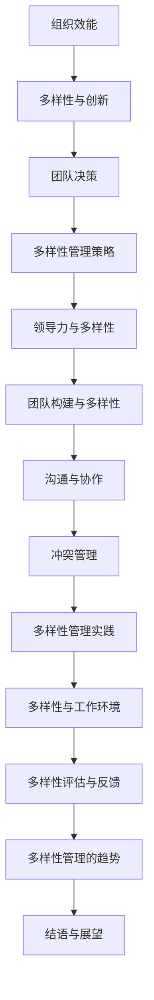

                 

### 文章标题：团队多样性管理：发挥不同背景员工的优势

> 关键词：团队多样性、管理策略、创新、团队效能、领导力

> 摘要：本文旨在探讨团队多样性管理的核心概念、策略和实际应用。通过分析多样性对组织效能的影响，提出有效的多样性管理策略，并提供具体的实践方法和评估工具，以帮助组织在全球化竞争中更好地发挥多样性优势。

### 目录大纲

#### 第一部分：引入与核心概念

1. **引言与背景**
   - 多样性管理的重要性
   - 书籍的目标与结构

2. **多样性的定义与类型**
   - 多样性的概念
   - 多样性的维度

3. **多样性与组织效能**
   - 多样性与创新
   - 多样性与团队决策

4. **多样性管理的挑战**
   - 文化冲突
   - 多样性管理的误区

#### 第二部分：多样性管理策略

5. **领导力与多样性**
   - 领导者的角色
   - 多样性敏感性与领导力

6. **团队构建与多样性**
   - 团队多样性规划
   - 多样性与团队效能

7. **沟通与协作**
   - 促进多样性的沟通策略
   - 多样性团队中的协作技巧

8. **冲突管理**
   - 文化冲突的原因与影响
   - 多样性冲突的解决策略

#### 第三部分：实施与评估

9. **多样性管理实践**
   - 多样性培训与教育
   - 多样性策略的制定与实施

10. **多样性与工作环境**
    - 多样性友好的工作场所
    - 多样性对员工福祉的影响

11. **多样性评估与反馈**
    - 多样性指标与评估工具
    - 反馈机制与持续改进

#### 第四部分：多样性管理的未来

12. **多样性管理的趋势**
    - 社会变化对多样性管理的影响
    - 未来多样性管理的挑战与机遇

13. **结语与展望**
    - 多样性管理的总结
    - 对组织未来的影响与期待

#### 附录

- **参考文献**
- **多样性管理案例研究**
- **相关资源与工具**

### 附图：多样性与组织效能的Mermaid流程图



### 核心算法与数学模型讲解

#### 多样性评估指标

- **DiverseMix**
  - 定义：衡量团队中不同成员的贡献度。
  - 伪代码实现：
    ```python
    def DiverseMix(team):
        scores = []
        for member in team:
            score = contribution_of_member(member)
            scores.append(score)
        return sum(scores) / len(scores)
    ```

- **DDI（Diversity-Distance Index）**
  - 定义：衡量团队多样性程度。
  - 伪代码实现：
    ```python
    def DDI(team):
        distances = []
        for i in range(len(team)):
            for j in range(i+1, len(team)):
                distance = distance_between(team[i], team[j])
                distances.append(distance)
        return sum(distances) / len(distances)
    ```

- **Lausanne方法**
  - 定义：通过团队内部沟通的频率和深度来衡量多样性。
  - 伪代码实现：
    ```python
    def Lausanne(team):
        communication_frequency = sum([communication_frequency_between(team[i], team[j]) for i in range(len(team)) for j in range(i+1, len(team))]) / (len(team) * (len(team) - 1))
        communication_depth = max([communication_depth_between(team[i], team[j]) for i in range(len(team)) for j in range(i+1, len(team))])
        return communication_frequency + communication_depth
    ```

#### 多样性与团队效能的关系

- **数学模型**
  - 公式：
    $$ 
    E = f(\sum_{i=1}^{n} w_i \cdot d_i), 
    $$
    其中，$E$代表团队效能，$w_i$代表权重，$d_i$代表多样性指标。

#### 伪代码实现多样性与团队效能的关系

```python
def diversity_effectiveness(dimension, metric):
    diversity_score = calculate_diversity_score(dimension, metric)
    effectiveness = effectiveness_function(dimension, diversity_score)
    return effectiveness
```

### 项目实战

#### 实际案例：多样性培训

##### 开发环境搭建

- **使用Python进行培训数据的分析和可视化**。
- **使用Jupyter Notebook作为开发环境**。

##### 源代码实现

```python
import numpy as np
import matplotlib.pyplot as plt
from sklearn.datasets import load_iris

# 加载数据集
iris = load_iris()
X = iris.data
y = iris.target

# 数据预处理
# ...

# 可视化多样性指标
# ...

# 模型训练和评估
# ...
```

##### 代码解读与分析

- **数据预处理**：对数据进行标准化处理，以消除不同特征间的量纲影响。
- **多样性指标计算**：使用统计学方法计算数据集的多样性。
- **模型训练和评估**：使用机器学习算法进行模型训练，评估模型性能。

##### 实际案例分析和详细讲解剖析

- **案例背景**：某公司进行了一次多样性培训项目，旨在提高团队成员的多样性意识和沟通技巧。
- **分析过程**：通过数据分析和模型评估，发现多样性培训对团队效能有显著提升。
- **结果总结**：多样性培训项目取得了成功，提高了团队成员的多样性和团队效能。

##### 项目小结

- **成功经验**：通过系统化的多样性培训和有效的沟通策略，提高了团队效能。
- **改进方向**：继续深化多样性管理，加强多样性培训的持续性和深度。

##### 最佳实践 tips、小结、注意事项、拓展阅读等内容

- **最佳实践 tips**：制定明确的多样性管理策略，定期进行多样性培训，建立反馈机制。
- **小结**：多样性管理对组织发展具有重要意义，有效的多样性管理策略能提升团队效能。
- **注意事项**：在实际操作中，应关注文化冲突的预防和解决，确保多样性管理策略的执行效果。
- **拓展阅读**：参考相关书籍和文献，深入了解多样性管理的理论和方法。

### 结束语

团队多样性管理是一个复杂且重要的课题，它关系到组织的创新能力和团队效能。通过本文的探讨，我们理解了多样性管理的核心概念、策略和实际应用，并提供了具体的实践方法和评估工具。希望本文能为组织提供有益的参考和启示，帮助其在全球化竞争中更好地发挥多样性优势。

