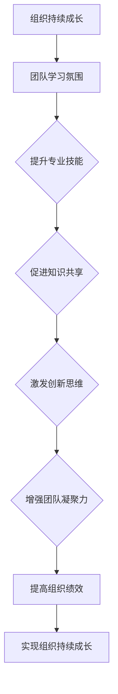
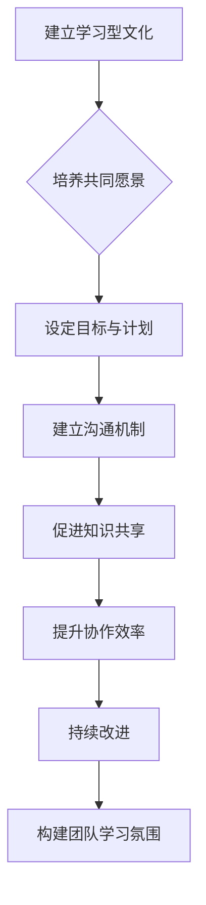
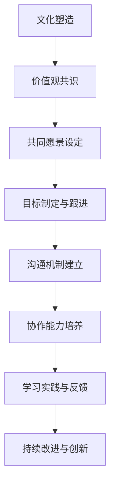

                 

### 第一部分：引言与背景

#### 引言

在当今快速发展的技术时代，团队学习氛围已经成为组织持续成长的关键因素。无论是企业、教育机构还是创业公司，都需要通过培养团队学习氛围来实现组织内部的创新与变革。本文旨在探讨团队学习氛围的重要性，以及如何构建一个持续成长的组织。

随着数字化转型的深入，技术变革的速度前所未有，这要求团队成员必须具备不断学习、快速适应变化的能力。团队学习氛围不仅能够提升团队成员的专业技能，还能促进知识共享、激发创新思维，从而推动组织整体的发展。

#### 团队学习氛围的定义

团队学习氛围是指在团队内部，成员之间相互学习、知识共享、相互激励的一种文化氛围。它包括以下几个方面：

1. **学习意识**：团队成员对学习有高度的认同和重视，将学习视为一种习惯和生活方式。
2. **知识共享**：团队成员愿意分享自己的知识和经验，形成知识共享的文化。
3. **相互激励**：团队成员之间相互鼓励、相互支持，共同成长。
4. **反馈与改进**：团队内部建立有效的反馈机制，鼓励成员对学习过程进行反思和改进。

#### 团队学习氛围的重要性

团队学习氛围对组织的重要性体现在以下几个方面：

1. **提升团队技能**：通过学习，团队成员能够不断提升自己的专业能力，从而提高团队的整体绩效。
2. **促进知识共享**：知识共享有助于团队内部资源的整合和优化，减少重复劳动，提高工作效率。
3. **激发创新思维**：在一个学习氛围浓厚的团队中，成员更容易产生创新的思路，从而推动组织的变革和创新。
4. **增强团队凝聚力**：通过共同学习和成长，团队成员之间的信任和协作能力得到增强，团队的凝聚力得到提升。

#### 现代组织面临的挑战与机遇

现代组织面临的主要挑战包括技术变革、市场竞争加剧和人才竞争。与此同时，现代组织也面临着诸多机遇，如数字化、人工智能和物联网技术的广泛应用，为企业提供了创新的机遇。

为了应对这些挑战和抓住机遇，组织必须培养团队学习氛围，通过不断学习和创新来提升自身的竞争力。这不仅是企业生存和发展的需要，也是团队成员个人成长的需要。

总结而言，团队学习氛围是现代组织持续成长的重要保障。通过构建良好的学习氛围，组织能够实现知识的有效传递和共享，激发团队成员的创造力和创新力，从而在激烈的市场竞争中脱颖而出。

### 1.2 组织持续成长的关键因素

#### 团队学习氛围与组织成长的关系

团队学习氛围作为组织持续成长的关键因素，其核心在于通过学习和知识共享促进组织内部创新和变革。研究表明，一个良好的学习氛围不仅能够提升团队整体的专业能力和知识水平，还能增强团队的协作和凝聚力，从而推动组织的长远发展。

首先，团队学习氛围有助于提升团队的专业技能。在技术快速发展的今天，专业知识更新速度加快，团队成员需要不断学习以适应新的技术环境。通过营造一个鼓励学习、支持知识共享的氛围，团队成员能够及时获取最新的行业动态和专业知识，从而提升团队的整体技能水平。

其次，团队学习氛围能够促进知识共享。在一个开放的学习环境中，团队成员愿意分享自己的知识和经验，形成知识共享的文化。这不仅有助于团队内部资源的整合和优化，还能减少重复劳动，提高工作效率。此外，知识共享还能促进团队成员之间的相互学习和成长，形成一种相互支持、共同进步的氛围。

再者，团队学习氛围有助于激发创新思维。在一个积极的学习氛围中，团队成员更容易产生创新的思路和想法。这是因为学习过程本身就是一种思维拓展的过程，通过不断接触新的知识和观点，团队成员的思维方式得到锻炼和提升。此外，知识共享和相互激励也能激发团队成员的创新潜力，从而推动组织的变革和创新。

最后，团队学习氛围能够增强团队的凝聚力。在共同学习和成长的过程中，团队成员之间的信任和协作能力得到增强，团队的凝聚力得到提升。这不仅有助于团队内部的合作和协作，还能提高团队的整体绩效，为组织的长远发展奠定坚实基础。

#### 团队学习氛围与组织持续成长的关系图

为了更直观地展示团队学习氛围与组织持续成长之间的关系，我们可以使用Mermaid流程图来描述这一过程：

通过上述Mermaid流程图，我们可以清晰地看到团队学习氛围如何通过提升专业技能、促进知识共享、激发创新思维和增强团队凝聚力，最终推动组织的持续成长。

#### 现代组织面临的挑战与机遇

在当今快速变革的时代，现代组织面临着诸多挑战和机遇。以下将具体探讨这些挑战与机遇，并分析如何通过团队学习氛围来应对和把握。

##### 挑战

1. **技术变革**：随着数字化、人工智能、物联网等技术的迅猛发展，技术变革的速度前所未有。企业需要不断更新技术和知识，以保持竞争力。这要求团队成员具备快速学习和适应新技术的能力。

2. **市场竞争**：在激烈的市场竞争中，企业不仅要应对同行业的竞争，还要应对跨界竞争。这种竞争环境要求企业具备持续创新和快速响应市场变化的能力。

3. **人才竞争**：人才是企业发展的核心资源。在当今人才市场上，企业面临着激烈的人才竞争，需要通过吸引和留住人才来保持竞争优势。

4. **组织变革**：许多传统企业面临着组织结构和管理模式的变革需求，如何通过组织变革来提高效率和创新能力，是企业需要面对的重要问题。

##### 机遇

1. **数字化转型**：数字化转型为企业提供了新的发展机遇。通过应用新技术，企业可以优化业务流程，提高效率，甚至创造新的商业模式。

2. **技术创新**：技术创新不仅为企业提供了新的市场机会，还能帮助企业提升产品和服务质量，增强市场竞争力。

3. **行业跨界**：随着各行业之间的融合，企业可以通过跨界合作来拓展业务领域，创造新的市场机会。

4. **社会责任**：在当今社会，企业承担社会责任不仅是一种责任，也是一种机遇。通过履行社会责任，企业可以提高品牌形象，增强市场竞争力。

##### 团队学习氛围的应对策略

面对上述挑战和机遇，团队学习氛围可以发挥重要作用，以下是一些具体的应对策略：

1. **提升专业技能**：通过构建学习型团队，企业可以鼓励员工持续学习，提升专业技能。这不仅可以应对技术变革，还能提高员工的职业竞争力。

2. **促进知识共享**：通过建立知识共享机制，企业可以促进内部知识的传递和共享，提高整体工作效率。这有助于企业应对市场竞争和人才竞争。

3. **激发创新思维**：在一个积极的学习氛围中，员工更容易产生创新的思路和想法。企业可以通过鼓励创新，提供创新平台，激发员工的创新潜力。

4. **增强团队凝聚力**：通过共同学习和成长，团队成员之间的信任和协作能力得到增强，团队的凝聚力得到提升。这有助于企业在变革过程中保持稳定和高效。

总之，团队学习氛围是现代组织应对挑战、把握机遇的关键因素。通过营造良好的学习氛围，企业可以提升员工的专业技能，促进知识共享，激发创新思维，增强团队凝聚力，从而实现组织的持续成长。

### 《团队学习氛围：打造持续成长的组织》目录大纲

为了更好地引导读者深入理解团队学习氛围的重要性，以及如何构建一个持续成长的组织，本文将采用分部分、分章节的方式，系统化地阐述相关概念、策略和实践。以下为详细的目录大纲：

#### 第一部分：引言与背景

**1. 引言**

- **1.1 书籍主题介绍**
  - **1.1.1 团队学习氛围的定义**
  - **1.1.2 团队学习氛围的重要性
- **1.2 组织持续成长的关键因素**
  - **1.2.1 团队学习氛围与组织成长的关系**
  - **1.2.2 现代组织面临的挑战与机遇**

#### 第二部分：团队学习氛围的构建

**2. 团队学习氛围的理论基础**

- **2.1 学习型组织的概念**
  - **2.1.1 学习型组织的起源与发展**
  - **2.1.2 学习型组织的特征与价值
- **2.2 建立学习型团队的关键要素**
  - **2.2.1 文化与价值观**
  - **2.2.2 共同愿景与目标设定**
  - **2.2.3 沟通与合作
- **2.3 团队学习氛围的Mermaid流程图**
  - [Mermaid 流程图展示团队学习氛围的构建过程]

#### 第三部分：构建团队学习氛围的策略与实践

**3. 构建团队学习氛围的策略**

- **3.1 领导者的角色**
  - **3.1.1 领导者对团队学习氛围的影响**
  - **3.1.2 如何成为团队学习的领导者
- **3.2 培养学习型文化的策略**
  - **3.2.1 建立学习型文化的步骤**
  - **3.2.2 激励学习与知识共享的措施
- **3.3 促进团队合作的方法**
  - **3.3.1 团队协作的障碍与解决方法**
  - **3.3.2 团队协作工具与技术**

#### 第四部分：团队学习氛围的实际应用

**4. 团队学习氛围在实际工作中的应用**

- **4.1 项目管理中的团队学习氛围**
  - **4.1.1 项目中的团队学习氛围构建**
  - **4.1.2 团队学习氛围对项目管理的影响
- **4.2 教育培训中的团队学习氛围**
  - **4.2.1 教育培训中的团队学习氛围培养**
  - **4.2.2 教育培训中的团队学习案例分析
- **4.3 创新与创业中的团队学习氛围**
  - **4.3.1 创新与创业中的团队学习氛围作用**
  - **4.3.2 创新与创业中的团队学习氛围实践案例**

#### 第五部分：评估与持续改进

**5. 团队学习氛围的评估与持续改进**

- **5.1 评估团队学习氛围的方法**
  - **5.1.1 学习氛围评估指标体系**
  - **5.1.2 学习氛围评估工具与技术
- **5.2 持续改进团队学习氛围的实践**
  - **5.2.1 持续改进的流程与方法**
  - **5.2.2 案例分析：成功的学习氛围改进实践**

#### 第六部分：结论与展望

**6. 结论与展望**

- **6.1 团队学习氛围的总结**
  - **6.1.1 团队学习氛围的核心要点**
  - **6.1.2 团队学习氛围的价值与影响
- **6.2 未来团队学习氛围的发展趋势**
  - **6.2.1 技术进步对团队学习氛围的影响**
  - **6.2.2 社会环境对团队学习氛围的影响**

#### 附录

**附录A：参考资料与推荐阅读**

**附录B：团队学习氛围构建案例集锦**

通过上述目录大纲，本文将系统地探讨团队学习氛围的构建、策略与实践，以及其在实际工作中的应用，旨在为读者提供全面、深入的指导和建议，帮助组织实现持续成长。

#### 第二部分：团队学习氛围的构建

团队学习氛围的构建是组织持续成长的重要保障。在这一部分，我们将探讨团队学习氛围的理论基础，包括学习型组织的概念和关键要素，并通过Mermaid流程图展示团队学习氛围的构建过程。

##### 2.1 学习型组织的概念

学习型组织是由彼得·圣吉（Peter Senge）在其经典著作《第五项修炼》中提出的概念。学习型组织是一种通过不断学习、知识共享和协同工作来实现组织持续成长和发展的组织形态。以下是学习型组织的几个核心特征：

1. **共同愿景**：学习型组织中的成员拥有共同的目标和愿景，这种共同愿景是组织前进的动力。
2. **团队学习**：学习型组织鼓励团队成员相互学习，通过团队学习提升整体能力。
3. **思维模式**：学习型组织注重思维模式的转变，从线性思维转向系统思维，以更好地应对复杂问题。
4. **系统思考**：学习型组织采用系统思考的方法，从整体角度看待问题，以实现持续改进。
5. **个人 mastery**：学习型组织重视成员的个人成长，鼓励成员不断探索和提升自己的专业技能。

##### 2.1.1 学习型组织的起源与发展

学习型组织的概念起源于20世纪80年代，彼得·圣吉在其著作《第五项修炼》中首次系统地提出了这一概念。此后，学习型组织逐渐成为组织管理理论的重要方向，并在全球范围内得到广泛应用。学习型组织的理念强调，组织的持续成长和成功取决于其学习和适应环境的能力。

##### 2.1.2 学习型组织的特征与价值

学习型组织的特征主要体现在以下几个方面：

1. **自我超越**：成员追求个人的成长和超越，不断提高自我能力。
2. **改善心智模式**：成员通过反思和改变自己的思维模式，以更好地适应环境。
3. **共同愿景**：组织成员共同分享和追求一个清晰、具有吸引力的愿景。
4. **团队学习**：组织通过团队学习提升整体能力和协作效率。
5. **系统思考**：组织从整体角度看待问题，以实现持续改进。

学习型组织的价值在于：

1. **提升组织适应能力**：通过不断学习和适应，组织能够更好地应对外部环境的变化。
2. **促进知识共享**：学习型组织鼓励成员分享知识和经验，提高组织的整体知识水平。
3. **激发创新思维**：在一个积极的学习氛围中，成员更容易产生创新的思路和想法。
4. **增强团队凝聚力**：通过共同学习和成长，团队成员之间的信任和协作能力得到增强。

##### 2.2 建立学习型团队的关键要素

建立学习型团队需要考虑多个关键要素，以下将详细探讨这些要素：

###### 2.2.1 文化与价值观

文化与价值观是学习型团队的基础。一个积极的学习型文化应该鼓励成员不断学习、勇于创新和分享知识。以下是一些建立学习型文化的关键措施：

1. **倡导终身学习**：组织应该鼓励成员将学习视为一种习惯和生活方式，为成员提供持续学习和发展的机会。
2. **建立知识共享平台**：组织可以建立内部知识库或学习平台，方便成员分享知识和经验。
3. **鼓励创新**：组织应该为成员提供创新的空间和资源，鼓励成员尝试新的想法和方法。
4. **尊重个人成长**：组织应该尊重成员的个人成长和职业发展，为成员提供发展的机会和支持。

###### 2.2.2 共同愿景与目标设定

共同愿景和目标设定是学习型团队的驱动力。一个清晰、具有吸引力的共同愿景能够激发团队成员的积极性和创造力。以下是一些建立共同愿景和目标的建议：

1. **明确愿景**：组织应该明确描述其愿景，使团队成员能够清晰地了解组织的长远目标和方向。
2. **共同参与**：组织可以通过团队会议、讨论和问卷调查等方式，让团队成员共同参与愿景的制定，增加成员的认同感和参与度。
3. **设定具体目标**：组织应该将愿景转化为具体的、可衡量的目标，并制定详细的行动计划。
4. **定期回顾**：组织应该定期回顾目标达成情况，及时调整计划和策略，确保目标的实现。

###### 2.2.3 沟通与合作

沟通与合作是学习型团队的核心。一个有效的沟通机制能够促进知识共享和协作效率，以下是一些建立有效沟通与合作机制的建议：

1. **建立沟通渠道**：组织应该建立多种沟通渠道，如定期会议、邮件、即时通讯工具等，确保信息能够及时、有效地传递。
2. **促进知识共享**：组织可以建立知识共享平台，鼓励成员分享知识和经验，形成知识共享的文化。
3. **建立协作文化**：组织应该倡导协作文化，鼓励团队成员相互支持和合作，共同完成任务。
4. **提供培训**：组织可以提供沟通和协作技能培训，帮助团队成员提升沟通和协作能力。

###### 2.3 团队学习氛围的Mermaid流程图

为了更直观地展示团队学习氛围的构建过程，我们可以使用Mermaid流程图来描述：

通过上述Mermaid流程图，我们可以清晰地看到团队学习氛围的构建过程，以及各个关键要素之间的相互关系。这一过程不仅有助于提升团队的专业技能和知识水平，还能促进知识共享、激发创新思维和增强团队凝聚力，从而推动组织的持续成长。

#### 2.3 团队学习氛围的Mermaid流程图

为了更直观地展示团队学习氛围的构建过程，我们可以使用Mermaid流程图来描述。以下是一个简化的团队学习氛围构建过程的Mermaid流程图：

在这个流程图中，每个节点代表团队学习氛围构建中的一个关键步骤或要素。箭头表示步骤之间的逻辑关系：

- **文化塑造（A）**：这是团队学习氛围构建的起点，通过营造一个支持学习和创新的文化环境来激发团队成员的学习动机。
- **价值观共识（B）**：在文化塑造的基础上，团队需要建立共同的价值观，以确保团队成员在行为和决策上保持一致性。
- **共同愿景设定（C）**：团队需要共同设定一个清晰的愿景，这个愿景应该能够激励团队成员朝着共同的目标努力。
- **目标制定与跟进（D）**：基于共同愿景，团队需要设定具体的、可衡量的目标，并制定详细的行动计划，同时定期跟进目标的实现情况。
- **沟通机制建立（E）**：有效的沟通机制是团队学习氛围的关键，它有助于确保信息的畅通无阻和知识的及时共享。
- **协作能力培养（F）**：通过培养团队成员的协作能力，可以提高团队的整体效率和创新能力。
- **学习实践与反馈（G）**：团队需要通过实践来检验学习效果，并通过反馈机制不断调整和优化学习过程。
- **持续改进与创新（H）**：通过不断的改进和创新，团队能够保持活力和竞争力，实现组织的持续成长。

通过这个Mermaid流程图，我们可以清晰地看到团队学习氛围构建的各个环节及其相互关系，这有助于团队更好地理解并实施团队学习氛围的构建策略。

### 3. 构建团队学习氛围的策略

构建团队学习氛围是一个系统性的过程，需要从多个方面进行规划和实施。以下将详细探讨几个关键策略，包括领导者的角色、培养学习型文化的步骤、激励学习与知识共享的措施，以及促进团队合作的方法。

#### 3.1 领导者的角色

领导者在构建团队学习氛围中扮演着至关重要的角色。他们的行为和态度直接影响团队成员的学习动机和行为。以下是领导者应发挥的几个关键作用：

1. **树立榜样**：领导者通过自己的行为树立学习的榜样，鼓励团队成员追随。例如，领导者可以定期分享自己的学习经验和心得，展示自己的学习成果。
2. **提供支持**：领导者应为团队成员提供学习所需的资源和支持，包括时间、经费和技术等。这有助于减少团队成员在学习过程中的障碍，提高学习效果。
3. **营造氛围**：领导者应积极营造一个鼓励学习和知识共享的氛围。例如，可以通过组织学习小组、设置学习日、开展知识竞赛等活动，激发团队成员的学习兴趣。
4. **反馈与激励**：领导者应及时对团队成员的学习成果进行反馈，并提供正面的激励。例如，可以通过表扬、奖励等方式，鼓励团队成员持续学习和创新。

**如何成为团队学习的领导者**

1. **自我学习**：领导者首先需要具备强烈的学习意愿和持续学习的习惯，通过自我学习树立榜样。
2. **倾听与沟通**：领导者应善于倾听团队成员的意见和需求，通过有效沟通了解团队的学习现状和问题。
3. **建立支持机制**：领导者应积极建立和支持团队学习所需的资源和支持，确保团队成员能够在学习过程中得到充分的支持。
4. **鼓励创新**：领导者应鼓励团队成员尝试新方法、新思路，培养团队的创新思维和创造力。

#### 3.2 培养学习型文化的策略

培养学习型文化是构建团队学习氛围的重要步骤。以下是一些具体策略：

1. **制定学习计划**：组织应制定详细的员工学习计划，包括培训课程、学习活动和学习项目等。这有助于确保团队成员能够有计划地进行学习。
2. **提供学习资源**：组织应为团队成员提供丰富的学习资源，包括图书、在线课程、研讨会和专家讲座等。这有助于提高团队成员的学习效率和效果。
3. **建立学习小组**：组织可以建立学习小组，鼓励团队成员相互学习和分享。学习小组可以定期组织讨论、分享会和学习活动，增强团队成员之间的学习互动。
4. **开展知识竞赛**：组织可以定期开展知识竞赛，激发团队成员的学习兴趣和竞争意识。通过竞赛，团队成员可以检验自己的知识水平，提升学习的积极性。

**建立学习型文化的步骤**

1. **明确目标**：组织应明确学习型文化的目标和愿景，确保所有成员都了解并认同这一目标。
2. **建立共识**：通过团队讨论和共识建立，确保团队成员对学习型文化的理念、价值观和目标有共同的理解和认同。
3. **制定策略**：组织应根据目标和共识，制定具体的策略和行动计划，包括学习资源的提供、学习活动的组织和激励机制的建立。
4. **实施与反馈**：组织应实施学习型文化的策略和行动计划，并通过定期反馈和评估，不断调整和优化学习过程。

#### 3.3 激励学习与知识共享的措施

激励学习与知识共享是构建团队学习氛围的重要手段。以下是一些具体措施：

1. **设立学习奖励**：组织可以设立学习奖励，如学习奖金、证书、荣誉称号等，以激励团队成员积极学习。这有助于提高团队成员的学习动力和热情。
2. **建立知识共享平台**：组织可以建立内部知识共享平台，鼓励团队成员分享知识和经验。这有助于提高知识的传递和共享效率，促进团队整体能力的提升。
3. **开展学习活动**：组织可以定期开展学习活动，如内部培训、研讨会、学习沙龙等，激发团队成员的学习兴趣和参与度。
4. **提供学习机会**：组织应积极为团队成员提供外部学习机会，如参加行业会议、研讨会、专业培训等。这有助于团队成员拓宽视野，获取最新的行业动态和专业知识。

#### 3.4 促进团队合作的方法

促进团队合作是构建团队学习氛围的关键步骤。以下是一些具体方法：

1. **明确团队目标**：组织应明确团队的目标和任务，确保团队成员都了解自己的职责和目标，从而提高团队协作的效率。
2. **建立有效的沟通机制**：组织应建立有效的沟通机制，确保团队成员之间的信息畅通无阻。这可以通过定期会议、即时通讯工具、邮件等方式实现。
3. **提供协作工具**：组织应提供协作工具，如项目管理软件、协作平台等，以方便团队成员进行协作和项目管理。
4. **培养团队精神**：组织应通过团队建设活动、团队拓展训练等方式，培养团队成员之间的信任和协作精神。

通过以上策略和方法，组织可以有效地构建团队学习氛围，提升团队的整体能力和竞争力，从而实现组织的持续成长。

### 3.1 领导者的角色

领导者是构建团队学习氛围的核心推动者，他们的行为和态度对团队的学习动机、行为和文化有着深远的影响。以下是领导者如何对团队学习氛围产生影响的详细探讨。

首先，**领导者通过树立榜样来影响团队**。在一个学习型组织中，领导者不仅仅是任务的分配者和执行者，更是学习与知识共享的倡导者和践行者。领导者通过持续学习、积极分享自己的学习经验，向团队成员展示学习的价值和乐趣，从而激发团队成员的学习动机。例如，一位技术总监可以定期组织技术分享会，不仅分享自己的技术见解，还邀请团队成员参与，这种互动不仅提升了团队成员的技能，还增强了团队内部的凝聚力。

其次，**领导者通过提供支持来促进团队学习**。学习不仅仅是知识获取的过程，还需要时间、资源和技术支持。领导者应确保团队成员能够获得必要的资源，如培训机会、学习材料和技术支持。例如，一位项目经理可以与人力资源部门合作，为团队成员安排专业的技能培训课程，或者提供在线学习平台，方便团队成员在工作和生活中随时进行学习。此外，领导者还可以通过灵活的工作安排，为团队成员提供更多的时间用于个人学习和项目研究。

第三，**领导者通过营造学习氛围来影响团队**。一个积极的学习氛围能够激发团队成员的学习兴趣和主动性。领导者可以通过组织各种学习活动，如定期的知识分享会、内部研讨会、学习竞赛等，来营造这种氛围。例如，一位团队经理可以组织团队每周进行一次技术讨论，每次讨论由一位团队成员主持，这样可以促使团队成员主动学习和准备，同时也为其他成员提供了学习和展示自己的机会。

最后，**领导者通过反馈与激励来推动团队学习**。有效的反馈能够帮助团队成员了解自己的学习成果和不足，从而指导下一步的学习方向。领导者应提供积极的反馈，鼓励团队成员不断进步。此外，领导者还可以通过奖励机制来激励团队成员的学习热情。例如，一位团队领导可以为表现出色的团队成员颁发“学习之星”奖项，或者在绩效评估中加入学习成果的考量，这些措施都能有效提升团队成员的学习动力。

**如何成为团队学习的领导者**

1. **自我学习**：领导者应首先具备强烈的自我学习能力，通过不断学习，树立学习的榜样。
2. **倾听与沟通**：领导者应善于倾听团队成员的意见和需求，通过有效沟通了解团队的学习现状和问题。
3. **建立支持机制**：领导者应积极建立和支持团队学习所需的资源和支持，确保团队成员能够在学习过程中得到充分的支持。
4. **鼓励创新**：领导者应鼓励团队成员尝试新方法、新思路，培养团队的创新思维和创造力。

通过以上措施，领导者可以有效地影响团队学习氛围，推动团队持续学习和成长，从而实现组织的持续发展。

### 3.2 培养学习型文化的策略

在构建团队学习氛围的过程中，培养学习型文化是至关重要的一个环节。以下将详细介绍一些关键的策略，包括如何建立学习型文化的步骤、激励学习与知识共享的措施，以及如何通过这些措施促进团队学习氛围的持续发展。

#### 3.2.1 建立学习型文化的步骤

建立学习型文化不是一蹴而就的，它需要一系列有计划、有步骤的实施。以下是具体的步骤：

1. **明确愿景与目标**：首先，组织需要明确学习型文化的愿景和目标。这可以通过高层管理团队的讨论和共识来确立，并确保所有团队成员都能理解和认同这一愿景和目标。

2. **培训与教育**：为了培养学习型文化，组织需要对员工进行培训和教育。这包括开展学习意识提升课程、组织学习技能培训，以及提供有关学习型组织理论的培训。这些培训旨在帮助员工认识到学习的重要性，并掌握有效的学习方法。

3. **建立知识共享平台**：组织应建立内部知识共享平台，如内部论坛、学习社区等，鼓励员工分享知识和经验。通过这些平台，员工可以轻松地获取他人的学习成果，并进行协作学习。

4. **激励与奖励机制**：为了鼓励员工积极参与学习，组织应建立相应的激励与奖励机制。这可以包括设置学习奖金、颁发学习证书、以及在绩效评估中增加学习成果的比重。

5. **持续评估与改进**：建立学习型文化是一个持续的过程，组织需要定期对学习氛围和文化进行评估，并根据评估结果进行改进。这可以通过员工满意度调查、学习成果评估等方式进行。

#### 3.2.2 激励学习与知识共享的措施

激励学习与知识共享是培养学习型文化的重要手段。以下是一些具体的措施：

1. **提供学习资源**：组织应提供丰富的学习资源，如在线课程、专业书籍、研讨会和培训等。这些资源可以帮助员工提升专业技能，增强学习动力。

2. **建立学习小组**：组织可以鼓励员工成立学习小组，通过小组合作学习，提高学习的效率和质量。学习小组可以定期组织讨论、分享会和学习活动，促进知识共享。

3. **开展知识竞赛**：组织可以定期开展知识竞赛，激发员工的学习兴趣和竞争意识。通过竞赛，员工不仅可以检验自己的知识水平，还可以学习他人的优点和经验。

4. **奖励优秀学习者**：组织应对在学习过程中表现出色的员工给予奖励，如颁发荣誉证书、奖金或晋升机会。这种奖励可以激励员工积极参与学习和知识共享。

5. **提供反馈与支持**：组织应提供及时的反馈和支持，帮助员工克服学习中的困难，提高学习效果。这可以通过导师制、一对一辅导等方式实现。

#### 3.2.3 促进团队学习氛围的持续发展

为了确保团队学习氛围能够持续发展，组织需要采取一系列措施：

1. **加强领导力**：领导者应发挥关键作用，通过树立榜样、提供支持和营造学习氛围，推动团队学习的发展。领导者的积极参与和重视能够为团队学习提供强大的动力。

2. **建立持续改进机制**：组织应建立持续改进机制，通过定期评估和学习氛围的监控，及时发现和解决存在的问题。这可以通过定期的员工满意度调查、学习成果评估等方式实现。

3. **营造开放的文化**：组织应营造一个开放、包容的文化环境，鼓励员工敢于分享知识和经验，勇于尝试和失败。这种文化能够激发员工的学习热情和创造力。

4. **利用技术工具**：组织可以利用现代技术工具，如学习管理系统（LMS）、协作平台和知识管理工具等，提高学习的效率和质量。这些工具可以帮助组织更好地管理学习资源和过程，促进知识的传递和共享。

通过以上策略和措施，组织可以有效地培养学习型文化，营造一个积极的学习氛围，从而推动团队的持续学习和成长，实现组织的长期发展目标。

### 3.3 促进团队合作的方法

在团队学习氛围的构建过程中，团队合作是不可或缺的一部分。有效的团队合作能够提升团队的执行力和创新能力，从而推动组织的持续发展。以下是一些具体的促进团队合作的方法，包括团队协作的障碍与解决方法、团队协作工具与技术。

#### 团队协作的障碍与解决方法

1. **沟通障碍**：沟通不畅是团队协作中常见的问题。团队成员之间的沟通不充分或信息传递失误，可能导致任务执行不力。解决方法包括：
   - **建立明确的沟通渠道**：组织应建立明确的沟通渠道，如定期会议、即时通讯工具和邮件等，确保信息畅通。
   - **提高沟通技能**：组织可以提供沟通技能培训，帮助团队成员提高沟通效果。

2. **目标不明确**：团队协作的另一个障碍是缺乏明确的目标。团队成员如果对目标不清晰，可能会导致努力方向不一致。解决方法包括：
   - **明确团队目标**：组织应确保团队目标清晰、具体，并确保所有成员都明确自己的职责和任务。
   - **定期回顾目标**：组织应定期回顾和调整目标，确保团队始终朝着正确的方向前进。

3. **资源分配不均**：资源分配不均是团队协作中的另一大障碍。如果团队成员感觉资源不公平分配，可能会导致不满和冲突。解决方法包括：
   - **公平的资源分配**：组织应确保资源分配公平，根据团队成员的能力和需求进行资源调配。
   - **公开透明**：组织应公开资源分配的决策过程，增加透明度，减少误解和不满。

4. **文化差异**：团队成员来自不同的背景和文化，可能会在价值观和行为习惯上存在差异，导致协作困难。解决方法包括：
   - **文化融合活动**：组织可以举办文化融合活动，如团队拓展训练、跨文化培训等，帮助团队成员更好地理解和尊重彼此的文化差异。
   - **建立共同价值观**：组织应努力建立共同的价值观和团队文化，减少文化差异带来的冲突。

#### 团队协作工具与技术

1. **项目管理工具**：项目管理工具可以帮助团队更好地规划和执行任务。常见的项目管理工具有：
   - **JIRA**：用于任务跟踪、敏捷开发和项目管理。
   - **Trello**：一个简单直观的任务管理工具，适用于各种规模的项目。
   - **Asana**：用于团队协作、任务分配和项目进度跟踪。

2. **协作平台**：协作平台可以帮助团队成员进行实时沟通和协作。常见的协作平台有：
   - **Slack**：用于团队沟通和协作，支持即时消息、文件共享和集成第三方工具。
   - **Microsoft Teams**：集成了沟通、协作和生产力工具，适用于企业级团队。
   - **Google Workspace**：包括Google Docs、Sheets、Slides等，支持多人实时协作。

3. **知识管理工具**：知识管理工具可以帮助团队积累和共享知识，提高团队整体能力。常见的知识管理工具包括：
   - **Confluence**：用于文档管理和协作，支持知识共享和版本控制。
   - **Notion**：一个多功能的协作平台，可以用于笔记、任务管理、数据库等。
   - **Evernote**：用于笔记记录和知识管理，支持跨平台同步。

4. **协作软件**：协作软件可以帮助团队成员进行高效协作，提高工作效率。常见的协作软件有：
   - **Zoom**：用于视频会议和在线协作，支持屏幕共享、会议录制等功能。
   - **Webex**：用于视频会议和协作，提供丰富的会议功能。
   - **Skype for Business**：微软提供的通信和协作工具，支持即时消息、音频/视频通话、会议等。

通过以上方法和技术，组织可以有效地促进团队合作，提高团队的整体协作效率和创新能力，从而推动组织的持续成长和发展。

### 4. 团队学习氛围在实际工作中的应用

团队学习氛围不仅是一种理想状态，更需要在实际工作中得到有效应用，以促进项目管理的效率、提升教育培训的效果，以及推动创新与创业的活力。以下将分别探讨团队学习氛围在这些领域中的应用。

#### 4.1 项目管理中的团队学习氛围

在项目管理中，团队学习氛围可以显著提升项目执行的效果和团队成员的工作效率。以下是具体的应用方法：

1. **定期知识分享会**：项目管理团队可以定期举办知识分享会，让团队成员分享项目管理经验和最佳实践。这不仅有助于团队成员提升专业技能，还能促进知识的共享和传播。

2. **项目复盘**：在项目结束后，团队应进行项目复盘，总结项目中的成功经验和教训。通过这种方式，团队成员可以不断学习和改进，提高未来的项目管理能力。

3. **利用项目管理工具**：采用项目管理工具，如JIRA或Trello，可以帮助团队更好地规划和跟踪项目进度，提高协作效率。这些工具还能记录团队成员的学习成果和经验，为后续项目提供参考。

**案例**：某IT公司的一个软件开发团队，通过定期举办知识分享会和项目复盘，不断提升团队成员的项目管理技能。团队成员之间建立了良好的沟通机制，项目进度和任务分配变得更加高效。在过去的两年中，该团队成功交付了多个大型项目，项目成功率显著提高。

#### 4.2 教育培训中的团队学习氛围

在教育培训中，团队学习氛围有助于提升学习效果和团队成员的学习动力。以下是具体的应用方法：

1. **学习小组**：教师可以组织学生成立学习小组，通过小组合作学习，提高学习的深度和广度。学习小组可以定期组织讨论、分享学习心得，促进知识的共享。

2. **在线学习平台**：学校可以建立在线学习平台，提供丰富的学习资源和互动工具，让学生能够随时进行学习和交流。这有助于提高学生的学习兴趣和自主学习能力。

3. **激励措施**：教师可以通过奖励机制，如颁发学习证书、给予学分优惠等，激励学生积极参与学习。这种激励机制能够有效提高学生的学习动力。

**案例**：某大学的一门计算机科学课程，通过建立学习小组和在线学习平台，学生们不仅能够更好地理解和掌握课程内容，还培养了良好的团队合作能力。学习效果显著提升，期末考试成绩普遍高于往年。

#### 4.3 创新与创业中的团队学习氛围

在创新与创业中，团队学习氛围可以激发团队成员的创造力和创业活力，推动企业的持续创新和发展。以下是具体的应用方法：

1. **创新实验室**：企业可以设立创新实验室，为团队成员提供探索新想法和实验的机会。通过这种方式，团队成员可以自由地尝试和创新，不受传统束缚。

2. **跨部门合作**：企业应鼓励跨部门合作，促进不同部门和团队之间的知识共享和资源整合。这种合作可以激发新的创意和解决方案。

3. **创业竞赛**：企业可以举办内部创业竞赛，鼓励员工提出创新项目和创业计划。通过竞赛，团队成员不仅可以锻炼自己的创业能力，还能从其他团队的创意中学习和借鉴。

**案例**：一家科技公司通过设立创新实验室和举办内部创业竞赛，激发了员工们的创新热情。多个新项目和产品成功孵化，为公司带来了显著的业绩增长和市场竞争力。

总结而言，团队学习氛围在项目管理、教育培训和创新与创业中的应用，不仅提升了团队成员的专业能力和学习效果，还促进了知识的共享和创新的活力，为组织的持续成长和发展奠定了坚实基础。

### 4.1 项目管理中的团队学习氛围

在项目管理中，构建一个良好的团队学习氛围是确保项目成功的关键因素之一。以下将详细探讨如何在项目管理中构建和维持团队学习氛围，以及团队学习氛围对项目管理的具体影响。

#### 如何构建团队学习氛围

1. **设定共同目标和愿景**：项目团队应共同设定一个明确的目标和愿景，确保所有成员对项目方向和目标有共同的理解和认同。这有助于激发团队成员的学习动机和合作精神。

2. **定期进行知识分享**：项目团队应定期举行知识分享会，鼓励成员分享自己的专业知识、经验以及学习成果。通过这种方式，团队成员不仅可以学习他人的经验，还能巩固自己的知识，促进知识的共享和传播。

3. **鼓励实践和学习**：项目团队应提供机会让成员在实际工作中学习和实践新知识、新技术。通过实践，成员能够更好地掌握所学内容，提高项目执行能力。

4. **建立反馈机制**：项目团队应建立一个有效的反馈机制，及时对项目进展和成员表现进行评估和反馈。这种反馈不仅有助于及时发现和解决问题，还能激励成员持续学习和改进。

5. **提供必要的资源和支持**：项目团队应确保成员能够获得必要的学习资源和支持，包括培训、工具和资料等。这有助于提高成员的学习效果和积极性。

#### 团队学习氛围对项目管理的影响

1. **提升团队协作效率**：一个良好的团队学习氛围能够促进团队成员之间的沟通和协作，减少误解和冲突，提高团队的整体工作效率。

2. **增强项目执行力**：通过持续学习和实践，团队成员的专业能力和技能水平得到提升，从而增强项目的执行力。团队成员能够更好地应对项目中的挑战和变化，确保项目按计划顺利推进。

3. **提高项目质量**：团队成员在共同学习和成长的过程中，能够不断提升项目的质量。通过不断优化流程、改进方法，项目能够达到更高的标准和客户满意度。

4. **促进知识共享和创新**：团队学习氛围鼓励知识共享和经验交流，有助于团队成员从不同的角度和经验中汲取灵感，促进创新思维的产生。这不仅能提高项目的质量，还能为组织带来新的业务机会和竞争优势。

#### 案例分析：成功的学习氛围改进实践

某IT公司的软件开发团队在项目执行过程中遇到了效率低下和质量不稳定的问题。为了提升团队的工作效率和项目质量，团队决定构建一个学习氛围浓厚的环境。

首先，团队制定了共同的目标和愿景，明确了项目的重要性和团队成员的责任。其次，团队定期举行知识分享会，邀请成员分享技术心得和项目经验。同时，团队建立了在线知识库，方便成员随时查阅和学习。

此外，团队还引入了项目复盘机制，每次项目结束后，团队成员都会进行详细的复盘，总结经验教训，并制定改进措施。团队还提供了各种学习资源和支持，包括在线课程、专业书籍和外部培训等。

通过这些措施，团队学习氛围得到了显著提升。团队成员的专业技能和协作能力得到了显著增强，项目执行力大大提高，项目质量和客户满意度也随之提升。

总结而言，构建团队学习氛围是项目管理成功的关键。通过设定共同目标、定期知识分享、实践学习、建立反馈机制和提供资源支持，项目团队能够实现持续学习和成长，从而提高项目的整体绩效和组织的竞争力。

### 4.2 教育培训中的团队学习氛围

在教育培训中，团队学习氛围是促进学生学习和提高教育质量的重要保障。以下将详细探讨如何在教育培训中培养和维持团队学习氛围，并分析团队学习氛围对教育培训的具体影响。

#### 如何培养团队学习氛围

1. **设定共同目标**：教育机构应与教师和学生共同设定明确的学习目标，确保所有成员对学习方向和目标有共同的理解和认同。这有助于激发学生的学习动机和参与度。

2. **开展互动式教学**：教师应采用互动式教学方法，如小组讨论、角色扮演、案例分析和模拟实验等，促进学生在学习过程中的积极参与和互动。

3. **建立学习小组**：教师可以组织学生成立学习小组，通过小组合作学习，提高学习的深度和广度。学习小组可以定期组织讨论、分享学习心得，促进知识的共享。

4. **提供多样化的学习资源**：教育机构应提供丰富的学习资源，包括在线课程、电子书籍、学习平台和教学视频等，以供学生自主学习和参考。

5. **设立奖励机制**：教育机构可以设立学习奖励机制，如颁发奖学金、荣誉称号或学分奖励等，以激励学生积极参与学习和知识共享。

6. **开展教学评估**：教育机构应定期对教学效果和学习氛围进行评估，通过学生反馈和教师评估，发现和解决存在的问题，不断改进教学方法和策略。

#### 团队学习氛围对教育培训的影响

1. **提高学习效果**：团队学习氛围有助于提高学生的学习效果。在互动式教学和学习小组中，学生能够通过合作和分享，更好地理解和掌握知识，提高学习效率。

2. **促进知识共享**：团队学习氛围鼓励学生相互学习和分享知识，有助于知识在团队内部的传递和扩散，提高整体教育质量。

3. **增强学生的学习动机**：在一个积极的学习氛围中，学生能够感受到学习的乐趣和价值，增强学习动机和自信心，提高自主学习的积极性。

4. **提升教师的教学水平**：团队学习氛围不仅有助于学生的学习，还能提升教师的教学水平。教师通过参与小组讨论、知识分享和教学评估，能够不断学习和改进教学方法，提高教学质量。

#### 案例分析：教育培训中的团队学习氛围实践

某大学计算机科学专业通过引入团队学习氛围，显著提升了教育质量和学生的学习效果。以下为该案例的具体实践：

1. **设立学习小组**：计算机科学专业教师组织学生成立学习小组，每组由4-5名学生组成。学习小组每周定期举行讨论会，分享编程经验和解决难题的方法。

2. **开展项目式学习**：教师设计了多个项目，让学生在团队合作中完成。通过项目式学习，学生不仅能够应用所学知识，还能在实践中学习和提升。

3. **设立学习奖励**：学校设立了学习奖学金，对在小组讨论和项目表现中表现优秀的学生给予奖励。这激励了学生积极参与学习和知识共享。

4. **开展教学评估**：教师定期对教学效果和学习氛围进行评估，通过学生反馈和教学研讨会，不断改进教学方法和策略。

通过以上措施，计算机科学专业的学习氛围显著提升，学生的学习效果和参与度明显提高。学生之间的合作和互动增加，知识共享和创新能力得到增强，教育质量得到显著提升。

总结而言，教育培训中的团队学习氛围能够促进学生的学习效果和教学质量的提升，是教育机构实现持续发展和学生全面成长的重要保障。

### 4.3 创新与创业中的团队学习氛围

在创新与创业领域，团队学习氛围是激发创新思维、提升创业成功率和促进企业持续发展的重要保障。以下将详细探讨团队学习氛围在创新与创业中的应用，以及如何在实际工作中营造这种氛围。

#### 团队学习氛围在创新与创业中的应用

1. **激发创新思维**：团队学习氛围鼓励成员不断学习和探索新知识、新技能，从而激发创新思维。在一个积极的学习环境中，成员能够从不同角度思考问题，提出新的解决方案。

2. **促进知识共享**：团队学习氛围有助于促进团队成员之间的知识共享。成员通过分享自己的经验和学习成果，可以快速获取新的知识和技能，提高整个团队的创新能力。

3. **提升创业成功率**：在创业过程中，团队学习氛围能够提高团队成员的专业能力和解决问题的能力，从而降低创业风险。团队成员通过不断学习和实践，能够更快速地适应市场变化，提高创业成功率。

4. **推动企业持续发展**：团队学习氛围能够促使企业不断创新，适应市场变化，从而实现持续发展。在一个积极的学习氛围中，企业能够持续提升核心竞争力，保持竞争优势。

#### 如何在实际工作中营造团队学习氛围

1. **建立共同愿景与目标**：企业应与团队成员共同设定一个清晰的愿景和目标，使团队成员明确自己的职责和使命。这有助于激发团队成员的学习动机和合作精神。

2. **提供学习资源和支持**：企业应为团队成员提供丰富的学习资源，如在线课程、培训机会和专业书籍等。同时，企业还应提供必要的支持，如时间安排、经费支持和技术支持，以帮助团队成员更好地进行学习。

3. **定期组织知识分享会**：企业可以定期组织知识分享会，鼓励团队成员分享自己的专业知识、经验和学习成果。通过这种方式，团队成员可以互相学习和借鉴，提高整个团队的知识水平。

4. **开展项目式学习**：企业可以设计一些项目，让团队成员在项目实践中学习和提升。通过项目式学习，团队成员不仅能够应用所学知识，还能在实践中遇到问题并寻找解决方案。

5. **建立反馈与激励机制**：企业应建立有效的反馈和激励机制，对团队成员的学习成果和表现进行评估和奖励。这种机制可以激励团队成员持续学习和进步。

#### 案例分析：创新与创业中的团队学习氛围实践

某创业公司在初创阶段，面临着市场竞争激烈、技术更新迅速的挑战。为了提升团队的创新能力，公司决定营造一个学习氛围浓厚的环境。

首先，公司与全体团队成员共同设定了清晰的愿景和目标，明确了每个人的职责和使命。同时，公司提供了丰富的学习资源，包括在线课程、专业书籍和培训机会，并安排了灵活的工作时间，确保团队成员有足够的时间进行学习。

其次，公司定期组织知识分享会，鼓励团队成员分享自己的专业知识、经验和学习成果。这些分享不仅提升了团队成员的知识水平，还促进了团队成员之间的相互学习和合作。

此外，公司还设计了一些项目，让团队成员在项目实践中学习和提升。通过项目式学习，团队成员不仅能够应用所学知识，还能在实践中遇到问题并寻找解决方案。

最后，公司建立了反馈和激励机制，对团队成员的学习成果和表现进行评估和奖励。这种机制不仅激励了团队成员持续学习和进步，还提升了团队的整体能力和创新能力。

通过这些措施，该公司在短时间内取得了显著的成果，产品得到了市场的高度认可，公司的业务也得到了快速增长。这一案例充分展示了团队学习氛围在创新与创业中的重要作用。

总结而言，团队学习氛围在创新与创业中的重要作用不可忽视。通过营造良好的学习氛围，企业能够提升团队的创新能力，提高创业成功率，实现持续发展。

### 5. 评估与持续改进

在团队学习氛围的构建过程中，定期评估和持续改进是确保学习氛围有效性和持续性的关键。以下将详细探讨如何评估团队学习氛围、构建评估指标体系、使用评估工具与技术，以及如何通过持续改进实践提升团队学习氛围。

#### 5.1 评估团队学习氛围的方法

1. **定量与定性评估**：
   - **定量评估**：通过数据分析和统计方法，量化团队学习氛围的指标，如参与度、知识共享频率、学习成果等。
   - **定性评估**：通过访谈、问卷调查和观察等方法，收集团队成员的主观感受和体验，深入了解学习氛围的实际情况。

2. **内部与外部评估**：
   - **内部评估**：由团队成员和管理层共同参与，评估学习氛围的内部表现，如知识共享的活跃度、团队协作的效果等。
   - **外部评估**：通过外部专家或顾问的视角，评估学习氛围对组织外部的影响，如客户满意度、市场竞争力等。

3. **自我评估与同行评估**：
   - **自我评估**：团队成员定期进行自我评估，反思自己的学习行为和学习成果，识别改进点。
   - **同行评估**：通过团队成员之间的相互评估，了解彼此的学习表现和反馈，共同促进学习氛围的提升。

#### 5.2 构建评估指标体系

构建评估指标体系是评估团队学习氛围的重要步骤。以下是一些关键指标：

1. **参与度指标**：
   - **参与率**：团队成员参与学习活动、知识分享和讨论的频率。
   - **参与质量**：团队成员在学习活动中的表现和贡献程度。

2. **知识共享指标**：
   - **知识共享频率**：团队成员分享知识和经验的次数和形式。
   - **知识利用率**：团队成员利用共享知识解决问题和提升效率的比率。

3. **学习成果指标**：
   - **学习成果率**：团队成员通过学习取得的成果和改进情况。
   - **技能提升**：团队成员专业技能的提升程度和实际应用情况。

4. **团队协作指标**：
   - **协作效率**：团队完成任务的时间和质量。
   - **协作满意度**：团队成员对协作过程的满意度和认可程度。

5. **反馈与改进指标**：
   - **反馈频率**：团队内部对学习过程和学习效果的反馈频率和质量。
   - **改进效果**：根据反馈进行改进后的效果评估。

#### 5.3 使用评估工具与技术

1. **问卷调查**：通过设计问卷，收集团队成员对学习氛围的满意度、参与度、知识共享情况等方面的主观评价。

2. **访谈与观察**：通过面对面访谈和现场观察，深入了解团队成员的学习行为和团队互动情况。

3. **数据分析**：利用数据分析工具，对定量评估指标进行统计分析，得出客观评估结果。

4. **知识管理工具**：利用知识管理工具，如内部论坛、学习管理系统（LMS），记录和分析团队成员的学习行为和知识共享情况。

5. **反馈会议**：定期组织反馈会议，让团队成员对学习氛围进行讨论和评估，提出改进建议。

#### 5.4 持续改进团队学习氛围的实践

1. **制定改进计划**：根据评估结果和反馈，制定具体的改进计划，包括改进措施、时间表和责任人。

2. **实施改进措施**：按照改进计划，实施具体措施，如提供额外培训、优化知识共享平台、调整沟通机制等。

3. **监控与调整**：在改进过程中，持续监控改进措施的效果，根据实际情况进行及时调整。

4. **员工参与**：鼓励团队成员参与改进过程，通过定期会议、小组讨论等方式，收集员工的意见和建议。

5. **建立反馈机制**：建立有效的反馈机制，确保团队成员能够及时了解改进措施的效果，并提出新的改进建议。

**案例分析：成功的学习氛围改进实践**

某企业通过定期评估和持续改进，成功提升了团队学习氛围。以下为该企业的具体实践：

1. **评估指标体系**：企业建立了包括参与度、知识共享、学习成果和团队协作等方面的评估指标体系。

2. **定期评估**：企业定期进行问卷调查和访谈，收集团队成员对学习氛围的反馈和评估结果。

3. **改进计划**：根据评估结果，企业制定了详细的改进计划，包括提供额外培训、优化知识共享平台和调整沟通机制等。

4. **实施改进措施**：企业按照改进计划，实施具体措施，并定期监控效果。

5. **员工参与**：企业鼓励团队成员参与改进过程，定期召开小组讨论会，收集员工的意见和建议。

通过以上措施，企业的学习氛围显著提升，团队成员的参与度和知识共享频率增加，团队协作效率也得到提高。企业整体绩效得到了显著改善，员工满意度和工作积极性也大幅提升。

总结而言，评估与持续改进是构建和维持团队学习氛围的关键步骤。通过建立评估指标体系、使用评估工具与技术，以及实施持续改进措施，企业可以不断提升学习氛围，促进团队持续学习和成长。

### 5.1 评估团队学习氛围的方法

评估团队学习氛围是一个系统性、持续性的过程，它有助于了解学习氛围的实际效果，识别问题，并制定改进措施。以下将详细探讨几种常用的评估方法和工具。

#### 1. 问卷调查

问卷调查是一种广泛使用的评估方法，它能够收集大量团队成员的主观感受和反馈。以下是使用问卷调查进行评估的步骤：

1. **设计问卷**：根据团队学习氛围的评估指标，设计包括学习参与度、知识共享、团队协作等方面的问题。问卷应具有可操作性和针对性，以便能够准确反映团队的学习状况。
   
2. **分发问卷**：通过电子邮件、在线问卷平台等渠道，将问卷分发至团队成员。确保问卷的分发覆盖全面，以获取尽可能多的有效反馈。

3. **数据收集**：在规定时间内收集问卷，并确保数据的有效性和完整性。

4. **数据分析**：利用统计软件（如SPSS、Excel等）对收集到的数据进行处理和分析，得出各项评估指标的平均得分和分布情况。

5. **反馈与讨论**：将分析结果反馈给团队成员，并组织讨论会，共同分析评估结果，找出存在的问题和改进方向。

#### 2. 访谈

访谈是一种深入了解团队成员感受和意见的方法，它能够提供问卷调查无法捕捉到的细节信息。以下是使用访谈进行评估的步骤：

1. **选择访谈对象**：根据团队的组成和评估目标，选择具有代表性的访谈对象，如团队领导、核心成员和普通员工。

2. **设计访谈提纲**：根据团队学习氛围的评估指标，设计访谈问题，确保问题具有开放性和针对性。

3. **进行访谈**：安排访谈时间，与访谈对象进行一对一或小组访谈。在访谈过程中，注意倾听对方的意见和反馈，记录重要信息。

4. **数据整理**：对访谈内容进行整理和分类，提取关键信息和主题。

5. **分析结果**：对访谈数据进行归纳和分析，识别团队学习氛围的优缺点，提出改进建议。

#### 3. 观察与记录

观察与记录是一种通过实际观察团队成员的学习行为和互动情况来评估学习氛围的方法。以下是使用观察与记录进行评估的步骤：

1. **确定观察点**：根据评估指标，确定需要观察的行为和互动点，如团队成员的学习活动、知识分享会议、团队讨论等。

2. **进行观察**：在规定的时间内，对团队成员的学习行为和互动情况进行观察和记录，可以使用观察记录表或观察日志。

3. **数据整理**：对观察记录进行整理和分类，提取关键行为和现象。

4. **分析结果**：对观察数据进行归纳和分析，识别团队学习氛围的现状和问题。

#### 4. 数据分析工具

在评估团队学习氛围时，可以使用多种数据分析工具来处理和解释数据。以下是一些常用的数据分析工具：

1. **统计软件**：如SPSS、Excel等，用于对问卷调查结果进行统计分析，得出各项指标的得分和分布情况。

2. **数据可视化工具**：如Tableau、Power BI等，用于将数据分析结果以图表、地图等形式展示，使数据更加直观易懂。

3. **知识管理平台**：如Confluence、SharePoint等，用于记录、管理和分析团队的学习活动、知识共享和反馈信息。

#### 5. 评估指标的设置

为了有效地评估团队学习氛围，需要设定一系列明确的评估指标。以下是一些常见的评估指标：

1. **参与度指标**：如参与学习活动的频率、参与知识分享的积极性等。
2. **知识共享指标**：如知识共享的频率、知识共享的质量等。
3. **团队协作指标**：如团队成员之间的互动频率、协作效率等。
4. **学习成果指标**：如团队成员技能提升的情况、学习成果的应用效果等。
5. **反馈与改进指标**：如团队成员对学习氛围的满意度、提出改进建议的数量等。

通过以上评估方法和工具，组织可以全面、系统地了解团队学习氛围的现状，发现存在的问题，并制定相应的改进措施，从而不断提升团队的学习效果和整体绩效。

### 5.2 持续改进团队学习氛围的实践

持续改进是构建团队学习氛围的关键环节。通过系统化的流程、科学的方法和实际案例，组织可以不断完善学习氛围，实现团队效能的持续提升。以下将详细探讨持续改进的流程和方法，以及通过实际案例分析的改进实践。

#### 5.2.1 持续改进的流程

1. **问题识别**：首先，通过定期的评估和反馈，识别当前团队学习氛围中存在的问题。这包括参与度低、知识共享不畅、协作效率不高等问题。

2. **分析原因**：针对识别出的问题，进行深入分析，找出根本原因。这可以通过访谈、问卷调查和数据分析等方式进行，确保对问题的全面理解。

3. **制定改进计划**：根据问题分析的结果，制定具体的改进计划。改进计划应包括改进的目标、措施、责任人和时间表。

4. **实施改进措施**：按照改进计划，实施具体的改进措施。这可能包括提供额外的培训、优化知识共享平台、调整沟通机制等。

5. **监控与调整**：在改进措施实施过程中，持续监控改进的效果，并根据实际情况进行及时调整。这可以通过定期的评估和反馈机制来实现。

6. **总结与反馈**：在改进周期结束后，总结改进的效果，并将结果反馈给团队成员。通过总结和反馈，可以识别新的问题，为下一次改进提供参考。

#### 5.2.2 持续改进的方法

1. **PDCA循环**：PDCA循环（计划、执行、检查、行动）是一种常用的持续改进方法。通过这一循环，组织可以不断优化团队学习氛围。具体步骤如下：
   - **计划（Plan）**：根据当前问题，制定详细的改进计划。
   - **执行（Do）**：实施改进计划，确保各项措施得到有效执行。
   - **检查（Check）**：对改进措施的效果进行评估和检查。
   - **行动（Act）**：根据检查结果，制定新的行动计划，对成功经验进行标准化，对不足之处进行改进。

2. **根因分析**：通过根因分析，找到问题背后的根本原因，从而制定有针对性的改进措施。这种方法通常包括以下步骤：
   - **确定问题**：明确需要解决的问题。
   - **收集数据**：收集与问题相关的数据和事实。
   - **绘制因果图**：通过因果图（鱼骨图）找出可能的原因。
   - **确定关键原因**：分析因果图，确定关键原因。
   - **制定解决方案**：根据关键原因，制定具体的解决方案。

3. **标杆学习**：通过学习行业内或跨行业内的优秀实践，借鉴其成功经验，进行改进。这种方法可以帮助组织快速提升团队学习氛围。

#### 5.2.3 案例分析：成功的学习氛围改进实践

以下是一个企业通过持续改进提升团队学习氛围的实际案例：

**案例背景**：某企业由于市场竞争激烈，需要提升团队的学习能力和创新能力。然而，团队学习氛围相对较弱，知识共享不足，团队成员参与度不高等问题较为突出。

**改进措施**：

1. **问题识别**：通过问卷调查和访谈，识别出团队学习氛围的主要问题，如知识共享不足、团队成员参与度低等。

2. **原因分析**：通过数据分析，发现原因包括沟通渠道不畅、激励机制不足等。

3. **制定改进计划**：
   - **提供额外的培训**：针对团队成员的技能短板，提供针对性的培训。
   - **优化知识共享平台**：升级内部知识共享平台，提高信息传递的效率和便利性。
   - **建立激励机制**：通过设立学习奖励和知识共享奖金，激励团队成员积极参与学习和知识共享。

4. **实施改进措施**：按照改进计划，实施具体的改进措施，并定期进行监控和调整。

5. **监控与调整**：通过定期的问卷调查和访谈，了解改进措施的效果，并根据反馈进行优化。

**改进效果**：

- **培训参与度提升**：通过提供额外的培训，团队成员的技能水平得到显著提升。
- **知识共享频率增加**：优化后的知识共享平台使信息传递更加高效，团队成员之间的知识共享频率显著增加。
- **团队协作效率提高**：通过激励机制和有效的沟通，团队成员的协作效率得到提高。
- **团队凝聚力增强**：团队成员之间的信任和协作能力得到增强，团队的凝聚力显著提升。

通过上述持续改进实践，该企业成功提升了团队学习氛围，团队成员的学习积极性、知识共享和协作效率得到显著改善，企业整体绩效也得到提升。

总结而言，持续改进是构建和维持团队学习氛围的关键。通过科学的方法和实际的案例分析，组织可以不断提升学习氛围，实现团队效能的持续提升。

### 6. 结论与展望

#### 团队学习氛围的核心要点

本文系统地探讨了团队学习氛围的重要性、构建策略、实际应用以及评估与改进方法。通过深入分析，我们可以总结出以下核心要点：

1. **团队学习氛围的重要性**：团队学习氛围是组织持续成长的关键，它能够提升团队的专业技能、促进知识共享、激发创新思维和增强团队凝聚力。
2. **构建团队学习氛围的关键要素**：包括建立学习型文化、共同愿景与目标设定、沟通与合作机制、领导者的角色等。
3. **团队学习氛围的评估与改进**：通过定量和定性评估方法，识别问题并实施持续改进措施，是提升学习氛围的重要保障。

#### 团队学习氛围的价值与影响

团队学习氛围对组织的发展具有深远的影响。首先，它能够提升团队的整体效能，使团队成员能够更好地应对快速变化的市场环境。其次，通过知识共享和创新，团队能够持续改进产品和服务，提高市场竞争力。此外，良好的学习氛围能够增强团队的凝聚力和协作能力，提升员工的满意度和忠诚度，从而实现组织的长期稳定发展。

#### 未来团队学习氛围的发展趋势

随着科技的不断进步和社会环境的变迁，未来团队学习氛围的发展趋势将呈现以下几个特点：

1. **数字化与智能化**：人工智能和大数据技术的应用将使学习过程更加智能化和个性化，为团队成员提供更加精准的学习支持和资源。
2. **跨界融合**：不同行业之间的融合将推动团队学习氛围的多元化，团队将需要具备跨领域的知识和技能，以适应新的市场需求。
3. **开放与共享**：随着互联网和社交媒体的普及，知识共享的范围和速度将显著提升，团队学习氛围将更加开放和共享。
4. **个性化学习**：未来的学习环境将更加注重个性化学习，通过人工智能和数据分析技术，为每个团队成员提供个性化的学习路径和资源。

#### 总结与展望

团队学习氛围是现代组织不可或缺的一部分，它不仅能够提升团队的专业能力和创新能力，还能促进知识的共享和团队的协作。未来，随着科技的不断进步和社会环境的变化，团队学习氛围将迎来新的发展机遇和挑战。组织需要不断创新和改进学习氛围的构建方法，以适应快速变化的环境，实现持续成长和发展。

### 附录

#### 附录A：参考资料与推荐阅读

1. **《第五项修炼：学习型组织的艺术与实务》**，彼得·圣吉著，机械工业出版社，2005年。
2. **《团队协作工具与技巧》**，约翰·弗瑞斯特著，中国人民大学出版社，2018年。
3. **《知识管理：理论与实践》**，斯蒂芬·D·布洛韦尔著，清华大学出版社，2016年。
4. **《项目管理知识体系指南（PMBOK指南）》**，项目管理协会（PMI）著，电子工业出版社，2017年。
5. **《创新者的思考方式》**，克莱顿·克里斯坦森著，中国人民大学出版社，2019年。

#### 附录B：团队学习氛围构建案例集锦

1. **案例1：谷歌的学习文化**：谷歌以其独特的学习文化著称，提供了丰富的学习资源、灵活的工作安排和开放的沟通环境，激励员工不断学习和创新。
2. **案例2：阿里巴巴的协同办公**：阿里巴巴通过建立强大的内部沟通平台和知识共享系统，促进员工之间的知识交流和协作，提升了团队的整体效能。
3. **案例3：微软的研发团队**：微软的研发团队通过实施持续学习计划和项目式学习，不断提升团队成员的专业能力和创新能力，推动了公司的技术进步和产品创新。

这些案例展示了不同组织在构建团队学习氛围方面的成功实践，为其他组织提供了有益的参考和借鉴。通过不断探索和实践，组织可以构建出适合自己的团队学习氛围，实现持续成长和发展。

