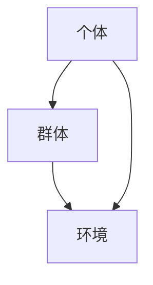
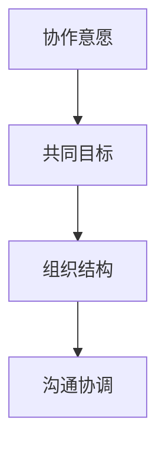
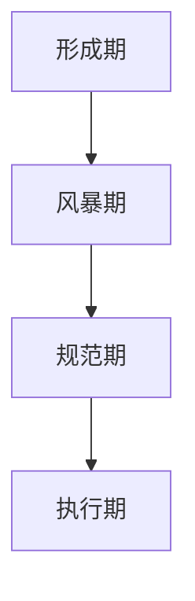
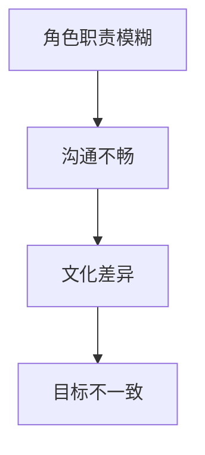
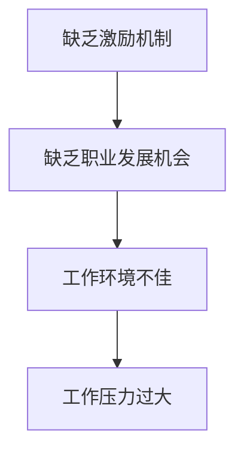
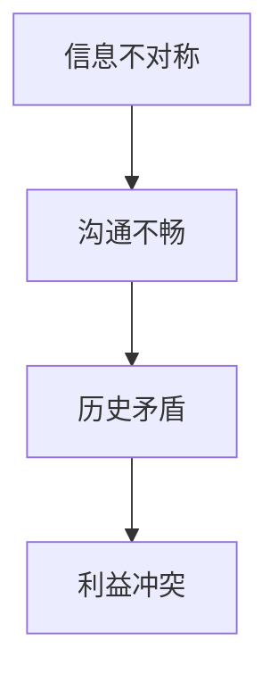

                 

### 引言

在快速发展的信息技术时代，团队建设已成为企业保持竞争力、推动创新的重要手段。然而，传统的团队建设方法往往局限于简单的团建活动和形式化的沟通，难以充分激发团队成员的潜力，也无法应对复杂多变的市场环境。因此，创新团队建设方法成为当前企业管理的迫切需求。本文旨在探讨团队建设创新方法，通过突破传统团建的局限，为企业提供新的发展路径。

团队建设的重要性不言而喻。一个高效的团队不仅能够提高工作效率，还能促进创新思维的碰撞，激发团队成员的积极性和创造力。然而，当前许多企业在团队建设方面仍存在诸多问题，如团队成员之间沟通不畅、协作不力、目标不明确等，这些问题严重制约了企业的发展。

本文将首先概述团队建设的基本概念和重要性，然后探讨团队建设的理论基础，包括勒温的群体动力学理论、巴纳德的社会系统理论以及布兰查德的团队建设模型。接着，我们将分析当前企业团队建设存在的问题，为后续讨论提供背景。在此基础上，本文将深入探讨传统团建方法的优缺点，揭示其局限性，为创新团队建设方法提供理论依据。

本文还将详细介绍项目导向型团队建设、创新思维训练和跨文化团队建设等创新方法，并分析其实践效果。最后，本文将总结团队建设创新方法的整合与应用，探讨其未来发展趋势，为企业提供全面的团队建设实践指南。通过本文的探讨，希望能够为读者提供新的思考角度，助力企业在激烈的市场竞争中脱颖而出。

### 团队建设的重要性与现状分析

#### 团队建设的基本概念

团队建设是指通过一系列系统化的活动和措施，增强团队成员之间的协作能力、提高团队整体效能的过程。团队建设不仅仅是一种管理手段，更是一种文化，它渗透到企业的方方面面，影响企业的运营和发展。

在企业管理中，团队建设扮演着至关重要的角色。首先，团队建设有助于提高员工的工作满意度和忠诚度。通过增强团队成员之间的信任和沟通，员工能够感受到企业的关怀和支持，从而更加愿意为企业付出努力。其次，团队建设能够提升团队的工作效率和创新能力。在一个协作紧密、相互信任的团队中，成员之间的知识共享和思维碰撞能够激发创新火花，推动企业不断进步。最后，团队建设有助于企业文化的建设。通过团队建设，企业可以培养一种积极向上、团结协作的企业文化，为企业的长远发展奠定坚实基础。

#### 团队建设在企业发展中的关键作用

团队建设对企业的成功至关重要，具体体现在以下几个方面：

1. **提高工作效率**：团队建设有助于建立高效的沟通机制和协作流程，使团队成员能够更快速地完成任务。在一个高效运作的团队中，每个成员都清楚自己的职责和目标，能够避免重复劳动和资源浪费。

2. **促进创新**：团队建设鼓励成员之间的知识共享和思维碰撞，有助于激发创新思维。在协作过程中，团队成员可以相互借鉴和学习，不断提出新的想法和解决方案，从而推动企业的技术创新和管理创新。

3. **增强团队凝聚力**：通过团队建设活动，团队成员之间可以建立起深厚的信任和友谊，增强团队的凝聚力。这种凝聚力不仅能够提高团队的工作效率，还能在面对挑战和困难时，使团队保持团结一致，共同克服难关。

4. **提升企业竞争力**：一个高效的团队是企业保持竞争力的关键。在当今快速变化的市场环境中，只有通过不断创新和高效协作，企业才能在激烈的市场竞争中立于不败之地。

#### 当前企业团队建设存在的问题

尽管团队建设对企业发展具有重要意义，但当前许多企业在团队建设方面仍存在诸多问题：

1. **沟通不畅**：许多企业团队内部存在沟通障碍，导致信息传递不畅、决策效率低下。团队成员之间缺乏有效的沟通渠道，信息往往只能在部门或层级行政范围内传递，无法实现跨部门的协同工作。

2. **协作不力**：在缺乏有效协作机制的情况下，团队成员之间的工作往往独立进行，缺乏整体规划和协调。这不仅降低了工作效率，还可能导致资源的重复利用和资源的浪费。

3. **目标不明确**：许多企业在团队建设过程中，没有明确团队的目标和愿景，导致团队成员工作缺乏方向和动力。在没有明确目标的情况下，团队成员容易迷失自我，难以产生内在的积极性和创造性。

4. **缺乏激励机制**：团队建设需要有效的激励机制来激发团队成员的积极性和创造力。然而，许多企业在激励机制方面做得不到位，导致团队成员缺乏工作动力，影响团队的整体效能。

5. **缺乏系统性**：团队建设需要系统化的规划和执行，但许多企业在团队建设过程中缺乏系统性和持续性。团队建设往往被视为一种临时性或应急性的活动，缺乏长期规划和持续投入，导致效果不佳。

通过对当前企业团队建设存在的问题进行分析，我们可以看到，这些问题不仅影响了团队的工作效率和企业的发展，也暴露出企业在团队建设方面的不足。因此，寻找创新团队建设方法，突破传统团建的局限，已成为企业亟待解决的问题。

#### 团队建设的理论基础

团队建设是一个复杂而多层次的过程，其理论基础涵盖了多个领域的理论框架。本文将介绍勒温的群体动力学理论、巴纳德的社会系统理论以及布兰查德的团队建设模型，这些理论为团队建设提供了重要的理论支撑和指导。

##### 勒温的群体动力学理论

勒温（Kurt Lewin）是群体动力学理论的奠基人，他提出了群体动力学的三个基本要素：个体、群体和环境。勒温认为，群体动力是指群体中个体行为之间的相互作用及其对个体行为的影响。

**核心概念与联系：**

1. **个体**：个体是群体的基础，每个个体都有其独特的性格、能力和价值观。
2. **群体**：群体是由多个个体组成的集合，具有共同的目标和规范。
3. **环境**：环境是群体外部的影响因素，包括物理环境、社会环境和文化环境。

**Mermaid 流程图：**



**应用场景：**勒温的理论在团队建设中的应用非常广泛，可以帮助管理者了解团队内部个体行为和群体行为的相互作用，从而制定有效的团队建设策略。

##### 巴纳德的社会系统理论

切斯特·巴纳德（Chester Barnard）是社会系统理论的奠基人，他提出了组织是一个社会系统的观点。巴纳德认为，组织是由多个个体组成的协作系统，通过正式的沟通和协作来实现共同的目标。

**核心概念与联系：**

1. **协作意愿**：个体愿意为组织的目标做出贡献。
2. **共同目标**：组织内部成员具有共同的目标和愿景。
3. **组织结构**：组织通过结构化的规则和流程来协调成员的行为。

**Mermaid 流程图：**



**应用场景：**巴纳德的理论在团队建设中的应用，可以帮助企业理解组织内部协作机制的构建，从而优化团队的组织结构和沟通流程。

##### 布兰查德的团队建设模型

肯尼斯·布兰查德（Kenneth Blanchard）和斯潘塞·琼斯（Spencer Johnson）在《团队建设之道》一书中提出了团队建设的四个阶段模型：形成期、风暴期、规范期和执行期。

**核心概念与联系：**

1. **形成期**：团队刚刚组建，成员相互认识，开始了解团队的目标和职责。
2. **风暴期**：成员之间的冲突和矛盾开始显现，团队内部开始出现分歧。
3. **规范期**：团队逐渐进入稳定期，成员开始接受团队规范，团队开始形成共同的目标和价值观。
4. **执行期**：团队进入高效期，成员之间协作顺畅，团队目标得以实现。

**Mermaid 流�程图：**



**应用场景：**布兰查德的理论模型可以帮助团队管理者识别团队发展的不同阶段，并采取相应的团队建设策略，促进团队的健康发展。

通过介绍勒温的群体动力学理论、巴纳德的社会系统理论和布兰查德的团队建设模型，我们可以看到团队建设理论的多层次性和复杂性。这些理论为团队建设提供了丰富的理论基础和指导思路，有助于企业在团队建设过程中更好地应对挑战，实现团队的高效运作和持续发展。

#### 团队建设的核心要素

团队建设是一个涉及多个方面和多个层次的复杂过程。为了确保团队的高效运作和持续发展，企业需要关注以下几个核心要素：团队成员的角色与责任、团队目标的设定与实现、以及团队沟通与协作技巧。

##### 团队成员的角色与责任

团队成员的角色与责任是团队建设的基础。每个成员都应明确自己在团队中的角色和责任，以便更好地发挥自己的优势和协作能力。

1. **角色识别**：团队成员的角色可以分为领导角色、执行角色、支持角色和协调角色。领导角色负责制定团队目标和指导团队成员；执行角色负责完成具体任务；支持角色提供技术支持和资源保障；协调角色负责协调各方资源和利益。

2. **责任划分**：明确团队成员的责任有助于提高工作效率和减少责任模糊。企业应建立明确的岗位责任制度，确保每个成员都清楚自己的职责范围，避免工作重叠和责任推诿。

3. **角色互动**：团队成员之间的角色互动是团队协作的重要环节。企业应鼓励成员之间相互支持、相互学习，通过角色互动提升团队的整体效能。

##### 团队目标的设定与实现

团队目标是指团队在一定时间内希望达成的具体目标和成果。设定明确的团队目标有助于激发团队成员的积极性和创造力，推动团队的高效运作。

1. **目标设定**：团队目标应具有明确性、可测量性和可实现性。企业可以通过SMART原则（Specific具体的、Measurable可测量的、Achievable可实现的、 Relevant相关的、Time-bound有时限的）来设定团队目标，确保目标清晰明确。

2. **目标分解**：将团队目标分解为具体的子目标和任务，明确每个任务的责任人和完成时间。通过目标分解，可以确保每个成员都清楚自己的任务和目标，从而提高团队的执行力和协同效率。

3. **目标实现**：在目标实现过程中，企业应持续跟踪和评估目标的完成情况，及时调整策略和资源分配。通过定期的团队会议和绩效评估，确保团队成员了解目标的进展，并根据实际情况进行及时调整。

##### 团队沟通与协作技巧

有效的沟通和协作是团队建设成功的关键。企业应关注以下几个方面，提升团队的沟通与协作能力：

1. **沟通渠道**：建立多种沟通渠道，包括面对面的会议、邮件、即时通讯工具和项目管理软件等，确保信息畅通无阻。企业应鼓励团队成员积极参与沟通，分享自己的想法和意见。

2. **沟通技巧**：提高团队成员的沟通技巧，包括倾听、表达、反馈和解决问题的能力。企业可以通过培训和实践，提升团队成员的沟通能力，减少误解和冲突。

3. **协作工具**：运用现代化的协作工具，如共享文档、项目管理软件和协作平台，提高团队的工作效率和协作效果。这些工具可以帮助团队成员实时共享信息、协同工作和监控项目进度。

4. **协作文化**：培育一种积极向上的协作文化，鼓励团队成员相互支持、共同进步。企业可以通过团队建设活动和激励机制，增强团队成员的归属感和协作意识。

通过关注团队成员的角色与责任、团队目标的设定与实现以及团队沟通与协作技巧，企业可以构建一个高效、协作紧密的团队，推动企业的持续发展和创新。

#### 传统团建方法的优缺点分析

传统的团队建设方法，如户外拓展、团队游戏和聚会等，在企业中被广泛应用。这些方法在一定程度上能够提高团队凝聚力，增强团队成员之间的信任和合作意识。然而，随着企业环境的变化和团队需求的多样化，传统团建方法的局限性逐渐显现。

##### 传统团建的常见方法

1. **户外拓展训练**：通过攀岩、高空走钢丝、拓展基地等项目，让团队成员在挑战和团队协作中增强信任和凝聚力。
2. **团队游戏**：通过组织桌游、电子游戏和户外运动等游戏活动，促进团队成员之间的互动和沟通。
3. **团队聚会**：通过举办生日聚会、团建晚宴和节日庆祝等活动，增强团队成员的归属感和团队文化。
4. **团队旅行**：组织团队集体旅行，通过共同体验和分享，增进团队成员之间的了解和信任。

##### 传统团建的优点

1. **提升团队凝聚力**：通过共同参与活动，团队成员能够更好地了解彼此，增强团队凝聚力。
2. **增强信任感**：在户外拓展和团队游戏中，团队成员需要相互依赖和合作，有助于建立信任感。
3. **激发积极性**：通过有趣的活动和游戏，能够激发团队成员的积极性和参与热情。
4. **提升团队士气**：团队聚会和旅行等活动能够提升团队成员的士气，增强团队面对挑战的信心。

##### 传统团建的局限

1. **形式化**：传统团建活动往往过于形式化，缺乏深入的实际互动和沟通，难以触及团队成员的心理需求。
2. **短期效果**：传统团建活动通常只能带来短期的效果，团队成员在回归工作环境后，团建带来的积极影响会逐渐减弱。
3. **缺乏针对性**：传统团建方法往往缺乏针对性，无法针对不同团队和成员的特点进行个性化设计，导致效果不佳。
4. **资源浪费**：传统团建活动可能需要大量的时间和经费，且效果有限，导致资源浪费。
5. **无法解决深层次问题**：传统团建方法难以解决团队内部存在的深层次问题，如沟通不畅、协作不力等，这些问题仍然是团队发展的瓶颈。

通过分析传统团建的优缺点，我们可以看到，尽管传统团建方法在一定程度上能够提升团队凝聚力，但其形式化、短期效果和缺乏针对性等问题，使其难以满足现代企业对团队建设的需求。因此，探索创新团队建设方法，突破传统团建的局限，已成为企业提升团队效能的必然选择。

#### 团队建设中常见问题的根源分析

在团队建设过程中，许多企业面临一系列问题，这些问题严重制约了团队的高效运作和持续发展。为了找到解决这些问题的有效方法，我们需要深入分析其根源。以下将探讨团队成员之间的冲突、积极性不高和信任不足等问题的根源。

##### 团队成员之间的冲突

1. **角色职责模糊**：团队成员在角色和职责上存在模糊，导致工作交叉或责任推诿，进而引发冲突。例如，在项目管理中，项目成员可能不清楚各自的职责和任务分工，导致工作重复或责任不清。

2. **沟通不畅**：团队内部沟通不畅是导致冲突的重要原因。信息传递错误、误解和不明确的沟通可能导致团队成员之间的误会和冲突。

3. **文化差异**：团队成员来自不同的背景和文化，缺乏相互理解和尊重，容易引发文化冲突。文化差异可能表现为语言、价值观和工作习惯等方面的差异。

4. **目标不一致**：团队成员在目标设定上存在差异，可能导致团队内部出现分歧和冲突。如果团队成员对团队目标缺乏共识，将难以形成统一的行动。

**Mermaid 流程图：**



##### 团队成员积极性不高

1. **缺乏激励机制**：团队成员在缺乏有效激励机制的情况下，工作积极性会降低。如果团队成员感到自己的付出没有得到相应的回报，将失去工作动力。

2. **缺乏职业发展机会**：团队成员在缺乏职业发展机会的情况下，可能会感到工作没有前途，导致积极性不高。职业发展机会包括晋升机会、培训机会和职业规划等。

3. **工作环境不佳**：工作环境对团队成员的积极性具有重要影响。如果工作环境不舒适、资源不足或管理不善，团队成员的积极性会受到影响。

4. **工作压力过大**：长期的工作压力和紧张的工作节奏可能导致团队成员身心疲惫，从而降低工作积极性。

**Mermaid 流程图：**



##### 团队成员之间的信任不足

1. **信息不对称**：团队成员之间信息不对称会导致信任缺失。如果团队成员无法获得关键信息或信息传递不及时，将产生猜疑和不信任。

2. **沟通不畅**：团队内部沟通不畅是信任不足的重要原因。信息传递错误、误解和不明确的沟通会导致团队成员之间的不信任。

3. **历史矛盾**：团队成员之间可能存在历史矛盾或误解，这些矛盾和误解会阻碍信任的建立。例如，过去的冲突或误解可能导致团队成员对彼此的信任度降低。

4. **利益冲突**：团队内部可能存在利益冲突，导致团队成员之间的信任不足。利益冲突可能表现为资源分配不均、任务分配不公等。

**Mermaid 流程图：**



通过深入分析团队成员之间的冲突、积极性不高和信任不足等问题的根源，我们可以看到这些问题的产生是多方面的，涉及角色职责、沟通、激励、环境等多个方面。要解决这些问题，企业需要采取综合性的措施，包括明确角色职责、改善沟通机制、制定有效的激励机制和营造良好的工作环境等。通过这些措施，企业可以构建一个信任、积极和高效的团队，推动企业的持续发展和创新。

#### 突破传统团建局限的创新方法

在传统团建方法暴露出种种局限的背景下，探索创新的团队建设方法成为当前企业管理的重点。以下将介绍几种突破传统团建局限的创新方法，包括项目导向型团队建设、创新思维训练和跨文化团队建设。

##### 项目导向型团队建设

项目导向型团队建设是一种以项目为核心，强调团队成员协作和共同目标实现的团队建设方法。其核心思想是通过实际项目的开展，提升团队成员的协作能力、解决问题的能力和团队凝聚力。

**核心概念与联系：**

1. **项目目标明确**：项目导向型团队建设强调项目目标的明确性和具体性，确保团队成员对项目目标有清晰的认识。
2. **任务分配合理**：在项目开展过程中，团队成员根据各自的专长和职责，分配任务，确保任务分工合理，提高工作效率。
3. **协作与反馈**：团队成员在项目执行过程中，通过定期的协作会议和反馈机制，保持沟通畅通，及时解决问题，确保项目进度和质量。

**伪代码示例：**

```python
def project导向型团队建设（团队，项目目标）：
    # 设定项目目标
    团队目标 = 设定目标（项目目标）
    
    # 分配任务
    任务分配 = 分配任务（团队，团队目标）
    
    # 开展协作
    while 项目未完成：
        # 定期召开协作会议
        协作会议（团队）
        
        # 解决问题
        问题解决 = 解决问题（团队，任务分配）
        
        # 反馈进度
        进度反馈 = 反馈进度（团队，任务分配）
```

**数学模型和公式：**

项目完成时间 = 项目总任务量 / 团队成员工作效率

**举例说明：**某科技公司采用项目导向型团队建设方法，开展一个软件开发项目。项目目标明确为在三个月内完成一个新产品的开发。团队成员根据各自的职责分工，分别负责前端开发、后端开发和测试任务。在项目执行过程中，团队通过每周的协作会议和反馈机制，确保任务进度和质量，最终成功在三个月内完成项目。

##### 创新思维训练

创新思维训练是一种通过系统化的训练方法，提升团队成员创新能力和解决问题能力的团队建设方法。其核心思想是通过思维训练，激发团队成员的创新潜力，促进团队的创新能力和竞争力。

**核心概念与联系：**

1. **思维训练方法**：创新思维训练包括头脑风暴、思维导图、逆向思维等多种方法，旨在激发团队成员的创造力。
2. **思维碰撞**：通过团队内部的思维碰撞，实现不同观点和思路的融合，促进创新思维的产生。
3. **成果应用**：将创新思维应用到实际项目中，提升团队解决问题的能力和项目的创新性。

**伪代码示例：**

```python
def 创新思维训练（团队）：
    # 开展头脑风暴
    头脑风暴（团队）
    
    # 制作思维导图
    思维导图（团队，头脑风暴结果）
    
    # 逆向思维训练
    逆向思维训练（团队）
    
    # 应用创新思维
    创新应用 = 应用创新思维（团队，思维导图，逆向思维结果）
```

**数学模型和公式：**

创新效率 = 创新思维训练次数 × 团队成员创新思维活跃度

**举例说明：**某互联网公司通过创新思维训练，提升团队的创新能力和解决问题能力。在每月的团队培训中，公司邀请创新思维专家进行培训，通过头脑风暴、思维导图和逆向思维等训练方法，激发团队成员的创新思维。在项目开发过程中，团队成员将创新思维应用到实际项目中，成功开发出具有创新性的产品，提高了公司的市场竞争力。

##### 跨文化团队建设

跨文化团队建设是一种在多元文化背景下，通过文化融合和沟通，提升团队协作能力和团队效能的团队建设方法。其核心思想是通过文化理解和沟通，消除文化差异带来的障碍，促进团队的合作和发展。

**核心概念与联系：**

1. **文化理解**：跨文化团队建设强调团队成员对多元文化的理解和尊重，通过文化培训和文化交流活动，提升团队成员的文化认知。
2. **沟通协作**：在跨文化团队中，沟通是关键。通过有效的沟通机制和文化适应性培训，提升团队成员的沟通能力和文化适应性。
3. **团队融合**：通过团队融合活动和文化融合机制，消除文化差异，促进团队内部的融合和协作。

**伪代码示例：**

```python
def 跨文化团队建设（团队，文化背景）：
    # 开展文化培训
    文化培训（团队，文化背景）
    
    # 文化交流活动
    文化活动（团队，文化背景）
    
    # 沟通适应性培训
    沟通适应性培训（团队，文化背景）
    
    # 团队融合活动
    团队融合活动（团队，文化背景）
```

**数学模型和公式：**

团队效能 = 文化理解度 × 沟通效率 × 团队融合度

**举例说明：**某跨国公司通过跨文化团队建设，提升团队的国际协作能力。公司定期组织跨文化培训，邀请国际专家进行文化讲解和交流活动。在项目开发过程中，公司通过跨文化沟通机制，确保团队成员之间的沟通畅通和文化理解。通过团队的共同努力，项目成功完成，并得到了国际客户的认可。

通过项目导向型团队建设、创新思维训练和跨文化团队建设等创新方法，企业可以突破传统团建的局限，提升团队效能和创新能力，推动企业的持续发展和创新。

#### 项目导向型团队建设的实践

项目导向型团队建设（Project-Oriented Team Building, POTB）是一种以项目为核心，通过团队协作和共同目标实现来提升团队效能的方法。本文将详细介绍项目导向型团队建设的实践，包括其案例分析、实施步骤和效果评估。

##### 案例分析

**案例：**某国际知名科技公司——ABC公司，其研发部门在项目导向型团队建设方面有着丰富的实践经验。ABC公司每年都会推出多个创新项目，要求各部门组建跨功能团队，共同完成项目任务。以下是ABC公司实施项目导向型团队建设的具体案例：

1. **项目背景**：ABC公司决定开发一款智能医疗诊断系统，该项目涉及软件、硬件和医疗知识等多个领域。为了确保项目顺利进行，公司决定采用项目导向型团队建设方法。

2. **团队组建**：公司从不同部门选拔了具有不同技能背景的成员，组建了一个跨功能团队，包括软件工程师、硬件工程师、数据科学家和医疗专家。团队成员各自负责自己的专长领域，同时需要与其他成员紧密合作。

3. **项目目标**：团队的目标是在一年内完成智能医疗诊断系统的设计、开发和测试，并在临床试验中验证其有效性。

4. **实施过程**：团队在项目过程中采用了敏捷开发方法，通过定期迭代和反馈，不断优化产品功能。团队成员在项目中进行了多次跨部门协作，通过线上会议、文档共享和即时通讯工具保持高效沟通。

5. **效果评估**：项目最终成功完成，智能医疗诊断系统在临床试验中表现出色，获得了医疗专家和用户的高度评价。团队成员对项目导向型团队建设方法给予了高度认可，认为这种方法提高了团队协作效率和项目成功率。

##### 实施步骤

1. **项目需求分析**：在项目启动阶段，团队需要对项目需求进行详细分析，明确项目的目标、范围和预期成果。需求分析的结果将作为团队建设和项目执行的基础。

2. **团队组建**：根据项目需求，从各部门选拔具有相关技能和经验的成员，组建一个跨功能团队。团队成员需要具备不同的专业背景，以确保项目能够在多个领域取得突破。

3. **任务分配**：在团队组建完成后，根据成员的专长和项目的需求，将任务分配给各个成员。任务分配要确保任务的合理性和可行性，避免任务重叠或资源浪费。

4. **沟通机制建立**：建立高效的沟通机制，包括定期团队会议、在线协作工具和文档共享平台。通过这些沟通工具，确保团队成员能够及时沟通、分享信息和协调工作。

5. **迭代与反馈**：采用敏捷开发方法，通过定期迭代和反馈机制，不断优化项目进度和产品质量。在每次迭代结束后，团队需要召开评审会议，评估项目的进展情况，并根据反馈调整项目计划和策略。

6. **效果评估**：在项目完成后，对项目导向型团队建设方法进行效果评估。通过评估团队成员的满意度、项目成功率、团队协作效率等指标，分析团队建设的成效。

##### 效果评估

1. **团队成员满意度**：通过问卷调查和访谈，收集团队成员对项目导向型团队建设方法的满意度。满意度高的团队建设方法可以继续推广和应用。

2. **项目成功率**：评估项目导向型团队建设方法对项目成功率的影响。通过对比传统团队建设和项目导向型团队建设方法在项目成功率方面的差异，分析其优势。

3. **团队协作效率**：评估团队在项目执行过程中的协作效率。通过分析团队在任务分配、沟通协作、问题解决等方面的表现，评估团队协作效率。

4. **项目质量**：评估项目导向型团队建设方法对项目质量的影响。通过对比项目的功能完整性、性能指标和用户满意度等指标，分析团队建设对项目质量的影响。

通过案例分析、实施步骤和效果评估，我们可以看到项目导向型团队建设方法在提升团队效能、促进项目成功和改善团队协作方面具有显著优势。企业可以通过实践项目导向型团队建设，提高团队的整体效能和竞争力。

#### 创新思维训练方法与实践

创新思维训练是一种旨在提升团队成员创新能力和解决问题能力的系统化训练方法。它通过多种思维训练方法，激发团队成员的创新潜力，促进团队在复杂问题解决和项目开发中的突破。以下将详细介绍创新思维训练的基本原理、具体方法和实践案例。

##### 创新思维的基本原理

创新思维是一种能够产生新颖、有价值想法的思维方式，其核心在于打破传统思维模式，寻求新的解决方案。创新思维的基本原理包括以下几点：

1. **联想思维**：通过不同元素之间的关联，发现新的解决方案。例如，通过将 unrelated concepts 联系起来，创造出新的产品或服务。

2. **逆向思维**：从相反的角度思考问题，寻求创新解决方案。例如，在产品设计中，通过考虑如何简化产品而不是如何增加功能，来提高用户体验。

3. **发散思维**：在思维过程中产生大量想法，不限制思维的广度。通过大量想法的碰撞，筛选出可行的解决方案。

4. **收敛思维**：在发散思维的基础上，对产生的想法进行筛选和整合，集中精力在最有潜力的解决方案上。

5. **系统性思维**：从整体角度思考问题，考虑各个部分之间的相互作用和影响，以确保解决方案的全面性和可行性。

##### 创新思维训练方法

1. **头脑风暴**：头脑风暴是一种集体创新思维训练方法，通过快速产生大量想法，激发团队的创造力和想象力。在头脑风暴过程中，鼓励团队成员自由发言，不受任何限制，将所有想法记录下来。随后，对产生的想法进行筛选和评估，找出最有价值的解决方案。

2. **思维导图**：思维导图是一种以图形化方式组织思维过程的工具，能够帮助团队成员清晰地表达和可视化自己的想法。通过绘制思维导图，团队成员可以更好地理解问题，发现新的解决方案，并促进团队内部的沟通和协作。

3. **案例分析**：通过分析成功的创新案例，团队成员可以学习到创新思维的实际应用和效果。案例分析包括对案例背景、过程和结果的详细研究，帮助团队成员了解创新的步骤和方法。

4. **角色扮演**：角色扮演是一种模拟创新实践的方法，通过模拟实际情境，团队成员可以体验不同的角色和观点，激发创新思维。角色扮演可以帮助团队成员理解问题的不同方面，促进跨学科的交流和协作。

5. **设计思维**：设计思维是一种以用户为中心的创新方法，强调从用户的角度出发，理解用户的需求和问题，并设计出创新的解决方案。设计思维包括需求分析、原型设计、用户测试和迭代改进等步骤。

##### 创新思维训练案例分析

**案例：**某科技公司通过创新思维训练，成功开发了一款智能家居产品。以下是该公司的创新思维训练过程：

1. **需求分析**：公司首先进行了市场需求分析，了解用户对智能家居产品的需求和期望。

2. **头脑风暴**：组织团队成员进行头脑风暴，列出所有可能的智能家居功能，包括智能照明、智能安防、智能家电控制等。

3. **思维导图**：通过思维导图，团队成员将头脑风暴的结果进行梳理和分类，形成不同的功能模块。

4. **角色扮演**：团队成员分别扮演产品经理、工程师和用户，模拟产品设计和用户体验过程，发现并解决潜在问题。

5. **设计思维**：根据用户需求和问题，团队设计出智能家居产品的原型，并进行用户测试和反馈。

6. **迭代改进**：根据用户反馈，团队对产品原型进行多次迭代改进，最终开发出一款符合用户需求的智能家居产品。

通过创新思维训练，该公司的智能家居产品在市场上取得了成功，不仅满足了用户的需求，还提升了公司的创新能力和市场竞争力。

##### 创新思维训练的具体实践

1. **建立创新思维培训体系**：公司可以建立系统的创新思维培训体系，包括基础课程、高级课程和专项培训，帮助团队成员不断提升创新思维能力。

2. **定期组织创新思维训练**：公司可以定期组织创新思维训练活动，如创新工作坊、头脑风暴会议和设计思维工作坊，鼓励团队成员积极参与。

3. **设立创新奖励机制**：公司可以设立创新奖励机制，对提出创新想法和解决方案的团队成员进行奖励，激发团队成员的创新热情。

4. **跨学科合作**：鼓励团队成员跨学科合作，通过不同领域的知识和经验碰撞，产生创新的火花。

5. **实践应用**：将创新思维训练应用到实际项目中，鼓励团队成员在实际工作中运用创新思维，解决实际问题。

通过创新思维训练，企业可以提升团队的创新能力和竞争力，推动企业的持续发展和市场拓展。

#### 跨文化团队建设实践

跨文化团队建设在全球化背景下具有重要意义，它能够帮助企业在多元文化环境中实现有效的沟通与合作，提高团队效能。以下将详细探讨跨文化团队建设的挑战、策略以及成功案例分析。

##### 跨文化团队建设的挑战

1. **语言障碍**：语言差异是跨文化团队建设中最直接、最显著的挑战之一。语言障碍不仅影响日常沟通，还会导致误解和沟通不畅，进而影响团队的协作效率。

2. **文化差异**：文化差异包括价值观、行为规范、工作习惯等方面。不同文化背景的团队成员在沟通、决策和协作方式上可能存在显著差异，这些差异可能导致冲突和误解。

3. **信任问题**：在跨文化团队中，由于文化背景的不同，团队成员之间可能存在信任问题。信任不足会影响团队的协作和合作氛围，降低团队效能。

4. **沟通障碍**：文化差异导致沟通障碍，团队成员可能无法准确理解对方的意图和需求，从而影响沟通效果。

5. **管理难度**：跨文化团队的管理难度较高，需要管理者具备跨文化管理能力，能够在不同文化之间找到平衡点，协调团队成员的关系。

##### 跨文化团队建设策略

1. **文化培训**：文化培训是跨文化团队建设的基础，通过系统的文化培训，团队成员可以了解不同文化的特点、价值观和行为规范。文化培训可以包括文化讲座、文化研讨会和文化体验活动等。

2. **建立有效的沟通机制**：建立有效的沟通机制，确保信息在团队内部高效传递。这包括使用多语言支持、建立跨文化沟通工具和平台、定期组织跨文化沟通会议等。

3. **信任建设**：通过建立信任机制，促进团队成员之间的信任。这可以包括开展团队建设活动、设置共同目标、进行跨文化团队合作项目等，以增强团队成员之间的信任感。

4. **角色明确**：在跨文化团队中，明确每个成员的角色和责任，确保每个成员都清楚自己的职责和工作目标。这有助于减少误解和冲突，提高团队协作效率。

5. **领导力培训**：领导力培训是跨文化团队建设的关键，通过培训提升领导者的跨文化管理能力，使其能够有效地协调和管理多元文化团队。

##### 跨文化团队建设成功案例分析

**案例：**某国际知名的软件开发公司——XYZ公司，其成功实施跨文化团队建设的经验值得借鉴。

1. **项目背景**：XYZ公司在全球范围内拥有多个研发中心，这些研发中心由来自不同国家和文化背景的工程师组成。为了提高团队效能和项目成功率，公司决定实施跨文化团队建设。

2. **文化培训**：公司定期组织文化培训，帮助团队成员了解不同文化的特点和行为规范。培训内容包括语言学习、文化差异分析、跨文化沟通技巧等。

3. **沟通机制**：公司建立了多语言的沟通平台和工具，确保团队成员能够使用自己熟悉的语言进行交流。此外，公司还定期组织跨文化沟通会议，确保信息在团队内部高效传递。

4. **信任建设**：公司通过共同目标、团队合作项目和团队建设活动，增强团队成员之间的信任。团队成员在共同完成任务的过程中，建立了深厚的信任和合作关系。

5. **领导力培训**：公司对领导者进行跨文化管理培训，提升他们的跨文化管理能力，使他们能够更好地协调和管理多元文化团队。

6. **效果评估**：通过定期的团队效能评估和用户反馈，公司评估跨文化团队建设的效果。评估结果显示，跨文化团队的建设显著提升了项目成功率、团队协作效率和用户满意度。

通过该案例，我们可以看到跨文化团队建设在提高团队效能、促进项目成功和提升用户满意度方面具有显著作用。企业可以通过实施有效的跨文化团队建设策略，克服文化差异和沟通障碍，实现多元文化团队的高效协作。

#### 团队建设创新方法的整合与应用

在探讨和分析了多种团队建设创新方法后，我们可以看到，这些方法各有其独特的优势和应用场景。为了最大限度地发挥这些方法的综合效能，企业需要将不同的团队建设创新方法进行整合，形成一套系统的、可持续的团队建设方案。以下将讨论团队建设创新方法的整合思路、综合应用案例以及这些方法的未来发展趋势。

##### 团队建设创新方法的整合思路

1. **目标一致性**：确保所有团队建设创新方法的目标一致，即提升团队效能、促进创新和增强团队凝聚力。通过明确一致的目标，可以确保各项方法之间的协调和互补。

2. **层次性**：根据团队建设的不同阶段，采用不同层次的团队建设创新方法。例如，在团队形成期，可以采用项目导向型团队建设和创新思维训练，帮助团队成员快速融入和形成共同目标；在团队成熟期，可以采用跨文化团队建设，提升团队的国际协作能力和文化适应性。

3. **阶段性**：团队建设是一个持续的过程，需要根据团队的不同发展阶段，有针对性地选择和应用团队建设创新方法。例如，在团队初期，可以重点进行角色明确和沟通机制建立；在团队中期，可以加强创新思维训练和跨文化沟通；在团队后期，可以侧重于效果评估和持续改进。

4. **互动性**：不同团队建设创新方法之间应具有互动性，通过相互影响和补充，形成良性的团队建设生态系统。例如，项目导向型团队建设可以激发创新思维，而创新思维训练可以为项目提供更多创新解决方案。

##### 团队建设创新方法的综合应用案例分析

**案例：**某全球领先的科技公司——TechXYZ公司，通过整合多种团队建设创新方法，实现了团队效能的显著提升。

1. **项目导向型团队建设**：TechXYZ公司通过项目导向型团队建设，在项目启动阶段明确项目目标和任务分工，确保团队成员了解自己的职责和工作方向。在项目执行过程中，通过定期的项目评审和反馈机制，不断优化项目进度和团队协作。

2. **创新思维训练**：公司定期组织创新思维训练，通过头脑风暴、思维导图和设计思维等方法，激发团队成员的创新潜力，推动团队在产品开发和问题解决中不断突破。

3. **跨文化团队建设**：TechXYZ公司在全球范围内拥有多个研发中心，通过跨文化团队建设，提升了团队的多元文化适应能力和沟通协作效率。公司通过文化培训、多语言支持和跨文化沟通机制，确保团队成员在不同文化背景下能够高效合作。

4. **效果评估与反馈**：公司建立了完善的效果评估机制，通过定期的团队效能评估和用户反馈，不断优化团队建设方案，确保团队建设创新方法能够持续发挥效能。

通过综合应用项目导向型团队建设、创新思维训练和跨文化团队建设等创新方法，TechXYZ公司成功提升了团队效能、项目成功率和用户满意度。

##### 团队建设创新方法的应用前景

1. **数字化赋能**：随着数字技术的不断发展，数字化工具和平台将越来越多地应用于团队建设。例如，通过人工智能和大数据分析，企业可以更精准地了解团队成员的行为和需求，提供个性化的团队建设方案。

2. **可持续性**：团队建设创新方法将更加注重可持续性，通过建立长效机制和持续改进，确保团队建设的效果能够长期维持。企业可以通过定期评估和反馈，不断优化团队建设策略。

3. **全球化趋势**：全球化趋势将继续推动企业国际化发展，跨文化团队建设将变得更加重要。企业需要不断提升跨文化管理能力，以应对多元文化背景下的团队建设挑战。

4. **个性化需求**：随着团队成员个性化需求的增加，团队建设创新方法将更加注重个性化和定制化。企业可以通过了解团队成员的个性化需求，提供针对性的培训和指导。

通过整合和应用团队建设创新方法，企业可以构建一个高效、创新和充满活力的团队，推动企业的持续发展和市场竞争力。

### 文章小结与展望

在本文中，我们深入探讨了团队建设创新方法，从项目导向型团队建设、创新思维训练到跨文化团队建设，通过详细的理论阐述和实际案例分析，展示了这些创新方法如何突破传统团建的局限，提升团队效能和企业竞争力。通过本文的研究，我们可以得出以下结论：

1. **团队建设的重要性**：团队建设是企业保持竞争力、推动创新的关键因素。一个高效的团队不仅能提高工作效率，还能激发创新思维和团队凝聚力。
   
2. **传统团建的局限性**：传统团建方法往往形式化、缺乏针对性，难以应对复杂多变的企业环境。因此，创新团队建设方法成为企业的迫切需求。

3. **创新方法的优势**：项目导向型团队建设、创新思维训练和跨文化团队建设等方法，能够针对性地解决传统团建中存在的问题，提升团队协作效率和创新能力。

4. **整合应用的必要性**：将多种团队建设创新方法进行整合，形成系统的、可持续的团队建设方案，能够最大化地发挥这些方法的综合效能。

然而，团队建设是一个动态、持续的过程，需要企业根据实际情况不断调整和优化团队建设策略。未来的研究可以进一步探讨以下方向：

1. **数字化赋能**：利用人工智能和大数据分析，为企业提供更精准、个性化的团队建设方案。
   
2. **跨文化团队建设的深化**：在全球化背景下，深入探讨跨文化团队建设的方法和策略，提升企业在国际市场中的竞争力。

3. **持续改进机制**：建立长效的团队建设效果评估和反馈机制，确保团队建设方法的持续改进和优化。

通过不断探索和创新，企业可以构建一个高效、创新和充满活力的团队，为企业的长远发展奠定坚实基础。

### 附录

#### 附录A：团队建设创新方法相关工具与资源

**A.1 团队建设工具概述**

团队建设工具是指用于促进团队成员沟通、协作和互动的各种工具和平台。这些工具包括：

- **会议工具**：如Zoom、Microsoft Teams、Google Meet等，用于远程会议和视频通话。
- **协作平台**：如Trello、Asana、Jira等，用于任务分配、进度跟踪和项目协作。
- **文档共享工具**：如Google Docs、Microsoft Office 365等，用于实时协作和文档管理。
- **沟通工具**：如Slack、Telegram、WhatsApp等，用于即时通讯和团队互动。
- **反馈工具**：如SurveyMonkey、Google Forms等，用于收集团队成员的意见和反馈。

**A.2 常用团队建设软件介绍**

1. **Trello**：一款基于看板的项目管理工具，适合团队协作和任务管理。
2. **Slack**：一款即时通讯工具，提供聊天、文件共享和集成第三方应用等功能。
3. **Zoom**：一款视频会议和远程协作工具，支持多地点、多设备的在线会议。
4. **Asana**：一款任务管理和项目跟踪工具，帮助团队高效协作。
5. **Google Workspace**：包括Google Docs、Google Sheets、Google Forms等，提供全面的在线办公解决方案。

**A.3 团队建设相关书籍推荐**

1. **《团队协作的力量》**：作者：斯蒂芬·罗宾斯
2. **《团队管理的艺术》**：作者：汤姆·彼得斯、罗伯特·沃特曼
3. **《五项管理：团队协作的五项关键技能》**：作者：迈克尔·波特
4. **《创新者的DNA》**：作者：史蒂夫·布兰克
5. **《跨越式成长：如何利用学习创造奇迹》**：作者：史蒂芬·平克

**A.4 团队建设网络资源链接**

1. **团队建设网**：[http://www.teamwork101.com/](http://www.teamwork101.com/)
2. **团队建设技巧**：[http://www.teambuilding.com/](http://www.teambuilding.com/)
3. **团队建设协会**：[https://www.atd.org/](https://www.atd.org/)
4. **团队建设培训课程**：[https://www.team-training.com/](https://www.team-training.com/)
5. **团队建设工具指南**：[http://www.team-building-tools.com/](http://www.team-building-tools.com/)

这些工具和资源将帮助企业在团队建设过程中更好地应用创新方法，提高团队效能和协作效率。

### 附录B：团队建设创新方法实践指南

**B.1 团队建设创新方法实践步骤**

1. **需求分析**：首先，企业需要明确团队建设的具体需求，包括团队目标、团队成员的特点和现有的团队建设问题等。

2. **方法选择**：根据需求分析结果，选择适合的团队建设创新方法。例如，如果团队需要提升创新思维能力，可以选择创新思维训练方法；如果团队需要增强跨文化沟通能力，可以选择跨文化团队建设方法。

3. **实施规划**：制定详细的实施计划，包括时间表、活动安排、资源分配和预期效果等。

4. **培训与指导**：对团队成员进行相关方法的培训，确保他们了解和掌握创新方法的具体内容和操作流程。

5. **执行与监督**：按照实施计划进行团队建设活动，并定期监督和评估团队建设的进展情况。

6. **效果评估**：在团队建设活动结束后，对效果进行评估，收集团队成员的反馈意见，并根据评估结果进行改进。

**B.2 团队建设创新方法实践模板**

1. **项目导向型团队建设模板**：

   - **活动流程**：项目启动会、项目执行阶段会议、项目评审会。
   - **任务分配**：根据团队成员的专长和项目需求，分配任务。
   - **进度跟踪**：使用项目管理工具（如Trello或Asana）进行任务进度跟踪。
   - **反馈机制**：定期召开项目评审会，收集团队成员的反馈，调整项目计划。

2. **创新思维训练模板**：

   - **活动流程**：头脑风暴会、思维导图绘制、创新解决方案筛选。
   - **培训内容**：创新思维方法（如发散思维、逆向思维、设计思维）。
   - **实践应用**：在实际项目中应用创新思维，提出改进建议。

3. **跨文化团队建设模板**：

   - **活动流程**：文化培训、跨文化沟通练习、团队建设活动。
   - **文化培训**：介绍不同文化的特点和行为规范。
   - **沟通练习**：通过角色扮演、模拟会议等形式，提升团队成员的跨文化沟通能力。
   - **团队活动**：组织文化体验活动，增强团队成员的文化认同和团队凝聚力。

**B.3 团队建设创新方法实践案例分析**

1. **案例一：创新思维训练在团队建设中的应用**：

   - **背景**：某科技公司团队在项目开发过程中遇到瓶颈，需要提升创新思维能力。
   - **实施**：公司组织了创新思维训练，通过头脑风暴、思维导图等方法，激发了团队成员的创新潜力。
   - **效果**：团队成功提出多项创新解决方案，项目进展顺利，产品市场竞争力显著提升。

2. **案例二：跨文化团队建设在国际项目中的成功实践**：

   - **背景**：某跨国公司在一个国际项目中面临文化差异和沟通障碍。
   - **实施**：公司开展了跨文化团队建设，通过文化培训、沟通练习和文化体验活动，提升了团队的跨文化沟通能力和协作效率。
   - **效果**：项目顺利完成，团队成员对项目成功和团队协作给予了高度评价。

通过这些实践指南和案例分析，企业可以更好地应用团队建设创新方法，提升团队效能和项目成功率。

