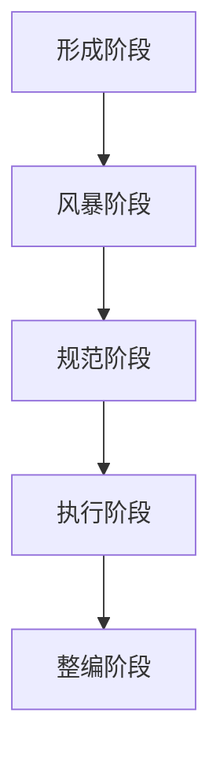
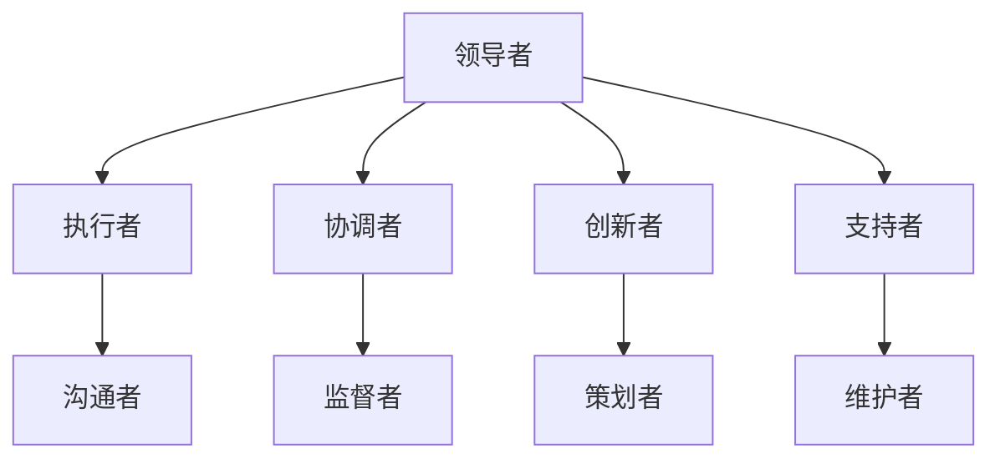
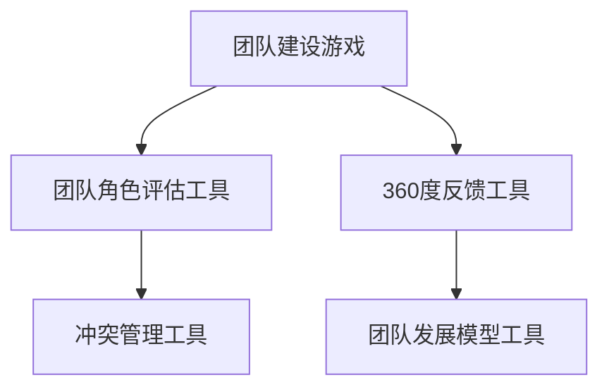
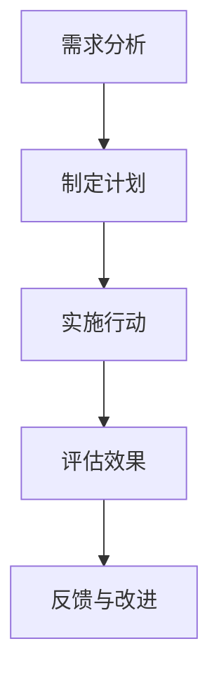

                 

### 引言

#### 1.1 团队建设的重要性

在当今快速变化的商业环境中，团队建设的重要性不言而喻。一个高效的团队不仅能提高工作效率，还能激发成员的创新潜能，从而在激烈的竞争中占据优势。团队建设不仅仅是确保团队成员能够顺利完成任务，更是为了建立一个能够共同追求事业成功的共同体。

首先，团队建设有助于提升整体绩效。一个协同合作的团队能够在资源整合、信息共享和任务分工方面发挥最大效益，减少内耗，提高产出。其次，团队建设能够促进个人成长。通过团队的合作与交流，成员可以学习到新的技能和知识，不断提升自身能力。此外，团队建设还能增强企业的凝聚力，形成积极向上的组织文化，有助于吸引和留住优秀人才。

然而，团队建设并非一蹴而就，而是一个持续的过程。它不仅需要明确的战略和目标，更需要实际的操作方法和工具。在本文中，我们将探讨从工作团队到事业共同体的转变，分析团队建设的理论基础，以及如何在数字化时代提升团队建设的效果。

#### 1.2 团队建设的目标与挑战

团队建设的目标可以分为几个层面：首先是实现团队目标，即确保团队成员能够共同完成预定的工作任务；其次是提升团队效能，通过优化流程和资源利用，提高团队的整体工作效率；最后是培养团队精神，即建立团队成员之间的信任和协作，形成良好的团队氛围。

在追求这些目标的过程中，团队建设面临诸多挑战。首先是沟通问题。团队成员之间的有效沟通是团队成功的关键，但由于个人背景、经验和沟通风格的差异，往往会出现沟通障碍。其次是协调问题。在一个复杂的团队中，不同成员之间的任务和目标可能存在冲突，如何协调和平衡这些矛盾是团队建设的难点之一。此外，团队建设还需要面对成员动力不足、组织文化冲突等问题。

为了克服这些挑战，团队建设需要一套系统的理论和方法。本文将逐步介绍团队建设的理论基础，包括团队发展模型、团队角色与职责、团队合作原则等，帮助读者理解并应用这些理论，以实现从工作团队到事业共同体的转变。

#### 1.3 本书概述与结构安排

本书旨在为读者提供一套全面、系统的团队建设指南，帮助读者从理论到实践，深入理解并掌握团队建设的核心要义。全书分为十二章，内容安排如下：

- **第1章 引言**：介绍了团队建设的重要性、目标与挑战，以及本书的结构和内容。

- **第2章 团队建设的理论基础**：分析了团队发展模型、团队角色与职责、团队合作原则，以及团队建设理论的应用。

- **第3章 从工作团队到事业共同体的转变**：探讨了工作团队与事业共同体的区别，以及促进团队向事业共同体转变的策略。

- **第4章 团队领导力提升**：讨论了领导风格与团队绩效、领导力的发展与培养、以及高效领导力技巧。

- **第5章 团队合作与沟通技巧**：介绍了有效沟通的基本原则、沟通障碍与克服策略，以及团队合作技巧。

- **第6章 团队建设的实践案例**：通过成功和困难的团队建设案例，分析实践中常见的问题与解决策略。

- **第7章 团队建设评估与持续改进**：阐述了团队建设评估方法、效果评估指标，以及持续改进的策略。

- **第8章 团队建设工具与方法**：介绍了团队建设工具和方法，包括团队建设游戏、角色评估工具等。

- **第9章 团队建设在数字化时代的发展**：探讨了数字化对团队建设的影响，以及数字化工具在团队建设中的应用。

- **第10章 团队建设与组织文化**：分析了团队建设与组织文化的互动关系，以及塑造积极组织文化的策略。

- **第11章 团队建设中的个人成长**：讨论了团队成员的自我管理、个人成长与团队发展的平衡，以及个人成长与团队协同效应。

- **第12章 团队建设总结**：总结了全书的核心内容，并给出了团队建设的最佳实践和建议。

通过阅读本书，读者将能够系统地理解团队建设的重要性，掌握从理论到实践的团队建设方法，并在实际工作中有效应用这些方法，提升团队的整体绩效和协作能力。

### 第2章 团队建设的理论基础

#### 2.1 团队发展模型

团队发展模型是团队建设理论的核心，它描述了团队从形成到整编的各个阶段，以及每个阶段的特点和挑战。常见的团队发展模型包括塔克曼模型（Tuckman Model）、贝尔宾模型（Belbin Model）等。以下是塔克曼模型的详细描述：

**塔克曼模型**：
- **形成阶段（Forming）**：团队成员初识，每个人都保持一定的独立性和防御性，团队的目标和规则尚未明确。
- **风暴阶段（Storming）**：成员开始展示个性，冲突和竞争加剧，团队内部权力斗争明显。
- **规范阶段（Norming）**：团队成员逐渐接受团队规则和领导，冲突减少，开始形成团队凝聚力。
- **执行阶段（Performing）**：团队高效运作，成员之间的合作顺畅，团队目标实现。
- **整编阶段（Adjourning）**：团队完成任务，成员开始离开，团队解散。

**团队发展模型图示（Mermaid 流程图）**：


**团队角色与职责**

在团队中，每个成员都扮演着特定的角色，承担相应的职责。了解这些角色和职责有助于团队的有效运作。以下是团队中常见的几种角色和对应的职责：

- **领导者**：负责制定团队目标、规划和决策，协调团队成员的工作，确保团队目标的实现。
- **执行者**：负责执行团队任务，确保任务按时完成，通常具有技术背景和专业知识。
- **协调者**：负责协调团队成员之间的工作，解决冲突，确保团队目标的协同实现。
- **创新者**：负责提出新的想法和解决方案，推动团队的创新和发展。
- **支持者**：负责提供团队成员所需的支持，包括资源、信息和心理支持。

**团队角色定义图（Mermaid 流程图）**：


**团队合作的原则**

团队合作的成功依赖于一系列原则，包括：

- **信任**：团队成员之间需要建立信任，相信对方会履行职责，共同完成任务。
- **尊重**：尊重每个成员的观点和贡献，不论其职位或角色。
- **透明度**：团队内部的信息应该透明，成员能够了解其他成员的工作进展和问题。
- **沟通**：有效的沟通是团队合作的基础，团队成员需要学会倾听和表达。
- **共同目标**：团队需要有一个共同的目标，成员围绕这一目标协同工作。

**团队建设理论的应用**

团队建设理论在实际应用中，可以通过以下步骤进行：

1. **评估当前团队状况**：通过问卷调查、访谈等方式了解团队的现状，包括团队氛围、成员沟通情况、任务分配等。
2. **确定团队目标**：根据组织目标和团队现状，制定明确的团队目标，确保每个成员都清楚自己的职责和目标。
3. **制定行动计划**：制定具体的行动计划，包括任务分配、时间表、资源需求等。
4. **执行与监控**：执行行动计划，并定期监控团队进展，及时调整计划和策略。
5. **评估与反馈**：在团队目标完成后，对团队建设效果进行评估，收集成员反馈，为下一次团队建设提供参考。

通过以上步骤，团队可以逐步实现从工作团队到事业共同体的转变，提升整体绩效和成员满意度。

### 从工作团队到事业共同体的转变

#### 3.1 工作团队与事业共同体的区别

工作团队和事业共同体虽然都是团队形式，但它们在目标和结构上有着显著的区别。首先，工作团队主要关注短期目标和具体任务完成，而事业共同体则着眼于长期的共同目标和组织的整体发展。在工作团队中，成员的角色和职责相对固定，更多是执行上级分配的任务；而在事业共同体中，成员的角色和职责更加灵活，每个人都可以根据自身优势为共同目标做出贡献。

其次，工作团队的内部关系较为正式，更多依赖于制度和管理；而事业共同体的内部关系更加紧密，成员之间有着深厚的信任和合作精神。在工作团队中，成员更多是任务导向，而事业共同体则是目标导向，更注重团队的共同愿景和价值观。

#### 3.2 促进团队向事业共同体转变的策略

为了促进团队从工作团队向事业共同体的转变，可以采取以下策略：

1. **建立共同愿景**：
   - **共同愿景图（Mermaid 流程图）**：
     ```mermaid
     graph TD
     A[共同愿景] --> B[团队目标]
     A --> C[个人目标]
     B --> D[行动计划]
     C --> E[反馈与调整]
     ```
   - 共同愿景是事业共同体的核心，它能够引导团队成员朝着同一方向努力。团队领导需要与成员共同制定一个清晰的愿景，并将其分解为具体的目标和行动计划。

2. **强化互信**：
   - **互信建设图（Mermaid 流程图）**：
     ```mermaid
     graph TD
     A[开放沟通] --> B[诚实反馈]
     A --> C[相互支持]
     B --> D[透明度]
     C --> E[共同目标]
     ```
   - 互信是事业共同体的重要基础。通过开放沟通、诚实反馈和相互支持，团队成员能够建立起深厚的信任关系。团队领导需要创造一个开放、透明的沟通环境，鼓励成员表达自己的意见和想法。

3. **促进沟通与协作**：
   - **协作流程图（Mermaid 流程图）**：
     ```mermaid
     graph TD
     A[任务分配] --> B[进度同步]
     B --> C[问题解决]
     C --> D[成果共享]
     ```
   - 沟通与协作是事业共同体高效运作的关键。团队领导需要确保任务分配明确，进度同步及时，问题解决高效，成果共享透明。通过建立有效的沟通机制和协作流程，团队成员能够更好地协同工作，共同实现目标。

4. **共享价值观**：
   - **价值观共识图（Mermaid 流程图）**：
     ```mermaid
     graph TD
     A[企业价值观] --> B[个人价值观]
     A --> C[共同价值观]
     B --> D[行动准则]
     C --> E[文化传承]
     ```
   - 共享的价值观是事业共同体的精神支柱。团队领导需要通过引导成员讨论和制定共同价值观，并将其转化为具体的行动准则，以确保团队成员在行为和决策上保持一致性。通过文化传承，共享价值观可以渗透到团队的每个角落。

5. **共同成长与学习**：
   - **学习与发展图（Mermaid 流程图）**：
     ```mermaid
     graph TD
     A[培训与发展] --> B[知识共享]
     A --> C[经验交流]
     B --> D[能力提升]
     C --> E[创新思维]
     ```
   - 共同成长与学习是事业共同体持续发展的动力。团队领导需要提供培训和发展机会，鼓励成员之间进行知识共享和经验交流，不断提升团队整体能力。通过创新思维，团队可以不断突破自我，实现更大的成就。

#### 3.3 实现事业共同体转变的挑战与解决方案

在实现从工作团队到事业共同体的转变过程中，团队可能会面临以下挑战：

1. **文化冲突**：
   - **解决方案**：通过建立共同的价值观和沟通机制，逐步消除文化冲突。团队领导可以组织跨部门交流活动，增进不同文化背景成员之间的了解和信任。

2. **角色模糊**：
   - **解决方案**：明确团队成员的角色和职责，确保每个人都知道自己的任务和期望。可以通过角色评估和定期反馈来确保角色清晰，减少混淆。

3. **沟通障碍**：
   - **解决方案**：建立高效的沟通机制，确保信息传递准确无误。可以通过定期会议、即时通讯工具和明确的沟通准则来改善沟通。

4. **动力不足**：
   - **解决方案**：激发团队成员的内在动力，通过设定有意义的目标和奖励机制来提升积极性。团队领导可以通过认可和鼓励来增强成员的动力。

通过以上策略和解决方案，团队可以逐步实现从工作团队到事业共同体的转变，建立起一个高效、协同的事业共同体，为组织的长期发展奠定坚实的基础。

### 第4章 团队领导力提升

#### 4.1 领导风格与团队绩效

团队领导风格对团队绩效有着至关重要的影响。不同的领导风格会带来不同的团队氛围和工作效率。以下是几种常见的领导风格及其对团队绩效的影响：

1. **权威型领导**：
   - **特点**：领导者掌握决策权，对团队成员的工作进行严格监督和指导。
   - **影响**：在短期内，权威型领导可以迅速做出决策，确保任务按计划进行。然而，长期来看，这种领导风格可能导致团队成员缺乏自主性和创新性，降低团队整体绩效。

2. **民主型领导**：
   - **特点**：领导者重视团队成员的意见，鼓励参与决策过程，实现民主管理。
   - **影响**：民主型领导风格有助于提高团队成员的参与度和满意度，促进团队成员之间的沟通与合作，从而提升团队绩效。然而，这种领导风格可能导致决策过程复杂，效率降低。

3. **教练型领导**：
   - **特点**：领导者关注团队成员的个人发展和技能提升，提供指导和反馈，帮助团队成员实现成长。
   - **影响**：教练型领导有助于激发团队成员的潜能，提高团队成员的工作能力和工作效率，从而提升团队整体绩效。

4. **服务型领导**：
   - **特点**：领导者将团队成员的需求和利益放在首位，提供支持和资源，帮助团队成员克服困难。
   - **影响**：服务型领导能够建立强大的团队凝聚力，增强团队成员之间的信任和合作精神，从而提升团队绩效。

#### 4.2 领导力的发展与培养

提升领导力是一个持续的过程，需要通过多种途径进行培养和发展。以下是一些有效的领导力发展策略：

1. **自我反思**：
   - 领导者需要定期进行自我反思，分析自己的行为和决策对团队绩效的影响，识别自己的优点和不足。通过自我反思，领导者可以更好地了解自己的领导风格，找到改进的方向。

2. **接受培训**：
   - 参加领导力培训课程，学习先进的领导理论和实践方法。通过专业培训，领导者可以提升自己的管理技能和领导能力，从而更好地应对团队中的各种挑战。

3. **实践锻炼**：
   - 通过实际工作场景中的实践锻炼，领导者可以在真实的环境中检验和提升自己的领导能力。实践中遇到的问题和挑战是提升领导力的最佳机会。

4. **寻求反馈**：
   - 领导者需要主动寻求团队成员和上级的反馈，了解自己的领导风格和行为对团队的影响。通过反馈，领导者可以发现自己的盲点，及时进行调整和改进。

5. **培养团队精神**：
   - 领导者需要关注团队精神的建设，通过团队活动和沟通培养团队成员之间的信任和合作。一个具有强大团队精神的团队往往能够更好地应对各种挑战，实现更高的绩效。

#### 4.3 高效领导力技巧

为了提升团队绩效，领导者需要掌握一系列高效领导力技巧。以下是一些关键的领导力技巧：

1. **激励与认可**：
   - **技巧**：领导者需要了解每个团队成员的需求和动机，通过激励措施来激发团队成员的积极性。同时，及时认可团队成员的成就和贡献，增强团队成员的自信心和归属感。

2. **反馈与指导**：
   - **技巧**：领导者需要提供具体、及时的反馈和指导，帮助团队成员识别问题和改进方向。通过反馈和指导，领导者可以提升团队成员的工作能力和绩效。

3. **沟通与透明度**：
   - **技巧**：领导者需要建立开放、透明的沟通机制，确保团队成员能够了解团队的目标、进度和问题。通过有效的沟通，领导者可以增强团队的凝聚力，提高团队成员的参与度和信任度。

4. **授权与信任**：
   - **技巧**：领导者需要信任团队成员，给予他们足够的自主权，鼓励他们发挥自己的优势和创造力。通过授权和信任，领导者可以激发团队成员的潜力，提高团队的整体绩效。

5. **建立团队文化**：
   - **技巧**：领导者需要与团队成员共同建立团队文化，明确团队的价值观和行为准则。通过建立积极的团队文化，领导者可以增强团队的凝聚力，提高团队成员的满意度和忠诚度。

6. **解决冲突**：
   - **技巧**：领导者需要具备解决冲突的能力，及时处理团队内部和团队之间的矛盾。通过有效的冲突管理，领导者可以维护团队的稳定，促进团队的协作和合作。

通过以上高效领导力技巧，领导者可以提升团队的整体绩效，建立高效、协同的事业共同体。

### 第5章 团队合作与沟通技巧

#### 5.1 有效沟通的基本原则

有效沟通是团队合作成功的关键。以下是一些有效沟通的基本原则：

1. **明确目标**：
   - 在任何沟通前，确保所有参与者都明确沟通的目标和期望。这有助于确保沟通方向的正确性和效率。

2. **倾听**：
   - 倾听是有效沟通的重要部分。领导者需要耐心倾听团队成员的观点和需求，从而更好地理解他们的想法和感受。

3. **表达清晰**：
   - 沟通时应使用简洁、明确的语言，避免使用模糊或含糊不清的表述，确保信息的准确性。

4. **尊重差异**：
   - 团队成员来自不同的背景和经验，尊重这些差异，理解和接纳不同的观点和意见，有助于建立和谐的团队氛围。

5. **积极反馈**：
   - 在沟通过程中，给予积极的反馈和确认，可以帮助团队成员更好地理解信息，并促进有效的沟通。

6. **避免误解**：
   - 注意避免使用可能导致误解的语言和行为，确保信息的准确传达。

#### 5.2 沟通障碍与克服策略

在团队沟通中，常见的障碍包括：

1. **语言障碍**：
   - **策略**：通过使用简单的语言和具体的例子来解释复杂的概念，避免使用行业术语或专业词汇。

2. **文化差异**：
   - **策略**：培养跨文化沟通能力，了解和尊重不同文化的沟通习惯和偏好，避免因文化差异导致的误解。

3. **信息过载**：
   - **策略**：建立有效的信息筛选和过滤机制，确保团队成员只接收与其工作相关的关键信息。

4. **心理障碍**：
   - **策略**：建立信任和尊重的氛围，鼓励团队成员开放地表达自己的想法和感受，避免心理障碍导致的沟通不畅。

5. **技术障碍**：
   - **策略**：选择合适的沟通工具和平台，确保技术设备正常运行，减少因技术问题导致的沟通障碍。

#### 5.3 团队合作技巧

有效的团队合作离不开一系列具体的技巧，以下是一些关键的团队合作技巧：

1. **明确分工**：
   - **技巧**：在团队成立之初，明确每个成员的职责和任务，确保团队成员了解自己的角色和责任。

2. **建立信任**：
   - **技巧**：通过团队活动、分享经验和相互支持，建立团队成员之间的信任关系。信任是团队合作的基础。

3. **积极倾听**：
   - **技巧**：在团队讨论和沟通中，积极倾听其他成员的意见和反馈，避免中断或批评，确保每个声音都被听到。

4. **有效会议管理**：
   - **技巧**：会议前明确会议议程和目标，会议中保持专注和参与，会议后总结会议内容和下一步行动。

5. **冲突解决**：
   - **技巧**：在面对团队内部的冲突时，领导者需要及时介入，通过沟通和协商找到解决问题的方法，避免冲突升级。

6. **共享成果**：
   - **技巧**：鼓励团队成员共享工作成果和经验，通过表扬和奖励激发团队成员的积极性和合作意愿。

通过掌握这些团队合作技巧，团队可以更高效地协同工作，实现共同目标。

### 第6章 团队建设的实践案例

#### 6.1 案例分析：成功团队建设实例

在一个大型软件开发项目中，A公司通过有效的团队建设，成功实现了项目的高效完成。以下是该公司的成功经验：

1. **明确目标**：
   - 项目团队在项目启动时，明确制定了项目目标，包括功能需求、时间节点和性能指标。每个团队成员都清楚自己的任务和责任。

2. **角色分配**：
   - 项目团队根据每个成员的专业技能和兴趣，合理分配了角色，确保每个成员都能发挥自己的优势。例如，技术经理负责技术方案的设计，产品经理负责需求分析和用户测试。

3. **沟通机制**：
   - 项目团队建立了定期的沟通机制，包括每日站会、每周进度会议和项目评审会议。这些会议确保团队成员能够及时沟通问题、分享进展和协作。

4. **反馈与改进**：
   - 项目团队鼓励成员之间的反馈和改进，通过代码审查、设计评审和绩效评估，确保每个环节都能达到最佳效果。

5. **文化建设**：
   - 项目团队注重文化建设，通过团队活动、培训和文化交流，增强团队成员之间的信任和合作精神。

通过这些措施，A公司的项目团队成功在预定时间内完成了任务，并得到了客户的高度评价。

#### 6.2 困难团队转型案例

B公司在一次新产品开发项目中遇到了严重的团队建设问题。以下是该公司的转型过程和解决策略：

1. **问题识别**：
   - 项目团队在项目初期出现任务分工不清、沟通不畅和内部冲突等问题，导致项目进度严重滞后。

2. **领导层介入**：
   - 公司领导层意识到问题的重要性，立即介入，重新评估和调整团队结构，指定新的项目经理。

3. **角色重新分配**：
   - 新项目经理对团队成员进行了重新分配，确保每个成员都能在适合自己的角色上发挥最大效能。

4. **沟通与协作**：
   - 项目经理建立了更有效的沟通机制，通过定期召开会议、使用协作工具和明确任务分配，提高了团队协作效率。

5. **培训与发展**：
   - 公司为团队成员提供了相关的培训，提升他们的技能和沟通能力，增强团队的整体实力。

6. **文化建设**：
   - 项目经理注重团队文化建设，通过团队活动、文化讲座和团队建设游戏，增强团队成员之间的信任和合作。

通过一系列的调整和改进，B公司的项目团队最终走出了困境，项目进度逐渐恢复正常，并成功完成了任务。

#### 6.3 团队建设实践中的常见问题与解决策略

在团队建设过程中，常见的问题包括角色不清、沟通障碍、文化冲突和动力不足等。以下是一些常见的解决策略：

1. **角色不清**：
   - **解决策略**：明确团队成员的角色和职责，通过角色分配图或任务清单，确保每个成员都知道自己的任务和期望。

2. **沟通障碍**：
   - **解决策略**：建立有效的沟通机制，包括定期会议、即时通讯工具和明确的沟通准则，确保信息的及时、准确传达。

3. **文化冲突**：
   - **解决策略**：培养团队文化，通过团队活动和培训，增强团队成员之间的了解和信任，减少文化冲突。

4. **动力不足**：
   - **解决策略**：通过设定有挑战性的目标、提供激励措施和认可成员的贡献，激发团队成员的积极性和动力。

通过解决这些问题，团队可以更好地协同工作，实现共同目标。

### 第7章 团队建设评估与持续改进

#### 7.1 团队建设评估方法

为了确保团队建设的有效性，对团队建设进行科学评估至关重要。以下是一些常用的团队建设评估方法：

1. **问卷调查**：
   - **方法**：通过设计问卷，收集团队成员对团队建设各方面的看法和反馈，如沟通效果、协作效率、团队氛围等。
   - **优点**：操作简单，能够快速获得大量数据。
   - **缺点**：可能存在主观偏差，难以反映具体行为和表现。

2. **访谈**：
   - **方法**：与团队成员进行一对一或小组访谈，深入了解他们的感受和意见。
   - **优点**：能够获得详细、深入的信息，了解具体问题和原因。
   - **缺点**：耗时较长，成本较高。

3. **360度反馈**：
   - **方法**：收集团队成员对其他成员和团队整体表现的评估，包括上级、同事和下属的反馈。
   - **优点**：能够全面了解团队成员的绩效和团队状态。
   - **缺点**：可能存在人际关系影响，反馈真实性难以保证。

4. **绩效评估**：
   - **方法**：根据团队的绩效指标，评估团队的整体表现和成员的贡献。
   - **优点**：能够量化团队绩效，明确团队建设的成果。
   - **缺点**：绩效指标设置难度较大，可能忽略团队成员的主观感受。

#### 7.2 团队建设效果评估指标

为了有效评估团队建设的成效，需要设定一系列具体的评估指标。以下是一些常用的团队建设效果评估指标：

1. **团队绩效**：
   - **指标**：团队完成任务的速度、质量和创新程度。
   - **分析方法**：通过关键绩效指标（KPI）来衡量团队的整体绩效。

2. **成员满意度**：
   - **指标**：团队成员对团队建设的满意度，包括工作氛围、团队氛围和领导风格等。
   - **分析方法**：通过问卷调查和访谈来收集成员的反馈。

3. **团队合作**：
   - **指标**：团队成员之间的协作程度和沟通效果。
   - **分析方法**：通过团队协作工具的记录和观察，评估团队成员的协作情况。

4. **团队稳定性**：
   - **指标**：团队成员的流失率和稳定性。
   - **分析方法**：通过统计团队成员的流动情况和离职原因，评估团队的稳定性。

#### 7.3 团队持续改进的策略

为了持续提升团队建设的成效，需要采取一系列持续改进的策略：

1. **定期评估**：
   - **策略**：定期进行团队建设评估，及时发现问题并采取改进措施。
   - **分析方法**：结合问卷调查、访谈和360度反馈，全面评估团队建设的成效。

2. **反馈机制**：
   - **策略**：建立有效的反馈机制，确保团队成员的意见和建议能够及时传达并得到回应。
   - **分析方法**：通过定期的团队会议和反馈会议，收集和分析成员的意见。

3. **培训与发展**：
   - **策略**：提供定期的培训和发展机会，提升团队成员的技能和知识水平。
   - **分析方法**：通过培训后的测试和反馈，评估培训效果。

4. **文化建设**：
   - **策略**：培养积极向上的团队文化，增强团队成员的归属感和认同感。
   - **分析方法**：通过团队活动和文化氛围的观察，评估文化建设的成效。

5. **激励机制**：
   - **策略**：建立合理的激励机制，激发团队成员的工作热情和创新能力。
   - **分析方法**：通过绩效评估和反馈，了解激励机制的有效性。

通过以上策略，团队可以持续改进团队建设，提升整体绩效和团队凝聚力。

### 第8章 团队建设工具与方法

#### 8.1 团队建设工具

为了提高团队建设的效率和效果，使用合适的工具是非常关键的。以下是一些常用的团队建设工具及其应用：

1. **团队建设游戏**：
   - **工具介绍**：团队建设游戏是通过互动和合作完成一系列任务，以增强团队成员之间的信任和沟通。
   - **应用场景**：适用于团队初建或成员关系需要加强的情况。
   - **效果**：能够快速提升团队凝聚力，增强成员间的默契。

2. **团队角色评估工具**：
   - **工具介绍**：团队角色评估工具用于识别团队成员的角色和优势，以便合理分配任务和资源。
   - **应用场景**：适用于团队组建或重组时，帮助领导者更好地了解团队成员。
   - **效果**：有助于明确团队成员的角色和职责，提升团队效能。

3. **360度反馈工具**：
   - **工具介绍**：360度反馈工具通过收集团队成员来自上级、同事、下属的反馈，提供全面的绩效评估。
   - **应用场景**：适用于定期绩效评估和职业发展过程中。
   - **效果**：有助于团队成员了解自己的表现和改进方向，促进个人成长。

4. **冲突管理工具**：
   - **工具介绍**：冲突管理工具通过提供一系列冲突解决的策略和方法，帮助团队处理内部矛盾。
   - **应用场景**：适用于团队冲突频发或需要提升冲突解决能力时。
   - **效果**：能够有效降低冲突对团队绩效的影响，提升团队稳定性。

5. **团队发展模型工具**：
   - **工具介绍**：团队发展模型工具用于跟踪团队在不同发展阶段的表现，提供改进建议。
   - **应用场景**：适用于团队成长和发展的各个阶段。
   - **效果**：有助于团队领导者了解团队现状，制定相应的改进措施。

**团队建设工具矩阵（Mermaid 流程图）**：


#### 8.2 团队建设方法

有效的团队建设不仅需要工具，还需要科学的方法。以下是一些常用的团队建设方法：

1. **需求分析**：
   - **方法介绍**：需求分析是通过访谈、问卷调查等方法，了解团队成员的需求和期望，为团队建设提供依据。
   - **步骤**：
     1. 制定访谈提纲或问卷。
     2. 进行访谈或问卷调查。
     3. 分析收集到的数据，识别关键需求。
     4. 制定满足需求的行动计划。
   - **应用场景**：适用于团队组建初期，帮助建立团队基础。

2. **制定计划**：
   - **方法介绍**：制定计划是根据团队需求和目标，制定详细的团队建设计划，明确任务和时间表。
   - **步骤**：
     1. 确定团队建设目标。
     2. 制定具体行动方案。
     3. 分配任务和责任。
     4. 设定时间节点和考核标准。
     5. 制定风险应对策略。
   - **应用场景**：适用于团队建设和项目启动阶段。

3. **实施行动**：
   - **方法介绍**：实施行动是根据制定的计划，具体执行团队建设任务，确保计划落地。
   - **步骤**：
     1. 开展各项任务。
     2. 监督任务进展。
     3. 解决执行过程中的问题。
     4. 保持与团队成员的沟通。
   - **应用场景**：适用于团队建设和项目执行阶段。

4. **评估效果**：
   - **方法介绍**：评估效果是对团队建设的成果进行评估，分析计划执行的效果，为后续改进提供依据。
   - **步骤**：
     1. 收集评估数据。
     2. 分析评估结果。
     3. 识别成功经验和不足之处。
     4. 提出改进建议。
   - **应用场景**：适用于团队建设和项目结束阶段。

5. **反馈与改进**：
   - **方法介绍**：反馈与改进是根据评估结果，对团队建设进行反馈和改进，不断提升团队效能。
   - **步骤**：
     1. 分享评估结果和改进建议。
     2. 制定改进计划和实施步骤。
     3. 监督改进计划的执行。
     4. 定期评估改进效果。
   - **应用场景**：适用于团队建设的持续改进阶段。

**团队建设方法流程图（Mermaid 流程图）**：


通过这些工具和方法，团队可以系统地开展团队建设，提升整体绩效和成员满意度。

### 第9章 团队建设在数字化时代的发展

#### 9.1 数字化对团队建设的影响

数字化时代的到来，对团队建设产生了深远的影响。首先，数字化工具和技术的普及，改变了团队的工作方式。远程办公、在线协作和虚拟会议等成为新常态，使得团队可以跨越地域限制，实现全球化运作。其次，数字化带来了信息获取和传递的便利性，使得团队成员能够更快速地共享信息和知识，提高了团队的整体反应速度和决策效率。此外，数字化也促进了团队成员之间的互动和沟通，通过社交媒体和即时通讯工具，团队成员可以随时交流，减少了沟通障碍。

#### 9.2 远程团队建设的新挑战与新机遇

远程团队建设在数字化时代面临着一系列新挑战，同时也带来了新的机遇。以下是一些具体的挑战和机遇：

1. **挑战**：

   - **沟通障碍**：由于地理位置的分散，远程团队之间的沟通可能不如面对面沟通那样高效和直接，存在沟通延迟和信息失真的风险。

   - **团队凝聚力**：远程团队往往缺乏面对面的互动，可能导致团队成员之间的信任和凝聚力减弱。

   - **管理难度**：远程团队的管理更加复杂，领导者需要新的管理策略和工具来确保团队成员的工作效率和工作质量。

2. **机遇**：

   - **灵活性**：远程团队建设使得团队成员可以更灵活地安排工作时间，提高工作效率，更好地平衡工作与生活。

   - **多元化**：远程团队可以招募来自不同地区和文化背景的成员，增加了团队的多样性和创新力。

   - **成本效益**：通过远程办公，企业可以降低办公成本，提高资源利用效率。

#### 9.3 数字化工具在团队建设中的应用

为了应对远程团队建设的新挑战，并利用数字化带来的机遇，以下是一些数字化工具在团队建设中的应用：

1. **协作工具**：
   - **工具示例**：Trello、Asana、JIRA等项目管理工具。
   - **应用场景**：用于任务分配、进度跟踪和团队协作，确保团队成员能够清晰了解任务状态和目标。

2. **沟通工具**：
   - **工具示例**：Slack、Microsoft Teams、Zoom等即时通讯和视频会议工具。
   - **应用场景**：用于日常沟通、会议讨论和项目进度汇报，确保团队成员能够及时交流。

3. **知识共享平台**：
   - **工具示例**：Confluence、Notion、Google Drive等知识管理工具。
   - **应用场景**：用于存储和共享文档、资料和项目文件，确保团队成员能够方便地获取所需信息。

4. **协作平台**：
   - **工具示例**：GitHub、GitLab等版本控制工具。
   - **应用场景**：用于代码管理、代码审查和项目协作，确保团队成员能够高效合作并避免代码冲突。

5. **远程监控工具**：
   - **工具示例**：Hubstaff、Toggl等时间跟踪工具。
   - **应用场景**：用于监控团队成员的工作时间和效率，确保项目按时完成。

通过合理利用这些数字化工具，远程团队可以克服沟通障碍，提升团队凝聚力，实现高效协作，从而在数字化时代取得成功。

### 第10章 团队建设与组织文化

#### 10.1 团队建设与组织文化的互动关系

团队建设与组织文化之间存在着紧密的互动关系。团队建设的目标是建立高效、协作的团队，而组织文化则是团队建设的土壤和基础。良好的组织文化能够促进团队建设，提高团队绩效和成员满意度；而不良的组织文化则可能阻碍团队建设，导致团队分裂和效率低下。

首先，组织文化影响着团队价值观和行为准则的形成。一个倡导创新、协作和开放的组织文化，能够激发团队成员的创造力，促进团队协作。相反，一个强调等级、竞争和保守的文化，可能导致团队成员之间的隔阂和冲突，阻碍团队建设。

其次，团队建设反过来也会影响组织文化的演变。高效的团队建设能够塑造积极的组织氛围，提升员工的满意度和忠诚度，从而推动组织文化的正向发展。而失败的团队建设，则可能暴露出组织文化中的问题，促使组织进行文化变革。

#### 10.2 塑造积极组织文化的策略

为了塑造积极组织文化，团队建设需要采取一系列策略，以下是一些具体的方法：

1. **明确价值观**：
   - **策略**：组织需要明确自身的核心价值观，并将其贯穿于团队建设和日常工作中。通过定期沟通和培训，确保所有成员都认同并遵循这些价值观。

2. **建立共同愿景**：
   - **策略**：团队需要与组织愿景保持一致，共同制定一个清晰的愿景和目标。这有助于增强团队的凝聚力和共同目标感。

3. **鼓励沟通与反馈**：
   - **策略**：建立开放、透明的沟通机制，鼓励团队成员之间进行开放、真诚的沟通和反馈。这有助于减少误解和冲突，提升团队协作效率。

4. **培养团队合作精神**：
   - **策略**：通过团队活动和项目合作，培养团队成员之间的信任和合作精神。团队合作精神是积极组织文化的重要组成部分。

5. **认可与奖励**：
   - **策略**：对团队成员的成就和贡献给予认可和奖励，激励团队成员保持积极性和创造力。这有助于形成正向的激励机制，推动组织文化的建设。

6. **提供成长与发展机会**：
   - **策略**：为团队成员提供学习和成长的机会，帮助他们提升技能和知识。这有助于增强团队成员的归属感和忠诚度，促进组织文化的建设。

#### 10.3 团队建设在组织变革中的应用

在组织变革过程中，团队建设发挥着关键作用。有效的团队建设能够促进组织变革的顺利进行，以下是一些具体应用：

1. **促进变革接受**：
   - **应用**：通过团队建设活动，帮助员工理解变革的必要性和意义，降低变革带来的恐惧和抗拒。

2. **提高变革适应性**：
   - **应用**：通过增强团队成员之间的信任和协作，提高团队的整体适应性和创新能力，快速应对变革带来的挑战。

3. **加强领导力**：
   - **应用**：通过团队建设，提升领导者的变革领导力，确保他们能够在变革过程中发挥积极作用，引导团队成员积极面对变革。

4. **培养变革推动者**：
   - **应用**：通过团队建设，培养一批变革推动者，他们在变革过程中发挥关键作用，推动组织变革的落实。

5. **确保变革持续性**：
   - **应用**：通过团队建设，建立一套持续的变革机制，确保变革成果的长期保持和优化。

通过以上应用，团队建设在组织变革中能够发挥积极作用，推动组织变革的成功实施。

### 第11章 团队建设中的个人成长

#### 11.1 团队成员的自我管理

在团队建设中，个人成长至关重要。团队成员的自我管理是个人成长的基础，以下是一些关键要素：

1. **目标设定**：
   - **策略**：明确个人目标和团队目标，确保个人目标与团队目标一致。通过设定短期和长期目标，帮助自己保持动力和方向。

2. **时间管理**：
   - **策略**：合理安排时间，确保工作与休息平衡。使用时间管理工具，如日历和待办事项列表，提高工作效率。

3. **持续学习**：
   - **策略**：不断学习新知识、新技能，提升个人能力。通过阅读、培训和实践，保持学习的习惯和热情。

4. **自我反思**：
   - **策略**：定期进行自我反思，评估自己的工作表现和成长进度。通过反思，发现不足和改进方向。

#### 11.2 个人成长与团队发展的平衡

个人成长与团队发展之间需要找到一个平衡点，以下是一些策略：

1. **协同成长**：
   - **策略**：将个人成长与团队目标结合起来，通过参与团队项目和活动，实现个人成长与团队发展的双赢。

2. **资源共享**：
   - **策略**：在团队中分享知识和经验，帮助其他成员成长，同时通过学习他人的经验和技能，实现自我提升。

3. **反馈与支持**：
   - **策略**：积极寻求反馈，接受团队成员的帮助和支持。通过反馈和协作，不断提升个人能力和团队绩效。

4. **角色灵活**：
   - **策略**：根据团队需要和个人兴趣，灵活调整自己的角色和职责，为团队发展做出更大贡献。

#### 11.3 个人成长与团队协同效应

个人成长与团队协同效应之间有着密切的关系，以下是一些实现协同效应的策略：

1. **培养领导力**：
   - **策略**：通过参与团队活动和领导力培训，提升自己的领导能力，成为团队中的积极贡献者。

2. **促进创新**：
   - **策略**：鼓励团队成员提出新想法和创新方案，通过头脑风暴和协作，激发团队的创造力和创新能力。

3. **建立信任**：
   - **策略**：通过开放沟通和相互支持，建立团队成员之间的信任，提高团队协作效率。

4. **共同目标**：
   - **策略**：确保个人目标和团队目标一致，共同为实现团队目标而努力，形成强大的团队合力。

通过以上策略，个人成长与团队协同效应可以实现双赢，共同推动团队和个人的全面发展。

### 第12章 团队建设总结

#### 12.1 团队建设的重要性与挑战

团队建设是提升组织绩效和竞争力的关键因素。通过有效的团队建设，企业可以实现资源优化配置、信息共享和协同创新，从而在激烈的市场竞争中脱颖而出。团队建设的重要性体现在以下几个方面：

1. **提升工作效率**：通过明确的角色分工和高效的协作，团队可以更迅速地完成任务，提高整体工作效率。

2. **增强创新能力**：团队建设鼓励成员之间的知识共享和经验交流，激发创新思维，推动企业的技术进步和产品创新。

3. **促进个人成长**：团队建设为成员提供了学习和成长的机会，帮助个人提升技能和知识，实现职业生涯的发展。

然而，团队建设也面临着诸多挑战，包括沟通障碍、角色模糊、文化冲突和动力不足等。要克服这些挑战，企业需要采取科学的方法和策略，逐步实现从工作团队到事业共同体的转变。

#### 12.2 团队建设的最佳实践

在团队建设中，一些最佳实践可以帮助企业有效提升团队绩效和成员满意度：

1. **建立共同愿景**：明确团队和个人的目标，确保团队成员朝着共同的方向努力。

2. **强化互信**：通过开放沟通和相互支持，建立团队成员之间的信任关系，提高团队凝聚力。

3. **促进沟通与协作**：建立高效的沟通机制，确保信息传递准确无误，增强团队成员之间的协作。

4. **共享价值观**：制定并传播共同的核心价值观，确保团队成员在行为和决策上保持一致。

5. **提供成长机会**：为团队成员提供培训和发展机会，帮助他们提升技能和知识，实现个人成长。

6. **持续改进**：定期评估团队建设效果，根据反馈进行改进，确保团队持续发展。

#### 12.3 小结与展望

团队建设是一个持续的过程，需要企业高层领导的高度重视和持续投入。通过科学的团队建设方法，企业可以打造高效、协同的事业共同体，实现组织目标和个人成长的双赢。展望未来，随着数字化和全球化的发展，团队建设将面临新的机遇和挑战。企业需要不断创新和调整团队建设策略，以适应快速变化的环境，保持竞争优势。

### 结语

通过本文的探讨，我们深入分析了团队建设的重要性、理论基础、实践方法以及数字化时代的新挑战。团队建设不仅是提升工作效率和促进创新的手段，更是实现组织与个人共同发展的基石。希望读者能够结合本文的内容，在实际工作中应用这些理论和策略，打造出高效、协同的团队，推动企业的持续发展和成功。最后，感谢您的阅读，希望这篇文章能够为您的团队建设之路提供有益的启示。作者：AI天才研究院/AI Genius Institute & 禅与计算机程序设计艺术 /Zen And The Art of Computer Programming。

### 附录

#### 代码示例

以下是一个简单的代码示例，用于演示如何使用Python实现一个团队任务分配系统。该系统可以根据团队成员的技能和任务需求，自动分配任务。

```python
# 任务分配系统示例

# 团队成员及其技能
team_members = {
    'Alice': ['编程', '测试'],
    'Bob': ['设计', '测试'],
    'Charlie': ['设计', '编程'],
    'Diana': ['测试', '项目管理']
}

# 任务列表
tasks = [
    '编写代码',
    '设计界面',
    '编写测试用例',
    '项目规划'
]

# 任务分配字典
task分配 = {}

# 任务分配算法
for task in tasks:
    available_skills = [member for member, skills in team_members.items() if task in skills]
    if available_skills:
        # 随机选择一个具有所需技能的团队成员
        assigned_member = random.choice(available_skills)
        task分配[task] = assigned_member
        print(f"{task} 分配给 {assigned_member}")
    else:
        print(f"没有具有 {task} 技能的团队成员。")

# 打印任务分配结果
print(task分配)
```

#### Mermaid 图表

以下是一个使用Mermaid绘制的团队角色定义流程图：


#### LaTeX 公式

以下是一个简单的LaTeX公式示例，用于演示如何在文中嵌入数学公式：

$$
E = mc^2
$$

1 < 2

通过这些示例，读者可以更好地理解如何将技术语言和工具应用于团队建设实践。

### 拓展阅读

以下是一些拓展阅读资源，供读者深入了解团队建设的相关理论和实践：

1. **《团队协作的艺术》（The Art of Collaborative Working）**：作者Mark Miller，详细介绍了团队合作的有效方法和管理技巧。

2. **《团队领导力》（Team Leadership：Creating a Winning Team Culture）**：作者Jim Highsmith，探讨了团队领导力的核心要素和领导力发展的路径。

3. **《敏捷团队管理》（Agile Team Management：For Coaches, ScrumMasters, and Project Managers）**：作者Michael James，提供了敏捷团队管理的最佳实践和工具。

4. **《远程工作指南》（Remote：How to Work From Home and Get Results）**：作者Jason Fried和Dave Hansson，深入探讨了远程工作的优势和挑战，以及如何实现高效的远程团队管理。

通过阅读这些书籍，读者可以进一步深化对团队建设理论的理解，并掌握更多实用的团队建设技巧。

