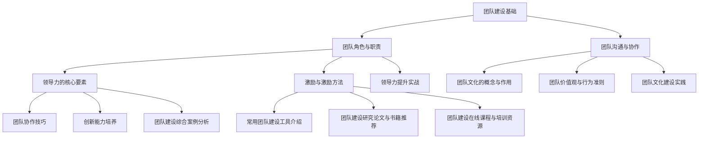

                 

### 1. 团队建设的重要性

团队建设在当今的IT行业中愈发显得至关重要。随着技术的发展和项目复杂度的增加，单靠个体之力已经无法应对日益严峻的市场竞争。一个高效、协作的团队可以充分发挥每个成员的优势，共同实现项目的成功。以下从多个方面阐述团队建设的重要性。

首先，团队建设能够提升整体工作效率。在一个团队中，每个成员都有各自的专业技能和知识背景。通过合理的分工和协作，团队可以将复杂的项目分解为多个小任务，各成员根据自身特长负责相应部分，从而提高整体工作的效率和准确性。此外，团队成员之间的互相学习和交流也有助于提升个人技能和团队整体的专业水平。

其次，团队建设有助于增强项目的创新性和解决问题的能力。在团队中，不同的成员可以带来多样化的思维和观点，这些观点的碰撞和融合往往能激发出新的创意和解决方案。同时，团队在面对挑战和困难时，可以迅速集结力量，共同寻求解决问题的方法，从而提升团队的抗风险能力和应变能力。

再者，良好的团队建设有助于提升团队成员的满意度和忠诚度。在一个团结协作、互相尊重和信任的团队中，成员会感受到更多的归属感和满足感，从而更加投入工作，提高工作效率和质量。此外，团队建设中的激励机制和成长机会也能激发成员的积极性和创造力，提升团队的整体凝聚力。

最后，团队建设对于企业文化的塑造和传承也具有重要作用。一个具有优秀团队文化的企业，能够更好地吸引和留住人才，提升企业的竞争力和品牌形象。同时，良好的团队文化也能够在企业内部形成正向的竞争氛围，推动企业不断向前发展。

总之，团队建设不仅是提高工作效率和项目成功率的关键，也是企业发展和人才管理的重要组成部分。在IT行业中，重视团队建设，培养高效协作的团队，已经成为企业成功的关键因素之一。在接下来的章节中，我们将深入探讨团队建设的原则、目标、常见问题和挑战，以及团队角色与职责等方面的内容。

### 1.2 团队建设的原则

团队建设是一项系统性工程，需要遵循一定的原则和方法，以确保团队在高效、协作和持续发展的基础上运作。以下是一些关键的团队建设原则：

**1. 目标导向**：团队建设应以明确的目标为指引。每个团队都应制定清晰、具体的短期和长期目标，并确保所有成员对目标有共同的理解和认同。目标导向不仅有助于统一团队成员的行动方向，还可以为团队提供持续的动力和激励。

**2. 尊重与信任**：尊重和信任是团队建设的基础。团队成员应相互尊重，理解并接受彼此的不同观点和个性。建立信任关系有助于减少冲突，促进开放和坦诚的沟通，从而提升团队的凝聚力和协作效率。

**3. 分工与合作**：合理的分工和有效的合作是团队高效运作的保证。团队应根据成员的特长和兴趣分配任务，确保每个人都能在其最擅长和最感兴趣的领域发挥价值。同时，团队应鼓励成员之间的合作与支持，共同完成任务。

**4. 沟通与反馈**：有效的沟通和及时的反馈是团队协作的润滑剂。团队应建立开放、透明的沟通渠道，确保信息流畅、准确传递。同时，成员之间应保持积极正面的反馈态度，对工作中的优点和不足进行及时反馈和调整，以不断优化工作流程和提升团队绩效。

**5. 激励与成长**：激励和成长是团队建设中不可或缺的一部分。团队领导应采用多种激励方法，如表扬、奖励和晋升机会，激发成员的积极性和创造力。此外，团队还应为成员提供培训和发展机会，帮助他们不断提升个人能力和职业素养，实现个人与团队的共同成长。

**6. 适应性**：团队建设需要具备一定的灵活性和适应性，以应对外部环境和内部需求的变化。团队应根据项目需求和成员的反馈，不断调整和优化团队结构和协作方式，确保团队始终处于最佳状态。

**7. 责任与义务**：每个团队成员都应对自己的工作负责，并承担相应的义务。明确的责任分工和严格的执行纪律有助于提升团队的工作质量和效率，避免责任分散和推诿现象的发生。

通过遵循这些原则，团队可以建立起一个高效、协作、和谐的工作环境，为项目的成功和企业的发展奠定坚实基础。在接下来的章节中，我们将进一步探讨团队建设的目标、常见问题和挑战，以及具体的团队角色与职责等内容。

### 1.3 团队建设的目标

团队建设的目标是多层次的，既包括短期目标，也有长期目标。短期目标通常是为了迅速提升团队的绩效，确保项目在既定时间内高质量完成。而长期目标则侧重于团队的整体成长和可持续发展，通过不断的优化和改进，提升团队的竞争力。

**1. 提升工作效率**：团队建设的一个核心目标是提升工作效率。通过明确的分工、有效的沟通和协作，可以减少重复劳动，避免资源浪费，确保任务的高效完成。具体措施包括制定详细的工作计划和任务分配、建立高效的沟通机制和协作工具，以及培养团队成员的时间管理能力。

**2. 提高项目成功率**：团队建设的另一个关键目标是提高项目的成功率。一个高效的团队可以迅速识别和解决问题，应对各种挑战和风险。通过建立良好的团队协作机制，团队成员可以共同面对项目中的不确定性，提高项目的可控性和成功概率。

**3. 促进个人与团队成长**：团队建设不仅要提升团队的整体绩效，还要关注团队成员的个人成长。通过培训、激励和发展机会，可以帮助团队成员不断提升专业技能和职业素养，实现个人价值的最大化。同时，团队的整体成长也可以为企业带来更多创新和竞争力。

**4. 增强团队凝聚力**：团队凝聚力是团队建设的重要目标之一。一个具有高度凝聚力的团队，成员之间相互信任、支持和尊重，能够在面对困难和挑战时保持团结和坚定。增强团队凝聚力可以通过建立共同的目标和价值观、促进团队成员之间的互动和交流、以及开展团队建设活动等多种方式实现。

**5. 塑造积极的企业文化**：团队建设不仅影响团队内部的工作氛围，还可以对企业文化产生深远影响。通过培养团队合作精神、倡导诚信和透明度，可以塑造积极向上的企业文化，提升企业的整体形象和竞争力。

**6. 提升企业竞争力**：团队建设最终目标是提升企业的竞争力。通过构建高效、协作和创新的团队，企业可以在市场竞争中占据有利位置，实现持续增长。团队建设还可以帮助企业吸引和留住优秀人才，为企业的长远发展奠定坚实基础。

综上所述，团队建设的目标是多维度、综合性的。通过明确这些目标，并采取有效的措施，团队可以不断提升自身的绩效和竞争力，为企业的发展贡献力量。

### 1.4 团队建设中的常见问题与挑战

尽管团队建设在提升工作效率、提高项目成功率和增强团队凝聚力等方面具有显著优势，但在实际操作中，团队建设面临着诸多问题和挑战。以下是一些常见的问题和挑战，以及相应的解决策略：

**1. 成员间的沟通障碍**：团队成员之间的沟通不畅是团队建设中的常见问题。这可能导致信息传递错误、任务理解偏差和合作不力。解决策略包括建立开放的沟通渠道，如定期团队会议、即时通讯工具和协作平台，以及培养团队成员的沟通技巧，如积极倾听、清晰表达和及时反馈。

**2. 权责不清**：权责不清会导致团队成员之间出现推诿现象，降低工作效率。解决策略包括明确团队成员的角色和职责，制定详细的任务分配表和工作流程，并定期检查和调整职责分工，确保每个人都知道自己的工作内容和责任范围。

**3. 个人目标与团队目标的冲突**：在团队中，个人目标和团队目标有时可能存在冲突。这可能导致个人为了追求短期利益而忽视团队的整体利益。解决策略包括明确团队目标和个人目标的关联性，确保团队成员理解个人成就与团队成功的关系，以及通过激励机制来平衡个人和团队的目标。

**4. 团队成员的积极性不足**：团队成员的积极性不足会影响团队的整体表现。解决策略包括建立积极的团队文化，如认可和奖励优秀成员、开展团队建设活动、提供职业发展机会等，以及通过培训和个人辅导提升成员的专业技能和自信心。

**5. 团队规模的膨胀**：团队规模过大可能导致沟通成本增加、决策效率降低和团队协作困难。解决策略包括合理控制团队规模，确保每个团队成员都有足够的时间和资源参与团队活动，以及采用扁平化管理结构，减少管理层次，提高决策效率。

**6. 外部环境变化带来的挑战**：外部环境的变化，如市场波动、技术更新等，会给团队带来不确定性和压力。解决策略包括增强团队的灵活性和适应性，通过培训和学习提升团队的技术和市场敏感度，以及建立应急预案，确保团队能够迅速应对外部变化。

通过识别和应对这些常见问题和挑战，团队可以更好地实现其建设目标，提升工作效率和项目成功率，为企业的发展贡献力量。

### 2.1 团队角色的定义

在团队建设中，明确团队成员的角色是至关重要的一步。团队角色定义不仅有助于明确每个成员的职责和任务，还能促进团队内部的协作和沟通。团队角色可以基于多种因素进行定义，包括个人技能、工作经验、兴趣和项目需求等。以下是对团队角色的一些具体定义和分类。

首先，根据技能和专长，团队成员可以被划分为以下几种角色：

1. **项目经理**：项目经理负责整个项目的计划、组织、执行和监控。他们需要协调不同团队和成员的工作，确保项目按时、按质完成。项目经理通常具备丰富的项目管理和团队管理经验。

2. **技术专家**：技术专家在团队中负责特定的技术领域，如软件开发、数据分析和网络安全等。他们不仅需要具备深厚的技术知识，还要能够解决复杂的技术问题和提供技术指导。

3. **开发人员**：开发人员负责编写和实现软件代码，他们通常分为前端开发、后端开发和全栈开发等不同的技术方向。开发人员需要具备编码能力、问题解决能力和团队协作精神。

4. **测试工程师**：测试工程师负责对软件进行测试，确保软件质量满足预期标准。他们需要熟悉各种测试方法和工具，能够编写测试用例，发现和报告缺陷。

5. **UI/UX设计师**：UI/UX设计师负责产品的用户界面和用户体验设计。他们需要了解用户需求、掌握设计原则和工具，能够创建直观、易用的用户界面。

其次，根据职责和工作流程，团队成员可以被划分为以下角色：

1. **需求分析师**：需求分析师负责与客户和利益相关者沟通，理解需求，并将需求转化为可执行的任务和功能。

2. **产品经理**：产品经理负责产品的规划和管理，从需求分析到产品设计、开发、测试和市场推广的全过程，确保产品能够满足市场需求。

3. **市场营销专员**：市场营销专员负责推广产品，制定营销策略，开展市场调研，提升品牌知名度。

4. **销售专员**：销售专员负责与客户建立联系，推销产品，完成销售任务。

5. **运维工程师**：运维工程师负责确保系统的稳定运行，监控系统的性能，处理系统故障。

此外，根据个人兴趣和特长，团队成员还可以选择不同的角色，如：

1. **团队领袖**：团队领袖通常具备较强的领导能力和决策能力，能够在团队中发挥核心作用。

2. **技术教练**：技术教练负责指导新成员，传授技术知识和经验，提升团队的整体技术水平。

3. **创新者**：创新者具有强烈的创新意识，能够为团队带来新的想法和解决方案。

4. **协调员**：协调员负责协调团队内外部的沟通和资源，确保团队工作顺畅。

通过明确团队角色的定义，可以确保每个成员都能在合适的岗位上发挥最大的价值，提高团队的整体效率和绩效。在接下来的章节中，我们将进一步探讨不同角色的职责与期望，以及团队角色调整与优化的问题。

### 2.2 不同角色的职责与期望

在团队中，明确不同角色的职责与期望是确保团队高效运作的关键。不同角色在团队中扮演着各自独特的角色，各自承担特定的职责，同时对团队的成功有着不同的期望。以下是几个主要角色及其职责和期望的详细描述：

**1. 项目经理**

- **职责**：项目经理负责整个项目的计划、组织、执行和监控。他们需要制定项目计划，分配任务，确保项目进度和质量，处理项目中的风险和问题，与客户和利益相关者进行沟通，以及协调团队成员的工作。
- **期望**：项目经理期望团队成员能够按时完成任务，保持良好的沟通，并且在面对挑战时能够积极配合和解决问题。项目经理还希望团队能够在预算和时间限制内高质量地完成项目。

**2. 技术专家**

- **职责**：技术专家在团队中负责特定技术领域的技术指导和支持。他们需要解决复杂的技术问题，为团队提供技术解决方案，进行技术培训，并确保项目的技术可行性。
- **期望**：技术专家期望团队成员能够具备一定的技术基础，能够理解并执行他们的技术方案，并且在遇到技术难题时能够主动寻求帮助和解决方案。

**3. 开发人员**

- **职责**：开发人员负责编写和实现软件代码，包括前端开发、后端开发和全栈开发。他们需要根据项目需求进行编码，进行单元测试，并与测试团队协作，确保代码质量。
- **期望**：开发人员期望项目经理能够提供明确的任务要求和时间表，同时期望团队能够在技术问题和代码审查时提供支持。

**4. 测试工程师**

- **职责**：测试工程师负责测试软件的质量，编写测试用例，执行测试，发现和报告缺陷，与开发人员协作修复问题。他们需要确保软件在各种条件下都能正常运行。
- **期望**：测试工程师期望项目经理能够提供详细的测试计划和测试环境，同时期望开发人员能够及时响应并修复他们发现的缺陷。

**5. UI/UX设计师**

- **职责**：UI/UX设计师负责产品的用户界面和用户体验设计。他们需要理解用户需求，设计直观、易用的用户界面，进行用户体验测试，并根据反馈进行改进。
- **期望**：UI/UX设计师期望项目经理能够提供明确的设计要求和用户需求，同时期望开发人员能够根据设计文档实现预期效果。

**6. 需求分析师**

- **职责**：需求分析师负责与客户和利益相关者沟通，理解需求，将需求转化为具体的功能和任务，编写需求文档，并与开发团队协作，确保需求的实现。
- **期望**：需求分析师期望项目经理能够提供明确的项目目标和需求，同时期望团队能够理解并支持他们的工作。

**7. 产品经理**

- **职责**：产品经理负责产品的规划和管理，从需求分析到产品设计、开发、测试和市场推广的全过程，确保产品能够满足市场需求。
- **期望**：产品经理期望团队成员能够按时完成各自的任务，保持与项目目标的一致性，并且在面对市场变化时能够迅速调整和优化产品。

**8. 运维工程师**

- **职责**：运维工程师负责确保系统的稳定运行，监控系统的性能，处理系统故障，进行系统升级和维护。
- **期望**：运维工程师期望项目经理能够提供详细的系统需求和运维计划，同时期望团队能够在系统出现问题时提供必要的支持。

通过明确不同角色的职责和期望，可以确保团队成员在各自岗位上发挥最大价值，促进团队协作和整体绩效的提升。在接下来的章节中，我们将探讨如何调整和优化团队角色，以适应项目需求的变化。

### 2.3 团队角色调整与优化

在团队建设过程中，团队角色的调整与优化是确保团队高效运作的关键步骤。随着项目需求的变化、团队成员技能的提升以及团队内部沟通的不断改进，团队角色需要适时地进行调整与优化，以保持团队的活力和竞争力。以下是一些具体的团队角色调整与优化的策略：

**1. 基于项目需求的调整**

- **动态调整职责**：项目需求的变化可能会对团队成员的职责产生影响。团队领导应根据项目的实际需求，动态调整团队成员的职责，确保每个成员都能在最适合其技能和兴趣的岗位上发挥作用。例如，当项目进入新的阶段时，某些角色可能会需要更多的资源和支持，而其他角色可能会变得相对不那么重要。
- **优化任务分配**：团队领导应定期审查任务分配，确保任务能够根据团队成员的能力和兴趣进行合理分配。通过优化任务分配，可以激发成员的积极性，提高整体工作效率。

**2. 培养多技能人才**

- **技能交叉培训**：为了提升团队的整体适应能力和灵活性，团队领导应推动成员进行技能交叉培训。通过培训，团队成员可以学习并掌握其他角色的基本技能，从而在需要时能够快速填补空缺。例如，开发人员可以学习测试技能，测试工程师可以学习需求分析技能。
- **建立多技能团队**：培养多技能人才不仅能够提升团队应对变化的能力，还可以促进团队成员之间的协作和互相支持。在项目需要时，多技能团队成员可以更灵活地调整角色，共同应对挑战。

**3. 激励机制与职业发展**

- **提供职业发展路径**：团队领导应明确团队成员的职业发展路径，为成员提供明确的晋升机会和职业目标。通过制定职业发展计划，可以帮助团队成员了解未来的发展方向，激发他们的工作热情和积极性。
- **实施激励机制**：实施有效的激励机制，如表扬、奖金和晋升机会，可以激励团队成员不断提升个人能力和工作表现。激励机制不仅能够提升团队的凝聚力，还可以鼓励成员持续学习和成长。

**4. 反馈与评估机制**

- **定期角色评估**：团队领导应定期对团队成员的角色表现进行评估，了解他们在当前角色中的表现和存在的问题。通过角色评估，可以识别团队成员的优势和不足，为角色调整提供依据。
- **持续改进**：团队领导应根据角色评估的结果，持续改进团队角色分配和团队协作方式。通过不断的反馈和改进，可以确保团队始终保持最佳状态，提升整体绩效。

**5. 调整团队结构**

- **扁平化组织结构**：在团队规模较大或项目复杂度较高时，可以考虑采用扁平化组织结构，减少管理层次，提升决策效率。扁平化结构有助于增强团队成员之间的沟通和协作，促进信息的快速传递。
- **跨部门协作**：鼓励跨部门协作，打破部门壁垒，提升团队整体协同效应。通过跨部门协作，可以充分利用不同部门的资源和专业知识，解决复杂问题，提升团队创新能力。

通过以上策略，团队角色调整与优化可以为团队带来持续的创新和活力，确保团队在快速变化的环境中保持竞争力。在接下来的章节中，我们将探讨团队沟通与协作的重要性，以及如何有效地进行团队沟通与协作。

### 3.1 有效沟通的重要性

在团队建设中，沟通是确保团队高效运作和项目成功的关键环节。有效沟通不仅能够传递信息，协调任务，还能促进团队协作，提升整体工作效率。以下从几个方面探讨有效沟通的重要性。

首先，有效沟通是确保任务理解和执行的基础。在一个团队中，任务的传递和执行需要团队成员之间进行明确的沟通。如果沟通不充分或存在误解，可能会导致任务执行偏差，影响项目进度和质量。通过有效的沟通，团队成员可以清晰地了解任务要求、目标和时间节点，从而确保任务按照预期顺利进行。

其次，有效沟通有助于减少冲突和误解。在团队工作中，由于个人背景、观点和利益的不同，难免会出现意见分歧和冲突。如果这些问题不能及时得到解决，可能会影响团队的士气和工作效率。通过开放、坦诚的沟通，团队成员可以表达自己的观点和需求，理解他人的立场，找到共同的解决方案，减少冲突和误解。

再次，有效沟通能够提升团队协作效率。在复杂的项目中，各个成员之间的协作和配合至关重要。通过有效的沟通，团队成员可以及时分享信息、资源和技术，协同解决难题，从而提高整体协作效率。例如，在软件开发项目中，开发人员、测试人员和产品经理之间的沟通不畅，可能会导致开发进度延误和测试效果不理想。通过有效的沟通，这些问题可以提前被发现和解决，确保项目顺利进行。

此外，有效沟通有助于团队发展和成员成长。在一个沟通良好的团队中，成员可以相互学习和借鉴，提升个人技能和知识水平。同时，通过反馈和建设性的意见，成员可以了解自己的优点和不足，明确个人发展目标，从而实现个人与团队的共同成长。

最后，有效沟通对于建立团队信任和凝聚力具有重要作用。在一个沟通良好的团队中，成员之间相互信任、支持和尊重，能够形成良好的团队氛围。这种氛围有助于增强团队的凝聚力和归属感，提升团队的整体绩效和战斗力。

总之，有效沟通在团队建设中具有重要意义。通过提升沟通技巧，建立开放的沟通渠道，团队成员可以更好地理解任务、协调工作、解决冲突和促进协作，从而确保项目的成功和团队的长远发展。在接下来的章节中，我们将探讨沟通障碍及其解决策略，以及团队协作工具与方法。

### 3.2 沟通障碍与解决策略

尽管沟通在团队建设中至关重要，但实际操作中常常会遇到各种沟通障碍。这些障碍可能导致信息传递不准确、任务执行不到位，甚至引发冲突。以下是一些常见的沟通障碍及其解决策略：

**1. 信息传递障碍**

- **信息缺失**：团队成员在传递信息时，可能会遗漏关键细节，导致接收者对任务要求产生误解。解决策略：建立详细的任务说明文档，确保所有关键信息都得到传达。此外，团队成员应定期回顾和确认任务要求，确保信息准确无误。

- **信息失真**：信息在传递过程中可能会因多次转述而失真，导致任务执行者无法正确理解任务要求。解决策略：尽量减少信息传递的层级，确保信息直接从源头传递到执行者。同时，建立明确的沟通渠道和规范，确保信息在传递过程中保持一致性。

**2. 沟通方式障碍**

- **语言障碍**：团队成员来自不同背景，可能会使用不同的语言或术语，导致沟通不畅。解决策略：在团队初期，进行语言和术语的统一培训，确保团队成员使用统一的语言和术语进行沟通。此外，可以设立翻译或解释员，帮助跨文化团队成员更好地理解彼此。

- **沟通方式差异**：团队成员的沟通风格和偏好可能不同，如有些人偏好面对面沟通，而有些人则更喜欢书面沟通。解决策略：团队应尊重不同成员的沟通偏好，提供多种沟通方式，如电子邮件、即时通讯工具、会议和文档共享平台，以满足不同成员的需求。

**3. 心理障碍**

- **信任缺失**：团队成员之间缺乏信任，可能导致信息交流和意见反馈受阻。解决策略：通过团队建设活动和信任游戏，增强团队成员之间的信任感。同时，领导应树立榜样，展示对团队成员的信任，营造开放、坦诚的沟通氛围。

- **心理压力**：团队成员在面对压力时，可能会减少沟通，甚至抵触沟通。解决策略：领导应关注团队成员的心理健康，提供心理支持和辅导，帮助团队成员缓解压力。同时，通过设立明确的目标和激励机制，提升团队成员的积极性和自信心。

**4. 组织障碍**

- **信息孤岛**：团队内部可能存在信息孤岛，导致关键信息无法在团队内部共享。解决策略：建立信息共享平台，如知识库、团队论坛等，确保信息透明、及时地传递。同时，定期组织团队内部培训和分享会，促进团队成员之间的知识交流和经验分享。

- **组织壁垒**：不同部门或团队之间可能存在壁垒，导致信息传递和协作受阻。解决策略：推动跨部门协作，打破组织壁垒。可以通过设立跨部门项目组、召开跨部门会议等方式，促进不同团队之间的沟通和协作。

通过识别和解决这些沟通障碍，团队可以建立更有效的沟通机制，提高团队协作效率，确保项目顺利推进。在接下来的章节中，我们将探讨如何选择和使用合适的团队协作工具与方法，进一步提升团队沟通与协作的效率。

### 3.3 团队协作工具与方法

在团队协作中，选择合适的协作工具和方法是提高工作效率和项目成功率的关键。以下是一些常用的团队协作工具和方法，以及它们的优缺点和适用场景。

**1. 即时通讯工具**

- **优缺点**：即时通讯工具（如Slack、Microsoft Teams、WhatsApp等）可以实时传递信息，支持文字、语音和视频等多种沟通方式，方便团队成员之间进行快速交流和协作。缺点是信息量较大，可能导致信息过载和沟通效率下降。
- **适用场景**：适合日常沟通、任务分配、即时问题解决和团队会议。

**2. 任务管理工具**

- **优缺点**：任务管理工具（如JIRA、Trello、Asana等）可以帮助团队制定任务计划、分配任务、跟踪进度和评估绩效。这些工具通常具备良好的可视化功能，方便团队成员了解项目状态。缺点是可能需要一定的学习和适应时间。
- **适用场景**：适合项目规划、任务分配、进度跟踪和绩效评估。

**3. 文档共享平台**

- **优缺点**：文档共享平台（如Google Docs、Microsoft Office 365、Notion等）支持多人实时编辑和协作，方便团队成员共享文件、讨论和协作。缺点是文件版本控制可能较复杂。
- **适用场景**：适合文档编写、项目报告、团队文档管理和知识共享。

**4. 视频会议工具**

- **优缺点**：视频会议工具（如Zoom、Microsoft Teams、Google Meet等）支持远程团队进行实时面对面交流，提高沟通效率和协作效果。缺点是网络不稳定时可能影响会议质量。
- **适用场景**：适合远程团队协作、团队会议、项目讨论和汇报。

**5. 团队协作软件**

- **优缺点**：团队协作软件（如Confluence、Asana、Trello等）集成了任务管理、文档共享、讨论区和日历等功能，提供一站式解决方案。缺点是功能较多可能导致使用复杂。
- **适用场景**：适合多团队协作、复杂项目管理、知识管理和流程优化。

**6. 项目管理工具**

- **优缺点**：项目管理工具（如Microsoft Project、Smartsheet、Adobe Workfront等）提供全面的项目规划、进度跟踪和资源管理功能，帮助团队确保项目按时、按预算完成。缺点是价格较高，需要一定的时间学习。
- **适用场景**：适合大型项目和复杂项目的管理。

**7. 版本控制工具**

- **优缺点**：版本控制工具（如Git、SVN、Mercurial等）用于管理代码版本，确保代码的可追溯性和安全性。缺点是初学者可能难以掌握。
- **适用场景**：适合软件开发项目，确保代码的版本控制和协同开发。

**8. 知识库**

- **优缺点**：知识库（如Confluence、SharePoint、Wiki等）用于存储和管理团队的知识和文档，方便团队成员快速查找和利用已有经验。缺点是维护需要持续投入。
- **适用场景**：适合知识管理和文档共享。

在选择团队协作工具时，团队应根据自身需求和项目特点进行评估，选择最适合的工具和方法。同时，团队成员应积极参与工具的学习和使用，确保工具的充分利用。通过合理的团队协作工具和方法，团队可以显著提升工作效率和项目成功率。

### 4.1 领导力的重要性

在团队建设中，领导力起着至关重要的作用。优秀的领导力不仅能够激发团队成员的潜能，提升团队的凝聚力，还能有效引导团队应对各种挑战，实现共同目标。以下从多个方面探讨领导力在团队建设中的重要性。

首先，领导力是团队发展的核心驱动力。一个有领导力的领导者能够清晰定义团队目标，激发团队成员的积极性和创造力，推动团队不断向前发展。领导者通过设定明确的目标和愿景，为团队提供方向和动力，确保团队成员在统一的目标下共同努力，从而实现团队的长远发展。

其次，领导力是团队凝聚力的关键。优秀的领导者能够建立和维护一个积极、和谐的工作环境，促进团队成员之间的相互信任和尊重。通过鼓励团队成员分享观点、提出建议，领导者可以增强团队的凝聚力和归属感。此外，领导者还应在团队内部培养积极的氛围，鼓励成员之间的协作和支持，从而提升团队的整体绩效。

再次，领导力是团队创新能力的重要保障。领导者需要具备创新思维，能够不断寻找新的解决方案和方法，推动团队进行创新。通过组织创新活动、提供创新资源和激励，领导者可以激发团队成员的创新潜力，促进团队的持续进步。同时，领导者还应在团队内部倡导创新文化，鼓励成员勇于尝试和接受失败，从而推动团队不断突破自我，实现创新目标。

此外，领导力是团队应对挑战和危机的重要支柱。在面临各种困难和挑战时，领导者需要具备坚定的信念和果断的决策能力，带领团队迎难而上，共同克服难关。领导者通过及时发现问题、制定应对策略，以及提供必要的资源和支持，可以确保团队在危机中保持稳定，快速恢复和调整，从而实现持续发展。

最后，领导力是团队成员成长和发展的重要推动力。优秀的领导者关注团队成员的职业发展和个人成长，提供培训、指导和支持，帮助成员不断提升自身能力和技能。通过建立职业发展路径和激励机制，领导者可以激发成员的学习热情和进取心，促进团队的整体提升。

总之，领导力在团队建设中具有至关重要的作用。一个有领导力的领导者能够带领团队实现共同目标，提升团队绩效，增强团队凝聚力，推动团队创新，应对挑战，促进团队成员的成长和发展。在接下来的章节中，我们将深入探讨领导风格与类型，以及如何通过多种领导力发展路径提升领导力。

### 4.2 领导风格与类型

领导风格对团队的建设和运作有着深远的影响。不同的领导风格适用于不同的团队和情境，因此了解和选择合适的领导风格对于提升团队绩效和凝聚力至关重要。以下介绍几种常见的领导风格及其优缺点。

**1. �狮型领导风格**

- **定义**：狮型领导风格强调权威和控制，领导者通常采取独裁式的管理方式，决策权和指挥权集中在领导者手中。
- **优点**：在紧急情况下，狮型领导风格能够快速做出决策，确保团队迅速行动，适合处理危机和突发事件。
- **缺点**：长期的独裁管理可能导致团队成员缺乏参与感和自主性，影响团队的创新能力和积极性。

**2. 兔型领导风格**

- **定义**：兔型领导风格强调和谐和合作，领导者注重团队成员的意见和感受，鼓励团队成员参与决策过程。
- **优点**：兔型领导风格能够增强团队成员的参与感和归属感，提升团队的合作精神和创新能力。
- **缺点**：在需要迅速做出决策的情况下，兔型领导风格可能因缺乏权威性而影响决策速度和执行力。

**3. 豹型领导风格**

- **定义**：豹型领导风格强调目标和绩效，领导者注重团队的目标实现，通过激励和竞争激发团队成员的潜力。
- **优点**：豹型领导风格能够提高团队的目标感和绩效导向，激发团队成员的积极性和竞争力。
- **缺点**：长期的绩效导向可能会导致团队成员的身心健康受到影响，增加工作压力。

**4. 羊型领导风格**

- **定义**：羊型领导风格强调情感和关怀，领导者关注团队成员的情感需求，营造温暖和支持的工作环境。
- **优点**：羊型领导风格能够增强团队成员的归属感和工作满意度，提升团队的凝聚力。
- **缺点**：在面临挑战和困难时，羊型领导风格可能缺乏果断和决断力，影响团队应对危机的能力。

**5. 老鹰型领导风格**

- **定义**：老鹰型领导风格强调结果和高效，领导者注重目标和结果，通过严格的管理和高效的执行实现目标。
- **优点**：老鹰型领导风格能够快速实现目标，提高团队的工作效率和执行力。
- **缺点**：过于强调结果可能导致团队成员忽视情感需求，增加工作压力和疲劳。

选择合适的领导风格需要根据团队的具体情况和领导者的个人特质进行综合考虑。通常，领导者应具备灵活调整领导风格的能力，根据不同情境和团队需求，采取合适的领导方式，以实现最佳效果。

在团队建设过程中，领导者应充分了解和运用不同的领导风格，通过调整和优化领导方式，提升团队的协作效率和工作满意度。在接下来的章节中，我们将探讨领导力发展的路径，以及如何通过培训和实践提升领导力。

### 4.3 领导力发展的路径

领导力的发展是一个持续的过程，需要通过系统的培训和实践来不断提升。以下介绍几种常见的领导力发展路径，包括领导力培训课程、导师制度、领导力实践以及自我评估和反馈机制，帮助领导者不断提升自身的领导能力。

**1. 领导力培训课程**

领导力培训课程是提升领导力的基础。这些课程通常涵盖领导力的核心概念、管理技能、团队建设、沟通技巧等多个方面。通过参与培训课程，领导者可以学习到最新的管理理论和实践方法，了解不同领导风格的特点和应用场景。例如，领导力训练营、公开课和工作坊等都是有效的领导力培训形式。

- **优点**：培训课程能够系统地提升领导者的理论知识和实践技能，有助于快速掌握领导力的基本原理和方法。
- **缺点**：培训课程的理论知识有时可能与实际工作环境存在一定差距，需要结合实际情境进行灵活应用。

**2. 导师制度**

导师制度是一种通过经验丰富的领导者指导新任领导者成长的机制。导师可以提供一对一的指导和建议，帮助新任领导者应对实际工作中的挑战，提升领导力水平。通过导师制度，领导者可以获取宝贵的经验和见解，加速自身的成长。

- **优点**：导师制度能够提供个性化的指导和反馈，帮助领导者快速提升自身的领导能力。
- **缺点**：导师资源可能有限，无法覆盖所有领导者，且导师的指导质量和效果取决于导师的个人经验和能力。

**3. 领导力实践**

领导力实践是提升领导力的关键途径。通过实际工作，领导者可以在真实情境中应用所学的领导力理论和方法，不断总结经验和教训。例如，参与项目管理、团队领导和跨部门协作等实际工作，领导者可以锻炼自己的决策能力、沟通技巧和团队管理能力。

- **优点**：领导力实践能够帮助领导者将理论知识转化为实际能力，提升领导力水平。
- **缺点**：实际工作中可能面临各种复杂问题和挑战，需要领导者具备较强的应变能力和决策能力。

**4. 自我评估和反馈机制**

自我评估和反馈机制是领导者自我提升的重要工具。通过定期进行自我评估，领导者可以反思自己的领导行为和工作表现，识别自身的优点和不足，制定改进计划。同时，通过收集团队成员的反馈，领导者可以了解自己在团队中的形象和影响力，进一步优化领导方式。

- **优点**：自我评估和反馈机制能够帮助领导者及时了解自身表现，促进自我提升和成长。
- **缺点**：自我评估和反馈机制需要领导者具备一定的自我反省能力和开放心态，否则可能难以接受和利用反馈。

通过结合领导力培训课程、导师制度、领导力实践以及自我评估和反馈机制，领导者可以系统地提升自身的领导能力。在接下来的章节中，我们将探讨领导力提升的具体方法和案例分析，以帮助领导者更好地理解和应用这些路径。

### 4.4 领导力提升案例分析

为了更好地理解领导力提升的方法和实践，以下通过具体案例来分析领导力提升的过程和成果。

**案例一：某科技公司新任部门经理的领导力提升**

背景：该公司新任部门经理李先生刚接手一个技术团队，团队面临项目延期、内部冲突和员工士气低落等问题。

领导力提升过程：

1. **自我评估与反馈**：李先生首先进行了自我评估，识别出自己在沟通技巧、决策能力和团队管理方面的不足。同时，他邀请团队成员提供反馈，了解自己在团队中的形象和影响力。

2. **领导力培训**：李先生参加了公司提供的领导力培训课程，学习了团队管理、沟通技巧和冲突解决等核心内容，获取了系统的理论知识。

3. **导师制度**：公司为李先生安排了一位经验丰富的导师，通过一对一的指导，李先生获得了宝贵的实战经验和建议。

4. **领导力实践**：李先生在实战中不断应用所学的领导力方法，例如，通过改进沟通方式，召开定期团队会议，确保信息流畅传递；通过优化项目计划，提高团队工作效率；通过建立激励机制，提升员工积极性。

成果：

- **团队绩效提升**：通过李先生的努力，团队项目逐步恢复正常进度，员工士气明显提升。
- **员工满意度提高**：员工对李先生的领导风格和决策能力表示认可，团队凝聚力增强。
- **领导力能力提升**：李先生在实战中不断总结经验，领导力水平得到显著提升。

**案例二：某初创公司CEO的领导力发展**

背景：该公司CEO张先生在创立公司初期，面临资源有限、市场竞争激烈等问题，需要提升领导力和管理能力。

领导力提升过程：

1. **创业导师计划**：张先生加入了创业导师计划，通过与经验丰富的创业者交流，获取了宝贵的创业经验和领导力建议。

2. **外部培训**：张先生参加了多个创业和管理培训课程，学习了创业策略、市场营销和团队管理等内容。

3. **内部领导力培养**：公司内部建立了领导力培养计划，通过轮岗、项目负责和跨部门协作等方式，提升员工的领导力和综合能力。

4. **持续反思与改进**：张先生定期进行自我反思，总结经验教训，并根据实际情况调整管理策略。

成果：

- **公司发展迅速**：在张先生的领导下，公司逐步拓展业务，市场份额显著提升。
- **团队执行力增强**：通过内部领导力培养，团队执行力得到显著提升，项目完成质量提高。
- **个人领导力提升**：张先生在创业过程中不断学习和实践，领导力水平得到全面提升。

通过以上案例分析，我们可以看到，领导力提升是一个系统的过程，需要通过自我评估、培训、导师指导、实战实践和持续反思等多个环节，不断积累经验和提升能力。在接下来的章节中，我们将探讨领导力提升的自我评估方法，帮助领导者更好地理解和应用这些提升路径。

### 4.5 领导力提升的自我评估

为了有效地提升领导力，领导者需要进行自我评估，了解自身的优势和不足，并制定相应的改进计划。以下介绍几种常用的领导力自我评估方法，帮助领导者全面评估自己的领导能力。

**1. 360度反馈**

360度反馈是一种通过收集团队成员、上级、下属和同级的反馈，全面了解领导者表现的方法。这种方法能够提供多角度的反馈，帮助领导者识别自己在领导力方面的优点和不足。

- **步骤**：
  - 确定反馈对象：选择团队成员、上级、下属和同级作为反馈提供者。
  - 设计反馈问卷：问卷应包括领导力相关的问题，如沟通能力、决策能力、团队管理能力等。
  - 收集反馈：通过问卷调查或面对面访谈，收集各方的反馈。
  - 分析反馈结果：对反馈结果进行整理和分析，识别出领导力的优势和不足。

- **优点**：360度反馈能够提供全面的反馈信息，帮助领导者更全面地了解自己的表现。

- **缺点**：反馈收集和整理过程可能比较复杂，且部分反馈可能存在主观性。

**2. 自我反思**

自我反思是领导者通过回顾自己的工作表现，识别自身优势和不足的方法。这种方法强调领导者主动思考，深入分析自己的领导行为和工作效果。

- **步骤**：
  - 回顾工作经历：回顾最近的工作经历，思考自己在领导力方面的表现。
  - 识别优势与不足：根据回顾，识别自己在领导力方面的优势（如沟通能力、决策能力等）和不足（如时间管理、团队管理能力等）。
  - 制定改进计划：针对不足之处，制定具体的改进计划和行动步骤。

- **优点**：自我反思是一种简单而有效的方法，可以帮助领导者深入思考，提升自我认知。

- **缺点**：自我反思可能受限于个人的主观判断，难以全面、客观地评估领导力。

**3. 行为事件访谈**

行为事件访谈是一种通过询问领导者过去的工作事件，了解其领导行为和效果的方法。这种方法能够详细记录领导者的具体行为和结果，为领导者提供有针对性的反馈。

- **步骤**：
  - 确定访谈对象：选择与领导者有密切工作关系的成员作为访谈对象。
  - 准备访谈问题：设计关于领导者工作事件的具体问题，如“请描述一次你成功解决问题的经历”或“请描述一次你面对挑战的经历”。
  - 进行访谈：与访谈对象进行面对面的交流，详细记录领导者的行为和结果。
  - 分析访谈结果：对访谈结果进行整理和分析，识别领导者的优势和不足。

- **优点**：行为事件访谈能够提供具体的行为和效果记录，为领导者提供有针对性的反馈。

- **缺点**：访谈过程可能需要较长时间，且访谈结果可能存在主观性。

通过结合多种自我评估方法，领导者可以全面了解自己的领导能力，识别优势和不足，并制定具体的改进计划。在接下来的章节中，我们将探讨团队文化建设的重要性，以及如何塑造积极的团队文化。

### 4.6 团队文化建设的概念与作用

团队文化建设是团队建设中不可或缺的一部分，它对团队的整体表现和成员的幸福感有着深远的影响。以下详细探讨团队文化建设的概念、团队文化与绩效的关系，以及建设积极团队文化的方法。

**1. 团队文化建设的概念**

团队文化建设是指通过一系列措施，塑造和巩固团队内部的价值观、信念和行为规范，从而形成一个具有独特特征和共同目标的团队环境。团队文化建设不仅仅是一个口号或标语，而是贯穿于团队日常运营中的核心价值观和行为的体现。

团队文化建设包括以下几个方面：

- **价值观的塑造**：明确团队的价值观，如诚信、创新、协作、责任感等，并将其作为团队行为的基本准则。
- **行为规范的制定**：制定并宣传符合团队价值观的行为规范，如工作态度、沟通方式、决策流程等，确保团队成员在行为上的一致性。
- **文化氛围的营造**：通过活动和环境布置等手段，营造积极向上的文化氛围，让团队成员在潜移默化中接受和认同团队文化。
- **文化传承**：将团队文化传承给新成员，确保团队文化在团队发展中持续传承和发扬。

**2. 团队文化与绩效的关系**

团队文化对团队绩效有着直接和间接的影响。良好的团队文化可以提升团队的绩效，而消极的团队文化则可能阻碍团队的发展。

- **直接影响**：积极向上的团队文化能够激发团队成员的积极性和创造力，促进团队成员之间的协作，从而提升工作效率和项目成功率。例如，在一个鼓励创新和协作的团队中，成员更愿意分享自己的想法和资源，共同解决难题，提高整体绩效。

- **间接影响**：团队文化对团队成员的心理状态和职业发展也有着重要影响。在一个充满信任和支持的团队中，成员会感到更加安心和投入工作，从而提高工作满意度和忠诚度。同时，良好的团队文化可以吸引和留住优秀人才，为团队注入新的活力和竞争力。

**3. 建设积极团队文化的方法**

为了建设一个积极、高效的团队文化，团队领导可以采取以下方法：

- **明确价值观**：团队领导应明确团队的价值观，并将其传达给所有团队成员。可以通过团队会议、内部培训等方式，让团队成员深入理解并认同团队价值观。

- **树立榜样**：团队领导应以身作则，成为团队文化的践行者。通过自己的行为和决策，树立积极向上的形象，影响团队成员。

- **开展团队活动**：定期组织团队建设活动，如团队拓展、团建活动等，增强团队成员之间的互动和信任。这些活动不仅有助于提升团队凝聚力，还可以培养团队成员的团队精神。

- **建立反馈机制**：鼓励团队成员之间进行建设性的反馈，促进团队成员之间的沟通和理解。通过反馈机制，可以及时发现团队中的问题，并采取相应的措施进行改进。

- **奖励与认可**：通过奖励和认可，激励团队成员在团队文化中取得的成绩。奖励可以包括物质奖励和荣誉表彰，让团队成员感受到自己的价值和贡献。

- **持续沟通**：团队领导应保持与团队成员的持续沟通，了解他们的需求和期望，及时解决团队中的问题。通过开放、坦诚的沟通，可以促进团队文化的建设和发展。

通过以上方法，团队领导可以有效地建设积极向上的团队文化，提升团队的整体绩效和成员的幸福感。在接下来的章节中，我们将探讨团队价值观与行为准则的重要性，以及如何制定和实施行为准则。

### 4.7 团队价值观与行为准则

团队价值观和行为准则是团队文化建设的重要组成部分，它们为团队成员提供了一种共同的道德和行为标准，有助于确保团队内部的和谐与高效运作。以下从团队价值观的定义、塑造与传播，以及行为准则的制定与实施，详细探讨团队价值观与行为准则的重要性。

**1. 团队价值观的定义**

团队价值观是团队共同认同的核心信念和行为准则，它反映了团队的使命、愿景和追求。这些价值观通常包括诚信、责任、创新、协作、尊重等，是团队成员在工作和互动中遵循的基本原则。

- **诚信**：诚信是团队价值观的核心，要求团队成员在言行一致，保持诚实和正直。
- **责任**：责任意味着团队成员对工作负责，对团队的成功和失败承担责任。
- **创新**：创新鼓励团队成员勇于尝试新方法，不断寻求改进和突破。
- **协作**：协作强调团队成员之间的合作与支持，共同完成任务。
- **尊重**：尊重要求团队成员尊重他人的观点和贡献，建立和谐的工作关系。

**2. 团队价值观的塑造与传播**

团队价值观的塑造与传播是团队文化建设的首要任务，以下是一些关键步骤：

- **确立价值观**：团队领导应与团队成员共同讨论和确立团队价值观，确保所有成员对价值观有共同的理解和认同。
- **培训与教育**：通过内部培训、团队会议和宣传材料，向团队成员传达和解释团队价值观，帮助他们深入理解并内化这些价值观。
- **榜样示范**：团队领导应以身作则，成为团队价值观的践行者，通过自己的行为树立榜样，影响团队成员。
- **实践与反馈**：将团队价值观融入到日常工作和团队活动中，通过实际行动来践行这些价值观，并定期进行反馈和评估，确保团队成员在实践中不断强化这些价值观。

**3. 行为准则的制定与实施**

行为准则是基于团队价值观的具体行为规范，它为团队成员提供了一种明确的行动指南。以下是如何制定和实施行为准则的步骤：

- **制定准则**：团队领导应与团队成员共同制定行为准则，确保准则符合团队价值观，且具体、可操作。例如，可以制定关于职业道德、工作态度、团队协作等方面的行为准则。
- **宣传准则**：通过内部邮件、公告板、团队会议等方式，向所有团队成员宣传行为准则，确保他们了解并理解这些准则。
- **培训与指导**：组织专门的培训课程，向团队成员解释行为准则的内涵和要求，并提供具体的实践指导和案例分析。
- **监督与评估**：设立监督机制，定期检查团队成员的行为是否符合行为准则，对违反准则的行为进行及时纠正和处罚，确保行为准则的有效实施。
- **反馈与改进**：鼓励团队成员提出改进意见，根据实际情况调整和优化行为准则，使其更符合团队的需求和发展。

通过确立和传播团队价值观，以及制定和实施行为准则，团队可以形成一种积极向上的文化氛围，提升团队的凝聚力和工作效率，为团队的成功奠定坚实基础。

### 4.8 团队文化建设实践

团队文化建设是一个持续的过程，需要通过一系列具体的方法和策略来实施和巩固。以下介绍几种团队文化建设实践策略，包括团队文化建设策略、团队文化评估与优化，以及团队文化建设案例分享，帮助团队领导者有效地推进团队文化建设。

**1. 团队文化建设策略**

- **明确目标**：团队领导者应首先明确团队文化的建设目标，包括团队价值观、愿景和使命等。这些目标应与企业的整体战略相一致，确保团队文化建设方向正确。
- **建立共同价值观**：通过内部会议、团队活动和工作坊等方式，与团队成员共同探讨和确立团队的价值观。确保所有成员对价值观有共同的理解和认同。
- **沟通与传达**：通过内部邮件、公告板、团队会议、培训等多种渠道，持续向团队成员传达团队价值观和行为准则。让团队成员在日常工作中时刻牢记和践行这些价值观。
- **树立榜样**：团队领导者应以身作则，成为团队价值观的践行者。通过自己的行为和决策，树立积极向上的形象，影响团队成员。
- **培养团队精神**：通过团队建设活动，如团建活动、拓展训练、团队竞赛等，增强团队成员之间的互动和信任，培养团队精神。
- **激励机制**：建立激励机制，如表彰、奖励和晋升机会，激励团队成员在团队文化中取得的成绩。通过这些激励措施，进一步巩固和强化团队文化。

**2. 团队文化评估与优化**

- **定期评估**：团队领导者应定期对团队文化进行评估，了解团队成员对团队文化的认知和认同程度。可以通过问卷调查、访谈、团队反馈等方式，收集团队成员的意见和建议。
- **识别问题**：通过评估结果，识别团队文化中存在的问题和不足，如价值观理解不统一、行为准则执行不力等。这些问题需要及时解决，以避免影响团队文化建设的成效。
- **优化策略**：根据评估结果，调整和优化团队文化建设策略。例如，加强价值观培训、改进激励机制、完善沟通渠道等，以提升团队文化的建设效果。
- **持续改进**：团队文化建设是一个持续的过程，团队领导者应不断关注团队文化的发展变化，及时调整和改进文化建设策略，确保团队文化能够持续巩固和提升。

**3. 团队文化建设案例分享**

以下是一个团队文化建设的成功案例：

**案例：某互联网公司打造创新团队文化**

背景：该互联网公司希望通过团队文化建设，提升团队的创新能力，以在激烈的市场竞争中保持优势。

实施过程：

- **确立创新价值观**：公司领导层与团队成员共同确立了“创新、协作、高效”的团队价值观，并将其融入到公司的战略和文化中。
- **建立创新激励机制**：公司设立创新奖励基金，对在创新项目中表现突出的团队成员给予奖励，激励团队不断创新。
- **搭建创新平台**：公司搭建了一个创新平台，用于团队成员分享创新想法、交流创新经验，并提供技术支持和资源保障。
- **定期创新培训**：公司定期组织创新培训课程，邀请外部专家分享创新方法和案例，提升团队成员的创新能力和思维方式。
- **鼓励团队协作**：公司通过跨部门协作项目，鼓励团队成员之间的合作和交流，促进创新思维的碰撞和融合。

成果：

- **提升创新能力**：团队成员的创新意识和创新能力显著提升，公司推出了多项创新产品和服务，在市场上取得了良好的反响。
- **增强团队凝聚力**：通过创新文化的建设，团队成员之间的信任和合作精神增强，团队凝聚力显著提升。
- **提升工作效率**：团队成员在工作中更加积极主动，工作效率和质量明显提高。

通过以上案例，我们可以看到，团队文化建设不仅能够提升团队的绩效和创新能力，还能增强团队的凝聚力和工作效率。团队领导者应借鉴成功案例，结合自身团队的特点，制定和实施有效的团队文化建设策略，推动团队持续发展。

### 5.1 团队协作技巧

在团队协作中，掌握有效的协作技巧是提升团队工作效率和项目成功率的关键。以下介绍几种关键的团队协作技巧，包括团队协作的原则、团队协作的障碍与应对策略，以及高效团队协作实践。

**1. 团队协作原则**

- **尊重差异**：每个团队成员都有其独特的背景、经验和技能。团队协作应尊重这些差异，充分发挥每个人的优势，共同实现团队目标。
- **明确目标**：团队协作应以明确的目标为指引。每个团队成员都应对目标有清晰的认识，确保行动一致，避免资源浪费和重复劳动。
- **合理分工**：根据团队成员的特长和兴趣，进行合理的任务分配，确保每个成员都能在其最擅长的领域发挥价值，提高整体工作效率。
- **积极沟通**：沟通是团队协作的核心。团队成员应保持积极、主动的沟通态度，确保信息流畅传递，减少误解和冲突。
- **相互支持**：团队协作需要团队成员之间的相互支持和帮助。在面对挑战和困难时，团队成员应互相扶持，共同解决问题。
- **透明管理**：团队协作应采用透明管理方式，确保团队成员对项目进展、问题和决策有清晰的了解，提高协作效率和信任度。

**2. 团队协作的障碍与应对策略**

- **沟通障碍**：团队成员之间的沟通不畅可能导致任务理解偏差和合作不力。应对策略：建立开放、坦诚的沟通渠道，鼓励团队成员积极表达观点，采用多种沟通方式（如面对面会议、即时通讯工具、邮件等），确保信息准确传达。
- **角色不清**：团队角色模糊可能导致职责重叠和推诿现象，影响工作效率。应对策略：明确每个团队成员的角色和职责，制定详细的任务分配表，定期检查和调整角色分工，确保职责清晰、任务明确。
- **目标冲突**：个人目标和团队目标的不一致可能导致团队成员的积极性下降。应对策略：确保团队成员对团队目标有共同的理解和认同，通过沟通和协调，平衡个人目标和团队目标，确保团队目标的实现。
- **资源不足**：团队资源不足可能影响项目的进展和效率。应对策略：合理规划资源，确保团队成员有足够的资源和时间完成任务，通过优先级管理和资源调配，优化资源使用。
- **文化差异**：跨文化团队可能因文化差异导致协作困难。应对策略：进行跨文化培训，提高团队成员的文化敏感性，采用包容性管理方式，尊重不同文化的差异，促进跨文化沟通和协作。

**3. 高效团队协作实践**

- **制定协作计划**：在项目开始前，制定详细的协作计划，明确任务分配、时间节点、沟通方式和协作工具，确保团队成员对项目有清晰的了解。
- **定期团队会议**：定期召开团队会议，回顾项目进展、讨论问题和制定改进措施，确保团队协作的顺畅和高效。
- **使用协作工具**：选择合适的协作工具（如即时通讯工具、任务管理工具、文档共享平台等），确保团队成员能够高效地沟通和协作。
- **促进知识共享**：鼓励团队成员分享知识和经验，通过内部培训、知识库和团队论坛等方式，提升团队的整体知识水平和协作效率。
- **建立反馈机制**：定期收集团队成员的反馈，了解协作中的问题和不足，及时调整和优化协作方式，确保团队协作的高效和顺畅。

通过遵循团队协作原则、应对协作障碍，并实施高效团队协作实践，团队可以显著提升协作效率，实现项目成功和团队目标。在接下来的章节中，我们将探讨创新能力培养的重要性，以及如何通过培养创新思维和实施创新项目提升团队创新能力。

### 5.2 创新能力的意义

在当今快速变化和高度竞争的商业环境中，创新能力已经成为企业生存和发展的关键因素。对于团队而言，创新能力不仅能够推动项目成功，还能为团队带来持续的竞争优势和成长动力。以下从多个方面探讨创新能力的重要性。

**1. 解决复杂问题**

随着技术的不断进步和市场需求的不断变化，项目往往面临复杂的问题和挑战。创新能力能够帮助团队在面对复杂问题时，快速找到创新的解决方案。通过创造性思维和技术创新，团队可以突破传统的限制，找到更优的解决方案，从而提升项目的成功概率。

**2. 提升竞争力**

在激烈的市场竞争中，创新能力是企业保持竞争力的关键。通过不断创新，企业可以开发出更具竞争力的产品和服务，满足客户不断变化的需求。对于团队来说，创新能力能够帮助团队在项目中脱颖而出，赢得更多的市场份额和客户认可。

**3. 激发团队活力**

创新能力能够激发团队的活力和创造力。在一个注重创新的环境中，团队成员会更加积极地参与工作，提出新的想法和解决方案。这种积极的氛围不仅能够提升团队的工作效率，还能增强团队的凝聚力和团队精神。

**4. 促进个人成长**

创新能力不仅对团队有重要意义，也对个人的成长和发展有着深远影响。通过参与创新项目，团队成员可以学习到新的知识和技能，提升自己的专业素养和解决问题的能力。同时，创新成果的认可和奖励也能激励团队成员不断追求卓越，实现个人价值的最大化。

**5. 适应变化**

在快速变化的环境中，创新能力能够帮助团队更好地适应变化和应对不确定性。通过持续的创新，团队可以不断调整和优化自身的工作方式和流程，提升团队的灵活性和适应性，从而更好地应对外部环境的变化。

总之，创新能力对于团队和企业的长远发展具有重要意义。通过培养创新思维、实施创新项目，团队可以提升解决问题的能力、保持竞争优势、激发团队活力和适应变化，从而实现可持续发展。

### 5.3 创新思维的培养

创新能力是团队成功的关键因素之一，而创新思维是创新能力的基础。以下介绍几种常用的创新思维方法，帮助团队成员培养创新思维，提升创新能力。

**1. 六顶思考帽法**

六顶思考帽法是由英国心理学家爱德华·德·波诺（Edward de Bono）提出的一种创新思维训练方法。该方法通过将思考过程分为六种不同的角色，帮助团队成员从不同角度进行思考和解决问题。

- **白色思考帽**：关注事实和信息，不带任何偏见。
- **红色思考帽**：表达情感和直觉，不受逻辑限制。
- **黑色思考帽**：进行批判性思考，识别潜在的风险和问题。
- **白色思考帽**：进行逻辑分析和推理，提出合理的解决方案。
- **绿色思考帽**：提出创新的想法和建议，鼓励创造性思维。
- **黄色思考帽**：评估积极的结果和收益，寻找优点和机会。

通过六顶思考帽法，团队成员可以在讨论问题时，从不同的角度进行思考，激发创新思维，找到更全面的解决方案。

**2. 奇异思维法**

奇异思维法是一种通过突破常规思维，寻找新奇解决方案的方法。该方法鼓励团队成员从不同的角度和立场进行思考，打破思维定式，提出创新的解决方案。

- **反向思维**：从相反的角度思考问题，提出与传统方法不同的解决方案。
- **跨界思维**：将不同领域的知识和方法结合起来，创造新的解决方案。
- **假设思维**：设定一个假设情景，从该情景出发，探索可能的解决方案。

通过奇异思维法，团队成员可以跳出传统思维框架，从新的角度和方式解决问题，激发创新思维。

**3. 帕累托分析**

帕累托分析，也称为80/20法则，是一种通过识别和解决最重要的问题，来提升效率和效果的方法。该方法基于二八定律，即80%的效果通常来自于20%的原因。

- **识别关键问题**：通过分析问题的影响和发生频率，识别出对团队和项目影响最大的关键问题。
- **集中精力解决**：将主要的资源和精力集中在解决这些关键问题，从而提升整体效率。

通过帕累托分析，团队成员可以明确关键问题，集中精力解决，提高创新效率。

**4. 头脑风暴**

头脑风暴是一种通过快速产生大量想法，激发创新思维的方法。该方法通常在团队会议或讨论中使用，鼓励团队成员自由地提出各种可能的解决方案。

- **自由提出想法**：团队成员不受任何限制，自由地提出各种想法，无论是否可行。
- **禁止批评**：在头脑风暴过程中，禁止对提出的想法进行评价和批评，确保所有想法都能被充分表达。
- **整合和优化**：在头脑风暴结束后，对提出的想法进行筛选和整合，找到最有潜力的解决方案。

通过头脑风暴，团队成员可以激发创新思维，快速产生大量有价值的想法。

通过以上创新思维方法的培养和实践，团队成员可以不断提升创新能力，为团队和项目的成功贡献力量。在接下来的章节中，我们将探讨如何通过实施创新项目来提升团队创新能力。

### 5.4 创新项目的实施与评估

在团队创新能力培养的基础上，实施创新项目是提升团队整体创新能力和项目成功的关键步骤。以下介绍创新项目的实施流程、关键步骤、团队角色与职责，以及评估方法。

**1. 创新项目的实施流程**

创新项目的实施通常包括以下几个关键步骤：

- **项目启动**：在项目启动阶段，团队需要进行项目规划，明确项目目标、范围、时间表和资源需求。项目经理负责制定项目计划，并确保团队成员对项目目标有共同的理解和认同。

- **创意生成**：在创意生成阶段，团队通过头脑风暴、六顶思考帽法、奇异思维法等方法，收集和筛选各种创新想法。创意生成阶段的关键是激发团队成员的创造性思维，确保产生足够的创意。

- **方案筛选**：在方案筛选阶段，团队需要对收集到的创意进行评估和筛选，选择最具潜力和可行性的方案。评估标准通常包括创新性、可行性、市场前景和资源需求等。

- **项目实施**：在项目实施阶段，团队根据筛选出的方案，制定详细的实施计划，并分配任务。团队成员根据任务分配，进行具体的实施工作，如研发、测试、市场推广等。

- **项目评估**：在项目评估阶段，团队对项目的实施过程和结果进行总结和评估，分析项目的成功因素和不足之处，为后续项目提供改进建议。

**2. 创新项目的关键步骤**

- **制定项目计划**：项目计划是创新项目成功的基础。项目计划应明确项目目标、范围、时间表、资源需求和风险应对策略。项目经理负责制定项目计划，并确保项目进度和质量。

- **组建创新团队**：创新团队通常由跨部门、跨专业的成员组成，以确保多样化的思维和资源。团队成员应明确各自的职责和任务，确保协作顺畅。

- **创意收集与筛选**：通过头脑风暴、六顶思考帽法、奇异思维法等方法，收集和筛选创新想法。创意筛选应注重创新性、可行性和市场需求。

- **方案开发与实施**：根据筛选出的方案，进行方案开发与实施。团队成员应根据任务分配，进行具体的实施工作，如研发、测试、市场推广等。

- **项目评估与反馈**：在项目评估阶段，对项目的实施过程和结果进行总结和评估。通过项目评估，团队可以了解项目的成功因素和不足之处，为后续项目提供改进建议。

**3. 创新项目的团队角色与职责**

- **项目经理**：负责项目规划、协调和监控，确保项目按时、按质完成。项目经理需要具备良好的沟通能力和项目管理技能。

- **创新领导者**：负责激发团队成员的创新能力，提供指导和支持。创新领导者需要具备较强的创新思维和领导能力。

- **技术专家**：负责技术方案的开发与实施，解决技术难题。技术专家需要具备丰富的技术知识和实践经验。

- **市场营销专员**：负责市场调研、产品推广和用户反馈收集，确保项目能够满足市场需求。市场营销专员需要具备良好的市场洞察力和沟通能力。

- **财务分析师**：负责项目预算管理，确保项目在预算范围内完成。财务分析师需要具备良好的财务知识和预算管理能力。

**4. 创新项目的评估方法**

- **关键绩效指标（KPI）**：通过设定关键绩效指标，对项目的实施过程和结果进行评估。KPI可以包括项目进度、项目成本、项目质量、用户满意度等。

- **项目回顾会议**：在项目结束后，组织项目回顾会议，对项目的成功因素和不足之处进行总结和讨论。项目回顾会议可以帮助团队吸取经验教训，为后续项目提供改进建议。

- **用户反馈**：通过收集用户反馈，了解项目在实际应用中的表现和效果。用户反馈可以为项目评估提供重要依据，帮助团队了解项目的市场接受度和用户满意度。

通过实施创新项目，团队可以不断提升创新能力，为项目的成功和企业的可持续发展贡献力量。在接下来的章节中，我们将通过具体案例，分析团队建设中的综合案例分析，提供实践经验和启示。

### 6.1 案例分析概述

在探讨团队建设的过程中，通过具体案例分析能够更直观地了解团队建设的方法和实践效果。以下选取了一个具有代表性的团队建设案例分析，该案例涉及一个互联网初创公司如何通过有效的团队建设，从初创阶段发展到成熟阶段，最终实现企业的成功和可持续发展。

**案例背景**：某互联网初创公司成立于2016年，主要提供基于云计算的在线办公解决方案。初创阶段，公司团队规模较小，主要由几位技术背景的创始人组成。随着市场的拓展和产品线的丰富，公司逐渐发展壮大，团队规模也不断扩大。

**案例分析**：

**1. 团队建设初期**

在团队建设初期，公司面临的主要挑战包括：

- **人员招聘与培养**：初创公司需要迅速招聘并培养一批具备技术能力和业务理解的人才。
- **沟通与协作**：由于团队成员来自不同背景，沟通与协作成为一大挑战。
- **目标明确性**：初创阶段，公司目标不明确，团队缺乏统一的行动方向。

**解决方案**：

- **明确的愿景与目标**：公司创始人明确了公司的愿景和目标，并定期与团队成员沟通，确保所有成员对公司的目标有共同的理解和认同。
- **有效的沟通机制**：公司建立了多种沟通渠道，如定期团队会议、即时通讯工具和邮件等，确保信息畅通传递，减少误解和冲突。
- **人才培养与激励**：公司制定了详细的人才培养计划，通过内部培训和外部培训，提升团队成员的专业能力和业务素养。同时，通过激励机制，如股权激励、奖金和晋升机会，激发员工的积极性和创造力。

**2. 团队建设中期**

随着公司的发展，团队建设进入中期阶段，面临的主要挑战包括：

- **团队扩展与管理**：公司需要管理一个规模较大的团队，并确保团队成员的工作效率和质量。
- **创新能力的提升**：公司需要不断提升创新能力，以保持市场竞争力。
- **跨部门协作**：随着业务线的扩展，不同部门之间的协作成为关键。

**解决方案**：

- **扁平化组织结构**：公司采用了扁平化组织结构，减少管理层次，提高决策效率，促进信息流动。
- **跨部门协作机制**：公司建立了跨部门协作机制，如跨部门项目组和定期跨部门会议，确保不同部门之间的沟通和协作顺畅。
- **创新文化建设**：公司注重创新文化的建设，通过组织创新活动、提供创新资源和激励，激发团队成员的创新思维和创造力。

**3. 团队建设成熟期**

在团队建设成熟期，公司面临的主要挑战包括：

- **持续创新与优化**：公司需要不断进行创新和优化，以适应市场的变化和客户需求。
- **员工满意度和留存**：公司需要提升员工满意度和留存率，确保团队稳定发展。
- **企业社会责任**：公司需要承担社会责任，推动企业的可持续发展。

**解决方案**：

- **持续创新与优化**：公司建立了创新实验室，鼓励团队成员进行创新实验和项目开发。同时，公司定期进行市场调研，了解客户需求，不断优化产品和服务。
- **员工满意度和留存**：公司通过提升薪酬福利、提供职业发展机会和建立员工关怀机制，提升员工满意度和留存率。公司还定期进行员工满意度调查，了解员工的需求和意见，持续改进。
- **企业社会责任**：公司积极参与公益事业，推动可持续发展。公司通过环保措施、社会责任项目和社会捐赠等方式，承担社会责任，提升企业的社会形象。

**总结与启示**：

通过上述案例分析，我们可以看到，一个成功的团队建设需要从初建期到成熟期，持续关注团队的目标、沟通、创新和文化建设。有效的团队建设不仅能够提升团队的工作效率和项目成功率，还能为企业的长期发展提供强大的支持。以下是一些关键启示：

- **明确目标与愿景**：确保团队对公司的目标有共同的理解和认同。
- **建立有效的沟通机制**：确保信息畅通传递，减少误解和冲突。
- **培养创新思维**：通过创新活动和文化建设，激发团队成员的创造力。
- **关注员工满意度和留存**：通过薪酬福利、职业发展和员工关怀，提升员工满意度和留存率。
- **承担社会责任**：通过可持续发展和社会责任项目，提升企业的社会形象。

通过借鉴这些经验和启示，其他企业也可以在团队建设中取得成功，实现企业的长远发展。

### 6.2 案例分析内容

在团队建设成熟期，该互联网初创公司继续面临诸多挑战，但通过有效的团队建设策略，成功实现了企业的稳步发展。以下从团队建设中的具体实践、策略和方法、以及取得的具体成果，详细分析案例中的关键内容。

**1. 团队建设中的具体实践**

**（1）组织结构调整**

随着公司规模的扩大，原有的组织结构逐渐暴露出管理层次过多、决策效率低下的问题。为了应对这一挑战，公司对组织结构进行了调整，采取了扁平化的管理模式。具体措施包括：

- **减少管理层次**：通过合并部门，减少管理层次，提升决策效率。
- **赋予基层更多自主权**：赋予团队成员更多的决策权和管理责任，鼓励他们自主管理和解决问题，减少中间环节，提高工作效率。

**（2）跨部门协作**

随着业务线的扩展，跨部门协作成为公司发展的关键。为了提高跨部门协作效率，公司采取了一系列措施：

- **建立跨部门项目组**：针对特定的项目或任务，组建跨部门项目组，促进团队成员之间的沟通和协作。
- **定期跨部门会议**：定期召开跨部门会议，讨论项目进展、分享经验和解决问题，确保信息畅通传递，减少误解和冲突。

**（3）创新能力培养**

公司注重创新能力的培养，通过多种措施激发团队成员的创新思维：

- **设立创新实验室**：设立创新实验室，提供资源和平台，鼓励团队成员进行创新实验和项目开发。
- **定期创新培训**：定期组织创新培训，邀请外部专家进行授课，提升团队成员的创新能力和思维方式。
- **创新激励机制**：通过创新奖金、股权激励等方式，激励团队成员积极参与创新项目，并奖励那些在创新方面取得显著成果的成员。

**（4）员工关怀与成长**

公司高度重视员工的满意度和成长，通过以下措施提升员工的归属感和工作积极性：

- **职业发展规划**：为员工提供明确的职业发展规划，制定个性化的培训和发展计划，帮助员工不断提升自身能力。
- **员工关怀机制**：设立员工关怀机制，关注员工的工作和生活需求，提供心理支持和辅导，确保员工在工作中的心理健康。
- **员工满意度调查**：定期进行员工满意度调查，了解员工的需求和意见，持续改进工作环境和制度，提升员工满意度。

**2. 策略和方法**

**（1）目标管理**

公司采用目标管理的方法，确保团队目标的明确性和可衡量性：

- **设定SMART目标**：在设定团队目标时，采用SMART（具体、可衡量、可达成、相关、时限）原则，确保目标清晰明确，易于衡量和实现。
- **目标分解与责任分配**：将团队目标分解为具体的任务和责任，明确每个成员的任务和目标，确保每个人都清楚自己的职责和任务。

**（2）绩效评估**

公司建立了科学的绩效评估体系，通过定期评估和反馈，确保团队成员的工作表现得到公正评价：

- **多维绩效评估**：采用多维绩效评估方法，从多个维度（如工作质量、工作效率、团队协作等）评估团队成员的表现。
- **即时反馈与改进**：通过定期反馈和评估，及时发现团队成员的优势和不足，提供改进建议，帮助团队成员不断提升工作能力。

**（3）文化建设**

公司注重团队文化的建设，通过多种方式塑造积极向上的团队文化：

- **团队价值观**：明确团队的核心价值观，如创新、协作、责任感等，并通过内部宣传和培训，确保所有成员对价值观有共同的理解和认同。
- **团队活动**：定期组织团队建设活动，如团建活动、拓展训练等，增强团队成员之间的互动和信任，培养团队精神。
- **榜样示范**：通过表彰优秀员工和团队，树立榜样，激励团队成员积极向上，共同实现团队目标。

**3. 取得的具体成果**

通过上述团队建设策略和实践，公司取得了显著的具体成果：

- **创新项目成功率高**：在创新实验室的支持下，团队成员提出了多个创新项目，项目成功率显著提升，为公司带来了新的增长点。
- **团队凝聚力增强**：通过跨部门协作和团队建设活动，团队成员之间的信任和合作精神增强，团队凝聚力显著提升。
- **员工满意度和留存率提高**：通过职业发展规划、员工关怀机制和良好的工作环境，员工满意度和留存率显著提高，为公司的稳定发展提供了人才保障。
- **市场竞争力提升**：通过持续的创新和优化，公司的产品和服务在市场上得到了广泛认可，市场竞争力显著提升。

总之，通过具体的团队建设实践、策略和方法，该互联网初创公司成功实现了从初创到成熟的转变，为企业的可持续发展奠定了坚实基础。

### 6.3 案例启示与总结

通过以上案例分析，我们可以得出以下启示和总结，为其他企业团队建设提供有益的参考。

**1. 明确团队目标和愿景**

清晰明确的团队目标和愿景是团队建设的基石。一个共同的目标能够统一团队成员的行动方向，激发他们的工作热情和积极性。在案例中，初创公司的成功得益于其对目标的高度重视，并通过定期沟通确保所有成员对目标有共同的理解和认同。其他企业也应注重明确团队目标和愿景，确保团队成员的目标一致。

**2. 建立有效的沟通机制**

沟通是团队协作的核心。一个有效的沟通机制能够确保信息流畅传递，减少误解和冲突，提升团队的整体工作效率。案例中的初创公司通过建立多种沟通渠道，如定期团队会议、即时通讯工具和邮件等，确保了团队内部的沟通畅通。其他企业也应重视沟通机制的建设，确保团队成员能够及时、准确地获取所需信息。

**3. 培养创新能力**

创新能力是团队和企业在激烈竞争中保持优势的关键。初创公司通过设立创新实验室、定期创新培训和激励机制，成功激发了团队成员的创新思维。其他企业也应注重创新能力的培养，通过多种方式激发员工的创造力，推动企业的持续创新。

**4. 关注员工满意度和成长**

员工的满意度和成长是团队建设的重要方面。通过提供职业发展规划、员工关怀机制和良好的工作环境，初创公司成功提升了员工的满意度和留存率。其他企业也应重视员工的需求和成长，通过多种激励措施提升员工的积极性和归属感。

**5. 塑造积极的团队文化**

团队文化对团队绩效和员工满意度有重要影响。初创公司通过明确的价值观、团队活动和榜样示范，成功塑造了积极的团队文化。其他企业也应注重团队文化的建设，通过多种方式营造积极向上的团队氛围。

**6. 持续改进和优化**

团队建设是一个持续的过程，需要不断改进和优化。初创公司通过定期评估和反馈，不断改进团队建设策略和方法，确保团队始终保持最佳状态。其他企业也应建立持续改进的机制，不断优化团队建设，以适应企业发展的需要。

通过以上启示和总结，其他企业可以在团队建设过程中借鉴成功经验，结合自身实际情况，制定和实施有效的团队建设策略，提升团队绩效和竞争力。

### 附录A：团队建设相关资源

为了帮助读者进一步深入了解团队建设的相关理论和实践，以下推荐一些常用的团队建设工具、研究论文与书籍，以及在线课程和培训资源。

**1. 团队建设工具**

- **Trello**：一款流行的任务管理工具，适用于项目管理和团队协作。
- **Asana**：功能强大的项目管理工具，帮助团队跟踪任务进度和项目状态。
- **Slack**：即时通讯工具，方便团队成员之间的快速沟通和协作。
- **Google Workspace**：包括Google Docs、Google Sheets、Google Meet等，支持多人实时编辑和协作。
- **JIRA**：专业的项目管理工具，适用于敏捷开发和团队协作。

**2. 研究论文与书籍**

- **《团队协作的艺术》（The Art of Teamwork）** by James M. Kouzes and Barry Z. Posner
- **《团队领导力：从新手到专家的转型之路》（Team Leadership: From Novice to Expert）** by Kenneth H. Blanchard
- **《第五项修炼：学习型组织的艺术与实务》（The Fifth Discipline: The Art & Practice of The Learning Organization）** by Peter M. Senge
- **《团队管理实践》（Principles of Team Management）** by John R. Katzenbach and Douglas K. Smith

**3. 在线课程与培训资源**

- **Coursera**：提供多种与团队建设和领导力相关的在线课程，如《领导力与团队管理》等。
- **edX**：提供由顶级大学和机构开设的团队建设和领导力课程，如《团队动力学》等。
- **Udemy**：涵盖广泛团队建设和领导力技能的在线课程，适合不同层次的读者。
- **LinkedIn Learning**：提供专业的团队建设和领导力培训视频，适用于职场人士。

通过使用这些团队建设工具、阅读相关书籍和研究论文，以及参加在线课程和培训，读者可以更全面地了解团队建设的理论和实践，提升自己在团队建设和领导力方面的能力。

### Mermaid 流程图

为了更好地展示团队建设的过程和各部分之间的关联，我们使用Mermaid语言来绘制一个流程图。以下是流程图的内容：



该流程图展示了从团队建设基础到具体实践和评估的各个部分，以及各部分之间的联系。通过这个流程图，可以更清晰地了解团队建设的整体框架和关键环节。

### 核心算法原理讲解

在团队建设中，核心算法原理讲解是理解团队角色与职责的重要部分。以下详细讲解团队角色与职责的核心算法原理，并使用伪代码和数学模型来阐述。

#### 2.1 团队角色的定义

**核心算法原理：**

团队角色的定义是明确每个成员在团队中的职责和任务，从而实现高效的分工和协作。这一过程可以通过以下伪代码实现：

```python
# 伪代码：定义团队角色
class TeamRole:
    def __init__(self, name, description):
        self.name = name
        self.description = description

# 创建角色对象
role1 = TeamRole("项目经理", "负责项目的整体规划和管理")
role2 = TeamRole("开发人员", "负责编写和实现软件代码")
role3 = TeamRole("测试工程师", "负责测试软件质量")
```

**数学模型：**

在定义团队角色时，可以使用集合论来表示团队成员和其对应角色之间的关系。假设 `T` 是所有团队成员的集合，`R` 是所有角色的集合，`A` 是角色与成员的关联集合，则：

$$
A = \{(t, r) | t \in T, r \in R, t \text{ 扮演角色 } r\}
$$

#### 2.2 不同角色的职责与期望

**核心算法原理：**

不同角色的职责与期望是确保团队成员在各自岗位上能够高效工作的重要保障。这可以通过以下伪代码来实现：

```python
# 伪代码：定义角色职责与期望
def define_role_responsibility_and_expectations(role):
    role.responsibilities = ["任务分配", "进度跟踪", "成果评估"]
    role.expectations = ["积极主动", "协同合作", "沟通高效"]

# 应用到具体角色
role1.responsibilities = ["任务分配", "进度跟踪", "成果评估"]
role1.expectations = ["积极主动", "协同合作", "沟通高效"]
```

**数学模型：**

在定义不同角色的职责与期望时，可以使用二维数组或字典来表示每个角色的职责和期望。假设 `R` 是角色集合，`P` 是职责集合，`E` 是期望集合，则：

$$
\text{RoleResponsibilities} = \{r | r \in R\} \rightarrow \text{P}
$$

$$
\text{RoleExpectations} = \{r | r \in R\} \rightarrow \text{E}
$$

其中，`RoleResponsibilities` 和 `RoleExpectations` 分别表示每个角色的职责和期望。

#### 2.3 团队角色调整与优化

**核心算法原理：**

团队角色调整与优化是为了确保团队在变化的环境中保持高效和适应能力。这可以通过以下步骤实现：

1. **评估当前团队角色**：通过定期评估，识别当前团队角色的优势和不足。
2. **调整角色分工**：根据评估结果，调整角色分工，优化任务分配。
3. **优化团队结构**：根据团队角色调整，优化团队结构，确保职责明确和协作顺畅。

**数学模型：**

在团队角色调整与优化中，可以使用动态规划或遗传算法来优化角色分工和团队结构。假设 `T` 是团队成员集合，`R` 是角色集合，`S` 是当前团队结构，则：

$$
\text{OptimizeTeamRoles}(T, R, S) = \text{findBestRoleAssignment}(T, R, S)
$$

其中，`findBestRoleAssignment` 是一个优化函数，用于找到最优的角色分配和团队结构。

通过上述核心算法原理讲解，我们可以更好地理解团队角色与职责的定义、不同角色的职责与期望，以及团队角色调整与优化的重要性。这些算法原理为团队建设提供了理论依据和实践指导，有助于构建高效、协作的团队。

### 数学模型和数学公式 & 详细讲解 & 举例说明

在团队建设中，数学模型和公式能够帮助我们量化分析团队的行为、绩效和效果，从而提供科学的决策支持。以下将介绍几个常见的数学模型和公式，并结合实际案例进行详细讲解和举例说明。

#### 1. 人员效能模型

**公式：** 人员效能 = (完成任务的数量 × 任务质量) / (工作时长 × 成本)

**解释：** 人员效能模型用于评估团队成员的工作效率。其中，任务数量和质量反映了成员的工作成果，工作时长和成本则反映了成员的工作投入。通过计算人员效能，可以了解每个成员的工作效率和工作负荷。

**举例：** 假设一个团队中有三名成员，他们在一个月内完成了10个任务，其中5个任务质量优秀，5个任务质量一般，他们总共工作了200小时，成本为5000元。则：

人员效能 = (10 × 0.8) / (200 × 0.5) = 0.8

这个结果表明，团队成员的平均工作效能较低，可能需要优化工作流程或调整任务分配。

#### 2. 团队协作效率模型

**公式：** 协作效率 = (完成共同任务的数量 × 共同任务质量) / (合作时间 × 合作成本)

**解释：** 团队协作效率模型用于评估团队成员之间的协作效果。共同任务的数量和质量反映了团队协作的成果，合作时间和成本则反映了团队成员的投入。

**举例：** 假设一个团队在一个月内完成了5个共同任务，其中3个任务质量优秀，2个任务质量一般，他们共同工作了80小时，成本为3000元。则：

协作效率 = (5 × 0.9) / (80 × 0.3) = 0.5625

这个结果表明，团队在协作中的效率较高，说明团队成员之间的协作较为顺畅。

#### 3. 团队创新能力模型

**公式：** 创新能力 = (创新项目数量 × 创新项目质量) / (研发时间 × 成本)

**解释：** 团队创新能力模型用于评估团队的创新能力。创新项目数量和质量反映了团队的创新能力，研发时间和成本则反映了团队在创新方面的投入。

**举例：** 假设一个团队在一个月内完成了3个创新项目，其中2个项目质量优秀，1个项目质量一般，他们总共花了50小时，成本为2000元。则：

创新能力 = (3 × 0.9) / (50 × 0.4) = 0.54

这个结果表明，团队在创新能力方面表现一般，可能需要进一步激发创新思维，提供更多的研发资源。

#### 4. 团队绩效评估模型

**公式：** 团队绩效 = (项目完成数量 × 项目质量) / (计划时间 × 成本)

**解释：** 团队绩效评估模型用于综合评估团队在项目中的表现。项目完成数量和质量反映了团队的工作成果，计划时间和成本则反映了团队的工作投入。

**举例：** 假设一个团队在三个月内完成了5个项目，其中3个项目质量优秀，2个项目质量一般，他们原计划用6个月时间完成，实际用了4个月，成本为6000元。则：

团队绩效 = (5 × 0.8) / (4 × 0.6) = 0.8333

这个结果表明，团队在绩效方面表现较好，能够在预定时间内完成高质量的项目。

通过上述数学模型和公式的讲解，我们可以更加科学地评估团队的工作效能、协作效率、创新能力和整体绩效，从而为团队建设和管理工作提供有力的支持。

### 7.1 团队文化的概念与作用

团队文化是指团队在长期发展过程中形成的共同价值观、行为规范和工作方式。它是团队内部氛围和精神的体现，对团队的整体表现和成员的幸福感具有深远影响。团队文化不仅影响着团队内部的人际关系和工作效率，还对企业的长远发展产生重要影响。以下详细探讨团队文化的概念与作用。

**1. 团队文化的概念**

团队文化是一种无形的力量，它渗透在团队的日常运营中，影响着团队的行为和决策。团队文化通常包括以下几个方面的内容：

- **价值观**：团队文化中的核心价值观是团队共同认同和遵循的基本信念。这些价值观通常包括诚信、创新、协作、责任感等，是团队行为的基本准则。
- **行为规范**：团队文化中的行为规范是团队成员在工作和互动中应遵循的具体行为准则。这些规范通常涉及职业道德、工作态度、沟通方式等方面，确保团队成员的行为一致。
- **工作方式**：团队文化中的工作方式是团队成员在完成任务和实现目标时采用的方法和习惯。这些工作方式通常包括工作流程、协作模式、决策过程等，影响团队的工作效率和效果。

**2. 团队文化的作用**

团队文化对团队的整体表现和成员的幸福感具有重要作用，具体表现在以下几个方面：

- **提升团队凝聚力**：团队文化能够增强团队成员之间的信任和尊重，建立积极的工作氛围，提升团队的凝聚力。在一个充满信任和尊重的团队中，成员会更加愿意合作和支持彼此，从而提高团队的整体工作效率。
- **促进协作和沟通**：团队文化中的价值观和行为规范鼓励团队成员之间的协作和沟通。在一个协作氛围浓厚的团队中，成员会积极分享信息和资源，共同解决问题，提高团队的工作效率。
- **提高工作满意度**：良好的团队文化能够提高团队成员的工作满意度和幸福感。在一个积极向上的团队文化中，成员会感受到自己的价值和贡献，获得成就感和满足感，从而更加投入工作。
- **增强企业的竞争力**：团队文化对企业的竞争力有着重要影响。一个具有优秀团队文化的企业能够更好地吸引和留住人才，提升员工的积极性和创造力，从而在市场竞争中占据有利位置。
- **促进企业可持续发展**：团队文化对企业的可持续发展具有重要意义。良好的团队文化能够帮助企业建立积极的企业形象，提升品牌价值，增强企业的长期竞争力。

**3. 团队文化与绩效的关系**

团队文化对团队绩效具有直接和间接的影响。良好的团队文化能够提升团队的绩效，而消极的团队文化则可能阻碍团队的发展。

- **直接影响**：积极向上的团队文化能够激发团队成员的积极性和创造力，提高工作效率和项目成功率。例如，在一个鼓励创新和协作的团队中，成员更愿意分享自己的想法和资源，共同解决难题，从而提高整体绩效。
- **间接影响**：团队文化对团队成员的心理状态和职业发展也有重要影响。在一个充满信任和支持的团队中，成员会感到更加安心和投入工作，从而提高工作满意度和忠诚度。同时，良好的团队文化可以吸引和留住优秀人才，为团队注入新的活力和竞争力。

总之，团队文化是团队建设中不可或缺的一部分，它对团队的整体表现和成员的幸福感具有深远影响。通过建立积极向上的团队文化，企业可以提升团队的凝聚力、协作和创新能力，从而实现企业的长远发展。

### 7.2 团队文化与绩效的关系

团队文化与绩效之间存在紧密的联系，良好的团队文化能够显著提升团队的整体绩效，而消极的团队文化则可能对绩效产生负面影响。以下从多个方面详细探讨团队文化如何影响绩效。

**1. 激发积极性与创造力**

积极的团队文化能够激发团队成员的积极性和创造力。在一个充满信任和鼓励的环境中，成员会感到更加安心和自信，愿意投入更多的时间和精力在工作中。这种积极性不仅体现在日常任务完成上，还体现在主动寻求创新解决方案和提出改进建议上。例如，在一个鼓励创新的文化中，团队成员可能会更积极地参与头脑风暴会议，提出新颖的想法和创意，从而推动项目的创新和发展。

**2. 提升团队凝聚力**

良好的团队文化有助于提升团队的凝聚力。当团队成员共同认同并遵循相同的价值观和行为规范时，他们之间的信任和合作精神会得到增强。这种凝聚力可以促进团队成员在面临困难和挑战时相互支持，共同解决问题，从而提高团队的整体工作效率和绩效。例如，在一个注重协作的文化中，团队成员会主动帮助同事完成任务，共享资源和知识，确保项目能够顺利推进。

**3. 促进有效沟通**

团队文化对沟通也有重要影响。在一个开放、坦诚的团队文化中，成员之间更容易进行有效的沟通。这种沟通不仅包括信息的传递，还涉及观点和意见的交流。有效的沟通可以减少误解和冲突，提高团队决策的质量和速度。例如，在一个鼓励开放的沟通文化的团队中，成员会更容易表达自己的观点和建议，领导层也会更加重视和尊重团队成员的意见，从而提升团队的决策效率。

**4. 提高工作满意度与忠诚度**

积极的团队文化能够提高团队成员的工作满意度和忠诚度。在一个和谐、支持的工作环境中，成员会感到自己的付出和努力得到了认可和回报，从而更加满意和投入工作。这种满意度和投入不仅体现在当前的工作表现上，还可能影响成员的长期职业规划，使他们更愿意留在团队中，减少流失率。例如，在一个注重员工关怀和职业发展的团队文化中，成员会感受到公司的关心和重视，从而提高他们的工作满意度和忠诚度。

**5. 增强企业竞争力**

良好的团队文化对企业的竞争力也有重要影响。一个具有优秀团队文化的企业能够更好地吸引和留住人才，提升员工的积极性和创造力，从而在市场竞争中占据有利位置。此外，优秀的团队文化还可以提升企业的品牌形象和声誉，增强客户对企业的信任和忠诚度。例如，一个以创新和客户为中心的企业文化可以吸引更多具有创新精神的优秀人才，同时提升客户满意度，从而增强企业的竞争力。

**6. 消极团队文化的影响**

相反，消极的团队文化可能会对绩效产生负面影响。在一个充满冲突、不信任和压抑的环境中，团队成员可能会感到沮丧和不安，影响工作积极性和效率。例如，在一个忽视员工反馈和意见的团队中，成员可能会感到被忽视和不被重视，从而降低工作满意度和忠诚度。此外，消极的团队文化还可能导致资源浪费、决策迟缓和项目延误，从而影响企业的整体绩效。

综上所述，团队文化对绩效有着深远的影响。通过塑造积极向上的团队文化，企业可以激发团队成员的积极性和创造力，提升团队凝聚力，促进有效沟通，提高工作满意度和忠诚度，增强企业竞争力，从而实现整体绩效的提升。

### 7.3 建设积极团队文化的方法

要建设一个积极向上的团队文化，团队领导者需要采取一系列具体的策略和行动。以下介绍几种关键的方法，包括价值观的塑造、沟通与互动的促进、激励机制的实施和团队活动的组织，以帮助团队领导者有效地塑造积极的团队文化。

**1. 塑造价值观**

塑造价值观是建设积极团队文化的基础。团队领导者需要明确团队的价值观，并将其传达给所有成员。以下是具体步骤：

- **确立核心价值观**：通过集体讨论和共识，确立团队的核心价值观，如诚信、创新、责任、尊重等。
- **制定行为准则**：将核心价值观具体化，形成行为准则，确保团队成员在日常工作和互动中能够自觉遵守。
- **宣传与教育**：利用内部邮件、团队会议、海报和宣传手册等途径，持续宣传和灌输团队价值观，确保所有成员对价值观有深刻理解和认同。
- **树立榜样**：团队领导者应以身作则，成为团队价值观的典范，通过自己的行为和决策，示范和强化团队价值观。

**2. 沟通与互动的促进**

良好的沟通和互动是建设积极团队文化的关键。以下是一些促进沟通和互动的方法：

- **建立开放的沟通渠道**：确保团队成员能够自由地表达自己的想法和意见，鼓励他们提出问题和建议。
- **定期召开团队会议**：定期召开团队会议，让团队成员分享项目进展、工作心得和遇到的问题，促进信息的传递和团队的协作。
- **鼓励跨部门交流**：组织跨部门交流活动，促进不同部门之间的沟通和理解，打破部门壁垒，增强团队的协作精神。
- **提供反馈机制**：建立有效的反馈机制，鼓励团队成员之间进行建设性的反馈，促进团队成员之间的相互学习和成长。

**3. 激励机制的实施**

激励机制是激发团队成员积极性和创造力的有效手段。以下是几种常见的激励机制：

- **物质奖励**：根据团队成员的工作表现和贡献，提供奖金、津贴和福利等物质奖励，提高成员的满意度。
- **荣誉表彰**：定期举办表彰大会，对在团队文化建设和工作中表现突出的成员进行公开表彰，提升他们的荣誉感和成就感。
- **晋升机会**：为表现出色的成员提供晋升机会，让他们在职业发展上有更多的成长空间。
- **团队竞赛**：组织团队竞赛活动，激发团队成员的竞争意识和团队合作精神，提升团队的凝聚力。

**4. 团队活动的组织**

组织团队活动是增强团队凝聚力、促进团队成员之间互动的有效方式。以下是几种常见的团队活动：

- **团建活动**：定期组织户外拓展、团建活动等，增强团队成员之间的信任和合作精神。
- **知识分享会**：组织知识分享会，让团队成员分享自己的专业知识和工作经验，促进团队的知识积累和技能提升。
- **文化活动**：组织文化活动，如团队晚会、运动会等，丰富团队成员的业余生活，增强团队的凝聚力。
- **公益活动**：组织公益活动，如志愿者服务、捐助等，提升团队成员的社会责任感，培养团队的社会意识。

通过上述方法，团队领导者可以有效地塑造积极的团队文化，提升团队的整体绩效和成员的幸福感。在接下来的章节中，我们将探讨如何通过团队价值观和行为准则来规范团队行为，进一步提升团队文化的建设效果。

### 7.4 团队价值观与行为准则的重要性

团队价值观和行为准则是团队文化的核心组成部分，它们对团队的运作和发展具有至关重要的意义。以下从多个方面详细探讨团队价值观与行为准则的重要性，包括它们在团队建设中的作用、对团队绩效的影响，以及如何制定和执行这些准则。

**1. 在团队建设中的作用**

团队价值观和行为准则是团队建设的基础，它们在以下几个方面发挥着关键作用：

- **明确方向**：团队价值观和行为准则为团队成员提供了明确的方向和行动指南。通过这些准则，团队成员可以了解团队的目标和期望，从而更好地定位自己的角色和任务，确保团队目标的实现。
- **建立共同语言**：团队价值观和行为准则为团队成员提供了一种共同的“语言”，帮助他们在沟通和协作中减少误解和冲突。这种共同语言促进了团队成员之间的沟通和合作，提高了团队的整体效率。
- **塑造行为规范**：团队价值观和行为准则规定了团队成员应遵循的行为规范，如职业道德、工作态度和团队协作等。这些规范有助于建立和维护团队的良好秩序，防止不良行为的发生，提升团队的整体素质。
- **促进团队凝聚**：团队价值观和行为准则通过强调团队的利益和共同目标，增强团队成员之间的归属感和凝聚力。这种凝聚力不仅有助于提高团队成员的工作积极性，还能在面临挑战和困难时，共同克服难关。

**2. 对团队绩效的影响**

团队价值观和行为准则对团队绩效有着直接和间接的影响：

- **提高工作质量**：通过明确的价值观和行为准则，团队成员可以更加专注和投入工作，确保工作的高质量和高效完成。例如，一个注重创新和质量的团队，成员会更加努力地研究新技术，优化工作流程，提高产品和服务质量。
- **增强团队合作**：团队价值观和行为准则鼓励团队成员之间的协作和互助。在一个强调协作的团队中，成员会更加愿意分享资源、知识和经验，共同解决难题，从而提升团队的整体绩效。
- **提升工作效率**：明确的价值观和行为准则有助于提高团队成员的工作效率。团队成员可以清楚地了解自己的职责和任务，减少不必要的重复工作和资源浪费，提高整体工作效率。
- **促进持续改进**：团队价值观和行为准则为团队提供了一种持续改进的文化氛围。团队成员可以在工作中不断反思和优化自己的行为和流程，推动团队不断进步和成长。

**3. 如何制定和执行团队价值观与行为准则**

制定和执行有效的团队价值观与行为准则需要以下几个步骤：

- **确立价值观**：团队领导者应与团队成员共同讨论和确立团队的价值观。这一过程可以通过团队会议、工作坊等形式进行，确保所有成员对价值观有共同的理解和认同。
- **具体化行为准则**：将团队价值观具体化为具体的行为准则，例如，关于职业道德、工作态度、团队协作等方面的准则。这些准则应明确、具体，易于理解和执行。
- **宣传和培训**：通过内部邮件、公告板、团队会议、培训等多种渠道，向团队成员宣传和解释团队价值观与行为准则，确保他们了解和认同这些准则。
- **监督与反馈**：设立监督机制，定期检查团队成员的行为是否符合行为准则，对违反准则的行为进行及时纠正和反馈。同时，鼓励团队成员提出改进意见，不断完善行为准则。
- **持续强化**：通过持续的培训和宣传活动，强化团队成员对价值观与行为准则的认同和遵守。团队领导者应以身作则，成为价值观与行为准则的榜样，推动团队文化的建设和发展。

通过制定和执行有效的团队价值观与行为准则，团队可以形成一种积极、和谐的工作氛围，提升团队的整体绩效和成员的幸福感，为团队的成功奠定坚实基础。

### 7.5 行为准则的制定与实施

行为准则的制定与实施是团队文化建设的核心环节，它不仅有助于规范团队成员的行为，还能提升团队的整体绩效和协作效率。以下详细介绍行为准则的制定和实施步骤，包括制定准则、宣传准则、监督与评估以及持续改进等内容。

**1. 制定准则**

制定行为准则首先需要明确团队的目标和价值观，以确保行为准则与团队的总体方向一致。具体步骤如下：

- **确立目标**：团队领导应与团队成员共同讨论和确立团队的目标和价值观，确保行为准则与这些目标和价值观相契合。
- **调研与讨论**：通过问卷调查、访谈、小组讨论等方式，收集团队成员的意见和建议，了解他们对行为准则的期望和需求。
- **编写准则**：根据调研结果和团队目标，编写具体、明确的行为准则。准则应涵盖职业道德、工作态度、团队协作、沟通方式等多个方面，确保覆盖团队运作的各个方面。
- **审议与修改**：将编写好的行为准则提交给团队成员进行审议，根据反馈进行修改和完善，确保准则的合理性和可操作性。

**2. 宣传准则**

行为准则的制定只是第一步，关键在于让所有团队成员理解和认同这些准则。以下是具体宣传步骤：

- **内部培训**：组织内部培训，详细解释行为准则的内涵和意义，确保团队成员对准则有全面的理解。
- **宣传材料**：制作宣传海报、手册、邮件等宣传材料，在团队内部进行广泛宣传，让行为准则深入人心。
- **会议讨论**：在团队会议上，定期讨论行为准则，让团队成员在日常工作中不断回顾和践行这些准则。

**3. 监督与评估**

监督与评估是确保行为准则得到有效执行的关键。以下是一些监督与评估方法：

- **定期检查**：团队领导应定期检查团队成员的行为是否符合行为准则，发现问题及时指出并进行纠正。
- **反馈机制**：建立反馈机制，鼓励团队成员对行为准则执行情况提出反馈和意见，及时发现和解决问题。
- **绩效评估**：将行为准则的执行情况纳入团队成员的绩效评估体系，对表现优秀的成员进行表彰和奖励，对表现不佳的成员进行辅导和改进。

**4. 持续改进**

行为准则的制定与实施是一个持续的过程，需要不断地评估和改进。以下是持续改进的步骤：

- **定期评估**：定期对行为准则的执行情况进行评估，了解团队成员对准则的认同度和执行效果。
- **调整与优化**：根据评估结果，对行为准则进行必要的调整和优化，确保其与团队实际情况相匹配。
- **反馈与调整**：鼓励团队成员提出改进意见，根据反馈调整行为准则，使其更加符合团队的需求和发展。

通过制定和实施有效的行为准则，团队可以建立规范的行为规范体系，提升团队的整体素质和协作效率，为团队的成功奠定坚实基础。

### 7.6 团队文化建设实践

团队文化建设是一个复杂而持续的过程，需要通过一系列具体的方法和策略来实施和巩固。以下从团队文化建设策略、团队文化评估与优化、团队文化建设案例分享三个方面，详细介绍团队文化建设的实践。

**1. 团队文化建设策略**

- **制定明确的团队愿景和价值观**：团队领导者应与团队成员共同制定明确的团队愿景和价值观，确保所有成员对团队的愿景和价值观有共同的理解和认同。通过内部讨论和共识，制定出符合团队实际情况的愿景和价值观。
- **建立有效的沟通渠道**：建立开放、透明的沟通渠道，鼓励团队成员之间的交流和反馈，确保团队内部的沟通畅通。通过定期召开团队会议、设置内部邮件和即时通讯工具等，确保团队成员能够及时获取信息，表达意见。
- **实施激励与奖励机制**：建立激励机制，对在团队文化建设中表现突出的成员进行表彰和奖励，激发团队成员的积极性和参与度。奖励可以包括奖金、晋升机会、荣誉证书等，确保团队成员在团队文化建设中有动力和激励。
- **组织团队建设活动**：定期组织团队建设活动，如团建活动、拓展训练、文化活动等，增强团队成员之间的互动和信任，培养团队精神。这些活动可以帮助团队成员更好地理解和践行团队文化。
- **强化价值观和行为规范**：通过宣传、培训、会议等多种形式，不断强化团队的价值观和行为规范，确保团队成员在日常工作和互动中能够自觉遵守。同时，通过实际案例和模范人物，树立榜样，引导团队成员践行团队文化。

**2. 团队文化评估与优化**

- **定期评估团队文化**：团队领导者应定期对团队文化进行评估，了解团队成员对团队文化的认同度和执行情况。可以通过问卷调查、访谈、团队反馈等方式，收集团队成员的意见和建议，识别团队文化中的优点和不足。
- **识别问题与改进**：根据评估结果，识别团队文化中存在的问题和不足，如价值观理解不一致、行为规范执行不力等。针对这些问题，制定改进措施，优化团队文化。
- **持续改进**：团队文化评估是一个持续的过程，团队领导者应不断关注团队文化的发展变化，及时调整和优化团队文化策略。通过定期评估和反馈，确保团队文化能够与团队实际情况和发展需求相匹配。

**3. 团队文化建设案例分享**

以下是一个团队文化建设的成功案例：

**案例：某互联网公司打造创新文化**

背景：某互联网公司成立于2015年，致力于提供云计算和大数据服务。公司创始人意识到，创新是公司在激烈市场竞争中保持优势的关键，因此决心打造一个创新文化。

实施过程：

- **制定愿景和价值观**：公司创始人与团队成员共同制定了“创新、协作、高效”的愿景和价值观，并将其作为公司文化的核心。
- **建立创新激励机制**：公司设立了创新奖励基金，对在创新项目中表现突出的团队成员给予奖励，激发团队成员的创新积极性。
- **组织创新培训**：公司定期组织创新培训，邀请外部专家进行授课，提升团队成员的创新思维和技能。
- **建立创新平台**：公司搭建了一个创新平台，用于团队成员分享创新想法、交流创新经验，并提供技术支持和资源保障。
- **鼓励团队协作**：公司通过跨部门协作项目，鼓励团队成员之间的合作和交流，促进创新思维的碰撞和融合。

成果：

- **提升创新能力**：团队成员的创新意识和创新能力显著提升，公司推出了多项创新产品和服务，在市场上取得了良好的反响。
- **增强团队凝聚力**：通过创新文化的建设，团队成员之间的信任和合作精神增强，团队凝聚力显著提升。
- **提升工作效率**：团队成员在工作中更加积极主动，工作效率和质量明显提高。

通过以上案例，我们可以看到，团队文化建设不仅能够提升团队的绩效和创新能力，还能增强团队的凝聚力和工作效率。团队领导者应借鉴成功案例，结合自身团队的特点，制定和实施有效的团队文化建设策略，推动团队持续发展。

### 7.7 团队文化建设实践策略

为了有效地建设团队文化，团队领导者可以采取一系列具体的策略。以下从策略、评估与优化、案例分析三个方面，详细介绍团队文化建设实践的方法。

**1. 策略**

- **明确团队愿景和价值观**：团队领导者应首先明确团队的愿景和价值观，并将其传达给所有团队成员。这可以通过团队会议、培训等形式进行，确保团队成员对团队愿景和价值观有共同的理解和认同。
- **建立有效的沟通机制**：建立开放的沟通渠道，鼓励团队成员之间进行坦诚的交流和反馈。团队领导者可以采用定期团队会议、即时通讯工具、意见箱等多种沟通方式，确保信息流畅传递，减少误解和冲突。
- **实施激励与奖励机制**：通过设立奖励基金、晋升机会、荣誉表彰等方式，激励团队成员在团队文化建设中取得的成绩。这些激励措施可以显著提升团队成员的积极性和参与度。
- **组织团队建设活动**：定期组织团队建设活动，如团建活动、拓展训练、文化活动等，增强团队成员之间的互动和信任。这些活动不仅有助于提升团队凝聚力，还能培养团队成员的团队精神。
- **强化价值观和行为规范**：通过持续的宣传、培训和实践，强化团队的价值观和行为规范。团队领导者应以身作则，成为价值观和行为规范的践行者，引导团队成员在日常工作中不断践行这些准则。

**2. 评估与优化**

- **定期评估团队文化**：团队领导者应定期对团队文化进行评估，了解团队成员对团队文化的认同度和执行情况。可以通过问卷调查、访谈、团队反馈等方式，收集团队成员的意见和建议，识别团队文化中的优点和不足。
- **识别问题与改进**：根据评估结果，识别团队文化中存在的问题和不足，如价值观理解不一致、行为规范执行不力等。针对这些问题，制定具体的改进措施，优化团队文化。
- **持续改进**：团队文化评估是一个持续的过程，团队领导者应不断关注团队文化的发展变化，及时调整和优化团队文化策略。通过定期评估和反馈，确保团队文化能够与团队实际情况和发展需求相匹配。

**3. 案例分析**

以下是一个团队文化建设的成功案例：

**案例：某互联网公司打造创新文化**

背景：某互联网公司成立于2015年，致力于提供云计算和大数据服务。公司创始人意识到，创新是公司在激烈市场竞争中保持优势的关键，因此决心打造一个创新文化。

实施过程：

- **制定愿景和价值观**：公司创始人与团队成员共同制定了“创新、协作、高效”的愿景和价值观，并将其作为公司文化的核心。
- **建立创新激励机制**：公司设立了创新奖励基金，对在创新项目中表现突出的团队成员给予奖励，激发团队成员的创新积极性。
- **组织创新培训**：公司定期组织创新培训，邀请外部专家进行授课，提升团队成员的创新思维和技能。
- **建立创新平台**：公司搭建了一个创新平台，用于团队成员分享创新想法、交流创新经验，并提供技术支持和资源保障。
- **鼓励团队协作**：公司通过跨部门协作项目，鼓励团队成员之间的合作和交流，促进创新思维的碰撞和融合。

成果：

- **提升创新能力**：团队成员的创新意识和创新能力显著提升，公司推出了多项创新产品和服务，在市场上取得了良好的反响。
- **增强团队凝聚力**：通过创新文化的建设，团队成员之间的信任和合作精神增强，团队凝聚力显著提升。
- **提升工作效率**：团队成员在工作中更加积极主动，工作效率和质量明显提高。

通过以上案例，我们可以看到，团队文化建设不仅能够提升团队的绩效和创新能力，还能增强团队的凝聚力和工作效率。团队领导者应借鉴成功案例，结合自身团队的特点，制定和实施有效的团队文化建设策略，推动团队持续发展。

### 7.8 团队文化建设策略

团队文化建设是一个系统性工程，需要通过一系列科学、具体的策略来实现。以下详细阐述几种团队文化建设策略，包括团队文化建设策略、团队文化评估与优化、以及团队文化建设案例分享，以帮助团队领导者有效推进团队文化建设。

**1. 团队文化建设策略**

- **明确团队愿景和价值观**：团队领导者应首先与团队成员共同确立团队的愿景和价值观。这可以通过团队会议、讨论会等形式，确保团队成员对团队的愿景和价值观有共同的理解和认同。明确的愿景和价值观是团队文化建设的基石。

- **建立沟通与反馈机制**：建立有效的沟通渠道，鼓励团队成员之间进行开放、坦诚的沟通。通过定期团队会议、意见箱、匿名反馈等形式，确保团队成员能够表达自己的想法和意见。沟通与反馈机制有助于建立团队的信任和共识。

- **实施激励机制**：通过设立奖励基金、晋升机会、荣誉表彰等方式，激励团队成员在团队文化建设中取得的成绩。激励机制能够激发团队成员的积极性和参与度，推动团队文化的建设。

- **组织团队活动**：定期组织团队建设活动，如团建活动、拓展训练、团队竞赛等，增强团队成员之间的互动和信任。这些活动有助于培养团队精神，提升团队的凝聚力。

- **强化行为规范**：制定具体的行为规范，确保团队成员在日常工作中能够自觉遵守。通过培训、宣传、监督等方式，强化团队成员对行为规范的认同和执行。

- **培养团队精神**：鼓励团队成员之间的合作与支持，培养团队精神。团队领导者可以通过团队项目、团队竞赛等方式，促进团队成员之间的合作与交流，提升团队的协作效率。

**2. 团队文化评估与优化**

- **定期评估团队文化**：团队领导者应定期对团队文化进行评估，了解团队成员对团队文化的认同度和执行情况。可以通过问卷调查、访谈、团队反馈等方式，收集团队成员的意见和建议，识别团队文化中的优点和不足。

- **识别问题与改进**：根据评估结果，识别团队文化中存在的问题和不足，如价值观理解不一致、行为规范执行不力等。针对这些问题，制定具体的改进措施，优化团队文化。

- **持续改进**：团队文化评估是一个持续的过程，团队领导者应不断关注团队文化的发展变化，及时调整和优化团队文化策略。通过定期评估和反馈，确保团队文化能够与团队实际情况和发展需求相匹配。

**3. 团队文化建设案例分享**

以下是一个团队文化建设的成功案例：

**案例：某互联网公司打造创新文化**

背景：某互联网公司成立于2015年，致力于提供云计算和大数据服务。公司创始人意识到，创新是公司在激烈市场竞争中保持优势的关键，因此决心打造一个创新文化。

实施过程：

- **制定愿景和价值观**：公司创始人与团队成员共同制定了“创新、协作、高效”的愿景和价值观，并将其作为公司文化的核心。

- **建立创新激励机制**：公司设立了创新奖励基金，对在创新项目中表现突出的团队成员给予奖励，激发团队成员的创新积极性。

- **组织创新培训**：公司定期组织创新培训，邀请外部专家进行授课，提升团队成员的创新思维和技能。

- **建立创新平台**：公司搭建了一个创新平台，用于团队成员分享创新想法、交流创新经验，并提供技术支持和资源保障。

- **鼓励团队协作**：公司通过跨部门协作项目，鼓励团队成员之间的合作和交流，促进创新思维的碰撞和融合。

成果：

- **提升创新能力**：团队成员的创新意识和创新能力显著提升，公司推出了多项创新产品和服务，在市场上取得了良好的反响。

- **增强团队凝聚力**：通过创新文化的建设，团队成员之间的信任和合作精神增强，团队凝聚力显著提升。

- **提升工作效率**：团队成员在工作中更加积极主动，工作效率和质量明显提高。

通过以上案例，我们可以看到，团队文化建设不仅能够提升团队的绩效和创新能力，还能增强团队的凝聚力和工作效率。团队领导者应借鉴成功案例，结合自身团队的特点，制定和实施有效的团队文化建设策略，推动团队持续发展。

### 7.9 团队文化评估与优化

团队文化评估与优化是团队文化建设过程中的关键环节，它能够帮助团队领导者了解团队文化的现状，识别存在的问题，并根据实际情况进行调整和改进。以下从评估方法、优化策略和反馈机制三个方面，详细阐述如何对团队文化进行评估与优化。

**1. 评估方法**

- **问卷调查**：通过设计问卷，收集团队成员对团队文化的认同度、执行情况和满意度。问卷可以包括开放性问题和封闭性问题，涵盖团队价值观、沟通方式、激励机制等多个方面。

- **访谈**：与团队成员进行一对一或小组访谈，深入了解他们对团队文化的看法和建议。访谈可以补充问卷调查中的不足，获取更为详细的信息。

- **观察**：通过现场观察和参与团队活动，了解团队成员的实际行为和团队文化在日常工作中的体现。观察可以识别出团队文化中存在的问题和不足。

- **关键绩效指标（KPI）**：设定与团队文化相关的关键绩效指标，如员工满意度、团队协作效率、项目成功率等。通过这些指标的数据分析，评估团队文化的实际效果。

**2. 优化策略**

- **明确改进目标**：根据评估结果，明确团队文化需要改进的具体方面和目标。改进目标应具体、可衡量，以便后续的优化工作有据可依。

- **制定行动计划**：针对明确的改进目标，制定具体的行动计划。行动计划应包括改进措施、责任人和实施时间，确保改进工作有序进行。

- **实施改进措施**：根据行动计划，实施具体的改进措施。改进措施可以包括培训、沟通渠道优化、激励机制调整等，旨在提升团队文化的执行力和有效性。

- **跟踪与反馈**：对改进措施的实施情况进行跟踪和反馈，确保改进目标的实现。通过定期检查和评估，及时调整和优化改进措施，确保团队文化的持续改进。

**3. 反馈机制**

- **内部反馈**：建立内部反馈机制，鼓励团队成员对团队文化的改进提出意见和建议。反馈机制可以是定期的团队会议、意见箱、匿名反馈等形式，确保团队成员的声音被听到。

- **外部反馈**：通过外部反馈，如客户反馈、行业评估等，了解团队文化在市场中的表现和竞争力。外部反馈可以帮助团队领导者了解团队文化的实际效果和改进方向。

- **跨部门协作**：建立跨部门协作机制，促进不同部门之间的沟通和协作，共同优化团队文化。跨部门协作可以整合不同部门的资源和经验，提升团队文化的整体效果。

通过有效的团队文化评估与优化，团队可以不断提升团队文化的执行力和有效性，为团队的高效运作和持续发展提供坚实保障。

### 7.10 团队文化建设案例分享

为了更好地理解和实践团队文化建设，以下通过一个成功的团队文化建设案例，详细介绍其具体策略、实施过程和成果。

**案例：某科技公司的团队文化建设**

**背景**：某科技公司成立于2008年，致力于提供企业级云计算和大数据解决方案。随着公司业务的快速扩展，团队成员从最初的20人增长到超过200人，团队文化逐渐变得多样化，统一性不足。为了保持公司的核心竞争力，公司决定打造一个统一且积极的团队文化。

**具体策略**：

1. **确立愿景和核心价值观**：公司领导层与全体员工共同制定了“创新、协作、信任、成长”的愿景和核心价值观。这一过程通过多次内部讨论和问卷调查进行，确保所有员工对愿景和核心价值观有共同的理解。

2. **加强沟通与互动**：公司建立了多种沟通渠道，包括定期的团队会议、内部邮件、即时通讯工具（如Slack）和内部论坛。通过这些渠道，公司鼓励员工分享自己的想法和建议，确保信息畅通。

3. **实施激励机制**：公司通过设立“员工之星”奖项和提供晋升机会，激励员工在团队文化中取得的成绩。此外，公司还推出了“创新项目奖励计划”，鼓励员工提出创新项目。

4. **组织团队活动**：公司定期组织各种团队活动，如团建活动、拓展训练和年度团队旅游，增强员工之间的互动和信任。这些活动不仅有助于提升员工的工作满意度，还能强化团队精神。

**实施过程**：

1. **确立愿景和核心价值观**：公司通过多次内部讨论和问卷调查，确立了“创新、协作、信任、成长”的愿景和核心价值观。

2. **建立沟通与互动机制**：公司引入了Slack等即时通讯工具，并定期召开团队会议，确保员工能够及时获取信息，表达自己的想法。

3. **实施激励机制**：公司设立了“员工之星”奖项和晋升机会，并推出了“创新项目奖励计划”，鼓励员工提出创新项目。

4. **组织团队活动**：公司定期组织各种团队活动，如团建活动、拓展训练和年度团队旅游，增强员工之间的互动和信任。

**成果**：

1. **提升团队凝聚力**：通过多种沟通渠道和团队活动，公司成功提升了员工的团队凝聚力，员工之间的信任和合作精神显著增强。

2. **增强员工满意度**：实施激励机制和团队活动，员工的工作满意度显著提升，员工流失率明显下降。

3. **推动创新文化**：通过“创新项目奖励计划”，公司激发了员工的创新意识，多个创新项目成功实施，为公司带来了新的业务增长点。

4. **提升企业竞争力**：统一且积极的团队文化有助于公司在激烈的市场竞争中保持优势，公司的市场份额和客户满意度持续提升。

通过以上案例，我们可以看到，团队文化建设不仅能够提升团队的凝聚力和员工满意度，还能推动企业的创新和发展。公司领导者可以借鉴这个成功案例，结合自身团队的特点，制定和实施有效的团队文化建设策略。

### 7.11 团队文化建设策略、案例及最佳实践

在团队文化建设过程中，策略的正确选择和实施至关重要。以下结合具体案例，介绍团队文化建设的策略、成功案例及最佳实践，为团队领导者提供参考。

**1. 团队文化建设策略**

- **确立明确的目标和价值观**：团队领导者需要与团队成员共同确立团队的目标和价值观。这可以通过团队讨论、问卷调查等方式进行，确保所有成员对目标和价值观有共同的理解。

- **强化沟通与协作**：建立有效的沟通机制，如定期团队会议、即时通讯工具和协作平台，确保团队成员之间的信息传递畅通。同时，鼓励团队成员之间的协作，培养团队精神。

- **实施激励机制**：通过奖励、晋升机会、股权激励等手段，激励团队成员在团队文化建设中取得的成绩。激励措施可以显著提升团队成员的积极性和参与度。

- **组织团队活动**：定期组织团队建设活动，如团建活动、拓展训练、文化活动等，增强团队成员之间的互动和信任。这些活动有助于提升团队凝聚力，培养团队精神。

- **持续宣传与培训**：通过内部邮件、公告板、内部培训等方式，持续宣传团队价值观和行为准则，确保团队成员对团队文化有深刻的认识和认同。

**2. 成功案例**

**案例：某互联网公司打造创新文化**

背景：某互联网公司成立于2015年，专注于提供云计算和大数据服务。公司希望在快速变化的市场中保持竞争力，决定打造一个创新文化。

策略实施：

- **确立愿景和价值观**：公司确立了“创新、协作、高效”的愿景和价值观，并通过内部讨论和培训确保所有员工的理解和认同。

- **建立沟通与协作机制**：公司引入了Slack、Trello等协作工具，建立了定期的团队会议和项目进度汇报制度，确保信息传递畅通。

- **实施激励机制**：公司设立了创新奖金和晋升机会，对在创新项目中表现突出的员工进行奖励，激发员工的创新热情。

- **组织团队活动**：公司定期组织团建活动、拓展训练，增强员工之间的互动和信任。

成果：

- **提升创新能力**：员工在创新项目中的参与度和成功率显著提升，公司推出了一系列创新产品和服务。

- **增强团队凝聚力**：团队成员之间的信任和合作精神增强，团队凝聚力显著提升。

- **提升工作效率**：通过有效的沟通和协作，团队成员的工作效率显著提高。

**3. 最佳实践**

- **领导者以身作则**：团队领导者应以身作则，成为团队文化的榜样，通过自己的行为和决策，践行团队价值观。

- **定期评估与反馈**：定期对团队文化进行评估，收集团队成员的反馈，及时调整和优化团队文化策略。

- **跨部门协作**：鼓励跨部门之间的协作，打破部门壁垒，促进信息的流通和资源的共享。

- **持续学习与成长**：鼓励团队成员持续学习和成长，提供培训和发展机会，提升团队的整体素质和竞争力。

通过以上策略、案例和最佳实践，团队领导者可以有效地推进团队文化建设，提升团队的整体绩效和竞争力。

### 7.12 团队文化建设总结与注意事项

团队文化建设是提升团队绩效和员工满意度的关键环节，对于企业的长期发展具有重要意义。以下总结团队文化建设的核心要点，并提出一些注意事项。

**核心要点**：

1. **明确愿景与价值观**：确立团队的愿景和价值观，是团队文化建设的起点。通过共同讨论和共识，确保团队成员对团队的愿景和价值观有共同的理解和认同。

2. **强化沟通与协作**：建立开放的沟通渠道，鼓励团队成员之间的交流和协作，确保信息畅通。有效的沟通和协作是团队文化的重要组成部分。

3. **实施激励机制**：通过奖励、晋升机会等激励措施，激发员工的积极性和参与度。激励机制能够显著提升员工的工作满意度和团队凝聚力。

4. **组织团队活动**：定期组织团队建设活动，如团建活动、拓展训练、文化活动等，增强团队成员之间的互动和信任。这些活动有助于培养团队精神，提升团队凝聚力。

5. **持续宣传与培训**：通过内部邮件、公告板、内部培训等方式，持续宣传团队价值观和行为准则，确保团队成员对团队文化有深刻的认识和认同。

**注意事项**：

1. **避免形式主义**：团队文化建设不能仅仅停留在表面，需要确保实际的执行和落实。避免仅仅进行形式上的宣传和活动，而缺乏实质性的改进和提升。

2. **尊重多样性**：团队文化应包容和尊重团队成员的多样性。不同背景和文化的团队成员可能对团队文化的理解和接受程度有所不同，团队领导者应注重培养包容性，促进团队成员之间的理解和合作。

3. **定期评估与反馈**：团队文化建设是一个持续的过程，需要定期评估和反馈。通过定期评估，了解团队成员对团队文化的认同度和执行情况，及时调整和优化团队文化建设策略。

4. **领导者以身作则**：团队领导者应以身作则，成为团队文化的践行者。领导者的行为和决策将直接影响团队成员的行为和态度，因此领导者应以身作则，树立良好的榜样。

通过重视团队文化建设的核心要点，并注意相关事项，团队领导者可以有效地推进团队文化建设，提升团队的整体绩效和员工的满意度，为企业的长期发展奠定坚实基础。

### 7.13 拓展阅读

对于希望进一步深入了解团队建设相关内容的读者，以下推荐几本经典的书籍、在线课程和学术论文，以及一些实用的团队建设工具和平台，供参考：

**1. 经典书籍**

- **《团队协作的艺术》**（The Art of Teamwork）by James M. Kouzes and Barry Z. Posner
- **《团队领导力：从新手到专家的转型之路》**（Team Leadership: From Novice to Expert）by Kenneth H. Blanchard
- **《第五项修炼：学习型组织的艺术与实务》**（The Fifth Discipline: The Art & Practice of The Learning Organization）by Peter M. Senge
- **《团队管理实践》**（Principles of Team Management）by John R. Katzenbach and Douglas K. Smith

**2. 在线课程**

- **Coursera**：提供多种与团队建设和领导力相关的在线课程，如《领导力与团队管理》等。
- **edX**：提供由顶级大学和机构开设的团队建设和领导力课程，如《团队动力学》等。
- **Udemy**：涵盖广泛团队建设和领导力技能的在线课程，适合不同层次的读者。
- **LinkedIn Learning**：提供专业的团队建设和领导力培训视频，适用于职场人士。

**3. 学术论文**

- **《团队协作中的信任与冲突管理》**（Trust and Conflict Management in Team Collaboration）
- **《团队建设与团队绩效的关系研究》**（Research on the Relationship Between Team Building and Team Performance）
- **《基于领导力理论的团队建设策略研究》**（Team Building Strategies Based on Leadership Theory）

**4. 团队建设工具和平台**

- **Trello**：流行的任务管理工具，适用于项目管理和团队协作。
- **Asana**：功能强大的项目管理工具，帮助团队跟踪任务进度和项目状态。
- **Slack**：即时通讯工具，方便团队成员之间的快速沟通和协作。
- **Google Workspace**：包括Google Docs、Google Sheets、Google Meet等，支持多人实时编辑和协作。
- **JIRA**：专业的项目管理工具，适用于敏捷开发和团队协作。

通过阅读这些书籍、参加在线课程、阅读学术论文，以及使用这些团队建设工具和平台，读者可以进一步提升自己在团队建设方面的知识和技能，为团队的高效运作和企业的成功发展提供有力支持。

