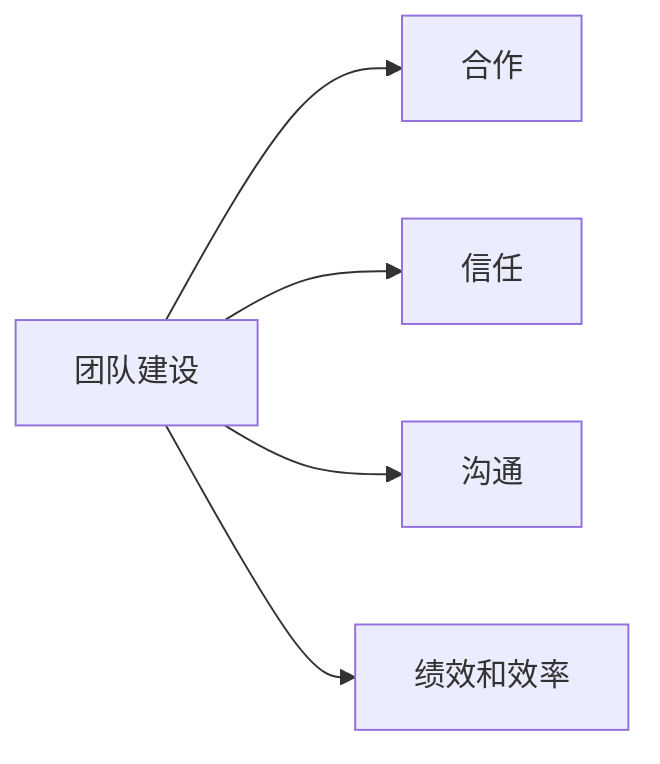
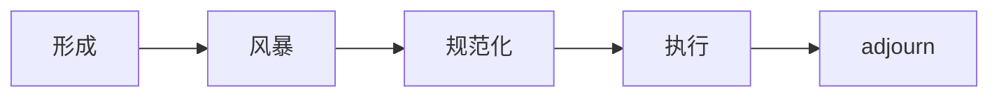
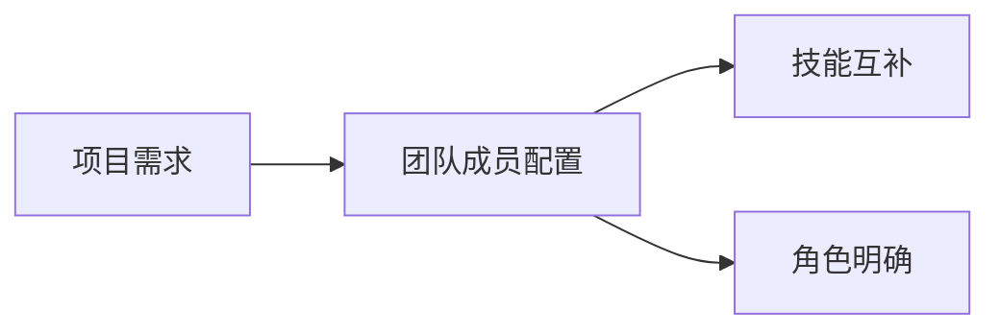
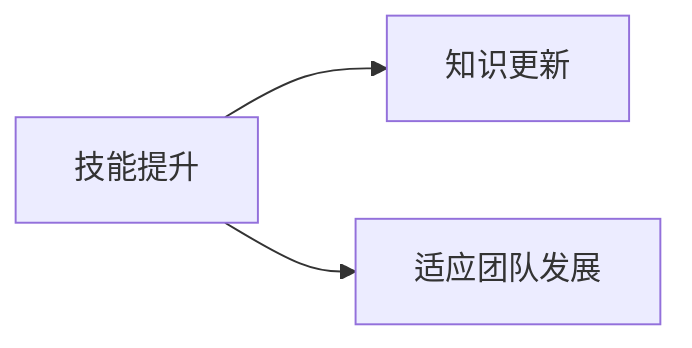
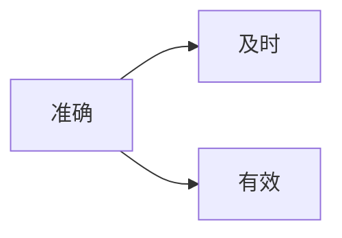
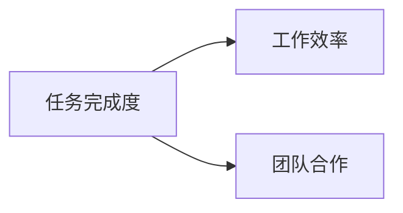
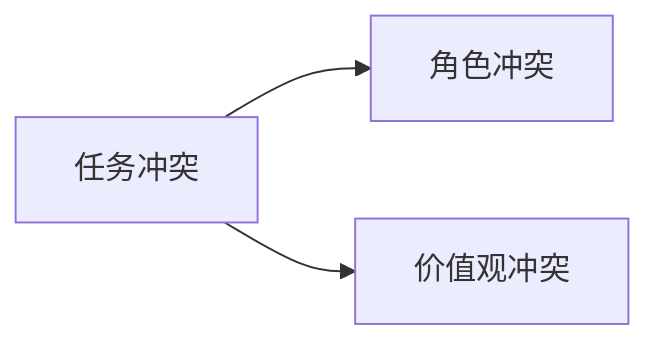
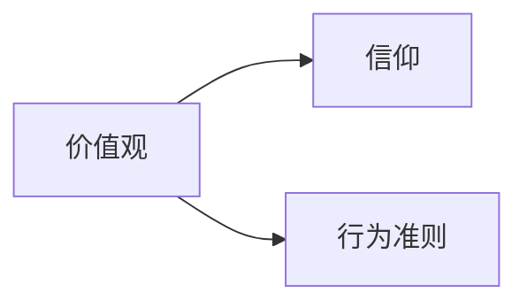
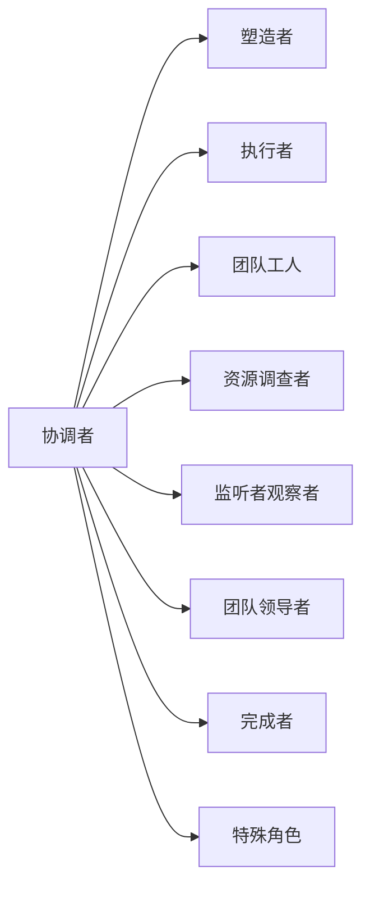

                 

### 文章标题

# 团队建设：从招聘到培养的全流程管理

> 关键词：团队建设、招聘策略、团队培训、沟通协作、绩效评估、冲突管理、团队文化

> 摘要：本文将深入探讨团队建设的过程，从招聘、培训、沟通、协作到绩效评估和冲突管理，提供全方位的管理策略。通过详细的分析和实例，帮助读者构建高效、和谐的团队。

### 第一部分：团队建设的基础概念

团队建设是现代企业成功的关键因素之一。一个高效的团队不仅能够提高工作绩效，还能增强员工的归属感和凝聚力。本部分将介绍团队建设的基础概念，包括团队建设的定义、重要性、核心原则和理论框架。

#### 第1章：团队建设的重要性

团队建设的重要性不言而喻。一个优秀的团队能够发挥出超乎想象的合力，实现共同的目标。团队建设的关键在于增强团队成员之间的合作、信任和沟通，从而提高团队整体绩效和效率。

**核心概念与联系**

- **团队建设**：团队建设是指通过一系列策略和措施，增强团队成员之间的合作、信任和沟通，以提高团队整体绩效和效率。

  ```mermaid
  flowchart LR
  A[团队建设] --> B[合作]
  A --> C[信任]
  A --> D[沟通]
  A --> E[绩效和效率]
  ```

**团队建设的核心原则**

- **目标一致性**：确保团队成员都朝着相同的目标努力。
- **角色明确性**：明确每个团队成员的角色和职责。
- **沟通畅通**：建立有效的沟通机制，确保信息的及时传递和反馈。

#### 第2章：团队建设的理论框架

团队建设不是一蹴而就的，它需要遵循一定的理论框架。其中，Tuckman的团队发展阶段理论是一个被广泛认可的模型，它将团队发展分为形成、风暴、规范化、执行和 adjourn五个阶段。

**核心概念与联系**

- **团队发展模型**：Tuckman的团队发展阶段理论，包括形成、风暴、规范化、执行和 adjourn四个阶段。

  ```mermaid
  flowchart LR
  A[形成] --> B[风暴]
  B --> C[规范化]
  C --> D[执行]
  D --> E[adjourn]
  ```

**团队建设的方法论**

- **建设性反馈**：提供积极的反馈和建设性的意见，促进团队成员的自我提升。
- **冲突管理**：有效解决团队内部的冲突，避免影响团队整体运作。
- **团队文化建设**：建立共同的价值观和文化，增强团队的凝聚力和归属感。

### 第二部分：团队建设的管理流程

团队建设不仅仅是理念上的认同，更需要具体的行动和策略。本部分将介绍团队建设的管理流程，包括团队组建与招聘策略、团队培训与发展、团队沟通与协作、团队绩效评估与激励。

#### 第3章：团队组建与招聘策略

团队组建是团队建设的第一步，它决定了团队的基础架构和核心能力。招聘策略则是团队组建的核心，它决定了团队成员的素质和能力。

**核心概念与联系**

- **团队组建原则**：根据项目需求和团队特点，合理配置团队成员。

  ```mermaid
  flowchart LR
  A[项目需求] --> B[团队成员配置]
  B --> C[技能互补]
  B --> D[角色明确]
  ```

**招聘策略**

- **人才筛选标准**：明确招聘的技能要求、经验和能力标准。
- **招聘渠道选择**：根据团队需求和预算，选择合适的招聘渠道。

#### 第4章：团队培训与发展

团队培训与发展是团队建设的持续动力，它不仅能够提高团队成员的技能和知识水平，还能增强团队的整体竞争力。

**核心概念与联系**

- **培训目的**：提高团队成员的技能和知识水平，以适应团队发展的需要。

  ```mermaid
  flowchart LR
  A[技能提升] --> B[知识更新]
  A --> C[适应团队发展]
  ```

**培训方法**

- **内部培训**：组织内部培训，由内部专家或外部顾问授课。
- **外部培训**：安排团队成员参加外部培训和研讨会，扩大知识视野。

#### 第5章：团队沟通与协作

沟通与协作是团队建设的核心，它决定了团队成员之间的协作效率和团队的整体绩效。

**核心概念与联系**

- **沟通原则**：确保信息准确、及时、有效地传递。

  ```mermaid
  flowchart LR
  A[准确] --> B[及时]
  A --> C[有效]
  ```

**协作工具与技术**

- **项目管理工具**：如Trello、JIRA等，帮助团队高效协作。
- **协作平台**：如Slack、Microsoft Teams等，促进实时沟通和协作。

#### 第6章：团队绩效评估与激励

团队绩效评估与激励是团队建设的重要环节，它能够激励团队成员的积极性，提高团队的整体绩效。

**核心概念与联系**

- **绩效评估指标**：设定明确的绩效评估标准，如任务完成度、工作效率、团队合作等。

  ```mermaid
  flowchart LR
  A[任务完成度] --> B[工作效率]
  A --> C[团队合作]
  ```

**激励措施**

- **奖励机制**：通过奖金、晋升、培训等激励措施，提高团队成员的工作积极性。
- **晋升通道**：建立明确的晋升机制，鼓励团队成员不断进步。

### 第三部分：团队建设中的挑战与应对策略

尽管团队建设的重要性已被广泛认同，但在实际操作中，团队建设面临诸多挑战。本部分将探讨团队建设中的挑战，并提出相应的应对策略。

#### 第7章：团队冲突管理

团队冲突是团队建设中的常见问题，它可能影响团队的和谐和效率。有效的冲突管理能够减少冲突的影响，提高团队的整体绩效。

**核心概念与联系**

- **冲突的类型**：理解不同类型的冲突，如任务冲突、角色冲突等。

  ```mermaid
  flowchart LR
  A[任务冲突] --> B[角色冲突]
  A --> C[价值观冲突]
  ```

**冲突管理策略**

- **预防措施**：通过明确沟通渠道、角色分工等方式，减少冲突的发生。
- **解决方法**：采用对话、调解、决策等方式，及时解决团队冲突。

#### 第8章：团队文化建设

团队文化是团队的核心，它决定了团队成员的行为和团队的整体氛围。建设良好的团队文化，能够增强团队的凝聚力，提高团队的整体绩效。

**核心概念与联系**

- **团队文化的定义**：团队文化是团队成员共同遵循的价值观、信仰和行为准则。

  ```mermaid
  flowchart LR
  A[价值观] --> B[信仰]
  A --> C[行为准则]
  ```

**团队文化建设策略**

- **价值观传递**：通过日常沟通、培训等方式，将团队价值观传递给每个成员。
- **行为准则**：制定明确的行为准则，规范团队成员的行为。

### 总结

团队建设是一个复杂而长期的过程，它需要管理者从招聘、培训、沟通、协作到绩效评估和冲突管理等多个方面进行全面管理。通过有效的团队建设，企业能够提高整体绩效，提升员工的满意度和归属感。希望本文能为您提供实用的团队建设策略，助力企业打造高效团队。

**作者：AI天才研究院/AI Genius Institute & 禅与计算机程序设计艺术 /Zen And The Art of Computer Programming**### 第一部分：团队建设的基础概念

#### 第1章：团队建设的重要性

在当今复杂多变的环境中，团队建设已成为企业成功的关键因素之一。一个高效的团队能够发挥出超乎想象的合力，实现共同的目标，而团队建设的重要性也日益凸显。

**团队建设的定义**

团队建设是指通过一系列策略和措施，增强团队成员之间的合作、信任和沟通，以提高团队整体绩效和效率。它不仅仅是一种管理手段，更是一种团队文化，一种价值观的体现。

**核心概念与联系**

在团队建设中，有几个核心概念需要理解：

- **合作**：团队建设的基础是合作，没有良好的合作，团队就无从谈起。
- **信任**：团队成员之间的信任是团队高效运作的保障。
- **沟通**：沟通是团队协作的桥梁，有效的沟通能够减少误解和冲突。
- **绩效和效率**：团队建设的最终目标是提高团队的整体绩效和效率。

用Mermaid流程图来表示这些概念之间的关系：



**团队建设的核心原则**

团队建设需要遵循一些核心原则，以确保团队的高效运作：

- **目标一致性**：确保团队成员都朝着相同的目标努力。每个团队成员都应明确团队的目标，并为之努力。
- **角色明确性**：明确每个团队成员的角色和职责。每个成员都应知道自己在团队中的位置和职责，以便更好地协作。
- **沟通畅通**：建立有效的沟通机制，确保信息的及时传递和反馈。团队成员之间的沟通应畅通无阻，确保信息的准确传递。

**团队建设的案例研究**

以某互联网公司为例，该公司在团队建设方面有着丰富的经验。他们通过以下措施来增强团队的合作、信任和沟通：

- **目标一致性**：公司每年都会制定清晰的目标和战略，并确保每个团队成员都理解并认同这些目标。
- **角色明确性**：公司明确了每个团队成员的角色和职责，确保每个成员都清楚自己的工作内容和期望成果。
- **沟通畅通**：公司采用了多种沟通工具，如Slack、Trello等，确保团队成员之间的沟通高效、及时。

**团队建设的挑战**

尽管团队建设的重要性已被广泛认同，但在实际操作中，团队建设面临着诸多挑战：

- **成员多样性**：团队成员的多样性可能会带来文化冲突和沟通障碍。
- **时间紧迫**：在快节奏的工作环境中，团队建设可能被忽视或未能有效执行。
- **领导力不足**：缺乏有效的团队领导可能导致团队建设失败。

**团队建设的解决方案**

为了克服这些挑战，团队建设需要采取以下解决方案：

- **多元化培训**：通过多元化培训，增强团队成员之间的理解和尊重，减少文化冲突。
- **定期评估**：定期评估团队建设和沟通的效果，及时调整策略。
- **领导力培养**：加强团队领导力的培养，提高团队领导者的沟通和领导能力。

**总结**

团队建设是一个复杂而长期的过程，但它是企业成功的关键。通过明确团队建设的核心概念、原则和策略，企业可以构建高效、和谐的团队，从而实现更高的绩效和效率。

#### 第2章：团队建设的理论框架

团队建设不仅需要实践经验，更需要理论指导。在众多团队建设理论中，Tuckman的团队发展阶段理论和贝尔宾的团队角色理论是最具影响力的两个模型。这些理论为我们提供了理解和指导团队发展的框架。

**Tuckman的团队发展阶段理论**

Tuckman的团队发展阶段理论是一个经典的团队建设模型，它将团队发展分为五个阶段：形成、风暴、规范化、执行和adjourn。

- **形成阶段**（Forming）：团队刚成立时，成员们彼此不熟悉，都在了解团队的目标和期望。这一阶段的重点是建立信任和相互了解。

- **风暴阶段**（Storming）：在这一阶段，团队成员开始争论和冲突，试图确定自己在团队中的位置和权力。有效的领导在这一阶段至关重要，可以帮助团队克服分歧。

- **规范化阶段**（Norming）：随着团队成员之间的相互了解加深，团队开始形成共同的价值观和行为规范，合作变得更加顺畅。

- **执行阶段**（Performing）：在规范化阶段之后，团队进入执行阶段，成员之间的高度信任和协作使团队能够高效地完成任务。

- **adjourn阶段**（Adjourning）：团队完成任务或解散时，进入adjourn阶段。这一阶段通常是团队结束前的反思和总结，为团队成员的下一步发展做准备。

用Mermaid流程图表示Tuckman的团队发展阶段：



**贝尔宾的团队角色理论**

贝尔宾的团队角色理论将团队成员分为九个角色，每个角色都有其独特的贡献：

- **协调者**（Coordinator）：调解团队内部的冲突，促进沟通和协作。
- **塑造者**（Shaper）：推动团队前进，激励成员发挥最佳水平。
- **执行者**（Implementer）：负责具体任务的执行，确保计划得到实施。
- **团队工人**（Teamworker）：善于合作，关心团队成员的感受。
- **资源调查者**（Resource Investigator）：寻找外部资源，开拓新的机会。
- **监听者观察者**（Monitor Evaluator）：提供客观的反馈，评估团队的表现。
- **团队领导者**（Team Leader）：领导团队，制定战略和目标。
- **完成者**（Completer Fini
```### 第二部分：团队建设的管理流程

#### 第3章：团队组建与招聘策略

团队组建是团队建设的第一步，也是至关重要的一步。一个优秀的团队需要合适的成员，而招聘策略是确保团队成员质量和数量的关键。有效的团队组建和招聘策略能够为团队的成功奠定基础。

**团队组建原则**

团队组建需要遵循一些核心原则，以确保团队的效率和协作性：

- **项目需求导向**：根据项目的具体需求和特点，选择合适的团队成员。例如，一个软件开发项目可能需要前端开发者、后端开发者、测试工程师等不同角色的人才。
- **技能互补**：团队成员的技能应该互补，形成综合能力。这样可以确保团队能够面对各种挑战，提高整体解决问题的能力。
- **角色明确性**：明确每个团队成员的角色和职责，确保每个成员都清楚自己的任务和期望。这有助于减少误解和冲突，提高团队效率。

用Mermaid流程图表示团队组建原则：



**招聘策略**

招聘策略决定了团队的质量和多样性。以下是一些关键策略：

- **人才筛选标准**：明确招聘的技能要求、经验和能力标准。例如，对于软件开发岗位，可以要求候选人具备一定的编程语言知识、项目经验和技术栈理解。
- **招聘渠道选择**：根据团队需求和预算，选择合适的招聘渠道。常见的招聘渠道包括在线招聘平台、社交媒体、内部推荐等。此外，参加行业会议和招聘会也是有效的方式。
- **面试流程**：建立有效的面试流程，包括技术面试、行为面试和团队面试等。技术面试可以评估候选人的技术能力，行为面试可以了解候选人的性格和工作习惯，团队面试则可以观察候选人是否适合团队文化。

**招聘案例分析**

以某初创公司的团队组建为例，该公司在招聘过程中遵循了以下策略：

- **项目需求导向**：公司开发一款社交应用，需要前端、后端和移动端开发者，以及测试工程师和产品经理。
- **技能互补**：前端开发者擅长UI设计，后端开发者擅长数据处理，移动端开发者擅长跨平台开发，测试工程师负责确保产品质量，产品经理负责产品规划和需求分析。
- **角色明确性**：每个团队成员的角色和职责都清晰界定，确保工作分配合理，避免重复和冲突。

**招聘挑战与解决方案**

在招聘过程中，公司面临了一些挑战，例如：

- **人才短缺**：热门技术岗位如人工智能、大数据等人才供不应求。
- **高离职率**：初创公司可能因为待遇、职业发展等原因面临高离职率。

解决方案：

- **提高待遇和福利**：提供有竞争力的薪资和福利，以吸引和留住优秀人才。
- **职业发展机会**：为员工提供职业发展和培训机会，提高员工的职业满意度。

**总结**

团队组建和招聘策略是团队建设的重要环节。通过遵循项目需求导向、技能互补和角色明确性等原则，选择合适的团队成员，企业可以构建一个高效、协作的团队，为项目的成功奠定基础。

#### 第4章：团队培训与发展

团队培训与发展是团队建设中不可或缺的一部分。一个持续学习和成长的团队能够不断提升自身的竞争力，适应不断变化的市场环境。团队培训与发展的核心在于提高团队成员的技能和知识水平，以适应团队发展的需要。

**培训目的**

团队培训的主要目的是：

- **技能提升**：通过培训，团队成员可以学习新的技能，提高现有技能的水平。例如，软件开发者可以通过培训学习新的编程语言或框架，提高开发效率。
- **知识更新**：随着技术的发展，团队成员需要不断更新自己的知识库，以适应新的技术和市场需求。培训可以帮助团队成员了解最新的行业趋势和技术动态。
- **适应团队发展**：团队发展是一个持续的过程，团队成员需要适应团队的目标、文化和工作方式。培训可以帮助新成员快速融入团队，提高整体协作效率。

用Mermaid流程图表示培训目的：



**培训方法**

团队培训的方法多种多样，可以根据团队的具体需求和情况选择合适的培训方式：

- **内部培训**：内部培训是团队培训的主要形式之一，由内部专家或外部顾问进行授课。这种培训方式具有针对性，可以针对团队的具体需求进行定制，提高培训效果。

  **示例**：某互联网公司定期组织内部技术分享会，邀请公司内部的技术专家分享最新的技术趋势和经验。

- **外部培训**：外部培训是指团队成员参加外部提供的培训课程或研讨会。这种培训方式可以提供更广泛的知识和视角，有助于团队成员拓宽视野。

  **示例**：某科技公司组织团队成员参加行业内的技术大会，了解最新的技术发展和行业动态。

- **在线学习**：随着互联网技术的发展，在线学习成为一种越来越受欢迎的培训方式。在线学习平台如Coursera、Udemy等提供了丰富的课程资源，方便团队成员随时随地进行学习。

  **示例**：某初创公司鼓励员工利用业余时间通过在线课程学习新技能，提高个人职业素养。

**培训效果评估**

培训效果评估是确保培训有效性的关键。以下是一些常用的评估方法：

- **问卷调查**：通过问卷调查收集团队成员的反馈，了解培训内容的满意度、实用性等。
- **技能测试**：通过技能测试评估团队成员在培训后的技能提升情况，确保培训目标达成。
- **绩效评估**：将培训后的绩效表现与培训前进行对比，评估培训对团队成员工作绩效的影响。

**培训案例分析**

以某大型企业为例，该企业在团队培训与发展方面采取了一系列有效措施：

- **建立内部培训体系**：企业建立了完善的内部培训体系，定期组织技术讲座、项目分享等，提高员工的专业技能。
- **提供外部培训机会**：企业为员工提供外部培训机会，鼓励员工参加行业大会、技术研讨会等，了解最新的技术趋势。
- **绩效激励**：对参加培训并取得优异成绩的员工给予绩效奖励，激励员工积极参与培训。

**培训挑战与解决方案**

团队培训过程中可能会遇到以下挑战：

- **时间冲突**：团队成员可能因工作繁忙而无法参加培训。
- **资源有限**：企业可能面临预算有限、培训资源不足的问题。

解决方案：

- **灵活安排培训时间**：提供灵活的培训时间，如线上培训、周末培训等，以适应团队成员的时间安排。
- **合理分配培训资源**：优先安排对团队发展有重要影响的培训项目，确保培训资源的有效利用。

**总结**

团队培训与发展是团队建设的重要组成部分。通过有效的培训，团队成员可以不断提升自身的技能和知识水平，适应团队的发展需求。企业应重视团队培训，制定合理的培训策略，以提升团队的整体竞争力。

#### 第5章：团队沟通与协作

团队沟通与协作是团队建设中至关重要的一环，它决定了团队的工作效率和成员之间的互动质量。有效的沟通与协作能够确保信息准确、及时地传递，减少误解和冲突，提高团队的凝聚力。

**沟通原则**

为了确保团队沟通的有效性，需要遵循以下原则：

- **准确性**：沟通的内容应准确无误，避免因信息传递错误导致误解。
- **及时性**：沟通应在需要时及时进行，确保信息的时效性。
- **有效性**：沟通应能够达到预期的效果，使团队成员能够理解和执行。

用Mermaid流程图表示沟通原则：



**协作工具与技术**

在现代工作环境中，各种协作工具和技术大大提高了团队的沟通与协作效率。以下是一些常用的工具和技术：

- **项目管理工具**：如Trello、JIRA等，可以帮助团队规划和跟踪项目进度，确保任务按时完成。
- **协作平台**：如Slack、Microsoft Teams等，提供了实时沟通和协作的空间，方便团队成员之间的交流和合作。
- **共享文档**：如Google Docs、Notion等，允许团队成员实时编辑和共享文档，提高信息共享的效率。

**沟通案例分析**

以某科技公司为例，该公司在团队沟通与协作方面采取了一系列措施：

- **定期会议**：公司定期举行团队会议，讨论项目进展、解决问题和分享经验。会议采用线上平台进行，方便全球分布的团队成员参与。
- **实时沟通**：公司使用Slack作为日常沟通工具，团队成员可以在不同的频道中进行实时交流，提高信息传递的及时性。
- **共享文档**：公司采用Google Docs管理项目文档，团队成员可以实时编辑和共享，确保信息的一致性。

**沟通挑战与解决方案**

团队沟通过程中可能会遇到以下挑战：

- **信息过载**：团队成员可能因信息过多而感到压力，难以有效处理。
- **沟通障碍**：团队成员可能因文化差异、语言障碍等原因导致沟通不畅。

解决方案：

- **信息过滤**：建立信息过滤机制，确保团队成员接收到的信息是有价值的，减少信息过载。
- **跨文化培训**：提供跨文化沟通培训，帮助团队成员了解和尊重不同的文化差异，提高沟通效果。

**总结**

团队沟通与协作是团队建设的关键，通过有效的沟通和协作，团队可以更好地实现目标，提高工作效率。企业应重视团队沟通，利用现代技术工具，建立有效的沟通机制，促进团队成员之间的互动和合作。

#### 第6章：团队绩效评估与激励

团队绩效评估与激励是团队建设的重要组成部分，它不仅能够衡量团队的工作成果，还能激发团队成员的积极性，提高团队的整体绩效。有效的绩效评估和激励措施能够帮助团队实现目标，提高工作效率。

**绩效评估指标**

绩效评估指标是衡量团队成员工作成果的重要标准，常见的绩效评估指标包括：

- **任务完成度**：评估团队成员完成任务的质量和速度。
- **工作效率**：评估团队成员在工作中的效率，包括时间管理、资源利用等。
- **团队合作**：评估团队成员在团队中的合作态度和协作能力。

用Mermaid流程图表示绩效评估指标：



**绩效评估方法**

绩效评估的方法多种多样，以下是一些常用的评估方法：

- **定期评估**：定期对团队成员的工作进行评估，如每月、每季度或每年。定期评估有助于及时发现问题和改进。
- **360度评估**：通过团队成员、上级领导、客户等多方面的反馈进行评估，全面了解团队成员的工作表现。
- **KPI（关键绩效指标）评估**：设定关键绩效指标，根据指标完成情况进行评估，确保评估的客观性和科学性。

**激励措施**

激励措施是激发团队成员积极性、提高工作绩效的重要手段。以下是一些有效的激励措施：

- **奖励机制**：对工作表现优秀的团队成员给予物质奖励，如奖金、股权激励等。
- **晋升通道**：为团队成员提供清晰的晋升路径，激励他们不断提升自己，实现职业发展。
- **培训与发展**：提供培训和发展机会，帮助团队成员提升技能和知识，增强职业竞争力。

**激励案例分析**

以某互联网公司为例，该公司在绩效评估与激励方面采取了以下措施：

- **定期评估**：公司每月进行绩效评估，根据评估结果进行奖金分配和晋升决策。
- **奖励机制**：对完成重要项目的团队成员给予额外的奖金奖励，激励团队积极工作。
- **晋升通道**：公司为员工提供清晰的晋升路径，根据员工的绩效和发展潜力进行晋升决策。

**绩效评估与激励的挑战与解决方案**

绩效评估与激励过程中可能会遇到以下挑战：

- **评估不公平**：评估过程可能存在主观偏见，导致评估结果不公平。
- **激励不足**：激励措施可能不足以激发团队成员的积极性。

解决方案：

- **公平评估**：建立科学的评估体系，确保评估的客观性和公平性。
- **个性化激励**：根据团队成员的特点和需求，提供个性化的激励措施，提高激励效果。

**总结**

团队绩效评估与激励是团队建设的重要环节，通过科学的评估方法和有效的激励措施，能够提高团队的工作绩效和成员的积极性。企业应重视绩效评估与激励，建立合理的评估体系和激励机制，促进团队的长期发展。

### 第三部分：团队建设中的挑战与应对策略

尽管团队建设的重要性已被广泛认可，但在实际操作中，团队建设面临着诸多挑战。如何识别并应对这些挑战，是团队建设成功的关键。本部分将探讨团队建设中的挑战，并提出相应的应对策略。

#### 第7章：团队冲突管理

团队冲突是团队建设中的常见问题，它可能源于任务分配、角色定位、工作方式、价值观等多方面。有效的冲突管理能够减少冲突的影响，提高团队的整体绩效。

**冲突的类型**

团队冲突可以分为以下几种类型：

- **任务冲突**：团队成员在任务分配和工作方式上产生的冲突，如任务重复、责任不明等。
- **角色冲突**：团队成员在角色定位和职责上产生的冲突，如角色重叠、职责不清等。
- **价值观冲突**：团队成员在价值观和信仰上产生的冲突，如文化差异、工作态度等。

用Mermaid流程图表示冲突类型：



**冲突管理策略**

有效的冲突管理需要采取以下策略：

- **预防措施**：通过明确的沟通渠道、角色分工和职责界定，减少冲突的发生。例如，建立定期会议制度，及时解决团队内部的分歧。
- **解决方法**：当冲突发生时，采取对话、调解和决策等方式解决。对话是解决冲突的基础，调解和决策则是确保冲突得到有效解决的关键。

**冲突管理案例分析**

以某科技公司为例，该公司在冲突管理方面采取了一系列措施：

- **预防措施**：公司建立了明确的沟通渠道，如定期团队会议和内部邮件系统，确保信息畅通。同时，明确每个团队成员的角色和职责，减少角色冲突。
- **解决方法**：当冲突发生时，公司设立了专门的冲突调解小组，由调解员协助团队成员进行对话和协商，确保冲突得到及时解决。

**冲突管理的挑战与解决方案**

团队冲突管理过程中可能会遇到以下挑战：

- **沟通障碍**：团队成员可能因文化差异、语言障碍等原因导致沟通不畅。
- **调解难度**：某些冲突可能涉及复杂的利益关系，解决难度较大。

解决方案：

- **提高沟通技巧**：通过沟通培训，提高团队成员的沟通技巧，确保信息准确、及时地传递。
- **建立调解机制**：建立专门的调解机制，由专业的调解员协助解决冲突，提高调解效果。

#### 第8章：团队文化建设

团队文化是团队的核心，它决定了团队成员的行为和团队的整体氛围。建设良好的团队文化，能够增强团队的凝聚力，提高团队的整体绩效。

**团队文化的定义**

团队文化是指团队成员共同遵循的价值观、信仰和行为准则。它不仅影响团队成员的工作方式，还影响团队的整体氛围和凝聚力。

用Mermaid流程图表示团队文化：



**团队文化建设策略**

建设良好的团队文化需要采取以下策略：

- **价值观传递**：通过日常沟通、培训和活动，将团队价值观传递给每个成员。例如，公司可以通过企业价值观海报、员工手册等方式，让团队成员了解并认同公司的价值观。
- **行为准则**：制定明确的行为准则，规范团队成员的行为。例如，公司可以制定职业道德准则、工作行为规范等，确保团队成员在工作中遵守。
- **文化活动**：组织丰富多彩的文化活动，增强团队成员的归属感和凝聚力。例如，公司可以举办团队建设活动、庆祝活动等，加强团队成员之间的互动。

**团队文化建设案例分析**

以某互联网公司为例，该公司在团队文化建设方面采取了以下措施：

- **价值观传递**：公司通过内部邮件、员工手册等方式，将公司价值观传递给每个员工。同时，公司定期举办价值观宣讲活动，让员工深入了解并认同公司的价值观。
- **行为准则**：公司制定了明确的职业道德和行为规范，确保员工在工作中遵守。例如，公司禁止员工泄露公司机密，要求员工在工作中保持诚信和专业。
- **文化活动**：公司定期举办团队建设活动，如户外拓展、团队竞赛等，增强员工的团队意识和归属感。

**团队文化建设的挑战与解决方案**

团队文化建设过程中可能会遇到以下挑战：

- **文化融合**：团队成员来自不同的背景，可能存在文化差异，影响团队文化的建设。
- **文化固化**：团队文化可能随着时间而固化，影响团队的创新和灵活性。

解决方案：

- **文化融合**：通过多元化培训和文化交流活动，促进团队成员之间的文化融合。例如，公司可以举办文化沙龙、团队交流等活动，促进团队成员之间的交流和理解。
- **文化创新**：鼓励团队成员提出新的想法和建议，推动团队文化的创新和变革。例如，公司可以设立创新奖，鼓励员工提出创新方案，推动团队文化的更新。

**总结**

团队建设中的挑战和应对策略是团队成功的关键。通过有效的冲突管理和团队文化建设，企业可以构建一个高效、和谐的团队，实现更高的绩效和效率。企业应重视团队建设，采取科学的管理策略，应对挑战，推动团队的持续发展。

### 总结

团队建设是企业成功的关键因素之一，它决定了团队的工作效率和整体绩效。从招聘、培训、沟通、协作到绩效评估和冲突管理，每个环节都需要精心设计和执行。本文通过详细的分析和实例，提供了全方位的团队建设管理策略。

首先，团队建设的重要性不容忽视。通过明确的团队建设目标、核心原则和理论框架，企业可以构建一个高效、和谐的团队。在团队组建和招聘策略中，遵循项目需求导向、技能互补和角色明确性等原则，能够确保团队的基础质量。团队培训与发展则通过提高团队成员的技能和知识水平，增强团队的整体竞争力。有效的沟通与协作工具和技术，确保信息准确、及时地传递，减少误解和冲突。绩效评估与激励措施，激发团队成员的积极性，提高团队的整体绩效。

然而，团队建设过程中也会面临各种挑战，如冲突管理、文化融合等。通过科学的管理策略和有效的解决方案，企业可以克服这些挑战，推动团队的持续发展。

最后，团队文化建设是团队建设的核心。一个健康的团队文化能够增强团队的凝聚力，提高整体绩效。企业应重视团队文化建设，通过价值观传递、行为准则和文化活动，构建一个积极、和谐的团队文化。

**作者：AI天才研究院/AI Genius Institute & 禅与计算机程序设计艺术 /Zen And The Art of Computer Programming**### 第一部分：团队建设的基础概念

#### 第1章：团队建设的重要性

在当今竞争激烈的商业环境中，团队建设已成为企业成功的关键因素之一。一个高效的团队不仅能够提高工作绩效，还能增强员工的满意度和归属感。因此，理解团队建设的重要性，以及如何构建一个成功的团队，对于企业来说是至关重要的。

**团队建设的定义**

团队建设是指通过一系列策略和措施，增强团队成员之间的合作、信任和沟通，以提高团队整体绩效和效率。这个过程不仅涉及团队成员之间的互动，还包括团队领导者的指导和激励。

**核心概念与联系**

在团队建设中，有几个核心概念是至关重要的，它们相互联系，共同作用，推动团队的发展：

1. **合作**：团队合作是实现团队目标的基础。团队成员需要共同努力，相互支持，以达成共同的目标。
2. **信任**：信任是团队协作的润滑剂。团队成员之间的信任可以减少误解和冲突，提高工作效率。
3. **沟通**：有效的沟通是团队协作的关键。团队成员需要能够清晰地表达自己的想法，并理解他人的观点。
4. **绩效和效率**：团队建设的最终目标是提高团队的绩效和效率。通过提升团队合作，可以减少错误，加快项目进度，提高产品质量。

用Mermaid流程图表示这些概念之间的关系：


**团队建设的核心原则**

团队建设需要遵循以下核心原则：

1. **目标一致性**：确保团队成员都朝着相同的目标努力。每个成员都应明确团队的目标，并为之努力。
2. **角色明确性**：明确每个团队成员的角色和职责。每个成员都应知道自己在团队中的位置和任务，以便更好地协作。
3. **沟通畅通**：建立有效的沟通机制，确保信息的及时传递和反馈。团队成员之间的沟通应畅通无阻，确保信息的准确传递。

**团队建设的案例研究**

以某科技公司的团队建设为例，该公司通过以下措施来增强团队合作、信任和沟通：

- **目标一致性**：公司每年都会制定清晰的战略目标，并确保每个团队成员都理解并认同这些目标。
- **角色明确性**：公司明确每个团队成员的角色和职责，确保每个成员都清楚自己的任务和期望。
- **沟通畅通**：公司采用了多种沟通工具，如Slack和Microsoft Teams，确保团队成员之间的沟通高效、及时。

**团队建设的挑战**

尽管团队建设的重要性已被广泛认同，但在实际操作中，团队建设面临着诸多挑战：

- **成员多样性**：团队成员的多样性可能会带来文化冲突和沟通障碍。
- **时间紧迫**：在快节奏的工作环境中，团队建设可能被忽视或未能有效执行。
- **领导力不足**：缺乏有效的团队领导可能导致团队建设失败。

**团队建设的解决方案**

为了克服这些挑战，团队建设需要采取以下解决方案：

- **多元化培训**：通过多元化培训，增强团队成员之间的理解和尊重，减少文化冲突。
- **定期评估**：定期评估团队建设和沟通的效果，及时调整策略。
- **领导力培养**：加强团队领导力的培养，提高团队领导者的沟通和领导能力。

**总结**

团队建设是一个复杂而长期的过程，但它是企业成功的关键。通过明确团队建设的核心概念、原则和策略，企业可以构建高效、和谐的团队，从而实现更高的绩效和效率。

#### 第2章：团队建设的理论框架

团队建设不仅仅是一种实践，更需要理论的指导。在众多团队建设理论中，Tuckman的团队发展阶段理论和贝尔宾的团队角色理论是最具影响力的两个模型。这些理论为我们提供了理解和指导团队发展的框架。

**Tuckman的团队发展阶段理论**

Tuckman的团队发展阶段理论是团队建设的经典理论之一。Tuckman认为，团队发展通常经历五个阶段：形成、风暴、规范化、执行和 adjourn。

1. **形成阶段（Forming）**：在这个阶段，团队成员刚刚开始合作，彼此之间还不够熟悉。团队成员通常会关注个人利益，而不是团队目标。

2. **风暴阶段（Storming）**：随着团队成员相互了解加深，开始出现意见分歧和冲突。这个阶段的关键是解决冲突，建立团队的基本规则和沟通机制。

3. **规范化阶段（Norming）**：在经过风暴阶段后，团队成员开始接受团队规则，建立共同的工作方式和价值观。团队成员之间的信任和协作增强，团队开始形成合力。

4. **执行阶段（Performing）**：在这个阶段，团队已经建立了稳定的协作模式，能够高效地完成任务。团队成员专注于工作，追求卓越。

5. **adjourn阶段（Adjourning）**：当团队完成特定任务或解散时，进入adjourn阶段。团队成员进行反思和总结，为新成员的加入或团队成员的职业发展做准备。

用Mermaid流程图表示Tuckman的团队发展阶段：


**贝尔宾的团队角色理论**

贝尔宾的团队角色理论将团队成员划分为九个角色，每个角色都有其独特的贡献。这些角色包括：

1. **协调者（Coordinator）**：调解团队内部的冲突，促进沟通和协作。
2. **塑造者（Shaper）**：推动团队前进，激励成员发挥最佳水平。
3. **执行者（Implementer）**：负责具体任务的执行，确保计划得到实施。
4. **团队工人（Teamworker）**：善于合作，关心团队成员的感受。
5. **资源调查者（Resource Investigator）**：寻找外部资源，开拓新的机会。
6. **监听者观察者（Monitor Evaluator）**：提供客观的反馈，评估团队的表现。
7. **团队领导者（Team Leader）**：领导团队，制定战略和目标。
8. **完成者（Completer Finisher）**：注重细节，确保工作完美结束。
9. **特殊角色（Specialist）**：在特定领域具有专业知识，为团队提供专业支持。

用Mermaid流程图表示贝尔宾的团队角色：



**团队建设的案例分析**

以某互联网公司的团队建设为例，该公司遵循了Tuckman的团队发展阶段理论，通过以下步骤实现了团队的规范化：

1. **形成阶段**：新团队成员加入后，公司组织了一系列培训活动，帮助新成员了解公司文化、目标和团队结构。
2. **风暴阶段**：在团队初期，团队成员之间存在意见分歧，公司通过定期的团队会议和沟通，逐步解决了冲突，建立了团队的基本规则。
3. **规范化阶段**：随着团队成员之间的了解加深，公司通过定期的团队活动和培训，强化了团队协作和信任，使团队进入了规范化阶段。
4. **执行阶段**：团队在规范化阶段的基础上，开始高效地执行项目任务，取得了显著的成果。
5. **adjourn阶段**：当项目结束后，公司组织了团队反思会议，总结了项目经验，为新项目的启动做好了准备。

**团队建设的策略**

为了实现高效的团队建设，企业可以采取以下策略：

- **领导力培养**：通过领导力培训，提升团队领导者的领导能力，确保团队在各个阶段都能够顺利发展。
- **角色明确**：明确团队成员的角色和职责，确保每个成员都清楚自己的任务和期望，避免角色重叠和责任不明。
- **沟通畅通**：建立有效的沟通机制，确保信息的准确传递，减少误解和冲突。

**总结**

团队建设的理论框架为我们提供了理解和指导团队发展的工具。通过遵循Tuckman的团队发展阶段理论和贝尔宾的团队角色理论，企业可以构建高效、和谐的团队，提高整体绩效和竞争力。

### 第二部分：团队建设的管理流程

团队建设不仅需要理论的指导，更需要实际的管理流程。这一部分将详细探讨团队建设的管理流程，包括团队组建与招聘策略、团队培训与发展、团队沟通与协作、团队绩效评估与激励。通过这些管理流程，企业可以确保团队在各个阶段都能保持高效运作。

#### 第3章：团队组建与招聘策略

团队组建是团队建设的第一步，也是至关重要的一步。合理的团队组建和招聘策略能够确保团队的基本质量和成员的协同效应。

**团队组建原则**

1. **项目需求导向**：团队组建应紧密结合项目的具体需求。例如，如果项目需要技术开发，团队应包括前端开发、后端开发、测试工程师等不同角色。
2. **技能互补**：团队成员的技能应互补，形成综合能力。这样可以确保团队能够面对各种挑战，提高整体解决问题的能力。
3. **角色明确性**：明确每个团队成员的角色和职责，确保每个成员都清楚自己的任务和期望。这有助于减少误解和冲突，提高团队效率。

用Mermaid流程图表示团队组建原则：


**招聘策略**

1. **人才筛选标准**：明确招聘的技能要求、经验和能力标准。例如，对于软件开发岗位，可以要求候选人具备一定的编程语言知识、项目经验和技术栈理解。
2. **招聘渠道选择**：根据团队需求和预算，选择合适的招聘渠道。常见的招聘渠道包括在线招聘平台、社交媒体、内部推荐等。
3. **面试流程**：建立有效的面试流程，包括技术面试、行为面试和团队面试等。技术面试可以评估候选人的技术能力，行为面试可以了解候选人的性格和工作习惯，团队面试则可以观察候选人是否适合团队文化。

**招聘案例分析**

以某互联网公司的招聘为例，该公司在招聘过程中遵循了以下策略：

1. **项目需求导向**：公司开发一款社交应用，需要前端、后端和移动端开发者，以及测试工程师和产品经理。
2. **技能互补**：前端开发者擅长UI设计，后端开发者擅长数据处理，移动端开发者擅长跨平台开发，测试工程师负责确保产品质量，产品经理负责产品规划和需求分析。
3. **角色明确性**：每个团队成员的角色和职责都清晰界定，确保工作分配合理，避免重复和冲突。

**招聘挑战与解决方案**

在招聘过程中，公司可能会面临以下挑战：

1. **人才短缺**：热门技术岗位如人工智能、大数据等人才供不应求。
2. **高离职率**：初创公司可能因为待遇、职业发展等原因面临高离职率。

解决方案：

1. **提高待遇和福利**：提供有竞争力的薪资和福利，以吸引和留住优秀人才。
2. **职业发展机会**：为员工提供职业发展和培训机会，提高员工的职业满意度。

**总结**

团队组建与招聘策略是团队建设的基础。通过遵循项目需求导向、技能互补和角色明确性等原则，企业可以构建一个高效、协作的团队，为项目的成功奠定基础。

#### 第4章：团队培训与发展

团队培训与发展是团队建设中不可或缺的一部分。通过培训，团队成员可以不断提升自身的技能和知识水平，以适应团队的发展需求。有效的团队培训与发展策略能够提高团队的整体竞争力。

**培训目的**

1. **技能提升**：通过培训，团队成员可以学习新的技能，提高现有技能的水平。例如，软件开发者可以通过培训学习新的编程语言或框架，提高开发效率。
2. **知识更新**：随着技术的发展，团队成员需要不断更新自己的知识库，以适应新的技术和市场需求。培训可以帮助团队成员了解最新的行业趋势和技术动态。
3. **适应团队发展**：团队发展是一个持续的过程，团队成员需要适应团队的目标、文化和工作方式。培训可以帮助新成员快速融入团队，提高整体协作效率。

用Mermaid流程图表示培训目的：


**培训方法**

1. **内部培训**：内部培训是团队培训的主要形式之一，由内部专家或外部顾问进行授课。这种培训方式具有针对性，可以针对团队的具体需求进行定制，提高培训效果。

   **示例**：某互联网公司定期组织内部技术分享会，邀请公司内部的技术专家分享最新的技术趋势和经验。

2. **外部培训**：外部培训是指团队成员参加外部提供的培训课程或研讨会。这种培训方式可以提供更广泛的知识和视角，有助于团队成员拓宽视野。

   **示例**：某初创公司组织团队成员参加行业内的技术大会，了解最新的技术发展和行业动态。

3. **在线学习**：随着互联网技术的发展，在线学习成为一种越来越受欢迎的培训方式。在线学习平台如Coursera、Udemy等提供了丰富的课程资源，方便团队成员随时随地进行学习。

   **示例**：某科技公司鼓励员工利用业余时间通过在线课程学习新技能，提高个人职业素养。

**培训效果评估**

培训效果评估是确保培训有效性的关键。以下是一些常用的评估方法：

1. **问卷调查**：通过问卷调查收集团队成员的反馈，了解培训内容的满意度、实用性等。
2. **技能测试**：通过技能测试评估团队成员在培训后的技能提升情况，确保培训目标达成。
3. **绩效评估**：将培训后的绩效表现与培训前进行对比，评估培训对团队成员工作绩效的影响。

**培训案例分析**

以某大型企业为例，该企业在团队培训与发展方面采取了一系列有效措施：

1. **建立内部培训体系**：企业建立了完善的内部培训体系，定期组织技术讲座、项目分享等，提高员工的专业技能。
2. **提供外部培训机会**：企业为员工提供外部培训机会，鼓励员工参加行业大会、技术研讨会等，了解最新的技术趋势。
3. **绩效激励**：对参加培训并取得优异成绩的员工给予绩效奖励，激励员工积极参与培训。

**培训挑战与解决方案**

团队培训过程中可能会遇到以下挑战：

1. **时间冲突**：团队成员可能因工作繁忙而无法参加培训。
2. **资源有限**：企业可能面临预算有限、培训资源不足的问题。

解决方案：

1. **灵活安排培训时间**：提供灵活的培训时间，如线上培训、周末培训等，以适应团队成员的时间安排。
2. **合理分配培训资源**：优先安排对团队发展有重要影响的培训项目，确保培训资源的有效利用。

**总结**

团队培训与发展是团队建设的重要组成部分。通过有效的培训，团队成员可以不断提升自身的技能和知识水平，适应团队的发展需求。企业应重视团队培训，制定合理的培训策略，以提升团队的整体竞争力。

#### 第5章：团队沟通与协作

团队沟通与协作是团队建设的关键环节，它决定了团队的工作效率和成员之间的互动质量。有效的沟通与协作能够确保信息准确、及时地传递，减少误解和冲突，提高团队的凝聚力。

**沟通原则**

为了确保团队沟通的有效性，需要遵循以下原则：

1. **准确性**：沟通的内容应准确无误，避免因信息传递错误导致误解。
2. **及时性**：沟通应在需要时及时进行，确保信息的时效性。
3. **有效性**：沟通应能够达到预期的效果，使团队成员能够理解和执行。

用Mermaid流程图表示沟通原则：


**协作工具与技术**

在现代工作环境中，各种协作工具和技术大大提高了团队的沟通与协作效率。以下是一些常用的工具和技术：

1. **项目管理工具**：如Trello、JIRA等，可以帮助团队规划和跟踪项目进度，确保任务按时完成。
2. **协作平台**：如Slack、Microsoft Teams等，提供了实时沟通和协作的空间，方便团队成员之间的交流和合作。
3. **共享文档**：如Google Docs、Notion等，允许团队成员实时编辑和共享文档，提高信息共享的效率。

**沟通案例分析**

以某科技公司为例，该公司在团队沟通与协作方面采取了一系列措施：

1. **定期会议**：公司定期举行团队会议，讨论项目进展、解决问题和分享经验。会议采用线上平台进行，方便全球分布的团队成员参与。
2. **实时沟通**：公司使用Slack作为日常沟通工具，团队成员可以在不同的频道中进行实时交流，提高信息传递的及时性。
3. **共享文档**：公司采用Google Docs管理项目文档，团队成员可以实时编辑和共享，确保信息的一致性。

**沟通挑战与解决方案**

团队沟通过程中可能会遇到以下挑战：

1. **信息过载**：团队成员可能因信息过多而感到压力，难以有效处理。
2. **沟通障碍**：团队成员可能因文化差异、语言障碍等原因导致沟通不畅。

解决方案：

1. **信息过滤**：建立信息过滤机制，确保团队成员接收到的信息是有价值的，减少信息过载。
2. **跨文化培训**：提供跨文化沟通培训，帮助团队成员了解和尊重不同的文化差异，提高沟通效果。

**总结**

团队沟通与协作是团队建设的重要组成部分。通过有效的沟通和协作，团队可以更好地实现目标，提高工作效率。企业应重视团队沟通，利用现代技术工具，建立有效的沟通机制，促进团队成员之间的互动和合作。

#### 第6章：团队绩效评估与激励

团队绩效评估与激励是团队建设中不可或缺的环节，它不仅能够衡量团队的工作成果，还能激发团队成员的积极性，提高团队的整体绩效。有效的绩效评估和激励措施能够帮助团队实现目标，提高工作效率。

**绩效评估指标**

绩效评估指标是衡量团队成员工作成果的重要标准，常见的绩效评估指标包括：

1. **任务完成度**：评估团队成员完成任务的质量和速度。
2. **工作效率**：评估团队成员在工作中的效率，包括时间管理、资源利用等。
3. **团队合作**：评估团队成员在团队中的合作态度和协作能力。

用Mermaid流程图表示绩效评估指标：


**绩效评估方法**

绩效评估的方法多种多样，以下是一些常用的评估方法：

1. **定期评估**：定期对团队成员的工作进行评估，如每月、每季度或每年。定期评估有助于及时发现问题和改进。
2. **360度评估**：通过团队成员、上级领导、客户等多方面的反馈进行评估，全面了解团队成员的工作表现。
3. **KPI（关键绩效指标）评估**：设定关键绩效指标，根据指标完成情况进行评估，确保评估的客观性和科学性。

**激励措施**

激励措施是激发团队成员积极性、提高工作绩效的重要手段。以下是一些有效的激励措施：

1. **奖励机制**：对工作表现优秀的团队成员给予物质奖励，如奖金、股权激励等。
2. **晋升通道**：为团队成员提供清晰的晋升路径，激励他们不断提升自己，实现职业发展。
3. **培训与发展**：提供培训和发展机会，帮助团队成员提升技能和知识，增强职业竞争力。

**激励案例分析**

以某互联网公司为例，该公司在绩效评估与激励方面采取了以下措施：

1. **定期评估**：公司每月进行绩效评估，根据评估结果进行奖金分配和晋升决策。
2. **奖励机制**：对完成重要项目的团队成员给予额外的奖金奖励，激励团队积极工作。
3. **晋升通道**：公司为员工提供清晰的晋升路径，根据员工的绩效和发展潜力进行晋升决策。

**绩效评估与激励的挑战与解决方案**

绩效评估与激励过程中可能会遇到以下挑战：

1. **评估不公平**：评估过程可能存在主观偏见，导致评估结果不公平。
2. **激励不足**：激励措施可能不足以激发团队成员的积极性。

解决方案：

1. **公平评估**：建立科学的评估体系，确保评估的客观性和公平性。
2. **个性化激励**：根据团队成员的特点和需求，提供个性化的激励措施，提高激励效果。

**总结**

团队绩效评估与激励是团队建设的重要组成部分。通过科学的评估方法和有效的激励措施，能够提高团队的工作绩效和成员的积极性。企业应重视绩效评估与激励，建立合理的评估体系和激励机制，促进团队的长期发展。

### 第三部分：团队建设中的挑战与应对策略

尽管团队建设的重要性已被广泛认可，但在实际操作中，团队建设面临着诸多挑战。如何识别并应对这些挑战，是团队建设成功的关键。本部分将探讨团队建设中的挑战，并提出相应的应对策略。

#### 第7章：团队冲突管理

团队冲突是团队建设中的常见问题，它可能源于任务分配、角色定位、工作方式、价值观等多方面。有效的冲突管理能够减少冲突的影响，提高团队的整体绩效。

**冲突的类型**

团队冲突可以分为以下几种类型：

1. **任务冲突**：团队成员在任务分配和工作方式上产生的冲突，如任务重复、责任不明等。
2. **角色冲突**：团队成员在角色定位和职责上产生的冲突，如角色重叠、职责不清等。
3. **价值观冲突**：团队成员在价值观和信仰上产生的冲突，如文化差异、工作态度等。

用Mermaid流程图表示冲突类型：


**冲突管理策略**

有效的冲突管理需要采取以下策略：

1. **预防措施**：通过明确的沟通渠道、角色分工和职责界定，减少冲突的发生。例如，建立定期会议制度，及时解决团队内部的分歧。
2. **解决方法**：当冲突发生时，采取对话、调解和决策等方式解决。对话是解决冲突的基础，调解和决策则是确保冲突得到有效解决的关键。

**冲突管理案例分析**

以某科技公司为例，该公司在冲突管理方面采取了一系列措施：

1. **预防措施**：公司建立了明确的沟通渠道，如定期团队会议和内部邮件系统，确保信息畅通。同时，明确每个团队成员的角色和职责，减少角色冲突。
2. **解决方法**：当冲突发生时，公司设立了专门的冲突调解小组，由调解员协助团队成员进行对话和协商，确保冲突得到及时解决。

**冲突管理的挑战与解决方案**

团队冲突管理过程中可能会遇到以下挑战：

1. **沟通障碍**：团队成员可能因文化差异、语言障碍等原因导致沟通不畅。
2. **调解难度**：某些冲突可能涉及复杂的利益关系，解决难度较大。

解决方案：

1. **提高沟通技巧**：通过沟通培训，提高团队成员的沟通技巧，确保信息准确、及时地传递。
2. **建立调解机制**：建立专门的调解机制，由专业的调解员协助解决冲突，提高调解效果。

#### 第8章：团队文化建设

团队文化是团队的核心，它决定了团队成员的行为和团队的整体氛围。建设良好的团队文化，能够增强团队的凝聚力，提高团队的整体绩效。

**团队文化的定义**

团队文化是指团队成员共同遵循的价值观、信仰和行为准则。它不仅影响团队成员的工作方式，还影响团队的整体氛围和凝聚力。

用Mermaid流程图表示团队文化：


**团队文化建设策略**

建设良好的团队文化需要采取以下策略：

1. **价值观传递**：通过日常沟通、培训和活动，将团队价值观传递给每个成员。例如，公司可以通过企业价值观海报、员工手册等方式，让团队成员了解并认同公司的价值观。
2. **行为准则**：制定明确的行为准则，规范团队成员的行为。例如，公司可以制定职业道德准则、工作行为规范等，确保团队成员在工作中遵守。
3. **文化活动**：组织丰富多彩的文化活动，增强团队成员的归属感和凝聚力。例如，公司可以举办团队建设活动、庆祝活动等，加强团队成员之间的互动。

**团队文化建设案例分析**

以某互联网公司为例，该公司在团队文化建设方面采取了以下措施：

1. **价值观传递**：公司通过内部邮件、员工手册等方式，将公司价值观传递给每个员工。同时，公司定期举办价值观宣讲活动，让员工深入了解并认同公司的价值观。
2. **行为准则**：公司制定了明确的职业道德和行为规范，确保员工在工作中遵守。例如，公司禁止员工泄露公司机密，要求员工在工作中保持诚信和专业。
3. **文化活动**：公司定期举办团队建设活动，如户外拓展、团队竞赛等，增强员工的团队意识和归属感。

**团队文化建设的挑战与解决方案**

团队文化建设过程中可能会遇到以下挑战：

1. **文化融合**：团队成员来自不同的背景，可能存在文化差异，影响团队文化的建设。
2. **文化固化**：团队文化可能随着时间而固化，影响团队的创新和灵活性。

解决方案：

1. **文化融合**：通过多元化培训和文化交流活动，促进团队成员之间的文化融合。例如，公司可以举办文化沙龙、团队交流等活动，促进团队成员之间的交流和理解。
2. **文化创新**：鼓励团队成员提出新的想法和建议，推动团队文化的创新和变革。例如，公司可以设立创新奖，鼓励员工提出创新方案，推动团队文化的更新。

**总结**

团队冲突管理和团队文化建设是团队建设中的重要环节。通过有效的冲突管理和团队文化建设，企业可以构建一个高效、和谐的团队，提高整体绩效和竞争力。企业应重视团队冲突管理和文化建设，采取科学的管理策略，促进团队的持续发展。**作者：AI天才研究院/AI Genius Institute & 禅与计算机程序设计艺术 /Zen And The Art of Computer Programming**### 招聘策略

招聘策略是团队建设的重要一环，它决定了团队的基本素质和潜力。为了确保招聘过程的有效性，企业需要制定明确的招聘标准和策略，选择合适的渠道，并设计有效的面试流程。

**招聘标准**

在招聘过程中，企业需要制定明确的招聘标准，以评估候选人的技能、经验和潜力。以下是一些常见的招聘标准：

1. **技能要求**：根据岗位需求，明确候选人需要具备的技能。例如，软件开发岗位需要掌握特定的编程语言和框架。
2. **经验要求**：根据岗位级别和职责，设定候选人的工作经验要求。有一定的工作经验可以确保候选人能够快速上手，减少培训成本。
3. **学历要求**：部分岗位可能需要较高的学历背景，以确保候选人具备扎实的基础知识。
4. **综合素质**：除了专业技能外，企业还需要评估候选人的综合素质，如沟通能力、团队合作能力、领导能力等。

**招聘渠道**

企业可以选择多种招聘渠道，以吸引不同层次的候选人。以下是一些常用的招聘渠道：

1. **在线招聘平台**：如LinkedIn、Indeed、Boss直聘等，这些平台覆盖广泛，可以吸引大量的候选人。
2. **社交媒体**：通过招聘公司官方微信公众号、微博等社交媒体发布招聘信息，可以吸引更多年轻、有活力的候选人。
3. **招聘会**：参加行业招聘会、校园招聘会等，可以直接与候选人面对面交流，了解候选人的实际能力。
4. **内部推荐**：鼓励现有员工推荐优秀人才，内部推荐通常更容易成功，且员工推荐的人才更符合公司的文化。
5. **专业猎头**：对于高级岗位或特殊人才，可以聘请专业猎头进行招聘，猎头通常有丰富的资源和经验。

**面试流程**

面试是评估候选人能力的重要环节，企业需要设计一套科学的面试流程。以下是一些常见的面试流程：

1. **初步筛选**：通过简历筛选和电话面试，初步评估候选人的基本条件，筛选出符合条件的候选人。
2. **技术面试**：邀请符合条件的候选人参加技术面试，通过笔试、编码测试等方式，评估候选人的专业技能和解决问题的能力。
3. **行为面试**：通过行为面试，了解候选人的工作态度、团队合作能力和领导能力。行为面试通常会问及候选人过去的工作经历和如何处理特定情境。
4. **综合面试**：邀请候选人参加综合面试，通常由多位面试官进行，评估候选人的整体素质和是否适合公司文化。

**案例研究**

以某互联网公司为例，该公司在招聘过程中采取了以下策略：

1. **招聘标准**：明确软件开发岗位的技能要求，如掌握Java、Python等编程语言，具备3-5年的工作经验，拥有良好的编码习惯。
2. **招聘渠道**：通过LinkedIn、Boss直聘等在线招聘平台发布招聘信息，参加行业招聘会，通过内部推荐吸引候选人。
3. **面试流程**：初步筛选通过后，进行技术面试，包括笔试和编码测试。然后进行行为面试，了解候选人的团队合作能力和领导潜力。最后进行综合面试，评估候选人的整体素质和是否适合公司文化。

**招聘挑战与解决方案**

在招聘过程中，企业可能会遇到以下挑战：

1. **人才短缺**：某些热门岗位如人工智能、大数据等人才供不应求。
2. **高离职率**：初创公司可能因为待遇、职业发展等原因面临高离职率。

解决方案：

1. **提高待遇和福利**：提供有竞争力的薪资和福利，以吸引和留住优秀人才。
2. **职业发展机会**：为员工提供职业发展和培训机会，提高员工的职业满意度。
3. **优化招聘流程**：简化招聘流程，提高招聘效率，确保人才及时补充。

**总结**

招聘策略是团队建设的基础，通过制定明确的招聘标准、选择合适的招聘渠道和设计科学的面试流程，企业可以吸引和留住优秀人才，构建一个高效、协作的团队。企业应根据自身情况和市场需求，灵活调整招聘策略，以应对人才短缺和高离职率等挑战。**作者：AI天才研究院/AI Genius Institute & 禅与计算机程序设计艺术 /Zen And The Art of Computer Programming**### 团队培训与发展

团队培训与发展是团队建设中至关重要的一环，它不仅能够提升团队成员的技能和知识水平，还能促进团队成员的个人成长和职业发展。有效的培训与发展策略能够提高团队的绩效和整体竞争力。

**培训目的**

团队培训的主要目的是：

1. **技能提升**：通过培训，团队成员可以学习新的技能，提高现有技能的水平。例如，软件开发者可以通过培训学习新的编程语言或框架，提高开发效率。
2. **知识更新**：随着技术的不断进步，团队成员需要不断更新自己的知识库，以适应新的技术和市场需求。培训可以帮助团队成员了解最新的行业趋势和技术动态。
3. **适应团队发展**：团队发展是一个动态的过程，团队成员需要不断适应团队的目标、文化和工作方式。培训可以帮助新成员快速融入团队，提高整体协作效率。

用Mermaid流程图表示培训目的：


**培训方法**

团队培训的方法多种多样，可以根据团队的具体需求和情况选择合适的培训方式：

1. **内部培训**：内部培训是团队培训的主要形式之一，由内部专家或外部顾问进行授课。这种培训方式具有针对性，可以针对团队的具体需求进行定制，提高培训效果。

   **示例**：某互联网公司定期组织内部技术分享会，邀请公司内部的技术专家分享最新的技术趋势和经验。

2. **外部培训**：外部培训是指团队成员参加外部提供的培训课程或研讨会。这种培训方式可以提供更广泛的知识和视角，有助于团队成员拓宽视野。

   **示例**：某初创公司组织团队成员参加行业内的技术大会，了解最新的技术发展和行业动态。

3. **在线学习**：随着互联网技术的发展，在线学习成为一种越来越受欢迎的培训方式。在线学习平台如Coursera、Udemy等提供了丰富的课程资源，方便团队成员随时随地进行学习。

   **示例**：某科技公司鼓励员工利用业余时间通过在线课程学习新技能，提高个人职业素养。

**培训效果评估**

培训效果评估是确保培训有效性的关键。以下是一些常用的评估方法：

1. **问卷调查**：通过问卷调查收集团队成员的反馈，了解培训内容的满意度、实用性等。
2. **技能测试**：通过技能测试评估团队成员在培训后的技能提升情况，确保培训目标达成。
3. **绩效评估**：将培训后的绩效表现与培训前进行对比，评估培训对团队成员工作绩效的影响。

**培训案例分析**

以某大型企业为例，该企业在团队培训与发展方面采取了以下措施：

1. **建立内部培训体系**：企业建立了完善的内部培训体系，定期组织技术讲座、项目分享等，提高员工的专业技能。
2. **提供外部培训机会**：企业为员工提供外部培训机会，鼓励员工参加行业大会、技术研讨会等，了解最新的技术趋势。
3. **绩效激励**：对参加培训并取得优异成绩的员工给予绩效奖励，激励员工积极参与培训。

**培训挑战与解决方案**

团队培训过程中可能会遇到以下挑战：

1. **时间冲突**：团队成员可能因工作繁忙而无法参加培训。
2. **资源有限**：企业可能面临预算有限、培训资源不足的问题。

解决方案：

1. **灵活安排培训时间**：提供灵活的培训时间，如线上培训、周末培训等，以适应团队成员的时间安排。
2. **合理分配培训资源**：优先安排对团队发展有重要影响的培训项目，确保培训资源的有效利用。

**总结**

团队培训与发展是团队建设的重要组成部分。通过有效的培训，团队成员可以不断提升自身的技能和知识水平，适应团队的发展需求。企业应重视团队培训，制定合理的培训策略，以提升团队的整体竞争力。**作者：AI天才研究院/AI Genius Institute & 禅与计算机程序设计艺术 /Zen And The Art of Computer Programming**### 团队沟通与协作

团队沟通与协作是团队建设中至关重要的一环，它决定了团队成员之间的互动质量和团队的整体工作效率。有效的沟通与协作能够确保信息准确、及时地传递，减少误解和冲突，提高团队的凝聚力。

**沟通原则**

为了确保团队沟通的有效性，需要遵循以下原则：

1. **准确性**：沟通的内容应准确无误，避免因信息传递错误导致误解。
2. **及时性**：沟通应在需要时及时进行，确保信息的时效性。
3. **有效性**：沟通应能够达到预期的效果，使团队成员能够理解和执行。

用Mermaid流程图表示沟通原则：


**协作工具与技术**

在现代工作环境中，各种协作工具和技术大大提高了团队的沟通与协作效率。以下是一些常用的工具和技术：

1. **项目管理工具**：如Trello、JIRA等，可以帮助团队规划和跟踪项目进度，确保任务按时完成。
2. **协作平台**：如Slack、Microsoft Teams等，提供了实时沟通和协作的空间，方便团队成员之间的交流和合作。
3. **共享文档**：如Google Docs、Notion等，允许团队成员实时编辑和共享文档，提高信息共享的效率。

**沟通案例分析**

以某科技公司为例，该公司在团队沟通与协作方面采取了一系列措施：

1. **定期会议**：公司定期举行团队会议，讨论项目进展、解决问题和分享经验。会议采用线上平台进行，方便全球分布的团队成员参与。
2. **实时沟通**：公司使用Slack作为日常沟通工具，团队成员可以在不同的频道中进行实时交流，提高信息传递的及时性。
3. **共享文档**：公司采用Google Docs管理项目文档，团队成员可以实时编辑和共享，确保信息的一致性。

**沟通挑战与解决方案**

团队沟通过程中可能会遇到以下挑战：

1. **信息过载**：团队成员可能因信息过多而感到压力，难以有效处理。
2. **沟通障碍**：团队成员可能因文化差异、语言障碍等原因导致沟通不畅。

解决方案：

1. **信息过滤**：建立信息过滤机制，确保团队成员接收到的信息是有价值的，减少信息过载。
2. **跨文化培训**：提供跨文化沟通培训，帮助团队成员了解和尊重不同的文化差异，提高沟通效果。

**总结**

团队沟通与协作是团队建设的重要组成部分。通过有效的沟通和协作，团队可以更好地实现目标，提高工作效率。企业应重视团队沟通，利用现代技术工具，建立有效的沟通机制，促进团队成员之间的互动和合作。**作者：AI天才研究院/AI Genius Institute & 禅与计算机程序设计艺术 /Zen And The Art of Computer Programming**### 团队绩效评估与激励

团队绩效评估与激励是团队建设的关键环节，它不仅能够衡量团队的工作成果，还能激发团队成员的积极性，提高团队的整体绩效。有效的绩效评估和激励措施能够帮助团队实现目标，提高工作效率。

**绩效评估指标**

绩效评估指标是衡量团队成员工作成果的重要标准，常见的绩效评估指标包括：

1. **任务完成度**：评估团队成员完成任务的质量和速度。
2. **工作效率**：评估团队成员在工作中的效率，包括时间管理、资源利用等。
3. **团队合作**：评估团队成员在团队中的合作态度和协作能力。

用Mermaid流程图表示绩效评估指标：


**绩效评估方法**

绩效评估的方法多种多样，以下是一些常用的评估方法：

1. **定期评估**：定期对团队成员的工作进行评估，如每月、每季度或每年。定期评估有助于及时发现问题和改进。
2. **360度评估**：通过团队成员、上级领导、客户等多方面的反馈进行评估，全面了解团队成员的工作表现。
3. **KPI（关键绩效指标）评估**：设定关键绩效指标，根据指标完成情况进行评估，确保评估的客观性和科学性。

**激励措施**

激励措施是激发团队成员积极性、提高工作绩效的重要手段。以下是一些有效的激励措施：

1. **奖励机制**：对工作表现优秀的团队成员给予物质奖励，如奖金、股权激励等。
2. **晋升通道**：为团队成员提供清晰的晋升路径，激励他们不断提升自己，实现职业发展。
3. **培训与发展**：提供培训和发展机会，帮助团队成员提升技能和知识，增强职业竞争力。

**激励案例分析**

以某互联网公司为例，该公司在绩效评估与激励方面采取了以下措施：

1. **定期评估**：公司每月进行绩效评估，根据评估结果进行奖金分配和晋升决策。
2. **奖励机制**：对完成重要项目的团队成员给予额外的奖金奖励，激励团队积极工作。
3. **晋升通道**：公司为员工提供清晰的晋升路径，根据员工的绩效和发展潜力进行晋升决策。

**绩效评估与激励的挑战与解决方案**

绩效评估与激励过程中可能会遇到以下挑战：

1. **评估不公平**：评估过程可能存在主观偏见，导致评估结果不公平。
2. **激励不足**：激励措施可能不足以激发团队成员的积极性。

解决方案：

1. **公平评估**：建立科学的评估体系，确保评估的客观性和公平性。
2. **个性化激励**：根据团队成员的特点和需求，提供个性化的激励措施，提高激励效果。

**总结**

团队绩效评估与激励是团队建设的重要组成部分。通过科学的评估方法和有效的激励措施，能够提高团队的工作绩效和成员的积极性。企业应重视绩效评估与激励，建立合理的评估体系和激励机制，促进团队的长期发展。**作者：AI天才研究院/AI Genius Institute & 禅与计算机程序设计艺术 /Zen And The Art of Computer Programming**### 团队冲突管理

团队冲突管理是团队建设中的重要一环，它能够确保团队在面临挑战时能够保持高效运作。有效的冲突管理能够减少团队内部的紧张关系，提升团队凝聚力和工作效率。

**冲突的类型**

团队冲突通常可以分为以下几种类型：

1. **任务冲突**：这种冲突发生在团队成员对任务的分配和执行方式存在分歧时。例如，某个团队成员可能认为某项任务应该由其他人来完成，或者对于任务的优先级有不同的看法。
2. **角色冲突**：这种冲突通常源于团队成员对各自角色的职责和权限的模糊理解。例如，一个团队成员可能认为另一个团队成员应该承担更多的工作，或者对职责界限存在争议。
3. **价值观冲突**：这种冲突是由于团队成员在价值观、信仰或者工作态度上的差异而产生的。例如，一个团队成员可能对项目的执行方式有强烈的个人偏好，而其他成员则有不同的看法。

用Mermaid流程图表示冲突类型：

```mermaid
flowchart LR
A[任务冲突] --> B[角色冲突]
A --> C[价值观冲突]
```

**冲突管理策略**

为了有效管理团队冲突，可以采取以下策略：

1. **预防措施**：
   - **明确的沟通渠道**：确保团队成员有清晰、畅通的沟通渠道，避免误解和冲突的发生。
   - **角色和职责明确**：确保团队成员了解各自的职责和权限，减少角色冲突。
   - **建立共识**：在团队初期，通过讨论和协商，建立共同的价值观和工作目标，减少价值观冲突。

2. **解决方法**：
   - **对话**：当冲突发生时，首先进行面对面的对话，让双方表达自己的观点和感受。
   - **调解**：如果对话无法解决问题，可以引入第三方调解员，帮助双方找到共同点。
   - **决策**：在无法达成一致的情况下，可以采取投票或其他决策方法，以确保团队决策的公平性和一致性。

**冲突管理案例分析**

以某互联网公司为例，该公司在冲突管理方面采取了一系列措施：

1. **预防措施**：
   - **明确的沟通渠道**：公司建立了多渠道的沟通机制，包括定期团队会议、邮件沟通和即时通讯工具，确保信息传递畅通。
   - **角色和职责明确**：每个团队成员的职责和权限都明确记录在案，并且定期更新。
   - **建立共识**：在项目启动时，团队通过讨论和协商，确定了共同的项目目标和价值观。

2. **解决方法**：
   - **对话**：当团队成员之间出现冲突时，首先进行一对一的对话，了解双方的立场和需求。
   - **调解**：如果对话无法解决问题，公司引入了内部调解员，帮助双方进行调解。
   - **决策**：在无法达成一致的情况下，团队通过投票或其他决策方法，确保决策的公平性和一致性。

**冲突管理的挑战与解决方案**

在冲突管理过程中，企业可能会遇到以下挑战：

1. **沟通障碍**：团队成员可能因文化差异、语言障碍等原因导致沟通不畅。
2. **调解难度**：某些冲突可能涉及复杂的利益关系，解决难度较大。

解决方案：

1. **沟通培训**：提供跨文化沟通培训，提高团队成员的沟通技巧，减少沟通障碍。
2. **专业调解**：引入专业的调解员，帮助解决复杂的冲突，提高调解效果。

**总结**

团队冲突管理是团队建设中不可或缺的一环。通过采取预防措施和解决方法，企业可以有效地管理团队冲突，减少负面影响的传播，提高团队的整体绩效和凝聚力。企业应重视冲突管理，建立有效的机制，确保团队在面临挑战时能够保持高效运作。**作者：AI天才研究院/AI Genius Institute & 禅与计算机程序设计艺术 /Zen And The Art of Computer Programming**### 团队文化建设

团队文化建设是团队建设中至关重要的一环，它不仅影响着团队成员的行为和工作态度，还决定了团队的凝聚力和整体绩效。一个健康、积极的团队文化能够激发团队成员的潜力，促进团队合作和创新。

**团队文化的定义**

团队文化是指团队成员共同遵循的价值观、信念和行为准则。它是团队的精神内核，反映了团队成员对工作、对团队的态度，以及团队的整体氛围。团队文化不仅影响团队成员的行为，还影响着团队的决策过程和执行效率。

**团队文化建设策略**

1. **价值观传递**

   价值观传递是团队文化建设的第一步。企业需要明确自身的核心价值观，并通过多种渠道传递给团队成员。例如，企业可以通过企业价值观海报、员工手册、培训课程等方式，让团队成员了解并认同企业的核心价值观。

2. **行为准则**

   制定明确的行为准则是团队文化建设的关键。企业需要明确哪些行为是鼓励的，哪些行为是不被接受的。例如，企业可以制定职业道德准则、工作行为规范等，确保团队成员在工作中遵守。

3. **文化活动**

   组织丰富多彩的文化活动能够增强团队成员的归属感和凝聚力。例如，企业可以定期举办团队建设活动、团队竞赛、节日庆祝活动等，让团队成员在轻松的氛围中增进了解和信任。

**团队文化建设案例分析**

以某互联网公司为例，该公司在团队文化建设方面采取了以下措施：

1. **价值观传递**

   公司通过内部邮件、员工手册和培训课程，将公司核心价值观传递给每个员工。公司核心价值观包括创新、用户至上、团队合作等，这些价值观在公司的日常运营中被广泛实践。

2. **行为准则**

   公司制定了明确的职业道德准则和工作行为规范，确保员工在工作中遵守。例如，公司禁止员工泄露公司机密，要求员工在工作中保持诚信和专业。

3. **文化活动**

   公司定期举办团队建设活动，如团队拓展训练、年度运动会、团队聚餐等，增强员工的团队意识和归属感。此外，公司还设立了一些非正式的社交活动，如周末篮球赛、电影之夜等，为员工提供放松和交流的机会。

**团队文化建设的挑战与解决方案**

在团队文化建设过程中，企业可能会遇到以下挑战：

1. **文化融合**

   团队成员来自不同的背景，可能存在文化差异，影响团队文化的建设。

   **解决方案**：通过多元化培训和文化交流活动，促进团队成员之间的文化融合。例如，公司可以举办文化沙龙、团队交流等活动，促进团队成员之间的交流和理解。

2. **文化固化**

   随着时间的推移，团队文化可能会固化，影响团队的创新和灵活性。

   **解决方案**：鼓励团队成员提出新的想法和建议，推动团队文化的创新和变革。例如，公司可以设立创新奖，鼓励员工提出创新方案，推动团队文化的更新。

**总结**

团队文化建设是团队建设的重要组成部分。通过明确的价值观传递、行为准则的制定和丰富多彩的文化活动，企业可以构建一个健康、积极的团队文化，提高团队的凝聚力和整体绩效。企业应重视团队文化建设，采取科学的管理策略，促进团队的持续发展。**作者：AI天才研究院/AI Genius Institute & 禅与计算机程序设计艺术 /Zen And The Art of Computer Programming**### 团队建设中的常见问题及解决方法

在团队建设过程中，企业常常会遇到一系列常见问题，这些问题可能影响团队的效率和氛围。以下是一些常见问题及相应的解决方法：

#### 1. 成员沟通不畅

**问题表现**：团队成员之间的沟通不够有效，信息传递不及时，导致误解和冲突。

**解决方法**：
- **改善沟通渠道**：确保团队成员有多个沟通渠道，如面对面会议、即时通讯工具、邮件等。
- **定期沟通**：设立定期沟通机制，如周会、月度报告等，促进信息交流。
- **培训沟通技巧**：为团队成员提供沟通技巧培训，提高沟通效率。

#### 2. 角色冲突

**问题表现**：团队成员对于各自的职责和角色存在模糊认识，导致工作重复或责任推卸。

**解决方法**：
- **明确角色职责**：制定清晰的岗位职责说明书，明确每个团队成员的角色和责任。
- **角色澄清**：定期组织团队会议，讨论角色分工，确保团队成员对各自的职责有清晰的认识。
- **角色评估**：定期评估角色分工的合理性，根据项目需求调整角色配置。

#### 3. 激励不足

**问题表现**：团队成员缺乏工作动力，工作效率低下，可能导致绩效下降。

**解决方法**：
- **设立激励措施**：制定明确的奖励机制，如奖金、晋升、培训等，激励团队成员。
- **个性化激励**：根据团队成员的个性和需求，提供个性化的激励措施。
- **职业发展机会**：为团队成员提供职业发展路径和晋升机会，提高员工的职业满意度。

#### 4. 成员士气低落

**问题表现**：团队成员情绪低落，工作积极性不高，可能导致团队整体效率下降。

**解决方法**：
- **了解员工需求**：定期与员工沟通，了解他们的工作状况和需求，提供必要的支持和帮助。
- **提供工作保障**：确保团队成员的工作环境安全和舒适，减少工作压力。
- **团队建设活动**：组织团队建设活动，如团队拓展训练、团队聚会等，增强团队凝聚力。

#### 5. 文化差异

**问题表现**：团队成员来自不同文化背景，可能导致价值观和行为准则的差异，影响团队合作。

**解决方法**：
- **文化融合培训**：为团队成员提供跨文化沟通培训，提高对文化差异的敏感度和理解。
- **文化交流活动**：组织文化交流活动，如国际文化节、文化沙龙等，促进团队成员之间的交流和理解。
- **文化适应性调整**：根据团队特点，适当调整企业文化和工作方式，以适应多元化团队。

**总结**

团队建设过程中，企业需要识别并解决常见问题，以确保团队的效率和氛围。通过改善沟通、明确角色职责、设立激励措施、提高成员士气和文化融合，企业可以构建一个高效、和谐的团队，实现长期发展目标。**作者：AI天才研究院/AI Genius Institute & 禅与计算机程序设计艺术 /Zen And The Art of Computer Programming**### 文章总结与拓展阅读

通过本文的深入探讨，我们详细阐述了团队建设从基础概念到管理流程的各个方面。从团队建设的重要性、理论框架，到团队组建与招聘策略、培训与发展、沟通与协作、绩效评估与激励，再到冲突管理和团队文化建设，每个环节都是团队成功的关键。

**团队建设的重要性**体现在合作、信任、沟通和绩效提升等方面，它是企业核心竞争力的重要组成部分。通过Tuckman的团队发展阶段理论和贝尔宾的团队角色理论，我们了解了团队发展的不同阶段和团队成员的角色分配，这为团队建设提供了理论指导。

**团队组建与招聘策略**确保了团队的基本素质和结构，通过明确的招聘标准和渠道选择，企业能够吸引和留住优秀人才。**团队培训与发展**则提升了团队成员的技能和知识水平，适应了团队的发展需求。**团队沟通与协作**工具和技术的应用，提高了团队的工作效率和互动质量。

**团队绩效评估与激励**通过科学的评估方法和有效的激励措施，提高了团队的工作绩效和成员的积极性。**冲突管理**和**团队文化建设**则确保了团队在面临挑战时能够保持高效运作，形成了积极、健康的团队氛围。

为了帮助读者进一步深入了解团队建设，以下是几篇推荐的拓展阅读：

1. **《团队的五大纪律：打造高效协作团队的关键法则》** by 马克·麦克格拉斯
   - 本书详细阐述了团队建设的五大纪律，提供了实用的团队管理策略。

2. **《团队协作的艺术》** by 菲利普·C. 凯恩
   - 本书探讨了团队合作的重要性，以及如何通过有效沟通和协作提升团队绩效。

3. **《团队管理实践》** by 帕特里克·L. 琼斯
   - 本书结合实际案例，提供了团队管理的实战经验和技巧。

4. **《团队智慧：群体智能如何创造奇迹》** by 约翰·霍金斯
   - 本书研究了群体智能在团队中的应用，探讨了如何通过团队合作实现创新和成功。

通过阅读这些书籍，读者可以更深入地理解团队建设的理论与实践，为构建高效、和谐的团队提供更多灵感和方法。**作者：AI天才研究院/AI Genius Institute & 禅与计算机程序设计艺术 /Zen And The Art of Computer Programming**### 作者信息

**作者：AI天才研究院/AI Genius Institute & 禅与计算机程序设计艺术 /Zen And The Art of Computer Programming**

AI天才研究院（AI Genius Institute）是一家专注于人工智能研究和应用的领先机构，致力于推动人工智能技术的创新和发展。研究院汇聚了全球顶尖的人工智能专家、数据科学家和工程师，通过前沿的技术研究和项目实践，为行业和社会带来深远的影响。

《禅与计算机程序设计艺术 /Zen And The Art of Computer Programming》是作者在计算机科学领域的经典之作，该书以其深刻的哲学思考和独特的方法论，对计算机编程的哲学、心理学和技术细节进行了全面而深入的分析。自出版以来，该书受到了全球计算机科学界的高度评价，被广泛认为是计算机编程领域的里程碑之作。作者以其独特的视角和深刻的见解，揭示了计算机编程的本质和艺术性，为程序员提供了宝贵的指导。

