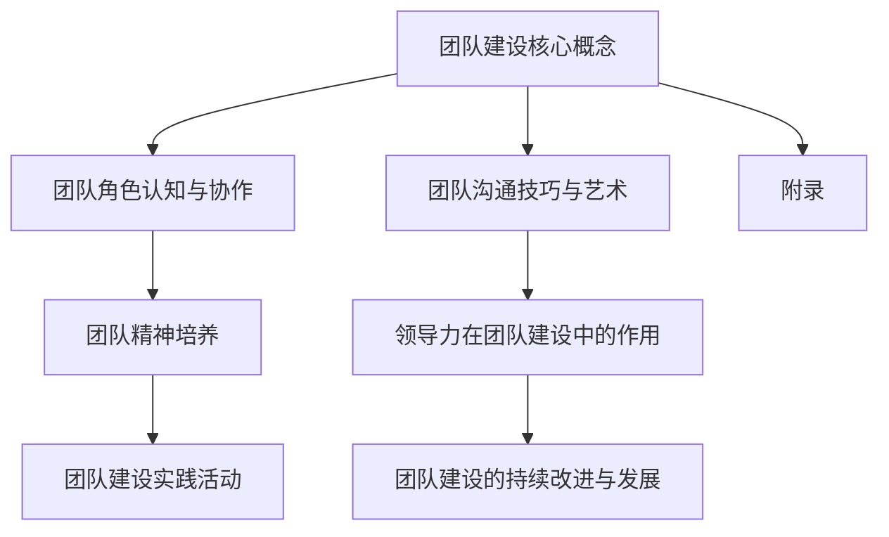

                 

### 团队建设：培养团队精神的实践活动

#### 关键词：
- 团队建设
- 团队精神
- 活动设计
- 领导力
- 沟通技巧

#### 摘要：
本文旨在探讨团队建设的重要性和培养团队精神的方法。通过阐述团队建设的基础概念、团队角色的认知与协作、团队沟通的技巧与艺术，以及领导力在团队建设中的作用，本文提出了一系列培养团队精神的实践活动。文章最后通过案例解析和实践策略，为团队建设提供了实用的参考和持续改进的方向。

## 目录大纲：

### 第一部分：团队建设基础

#### 第1章：团队建设的概念与重要性
1.1 团队的定义与特征
1.2 团队建设的重要性
1.3 团队建设的目标与原则

#### 第2章：团队角色的认知与协作
2.1 团队角色的识别与定位
2.2 团队协作的基本原则
2.3 提升团队协作效率的技巧

#### 第3章：团队沟通的技巧与艺术
3.1 沟通的重要性
3.2 有效沟通的障碍与解决方法
3.3 高效沟通的技巧

### 第二部分：团队精神的培养

#### 第4章：团队精神的内涵与价值观
4.1 团队精神的定义与内涵
4.2 团队价值观的塑造
4.3 团队精神在实践中的应用

#### 第5章：团队建设活动的设计与实施
5.1 团队建设活动的目的与类型
5.2 活动设计的原则与步骤
5.3 团队建设活动的实施与评估

#### 第6章：领导力在团队建设中的作用
6.1 领导力的概念与类型
6.2 领导者如何培养团队精神
6.3 领导力在团队建设中的实践策略

### 第三部分：团队建设的实践活动

#### 第7章：团队建设实践案例解析
7.1 案例一：成功团队建设的实践
7.2 案例二：团队建设中的问题与解决
7.3 案例三：团队建设实践的创新方法

#### 第8章：团队建设的持续改进与发展
8.1 团队建设的反馈机制
8.2 团队建设的改进策略
8.3 团队建设发展的趋势与展望

### 附录

#### 附录A：团队建设参考资料
A.1 团队建设经典书籍推荐
A.2 团队建设相关网站与资源
A.3 团队建设工具与技巧汇总

### Mermaid 流程图

### 第1章：团队建设的概念与重要性

#### 1.1 团队的定义与特征

团队是由两个或多个个体组成的正式组织，他们共同协作以实现一个共同的目标。团队具有以下特征：

- **共同目标**：团队成员为了实现一个共同的目标而共同努力。
- **相互依赖**：每个成员的工作成果对团队的整体目标产生影响。
- **分工合作**：团队成员根据各自的能力和职责进行分工合作。
- **明确角色**：每个团队成员都明确自己的角色和责任。

#### 1.2 团队建设的重要性

团队建设对于组织的成功至关重要。以下是团队建设的重要性：

- **提高工作效率**：通过团队建设，团队成员可以更好地协作，提高工作效率。
- **增强创新能力**：团队中的多样化观点和知识可以激发创新思维，促进团队创新。
- **促进团队成长**：良好的团队建设有助于团队成员的个人成长和职业发展。
- **增强团队凝聚力**：团队建设可以增强团队成员之间的信任和凝聚力，提高团队的整体绩效。

#### 1.3 团队建设的目标与原则

团队建设的目标是建立一个高效、协作、有凝聚力的团队。以下是一些关键目标：

- **建立有效的团队协作机制**：通过明确角色、分工合作和沟通机制，确保团队高效运作。
- **提升团队整体能力**：通过培训和辅导，提高团队成员的专业能力和综合素质。
- **增强团队成员的归属感和凝聚力**：通过团队活动和沟通，增强团队成员对团队的认同感和归属感。

团队建设需要遵循以下原则：

- **尊重个体差异**：每个团队成员都有其独特的个性和能力，团队建设需要尊重并发挥个体差异。
- **明确目标与责任**：团队的目标和每个成员的责任需要明确，以确保团队高效运作。
- **增进有效沟通**：沟通是团队建设的关键，团队需要建立有效的沟通机制和沟通技巧。
- **培养团队精神**：团队精神是团队建设的重要组成部分，需要通过活动和实践来培养。

#### 1.4 团队建设的步骤

团队建设的步骤可以分为以下几个阶段：

1. **明确团队目标**：确定团队的目标和愿景，确保每个成员都清楚团队的方向和目标。
2. **组建团队**：选择合适的团队成员，明确每个成员的角色和责任。
3. **制定团队规则**：建立团队的规章制度，明确团队的行为准则和沟通机制。
4. **开展团队活动**：通过一系列的团队活动，增强团队成员之间的互动和信任。
5. **培训与辅导**：提供必要的培训和辅导，提高团队成员的专业能力和综合素质。
6. **评估与反馈**：定期评估团队的表现，收集反馈，不断改进团队建设。

#### 1.5 团队建设的挑战与解决方案

团队建设过程中可能会面临以下挑战：

- **沟通障碍**：团队成员之间的沟通不畅可能会影响团队协作。
  - **解决方案**：建立有效的沟通机制，鼓励团队成员积极参与沟通，提高沟通技巧。

- **角色冲突**：团队成员的角色和职责不明确可能会导致冲突。
  - **解决方案**：明确团队成员的角色和责任，建立明确的沟通渠道和决策流程。

- **团队凝聚力不足**：团队成员之间的凝聚力不足可能会影响团队绩效。
  - **解决方案**：通过团队活动和沟通，增强团队成员之间的信任和凝聚力。

- **领导力不足**：领导力不足可能会影响团队的发展和建设。
  - **解决方案**：提供领导力培训，提升领导者的领导能力和团队建设能力。

#### 1.6 团队建设的案例分析

以下是一个团队建设的成功案例：

**案例背景**：一家科技公司需要开发一款新软件产品，项目团队由项目经理、开发人员、测试人员和产品经理组成。

**团队建设过程**：
1. **明确团队目标**：确定产品的功能、性能和质量要求，明确团队的目标和愿景。
2. **组建团队**：选择合适的团队成员，明确每个成员的角色和责任，建立团队的沟通渠道。
3. **制定团队规则**：制定团队的规章制度，明确团队的行为准则和沟通机制。
4. **开展团队活动**：通过定期的团队会议和活动，增强团队成员之间的互动和信任。
5. **培训与辅导**：提供必要的培训和辅导，提高团队成员的专业能力和综合素质。
6. **评估与反馈**：定期评估团队的表现，收集反馈，不断改进团队建设。

**结果**：通过有效的团队建设，项目团队在规定的时间内成功开发出了高质量的软件产品，团队凝聚力显著增强，成员之间的沟通和协作得到了有效提升。

### 第2章：团队角色的认知与协作

#### 2.1 团队角色的识别与定位

在团队中，每个成员都扮演着特定的角色，这些角色通常与他们的职责和能力相关。识别和定位团队角色是团队建设的重要步骤，以下是一些常见的团队角色：

- **领导者**：负责团队的整体方向和决策，协调团队成员的工作。
- **执行者**：负责具体任务的执行，确保项目目标的实现。
- **沟通者**：负责团队内外部的沟通，确保信息的畅通。
- **协调者**：负责协调团队成员之间的关系，解决冲突和问题。
- **观察者**：负责观察团队的工作流程和绩效，提供反馈和建议。
- **专家**：在特定领域拥有专业知识和技能，为团队提供技术支持。

识别团队角色的方法包括：
- **问卷调查**：通过问卷调查了解团队成员的自我评估和角色认知。
- **访谈**：与团队成员进行一对一的访谈，了解他们的角色和职责。
- **观察**：通过观察团队成员的工作行为和互动，识别他们的角色。

定位团队角色的步骤包括：
- **明确职责**：根据团队目标和任务，明确每个角色的具体职责。
- **角色匹配**：根据团队成员的能力和兴趣，将他们定位到合适的角色。
- **角色确认**：与团队成员确认他们的角色定位，确保他们清楚自己的职责和期望。

#### 2.2 团队协作的基本原则

团队协作是实现团队目标的关键，以下是一些团队协作的基本原则：

- **相互信任**：信任是团队协作的基础，团队成员需要相互信任，支持彼此。
- **分工合作**：合理分工，各司其职，确保每个成员都能发挥自己的优势。
- **明确目标**：设定明确的团队目标，确保每个成员都清楚自己的任务和目标。
- **有效沟通**：建立有效的沟通机制，确保信息的及时传递和问题解决。
- **积极反馈**：鼓励团队成员之间的积极反馈，促进相互学习和改进。
- **相互尊重**：尊重团队成员的个性和观点，避免歧视和偏见。

#### 2.3 提升团队协作效率的技巧

以下是一些提升团队协作效率的技巧：

- **设定共同目标**：确保团队成员都清楚团队的目标和期望，共同为实现目标而努力。
- **建立沟通渠道**：建立多种沟通渠道，如定期会议、即时通讯工具等，确保信息的畅通。
- **任务分解**：将大任务分解成小任务，明确每个任务的负责人和截止日期，确保任务的顺利执行。
- **协作工具**：使用协作工具，如项目管理软件、文档共享平台等，提高团队协作效率。
- **角色明确**：确保每个团队成员都清楚自己的角色和职责，避免角色重叠和冲突。
- **反馈机制**：建立有效的反馈机制，及时收集和解决团队成员的问题和困难。
- **培训与辅导**：定期提供培训和教育，提高团队成员的专业能力和协作技巧。

#### 2.4 团队角色协作案例分析

以下是一个团队角色协作的成功案例：

**案例背景**：一家初创公司需要开发一款移动应用，项目团队由产品经理、UI设计师、前端开发工程师、后端开发工程师和测试工程师组成。

**团队角色识别与定位**：
- **产品经理**：负责产品的需求分析、规划和设计，确保产品符合市场需求。
- **UI设计师**：负责移动应用的用户界面设计，确保用户体验良好。
- **前端开发工程师**：负责移动应用的前端开发，实现UI设计师的设计。
- **后端开发工程师**：负责移动应用的后端开发，实现数据的存储和处理。
- **测试工程师**：负责对移动应用进行功能测试和性能测试，确保产品的质量。

**团队协作过程**：
1. **明确团队目标**：确保所有团队成员都清楚产品的目标和期望。
2. **建立沟通渠道**：定期召开团队会议，使用即时通讯工具进行日常沟通。
3. **任务分解**：将项目分解成小任务，明确每个任务的负责人和截止日期。
4. **协作工具**：使用项目管理软件和文档共享平台，提高团队协作效率。
5. **角色明确**：确保每个团队成员都清楚自己的角色和职责。
6. **反馈机制**：建立反馈机制，及时解决团队成员的问题和困难。

**结果**：通过有效的团队角色协作，项目团队在规定的时间内成功开发了高质量的移动应用，团队凝聚力显著增强，成员之间的沟通和协作得到了有效提升。

### 第3章：团队沟通的技巧与艺术

#### 3.1 沟通的重要性

沟通是团队协作的核心，有效的沟通可以消除误解、增进理解、提高工作效率。以下是一些沟通的重要性：

- **消除误解**：通过有效的沟通，团队成员可以理解彼此的想法和意图，避免因误解而产生的问题。
- **增进理解**：沟通有助于团队成员之间的相互理解，增强团队凝聚力。
- **提高工作效率**：有效的沟通可以减少信息传递的中间环节，提高工作效率。
- **促进团队合作**：沟通是团队合作的基础，良好的沟通可以促进团队成员之间的协作和合作。
- **增强团队信任**：通过沟通，团队成员可以建立信任和尊重，增强团队的信任度。

#### 3.2 有效沟通的障碍与解决方法

在团队沟通中，可能会遇到一些障碍，以下是一些常见的沟通障碍及其解决方法：

- **文化差异**：团队成员来自不同的文化背景，可能导致沟通障碍。
  - **解决方法**：通过跨文化培训，提高团队成员对文化差异的认识和敏感度，加强文化包容性。

- **信息不全**：团队成员可能无法获得完整的信息，导致沟通不畅。
  - **解决方法**：建立信息共享机制，确保团队成员可以及时获取所需信息。

- **语言障碍**：团队成员使用不同的语言，可能影响沟通效果。
  - **解决方法**：提供语言培训和翻译支持，确保团队成员可以有效地沟通。

- **沟通技巧不足**：团队成员的沟通技巧不足，可能导致沟通不畅。
  - **解决方法**：提供沟通技巧培训，提高团队成员的沟通能力。

- **个人偏见**：个人偏见和情绪可能影响沟通效果。
  - **解决方法**：培养团队成员的情商和自我意识，提高他们的情绪管理能力。

#### 3.3 高效沟通的技巧

以下是一些提高团队沟通效果的有效技巧：

- **倾听**：倾听是有效沟通的关键，确保团队成员可以理解对方的意图和观点。
  - **技巧**：避免打断对方，给予充分的关注，从对方的角度思考问题。

- **表达清晰**：清晰表达自己的想法和观点，避免产生误解。
  - **技巧**：使用简单、明确的语言，避免使用专业术语和模糊的表述。

- **使用非语言沟通**：非语言沟通，如肢体语言、面部表情等，可以增强沟通效果。
  - **技巧**：注意自己的肢体语言和表情，确保与语言表达一致。

- **积极反馈**：提供积极的反馈，鼓励团队成员表达自己的想法和观点。
  - **技巧**：鼓励团队成员提出问题，分享观点，建立开放、坦诚的沟通氛围。

- **使用协作工具**：使用协作工具，如即时通讯、视频会议、项目管理软件等，提高沟通效率。
  - **技巧**：选择合适的协作工具，确保团队成员可以方便地沟通和协作。

#### 3.4 团队沟通案例分析

以下是一个团队沟通的成功案例：

**案例背景**：一家科技公司需要开发一款复杂的项目，项目团队由项目经理、开发人员、测试人员和产品经理组成。

**团队沟通过程**：
1. **建立沟通渠道**：定期召开团队会议，使用即时通讯工具进行日常沟通。
2. **明确沟通目标**：确保所有团队成员都清楚项目的目标和期望。
3. **分享信息**：通过文档共享平台和项目管理软件，及时分享项目进展和重要信息。
4. **倾听与反馈**：鼓励团队成员积极表达自己的观点和意见，提供积极的反馈。
5. **使用协作工具**：使用协作工具，如视频会议和项目管理软件，提高沟通效率。

**结果**：通过有效的团队沟通，项目团队在规定的时间内成功完成了项目，团队凝聚力显著增强，成员之间的沟通和协作得到了有效提升。

### 第4章：团队精神的内涵与价值观

#### 4.1 团队精神的定义与内涵

团队精神是指团队成员在共同目标下，相互支持、相互依赖、共同努力的一种状态。它是一种价值观，体现了一个团队的凝聚力、协作能力和创新精神。团队精神的内涵主要包括以下几个方面：

- **相互支持**：团队成员在面临困难和挑战时，相互提供帮助和支持，共同克服困难。
- **相互依赖**：团队成员意识到每个人的工作成果对团队的整体目标都有影响，相互依赖、相互促进。
- **共同努力**：团队成员为了实现共同的目标，共同努力、共同奋斗，共同承担责任。
- **合作精神**：团队成员之间保持合作的态度，积极协作，共同完成任务。
- **创新精神**：团队鼓励创新思维，鼓励成员提出新的想法和解决方案，推动团队进步。

#### 4.2 团队价值观的塑造

团队价值观是团队精神的体现，是团队内部共同遵守的基本准则。塑造团队价值观需要以下步骤：

1. **明确核心价值观**：团队需要明确自己的核心价值观，如诚信、创新、协作等，确保团队成员都认同。
2. **沟通与共识**：通过沟通和讨论，使团队成员理解并认同团队价值观，形成共识。
3. **践行与培养**：团队成员需要通过日常行为和实践，践行团队价值观，培养团队精神。
4. **领导者的示范**：领导者需要以身作则，带头践行团队价值观，为团队成员树立榜样。
5. **激励与奖励**：通过激励和奖励机制，鼓励团队成员践行团队价值观，培养团队精神。

#### 4.3 团队精神在实践中的应用

团队精神在实践中的应用非常广泛，以下是一些具体的应用场景：

1. **项目管理**：在项目管理中，团队精神有助于团队成员相互支持、共同完成任务。
2. **跨部门协作**：在跨部门协作中，团队精神有助于各部门之间沟通顺畅、协同作战。
3. **危机管理**：在危机管理中，团队精神有助于团队成员共同应对挑战，迅速采取行动。
4. **创新与研发**：在创新与研发中，团队精神有助于激发团队成员的创新能力，共同推动项目进步。
5. **客户服务**：在客户服务中，团队精神有助于提升客户满意度，提高客户服务质量。

#### 4.4 团队精神培养案例

以下是一个团队精神培养的案例：

**案例背景**：一家科技公司需要开发一款新的产品，项目团队由项目经理、开发人员、测试人员和产品经理组成。

**团队精神培养过程**：
1. **建立共同目标**：明确团队的目标和愿景，确保团队成员都清楚团队的方向和目标。
2. **开展团队活动**：定期举办团队活动，如团队建设训练、团队拓展活动等，增强团队成员之间的互动和信任。
3. **沟通与共识**：通过团队会议和讨论，使团队成员理解并认同团队价值观，形成共识。
4. **领导者的示范**：领导者以身作则，带头践行团队价值观，为团队成员树立榜样。
5. **激励与奖励**：通过激励和奖励机制，鼓励团队成员践行团队价值观，培养团队精神。

**结果**：通过有效的团队精神培养，项目团队在规定的时间内成功开发了新的产品，团队凝聚力显著增强，成员之间的沟通和协作得到了有效提升。

### 第5章：团队建设活动的设计与实施

#### 5.1 团队建设活动的目的与类型

团队建设活动的目的是培养团队精神、提高团队协作能力、增强团队成员之间的信任和凝聚力。以下是几种常见的团队建设活动类型：

1. **团队拓展训练**：通过户外拓展活动，增强团队成员之间的信任和协作能力。
2. **团队研讨会**：通过讨论和分享，促进团队成员之间的沟通和理解，培养团队精神。
3. **团队竞赛**：通过团队竞赛，激发团队成员的竞争意识和合作精神。
4. **团队会议**：通过定期召开团队会议，讨论项目进展、解决问题和制定计划。
5. **团队培训**：通过培训，提高团队成员的专业能力和协作技巧。

#### 5.2 活动设计的原则与步骤

设计团队建设活动需要遵循以下原则：

1. **明确目标**：活动设计应明确团队建设的目标，确保活动能够达到预期的效果。
2. **参与性**：活动应具有参与性，鼓励团队成员积极参与，提高活动的效果。
3. **互动性**：活动应具有互动性，促进团队成员之间的沟通和交流。
4. **实用性**：活动应具有实用性，能够帮助团队成员在实际工作中应用所学知识和技能。
5. **灵活性**：活动设计应具有一定的灵活性，可以根据实际情况进行调整和改进。

活动设计的步骤包括：

1. **确定活动目标**：明确团队建设的目标，如增强团队协作、提高沟通技巧等。
2. **选择活动类型**：根据团队建设的目标，选择适合的活动类型，如团队拓展训练、团队研讨会等。
3. **设计活动流程**：制定活动流程，包括活动的时间、地点、参与人员、活动内容等。
4. **准备活动材料**：准备活动所需的材料，如培训资料、拓展训练设备、奖品等。
5. **通知参与人员**：提前通知参与人员，确保他们了解活动的时间、地点和内容。

#### 5.3 团队建设活动的实施与评估

团队建设活动的实施需要按照以下步骤进行：

1. **活动前准备**：确保活动所需的材料和设备准备齐全，提前通知参与人员。
2. **活动实施**：按照活动流程，有序进行活动，确保活动的顺利进行。
3. **活动监控**：在活动过程中，监控活动的进展情况，及时解决可能出现的问题。
4. **活动反馈**：活动结束后，收集参与人员的反馈意见，了解活动效果和改进方向。

团队建设活动的评估包括以下几个方面：

1. **参与度评估**：评估团队成员在活动中的参与程度，如参与人数、发言次数等。
2. **满意度评估**：评估团队成员对活动的满意度，如活动内容的满意度、活动组织的满意度等。
3. **效果评估**：评估活动对团队建设目标实现的程度，如团队协作能力的提高、沟通技巧的提升等。
4. **改进建议**：根据评估结果，提出改进建议，优化团队建设活动的设计和实施。

#### 5.4 团队建设活动案例分析

以下是一个团队建设活动的成功案例：

**案例背景**：一家科技公司需要增强团队协作能力，提高沟通技巧，因此决定组织一次团队拓展训练。

**活动设计**：
- **活动目标**：增强团队协作能力、提高沟通技巧。
- **活动类型**：团队拓展训练。
- **活动流程**：包括团队破冰、协作游戏、高空攀岩、团队晚餐等。

**活动实施**：
1. **活动前准备**：提前预订场地、准备拓展训练设备。
2. **活动实施**：团队破冰活动，通过游戏和互动，让团队成员相互熟悉；协作游戏，通过团队合作完成挑战；高空攀岩，提高团队成员的信任和协作能力；团队晚餐，增进团队成员之间的交流。
3. **活动监控**：活动过程中，观察团队成员的参与情况和互动情况，及时解决可能出现的问题。

**活动反馈**：
1. **参与度评估**：活动参与度高，所有团队成员都积极参与。
2. **满意度评估**：团队成员对活动的满意度高，认为活动对团队协作能力和沟通技巧的提升有很大帮助。
3. **效果评估**：活动后，团队成员的协作能力和沟通技巧得到了明显提高。
4. **改进建议**：建议增加更多互动性活动，提高活动的参与度和效果。

### 第6章：领导力在团队建设中的作用

#### 6.1 领导力的概念与类型

领导力是指领导者通过激励、指导和影响团队成员，实现团队目标的能力。领导力可以分为以下几种类型：

1. **变革型领导力**：通过激发团队成员的潜能，推动团队实现创新和变革。
2. **交易型领导力**：通过奖励和惩罚，激励团队成员实现短期目标。
3. **教练型领导力**：通过指导和辅导，帮助团队成员提升技能和职业发展。
4. **愿景型领导力**：通过塑造团队愿景，激发团队成员为实现愿景而努力。
5. **服务型领导力**：以团队成员的需求为中心，提供支持和帮助，促进团队成长。

#### 6.2 领导者如何培养团队精神

领导者可以通过以下方式培养团队精神：

1. **建立共同目标**：明确团队的目标和愿景，确保团队成员都认同并为之努力。
2. **塑造团队价值观**：明确团队的价值观和行为准则，培养团队成员的归属感和认同感。
3. **促进沟通与协作**：建立有效的沟通机制，鼓励团队成员之间的沟通和协作。
4. **激励团队成员**：通过激励和奖励，激发团队成员的积极性和创造力。
5. **提供支持和指导**：为团队成员提供必要的支持和指导，帮助他们克服困难和挑战。
6. **培养团队合作精神**：通过团队活动和任务分配，培养团队成员的团队合作精神。

#### 6.3 领导力在团队建设中的实践策略

领导者可以采取以下实践策略来促进团队建设：

1. **制定明确的计划**：制定详细的团队建设计划，包括目标、任务、时间表和资源分配。
2. **有效沟通**：建立开放的沟通渠道，鼓励团队成员提出意见和建议。
3. **授权与信任**：给予团队成员适当的权力和信任，鼓励他们发挥自己的潜力。
4. **培养团队文化**：塑造积极向上的团队文化，鼓励团队成员相互尊重、支持和合作。
5. **持续反馈与改进**：定期收集团队成员的反馈，不断改进团队建设方法和策略。
6. **提供培训与发展机会**：为团队成员提供培训和发展机会，提升他们的技能和能力。

#### 6.4 领导力培养案例

以下是一个领导力培养的案例：

**案例背景**：一家科技公司需要提升领导者的领导力，以促进团队建设。

**领导力培养过程**：
1. **领导力培训**：为领导者提供领导力培训，包括变革型领导力、教练型领导力等。
2. **团队建设活动**：组织团队建设活动，如团队拓展训练、团队研讨会等，增强团队成员之间的信任和协作。
3. **辅导与指导**：为领导者提供辅导和指导，帮助他们提升领导力和团队建设能力。
4. **实践与反馈**：鼓励领导者将所学知识和技能应用到实际工作中，通过实践和反馈不断改进。

**结果**：通过有效的领导力培养，领导者的领导力水平得到显著提升，团队凝聚力增强，团队绩效得到明显改善。

### 第7章：团队建设实践案例解析

#### 7.1 案例一：成功团队建设的实践

**案例背景**：一家初创公司需要开发一款创新的产品，项目团队由项目经理、开发人员、设计师和测试人员组成。

**团队建设过程**：
1. **明确目标与愿景**：团队明确了产品的目标和愿景，确保团队成员都清楚团队的方向和目标。
2. **角色识别与定位**：明确了每个团队成员的角色和职责，确保团队成员都能发挥自己的优势。
3. **建立沟通渠道**：建立了多种沟通渠道，如定期会议、即时通讯工具等，确保信息的畅通。
4. **开展团队活动**：定期举办团队活动，如团队建设训练、团队拓展活动等，增强团队成员之间的信任和协作。
5. **提供培训与发展**：为团队成员提供培训和发展机会，提升他们的技能和能力。
6. **持续反馈与改进**：定期收集团队成员的反馈，不断改进团队建设方法和策略。

**结果**：通过有效的团队建设，项目团队在规定的时间内成功开发了创新的产品，团队凝聚力显著增强，成员之间的沟通和协作得到了有效提升。

#### 7.2 案例二：团队建设中的问题与解决

**案例背景**：一家中型公司正在开发一款复杂的软件系统，项目团队由项目经理、开发人员、测试人员和产品经理组成。

**团队建设过程中遇到的问题**：
1. **沟通障碍**：团队成员之间存在沟通障碍，导致信息传递不畅。
2. **角色冲突**：部分团队成员的角色和职责不明确，导致角色冲突和工作延误。
3. **团队凝聚力不足**：团队成员之间的信任和协作不足，导致团队凝聚力不足。

**解决方案**：
1. **沟通障碍**：建立了多种沟通渠道，如定期会议、即时通讯工具等，鼓励团队成员积极沟通。同时，提供沟通技巧培训，提高团队成员的沟通能力。
2. **角色冲突**：明确了每个团队成员的角色和职责，确保团队成员都能明确自己的工作范围和责任。同时，建立了明确的沟通渠道和决策流程，解决角色冲突。
3. **团队凝聚力不足**：通过团队活动和培训，增强团队成员之间的信任和协作。同时，提供激励机制，鼓励团队成员积极参与团队活动。

**结果**：通过有效的团队建设，解决了沟通障碍、角色冲突和团队凝聚力不足的问题，项目团队的工作效率和质量得到了显著提升。

#### 7.3 案例三：团队建设实践的创新方法

**案例背景**：一家高科技公司需要开发一款具有突破性的产品，项目团队由项目经理、开发人员、设计师和产品经理组成。

**团队建设过程**：
1. **跨界合作**：邀请了来自不同领域的专家和学者，与团队成员进行跨界合作，激发创新思维。
2. **敏捷开发**：采用了敏捷开发方法，鼓励团队成员快速迭代、不断改进。
3. **虚拟团队**：利用远程协作工具，组建了一个虚拟团队，实现了全球范围内的协作。
4. **开放共享**：建立了开放共享的文化，鼓励团队成员分享知识和经验，促进团队学习。

**结果**：通过创新团队建设方法，项目团队在规定的时间内成功开发了具有突破性的产品，团队的创新能力和协作效率得到了显著提升。

### 第8章：团队建设的持续改进与发展

#### 8.1 团队建设的反馈机制

团队建设的反馈机制是确保团队持续改进和发展的关键。以下是一些反馈机制的构建方法：

1. **定期评估**：定期对团队的表现进行评估，包括工作效率、沟通效果、团队凝聚力等。
2. **团队成员反馈**：鼓励团队成员提出自己的意见和建议，收集他们的反馈，了解团队建设的效果。
3. **领导反馈**：领导层需要对团队的表现进行反馈，包括肯定成绩、指出不足，并提出改进建议。
4. **外部反馈**：邀请外部专家或顾问对团队进行评估和反馈，提供独立的观点和建议。

#### 8.2 团队建设的改进策略

团队建设的改进策略包括以下几个方面：

1. **优化团队结构**：根据团队的任务和目标，调整团队结构和角色设置，确保团队高效运作。
2. **提升沟通能力**：定期提供沟通技巧培训，提高团队成员的沟通能力，确保信息的畅通。
3. **增强团队凝聚力**：通过团队活动和培训，增强团队成员之间的信任和凝聚力，促进团队合作。
4. **激励与奖励**：建立激励机制，对团队成员的表现进行奖励，激发他们的积极性和创造力。

#### 8.3 团队建设发展的趋势与展望

团队建设的发展趋势包括：

1. **数字化管理**：随着数字化技术的发展，越来越多的团队开始采用数字化管理工具，提高团队协作效率。
2. **个性化培训**：根据团队成员的个性和需求，提供个性化的培训和发展计划，提升他们的能力和素质。
3. **跨界协作**：随着全球化的发展，团队建设越来越注重跨界协作，鼓励团队成员与其他领域的专家合作，促进创新。
4. **持续改进**：团队建设不再是一次性的活动，而是一个持续改进的过程，团队需要不断调整和优化团队建设的方法和策略。

#### 8.4 团队建设未来展望

在未来，团队建设将更加注重以下几个方面：

1. **人工智能应用**：人工智能技术将被广泛应用于团队建设，提高团队协作效率和决策能力。
2. **个性化发展**：团队建设将更加注重团队成员的个性化发展，提供更加精准的培训和发展计划。
3. **全球化协作**：随着全球化的发展，团队建设将更加注重跨文化协作，提高团队的国际竞争力。
4. **可持续发展**：团队建设将更加注重可持续发展，确保团队长期稳定地发展。

### 附录A：团队建设参考资料

#### A.1 团队建设经典书籍推荐

1. 《团队的五项修炼》（作者：帕特里克·莱西昂）
2. 《团队协作力：打造高效协作团队的方法与实践》（作者：李明）
3. 《团队执行力：打造卓越团队的策略与方法》（作者：张萌）

#### A.2 团队建设相关网站与资源

1. 团队建设网（http://www.teambuilding.cn/）
2. 团队培训网（http://www.teamtraining.cn/）
3. 管理之道（http://www.guanlizhidao.com/）

#### A.3 团队建设工具与技巧汇总

1. 项目管理工具：Trello、Asana、JIRA
2. 即时通讯工具：Slack、WhatsApp、Telegram
3. 视频会议工具：Zoom、Microsoft Teams、Google Meet
4. 沟通技巧：积极倾听、有效表达、非语言沟通
5. 团队建设活动：团队拓展训练、团队研讨会、团队竞赛

### 总结与展望

本文通过阐述团队建设的基础概念、团队角色的认知与协作、团队沟通的技巧与艺术、团队精神的培养以及团队建设的实践活动，为团队建设提供了全面的指导。在未来的团队建设中，我们将继续关注团队建设的新趋势和新方法，不断优化团队建设策略，提升团队的整体绩效和竞争力。

作者：AI天才研究院/AI Genius Institute & 禅与计算机程序设计艺术 /Zen And The Art of Computer Programming

