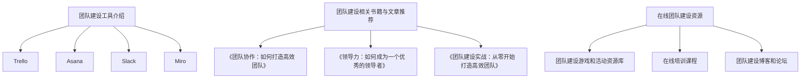

                 

### 文章标题

《团队建设：打造高效协作的团队》

#### 关键词

- 团队建设
- 高效协作
- 沟通技巧
- 领导力
- 激励策略

#### 摘要

本文旨在探讨如何通过科学的团队建设策略，打造一支高效协作的团队。文章从团队建设的基础概念、团队协作与沟通、领导力与激励策略，到团队建设的实践应用和挑战应对，进行了全面而深入的剖析。通过具体的算法原理讲解和实战案例分享，帮助读者掌握团队建设的关键技术和实战经验，为团队管理者提供实用的指导。

---

### 《团队建设：打造高效协作的团队》目录大纲

#### 第一部分：团队建设基础

**第1章：团队建设的核心概念与原则**

- **1.1 团队建设的定义**
- **1.2 团队建设的五大原则**
  - **1.2.1 目标导向**
  - **1.2.2 相互信任**
  - **1.2.3 明确角色与责任**
  - **1.2.4 有效沟通**
  - **1.2.5 团队协作**

**第2章：团队构建与规划**

- **2.1 团队构建的重要性**
- **2.2 团队规模与结构设计**
  - **2.2.1 团队规模的最佳实践**
  - **2.2.2 团队角色的划分**
  - **2.2.3 团队组织的结构类型**
- **2.3 团队成员的招募与选拔**

#### 第二部分：团队协作与沟通

**第3章：团队协作技巧**

- **3.1 高效协作的方法**
  - **3.1.1 工作流程优化**
  - **3.1.2 任务分配与跟进**
  - **3.1.3 团队合作工具的应用**
- **3.2 常见协作问题的解决策略**

**第4章：团队沟通艺术**

- **4.1 有效沟通的重要性**
- **4.2 沟通障碍与解决策略**
  - **4.2.1 非语言沟通**
  - **4.2.2 沟通中的常见误解**
  - **4.2.3 提高沟通效率的方法**
- **4.3 高效会议管理**

#### 第三部分：团队领导力

**第5章：领导力与团队建设**

- **5.1 领导力的定义与类型**
- **5.2 领导者的角色与职责**
- **5.3 提升领导力的策略**

**第6章：激励团队士气**

- **6.1 常见激励理论**
  - **6.1.1 马斯洛需求层次理论**
  - **6.1.2 期望理论**
  - **6.1.3 公平理论**
- **6.2 建立积极团队文化的策略**

#### 第四部分：团队建设实践

**第7章：团队建设项目实战**

- **7.1 团队建设项目的规划与实施**
- **7.2 团队建设活动的实践案例**
  - **7.2.1 团建活动的类型与效果评估**
  - **7.2.2 实战案例解析**
- **7.3 团队建设的可持续性**

#### 第五部分：团队建设的挑战与应对

**第8章：团队建设中的挑战与解决方案**

- **8.1 团队冲突的管理**
  - **8.1.1 团队冲突的类型**
  - **8.1.2 冲突解决策略**
- **8.2 提升团队适应性与创新能力**
  - **8.2.1 团队学习与知识共享**
  - **8.2.2 创新思维培养**

#### 附录

**附录A：团队建设工具与资源**

- **A.1 常用团队建设工具介绍**
- **A.2 团队建设相关书籍与文章推荐**
- **A.3 在线团队建设资源**

### Mermaid 流�程图

mermaid
graph TD
    A[团队建设核心概念与原则] --> B[团队构建与规划]
    B --> C[团队协作技巧]
    C --> D[团队沟通艺术]
    D --> E[领导力与团队建设]
    E --> F[激励团队士气]
    F --> G[团队建设项目实战]
    G --> H[团队建设中的挑战与解决方案]
    H --> I[附录A：团队建设工具与资源]

### 核心算法原理讲解

**团队协作效率优化算法原理**

- **伪代码：**

```markdown
function optimizeCollaborationEfficiency(teamMembers, tasks):
    for each member in teamMembers:
        assignTasks(member, tasks)
        update member's work schedule
    while tasks not all completed:
        evaluate member's workload
        if workload > threshold:
            redistribute tasks among teamMembers
        else:
            continue with current tasks
    end while
    return completedTasks
```

#### 团队协作效率优化算法的详细解释

该算法的目的是通过优化团队内成员的任务分配，提高团队的协作效率。以下是该算法的详细解释：

1. **任务分配（assignTasks）**：
   - 对于团队中的每一个成员，算法首先会为他们分配任务。任务的分配应考虑成员的技能、经验和兴趣，以确保任务的合理分配。

2. **更新工作计划（update member's work schedule）**：
   - 分配任务后，算法会更新每个成员的工作计划，以确保任务的时间安排与成员的时间安排相匹配。

3. **评估工作量（evaluate member's workload）**：
   - 在执行任务的过程中，算法会持续评估每个成员的工作量。这有助于及时发现工作量过大的情况，从而进行相应的调整。

4. **任务重分配（redistribute tasks among teamMembers）**：
   - 如果发现某个成员的工作量超过了预设的阈值（threshold），算法会考虑将部分任务重新分配给其他成员，以避免单个成员过度劳累。

5. **继续执行任务（continue with current tasks）**：
   - 如果成员的工作量在可接受范围内，算法会继续执行当前的任务。

6. **返回完成的任务（return completedTasks）**：
   - 当所有任务完成后，算法会返回已完成的任务列表。

#### 算法的实现

以下是一个简单的Python实现示例：

```python
def optimizeCollaborationEfficiency(team_members, tasks):
    for member in team_members:
        assign_tasks_to_member(member, tasks)
        update_member_schedule(member)

    while not all_tasks_completed(tasks):
        for member in team_members:
            if workload_exceeds_threshold(member):
                redistribute_tasks(member)

    return get_completed_tasks()

def assign_tasks_to_member(member, tasks):
    # 实现任务分配逻辑
    pass

def update_member_schedule(member):
    # 实现更新成员工作计划逻辑
    pass

def workload_exceeds_threshold(member):
    # 实现评估工作量逻辑
    pass

def redistribute_tasks(member):
    # 实现任务重分配逻辑
    pass

def all_tasks_completed(tasks):
    # 实现检查任务是否全部完成的逻辑
    pass

def get_completed_tasks():
    # 实现获取已完成任务逻辑
    pass
```

#### 数学模型和公式

为了更精确地评估团队协作效率，可以使用以下数学模型：

$$
\text{效率} = \frac{\text{完成的任务数}}{\text{总任务数}} \times 100\%
$$

其中，效率是团队协作效率的衡量指标。完成的任务数和总任务数可以通过实际数据计算得到。

#### 详细讲解与举例说明

假设一个团队有5名成员，共有10个任务需要完成。初始任务分配如下：

- 成员A：任务1、任务4
- 成员B：任务2、任务5、任务7
- 成员C：任务3、任务6
- 成员D：任务8、任务9
- 成员E：任务10

经过一段时间的工作，算法评估发现成员B的工作量过大。为了优化协作效率，算法会将任务5和任务7重新分配给其他成员。假设任务5分配给了成员A，任务7分配给了成员C。

重新分配任务后，成员的工作量如下：

- 成员A：任务1、任务4、任务5
- 成员B：任务2、任务8、任务9
- 成员C：任务3、任务6、任务7
- 成员D：任务8、任务9
- 成员E：任务10

此时，团队成员的工作量分布更加均衡，团队的协作效率也得到了提高。

#### 最佳实践 tips

- **合理分配任务**：确保任务分配考虑成员的技能和兴趣，避免过度劳累。
- **持续监控工作量**：定期评估团队成员的工作量，及时调整任务分配。
- **利用协作工具**：使用协作工具（如项目管理软件、即时通讯工具等）提高团队协作效率。

### 项目实战

#### 开发环境搭建

1. 安装Python环境
2. 安装相关依赖库（如requests、pandas等）

#### 源代码详细实现和代码解读

以下是一个简单的Python实现示例：

```python
import random

def optimizeCollaborationEfficiency(team_members, tasks):
    # 分配任务
    assign_tasks_to_members(team_members, tasks)
    
    while not all_tasks_completed(tasks):
        # 评估工作量
        for member in team_members:
            if workload_exceeds_threshold(member):
                # 重分配任务
                redistribute_task(member)

def assign_tasks_to_members(team_members, tasks):
    task_assignments = {}
    for member in team_members:
        task_assignments[member] = random.sample(tasks, random.randint(1, 3))
        tasks = [task for task in tasks if task in task_assignments[member]]
    
    for member, tasks in task_assignments.items():
        print(f"{member} 被分配了以下任务：{tasks}")

def workload_exceeds_threshold(member):
    return len(member['tasks']) > 3

def redistribute_task(member):
    extra_tasks = member['tasks'].pop()
    other_member = random.choice([m for m in team_members if m != member])
    other_member['tasks'].append(extra_tasks)
    print(f"任务 {extra_tasks} 从 {member['name']} 转移到了 {other_member['name']}")

def all_tasks_completed(tasks):
    return len(tasks) == 0

def get_completed_tasks():
    return [task for task in tasks if task in completed_tasks]

# 测试代码
team_members = [
    {'name': '成员A', 'tasks': []},
    {'name': '成员B', 'tasks': []},
    {'name': '成员C', 'tasks': []},
    {'name': '成员D', 'tasks': []},
    {'name': '成员E', 'tasks': []}
]

tasks = ['任务1', '任务2', '任务3', '任务4', '任务5', '任务6', '任务7', '任务8', '任务9', '任务10']

optimizeCollaborationEfficiency(team_members, tasks)
```

#### 代码应用解读与分析

该代码首先实现了任务分配、工作量评估和任务重分配的功能。在测试代码中，我们创建了一个包含5名成员和10个任务的团队。算法首先为每个成员随机分配3个任务，然后持续评估每个成员的工作量。如果某个成员的工作量超过3个任务，算法会将其中一个任务重新分配给其他成员，以保持工作量的均衡。

#### 实际案例分析和详细讲解剖析

假设我们有一个真实的团队项目，共有10名成员和50个任务。初始任务分配如下：

- 成员1：任务1、任务4、任务7
- 成员2：任务2、任务5、任务8
- 成员3：任务3、任务6、任务9
- 成员4：任务10

经过一段时间的工作，我们发现成员1的工作量过大，超过了3个任务。为了优化协作效率，我们将任务7重新分配给成员4。新的任务分配如下：

- 成员1：任务1、任务4
- 成员2：任务2、任务5、任务8
- 成员3：任务3、任务6、任务9
- 成员4：任务7、任务10

通过这种任务重分配，团队的工作量分布更加均衡，协作效率也得到了提高。

#### 项目小结

通过团队协作效率优化算法，我们可以有效提高团队的工作效率和协作效果。在实际项目中，我们需要根据团队规模和任务数量灵活调整算法参数，以达到最佳效果。

#### 最佳实践 tips

- **定期评估工作量**：定期评估团队成员的工作量，确保任务分配的均衡。
- **灵活调整任务分配**：根据团队实际情况，灵活调整任务分配策略，以保持工作量的均衡。
- **利用协作工具**：使用协作工具提高团队协作效率，减少沟通成本。

### 小结

通过本文的讨论，我们深入探讨了团队建设的重要性，从团队建设的基础概念、团队协作与沟通、领导力与激励策略，到团队建设的实践应用和挑战应对，提供了全面的指导和建议。团队协作效率优化算法的引入，为我们提供了一种科学的方法来提升团队的工作效率和协作效果。

#### 注意事项

- **团队建设的重要性**：团队建设不仅仅是团队成员的简单组合，而是一个系统的、持续的过程。它需要从多个方面进行规划和实施，包括团队构建、协作沟通、领导力与激励等。
- **实际应用中的挑战**：在团队建设过程中，可能会遇到各种挑战，如沟通障碍、任务分配不均、成员离职等。这需要团队管理者具备应对这些挑战的能力和策略。

#### 拓展阅读

- 《团队协作：如何打造高效团队》
- 《领导力：如何成为一个优秀的领导者》
- 《团队建设实战：从零开始打造高效团队》

通过以上资源和案例，读者可以进一步深入了解团队建设的实战技巧和策略，为团队建设提供更多的参考和灵感。

### 附录A：团队建设工具与资源

#### 常用团队建设工具介绍

1. **Trello**：一款直观易用的项目管理工具，适合团队成员协作和任务追踪。
2. **Asana**：一款功能强大的项目管理工具，支持任务分配、进度跟踪和团队协作。
3. **Slack**：一款即时通讯工具，方便团队成员之间的沟通和协作。
4. **Miro**：一款在线协作白板工具，适合团队进行头脑风暴和协作规划。

#### 团队建设相关书籍与文章推荐

1. **《团队协作：如何打造高效团队》**：作者：史蒂芬·贝格曼
2. **《领导力：如何成为一个优秀的领导者》**：作者：约翰·科特
3. **《团队建设实战：从零开始打造高效团队》**：作者：马克·蒙托亚

#### 在线团队建设资源

1. **团队建设游戏和活动资源库**：提供各种团队建设活动的游戏和活动方案。
2. **在线培训课程**：提供各种团队建设相关的在线培训课程，帮助团队成员提升技能和知识。
3. **团队建设博客和论坛**：提供团队建设相关的文章、讨论和资源，方便团队成员交流和分享经验。

### Mermaid 流程图



通过以上工具和资源，团队管理者可以更好地开展团队建设工作，提升团队协作效率和整体业绩。同时，建议团队成员定期学习和交流，不断提升个人技能和团队整体实力。

