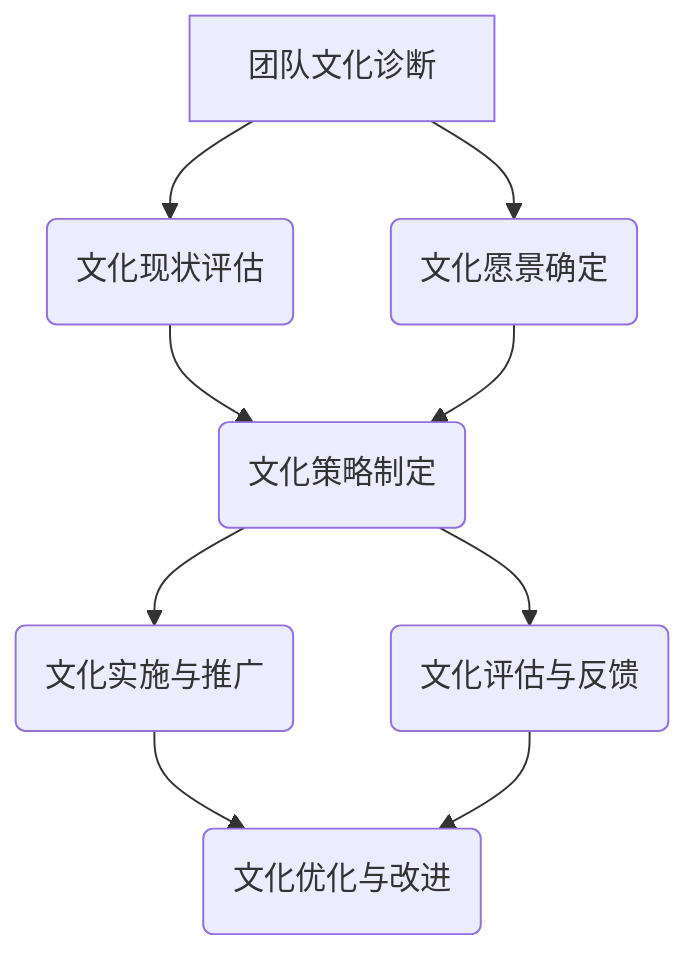

                 


### 文章标题

# 团队文化建设：塑造积极向上的工作环境

### 关键词

- 团队文化
- 组织绩效
- 员工满意度
- 领导力
- 文化变革

### 摘要

本文旨在探讨团队文化建设的理论和实践，分析团队文化的构成要素、重要性及其与组织绩效和员工满意度之间的关系。通过阐述团队文化建设的策略和建立积极工作环境的实践方法，本文进一步提出评估与改进团队文化的具体措施，旨在为企业和组织提供系统性的团队文化建设指导，以塑造积极向上的工作环境，提高组织整体效能。

----------------------------------------------------------------

### 目录大纲

# 团队文化建设：塑造积极向上的工作环境

## 第一部分：团队文化建设的理论基础

### 第1章：团队文化概述

### 第2章：团队文化的理论框架

## 第二部分：团队文化的建设与实践

### 第3章：团队文化建设策略

### 第4章：建立积极向上的工作环境

### 第5章：提升员工参与度和满意度

## 第三部分：团队文化的评估与改进

### 第6章：团队文化的评估方法

### 第7章：团队文化的持续改进

### 第8章：团队文化建设中的常见问题与解决策略

## 附录

### 附录A：团队文化建设工具与资源

### 附录B：团队文化相关术语解释

### 附录C：团队文化建设流程图

### 附录D：参考文献与进一步阅读

### 附录E：团队文化相关研究论文

----------------------------------------------------------------

### 第1章：团队文化概述

## 1.1 团队文化的定义与重要性

### 1.1.1 团队文化的定义

团队文化是一个组织在其长期运营过程中形成的共同价值观、信念、行为规范和传统习惯。它是组织成员在共同工作、互动和合作过程中形成的一种精神共识，是组织内部氛围和员工行为的外在体现。具体来说，团队文化包括以下几个方面：

1. **价值观**：团队共同认同的核心价值观和原则，如创新、诚信、责任等。
2. **目标与愿景**：团队所追求的长期目标和愿景，如成为行业领导者、实现可持续发展等。
3. **行为规范**：团队成员共同遵守的行为准则和规范，如团队合作、尊重他人、追求卓越等。
4. **传统习惯**：团队在长期运营中形成的传统习惯和仪式，如晨会、团队建设活动等。

### 1.1.2 团队文化的重要性

团队文化对组织的成功至关重要，其重要性体现在以下几个方面：

1. **增强凝聚力**：共同的文化价值观和行为规范有助于增强团队成员之间的凝聚力，形成团队精神，提高团队的协作效率和执行力。
2. **提高员工满意度**：积极向上的团队文化能够满足员工的心理需求，提高员工的满意度和忠诚度，从而降低员工流失率。
3. **促进创新**：鼓励创新、尊重差异的团队文化能够激发员工的创造力和创新精神，推动组织持续创新和发展。
4. **提升组织绩效**：团队文化对组织绩效具有显著影响。研究表明，具有积极向上团队文化的组织往往在市场竞争力、客户满意度、员工绩效等方面表现更好。
5. **塑造品牌形象**：团队文化是组织品牌形象的重要组成部分。积极向上的团队文化有助于树立良好的组织形象，提升品牌价值。

## 1.2 团队文化的构成要素

### 1.2.1 价值观

价值观是团队文化的核心和灵魂，是团队成员共同追求和遵循的信念和原则。一个团队的核心价值观决定了团队的行为方式、决策风格和工作习惯。例如，一个以客户为中心的团队可能会强调客户满意度、服务质量和技术创新。

### 1.2.2 目标与愿景

目标与愿景是团队文化的导向和目标。明确的目标和愿景有助于团队聚焦于共同的事业，激发成员的积极性和动力。目标可以分为短期目标和长期目标，愿景则是团队所追求的终极目标。

### 1.2.3 行为规范

行为规范是团队文化的外在体现，是团队成员在工作和生活中应遵循的行为准则。行为规范包括团队合作、沟通方式、工作态度和职业素养等方面。良好的行为规范有助于维护团队的和谐氛围和高效运作。

### 1.2.4 传统习惯

传统习惯是团队文化的一部分，是团队在长期运营中形成的文化符号和仪式。传统习惯可以增强团队成员的归属感和认同感，有助于团队的凝聚力和稳定性。

## 1.3 团队文化与组织绩效的关系

### 1.3.1 研究背景

团队文化对组织绩效的影响一直是管理学和心理学领域的研究热点。大量研究表明，团队文化对组织绩效具有显著影响，但具体的影响机制和作用路径仍存在争议。

### 1.3.2 团队文化与组织绩效的关系模型

本文基于相关文献，构建了团队文化与组织绩效的关系模型。模型包括以下几个核心要素：

1. **团队文化**：包括价值观、目标与愿景、行为规范和传统习惯等。
2. **组织绩效**：包括财务绩效、客户满意度、员工绩效等方面。
3. **中介变量**：包括员工满意度、团队凝聚力、创新氛围等。

模型假设团队文化通过中介变量影响组织绩效，具体路径如图所示：

```
[团队文化]
      |
      | 价值观、目标与愿景、行为规范、传统习惯
      |
[中介变量]-----[组织绩效]
```

### 1.3.3 研究方法与结果

本文采用问卷调查和实证分析的方法，对某大型企业的团队文化、员工满意度、团队凝聚力和组织绩效进行了调查和分析。调查问卷包括团队文化、员工满意度、团队凝聚力等方面的指标，共发放问卷300份，回收有效问卷280份。

通过SPSS统计软件对数据进行描述性统计、相关分析和回归分析，结果表明：

1. **团队文化与组织绩效呈显著正相关**：团队文化的各个要素对组织绩效具有积极影响。
2. **员工满意度在团队文化与组织绩效之间起到部分中介作用**：员工满意度对团队文化和组织绩效的关系具有调节作用。
3. **团队凝聚力在团队文化与组织绩效之间起到部分中介作用**：团队凝聚力对团队文化和组织绩效的关系具有调节作用。

## 1.4 团队文化与员工满意度

### 1.4.1 团队文化与员工满意度的关系

团队文化对员工满意度具有重要影响。积极的团队文化能够满足员工的心理需求，提高员工的满意度和幸福感。研究表明，团队文化中的价值观、目标与愿景、行为规范和传统习惯等要素对员工满意度具有显著影响。

### 1.4.2 影响员工满意度的因素

1. **价值观与认同感**：团队成员对团队价值观的认同感越高，对团队的满意度和归属感越强。
2. **目标与愿景**：明确的目标和愿景能够激发员工的积极性和参与度，提高员工对团队的满意度。
3. **行为规范与职业发展**：良好的行为规范为员工提供清晰的行为指南，有助于员工在职业发展中找到方向和动力。
4. **传统习惯与团队氛围**：传统习惯有助于建立良好的团队氛围，增强员工的归属感和认同感。

### 1.4.3 提升员工满意度的策略

1. **强化价值观教育**：通过培训和宣传，强化团队成员对团队价值观的认同和理解。
2. **明确目标与愿景**：制定明确的目标和愿景，让员工了解团队的发展方向和目标，激发员工的积极性和参与度。
3. **完善行为规范**：制定科学合理的行为规范，为员工提供清晰的行为指南，促进团队成员之间的良好沟通和协作。
4. **丰富传统习惯**：举办多样化的团队建设活动，增进团队成员之间的互动和了解，建立良好的团队氛围。

### 第2章：团队文化的理论框架

## 2.1 文化类型与团队绩效

### 2.1.1 文化类型

团队文化可以分为以下几种类型：

1. **竞争型文化**：强调竞争和绩效，鼓励团队成员追求卓越和胜利。
2. **合作型文化**：强调团队合作和协作，鼓励团队成员相互支持和合作。
3. **权力型文化**：强调权力和控制，团队成员之间的地位和权力差距较大。
4. **创新型文化**：强调创新和实验，鼓励团队成员尝试新方法和思路。

### 2.1.2 团队绩效的影响

不同类型的团队文化对团队绩效具有不同的影响：

1. **竞争型文化**：有助于提高团队绩效，但可能导致团队成员之间的紧张关系和竞争压力。
2. **合作型文化**：有助于增强团队凝聚力和协作效率，但可能降低团队的创新能力和竞争力。
3. **权力型文化**：可能导致团队成员之间的不平等和冲突，影响团队绩效。
4. **创新型文化**：有助于激发团队成员的创造力和创新能力，提高团队绩效。

### 2.2 文化变革与团队发展

### 2.2.1 文化变革的必要性

随着外部环境和内部条件的不断变化，团队文化也需要进行相应的变革和调整。文化变革的必要性体现在以下几个方面：

1. **适应外部环境**：外部环境的变化，如市场竞争、技术进步等，要求团队不断调整和变革其文化，以适应新的环境。
2. **提升组织效能**：通过文化变革，可以优化团队结构、提升团队效能，从而提高组织整体竞争力。
3. **满足员工需求**：员工的需求和期望也在不断变化，文化变革有助于满足员工的多元化需求，提高员工满意度和忠诚度。

### 2.2.2 文化变革的挑战与机遇

文化变革面临以下挑战：

1. **习惯性思维**：团队成员对现有文化的认同和习惯，可能导致他们对文化变革的抵触。
2. **领导力缺失**：领导者在文化变革中的角色和作用至关重要，缺乏有效的领导力可能导致文化变革的失败。
3. **资源限制**：文化变革需要投入大量的人力、物力和财力，资源限制可能影响文化变革的顺利进行。

文化变革也带来以下机遇：

1. **激发创新**：文化变革有助于激发团队成员的创造力和创新精神，推动组织持续创新和发展。
2. **提升团队凝聚力**：通过文化变革，可以建立更加紧密的团队关系，提升团队凝聚力和协作效率。
3. **增强竞争力**：文化变革有助于提升组织的核心竞争力和市场地位，从而实现可持续发展。

### 2.3 文化多样性：挑战与机遇

### 2.3.1 文化多样性的概念

文化多样性是指团队成员来自不同的文化背景、价值观和行为习惯。文化多样性对团队文化和组织绩效具有双重影响。

### 2.3.2 文化多样性的挑战

1. **沟通障碍**：文化差异可能导致团队成员之间的沟通障碍，影响团队协作和决策效率。
2. **价值观冲突**：不同的文化价值观可能导致团队成员之间的冲突和矛盾，影响团队稳定和和谐。
3. **决策困难**：文化多样性可能增加团队决策的复杂性，影响决策的速度和准确性。

### 2.3.3 文化多样性的机遇

1. **多元化创新**：文化多样性有助于激发团队成员的创造力和创新思维，推动组织多元化创新。
2. **适应外部环境**：文化多样性有助于团队更好地适应不同市场和文化的变化，提高组织的全球竞争力。
3. **提升团队绩效**：文化多样性能够激发团队成员的积极性和参与度，提高团队的整体绩效。

### 2.4 团队文化与领导力

### 2.4.1 领导力在团队文化中的作用

领导力在团队文化建设中起着关键作用。领导者通过价值观传递、目标设定、行为规范引导等方面，影响团队文化的形成和发展。

### 2.4.2 领导风格的差异与团队文化

不同的领导风格对团队文化具有不同的影响：

1. **权威型领导**：强调权威和控制，可能导致权力型文化的形成。
2. **民主型领导**：鼓励团队成员参与决策，有助于形成合作型文化。
3. **变革型领导**：通过激发团队成员的创造力和创新精神，有助于形成创新型文化。

### 2.4.3 领导者的文化变革角色

领导者在文化变革中扮演着重要角色：

1. **引导变革**：领导者通过宣传、教育和激励，引导团队成员接受和适应新的文化。
2. **推动变革**：领导者通过制定变革计划、提供资源支持等方式，推动文化变革的顺利进行。
3. **监督变革**：领导者通过监督和评估，确保文化变革的有效实施和持续改进。

### 第3章：团队文化建设策略

## 3.1 文化诊断与评估

### 3.1.1 评估工具与方法

文化诊断与评估是团队文化建设的首要步骤，通过评估可以了解现有团队文化的状况，为后续的改进提供依据。以下介绍几种常用的评估工具与方法：

1. **问卷调查**：通过设计针对性强的问卷，收集团队成员对团队文化的看法和评价，如文化价值观、团队氛围、员工满意度等。

2. **访谈法**：通过与团队成员进行深度访谈，了解他们对团队文化的真实感受和看法，获取更深入的信息。

3. **文化分析工具**：如文化维度模型（Cultural Web）、文化地图等，用于分析团队文化的各个方面。

4. **员工满意度调查**：通过定期进行员工满意度调查，了解员工对团队文化的满意度和建议，为文化改进提供参考。

### 3.1.2 文化诊断案例

以下是一个企业进行团队文化诊断的案例：

某大型企业为了了解团队文化的现状，决定进行文化诊断。首先，他们设计了包含文化价值观、团队氛围、员工满意度等方面的问卷调查，共发放了300份问卷，回收有效问卷280份。接着，他们进行了深度访谈，与30名员工进行了面对面交流，了解他们对团队文化的真实看法。此外，他们还使用了文化维度模型对团队文化进行了分析。

通过问卷调查和访谈，企业发现以下问题：

1. **价值观认同度不高**：大部分员工对团队核心价值观的认同度较低，对企业的使命和愿景缺乏理解。

2. **团队氛围不佳**：员工对团队的凝聚力、协作效率和沟通效果表示不满。

3. **员工满意度较低**：员工对工作环境、薪酬福利、职业发展等方面的满意度较低。

针对以上问题，企业决定采取以下措施：

1. **加强价值观教育**：通过培训、宣传等方式，强化员工对核心价值观的认同和理解。

2. **优化团队氛围**：通过团队建设活动、沟通渠道优化等措施，提升团队的凝聚力和协作效率。

3. **提升员工满意度**：通过改进工作环境、调整薪酬福利政策、提供职业发展机会等，提高员工的满意度和忠诚度。

### 3.2 文化重塑与规划

#### 3.2.1 确立文化愿景

文化重塑的第一步是确立文化愿景。文化愿景是团队未来想要达到的文化状态，是团队文化建设的指南针。确立文化愿景需要考虑以下因素：

1. **组织战略**：与企业的战略目标和业务发展相一致。

2. **员工需求**：充分考虑员工的心理需求和价值观念。

3. **行业特点**：结合行业发展趋势和行业特点。

4. **社会责任**：考虑企业对社会的责任和影响。

例如，某科技企业确定的文化愿景是：“成为业界领先的科技创新企业，为客户提供卓越的解决方案，员工充满激情和创造力，共同追求卓越。”

#### 3.2.2 制定文化策略

在确立文化愿景后，需要制定具体的实施策略。制定文化策略需要考虑以下方面：

1. **价值观传播**：通过培训、宣传、内部沟通等方式，将核心价值观传播到每个员工。

2. **行为规范**：制定明确的行为规范，确保员工在工作和生活中遵循团队文化。

3. **激励机制**：建立与团队文化相一致的激励机制，鼓励员工积极践行文化价值观。

4. **团队建设**：通过团队活动、合作项目等方式，加强团队凝聚力和协作效率。

5. **文化建设评估**：定期对文化建设效果进行评估，根据反馈进行调整和优化。

#### 3.2.3 实施计划

在制定文化策略后，需要制定详细的实施计划，确保文化重塑工作的有序进行。实施计划应包括以下内容：

1. **时间安排**：明确文化重塑工作的时间节点和关键里程碑。

2. **责任分配**：明确各部门和员工在文化重塑工作中的职责和任务。

3. **资源保障**：确保文化重塑工作所需的资源和人力。

4. **监督与反馈**：建立监督机制，对文化重塑工作进行跟踪和评估，及时调整和优化。

### 3.3 文化传播与推广

#### 3.3.1 内部沟通渠道

内部沟通渠道是文化传播与推广的重要途径。以下是一些有效的内部沟通渠道：

1. **内部会议**：通过定期召开内部会议，分享团队文化的理念和实践，加强员工对文化价值观的理解。

2. **内部邮件**：利用内部邮件系统，发布文化宣传材料，传达企业文化理念。

3. **内部刊物**：编辑发行内部刊物，介绍团队文化建设的进展和成果，激发员工的文化认同感。

4. **企业网站**：在企业网站上设立文化专栏，发布文化相关内容，方便员工随时了解和参与。

#### 3.3.2 外部形象塑造

外部形象塑造是团队文化的重要组成部分。以下是一些外部形象塑造的方法：

1. **公共关系活动**：通过参加行业活动、赞助公益活动等方式，提升企业在公众中的形象。

2. **媒体报道**：积极与媒体合作，通过媒体报道传播企业文化，提高品牌知名度。

3. **客户关系管理**：通过优质的服务和客户关怀，树立良好的客户关系，提升企业文化形象。

4. **员工口碑**：鼓励员工在外部社交场合积极传播企业文化，形成良好的口碑效应。

### 第4章：建立积极向上的工作环境

#### 4.1 工作环境的优化

建立积极向上的工作环境是团队文化建设的核心任务之一。以下是一些优化工作环境的方法：

##### 4.1.1 物理环境的影响

物理环境对员工的工作态度和效率具有重要影响。以下是一些优化物理环境的方法：

1. **空间布局**：合理规划工作空间，确保工作区宽敞明亮，减少噪音干扰。

2. **办公设备**：提供舒适的工作设备，如办公桌椅、电脑、网络等，提高工作效率。

3. **装饰风格**：运用合适的装饰风格，营造舒适的工作氛围，如色彩搭配、绿化植物等。

4. **休息区**：设立休息区，提供休闲娱乐设施，让员工在工作之余得到放松。

##### 4.1.2 软件工具的支持

除了物理环境的优化，软件工具的支持也是建立积极向上工作环境的重要方面。以下是一些常用的软件工具：

1. **项目管理工具**：如Trello、JIRA等，帮助团队高效协同工作。

2. **沟通工具**：如Slack、Microsoft Teams等，提供即时通讯和协作功能，提高团队沟通效率。

3. **文档管理工具**：如Google Drive、OneDrive等，方便团队共享和协作文档。

4. **时间管理工具**：如Toggl、RescueTime等，帮助员工合理规划工作时间，提高工作效率。

#### 4.2 激励机制的设立

激励机制是激发员工积极性和创造力的重要手段。以下是一些激励机制的方法：

##### 4.2.1 内部激励机制

内部激励机制主要包括以下几个方面：

1. **绩效奖金**：根据员工的绩效表现，发放相应的奖金，激励员工努力工作。

2. **晋升机会**：提供公平透明的晋升机制，激励员工不断提升自身能力。

3. **表彰奖励**：定期举办表彰大会，对优秀员工进行表彰和奖励，增强员工的荣誉感和归属感。

4. **培训发展**：为员工提供丰富的培训机会，支持员工职业发展，提高员工的工作满意度和忠诚度。

##### 4.2.2 外部激励来源

外部激励来源主要包括以下几个方面：

1. **行业认可**：通过参加行业比赛、获得行业奖项等方式，提升企业的行业地位，增强员工的荣誉感和自豪感。

2. **客户认可**：客户的认可和满意是员工努力工作的最大动力，通过客户反馈和评价，激励员工不断提升服务质量。

3. **社会认可**：企业承担社会责任，积极参与公益活动，提升企业的社会形象，同时增强员工的社会责任感。

#### 4.3 团队氛围的建设

团队氛围是团队文化的重要组成部分，对员工的工作态度和行为具有深远影响。以下是一些建设积极团队氛围的方法：

##### 4.3.1 团队活动策划

团队活动是加强团队凝聚力、促进团队协作的重要手段。以下是一些团队活动策划的方法：

1. **团队建设活动**：如拓展训练、团队聚餐等，增强团队成员之间的信任和合作。

2. **知识分享会**：定期举办知识分享会，让团队成员互相学习，提升团队整体能力。

3. **团队旅行**：组织团队旅行，让团队成员在轻松的环境中放松身心，增进了解和信任。

##### 4.3.2 团队信任与协作

建立团队信任和协作是团队氛围建设的关键。以下是一些促进团队信任和协作的方法：

1. **沟通与反馈**：鼓励团队成员进行开放和坦诚的沟通，及时分享信息，建立信任基础。

2. **共同目标**：明确团队目标，让团队成员明确自己的职责和使命，增强协作动力。

3. **相互支持**：鼓励团队成员在工作和生活中相互支持，共同面对困难和挑战。

4. **激励机制**：建立与团队协作相关的激励机制，如团队奖金、荣誉等，激励团队成员积极参与团队协作。

### 第5章：提升员工参与度和满意度

#### 5.1 员工参与机制

提升员工参与度是团队文化建设的重要任务，有助于增强员工对团队的认同感和归属感。以下是一些员工参与机制的方法：

##### 5.1.1 意见反馈渠道

建立畅通的意见反馈渠道，让员工能够及时表达自己的意见和建议。以下是一些意见反馈渠道的方法：

1. **员工意见箱**：设立实体或虚拟的意见箱，方便员工匿名提交意见和建议。

2. **定期座谈会**：定期召开员工座谈会，听取员工的意见和建议，及时反馈处理结果。

3. **内部邮件**：通过内部邮件系统，建立意见反馈专栏，方便员工随时提交意见和建议。

4. **在线调查**：通过在线调查工具，定期开展员工满意度调查，了解员工的需求和意见。

##### 5.1.2 员工代表大会

员工代表大会是提升员工参与度的重要机制。以下是一些员工代表大会的方法：

1. **定期召开**：定期召开员工代表大会，让员工参与企业的决策和事务。

2. **代表选举**：通过民主选举方式，选出员工代表，代表员工参与企业的决策和管理。

3. **议题征集**：鼓励员工提前征集议题，将员工关心的问题纳入会议议题。

4. **反馈机制**：会议结束后，及时向员工反馈会议决议和执行情况，确保员工的意见得到充分回应。

#### 5.2 员工满意度调查与改进

员工满意度是衡量团队文化建设效果的重要指标。以下是一些员工满意度调查与改进的方法：

##### 5.2.1 满意度调查方法

进行员工满意度调查是了解员工需求、提升员工满意度的关键步骤。以下是一些满意度调查的方法：

1. **问卷调查**：设计针对性的满意度问卷，通过匿名调查的方式，收集员工的意见和建议。

2. **访谈法**：通过与员工进行一对一访谈，深入了解员工的工作感受和需求。

3. **焦点小组**：组织员工焦点小组，让员工在轻松的氛围中分享意见和建议。

4. **数据分析**：对满意度调查结果进行统计分析，识别存在的问题和改进方向。

##### 5.2.2 改进措施

根据满意度调查结果，制定具体的改进措施，提升员工的满意度和幸福感。以下是一些改进措施：

1. **改善工作环境**：优化工作空间，提供舒适的工作环境，提升员工的工作体验。

2. **加强培训与发展**：提供丰富的培训机会，支持员工职业发展，提升员工的技能和素质。

3. **优化薪酬福利**：调整薪酬结构，完善福利制度，提高员工的经济收入和生活质量。

4. **关注员工心理健康**：建立员工心理辅导机制，关注员工心理健康，提供心理支持和帮助。

5. **提升团队凝聚力**：通过团队建设活动、员工福利等措施，增强团队凝聚力和协作效率。

### 第6章：团队文化的评估方法

#### 6.1 评估指标体系

团队文化的评估指标体系是衡量团队文化建设效果的重要工具。以下是一些常见的评估指标：

1. **员工满意度**：通过问卷调查和访谈等方式，了解员工对团队文化的满意度和认同感。

2. **团队凝聚力**：通过团队协作项目、团队建设活动等，评估团队的凝聚力和协作效率。

3. **员工忠诚度**：通过员工离职率、员工在职时间等指标，评估员工对团队的忠诚度。

4. **创新氛围**：通过员工创新成果、创新项目数量等指标，评估团队的创新氛围。

5. **组织绩效**：通过企业的财务绩效、客户满意度、市场占有率等指标，评估团队文化对组织绩效的影响。

#### 6.2 评估工具与技术

在团队文化评估过程中，选择合适的评估工具和技术至关重要。以下是一些常用的评估工具和技术：

1. **问卷调查**：通过设计针对性的问卷，收集员工对团队文化的看法和评价。

2. **访谈法**：通过与员工进行深度访谈，了解他们对团队文化的真实感受和看法。

3. **行为观察**：通过观察员工在工作中的行为表现，评估团队文化的实际影响。

4. **统计分析**：通过统计分析方法，对评估数据进行处理和分析，识别团队文化的优劣势。

5. **文化地图**：通过绘制团队文化地图，直观展示团队文化的各个方面。

#### 6.3 评估结果的解读与应用

评估结果对团队文化建设具有重要的指导意义。以下是如何解读和应用评估结果的方法：

1. **识别问题**：通过分析评估结果，识别团队文化中存在的问题和不足。

2. **确定优先级**：根据评估结果，确定需要优先解决的问题，制定改进计划。

3. **制定改进措施**：根据问题分析和优先级，制定具体的改进措施，如加强价值观教育、优化团队氛围等。

4. **跟踪改进效果**：对改进措施的实施情况进行跟踪和评估，确保改进效果的持续性和稳定性。

5. **持续改进**：团队文化建设是一个持续的过程，需要根据实际情况不断调整和优化。

### 第7章：团队文化的持续改进

#### 7.1 改进策略与措施

团队文化的持续改进是团队文化建设的重要环节。以下是一些改进策略与措施：

##### 7.1.1 主动识别问题

通过定期评估、员工反馈等方式，主动识别团队文化中存在的问题，及时发现问题并采取相应措施。

##### 7.1.2 优化团队氛围

持续优化团队氛围，营造积极向上的工作环境，如改善工作条件、增加团队建设活动等。

##### 7.1.3 强化价值观教育

通过培训、宣传等方式，强化员工对团队核心价值观的认同和理解，提高员工的价值观素养。

##### 7.1.4 建立反馈机制

建立畅通的反馈机制，鼓励员工积极参与团队文化建设，及时反馈意见和建议。

##### 7.1.5 调整激励机制

根据团队文化和员工需求，调整激励机制，确保激励机制与团队文化相一致。

#### 7.2 文化的动态调整

团队文化的动态调整是应对外部环境和内部变化的重要手段。以下是一些动态调整的方法：

##### 7.2.1 应对环境变化

根据外部环境和内部条件的变化，及时调整团队文化，以适应新的形势。

##### 7.2.2 文化的适应性变革

在适应环境变化的过程中，推动团队文化的适应性变革，增强团队的灵活性和适应性。

##### 7.2.3 保持文化连续性

在调整团队文化时，保持文化连续性，确保团队文化的核心价值和基本原则不变。

#### 7.3 改进案例与经验分享

以下是一些团队文化改进的案例和经验分享：

##### 案例一：某科技公司的文化变革

某科技公司通过引入新的价值观、优化团队氛围、建立反馈机制等措施，成功实现了团队文化的变革。在变革过程中，公司注重员工参与，鼓励员工提出意见和建议，通过全员参与的方式，推动文化变革的顺利进行。

##### 案例二：某金融机构的团队氛围优化

某金融机构通过改善工作环境、增加团队建设活动、建立员工关怀机制等方式，优化了团队氛围，提升了员工满意度和团队凝聚力。公司还定期举办员工满意度调查，根据反馈结果进行调整和改进，持续提升团队氛围。

##### 经验分享

1. **领导者角色**：领导者在团队文化建设中扮演关键角色，需要发挥引领和推动作用。

2. **全员参与**：团队文化建设需要全员参与，激发员工的积极性和创造力。

3. **持续改进**：团队文化建设是一个持续的过程，需要不断调整和优化，以适应变化。

4. **关注员工需求**：关注员工的需求和期望，确保团队文化建设符合员工的实际需求。

### 第8章：团队文化建设中的常见问题与解决策略

#### 8.1 文化冲突的应对

文化冲突是团队文化建设过程中常见的问题，以下是一些应对策略：

##### 8.1.1 冲突原因分析

文化冲突的原因主要包括：

1. **价值观差异**：团队成员的价值观不同，导致行为和决策上的冲突。

2. **沟通障碍**：沟通不畅，导致误解和冲突。

3. **权力斗争**：团队内部的权力分配不均，导致冲突。

##### 8.1.2 冲突解决策略

解决文化冲突的策略包括：

1. **沟通与理解**：通过沟通和交流，增进团队成员之间的理解，化解冲突。

2. **协商与妥协**：在冲突中，鼓励团队成员进行协商和妥协，找到共同点。

3. **建立共识**：通过共同目标和价值观的建立，形成团队共识，减少冲突。

#### 8.2 文化传承与创新

团队文化需要在传承和创新之间找到平衡。以下是一些策略：

##### 8.2.1 文化的历史传承

1. **文化档案**：建立文化档案，记录团队的历史和文化传承。

2. **故事传播**：通过讲述团队故事，传承团队文化。

3. **老员工传承**：鼓励老员工向新员工传授团队文化，加强文化传承。

##### 8.2.2 文化的创新实践

1. **创新激励**：建立创新激励机制，鼓励员工提出创新想法。

2. **开放文化**：营造开放的文化氛围，鼓励员工尝试新事物。

3. **跨界合作**：与其他团队或组织进行跨界合作，引入外部创新元素。

#### 8.3 文化传承与创新的平衡

文化传承与创新之间的平衡是实现团队持续发展的关键。以下是一些平衡策略：

1. **文化价值观的坚守**：在传承和创新过程中，坚守团队的核心价值观。

2. **动态调整**：根据外部环境和内部条件的变化，动态调整团队文化。

3. **员工参与**：鼓励员工参与文化传承与创新的讨论和决策，增强员工的归属感和参与感。

4. **评估与反馈**：定期评估文化传承与创新的效果，根据反馈进行调整和优化。

### 附录

#### 附录A：团队文化建设工具与资源

- **A.1 常用评估工具**

  - **问卷调查工具**：如SurveyMonkey、Google Forms等。

  - **访谈法工具**：如Zoom、Skype等。

  - **文化分析工具**：如Cultural Web、Cultural Map等。

- **A.2 文化建设案例集锦**

  - **案例一**：某科技公司的团队文化建设案例。

  - **案例二**：某金融机构的团队文化建设案例。

- **A.3 相关法规与政策**

  - **国家相关法规**：如《中华人民共和国劳动法》等。

  - **企业相关政策**：如《企业文化手册》等。

#### 附录B：团队文化相关术语解释

- **B.1 团队文化**

  - 团队文化是一个组织在其长期运营过程中形成的共同价值观、信念、行为规范和传统习惯。

- **B.2 文化价值观**

  - 文化价值观是团队文化的核心，是团队成员共同追求和遵循的信念和原则。

- **B.3 文化传承**

  - 文化传承是指将团队文化的历史和经验传递给下一代，确保团队文化的延续和发展。

#### 附录C：团队文化建设流程图

- **C.1 团队文化建设流程图**

  ```
  [初始阶段]
      |
      | 评估现状
      |
      | 确立愿景
      |
      | 制定策略
      |
      | 实施措施
      |
      | 评估效果
      |
  [持续改进]
  ```

#### 附录D：参考文献与进一步阅读

- **D.1 参考文献列表**

  - 【1】约翰·P·科特，詹姆斯·L·赫斯克特.《企业文化与经营业绩》[M]. 中国人民大学出版社，2006.

  - 【2】彼得·德鲁克.《管理实践》[M]. 中国社会科学出版社，2006.

  - 【3】斯蒂芬·罗宾斯.《组织行为学》[M]. 中国人民大学出版社，2008.

- **D.2 进一步阅读**

  - 【1】团队文化建设的最佳实践案例研究。

  - 【2】团队文化建设与组织绩效的关系研究。

  - 【3】文化多样性在团队文化建设中的应用研究。 

#### 附录E：团队文化相关研究论文

- **E.1 研究论文摘要**

  - 【1】标题：《团队文化对员工创新行为的影响研究》

    摘要：本文通过对某科技公司的调查，分析了团队文化对员工创新行为的影响。研究发现，积极向上的团队文化能够显著促进员工的创新行为，提高团队的创新能力。

  - 【2】标题：《企业文化与员工满意度的关系研究》

    摘要：本文通过问卷调查和实证分析，探讨了企业文化与员工满意度之间的关系。研究表明，企业文化对员工满意度具有显著影响，企业应注重文化价值观的传播和践行，以提高员工满意度。 

### Mermaid 流程图示例



### 伪代码示例

```python
# 假设有一个函数用于计算团队文化的评分
def calculate_culture_score(employees, culture_metrics):
    score = 0
    for metric in culture_metrics:
        score += metric['value'] * metric['weight']
    return score / len(employees)
```

### 数学模型与公式示例

$$
\text{文化评分} = \frac{\sum_{i=1}^{n} (m_i \cdot w_i)}{\sum_{i=1}^{n} w_i}
$$

其中，$m_i$表示第$i$个文化指标的得分，$w_i$表示第$i$个文化指标的权重。$n$为文化指标的总数。

