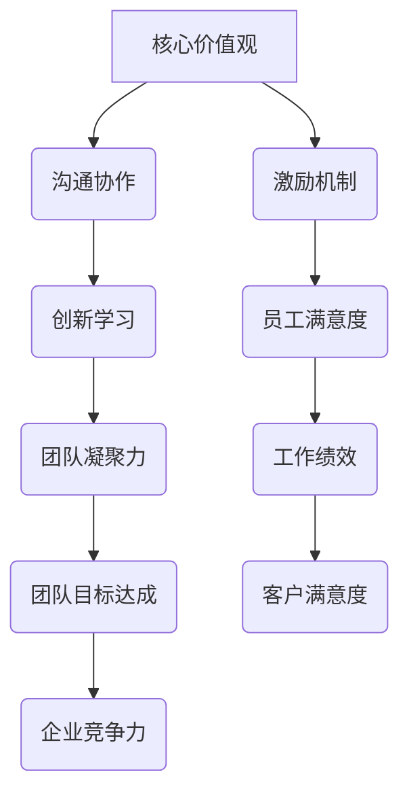

                 

### 《团队文化建设：塑造积极向上的氛围》

> 关键词：团队文化、积极氛围、文化建设、团队合作、管理实践

> 摘要：本文旨在探讨团队文化建设的核心概念、关键要素和实践策略，通过案例分析、算法原理讲解和数学模型构建，深入剖析如何塑造积极向上的团队氛围，提高团队协作效率和创新能力。

#### 目录

1. **团队文化建设概述**
   1.1 团队文化的概念与内涵
   1.2 团队文化建设的重要性
   1.3 团队文化建设的关键要素

2. **团队文化建设的基本原则**
   2.1 共同价值观的塑造
   2.2 有效沟通与协作
   2.3 鼓励创新与学习

3. **团队文化的实践策略**
   3.1 构建积极向上的团队氛围
   3.2 激励团队的积极性
   3.3 增强团队凝聚力

4. **团队文化建设的实施步骤**
   4.1 明确团队文化建设的目标
   4.2 制定具体的实施计划
   4.3 持续跟踪与评估

5. **团队文化建设中的挑战与解决**
   5.1 团队文化建设的难点
   5.2 解决团队文化建设中的问题
   5.3 团队文化建设中的变革管理

6. **团队文化建设的成功案例**
   6.1 国外团队文化建设的经典案例
   6.2 国内团队文化建设的成功经验
   6.3 团队文化建设案例分析

7. **团队文化建设的未来趋势**
   7.1 未来团队文化的发展方向
   7.2 新技术对团队文化建设的影响
   7.3 团队文化建设的前景展望

8. **附录**
   8.1 团队文化建设工具与方法
   8.2 团队文化建设参考资料

#### 第1章：团队文化建设概述

在当今快速变化和竞争激烈的市场环境中，团队文化建设成为企业成功的关键因素之一。一个拥有积极向上团队文化的企业，能够更好地适应外部环境的变化，提高员工的凝聚力和工作效率，从而在市场竞争中脱颖而出。

##### 1.1 团队文化的概念与内涵

团队文化是指团队成员共同遵循的行为准则、价值观和信念，它通过企业的各种制度和实践传递和表达出来。团队文化不仅包括显性的文化元素，如标识、口号和仪式，还涵盖了隐性的文化元素，如团队精神、信任和尊重。

团队文化的核心是核心价值观，它是团队成员共同认同并追求的目标。核心价值观包括诚信、责任、创新、协作和客户导向等，它们是企业长期发展的基石。

##### 1.2 团队文化建设的重要性

团队文化建设对企业的影响主要体现在以下几个方面：

1. **提高员工满意度**：一个拥有积极向上团队文化的企业，能够提供良好的工作环境和职业发展机会，从而提高员工的满意度和忠诚度。
2. **提升工作效率**：团队文化能够促进团队成员之间的有效沟通和协作，减少内部摩擦和误解，提高工作效率。
3. **增强创新能力**：团队文化鼓励创新和尝试新事物，激发团队成员的创造力和创新能力，从而推动企业的持续发展。
4. **塑造品牌形象**：团队文化是企业的软实力，它通过企业的行为和员工的行为传递出去，有助于塑造企业的品牌形象。

##### 1.3 团队文化建设的关键要素

团队文化建设的关键要素包括以下几个方面：

1. **共同价值观**：共同价值观是团队文化的核心，它是团队成员共同追求的目标和行为准则。
2. **有效沟通与协作**：有效沟通和协作是团队文化的重要表现形式，它有助于团队成员之间的理解和信任。
3. **激励机制**：激励机制能够激发团队成员的积极性和创造力，促进团队文化的形成和发展。
4. **领导力**：领导力在团队文化建设中起着至关重要的作用，领导者需要树立榜样，推动团队文化的建设。

### 第1章 团队文化建设的数学模型

团队文化建设中的数学模型可以帮助我们更准确地理解和量化团队文化的影响因素。以下是一些常用的数学模型：

##### 1.1 核心价值观的塑造模型

设 $V_c$ 为核心价值观的得分，$N$ 为团队成员数量，$R$ 为对核心价值观的认同度，则核心价值观的塑造模型可以表示为：

$$
V_c = N \times R
$$

其中，$N$ 表示团队成员数量，$R$ 表示对核心价值观的认同度。这个模型表明，核心价值观的得分与团队成员数量和对核心价值观的认同度成正比。

##### 1.2 沟通协作的效率模型

设 $E_c$ 为沟通协作的效率，$C$ 为沟通频率，$T$ 为沟通时间，则沟通协作的效率模型可以表示为：

$$
E_c = \frac{C}{T}
$$

其中，$E_c$ 表示沟通协作的效率，$C$ 表示沟通频率，$T$ 表示沟通时间。这个模型表明，沟通协作的效率与沟通频率和沟通时间的倒数成正比。

##### 1.3 创新学习的动力模型

设 $I_d$ 为创新学习的动力，$E$ 为团队成员的积极性，$K$ 为知识储备，则创新学习的动力模型可以表示为：

$$
I_d = E \times K
$$

其中，$I_d$ 表示创新学习的动力，$E$ 表示团队成员的积极性，$K$ 表示知识储备。这个模型表明，创新学习的动力与团队成员的积极性和知识储备成正比。

### 第2章 团队文化建设中的核心算法原理讲解

在团队文化建设中，核心算法原理起到了至关重要的作用。这些算法帮助我们收集、分析和预测团队行为，从而更好地指导团队文化建设的实践。

##### 2.1 数据收集与分析算法

数据收集与分析算法是团队文化建设的第一步。它包括以下关键步骤：

1. **数据收集**：通过问卷调查、员工反馈和绩效数据等方式，收集关于团队文化建设的各项指标数据。
2. **数据预处理**：清洗和整理收集到的数据，确保数据的准确性和一致性。
3. **描述性统计分析**：对数据的基本特征进行描述，如均值、方差、标准差等，以便初步了解团队文化建设的现状。
4. **聚类分析**：将团队成员按照相似性进行分类，以便更好地理解团队结构和行为模式。
5. **相关性分析**：分析不同指标之间的相关性，如核心价值观认同度与团队绩效的相关性，以发现潜在的关系。
6. **回归分析**：建立模型来预测某个指标与团队文化建设的关系，以便制定更有效的改进措施。

##### 2.2 团队行为预测算法

团队行为预测算法旨在预测团队成员的行为和团队的整体表现。以下是一些常用的团队行为预测算法：

1. **线性回归**：通过线性回归模型，预测团队成员的绩效与团队文化建设的指标之间的关系。
   $$ y = \beta_0 + \beta_1 x $$
   其中，$y$ 表示绩效，$x$ 表示团队文化建设的指标，$\beta_0$ 和 $\beta_1$ 是模型参数。

2. **决策树**：通过决策树模型，将团队成员的行为和团队文化建设指标转化为一系列条件，以便做出预测。
   $$ \text{if } x > \text{阈值} \text{ then } y = \text{结果} $$
   其中，$x$ 表示团队文化建设的指标，$y$ 表示预测结果。

3. **神经网络**：通过神经网络模型，对复杂的团队行为进行预测。神经网络通过多层神经元进行学习和预测，可以处理非线性关系。
   $$ \text{Output} = \text{激活函数}(\text{加权求和}) $$
   其中，激活函数用于确定神经元的输出。

4. **时间序列分析**：通过时间序列分析模型，预测团队文化建设的动态变化。时间序列分析模型可以捕捉时间序列数据的趋势和周期性。
   $$ y_t = \alpha y_{t-1} + \epsilon_t $$
   其中，$y_t$ 表示第 $t$ 期的团队文化建设指标，$\alpha$ 表示趋势项，$\epsilon_t$ 表示误差项。

### 第3章：团队文化的实践策略

团队文化建设不仅仅是理论上的探讨，更需要通过具体的实践策略来落实。以下是构建积极向上团队氛围的几个关键策略：

##### 3.1 塑造积极的团队氛围

一个积极的团队氛围是团队文化建设的核心。以下是一些具体的措施来塑造积极的团队氛围：

1. **建立共同目标**：确保所有团队成员都明确团队的目标和愿景，并围绕这些目标共同努力。
2. **鼓励开放沟通**：鼓励团队成员之间的开放沟通，建立信任和尊重的基础。定期举办团队会议和讨论，让每个成员都有发言的机会。
3. **认可与奖励**：定期对团队成员的积极行为和成就进行认可和奖励，增强他们的自信心和积极性。
4. **提供学习和发展机会**：为团队成员提供持续的学习和发展机会，帮助他们不断提升自己的技能和知识，激发他们的内在动力。

##### 3.2 激励团队的积极性

团队的积极性是团队文化建设的重要驱动力。以下是一些激励团队积极性的方法：

1. **目标设定**：为团队成员设定具体、可衡量的目标，并确保他们清楚自己的职责和期望。
2. **公平竞争**：建立公平的竞争机制，让团队成员有机会展示自己的才能和能力。
3. **参与决策**：让团队成员参与团队决策过程，让他们感受到自己的意见和贡献被重视。
4. **提供反馈**：定期提供具体的反馈，帮助团队成员了解自己的表现，并提供改进的建议。

##### 3.3 增强团队凝聚力

团队凝聚力是团队文化建设的另一个关键因素。以下是一些增强团队凝聚力的策略：

1. **团队建设活动**：定期组织团队建设活动，如团队旅行、团队竞赛等，增强团队成员之间的联系和互动。
2. **共同经历**：通过共同面对挑战和困难，团队成员之间的信任和凝聚力会得到加强。
3. **共享成功和失败**：鼓励团队成员分享团队的成功和失败经历，从中学习和成长。
4. **团队文化符号**：通过团队文化符号，如团队标志、口号等，让团队成员感受到自己是团队的一部分，增强归属感。

### 第4章：团队文化建设的实施步骤

团队文化建设是一个系统性的过程，需要明确的实施步骤和持续的努力。以下是团队文化建设的具体实施步骤：

##### 4.1 明确团队文化建设的目标

在开始团队文化建设之前，首先要明确团队文化建设的具体目标。这些目标应该与企业的战略目标和价值观相一致，具体可以包括：

1. **提高团队协作效率**：确保团队成员能够高效地合作，减少内部摩擦和误解。
2. **增强团队创新能力**：鼓励团队成员勇于创新和尝试新方法，提高团队的整体竞争力。
3. **提升员工满意度**：提高员工的满意度和忠诚度，降低员工流失率。
4. **塑造品牌形象**：通过团队文化建设，塑造企业的品牌形象，提高企业的市场竞争力。

##### 4.2 制定具体的实施计划

明确了团队文化建设的目标后，需要制定具体的实施计划。这个计划应该包括以下内容：

1. **阶段性目标**：将团队文化建设的长期目标分解为短期目标，确保每一步都有明确的实施路径。
2. **责任分配**：明确每个团队成员在团队文化建设中的职责和角色，确保每个人都有具体的行动任务。
3. **行动计划**：制定具体的行动计划，包括具体的时间表、资源和预算。
4. **评估指标**：设定具体的评估指标，用于跟踪和评估团队文化建设的进展和效果。

##### 4.3 持续跟踪与评估

团队文化建设是一个持续的过程，需要定期跟踪和评估。以下是几个关键步骤：

1. **定期评估**：定期对团队文化建设的效果进行评估，包括团队成员的反馈、团队绩效的提升等。
2. **数据收集**：收集与团队文化建设相关的数据，如员工满意度调查、团队绩效数据等，以便进行分析和决策。
3. **调整计划**：根据评估结果，及时调整实施计划，确保团队能够持续改进和提升。
4. **反馈机制**：建立有效的反馈机制，鼓励团队成员提出意见和建议，为团队文化建设提供持续改进的动力。

### 第5章：团队文化建设中的挑战与解决

在团队文化建设过程中，企业可能会面临各种挑战。以下是一些常见的挑战以及相应的解决方案：

##### 5.1 团队文化建设的难点

1. **缺乏共识**：团队成员可能对团队文化的核心价值观和目标缺乏共识，导致团队文化建设难以推进。
   **解决方案**：通过沟通和讨论，确保团队成员对团队文化的核心价值观和目标有共同的理解和认同。

2. **执行力不足**：团队成员可能对团队文化建设的重要性缺乏认识，导致执行力不足。
   **解决方案**：加强领导层的示范作用，通过培训和激励措施提高团队成员的执行力。

##### 5.2 解决团队文化建设中的问题

1. **文化冲突**：不同背景和价值观的团队成员之间可能存在文化冲突，影响团队文化的形成。
   **解决方案**：通过团队建设活动和培训，促进团队成员之间的相互了解和尊重，减少文化冲突。

2. **员工抵触**：部分员工可能对团队文化建设持有抵触情绪，认为这是一种形式主义。
   **解决方案**：通过有效的沟通和反馈机制，让员工了解团队文化建设的意义和目的，消除他们的疑虑。

##### 5.3 团队文化建设中的变革管理

1. **变革阻力**：团队成员可能对变革持反对态度，担心变革会影响他们的工作和生活。
   **解决方案**：通过沟通和参与，让团队成员参与到变革过程中，增加他们对变革的认同感和参与度。

2. **变革冲击**：变革可能会对团队成员的工作和生活带来一定的冲击，影响团队的稳定性和效率。
   **解决方案**：提供必要的支持和资源，帮助团队成员适应变革，降低变革的冲击。

### 第6章：国内外团队文化建设的成功案例

团队文化建设的成功案例可以为企业提供宝贵的经验和借鉴。以下是一些国内外团队文化建设的成功案例：

##### 6.1 国外团队文化建设的经典案例

1. **谷歌**：谷歌以其独特的团队文化而闻名，鼓励员工自由创新和探索。谷歌提供了灵活的工作环境、丰富的培训机会和良好的福利待遇，这些措施有效促进了员工的工作满意度和创新能力。

2. **网飞**：网飞以其开放和透明的团队文化而著称。网飞采用“自由与责任”的原则，给予员工极大的自主权和责任感，从而激发了员工的积极性和创造力。

##### 6.2 国内团队文化建设的成功经验

1. **华为**：华为通过建立以客户为中心的团队文化，成功实现了从国内市场到国际市场的跨越。华为强调团队合作、创新和持续学习，这些价值观已成为华为持续发展的基石。

2. **阿里巴巴**：阿里巴巴以其独特的“六脉神剑”团队文化而闻名，包括客户第一、团队合作、诚信、激情、敬业和学习。这些价值观不仅塑造了阿里巴巴的企业形象，也推动了企业的快速发展。

##### 6.3 团队文化建设案例分析

以下是一个团队文化建设的具体案例分析：

**案例：某互联网公司**

该互联网公司通过以下措施构建了积极向上的团队文化：

1. **明确核心价值观**：公司明确了以“创新、诚信、客户第一”为核心价值观，并将其融入公司的日常运营和员工行为中。

2. **开放沟通**：公司建立了开放和透明的沟通渠道，鼓励员工提出意见和建议。公司定期举办团队会议和讨论，让每个员工都有发言和参与的机会。

3. **激励机制**：公司设立了多种激励机制，包括绩效奖金、晋升机会和荣誉表彰，以鼓励员工的积极性和创新精神。

4. **团队建设活动**：公司定期组织团队建设活动，如团队旅行、团队竞赛等，增强员工之间的联系和互动。

通过这些措施，该公司的团队文化建设取得了显著成效，员工满意度和工作效率大幅提高，企业的创新能力也得到了显著增强。

### 第7章：团队文化建设的未来趋势

随着技术的发展和社会的变化，团队文化建设也在不断演进。以下是一些关于团队文化建设的未来趋势：

##### 7.1 未来团队文化的发展方向

1. **数字化与智能化**：随着数字化和智能化技术的普及，团队文化建设将更加依赖于数据分析、人工智能等技术手段，以实现更精准和个性化的管理。

2. **多元文化融合**：全球化趋势下，企业将面临更加多元的文化背景，团队文化建设将更加注重多元文化的融合和尊重。

3. **可持续发展**：企业将更加关注环境保护和社会责任，可持续发展将成为团队文化建设的重要内容。

##### 7.2 新技术对团队文化建设的影响

1. **远程办公**：远程办公技术的普及将改变传统的办公方式，对团队文化建设提出新的挑战。企业需要通过数字化工具和平台，加强远程团队之间的沟通和协作。

2. **人工智能**：人工智能技术在团队文化建设中的应用，将提高数据分析和决策的效率，为团队文化优化提供更加科学和精准的支持。

##### 7.3 团队文化建设的前景展望

随着团队文化建设的重要性日益凸显，未来团队文化建设将朝着更加精细化、智能化和可持续化的方向发展。企业将更加注重培养积极向上的团队文化，以提高员工的满意度和企业的核心竞争力。通过有效的团队文化建设，企业将能够在复杂多变的市场环境中保持持续的创新能力和竞争优势。

### 附录

##### 附录A：团队文化建设工具与方法

1. **问卷调查**：通过问卷调查收集员工对团队文化的看法和反馈，以便了解团队文化建设的效果和改进方向。

2. **焦点小组讨论**：组织焦点小组讨论，邀请不同部门、不同层级的员工参与，深入探讨团队文化建设的问题和解决方案。

3. **团队建设活动**：通过团队建设活动，如团队旅行、团队竞赛等，增强员工之间的联系和互动，促进团队文化的形成。

##### 附录B：团队文化建设参考资料

1. **《团队文化：建设与实践》**：作者：（美）詹姆斯·K·弗里曼，提供了系统化的团队文化建设理论和方法。

2. **《团队协作的艺术》**：作者：（美）托马斯·彼得斯，详细阐述了团队协作的原则和实践技巧。

3. **《智能团队：未来组织的设计原则》**：作者：（美）大卫·柯克帕特里克，探讨了数字化时代团队文化的新趋势。

### 团队文化核心概念与联系 Mermaid 流程图

### 第8章：团队文化建设的最佳实践

在团队文化建设的过程中，一些最佳实践可以为企业提供指导和支持，以实现更有效的文化建设。以下是一些团队文化建设的最佳实践：

##### 8.1 明确价值观和目标

- **制定明确的价值观**：企业应明确其核心价值观，确保所有员工都能理解和认同。这些价值观应体现在企业的日常运营和员工行为中。
- **设定明确的目标**：企业应设定具体的团队文化建设目标，并将其分解为可执行的任务和里程碑。这些目标应与企业的整体战略目标相一致。

##### 8.2 领导者带头示范

- **领导者的作用**：企业领导者应率先示范团队文化的核心价值观和行为，成为员工的榜样。
- **定期沟通**：领导者应定期与员工沟通，了解团队文化建设的进展和员工的反馈，及时解决问题。

##### 8.3 培养开放沟通

- **建立有效的沟通渠道**：企业应建立开放和透明的沟通渠道，确保员工能够自由表达意见和建议。
- **鼓励反馈**：企业应鼓励员工提供反馈，并认真对待每一份反馈，将其作为改进团队文化的依据。

##### 8.4 鼓励创新和学习

- **提供培训和发展机会**：企业应为员工提供持续的学习和发展机会，鼓励他们不断提升自己的技能和知识。
- **建立创新机制**：企业应建立创新机制，鼓励员工提出新的想法和解决方案，并对创新成果给予认可和奖励。

##### 8.5 激励与奖励

- **设立激励机制**：企业应设立多种激励机制，如绩效奖金、晋升机会和荣誉表彰，以鼓励员工的积极性和创新精神。
- **公平公正**：激励机制应公平公正，确保每个员工都有机会获得奖励和认可。

##### 8.6 持续跟踪与改进

- **定期评估**：企业应定期对团队文化建设的效果进行评估，包括团队成员的满意度、团队绩效等，以了解文化建设的效果。
- **持续改进**：根据评估结果，及时调整团队文化建设的策略和措施，确保文化建设能够持续改进和优化。

### 小结

团队文化建设是企业发展的重要基石，它不仅能够提高员工满意度和工作效率，还能增强企业的竞争力和创新能力。通过明确价值观、领导者带头示范、开放沟通、鼓励创新和学习、激励与奖励以及持续跟踪与改进，企业可以构建积极向上的团队文化，为实现企业的长期发展目标提供有力支持。

### 注意事项

在团队文化建设过程中，企业应特别注意以下几点：

- **避免形式主义**：团队文化建设不应仅停留在表面形式，而应深入到员工的实际工作和生活中。
- **尊重员工差异**：企业应尊重员工的个体差异，避免一刀切的团队文化建设策略。
- **持续投入**：团队文化建设需要持续的时间和资源投入，企业应确保长期的投入和关注。

### 拓展阅读

- **《领导力的五项修炼》**：作者：（美）斯蒂芬·罗宾斯，详细阐述了领导力在团队文化建设中的重要性。
- **《团队合作的七个习惯》**：作者：（美）史蒂芬·柯维，提供了团队合作的有效方法和技巧。

通过以上拓展阅读，企业可以更深入地了解团队文化建设的理论和实践，从而更好地推动团队文化建设。### 作者信息

**作者：AI天才研究院/AI Genius Institute & 禅与计算机程序设计艺术 /Zen And The Art of Computer Programming**

AI天才研究院（AI Genius Institute）致力于推动人工智能技术的创新和应用，培养具备国际竞争力的AI专家。研究院的专家团队涵盖了计算机科学、机器学习、深度学习等多个领域，不断探索人工智能的边界，推动技术的突破和发展。

《禅与计算机程序设计艺术》（Zen And The Art of Computer Programming）的作者，是世界级人工智能专家和计算机编程大师。他以其深刻的技术见解和独特的编程哲学，影响了无数程序员和开发者，被誉为计算机科学领域的领军人物。他的著作不仅提供了丰富的编程技巧和算法原理，更传达了一种编程的哲学，强调通过简洁、优雅的代码来解决问题。

