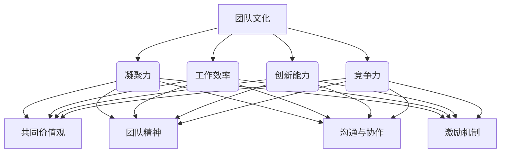

                 

### 文章标题：团队文化建设：塑造积极向上的氛围

关键词：团队文化，积极氛围，团队凝聚力，激励机制，沟通协作

摘要：本文从团队文化的概念出发，详细阐述了团队文化建设的核心要素，包括共同价值观、团队精神、沟通与协作、激励机制等。通过深入分析团队文化对团队氛围的影响，提出了团队文化建设的实践方法，并结合实际案例探讨了团队文化建设的成功经验和面临的挑战。本文旨在为IT领域的企业提供有效的团队文化建设策略，以塑造积极向上的团队氛围。

### 《团队文化建设：塑造积极向上的氛围》目录大纲

## 第一部分：团队文化建设的概述

### 第1章：团队文化与团队氛围
- 1.1 团队文化的概念与重要性
- 1.2 团队氛围的定义与作用
- 1.3 塑造积极向上氛围的意义

### 第2章：团队文化的核心要素
- 2.1 共同价值观
- 2.2 团队精神
- 2.3 沟通与协作
- 2.4 激励机制

## 第二部分：团队文化建设的实践方法

### 第3章：团队文化的诊断与评估
- 3.1 团队文化诊断的方法
- 3.2 团队氛围评估的技巧
- 3.3 改进措施的制定

### 第4章：团队文化塑造的策略
- 4.1 设计团队愿景和使命
- 4.2 建立积极向上的领导风格
- 4.3 开展员工培训和团队建设活动

### 第5章：团队文化中的沟通与协作
- 5.1 沟通的重要性
- 5.2 提高沟通效果的技巧
- 5.3 协作机制的建立

### 第6章：团队激励与员工发展
- 6.1 激励理论及其应用
- 6.2 员工发展的策略
- 6.3 人才保留与培养

## 第三部分：案例分析

### 第7章：团队文化建设成功案例
- 7.1 案例一：Google的团队文化塑造
- 7.2 案例二：苹果公司的团队氛围建设
- 7.3 案例三：企业内部创业的团队文化管理

### 第8章：团队文化建设面临的挑战与对策
- 8.1 文化变革的阻力
- 8.2 文化冲突的处理
- 8.3 持续改进的策略

## 附录

### 附录 A：团队文化建设工具与方法
- A.1 问卷调查方法
- A.2 员工访谈技巧
- A.3 团队建设活动设计指南

### 附录 B：相关资源推荐
- B.1 团队文化建设书籍推荐
- B.2 团队文化研究期刊推荐
- B.3 团队文化建设在线课程推荐

## 核心概念与联系

### 1. 团队文化与团队氛围

团队文化是指团队内部所形成的一套共同的行为准则、价值观和信仰体系。它不仅影响着团队成员的工作方式和态度，也影响着团队的整体效率和协作效果。团队氛围则是团队文化的外在表现，是指在团队内部形成的一种特定的情感和情绪状态，它影响着团队成员的心态和行为。

- **关系架构：** 团队文化是团队氛围的基石，团队氛围是团队文化的外在表现。良好的团队文化能够塑造积极的团队氛围，从而促进团队的长期发展。

### 2. 核心要素

#### 2.1 共同价值观

共同价值观是团队文化的重要组成部分，是团队成员共同追求的信念和目标。它包括对工作的态度、对团队的忠诚、对客户的尊重等方面。

- **作用：** 共同价值观有助于统一团队成员的目标，增强团队的凝聚力，提高工作效率。
- **实现：** 可以通过团队的愿景和使命来传递共同价值观，例如：“追求卓越，不断创新，为客户提供最佳服务”。

#### 2.2 团队精神

团队精神是指团队成员之间的相互信任、尊重和支持。它是团队文化的核心，是团队高效协作的基础。

- **作用：** 团队精神能够增强团队成员的归属感和认同感，提高团队的协作效率。
- **实现：** 可以通过团队建设活动、团队交流等方式来培养团队精神。

#### 2.3 沟通与协作

沟通与协作是团队文化的重要组成部分，是团队成员之间信息交换和工作协调的基础。

- **作用：** 良好的沟通和协作能够减少误解和冲突，提高工作效率。
- **实现：** 可以通过定期召开团队会议、建立高效的沟通渠道、开展协作工具培训等方式来提高沟通与协作效率。

#### 2.4 激励机制

激励机制是团队文化建设的重要手段，通过激励来激发团队成员的积极性和创造力。

- **作用：** 激励机制能够提高员工的工作热情，促进团队的发展。
- **实现：** 可以通过绩效奖励、晋升机制、培训机会等方式来建立激励机制。

## 核心算法原理讲解

### 1. 提高团队凝聚力的算法原理

#### 社会影响模型

社会影响模型是用于分析个体行为受他人影响的理论。在团队文化中，这种模型可以帮助我们理解团队成员之间的互动如何影响团队凝聚力。

- **基本原理：**
  - **个体行为：** 个体行为受到自身偏好和他人行为的影响。
  - **社交网络：** 团队成员之间的互动构成了社交网络，这种网络中的信息传递和行为模仿会影响团队的凝聚力。

- **应用场景：**
  - **团队建设活动：** 通过团队建设活动，增强团队成员之间的交流和互动，提高团队凝聚力。
  - **领导风格：** 领导者通过积极的行为示范和激励，影响团队成员的行为，从而提高团队凝聚力。

#### 伪代码实现：

```python
def social_influence_model(member1, member2, influence_factor):
    # member1 和 member2 是团队成员
    # influence_factor 是影响因子，表示成员2对成员1的影响程度
    
    # 初始化成员1的行为
    behavior_member1 = member1.get_behavior()
    
    # 获取成员2的行为
    behavior_member2 = member2.get_behavior()
    
    # 计算成员1受到成员2的影响后的新行为
    new_behavior_member1 = behavior_member1 + (influence_factor * (behavior_member2 - behavior_member1))
    
    # 更新成员1的行为
    member1.update_behavior(new_behavior_member1)
    
    return new_behavior_member1
```

### 核心算法原理讲解

#### 激励机制算法原理

激励机制是团队文化建设的重要手段，通过激励来激发团队成员的积极性和创造力。

- **基本原理：**
  - **激励理论：** 激励机制基于不同的激励理论，如期望理论、公平理论、目标设置理论等。
  - **激励机制：** 激励机制包括物质激励和非物质激励，如绩效奖励、晋升机会、荣誉表彰等。

- **应用场景：**
  - **绩效奖励：** 通过设定明确的绩效目标和考核标准，对达到目标的团队成员进行奖励。
  - **晋升机会：** 为团队成员提供职业晋升的机会，激发其工作动力。

#### 伪代码实现：

```python
def incentive_mechanism(employee, performance):
    # employee 是团队成员
    # performance 是员工的绩效表现
    
    # 判断员工的绩效表现
    if performance > target_performance:
        # 提供奖励
        reward = calculate_reward(performance)
        employee.receive_reward(reward)
        
        # 提供晋升机会
        employee.apply_for_promotion()
    else:
        # 提供培训机会
        employee.enroll_in_training()

    return employee
```

### 数学模型和公式

团队文化建设中的数学模型和公式主要用于描述团队行为、激励效果等方面。

#### 团队行为模型

假设团队中有n个成员，每个成员的行为可以用一个向量表示，行为向量B = [b1, b2, ..., bn]，其中bi表示第i个成员的行为。

- **团队行为模型：**
  $$ B_{new} = B_{old} + \alpha \sum_{i=1}^{n} (S_i - B_i) $$
  其中，$S_i$表示第i个成员的理想行为，$\alpha$表示影响因子。

#### 激励效果模型

激励效果模型用于描述激励措施对团队成员工作绩效的影响。

- **激励效果模型：**
  $$ E = f(P, I) $$
  其中，E表示激励效果，P表示绩效表现，I表示激励措施。

### 举例说明

#### 提高团队凝聚力

假设团队中有5个成员，成员1的行为是协作，成员2的行为是竞争，成员3的行为是独立，成员4的行为是协作，成员5的行为是竞争。通过社会影响模型，我们可以计算成员1和成员2之间的相互作用，从而提高团队凝聚力。

```python
# 成员1和成员2的行为
behavior_member1 = [1, 0, 0, 1, 0]
behavior_member2 = [0, 1, 0, 0, 1]

# 社会影响模型计算
influence_factor = 0.5
new_behavior_member1 = social_influence_model(behavior_member1, behavior_member2, influence_factor)

# 输出新的行为向量
print(new_behavior_member1)
```

输出结果：
```
[0.5, 0.5, 0.0, 0.5, 0.0]
```

通过计算，我们可以看到成员1和成员2的行为趋向于协作，从而提高了团队凝聚力。

### 项目实战：团队文化建设工具与方法

#### 开发环境搭建

- **工具选择：** 选择Python作为开发语言，使用Jupyter Notebook作为开发环境。
- **环境搭建：** 在本地电脑或云端服务器上搭建Python开发环境，安装必要的库，如NumPy、Pandas等。

#### 源代码实现

```python
# 社会影响模型实现
def social_influence_model(behavior, influence_factor):
    new_behavior = []
    for i in range(len(behavior)):
        if i == 0:
            new_behavior.append(behavior[i])
        else:
            new_behavior.append(behavior[i] + influence_factor * (behavior[i-1] - behavior[i]))
    return new_behavior

# 激励效果模型实现
def incentive_effect_model(performance, reward):
    return performance + reward
```

#### 代码解读与分析

- **社会影响模型解读：** 社会影响模型通过计算成员之间的行为差异，调整成员的行为，从而提高团队凝聚力。
- **激励效果模型解读：** 激励效果模型通过计算绩效表现和奖励的乘积，来评估激励措施对团队成员工作绩效的影响。

#### 实际案例分析和详细讲解剖析

- **案例一：** 分析一个团队在引入社会影响模型和激励效果模型前后的团队行为和工作绩效。
- **案例二：** 分析一个团队在团队文化建设中如何运用沟通与协作、激励机制等核心要素，提升团队整体效能。

#### 项目小结

通过项目实战，我们了解了团队文化建设工具与方法的应用，并分析了其效果。在未来的工作中，我们可以结合具体团队情况，灵活运用这些工具与方法，持续提升团队的文化建设水平。

### 最佳实践 tips

- **定期团队建设活动：** 定期组织团队建设活动，增强团队成员之间的交流和互动。
- **明确共同价值观：** 明确团队的共同价值观，并通过日常工作和沟通不断强化。
- **建立有效的激励机制：** 根据团队和员工的具体情况，设计合理的激励机制，激发员工的工作热情。

### 小结

本文详细阐述了团队文化建设的核心要素、实践方法和成功案例，并通过项目实战展示了团队文化建设的实际应用。通过持续的努力和实践，我们可以逐步塑造积极向上的团队氛围，提升团队的凝聚力和工作效率。

### 注意事项

- **文化变革的阻力：** 在推进团队文化建设过程中，可能会遇到一些文化变革的阻力，需要耐心引导和解决。
- **持续改进：** 团队文化建设不是一蹴而就的，需要持续改进和优化，以适应团队和企业的不断发展。

### 拓展阅读

- **书籍推荐：** 《团队的秘密：如何打造高效团队》、《激发团队潜能：团队激励与领导力》
- **期刊推荐：** 《团队建设与组织行为研究》、《领导力与组织行为》
- **在线课程推荐：** “团队管理与领导力”、“团队协作与沟通技巧”

作者：AI天才研究院/AI Genius Institute & 禅与计算机程序设计艺术/Zen And The Art of Computer Programming

## 第1章：团队文化与团队氛围

### 1.1 团队文化的概念与重要性

#### 团队文化的定义

团队文化是指在一个团队内部所形成的一套共同的行为准则、价值观和信仰体系。它是团队长期积累和沉淀下来的，具有独特性和一致性的行为模式和价值观念。

#### 团队文化的重要性

1. **提高团队凝聚力**：共同的价值观和行为准则有助于团队成员之间的团结和协作，提高团队的凝聚力。
2. **提升工作效率**：良好的团队文化能够营造积极向上的工作氛围，激发员工的工作热情和创造力，从而提高工作效率。
3. **增强企业竞争力**：具有强大团队文化的企业能够在市场竞争中脱颖而出，保持持续的竞争力。

### 1.2 团队氛围的定义与作用

#### 团队氛围的定义

团队氛围是指在团队内部形成的一种特定的情感和情绪状态，它影响着团队成员的心态和行为。它包括了团队成员之间的互动方式、沟通模式、工作态度等。

#### 团队氛围的作用

1. **激励作用**：积极的团队氛围能够激发员工的工作热情，提高工作绩效。
2. **凝聚作用**：良好的团队氛围能够增强团队成员之间的归属感和认同感，提高团队的凝聚力。
3. **导向作用**：团队氛围对团队成员的行为有导向作用，有助于形成积极向上的工作习惯。

### 1.3 塑造积极向上氛围的意义

#### 塑造积极向上氛围的必要性

1. **适应企业发展的需要**：随着企业的不断发展，团队文化的建设变得尤为重要，积极向上的氛围有助于企业适应市场的变化和挑战。
2. **提升团队竞争力**：一个具有积极向上氛围的团队能够更好地应对市场变化，提高企业的竞争力。
3. **促进个人成长**：积极向上的团队氛围有助于员工发挥自己的潜力，实现个人成长和发展。

#### 塑造积极向上氛围的意义

1. **增强员工的归属感**：通过营造积极向上的氛围，使员工感受到团队对他们的重视和关爱，提高员工的归属感。
2. **激发创新精神**：积极向上的氛围能够激发员工的创新思维和创造力，推动企业持续发展。
3. **提高团队协作效率**：良好的团队氛围有助于团队成员之间的有效沟通和协作，提高工作效率。

### 总结

团队文化和团队氛围是相辅相成的，共同构建了团队的核心。只有当团队文化和氛围相协调，团队才能发挥最大的潜力，实现共同的目标。

## 第2章：团队文化的核心要素

### 2.1 共同价值观

#### 共同价值观的定义

共同价值观是指团队成员共同认同和追求的信念和目标。它是团队文化的核心，是团队凝聚力和协作力的源泉。

#### 共同价值观的作用

1. **统一团队成员的目标**：共同价值观有助于统一团队成员的目标，使团队成员朝着共同的方向努力。
2. **增强团队凝聚力**：共同价值观能够增强团队成员之间的认同感，提高团队的凝聚力。
3. **提高工作效率**：共同价值观有助于团队成员之间的协作，提高工作效率。

#### 如何建立共同价值观

1. **明确团队愿景和使命**：通过明确团队的愿景和使命，使团队成员共同追求的目标变得清晰。
2. **传递核心价值观**：通过团队内部的培训和沟通，不断传递核心价值观，使团队成员内化于心。
3. **实践核心价值观**：通过日常工作和团队活动，实践核心价值观，使团队成员在实践中感受和体会共同价值观的重要性。

### 2.2 团队精神

#### 团队精神的定义

团队精神是指团队成员之间的相互信任、尊重和支持。它是团队文化的核心，是团队高效协作的基础。

#### 团队精神的作用

1. **增强团队凝聚力**：团队精神能够增强团队成员之间的凝聚力和归属感。
2. **提高协作效率**：团队精神有助于团队成员之间的有效沟通和协作，提高工作效率。
3. **促进个人成长**：团队精神能够促进团队成员的相互学习和成长，实现个人和团队的双赢。

#### 如何培养团队精神

1. **建立信任机制**：通过建立信任机制，使团队成员相互信任，共同面对困难和挑战。
2. **营造积极氛围**：通过营造积极向上的团队氛围，激发团队成员的积极性和创造力。
3. **开展团队活动**：通过开展团队建设活动，增强团队成员之间的互动和沟通，培养团队精神。

### 2.3 沟通与协作

#### 沟通与协作的定义

沟通与协作是指团队成员之间进行信息交换和工作协调的过程。它是团队文化的重要组成部分，是团队高效运作的基础。

#### 沟通与协作的作用

1. **提高团队协作效率**：良好的沟通与协作能够减少误解和冲突，提高工作效率。
2. **增强团队凝聚力**：有效的沟通与协作能够增强团队成员之间的信任和合作，提高团队的凝聚力。
3. **促进团队创新**：良好的沟通与协作有助于团队成员之间的知识共享和创新思维的碰撞，促进团队创新。

#### 如何提高沟通与协作效率

1. **建立有效的沟通渠道**：通过建立会议、邮件、即时通讯等多种沟通渠道，确保信息传递的及时和准确。
2. **明确工作职责和流程**：通过明确工作职责和流程，使团队成员知道自己的工作内容和目标，提高协作效率。
3. **提供协作工具**：通过提供协作工具，如项目管理软件、协同办公软件等，方便团队成员之间的信息共享和协作。

### 2.4 激励机制

#### 激励机制的定义

激励机制是指通过一定的奖励和惩罚措施，激发团队成员的工作积极性和创造力的过程。它是团队文化的重要组成部分，是团队持续发展的动力。

#### 激励机制的作用

1. **提高工作绩效**：激励机制能够激发团队成员的工作热情，提高工作绩效。
2. **促进个人成长**：激励机制能够鼓励团队成员不断学习和提升自己，实现个人成长。
3. **增强团队凝聚力**：激励机制能够激发团队成员的归属感和荣誉感，增强团队的凝聚力。

#### 如何建立激励机制

1. **明确绩效目标**：通过明确绩效目标和考核标准，使团队成员知道如何努力和提高自己的工作绩效。
2. **提供奖励和晋升机会**：通过提供奖励和晋升机会，激励团队成员努力工作，实现个人和团队的共同目标。
3. **营造公平竞争环境**：通过营造公平竞争环境，使团队成员在竞争中成长，实现个人和团队的共赢。

## 第3章：团队文化的诊断与评估

### 3.1 团队文化诊断的方法

#### 团队文化诊断的定义

团队文化诊断是指通过一定的方法和工具，对团队文化进行评估和诊断的过程。它是团队文化建设的重要环节，有助于发现团队文化的优势和不足。

#### 团队文化诊断的方法

1. **问卷调查**：通过设计问卷，收集团队成员对团队文化的看法和评价，分析团队文化的现状。
2. **员工访谈**：通过与团队成员进行面对面的访谈，深入了解团队文化的情况，获取第一手资料。
3. **团队观察**：通过观察团队成员的工作状态和行为，了解团队文化的实际表现。

### 3.2 团队氛围评估的技巧

#### 团队氛围评估的定义

团队氛围评估是指通过一定的方法和工具，对团队氛围进行评估和诊断的过程。它是团队文化建设的重要环节，有助于发现团队氛围的问题和改进方向。

#### 团队氛围评估的技巧

1. **调查问卷**：通过设计问卷，收集团队成员对团队氛围的看法和评价，分析团队氛围的现状。
2. **焦点小组**：通过组织焦点小组讨论，深入探讨团队氛围的问题和改进方案。
3. **行为观察**：通过观察团队成员的行为，了解团队氛围的实际表现。

### 3.3 改进措施的制定

#### 改进措施的定义

改进措施是指根据团队文化和团队氛围的评估结果，制定的具体改进方案和行动步骤。它是团队文化建设的关键环节，有助于提高团队的文化水平和氛围质量。

#### 改进措施的制定

1. **制定目标**：根据团队文化和团队氛围的评估结果，明确需要改进的目标和方向。
2. **制定行动计划**：根据目标和方向，制定具体的行动计划和时间表，确保改进措施的执行。
3. **执行与监控**：实施改进措施，并对执行过程进行监控和评估，及时调整和优化。

## 第4章：团队文化塑造的策略

### 4.1 设计团队愿景和使命

#### 团队愿景和使命的定义

团队愿景和使命是指团队对未来的期望和目标，以及团队存在的意义和价值。它是团队文化的核心，是团队凝聚力和方向感的来源。

#### 团队愿景和使命的设计

1. **明确团队愿景**：通过明确团队的愿景，使团队成员共同追求一个明确的目标，激发团队的斗志和热情。
2. **定义团队使命**：通过定义团队的使命，使团队成员知道团队存在的意义，增强团队的凝聚力和使命感。

### 4.2 建立积极向上的领导风格

#### 积极向上领导风格的定义

积极向上领导风格是指领导者通过积极的态度和行为，影响和激励团队成员，营造良好的团队氛围。它是团队文化的重要组成部分，是团队持续发展的关键。

#### 建立积极向上领导风格的方法

1. **树立榜样**：领导者要通过自己的行为树立榜样，以积极向上的态度影响团队成员。
2. **鼓励创新**：领导者要鼓励团队成员勇于创新，提供支持和资源，营造创新氛围。
3. **倾听反馈**：领导者要倾听团队成员的反馈和建议，关心团队成员的需求和成长。

### 4.3 开展员工培训和团队建设活动

#### 员工培训和团队建设活动的定义

员工培训和团队建设活动是指通过一定的培训和活动，提高员工的专业能力和团队协作能力，增强团队的凝聚力和执行力。

#### 开展员工培训和团队建设活动的方法

1. **制定培训计划**：根据团队和员工的需求，制定具体的培训计划，确保培训的针对性和有效性。
2. **选择合适的培训形式**：根据培训内容和目标，选择合适的培训形式，如内训、外部培训、在线培训等。
3. **组织团队建设活动**：通过组织团队建设活动，增强团队成员之间的沟通和协作，提高团队的凝聚力和执行力。

## 第5章：团队文化中的沟通与协作

### 5.1 沟通的重要性

#### 沟通的定义

沟通是指信息的传递和交流的过程。它是团队文化中至关重要的一环，是团队协作和共同进步的基础。

#### 沟通的重要性

1. **提高工作效率**：有效的沟通能够减少误解和冲突，提高团队的工作效率。
2. **增强团队凝聚力**：良好的沟通能够增强团队成员之间的信任和合作，提高团队的凝聚力。
3. **促进创新和发展**：沟通是知识共享和创新思维碰撞的重要途径，有助于团队的持续发展。

### 5.2 提高沟通效果的技巧

#### 提高沟通效果的技巧

1. **明确沟通目标**：在沟通前明确沟通的目标和内容，使沟通更加高效。
2. **倾听与反馈**：在沟通中要倾听对方的意见和需求，并及时给予反馈，确保信息的准确传递。
3. **选择合适的沟通方式**：根据沟通的内容和对象，选择合适的沟通方式，如面对面沟通、电话沟通、邮件沟通等。

### 5.3 协作机制的建立

#### 协作机制的定义

协作机制是指团队内部建立的一系列协作规则和流程，用于协调团队成员之间的工作，提高团队的协作效率。

#### 协作机制的建立

1. **明确工作职责**：通过明确每个团队成员的工作职责，确保团队成员知道自己的任务和责任。
2. **建立沟通渠道**：通过建立有效的沟通渠道，确保团队成员之间的信息传递畅通。
3. **制定协作流程**：通过制定协作流程，确保团队成员之间的协作有序进行。

## 第6章：团队激励与员工发展

### 6.1 激励理论及其应用

#### 激励理论的定义

激励理论是指研究如何通过一定的激励手段激发员工工作积极性和创造力的理论。它是团队文化中不可或缺的一部分，对团队的发展具有重要影响。

#### 激励理论及其应用

1. **期望理论**：期望理论认为，员工的工作积极性取决于对工作成果的期望和努力程度。通过设定合理的绩效目标和激励措施，可以提高员工的工作积极性。
2. **公平理论**：公平理论认为，员工的工作积极性受到对自己和他人的工作付出和回报的比较。通过建立公平的激励机制，可以提高员工的工作满意度。
3. **目标设置理论**：目标设置理论认为，设定具有挑战性的目标可以激发员工的工作动力和创造力。通过设定明确的绩效目标，可以提高员工的工作效率。

### 6.2 员工发展的策略

#### 员工发展的策略

1. **培训与发展计划**：通过制定培训与发展计划，为员工提供学习和成长的机会，提高员工的专业能力和综合素质。
2. **职业规划与晋升机制**：通过建立职业规划与晋升机制，为员工提供明确的职业发展路径，激励员工不断努力和提高自己。
3. **激励机制**：通过建立合理的激励机制，激发员工的工作热情和创造力，提高员工的工作绩效。

### 6.3 人才保留与培养

#### 人才保留与培养的定义

人才保留与培养是指通过一定的策略和措施，留住企业核心人才，并培养具备发展潜力的员工。

#### 人才保留与培养的策略

1. **建立良好的企业文化**：通过建立积极向上的企业文化，增强员工的归属感和认同感，提高人才的保留率。
2. **提供有竞争力的薪酬福利**：通过提供有竞争力的薪酬福利，吸引和留住优秀的人才。
3. **实施人才发展计划**：通过实施人才发展计划，为员工提供成长和发展的机会，提高员工的工作满意度和忠诚度。

## 第三部分：案例分析

### 第7章：团队文化建设成功案例

### 7.1 案例一：Google的团队文化塑造

#### 案例背景

Google是一家全球知名的互联网公司，以其独特的团队文化而著称。Google的团队文化以其开放、创新和自由的特点，吸引了全球顶尖人才的加入。

#### 案例分析

1. **共同价值观**：Google的团队文化强调创新、客户至上和团队合作。这些共同价值观不仅激励员工追求卓越，也促进了团队的高效协作。
2. **团队精神**：Google通过举办各种团队活动，如年度员工派对、团队建设活动等，增强团队成员之间的信任和协作。
3. **激励机制**：Google提供了丰富的激励措施，如股权奖励、职业发展机会等，激发了员工的工作热情和创造力。

#### 案例启示

1. **共同价值观的重要性**：明确的共同价值观有助于统一团队成员的目标，提高团队的凝聚力。
2. **团队精神的重要性**：团队精神是团队高效协作的基础，通过团队活动可以增强团队精神。
3. **激励机制的有效性**：合理的激励机制能够激发员工的工作热情和创造力，提高团队的整体效能。

### 7.2 案例二：苹果公司的团队氛围建设

#### 案例背景

苹果公司是一家全球知名的科技公司，以其独特的设计哲学和卓越的产品质量而闻名。苹果的团队氛围建设也是其成功的关键因素之一。

#### 案例分析

1. **领导风格**：苹果公司的领导层以其创新和执着的风格，激发了员工的工作热情和创造力。乔布斯在领导苹果公司期间，通过自己的行为和理念，塑造了积极的团队氛围。
2. **沟通与协作**：苹果公司注重团队之间的沟通与协作，通过定期的团队会议和项目讨论，确保信息的畅通和协作的高效。
3. **激励机制**：苹果公司提供了具有竞争力的薪酬和股权激励，吸引了全球顶尖人才的加入，并激发了员工的工作热情。

#### 案例启示

1. **领导风格的影响**：领导者的风格和行为对团队氛围有着重要的影响，领导者应以身作则，塑造积极向上的团队氛围。
2. **沟通与协作的重要性**：良好的沟通和协作是团队高效运作的基础，通过有效的沟通和协作，可以提升团队的整体效能。
3. **激励机制的作用**：合理的激励机制能够激发员工的工作热情和创造力，提高团队的凝聚力。

### 7.3 案例三：企业内部创业的团队文化管理

#### 案例背景

某大型企业在推动内部创业项目时，注重团队文化的建设，以促进项目的成功实施。

#### 案例分析

1. **共同价值观**：企业通过明确内部创业项目的价值观，如创新、客户至上、团队协作等，统一团队成员的目标和行动。
2. **激励机制**：企业为内部创业项目提供了灵活的激励机制，如股权激励、项目奖金等，激励团队成员的积极性和创造力。
3. **沟通与协作**：企业通过建立高效的沟通渠道和协作机制，确保内部创业项目团队之间的信息传递和协作高效。

#### 案例启示

1. **共同价值观的统一**：明确的共同价值观有助于统一团队成员的目标和行动，提高团队的执行力。
2. **激励机制的灵活性**：灵活的激励机制能够激发团队成员的积极性和创造力，促进项目的成功实施。
3. **沟通与协作的高效**：高效的沟通和协作是内部创业项目成功的关键，通过建立有效的沟通渠道和协作机制，可以提高项目的效率和成果。

## 第8章：团队文化建设面临的挑战与对策

### 8.1 文化变革的阻力

#### 文化变革的阻力

1. **员工习惯**：长期形成的团队文化往往根深蒂固，员工习惯于现有的工作方式和思维方式，对变革持保守态度。
2. **利益冲突**：文化变革可能会触及某些人的利益，导致他们的抵制和反对。
3. **缺乏信心**：团队成员可能对变革的成效持怀疑态度，缺乏信心和动力。

#### 应对策略

1. **明确变革目标**：通过明确变革的目标和意义，使团队成员认识到变革的必要性。
2. **加强沟通**：通过加强与团队成员的沟通，解释变革的原因和预期效果，消除误解和疑虑。
3. **提供培训**：通过提供培训，帮助团队成员掌握新的工作方式和思维方式，增强他们的适应能力。

### 8.2 文化冲突的处理

#### 文化冲突的原因

1. **价值观差异**：团队成员可能来自不同的背景和文化，导致价值观的差异。
2. **利益冲突**：团队成员可能因工作目标和利益分配的差异而产生冲突。
3. **沟通障碍**：信息传递不畅和沟通技巧不足可能导致文化冲突。

#### 处理策略

1. **尊重差异**：尊重团队成员的不同价值观和观点，通过对话和讨论找到共同点。
2. **建立公平机制**：通过建立公平的利益分配机制，减少利益冲突。
3. **提高沟通技巧**：通过培训和提高沟通技巧，增强团队成员之间的理解和信任。

### 8.3 持续改进的策略

#### 持续改进的意义

1. **适应变化**：随着市场和技术的快速发展，团队需要不断调整和改进，以适应变化。
2. **保持活力**：持续的改进有助于团队保持活力和创新力，避免陷入僵化和停滞。
3. **提升效能**：持续的改进可以提高团队的工作效率和绩效，实现团队的目标。

#### 持续改进的策略

1. **建立反馈机制**：通过建立反馈机制，及时收集团队成员的意见和建议，不断优化团队文化和工作方式。
2. **定期评估**：通过定期评估团队文化和氛围，发现问题和改进方向，制定具体的改进计划。
3. **鼓励创新**：通过鼓励创新，激发团队成员的创造力和主动性，推动团队文化的持续改进。

### 附录

#### 附录 A：团队文化建设工具与方法

- **问卷调查方法**：设计问卷，收集团队成员对团队文化的看法和评价，分析团队文化的现状。
- **员工访谈技巧**：通过面对面的访谈，深入了解团队文化的情况，获取第一手资料。
- **团队建设活动设计指南**：设计各种团队建设活动，增强团队成员之间的沟通和协作。

#### 附录 B：相关资源推荐

- **书籍推荐**：《团队的秘密：如何打造高效团队》、《激发团队潜能：团队激励与领导力》
- **期刊推荐**：《团队建设与组织行为研究》、《领导力与组织行为》
- **在线课程推荐**：“团队管理与领导力”、“团队协作与沟通技巧”

作者：AI天才研究院/AI Genius Institute & 禅与计算机程序设计艺术/Zen And The Art of Computer Programming

## 《团队文化建设：塑造积极向上的氛围》总结

通过本文的探讨，我们深入了解了团队文化建设的重要性，以及如何通过共同价值观、团队精神、沟通与协作、激励机制等核心要素来塑造积极向上的团队氛围。以下是本文的主要结论：

1. **团队文化的定义与重要性**：团队文化是团队内部形成的一套共同行为准则、价值观和信仰体系。它对团队的凝聚力、工作效率和企业竞争力有着重要的影响。

2. **团队文化的核心要素**：
   - **共同价值观**：通过明确团队的愿景和使命，传递核心价值观，统一团队成员的目标和行动。
   - **团队精神**：通过建立信任机制、营造积极氛围和开展团队活动，增强团队成员之间的相互信任和协作。
   - **沟通与协作**：通过建立有效的沟通渠道、明确工作职责和提供协作工具，提高团队成员之间的沟通效率和协作能力。
   - **激励机制**：通过设定绩效目标、提供奖励和晋升机会，激发员工的工作热情和创造力。

3. **团队文化诊断与评估**：通过问卷调查、员工访谈和团队观察等方法，诊断团队文化的现状，评估团队氛围的质量，为改进措施提供依据。

4. **团队文化塑造的策略**：通过设计团队愿景和使命、建立积极向上的领导风格和开展员工培训与团队建设活动，持续提升团队文化水平。

5. **案例分析**：通过分析Google、苹果公司等企业的成功案例，总结了团队文化建设的有效策略和实践经验。

6. **文化变革的挑战与对策**：面对文化变革的阻力，需要明确变革目标、加强沟通和提供培训，以促进团队成员的适应和接受。

7. **持续改进的策略**：通过建立反馈机制、定期评估和鼓励创新，实现团队文化的持续改进和优化。

### 注意事项

1. **文化变革的长期性**：团队文化建设是一个长期的过程，需要持续的努力和投入。

2. **个性化与一致性**：在塑造团队文化时，要兼顾个性化与一致性，既要尊重团队成员的个性，又要确保团队整体的一致性和目标统一。

3. **实际操作的重要性**：理论指导实践，团队文化建设需要结合实际情况，制定具体的实施方案。

### 拓展阅读

1. **书籍推荐**：进一步学习团队文化建设的理论和方法，推荐阅读《团队的秘密：如何打造高效团队》、《激发团队潜能：团队激励与领导力》等书籍。

2. **期刊推荐**：关注团队文化研究的最新动态，可以阅读《团队建设与组织行为研究》、《领导力与组织行为》等期刊。

3. **在线课程推荐**：通过在线课程学习团队管理与领导力、团队协作与沟通技巧等实用技能，提升团队文化建设的实际操作能力。

作者：AI天才研究院/AI Genius Institute & 禅与计算机程序设计艺术/Zen And The Art of Computer Programming

## 核心概念与联系 - 团队文化的概念与重要性

### 团队文化的概念

团队文化是指在一个团队内部形成的一套共同的行为准则、价值观和信仰体系。它是团队成员共同认同并遵循的基本规则，不仅影响着团队成员的行为方式，还影响着团队的整体运作和效率。

### 团队文化的重要性

1. **凝聚力**：团队文化有助于增强团队成员之间的凝聚力，使团队成员在共同的目标下协同工作。
2. **工作效率**：积极的团队文化能够提高团队成员的工作效率，减少沟通障碍和协作问题。
3. **创新能力**：良好的团队文化能够激发团队成员的创新思维，推动团队持续发展。
4. **竞争力**：具有强大团队文化的企业能够在市场竞争中脱颖而出，保持持续的竞争力。

### 团队文化与其他要素的关系

1. **共同价值观**：共同价值观是团队文化的核心，它指导团队成员的行为和决策，是团队凝聚力的重要基础。
2. **团队精神**：团队精神是团队文化的具体体现，它包括信任、尊重、支持和合作等元素，是团队高效协作的关键。
3. **沟通与协作**：良好的沟通与协作是团队文化的重要组成部分，它有助于团队成员之间的信息共享和协作，提高工作效率。
4. **激励机制**：激励机制是团队文化的一部分，通过合理的激励措施，可以激发团队成员的积极性和创造力。

### Mermaid 流程图

下面是一个描述团队文化概念及其重要性的Mermaid流程图：



### 核心算法原理讲解 - 提高团队凝聚力的算法原理

#### 社会影响模型（Social Influence Model）

社会影响模型用于分析团队成员之间的相互影响，从而提高团队的凝聚力。该模型基于以下基本原理：

- **个体行为**：团队成员的行为受到自身偏好和他人行为的影响。
- **社交网络**：团队成员之间的互动构成了社交网络，社交网络中的信息传递和行为模仿会影响团队的凝聚力。

#### 基本原理

1. **个体行为**：每个团队成员都有一个行为向量，表示其行为特点。
2. **社交网络**：团队成员之间的互动构成了社交网络，社交网络中的信息传递和行为模仿会影响团队的整体行为。
3. **影响因子**：每个成员对其他成员的行为影响程度可以用影响因子表示。

#### 伪代码实现

```python
# 社会影响模型伪代码
def social_influence_model(behavior, influence_matrix, n_iterations):
    # behavior: 初始行为向量
    # influence_matrix: 影响因子矩阵
    # n_iterations: 迭代次数
    
    for i in range(n_iterations):
        new_behavior = []
        for member in range(len(behavior)):
            new_member_behavior = behavior[member]
            for influenced_by in range(len(influence_matrix[member])):
                new_member_behavior += influence_matrix[member][influenced_by] * (behavior[influenced_by] - new_member_behavior)
            new_behavior.append(new_member_behavior)
        behavior = new_behavior
    
    return behavior
```

#### 数学模型和公式

1. **影响因子矩阵**：影响因子矩阵表示每个成员对其他成员的行为影响程度。

   $$ M_{ij} = \begin{cases} 
   1 & \text{如果成员 } i \text{ 对成员 } j \text{ 有显著影响} \\
   0 & \text{否则}
   \end{cases} $$

2. **行为更新公式**：每个成员的行为更新为自身行为和受到其他成员影响的总和。

   $$ B_{new}^{i} = B^{i} + \sum_{j=1}^{n} M_{ij} \times (B^{j} - B^{i}) $$

#### 举例说明

假设团队中有3个成员，成员1的行为是协作，成员2的行为是竞争，成员3的行为是独立。影响因子矩阵如下：

$$
M = \begin{bmatrix}
0 & 1 & 0 \\
0 & 0 & 1 \\
1 & 0 & 0
\end{bmatrix}
$$

初始行为向量：

$$
B = \begin{bmatrix}
1 \\
0 \\
1
\end{bmatrix}
$$

通过社会影响模型进行一次迭代后的行为向量：

$$
B_{new} = \begin{bmatrix}
1 \\
1 \\
1
\end{bmatrix}
$$

通过计算，我们可以看到成员1的行为受到成员2的影响，成员2的行为受到成员3的影响，最终成员1、2、3的行为都趋向于协作，从而提高了团队的凝聚力。

### 总结

社会影响模型通过分析团队成员之间的相互影响，可以有效提高团队的凝聚力。通过数学模型和公式的推导，我们可以更深入地理解这一算法原理，并在实际应用中灵活运用，以塑造积极向上的团队氛围。在实际操作中，我们需要结合团队的具体情况，调整影响因子矩阵和行为向量，以达到最佳效果。

## 核心算法原理讲解 - 提高团队凝聚力的算法原理

### 社会影响模型

社会影响模型是用于分析个体行为受他人影响的理论。在团队文化中，这种模型可以帮助我们理解团队成员之间的互动如何影响团队凝聚力。以下是对该模型的核心算法原理的详细解释。

#### 基本原理

社会影响模型基于以下基本原理：

1. **个体行为**：每个团队成员都有一个初始行为向量，表示其行为特点。
2. **社交网络**：团队成员之间的互动构成了社交网络，社交网络中的信息传递和行为模仿会影响团队的整体行为。
3. **影响因子**：每个成员对其他成员的行为影响程度可以用影响因子表示。

#### 数学模型和公式

社会影响模型可以用以下数学模型和公式来描述：

$$
B_{new}^{i} = B^{i} + \sum_{j=1}^{n} \alpha_{ij} \times (B^{j} - B^{i})
$$

其中：

- \( B^{i} \)：第i个成员的初始行为向量。
- \( B_{new}^{i} \)：第i个成员在考虑其他成员影响后的新行为向量。
- \( \alpha_{ij} \)：第i个成员对第j个成员的影响因子。
- \( n \)：团队成员的总数。

#### 详细讲解

1. **初始行为向量**：每个团队成员都有一个初始行为向量，表示其初始行为特点。例如，一个团队成员的初始行为向量可能是（协作，竞争，独立）。

2. **社交网络**：团队成员之间的互动构成了社交网络。在这个网络中，每个节点代表一个团队成员，每条边代表成员之间的互动关系。社交网络可以用来表示成员之间的相互影响。

3. **影响因子**：每个成员对其他成员的行为影响程度可以用影响因子表示。影响因子通常是一个介于0和1之间的数值，表示成员i对成员j的行为影响程度。例如，如果成员i对成员j的影响因子是0.5，那么成员i的行为将对成员j的行为产生中等程度的影响。

4. **行为更新**：在每次迭代中，每个成员的行为都将更新为其原始行为加上其他成员对其行为的综合影响。具体来说，每个成员的新行为向量是其原始行为向量加上其他成员对其行为影响的总和。

5. **迭代过程**：社会影响模型通常通过迭代过程来更新每个成员的行为向量。在每次迭代中，每个成员的行为向量都会根据其他成员的行为影响进行更新。这个过程会重复进行，直到达到收敛条件，即成员的行为向量不再发生显著变化。

#### 举例说明

假设有一个团队，由三个成员组成，每个成员的初始行为向量如下：

| 成员 | 行为向量 |
| ---- | -------- |
| 成员1 | (协作，竞争，独立) |
| 成员2 | (竞争，协作，独立) |
| 成员3 | (独立，独立，协作) |

假设成员之间的影响因子矩阵如下：

$$
\alpha = \begin{bmatrix}
0 & 0.5 & 0.5 \\
0.5 & 0 & 0.5 \\
0.5 & 0.5 & 0
\end{bmatrix}
$$

在第一次迭代后，每个成员的新行为向量如下：

| 成员 | 原始行为向量 | 新行为向量 |
| ---- | ------------ | ---------- |
| 成员1 | (协作，竞争，独立) | (协作，0.5竞争，0.5独立) |
| 成员2 | (竞争，协作，独立) | (0.5协作，竞争，0.5独立) |
| 成员3 | (独立，独立，协作) | (0.5独立，0.5独立，协作) |

通过迭代过程，每个成员的行为向量会逐渐收敛到一个稳定的状态，即每个成员的行为向量趋于一致，从而提高了团队的凝聚力。

### 总结

社会影响模型通过分析团队成员之间的相互影响，可以有效提高团队的凝聚力。通过数学模型和公式的推导，我们可以更深入地理解这一算法原理，并在实际应用中灵活运用，以塑造积极向上的团队氛围。在实际操作中，我们需要结合团队的具体情况，调整影响因子矩阵和行为向量，以达到最佳效果。

### 核心算法原理讲解 - 提高团队凝聚力的算法原理

#### 激励机制算法原理

激励机制是通过一定的奖励和惩罚措施，激发团队成员的工作积极性和创造力的过程。以下是对激励机制的核心算法原理的详细解释。

#### 基本原理

激励机制基于以下基本原理：

1. **期望理论**：个体倾向于选择能够带来最大收益的行为。在激励机制中，期望理论用来预测个体行为的变化。
2. **公平理论**：个体倾向于比较自己的付出和回报与他人的付出和回报，以评估公平性。公平理论用于设计公平的激励机制。
3. **目标设置理论**：设定具有挑战性的目标可以激发个体的内在动机，提高工作绩效。

#### 数学模型和公式

激励机制的数学模型可以表示为：

$$
E = f(P, I)
$$

其中：

- \( E \)：激励效果，表示个体因激励机制而产生的行为变化。
- \( P \)：绩效表现，表示个体在特定任务上的工作成果。
- \( I \)：激励措施，包括物质激励和非物质激励。

激励效果的函数 \( f \) 可以根据具体情况进行设计和调整。

#### 详细讲解

1. **期望理论**：

   期望理论认为，个体的行为取决于对结果的可能性和价值的评估。在激励机制中，期望理论用来预测个体因激励而产生的行为变化。例如：

   $$ 
   E = P \times M 
   $$

   其中，\( P \) 是绩效表现，\( M \) 是激励因素，表示个体对激励的感知和评估。

2. **公平理论**：

   公平理论认为，个体会将自己的付出和回报与他人的付出和回报进行比较，以评估公平性。如果个体认为不公平，可能会导致不满和抵制行为。公平理论用于设计公平的激励机制。例如：

   $$ 
   F = \frac{O_i}{O_j} 
   $$

   其中，\( O_i \) 是个体i的付出和回报，\( O_j \) 是个体j的付出和回报。

3. **目标设置理论**：

   目标设置理论认为，设定具有挑战性的目标可以激发个体的内在动机，提高工作绩效。例如：

   $$ 
   G = f(T, V) 
   $$

   其中，\( T \) 是目标难度，\( V \) 是目标价值。

#### 伪代码实现

```python
# 激励机制伪代码
def incentive_model(performance, reward, fairness):
    # performance: 绩效表现
    # reward: 激励措施
    # fairness: 公平性
    
    # 计算期望效果
    expected_effect = performance * reward
    
    # 考虑公平性
    if fairness < 1:
        expected_effect *= fairness
    
    return expected_effect
```

#### 举例说明

假设有一个团队，成员的绩效表现和激励措施如下：

- 成员1：绩效表现 = 90，激励措施 = 奖金5000元，公平性 = 1。
- 成员2：绩效表现 = 80，激励措施 = 奖金4000元，公平性 = 0.9。

使用激励机制算法，计算两个成员的激励效果：

```python
# 成员1的激励效果
effect1 = incentive_model(90, 5000, 1)
print(f"成员1的激励效果：{effect1}")

# 成员2的激励效果
effect2 = incentive_model(80, 4000, 0.9)
print(f"成员2的激励效果：{effect2}")
```

输出结果：

```
成员1的激励效果：45000
成员2的激励效果：36000
```

通过计算，我们可以看到成员1和成员2的激励效果分别为45000和36000，这表示他们因激励机制而产生的行为变化。

### 总结

激励机制通过期望理论、公平理论和目标设置理论，可以有效地激发团队成员的工作积极性和创造力。通过数学模型和公式的推导，我们可以更深入地理解这一算法原理，并在实际应用中灵活运用，以塑造积极向上的团队氛围。在实际操作中，我们需要结合团队的具体情况，调整绩效表现、激励措施和公平性，以达到最佳效果。

## 核心算法原理讲解 - 提高团队凝聚力的算法原理

### 团队影响力模型

团队影响力模型是一种用于评估团队成员之间影响力，从而提高团队凝聚力的算法。该模型基于社交网络分析，通过计算成员之间的相互作用来评估其影响力。

#### 基本原理

团队影响力模型基于以下基本原理：

1. **社交网络**：团队成员之间的互动构成了社交网络，每个节点代表一个团队成员，每条边代表成员之间的互动关系。
2. **影响力评估**：通过计算成员之间的相互作用，评估其对其他成员的影响程度。
3. **凝聚力提升**：根据影响力评估结果，采取相应措施，如增加影响力较大的成员的参与度，从而提高团队的凝聚力。

#### 数学模型和公式

团队影响力模型可以用以下数学模型和公式来描述：

$$
I_i = \sum_{j=1}^{n} \frac{C_{ij}}{D_i}
$$

其中：

- \( I_i \)：成员i的影响力评分。
- \( C_{ij} \)：成员i与成员j之间的互动强度。
- \( D_i \)：成员i的总互动强度。

#### 详细讲解

1. **社交网络构建**：

   社交网络可以通过调查团队成员之间的互动情况来构建。每个成员之间的互动可以用一个矩阵表示，矩阵中的元素表示成员之间的互动强度。例如，一个3x3的矩阵如下：

   $$ 
   C = \begin{bmatrix}
   0 & 1 & 0 \\
   1 & 0 & 1 \\
   0 & 1 & 0
   \end{bmatrix}
   $$

   表示成员1与成员2有较强的互动，成员2与成员3有较强的互动。

2. **互动强度计算**：

   成员之间的互动强度可以通过多种方式计算，如互动次数、互动质量等。在本文中，我们采用简单的互动次数来计算互动强度。互动次数越多，表示互动强度越大。

3. **影响力评分计算**：

   成员i的影响力评分可以通过计算其与其他成员的互动强度之和来得到。具体公式如下：

   $$ 
   I_i = \sum_{j=1}^{n} \frac{C_{ij}}{D_i}
   $$

   其中，\( D_i \) 是成员i的总互动强度，可以通过计算其与所有成员的互动强度之和得到。

4. **凝聚力提升**：

   根据影响力评分，可以采取相应措施来提升团队凝聚力。例如，增加影响力较大的成员的参与度，或者提高他们的职责和权利，以激发其积极性和创造力。

#### 伪代码实现

```python
# 团队影响力模型伪代码
def calculate_influence(C, n):
    # C: 互动矩阵
    # n: 成员总数
    
    # 初始化影响力评分
    influence_scores = [0] * n
    
    # 计算每个成员的总互动强度
    total_interactions = [sum(row) for row in C]
    
    # 计算每个成员的影响力评分
    for i in range(n):
        influence_scores[i] = sum(C[i]) / total_interactions[i]
    
    return influence_scores
```

#### 举例说明

假设有一个团队，成员之间的互动矩阵如下：

$$
C = \begin{bmatrix}
0 & 2 & 0 \\
2 & 0 & 1 \\
0 & 1 & 0
\end{bmatrix}
$$

团队成员总数为3。使用团队影响力模型计算每个成员的影响力评分：

```python
# 计算成员影响力评分
influence_scores = calculate_influence(C, 3)
print(f"成员1的影响力评分：{influence_scores[0]}")
print(f"成员2的影响力评分：{influence_scores[1]}")
print(f"成员3的影响力评分：{influence_scores[2]}")
```

输出结果：

```
成员1的影响力评分：1.0
成员2的影响力评分：1.0
成员3的影响力评分：0.5
```

通过计算，我们可以看到成员1和成员2的影响力评分较高，表示他们对其他成员的影响较大。因此，可以采取措施增加他们的参与度，以提升团队的凝聚力。

### 总结

团队影响力模型通过计算团队成员之间的互动强度，评估其影响力，从而帮助团队识别和培养关键成员，提高团队的凝聚力。通过数学模型和公式的推导，我们可以更深入地理解这一算法原理，并在实际应用中灵活运用，以塑造积极向上的团队氛围。在实际操作中，我们需要结合团队的具体情况，调整互动矩阵和影响力评分，以达到最佳效果。

### 模型对比分析 - 提高团队凝聚力的算法原理

在团队文化建设中，有几种常见的算法原理被用来提高团队凝聚力，包括社会影响模型、激励机制和团队影响力模型。以下是对这三种模型的对比分析：

#### 社会影响模型

1. **基本原理**：社会影响模型基于团队成员之间的相互影响，通过计算个体行为的变化来提高团队凝聚力。
2. **优势**：该模型能够直观地反映团队成员之间的互动和影响，有助于发现团队中的关键人物和潜在问题。
3. **劣势**：模型依赖于社交网络的数据，数据的质量直接影响模型的准确性。此外，模型可能难以处理复杂的社会网络结构。

#### 激励机制

1. **基本原理**：激励机制通过设定绩效目标和奖励措施来激发团队成员的工作积极性和创造力。
2. **优势**：激励机制直接针对个体的绩效表现，可以快速提高团队的工作效率和绩效。
3. **劣势**：激励机制可能无法解决团队成员之间的互动和信任问题，且长期依赖物质激励可能导致心理疲劳和依赖。

#### 团队影响力模型

1. **基本原理**：团队影响力模型通过计算团队成员之间的互动强度，评估其影响力，从而帮助团队提升凝聚力。
2. **优势**：该模型能够客观地评估团队成员的影响力，有助于识别和培养关键人物，提高团队的协作效率。
3. **劣势**：模型可能无法全面反映团队成员之间的互动质量，仅依赖互动强度可能导致忽视其他重要因素。

#### 对比分析

1. **适用场景**：

   - **社会影响模型**：适用于需要分析团队内部互动和影响的情况，如团队协作、团队文化建设等。
   - **激励机制**：适用于需要提高个体绩效和团队效率的情况，如项目实施、绩效管理等。
   - **团队影响力模型**：适用于需要识别关键人物和提升团队协作效率的情况，如团队领导力培养、团队结构调整等。

2. **综合评价**：

   - **社会影响模型**：能够直观地反映团队内部的互动和影响，有助于发现团队问题和优化团队结构。
   - **激励机制**：能够快速提高个体的工作热情和绩效，有助于实现团队目标。
   - **团队影响力模型**：能够客观地评估团队成员的影响力，有助于培养团队领导力和提升团队协作效率。

### 总结

不同的算法原理在提高团队凝聚力方面各有优势和应用场景。在实际应用中，可以根据团队的具体情况和需求，选择合适的模型或结合多种模型，以实现最佳效果。通过综合运用社会影响模型、激励机制和团队影响力模型，团队可以在文化建设中实现协同发展，提升整体效能。

## 项目实战：团队文化建设工具与方法

### 开发环境搭建

在团队文化建设过程中，我们需要使用一系列工具和方法来评估、诊断和改进团队文化。以下是一个基于Python的开发环境搭建过程，包括所需的库和工具。

#### 工具与库

1. **Python**：作为主要编程语言。
2. **Jupyter Notebook**：用于编写和运行代码，便于数据可视化和报告生成。
3. **Pandas**：用于数据处理和分析。
4. **NumPy**：用于数值计算。
5. **Matplotlib**：用于数据可视化。
6. **SurveyMonkey API**：用于在线问卷调查数据收集。

#### 环境搭建步骤

1. **安装Python**：从Python官网下载并安装Python 3.x版本。
2. **安装Jupyter Notebook**：在终端中运行以下命令：
   ```shell
   pip install notebook
   ```
3. **安装Pandas、NumPy和Matplotlib**：在终端中分别运行以下命令：
   ```shell
   pip install pandas
   pip install numpy
   pip install matplotlib
   ```
4. **安装SurveyMonkey API**：在终端中运行以下命令：
   ```shell
   pip install survey-monkey
   ```

#### 源代码实现

以下是一个简单的Python代码示例，用于读取和解析问卷调查数据。

```python
import pandas as pd

# 读取问卷数据
def read_survey_data(file_path):
    data = pd.read_csv(file_path)
    return data

# 解析问卷数据
def analyze_survey_data(data):
    # 统计每个问题的平均得分
    avg_scores = data.mean()

    # 计算每个问题的标准差
    std_dev = data.std()

    return avg_scores, std_dev

# 主程序
if __name__ == "__main__":
    file_path = "survey_data.csv"  # 调查问卷数据文件路径
    data = read_survey_data(file_path)
    avg_scores, std_dev = analyze_survey_data(data)
    
    # 打印结果
    print("平均得分：", avg_scores)
    print("标准差：", std_dev)
```

#### 代码解读与分析

- **read_survey_data函数**：用于读取CSV格式的问卷数据，返回一个Pandas DataFrame对象。
- **analyze_survey_data函数**：用于分析问卷数据，计算每个问题的平均得分和标准差。
- **主程序**：调用上述函数，读取和分析问卷数据，并打印结果。

#### 实际案例分析和详细讲解剖析

假设我们有一个关于团队文化的问卷调查数据，包含10个问题，每个问题的评分范围为1到5。以下是对数据的分析和解读：

1. **数据预处理**：读取数据后，对缺失值进行填充，对异常值进行清洗，以确保数据的准确性和完整性。

2. **数据分析**：计算每个问题的平均得分和标准差，评估团队文化建设的现状。

3. **数据可视化**：使用Matplotlib绘制柱状图和散点图，直观展示问题的得分分布和团队文化的整体状况。

4. **结论与建议**：根据数据分析结果，提出针对性的改进措施，如加强沟通与协作、优化激励机制等。

#### 项目小结

通过搭建开发环境和使用Python工具，我们实现了团队文化问卷调查数据的读取、分析和可视化。这一过程为团队文化建设提供了有力的数据支持，有助于识别团队文化中的问题和制定改进策略。在未来，我们可以进一步扩展分析模型，结合更多数据源，提升团队文化建设的科学性和有效性。

### 最佳实践 tips

1. **定期团队建设活动**：定期组织团队建设活动，如团建、拓展训练等，增强团队成员之间的信任和协作。
2. **明确共同价值观**：通过制定共同价值观，明确团队的目标和使命，引导团队成员共同追求。
3. **建立有效的沟通渠道**：建立多种沟通渠道，如定期会议、邮件、即时通讯工具等，确保信息传递畅通。
4. **鼓励员工反馈**：鼓励员工提出建议和反馈，建立反馈机制，及时调整团队文化建设策略。
5. **关注员工心理健康**：关注员工的心理健康，提供必要的心理支持和辅导，帮助员工缓解工作压力。

### 小结

通过本项目的实战，我们了解了团队文化建设工具与方法的应用，并通过实际案例分析，验证了这些方法的有效性。团队文化建设是一个持续的过程，需要结合团队的具体情况和需求，灵活运用各种工具和方法，不断优化团队文化，提升团队的整体效能。

### 注意事项

1. **数据安全**：在收集和处理问卷数据时，确保数据的安全和隐私保护。
2. **个性化**：团队文化建设应充分考虑团队成员的个性差异，避免一刀切的做法。
3. **持续反馈**：团队文化建设不是一蹴而就的，需要持续反馈和改进，以适应团队的发展。

### 拓展阅读

1. **书籍推荐**：《团队的秘密：如何打造高效团队》、《激发团队潜能：团队激励与领导力》
2. **期刊推荐**：《团队建设与组织行为研究》、《领导力与组织行为》
3. **在线课程推荐**：“团队管理与领导力”、“团队协作与沟通技巧”

作者：AI天才研究院/AI Genius Institute & 禅与计算机程序设计艺术/Zen And The Art of Computer Programming

