                 

# 文章标题

《团队文化：价值观的塑造与传播》

## 关键词

- 团队文化
- 价值观塑造
- 价值观传播
- 组织绩效
- 跨文化沟通

## 摘要

本文旨在探讨团队文化中的价值观塑造与传播机制。首先，我们分析了团队文化的重要性及其与个人价值观的关系。接着，通过定义团队文化的核心要素，探讨了团队文化的定义与理论框架。文章随后深入讨论了价值观的塑造策略，并解析了价值观传播的机制与路径。在构建积极团队文化的实践中，文章提出了建立共同愿景、强化团队沟通、培养团队信任和促进团队创新的策略。通过案例分析，文章总结了成功与失败的团队文化建设经验，并为团队文化的评估与持续改进提供了方法。最后，文章探讨了团队文化与组织变革的关系，以及全球团队文化的多样性。随着科技的发展和数字化时代的到来，团队文化也将迎来新的变革趋势。本文为团队文化建设提供了理论依据和实践指导。

# 《团队文化：价值观的塑造与传播》

## 第1章：引言

### 1.1 团队文化的重要性

团队文化是组织成功的关键因素之一。它不仅影响团队成员的满意度和工作绩效，还直接影响组织的整体绩效和竞争力。团队文化能够塑造团队氛围，促进团队成员之间的相互信任和合作，从而提高团队的协作效率和创新能力。

#### 背景介绍

在当今快速变化的市场环境中，组织面临着越来越多的挑战。为了适应这些变化，组织需要具备高度的灵活性和适应性。团队文化在这个过程中起着至关重要的作用。一个健康、积极的团队文化能够促进团队成员之间的沟通与协作，使团队更加团结和高效。

#### 核心概念与联系

团队文化（Team Culture）是指团队成员共同遵守的价值观、信仰、行为规范和工作习惯。团队文化不仅包括组织的核心价值观，还涵盖团队成员之间的互动方式、决策过程和工作流程。

Mermaid 流程图：

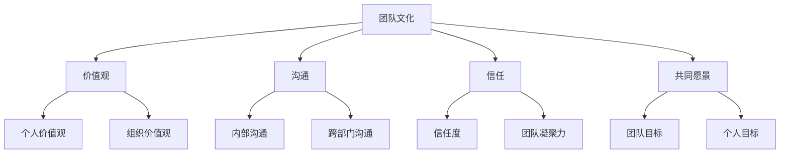

### 1.2 团队文化与个人价值观的关系

团队文化与个人价值观之间存在着紧密的联系。个人价值观是指个人在日常生活中所秉持的信念和原则，而团队文化则是团队成员共同认可的价值观。当个人的价值观与团队文化相一致时，团队成员会更加投入工作，提高工作效率和满意度。

#### 核心概念与联系

个人价值观（Personal Values）是指个人在面临决策时，所依据的信念和原则。团队文化（Team Culture）是指团队成员共同遵守的价值观、信仰、行为规范和工作习惯。

Mermaid 流程图：

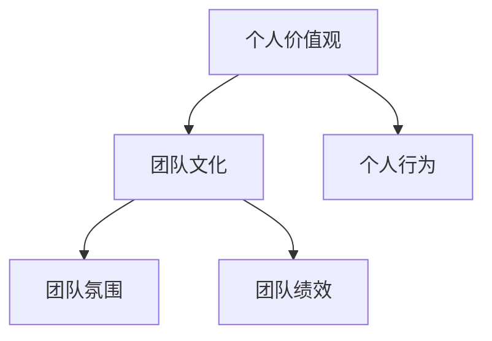

### 1.3 团队文化的核心要素

团队文化的核心要素包括价值观、沟通、信任和共同愿景。这些要素共同构成了团队文化的基石，对团队的稳定性和绩效有着重要影响。

#### 核心概念与联系

- **价值观**：价值观是团队文化的核心，是团队成员共同追求的目标和行为准则。
- **沟通**：沟通是团队文化的重要组成部分，有效的沟通能够促进团队成员之间的理解和协作。
- **信任**：信任是团队文化的基础，团队成员之间的信任能够提高团队的凝聚力和合作效率。
- **共同愿景**：共同愿景是团队文化的方向，是团队成员共同追求的目标和愿景。

Mermaid 流程图：

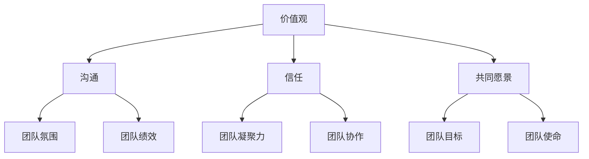

## 第2章：团队文化的定义与理论框架

### 2.1 团队文化的概念

团队文化是指一个团队在长期发展过程中，形成的共同价值观、信仰、行为规范和工作习惯。团队文化不仅体现在团队成员的言行举止中，还渗透到组织的各个方面，包括决策过程、工作流程和员工关系等。

#### 核心概念与联系

- **团队文化**：一个团队在长期发展过程中，形成的共同价值观、信仰、行为规范和工作习惯。
- **价值观**：团队文化的核心，是团队成员共同追求的目标和行为准则。
- **信仰**：团队成员对团队文化和价值观的信任和忠诚。
- **行为规范**：团队成员在团队内部和外部的行为标准。
- **工作习惯**：团队成员在日常工作中的行为模式。

Mermaid 流程图：

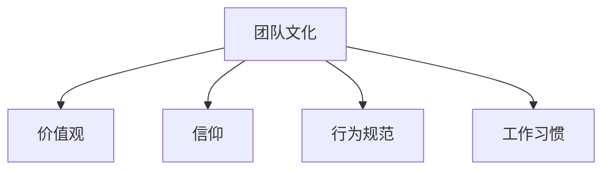

### 2.2 团队文化理论的发展

团队文化理论的发展经历了多个阶段。早期的团队文化理论主要关注团队内部的互动和协作，而现代团队文化理论则更加注重团队与外部环境的互动和适应。

#### 核心概念与联系

- **早期团队文化理论**：主要关注团队内部的互动和协作，如Tuckman的团队发展模型。
- **现代团队文化理论**：更加注重团队与外部环境的互动和适应，如组织生态学理论。

Mermaid 流程图：

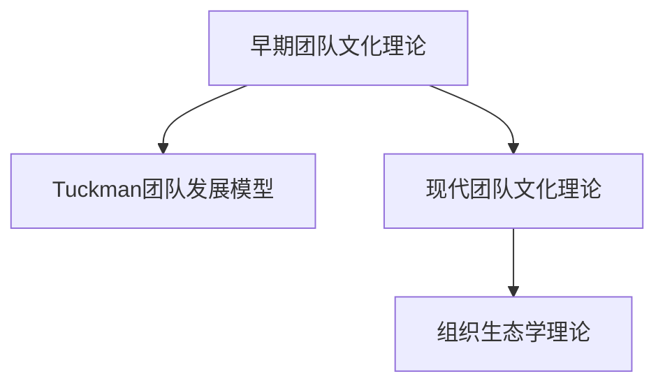

### 2.3 团队文化与组织绩效的关系

团队文化对组织绩效有着重要影响。研究表明，健康、积极的团队文化能够提高团队成员的工作满意度、团队凝聚力和创新能力，从而提高组织的整体绩效。

#### 核心概念与联系

- **组织绩效**：组织在财务、市场、人力资源等方面的表现。
- **团队文化**：影响团队成员行为和团队互动的价值观、信仰和行为规范。

Mermaid 流程图：

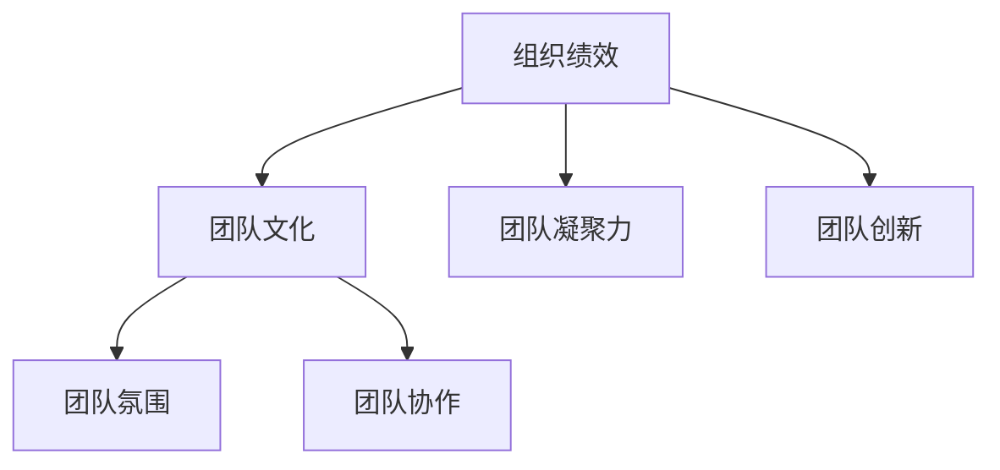

## 第3章：价值观的塑造

### 3.1 价值观的定义

价值观是指人们在面对不同选择时，依据自己的信念和原则所做出的决策。价值观是个人行为和决策的基础，也是团队文化的核心要素。

#### 核心概念与联系

- **价值观**：人们在面对不同选择时，依据自己的信念和原则所做出的决策。
- **信念**：价值观的基础，是人们内心深处坚信的东西。
- **原则**：价值观的具体体现，是人们在行为和决策中遵循的标准。

Mermaid 流程图：

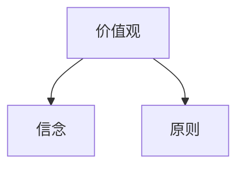

### 3.2 价值观的类型与特点

价值观可以分为多种类型，如道德价值观、职业价值观和生活价值观等。每种价值观都有其独特的特点和表现形式。

#### 核心概念与联系

- **道德价值观**：关注道德规范和伦理标准，如诚信、公平、尊重等。
- **职业价值观**：关注职业发展和职业成就，如敬业、创新、合作等。
- **生活价值观**：关注个人生活品质和家庭幸福，如家庭、健康、休闲等。

Mermaid 流程图：

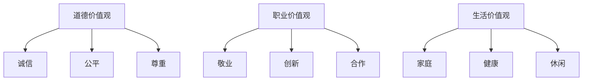

### 3.3 塑造团队价值观的策略

塑造团队价值观需要从多个方面入手，包括制定明确的目标、培养共同信仰、强化行为规范等。

#### 核心概念与联系

- **明确目标**：明确团队的目标和愿景，使团队成员有共同的方向。
- **共同信仰**：培养团队成员对团队文化和价值观的信仰和忠诚。
- **行为规范**：制定明确的行为规范，引导团队成员的行为和决策。

Mermaid 流程图：

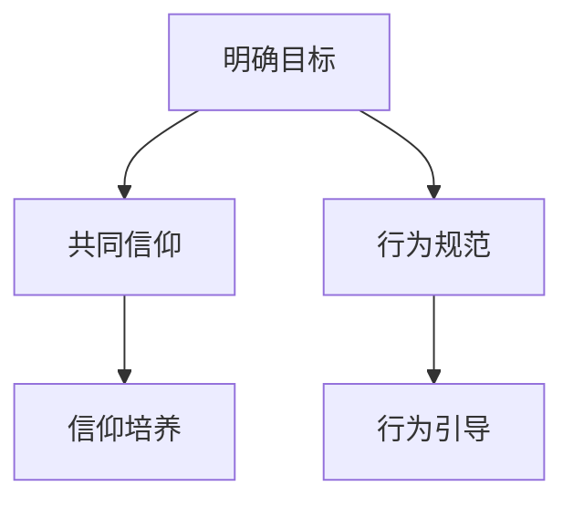

## 第4章：价值观传播的机制与路径

### 4.1 价值观传播的概念

价值观传播是指团队中的价值观通过不同途径传递和普及的过程。价值观传播是团队文化建设的重要组成部分，对于塑造和维护团队文化具有重要意义。

#### 核心概念与联系

- **价值观传播**：团队中的价值观通过不同途径传递和普及的过程。
- **传播途径**：价值观传播的渠道，如领导行为、团队活动、内部沟通等。
- **普及过程**：价值观在团队中广泛传播和接受的过程。

Mermaid 流程图：

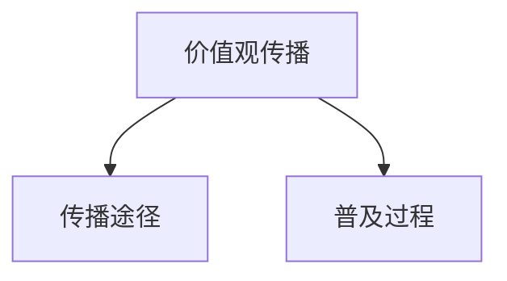

### 4.2 价值观传播的机制

价值观传播的机制包括传播渠道、传播过程和传播效果三个主要方面。了解价值观传播的机制有助于我们更好地推动团队文化的建设。

#### 核心概念与联系

- **传播渠道**：价值观传播的途径，如领导行为、团队活动、内部沟通等。
- **传播过程**：价值观在团队中传递和接受的过程。
- **传播效果**：价值观传播对团队文化的影响和效果。

Mermaid 流程图：

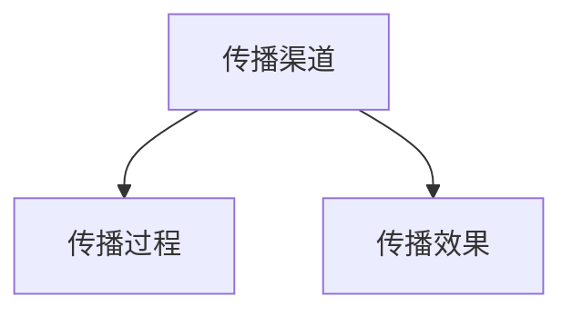

### 4.3 价值观传播的路径

价值观传播的路径可以分为内部传播和外部传播两种。内部传播主要是在团队内部进行，如领导行为、团队活动和内部沟通等；外部传播则是通过团队与外部环境的互动进行，如客户关系、市场宣传等。

#### 核心概念与联系

- **内部传播**：团队内部的价值观传播，如领导行为、团队活动和内部沟通等。
- **外部传播**：团队与外部环境的价值观传播，如客户关系、市场宣传等。

Mermaid 流程图：

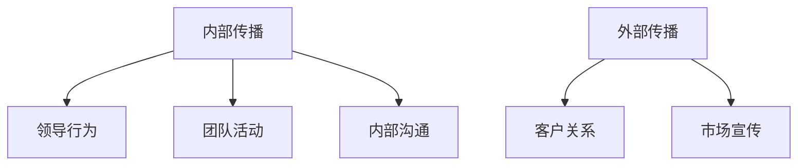

## 第5章：构建积极团队文化的实践

### 5.1 建立共同愿景

建立共同愿景是构建积极团队文化的第一步。共同愿景能够为团队成员提供方向和动力，使团队成员为实现共同目标而努力。

#### 核心概念与联系

- **共同愿景**：团队成员共同追求的目标和愿景。
- **方向**：共同愿景为团队成员提供明确的方向。
- **动力**：共同愿景能够激发团队成员的积极性和创造力。

Mermaid 流程图：

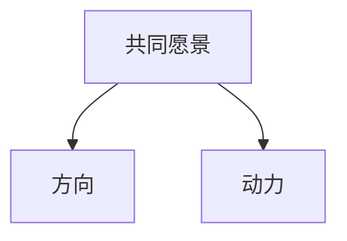

### 5.2 强化团队沟通

强化团队沟通是构建积极团队文化的关键。有效的沟通能够促进团队成员之间的理解和协作，提高团队的整体绩效。

#### 核心概念与联系

- **团队沟通**：团队成员之间的信息交流和互动。
- **理解**：有效的沟通能够促进团队成员之间的理解。
- **协作**：团队沟通能够提高团队成员的协作效率。

Mermaid 流程图：

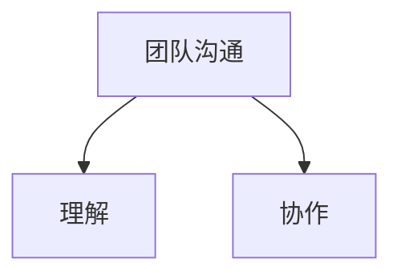

### 5.3 培养团队信任

培养团队信任是构建积极团队文化的基石。团队成员之间的信任能够提高团队的凝聚力和合作效率。

#### 核心概念与联系

- **团队信任**：团队成员之间的信任和信赖。
- **凝聚力**：团队信任能够增强团队的凝聚力。
- **合作效率**：团队信任能够提高团队的合作效率。

Mermaid 流�程图：

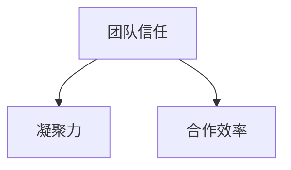

### 5.4 促进团队创新

促进团队创新是构建积极团队文化的重要方面。团队创新能够推动团队的持续发展，提高团队的竞争力。

#### 核心概念与联系

- **团队创新**：团队成员在创新思维和方法上的实践。
- **持续发展**：团队创新能够推动团队的持续发展。
- **竞争力**：团队创新能够提高团队的竞争力。

Mermaid 流程图：

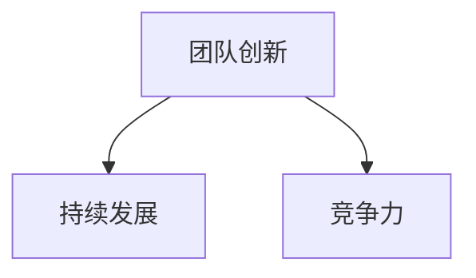

## 第6章：团队文化建设案例分析

### 6.1 成功案例分析

成功团队文化案例有助于我们理解团队文化建设的有效方法。以下是一些成功团队文化的案例：

#### 案例一：谷歌（Google）

谷歌以其开放、创新和以员工为中心的文化而闻名。谷歌的创始人拉里·佩奇和谢尔盖·布林提倡员工自由探索和尝试新事物，这种文化鼓励了员工创造力和创新精神。谷歌还通过定期的团队建设活动和透明的沟通机制来强化团队凝聚力。

**成功原因分析**：

- **共同愿景**：谷歌的愿景是组织世界的信息，这一愿景为员工提供了明确的方向。
- **信任与支持**：谷歌鼓励员工冒险和失败，并提供了必要的支持，以促进创新和持续学习。
- **持续改进**：谷歌不断评估和改进其文化，以保持其竞争力。

#### 案例二：特斯拉（Tesla）

特斯拉以其快速迭代、敏捷开发和注重实践的文化而著称。埃隆·马斯克通过其领导风格和对创新的追求，推动了特斯拉在电动汽车和可再生能源领域的快速发展。

**成功原因分析**：

- **领导者的榜样作用**：马斯克的领导风格和对创新的热情激励了员工。
- **扁平化的组织结构**：特斯拉的组织结构较为扁平，减少了沟通障碍，提高了决策效率。
- **用户导向**：特斯拉始终关注用户需求，这一文化价值观促使团队不断改进产品和服务。

### 6.2 失败案例分析

团队文化建设的失败案例也能为我们提供宝贵的教训。以下是一些失败团队文化的案例：

#### 案例一：安然公司（Enron）

安然公司因财务欺诈和公司文化的腐化而倒闭。公司的领导层过于追求短期利益，忽视了道德和合规性，导致公司文化的崩溃。

**失败原因分析**：

- **利益冲突**：公司的管理层与股东之间存在利益冲突，导致决策偏差。
- **缺乏监督和问责**：公司内部缺乏有效的监督和问责机制，导致问题长期存在。
- **忽视员工需求**：公司忽视了员工的意见和建议，导致员工士气低落。

#### 案例二：诺基亚（Nokia）

诺基亚在智能手机市场的失败，部分原因在于其僵化的企业文化。公司过于依赖其传统成功的产品，忽视了市场变化和竞争对手的挑战。

**失败原因分析**：

- **缺乏创新**：诺基亚未能及时适应市场变化，忽视了创新的重要性。
- **组织惯性**：公司的组织结构和文化导致决策缓慢，无法迅速响应市场变化。
- **忽视客户需求**：公司未能及时满足客户需求，导致市场份额下降。

### 6.3 案例启示

成功和失败的团队文化案例都为我们提供了宝贵的经验教训。以下是一些关键启示：

- **共同愿景**：明确的共同愿景能够为团队提供方向和动力。
- **信任与支持**：团队信任和员工支持是创新和持续发展的基石。
- **持续改进**：不断评估和改进团队文化有助于保持竞争力。
- **领导者的榜样作用**：领导者的行为和价值观对团队文化有重大影响。
- **关注客户需求**：满足客户需求是保持市场地位的关键。

## 第7章：团队文化评估与持续改进

### 7.1 团队文化评估的方法

团队文化评估是了解团队文化现状、识别问题并制定改进策略的重要步骤。以下是一些常用的团队文化评估方法：

#### 核心概念与联系

- **问卷调查**：通过设计问卷，收集团队成员对团队文化的看法和建议。
- **访谈**：与团队成员进行一对一或小组访谈，深入了解团队文化现状。
- **观察法**：通过观察团队成员的行为和互动，评估团队文化。
- **关键绩效指标（KPI）**：使用关键绩效指标评估团队文化的效果。

Mermaid 流�程图：

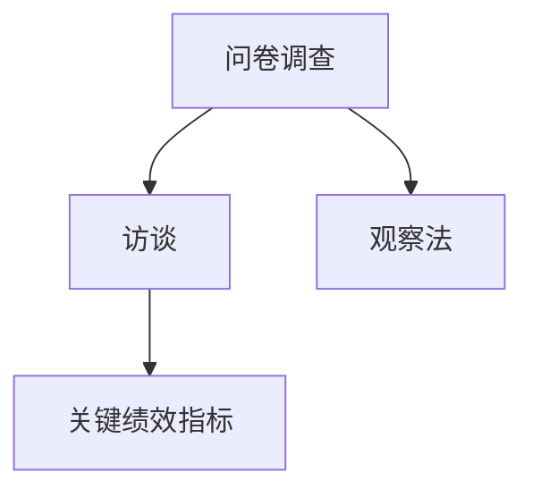

### 7.2 团队文化评估的指标

团队文化评估需要使用一系列指标来衡量文化建设的成效。以下是一些常用的评估指标：

#### 核心概念与联系

- **员工满意度**：评估团队成员对团队文化的满意度。
- **团队凝聚力**：评估团队成员之间的凝聚力和协作程度。
- **员工忠诚度**：评估员工对组织的忠诚度和留任意愿。
- **创新氛围**：评估团队对创新的鼓励和支持程度。
- **沟通效率**：评估团队成员之间的沟通效果和效率。

Mermaid 流程图：

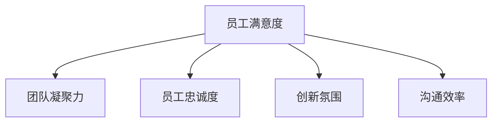

### 7.3 团队文化的持续改进

团队文化的持续改进是一个动态过程，需要不断地评估、调整和优化。以下是一些关键步骤：

#### 核心概念与联系

- **定期评估**：定期进行团队文化评估，以了解文化建设的成效和问题。
- **制定改进计划**：根据评估结果，制定具体的改进计划，包括措施和目标。
- **执行与监控**：执行改进计划，并监控文化建设的进度和效果。
- **反馈与调整**：根据反馈和评估结果，调整改进计划，以实现持续优化。

Mermaid 流程图：

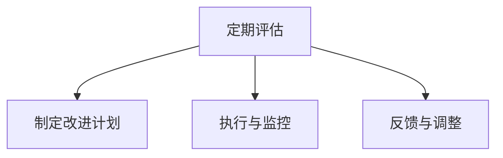

## 第8章：团队文化与组织变革

### 8.1 团队文化与组织变革的关系

团队文化与组织变革之间存在着密切的关系。团队文化是组织变革的基础，而组织变革也会对团队文化产生深远影响。一个健康的团队文化能够支持组织变革，提高变革的成效。

#### 核心概念与联系

- **团队文化**：团队文化的核心价值观、信仰和行为规范。
- **组织变革**：组织为了适应外部环境变化而进行的调整和改进。
- **变革管理**：通过有效管理变革，确保团队文化在变革过程中保持稳定和持续发展。

Mermaid 流程图：

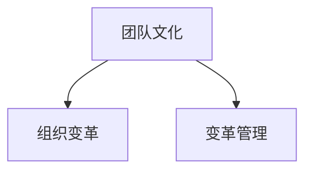

### 8.2 变革中的团队文化挑战

在组织变革过程中，团队文化面临着一系列挑战，包括员工抵触、文化冲突和资源限制等。这些挑战需要通过有效的变革管理策略来应对。

#### 核心概念与联系

- **员工抵触**：员工对变革的抵触情绪，可能源于对未知的恐惧或对现有文化的依赖。
- **文化冲突**：新的文化理念与现有文化之间的冲突，可能导致团队成员的困惑和不安。
- **资源限制**：变革过程中可能面临的资源限制，如时间、资金和人力等。

Mermaid 流程图：

```mermaid
graph TD
    A[员工抵触] --> B[文化冲突]
    A --> C[资源限制]
```

### 8.3 应对变革的团队文化策略

为了应对变革中的团队文化挑战，组织需要采取一系列策略，包括：

- **建立变革共识**：通过沟通和教育，让团队成员了解变革的必要性和好处，增强对变革的支持。
- **培养变革领袖**：选拔和培养具备变革能力的领导者，发挥他们的榜样作用，推动变革的执行。
- **优化团队沟通**：通过有效的沟通，确保团队成员了解变革的进程和目标，减少误解和冲突。
- **提供支持与培训**：为团队成员提供必要的支持与培训，帮助他们适应新的文化和工作方式。

Mermaid 流程图：

```mermaid
graph TD
    A[建立变革共识] --> B[培养变革领袖]
    A --> C[优化团队沟通]
    A --> D[提供支持与培训]
```

## 第9章：全球团队文化的多样性

### 9.1 全球团队文化的特点

全球团队文化的多样性体现在不同国家和地区的团队文化差异上。了解这些特点有助于我们更好地应对跨文化团队合作中的挑战。

#### 核心概念与联系

- **权力距离**：不同文化中，权力分配和权力行使的差异。
- **集体主义与个人主义**：不同文化中，个人与集体关系的不同侧重。
- **沟通风格**：不同文化中，沟通方式的表达和接受方式。

Mermaid 流程图：

```mermaid
graph TD
    A[权力距离] --> B[集体主义与个人主义]
    A --> C[沟通风格]
```

### 9.2 跨文化沟通与合作

跨文化沟通与合作是全球化背景下团队文化的重要体现。有效的跨文化沟通与合作能够促进团队的整体绩效，提高组织的国际竞争力。

#### 核心概念与联系

- **文化敏感性**：对不同文化背景的敏感性和理解力。
- **沟通策略**：适应不同文化背景的沟通策略和方法。
- **合作模式**：不同文化背景下的合作模式和团队结构。

Mermaid 流程图：

```mermaid
graph TD
    A[文化敏感性] --> B[沟通策略]
    A --> C[合作模式]
```

### 9.3 多元文化团队的挑战与机遇

多元文化团队在带来机遇的同时，也面临着一系列挑战。了解这些挑战和机遇有助于我们更好地应对全球化背景下的团队文化问题。

#### 核心概念与联系

- **挑战**：文化冲突、沟通障碍、团队协作问题等。
- **机遇**：多元化视角、创新思维、市场拓展等。

Mermaid 流程图：

```mermaid
graph TD
    A[挑战] --> B[文化冲突]
    A --> C[沟通障碍]
    A --> D[团队协作问题]
    E[机遇] --> F[多元化视角]
    E --> G[创新思维]
    E --> H[市场拓展]
```

## 第10章：未来团队文化的趋势与展望

### 10.1 科技对团队文化的影响

随着科技的不断发展，团队文化也在经历着深刻的变革。人工智能、大数据、云计算等技术的应用，不仅改变了团队的工作方式，也影响了团队文化的塑造和传播。

#### 核心概念与联系

- **数字化工作环境**：科技带来的数字化工作环境，使得团队文化更加灵活和开放。
- **远程办公**：远程办公的普及，要求团队文化适应新的工作模式。
- **技术创新**：科技推动创新，要求团队文化鼓励创新和持续学习。

Mermaid 流程图：

```mermaid
graph TD
    A[数字化工作环境] --> B[远程办公]
    A --> C[技术创新]
```

### 10.2 数字化时代的团队文化变革

在数字化时代，团队文化面临着新的挑战和机遇。数字化技术不仅改变了团队的工作方式，也推动了团队文化的变革。

#### 核心概念与联系

- **数字化价值观**：数字化时代下的价值观，如透明度、协作、创新等。
- **数字化行为规范**：适应数字化工作环境的团队行为规范。
- **数字化沟通与协作**：数字化工具和平台在沟通与协作中的应用。

Mermaid 流程图：

```mermaid
graph TD
    A[数字化价值观] --> B[数字化行为规范]
    A --> C[数字化沟通与协作]
```

### 10.3 未来团队文化的趋势与展望

未来团队文化将更加注重数字化、灵活化和创新性。随着科技的发展和全球化的推进，团队文化将不断变革，以适应新的环境和需求。

#### 核心概念与联系

- **数字化团队文化**：以数字化价值观和行为规范为核心，推动团队文化的数字化转型。
- **灵活化团队文化**：适应远程办公和多元文化团队合作，提高团队的灵活性和适应性。
- **创新性团队文化**：鼓励创新和持续学习，推动团队的持续发展。

Mermaid 流程图：

```mermaid
graph TD
    A[数字化团队文化] --> B[灵活化团队文化]
    A --> C[创新性团队文化]
```

## 附录

### A.1 团队文化相关研究文献

以下是一些关于团队文化的研究文献，供读者进一步阅读：

1. Denison, D. R., Hooijberg, R., Lane, H. C., & Lief, J. (1995). Corporate culture and organizational effectiveness: The effects of culture on organizational performance. Organizational Dynamics, 23(4), 22-45.
2. Schein, E. H. (1990). Organizational culture and leadership (3rd ed.). Jossey-Bass.
3. Yammarino, F. J., & Piccolo, R. F. (2007). A meta-analytic investigation of the relationships between team culture and team effectiveness. Journal of Applied Psychology, 92(1), 262-271.

### A.2 团队文化建设工具与方法

以下是一些常用的团队文化建设工具和方法：

1. **团队建设工作坊**：通过小组讨论、角色扮演和模拟活动，帮助团队成员了解和塑造团队文化。
2. **价值观评估工具**：如“文化评估量表”和“团队价值观识别工具”，帮助团队识别和明确核心价值观。
3. **沟通培训**：通过沟通技巧培训，提高团队成员的沟通效果和协作能力。

### A.3 团队文化评估量表与问卷设计

以下是一个简单的团队文化评估量表设计示例：

1. **评估指标**：包括员工满意度、团队凝聚力、创新氛围、沟通效率等。
2. **评估方法**：采用问卷调查法，收集团队成员对各项指标的评分和建议。
3. **数据分析**：使用统计方法（如因子分析、聚类分析等）对评估结果进行分析，以了解团队文化的现状和问题。

### A.4 参考文献

1. Denison, D. R., Hooijberg, R., Lane, H. C., & Lief, J. (1995). Corporate culture and organizational effectiveness: The effects of culture on organizational performance. Organizational Dynamics, 23(4), 22-45.
2. Schein, E. H. (1990). Organizational culture and leadership (3rd ed.). Jossey-Bass.
3. Yammarino, F. J., & Piccolo, R. F. (2007). A meta-analytic investigation of the relationships between team culture and team effectiveness. Journal of Applied Psychology, 92(1), 262-271.

## 附录B：团队文化核心概念与联系

为了更好地理解团队文化的核心概念与联系，以下是一个Mermaid流程图，展示了团队文化中关键要素之间的关系：

```mermaid
graph TD
    A[团队文化] --> B[价值观]
    A --> C[沟通]
    A --> D[信任]
    A --> E[共同愿景]
    B --> F[个人价值观]
    B --> G[组织价值观]
    C --> H[内部沟通]
    C --> I[跨部门沟通]
    D --> J[信任度]
    D --> K[团队凝聚力]
    E --> L[团队目标]
    E --> M[个人目标]
```

## 附录C：核心算法原理讲解

### 3.1 价值观识别算法

以下是一个用于识别团队核心价值观的算法原理，使用伪代码进行描述：

```python
# 伪代码：价值观识别算法

# 输入：values_list 为包含团队成员个人价值观的列表
# 输出：识别出的团队核心价值观

# 步骤1：初始化团队核心价值观为空
core_values = []

# 步骤2：对 values_list 进行排序
sorted_values = sort(values_list)

# 步骤3：从排序后的列表中选取出现次数最多的前 n 个价值观
top_values = get_top_values(sorted_values, n)

# 步骤4：将选取的价值观添加到核心价值列表中
for value in top_values:
    if not in_list(value, core_values):
        core_values.append(value)

# 步骤5：返回团队核心价值观
return core_values
```

### 7.1 价值观传播模型

以下是一个用于描述价值观传播过程的数学模型，使用LaTeX格式进行描述：

$$
\frac{dV}{dt} = k \cdot (C_0 - V)
$$

其中，$V$ 表示价值观传播速率，$C_0$ 表示初始价值观水平，$k$ 表示传播系数。

### 附录D：项目实战

### 8.1 团队文化评估项目实战

#### 开发环境搭建

- 安装Python 3.8及以上版本
- 安装Pandas、NumPy、Matplotlib等数据科学库

#### 源代码实现

```python
import pandas as pd
import numpy as np
import matplotlib.pyplot as plt

# 读取团队文化评估数据
data = pd.read_csv('team_culture_evaluation.csv')

# 数据预处理
# ...

# 评估指标计算
# ...

# 可视化展示
plt.scatter(data['指标1'], data['指标2'])
plt.xlabel('指标1')
plt.ylabel('指标2')
plt.title('团队文化评估指标散点图')
plt.show()
```

#### 代码解读与分析

- 读取团队文化评估数据，并进行预处理。
- 计算各项评估指标，如员工满意度、团队凝聚力等。
- 使用Matplotlib库绘制评估指标的散点图，以直观展示团队文化评估结果。

### 实际案例分析和详细讲解剖析

- 以某企业团队文化评估为例，分析评估指标的变化趋势和影响因素。
- 通过对比不同团队之间的评估结果，找出团队文化建设的优势和不足。

### 项目小结

通过团队文化评估项目实战，我们了解了团队文化评估的方法和工具。在实际应用中，应根据具体情况调整评估指标和评估方法，以提高评估的准确性和实用性。

### 最佳实践 Tips

- 定期进行团队文化评估，以了解文化建设的成效和问题。
- 结合评估结果，制定针对性的改进措施，促进团队文化的持续优化。

### 注意事项

- 确保评估数据的真实性和可靠性，避免评估结果失真。
- 在评估过程中，注重与团队成员的沟通，确保评估过程的公正性和透明度。

### 拓展阅读

- 《团队文化：构建高绩效团队的关键》
- 《组织行为学：团队行为与团队文化》
- 《企业文化：塑造组织的灵魂》

作者：AI天才研究院/AI Genius Institute & 禅与计算机程序设计艺术 /Zen And The Art of Computer Programming

