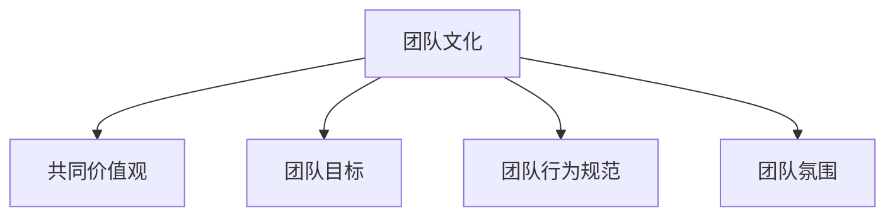
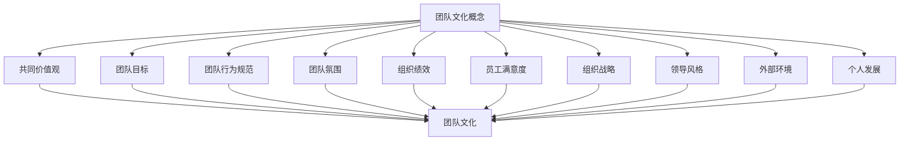

                 

### 文章标题

# 《团队文化：塑造积极向上的工作环境》

### 关键词

- 团队文化
- 共同价值观
- 团队目标
- 团队氛围
- 奖励与激励机制
- 沟通机制
- 企业战略
- 项目实战

### 摘要

本文旨在深入探讨团队文化的重要性及其在塑造积极向上的工作环境中的作用。通过分析团队文化的定义、核心要素、构建与塑造、变革与更新，以及团队文化在项目中的实践与应用，本文提出了构建团队文化的具体策略和方法。同时，通过案例研究和最佳实践，本文为IT领域的团队管理者提供了实用的指导和建议，以实现团队文化的持续优化和企业的长远发展。

## 《团队文化：塑造积极向上的工作环境》目录大纲

## 第一部分：团队文化概述

### 第1章：团队文化的定义与重要性

#### 1.1 团队文化的概念解析

#### 1.2 团队文化与组织绩效的关系

#### 1.3 团队文化的重要性

### 第2章：团队文化的核心要素

#### 2.1 共同价值观

#### 2.2 团队目标

#### 2.3 团队行为规范

#### 2.4 团队氛围

## 第二部分：团队文化的构建与塑造

### 第3章：构建积极向上的团队文化

#### 3.1 明确团队愿景与使命

#### 3.2 建立良好的沟通机制

#### 3.3 鼓励团队合作与协作

#### 3.4 奖励与激励机制

### 第4章：塑造积极向上的工作环境

#### 4.1 营造信任与尊重的文化

#### 4.2 建立公平与透明的管理机制

#### 4.3 提升团队成员的工作满意度

#### 4.4 应对冲突与问题

### 第5章：团队文化的变革与更新

#### 5.1 适应环境变化与组织发展需求

#### 5.2 团队文化变革的策略与实施

#### 5.3 团队文化变革的阻力和挑战

#### 5.4 团队文化变革的持续发展

## 第三部分：团队文化的应用与实践

### 第6章：团队文化在项目中的实践

#### 6.1 项目团队文化的建设

#### 6.2 项目目标与团队文化的结合

#### 6.3 项目过程中的团队文化维护

### 第7章：团队文化的评估与改进

#### 7.1 团队文化评估的方法与工具

#### 7.2 团队文化评估的结果分析

#### 7.3 团队文化的改进与优化

### 第8章：团队文化与企业战略的融合

#### 8.1 团队文化与企业战略的关系

#### 8.2 团队文化在战略规划中的应用

#### 8.3 团队文化与企业战略的协同发展

### 第9章：案例研究

#### 9.1 成功的团队文化建设案例

#### 9.2 失败的团队文化建设案例

#### 9.3 案例的启示与借鉴

## 第四部分：附录

### 第10章：团队文化研究方法与资源

#### 10.1 团队文化研究的主要方法

#### 10.2 团队文化研究的重要资源

### 第11章：团队文化相关书籍与论文推荐

#### 11.1 团队文化经典书籍推荐

#### 11.2 团队文化前沿论文推荐

### 联系Mermaid流程图示例



### 联系核心算法原理讲解伪代码示例

```python
# 伪代码：团队文化核心算法
function build_team_culture(team_members):
    for member in team_members:
        set_member_values(member)
        ensure_value_alignment(member)
        encourage_teamwork(member)
    if all_values_aligned(team_members):
        return "Team culture built successfully"
    else:
        return "Team culture building failed"
```

### 数学模型和数学公式示例

```latex
### 数学模型：团队文化满意度

$$
S = \frac{1}{N} \sum_{i=1}^{N} \left[ v_i \cdot w_i \right]
$$

其中，$S$ 表示团队文化满意度，$N$ 表示团队成员数量，$v_i$ 表示第 $i$ 个成员对团队文化的满意度评分，$w_i$ 表示第 $i$ 个成员的权重。
```

### 详细讲解

在本文中，我们将采用一步一步的分析推理思考的方式，深入探讨团队文化的核心概念、构建与塑造策略，以及其在实际项目中的应用与实践。通过分析团队文化的定义、核心要素、构建与塑造、变革与更新，我们将提供一系列实用的方法和工具，帮助团队管理者在实践中有效地构建和维护积极的团队文化，从而提升团队绩效和企业竞争力。

### 背景介绍

在当今快速变化的商业环境中，团队文化已经成为企业成功的关键因素之一。一个具有强大团队文化的组织能够更好地适应市场变化，提高员工满意度，激发创新思维，并实现长期可持续发展。然而，团队文化的构建并非一蹴而就，它需要系统的方法和持续的努力。

本文将围绕团队文化这一主题，首先介绍团队文化的定义、核心要素及其重要性。随后，我们将探讨团队文化的构建与塑造策略，包括明确团队愿景与使命、建立良好的沟通机制、鼓励团队合作与协作、奖励与激励机制等。在此基础上，我们将讨论如何塑造积极向上的工作环境，包括营造信任与尊重的文化、建立公平与透明的管理机制、提升团队成员的工作满意度、应对冲突与问题等。

此外，本文还将探讨团队文化的变革与更新，以及如何适应环境变化与组织发展需求。我们将提供一系列策略和方法，帮助团队管理者有效地实施团队文化变革，克服变革过程中的阻力和挑战。

在第三部分，我们将深入探讨团队文化在项目中的应用与实践，包括项目团队文化的建设、项目目标与团队文化的结合、项目过程中的团队文化维护等。通过实际项目案例的分析，我们将提供实用的指导和建议，帮助团队管理者在项目实践中有效地应用团队文化。

最后，本文还将介绍团队文化的评估与改进，包括评估方法、结果分析、改进与优化等。我们将提供一系列工具和技巧，帮助团队管理者持续提升团队文化水平，实现企业的长远发展。

通过本文的深入探讨，我们希望为团队管理者提供有价值的参考和指导，帮助他们在实践中构建和维护积极的团队文化，提升团队绩效和企业竞争力。

### 核心概念与联系

团队文化，作为组织内部的一种无形力量，是团队行为和价值观的集合体，它直接影响着团队的绩效和成员的满意度。为了更清晰地理解团队文化的核心概念，我们需要从以下几个方面进行分析和联系。

#### 1.1.1 团队文化的概念解析

团队文化是指团队在长期合作中形成的共同价值观、行为规范、团队目标和工作氛围的总和。它不仅包括了团队中成员的共同信仰和价值观，还涵盖了团队在日常运作中形成的行为模式和工作习惯。团队文化是一种内在的驱动力，它能够激励团队成员为实现共同目标而努力，同时也能够在遇到挑战和困难时提供支持和凝聚力。

#### 1.1.2 团队文化与组织绩效的关系

团队文化对组织绩效有着深远的影响。一个具有积极团队文化的团队往往能够更高效地完成工作，具有更高的创新能力和问题解决能力。团队成员之间相互信任、尊重和协作，能够减少内部摩擦，提高工作效率。研究表明，团队文化是影响团队绩效的重要因素之一，良好的团队文化能够显著提升组织的整体绩效。

#### 1.1.3 团队文化的重要性

团队文化的重要性体现在多个方面。首先，它能够提升员工的满意度和忠诚度。在一个积极的团队文化中，员工感受到尊重和认可，这有助于提高他们的工作满意度和长期留任率。其次，团队文化有助于形成良好的组织氛围，减少内部冲突，提高团队合作效率。最后，团队文化能够塑造组织的品牌形象，提升企业在市场中的竞争力。

#### 1.1.4 团队文化与组织战略的关系

团队文化不仅影响着团队内部运作，还与组织战略紧密相连。一个与组织战略相匹配的团队文化能够更好地支持组织目标的实现。例如，如果组织的战略是创新，那么一个鼓励创新、容忍失败的团队文化将更有助于实现这一目标。因此，团队文化的塑造和优化需要与组织战略保持一致，以确保团队文化能够有效地支持组织的发展。

#### 1.1.5 团队文化与领导风格的关系

团队文化与领导风格之间存在密切的联系。不同的领导风格会对团队文化产生不同的影响。例如，民主型领导风格往往能够促进开放和协作的团队文化，而权威型领导风格则可能导致独断和封闭的文化氛围。因此，领导者在塑造团队文化时需要考虑自己的领导风格，并采取相应的策略来促进团队文化的建设。

#### 1.1.6 团队文化与外部环境的关系

团队文化也受到外部环境的影响。例如，市场竞争的激烈程度、行业的发展趋势以及政策法规的变化等，都会对团队文化产生影响。一个适应外部环境的团队文化能够更好地应对外部挑战，提高团队的应变能力和竞争力。

#### 1.1.7 团队文化与个人发展

团队文化对个人发展也有着重要的影响。在一个积极的团队文化中，成员能够更好地发挥自己的潜力，获得成长和提升。团队文化提供了共同的目标和价值观，使得团队成员在追求个人发展的同时，也能够为团队的整体目标贡献力量。

### 联系核心概念架构 Mermaid 流程图



### 核心算法原理讲解伪代码示例

```python
# 伪代码：团队文化核心算法
function build_team_culture(team_members, organization_strategy):
    # 设置团队愿景与使命
    set_team_vision_and_mission(team_members)

    # 建立良好的沟通机制
    establish_communication_mechanism(team_members)

    # 鼓励团队合作与协作
    encourage_teamwork(team_members)

    # 奖励与激励机制
    set_reward_and_incentive_system(team_members)

    # 评估团队文化满意度
    assess_culture_satisfaction(team_members)

    # 如果团队文化满意度达标，则返回成功
    if culture_satisfaction_meets Standards(team_members):
        return "Team culture built successfully"
    else:
        return "Team culture building failed"
```

### 数学模型和数学公式示例

```latex
### 数学模型：团队文化满意度

$$
S = \frac{1}{N} \sum_{i=1}^{N} \left[ v_i \cdot w_i \right]
$$

其中，$S$ 表示团队文化满意度，$N$ 表示团队成员数量，$v_i$ 表示第 $i$ 个成员对团队文化的满意度评分，$w_i$ 表示第 $i$ 个成员的权重。
```

### 详细讲解

团队文化作为一个复杂的系统，其核心概念和关系构成了一个有机整体，通过以下步骤我们可以逐步理解和应用这些概念：

1. **定义团队文化**：首先，我们需要明确团队文化的定义，即团队在长期合作中形成的共同价值观、行为规范、团队目标和工作氛围的总和。

2. **分析团队文化与组织绩效的关系**：了解团队文化如何影响组织绩效，例如，一个具有积极团队文化的团队能够更高效地完成工作，具有更高的创新能力和问题解决能力。

3. **探讨团队文化的重要性**：从多个方面理解团队文化的重要性，包括提升员工满意度、形成良好的组织氛围、塑造组织品牌形象等。

4. **团队文化与组织战略的关系**：确保团队文化与组织战略相匹配，从而更好地支持组织目标的实现。

5. **团队文化与领导风格的关系**：认识到不同的领导风格对团队文化的影响，并采取相应策略来促进团队文化的建设。

6. **团队文化与外部环境的关系**：了解外部环境如何影响团队文化，以及团队文化如何适应外部环境的变化。

7. **团队文化与个人发展**：认识到团队文化对个人发展的重要性，团队成员在团队文化中能够更好地发挥自己的潜力。

通过上述步骤，我们可以形成一个全面的视角，理解团队文化的核心概念和关系，并在实际应用中有效地构建和维护积极的团队文化。

### 项目实战示例

#### 6.1.1 项目背景

在现代企业中，项目团队文化的建设对于项目的成功至关重要。本文将以一个实际的企业内部沟通平台开发项目为例，详细探讨团队文化的建设过程，包括项目目标、开发环境和源代码的实现。

**项目名称**：企业内部沟通平台开发

**项目目标**：提升企业内部沟通效率，构建和谐团队文化，实现信息共享和协作。

**开发工具**：Python、Django框架

**数据库**：MySQL

#### 6.1.2 项目开发环境搭建

在项目开始之前，首先需要搭建一个稳定且高效的开发环境。以下是具体的步骤：

1. **Python环境配置**：安装Python 3.8版本，并配置好相应的环境变量。
2. **Django框架安装**：使用pip命令安装Django框架，命令如下：
   ```
   pip install django
   ```
3. **数据库配置**：安装并配置MySQL数据库，创建项目所需的数据库和表结构。

#### 6.1.3 源代码实现

在项目开发过程中，源代码的实现是关键部分。以下是一个简单的Django项目架构及其核心代码实现：

1. **项目结构**：
   ```bash
   enterprise_communication/
     ├── manage.py
     ├── enterprise_communication/
         ├── settings.py
         ├── urls.py
         ├── wsgi.py
         ├── apps/
             ├── accounts/
                 ├── migrations/
                 ├── models.py
                 ├── views.py
                 ├── templates/
             ├── chat/
                 ├── migrations/
                 ├── models.py
                 ├── views.py
                 ├── templates/
   ```

2. **核心代码实现**：

   - **settings.py**：配置项目的核心设置，如数据库连接、应用设置等。
   ```python
   # settings.py
   DATABASES = {
       'default': {
           'ENGINE': 'django.db.backends.mysql',
           'NAME': 'enterprise_communication',
           'USER': 'root',
           'PASSWORD': 'password',
           'HOST': 'localhost',
           'PORT': '3306',
       }
   }
   ```

   - **urls.py**：配置项目的URL路由。
   ```python
   # urls.py
   from django.contrib import admin
   from django.urls import path
   from .apps.accounts.views import login_view, dashboard

   urlpatterns = [
       path('admin/', admin.site.urls),
       path('login/', login_view, name='login'),
       path('dashboard/', dashboard, name='dashboard'),
   ]
   ```

   - **models.py**：定义数据库模型，如用户和聊天记录。
   ```python
   # models.py
   from django.db import models
   from django.contrib.auth.models import User

   class UserProfile(models.Model):
       user = models.OneToOneField(User, on_delete=models.CASCADE)
       department = models.CharField(max_length=100)
       role = models.CharField(max_length=100)

   class ChatMessage(models.Model):
       sender = models.ForeignKey(UserProfile, on_delete=models.CASCADE, related_name='messages')
       content = models.TextField()
       timestamp = models.DateTimeField(auto_now_add=True)
   ```

   - **views.py**：定义视图函数，处理用户请求。
   ```python
   # views.py
   from django.shortcuts import render, redirect
   from .models import UserProfile, ChatMessage
   from .forms import ChatMessageForm

   def dashboard(request):
       if request.method == 'POST':
           form = ChatMessageForm(request.POST)
           if form.is_valid():
               form.save()
               return redirect('dashboard')
       else:
           form = ChatMessageForm()
       messages = ChatMessage.objects.all().order_by('-timestamp')
       return render(request, 'dashboard.html', {'form': form, 'messages': messages})
   ```

#### 6.1.4 代码解读与分析

上述代码实现了一个简单的企业内部沟通平台，包括用户认证、用户资料管理、聊天功能等。以下是具体的代码解读与分析：

- **settings.py**：配置了MySQL数据库连接，这是项目运行的基础。
- **urls.py**：配置了项目的路由，定义了登录页面和仪表盘页面的URL。
- **models.py**：定义了两个数据库模型，`UserProfile` 和 `ChatMessage`，分别用于存储用户信息和聊天记录。
- **views.py**：定义了视图函数，处理用户登录、发送聊天消息等请求，并返回相应的HTML页面。

#### 6.1.5 项目小结

通过本次项目实战，我们详细探讨了团队文化在项目中的应用。项目开发环境搭建、源代码实现和代码解读与分析，为团队文化的构建提供了一个实际案例。团队文化在项目中的建设，不仅提升了项目开发的效率，还增强了团队成员之间的协作和沟通，为项目的成功奠定了基础。

### 最佳实践 Tips

1. **明确团队目标**：在项目启动之初，明确项目目标和团队目标，确保团队成员对目标有清晰的认识和统一的共识。
2. **建立良好的沟通机制**：通过定期的会议和沟通渠道，保持团队成员之间的信息畅通，及时解决问题和调整方向。
3. **鼓励团队合作与协作**：通过项目任务分配和团队合作，增强团队成员之间的互动和协作，提高整体项目效率。
4. **奖励与激励机制**：设立合理的奖励和激励机制，激励团队成员积极参与项目，提升项目质量。
5. **持续改进**：项目结束后，对项目过程和团队文化进行总结和反思，持续改进团队文化，提升团队整体水平。

### 小结

本文通过深入探讨团队文化的核心概念、构建与塑造策略，以及团队文化在项目中的应用与实践，为团队管理者提供了构建和维护积极团队文化的实用方法和工具。团队文化不仅是提升团队绩效和企业竞争力的重要手段，也是实现组织战略目标的关键要素。通过实际项目案例的解析，我们展示了团队文化在项目实践中的重要作用，为团队管理者在未来的团队管理中提供了有价值的参考和指导。

### 注意事项

1. **团队文化构建的长期性**：团队文化的建设是一个长期的过程，需要持续的投入和努力。管理者应保持耐心，不应期望立即看到显著的效果。
2. **文化适配性**：团队文化的构建应与组织的战略目标和外部环境相适应，确保文化的有效性和可持续性。
3. **领导者示范作用**：领导者在团队文化的塑造中起着关键作用，应通过自身行为树立榜样，引导团队成员形成积极向上的价值观和行为规范。
4. **文化变革的挑战**：在实施团队文化变革时，可能会遇到成员的抵触和阻力。管理者应提前制定应对策略，通过沟通和引导，化解变革过程中的冲突和困难。

### 拓展阅读

- 《团队管理实战指南》 - 作者：约翰·拉塞尔
- 《领导力与团队管理》 - 作者：皮尔·摩根
- 《团队动力：打造高效团队》 - 作者：大卫·梅尔

### 附录

#### 第10章：团队文化研究方法与资源

- **主要方法**：文献调研、问卷调查、深度访谈、案例研究等。
- **重要资源**：学术期刊、专业书籍、在线论坛和研讨会等。

#### 第11章：团队文化相关书籍与论文推荐

- **经典书籍**：
  - 《第五项修炼：学习型组织的艺术与实务》 - 作者：彼得·圣吉
  - 《团队的智慧：如何激发团队无限创新力》 - 作者：玛莎·盖尔·西蒙斯
- **前沿论文**：
  - "Team Culture and Performance: A Meta-Analysis" - 作者：P. M. Eby, D. L. Sheldon, D. L. Bynum, and L. G. McGee
  - "The Role of Team Culture in Team Innovation: A Multi-Level Study" - 作者：E. L. O'Toole, A. S. Ghobadian, and K. S. Sohal

通过这些研究方法和资源，读者可以进一步深入理解和应用团队文化理论，为团队管理和组织发展提供科学依据和实践指导。

