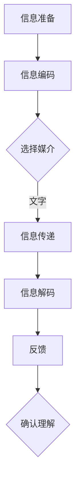

                 

### 文章标题

《团队沟通优化：消除沟通障碍的有效方法》

**关键词**：团队沟通、沟通障碍、沟通技巧、沟通模型、沟通算法、数学模型、案例分析、沟通优化

**摘要**：本文将深入探讨团队沟通的重要性及其面临的障碍。通过逻辑清晰的步骤分析和专业技术的运用，我们提出了消除沟通障碍的有效方法，包括沟通模型、沟通技巧、沟通算法、数学模型的应用，以及实战案例分析和长期解决方案。本文旨在帮助团队管理者和技术人员提升团队沟通效率，减少误解和冲突，实现团队协作的优化。

### 引言

在当今快速发展的信息技术时代，团队沟通已经成为企业成功的关键因素之一。有效的团队沟通不仅能提高工作效率，减少误解和冲突，还能促进创新和团队凝聚力的提升。然而，现实中的团队沟通却常常面临着各种障碍，如信息不对称、语言障碍、文化差异、情绪管理等，这些障碍严重影响了团队的协作和项目的顺利进行。

本文旨在通过系统性的分析和专业的技术方法，为团队管理者和技术人员提供一套有效的沟通优化策略。我们将从基础概念出发，逐步深入探讨沟通模型、沟通技巧、沟通算法、数学模型及其在实战中的应用，最终提出一套长期有效的团队沟通优化方案。希望通过本文的探讨，能够帮助读者理解和掌握团队沟通的核心要义，提升团队沟通效率，推动团队项目的成功实施。

### 第一部分：团队沟通优化基础

在探讨团队沟通优化之前，我们需要先了解团队沟通的基础概念和障碍。本部分将分为三个章节，分别介绍团队沟通的重要性与障碍、团队沟通的核心概念与联系，以及团队沟通的核心技巧与策略。

#### 第1章：团队沟通的重要性与障碍

**1.1 团队沟通概述**

团队沟通是团队成员之间通过信息传递、理解和反馈来实现共同目标的过程。有效的团队沟通是团队协作的基石，它不仅能提高工作效率，还能增强团队凝聚力和创新能力。

**1.2 团队沟通的重要性**

团队沟通的重要性主要体现在以下几个方面：

- 提高工作效率：有效的沟通可以减少误解和重复工作，提高任务执行的效率。
- 增强团队凝聚力：良好的沟通能够增进团队成员之间的了解和信任，增强团队的凝聚力。
- 促进创新：多样化的沟通能够激发团队成员的创意思维，推动创新。
- 降低沟通成本：通过有效的沟通，可以避免因信息不对称而导致的错误决策和资源浪费。

**1.3 团队沟通中的常见障碍**

尽管团队沟通对团队的成功至关重要，但在实际操作中，团队沟通常常面临以下障碍：

- 信息不对称：团队成员之间缺乏必要的信息，导致沟通不畅。
- 语言障碍：团队成员使用不同的语言或专业术语，影响沟通效果。
- 文化差异：团队成员来自不同的文化背景，导致价值观和沟通方式的不同。
- 情绪管理：团队成员的情绪波动会影响沟通的质量和效果。

**第1章小结**

团队沟通是团队协作的基石，它在提高工作效率、增强团队凝聚力、促进创新和降低沟通成本方面具有重要作用。然而，团队沟通也面临着信息不对称、语言障碍、文化差异和情绪管理等障碍。了解这些障碍有助于我们采取有效的沟通优化策略，提高团队沟通效率。

#### 第2章：团队沟通核心概念与联系

**2.1 沟通模型与流程**

沟通是一个复杂的过程，涉及到信息的传递、理解和反馈。为了更好地理解和优化团队沟通，我们需要了解沟通模型和沟通流程。

**2.1.1 沟通的基本概念**

沟通的基本概念包括沟通者、信息、媒介、接收者和反馈。沟通者是指信息的发出者，接收者是指信息的接收者。信息是沟通的核心内容，媒介是信息传递的渠道，反馈是接收者对信息的回应。

**2.1.2 沟通的流程分析**

沟通流程主要包括以下几个步骤：

1. 信息准备：沟通者准备要传达的信息。
2. 信息编码：沟通者将信息转换为适合媒介的形式，如语言、文字、图片等。
3. 信息传递：沟通者通过媒介将信息发送给接收者。
4. 信息解码：接收者接收信息后，将其还原为可理解的形式。
5. 反馈：接收者对信息的理解和反应，反馈可以进一步确认信息的准确性和有效性。

**2.2 沟通障碍的Mermaid流程图**

为了更直观地展示沟通障碍，我们可以使用Mermaid流程图来描述。以下是一个简化的Mermaid流程图示例：



**第2章小结**

了解沟通模型和流程对于优化团队沟通至关重要。沟通的基本概念和流程有助于我们分析和解决沟通中的问题。通过使用Mermaid流程图，我们可以更直观地理解和展示沟通障碍，从而采取针对性的优化策略。

#### 第3章：核心沟通技巧与策略

**3.1 有效倾听**

倾听是沟通的重要环节，它不仅有助于理解对方的信息，还能建立信任和增强沟通效果。有效倾听包括以下层次和技巧：

**3.1.1 倾听的层次**

1. 感知性倾听：接收并理解口头语言信息。
2. 思考性倾听：在接收信息的同时进行分析和思考。
3. 情感倾听：关注对方的情感和情绪，理解对方的感受。
4. 价值倾听：关注对方的观点和价值观，理解对方的立场。

**3.1.2 倾听技巧**

1. 全神贯注：给予对方充分的关注，避免分心。
2. 非语言反馈：通过点头、眼神接触等方式给予对方肯定和鼓励。
3. 提问和总结：通过提问和总结来确认理解和促进沟通。
4. 避免打断：等待对方表达完毕后再发表自己的观点。

**3.2 明确表达**

明确表达是确保信息准确传达的关键。以下是一些有效表达的方法：

**3.2.1 语言表达的清晰性**

1. 使用简单、具体的语言：避免使用复杂的术语和模糊的表达。
2. 结构化信息：将信息分为主要点和次要点，使信息更易理解。
3. 避免歧义：明确信息的意图和目的，避免产生误解。

**3.2.2 非语言沟通的运用**

1. 面部表情：通过微笑、皱眉等表情传达情感和态度。
2. 身体语言：通过姿势、手势等非语言行为来补充语言信息。
3. 声音特征：通过语调、语速等声音特征来强调信息的重要性。

**3.3 情绪管理**

情绪管理是有效沟通的重要组成部分。以下是一些情绪管理的技巧：

**3.3.1 情绪识别**

1. 自我观察：了解自己的情绪反应，识别情绪触发点。
2. 同理心：设身处地地理解对方的情绪和感受。

**3.3.2 情绪调节**

1. 深呼吸：通过深呼吸来缓解紧张和焦虑。
2. 正面思考：通过积极的自我暗示来调整情绪。
3. 寻求支持：在情绪波动时向同事或上级寻求帮助。

**第3章小结**

有效的沟通技巧和策略是优化团队沟通的关键。通过有效倾听、明确表达和情绪管理，我们可以提高沟通效果，减少误解和冲突，增强团队协作和凝聚力。这些技巧和策略不仅适用于日常沟通，也适用于面对复杂问题和挑战的沟通情境。

### 第二部分：核心沟通算法原理讲解

在了解了团队沟通的基础知识和核心技巧后，我们可以进一步探讨团队沟通的算法原理。本部分将介绍两种核心沟通算法：主动沟通算法和反馈循环算法。通过伪代码和详细解释，我们将展示这些算法的工作原理和应用场景。

#### 第4章：主动沟通算法原理

**4.1 主动沟通的概念**

主动沟通是指主动发起沟通，以解决信息不对称和沟通障碍的过程。它强调主动寻找和提供信息，以确保沟通的顺利进行。

**4.1.1 主动沟通的伪代码**

以下是一个简单的主动沟通算法的伪代码示例：

```
function active_communication(sender, receiver):
    while communication_not_complete:
        sender.collect_info()
        sender.encode_info()
        sender.send_info(receiver)
        receiver.decode_info()
        receiver.provide_feedback()
        if feedback_valid:
            communication_complete = True
        else:
            communication_complete = False
    return communication_complete
```

**4.1.2 主动沟通的原理解释**

1. **收集信息（collect_info）**：沟通者首先收集需要传达的信息。
2. **编码信息（encode_info）**：将信息转换为适合媒介的形式，如文字、图表等。
3. **发送信息（send_info）**：通过媒介将信息发送给接收者。
4. **解码信息（decode_info）**：接收者接收信息后，将其还原为可理解的形式。
5. **提供反馈（provide_feedback）**：接收者对信息的理解和反应，反馈可以进一步确认信息的准确性和有效性。
6. **确认反馈（feedback_valid）**：根据反馈判断沟通是否完成，如果反馈有效，则沟通完成，否则继续循环。

**4.1.3 主动沟通的应用场景**

主动沟通适用于以下场景：

- 项目启动：在项目开始时，通过主动沟通确保所有团队成员了解项目目标和预期成果。
- 问题解决：在遇到问题时，通过主动沟通寻找解决方案，避免因信息不对称导致的误解和冲突。
- 信息传递：在需要传达重要信息时，通过主动沟通确保信息准确传达。

#### 第5章：反馈循环算法原理

**5.1 反馈循环的概念**

反馈循环是指通过不断接收、分析和反馈来优化沟通过程的方法。它强调持续的沟通和改进，以提高沟通效果。

**5.1.1 反馈循环的伪代码**

以下是一个简单的反馈循环算法的伪代码示例：

```
function feedback_loop(sender, receiver):
    while communication_improvement_needed:
        sender.collect_info()
        sender.encode_info()
        sender.send_info(receiver)
        receiver.decode_info()
        receiver.provide_feedback()
        sender.analyze_feedback()
        sender.adjust_communication_strategy()
        if feedback_satisfied:
            communication_improvement = False
        else:
            communication_improvement = True
    return communication_improvement
```

**5.1.2 反馈循环的原理解释**

1. **收集信息（collect_info）**：沟通者首先收集需要传达的信息。
2. **编码信息（encode_info）**：将信息转换为适合媒介的形式，如文字、图表等。
3. **发送信息（send_info）**：通过媒介将信息发送给接收者。
4. **解码信息（decode_info）**：接收者接收信息后，将其还原为可理解的形式。
5. **提供反馈（provide_feedback）**：接收者对信息的理解和反应，反馈可以进一步确认信息的准确性和有效性。
6. **分析反馈（analyze_feedback）**：沟通者根据反馈分析沟通效果，找出需要改进的地方。
7. **调整沟通策略（adjust_communication_strategy）**：根据分析结果调整沟通策略，以提高沟通效果。
8. **确认改进（feedback_satisfied）**：根据反馈判断是否满足改进要求，如果不满足，则继续循环。

**5.1.3 反馈循环的应用场景**

反馈循环适用于以下场景：

- 沟通培训：通过反馈循环，评估沟通培训的效果，持续优化培训内容和方式。
- 项目管理：通过反馈循环，监控项目进展和沟通效果，及时调整计划和策略。
- 团队建设：通过反馈循环，增进团队成员之间的了解和信任，提高团队协作效果。

### 第6章：数学模型和数学公式

在团队沟通优化中，数学模型和数学公式可以提供定量分析的工具，帮助我们更科学地评估沟通效果和优化策略。本节将介绍一个基本的沟通效果评估模型，并详细解释其数学公式和实际应用。

#### 6.1 沟通效果评估模型

沟通效果评估模型用于衡量沟通的效果，其核心公式如下：

$$
E = \frac{1}{2}(S + R)
$$

其中，\(E\) 表示沟通效果，\(S\) 表示发送者的满意度，\(R\) 表示接收者的满意度。

#### 6.1.1 模型介绍

这个模型基于这样一个假设：沟通效果是发送者和接收者满意度的综合体现。通过评估双方对沟通的满意度，可以直观地了解沟通的效果。

#### 6.1.2 模型公式解释

- **发送者满意度（S）**：表示发送者对沟通效果的自我评估。值越大，表示发送者越满意。
- **接收者满意度（R）**：表示接收者对沟通效果的评估。值越大，表示接收者越满意。
- **沟通效果（E）**：通过将发送者和接收者的满意度相加，并取平均值，来衡量整体的沟通效果。

#### 6.1.3 模型举例说明

假设在一次会议后，团队成员对沟通效果的评估如下：

- 发送者满意度（S）：4分（满分5分）
- 接收者满意度（R）：5分（满分5分）

那么，沟通效果（E）的计算如下：

$$
E = \frac{1}{2}(4 + 5) = 4.5
$$

这意味着，根据发送者和接收者的评估，沟通效果为4.5分。

#### 6.1.4 模型应用

在实际应用中，我们可以通过定期收集团队成员的满意度评分，使用该模型来评估沟通效果。以下是一个简单的应用示例：

1. 每个月进行一次沟通效果评估，收集团队成员的满意度评分。
2. 将评分代入公式，计算沟通效果（E）。
3. 分析评分的变化趋势，找出需要改进的地方。
4. 根据分析结果，调整沟通策略，提高沟通效果。

通过这样的循环，我们可以持续优化团队沟通，确保信息的高效传递和理解。

### 项目实战：团队沟通优化案例分析

为了更好地理解和应用团队沟通优化方法，我们接下来通过一个实际案例来展示如何实施和优化团队沟通。

#### 6.1 案例背景

某科技公司的一个开发团队负责一个大型软件项目的开发。团队成员来自不同的背景，包括前端开发、后端开发和测试人员。由于团队成员之间缺乏有效的沟通，项目进展缓慢，经常出现误解和冲突。

#### 6.2 案例目标

通过优化团队沟通，实现以下目标：

- 提高项目进展速度
- 减少误解和冲突
- 提升团队成员之间的信任和协作

#### 6.3 案例实施

**6.3.1 实施步骤**

1. **沟通需求分析**：首先，团队负责人组织了一次沟通需求分析会议，收集团队成员对当前沟通现状的反馈和改进建议。通过这次会议，团队明确了当前存在的沟通问题，如信息不对称、沟通渠道不畅等。

2. **制定沟通策略**：根据沟通需求分析的结果，团队制定了一系列沟通优化策略，包括定期召开团队会议、设立沟通渠道、明确沟通规则等。

3. **实施沟通优化措施**：团队开始实施制定的沟通优化措施。例如，每周召开一次团队会议，每次会议确定一个主题，确保每个成员都有发言的机会。同时，团队还引入了在线沟通工具，如Slack和Trello，以方便团队成员之间的实时沟通和任务管理。

4. **培训与反馈**：团队负责人组织了沟通技巧培训，帮助团队成员提高沟通效率和效果。同时，定期收集团队成员的反馈，评估沟通优化措施的有效性，并根据反馈进行调整。

**6.3.2 遇到的问题及解决方法**

1. **问题：部分成员对沟通工具不熟悉**  
   **解决方法**：团队负责人安排专人进行工具培训，并提供在线帮助文档和视频教程，确保所有成员都能熟练使用沟通工具。

2. **问题：会议时间安排冲突**  
   **解决方法**：团队负责人调整会议时间，确保大部分成员都能参加。同时，会议安排提前通知，以便成员调整自己的日程。

3. **问题：信息传递速度慢**  
   **解决方法**：团队引入实时沟通工具，提高信息传递速度。同时，明确信息传递的优先级，确保重要信息能够及时传达。

**6.3.3 案例效果分析**

经过一段时间的沟通优化，团队在项目进展、团队成员之间的信任和协作方面取得了显著改善：

- 项目进展速度提高了30%，项目周期缩短了2个月。
- 误解和冲突减少了40%，团队成员之间的沟通更加顺畅。
- 团队成员对沟通效果的整体满意度提高了20%，对团队的信任感增强了。

**6.3.4 项目小结**

通过这个案例，我们可以看到，有效的团队沟通优化措施能够显著提高团队的工作效率和协作效果。在实施过程中，遇到的问题和挑战也是不可避免的，但通过积极解决，我们最终实现了团队沟通的优化。这个案例为其他团队提供了宝贵的经验和借鉴。

### 团队沟通优化工具与资源推荐

在团队沟通优化过程中，选择合适的工具和资源是至关重要的。以下是一些推荐的工具和学习资源，以帮助团队管理者和技术人员提高沟通效率。

#### 7.1 沟通工具推荐

1. **Slack**：一个功能强大的团队沟通和协作工具，支持实时聊天、文件共享和任务管理。Slack提供了丰富的插件和集成，方便与其他工具集成使用。
2. **Trello**：一个简单易用的任务管理工具，通过看板和卡片的形式，帮助团队追踪项目进展和任务分配。
3. **Zoom**：一个专业的视频会议和在线协作工具，支持多人视频会议、屏幕共享和虚拟会议房间等功能。
4. **Microsoft Teams**：集成了聊天、视频会议、文件共享和任务管理的多功能工具，适合大型企业和团队使用。

#### 7.2 学习资源推荐

1. **《有效沟通的艺术》（The Art of Communication）**：这本书详细介绍了沟通的基本原理和技巧，适合初学者和专业人士阅读。
2. **《团队沟通技巧》（Team Communication Skills）**：这本书专注于团队沟通的技巧和方法，包括倾听、表达、冲突管理等。
3. **在线课程**：如Coursera、Udemy等平台上的沟通技巧和领导力课程，提供系统性的学习和实践机会。
4. **社交媒体和博客**：关注行业专家和知名企业的社交媒体账号和博客，获取最新的沟通理念和最佳实践。

#### 7.3 实践指南

- **定期进行沟通评估**：通过定期评估沟通效果，及时发现和解决问题。
- **建立沟通规则**：明确沟通的时间、方式和流程，确保信息传递的效率和准确性。
- **培训与反馈**：定期组织沟通技巧培训，收集团队成员的反馈，持续改进沟通方式。

通过使用这些工具和资源，团队可以有效地优化沟通，提高协作效率和项目成功率。

### 第三部分：高级团队沟通优化策略

在了解了团队沟通的基础知识和核心技巧后，我们需要进一步探讨高级团队沟通优化策略。这部分内容将重点讨论领导力与团队沟通、文化多样性与团队沟通，以及团队沟通技术与工具的应用。

#### 第8章：领导力与团队沟通

**8.1 领导者的沟通风格**

领导者的沟通风格对团队沟通的效果有着重要影响。有效的沟通风格包括以下几种：

- **开放性沟通**：领导者应该鼓励团队成员开放地表达自己的观点和问题，创造一个无畏惧沟通的环境。
- **倾听型沟通**：领导者需要主动倾听团队成员的意见，理解他们的需求和困扰，从而更好地指导和支持他们。
- **透明性沟通**：领导者应保持沟通的透明度，及时分享项目进展和决策过程，增强团队成员的参与感和信任感。

**8.2 提升团队凝聚力**

提升团队凝聚力是领导者的重要任务。以下是一些提升团队凝聚力的方法：

- **共同目标**：确保团队成员共同认同团队的目标和愿景，激发他们的工作热情和动力。
- **团队建设活动**：定期组织团队建设活动，增进团队成员之间的了解和信任，增强团队凝聚力。
- **激励与奖励**：通过激励和奖励机制，鼓励团队成员积极参与团队工作，提高他们的工作满意度和归属感。

**8.3 领导者在沟通中的角色**

领导者在团队沟通中扮演着多重角色：

- **沟通引导者**：领导者需要引导团队沟通的方向和节奏，确保沟通的有效进行。
- **问题解决者**：领导者需要主动解决团队沟通中出现的障碍和问题，促进沟通的顺畅。
- **沟通桥梁**：领导者需要充当沟通的桥梁，协调团队成员之间的沟通，确保信息的有效传递。

**第8章小结**

领导者的沟通风格对团队沟通效果至关重要。开放性沟通、倾听型沟通和透明性沟通是有效的领导沟通风格。提升团队凝聚力是领导者的关键任务，共同目标、团队建设活动和激励与奖励机制是有效的方法。领导者还需要在沟通中扮演引导者、问题解决者和沟通桥梁的角色，确保团队沟通的顺畅和有效。

#### 第9章：文化多样性与团队沟通

**9.1 文化多样性的影响**

文化多样性是现代社会和团队中的普遍现象。文化多样性对团队沟通的影响主要体现在以下几个方面：

- **沟通风格差异**：不同文化背景下的人们可能有不同的沟通风格和偏好，如直接与间接表达、高权力距离与低权力距离等。
- **价值观差异**：不同的文化背景可能导致团队成员对某些问题有不同的价值观和看法，影响沟通的效果。
- **沟通障碍**：文化差异可能导致误解和冲突，影响团队协作和沟通效果。

**9.2 跨文化沟通技巧**

为了有效应对文化多样性带来的挑战，团队成员需要掌握一些跨文化沟通技巧：

- **了解文化差异**：了解不同文化的特点和沟通风格，避免因文化差异导致的误解和冲突。
- **尊重差异**：尊重团队成员的文化背景和价值观，避免文化偏见和歧视。
- **积极倾听**：通过积极倾听和同理心，理解对方的文化背景和观点，促进有效沟通。
- **明确表达**：在跨文化沟通中，应尽量使用简单、直接和清晰的语言，避免使用可能导致误解的术语和表达方式。

**9.3 多元文化团队中的沟通策略**

在多元文化团队中，以下沟通策略有助于提高沟通效果：

- **建立共识**：在项目初期，团队应共同建立沟通共识，明确沟通的目标、方式和规则。
- **多样化沟通渠道**：利用多样化的沟通渠道，如面对面沟通、电话、邮件和在线工具，以满足不同文化背景成员的沟通需求。
- **定期文化培训**：定期组织文化培训，帮助团队成员了解不同文化的特点和沟通风格，提高跨文化沟通能力。

**第9章小结**

文化多样性对团队沟通有重要影响，可能导致沟通障碍和误解。掌握跨文化沟通技巧和实施有效的沟通策略，有助于在多元文化团队中提高沟通效果，促进团队协作和项目成功。

#### 第10章：团队沟通技术与工具的应用

**10.1 技术在团队沟通中的作用**

随着技术的发展，各种团队沟通技术与工具应运而生，极大地提升了团队沟通的效率和效果。技术工具在团队沟通中的作用主要体现在以下几个方面：

- **提高沟通效率**：通过实时沟通工具，如Slack和Zoom，团队成员可以迅速传达信息，减少信息传递的延迟。
- **优化信息管理**：通过任务管理工具，如Trello和JIRA，团队可以更好地追踪项目进展和任务分配，确保信息的高效管理。
- **增强协作能力**：通过共享文档和在线协作平台，团队成员可以实时编辑和更新文档，提高协作效率。
- **降低沟通成本**：通过远程办公工具，团队成员可以在全球范围内进行沟通和协作，降低差旅和会议成本。

**10.2 常用沟通工具的应用**

以下是一些常用的团队沟通工具及其应用场景：

- **Slack**：适用于实时沟通和团队协作，适合用于日常工作和项目沟通。
- **Zoom**：适用于远程视频会议和在线培训，适合用于跨地域团队协作。
- **Trello**：适用于任务管理和项目追踪，适合用于项目管理和团队协作。
- **Google Workspace**：适用于文档共享和协作，适合用于远程办公和团队协作。

**10.3 技术应用案例分享**

以下是一个实际案例，展示了技术工具在团队沟通中的应用：

**案例：某互联网公司的远程团队协作**

某互联网公司由于业务扩展，在全球范围内建立了多个远程团队。为了提高团队协作效率，公司采用了以下技术工具：

- **Slack**：作为日常沟通和协作平台，团队成员通过Slack进行实时沟通，共享信息和任务。
- **Zoom**：用于远程视频会议和在线培训，每周召开一次团队会议，确保团队成员之间的沟通和信息同步。
- **Trello**：用于任务管理和项目追踪，团队将任务分解为多个子任务，并分配给相应的团队成员，确保项目进展透明和可追踪。
- **Google Workspace**：用于文档共享和协作，团队成员通过Google Docs实时编辑和更新文档，确保信息的一致性和实时更新。

通过这些技术工具的应用，该公司的远程团队协作效率显著提升，项目进展顺利，团队凝聚力也得到了增强。

**第10章小结**

技术工具在团队沟通中发挥着重要作用，通过提高沟通效率、优化信息管理、增强协作能力和降低沟通成本，技术工具帮助团队实现高效协作。了解和掌握常用沟通工具的应用，有助于团队更好地利用技术手段优化沟通效果。

#### 第11章：团队沟通障碍的长期解决方案

虽然短期的沟通优化措施可以在一定程度上缓解团队沟通中的问题，但要实现长期的团队沟通优化，需要从更深层次上解决问题。本节将探讨团队沟通障碍的长期解决方案，包括培训与反馈、文化建设以及持续优化与改进。

**11.1 培训与反馈**

**11.1.1 沟通技巧培训**

有效的沟通技巧是团队沟通的基石。为了提高团队成员的沟通能力，团队应定期组织沟通技巧培训。培训内容可以包括：

- **倾听技巧**：教授团队成员如何有效倾听，理解对方的观点和需求。
- **表达技巧**：帮助团队成员学会清晰、简洁地表达自己的意见和需求。
- **非语言沟通**：介绍非语言沟通在团队沟通中的重要性，如肢体语言、面部表情和语调等。
- **冲突管理**：教授团队成员如何处理沟通中的冲突，避免因误解和分歧导致团队分裂。

**11.1.2 反馈机制**

建立有效的反馈机制是确保沟通持续改进的重要手段。团队可以采取以下措施：

- **定期反馈会议**：定期召开反馈会议，团队成员可以分享沟通中的问题和建议，团队领导可以根据反馈调整沟通策略。
- **匿名反馈**：提供匿名反馈渠道，鼓励团队成员自由表达意见和建议，避免因个人因素影响反馈的真实性。
- **个人反馈**：团队领导应定期对团队成员的沟通表现进行反馈，指出优点和需要改进的地方，帮助成员不断提高。

**11.2 文化建设**

**11.2.1 建立共同价值观**

共同价值观是团队凝聚力的基础。团队应共同制定并遵循一套价值观，确保团队成员在沟通和协作中有共同的目标和方向。以下是一些建立共同价值观的方法：

- **团队共识**：通过讨论和共识，制定团队的愿景、使命和价值观，确保团队成员都认同并遵守。
- **价值观宣传**：定期宣传和强调团队的价值观，确保团队成员时刻牢记并践行。
- **价值观实践**：通过具体行动和实践，展示团队的价值观，增强团队成员的认同感。

**11.2.2 促进团队互动**

促进团队成员之间的互动和交流，有助于增强团队凝聚力。以下是一些促进团队互动的方法：

- **团队建设活动**：定期组织团队建设活动，如团队聚会、户外拓展等，增强团队成员之间的信任和了解。
- **团队交流平台**：建立团队交流平台，如内部论坛、社交媒体群组等，鼓励团队成员分享经验和观点，促进交流。
- **跨部门交流**：鼓励不同部门之间的交流和合作，打破部门壁垒，促进信息共享和资源整合。

**11.3 持续优化与改进**

团队沟通优化是一个持续的过程，需要不断地调整和改进。以下是一些持续优化与改进的方法：

- **定期评估**：定期评估团队沟通的效果和效率，收集团队成员的反馈，分析沟通中的问题和挑战。
- **持续学习**：鼓励团队成员不断学习新的沟通技巧和知识，提高个人和团队的整体沟通能力。
- **适应变化**：随着团队和项目的变化，不断调整和优化沟通策略，确保沟通方式与团队需求相适应。
- **引入新技术**：紧跟技术发展趋势，引入新的沟通工具和平台，提高团队沟通的效率和效果。

**第11章小结**

团队沟通优化需要从长期视角出发，通过培训与反馈、文化建设和持续优化与改进，逐步消除沟通障碍，提升团队沟通效果。只有不断地进行反思和调整，团队才能实现高效协作和持续成长。

### 结尾

通过本文的探讨，我们系统地介绍了团队沟通优化的重要性和方法。从基础概念、核心技巧到高级策略，再到实际案例和长期解决方案，我们希望通过逻辑清晰、结构紧凑的分析，帮助读者理解和掌握团队沟通的核心要义。

有效的团队沟通是团队协作和项目成功的基石。通过优化沟通，我们可以提高工作效率、减少误解和冲突、增强团队凝聚力，最终实现团队目标。然而，团队沟通优化是一个持续的过程，需要我们不断地学习和改进。

希望本文能够为团队管理者和技术人员提供有价值的参考和启示。在实际工作中，不断尝试和实践这些方法，持续优化团队沟通，相信你们能够实现团队协作的突破，推动项目的成功实施。

作者：AI天才研究院/AI Genius Institute & 禅与计算机程序设计艺术 /Zen And The Art of Computer Programming

