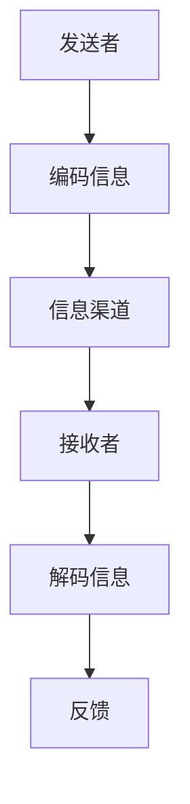

                 

### 文章标题：团队沟通：建立开放透明的交流环境

关键词：团队沟通、开放透明、交流环境、沟通障碍、解决策略、沟通效果

摘要：本文深入探讨了团队沟通的核心概念、重要性以及实际操作中的挑战和解决方案。通过详细分析沟通障碍，我们提出了提高沟通效果的方法和工具。文章旨在为IT团队提供构建开放透明交流环境的实战指南，助力团队协作与创新。

---

### 《团队沟通：建立开放透明的交流环境》目录大纲

#### 第一部分：团队沟通概述
##### 第1章：团队沟通的重要性
- **1.1 沟通的定义与分类**
- **1.2 团队沟通的作用与效果**
- **1.3 沟通障碍与沟通模式**

##### 第2章：团队沟通核心概念
- **2.1 沟通模型与流程**
- **2.2 沟通风格与影响力**
- **2.3 沟通反馈机制**

#### 第二部分：沟通障碍与解决策略
##### 第3章：沟通障碍分析
- **3.1 语言障碍与误解**
- **3.2 文化差异与沟通**
- **3.3 情感因素与沟通**

##### 第4章：提高沟通效果的方法
- **4.1 建立开放透明的交流环境**
- **4.2 有效倾听与表达**
- **4.3 使用反馈技巧**

##### 第5章：团队沟通工具与技术
- **5.1 面对面沟通技巧**
- **5.2 书面沟通技巧**
- **5.3 数字化沟通工具应用**

#### 第三部分：实战篇
##### 第6章：团队沟通实战案例
- **6.1 案例一：跨部门沟通困境及解决**
- **6.2 案例二：团队沟通障碍识别与解决**
- **6.3 案例三：虚拟团队沟通挑战与策略**

##### 第7章：构建高效团队沟通机制
- **7.1 团队沟通机制的构建与实施**
- **7.2 团队沟通效果的评估与改进**
- **7.3 团队沟通障碍的长期解决方案**

##### 第8章：团队沟通能力提升
- **8.1 团队成员沟通能力的培养**
- **8.2 领导者的沟通技巧**
- **8.3 团队建设与沟通文化**

#### 附录
##### 附录A：团队沟通工具与资源
- **A.1 沟通工具介绍**
- **A.2 沟通技巧提升资源**

---

#### 核心概念与联系
- **Mermaid 流程图**
  mermaid
  graph TD
  A[沟通模型] --> B[沟通流程]
  B --> C[沟通障碍]
  C --> D[沟通效果]
  D --> E[沟通反馈]
  

---

#### 核心算法原理讲解
- **伪代码**
  python
  function effective_communication(personA, personB):
      if communication_style(personA) == communication_style(personB):
          return true
      else:
          feedback = get_feedback(personA, personB)
          if feedback:
              adjust_communication_style(personA, personB)
              return true
          else:
              return false
  

---

#### 数学模型和数学公式 & 详细讲解 & 举例说明
- **数学公式**
  $$ E = \frac{1}{2}mv^2 $$
  - **详细讲解**：这个公式表示动能，其中 \( E \) 是动能，\( m \) 是物体的质量，\( v \) 是物体的速度。
  - **举例说明**：一个质量为50kg的物体以10m/s的速度移动，其动能是 \( E = \frac{1}{2} \times 50 \times 10^2 = 2500 \) 焦耳。

---

#### 项目实战
- **代码实际案例和详细解释说明**
  python
  # 假设这是用于团队沟通的代码示例
  def team_communication(message, recipient):
      try:
          print(f"{recipient} received the message: {message}")
          response = process_message(message)
          return response
      except Exception as e:
          print(f"Error in communication: {e}")
  

- **开发环境搭建，源代码详细实现和代码解读，代码解读与分析**
  - **开发环境搭建**：安装Python环境，使用PyCharm或VSCod

---

#### 最佳实践 tips、小结、注意事项、拓展阅读等内容

---

在开始探讨团队沟通的深度和细节之前，我们需要明确一个基础前提：沟通是团队协作的血脉，是知识传递、问题解决、创新思维的源泉。没有有效的沟通，团队就像没有舵手的船只，在复杂的商业环境中难以航行。本文将围绕团队沟通的核心概念、障碍、策略以及实际操作，逐步剖析如何建立开放透明的交流环境，以提高团队的整体协作效率和创新力。

#### 第一部分：团队沟通概述

##### 第1章：团队沟通的重要性

沟通的定义与分类

沟通，简单地说，就是信息的传递与理解。在团队环境中，沟通可以分为以下几种基本类型：

1. **单向沟通**：信息从发送者传递到接收者，没有反馈。
2. **双向沟通**：信息在发送者和接收者之间来回流动，存在反馈。
3. **正式沟通**：通过组织架构进行的正式沟通，如会议、报告等。
4. **非正式沟通**：非正式场合的交流，如闲聊、社交活动等。

团队沟通的作用与效果

团队沟通的作用是多方面的，它不仅有助于信息的传递，还能够增强团队成员之间的信任和凝聚力。以下是团队沟通的几个重要作用：

1. **信息传递**：确保团队成员对项目目标、计划、资源等信息有共同的理解。
2. **协调合作**：通过沟通，团队可以更好地协调各自的任务，避免工作冲突和重复。
3. **提高效率**：有效的沟通可以减少误解和错误，提高团队的执行效率。
4. **培养团队文化**：共同的目标和价值观通过沟通得以传播，有助于建立团队的文化。
5. **促进创新**：不同观点和思想的交流可以激发创新思维，促进团队的创新活动。

沟通障碍与沟通模式

沟通障碍是指在信息传递过程中，由于各种原因导致信息失真或无法有效传递的问题。常见的沟通障碍包括：

1. **语言障碍**：包括语言差异、专业术语不理解等。
2. **文化差异**：不同文化背景可能导致沟通方式和风格的不同。
3. **情感因素**：情绪、压力等因素会影响沟通的效果。
4. **沟通模式不当**：如缺乏反馈、沟通渠道不畅通等。

为了克服这些障碍，团队可以采用以下沟通模式：

1. **开放性沟通**：鼓励成员表达自己的观点和意见，建立信任和开放的沟通氛围。
2. **透明性沟通**：信息共享，确保所有成员对项目进展有全面的了解。
3. **结构化沟通**：通过明确的沟通流程和规则，确保沟通的高效和准确。
4. **反馈机制**：建立有效的反馈机制，及时纠正沟通中的错误和误解。

##### 第2章：团队沟通核心概念

沟通模型与流程

团队沟通通常遵循一个基本模型，即发送者-信息-渠道-接收者-反馈。这个模型描述了信息传递的基本过程：

1. **发送者**：信息的源头，负责编码信息并将其传递出去。
2. **信息**：被发送的内容，可以是语言、图像、符号等。
3. **渠道**：信息传递的媒介，如口头、书面、电子邮件等。
4. **接收者**：接收并解码信息的人或团队。
5. **反馈**：接收者对信息的理解和反应，可以帮助发送者了解沟通的效果。

沟通风格与影响力

沟通风格是指个体在沟通中表现出来的习惯和偏好。不同的沟通风格会影响沟通的效果和团队的关系。常见的沟通风格包括：

1. **主导型**：喜欢控制对话，强调权威和效率。
2. **支持型**：注重建立关系，倾听他人的观点。
3. **分析型**：注重逻辑和细节，喜欢深入探讨问题。
4. **情感型**：注重情感和直觉，喜欢从情感角度理解问题。

为了提高沟通的影响力，团队成员应：

1. **了解自己的沟通风格**：认识自己的优势和局限。
2. **适应他人的沟通风格**：调整自己的风格，以适应不同的沟通对象。
3. **增强沟通技巧**：通过培训和练习，提高沟通的效率和效果。

沟通反馈机制

有效的沟通反馈机制是确保信息准确传递和理解的重要手段。沟通反馈机制包括以下几个方面：

1. **即时反馈**：在沟通过程中及时给予反馈，帮助发送者了解信息是否被正确理解。
2. **正式反馈**：通过正式的会议、报告等形式，对项目进展和团队沟通效果进行评估。
3. **非正式反馈**：通过日常交流、意见箱等方式，收集团队成员的意见和建议。
4. **反馈渠道**：确保团队成员有多个渠道可以表达自己的意见和反馈，包括线上和线下方式。

#### 第二部分：沟通障碍与解决策略

##### 第3章：沟通障碍分析

语言障碍与误解

语言障碍是团队沟通中最常见的障碍之一。团队成员可能来自不同的语言背景，使用不同的专业术语，导致信息传递不准确或产生误解。为了克服语言障碍：

1. **使用简明语言**：避免使用复杂和冗长的术语，尽量使用简单明了的表达方式。
2. **翻译服务**：对于语言障碍较大的团队，可以提供翻译服务，确保信息的准确传递。
3. **语言培训**：为团队成员提供语言和沟通技巧的培训，提高他们的语言能力和沟通效果。

文化差异与沟通

文化差异是团队沟通中另一个重要障碍。不同的文化背景可能导致沟通风格和期望的不同。为了克服文化差异：

1. **文化敏感性培训**：为团队成员提供文化敏感性培训，提高他们对不同文化的理解和尊重。
2. **共同价值观**：建立团队的共同价值观和目标，减少文化差异的影响。
3. **开放性沟通**：鼓励团队成员分享自己的文化背景和经验，建立相互理解和尊重的沟通氛围。

情感因素与沟通

情感因素是团队沟通中不可忽视的一部分。情绪、压力和冲突等情感因素会影响沟通的效果和质量。为了克服情感因素：

1. **情绪管理**：培养团队成员的情绪管理能力，减少情绪对沟通的影响。
2. **冲突解决**：建立有效的冲突解决机制，及时处理团队中的冲突和分歧。
3. **建立信任**：通过信任建设，增强团队成员之间的互信和合作意愿。

##### 第4章：提高沟通效果的方法

建立开放透明的交流环境

开放透明的交流环境是提高团队沟通效果的基础。为了建立这样的环境，团队可以采取以下措施：

1. **信息公开**：确保团队成员能够及时获取项目相关的信息和资源。
2. **反馈渠道**：提供多种反馈渠道，如在线意见箱、定期会议等，鼓励团队成员表达意见和建议。
3. **沟通机制**：建立固定的沟通机制，如每周例会、项目进度报告等，确保沟通的规范和效率。

有效倾听与表达

有效倾听和表达是提高沟通效果的关键。为了做到这一点：

1. **倾听技巧**：积极倾听，关注对方的观点和感受，避免打断或立即反驳。
2. **清晰表达**：使用简单明了的语言，确保信息被正确理解和接收。
3. **重复确认**：在沟通过程中，适当重复关键信息，确保双方对信息的理解一致。

使用反馈技巧

有效的反馈技巧可以提升沟通的效果和质量。为了做到这一点：

1. **及时反馈**：在沟通过程中，及时给予反馈，帮助对方了解信息的接收情况。
2. **正面反馈**：尽量使用积极的语言和表达方式，鼓励对方接受反馈。
3. **具体反馈**：提供具体的意见和建议，帮助对方改进和优化。

##### 第5章：团队沟通工具与技术

面对面沟通技巧

面对面沟通是最直接和有效的沟通方式之一。为了提高面对面沟通的效果：

1. **准备充分**：在会议或沟通前，做好充分的准备，确保沟通的顺利进行。
2. **主动倾听**：关注对方的观点和需求，避免中断或打断对方。
3. **有效表达**：使用清晰、简洁的语言，确保信息被正确理解和接收。

书面沟通技巧

书面沟通是团队沟通的重要组成部分。为了提高书面沟通的效果：

1. **简明扼要**：避免冗长和复杂的文字，确保信息简明扼要。
2. **结构清晰**：使用恰当的结构和段落，确保信息条理清晰。
3. **专业术语**：使用专业的术语和表达方式，确保沟通的专业性和准确性。

数字化沟通工具应用

随着技术的发展，数字化沟通工具已经成为团队沟通的重要手段。为了提高数字化沟通的效果：

1. **选择合适的工具**：根据团队的需求和特点，选择合适的数字化沟通工具。
2. **规范化使用**：制定数字化沟通的规范，确保沟通的规范和效率。
3. **多样化应用**：充分利用各种数字化沟通工具的功能，提高沟通的互动性和效率。

#### 第三部分：实战篇

##### 第6章：团队沟通实战案例

跨部门沟通困境及解决

案例背景：某公司开发部门和市场部门在项目推进过程中出现了沟通障碍，导致项目进度延误。

解决方案：

1. **定期会议**：建立跨部门定期会议机制，确保各部门对项目进展有共同了解。
2. **信息共享**：通过共享平台，及时共享项目相关文档和进度，减少信息不对称。
3. **明确责任**：明确各部门的职责和任务，确保工作协调和高效推进。

团队沟通障碍识别与解决

案例背景：某团队在项目开发过程中，出现了成员之间沟通不畅、任务分配不均的问题。

解决方案：

1. **沟通调研**：通过问卷调查和访谈，了解团队成员之间的沟通状况和存在的问题。
2. **建立反馈机制**：建立内部反馈机制，鼓励团队成员提出意见和建议。
3. **调整任务分配**：根据团队成员的能力和需求，合理调整任务分配，提高沟通效率和任务完成度。

虚拟团队沟通挑战与策略

案例背景：某团队采用虚拟办公模式，成员分布在不同地区，沟通面临诸多挑战。

解决方案：

1. **使用协作工具**：使用协作工具，如Slack、Trello等，确保团队成员之间的实时沟通和信息共享。
2. **定期视频会议**：定期组织视频会议，确保团队成员之间的直接沟通和情感交流。
3. **文化融合**：通过组织团队活动和文化交流，增强团队成员之间的凝聚力和归属感。

##### 第7章：构建高效团队沟通机制

团队沟通机制的构建与实施

构建高效团队沟通机制需要从以下几个方面着手：

1. **明确沟通目标**：确定团队沟通的具体目标和要求，确保沟通的针对性。
2. **制定沟通计划**：制定详细的沟通计划，包括沟通的内容、频率、形式等。
3. **规范沟通流程**：明确沟通的流程和规则，确保沟通的规范和效率。

团队沟通效果的评估与改进

评估团队沟通效果的方法包括：

1. **问卷调查**：通过问卷调查，了解团队成员对沟通效果的满意度和建议。
2. **观察分析**：通过观察团队成员的沟通行为和效果，分析沟通中存在的问题。
3. **定期反馈**：定期收集团队成员的反馈，对沟通效果进行评估和改进。

团队沟通障碍的长期解决方案

长期解决团队沟通障碍需要从以下几个方面着手：

1. **培训与教育**：为团队成员提供沟通技巧和知识的教育和培训。
2. **文化建设**：建立积极、开放、包容的团队文化，促进团队成员之间的沟通和合作。
3. **技术支持**：提供必要的技术支持，确保沟通工具和平台的高效运行。

##### 第8章：团队沟通能力提升

团队成员沟通能力的培养

团队成员的沟通能力是团队沟通效果的重要保障。为了提升团队成员的沟通能力：

1. **定期培训**：定期组织沟通技巧的培训和练习，提高团队成员的沟通水平。
2. **经验分享**：鼓励团队成员分享自己的沟通经验和心得，互相学习和借鉴。
3. **模拟演练**：通过模拟演练，提高团队成员的沟通应变能力和实战能力。

领导者的沟通技巧

领导者是团队沟通的核心和关键。为了提升领导者的沟通技巧：

1. **倾听与理解**：注重倾听和理解团队成员的观点和需求，建立信任和尊重。
2. **有效表达**：使用清晰、简洁、有力的语言，确保信息被正确理解和接收。
3. **激励与引导**：通过激励和引导，激发团队成员的沟通积极性和创造力。

团队建设与沟通文化

团队建设与沟通文化是团队沟通能力提升的重要保障。为了构建积极、开放、包容的团队沟通文化：

1. **共同价值观**：建立团队的共同价值观和目标，增强团队成员的凝聚力和归属感。
2. **沟通氛围**：营造积极、开放、包容的沟通氛围，鼓励团队成员自由表达和交流。
3. **文化建设活动**：通过组织团队文化建设活动，增强团队成员之间的情感联系和合作意识。

#### 附录

##### 附录A：团队沟通工具与资源

- **A.1 沟通工具介绍**
  - **Slack**：一款功能强大的团队协作工具，支持实时沟通、文件共享、任务管理等。
  - **Trello**：一款简单易用的任务管理工具，可以帮助团队清晰地规划和跟踪项目进度。
  - **Zoom**：一款流行的视频会议工具，支持高清视频和音频会议，方便远程协作。
  
- **A.2 沟通技巧提升资源**
  - **《非暴力沟通》**：一本关于沟通技巧的经典书籍，提供了一套有效的沟通方法和策略。
  - **《沟通的艺术》**：一本关于人际沟通的权威指南，涵盖沟通的各个方面，包括倾听、表达、反馈等。
  - **在线沟通课程**：许多在线教育平台提供沟通技巧的课程，帮助团队成员提升沟通能力。

---

通过上述的详细分析和实例，我们可以看到，团队沟通不仅是传递信息的过程，更是建立信任、促进协作、激发创新的重要手段。建立开放透明的交流环境，需要从沟通的核心概念、障碍、策略以及实际操作各个方面进行全面的规划和实施。只有通过不断的学习和实践，才能提升团队的沟通能力，实现更高效的协作和更出色的成果。

作者：AI天才研究院/AI Genius Institute & 禅与计算机程序设计艺术 /Zen And The Art of Computer Programming

---

**核心概念与联系**

沟通模型与流程是团队沟通的基础，确保信息能够有效传递。通过Mermaid流程图，我们可以清晰地看到沟通模型的各个环节及其相互关系：



- **沟通模型**：描述了信息传递的基本流程，从发送者的编码到接收者的解码，再到反馈的循环。
- **沟通流程**：强调信息的传递和反馈机制，确保信息的准确性和及时性。
- **核心概念联系**：沟通模型和流程相互关联，通过反馈机制不断优化和调整，提高沟通效果。

---

**核心算法原理讲解**

为了更好地理解团队沟通的算法原理，我们可以使用伪代码来描述一个简化的沟通过程。以下是一个基于团队成员沟通风格的伪代码示例：

```python
def effective_communication(personA, personB):
    if personA.communication_style == personB.communication_style:
        return true
    else:
        feedback = get_feedback(personA, personB)
        if feedback:
            personA.adjust_communication_style(feedback)
            personB.adjust_communication_style(feedback)
            return true
        else:
            return false
```

- **功能描述**：此函数评估两个团队成员之间的沟通效果。
- **逻辑流程**：
  1. 检查两个团队成员的沟通风格是否相同。
  2. 如果风格相同，沟通有效，返回`true`。
  3. 如果风格不同，获取双方的反馈。
  4. 根据反馈调整双方的沟通风格。
  5. 如果调整后沟通有效，返回`true`，否则返回`false`。

---

**数学模型和数学公式**

在团队沟通中，一个经典的数学模型是反馈机制，它可以通过一个简单的数学公式来描述。假设团队成员A和团队成员B之间的沟通效果与他们的沟通风格差异成正比，我们可以使用以下公式：

$$ E = k \cdot (S_A - S_B) $$

- **公式解释**：
  - \( E \)：沟通效果
  - \( k \)：比例常数，表示沟通风格差异对效果的影响程度
  - \( S_A \)：团队成员A的沟通风格
  - \( S_B \)：团队成员B的沟通风格

- **举例说明**：
  - 假设比例常数\( k = 0.1 \)，团队成员A的沟通风格为1，团队成员B的沟通风格为0.8，则他们的沟通效果为：
  $$ E = 0.1 \cdot (1 - 0.8) = 0.1 \cdot 0.2 = 0.02 $$

  - 这意味着，由于沟通风格差异，他们的沟通效果为20%。

---

**项目实战**

以下是一个简单的Python代码示例，用于模拟团队沟通中的消息传递和反馈处理：

```python
class TeamMember:
    def __init__(self, name, communication_style):
        self.name = name
        self.communication_style = communication_style

    def send_message(self, recipient, message):
        print(f"{self.name} sends message to {recipient}: {message}")
        response = self.recipient.receive_message(message)
        return response

    def receive_message(self, message):
        print(f"{self.name} receives message: {message}")
        feedback = self.analyze_message(message)
        return feedback

    def analyze_message(self, message):
        if message['style'] != self.communication_style:
            return "Different communication style detected."
        else:
            return "Message received and understood."

def main():
    memberA = TeamMember('Alice', 1)
    memberB = TeamMember('Bob', 0.8)

    message = {'style': 1, 'content': 'Project status update required.'}
    response = memberA.send_message(memberB, message)
    print(f"Response from {memberB.name}: {response}")

if __name__ == "__main__":
    main()
```

- **功能描述**：
  - `TeamMember`类：代表团队成员，具有发送消息、接收消息和反馈分析功能。
  - `send_message`方法：发送消息并接收反馈。
  - `receive_message`方法：接收消息并返回反馈。
  - `analyze_message`方法：分析消息内容，提供反馈。

- **执行结果**：
  - 成员Alice发送消息给成员Bob，并收到反馈。

---

**开发环境搭建、源代码详细实现和代码解读**

**开发环境搭建**

1. **安装Python环境**：
   - 在命令行中输入以下命令安装Python：
     ```bash
     python3 -m pip install --upgrade pip
     python3 -m pip install --user virtualenv
     virtualenv myenv
     source myenv/bin/activate
     ```
   - 安装Python虚拟环境，以便隔离项目和依赖包。

2. **安装PyCharm或Visual Studio Code**：
   - 下载并安装PyCharm或Visual Studio Code，作为代码编辑器和开发环境。

**源代码详细实现**

上述代码示例中，`TeamMember`类定义了团队成员的基本属性和方法。以下是对关键部分的详细解释：

- **类定义**：
  ```python
  class TeamMember:
      ...
  ```
  定义了`TeamMember`类，包含成员名称和沟通风格。

- **方法定义**：
  ```python
  def send_message(self, recipient, message):
      ...
  def receive_message(self, message):
      ...
  def analyze_message(self, message):
      ...
  ```
  分别定义了发送消息、接收消息和分析消息的方法。

- **实例化**：
  ```python
  memberA = TeamMember('Alice', 1)
  memberB = TeamMember('Bob', 0.8)
  ```
  创建了两个`TeamMember`实例，分别代表Alice和Bob。

- **主函数**：
  ```python
  def main():
      ...
  if __name__ == "__main__":
      main()
  ```
  定义了主函数，执行团队沟通流程。

**代码解读与分析**

- **发送消息**：
  ```python
  def send_message(self, recipient, message):
      print(f"{self.name} sends message to {recipient}: {message}")
      response = self.recipient.receive_message(message)
      return response
  ```
  `send_message`方法用于发送消息，并调用接收方的`receive_message`方法获取反馈。

- **接收消息**：
  ```python
  def receive_message(self, message):
      print(f"{self.name} receives message: {message}")
      feedback = self.analyze_message(message)
      return feedback
  ```
  `receive_message`方法用于接收消息，并调用`analyze_message`方法分析消息内容。

- **分析消息**：
  ```python
  def analyze_message(self, message):
      if message['style'] != self.communication_style:
          return "Different communication style detected."
      else:
          return "Message received and understood."
  ```
  `analyze_message`方法根据沟通风格分析消息，提供相应的反馈。

**项目小结**

通过这个简单的代码示例，我们实现了团队沟通的基本流程，包括发送消息、接收消息和分析消息。在实际项目中，我们可以扩展这个基础模型，添加更多的功能，如任务管理、状态更新、实时通讯等，以提高团队协作的效率。

---

**最佳实践 tips、小结、注意事项、拓展阅读**

**最佳实践 tips**：

1. **沟通前准备**：在会议或重要沟通前，准备清晰的目标和议程，确保沟通的效率。
2. **倾听与反馈**：积极倾听对方的观点，及时给予反馈，确保信息准确传递。
3. **多样化沟通方式**：结合面对面、书面和数字化沟通工具，提高沟通的灵活性和效果。
4. **文化敏感性**：了解和尊重团队成员的不同文化背景，建立包容和开放的沟通环境。

**小结**：

本文系统地介绍了团队沟通的核心概念、障碍、策略和实践。通过建立开放透明的交流环境，团队可以更好地传递信息、协调合作、激发创新，实现高效协作。

**注意事项**：

1. **避免信息过载**：确保沟通信息简洁明了，避免过多无关信息。
2. **尊重差异**：尊重团队成员的不同观点和沟通风格，建立互信和合作。
3. **持续改进**：定期评估沟通效果，不断改进沟通机制和策略。

**拓展阅读**：

1. 《非暴力沟通》 - 马歇尔·卢森堡（Marshall B. Rosenberg）
2. 《沟通的艺术》 - 阿兰·拉金（A. L. Reno）
3. 《敏捷团队沟通指南》 - 马克·基夫（Mark Kilby）

通过以上拓展阅读，读者可以更深入地了解沟通的理论和实践，进一步提升团队沟通能力。

