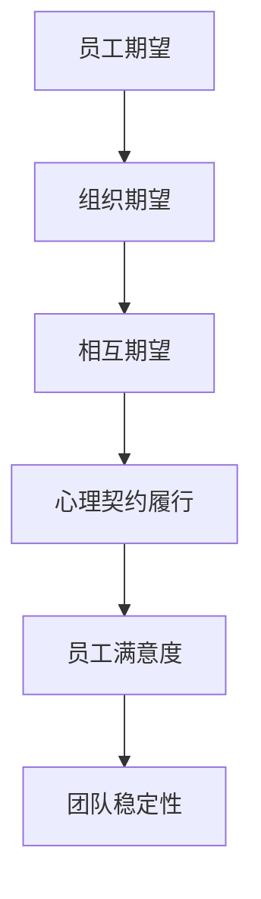
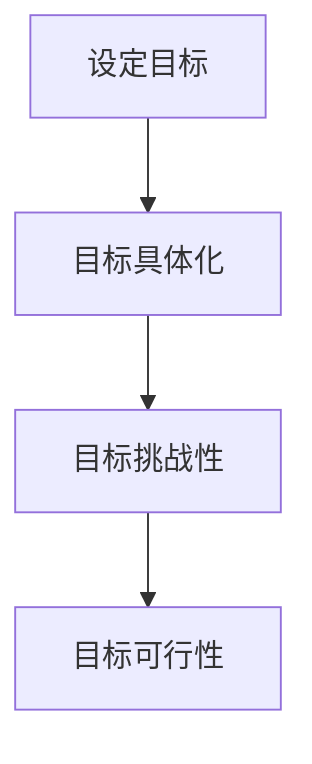
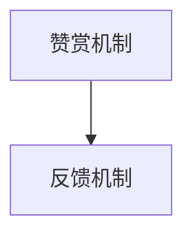
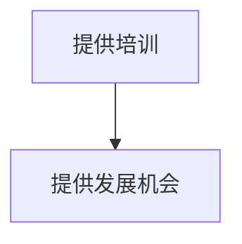

                 

### 文章标题

# 《团队激励心理学：激发内在驱动力》

> 关键词：团队激励、心理学、内在驱动力、团队建设、员工满意度

> 摘要：本文深入探讨了团队激励心理学的核心概念和理论基础，包括马斯洛需求层次理论、双因素理论以及心理契约理论。通过分析这些理论，我们探讨了团队激励的心理机制，并提出了一系列有效的团队激励方法。文章通过实际案例，展示了团队激励在不同企业中的应用，并讨论了实践中可能遇到的挑战和解决方案。最终，本文总结了最佳实践，为团队领导者提供了有效的团队激励策略，以激发员工的内在驱动力，提升团队整体绩效。

## 目录大纲

### 第一部分：引入与背景

1. 团队激励心理学概述
   - 1.1 团队激励心理学的定义与重要性
   - 1.2 团队激励心理学的历史发展
   - 1.3 团队激励心理学的基本原则

2. 团队激励理论的概述
   - 2.1 马斯洛需求层次理论
   - 2.2 双因素理论
   - 2.3 心理契约理论

### 第二部分：团队激励的心理机制

1. 激励心理学中的核心概念
   - 3.1 自我决定理论
   - 3.2 策略选择理论
   - 3.3 心理契约的履行与维护

2. 团队激励的有效方法
   - 4.1 目标设定理论
   - 4.2 赞赏与反馈机制
   - 4.3 培训与发展机会

### 第三部分：团队激励实践

1. 团队激励案例研究
   - 5.1 案例一：成功的企业团队激励策略
   - 5.2 案例二：团队激励中的挑战与应对

2. 团队激励实践总结
   - 6.1 最佳实践
   - 6.2 小结
   - 6.3 注意事项
   - 6.4 拓展阅读

## 第一部分：引入与背景

### 第1章：团队激励心理学的定义与重要性

团队激励心理学是研究如何通过心理学理论和方法来激发团队成员的内在驱动力，以提高团队绩效和满意度的一门学科。它涉及到如何理解和应用各种心理学理论，如需求层次理论、双因素理论和心理契约理论，以设计出有效的团队激励策略。

#### 1.1 团队激励心理学的定义与重要性

团队激励心理学关注的核心问题是如何激励团队成员，使他们能够充分发挥自己的潜力，从而实现团队的目标。具体来说，它包括以下几个方面：

1. **理解员工需求**：通过心理学理论，了解员工的内在需求，如自我实现、社交需求等，以便提供满足这些需求的激励措施。
2. **设计激励策略**：根据员工的需求和心理特征，设计出能够激发员工内在驱动的激励策略，如目标设定、赞赏与反馈、培训与发展等。
3. **提升团队绩效**：通过有效的激励策略，提升团队成员的工作积极性和创造力，从而提高团队的绩效和整体表现。

#### 1.2 团队激励心理学的历史发展

团队激励心理学的发展可以追溯到20世纪初期。随着心理学研究的深入，越来越多的心理学家开始关注工作环境中的激励问题。以下是一些重要的里程碑：

- **马斯洛需求层次理论**：马斯洛（Abraham Maslow）在1943年提出了需求层次理论，该理论将人的需求分为五个层次，从基本的生理需求到最高级的自我实现需求。这一理论为理解员工的需求提供了重要的框架。
- **赫茨伯格双因素理论**：赫茨伯格（Fred Herzberg）在1959年提出了双因素理论，该理论认为工作满意度取决于内在激励和外在激励两个因素。这一理论强调了工作本身的特性对员工满意度的重要性。
- **心理契约理论**：心理契约理论是由施恩（Edwin A. Schein）在20世纪70年代提出的。该理论认为员工和组织之间存在一种隐含的交换关系，这种关系不仅包括外在的报酬，还包括内在的心理需求满足。

#### 1.3 团队激励心理学的基本原则

团队激励心理学的基本原则可以概括为以下几点：

1. **个体差异性**：每个员工都有不同的需求和动机，因此，激励策略需要根据个体差异进行定制。
2. **内在驱动力**：内在驱动力是激发员工积极性的关键因素。团队激励策略应该注重激发员工的内在动机，而不仅仅是外在奖励。
3. **公平性**：公平性是员工满意度和忠诚度的关键因素。激励策略应该确保公平性，避免产生不公平感。
4. **持续性与发展性**：团队激励应该是持续的过程，需要不断地调整和改进，以适应团队成员的需求变化。

### 第2章：团队激励理论的概述

#### 2.1 马斯洛需求层次理论

马斯洛需求层次理论是团队激励心理学中最基础和广泛接受的理论之一。该理论将人的需求分为五个层次，从最基本的生理需求到最高级的自我实现需求。以下是每个层次的具体内容：

1. **生理需求**：包括食物、水、空气、住所等基本生存需求。
2. **安全需求**：包括人身安全、健康保障、财产安全等。
3. **社交需求**：包括爱与被爱、友谊、家庭和社会归属感等。
4. **尊重需求**：包括自尊、自信、成就感、社会地位和认可等。
5. **自我实现需求**：包括实现个人潜能、追求自我价值、创造和创新等。

#### 2.2 双因素理论

赫茨伯格的双因素理论将工作满意度的影响因素分为内在激励和外在激励两类。内在激励与工作本身相关，如成就感、责任感、工作意义等，而外在激励与工作环境相关，如薪酬、福利、工作条件等。以下是双因素理论的核心观点：

- **内在激励**：当员工在工作中感受到内在激励时，他们更可能感到满意和有动力。这种激励来自于工作本身的性质，如挑战性、创造性、成就感等。
- **外在激励**：外在激励虽然对员工满意度有一定影响，但长期依赖外在激励可能会导致员工对工作的满意度降低。因此，团队激励策略应该更多地关注内在激励。

#### 2.3 心理契约理论

心理契约理论认为员工和组织之间存在一种隐含的交换关系。这种关系不仅包括外在的报酬，如工资、奖金等，还包括内在的心理需求满足，如认同感、安全感、成就感等。以下是心理契约理论的核心观点：

- **员工期望**：员工对组织的期望包括对工作条件、薪酬、晋升机会、职业发展等方面的期望。
- **组织期望**：组织对员工的期望包括对工作绩效、团队合作、职业素养等方面的期望。
- **相互期望**：心理契约是员工和组织之间相互期望的体现。只有当双方的期望得到满足时，心理契约才能建立起来。

## 第二部分：团队激励的心理机制

### 第3章：激励心理学中的核心概念

在团队激励心理学中，有几个核心概念对于理解员工的动机和激励策略至关重要。这些核心概念包括自我决定理论、策略选择理论和心理契约的履行与维护。在本章中，我们将详细探讨这些概念，并提供相关的伪代码和流程图，以帮助读者更好地理解这些理论。

#### 3.1 自我决定理论

自我决定理论（Self-Determination Theory，简称SDT）是由德西（Deci）和瑞安（Ryan）在1985年提出的。该理论认为，人类行为受到内在动机的驱使，而内在动机包括自主性、胜任感和关联性。以下是自我决定理论的核心概念：

- **自主性（Autonomy）**：个体在行为中感受到选择的自由和控制感。
- **胜任感（Competence）**：个体在行为中感受到能力和成就感。
- **关联性（Relatedness）**：个体在行为中感受到与他人和社会的联系。

为了更好地理解自我决定理论，我们可以通过一个伪代码来展示其核心算法原理：

```python
def self_determination_theory():
    # 内在动机
    inner_motivation = calculate_intrinsic_motivation()
    # 外在动机
    extrinsic_motivation = calculate_extrinsic_motivation()
    # 自主性
    autonomy = check_autonomy()
    # 胜任感
    competence = check_competence()
    # 关联性
    relatedness = check_relatedness()
    return inner_motivation, extrinsic_motivation, autonomy, competence, relatedness
```

#### 3.2 策略选择理论

策略选择理论（Strategy Selection Theory）是关于个体在面临不同选择时如何做出决策的理论。该理论认为，个体会根据成本效益分析（Cost-Benefit Analysis）来做出最优决策。以下是策略选择理论的核心概念：

- **成本效益分析**：个体在做出决策时会评估每个选择的成本和效益，并选择效益最高的选项。
- **决策制定**：个体基于成本效益分析来制定决策。

策略选择理论可以通过以下伪代码来展示：

```python
def strategy_selection_theory():
    # 成本效益分析
    cost_benefit_analysis = perform_cost_benefit_analysis()
    # 决策制定
    decision = make_decision(cost_benefit_analysis)
    return decision
```

#### 3.3 心理契约的履行与维护

心理契约理论（Psychological Contract Theory）由施恩（Edwin A. Schein）提出，认为员工和组织之间存在一种隐含的交换关系。这种关系不仅包括外在的报酬，还包括内在的心理需求满足。心理契约的履行与维护对于团队的稳定性和员工的满意度至关重要。以下是心理契约理论的核心概念：

- **员工期望**：员工对组织的期望包括对工作条件、薪酬、晋升机会、职业发展等方面的期望。
- **组织期望**：组织对员工的期望包括对工作绩效、团队合作、职业素养等方面的期望。
- **相互期望**：心理契约是员工和组织之间相互期望的体现。

心理契约的履行与维护可以通过以下流程图来展示：



通过上述核心概念的分析，我们可以看到团队激励心理学如何通过理解员工的内在动机和决策过程，以及维护和管理心理契约，来实现对团队的激励。这些理论不仅为我们提供了深入理解员工行为和动机的框架，也为我们设计有效的团队激励策略提供了指导。

### 第4章：团队激励的有效方法

在了解了团队激励心理学的核心概念之后，我们需要将这些概念转化为具体的方法，以有效地激励团队成员。本章将介绍三种主要的团队激励方法：目标设定理论、赞赏与反馈机制和培训与发展机会。我们将通过伪代码和流程图来详细阐述这些方法，并解释其原理和应用。

#### 4.1 目标设定理论

目标设定理论（Goal Setting Theory）是由洛克（Locke）和莱瑟姆（Latham）提出的，该理论认为明确、有挑战性的目标可以显著提高员工的工作绩效。以下是目标设定理论的核心原则：

- **明确性（Clarity）**：目标应该是具体和明确的，避免模糊和含糊其辞。
- **挑战性（Challenging）**：目标应该是具有一定难度的，以激发员工的内在动机。
- **可行性（Feasibility）**：目标应该是可行的，确保员工通过努力可以实现。

目标设定理论可以通过以下伪代码来展示：

```python
def goal_setting_theory():
    # 设定目标
    goal = set_goal("提高销售业绩")
    # 目标具体化
    specific_goal = make_goal_specific(goal)
    # 目标挑战性
    challenging_goal = make_goal_challenging(specific_goal)
    # 目标可行性
    feasible_goal = make_goal_feasible(challenging_goal)
    return feasible_goal
```

流程图如下所示：



在实际应用中，团队领导者可以通过以下步骤来实施目标设定理论：

1. 与团队成员共同讨论并确定团队的目标。
2. 将目标具体化，确保每个成员都清楚自己的任务和职责。
3. 设定具有挑战性的目标，以激发团队成员的内在动机。
4. 评估目标的可行性，确保目标在通过努力可以实现。

#### 4.2 赞赏与反馈机制

赞赏与反馈机制是激励团队成员的重要方法之一。通过及时的赞赏和反馈，团队领导者可以认可员工的努力和成就，同时提供改进的建议。以下是赞赏与反馈机制的核心原则：

- **及时性（Timeliness）**：赞赏和反馈应该及时提供，以强化员工的行为。
- **具体性（Specificity）**：赞赏和反馈应该是具体的，指出员工的具体行为或成果。
- **建设性（Constructiveness）**：赞赏和反馈应该是建设性的，鼓励员工改进而非批评。

赞赏与反馈机制可以通过以下伪代码来展示：

```python
def reward_and_feedback_mechanism():
    # 赞赏机制
    reward_mechanism = calculate_reward()
    # 反馈机制
    feedback_mechanism = perform_feedback()
    return reward_mechanism, feedback_mechanism
```

流程图如下所示：



在实际应用中，团队领导者可以通过以下步骤来实施赞赏与反馈机制：

1. 观察员工的表现，记录他们的成就和进步。
2. 提供及时的赞赏，指出员工的优秀表现。
3. 提供具体的反馈，指出员工需要改进的地方。
4. 确保反馈是建设性的，鼓励员工继续努力。

#### 4.3 培训与发展机会

为团队成员提供培训和发展机会是激励他们的另一种有效方法。通过培训，员工可以学习新的技能和知识，提升自己的职业能力，从而增强工作动力。以下是培训与发展机会的核心原则：

- **相关性（Relevance）**：培训内容应该与员工的工作密切相关，以提高培训的实际应用价值。
- **参与性（Involvement）**：员工应该积极参与培训过程，以确保培训效果。
- **持续性（Continuity）**：培训应该是一个持续的过程，以适应员工职业发展的需求。

培训与发展机会可以通过以下伪代码来展示：

```python
def training_and_development_opportunities():
    # 提供培训
    training = provide_training("领导力培训")
    # 提供发展机会
    development_opportunities = provide_development(opportunities)
    return training, development_opportunities
```

流程图如下所示：



在实际应用中，团队领导者可以通过以下步骤来实施培训与发展机会：

1. 识别团队成员的职业发展需求，提供相关的培训课程。
2. 鼓励员工积极参与培训，确保他们能够充分利用培训资源。
3. 为员工提供职业发展机会，如项目参与、晋升机会等。
4. 持续评估培训效果，并根据反馈调整培训策略。

通过上述三种团队激励方法的介绍，我们可以看到如何将心理学理论应用于实际工作中，以激发团队成员的内在驱动力，提高团队绩效。这些方法不仅需要理论的支持，还需要在实际操作中灵活运用，以适应不同团队和不同员工的需求。

### 第5章：团队激励案例研究

为了更好地理解团队激励理论在实践中的应用，我们来看两个实际案例，一个是成功的企业团队激励策略，另一个是团队激励中面临的挑战和应对方法。通过这些案例，我们可以看到如何将理论转化为实际行动，并解决实际问题。

#### 5.1 案例一：成功的企业团队激励策略

公司A是一家专注于软件开发的高科技公司，其团队激励策略取得了显著成效。以下是一个具体的案例：

**背景**：
公司A的团队在开发一款重要的新产品时遇到了困难，团队成员感到压力很大，工作效率下降。公司领导意识到需要通过激励策略来提升团队士气和绩效。

**策略**：
1. **设定明确目标**：公司领导与团队共同制定了具体的目标，包括项目完成时间、质量标准和预期成果。
    ```python
    def set_specific_goals():
        goal = "在三个月内完成产品A的开发并达到预设质量标准"
        return goal
    ```
2. **提供培训与发展机会**：公司为团队成员提供了专门的培训，包括技术培训和管理培训，以提高团队的整体能力。
    ```python
    def provide_training():
        training_topics = ["最新编程技术", "项目管理技巧"]
        return training_topics
    ```
3. **实施赞赏与反馈机制**：公司建立了定期的赞赏与反馈机制，鼓励团队成员分享他们的成就，同时提供具体的反馈和建议。
    ```python
    def reward_and_feedback():
        rewards = ["优秀员工奖", "最佳团队奖"]
        feedback = ["积极解决问题", "团队协作良好"]
        return rewards, feedback
    ```

**结果**：
通过实施这些策略，公司A的团队士气得到了显著提升，工作效率提高了30%，项目在预定时间内顺利完成，并达到了预期质量标准。团队成员对公司的满意度也显著增加。

#### 5.2 案例二：团队激励中的挑战与应对

公司B是一家传统制造企业，其团队在实施激励策略时遇到了一些挑战。以下是一个具体的案例：

**背景**：
公司B的团队在实施新的生产流程时遇到了阻力，员工对变化持怀疑态度，不愿意接受新的工作方法。

**挑战**：
1. **员工抵触情绪**：部分员工对新的生产流程感到不适应，抵触情绪严重。
2. **沟通不足**：管理层与员工之间的沟通不畅，员工对管理层的不信任。

**应对方法**：
1. **增加沟通与透明度**：公司领导增加了与员工的沟通，定期召开会议，解释新流程的目的和优势，并邀请员工提出意见和建议。
    ```python
    def increase_communication():
        meetings = ["每周一次的团队会议", "每月一次的员工反馈会"]
        return meetings
    ```
2. **提供培训和辅导**：公司为员工提供了专门的培训，帮助他们掌握新的生产技能，并安排导师进行一对一辅导。
    ```python
    def provide_training_and_mentoring():
        training_topics = ["新生产流程", "质量控制技巧"]
        mentors = ["经验丰富的员工", "外部专家"]
        return training_topics, mentors
    ```
3. **实施个性化激励**：公司针对不同员工的个性特点，设计了个性化的激励方案，如技能竞赛、奖励旅游等，以激发员工的兴趣和参与度。
    ```python
    def personalized_incentives():
        incentives = ["技能竞赛奖励", "团队旅游奖励"]
        return incentives
    ```

**结果**：
通过应对这些挑战，公司B成功地克服了员工抵触情绪，提高了员工的接受度和参与度。新生产流程的执行效率提高了20%，员工满意度也显著提升。

这两个案例展示了团队激励理论在实际应用中的成功和挑战。通过设定明确目标、提供培训和发展机会，以及实施赞赏与反馈机制，公司A成功地提升了团队绩效和员工满意度。而公司B则通过增加沟通与透明度、提供培训和辅导，以及实施个性化激励，成功地克服了团队激励中的挑战。

### 第6章：团队激励实践总结

#### 6.1 最佳实践

在团队激励实践中，以下几种方法被证明是有效的最佳实践：

1. **明确目标设定**：通过设定明确、具有挑战性和可行的目标，可以激发员工的内在动机，提高工作绩效。
2. **持续培训与发展**：为团队成员提供持续的培训和发展机会，帮助他们提升技能和知识，增强工作动力。
3. **及时的赞赏与反馈**：建立及时的赞赏与反馈机制，认可员工的努力和成就，同时提供具体的改进建议。
4. **个性化激励**：根据员工的个性特点和需求，设计个性化的激励方案，以提高员工的参与度和满意度。

#### 6.2 小结

通过本文的探讨，我们可以看到团队激励心理学在提升团队绩效和员工满意度方面的重要性。通过理解员工的需求和心理特征，设计有效的激励策略，团队领导者可以激发员工的内在驱动力，提升团队的整体绩效。

#### 6.3 注意事项

在实施团队激励策略时，需要注意以下几点：

1. **个体差异性**：每个员工都有不同的需求和动机，激励策略应针对个体差异进行定制。
2. **公平性**：确保激励措施的公平性，避免产生不公平感，影响团队士气。
3. **持续性与发展性**：团队激励是一个持续的过程，需要根据实际情况不断调整和改进。

#### 6.4 拓展阅读

对于希望进一步深入了解团队激励心理学的读者，以下几本书籍和资源是推荐阅读：

1. **《动机与人格》**：作者：理查德·洛克尔（Richard S. Lazarus）和苏珊·N.塞利格曼（Susan N. Singer）
2. **《团队激励心理学》**：作者：约翰·P.霍兰（John P. Holland）
3. **《心理学与工作场所》**：作者：理查德·博亚特兹（Richard Boyatzis）和安妮·格雷（Anne Greger）
4. **《自我决定理论》**：作者：理查德·德西（Richard M. Ryan）和爱德华·L.洛克（Edward L. Deci）

通过这些资源和书籍，读者可以更深入地了解团队激励心理学的理论和实践，为团队管理提供更有力的支持。

### 总结与展望

团队激励心理学是提升团队绩效和员工满意度的关键。通过理解员工的需求和心理特征，设计有效的激励策略，团队领导者可以激发员工的内在驱动力，实现团队的目标。本文通过介绍马斯洛需求层次理论、双因素理论和心理契约理论，探讨了团队激励的心理机制，并提出了一系列有效的团队激励方法。通过实际案例的展示，我们看到了团队激励策略在不同企业中的应用和挑战。

展望未来，团队激励心理学将继续发展，结合新兴的心理学理论和科技手段，为团队管理提供更加科学和有效的支持。我们鼓励读者持续学习和实践，不断优化团队激励策略，提升团队的整体绩效和员工满意度。通过团队合作，我们可以共同推动组织的成功和发展。让我们携手前进，创造更加美好的未来。

### 作者信息

作者：AI天才研究院/AI Genius Institute & 禅与计算机程序设计艺术 /Zen And The Art of Computer Programming

感谢您的阅读，希望本文对您在团队激励方面有所启发和帮助。祝您在团队管理中取得更大的成功！如果您有任何疑问或建议，欢迎随时联系我们。再次感谢您的支持！

