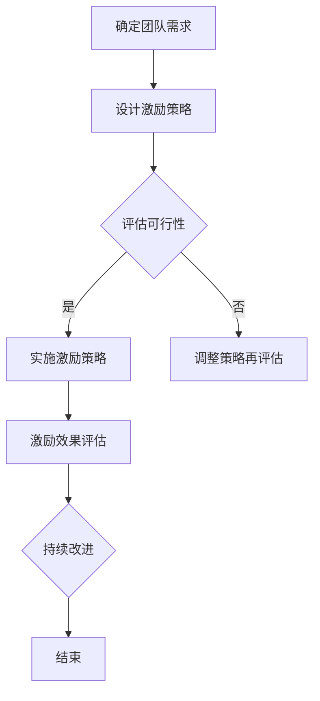

                 

### 文章标题：团队激励系统设计：结合内在动力与外部激励

**关键词：** 团队激励系统，内在动力，外部激励，激励策略，实施与评估，案例研究

**摘要：** 本文旨在探讨团队激励系统的设计原则、实施策略以及评估方法。通过分析内在动力与外部激励的相互作用，本文提出了结合两者优化团队激励的有效途径。同时，通过具体案例研究和项目实战，本文提供了实际操作指南和实用建议，以帮助企业和团队建立可持续的激励系统。

### 引言

在企业管理中，团队激励系统被视为提高员工绩效和推动团队发展的关键因素。有效的团队激励系统不仅能够提升员工的积极性和创造力，还能增强团队的凝聚力和协作能力。然而，设计一个既符合员工需求又能推动团队整体发展的激励系统并非易事。本文将围绕团队激励系统的核心概念、设计原则、实施策略和评估方法进行深入探讨，旨在为企业和团队提供一套系统化、可操作的激励解决方案。

团队激励系统涉及两个方面：内在动力和外部激励。内在动力是指员工自身对于工作本身的兴趣、热情和成就感，它是激励系统的基础。外部激励则包括物质奖励、荣誉认可、职业发展等，它是对员工内在动力的补充和强化。两者相辅相成，共同作用于员工的动机和行为，进而影响团队的整体表现。

本文将从以下四个部分展开：

1. **团队激励系统的基本概念与原理**：介绍团队激励系统的定义、组成部分、目标与作用，并分析内在动力和外部激励的概念及其相互作用。
2. **团队激励系统的具体实施策略**：探讨如何激发员工的内在动力以及如何运用外部激励策略来提升团队绩效。
3. **团队激励系统的实施与评估**：阐述团队激励系统的实施步骤、评估指标与方法，以及如何根据评估结果进行系统优化。
4. **案例研究与分析**：通过具体案例展示团队激励系统的成功实践，并分析其中存在的问题及解决方案。

本文的目标是帮助读者理解团队激励系统的核心概念和实践方法，为其在实际工作中设计和实施激励系统提供有益的指导。

### 第一部分：团队激励系统的基本概念与原理

#### 第1章：团队激励系统概述

##### 1.1 团队激励系统的定义与重要性

团队激励系统是一种通过系统化的激励策略和措施来提高员工工作积极性、促进团队协作和提升整体绩效的管理工具。它不仅关注个体员工的激励，更强调团队整体的发展和目标实现。团队激励系统的核心在于通过合理的激励机制，激发员工的工作热情和创新能力，从而推动团队的高效运作。

在现代企业中，团队激励系统的重要性不容忽视。首先，它有助于提升员工的满意度和忠诚度。通过满足员工的内在需求和提供外部激励，企业能够增强员工的归属感和工作动力。其次，团队激励系统能够促进团队的协作和凝聚力。当团队成员感受到公平和认可的激励时，他们更愿意协同合作，共同追求团队目标。最后，团队激励系统能够提高组织的整体绩效。通过激发员工的潜能和创造力，企业能够实现更高的生产效率和创新成果，从而在激烈的市场竞争中脱颖而出。

##### 1.2 团队激励系统的核心组成部分

团队激励系统由多个核心组成部分构成，这些部分相互关联，共同作用，以实现激励效果的最大化。以下是团队激励系统的核心组成部分及其简要说明：

1. **激励目标**：激励目标是团队激励系统的核心，它明确团队期望通过激励系统实现的具体目标和成果。激励目标应具有明确性、可衡量性和可实现性，以引导激励策略的制定和执行。

2. **激励策略**：激励策略是团队激励系统的具体实施方案，它包括内在动力激发策略和外部激励实施策略。内在动力激发策略主要关注培养员工的自我效能感、增强工作兴趣和投入等；外部激励实施策略则包括薪酬激励、荣誉与认可激励、培训与发展激励等。

3. **激励机制**：激励机制是实现激励目标的具体手段和工具，它包括薪酬体系、荣誉制度、晋升机制、培训计划等。激励机制的设计应与企业的战略目标和文化价值观相一致，以最大化激励效果。

4. **激励评估**：激励评估是团队激励系统的重要组成部分，它通过设定评估指标、方法和工具，对激励策略的实施效果进行客观评估。激励评估的结果可以为激励系统的优化提供重要依据。

5. **反馈机制**：反馈机制是团队激励系统的重要保障，它通过及时反馈激励效果和员工表现，帮助团队和管理者了解激励系统的工作状况，并做出相应调整。有效的反馈机制能够促进激励系统的持续优化和改进。

##### 1.3 团队激励系统的目标与作用

团队激励系统的目标主要包括提升员工工作积极性、促进团队协作、提升整体绩效等。具体来说，团队激励系统具有以下几方面的作用：

1. **提升员工工作积极性**：通过满足员工的内在需求和提供外部激励，团队激励系统能够激发员工的工作热情和动力，提高员工的工作效率和质量。

2. **促进团队协作**：团队激励系统能够增强团队成员之间的信任和合作，促进团队目标的实现。通过合理的激励机制，团队成员更愿意协同合作，共同应对挑战。

3. **提升整体绩效**：团队激励系统能够激发员工的潜能和创造力，提高团队的整体绩效。通过激励系统，企业能够实现更高的生产效率和创新成果，从而在市场竞争中取得优势。

4. **优化企业文化建设**：团队激励系统能够促进企业文化的建设和传播。通过激励系统，企业能够传递出公平、公正、开放、创新的价值观，增强员工对企业的认同感和归属感。

综上所述，团队激励系统在企业管理中具有重要的作用，它不仅能够提升员工的工作积极性，还能促进团队协作和整体绩效的提升，进而推动企业的可持续发展。

#### 第2章：内在动力与外部激励

##### 2.1 内在动力的概念与特征

内在动力是指个体内部产生的动机和驱动力，它源自于个体对工作本身的价值认同、兴趣和热情。与外部激励不同，内在动力不是由外部因素直接驱动，而是由个体自身的需求、兴趣和价值观所决定。内在动力主要包括以下几个方面：

1. **兴趣与爱好**：个体对工作或任务的兴趣和爱好是内在动力的基础。当个体对工作内容感兴趣时，他们会更愿意投入时间和精力，享受工作过程。

2. **成就感**：成就感是内在动力的重要组成部分。当个体完成一项任务或实现一个目标时，他们会感受到成就感和自豪感，从而增强内在动力。

3. **自我效能感**：自我效能感是指个体对自己完成任务的信心和能力的认知。当个体认为自己能够胜任某项任务时，他们会更有动力去完成它。

4. **价值观**：个体的价值观对其内在动力有重要影响。当个体的价值观与工作内容相一致时，他们会更愿意为工作付出努力。

内在动力的特征主要体现在以下几个方面：

1. **自主性**：内在动力是自主产生的，不受外部因素的直接影响。个体可以根据自己的兴趣和需求，自主决定投入多少精力和时间。

2. **稳定性**：内在动力相对于外部激励更为稳定。外部激励可能会因为外部环境的变化而波动，但内在动力则更多地依赖于个体自身的内在需求和价值观。

3. **持久性**：内在动力可以持续较长时间，不会因为短期奖励而消失。个体在长期内对工作保持热情和动力，是实现持续高绩效的关键。

##### 2.2 外部激励的概念与特征

外部激励是指通过外部因素来激发个体行为的动机和驱动力，通常包括物质奖励、荣誉认可、晋升机会等。外部激励的特点是直接作用于个体，通过满足个体的一些外在需求来激发其行为。

外部激励主要包括以下几个方面：

1. **薪酬激励**：薪酬激励是外部激励中最常见的形式。通过提高员工的薪酬水平，可以激发员工的工作积极性和绩效表现。

2. **荣誉与认可**：荣誉与认可激励通过表彰员工的杰出表现和贡献，增强员工的荣誉感和自豪感，从而激励他们继续努力。

3. **晋升机会**：晋升机会激励员工通过提升自己的职位和职责，获得更多的职业发展和成长空间。

外部激励的特征主要体现在以下几个方面：

1. **直接性**：外部激励直接作用于个体，通过满足其物质或精神需求来激发其行为。

2. **即时性**：外部激励的效果通常比较明显，能够在短时间内提升个体的动机和绩效。

3. **功利性**：外部激励更注重短期效果，往往与个体的直接利益相关。

##### 2.3 内在动力与外部激励的相互作用

内在动力与外部激励在团队激励系统中相互补充，共同作用于员工的动机和行为。以下是两者之间的相互作用：

1. **互补关系**：内在动力和外部激励各有优势，相互补充。内在动力能够提供持续的动机和稳定性，而外部激励则能够提供即时的激励和奖励。两者结合，可以更全面地激发员工的工作热情和动力。

2. **强化作用**：内在动力和外部激励可以相互强化。当外部激励与内在动力相一致时，它们能够共同增强员工的工作动力。例如，当员工因为对工作的热爱而取得优异成绩时，外部荣誉和薪酬的认可可以进一步强化他们的内在动力。

3. **替代作用**：在特定情况下，内在动力和外部激励可以相互替代。例如，当外部激励不足时，员工可能会通过增强内在动力来维持工作热情。同样，当内在动力不足时，适当的外部激励可以弥补这一缺陷。

4. **平衡作用**：内在动力和外部激励的平衡对于团队激励系统至关重要。如果只有外部激励，员工可能会过度依赖外部奖励，而忽视内在需求的满足。反之，如果只有内在动力，员工可能会因为缺乏外部激励而感到动力不足。因此，设计一个有效的团队激励系统，需要综合考虑内在动力和外部激励，寻求二者的平衡。

综上所述，内在动力与外部激励在团队激励系统中具有密切的关联和相互作用。通过合理运用两者，可以激发员工的工作热情和动力，提升团队的整体绩效。下一章将详细探讨如何设计团队激励系统，以充分发挥内在动力和外部激励的效用。

#### 第3章：团队激励系统的设计原则

##### 3.1 设计原则概述

设计一个有效的团队激励系统，需要遵循一系列原则，以确保激励策略能够切实符合团队需求，并最大化激励效果。以下是团队激励系统设计的主要原则：

1. **目标一致性**：激励系统的目标应与企业的战略目标和团队的具体目标保持一致。只有当激励目标与团队目标一致时，才能确保激励策略的有效性和针对性。

2. **公平性**：公平性是激励系统设计的重要原则。公平性体现在激励机会的公平、激励结果的公平以及激励分配的公平。确保每位员工都有平等的激励机会，能够激发员工的积极性和公平感。

3. **激励多样性**：团队激励系统应涵盖多种激励形式，包括物质激励、精神激励、职业发展激励等。多样化的激励形式能够满足不同员工的需求，提高激励效果。

4. **透明性**：激励系统的设计和实施过程应具有透明性，使员工能够清晰地了解激励标准、规则和程序。透明性能够增强员工的信任感和参与感，提高激励系统的公信力。

5. **灵活性**：激励系统需要具备一定的灵活性，以适应不断变化的市场环境和团队需求。灵活的激励策略能够及时调整，以应对新的挑战和机遇。

6. **可持续性**：激励系统的设计应考虑其长期可持续性。通过建立可持续的激励机制，企业能够持续激发员工的工作热情和动力，实现长期发展。

##### 3.2 针对团队成员的激励策略

针对团队成员的激励策略应注重激发员工的内在动力和提供外部激励。以下是具体的激励策略：

1. **培养员工自我效能感**：
   - 提供培训和发展机会，提升员工的技能和能力。
   - 设定明确的目标和任务，帮助员工实现自我提升。
   - 提供及时的反馈和认可，增强员工的成就感。

2. **增强员工对工作的兴趣与投入**：
   - 创造有趣和富有挑战性的工作环境，提高员工的工作积极性。
   - 通过团队活动和文化建设，增强员工的归属感和团队意识。
   - 提供多样化的工作任务，满足员工的不同兴趣和需求。

3. **建立积极的团队文化**：
   - 倡导合作、互助和开放的团队文化，营造积极的工作氛围。
   - 通过表彰和奖励，鼓励员工的优秀表现和团队合作精神。
   - 定期组织团队建设活动，增强团队凝聚力和协作能力。

##### 3.3 针对团队的激励策略

针对团队的激励策略应着眼于提高团队的整体绩效和协作效率。以下是具体的激励策略：

1. **目标导向**：
   - 设定清晰的团队目标和绩效指标，确保团队成员明确自己的工作方向和任务。
   - 通过阶段性目标和奖励机制，激励团队不断追求卓越。

2. **协作激励**：
   - 鼓励团队合作，通过团队奖励和团队竞赛等形式，增强团队的协作意识和合作精神。
   - 举办团队建设活动，提高团队成员之间的信任和沟通。

3. **荣誉与认可**：
   - 建立公正和透明的荣誉制度，对团队和个人的优秀表现进行表彰和奖励。
   - 通过公开表扬和奖励，增强团队成员的荣誉感和自豪感。

4. **薪酬激励**：
   - 设定具有竞争力的薪酬体系，确保团队的薪酬水平与市场竞争力相匹配。
   - 通过绩效奖金和股权激励等长期激励手段，提高团队成员的长期动力。

综上所述，团队激励系统的设计原则和策略需要综合考虑团队成员的个体需求和团队的整体目标，通过灵活运用内在动力和外部激励，实现激励效果的最大化。

### 第二部分：团队激励系统的具体实施策略

#### 第4章：内在动力激发策略

##### 4.1 培养员工自我效能感

培养员工自我效能感是激发内在动力的重要策略。自我效能感是指员工对自己完成任务的信心和能力的感觉，它是内在动力的重要来源。以下是培养员工自我效能感的具体方法：

1. **提供培训和发展机会**：
   - 为员工提供专业的培训课程，帮助其提升技能和知识水平。
   - 提供在线学习资源和自主学习平台，方便员工随时进行学习和提升。
   - 鼓励员工参加外部培训和认证，拓宽其职业发展道路。

2. **设定明确的目标和任务**：
   - 设定具体、可实现的短期和长期目标，帮助员工明确工作方向和任务。
   - 将目标分解为具体的行动计划，使员工能够逐步实现目标。
   - 通过阶段性目标达成，增强员工的成就感和自我效能感。

3. **提供及时的反馈和认可**：
   - 定期对员工的工作进行评估和反馈，帮助其了解自己的工作表现。
   - 对员工的努力和成绩给予积极的反馈和认可，增强其自信心。
   - 在员工遇到困难时，提供必要的支持和帮助，帮助其克服挑战。

4. **创造支持性的工作环境**：
   - 建立积极的工作氛围，鼓励员工相互支持和帮助。
   - 提供良好的工作条件和工作环境，减轻员工的工作压力。
   - 定期组织团队建设活动，增强员工的归属感和团队凝聚力。

通过上述方法，企业可以有效地培养员工的自我效能感，从而激发其内在动力，提高工作绩效。

##### 4.2 增强员工对工作的兴趣与投入

增强员工对工作的兴趣与投入是激发内在动力的另一个重要策略。以下是增强员工兴趣与投入的具体方法：

1. **创造有趣和富有挑战性的工作环境**：
   - 设计富有挑战性和创新性的工作任务，激发员工的兴趣和热情。
   - 提供多样化的工作内容，使员工能够在不同领域和项目中成长和挑战自己。
   - 创造一个开放和自由的工作氛围，鼓励员工提出新的想法和解决方案。

2. **通过团队活动和文化建设增强归属感**：
   - 定期组织团队活动，如团队建设训练、户外拓展、员工聚餐等，增强团队成员之间的互动和信任。
   - 倡导团队文化和价值观，使员工能够感受到团队的凝聚力和共同目标。
   - 通过团队奖励和表彰，鼓励团队合作和协作精神。

3. **提供多样化的工作任务和职业发展机会**：
   - 为员工提供多样化的工作机会，使其能够在不同岗位和项目中积累经验。
   - 设立职业发展路径，为员工提供明确的职业规划和晋升机会。
   - 提供培训和发展的资源，帮助员工实现职业目标和自我提升。

4. **鼓励员工参与决策和项目管理**：
   - 鼓励员工参与团队和公司的决策过程，使其感受到自己对团队的贡献和价值。
   - 提供项目管理的机会，使员工能够实践和提升自己的管理能力。
   - 通过员工建议和反馈机制，鼓励员工积极参与公司的发展和创新。

通过上述方法，企业可以有效地增强员工对工作的兴趣与投入，激发其内在动力，提高工作效率和质量。

##### 4.3 建立积极的团队文化

建立积极的团队文化是激发内在动力的关键策略之一。一个积极向上的团队文化能够激发员工的潜能，提高团队的整体绩效。以下是建立积极团队文化的具体方法：

1. **明确团队愿景和价值观**：
   - 与团队成员共同制定团队愿景和价值观，使其成为团队的共同目标和行为准则。
   - 通过定期的团队会议和活动，不断强化团队的愿景和价值观。

2. **倡导合作与互助精神**：
   - 倡导团队合作和协作精神，鼓励团队成员相互支持和帮助。
   - 设立团队奖励机制，对团队合作和协作精神突出的个人和团队进行表彰。

3. **提供良好的沟通渠道**：
   - 建立开放的沟通渠道，使团队成员能够自由地表达意见和建议。
   - 定期组织团队会议和讨论，促进团队成员之间的沟通和交流。

4. **激励员工参与团队建设**：
   - 鼓励员工积极参与团队建设和创新，提供必要的资源和支持。
   - 通过员工建议和反馈机制，激发员工的积极性和创造力。

5. **建立公平和透明的激励机制**：
   - 设定公平和透明的激励机制，确保每位员工都能在公平的环境中获得认可和奖励。
   - 通过定期评估和反馈，确保激励机制的有效性和公正性。

通过上述方法，企业可以有效地建立积极的团队文化，激发员工的内在动力，提高团队的整体绩效。

#### 第5章：外部激励实施策略

##### 5.1 薪酬激励策略

薪酬激励是外部激励中最常用和最直接的一种形式，它通过提高员工的薪酬水平来激发其工作积极性。以下是一些有效的薪酬激励策略：

1. **设定具有竞争力的薪酬水平**：
   - 调查市场薪酬水平，确保员工的薪酬与同行业、同岗位的市场竞争力相匹配。
   - 根据员工的绩效和工作成果，给予适当的薪酬调整，以体现绩效和贡献。

2. **绩效薪酬**：
   - 设立绩效薪酬制度，将员工的薪酬与绩效直接挂钩，激励员工追求高绩效。
   - 制定明确的绩效评估标准和流程，确保评估过程的公正性和透明性。

3. **奖金和提成**：
   - 设立项目奖金和销售提成制度，对完成特定目标和任务的员工进行奖励。
   - 奖金和提成的发放应与员工的工作成果和公司业绩相挂钩，以激励员工努力工作。

4. **长期激励**：
   - 提供股权激励、期权等长期激励手段，使员工能够分享公司的发展成果。
   - 设定明确的股权激励计划和退出机制，确保员工对长期激励的合理预期和利益保障。

5. **福利待遇**：
   - 提供具有吸引力的福利待遇，如医疗保险、养老保险、带薪休假等，增强员工的工作满意度和归属感。
   - 定期评估和调整福利待遇，以适应员工的需求和市场变化。

通过上述策略，企业可以有效地实施薪酬激励，提升员工的工作动力和绩效。

##### 5.2 荣誉与认可激励策略

荣誉与认可激励通过表彰和奖励员工的优秀表现和贡献，增强其荣誉感和自豪感。以下是一些有效的荣誉与认可激励策略：

1. **设立荣誉制度**：
   - 设立各类荣誉奖项，如年度最佳员工、优秀团队、创新奖等，以表彰员工的卓越表现。
   - 设定明确的评选标准和流程，确保评选过程的公正性和透明性。

2. **公开表彰**：
   - 通过公司内部网站、内部刊物、员工大会等渠道，公开表彰获奖员工的成就。
   - 邀请员工家属参加表彰活动，让员工感受到家庭的支持和认可。

3. **物质奖励**：
   - 提供奖金、奖品等物质奖励，作为对员工贡献的认可和鼓励。
   - 奖金和奖品的设计应贴近员工的需求和喜好，以提高激励效果。

4. **荣誉墙和展示**：
   - 在公司内部设立荣誉墙，展示获奖员工的照片和事迹。
   - 通过展示平台，使员工的荣誉得到更广泛的认可和传播。

5. **职业发展机会**：
   - 为获奖员工提供更多的职业发展机会，如晋升、培训等。
   - 通过职业发展计划，帮助员工实现职业目标和自我提升。

通过上述策略，企业可以有效地实施荣誉与认可激励，提升员工的工作积极性和归属感。

##### 5.3 培训与发展激励策略

培训与发展激励通过提供职业发展机会和学习资源，激发员工的内在动力和长期潜力。以下是一些有效的培训与发展激励策略：

1. **制定职业发展计划**：
   - 为每位员工制定详细的职业发展计划，明确其职业目标和成长路径。
   - 定期与员工沟通，评估其发展进度，并根据需要调整计划。

2. **提供培训和学习资源**：
   - 提供多样化的培训课程和学习资源，如内部培训、在线课程、书籍等。
   - 鼓励员工自主学习和提升，提供学习补贴和培训假等支持措施。

3. **外部培训与认证**：
   - 组织员工参加外部培训和认证，提升其专业技能和职业素养。
   - 为通过认证的员工提供奖励和晋升机会，激励其持续学习和成长。

4. **导师制度和师徒计划**：
   - 建立导师制度和师徒计划，帮助新员工快速融入团队，提升其工作能力和绩效。
   - 通过导师的指导和帮助，促进新员工的成长和职业发展。

5. **职业发展论坛和交流**：
   - 举办职业发展论坛和交流活动，为员工提供学习、交流和分享的平台。
   - 通过论坛和交流，促进员工之间的经验交流和职业发展合作。

通过上述策略，企业可以有效地实施培训与发展激励，提升员工的职业素养和工作动力。

#### 第6章：综合运用内在动力与外部激励

##### 6.1 激励策略的匹配与调整

综合运用内在动力与外部激励，需要确保两者在激励系统中的匹配与协调。以下是实现这一目标的方法：

1. **明确激励目标**：
   - 确定团队和个人的激励目标，明确内在动力和外部激励的具体作用和侧重点。
   - 将内在动力和外部激励的目标与企业的整体战略目标相一致，确保激励系统的整体性。

2. **合理分配资源**：
   - 根据团队和个人的需求，合理分配内在动力和外部激励的资源。
   - 确保激励资源的分配既能够激发员工的内在动力，又能够提供外部激励的支持。

3. **动态调整策略**：
   - 根据员工的表现和反馈，动态调整内在动力和外部激励的策略。
   - 及时发现和解决激励系统中的问题，确保激励效果的最大化。

##### 6.2 激励策略的实施与反馈

激励策略的有效实施和持续的反馈是确保激励效果的重要环节。以下是实施和反馈的具体方法：

1. **制定详细的实施计划**：
   - 制定详细的激励策略实施计划，明确实施的时间表、步骤和责任人。
   - 确保激励策略的实施过程具有可操作性和可衡量性。

2. **实施过程监控**：
   - 在激励策略实施过程中，进行实时监控和评估，确保实施计划的执行情况。
   - 通过定期检查和反馈，及时发现和纠正实施中的问题。

3. **提供及时的反馈**：
   - 对员工的激励效果进行及时的反馈，使员工了解自己的表现和改进方向。
   - 通过正向反馈和激励，增强员工的积极性和自我效能感。

4. **持续改进**：
   - 根据反馈结果，对激励策略进行调整和优化，确保其持续有效性。
   - 通过持续的改进和优化，不断提升激励系统的效能。

##### 6.3 激励策略的评估与优化

激励策略的评估与优化是确保激励系统有效运行的关键。以下是评估与优化的具体方法：

1. **设定评估指标**：
   - 根据激励目标，设定具体的评估指标，如员工满意度、绩效指标、团队协作指标等。
   - 确保评估指标具有可衡量性和可比性，以便进行客观评估。

2. **采用多种评估方法**：
   - 采用问卷调查、访谈、观察等多种评估方法，全面了解激励策略的实施效果。
   - 通过不同评估方法的结合，提高评估结果的准确性和可靠性。

3. **定期评估与反馈**：
   - 定期对激励策略进行评估，收集员工的反馈意见和表现数据。
   - 通过评估结果，识别激励系统中的优势和不足，为优化提供依据。

4. **持续优化与改进**：
   - 根据评估结果，对激励策略进行持续的优化和改进。
   - 通过不断调整和优化，确保激励系统的适应性和有效性。

通过匹配与调整、实施与反馈以及评估与优化，企业可以有效地综合运用内在动力与外部激励，建立一个可持续、高效和具有激励效果的团队激励系统。

### 第三部分：团队激励系统的实施与评估

#### 第7章：团队激励系统的实施步骤

##### 7.1 确定激励目标与需求

确定激励目标与需求是实施团队激励系统的第一步，也是最为关键的一步。只有明确了激励的目标和需求，才能制定出符合实际、具有针对性的激励策略。以下是具体的方法和步骤：

1. **分析企业战略目标**：
   - 首先，需要明确企业的整体战略目标，包括短期和长期目标。这些目标将直接影响团队激励系统的设计方向。
   - 分析企业的核心业务和关键绩效指标（KPI），确定哪些方面的绩效提升需要通过激励系统来实现。

2. **了解员工需求**：
   - 通过问卷调查、访谈、座谈会等方式，收集员工对激励的需求和期望。
   - 分析员工的需求，包括薪酬、职业发展、工作环境、团队文化等方面，确保激励系统能够满足员工的多样化需求。

3. **设定具体激励目标**：
   - 结合企业战略目标和员工需求，设定具体的激励目标。这些目标应具有明确性、可衡量性和可实现性，如提高员工满意度、提升团队绩效、增强员工忠诚度等。
   - 将激励目标细化为具体的子目标，确保每个目标都有明确的执行路径和评估标准。

4. **制定激励策略**：
   - 根据设定的激励目标，制定具体的激励策略。这些策略应涵盖内在动力激发策略和外部激励实施策略，确保能够全面激发员工的内在动力和提供外部激励。

##### 7.2 制定激励策略与方案

制定激励策略与方案是实施团队激励系统的关键环节。一个有效的激励策略与方案应具有针对性、可行性和可持续性。以下是具体的方法和步骤：

1. **分析现有激励资源**：
   - 评估企业现有的激励资源，包括薪酬体系、荣誉制度、培训计划等。
   - 确定哪些激励资源可以继续利用，哪些需要调整或补充。

2. **设计激励策略**：
   - 根据员工需求和激励目标，设计具体的激励策略。这些策略应包括薪酬激励、荣誉与认可激励、职业发展激励等。
   - 设计策略时，要考虑激励的公平性、透明性和灵活性，确保激励系统能够适应不同员工和团队的需求。

3. **制定激励方案**：
   - 将激励策略具体化为激励方案，包括激励方案的内容、实施流程、评估标准等。
   - 激励方案应明确具体的激励措施，如薪酬调整、晋升机会、培训计划等，并制定详细的实施步骤和时间表。

4. **制定实施计划**：
   - 制定详细的实施计划，明确激励策略与方案的执行责任人、执行时间表和评估标准。
   - 确保实施计划具有可操作性和可衡量性，以便于执行和评估。

##### 7.3 激励策略的执行与监督

激励策略的执行与监督是确保激励系统有效运行的重要环节。以下是具体的方法和步骤：

1. **宣传与动员**：
   - 在激励策略与方案实施前，进行广泛的宣传和动员，让员工了解激励系统的目的、内容和实施方式。
   - 通过内部会议、公告、邮件等方式，传达激励策略与方案的具体内容，提高员工的知晓度和参与度。

2. **执行与监督**：
   - 按照实施计划，逐步执行激励策略与方案，确保各项激励措施得到落实。
   - 建立监督机制，定期检查激励策略的执行情况，确保激励措施的有效性和公正性。

3. **反馈与调整**：
   - 定期收集员工的反馈意见，了解激励策略的执行效果和员工的需求变化。
   - 根据反馈结果，及时调整激励策略与方案，优化激励措施，提高激励效果。

4. **评估与总结**：
   - 在激励策略与方案实施结束后，进行全面的评估与总结，评估激励效果和实施过程中的问题。
   - 总结经验教训，为下一次激励系统的设计和实施提供参考。

通过上述步骤，企业可以确保团队激励系统的有效实施和运行，从而激发员工的内在动力和提升团队绩效。

#### 第8章：团队激励效果的评估

##### 8.1 评估指标的选择

评估团队激励效果的关键在于选择合适的评估指标。这些指标应能够全面反映激励系统的实施效果，包括员工满意度、绩效、团队合作等方面。以下是几种常见的评估指标及其优缺点：

1. **员工满意度**：
   - **优点**：员工满意度是评估激励效果的重要指标，能够直接反映员工对激励系统的感受。
   - **缺点**：员工满意度可能受到主观因素的影响，评估结果可能不够客观。

2. **绩效指标**：
   - **优点**：绩效指标是衡量员工工作表现的重要标准，能够直观地反映激励系统对员工工作绩效的影响。
   - **缺点**：绩效指标可能只关注短期成果，无法全面评估激励系统的长期效果。

3. **团队合作**：
   - **优点**：团队合作是团队成功的重要因素，评估团队合作能力能够反映激励系统对团队协作的影响。
   - **缺点**：团队合作评估较为复杂，需要综合考虑多种因素。

4. **员工流失率**：
   - **优点**：员工流失率是衡量员工忠诚度和工作满意度的指标，能够反映激励系统的长期效果。
   - **缺点**：员工流失率受到多种因素的影响，评估结果可能不够精准。

5. **员工培训和发展**：
   - **优点**：员工培训和发展能够反映企业对员工的关心和投资，是激励效果的重要体现。
   - **缺点**：培训和发展效果难以直接衡量，需要长时间的观察和评估。

选择评估指标时，应综合考虑以上各项指标，根据企业的具体情况和激励目标，制定合理的评估指标体系。

##### 8.2 评估方法与工具

为了有效地评估团队激励效果，需要采用科学合理的评估方法和工具。以下是几种常见的评估方法和工具：

1. **问卷调查**：
   - **方法**：通过设计问卷，收集员工对激励系统的满意度、感受和建议。
   - **工具**：可以使用在线问卷调查平台，如问卷星、腾讯问卷等。

2. **访谈**：
   - **方法**：与员工进行面对面的访谈，深入了解其对激励系统的看法和感受。
   - **工具**：录音设备、笔记记录等。

3. **绩效评估**：
   - **方法**：通过设定绩效指标，定期对员工的工作绩效进行评估。
   - **工具**：绩效评估表、KPI跟踪系统等。

4. **员工反馈会议**：
   - **方法**：定期组织员工反馈会议，听取员工的意见和建议。
   - **工具**：会议室、会议纪要记录等。

5. **数据分析**：
   - **方法**：通过数据分析，评估激励系统对员工工作绩效、团队协作等的影响。
   - **工具**：数据分析软件、数据库管理系统等。

在选择评估方法和工具时，应根据评估指标的具体内容和企业的实际情况进行综合考虑，以确保评估结果的准确性和可靠性。

##### 8.3 评估结果的分析与反馈

评估结果的分析与反馈是团队激励系统优化的重要环节。以下是具体的方法和步骤：

1. **数据整理与分析**：
   - 对收集到的评估数据进行整理和分析，提取关键信息和趋势。
   - 使用统计工具和方法，对评估结果进行定量和定性分析。

2. **识别问题和机会**：
   - 根据分析结果，识别激励系统中的问题和机会，如激励措施不足、员工满意度低等。
   - 分析问题的根本原因，找出改进的机会。

3. **制定改进计划**：
   - 根据识别出的问题和机会，制定具体的改进计划，包括调整激励措施、优化评估方法等。
   - 确定改进计划的目标、步骤和时间表。

4. **实施改进计划**：
   - 按照改进计划，逐步实施各项改进措施，确保改进效果的落实。

5. **反馈与沟通**：
   - 将改进计划的实施情况和评估结果及时向员工反馈，听取员工的反馈和建议。
   - 通过沟通和互动，确保员工对改进计划的了解和支持。

6. **跟踪与评估**：
   - 对改进计划的实施效果进行持续跟踪和评估，确保改进措施的有效性。
   - 根据跟踪评估结果，进行必要的调整和优化。

通过科学有效的评估结果分析与反馈，企业可以不断优化团队激励系统，提高激励效果，实现员工的长期发展和企业的可持续发展。

##### 8.4 激励系统的持续改进

激励系统的持续改进是确保其有效性和适应性的关键。以下是具体的方法和步骤：

1. **定期评估**：
   - 定期对激励系统进行评估，包括员工满意度、绩效指标、团队合作等方面。
   - 通过定期的评估，识别激励系统中的问题和机会，为改进提供依据。

2. **收集员工反馈**：
   - 通过问卷调查、访谈、反馈会议等方式，收集员工对激励系统的意见和建议。
   - 借助员工的反馈，了解激励系统的实际效果和改进方向。

3. **分析评估结果**：
   - 对收集到的评估数据进行整理和分析，识别激励系统中的优势和不足。
   - 分析评估结果，找出需要改进的具体方面和改进策略。

4. **制定改进计划**：
   - 根据评估结果和员工反馈，制定具体的改进计划，包括调整激励措施、优化评估方法等。
   - 确定改进计划的目标、步骤和时间表，确保改进措施的可行性和有效性。

5. **实施改进措施**：
   - 按照改进计划，逐步实施各项改进措施，确保改进效果的落实。
   - 建立监督机制，确保改进措施得到有效执行。

6. **反馈与沟通**：
   - 将改进计划的实施情况和评估结果及时向员工反馈，听取员工的反馈和建议。
   - 通过沟通和互动，确保员工对改进计划的了解和支持。

7. **跟踪与评估**：
   - 对改进计划的实施效果进行持续跟踪和评估，确保改进措施的有效性。
   - 根据跟踪评估结果，进行必要的调整和优化。

通过持续的评估和改进，企业可以不断完善激励系统，提高激励效果，实现员工的长期发展和企业的可持续发展。

### 第四部分：案例研究与分析

#### 第10章：成功的团队激励系统案例分析

##### 10.1 案例一：某互联网公司的团队激励系统

**背景**：
某互联网公司，是一家高速发展的科技公司，员工数量超过1000人。随着公司的快速成长，如何保持员工的高效工作和团队凝聚力成为了公司管理层关注的重点。

**目标**：
公司希望通过团队激励系统，提高员工的工作积极性、提升团队协作效率，并在激烈的市场竞争中保持竞争力。

**激励策略**：

1. **内在动力激发策略**：
   - **培养员工自我效能感**：公司定期举办技能培训和工作坊，提升员工的专业技能和知识水平。同时，通过设立明确的绩效目标和反馈机制，帮助员工认识到自己的成长和进步。
   - **增强员工对工作的兴趣与投入**：公司鼓励员工参与项目决策和项目管理，提供多样化的工作内容和挑战性任务，使员工能够感受到工作的趣味和成就感。
   - **建立积极的团队文化**：公司倡导开放、创新和协作的团队文化，定期举办团队建设活动，增强员工的归属感和团队意识。

2. **外部激励实施策略**：
   - **薪酬激励**：公司设有具有竞争力的薪酬体系，定期根据市场薪酬水平进行薪酬调整，确保员工的薪酬与市场竞争力相匹配。此外，公司还设有绩效奖金和项目提成制度，激励员工追求高绩效。
   - **荣誉与认可激励**：公司设立各类荣誉奖项，如“最佳员工”、“优秀团队”等，通过公开表彰和奖励，增强员工的荣誉感和自豪感。
   - **职业发展激励**：公司为员工提供明确的职业发展路径和晋升机会，通过培训和职业发展计划，帮助员工实现职业目标和自我提升。

**实施效果**：

通过实施综合的团队激励系统，该公司取得了显著的效果：

- **员工满意度**：员工满意度显著提高，员工对工作的热情和投入程度增强。
- **绩效提升**：员工的工作绩效和项目成功率显著提升，公司的整体竞争力得到加强。
- **团队协作**：团队之间的协作和沟通得到显著改善，员工更加愿意分享信息和资源，共同应对挑战。

**总结**：该互联网公司通过结合内在动力激发策略和外部激励实施策略，成功构建了有效的团队激励系统，不仅提升了员工的工作积极性和绩效，还增强了团队的凝聚力和协作能力，为公司的发展奠定了坚实基础。

##### 10.2 案例二：某制造企业的团队激励系统

**背景**：
某制造企业，是一家拥有多年历史的制造公司，员工数量约500人。随着市场竞争的加剧和劳动力成本的上升，如何有效激励员工、提高生产效率成为了公司管理层急需解决的问题。

**目标**：
公司希望通过团队激励系统，提高员工的工作效率和生产力，降低员工流失率，并提升整体产品质量。

**激励策略**：

1. **内在动力激发策略**：
   - **培养员工自我效能感**：公司通过定期培训和技术交流，提升员工的专业技能和解决问题的能力，增强员工的自我效能感。
   - **增强员工对工作的兴趣与投入**：公司鼓励员工参与生产线的改进和创新项目，使员工能够感受到自己的工作对公司的贡献，提高工作热情。
   - **建立积极的团队文化**：公司倡导团结协作、积极进取的团队文化，通过团队活动和团队竞赛，增强员工的团队意识。

2. **外部激励实施策略**：
   - **薪酬激励**：公司设有竞争力的薪酬体系，定期根据市场薪酬水平进行调整，并设立绩效奖金制度，对表现优秀的员工进行奖励。
   - **荣誉与认可激励**：公司设立“最佳员工”、“最佳团队”等荣誉奖项，通过公开表彰和奖励，增强员工的荣誉感和自豪感。
   - **职业发展激励**：公司为员工提供明确的职业发展路径和晋升机会，通过培训和职业发展计划，帮助员工实现职业目标和自我提升。

**实施效果**：

通过实施团队激励系统，该公司取得了以下成效：

- **生产效率提升**：员工的工作效率和生产力显著提高，生产线的整体效率得到提升。
- **员工流失率下降**：员工对公司的满意度和忠诚度提高，员工流失率显著下降。
- **产品质量提升**：员工对产品质量的重视程度提高，产品的质量和客户满意度显著提升。

**总结**：该制造企业通过综合运用内在动力激发策略和外部激励实施策略，成功构建了有效的团队激励系统，不仅提高了员工的工作效率和生产力，还降低了员工流失率，提升了整体产品质量，为公司的发展提供了坚实保障。

##### 10.3 案例三：某教育机构的团队激励系统

**背景**：
某教育机构，是一家专注于K-12教育的机构，员工包括教师、教务人员和行政人员等，总人数约200人。随着教育市场的竞争加剧，如何提高员工的教学水平和服务质量，成为机构管理层关注的重点。

**目标**：
机构希望通过团队激励系统，提高员工的教学质量和服务水平，提升家长的满意度和机构的声誉，并保持团队凝聚力。

**激励策略**：

1. **内在动力激发策略**：
   - **培养员工自我效能感**：机构定期举办教学技能培训，提升教师的教学能力和专业素养，增强教师的自我效能感。
   - **增强员工对工作的兴趣与投入**：机构鼓励教师参与教学创新和教学方法改进项目，使教师能够感受到自己的工作对学生的成长和机构的发展有重要影响。
   - **建立积极的团队文化**：机构倡导互帮互助、积极向上的团队文化，通过团队活动和教师交流会，增强员工的团队意识。

2. **外部激励实施策略**：
   - **薪酬激励**：机构设有竞争力的薪酬体系，定期根据市场薪酬水平进行调整，并设立教学质量奖金制度，对表现优秀的教师进行奖励。
   - **荣誉与认可激励**：机构设立“优秀教师”、“优秀团队”等荣誉奖项，通过公开表彰和奖励，增强教师的荣誉感和自豪感。
   - **职业发展激励**：机构为教师提供明确的职业发展路径和晋升机会，通过培训和职业发展计划，帮助教师实现职业目标和自我提升。

**实施效果**：

通过实施团队激励系统，该教育机构取得了以下成效：

- **教学质量提升**：教师的教学质量和服务水平显著提高，学生的学业成绩和满意度显著提升。
- **家长满意度提高**：家长的满意度和信任感增强，机构的口碑和声誉得到提升。
- **团队凝聚力增强**：员工对机构的认同感和归属感增强，团队的凝聚力和合作精神显著提升。

**总结**：该教育机构通过结合内在动力激发策略和外部激励实施策略，成功构建了有效的团队激励系统，不仅提升了教师的教学质量和服务水平，还增强了家长对机构的信任和满意度，为机构的长期发展奠定了坚实基础。

### 团队激励系统的问题与解决方案

在实施团队激励系统的过程中，企业可能会遇到一系列问题。以下是常见的问题及其解决方案：

1. **激励不足**：
   - **问题原因**：薪酬水平不高、激励形式单一、缺乏长期激励措施。
   - **解决方案**：提高薪酬水平，引入多样化的激励形式，如荣誉与认可、职业发展机会等。同时，建立长期激励机制，如股权激励、养老金计划等。

2. **员工不满**：
   - **问题原因**：激励措施不公平、透明度不足、激励与员工需求不匹配。
   - **解决方案**：确保激励措施的公平性和透明度，定期进行员工满意度调查，了解员工的需求和期望。根据员工需求调整激励措施，确保激励与员工需求相匹配。

3. **激励效果不明显**：
   - **问题原因**：激励策略与团队目标不一致、激励措施执行不到位、评估与反馈机制不完善。
   - **解决方案**：确保激励策略与团队目标一致，加强激励措施的执行力度，建立完善的评估与反馈机制。定期评估激励效果，根据评估结果进行调整和优化。

4. **激励成本高**：
   - **问题原因**：激励措施过于复杂、激励资源分配不合理、激励效果不佳。
   - **解决方案**：简化激励措施，确保激励资源合理分配。优化激励策略，提高激励效果，以降低激励成本。

5. **激励制度不适应**：
   - **问题原因**：激励制度与企业文化不匹配、激励制度缺乏灵活性、激励制度未及时更新。
   - **解决方案**：与企业文化相匹配，确保激励制度灵活，能够适应企业的发展和变化。定期评估和更新激励制度，确保其适应性和有效性。

通过识别和分析这些问题，并采取相应的解决方案，企业可以优化团队激励系统，提高激励效果，实现员工的长期发展和企业的可持续发展。

### 附录

#### 附录 A：团队激励系统相关工具与资源

为了帮助企业和团队更好地设计和实施团队激励系统，以下是一些相关的工具和资源推荐：

1. **人力资源管理系统（HRMS）**：
   - **简介**：人力资源管理系统是一种集成了员工管理、薪酬管理、绩效管理等多种功能的软件，帮助企业高效管理团队激励系统。
   - **推荐工具**：
     - **Workday**：提供全面的HR管理功能，包括薪酬、绩效和培训等。
     - **ADP**：提供灵活的HR解决方案，支持全球企业。
     - **SAP SuccessFactors**：专注于人力资源管理和绩效管理，提供全面的激励解决方案。

2. **常用激励策略与技巧**：
   - **介绍**：为了提高激励效果，以下是一些常用的激励策略和技巧：
     - **目标设定**：使用SMART原则（具体、可衡量、可实现、相关、时限性）设定目标。
     - **即时反馈**：及时给予员工反馈，强化正面行为，纠正负面行为。
     - **个性化激励**：根据员工的个性、兴趣和需求，定制个性化的激励方案。
     - **团队竞赛**：通过团队竞赛形式，激发团队竞争意识和合作精神。

3. **团队激励相关书籍与文章推荐**：
   - **书籍**：
     - 《动机与人格》（Motivation and Personality），作者：Abraham H. Maslow
     - 《激励心理学》（The Psychology of Motivation），作者：Howard Gardner
     - 《激励与绩效管理》（Incentives and Performance Management），作者：David A. Garvin
   - **文章**：
     - 《哈佛商业评论》中的相关文章，如《如何设计有效的激励系统》、《激励的艺术与科学》等。
     - 《领导力季刊》（The Leadership Quarterly）中的相关研究论文，探讨激励理论与实际应用。

通过使用这些工具和资源，企业可以更有效地设计和实施团队激励系统，提高员工的工作动力和绩效。

### Mermaid 流程图：团队激励系统设计流程

以下是一个使用Mermaid语言绘制的团队激励系统设计流程图：



### 内在动力激发策略伪代码

以下是一个用于培养员工自我效能感的伪代码示例：

```python
# 伪代码：培养员工自我效能感

function cultivate_self_efficacy(employee):
    1. 提供培训机会，增强员工的技能和知识
    2. 设定合理的目标，鼓励员工尝试并克服困难
    3. 提供正面的反馈，认可员工的努力和进步
    4. 创造一个支持性的团队环境，减少员工的压力
    5. 鼓励员工进行自我反思，提高自我认知和自我调节能力
    6. 记录员工的成长和进步，为后续评估提供数据支持
```

### 薪酬激励策略数学模型

以下是一个简单的薪酬激励策略数学模型，用于计算激励效果：

$$
\text{激励效果} = f(\text{薪酬水平}, \text{员工期望}, \text{市场竞争力})
$$

- **薪酬水平**：员工实际获得的薪酬。
- **员工期望**：员工对薪酬的期望值。
- **市场竞争力**：市场对类似职位薪酬的平均水平。

### 项目实战：团队激励系统开发案例

#### 开发环境搭建

为了开发一个团队激励系统，我们选择以下工具和技术：

- **编程语言**：Python
- **集成开发环境（IDE）**：PyCharm
- **数据库**：SQLite

**步骤**：

1. 安装Python和PyCharm。
2. 安装SQLite和相关的Python库，如`sqlite3`。
3. 配置开发环境，确保所有依赖项都已安装。

#### 源代码实现

以下是一个简单的团队激励系统的伪代码示例：

```python
# 伪代码：实现团队激励系统

class TeamIncentiveSystem:
    def __init__(self):
        self.employees = []
        self.performance_records = {}

    def add_employee(self, employee):
        self.employees.append(employee)

    def record_performance(self, employee, performance):
        self.performance_records[employee] = performance

    def evaluate_performance(self, employee):
        performance = self.performance_records[employee]
        if performance >= 90:
            return "Excellent"
        elif performance >= 70:
            return "Good"
        else:
            return "Needs Improvement"

    def provide_incentives(self, employee):
        evaluation = self.evaluate_performance(employee)
        if evaluation == "Excellent":
            self.give_bonus(employee, 500)
        elif evaluation == "Good":
            self.give_bonus(employee, 200)
        else:
            self.provide_feedback(employee)

    def give_bonus(self, employee, amount):
        # 实现奖金发放逻辑
        print(f"{employee} received a bonus of {amount} dollars.")

    def provide_feedback(self, employee):
        # 实现反馈提供逻辑
        print(f"{employee}, we've noticed some areas for improvement. We're here to support you.")

# 使用示例
system = TeamIncentiveSystem()
system.add_employee("Alice")
system.record_performance("Alice", 95)
system.provide_incentives("Alice")
```

#### 代码解读与分析

该代码实现了一个简单的团队激励系统，主要包括以下功能：

- **添加员工**：通过`add_employee`方法，将员工信息添加到系统中。
- **记录绩效**：通过`record_performance`方法，记录员工的绩效表现。
- **评估绩效**：通过`evaluate_performance`方法，根据绩效得分评估员工的表现。
- **发放激励**：通过`provide_incentives`方法，根据绩效评估结果发放相应的激励。

**关键部分解读**：

- **绩效评估**：根据绩效得分，评估员工的绩效表现，分为“优秀”、“良好”和“需要改进”三个等级。
- **奖金发放**：根据绩效评估结果，发放不同的奖金金额。

#### 实际案例分析和详细讲解剖析

假设我们的团队有一个名为Alice的员工，她在过去一个月的表现如下：

- **工作时长**：超出预期，平均每天工作12小时。
- **任务完成情况**：按时完成了所有任务，并且质量高。
- **团队合作**：积极与团队成员合作，解决多个技术难题。

根据这些表现，我们可以记录Alice的绩效：

```python
system.record_performance("Alice", 95)
```

随后，通过激励系统评估Alice的绩效：

```python
system.provide_incentives("Alice")
```

评估结果为“优秀”，因此系统将发放奖金：

```python
system.give_bonus("Alice", 500)
```

#### 项目小结

通过这个简单的团队激励系统案例，我们实现了以下目标：

- **员工信息管理**：能够添加员工和记录员工绩效。
- **绩效评估**：能够根据绩效得分评估员工表现。
- **激励发放**：能够根据评估结果发放相应激励。

这个系统虽然简单，但提供了一个基本的框架，可以在此基础上进一步扩展和优化，以适应更复杂的业务需求。

#### 最佳实践 Tips、小结、注意事项、拓展阅读

**最佳实践 Tips**：

1. **个性化激励**：根据员工的兴趣和需求，设计个性化的激励方案，提高激励效果。
2. **定期评估**：定期对激励效果进行评估，根据反馈进行调整和优化。
3. **透明度**：确保激励措施的透明度，让员工了解激励标准和规则。

**小结**：

本文通过深入探讨团队激励系统的设计原则、实施策略和评估方法，结合实际案例，展示了如何设计和实施一个有效的团队激励系统。

**注意事项**：

1. **目标一致性**：确保激励系统的目标与企业战略目标一致，以提高整体绩效。
2. **公平性**：确保激励措施公平，避免员工因不公平待遇而产生不满。
3. **灵活性**：根据实际情况和员工需求，灵活调整激励策略。

**拓展阅读**：

1. 《动机与人格》（Abraham H. Maslow）
2. 《激励心理学》（Howard Gardner）
3. 《激励与绩效管理》（David A. Garvin）

通过进一步学习和实践，读者可以不断完善团队激励系统，提高员工的工作动力和团队的整体绩效。

