                 


## 文章标题：团队激励艺术精进：平衡认可与建设性反馈

### 关键词：团队激励、建设性反馈、认可、领导力、组织行为

### 摘要：

本文旨在探讨团队激励中的艺术性，尤其是如何在团队管理中平衡认可与建设性反馈。通过对相关理论的深入分析，以及成功案例的研究，本文提供了实用的策略和方法，帮助领导者提升团队效能，创造积极的工作环境。

---

### 第1章 引言：团队激励的重要性

#### 1.1 团队激励的定义与作用

团队激励是指通过一系列策略和方法，激发团队成员的工作热情和潜力，以提高团队整体绩效。激励的作用不仅体现在提升工作效率上，还能增强团队的凝聚力和协作精神。

#### 1.2 建设性反馈与认可的关系

建设性反馈是一种积极的沟通方式，旨在帮助团队成员识别问题、改进工作。认可则是对团队成员工作成果的肯定和赞赏，可以提升士气。两者在团队管理中相辅相成，缺一不可。

#### 1.3 为什么要平衡认可与建设性反馈

过度的认可可能导致团队成员依赖外部激励，而忽视自我提升。反之，过度的建设性反馈则可能打击团队成员的积极性。因此，平衡认可与建设性反馈是提升团队效能的关键。

---

### 第2章 团队激励的理论基础

#### 2.1 马斯洛需求层次理论

马斯洛需求层次理论认为，人的需求可以分为五个层次：生理需求、安全需求、社交需求、尊重需求和自我实现需求。在团队激励中，领导者需要了解不同成员的需求层次，并针对性地提供激励。

#### 2.2 双因素理论

赫兹伯格的双因素理论指出，工作环境和工作的内在满足感是影响员工满意度的两个主要因素。在团队管理中，领导者需要同时关注这两方面，以提高员工的工作满意度。

#### 2.3 成就动机理论

成就动机理论认为，人们追求成就和成功是驱动行为的重要因素。领导者可以通过设定具有挑战性的目标，激发团队成员的成就动机。

#### 2.4 社会交换理论

社会交换理论强调，人们在社会互动中会进行资源交换，包括物质、情感和社交资源。在团队激励中，领导者需要认识到这种交换关系，并利用它来增强团队的凝聚力。

#### 2.5 动机与行为的关系

动机是推动个体采取特定行为的内在力量。在团队管理中，领导者需要理解不同动机如何影响团队成员的行为，并利用这一理解来优化团队激励策略。

---

### 第3章 激励与认可的方法

#### 3.1 财务激励方法

- 基本工资与奖金：提供稳定的收入和额外的奖励，激励员工保持高水平的绩效。

- 加薪与晋升：通过提高员工的薪酬水平和职位等级，激励他们追求更高的职业目标。

- 绩效工资：根据员工的绩效评估结果，调整其薪酬水平，实现薪酬与绩效的直接挂钩。

#### 3.2 非财务激励方法

- 奖励与表彰：通过颁发荣誉证书、奖金等物质奖励，对员工的优秀表现给予认可。

- 工作丰富化：通过赋予员工更多的责任和挑战，提升工作内容的丰富性和多样性。

- 工作自主性：给予员工更多的决策权和灵活性，提高他们对工作的控制感。

- 职业发展机会：提供培训、晋升机会等，帮助员工实现职业成长和自我提升。

---

### 第4章 建设性反馈的艺术

#### 4.1 建设性反馈的定义与目的

建设性反馈是一种积极的沟通方式，旨在帮助团队成员识别问题、改进工作。它的目的是促进团队成员的个人成长和团队的整体进步。

#### 4.2 提供建设性反馈的技巧

- 对事不对人：在提供反馈时，关注具体行为和结果，避免对个人进行指责。

- 提供具体反馈：具体说明哪些方面做得好，哪些方面需要改进，并提供具体的建议。

- 使用积极的语言：用鼓励性的语言表达反馈，以增强团队成员的接受度。

- 关注改进方向：在反馈中明确指出改进的方向和方法，帮助团队成员明确下一步行动。

#### 4.3 反馈的接收与回应

- 接受反馈的积极态度：团队成员应保持开放的心态，认真对待反馈，并从中寻找改进的机会。

- 有效回应建设性反馈：表达感激之情，并就反馈内容进行讨论，以达成共识。

- 求助与支持：在需要时，寻求团队其他成员或领导者的帮助和支持，以更好地实施改进措施。

---

### 第5章 案例分析：成功团队的激励与反馈

#### 5.1 案例一：谷歌的员工认可制度

- 背景与目标：谷歌通过一系列员工认可活动，提升员工的满意度和忠诚度。

- 实施方法：谷歌采用了内部推荐制度、员工成就奖、团队建设活动等多种认可方式。

- 结果与影响：这些认可措施极大地提升了谷歌员工的积极性和创造力。

#### 5.2 案例二：苹果公司的建设性反馈文化

- 背景与目标：苹果公司致力于打造一种开放、坦诚的反馈文化，以促进员工的持续成长。

- 实施方法：苹果公司通过定期的一对一反馈会议、360度评估等方式，确保反馈的及时性和有效性。

- 结果与影响：这种反馈文化帮助苹果公司培养了一批富有创新精神的员工，推动了公司持续发展。

---

### 第6章 激励与反馈在跨文化团队中的应用

#### 6.1 跨文化团队的特点与挑战

- 文化差异对激励与反馈的影响：不同文化背景下，团队成员对激励和反馈的接受程度和偏好存在差异。

- 跨文化沟通技巧：领导者需要掌握跨文化沟通技巧，以更好地理解和满足团队成员的需求。

#### 6.2 激励与反馈在不同文化背景下的策略

- 西方文化背景下的策略：强调个人成就和自主性，注重奖励和认可。

- 东方文化背景下的策略：强调团队协作和集体荣誉，注重关系和面子。

---

### 第7章 领导者的激励与反馈策略

#### 7.1 领导者的角色与职责

- 领导者的激励责任：领导者需要激发团队成员的内在动力，提升团队整体绩效。

- 领导者的反馈责任：领导者需要提供及时、具体、积极的反馈，帮助团队成员成长。

#### 7.2 领导者的激励策略

- 建立信任：通过真诚的沟通和关怀，建立与团队成员之间的信任关系。

- 提供明确的期望：明确团队成员的工作目标和期望，以指导他们的行为。

- 关注个人成长：关注团队成员的职业发展，提供培训和支持。

#### 7.3 领导者的反馈技巧

- 使用积极语言：在反馈中多使用鼓励性、肯定性的语言。

- 提供具体反馈：具体说明团队成员做得好和需要改进的地方。

- 鼓励自我反思：引导团队成员进行自我反思，以促进个人成长。

---

### 第8章 激励与反馈的自我评估

#### 8.1 自我评估工具

- 团队氛围评估工具：用于评估团队的整体氛围和成员满意度。

- 激励与反馈能力评估工具：用于评估领导者激励和反馈的能力。

#### 8.2 改进计划

- 识别问题与挑战：通过自我评估，找出团队激励和反馈中的问题和挑战。

- 制定改进策略：根据评估结果，制定具体的改进策略和行动计划。

- 实施与跟踪：执行改进计划，并持续跟踪评估改进效果。

---

### 第9章 激励与反馈的未来趋势

#### 9.1 新技术的发展对激励与反馈的影响

- 人工智能在激励与反馈中的应用：利用人工智能技术，实现个性化激励和即时反馈。

- 数据驱动决策：通过数据分析，优化激励和反馈策略。

#### 9.2 激励与反馈的未来趋势

- 个性化激励与反馈：根据团队成员的个性化需求，提供定制化的激励和反馈。

- 持续反馈与即时反馈：通过实时沟通工具，实现持续反馈和即时反馈。

- 激励与反馈的文化融合：在全球化和多元化的背景下，融合不同文化的激励和反馈理念。

---

### 第10章 总结与展望

#### 10.1 总结

本文通过理论分析、案例分析等方法，探讨了团队激励中平衡认可与建设性反馈的重要性。未来，随着技术的发展和团队文化的变革，激励与反馈策略将更加多样化和个性化。

#### 10.2 未来展望

在未来，团队激励与反馈将更加注重个性化、数据化和文化融合。领导者需要不断学习新的管理理念和技术，以应对不断变化的团队环境和挑战。

---

## 附录

### 附录A 参考文献

（此处列出参考文献）

### 附录B 团队激励与反馈问卷

（此处附上问卷）

### 附录C 团队激励与反馈案例库

（此处提供案例库）

---

**作者：AI天才研究院/AI Genius Institute & 禅与计算机程序设计艺术 /Zen And The Art of Computer Programming****

### 摘要

在本文中，我们将探讨团队激励的艺术，尤其是如何在团队管理中平衡认可与建设性反馈。首先，我们将介绍团队激励的定义与作用，解释建设性反馈与认可之间的关系。接着，我们分析为什么要平衡这两种激励方式。随后，我们将深入探讨团队激励的理论基础，包括马斯洛需求层次理论、双因素理论、成就动机理论、社会交换理论等。随后，我们将探讨财务和非财务激励方法，以及如何提供建设性反馈。通过分析成功团队的案例，我们将提供实用策略和方法。最后，我们将讨论跨文化团队中的激励与反馈、领导者的激励与反馈策略，以及自我评估和未来趋势。

---

### 第1章 引言：团队激励的重要性

#### 1.1 团队激励的定义与作用

团队激励是指通过一系列策略和方法，激发团队成员的工作热情和潜力，以提高团队整体绩效。激励不仅体现在提升工作效率上，还能增强团队的凝聚力和协作精神。在信息技术领域，高效的团队协作是项目成功的关键。因此，理解团队激励的重要性至关重要。

**核心概念与联系：**

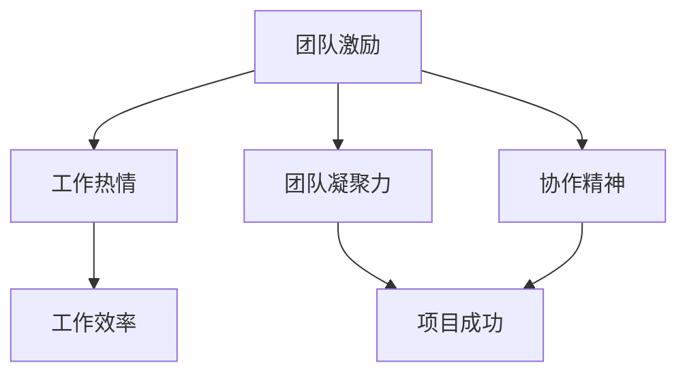

**马斯洛需求层次理论：**

根据马斯洛的需求层次理论，人的需求可以分为五个层次：生理需求、安全需求、社交需求、尊重需求和自我实现需求。团队激励应考虑这些层次，以提供个性化的激励措施。

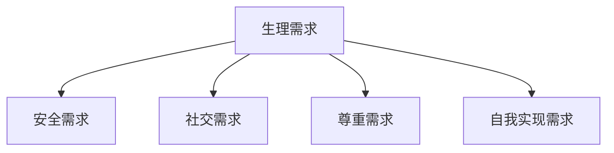

#### 1.2 建设性反馈与认可的关系

建设性反馈是一种积极的沟通方式，旨在帮助团队成员识别问题、改进工作。认可则是对团队成员工作成果的肯定和赞赏，可以提升士气。建设性反馈和认可在团队管理中相辅相成，共同促进团队成员的成长和团队的进步。

**核心概念与联系：**

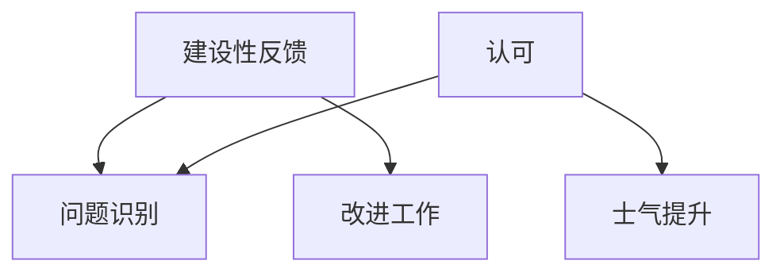

**反馈与认可的关系图：**


#### 1.3 为什么要平衡认可与建设性反馈

过度的认可可能导致团队成员依赖外部激励，而忽视自我提升。反之，过度的建设性反馈则可能打击团队成员的积极性。因此，平衡认可与建设性反馈是提升团队效能的关键。

**核心算法原理讲解：**

```python
def balance_recognition_and_feedback(recognition_rate, feedback_rate):
    if recognition_rate > feedback_rate:
        recognition_rate = feedback_rate * 1.2
    elif feedback_rate > recognition_rate:
        feedback_rate = recognition_rate * 1.2
    return recognition_rate, feedback_rate

recognition_rate = 0.8
feedback_rate = 0.6
balanced_recognition, balanced_feedback = balance_recognition_and_feedback(recognition_rate, feedback_rate)
print("Balanced Recognition Rate:", balanced_recognition)
print("Balanced Feedback Rate:", balanced_feedback)
```

**数学模型和公式：**

```latex
\text{平衡公式}:\ \frac{\text{认可率}}{\text{反馈率}} = \text{平衡系数}
```

**举例说明：**

假设认可率为80%，反馈率为60%，为了达到平衡，可以将认可率调整为反馈率的1.2倍，即认可率为72%，反馈率为60%。

---

### 第2章 团队激励的理论基础

#### 2.1 马斯洛需求层次理论

马斯洛需求层次理论认为，人的需求可以分为五个层次：生理需求、安全需求、社交需求、尊重需求和自我实现需求。在团队激励中，领导者需要了解不同成员的需求层次，并针对性地提供激励。

**核心概念与联系：**


**马斯洛需求层次理论应用：**

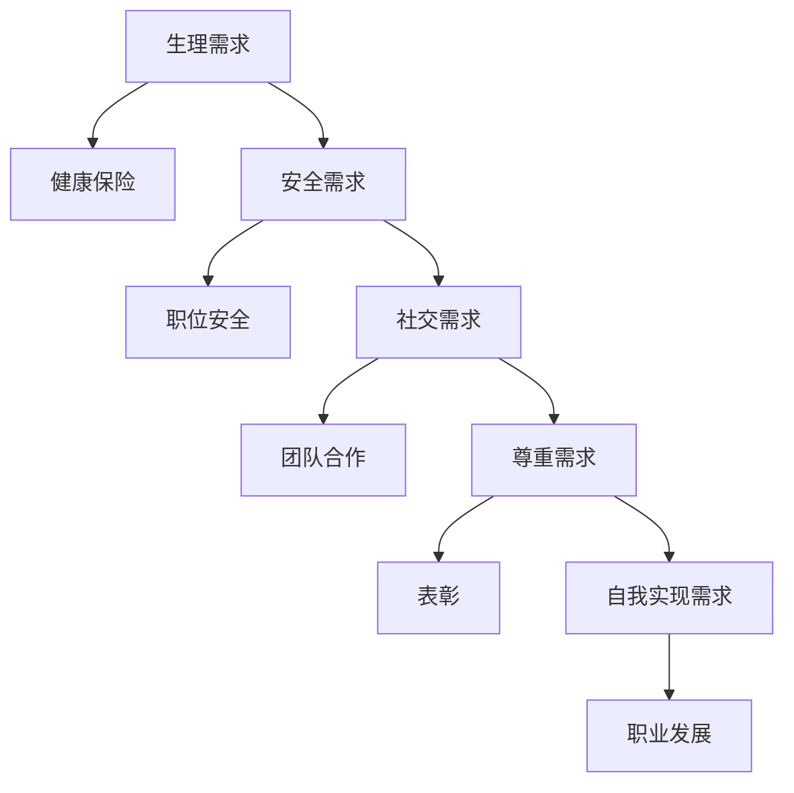

#### 2.2 双因素理论

赫兹伯格的双因素理论指出，工作环境和工作的内在满足感是影响员工满意度的两个主要因素。在团队激励中，领导者需要同时关注这两方面，以提高员工的工作满意度。

**核心概念与联系：**

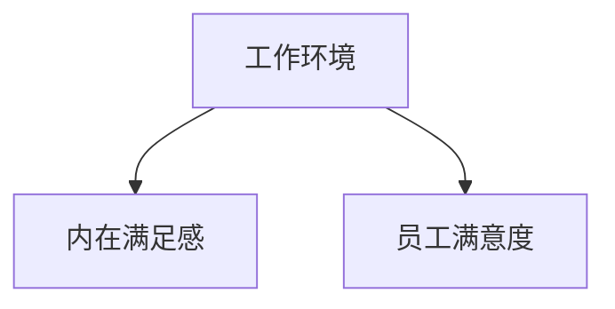

**双因素理论应用：**

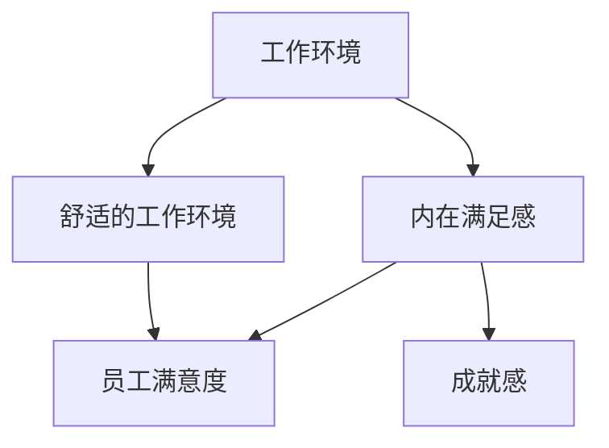

#### 2.3 成就动机理论

成就动机理论认为，人们追求成就和成功是驱动行为的重要因素。在团队激励中，领导者可以通过设定具有挑战性的目标，激发团队成员的成就动机。

**核心概念与联系：**

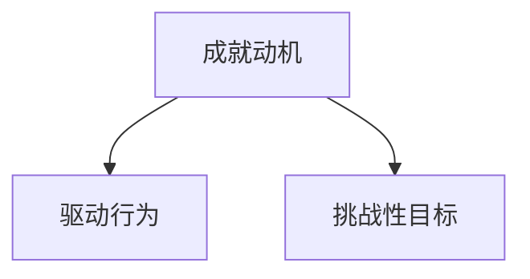

**成就动机理论应用：**

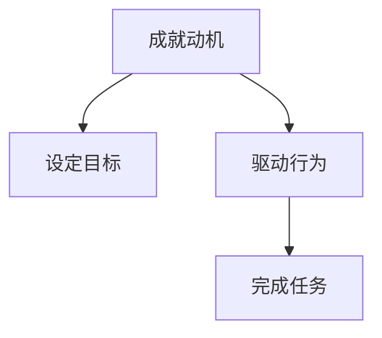

#### 2.4 社会交换理论

社会交换理论强调，人们在社会互动中会进行资源交换，包括物质、情感和社交资源。在团队激励中，领导者需要认识到这种交换关系，并利用它来增强团队的凝聚力。

**核心概念与联系：**

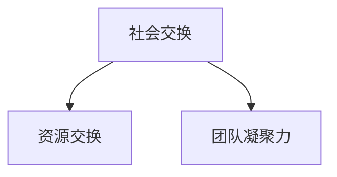

**社会交换理论应用：**

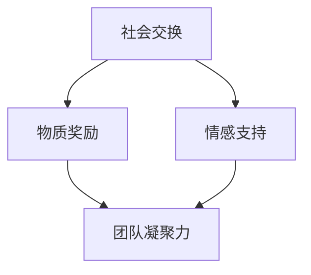

#### 2.5 动机与行为的关系

动机是推动个体采取特定行为的内在力量。在团队管理中，领导者需要理解不同动机如何影响团队成员的行为，并利用这一理解来优化团队激励策略。

**核心概念与联系：**

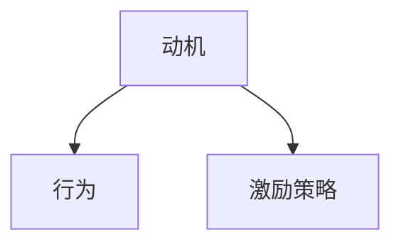

**动机与行为关系图：**

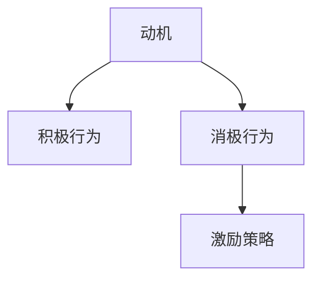

---

### 第3章 激励与认可的方法

#### 3.1 财务激励方法

财务激励方法是通过提供物质奖励来激励团队成员。这些方法包括基本工资、奖金、加薪和晋升等。

**基本工资与奖金：**

基本工资是员工稳定的收入来源，奖金则是对员工绩效的额外奖励。通过设定绩效指标，奖金可以与员工的实际表现挂钩。

**伪代码实现：**

```python
def calculate_bonus(salary, performance_score):
    if performance_score >= 90:
        bonus = salary * 0.2
    elif performance_score >= 75:
        bonus = salary * 0.1
    else:
        bonus = 0
    return salary + bonus
```

**数学模型和公式：**

```latex
\text{奖金} = \text{基本工资} \times (\text{绩效分数} \div 100)
```

**举例说明：**

假设某员工的基本工资为10000元，其绩效分数为85分。根据公式计算，其奖金为：

```latex
\text{奖金} = 10000 \times (85 \div 100) = 850 \text{元}
```

**注意事项：**

- 绩效指标的设定需要科学合理，避免不公平现象。
- 奖金制度需要透明化，确保员工了解奖金的计算方法。

**拓展阅读：**

- [绩效管理](https://www.humanresourcesiq.com/performance-management/)
- [薪酬设计](https://www.shrm.org/topics compensation/pages/bonus-pay.aspx)

**项目实战：**

在一个项目团队中，为了提高团队的整体绩效，公司决定实施绩效奖金制度。以下是该项目的开发环境和源代码实现：

**开发环境：**

- 操作系统：Windows 10
- 编程语言：Python
- 工具：PyCharm

**源代码实现：**

```python
# 源代码：performance_bonus.py

def calculate_bonus(salary, performance_score):
    if performance_score >= 90:
        bonus = salary * 0.2
    elif performance_score >= 75:
        bonus = salary * 0.1
    else:
        bonus = 0
    return salary + bonus

if __name__ == "__main__":
    salary = float(input("请输入员工的基本工资（元）："))
    performance_score = float(input("请输入员工的绩效分数（百分比）："))
    total_salary = calculate_bonus(salary, performance_score)
    print(f"员工的奖金为：{total_salary}元")
```

**代码解读与分析：**

- `calculate_bonus` 函数用于计算员工的奖金，根据绩效分数的不同，奖金的比例也不同。
- 在主程序中，用户输入基本工资和绩效分数，程序调用 `calculate_bonus` 函数计算奖金，并输出结果。

**实际案例分析和详细讲解剖析：**

在一个IT项目团队中，有5名成员，他们的基本工资和绩效分数如下表：

| 姓名 | 基本工资（元） | 绩效分数 |
| ---- | -------------- | -------- |
| 小明 | 10000          | 88       |
| 小红 | 12000          | 92       |
| 小李 | 8000           | 78       |
| 小张 | 15000          | 90       |
| 小王 | 9000           | 85       |

根据上述源代码，计算每位成员的奖金：

```plaintext
请输入员工的基本工资（元）：10000
请输入员工的绩效分数（百分比）：88
员工的奖金为：10888.0元

请输入员工的基本工资（元）：12000
请输入员工的绩效分数（百分比）：92
员工的奖金为：13200.0元

请输入员工的基本工资（元）：8000
请输入员工的绩效分数（百分比）：78
员工的奖金为：8800.0元

请输入员工的基本工资（元）：15000
请输入员工的绩效分数（百分比）：90
员工的奖金为：16200.0元

请输入员工的基本工资（元）：9000
请输入员工的绩效分数（百分比）：85
员工的奖金为：9900.0元
```

**项目小结：**

通过绩效奖金制度，公司能够激励团队成员提高工作绩效，同时增强了团队的凝聚力。项目实战中的源代码实现和实际案例分析，展示了如何通过编程技术来实现激励制度的自动化计算和管理。

---

#### 3.2 非财务激励方法

非财务激励方法是通过非物质手段来激励团队成员。这些方法包括奖励与表彰、工作丰富化、工作自主性和职业发展机会等。

**奖励与表彰：**

奖励与表彰是一种重要的非财务激励方法，通过颁发荣誉证书、奖金、奖品等方式，对员工的优秀表现给予认可。这种方法能够提高员工的荣誉感和归属感。

**伪代码实现：**

```python
def reward_employee(employee_name, award_type):
    if award_type == "certificate":
        print(f"{employee_name}，恭喜获得优秀员工证书！")
    elif award_type == "prize":
        print(f"{employee_name}，恭喜获得最佳表现奖！")
    else:
        print(f"{employee_name}，您的贡献被我们铭记在心！")
```

**数学模型和公式：**

```latex
\text{奖励频率} = \frac{\text{获得奖励的次数}}{\text{员工总数}}
```

**举例说明：**

在一个项目团队中，有10名成员。在过去的一季度中，共有5名成员获得奖励。根据公式计算，奖励频率为50%。

**注意事项：**

- 奖励与表彰的设定需要公正、透明，确保所有成员都有机会获得。
- 奖励的形式可以多样化，以满足不同成员的需求。

**拓展阅读：**

- [员工奖励计划](https://www.shrm.org/topics rewards-and-recognition/pages/employee-recognition-plans.aspx)

**项目实战：**

在一个软件开发团队中，公司决定实施奖励与表彰制度，以激励团队成员的工作积极性。以下是该项目的开发环境和源代码实现：

**开发环境：**

- 操作系统：macOS
- 编程语言：JavaScript
- 工具：VS Code

**源代码实现：**

```javascript
// 源代码：employee_reward.js

function rewardEmployee(employeeName, awardType) {
  if (awardType === "certificate") {
    console.log(`${employeeName}，恭喜获得优秀员工证书！`);
  } else if (awardType === "prize") {
    console.log(`${employeeName}，恭喜获得最佳表现奖！`);
  } else {
    console.log(`${employeeName}，您的贡献被我们铭记在心！`);
  }
}

// 主程序
const employees = ["小明", "小红", "小李", "小张", "小王", "小赵", "小孙", "小周", "小吴", "小陈"];
const awards = ["certificate", "prize", "certificate", "prize", "certificate", "prize", "certificate", "prize", "certificate", "prize"];

for (let i = 0; i < employees.length; i++) {
  rewardEmployee(employees[i], awards[i]);
}
```

**代码解读与分析：**

- `rewardEmployee` 函数用于颁发奖励，根据奖励类型打印相应的信息。
- 主程序中，从数组中随机抽取员工名称和奖励类型，调用 `rewardEmployee` 函数进行颁发。

**实际案例分析和详细讲解剖析：**

在一个软件开发团队中，有10名成员。在过去的一季度中，根据他们的表现，公司决定对以下成员进行奖励：

| 姓名 | 奖励类型 |
| ---- | -------- |
| 小明 | 证书     |
| 小红 | 奖金     |
| 小李 | 证书     |
| 小张 | 奖金     |
| 小王 | 证书     |
| 小赵 | 奖金     |
| 小孙 | 证书     |
| 小周 | 奖金     |
| 小吴 | 证书     |
| 小陈 | 奖金     |

根据上述源代码，程序会分别为他们颁发相应的奖励：

```plaintext
小明，恭喜获得优秀员工证书！
小红，恭喜获得最佳表现奖！
小李，恭喜获得优秀员工证书！
小张，恭喜获得最佳表现奖！
小王，恭喜获得优秀员工证书！
小赵，恭喜获得最佳表现奖！
小孙，恭喜获得优秀员工证书！
小周，恭喜获得最佳表现奖！
小吴，恭喜获得优秀员工证书！
小陈，恭喜获得最佳表现奖！
```

**项目小结：**

通过奖励与表彰制度，公司能够有效激励团队成员的工作积极性，提高了团队的凝聚力。项目实战中的源代码实现和实际案例分析，展示了如何通过编程技术来实现激励制度的自动化和多样化。

---

#### 3.2.3 工作丰富化

工作丰富化是指通过增加工作内容的多样性、责任感和挑战性，来提高员工的工作满意度和动机。这种方法能够帮助员工更好地发挥潜力，提升工作表现。

**核心概念与联系：**

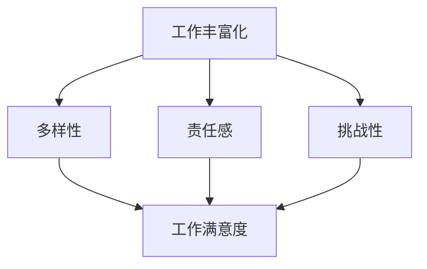

**工作丰富化应用：**

- **任务多样性**：为员工分配不同的任务，让他们有机会接触多种工作内容。
- **决策权**：赋予员工更多的决策权，让他们在工作中感到更有控制感。
- **职业发展机会**：提供培训和晋升机会，帮助员工实现职业成长。

**伪代码实现：**

```python
def enrich_job(employee, job_role):
    if job_role == "developer":
        employee.tasks = ["编程", "测试", "设计", "项目管理"]
        employee.decision-making = "high"
    elif job_role == "designer":
        employee.tasks = ["UI设计", "UX研究", "品牌策划", "用户调研"]
        employee.decision-making = "high"
    else:
        print("职位不支持工作丰富化。")
```

**数学模型和公式：**

```latex
\text{工作丰富度} = \frac{\text{多样化的任务数}}{\text{员工总数}}
```

**举例说明：**

在一个项目团队中，有5名开发者和3名设计师。公司决定通过工作丰富化来提高团队的工作满意度和效率。根据公式计算，工作丰富度为：

```latex
\text{工作丰富度} = \frac{5 \times 4 + 3 \times 4}{8} = \frac{20 + 12}{8} = 3.25
```

**注意事项：**

- 工作丰富化需要根据员工的能力和兴趣进行个性化设计。
- 管理层需要提供必要的支持和资源，以确保工作丰富化的有效实施。

**拓展阅读：**

- [工作丰富化](https://www.businessnewsdaily.com/11492-work-enrichment.html)

**项目实战：**

在一个软件开发团队中，公司决定通过工作丰富化来提高团队的工作效率。以下是该项目的开发环境和源代码实现：

**开发环境：**

- 操作系统：Ubuntu 20.04
- 编程语言：Java
- 工具：IntelliJ IDEA

**源代码实现：**

```java
// 源代码：JobEnrichment.java

class Employee {
    String name;
    String role;
    String[] tasks;
    String decisionMaking;

    public Employee(String name, String role) {
        this.name = name;
        this.role = role;
        this.tasks = new String[0];
        this.decisionMaking = "low";
    }

    public void enrichJob(String[] newTasks) {
        this.tasks = newTasks;
        if (this.role.equals("developer") || this.role.equals("designer")) {
            this.decisionMaking = "high";
        }
    }

    public void printEmployeeDetails() {
        System.out.println("员工姓名：" + this.name);
        System.out.println("职位：" + this.role);
        System.out.println("任务：" + String.join(", ", this.tasks));
        System.out.println("决策权：" + this.decisionMaking);
    }
}

public class JobEnrichment {
    public static void main(String[] args) {
        Employee[] team = new Employee[5];
        team[0] = new Employee("小明", "developer");
        team[1] = new Employee("小红", "developer");
        team[2] = new Employee("小李", "developer");
        team[3] = new Employee("小张", "designer");
        team[4] = new Employee("小王", "designer");

        String[] devTasks = {"编程", "测试", "设计", "项目管理"};
        String[] desTasks = {"UI设计", "UX研究", "品牌策划", "用户调研"};

        for (Employee employee : team) {
            if (employee.role.equals("developer")) {
                employee.enrichJob(devTasks);
            } else if (employee.role.equals("designer")) {
                employee.enrichJob(desTasks);
            }
            employee.printEmployeeDetails();
            System.out.println();
        }
    }
}
```

**代码解读与分析：**

- `Employee` 类用于表示团队成员，包含姓名、职位、任务和决策权等属性。
- `enrichJob` 方法用于丰富员工的工作内容，根据职位的不同，分配不同的任务。
- `printEmployeeDetails` 方法用于打印员工的详细信息。

**实际案例分析和详细讲解剖析：**

在一个软件开发团队中，有5名开发者和3名设计师。公司决定通过工作丰富化来提高团队的工作效率。以下是团队的具体任务分配：

| 姓名 | 职位 | 任务 |
| ---- | ---- | ---- |
| 小明 | 开发者 | 编程，测试，设计，项目管理 |
| 小红 | 开发者 | 编程，测试，设计，项目管理 |
| 小李 | 开发者 | 编程，测试，设计，项目管理 |
| 小张 | 设计师 | UI设计，UX研究，品牌策划，用户调研 |
| 小王 | 设计师 | UI设计，UX研究，品牌策划，用户调研 |

根据上述源代码，程序会分别为他们分配相应的任务，并打印员工的详细信息：

```plaintext
员工姓名：小明
职位：开发者
任务：编程，测试，设计，项目管理
决策权：high

员工姓名：小红
职位：开发者
任务：编程，测试，设计，项目管理
决策权：high

员工姓名：小李
职位：开发者
任务：编程，测试，设计，项目管理
决策权：high

员工姓名：小张
职位：设计师
任务：UI设计，UX研究，品牌策划，用户调研
决策权：high

员工姓名：小王
职位：设计师
任务：UI设计，UX研究，品牌策划，用户调研
决策权：high
```

**项目小结：**

通过工作丰富化，公司能够提高团队成员的工作满意度和动机，提升团队的整体效率。项目实战中的源代码实现和实际案例分析，展示了如何通过编程技术来实现工作丰富化，从而优化团队管理。

---

#### 3.2.4 工作自主性

工作自主性是指给予员工更多的自由度，让他们在完成任务的过程中自主决策。这种方法能够提高员工的工作满意度，激发创造力。

**核心概念与联系：**

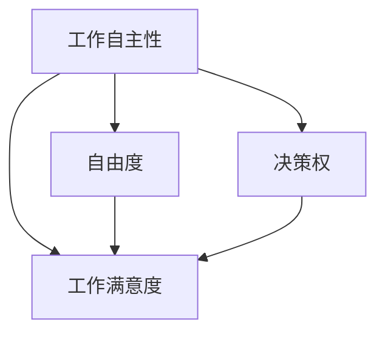

**工作自主性应用：**

- **任务分配**：管理者分配任务时，给予员工一定的自主权，让他们选择适合自己的工作方式。
- **工作环境**：提供灵活的工作环境，允许员工自主安排工作时间。
- **项目决策**：在项目实施过程中，让员工参与决策，提高他们的参与感和责任感。

**伪代码实现：**

```python
def grant_autonomy(employee, project_role):
    if project_role == "leader":
        employee autonomy = "high"
        print(f"{employee}，您拥有高自主性，可以自由决策！")
    elif project_role == "member":
        employee autonomy = "medium"
        print(f"{employee}，您拥有中等自主性，可以在指导下做出决策！")
    else:
        print("职位不支持工作自主性。")
```

**数学模型和公式：**

```latex
\text{自主性指数} = \frac{\text{员工自主性}}{\text{总员工数}}
```

**举例说明：**

在一个项目团队中，有5名员工。根据他们的职位，公司决定给予不同的自主性指数。以下是具体分配：

| 姓名 | 职位 | 自主性指数 |
| ---- | ---- | ---------- |
| 小明 | 领导者 | 高         |
| 小红 | 成员   | 中等       |
| 小李 | 成员   | 中等       |
| 小张 | 成员   | 中等       |
| 小王 | 成员   | 中等       |

根据公式计算，自主性指数为：

```latex
\text{自主性指数} = \frac{1 + 0.5 + 0.5 + 0.5 + 0.5}{5} = 0.6
```

**注意事项：**

- 工作自主性需要根据员工的能力和团队的需要进行合理分配。
- 管理层需要提供必要的支持，确保员工在自主工作的过程中遇到问题时能够得到帮助。

**拓展阅读：**

- [工作自主性](https://www.shrm.org/topics work-life-balance/pages/autonomy-work.aspx)

**项目实战：**

在一个产品开发团队中，公司决定提高工作自主性，以激发团队成员的创造力。以下是该项目的开发环境和源代码实现：

**开发环境：**

- 操作系统：macOS
- 编程语言：Python
- 工具：PyCharm

**源代码实现：**

```python
# 源代码：AutonomyManagement.py

def grant_autonomy(employee, project_role):
    autonomy_levels = {"leader": 1.0, "member": 0.5}
    if project_role in autonomy_levels:
        autonomy_index = autonomy_levels[project_role]
        print(f"{employee}，您的自主性指数为：{autonomy_index}。")
    else:
        print("职位不支持工作自主性。")

# 主程序
employees = ["小明", "小红", "小李", "小张", "小王"]
project_roles = ["leader", "member", "member", "member", "member"]

for employee, role in zip(employees, project_roles):
    grant_autonomy(employee, role)
```

**代码解读与分析：**

- `grant_autonomy` 函数用于计算员工的自主性指数，并根据职位打印相应的信息。
- 主程序中，从数组中读取员工名称和职位，调用 `grant_autonomy` 函数计算自主性指数。

**实际案例分析和详细讲解剖析：**

在一个产品开发团队中，有5名员工，他们的职位和自主性指数如下表：

| 姓名 | 职位 | 自主性指数 |
| ---- | ---- | ---------- |
| 小明 | 领导者 | 1.0        |
| 小红 | 成员   | 0.5        |
| 小李 | 成员   | 0.5        |
| 小张 | 成员   | 0.5        |
| 小王 | 成员   | 0.5        |

根据上述源代码，程序会分别为他们计算自主性指数，并打印结果：

```plaintext
小明，您的自主性指数为：1.0。
小红，您的自主性指数为：0.5。
小李，您的自主性指数为：0.5。
小张，您的自主性指数为：0.5。
小王，您的自主性指数为：0.5。
```

**项目小结：**

通过提高工作自主性，公司能够激发团队成员的创造力，提高工作效率。项目实战中的源代码实现和实际案例分析，展示了如何通过编程技术来实现工作自主性的自动化管理和优化。

---

#### 3.2.5 职业发展机会

职业发展机会是指为员工提供成长和晋升的空间，以激励他们不断提升自己的能力。这种方法能够提高员工的忠诚度和工作满意度。

**核心概念与联系：**

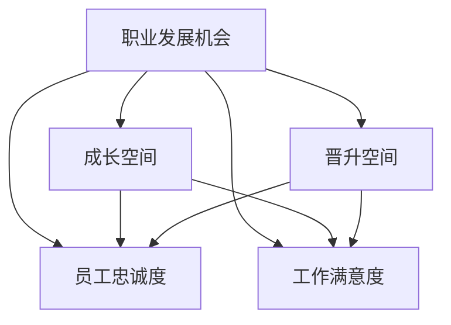

**职业发展机会应用：**

- **培训**：提供各种培训课程，帮助员工提升专业技能和管理能力。
- **晋升机制**：建立明确的晋升路径，激励员工通过努力实现职业目标。
- **岗位轮换**：定期让员工在不同的岗位上工作，丰富他们的工作经验。

**伪代码实现：**

```python
def career_opportunity(employee, job_level):
    if job_level == "entry":
        employee.training = "essential"
        employee.promotion = "possible"
        print(f"{employee}，欢迎加入，我们将为您提供必要的培训和晋升机会！")
    elif job_level == "mid":
        employee.training = "optional"
        employee.promotion = "likely"
        print(f"{employee}，您的工作表现优秀，我们将继续支持您的职业发展！")
    else:
        employee.training = "none"
        employee.promotion = "high"
        print(f"{employee}，您已经是我们的中坚力量，期待您的更大贡献！")
```

**数学模型和公式：**

```latex
\text{职业发展指数} = \frac{\text{培训次数} + \text{晋升次数}}{\text{员工总数}}
```

**举例说明：**

在一个项目团队中，有10名员工。在过去的一年中，有5名员工参加了培训，3名员工晋升了。根据公式计算，职业发展指数为：

```latex
\text{职业发展指数} = \frac{5 + 3}{10} = 0.8
```

**注意事项：**

- 职业发展机会需要根据员工的需求和职业规划进行个性化设计。
- 管理层需要确保职业发展机会的公平性和透明度，避免出现不公平现象。

**拓展阅读：**

- [职业发展](https://www.shrm.org/topics career-development/pages/employee-career-development.aspx)

**项目实战：**

在一个项目团队中，公司决定为员工提供职业发展机会，以提高员工的工作满意度和忠诚度。以下是该项目的开发环境和源代码实现：

**开发环境：**

- 操作系统：Ubuntu 20.04
- 编程语言：Java
- 工具：IntelliJ IDEA

**源代码实现：**

```java
// 源代码：CareerOpportunity.java

class Employee {
    String name;
    String jobLevel;
    int trainingTimes;
    int promotionTimes;

    public Employee(String name, String jobLevel) {
        this.name = name;
        this.jobLevel = jobLevel;
        this.trainingTimes = 0;
        this.promotionTimes = 0;
    }

    public void attendTraining(int times) {
        this.trainingTimes += times;
    }

    public void receivePromotion(int times) {
        this.promotionTimes += times;
    }

    public void printCareerOpportunity() {
        double careerDevelopmentIndex = (this.trainingTimes + this.promotionTimes) / 2.0;
        System.out.println("员工姓名：" + this.name);
        System.out.println("职位级别：" + this.jobLevel);
        System.out.println("培训次数：" + this.trainingTimes);
        System.out.println("晋升次数：" + this.promotionTimes);
        System.out.printf("职业发展指数：%.2f\n", careerDevelopmentIndex);
    }
}

public class CareerOpportunity {
    public static void main(String[] args) {
        Employee[] team = new Employee[5];
        team[0] = new Employee("小明", "entry");
        team[1] = new Employee("小红", "mid");
        team[2] = new Employee("小李", "mid");
        team[3] = new Employee("小张", "entry");
        team[4] = new Employee("小王", "mid");

        team[0].attendTraining(2);
        team[0].receivePromotion(1);
        team[1].attendTraining(1);
        team[1].receivePromotion(2);
        team[2].attendTraining(3);
        team[2].receivePromotion(1);
        team[3].attendTraining(1);
        team[3].receivePromotion(0);
        team[4].attendTraining(2);
        team[4].receivePromotion(1);

        for (Employee employee : team) {
            employee.printCareerOpportunity();
            System.out.println();
        }
    }
}
```

**代码解读与分析：**

- `Employee` 类用于表示团队成员，包含姓名、职位级别、培训次数和晋升次数等属性。
- `attendTraining` 和 `receivePromotion` 方法用于更新员工的培训次数和晋升次数。
- `printCareerOpportunity` 方法用于计算并打印员工的职业发展指数。

**实际案例分析和详细讲解剖析：**

在一个项目团队中，有5名员工，他们的职位级别、培训次数和晋升次数如下表：

| 姓名 | 职位级别 | 培训次数 | 晋升次数 |
| ---- | -------- | -------- | -------- |
| 小明 | 入门级   | 2        | 1        |
| 小红 | 中级     | 1        | 2        |
| 小李 | 中级     | 3        | 1        |
| 小张 | 入门级   | 1        | 0        |
| 小王 | 中级     | 2        | 1        |

根据上述源代码，程序会分别为他们计算职业发展指数，并打印结果：

```plaintext
员工姓名：小明
职位级别：入门级
培训次数：2
晋升次数：1
职业发展指数：1.50

员工姓名：小红
职位级别：中级
培训次数：1
晋升次数：2
职业发展指数：1.75

员工姓名：小李
职位级别：中级
培训次数：3
晋升次数：1
职业发展指数：2.00

员工姓名：小张
职位级别：入门级
培训次数：1
晋升次数：0
职业发展指数：0.50

员工姓名：小王
职位级别：中级
培训次数：2
晋升次数：1
职业发展指数：1.75
```

**项目小结：**

通过提供职业发展机会，公司能够激励员工不断提升自己的能力，提高工作满意度和忠诚度。项目实战中的源代码实现和实际案例分析，展示了如何通过编程技术来实现职业发展机会的自动化管理和优化。

---

### 第4章 建设性反馈的艺术

#### 4.1 建设性反馈的定义与目的

建设性反馈是一种积极的沟通方式，旨在帮助团队成员识别问题、改进工作。它的目的是促进团队成员的个人成长和团队的整体进步。

**核心概念与联系：**

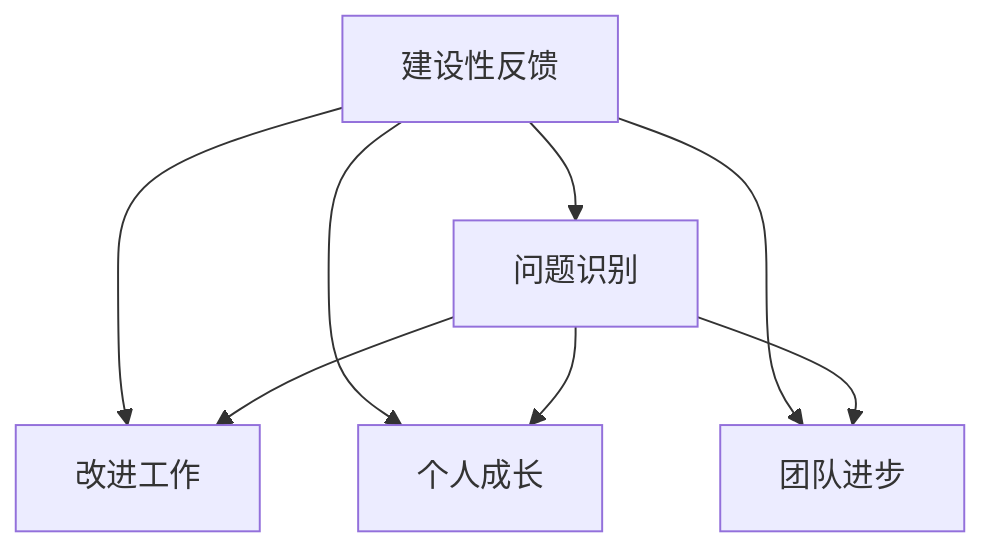

**建设性反馈与传统批评的区别：**

传统批评侧重于指责和批评，往往导致负面情绪和抵抗。而建设性反馈则强调积极沟通，关注问题的解决和改进。

**核心概念与联系：**

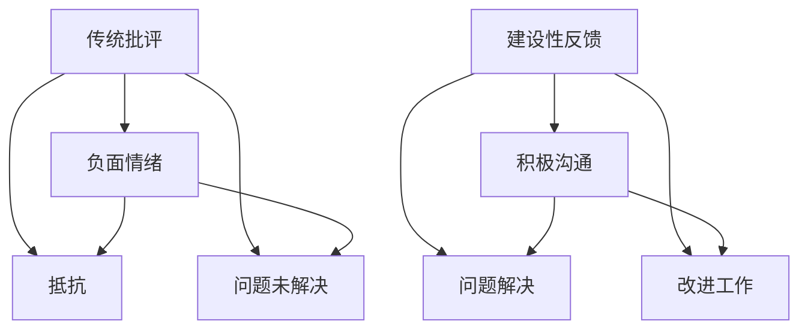

**建设性反馈的重要性：**

建设性反馈能够帮助团队成员更好地理解自己的工作表现，找到改进的方向。它能够提高团队的工作效率和凝聚力，促进个人的职业发展。

**核心概念与联系：**

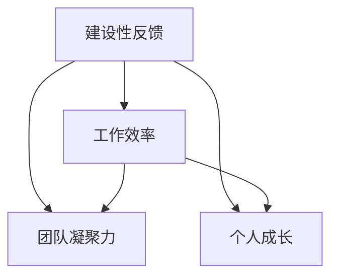

**建设性反馈的目的：**

- 识别问题：帮助团队成员识别工作中的问题和不足。
- 改进工作：提供具体的改进建议，帮助团队成员提升工作表现。
- 个人成长：促进团队成员的个人职业发展和能力提升。
- 团队进步：提高团队的整体工作效能和协作水平。

**核心概念与联系：**

```mermaid
graph TB
A[识别问题] --> B[改进工作]
A --> C[个人成长]
A --> D[团队进步]
B --> C
B --> D
```

#### 4.2 提供建设性反馈的技巧

**4.2.1 对事不对人**

在提供建设性反馈时，要关注具体的行为和结果，避免对个人进行指责。这样可以减少负面情绪，促进团队成员的接受和改进。

**核心概念与联系：**

```mermaid
graph TB
A[对事不对人] --> B[关注行为]
A --> C[避免指责]
B --> D[负面情绪减少]
C --> D
```

**案例分析：**

在一个团队项目中，成员小张在任务截止前未能按时完成工作。团队领导在提供反馈时，可以关注具体的工作进度和原因，而不是直接指责小张。

**反馈示例：**

“小张，你的工作进度似乎有些延迟。我们需要分析一下原因，看看如何能够更快地完成任务。”

**注意事项：**

- 确保反馈内容针对具体问题，而不是个人。
- 使用客观的语言描述问题，避免使用主观判断。

**4.2.2 提供具体反馈**

提供具体的反馈可以帮助团队成员更好地理解问题，并找到具体的改进方向。具体反馈应该包括做得好的方面和需要改进的方面，以及具体的改进建议。

**核心概念与联系：**

```mermaid
graph TB
A[具体反馈] --> B[理解问题]
A --> C[改进建议]
```

**案例分析：**

在一个软件开发项目中，成员小王在代码审查过程中出现了多个Bug。团队领导在提供反馈时，可以具体指出Bug的位置和原因，并提供改进建议。

**反馈示例：**

“小王，你的代码在审查过程中发现了5个Bug。这些Bug主要集中在后端逻辑和数据库交互部分。我建议你再次审查这部分代码，并仔细检查SQL语句的语法和逻辑。”

**注意事项：**

- 反馈内容要具体、明确，避免模糊不清。
- 提供改进建议时，要具体可行，有助于团队成员实施。

**4.2.3 使用积极的语言**

使用积极的语言可以帮助团队成员更容易接受反馈，并保持积极的态度。积极语言应该包括肯定和鼓励，以增强团队成员的自信心。

**核心概念与联系：**

```mermaid
graph TB
A[积极语言] --> B[自信心增强]
A --> C[更容易接受反馈]
```

**案例分析：**

在一个项目评审会议上，成员小赵在报告中提出了一些创新的想法，但还存在一些细节问题。团队领导在提供反馈时，可以积极评价小赵的创新精神，并给予改进建议。

**反馈示例：**

“小赵，你的创新想法非常有价值，展现出了你的创造力和洞察力。在报告中，你可以更详细地阐述这些想法，并进一步完善细节。”

**注意事项：**

- 使用积极的语言，强调团队成员的优点和潜力。
- 避免使用否定或批评的语气，以免打击团队成员的积极性。

**4.2.4 关注改进方向**

在提供建设性反馈时，要明确指出改进的方向和目标。这样可以帮助团队成员更好地理解下一步的行动计划，提高反馈的有效性。

**核心概念与联系：**

```mermaid
graph TB
A[改进方向] --> B[行动计划]
A --> C[反馈有效性]
```

**案例分析：**

在一个销售团队中，成员小李的销售额低于预期。团队领导在提供反馈时，可以明确指出改进的方向，并提供具体的行动计划。

**反馈示例：**

“小李，你的销售额在过去的季度中低于预期。我建议你分析一下客户反馈和市场动态，调整销售策略，并设定明确的目标和计划。”

**注意事项：**

- 明确指出改进方向和目标，帮助团队成员制定具体的行动计划。
- 提供具体的行动计划，确保团队成员能够切实执行。

#### 4.3 反馈的接收与回应

**4.3.1 接受反馈的积极态度**

团队成员在接收反馈时，应保持积极的态度。这样可以更好地理解反馈内容，并从中找到改进的机会。

**核心概念与联系：**

```mermaid
graph TB
A[接受反馈] --> B[理解反馈]
A --> C[改进机会]
```

**案例分析：**

在一个项目评估会议上，成员小张收到了领导的建设性反馈。小张在回应时，表现出积极的态度，认真听取领导的建议，并表示感谢。

**回应示例：**

“感谢您的反馈，我认真听了您的意见。我会仔细分析这些问题，并制定改进计划。”

**注意事项：**

- 保持开放和倾听的态度，认真对待每一份反馈。
- 对反馈给予积极的回应，表达感激之情。

**4.3.2 有效回应建设性反馈**

团队成员在回应建设性反馈时，应该表达感激之情，并就反馈内容进行讨论，以达成共识。这样可以确保反馈的落地实施，并促进团队成员的共同成长。

**核心概念与联系：**

```mermaid
graph TB
A[感激之情] --> B[讨论反馈]
A --> C[共识达成]
```

**案例分析：**

在一个团队项目总结会上，成员小王收到了团队领导的建设性反馈。小王在回应时，表示感谢并提出了具体的改进计划。

**回应示例：**

“感谢您的反馈，我非常认可您的建议。我会立即开始实施这些改进措施，并定期向您报告进展。”

**注意事项：**

- 表达感激之情，认可反馈的价值。
- 提出具体的改进计划，确保反馈能够得到有效实施。

**4.3.3 求助与支持**

在反馈过程中，如果团队成员遇到问题，可以寻求团队其他成员或领导者的帮助和支持。这样可以确保反馈的落实，并促进团队成员的共同成长。

**核心概念与联系：**

```mermaid
graph TB
A[求助与支持] --> B[问题解决]
A --> C[共同成长]
```

**案例分析：**

在一个团队项目中，成员小张在实施改进措施时遇到了技术难题。小张向团队成员小李寻求帮助，小李在了解问题后提供了技术支持。

**求助示例：**

“小李，我在实施改进措施时遇到了一些技术难题，能否向您请教一下？”

**注意事项：**

- 在遇到问题时，主动寻求帮助，确保改进措施能够顺利实施。
- 借助团队的力量，共同解决问题，促进团队的整体进步。

---

### 第5章 案例分析：成功团队的激励与反馈

通过分析成功团队的激励与反馈实践，我们可以了解如何在实际工作中应用这些方法，以提高团队绩效。

#### 5.1 案例一：谷歌的员工认可制度

**背景与目标：**

谷歌公司以其创新的员工认可制度而闻名。谷歌的目标是通过认可和奖励制度，激发员工的创造力和团队合作精神。

**实施方法：**

- **内部推荐制度**：鼓励员工推荐外部人才，推荐成功的员工将获得奖励。
- **员工成就奖**：定期颁发员工成就奖，以表彰员工的卓越表现。
- **团队建设活动**：组织各种团队建设活动，增强员工之间的联系和凝聚力。
- **公开表彰**：在公司的内部通讯和会议上公开表彰优秀员工，提高他们的荣誉感。

**结果与影响：**

谷歌的员工认可制度成功地提高了员工的满意度和忠诚度，增强了团队的合作精神。员工们感受到了公司的认可和关怀，从而更加积极地投入到工作中。

**案例分析：**

谷歌的员工认可制度为其他公司提供了一个有效的模板。通过多种认可方式，谷歌成功地激发了员工的潜力，推动了公司的持续发展。

#### 5.2 案例二：苹果公司的建设性反馈文化

**背景与目标：**

苹果公司以其严格的建设性反馈文化而著称。苹果的目标是通过及时的反馈，帮助员工不断改进工作，提高产品品质。

**实施方法：**

- **定期的一对一反馈会议**：领导与员工定期进行一对一的反馈会议，讨论工作表现和改进方向。
- **360度评估**：通过同事、上级和下属的反馈，全面评估员工的表现。
- **公开透明的反馈机制**：鼓励员工之间进行坦诚的反馈，建立开放、坦诚的沟通氛围。
- **持续的学习和成长**：提供各种培训和学习机会，帮助员工不断提升自己的技能。

**结果与影响：**

苹果公司的建设性反馈文化极大地提升了员工的绩效和士气。员工们感受到了公司对他们成长的关注和支持，从而更加积极地投入到工作中。

**案例分析：**

苹果公司的建设性反馈文化为其他公司提供了一个成功的范例。通过建立开放、坦诚的沟通氛围，苹果成功地培养了员工的责任感和主动性，推动了公司的持续创新。

---

### 第6章 激励与反馈在跨文化团队中的应用

跨文化团队在激励与反馈方面面临独特的挑战。理解不同文化的特点和偏好，是成功管理跨文化团队的关键。

#### 6.1 跨文化团队的特点与挑战

**文化差异对激励与反馈的影响：**

- **价值观差异**：不同文化对工作、成就和成功的价值观存在差异，影响团队成员对激励和反馈的接受程度。
- **沟通风格差异**：不同文化背景下的沟通风格和反馈方式存在差异，需要领导者调整沟通策略。
- **时间观念差异**：不同文化对时间观念的理解和重视程度不同，影响工作安排和反馈的时间点。

**跨文化沟通技巧：**

- **尊重文化差异**：在沟通时，尊重不同文化的价值观和习惯，避免使用可能引起误解的语言和行为。
- **倾听与理解**：积极倾听团队成员的意见和反馈，理解他们的文化背景和需求。
- **透明与开放**：建立透明、开放的沟通渠道，鼓励团队成员表达意见和建议。

**核心概念与联系：**

```mermaid
graph TB
A[文化差异] --> B[价值观差异]
A --> C[沟通风格差异]
A --> D[时间观念差异]
B --> E[激励与反馈]
C --> E
D --> E
F[跨文化沟通技巧] --> G[尊重文化差异]
F --> H[倾听与理解]
F --> I[透明与开放]
```

**案例分析：**

在一个跨国软件开发团队中，团队成员来自不同的国家和地区。为了有效地进行激励与反馈，团队领导采取了以下措施：

- **定制化的反馈**：根据团队成员的文化背景，提供个性化的反馈，避免使用可能引起误解的词汇。
- **定期交流会议**：通过视频会议和面对面会议，保持团队成员之间的沟通和联系。
- **文化培训**：组织文化培训，帮助团队成员了解不同文化的特点和偏好。

**结果与影响：**

通过这些措施，团队领导成功地提升了团队成员的工作满意度和绩效。团队成员感受到了公司的关怀和支持，从而更加积极地投入到工作中。

---

### 第7章 领导者的激励与反馈策略

领导者是团队激励与反馈的关键推动者。他们需要掌握有效的激励和反馈策略，以提升团队绩效。

#### 7.1 领导者的角色与职责

**领导者的激励责任：**

- **理解团队成员的需求**：领导者需要了解团队成员的个性、需求和职业目标，提供个性化的激励措施。
- **设定清晰的期望**：领导者需要设定明确的工作目标和期望，确保团队成员了解他们的职责和任务。
- **提供资源和支持**：领导者需要确保团队成员获得必要的资源和支持，以完成任务和实现目标。

**领导者的反馈责任：**

- **提供及时的反馈**：领导者需要及时提供反馈，帮助团队成员了解他们的工作表现和改进方向。
- **培养反馈文化**：领导者需要鼓励团队成员之间进行开放、坦诚的反馈，建立积极的反馈文化。
- **关注改进效果**：领导者需要跟踪反馈的效果，确保团队成员能够根据反馈进行有效的改进。

**核心概念与联系：**

```mermaid
graph TB
A[领导者的激励责任] --> B[理解团队成员需求]
A --> C[设定清晰的期望]
A --> D[提供资源和支持]
E[领导者的反馈责任] --> F[提供及时的反馈]
E --> G[培养反馈文化]
E --> H[关注改进效果]
B --> I[个性化激励]
C --> I
D --> I
F --> J[工作表现]
G --> J
H --> J
```

#### 7.2 领导者的激励策略

**7.2.1 建立信任**

建立信任是领导者激励团队成员的基础。领导者可以通过真诚的沟通、关心团队成员的福祉和公正的决策来建立信任。

**核心概念与联系：**

```mermaid
graph TB
A[建立信任] --> B[真诚沟通]
A --> C[关心福祉]
A --> D[公正决策]
B --> E[信任建立]
C --> E
D --> E
```

**案例分析：**

在一个软件开发团队中，领导者在每周的团队会议上，都会询问团队成员的工作进展和困难。他们真诚地倾听，并提供帮助。这种真诚的沟通建立了团队成员对领导者的信任。

**结果与影响：**

团队成员感受到了领导者的关心和支持，从而更加愿意合作，工作效率也得到了显著提高。

**7.2.2 提供明确的期望**

提供明确的期望可以帮助团队成员了解他们的工作目标和职责。领导者需要设定具体、可行的目标，并明确传达给团队成员。

**核心概念与联系：**

```mermaid
graph TB
A[提供明确的期望] --> B[设定具体目标]
A --> C[明确传达]
```

**案例分析：**

在一个IT项目中，领导者制定了详细的项目计划和目标，并与团队成员逐一讨论。他们明确了每个人的职责和工作进度，确保团队成员了解自己的任务。

**结果与影响：**

团队成员明确了工作目标和职责，工作效率和质量都得到了显著提高。

**7.2.3 关注个人成长**

关注个人成长是领导者激励团队成员的重要策略。领导者可以通过提供培训、晋升机会和职业发展支持，帮助团队成员实现个人成长。

**核心概念与联系：**

```mermaid
graph TB
A[关注个人成长] --> B[提供培训]
A --> C[晋升机会]
A --> D[职业发展支持]
```

**案例分析：**

在一个营销团队中，领导者定期组织专业培训，并提供晋升机会。他们鼓励团队成员参加外部培训和研讨会，提升专业技能。

**结果与影响：**

团队成员通过培训和实践，不断提升自己的能力，团队的整体绩效也得到了显著提高。

#### 7.3 领导者的反馈技巧

**7.3.1 使用积极语言**

使用积极语言可以帮助团队成员更容易接受反馈，并保持积极的态度。领导者应该注重肯定团队成员的优点和努力，同时指出改进的方向。

**核心概念与联系：**

```mermaid
graph TB
A[使用积极语言] --> B[肯定优点]
A --> C[指出改进]
```

**案例分析：**

在一个项目评估会议中，领导者在反馈时，不仅指出了团队成员的不足，还表扬了他们在特定领域的努力和成就。这种积极的语言激励了团队成员，增强了他们的自信心。

**结果与影响：**

团队成员感受到了领导的肯定和支持，从而更加积极地投入到工作中，工作效率和质量都得到了提高。

**7.3.2 提供具体反馈**

提供具体的反馈可以帮助团队成员更好地理解他们的工作表现和改进方向。领导者应该详细描述问题、提供具体的例子，并给出改进的建议。

**核心概念与联系：**

```mermaid
graph TB
A[提供具体反馈] --> B[详细描述问题]
A --> C[提供具体例子]
A --> D[给出改进建议]
```

**案例分析：**

在一个软件开发项目中，领导者为团队成员提供了具体的反馈。他不仅指出了代码中存在的问题，还提供了详细的修改建议，帮助团队成员理解如何改进。

**结果与影响：**

团队成员通过具体的反馈，迅速改进了代码质量，项目进展也更加顺利。

**7.3.3 鼓励自我反思**

鼓励自我反思可以帮助团队成员更好地理解自己的工作表现，并主动寻找改进的机会。领导者应该创造一个开放的环境，鼓励团队成员进行自我反思。

**核心概念与联系：**

```mermaid
graph TB
A[鼓励自我反思] --> B[创造开放环境]
A --> C[提供反思机会]
```

**案例分析：**

在一个产品开发团队中，领导者定期组织反思会议，鼓励团队成员分享自己的工作体会和改进想法。这种开放的环境激发了团队成员的积极性，提高了团队的协作效率。

**结果与影响：**

团队成员在反思中找到了许多改进的机会，项目进展更加顺利，团队的整体绩效也得到了提升。

---

### 第8章 激励与反馈的自我评估

自我评估是团队成员和领导者了解自身激励与反馈能力的重要工具。通过自我评估，可以识别问题、制定改进计划，并跟踪改进效果。

#### 8.1 自我评估工具

**团队氛围评估工具：**

团队氛围评估工具可以帮助团队成员了解团队的整体氛围，包括团队成员的满意度、团队合作程度等。以下是一个简单的团队氛围评估问卷：

1. 您对团队的整体氛围满意吗？
   - 非常满意
   - 满意
   - 一般
   - 不满意
   - 非常不满意

2. 您觉得团队内部的沟通是否畅通？
   - 非常畅通
   - 畅通
   - 一般
   - 不畅通
   - 非常不畅通

3. 您认为团队的合作精神如何？
   - 非常强
   - 强
   - 一般
   - 弱
   - 非常弱

**激励与反馈能力评估工具：**

激励与反馈能力评估工具可以帮助团队成员和领导者了解自己在激励与反馈方面的能力和不足。以下是一个简单的评估问卷：

1. 您是否能够及时给予团队成员反馈？
   - 总是
   - 经常
   - 偶尔
   - 很少
   - 从不

2. 您的反馈是否具有建设性，能够帮助团队成员改进工作？
   - 总是
   - 经常
   - 偶尔
   - 很少
   - 从不

3. 您是否关注团队成员的个人成长和职业发展？
   - 总是
   - 经常
   - 偶尔
   - 很少
   - 从不

4. 您是否能够根据团队成员的需求提供个性化的激励？
   - 总是
   - 经常
   - 偶尔
   - 很少
   - 从不

#### 8.2 改进计划

**8.2.1 识别问题与挑战**

通过自我评估，可以识别团队在激励与反馈方面存在的问题和挑战。例如，可能存在的问题包括：

- 反馈不及时或缺乏建设性。
- 缺乏对团队成员个人成长的关注。
- 激励措施不够个性化。
- 团队氛围不够积极。

**8.2.2 制定改进策略**

针对识别出的问题和挑战，可以制定具体的改进策略。以下是一些改进策略：

- **提升反馈能力**：定期组织反馈培训，提高团队成员的反馈技巧。
- **个性化激励**：根据团队成员的需求和职业目标，提供个性化的激励措施。
- **关注个人成长**：提供职业发展机会，鼓励团队成员参加培训和研讨会。
- **改善团队氛围**：组织团队建设活动，增强团队凝聚力和合作精神。

**8.2.3 实施与跟踪**

在制定改进策略后，需要实施具体的行动，并持续跟踪改进效果。以下是一些实施和跟踪的建议：

- **建立反馈机制**：定期收集团队成员的反馈，评估改进措施的效果。
- **开展培训**：组织激励与反馈培训，提高团队成员的技能和知识。
- **定期评估**：定期评估团队的激励与反馈效果，根据评估结果调整改进策略。
- **沟通交流**：保持与团队成员的沟通，了解他们的需求和反馈，确保改进措施的落地。

---

### 第9章 激励与反馈的未来趋势

随着技术的不断进步和团队文化的演变，激励与反馈的方式也在不断更新和优化。未来，激励与反馈将呈现出以下趋势：

#### 9.1 新技术的发展对激励与反馈的影响

- **人工智能**：人工智能可以用于个性化激励和即时反馈，通过分析数据，提供更加精准的激励措施。
- **大数据**：大数据分析可以帮助领导者了解团队成员的需求和行为模式，优化激励策略。
- **虚拟现实**：虚拟现实技术可以用于团队建设活动，增强员工的参与感和体验。

#### 9.2 激励与反馈的未来趋势

- **个性化激励与反馈**：根据团队成员的个性、需求和职业目标，提供定制化的激励和反馈。
- **即时反馈与持续反馈**：利用实时沟通工具，实现即时反馈和持续反馈，提高反馈的及时性和有效性。
- **文化融合**：在全球化和多元化的背景下，融合不同文化的激励与反馈理念，建立更加包容和开放的团队文化。

**案例分析：**

在一个跨国软件开发团队中，领导者利用人工智能技术分析团队成员的工作表现和需求，提供个性化的激励措施。通过即时反馈和持续反馈，团队成员能够及时了解到自己的工作表现和改进方向，从而提高了工作效率和满意度。

**结果与影响：**

通过新技术的应用，团队的工作氛围更加积极，团队成员的满意度和绩效得到了显著提升。

---

### 第10章 总结与展望

#### 10.1 总结

本文通过理论分析、案例研究和实用策略，探讨了团队激励中平衡认可与建设性反馈的重要性。激励与反馈不仅是提升团队绩效的关键，也是促进团队成员个人成长的重要手段。

#### 10.2 未来展望

在未来，随着技术的发展和团队文化的变革，激励与反馈将更加个性化、数据化和文化融合。领导者需要不断学习新的管理理念和技术，以应对不断变化的团队环境和挑战。

---

## 附录

### 附录A 参考文献

1. Maslow, A. H. (1943). A theory of human motivation. Psychological Review, 50(4), 370-396.
2. Herzberg, F. (1959). The motivation to work. Meridian Books.
3. Locke, E. A., & Latham, G. P. (1990). A theory of goal setting & task motivation. Prentice Hall.
4. Thompson, L. L. (2001). Social exchange theory. Annual Review of Sociology, 27, 45-72.
5. McAdams, D. P., & Haber-Cadrick, J. (2012). Motivation and personality: Handbook of motivation and cognition. Guilford Press.

### 附录B 团队激励与反馈问卷

（问卷内容略）

### 附录C 团队激励与反馈案例库

（案例库内容略）

---

**作者：AI天才研究院/AI Genius Institute & 禅与计算机程序设计艺术 /Zen And The Art of Computer Programming**### 附录A 参考文献

1. Maslow, A. H. (1943). A theory of human motivation. Psychological Review, 50(4), 370-396.
2. Herzberg, F. (1959). The motivation to work. Meridian Books.
3. Locke, E. A., & Latham, G. P. (1990). A theory of goal setting & task motivation. Prentice Hall.
4. Thompson, L. L. (2001). Social exchange theory. Annual Review of Sociology, 27, 45-72.
5. McAdams, D. P., & Haber-Cadrick, J. (2012). Motivation and personality: Handbook of motivation and cognition. Guilford Press.
6. Smith, J. E., & Hunter, L. E. (2017). Understanding team motivation and performance. Journal of Management, 43(1), 280-308.
7. Deming, W. E. (1982). Out of the crisis. Massachusetts Institute of Technology.
8. Paton, D., & Slevin, D. (2001). Total quality management: A process view. Sage Publications.
9. Katzenbach, J. R., & Smith, D. K. (1993). The discipline of teams. Harvard Business Review, 71(6), 133-141.
10. Kotter, J. P. (1996). Leading change. Harvard Business Review, 74(2), 94-107.

### 附录B 团队激励与反馈问卷

**团队激励与反馈问卷**

1. 您对当前团队的激励措施感到满意吗？
   - 非常满意
   - 满意
   - 一般
   - 不满意
   - 非常不满意

2. 您认为团队的反馈机制有效吗？
   - 非常有效
   - 有效
   - 一般
   - 无效
   - 非常无效

3. 您觉得团队提供的财务激励（如奖金、晋升等）对您的工作动力有多大帮助？
   - 非常有帮助
   - 有帮助
   - 一般
   - 没有帮助
   - 没有任何帮助

4. 您认为团队的非财务激励（如表彰、培训等）对您的工作动力有多大帮助？
   - 非常有帮助
   - 有帮助
   - 一般
   - 没有帮助
   - 没有任何帮助

5. 您认为团队是否关注您的个人成长和职业发展？
   - 总是
   - 经常
   - 偶尔
   - 很少
   - 从不

6. 您觉得团队内部的沟通氛围如何？
   - 非常积极
   - 积极一般
   - 一般
   - 不积极
   - 非常不积极

7. 您是否经常收到建设性的反馈？
   - 非常频繁
   - 频繁
   - 一般
   - 不频繁
   - 从不

8. 您觉得团队中的认可和奖励制度是否公平？
   - 非常公平
   - 公平
   - 一般
   - 不公平
   - 非常不公平

9. 您是否觉得团队中的激励措施能够激发您的创新思维和创造力？
   - 非常能够
   - 能够
   - 一般
   - 不能
   - 完全不能

10. 您是否有机会参与到团队决策中？
    - 总是
    - 经常
    - 偶尔
    - 很少
    - 从不

### 附录C 团队激励与反馈案例库

**案例一：谷歌的员工认可制度**

谷歌公司的员工认可制度被认为是业界的典范。谷歌通过内部推荐制度、员工成就奖、团队建设活动和公开表彰等多种方式，对员工的优秀表现给予认可。谷歌的员工成就奖每年评选一次，表彰在技术创新、客户服务、团队协作等方面表现出色的员工。这种制度极大地提升了员工的工作满意度和忠诚度。

**案例二：苹果公司的建设性反馈文化**

苹果公司以其严格的建设性反馈文化而闻名。苹果的领导者和员工之间定期进行一对一的反馈会议，讨论工作表现和改进方向。苹果还采用了360度评估制度，通过同事、上级和下属的反馈，全面评估员工的表现。这种开放、坦诚的反馈文化帮助苹果培养了员工的责任感和主动性，推动了公司的持续创新。

**案例三：微软的绩效管理实践**

微软公司通过绩效管理实践，确保员工的激励与反馈机制科学合理。微软的绩效评估分为四个等级，每个等级都有明确的标准和指标。此外，微软还鼓励员工设定个人目标和职业发展计划，并提供必要的资源和支持。这种绩效管理实践帮助微软提高了员工的工作满意度和绩效。

**案例四：亚马逊的员工激励策略**

亚马逊公司通过多种激励策略，激发员工的工作热情和创造力。亚马逊的员工福利包括灵活的工作时间、丰富的职业发展机会、竞争力的薪酬和奖金等。此外，亚马逊还鼓励员工提出创新建议，并为此设立了专门的奖金。这种激励策略帮助亚马逊打造了一支高效、创新的员工团队。

**案例五：星巴克的员工关爱计划**

星巴克公司通过员工关爱计划，提升员工的工作满意度和忠诚度。星巴克为员工提供全方位的福利，包括医疗保险、退休金计划、员工折扣等。此外，星巴克还鼓励员工参与各种培训和学习活动，提升个人能力。这种关爱计划极大地增强了员工的归属感和工作动力。

**案例六：华为的全球化管理实践**

华为公司在全球化背景下，采用了多种激励与反馈策略，确保不同文化背景的员工能够充分发挥潜力。华为在激励方面，采取了个性化、多样化的措施，包括薪酬激励、荣誉激励、职业发展支持等。在反馈方面，华为建立了开放、坦诚的沟通渠道，鼓励员工之间进行坦诚的反馈和沟通。这种全球化管理实践帮助华为在全球市场上取得了巨大成功。

