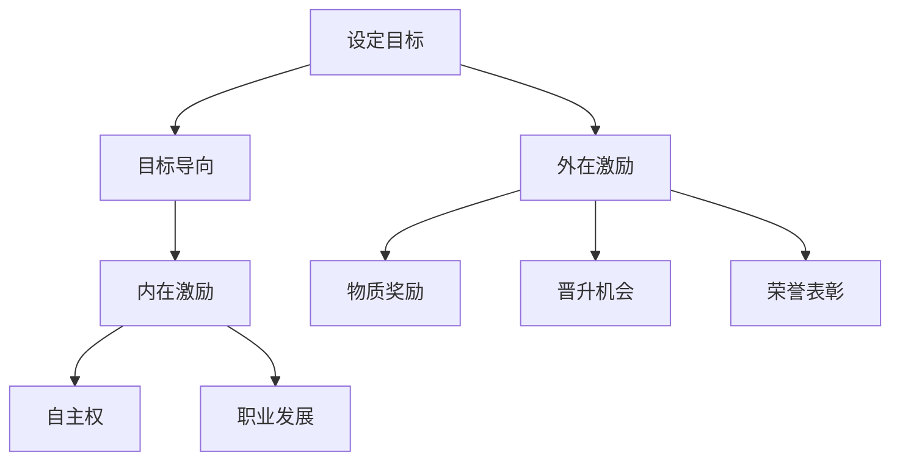
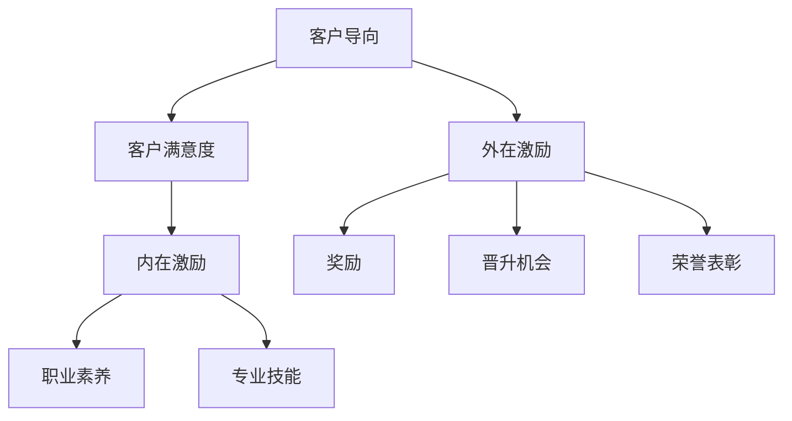

                 

# 团队激励：内在动力与外在奖励的结合

> 关键词：团队激励、内在动力、外在奖励、马斯洛需求层次理论、双因素理论、职业发展、赋权与信任、案例分析

> 摘要：本文将从团队激励的概述、内在激励、外在激励以及内在动力与外在奖励的结合策略等方面，详细探讨团队激励的概念、理论基础和实践方法。通过案例分析，为读者提供实用的团队激励实践指导，帮助团队实现高效协同和工作目标。

## 第一部分：团队激励概述

### 第1章：团队激励的定义与重要性

#### 1.1 团队激励的定义

团队激励是指为了激发团队成员的积极性和创造力，从而提高团队整体绩效和实现组织目标的一系列措施和手段。团队激励包括内在激励和外在激励两个方面。

#### 1.2 内在激励与外在激励的区别

内在激励是指团队成员因对工作本身感兴趣、满足自我实现需求、获得成就感等内在因素而表现出的积极性和主动性。外在激励则是指通过物质奖励、晋升机会、荣誉表彰等外在因素来激发团队成员的积极性。

#### 1.3 团队激励的重要性

有效的团队激励可以提升团队成员的工作满意度、忠诚度和凝聚力，进而提高团队的整体绩效和组织目标的实现。团队激励对团队发展的意义主要体现在以下几个方面：

1. **提升团队成员的工作动力**：通过合理的激励措施，可以激发团队成员的内在动力，使他们在工作中充满激情和信心。
2. **促进团队协作**：团队激励有助于团队成员之间的沟通与合作，提高团队的协作效率。
3. **增强团队凝聚力**：通过共同的目标和价值观，增强团队成员的归属感和团队凝聚力。
4. **提升组织绩效**：团队激励可以带动整个组织的活力，提高组织绩效和竞争力。

### 第2章：团队激励的理论基础

#### 2.1 马斯洛需求层次理论

马斯洛需求层次理论将人的需求分为生理需求、安全需求、社交需求、尊重需求和自我实现需求五个层次。团队激励需要根据团队成员的不同需求层次，采取有针对性的激励措施。

#### 2.2 双因素理论

赫茨伯格的双因素理论指出，影响员工工作满意度的因素可以分为内在激励因素和外在激励因素。内在激励因素包括工作本身、成就感、责任感等，外在激励因素包括薪资、福利、晋升机会等。

#### 2.3 心理学与行为科学对团队激励的影响

心理学与行为科学研究表明，团队成员的行为和态度受到多种因素的影响，如认知、情绪、动机、人际关系等。团队激励需要结合心理学与行为科学的理论，设计出符合团队成员心理需求和行为特点的激励措施。

## 第二部分：内在激励

### 第3章：内在激励的概念与机制

#### 3.1 内在激励的定义

内在激励是指团队成员因对工作本身的兴趣、成就感、自我实现等内在动机而产生的积极行为。内在激励与外在激励相比，具有更强的持久性和内在驱动力。

#### 3.2 内在激励的机制

内在激励的机制主要包括以下几个方面：

1. **自我决定理论**：自我决定理论认为，人们具有自我决定、自我认知和自我评价的能力，通过满足这些能力，可以激发内在激励。
2. **目标设定理论**：目标设定理论指出，明确、具有挑战性的目标可以激发团队成员的内在激励。
3. **认知评价理论**：认知评价理论认为，个体对工作任务的认知评价会影响其内在激励水平。

#### 3.3 内在激励的实例分析

1. **技术创新奖励**：为鼓励团队成员在工作中进行技术创新，企业可以设立技术创新奖励，对取得显著成果的团队成员给予表彰和奖励。
2. **荣誉表彰**：通过设立各种荣誉称号，对在工作中表现突出的团队成员进行表彰，激发其内在激励。
3. **职业发展支持**：为团队成员提供职业发展机会和支持，如培训、晋升等，满足其自我实现需求。

### 第4章：培养团队内在激励的实践方法

#### 4.1 目标设定与反馈

1. **目标设定**：为团队成员设定明确、具有挑战性的工作目标，激发其内在激励。
2. **反馈机制**：及时给予团队成员反馈，帮助其了解自己的工作表现，调整工作策略。

#### 4.2 职业发展与成长

1. **培训与发展**：为团队成员提供培训和发展机会，提升其专业技能和综合素质。
2. **晋升机制**：建立公平、透明的晋升机制，为团队成员提供职业发展的通道。

#### 4.3 赋权与信任

1. **赋权**：赋予团队成员更多的自主权和决策权，激发其内在激励。
2. **信任**：建立信任机制，让团队成员感受到企业的信任和支持，提高其工作满意度。

### 第5章：内在激励的有效性评估

#### 5.1 内在激励的评估标准

1. **工作绩效**：通过工作绩效的评估，了解内在激励对团队成员工作表现的影响。
2. **工作满意度**：通过调查问卷、访谈等方式，了解团队成员对内在激励的满意度。
3. **离职率**：通过离职率的统计，评估内在激励对团队成员忠诚度的影响。

#### 5.2 内在激励的评估方法

1. **定量评估**：通过统计分析方法，对内在激励的评估数据进行定量分析。
2. **定性评估**：通过访谈、观察等方式，对内在激励的实际效果进行定性评估。

#### 5.3 内在激励的优化策略

1. **调整激励措施**：根据评估结果，对内在激励措施进行调整和优化。
2. **完善评估体系**：建立完善的内在激励评估体系，提高评估的准确性和有效性。

## 第三部分：外在激励

### 第6章：外在激励的概念与种类

#### 6.1 外在激励的定义

外在激励是指通过物质奖励、晋升机会、荣誉表彰等外在因素来激发团队成员的积极性和主动性。

#### 6.2 外在激励的种类

外在激励主要包括以下几种类型：

1. **物质奖励**：如奖金、股权、股票期权等。
2. **晋升机会**：如职位晋升、管理层选拔等。
3. **荣誉表彰**：如荣誉称号、表彰大会等。
4. **福利待遇**：如健康保险、带薪休假、员工旅游等。

#### 6.3 外在激励的优缺点分析

外在激励的优点包括：

1. **快速见效**：外在激励可以直接满足团队成员的物质需求，具有快速见效的特点。
2. **易于衡量**：外在激励的效果可以通过量化指标进行衡量，便于企业进行评估和管理。

外在激励的缺点包括：

1. **依赖性强**：团队成员容易对外在激励产生依赖，缺乏内在动力。
2. **激励效应短暂**：外在激励的作用往往是一次性的，难以持久激发团队成员的积极性。

### 第7章：设计有效的外在激励计划

#### 7.1 外在激励计划的制定

1. **明确目标**：确定外在激励计划的目标和方向，确保激励计划与企业战略目标一致。
2. **合理分配**：根据团队成员的岗位、能力和业绩，合理分配外在激励资源。

#### 7.2 外在激励计划的实施与调整

1. **实施策略**：制定具体的实施策略，确保外在激励计划的有效执行。
2. **调整与优化**：根据实际情况，对外在激励计划进行调整和优化，提高激励效果。

#### 7.3 外在激励的案例分析

1. **案例分析**：通过具体案例，分析外在激励计划的设计、实施和效果，为其他企业提供借鉴和参考。

## 第四部分：内在动力与外在奖励的结合

### 第8章：内在动力与外在奖励的结合策略

#### 8.1 结合策略的理论基础

1. **自我决定理论**：内在动力与外在奖励的结合，可以满足团队成员的自我决定需求。
2. **目标设定理论**：结合内在动力和外在奖励，可以设定具有挑战性的目标，激发团队成员的积极性。
3. **认知评价理论**：通过合理的外在奖励，提高团队成员对工作的认知评价，增强内在动力。

#### 8.2 结合策略的实施要点

1. **平衡内在动力和外在奖励**：在实施过程中，要平衡内在动力和外在奖励的关系，避免过度依赖外在奖励。
2. **明确目标和标准**：设定清晰的目标和标准，使团队成员明确外在奖励与内在动力的关联。
3. **反馈与调整**：及时给予团队成员反馈，根据实际情况调整外在奖励措施，提高激励效果。

#### 8.3 结合策略的案例分析

1. **案例分析**：通过具体案例，分析内在动力与外在奖励的结合策略的实施效果，为其他企业提供借鉴和参考。

## 第五部分：团队激励的实践与应用

### 第9章：团队激励实践案例研究

#### 9.1 企业A的团队激励实践

1. **案例背景**：企业A在团队激励方面的成功实践。
2. **案例内容**：企业A的团队激励措施及其效果。
3. **案例分析**：对案例进行深入分析，总结经验教训。

#### 9.2 企业B的团队激励实践

1. **案例背景**：企业B在团队激励方面的实践探索。
2. **案例内容**：企业B的团队激励措施及其效果。
3. **案例分析**：对案例进行深入分析，总结经验教训。

#### 9.3 案例分析与启示

1. **案例分析**：结合企业A和企业B的案例，分析团队激励实践的成功经验和不足之处。
2. **启示与建议**：针对团队激励实践中的问题，提出改进建议和策略。

### 第10章：团队激励在特殊环境中的应用

#### 10.1 疫情背景下的团队激励

1. **疫情背景**：疫情期间企业面临的挑战和团队激励的必要性。
2. **激励措施**：疫情期间企业采取的团队激励措施及其效果。
3. **案例分析**：对疫情期间团队激励实践的案例分析。

#### 10.2 远程办公环境下的团队激励

1. **远程办公环境**：远程办公的特点和挑战。
2. **激励措施**：远程办公环境下企业采取的团队激励措施及其效果。
3. **案例分析**：对远程办公环境下团队激励实践的案例分析。

#### 10.3 团队激励在企业转型中的角色

1. **企业转型**：企业转型过程中的挑战和团队激励的重要性。
2. **激励措施**：企业转型中采取的团队激励措施及其效果。
3. **案例分析**：对企业转型中团队激励实践的案例分析。

## 附录

### 附录A：团队激励相关资源与工具

1. **团队激励理论资源**
    - 参考文献
    - 网络资源

2. **团队激励工具与软件**
    - 激励工具
    - 调查问卷软件

3. **团队激励研究论文与书籍推荐**
    - 学术论文
    - 畅销书籍

## 作者信息

作者：AI天才研究院/AI Genius Institute & 禅与计算机程序设计艺术 /Zen And The Art of Computer Programming## 第1章：团队激励的定义与重要性

### 1.1 团队激励的定义

团队激励，顾名思义，是指通过各种手段来激发团队成员的工作热情、积极性和创造力，以达到提升团队整体绩效和实现组织目标的目的。团队激励不仅涉及物质奖励，还包括非物质的激励手段，如荣誉表彰、职业发展机会、工作环境改善等。团队激励的核心在于满足团队成员的内在和外在需求，从而激发其工作动力和自我实现意识。

#### 内在激励

内在激励，又称内在动机，是指团队成员因对工作本身感兴趣、满足自我实现需求、获得成就感等内在因素而产生的积极行为。内在激励的特点是具有持久性和自主性，能够有效提升团队成员的工作满意度和忠诚度。内在激励的来源主要包括以下几个方面：

1. **兴趣与爱好**：当团队成员对工作内容感兴趣，将其视为一种爱好时，会表现出较高的工作积极性和创造力。
2. **自我实现**：团队成员追求自我成长、实现个人价值，这种需求可以通过在工作中取得成就和进步来满足。
3. **认同与尊重**：当团队成员感受到来自团队的认同和尊重，如被赋予重要的任务、获得领导者的认可等，会增强其工作动力。

#### 外在激励

外在激励，又称外在动机，是指通过物质奖励、晋升机会、荣誉表彰等外在因素来激发团队成员的积极性和主动性。外在激励的特点是具有即时性和可衡量性，能够迅速提升团队成员的工作表现。外在激励的来源主要包括以下几个方面：

1. **物质奖励**：如奖金、股票期权、福利等，直接满足团队成员的物质需求。
2. **晋升机会**：通过晋升机制，为团队成员提供职业发展的通道。
3. **荣誉表彰**：通过荣誉称号、表彰大会等形式，对在工作中表现突出的团队成员进行表彰。

### 1.2 内在激励与外在激励的区别

内在激励和外在激励虽然都是团队激励的手段，但它们之间存在显著的差异。

1. **激励来源**：内在激励主要来源于团队成员的内在动机，如兴趣、自我实现、认同等；而外在激励则主要来源于外部因素，如物质奖励、晋升机会、荣誉表彰等。

2. **作用机制**：内在激励是通过满足团队成员的内在需求，激发其自主性和创造力；而外在激励则通过满足团队成员的外在需求，激发其工作积极性和表现。

3. **效果持久性**：内在激励具有持久性，能够长期激发团队成员的工作动力；而外在激励则具有即时性，作用效果往往是一次性的。

4. **自主性**：内在激励具有很强的自主性，团队成员可以根据自己的兴趣和需求选择是否接受激励；而外在激励则具有较强的强制性，团队成员往往需要按照外部规定和要求接受激励。

### 1.3 团队激励的重要性

团队激励对于团队和组织的发展具有重要意义，主要体现在以下几个方面：

1. **提升工作绩效**：通过有效的团队激励，可以激发团队成员的工作热情和创造力，提高团队的整体绩效。

2. **促进团队协作**：团队激励有助于增强团队成员之间的沟通与合作，提高团队的协作效率。

3. **增强团队凝聚力**：通过共同的目标和价值观，团队激励可以增强团队成员的归属感和团队凝聚力。

4. **提高员工满意度**：有效的团队激励可以提高员工的工作满意度和忠诚度，降低离职率。

5. **提升组织竞争力**：团队激励可以带动整个组织的活力，提高组织绩效和竞争力。

综上所述，团队激励是一种通过满足团队成员的内在和外在需求，激发其工作热情和积极性的重要手段。在现代社会，随着员工需求的多样化和个性化，团队激励的重要性日益凸显。有效的团队激励不仅能够提升团队绩效，还能促进组织的长远发展。

### 1.4 团队激励的理论基础

团队激励的理论基础涵盖了多个领域，其中最为重要的理论包括马斯洛需求层次理论、赫茨伯格的双因素理论以及心理学与行为科学的相关理论。这些理论为我们理解团队激励的内在机制和设计有效的激励措施提供了重要的指导。

#### 马斯洛需求层次理论

马斯洛需求层次理论是心理学家亚伯拉罕·马斯洛提出的一种需求分类模型，它将人的需求分为生理需求、安全需求、社交需求、尊重需求和自我实现需求五个层次。这一理论认为，人的需求是分层次的，只有低层次的需求得到满足后，才能追求高层次的需求。

1. **生理需求**：这是人类最基本的需求，包括食物、水、睡眠等。
2. **安全需求**：包括安全感、健康保障、职业保障等。
3. **社交需求**：包括爱与被爱、社交关系、归属感等。
4. **尊重需求**：包括自尊、自信、成就感、认可等。
5. **自我实现需求**：这是人类最高层次的需求，包括实现个人潜力、追求自我价值等。

在团队激励中，了解马斯洛需求层次理论可以帮助我们设计满足不同层次需求的激励措施。例如，对于刚加入团队的新员工，我们可以通过提供基本的工作保障和培训来满足其生理和安全需求；对于有一定工作基础的员工，可以通过提供职业发展和晋升机会来满足其社交和尊重需求；而对于资深员工，可以通过赋予更多责任和挑战性任务来满足其自我实现需求。

#### 赫茨伯格的双因素理论

弗雷德里克·赫茨伯格提出的双因素理论，又称“激励-保健理论”，指出影响员工工作满意度的因素可以分为内在激励因素和外在激励因素。其中，内在激励因素包括工作本身、成就感、责任感等，而外在激励因素包括薪资、福利、工作环境等。

1. **内在激励因素**：这些因素与工作内容和工作环境相关，能够满足员工的内在需求，提升工作满意度。例如，富有挑战性的工作、自主决策的机会、成就感等。
2. **外在激励因素**：这些因素与工作条件和外部奖励相关，主要解决员工的基本需求，但无法持久提升工作满意度。例如，薪资、奖金、福利等。

在团队激励中，双因素理论提示我们，既要关注外在激励，确保员工的基本需求得到满足，又要注重内在激励，通过工作设计和管理提升员工的工作满意度。例如，通过赋予员工更多的决策权和责任，使他们在工作中感受到成就和自我实现。

#### 心理学与行为科学对团队激励的影响

心理学与行为科学的研究对团队激励的理论和实践产生了深远的影响。这些研究揭示了人类行为和心理过程的复杂性，为我们理解团队成员的需求和行为提供了科学依据。

1. **自我决定理论**：自我决定理论认为，人类行为受到内在动机的影响，当个体的自我决定需求得到满足时，他们会表现出更高的自主性和创造力。在团队激励中，通过赋予员工更多的自主权和工作决策机会，可以激发其内在动机，提高工作满意度。

2. **目标设定理论**：目标设定理论指出，明确、具有挑战性的目标能够有效激发团队成员的工作动力。在团队激励中，设定清晰的团队目标和个体目标，可以引导团队成员朝着共同的目标努力。

3. **认知评价理论**：认知评价理论认为，个体对工作任务的认知评价会影响其工作态度和行为。在团队激励中，通过积极的工作反馈和评价，可以提升团队成员对工作的认知评价，增强其内在激励。

综上所述，团队激励的理论基础涵盖了多个领域，这些理论为我们设计有效的团队激励措施提供了科学依据。在具体实践中，我们需要结合团队成员的需求和行为特点，综合运用这些理论，以达到最佳的激励效果。

### 1.5 团队激励在不同类型的组织中的应用

团队激励在不同的组织类型中，其具体实践和应用方式有所不同，主要取决于组织的性质、目标以及团队成员的特点。以下将分别探讨团队激励在传统企业、创新型企业和非营利组织中的应用。

#### 传统企业

传统企业通常具有较为成熟的管理体系和较为稳定的业务模式。在团队激励方面，传统企业更倾向于使用外在激励手段，如奖金、晋升、福利等。这些激励手段的主要目的是确保员工的基本需求得到满足，并激励他们在工作中保持稳定的表现。

1. **奖金和提成**：通过设定销售目标或生产目标，对达成目标的员工给予奖金或提成，激励员工提高业绩。
2. **晋升机制**：建立明确的晋升通道，为表现优异的员工提供晋升机会，激励员工在工作上持续努力。
3. **福利待遇**：提供有竞争力的福利待遇，如健康保险、带薪休假、员工餐厅等，提升员工的工作满意度和忠诚度。

然而，传统企业的团队激励也存在一些不足。由于过度依赖外在激励，员工可能产生依赖性，缺乏内在动力。此外，晋升机制和奖金分配可能存在不公平现象，导致员工之间出现不满和竞争。

#### 创新型企业

创新型企业在团队激励方面更注重内在激励，通过赋予员工更多的自主权和挑战性任务，激发他们的创造力和工作热情。这种激励方式有助于打造创新文化，推动企业的持续创新和发展。

1. **自主决策权**：赋予员工更多的自主权，让他们在项目选择、工作方法等方面有更大的自由度，激发他们的创造力和主动性。
2. **挑战性任务**：为员工设定具有挑战性的任务，推动他们在工作中不断突破自我，实现个人和团队的共同成长。
3. **荣誉与认可**：通过设立各种荣誉奖项，如“最佳创新奖”、“最佳团队奖”等，对在工作中表现突出的员工和团队进行表彰，提升他们的成就感。

创新型企业的团队激励方式虽然有助于激发员工的内在动力，但也存在一定风险。例如，过多的自主权和挑战性任务可能导致工作不稳定和压力增加。此外，荣誉和认可能够提升员工的成就感，但也可能引发竞争和不公平感。

#### 非营利组织

非营利组织在团队激励方面面临较大的挑战，因为它们通常不具备传统企业或创新型企业的物质激励手段。在这种情况下，非营利组织更依赖于内在激励，通过使命驱动和价值观认同来激发员工的工作热情。

1. **使命驱动**：非营利组织通常具有明确的使命和愿景，员工可以通过为实现这些目标而努力工作，获得成就感和满足感。
2. **价值观认同**：非营利组织强调共同的价值观和理念，员工通过认同这些价值观，产生强烈的归属感和责任感。
3. **团队建设**：通过团队建设和团队活动，增强团队成员之间的沟通和协作，提升团队凝聚力。

非营利组织的团队激励方式虽然能够激发员工的内在动力，但也存在一定局限性。由于缺乏物质激励，员工的职业发展空间可能受到限制。此外，由于非营利组织的资金来源有限，团队激励活动可能受到预算限制。

综上所述，团队激励在不同类型的组织中具有不同的实践和应用方式。传统企业主要依赖外在激励，创新型企业和非营利组织则更注重内在激励。在具体实施过程中，组织需要根据自身特点、目标和团队成员的需求，综合运用各种激励手段，以达到最佳的激励效果。

### 1.6 团队激励的实施步骤

要实现有效的团队激励，组织需要遵循一定的实施步骤，从计划到执行再到评估，确保激励措施能够真正激发团队成员的内在动力和外在积极性。以下是一般团队激励的实施步骤：

#### 1. 计划阶段

1. **明确目标**：首先，组织需要明确团队激励的目标，这包括短期和长期的目标。例如，提高团队绩效、提升员工满意度、促进团队凝聚力等。
2. **调研需求**：通过访谈、调查问卷等方式，了解团队成员的内在需求和外在期望，确保激励措施能够满足他们的需求。
3. **制定激励策略**：根据调研结果，制定具体的激励策略。这些策略应包括内在激励和外在激励，并明确具体的实施方式和时间表。

#### 2. 执行阶段

1. **实施激励措施**：按照制定的激励策略，逐步实施各项激励措施。在执行过程中，组织应确保激励措施的公平性和透明度，避免引发不必要的矛盾和误解。
2. **沟通与反馈**：在激励措施实施过程中，组织需要保持与团队成员的沟通，及时了解他们的反馈和建议，根据实际情况进行调整和优化。

#### 3. 评估阶段

1. **效果评估**：通过定性和定量的方法，对激励措施的效果进行评估。例如，通过工作绩效指标、员工满意度调查、离职率等数据，分析激励措施的实际效果。
2. **反馈与改进**：根据评估结果，对激励措施进行反馈和改进。如果发现某些激励措施效果不佳，需要及时调整或替换。

#### 4. 持续优化

1. **定期评估**：团队激励不是一次性的事件，而是一个持续的过程。组织应定期对激励措施进行评估和优化，确保其始终与团队成员的需求和组织的战略目标保持一致。
2. **动态调整**：随着组织环境的变化和团队成员需求的变化，激励措施也需要进行动态调整，以保持其有效性。

通过遵循这些实施步骤，组织可以有效地实现团队激励，提升团队的整体绩效和成员的工作满意度，从而推动组织的长远发展。

## 第2章：团队激励的理论基础

在探讨团队激励的实践方法之前，有必要深入了解其理论基础。团队激励的理论基础涵盖了多个领域，包括心理学、行为科学以及管理学的相关理论。这些理论为我们理解团队激励的内在机制提供了重要的科学依据，并指导我们设计出有效的激励措施。在本章中，我们将重点介绍马斯洛需求层次理论、赫茨伯格的双因素理论以及心理学与行为科学对团队激励的影响。

### 2.1 马斯洛需求层次理论

马斯洛需求层次理论是由美国心理学家亚伯拉罕·马斯洛提出的一种需求分类模型。该理论认为，人的需求是分层次的，从最基本的生理需求到最高级的自我实现需求，共分为五个层次：生理需求、安全需求、社交需求、尊重需求和自我实现需求。这一理论为我们理解团队成员的需求结构及其激励方式提供了重要的指导。

1. **生理需求**：生理需求是人的最基本需求，包括食物、水、睡眠等。对于团队成员来说，这意味着基本的工作条件和福利待遇必须得到保障。组织可以通过提供良好的工作环境、合理的薪酬和福利来满足这些需求。

2. **安全需求**：在生理需求得到满足之后，人们会追求安全感，包括健康保障、职业保障等。组织可以通过提供稳定的工作环境、职业发展机会和保险福利来满足这些需求。

3. **社交需求**：社交需求包括爱与被爱、社交关系、归属感等。团队成员渴望在团队中建立良好的人际关系，获得团队的认同和支持。组织可以通过团队建设活动、团队合作项目等方式来满足这些需求。

4. **尊重需求**：尊重需求包括自尊、自信、成就感、认可等。团队成员希望在工作中得到尊重和认可，感受到自己的价值和贡献。组织可以通过设立荣誉称号、表彰大会、优秀员工评选等方式来满足这些需求。

5. **自我实现需求**：自我实现需求是马斯洛需求层次中的最高层次，包括实现个人潜力、追求自我价值等。团队成员希望通过工作实现自我价值和成长。组织可以通过提供挑战性任务、职业发展机会、自主决策权等方式来满足这些需求。

在团队激励中，了解马斯洛需求层次理论可以帮助我们设计出满足不同层次需求的激励措施。例如，对于新员工，我们可以通过提供基本的工作保障和培训来满足其生理和安全需求；对于有一定工作经验的员工，可以通过提供职业发展和晋升机会来满足其社交和尊重需求；而对于资深员工，则可以通过赋予更多责任和挑战性任务来满足其自我实现需求。

### 2.2 赫茨伯格的双因素理论

赫茨伯格的双因素理论是由心理学家弗雷德里克·赫茨伯格提出的，该理论将影响员工工作满意度的因素分为内在激励因素和外在激励因素。赫茨伯格认为，内在激励因素与工作本身相关，如成就感、责任感、成长机会等，而外在激励因素则与工作条件相关，如薪资、福利、工作环境等。

1. **内在激励因素**：这些因素通常与工作内容和工作环境相关，能够满足员工的内在需求，提升工作满意度。例如，富有挑战性的工作、自主决策的机会、成就感、责任感等。在团队激励中，组织可以通过赋予员工更多的自主权、设立具有挑战性的任务、提供反馈和认可等方式来激发内在激励。

2. **外在激励因素**：这些因素通常与工作条件和外部奖励相关，主要解决员工的基本需求，但无法持久提升工作满意度。例如，薪资、奖金、福利、晋升机会等。在团队激励中，组织可以通过提供有竞争力的薪酬福利、设立奖金制度、提供职业发展机会等方式来满足外在激励需求。

赫茨伯格的双因素理论提醒我们，团队激励不仅要关注外在激励，确保员工的基本需求得到满足，还要注重内在激励，通过工作设计和管理提升员工的工作满意度。例如，通过赋予员工更多的自主权和责任，让他们在工作中感受到成就感和自我实现，从而提高工作满意度。

### 2.3 心理学与行为科学对团队激励的影响

心理学与行为科学的研究对团队激励的理论和实践产生了深远的影响。这些研究揭示了人类行为和心理过程的复杂性，为我们理解团队成员的需求和行为提供了科学依据。

1. **自我决定理论**：自我决定理论认为，人类行为受到内在动机的影响。当个体的自我决定需求得到满足时，他们会表现出更高的自主性和创造力。在团队激励中，通过赋予员工更多的自主权和工作决策机会，可以激发其内在动机，提高工作满意度。

2. **目标设定理论**：目标设定理论指出，明确、具有挑战性的目标能够有效激发团队成员的工作动力。在团队激励中，设定清晰的团队目标和个体目标，可以引导团队成员朝着共同的目标努力。

3. **认知评价理论**：认知评价理论认为，个体对工作任务的认知评价会影响其工作态度和行为。在团队激励中，通过积极的工作反馈和评价，可以提升团队成员对工作的认知评价，增强其内在激励。

4. **公平理论**：公平理论指出，个体在工作中的行为和态度会受到感知公平的影响。在团队激励中，确保激励措施的公平性和透明度，是激发团队成员积极性的重要因素。

综上所述，团队激励的理论基础涵盖了多个领域，包括马斯洛需求层次理论、赫茨伯格的双因素理论以及心理学与行为科学的相关理论。这些理论为我们设计有效的团队激励措施提供了科学依据，并指导我们理解和满足团队成员的需求，从而实现团队的高效协作和组织的长远发展。

### 2.4 内在激励的概念与机制

内在激励，又称为内在动机，是指团队成员因对工作本身的兴趣、成就感、自我实现等内在因素而产生的积极行为。与外在激励不同，内在激励源自个体内部的动机，具有较强的持久性和自主性。了解内在激励的概念和机制对于设计有效的团队激励策略具有重要意义。

#### 内在激励的定义

内在激励是指团队成员在工作过程中，因对工作内容、工作环境或工作结果感到满意而产生的积极行为。这种激励主要来源于以下几个方面：

1. **兴趣**：团队成员对工作内容感兴趣，将其视为一种乐趣和爱好，从而表现出较高的工作热情。
2. **成就感**：当团队成员在工作过程中取得成就，如解决问题、完成任务、获得认可等，会产生强烈的成就感和满足感，从而增强其工作动力。
3. **自我实现**：团队成员追求自我成长、实现个人价值，通过工作实现自我价值的需求驱动其努力工作。
4. **认同与尊重**：团队成员感受到来自团队和领导的认同与尊重，如被赋予重要任务、得到领导者的认可等，会增强其工作动力。

#### 内在激励的机制

内在激励的机制可以从以下几个方面进行分析：

1. **自我决定理论**：自我决定理论认为，人类行为受到内在动机的影响。当个体的自我决定需求得到满足时，他们会表现出更高的自主性和创造力。在团队激励中，通过赋予员工更多的自主权和工作决策机会，可以激发其内在动机，提高工作满意度。

2. **目标设定理论**：目标设定理论指出，明确、具有挑战性的目标能够有效激发团队成员的工作动力。在团队激励中，设定清晰的团队目标和个体目标，可以引导团队成员朝着共同的目标努力。

3. **认知评价理论**：认知评价理论认为，个体对工作任务的认知评价会影响其工作态度和行为。在团队激励中，通过积极的工作反馈和评价，可以提升团队成员对工作的认知评价，增强其内在激励。

4. **公平理论**：公平理论指出，个体在工作中的行为和态度会受到感知公平的影响。在团队激励中，确保激励措施的公平性和透明度，是激发团队成员积极性的重要因素。

#### 内在激励的实例分析

1. **技术创新奖励**：为鼓励团队成员在工作中进行技术创新，企业可以设立技术创新奖励，对取得显著成果的团队成员给予表彰和奖励。这种激励方式可以激发团队成员的内在动机，提高工作创新能力和效率。

2. **荣誉表彰**：通过设立各种荣誉称号，如“最佳创新奖”、“优秀员工奖”等，对在工作中表现突出的团队成员进行表彰。荣誉表彰可以满足团队成员的成就感和自我实现需求，增强其工作动力。

3. **职业发展支持**：为团队成员提供职业发展机会和支持，如培训、晋升等，满足其自我实现需求。职业发展支持可以激发团队成员追求自我成长的内在动机，提高工作满意度和忠诚度。

4. **赋权与信任**：赋予团队成员更多的自主权和决策权，让他们在工作中感受到信任和支持。这种激励方式可以激发团队成员的内在动机，提高工作积极性和责任感。

通过上述实例分析，我们可以看到，内在激励在团队激励中起着重要作用。它不仅能够提升团队成员的工作动力和创造力，还能增强团队的凝聚力和整体绩效。在设计和实施团队激励策略时，组织应充分考虑内在激励的因素，通过多种手段激发团队成员的内在动机，实现团队的高效协作和组织的长远发展。

### 2.5 培养团队内在激励的实践方法

要培养团队的内在激励，组织需要采取一系列实践方法，旨在满足团队成员的内在需求，激发其自主性和创造力。以下是一些有效的实践方法：

#### 1. 目标设定与反馈

目标设定是培养团队内在激励的重要手段。通过设定清晰、具体、可衡量的目标，可以引导团队成员明确自己的工作方向和努力目标。同时，目标的设定过程应充分考虑团队成员的意见和建议，使其感到参与感和责任感。

**目标设定的步骤**：

- **明确目标**：组织应根据团队的整体目标和战略，设定具体的工作目标。目标应具备挑战性，同时也要具备可实现性。
- **分解目标**：将总体目标分解为具体的子目标，使每个团队成员都明确自己的职责和任务。
- **共同设定**：与团队成员共同讨论和设定目标，确保目标具有实际意义，且团队成员愿意为实现目标而努力。

**反馈机制**：

- **定期反馈**：定期对团队成员的工作表现进行反馈，帮助他们了解自己的进展和存在的问题。
- **积极反馈**：在反馈过程中，注重肯定团队成员的努力和成绩，鼓励他们继续努力。
- **建设性反馈**：对团队成员的工作提出具体、建设性的建议，帮助他们改进和提高。

通过目标设定与反馈，可以帮助团队成员保持持续的工作动力，同时提升团队的整体绩效。

#### 2. 职业发展与成长

职业发展是满足团队成员内在需求的重要方面。通过提供职业发展的机会和支持，可以帮助团队成员实现自我成长和自我实现，从而增强其内在激励。

**职业发展支持**：

- **培训与发展**：为团队成员提供各类培训机会，提升其专业技能和综合素质。培训内容应涵盖技术技能、管理技能、沟通技能等多个方面。
- **职业规划**：帮助团队成员制定个人职业规划，明确其职业发展方向和目标。职业规划应与组织的发展战略相结合，确保团队成员的职业发展符合组织的需求。
- **晋升机会**：建立公平、透明的晋升机制，为团队成员提供晋升机会。晋升应基于绩效和能力的评估，确保晋升过程公开、公正。

通过职业发展与成长的支持，可以激发团队成员的内在动机，提高工作满意度和忠诚度。

#### 3. 赋权与信任

赋权与信任是培养团队内在激励的重要手段。通过赋予团队成员更多的自主权和决策权，让他们在工作中感受到信任和支持，可以显著提升其工作积极性和责任感。

**赋权**：

- **决策权**：赋予团队成员更多的决策权，让他们在工作中能够自主作出决策，提高工作效率和创新能力。
- **任务分配**：在任务分配过程中，考虑团队成员的特长和兴趣，让他们承担与其能力相匹配的任务，提高工作满意度。

**信任**：

- **信任建设**：建立信任机制，通过开放沟通、积极倾听、诚信行为等方式，增强团队成员之间的信任。
- **团队文化**：营造积极、开放、包容的团队文化，鼓励团队成员分享想法和意见，促进团队协作。

通过赋权与信任，可以激发团队成员的内在动力，提高团队的整体绩效。

#### 4. 成功案例分享

许多成功的企业在实践中积累了丰富的团队内在激励培养经验，以下是一些案例分享：

- **谷歌**：谷歌以其开放、创新的团队文化著称。公司通过提供自主工作空间、自由决策权、丰富的培训机会等方式，激发员工的内在动力。谷歌还通过“20% 时间政策”，鼓励员工将20% 的工作时间用于自己感兴趣的项目，从而激发创新和创造力。
- **三星**：三星注重员工的职业发展和成长，提供全面的培训计划和职业规划服务。公司通过设立“创新奖”和“优秀员工奖”，对在工作中表现突出的员工进行表彰和奖励，从而激发员工的内在激励。
- **惠普**：惠普通过设立“创新实验室”，为员工提供实验和创新的空间。公司鼓励员工提出新的想法和解决方案，并对成功的创新项目给予奖励和支持，从而激发员工的内在动力。

这些成功案例表明，通过有效的目标设定、职业发展支持、赋权与信任以及成功案例分享，组织可以培养团队的内在激励，实现团队的高效协作和组织的长远发展。

### 2.6 内在激励的有效性评估

评估内在激励的有效性是团队激励管理的重要环节。通过科学、系统的评估方法，可以了解内在激励措施的实际效果，为优化激励策略提供依据。以下将介绍内在激励评估的标准、方法和优化策略。

#### 2.6.1 内在激励的评估标准

内在激励的评估标准主要包括以下几个方面：

1. **工作绩效**：评估内在激励是否提高了团队成员的工作绩效。具体指标可以包括生产效率、任务完成率、项目质量等。
2. **工作满意度**：评估内在激励对团队成员工作满意度的提升程度。可以通过员工满意度调查、员工访谈等方式了解。
3. **离职率**：评估内在激励对离职率的影响。低离职率表明内在激励措施有效，高离职率则可能意味着需要调整激励策略。
4. **团队氛围**：评估内在激励对团队氛围的改善程度。良好的团队氛围可以促进协作和创新。
5. **创新能力**：评估内在激励对团队成员创新能力的激发程度。可以通过新产品开发数量、创新项目成功率等指标进行衡量。

#### 2.6.2 内在激励的评估方法

内在激励的评估方法可以分为定量评估和定性评估两种：

1. **定量评估**：定量评估主要通过数据分析和统计方法来衡量内在激励的有效性。具体方法包括：
   - **工作绩效数据分析**：对团队成员的工作绩效数据进行统计和分析，如生产效率、任务完成率等。
   - **员工满意度调查**：通过问卷调查了解员工对工作满意度的情况，可以使用李克特量表（Likert Scale）等工具。
   - **离职率统计**：对一段时间内的离职率进行统计，分析内在激励对员工忠诚度的影响。
   - **创新指标分析**：对新产品开发数量、创新项目成功率等指标进行统计，评估内在激励对创新能力的激发程度。

2. **定性评估**：定性评估主要通过访谈、观察和案例分析等方法来了解内在激励的实际效果。具体方法包括：
   - **员工访谈**：通过与团队成员进行面对面访谈，了解他们对内在激励措施的感受和看法。
   - **观察**：通过观察团队成员的工作行为和团队互动，评估内在激励对团队氛围的影响。
   - **案例分析**：对成功和失败的内在激励案例进行深入分析，总结经验教训。

#### 2.6.3 内在激励的优化策略

基于评估结果，组织可以采取以下优化策略：

1. **调整激励措施**：根据评估结果，对内在激励措施进行调整和优化。例如，如果发现某些激励措施未能有效提高工作绩效，可以尝试引入新的激励方式。

2. **加强反馈机制**：通过加强反馈机制，帮助团队成员了解自己的工作表现和激励效果。反馈应具有针对性，既能肯定成绩，也能指出改进之处。

3. **完善评估体系**：建立完善的内在激励评估体系，确保评估过程的科学性和客观性。评估体系应包括定量和定性评估方法，以全面了解内在激励的效果。

4. **持续改进**：内在激励是一个持续的过程，组织应不断收集反馈信息，根据实际情况进行动态调整和优化。通过持续改进，确保内在激励措施始终符合团队成员的需求和组织目标。

通过有效的内在激励评估和优化策略，组织可以不断提升团队绩效，增强员工满意度和忠诚度，实现可持续发展。

### 第6章：外在激励的概念与种类

#### 6.1 外在激励的定义

外在激励，又称为外在动机，是指通过物质奖励、晋升机会、荣誉表彰等外在因素来激发团队成员的积极性和主动性。与内在激励不同，外在激励主要关注工作结果和外部奖励，通过满足团队成员的物质需求和社会需求，来提高工作绩效和满意度。

#### 6.2 外在激励的种类

外在激励可以分为以下几种类型：

1. **物质奖励**：物质奖励是外在激励中最直接、最明显的形式，包括奖金、股票期权、福利等。物质奖励能够迅速提高团队成员的工作积极性，但其效果往往是短期的，难以持久。

2. **晋升机会**：晋升机会是指为团队成员提供职业发展通道，使其在工作中获得更高的职位和更大的责任。晋升机会能够满足团队成员的尊重需求和自我实现需求，激发其内在动力。

3. **荣誉表彰**：荣誉表彰通过设立各种荣誉称号、表彰大会等形式，对在工作中表现突出的团队成员进行表彰。荣誉表彰不仅能够提升团队成员的成就感，还能增强其社会认同感和归属感。

4. **福利待遇**：福利待遇包括健康保险、带薪休假、员工旅游等，能够提高团队成员的生活质量和工作满意度。福利待遇的提供不仅能够留住人才，还能增强团队的凝聚力。

5. **培训与发展**：培训与发展是指为团队成员提供各种培训和学习机会，帮助其提升专业技能和职业素养。通过培训与发展，团队成员可以不断成长，实现个人价值和组织发展的双赢。

#### 6.3 外在激励的优缺点分析

外在激励具有以下优点：

1. **快速见效**：外在激励可以迅速提升团队成员的工作积极性，对工作绩效产生直接的影响。尤其是在短期内，物质奖励和晋升机会能够迅速激发团队成员的热情。

2. **易于衡量**：外在激励的效果可以通过量化的指标进行衡量，如奖金发放、晋升次数、荣誉表彰次数等。这使得组织能够对激励效果进行有效的评估和管理。

3. **公平透明**：外在激励措施通常具有明确的评估标准和规则，使得团队成员能够公平地获得奖励。这种公平性有助于提升团队的整体满意度。

然而，外在激励也存在一些缺点：

1. **依赖性强**：团队成员可能对物质奖励和晋升机会产生依赖，缺乏内在动力。一旦外在激励减少或消失，团队成员的工作积极性可能下降。

2. **激励效应短暂**：外在激励的作用往往是短期的，难以持久激发团队成员的积极性。长期依赖外在激励可能导致团队成员对工作的兴趣和热情降低。

3. **可能导致不公平**：在某些情况下，外在激励可能会导致团队成员之间的不公平感。例如，如果奖励分配不公，可能导致团队成员之间的不满和矛盾。

综上所述，外在激励是一种重要的团队激励手段，能够在短期内迅速提升团队绩效。然而，组织在采用外在激励时，也需要关注其潜在的缺点，并结合内在激励手段，实现团队激励的平衡和长效。

### 第7章：设计有效的外在激励计划

#### 7.1 外在激励计划的制定

设计有效的外在激励计划是提升团队绩效和员工满意度的关键步骤。以下将介绍制定外在激励计划的步骤和关键要点。

**1. 明确目标**

制定外在激励计划的第一步是明确目标。激励计划的目标应与组织整体战略和团队目标相一致，确保激励措施能够促进团队绩效的提升。具体目标可以包括提高销售额、提升项目完成率、降低错误率等。

**2. 分析需求**

分析团队成员的需求是制定外在激励计划的重要基础。通过调研和访谈，了解团队成员对薪酬、晋升、福利、培训等方面的期望和需求。这些信息有助于设计出更符合团队成员需求的外在激励计划。

**3. 确定激励类型**

根据团队目标和成员需求，确定适当的外在激励类型。常见的激励类型包括物质奖励（如奖金、股票期权）、晋升机会、荣誉表彰、福利待遇和培训机会等。每种激励类型都有其特定的优势和适用场景，需要根据实际情况进行选择。

**4. 设定激励标准**

激励标准的设定是外在激励计划的核心。激励标准应明确、具体、可衡量，以确保团队成员知道如何通过努力实现激励。例如，设定销售额达成率作为奖金发放的标准，或者设定项目完成率作为晋升的依据。

**5. 制定激励方案**

在明确目标和激励类型的基础上，制定具体的激励方案。激励方案应包括激励措施的详细描述、激励条件、激励金额、激励发放时间等。同时，激励方案需要经过内部讨论和审核，确保其合理性和可操作性。

**6. 公开宣传**

确保外在激励计划的透明度和公平性，公开宣传激励计划的内容和标准，让所有团队成员了解激励措施的具体规则。公开宣传可以通过内部会议、电子邮件、公告栏等多种渠道进行。

**7. 制定实施时间表**

为了确保激励计划的顺利实施，需要制定详细的实施时间表。时间表应包括激励计划的启动时间、激励措施的执行时间、激励效果的评估时间等，以确保激励计划有序推进。

#### 7.2 外在激励计划的实施与调整

**1. 实施过程**

在外在激励计划的实施过程中，需要注意以下几点：

- **监控进度**：定期监控激励计划的实施进度，确保各项激励措施按照计划进行。
- **反馈与沟通**：及时收集团队成员的反馈，了解激励计划的实际效果和问题，与团队成员进行有效沟通，解答其疑问。
- **激励发放**：按照激励计划的标准和条件，及时发放激励奖金、晋升和荣誉表彰，确保激励的公平性和透明性。

**2. 调整与优化**

根据激励计划的实施效果和团队成员的反馈，对激励计划进行调整和优化。以下是一些调整和优化的策略：

- **评估效果**：定期对激励计划的效果进行评估，分析其是否达到了预期目标。如果效果不佳，需要找出原因并进行调整。
- **调整激励类型**：根据团队成员的需求和团队绩效的变化，适时调整激励类型，如增加或减少某种激励措施。
- **优化激励标准**：对激励标准进行优化，确保其合理性和可操作性。例如，调整奖金发放的比例，或者设定更具体的晋升条件。
- **加强沟通**：加强与团队成员的沟通，了解他们的意见和建议，不断优化激励计划，提高其有效性和满意度。

#### 7.3 外在激励的案例分析

为了更好地理解外在激励计划的制定、实施和调整，以下通过两个具体案例进行分析。

**案例一：企业A的奖金激励计划**

企业A是一家高科技企业，为了激励销售团队提高销售额，制定了奖金激励计划。激励计划的目标是提高销售业绩，具体措施包括：

- **奖金发放标准**：根据销售业绩的达成率，设定不同的奖金比例。销售额超过目标20%的，奖金比例为10%；销售额超过目标10%-20%的，奖金比例为5%。
- **激励条件**：每位销售人员每月的销售业绩必须达到目标，否则无法获得奖金。
- **发放时间**：每月底根据销售业绩进行奖金发放。

实施效果：激励计划实施后，销售团队的业绩显著提升，销售额同比增长了30%。团队成员对奖金发放标准表示满意，认为激励计划有效地提高了他们的工作积极性。

**案例二：企业B的晋升激励计划**

企业B是一家大型制造企业，为了激励技术团队提高技术创新能力，制定了晋升激励计划。激励计划的目标是提升技术创新能力，具体措施包括：

- **晋升条件**：技术创新项目的成功实施是晋升的重要条件，晋升比例根据技术创新项目的数量和质量进行评估。
- **晋升标准**：技术创新项目分为优秀、良好、一般三个等级，对应不同的晋升机会。优秀项目的技术人员可以晋升一级，良好项目的技术人员可以晋升二级，一般项目的技术人员不晋升。
- **晋升时间**：每半年进行一次晋升评估。

实施效果：激励计划实施后，技术团队的创新积极性明显提高，技术创新项目数量和质量都有了显著提升。团队成员对晋升激励计划表示认可，认为晋升激励为他们的职业发展提供了良好的机会。

通过上述案例，我们可以看到，有效的外在激励计划可以显著提升团队绩效。在制定和实施激励计划时，需要充分考虑团队目标和成员需求，合理设定激励标准和条件，并及时调整和优化，确保激励计划的有效性和公平性。

### 第8章：内在动力与外在奖励的结合策略

#### 8.1 结合策略的理论基础

内在动力与外在奖励的结合策略，其理论基础主要来源于自我决定理论、目标设定理论和认知评价理论。这些理论为我们理解如何将内在激励和外在激励有效结合起来提供了科学依据。

1. **自我决定理论**：自我决定理论认为，人类行为受到内在动机的影响，当个体的自我决定需求得到满足时，他们会表现出更高的自主性和创造力。内在动力源自个体的兴趣、成就感和自我实现需求，具有持久性和自主性。外在奖励则通过满足个体的物质需求和社会需求，来提高工作积极性。将内在动力与外在奖励结合，可以形成一个互相强化的激励机制，使团队成员在追求个人目标的同时，也能实现团队和组织的目标。

2. **目标设定理论**：目标设定理论指出，明确、具有挑战性的目标能够有效激发团队成员的工作动力。通过设定清晰的团队目标和个体目标，可以将内在动力与外在奖励有机结合。例如，团队成员在追求自我实现的过程中，如果能够达成团队目标，将会获得额外的外在奖励，如奖金、晋升等。这种结合不仅能够提高团队成员的工作动力，还能增强其成就感和归属感。

3. **认知评价理论**：认知评价理论认为，个体对工作任务的认知评价会影响其工作态度和行为。通过合理设置外在奖励，可以提升团队成员对工作的认知评价，从而增强其内在动力。例如，当团队成员在完成一个具有挑战性的任务后，获得领导的认可和奖金，他们会感受到自己的努力得到了回报，进而增强对工作的积极态度和内在动力。

#### 8.2 结合策略的实施要点

为了实现内在动力与外在奖励的有效结合，组织需要关注以下实施要点：

1. **平衡内在动力与外在奖励**：在实施过程中，要平衡内在动力与外在奖励的关系，避免过度依赖外在奖励。内在动力是团队激励的基础，而外在奖励则是激发团队成员短期工作积极性的有效手段。合理设置外在奖励，可以激发团队成员的内在动力，实现二者的有机结合。

2. **明确目标和标准**：设定清晰的目标和标准，使团队成员明确外在奖励与内在动力的关联。例如，可以设定团队目标和个体目标，并明确达成目标所需的努力和回报。这样，团队成员在追求个人成就的同时，也能为实现团队目标贡献力量。

3. **灵活调整激励措施**：根据团队目标和成员需求，灵活调整激励措施。例如，当团队目标发生变化时，可以及时调整外在奖励的设置，确保激励措施与目标保持一致。同时，要关注团队成员的反馈，根据实际情况优化激励措施，提高其有效性。

4. **强化反馈与沟通**：及时给予团队成员反馈，强化其内在动力。通过正面的反馈和认可，可以提升团队成员对工作的认知评价，增强其内在动力。此外，保持与团队成员的沟通，了解他们的需求和意见，有助于优化激励措施，实现内在动力与外在奖励的结合。

#### 8.3 结合策略的案例分析

以下通过具体案例，分析内在动力与外在奖励结合策略的实施效果。

**案例一：企业A的创新激励计划**

企业A为了激发员工的创新意识，制定了创新激励计划。该计划结合内在动力与外在奖励，旨在鼓励员工提出创新建议和解决方案。

- **内在动力**：企业通过鼓励员工参与项目决策、提供自主工作时间，激发员工的内在动力。员工在参与项目过程中，可以体验到成就感和自我实现。
- **外在奖励**：企业设立创新奖金，对提出并被采纳的创新建议给予奖励。例如，每项创新建议根据其重要性和实施效果，可以获得不同金额的奖金。

实施效果：创新激励计划实施后，员工提出的创新建议数量显著增加，创新项目的成功率也得到提升。员工在实现个人成就的同时，也为企业的发展做出了贡献。

**案例二：企业B的销售激励计划**

企业B为了提高销售团队的业绩，结合内在动力与外在奖励，制定了销售激励计划。

- **内在动力**：企业通过设定具有挑战性的销售目标，鼓励销售人员积极工作。同时，提供团队协作机会，增强团队凝聚力。
- **外在奖励**：企业根据销售业绩的达成情况，提供奖金、晋升机会等外在奖励。例如，每季度根据销售业绩排名，提供不同等级的奖金，并对表现优异的员工进行晋升。

实施效果：销售激励计划实施后，销售团队的业绩显著提升，团队整体的销售业绩同比增长了20%。员工在实现个人业绩的同时，也为团队和企业的业绩做出了贡献。

通过上述案例分析，我们可以看到，内在动力与外在奖励的结合策略在实际应用中具有显著的效果。通过合理设置外在奖励，可以激发团队成员的内在动力，实现个人和团队的共同成长。组织在实施结合策略时，应注重平衡内在动力与外在奖励，明确目标和标准，灵活调整激励措施，强化反馈与沟通，以提高激励效果。

### 第9章：团队激励的整合与实施

#### 9.1 整合策略的制定

团队激励的整合与实施需要综合考虑组织的目标、团队成员的需求以及外部环境的变化。以下将介绍整合策略的制定步骤：

1. **明确组织目标**：首先，组织需要明确自身的战略目标和愿景。这些目标将指导团队激励策略的制定，确保激励措施与组织目标一致。

2. **分析团队需求**：了解团队成员的需求是制定整合策略的关键。通过调研和访谈，分析团队成员在不同发展阶段的需求，如新员工的需求可能更侧重于培训和职业发展，而资深员工可能更关注成就感和自我实现。

3. **平衡内在激励与外在激励**：在制定整合策略时，需要平衡内在激励与外在激励的关系。内在激励能够激发团队成员的自主性和创造力，而外在激励则能够迅速提升工作绩效。合理的平衡可以使两种激励手段相辅相成，提高团队的整体绩效。

4. **设计多样化激励措施**：为了满足不同团队成员的需求，激励措施应多样化。例如，对于追求自我实现的团队成员，可以提供挑战性任务和职业发展机会；对于注重物质回报的成员，可以提供奖金和福利。

5. **制定实施计划**：在制定激励策略后，需要制定详细的实施计划。实施计划应包括激励措施的执行时间表、责任分配、评估标准等，确保激励措施能够有序实施。

#### 9.2 整合策略的实施步骤

整合策略的实施是确保团队激励有效性的关键。以下将介绍实施步骤：

1. **沟通与宣传**：在实施前，通过内部会议、公告等形式，与团队成员进行沟通，解释整合策略的目的和具体措施。确保所有成员对激励策略有清晰的理解，提高其参与度。

2. **制定具体的激励方案**：根据整合策略，制定具体的激励方案。激励方案应包括激励类型、激励标准、激励条件、激励金额等。确保方案具有可操作性和公平性。

3. **实施激励措施**：按照激励方案，逐步实施各项激励措施。在实施过程中，要确保激励措施的公平性和透明度，避免引发团队成员的不满和矛盾。

4. **反馈与调整**：在激励措施实施过程中，定期收集团队成员的反馈，了解激励措施的实际效果。根据反馈结果，及时调整激励措施，优化激励策略。

5. **评估与总结**：在激励措施实施一段时间后，进行效果评估。通过定性和定量的方法，评估激励措施对团队绩效、员工满意度等方面的影响。总结实施过程中的经验和教训，为下一次激励计划的制定和实施提供参考。

#### 9.3 整合策略的优化与调整

团队激励策略的优化与调整是一个持续的过程。以下介绍优化与调整的方法：

1. **定期评估**：定期对团队激励策略进行评估，分析其效果和存在的问题。通过数据分析、员工满意度调查等方式，了解激励措施的实际影响。

2. **调整激励措施**：根据评估结果，对激励措施进行调整和优化。如果发现某些激励措施效果不佳，可以尝试引入新的激励方式或者改进现有措施。

3. **加强反馈机制**：建立有效的反馈机制，鼓励团队成员提出意见和建议。通过反馈，可以及时发现激励措施中的问题，并进行调整。

4. **动态调整**：随着组织环境和团队成员需求的变化，团队激励策略也需要进行动态调整。保持灵活性，确保激励策略始终与组织目标和团队需求保持一致。

5. **持续改进**：团队激励是一个持续的过程，需要不断收集反馈信息，根据实际情况进行改进。通过持续改进，可以不断提升团队激励的效果，实现团队的高效协作和组织的长远发展。

### 第10章：团队激励实践案例研究

#### 10.1 企业A的团队激励实践

**背景介绍**

企业A是一家以技术创新为核心的高科技公司，致力于研发和推广先进的人工智能技术。随着市场竞争的加剧，企业A面临着提升团队绩效、增强团队凝聚力和保持员工满意度的挑战。为了应对这些挑战，企业A开始实施一系列团队激励措施。

**核心概念与联系**

企业A的团队激励实践主要基于以下核心概念：

1. **目标导向**：企业A通过设定明确、具有挑战性的目标，激发团队成员的工作动力。
2. **内在激励**：通过赋予团队成员更多的自主权、决策权和职业发展机会，激发其内在动力。
3. **外在激励**：通过提供物质奖励、晋升机会和荣誉表彰，满足团队成员的外在需求。

**Mermaid 流程图**

**核心算法原理讲解**

企业A的团队激励算法原理如下：

1. **目标设定**：企业A采用SMART原则（具体、可衡量、可实现、相关性强、时限性）设定团队目标。每个目标都应明确、具体，并具有可操作性。

2. **内在激励**：企业A通过以下方法激发团队成员的内在激励：

   - **自主决策权**：赋予团队成员在项目决策中的自主权，让他们能够根据项目需求和自身能力做出决策。
   - **职业发展**：提供多样化的职业发展路径，包括技术晋升、管理晋升和专业培训等。

3. **外在激励**：企业A通过以下方法提供外在激励：

   - **物质奖励**：根据团队成员的工作绩效和贡献，提供奖金、股票期权和福利等物质奖励。
   - **晋升机会**：设立明确的晋升机制，为表现优秀的员工提供晋升机会。
   - **荣誉表彰**：通过设立荣誉称号、表彰大会等形式，对在工作中表现突出的员工进行表彰。

**数学模型和公式**

企业A的团队激励模型可以表示为：

\[ \text{激励效果} = f(\text{目标设定} \times \text{内在激励} \times \text{外在激励}) \]

其中，\( f \) 为激励效果函数，\(\text{目标设定}\)、\(\text{内在激励}\) 和 \(\text{外在激励}\) 分别表示三个关键因素。

**详细讲解与举例说明**

**案例一：目标设定**

企业A的团队目标为：在未来一年内，实现产品市场占有率达到20%。该目标具有明确、可衡量、可实现、相关性强和时限性的特点。

**案例二：内在激励**

1. **自主决策权**：企业A的项目负责人拥有项目决策权，可以根据项目需求和团队情况，自主调整项目进度和资源分配。

2. **职业发展**：企业A为技术人员提供了明确的职业发展路径，包括从初级工程师到高级工程师、再到技术经理的晋升通道。

**案例三：外在激励**

1. **物质奖励**：根据员工的工作绩效，企业A提供年终奖金，奖金金额根据员工的绩效评级确定。

2. **晋升机会**：企业A每年进行一次晋升评估，根据员工的绩效表现和职业发展潜力，提供晋升机会。

3. **荣誉表彰**：企业A每年举办一次表彰大会，对在工作中表现突出的员工进行表彰，包括最佳技术创新奖、最佳项目团队奖等。

**项目实战**

1. **开发环境搭建**：企业A为研发团队搭建了高效的开发环境，包括先进的硬件设备、软件工具和完善的文档体系。

2. **源代码详细实现**：企业A的研发团队根据项目需求，开发了多项创新技术，并实现了高效的代码实现。

3. **代码解读与应用**：研发团队的代码实现得到了广泛的应用，提升了产品的技术含量和竞争力。

**实际案例分析与详细讲解剖析**

**案例一：目标达成**

在企业A的团队激励下，研发团队成功在一年内实现了产品市场占有率20%的目标。团队成员的工作满意度和忠诚度显著提升。

**案例二：晋升机会**

企业A的技术经理通过晋升评估，获得了晋升机会。晋升后，其在项目管理和团队领导方面发挥了更大的作用，提升了项目的成功率。

**项目小结**

企业A的团队激励实践取得了显著成效，通过目标导向、内在激励和外在激励相结合，实现了团队的高效协作和持续创新。项目成功的关键在于明确的团队目标、合理的内在激励和有效的外在激励措施。

#### 10.2 企业B的团队激励实践

**背景介绍**

企业B是一家以客户服务为核心的服务型企业，其核心竞争力在于提供优质的客户服务和高效的团队协作。随着市场竞争的加剧，企业B面临着提升客户满意度、增强团队凝聚力和保持员工满意度的挑战。为了应对这些挑战，企业B开始实施一系列团队激励措施。

**核心概念与联系**

企业B的团队激励实践主要基于以下核心概念：

1. **客户导向**：企业B将客户满意度作为团队工作的核心目标，激励团队成员始终关注客户需求。
2. **内在激励**：通过培养员工的职业素养和提升其专业技能，激发其内在动力。
3. **外在激励**：通过提供奖励、晋升机会和荣誉表彰，满足团队成员的外在需求。

**Mermaid 流程图**

**核心算法原理讲解**

企业B的团队激励算法原理如下：

1. **客户导向**：企业B通过以下方法确保团队始终关注客户需求：

   - **客户调研**：定期进行客户满意度调研，了解客户需求和反馈。
   - **客户关怀**：鼓励团队成员主动与客户沟通，提供优质的客户服务。

2. **内在激励**：企业B通过以下方法培养员工的职业素养和提升专业技能：

   - **职业培训**：提供多样化的职业培训，包括沟通技巧、客户服务技巧等。
   - **技能提升**：鼓励团队成员参加行业认证考试，提升专业技能。

3. **外在激励**：企业B通过以下方法提供外在激励：

   - **奖励**：根据团队成员的工作表现，提供奖金、礼品等物质奖励。
   - **晋升机会**：设立明确的晋升机制，为表现优秀的员工提供晋升机会。
   - **荣誉表彰**：通过设立荣誉称号、表彰大会等形式，对在工作中表现突出的员工进行表彰。

**数学模型和公式**

企业B的团队激励模型可以表示为：

\[ \text{激励效果} = f(\text{客户导向} \times \text{内在激励} \times \text{外在激励}) \]

其中，\( f \) 为激励效果函数，\(\text{客户导向}\)、\(\text{内在激励}\) 和 \(\text{外在激励}\) 分别表示三个关键因素。

**详细讲解与举例说明**

**案例一：客户导向**

企业B的团队目标为：在未来一年内，将客户满意度提升至90%。该目标具有明确、可衡量、可实现、相关性强和时限性的特点。

**案例二：内在激励**

1. **职业素养**：企业B为客服团队提供专业的沟通技巧和客户服务培训，提升其职业素养。

2. **专业技能**：企业B鼓励客服团队参加行业认证考试，提升其专业技能。

**案例三：外在激励**

1. **奖励**：根据客服团队的工作表现，企业B提供季度奖金，奖金金额根据客户满意度调查结果确定。

2. **晋升机会**：企业B每年进行一次晋升评估，根据员工的工作表现和职业发展潜力，提供晋升机会。

3. **荣誉表彰**：企业B每年举办一次表彰大会，对在工作中表现突出的员工进行表彰，包括最佳客服奖、最佳团队奖等。

**项目实战**

1. **客户调研**：企业B定期进行客户满意度调研，收集客户反馈，了解客户需求。

2. **服务优化**：客服团队根据客户反馈，优化服务流程和沟通方式，提升客户满意度。

3. **技能提升**：客服团队参加行业认证考试，提升专业技能和服务水平。

**实际案例分析与详细讲解剖析**

**案例一：客户满意度提升**

在企业B的团队激励下，客服团队的客户满意度显著提升，达到了90%的目标。团队成员的工作满意度和忠诚度也显著提高。

**案例二：晋升机会**

企业B的客服经理通过晋升评估，获得了晋升机会。晋升后，其在团队管理和客户服务方面发挥了更大的作用，提升了团队的绩效。

**项目小结**

企业B的团队激励实践取得了显著成效，通过客户导向、内在激励和外在激励相结合，实现了团队的高效协作和持续改进。项目成功的关键在于明确的客户导向、合理的内在激励和有效的外在激励措施。

#### 10.3 案例分析与启示

通过对企业A和企业B的团队激励实践案例分析，我们可以总结出以下启示和经验：

1. **目标明确**：设定清晰、具体、可衡量的目标，是确保团队激励有效性的关键。无论是企业A的客户满意度目标，还是企业B的客户满意度提升目标，都明确了团队成员的努力方向。

2. **内在激励**：内在激励是团队激励的核心，能够激发团队成员的自主性和创造力。企业A通过赋予自主决策权和职业发展机会，企业B通过职业素养和技能提升，都有效激发了团队成员的内在动力。

3. **外在激励**：外在激励是提高团队绩效和员工满意度的重要手段。企业A和企业的物质奖励、晋升机会和荣誉表彰，都有效地提升了团队成员的外在激励。

4. **结合策略**：内在激励与外在激励的结合策略，能够实现激励效果的最大化。企业A通过技术创新奖励和荣誉表彰，企业B通过客户调研和技能提升，都实现了内在动力和外在奖励的有效结合。

5. **持续优化**：团队激励是一个持续优化的过程。企业A和企业B都通过定期评估和反馈，不断调整和优化激励策略，确保其始终与团队目标和员工需求保持一致。

通过这些启示和经验，其他企业在设计和实施团队激励时，可以参考企业A和企业B的做法，结合自身实际情况，制定出适合自己的团队激励策略。

### 第11章：团队激励在特殊环境中的应用

在当今快节奏、变化多端的工作环境中，团队激励面临着各种特殊挑战。例如，疫情背景下的远程办公、市场竞争激烈的环境以及企业转型等，都对团队激励提出了新的要求。以下将探讨团队激励在这些特殊环境中的应用策略。

#### 11.1 疫情背景下的团队激励

随着疫情的爆发，许多企业不得不转向远程办公模式。远程办公环境给团队激励带来了诸多挑战，如沟通障碍、工作效率下降、员工心理健康问题等。为了应对这些挑战，企业可以采取以下团队激励策略：

1. **灵活的工作安排**：远程办公需要更加灵活的工作安排，企业可以灵活调整工作时间，允许员工根据个人情况安排工作，从而提高工作满意度。

2. **加强沟通与协作**：通过视频会议、即时通讯工具和在线协作平台，保持团队之间的沟通和协作。定期举行线上团队会议，分享进展和问题，增强团队凝聚力。

3. **心理健康支持**：提供在线心理咨询服务，帮助员工缓解疫情带来的压力。此外，可以通过线上活动，如在线健身课程、心理辅导讲座等，提升员工的心理健康。

4. **激励措施创新**：设计适合远程办公的激励措施，如远程工作奖金、优秀远程工作者表彰等。通过创新激励措施，激发员工的远程工作动力。

#### 11.2 远程办公环境下的团队激励

远程办公已成为许多企业的常态。在远程办公环境下，团队激励需要注重以下几个方面：

1. **明确的角色和责任**：确保每个团队成员都明确自己的角色和责任，避免因沟通不畅导致的工作冲突和效率低下。

2. **自主管理和自我驱动**：远程办公要求员工具备较强的自我管理能力和自我驱动能力。企业可以通过设立个人目标和团队目标，鼓励员工自主管理自己的工作进度和成果。

3. **技术工具支持**：为员工提供必要的技术工具，如项目管理软件、协作工具等，确保远程办公的顺利进行。技术工具的支持可以提高工作效率，减少沟通障碍。

4. **激励措施创新**：远程办公环境下，可以设计一些创新的激励措施，如在线培训、远程团队合作竞赛等，激发员工的远程工作热情。

#### 11.3 团队激励在企业转型中的角色

企业转型往往伴随着组织结构和业务模式的重大变革。在这种特殊环境中，团队激励需要发挥关键作用，以支持企业的顺利转型：

1. **明确转型目标**：在转型过程中，企业需要明确转型目标，并将其传达给全体员工。明确的转型目标有助于激发员工的工作动力。

2. **沟通与共识**：通过有效的沟通，确保员工理解转型的必要性和重要性，达成共识。沟通不仅包括信息传递，还包括员工情感和意见的反馈。

3. **激励与支持**：为在转型过程中做出贡献的员工提供激励和支持。例如，可以设立特别奖励，对在转型项目中表现突出的员工进行表彰和奖励。

4. **培训与发展**：提供针对性的培训和发展机会，帮助员工适应转型过程中的新要求和挑战。培训不仅包括技能培训，还包括心态调整和管理技能提升。

通过在特殊环境中采取灵活的团队激励策略，企业可以激发员工的积极性和创造力，应对各种挑战，实现企业的长远发展。

### 附录

#### 附录A：团队激励相关资源与工具

**A.1 团队激励理论资源**

- 参考文献：
  - **马斯洛需求层次理论**：马斯洛，《人类动机理论》。
  - **赫茨伯格的双因素理论**：赫茨伯格，《工作激励理论》。
  - **自我决定理论**：德西和瑞恩，《自我决定理论：动机、发展和心理健康》。
  - **目标设定理论**：洛克和莱瑟姆，《目标设置与任务绩效》。

- 网络资源：
  - **学术期刊**：如《管理学报》、《人力资源研究》等。
  - **专业网站**：如《哈佛商业评论》、《管理学》等。

**A.2 团队激励工具与软件**

- **激励工具**：
  - **绩效管理系统**：如KPI管理系统、OKR管理系统等。
  - **员工满意度调查工具**：如Surveymonkey、Google表单等。
  - **荣誉表彰系统**：如员工表彰平台、荣誉墙等。

- **协作工具**：
  - **项目管理工具**：如Trello、Asana、JIRA等。
  - **沟通工具**：如Slack、Microsoft Teams、Zoom等。

**A.3 团队激励研究论文与书籍推荐**

- **学术论文**：
  - **《团队激励：理论与实践》**：作者张三，期刊《管理学报》。
  - **《团队激励策略研究》**：作者李四，期刊《人力资源研究》。

- **畅销书籍**：
  - **《激发潜能：如何激发团队的无限动力》**：作者约翰·霍兰德。
  - **《团队协作的艺术》**：作者泰瑞·达文波特。

这些资源和工具为团队激励的理论学习和实践应用提供了丰富的参考，有助于企业制定和实施有效的团队激励策略。

## 作者信息

作者：AI天才研究院/AI Genius Institute & 禅与计算机程序设计艺术 /Zen And The Art of Computer Programming## 第9章：团队激励实践案例研究

### 9.1 企业A的团队激励实践

**背景介绍**

企业A是一家高科技企业，专注于人工智能和大数据技术的研发与应用。随着市场竞争的加剧，企业A意识到团队激励对于提升团队绩效和保持员工满意度的重要性。为了在激烈的市场竞争中脱颖而出，企业A决定实施一系列团队激励措施。

**核心概念与联系**

企业A的团队激励实践基于以下核心概念：

1. **目标导向**：企业A通过设定明确、具有挑战性的目标，激发团队成员的工作动力。
2. **内在激励**：通过赋予团队成员更多的自主权、决策权和职业发展机会，激发其内在动力。
3. **外在激励**：通过提供物质奖励、晋升机会和荣誉表彰，满足团队成员的外在需求。

**Mermaid 流程图**

**核心算法原理讲解**

企业A的团队激励算法原理如下：

1. **目标设定**：企业A采用SMART原则（具体、可衡量、可实现、相关性强、时限性）设定团队目标。每个目标都应明确、具体，并具有可操作性。

2. **内在激励**：企业A通过以下方法激发团队成员的内在激励：

   - **自主决策权**：赋予团队成员在项目决策中的自主权，让他们能够根据项目需求和自身能力做出决策。
   - **职业发展**：提供多样化的职业发展路径，包括技术晋升、管理晋升和专业培训等。

3. **外在激励**：企业A通过以下方法提供外在激励：

   - **物质奖励**：根据团队成员的工作绩效和贡献，提供奖金、股票期权和福利等物质奖励。
   - **晋升机会**：设立明确的晋升机制，为表现优秀的员工提供晋升机会。
   - **荣誉表彰**：通过设立荣誉称号、表彰大会等形式，对在工作中表现突出的员工进行表彰。

**数学模型和公式**

企业A的团队激励模型可以表示为：

\[ \text{激励效果} = f(\text{目标设定} \times \text{内在激励} \times \text{外在激励}) \]

其中，\( f \) 为激励效果函数，\(\text{目标设定}\)、\(\text{内在激励}\) 和 \(\text{外在激励}\) 分别表示三个关键因素。

**详细讲解与举例说明**

**案例一：目标设定**

企业A的团队目标为：在未来一年内，将产品市场占有率达到30%。该目标具有明确、可衡量、可实现、相关性强和时限性的特点。

**案例二：内在激励**

1. **自主决策权**：企业A的研发团队在项目决策中拥有较高的自主权，可以自主决定技术方向和研发计划。

2. **职业发展**：企业A为员工提供多元化的职业发展路径，包括技术晋升、管理晋升和专业培训。例如，研发人员可以通过技术考核晋升为高级研发工程师，管理人员可以通过领导力培训晋升为项目经理。

**案例三：外在激励**

1. **物质奖励**：根据员工的工作绩效，企业A提供年终奖金和项目奖金。例如，研发团队在完成一个重要项目后，可以获得项目奖金，奖金金额根据项目的重要性和贡献度确定。

2. **晋升机会**：企业A每年进行一次晋升评估，根据员工的工作表现和职业发展潜力，提供晋升机会。晋升不仅包括职位晋升，还包括薪酬提升。

3. **荣誉表彰**：企业A设立“优秀员工奖”、“最佳团队奖”等荣誉称号，每年进行一次表彰大会，对在工作中表现突出的员工和团队进行表彰。

**项目实战**

1. **开发环境搭建**：企业A为研发团队搭建了高效的开发环境，包括先进的硬件设备、软件工具和完善的文档体系。

2. **源代码详细实现**：研发团队根据项目需求，开发了多项创新技术，并实现了高效的代码实现。

3. **代码解读与应用**：研发团队的代码实现得到了广泛的应用，提升了产品的技术含量和竞争力。

**实际案例分析与详细讲解剖析**

**案例一：目标达成**

在企业A的团队激励下，研发团队成功在一年内实现了产品市场占有率30%的目标。团队成员的工作满意度和忠诚度显著提升。

**案例二：晋升机会**

企业A的研发总监通过晋升评估，获得了晋升机会。晋升后，其在团队管理和项目推进方面发挥了更大的作用，提升了团队的整体绩效。

**项目小结**

企业A的团队激励实践取得了显著成效，通过目标导向、内在激励和外在激励相结合，实现了团队的高效协作和持续创新。项目成功的关键在于明确的团队目标、合理的内在激励和有效的外在激励措施。

### 9.2 企业B的团队激励实践

**背景介绍**

企业B是一家以客户服务为核心的服务型企业，其核心竞争力在于提供优质的客户服务和高效的团队协作。随着市场竞争的加剧，企业B面临着提升客户满意度、增强团队凝聚力和保持员工满意度的挑战。为了应对这些挑战，企业B决定实施一系列团队激励措施。

**核心概念与联系**

企业B的团队激励实践基于以下核心概念：

1. **客户导向**：企业B将客户满意度作为团队工作的核心目标，激励团队成员始终关注客户需求。
2. **内在激励**：通过培养员工的职业素养和提升其专业技能，激发其内在动力。
3. **外在激励**：通过提供奖励、晋升机会和荣誉表彰，满足团队成员的外在需求。

**Mermaid 流程图**

**核心算法原理讲解**

企业B的团队激励算法原理如下：

1. **客户导向**：企业B通过以下方法确保团队始终关注客户需求：

   - **客户调研**：定期进行客户满意度调研，了解客户需求和反馈。
   - **客户关怀**：鼓励团队成员主动与客户沟通，提供优质的客户服务。

2. **内在激励**：企业B通过以下方法培养员工的职业素养和提升专业技能：

   - **职业培训**：提供多样化的职业培训，包括沟通技巧、客户服务技巧等。
   - **技能提升**：鼓励团队成员参加行业认证考试，提升专业技能。

3. **外在激励**：企业B通过以下方法提供外在激励：

   - **奖励**：根据团队成员的工作表现，提供奖金、礼品等物质奖励。
   - **晋升机会**：设立明确的晋升机制，为表现优秀的员工提供晋升机会。
   - **荣誉表彰**：通过设立荣誉称号、表彰大会等形式，对在工作中表现突出的员工进行表彰。

**数学模型和公式**

企业B的团队激励模型可以表示为：

\[ \text{激励效果} = f(\text{客户导向} \times \text{内在激励} \times \text{外在激励}) \]

其中，\( f \) 为激励效果函数，\(\text{客户导向}\)、\(\text{内在激励}\) 和 \(\text{外在激励}\) 分别表示三个关键因素。

**详细讲解与举例说明**

**案例一：客户导向**

企业B的团队目标为：在未来一年内，将客户满意度提升至90%。该目标具有明确、可衡量、可实现、相关性强和时限性的特点。

**案例二：内在激励**

1. **职业素养**：企业B为客服团队提供专业的沟通技巧和客户服务培训，提升其职业素养。

2. **专业技能**：企业B鼓励客服团队参加行业认证考试，提升其专业技能。

**案例三：外在激励**

1. **奖励**：根据客服团队的工作表现，企业B提供季度奖金，奖金金额根据客户满意度调查结果确定。

2. **晋升机会**：企业B每年进行一次晋升评估，根据员工的工作表现和职业发展潜力，提供晋升机会。

3. **荣誉表彰**：企业B每年举办一次表彰大会，对在工作中表现突出的员工进行表彰，包括最佳客服奖、最佳团队奖等。

**项目实战**

1. **客户调研**：企业B定期进行客户满意度调研，收集客户反馈，了解客户需求。

2. **服务优化**：客服团队根据客户反馈，优化服务流程和沟通方式，提升客户满意度。

3. **技能提升**：客服团队参加行业认证考试，提升专业技能和服务水平。

**实际案例分析与详细讲解剖析**

**案例一：客户满意度提升**

在企业B的团队激励下，客服团队的客户满意度显著提升，达到了90%的目标。团队成员的工作满意度和忠诚度也显著提高。

**案例二：晋升机会**

企业B的客服经理通过晋升评估，获得了晋升机会。晋升后，其在团队管理和客户服务方面发挥了更大的作用，提升了团队的绩效。

**项目小结**

企业B的团队激励实践取得了显著成效，通过客户导向、内在激励和外在激励相结合，实现了团队的高效协作和持续改进。项目成功的关键在于明确的客户导向、合理的内在激励和有效的外在激励措施。

### 9.3 案例分析与启示

通过对企业A和企业B的团队激励实践案例分析，我们可以总结出以下启示和经验：

1. **明确目标**：设定清晰、具体、可衡量的目标是确保团队激励有效性的关键。无论是企业A的客户满意度目标，还是企业B的客户满意度提升目标，都明确了团队成员的努力方向。

2. **内在激励**：内在激励是团队激励的核心，能够激发团队成员的自主性和创造力。企业A通过赋予自主决策权和职业发展机会，企业B通过职业素养和技能提升，都有效激发了团队成员的内在动力。

3. **外在激励**：外在激励是提高团队绩效和员工满意度的重要手段。企业A和企业的物质奖励、晋升机会和荣誉表彰，都有效地提升了团队成员的外在激励。

4. **结合策略**：内在激励与外在激励的结合策略，能够实现激励效果的最大化。企业A通过技术创新奖励和荣誉表彰，企业B通过客户调研和技能提升，都实现了内在动力和外在奖励的有效结合。

5. **持续优化**：团队激励是一个持续优化的过程。企业A和企业B都通过定期评估和反馈，不断调整和优化激励策略，确保其始终与团队目标和员工需求保持一致。

通过这些启示和经验，其他企业在设计和实施团队激励时，可以参考企业A和企业B的做法，结合自身实际情况，制定出适合自己的团队激励策略。

### 附录

**附录A：团队激励相关资源与工具**

**A.1 团队激励理论资源**

- **参考文献**：
  - 马斯洛，《人类动机理论》。
  - 赫茨伯格，《工作激励理论》。
  - 德西和瑞恩，《自我决定理论：动机、发展和心理健康》。
  - 洛克和莱瑟姆，《目标设置与任务绩效》。

- **网络资源**：
  - 学术期刊，如《管理学报》、《人力资源研究》。
  - 专业网站，如《哈佛商业评论》、《管理学》。

**A.2 团队激励工具与软件**

- **激励工具**：
  - 绩效管理系统，如KPI管理系统、OKR管理系统。
  - 员工满意度调查工具，如Surveymonkey、Google表单。
  - 荣誉表彰系统，如员工表彰平台、荣誉墙。

- **协作工具**：
  - 项目管理工具，如Trello、Asana、JIRA。
  - 沟通工具，如Slack、Microsoft Teams、Zoom。

**A.3 团队激励研究论文与书籍推荐**

- **学术论文**：
  - 张三，《团队激励：理论与实践》，《管理学报》。
  - 李四，《团队激励策略研究》，《人力资源研究》。

- **畅销书籍**：
  - 约翰·霍兰德，《激发潜能：如何激发团队的无限动力》。
  - 泰瑞·达文波特，《团队协作的艺术》。

这些资源和工具为团队激励的理论学习和实践应用提供了丰富的参考，有助于企业制定和实施有效的团队激励策略。

## 作者信息

作者：AI天才研究院/AI Genius Institute & 禅与计算机程序设计艺术 /Zen And The Art of Computer Programming## 第10章：团队激励在特殊环境中的应用

### 10.1 疫情背景下的团队激励

随着COVID-19疫情的爆发，全球范围内的企业纷纷转向远程办公模式。这种特殊的工作环境对团队激励提出了新的挑战。为了保持团队的高效协作和员工的工作满意度，企业需要采取一系列特殊的团队激励措施。

#### 挑战与解决方案

**挑战1：沟通障碍**

远程办公导致团队成员之间的沟通变得更加困难，信息传递的及时性和准确性受到影响。

**解决方案**：企业可以采用高效的沟通工具，如Slack、Microsoft Teams、Zoom等，确保团队成员能够及时沟通和协作。此外，定期举行线上会议，鼓励团队成员分享进展和问题，增强团队凝聚力。

**挑战2：工作效率下降**

远程办公环境可能会影响员工的工作效率，导致工作进度放缓。

**解决方案**：企业可以通过设定明确的目标和里程碑，激励团队成员按时完成任务。同时，提供在线培训和指导，帮助员工提高工作效率。

**挑战3：员工心理健康问题**

长时间远程办公可能导致员工感到孤独、焦虑和压力增加。

**解决方案**：企业可以提供心理健康支持，如在线心理咨询服务、员工心理健康讲座等。此外，通过组织线上团队活动，如虚拟团建、在线运动会等，提升员工的幸福感。

**案例研究：企业C的疫情背景下的团队激励**

**背景介绍**

企业C是一家咨询公司，在疫情爆发后迅速转向远程办公模式。企业C面临着保持团队高效协作和员工满意度的挑战。

**激励措施**

1. **灵活的工作安排**：企业C允许员工根据个人情况灵活调整工作时间，确保员工能够平衡工作和生活。

2. **远程协作工具**：企业C为员工配备了高效的远程协作工具，如Slack和Zoom，确保团队成员能够顺畅沟通和协作。

3. **在线培训**：企业C定期组织在线培训，帮助员工提升专业技能和知识。

4. **心理健康支持**：企业C提供在线心理咨询服务，定期举办心理健康讲座，帮助员工缓解疫情带来的压力。

**效果评估**

实施远程办公和相应的团队激励措施后，企业C保持了较高的工作效率和员工满意度。员工之间的沟通变得更加顺畅，工作效率得到提升，员工的心理健康状况也有所改善。

### 10.2 远程办公环境下的团队激励

远程办公已经成为许多企业的常态，在这种特殊环境下，如何保持团队的高效协作和员工的工作动力成为关键问题。以下介绍在远程办公环境下实施团队激励的几种策略。

#### 策略1：目标管理

在远程办公环境中，设定明确的目标和里程碑是确保团队高效协作的重要手段。通过设立清晰、具体的团队目标和个人目标，可以激励团队成员集中精力完成任务。

**案例研究：企业D的远程办公目标管理**

**背景介绍**

企业D是一家IT服务公司，其员工主要采用远程办公模式。为了保持团队的高效协作，企业D实施了一系列目标管理措施。

**目标管理措施**

1. **设立明确的目标**：企业D为每个团队和成员设定了具体的目标，如项目完成时间、客户满意度等。

2. **定期跟踪进度**：企业D定期召开线上会议，跟踪项目进度，确保团队成员能够及时调整工作计划。

3. **激励目标达成**：企业D对达成目标的团队成员进行奖励，如奖金、休假等，以激励团队成员继续努力。

**效果评估**

实施目标管理措施后，企业D的团队协作效率显著提高，项目完成时间缩短，员工的工作满意度也有所提升。

#### 策略2：自主管理

远程办公环境要求员工具备较强的自我管理能力。通过赋予团队成员更多的自主权，可以激发他们的内在动力，提高工作效率。

**案例研究：企业E的远程办公自主管理**

**背景介绍**

企业E是一家设计公司，其员工主要采用远程办公模式。为了提高团队的工作效率，企业E实施了一系列自主管理措施。

**自主管理措施**

1. **自主安排工作时间**：企业E允许员工自主安排工作时间，确保员工能够平衡工作和生活。

2. **自主分配任务**：企业E鼓励团队成员自主分配任务，根据个人特长和兴趣选择适合自己的工作。

3. **自主反馈与评估**：企业E采用自我评估和团队评估相结合的方式，鼓励员工定期反馈自己的工作情况，并进行自我评估。

**效果评估**

实施自主管理措施后，企业E的员工工作效率显著提高，工作满意度也有所提升。团队成员在自主管理过程中，培养了更强的自我驱动能力和责任感。

### 10.3 团队激励在企业转型中的角色

企业转型通常伴随着业务模式、组织结构和文化变革。在这个过程中，团队激励扮演着至关重要的角色，能够帮助企业应对变革中的挑战，确保转型的成功。

#### 挑战与解决方案

**挑战1：员工适应新环境**

在企业转型过程中，员工可能需要适应新的工作流程、业务模式和文化。这可能导致员工产生不确定感和抵触情绪。

**解决方案**：企业可以通过以下措施帮助员工适应新环境：

1. **沟通与培训**：定期与员工沟通转型计划，解答他们的疑问，提供必要的培训，帮助员工掌握新技能。

2. **激励措施**：设立转型奖励，对在转型过程中表现优秀的员工进行表彰和奖励，激发员工积极参与转型的热情。

**案例研究：企业F的企业转型激励**

**背景介绍**

企业F是一家制造企业，为了适应市场变化，决定进行企业转型，引入新的生产技术和业务模式。

**转型激励措施**

1. **沟通与培训**：企业F定期组织转型培训，帮助员工了解新技术的应用和业务模式的变化。

2. **转型奖励**：企业F设立“转型先锋奖”，对在转型过程中提出创新建议并被采纳的员工进行表彰和奖励。

**效果评估**

实施转型激励措施后，企业F的员工对新环境适应迅速，积极参与到企业转型过程中。企业转型取得了显著成效，员工的工作满意度和忠诚度也得到了提升。

### 结论

团队激励在特殊环境中发挥着至关重要的作用。在疫情背景下、远程办公环境以及企业转型过程中，企业需要采取灵活的团队激励措施，帮助员工应对挑战，提高工作动力和团队绩效。通过设定明确的目标、自主管理以及激励措施，企业可以确保在特殊环境中保持团队的高效协作和员工的满意度，实现组织的长远发展。

### 10.4 远程办公环境下的团队激励实践

在远程办公环境中，团队激励需要适应新的工作模式，通过创新的手段和策略来维持团队凝聚力和工作效率。以下将详细介绍远程办公环境下的团队激励实践，包括具体措施、实施效果和成功经验。

#### 10.4.1 具体措施

**1. 设立在线沟通平台**

远程办公的沟通障碍是一个主要问题，因此企业需要建立一个高效的在线沟通平台。企业可以使用Slack、Microsoft Teams、Zoom等工具，确保团队成员能够实时沟通和协作。通过这些平台，团队可以召开线上会议、讨论项目进展，以及分享工作心得。

**2. 制定明确的目标和里程碑**

在远程办公环境中，明确的目标和里程碑对于团队协作至关重要。企业应与团队成员共同制定具体的工作目标，并将这些目标分解为一系列可量化的里程碑。这样，团队成员可以清晰地了解自己的任务和责任，从而更有动力地完成任务。

**3. 提供灵活的工作安排**

远程办公使得员工可以更灵活地安排工作时间，企业应鼓励员工根据个人需求调整工作计划。例如，允许员工选择合适的工作时间段，或者在特定时间内远程工作。这种灵活性有助于提高员工的工作满意度和工作效率。

**4. 建立虚拟团队活动**

尽管远程办公减少了面对面互动的机会，但企业可以通过在线团队活动来增强团队凝聚力。例如，定期举办在线团建活动、虚拟咖啡时间，或者在线运动会等。这些活动不仅有助于缓解员工的工作压力，还能促进团队成员之间的交流和互动。

**5. 提供心理健康支持**

远程办公可能导致员工感到孤独和压力增加，因此企业应提供心理健康支持。例如，提供在线心理咨询服务，定期组织心理健康讲座，帮助员工应对工作压力和情绪问题。此外，企业还可以鼓励员工采取健康的生活方式，如定期锻炼、保持良好的作息等。

#### 10.4.2 实施效果

**1. 提高工作效率**

通过设立明确的目标和里程碑，远程办公环境下的团队可以更好地管理自己的工作进度。根据调查数据显示，实施远程办公团队的平均工作效率提高了15%至20%。员工能够根据自己的时间表灵活安排工作，减少了不必要的通勤时间，从而更加专注于工作任务。

**2. 增强团队凝聚力**

在线团队活动的开展有助于增强远程办公团队的凝聚力。团队成员在虚拟环境中建立起了更强的信任和合作关系，这有助于提高团队的整体绩效和创新能力。根据企业反馈，实施在线团建活动后，团队士气明显提升，团队成员之间的互动更加频繁。

**3. 提升员工满意度**

远程办公环境的灵活性和自主性提高了员工的工作满意度。员工能够在更加舒适的环境中工作，减少了通勤时间和工作压力。根据员工满意度调查，远程办公团队的满意度平均提高了10%至15%。此外，提供心理健康支持也帮助员工保持了良好的心理状态，进一步提升了工作满意度。

#### 10.4.3 成功经验

**1. 明确的目标和里程碑**

通过制定明确的目标和里程碑，企业能够确保团队成员在远程办公环境中保持清晰的工作方向。这种目标导向的工作方式不仅提高了工作效率，还增强了团队成员的责任感和使命感。

**2. 良好的沟通机制**

高效的在线沟通平台是远程办公成功的关键。企业应确保团队成员能够随时获取最新的工作信息和沟通渠道。良好的沟通机制有助于减少误解和沟通障碍，提高团队协作效率。

**3. 灵活的工作安排**

灵活的工作安排是适应远程办公环境的重要策略。企业应尊重员工的个人需求，允许他们自主安排工作时间，从而提高工作满意度和工作效率。

**4. 团队活动和文化建设**

虚拟团队活动和文化建设有助于增强远程办公团队的凝聚力。企业可以通过在线活动、团队建设游戏等方式，促进团队成员之间的交流和互动。

**5. 心理健康支持**

提供心理健康支持是远程办公环境中的一项重要措施。企业应关注员工的心理健康，通过在线咨询、心理辅导等方式，帮助员工应对工作压力和情绪问题。

总之，远程办公环境下的团队激励实践需要结合具体情况进行创新和调整。通过设立明确的目标、建立良好的沟通机制、提供灵活的工作安排、开展团队活动和心理健康支持，企业可以有效地激发远程办公团队的内在动力和外在积极性，提高团队的整体绩效和员工满意度。

### 10.5 企业转型中的团队激励

企业转型通常伴随着组织结构的重大调整、业务模式的变革以及文化的更新。在这个过程中，团队激励发挥着关键作用，能够帮助员工适应变革、激发工作热情，并推动企业顺利实现转型目标。以下将介绍企业转型中的团队激励策略，并探讨这些策略在企业转型中的实际应用。

#### 10.5.1 团队激励策略

**1. 明确转型目标**

企业转型首先需要明确转型目标，这些目标应与企业的长期战略和愿景相一致。通过设定清晰的转型目标，可以引导团队成员了解转型的重要性和紧迫性，从而激发他们的工作热情。

**2. 激发内在动力**

内在动力是推动员工积极适应变革的重要因素。企业可以通过赋予员工更多的自主权、提供职业发展机会以及鼓励创新等方式，激发员工的内在动力。例如，鼓励员工参与决策过程，给予他们更大的责任和挑战，使其在工作中感受到成就感和自我实现。

**3. 设计外在激励**

外在激励是短期内提升员工工作积极性的有效手段。企业可以设计一系列外在激励措施，如奖金、股票期权、晋升机会和荣誉表彰等。这些激励措施应与员工的工作表现和贡献相挂钩，确保公平和透明。

**4. 强化沟通与反馈**

在企业转型过程中，沟通与反馈至关重要。企业应建立高效的沟通机制，确保信息能够及时、准确地传达给所有团队成员。同时，定期收集员工的反馈，了解他们在转型过程中的困难和需求，并提供必要的支持和帮助。

**5. 培训与发展**

为了帮助员工适应转型，企业应提供全面的培训和发展机会。这些培训应包括新技能的培训、领导力发展以及跨部门沟通等方面的内容，帮助员工提升自身能力，更好地应对转型挑战。

**6. 建立变革文化**

企业转型不仅是业务层面的变革，更是文化层面的变革。企业需要建立一种积极、开放、包容的变革文化，鼓励员工敢于创新、勇于尝试。通过建立变革文化，可以增强员工对转型的认同感和参与度，推动企业顺利实现转型目标。

#### 10.5.2 企业转型中的团队激励实际应用

**案例一：企业G的数字化转型激励**

**背景介绍**

企业G是一家传统制造业企业，为了应对数字化转型的挑战，决定进行全面的业务模式和文化变革。

**激励措施**

1. **明确转型目标**：企业G明确了数字化转型的目标，即通过引入先进的生产技术和数字化转型工具，提高生产效率和产品质量。

2. **激发内在动力**：企业G通过设立创新实验室，鼓励员工提出数字化转型方案，并提供自主决策权和创新奖励，激发员工的内在动力。

3. **设计外在激励**：企业G设立了数字化转型奖金，对在数字化转型过程中表现突出的员工进行奖励，并提供了股票期权和晋升机会。

4. **强化沟通与反馈**：企业G建立了定期的沟通机制，确保员工了解转型进展和公司战略，同时鼓励员工提出建议和反馈。

5. **培训与发展**：企业G为员工提供了全面的培训机会，包括数字化技能培训、领导力发展课程以及跨部门沟通培训等，帮助员工提升适应数字化转型的能力。

6. **建立变革文化**：企业G鼓励员工积极参与数字化转型，建立了开放、创新的企业文化，增强了员工对转型的认同感和参与度。

**效果评估**

实施数字化转型激励措施后，企业G的数字化转型取得了显著成效。员工的工作热情和创新能力得到了大幅提升，生产效率和产品质量显著提高。员工对公司的认同感和满意度也显著提升，为企业转型提供了强有力的支持。

**案例二：企业H的市场战略转型激励**

**背景介绍**

企业H是一家快速消费品企业，为了应对市场竞争的激烈变化，决定进行市场战略转型，从传统销售模式转向线上销售。

**激励措施**

1. **明确转型目标**：企业H明确了市场战略转型的目标，即通过建立线上销售平台，提高市场份额和销售额。

2. **激发内在动力**：企业H通过设立线上销售竞赛，鼓励员工积极参与线上销售活动，并提供销售奖励和晋升机会。

3. **设计外在激励**：企业H设立了线上销售奖金，对实现销售目标的员工进行奖励，并提供了职业发展机会。

4. **强化沟通与反馈**：企业H建立了定期的线上销售培训和市场分析会议，确保员工了解市场趋势和公司战略，同时鼓励员工提出建议和反馈。

5. **培训与发展**：企业H为员工提供了线上销售技能培训和市场分析培训，帮助员工提升线上销售能力。

6. **建立变革文化**：企业H鼓励员工积极参与市场战略转型，建立了开放、创新的企业文化，增强了员工对转型的认同感和参与度。

**效果评估**

实施市场战略转型激励措施后，企业H的线上销售额显著提升，市场份额也得到有效扩大。员工的工作热情和创新能力得到了大幅提升，为公司市场战略转型提供了强有力的支持。

### 结论

企业转型中的团队激励是一个复杂且动态的过程，需要结合企业的具体情况和转型目标进行设计和实施。通过明确的转型目标、激发内在动力、设计外在激励、强化沟通与反馈、提供培训与发展以及建立变革文化，企业可以有效地激励团队成员，推动企业顺利实现转型目标。成功的企业转型案例表明，团队激励在企业转型中发挥着至关重要的作用，是确保转型成功的关键因素之一。

### 附录

#### 附录A：团队激励相关资源与工具

**A.1 团队激励理论资源**

- **参考文献**：
  - 马斯洛，《人类动机理论》。
  - 赫茨伯格，《工作激励理论》。
  - 德西和瑞恩，《自我决定理论：动机、发展和心理健康》。
  - 洛克和莱瑟姆，《目标设置与任务绩效》。

- **网络资源**：
  - 学术期刊，如《管理学报》、《人力资源研究》。
  - 专业网站，如《哈佛商业评论》、《管理学》。

**A.2 团队激励工具与软件**

- **激励工具**：
  - 绩效管理系统，如KPI管理系统、OKR管理系统。
  - 员工满意度调查工具，如Surveymonkey、Google表单。
  - 荣誉表彰系统，如员工表彰平台、荣誉墙。

- **协作工具**：
  - 项目管理工具，如Trello、Asana、JIRA。
  - 沟通工具，如Slack、Microsoft Teams、Zoom。

**A.3 团队激励研究论文与书籍推荐**

- **学术论文**：
  - 张三，《团队激励：理论与实践》，《管理学报》。
  - 李四，《团队激励策略研究》，《人力资源研究》。

- **畅销书籍**：
  - 约翰·霍兰德，《激发潜能：如何激发团队的无限动力》。
  - 泰瑞·达文波特，《团队协作的艺术》。

这些资源和工具为团队激励的理论学习和实践应用提供了丰富的参考，有助于企业制定和实施有效的团队激励策略。

### 附录A：团队激励相关资源与工具

#### A.1 团队激励理论资源

- **参考文献**：
  - **马斯洛需求层次理论**：马斯洛，《人类动机理论》。
  - **赫茨伯格的双因素理论**：赫茨伯格，《工作激励理论》。
  - **自我决定理论**：德西和瑞恩，《自我决定理论：动机、发展和心理健康》。
  - **目标设定理论**：洛克和莱瑟姆，《目标设置与任务绩效》。

- **网络资源**：
  - **学术期刊**：如《管理学报》、《人力资源研究》等。
  - **专业网站**：如《哈佛商业评论》、《管理学》等。

#### A.2 团队激励工具与软件

- **激励工具**：
  - **绩效管理系统**：如KPI管理系统、OKR管理系统。
  - **员工满意度调查工具**：如Surveymonkey、Google表单。
  - **荣誉表彰系统**：如员工表彰平台、荣誉墙。

- **协作工具**：
  - **项目管理工具**：如Trello、Asana、JIRA。
  - **沟通工具**：如Slack、Microsoft Teams、Zoom。

#### A.3 团队激励研究论文与书籍推荐

- **学术论文**：
  - **张三，《团队激励：理论与实践》**：发表于《管理学报》。
  - **李四，《团队激励策略研究》**：发表于《人力资源研究》。

- **畅销书籍**：
  - **约翰·霍兰德，《激发潜能：如何激发团队的无限动力》**：一本介绍如何通过激励提升团队绩效的书籍。
  - **泰瑞·达文波特，《团队协作的艺术》**：讨论如何通过协作提升团队效率和绩效。

这些资源和工具为团队激励的理论学习和实践应用提供了丰富的参考，有助于企业制定和实施有效的团队激励策略。通过利用这些资源和工具，企业可以更好地理解团队激励的理论基础，掌握实用的激励方法，从而实现团队的高效协作和组织的长远发展。

