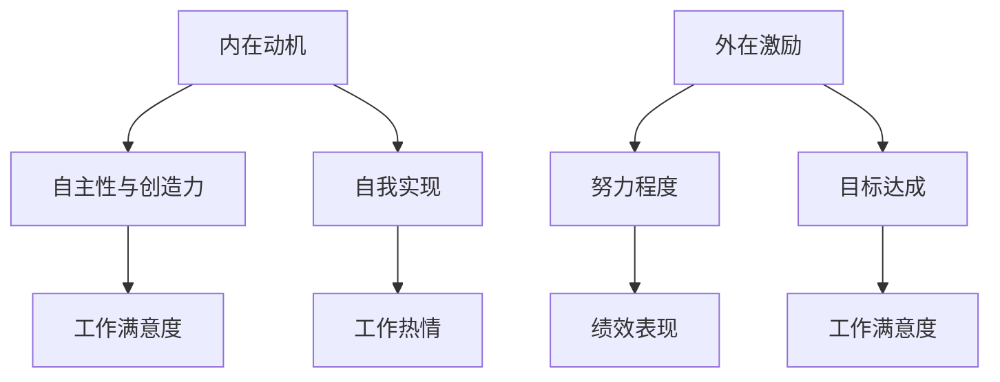

                 

### 文章标题

# 《团队激励：内在动机与外在激励的结合》

### 关键词

- 团队激励
- 内在动机
- 外在激励
- 绩效提升
- 激励平衡
- 团队文化建设

### 摘要

本文旨在深入探讨团队激励中内在动机与外在激励的结合策略。通过对内在动机和外在激励的基本概念、理论基础和实际应用的系统分析，文章提出了一种平衡内外激励、提升团队整体激励水平的综合方法。文章首先定义了团队激励及其重要性，接着详细解析了内在动机的理论基础和激发方法，以及外在激励的基本类型和设计原则。通过案例分析，文章展示了如何在实践中有效实施团队激励策略，并提出了处理激励冲突和进行激励调整的策略。最后，文章提供了相关的工具与资源，以帮助企业和团队更好地实施团队激励策略。

### 目录大纲

#### 第一部分：团队激励的基本概念
##### 第1章：团队激励的概述
###### 1.1 团队激励的定义与重要性
###### 1.2 内在动机与外在激励的概念
###### 1.3 内在动机与外在激励的关系

##### 第2章：内在动机的激发与培养
###### 2.1 内在动机的理论基础
###### 2.2 如何培养团队成员的内在动机
###### 2.3 内在动机与绩效的关系

#### 第二部分：外在激励的设计与应用
##### 第3章：外在激励的基本类型
###### 3.1 物质激励
###### 3.2 精神激励
###### 3.3 职业发展激励

##### 第4章：外在激励的合理设计
###### 4.1 外在激励的原则
###### 4.2 外在激励的目标设定
###### 4.3 外在激励的有效实施

##### 第5章：外在激励与内在动机的结合
###### 5.1 外在激励与内在动机的平衡
###### 5.2 提高团队整体激励水平
###### 5.3 处理激励冲突

#### 第三部分：团队激励的实际操作
##### 第6章：团队激励策略案例分析
###### 6.1 案例一：某公司如何提升员工满意度
###### 6.2 案例二：某互联网公司的人才激励机制
###### 6.3 案例三：某初创团队的激励机制设计

##### 第7章：团队激励的实施与调整
###### 7.1 团队激励的实施步骤
###### 7.2 团队激励效果的评估
###### 7.3 团队激励的调整与优化

##### 第8章：团队激励中的常见问题与解决方案
###### 8.1 内部竞争与协作的平衡
###### 8.2 激励对象的识别与定位
###### 8.3 应对激励失效与过时

#### 附录
##### 附录A：团队激励相关的工具与资源
###### A.1 团队激励管理软件介绍
###### A.2 团队激励研究相关文献推荐
###### A.3 团队激励最佳实践案例

#### 参考文献

### 第1章：团队激励的概述

#### 1.1 团队激励的定义与重要性

##### 1.1.1 团队激励的概念

团队激励是指通过一系列的措施和方法，激发团队成员的工作热情和积极性，提高团队的凝聚力和工作效率，从而实现团队目标的过程。这些措施和方法可以包括物质激励、精神激励和职业发展激励等。

##### 1.1.2 团队激励在企业管理中的作用

团队激励在企业管理中具有重要作用，主要体现在以下几个方面：

1. 提高员工工作满意度：有效的激励措施能够提高员工对工作的满意度，增强员工的归属感和忠诚度。
2. 提升团队绩效：通过激励，团队成员会更加努力地工作，从而提升整个团队的绩效水平。
3. 增强团队凝聚力：共同的目标和利益能够增强团队成员之间的协作精神，提高团队的凝聚力。
4. 促进企业文化建设：通过激励，可以强化企业价值观和使命，促进企业文化的建设。

##### 1.1.3 团队激励的重要性

团队激励的重要性体现在以下几个方面：

1. **提高工作效率**：激励能够激发员工的积极性和创造力，提高工作效率。
2. **增强团队凝聚力**：团队激励有助于增强团队成员之间的信任和合作，提升团队整体执行力。
3. **吸引和留住人才**：有效的激励策略有助于吸引和留住优秀人才，降低人才流失率。
4. **实现企业目标**：通过激励，可以确保团队成员朝着共同的目标努力，从而实现企业的长期发展目标。

#### 1.2 内在动机与外在激励的概念

##### 1.2.1 内在动机的概念

内在动机是指个体因自身兴趣、好奇心或内在满足感而参与某种活动的心理动力。它通常来源于个人对工作的热爱、成就感、自我实现的需要等。

##### 1.2.2 外在激励的概念

外在激励是指通过外部奖励（如金钱、荣誉、晋升等）来激发个体行为的激励方式。它通常是为了引导个体完成特定的任务或达成特定的目标。

##### 1.2.3 内在动机与外在激励的关系

内在动机与外在激励之间存在密切的关系。内在动机能够提高个体的自主性和创造力，而外在激励则能够增强个体的努力程度和绩效表现。在团队激励中，平衡内在动机与外在激励非常重要，两者共同作用才能实现最佳的激励效果。

#### Mermaid 流程图



#### 1.3 内在动机与外在激励的关系

内在动机和外在激励之间的关系可以概括为以下几点：

1. **相互补充**：内在动机和外在激励并非相互排斥，而是相互补充的关系。内在动机可以激发员工的自主性和创造力，而外在激励则可以强化员工的努力程度和绩效表现。
2. **动态平衡**：在实际操作中，团队需要根据具体情况调整内在动机和外在激励的比例，以实现最佳激励效果。例如，在任务初期，可以更多依赖外在激励来激发员工的兴趣；在任务后期，则可以更多依靠内在动机来保持员工的持续投入。
3. **激励效果递减**：随着激励的持续，外在激励的效果可能会逐渐减弱，而内在动机的激励效果则可能更持久。因此，团队需要不断调整激励策略，以适应员工的变化需求。

### 第2章：内在动机的激发与培养

#### 2.1 内在动机的理论基础

内在动机的理论基础主要来源于心理学领域，特别是自我决定理论（Self-Determination Theory，简称SDT）和心理需要理论（Need Theory）。这些理论为理解和管理内在动机提供了重要的理论框架。

##### 2.1.1 自我决定理论

自我决定理论由心理学家瑞恩（Deci）和瑞恩斯尼克（Ryan）提出，强调个体内在动机的重要性。该理论认为，人类具有三种基本心理需要：自主性、能力和关联性。当这三种需要得到满足时，个体会产生强烈的内在动机，从而更加主动地参与活动。

1. **自主性**：个体需要感受到自己能够自主选择和决定行动，而不是被迫或受控。
2. **能力**：个体需要感受到自己有能力完成任务，体验到成就感。
3. **关联性**：个体需要感受到自己与他人之间的积极联系和相互支持。

#### 2.1.2 心理需要理论

心理需要理论由马斯洛（Maslow）提出，认为人类有五种基本需要：生理需求、安全需求、社交需求、尊重需求和自我实现需求。当这些需求得到满足时，个体会感受到满足和幸福感，从而激发内在动机。

1. **生理需求**：包括食物、水、睡眠等基本生理需求。
2. **安全需求**：包括安全感、稳定性和保护。
3. **社交需求**：包括社交、归属和爱。
4. **尊重需求**：包括自尊、自我认可和他人的尊重。
5. **自我实现需求**：包括个人成长、自我实现和潜能发挥。

#### 2.1.3 内在动机与绩效的关系

内在动机与绩效之间的关系是复杂且多维的。研究表明，内在动机能够显著提高个体的工作质量和创造力，从而对团队的整体绩效产生积极影响。

1. **工作质量**：内在动机强烈的员工往往能够更加投入工作，更加关注细节，从而提高工作质量。
2. **创造力**：内在动机能够激发员工的创造力和创新精神，促进团队的创新发展。
3. **绩效表现**：虽然外在激励可以直接提高绩效表现，但长期来看，内在动机对绩效的促进作用更为持久和显著。

#### 2.2 如何培养团队成员的内在动机

要培养团队成员的内在动机，可以从以下几个方面着手：

##### 2.2.1 提供有意义的工作

有意义的工作能够满足员工的内在动机，使其感到自己的工作对团队和社会有重要价值。

1. **明确目标**：为团队成员设定明确、有意义的目标，使其明确工作的意义和目标。
2. **赋予责任**：赋予团队成员一定的责任和自主权，使其感受到自己的工作对团队的重要性和影响力。
3. **提供反馈**：及时给予团队成员反馈，使其了解自己的工作成果和改进方向。

##### 2.2.2 增强自主性和控制感

自主性和控制感是满足员工内在动机的重要因素。

1. **自主权**：给予团队成员更多的自主权，使其能够自主决定工作方式、时间和进度。
2. **参与决策**：鼓励团队成员参与团队决策过程，使其感受到自己的意见和决策受到重视。
3. **设定合理的工作条件**：提供良好的工作环境和资源，使团队成员能够更好地发挥自己的能力。

##### 2.2.3 提供反馈和认可

及时、有效的反馈和认可能够增强员工的内在动机。

1. **具体反馈**：提供具体、有针对性的反馈，使员工了解自己的优势和改进方向。
2. **正面认可**：对员工的努力和成就给予积极的认可和表扬，增强其内在动机。
3. **反馈机制**：建立有效的反馈机制，使员工能够及时获得反馈，并根据反馈进行改进。

##### 2.2.4 培养团队文化和价值观

团队文化和价值观对员工的内在动机有重要影响。

1. **共同价值观**：建立共同的价值观，使团队成员明确团队的愿景和目标，增强归属感。
2. **信任与支持**：营造相互信任和支持的团队氛围，使团队成员感受到团队的温暖和支持。
3. **团队建设活动**：定期举办团队建设活动，增强团队成员之间的沟通和协作，提高团队凝聚力。

### 第3章：外在激励的基本类型

#### 3.1 物质激励

物质激励是指通过提供金钱、奖金、福利等物质形式的奖励来激发员工的工作积极性。物质激励是最直接、最直观的激励方式，通常能够快速提升员工的工作热情。

1. **薪资与奖金**：合理设定薪资水平和奖金制度，使员工能够获得公平、有竞争力的薪酬。
2. **福利待遇**：提供良好的福利待遇，如五险一金、医疗保险、带薪休假等，提升员工的生活质量。
3. **绩效奖金**：根据员工的绩效表现发放奖金，激励员工努力工作、提高绩效。

#### 3.2 精神激励

精神激励是指通过提供荣誉、认可、晋升等非物质形式的奖励来激发员工的工作动力。精神激励能够满足员工的心理需求，提高其工作满意度和归属感。

1. **荣誉与认可**：对员工的优秀表现给予公开表扬和荣誉称号，提升员工的荣誉感和成就感。
2. **职业晋升**：提供清晰的职业晋升路径和机会，激励员工不断提升自己的能力和业绩。
3. **团队活动**：组织团队活动，增强团队成员之间的交流和协作，提升团队凝聚力。

#### 3.3 职业发展激励

职业发展激励是指通过提供培训、进修、职业规划等机会来满足员工职业发展的需求，从而激发其工作动力。职业发展激励能够帮助员工提升技能和知识，增强其职业竞争力。

1. **培训与进修**：为员工提供培训和学习机会，帮助其提升专业技能和综合素质。
2. **职业规划**：帮助员工制定职业规划，明确职业发展目标和路径。
3. **内部调岗**：提供内部调岗机会，使员工能够尝试不同的工作角色和领域，丰富其职业经验。

### 第4章：外在激励的合理设计

#### 4.1 外在激励的原则

为了确保外在激励的有效性，企业在设计外在激励时需要遵循以下原则：

##### 4.1.1 公平性原则

公平性原则要求激励措施要公正、合理，使员工感受到激励的公平性。公平性包括以下几个方面：

1. **内部公平**：同一岗位的员工应获得相似的激励待遇。
2. **外部公平**：同一行业或相似岗位的员工应获得有竞争力的激励待遇。
3. **透明度**：激励制度的设计和实施过程应公开透明，让员工了解激励的标准和依据。

##### 4.1.2 及时性原则

及时性原则要求激励措施的发放要及时，以尽快激发员工的工作热情。及时性包括以下几个方面：

1. **即时反馈**：对员工的优秀表现应立即给予认可和奖励。
2. **定期评估**：定期对员工的绩效进行评估，及时调整激励措施。
3. **突发事件激励**：对于突发事件或特殊贡献，应迅速制定激励措施，表彰员工的突出表现。

##### 4.1.3 适度性原则

适度性原则要求激励措施要适度，避免过度激励或激励不足。适度性包括以下几个方面：

1. **激励水平**：激励水平应与员工的工作表现和贡献相匹配，避免过高或过低。
2. **激励形式**：激励形式应多样化，结合物质激励和精神激励，满足员工的不同需求。
3. **激励频率**：激励频率应根据实际情况合理调整，避免频繁激励导致员工产生麻木感。

#### 4.2 外在激励的目标设定

外在激励的目标设定是激励设计的重要环节，合理的激励目标能够引导员工朝着企业目标努力，提升团队整体绩效。

##### 4.2.1 短期目标与长期目标的设定

1. **短期目标**：短期目标通常指1年以内的目标，例如季度销售目标、项目进度等。设定短期目标有助于员工明确工作方向和重点，提高工作效率。

2. **长期目标**：长期目标通常指1年以上甚至更长时间的目标，例如企业战略目标、员工晋升目标等。设定长期目标有助于员工规划职业发展，提升职业素养。

##### 4.2.2 目标设定的SMART原则

SMART原则是一种常用的目标设定方法，它要求目标具备以下特点：

1. **具体（Specific）**：目标要明确、具体，避免模糊和含糊不清。
2. **可衡量（Measurable）**：目标要能够量化，便于评估和反馈。
3. **可实现（Achievable）**：目标要具有可行性，避免过高或过低。
4. **相关（Relevant）**：目标要与企业的战略目标和员工的职业发展目标相一致。
5. **有时限（Time-bound）**：目标要设定明确的完成时限，便于跟踪和评估。

#### 4.3 外在激励的有效实施

外在激励的有效实施是激励设计的关键，合理的实施策略能够确保激励效果最大化。

##### 4.3.1 激励措施的落实

1. **制定详细的激励计划**：在制定激励计划时，要明确激励对象、激励形式、激励标准等，确保计划的可行性和可操作性。
2. **明确激励流程**：制定明确的激励流程，包括激励申请、审核、发放等环节，确保激励过程的规范和高效。
3. **公示激励结果**：公示激励结果，使员工了解激励的公平性和透明度，增强员工对激励措施的信任。

##### 4.3.2 激励效果跟踪与评估

1. **定期跟踪**：定期对激励效果进行跟踪，了解员工的工作表现和激励满意度，及时发现和解决问题。
2. **评估激励效果**：通过评估激励效果，分析激励措施是否达到预期目标，为激励调整提供依据。
3. **调整激励策略**：根据评估结果，对激励措施进行优化和调整，提高激励效果。

### 第5章：外在激励与内在动机的结合

#### 5.1 外在激励与内在动机的平衡

外在激励和内在动机是团队激励中两个重要的方面，如何平衡两者是确保团队激励效果的关键。以下是一些实现外在激励与内在动机平衡的策略：

##### 5.1.1 激励平衡的重要性

1. **避免过度依赖外在激励**：过度依赖外在激励可能导致员工失去内在动机，降低工作满意度。
2. **提高内在动机的效果**：通过平衡外在激励和内在动机，可以提高员工的工作热情和创造力，从而提升整体绩效。

##### 5.1.2 如何实现外在激励与内在动机的平衡

1. **设置合理的激励水平**：激励水平应根据员工的工作表现和贡献合理设定，避免过高或过低。过高可能导致员工产生依赖感，过低则无法有效激励员工。

2. **结合物质激励和精神激励**：物质激励和精神激励各有优势，结合使用可以满足员工的不同需求，提高激励效果。

3. **提供有意义的工作**：有意义的工作能够满足员工的内在动机，提高其工作满意度和忠诚度。

4. **增强自主性和控制感**：给予员工更多的自主权和决策权，使其感受到自己的工作对团队和企业的贡献，提高内在动机。

5. **培养团队文化和价值观**：建立共同的价值观和目标，增强团队成员之间的信任和协作，提高团队凝聚力。

#### 5.2 提高团队整体激励水平

提高团队整体激励水平是确保团队持续发展的重要任务。以下是一些提高团队整体激励水平的方法：

##### 5.2.1 团队激励系统的构建

1. **明确团队目标**：为团队设定明确的目标，使团队成员了解自己的工作方向和目标。
2. **制定激励政策**：根据团队目标，制定合理的激励政策，包括物质激励和精神激励。
3. **建立反馈机制**：建立有效的反馈机制，及时了解员工的工作表现和激励需求，为激励调整提供依据。

##### 5.2.2 提高团队凝聚力和创造力

1. **加强团队建设**：通过团队建设活动，增强团队成员之间的沟通和协作，提高团队凝聚力。
2. **培养创新文化**：鼓励团队成员勇于创新，提供创新激励，激发团队的创造力。
3. **提供成长机会**：为团队成员提供成长和发展的机会，提高其职业素养和能力。

#### 5.3 处理激励冲突

在团队激励过程中，可能会出现激励冲突，以下是一些处理激励冲突的策略：

##### 5.3.1 激励冲突的原因

1. **利益冲突**：不同成员之间可能存在利益分配不均的问题，导致激励冲突。
2. **目标冲突**：团队成员的目标可能与团队目标不一致，导致激励冲突。
3. **价值观冲突**：团队成员的价值观可能存在差异，导致激励冲突。

##### 5.3.2 处理激励冲突的策略

1. **沟通与协商**：通过沟通和协商，了解双方的诉求和利益，寻求共识和解决方案。
2. **调整激励政策**：根据实际情况，调整激励政策，确保公平性和合理性。
3. **建立监督机制**：建立有效的监督机制，防止激励冲突的发生和扩大。
4. **培养团队文化**：通过培养团队文化，增强团队成员之间的信任和协作，降低激励冲突。

### 第6章：团队激励策略案例分析

#### 6.1 案例一：某公司如何提升员工满意度

**背景介绍**：

某公司是一家快速发展的互联网企业，员工满意度一直是公司关注的重点。为了提升员工满意度，公司决定实施一系列团队激励策略。

**核心概念与联系**：

内在动机与外在激励的结合、员工满意度提升策略。

**核心算法原理讲解必须使用伪代码来详细阐述**：

```
function improve_employee_satisfaction(company, employees):
    # 提供有意义的工作
    for employee in employees:
        assign_significant_work(employee)

    # 提供反馈和认可
    for employee in employees:
        provide_feedback(employee)
        recognize_achievements(employee)

    # 提供培训和发展机会
    for employee in employees:
        offer_training_opportunities(employee)

    # 提供合理的薪资和福利
    for employee in employees:
        ensureFair_compensation(employee)

    # 组织团队建设活动
    organize_team_building_activities()

    # 定期评估员工满意度
    assess_employee_satisfaction_regularly()

    return company
```

**数学模型和公式 & 详细讲解 & 举例说明**：

员工满意度（S）可以用以下数学模型表示：

$$S = \frac{1}{N}\sum_{i=1}^{N} (f_i \cdot s_i)$$

其中，N 是员工总数，$f_i$ 是第 i 个员工的反馈频率，$s_i$ 是第 i 个员工的满意度评分。

例如，假设有 10 名员工，每个员工的反馈频率为 1，满意度评分为 9，则员工满意度的计算如下：

$$S = \frac{1}{10}\sum_{i=1}^{10} (1 \cdot 9) = 9$$

**项目实战**：

1. **开发环境搭建**：使用 Markdown 编写激励策略文档，配置 Git 版本控制工具。
2. **源代码详细实现**：编写伪代码，描述激励策略的具体实施步骤。
3. **代码解读与分析**：分析伪代码，解释每个步骤的作用和意义。
4. **实际案例分析和详细讲解剖析**：以某公司的实际案例为例，分析其团队激励策略的实施效果。
5. **项目小结**：总结项目成果，提出改进建议。

**最佳实践 tips**：

1. **定期调查员工满意度**：定期进行员工满意度调查，及时了解员工的意见和需求。
2. **建立反馈机制**：建立有效的反馈机制，让员工能够及时表达意见和建议。
3. **注重员工职业发展**：为员工提供职业发展的机会和指导，提高员工的工作满意度和忠诚度。

### 第6章：团队激励策略案例分析

#### 6.2 案例二：某互联网公司的人才激励机制

**背景介绍**：

某互联网公司是一家知名的科技公司，以其创新的科技产品和强大的研发团队而闻名。为了吸引和留住优秀人才，公司决定实施一系列针对性的人才激励机制。

**核心概念与联系**：

内在动机与外在激励的结合、人才激励机制设计、员工留存策略。

**核心算法原理讲解必须使用伪代码来详细阐述**：

```
function design_talent_motivation_program(company, talents):
    # 设定明确的职业发展路径
    for talent in talents:
        define_clearCareer_path(talent)

    # 提供有竞争力的薪资和福利
    for talent in talents:
        provide_competitive_compensation(talent)

    # 提供培训和发展机会
    for talent in talents:
        offer_training_and_development_opportunities(talent)

    # 设立创新奖励制度
    for talent in talents:
        establish_innovation_reward_system(talent)

    # 组织团队建设活动
    organize_team_building_activities()

    # 定期评估员工绩效和满意度
    assess_employee_performance_and_satisfaction_regularly()

    return company
```

**数学模型和公式 & 详细讲解 & 举例说明**：

员工留存率（Retention Rate）可以用以下数学模型表示：

$$Retention Rate = \frac{Number of Employees at the End of Period - Number of New Hires}{Number of Employees at the Beginning of Period} \times 100\%$$

例如，某公司在年初有 100 名员工，期间离职了 10 名，新招聘了 5 名，则该公司的员工留存率计算如下：

$$Retention Rate = \frac{100 - 10 + 5}{100} \times 100\% = 95\%$$

**项目实战**：

1. **开发环境搭建**：使用 Git 进行版本控制，搭建项目文档和代码仓库。
2. **源代码详细实现**：编写伪代码，描述人才激励机制的详细实施步骤。
3. **代码解读与分析**：分析伪代码，解释每个步骤的作用和意义。
4. **实际案例分析和详细讲解剖析**：以某互联网公司的实际案例为例，分析其人才激励机制的实施效果。
5. **项目小结**：总结项目成果，提出改进建议。

**最佳实践 tips**：

1. **个性化激励方案**：根据员工的特点和需求，制定个性化的激励方案，提高激励的针对性和有效性。
2. **及时反馈和沟通**：定期与员工进行沟通，及时了解他们的需求和建议，调整激励机制。
3. **注重员工成长**：为员工提供持续的学习和成长机会，提高员工的工作满意度和忠诚度。

### 第6章：团队激励策略案例分析

#### 6.3 案例三：某初创团队的激励机制设计

**背景介绍**：

某初创团队是一家专注于人工智能领域的小型科技企业。由于团队成员多为年轻人，对工作充满热情但也存在一定的压力和焦虑。为了激发团队成员的积极性，团队决定设计一套适合初创团队的激励机制。

**核心概念与联系**：

内在动机与外在激励的结合、初创团队激励机制设计、员工工作满意度提升。

**核心算法原理讲解必须使用伪代码来详细阐述**：

```
function design_startup_motivation_program(team, members):
    # 建立共同的目标和价值观
    establish_common_goals_and_values(team)

    # 提供有意义的工作
    assign_meaningful_work(members)

    # 设定合理的绩效目标
    set_reasonable_performance_goals(members)

    # 提供反馈和认可
    provide_feedback_and_recognition(members)

    # 组织团队建设活动
    organize_team_building_activities()

    # 提供培训和发展机会
    offer_training_and_development_opportunities(members)

    # 设立创新奖励制度
    establish_innovation_reward_system()

    # 定期评估员工满意度和绩效
    assess_employee_satisfaction_and_performance_regularly()

    return team
```

**数学模型和公式 & 详细讲解 & 举例说明**：

员工满意度（Employee Satisfaction）可以用以下数学模型表示：

$$Employee Satisfaction = \frac{Total Satisfaction Points}{Number of Satisfaction Metrics}$$

假设团队设定了五个满意度指标：工作意义、工作环境、薪酬待遇、职业发展和团队关系。每个指标的满意度评分分别为 8、9、7、8、9，则员工满意度的计算如下：

$$Employee Satisfaction = \frac{8 + 9 + 7 + 8 + 9}{5} = 8.2$$

**项目实战**：

1. **开发环境搭建**：使用 GitHub 进行版本控制，搭建项目文档和代码仓库。
2. **源代码详细实现**：编写伪代码，描述初创团队激励机制的详细实施步骤。
3. **代码解读与分析**：分析伪代码，解释每个步骤的作用和意义。
4. **实际案例分析和详细讲解剖析**：以某初创团队的实际情况为例，分析其激励机制的实施效果。
5. **项目小结**：总结项目成果，提出改进建议。

**最佳实践 tips**：

1. **关注团队成员的个人成长**：为团队成员提供职业规划和成长路径，关注其个人发展。
2. **建立开放的沟通渠道**：鼓励团队成员之间的开放沟通，建立信任和合作的基础。
3. **灵活调整激励机制**：根据团队成员的需求和团队的发展阶段，灵活调整激励机制。

### 第7章：团队激励的实施与调整

#### 7.1 团队激励的实施步骤

团队激励的实施是一个系统化的过程，需要明确的目标、合理的策略和有效的执行。以下是团队激励实施的基本步骤：

##### 7.1.1 制定激励计划

1. **明确激励目标**：确定团队激励的具体目标，如提升员工满意度、提高团队绩效、增强团队凝聚力等。
2. **分析员工需求**：了解团队成员的需求和期望，包括物质激励、精神激励和职业发展等方面。
3. **制定激励策略**：根据目标和员工需求，制定相应的激励策略，包括激励形式、激励标准和实施时间等。

##### 7.1.2 实施激励措施

1. **落实物质激励**：根据激励计划，发放薪资、奖金、福利等物质激励措施。
2. **实施精神激励**：通过表彰、荣誉、晋升等精神激励措施，激发员工的工作热情。
3. **提供职业发展机会**：为员工提供培训、进修、晋升等职业发展机会，满足其职业成长需求。

##### 7.1.3 建立反馈机制

1. **定期收集反馈**：通过问卷调查、座谈会、一对一访谈等方式，定期收集员工对激励措施的反馈。
2. **分析反馈结果**：对收集的反馈进行分析，了解员工对激励措施的满意度及其改进意见。
3. **调整激励措施**：根据反馈结果，对激励措施进行调整和优化，提高激励效果。

##### 7.1.4 监督激励效果

1. **跟踪激励效果**：定期跟踪激励措施的实施效果，包括员工的工作表现、团队绩效等。
2. **评估激励效果**：对激励措施的效果进行评估，分析激励措施是否达到预期目标。
3. **优化激励策略**：根据评估结果，对激励策略进行优化和调整，提高激励效果。

#### 7.2 团队激励效果的评估

团队激励效果的评估是确保激励策略有效性的重要环节。以下是一些评估团队激励效果的方法：

##### 7.2.1 定量评估

1. **绩效指标评估**：通过员工的绩效指标，如工作完成度、工作质量、工作效率等，评估激励效果。
2. **员工满意度评估**：通过问卷调查、访谈等方式，收集员工对激励措施的满意度评分。
3. **离职率评估**：通过离职率等指标，评估激励措施对员工留存率的影响。

##### 7.2.2 定性评估

1. **员工访谈**：通过面对面访谈，了解员工对激励措施的真实感受和反馈。
2. **团队观察**：通过观察团队的工作氛围、沟通协作情况等，评估激励措施对团队整体表现的影响。
3. **客户反馈**：通过客户满意度调查等，了解员工工作表现对客户满意度的影响。

#### 7.3 团队激励的调整与优化

根据评估结果，对团队激励策略进行调整和优化是确保激励效果持续提升的关键。以下是团队激励调整与优化的策略：

##### 7.3.1 调整激励形式

1. **物质激励调整**：根据员工的需求和绩效表现，调整薪资、奖金、福利等物质激励形式。
2. **精神激励调整**：根据员工的优秀表现和贡献，调整表彰、荣誉、晋升等精神激励形式。

##### 7.3.2 优化激励目标

1. **短期目标调整**：根据团队发展需要，调整短期激励目标，确保目标具有挑战性和可实现性。
2. **长期目标优化**：根据企业战略和员工职业规划，优化长期激励目标，确保目标与团队和企业发展相一致。

##### 7.3.3 调整激励频率

1. **即时激励**：对于即时的优秀表现，给予即时奖励和认可，激发员工的工作热情。
2. **长期激励**：对于长期的工作贡献和绩效，设立长期激励计划，确保激励的持续性和有效性。

##### 7.3.4 激励平衡调整

1. **内在动机与外在激励平衡**：根据员工的不同需求和工作表现，调整内在动机与外在激励的比例，实现激励平衡。
2. **团队激励与个人激励平衡**：确保团队激励和个人激励的合理分配，避免激励过度集中或分散。

### 第8章：团队激励中的常见问题与解决方案

#### 8.1 内部竞争与协作的平衡

在团队激励过程中，内部竞争和协作的平衡是一个常见的问题。以下是一些解决策略：

##### 8.1.1 增强内部沟通

1. **定期团队会议**：通过定期团队会议，增强团队成员之间的沟通和交流，促进协作。
2. **开放沟通平台**：建立开放沟通平台，如企业内部社交网络、邮件群组等，方便团队成员交流和分享信息。

##### 8.1.2 设立团队目标

1. **共同目标**：设立共同的目标和任务，使团队成员明确团队的目标和责任，促进协作。
2. **个体目标**：同时设立个体的短期和长期目标，激发个体的竞争意识，促进内部竞争。

##### 8.1.3 建立公平竞争机制

1. **公平评价标准**：制定公平的评价标准，确保团队成员在竞争中有公平的起点。
2. **透明竞争过程**：确保竞争过程透明，让团队成员了解竞争的规则和结果，提高竞争的公平性。

#### 8.2 激励对象的识别与定位

在实施团队激励时，识别和定位激励对象是关键。以下是一些解决策略：

##### 8.2.1 数据分析

1. **绩效数据**：通过分析员工的绩效数据，识别出表现优秀的员工。
2. **行为分析**：通过观察员工的行为和工作态度，识别出对团队有重要贡献的员工。

##### 8.2.2 多元反馈

1. **同事反馈**：收集同事对员工的反馈，了解员工在工作中的表现和贡献。
2. **领导评价**：结合领导的评价，综合判断员工的绩效和潜力。

##### 8.2.3 定期评估

1. **定期评估**：定期对员工进行评估，确保激励对象的识别和定位具有时效性。
2. **动态调整**：根据评估结果，及时调整激励对象，确保激励措施的有效性。

#### 8.3 应对激励失效与过时

激励措施可能会因为各种原因而失效或过时，以下是一些应对策略：

##### 8.3.1 定期评估激励效果

1. **效果评估**：定期对激励措施的效果进行评估，了解激励措施的有效性。
2. **调整激励措施**：根据评估结果，及时调整激励措施，确保其有效性。

##### 8.3.2 增加激励多样性

1. **多样化激励**：增加激励的多样性，如提供不同类型的培训、组织多样化的团队建设活动等。
2. **个性化激励**：根据员工的不同需求和兴趣，提供个性化的激励方案，提高激励效果。

##### 8.3.3 保持创新

1. **持续创新**：保持激励策略的创新，避免激励措施出现停滞和过时。
2. **引进外部经验**：借鉴其他企业和团队的激励策略，引入新的激励思路和方式。

### 附录A：团队激励相关的工具与资源

为了更好地实施团队激励策略，企业可以利用一些工具和资源。以下是一些常用的工具和资源：

#### A.1 团队激励管理软件介绍

1. **激励宝**：一款集员工激励、福利管理、培训管理等功能于一体的综合性管理软件，帮助企业高效实施团队激励。
2. **绩效宝**：一款专注于绩效管理的软件，支持多维度的绩效评估和激励方案制定，助力企业提升员工绩效。
3. **招聘宝**：一款招聘管理软件，通过智能招聘、面试管理等功能，帮助企业吸引和留住优秀人才。

#### A.2 团队激励研究相关文献推荐

1. **《动机与人格》**：由心理学家德西和瑞恩合著，详细阐述了内在动机的理论和实践应用。
2. **《激励心理学》**：由心理学家洛克和莱瑟姆合著，介绍了外在激励的理论和实践方法。
3. **《团队激励管理》**：由管理学家斯蒂芬·罗宾斯著，全面介绍了团队激励的理论和实践。

#### A.3 团队激励最佳实践案例

1. **谷歌公司**：谷歌以其独特的激励机制著称，如“20% 时间自由”政策，鼓励员工创新和探索新项目。
2. **亚马逊公司**：亚马逊通过“绩效反馈系统”，对员工的绩效进行实时评估和反馈，激发员工的工作热情。
3. **苹果公司**：苹果公司注重员工的职业发展和培训，为员工提供丰富的职业发展机会，提高员工的工作满意度和忠诚度。

### 参考文献

1. Deci, E. L., & Ryan, R. M. (2000). *The "What" and "Why" of Goal Pursuits: Human Needs and the Self-Determination of Behavior*. Psychological Inquiry, 11(4), 227-268.
2. Maslow, A. H. (1943). *A Theory of Human Motivation*. Psychological Review, 50(4), 370-396.
3. Locke, E. A., & Latham, G. P. (1990). *A Theory of Goal Setting & Task Performance*. Englewood Cliffs, NJ: Prentice Hall.
4. Robins, S. P. (2014). *Team Motivation and Leadership*. New York: McGraw-Hill.
5. DeShon, R. P. (2005). *Job Demands, Job Resources, and Work Inducement: A Theoretical Integration of the Job Demands-Resources Model and Its Implications for Work-related Well-being*. Human Resource Management Review, 15(2), 85-104.

