                 

### 第1章：团队激励的重要性与基本原则

#### 1.1 团队激励的定义与作用

团队激励是一种通过提供奖励、认可和职业发展机会来激发员工积极性和创造力的方法。其核心在于满足员工的需求，提升工作效率，增强团队凝聚力，并最终实现组织目标。

**Mermaid 流程图：**

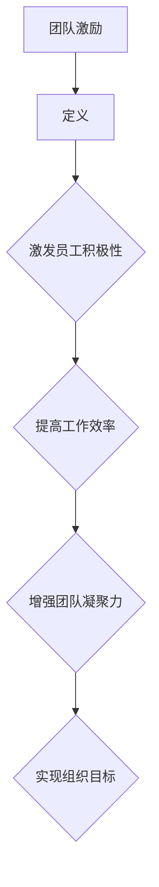

**伪代码：**
```python
def team_motivation():
    # 定义激励目标
    set_motivation_goals()

    # 提升员工积极性
    increase_employee_engagement()

    # 提高工作效率
    enhance_work_efficiency()

    # 增强团队凝聚力
    strengthen_team_cohesion()

    # 实现组织目标
    achieve_organizational_goals()
```

#### 1.2 团队激励的基本原则

团队激励必须遵循以下基本原则，以确保其有效性和公平性：

**公平性原则：**确保每个员工都有平等的机会获得激励，避免歧视和不公平现象。

**目标导向原则：**激励计划应与组织目标和个人发展目标相一致，以实现协同效应。

**个性化原则：**根据员工的个性、需求和职业目标，定制个性化的激励方案。

**持续性原则：**激励计划应持续优化和调整，以适应不断变化的环境和需求。

**伪代码：**
```python
def team_motivation_principles():
    # 公平性原则
    ensure_equity()

    # 目标导向原则
    align_goals()

    # 个性化原则
    personalize_incentives()

    # 持续性原则
    sustain_motivators()
```

**1.3 团队激励的误区与挑战**

在实际操作中，团队激励可能会遇到以下误区和挑战：

**误区：**
- 过度依赖物质激励，忽视精神激励。
- 单一激励方式，缺乏多样性和个性化。
- 激励计划过于复杂，难以执行。

**挑战：**
- 员工需求多变，激励计划难以持续适应。
- 组织文化和氛围不利于激励效果的发挥。
- 领导能力和管理风格的影响。

**解决策略：**
- 结合物质和精神激励，实现平衡。
- 设计多样化和个性化的激励方案。
- 简化激励计划，提高可操作性。
- 建立良好的组织文化和氛围。
- 提升领导力和管理能力。

**总结：**

团队激励在提高员工积极性、工作效率和团队凝聚力方面具有重要意义。遵循基本原则，克服误区和挑战，设计有效的激励计划，是实现组织目标的关键。在接下来的章节中，我们将深入探讨各种激励策略和其实施方法。作者：AI天才研究院/AI Genius Institute & 禅与计算机程序设计艺术/Zen And The Art of Computer Programming

---

# 第2章：激励理论解析

## 2.1 马斯洛需求层次理论

### 2.1.1 理论背景

马斯洛需求层次理论是由美国心理学家亚伯拉罕·马斯洛（Abraham Maslow）于1943年提出的。该理论将人类需求从低到高分为五个层次：生理需求、安全需求、社交需求、尊重需求和自我实现需求。每个层次的需求都建立在前一层需求得到满足的基础上。

### 2.1.2 需求层次架构与联系

**Mermaid 流程图：**

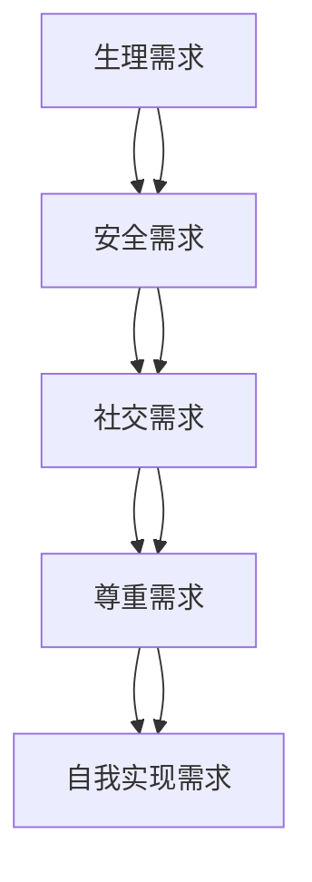

**伪代码：**
```python
class MaslowHierarchy:
    def __init__(self):
        self.physical_needs = None
        self.security_needs = None
        self.social_needs = None
        self.esteem_needs = None
        self.self_actualization_needs = None

    def fulfill_needs(self):
        if self.physical_needs:
            self.security_needs = True
        if self.security_needs:
            self.social_needs = True
        if self.social_needs:
            self.esteem_needs = True
        if self.esteem_needs:
            self.self_actualization_needs = True
```

### 2.1.3 在团队激励中的应用

在团队激励中，了解员工所处的需求层次，有助于设计更有效的激励策略。例如：

- **生理需求：** 提供良好的薪酬福利，保障员工的基本生活需求。
- **安全需求：** 稳定的职业环境和良好的工作安全保障。
- **社交需求：** 增强团队凝聚力，提供社交机会，满足员工的社交需求。
- **尊重需求：** 提供认可和奖励，满足员工的尊重需求。
- **自我实现需求：** 提供挑战性任务和个人发展机会，帮助员工实现自我价值。

**总结：**

马斯洛需求层次理论为团队激励提供了理论依据，通过满足员工的多样化需求，可以有效提高员工的满意度和工作积极性。在接下来的章节中，我们将继续探讨其他激励理论。作者：AI天才研究院/AI Genius Institute & 禅与计算机程序设计艺术/Zen And The Art of Computer Programming

---

## 2.2 双因素理论

### 2.2.1 理论背景

双因素理论，又称激励-保健理论，是由美国心理学家赫兹伯格（Frederick Herzberg）在1959年提出的。该理论认为，工作满意度由两类因素决定：激励因素和保健因素。

### 2.2.2 理论架构与联系

**Mermaid 流程图：**

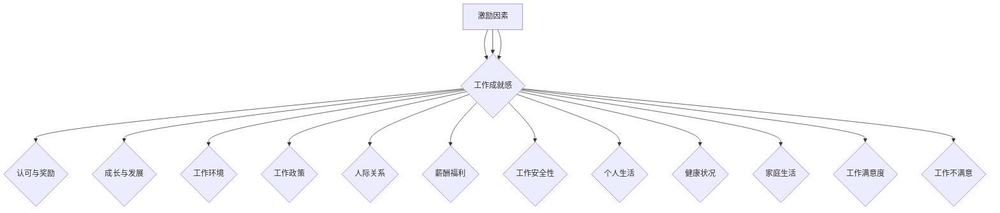

**伪代码：**
```python
class HerzbergTheory:
    def __init__(self):
        self.motivators = ['achievement', 'recognition', 'growth']
        self.hygiene_factors = ['work environment', 'work policies', 'interpersonal relationships', 'compensation', 'job security', 'health', 'family life']

    def assess_satisfaction(self):
        if all(self.motivators):
            return '工作满意度'
        else:
            return '工作不满意'
```

### 2.2.3 在团队激励中的应用

双因素理论指出，激励因素和保健因素对工作满意度的影响不同。在实际应用中，团队激励策略应兼顾这两类因素：

- **激励因素：**
  - **工作成就感：** 提供具有挑战性的工作任务和项目，让员工感受到工作的意义和成就感。
  - **认可与奖励：** 定期对员工的优秀表现进行表彰和奖励，提高员工的荣誉感和归属感。
  - **成长与发展：** 提供培训和学习机会，帮助员工提升技能和职业发展。

- **保健因素：**
  - **工作环境：** 营造一个舒适、安全和有活力的工作环境，提升员工的工作体验。
  - **工作政策：** 制定公平、透明和合理的工作政策，确保员工权益。
  - **人际关系：** 建立良好的团队氛围，促进员工之间的沟通和协作。
  - **薪酬福利：** 提供有竞争力的薪酬和福利，满足员工的基本需求。

**总结：**

双因素理论为团队激励提供了具体的指导，通过改善保健因素和提供激励因素，可以有效提高员工的工作满意度。在接下来的章节中，我们将继续探讨其他激励理论。作者：AI天才研究院/AI Genius Institute & 禅与计算机程序设计艺术/Zen And The Art of Computer Programming

---

## 2.3 成就动机理论

### 2.3.1 理论背景

成就动机理论是由美国心理学家麦克利兰（David McClelland）提出的。该理论认为，个体的动机主要由成就需求、权力需求和亲和需求组成，这些需求影响着个体的行为和决策。

### 2.3.2 理论架构与联系

**Mermaid 流程图：**

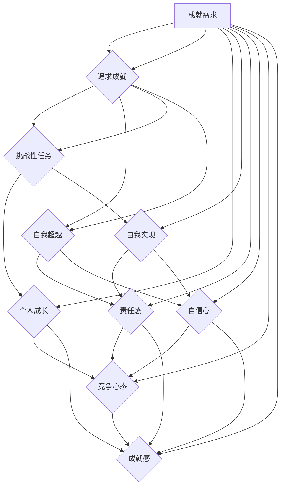

**伪代码：**
```python
class AchievementMotivation:
    def __init__(self):
        self.achievement_needs = None
        self.power_needs = None
        self affiliation_needs = None

    def pursue_achievement(self):
        self.achievement_needs = True

    def pursue_power(self):
        self.power_needs = True

    def pursue_affiliation(self):
        self.affiliation_needs = True
```

### 2.3.3 在团队激励中的应用

成就动机理论指出，成就需求对个体的行为有重要影响。在团队激励中，应重点关注以下策略：

- **挑战性任务：** 提供具有挑战性的工作任务，满足员工的成就需求，激发他们的积极性。
- **个人成长：** 为员工提供学习和发展的机会，帮助他们实现自我超越和自我实现。
- **责任感：** 赋予员工重要的工作任务，让他们感受到责任和信任，提高工作投入度。
- **自信心：** 通过表彰和奖励，增强员工的自信心，鼓励他们面对挑战。

**总结：**

成就动机理论为团队激励提供了重要的理论依据，通过满足员工的成就需求，可以有效提高团队的工作效率和创新能力。在接下来的章节中，我们将继续探讨其他激励理论。作者：AI天才研究院/AI Genius Institute & 禅与计算机程序设计艺术/Zen And The Art of Computer Programming

---

## 2.4 公平理论

### 2.4.1 理论背景

公平理论，又称社会比较理论，是由美国心理学家亚当斯（John Stacy Adams）在1963年提出的。该理论认为，个体会根据其投入与回报的比率，与他人进行比较，以判断是否公平。

### 2.4.2 公平理论架构与联系

**Mermaid 流程图：**

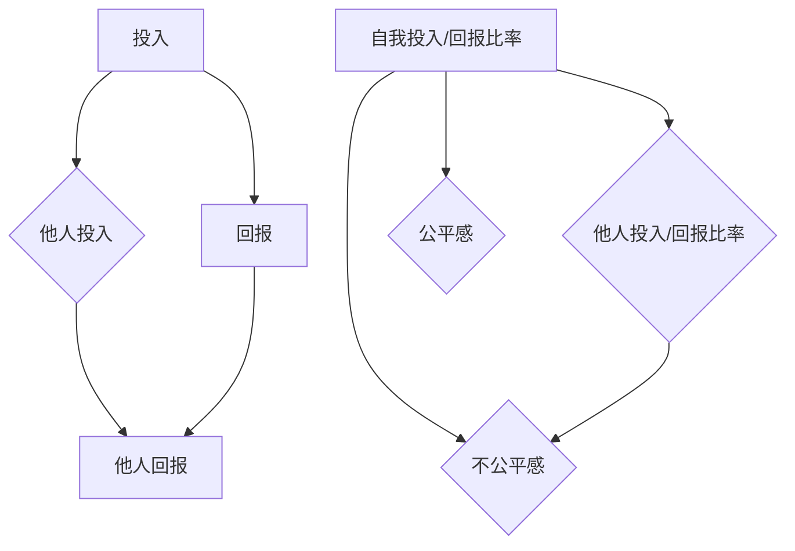

**伪代码：**
```python
class FairnessTheory:
    def __init__(self):
        self.self_investment = None
        self.self_reward = None
        self.other_investment = None
        self.other_reward = None

    def calculate_ratio(self):
        self.ratio = self.self_reward / self.self_investment

    def compare_with_other(self):
        other_ratio = self.other_reward / self.other_investment
        if self.ratio == other_ratio:
            return '公平感'
        elif self.ratio > other_ratio:
            return '不公平感：过高'
        else:
            return '不公平感：过低'
```

### 2.4.3 在团队激励中的应用

公平理论强调，个体会通过比较来判断激励是否公平。在团队激励中，以下策略有助于维护公平感：

- **透明度：** 公开激励计划的制定过程和结果，确保员工了解激励的依据和标准。
- **公正性：** 确保激励分配的公正性，避免主观偏见和偏袒现象。
- **个性化：** 根据员工的贡献和需求，制定个性化的激励方案，避免统一标准的负面影响。
- **沟通：** 定期与员工沟通，了解他们的需求和期望，及时调整激励策略。

**总结：**

公平理论为团队激励提供了重要的指导，通过确保激励的公平性，可以有效提高员工的工作满意度和忠诚度。在接下来的章节中，我们将继续探讨其他激励理论。作者：AI天才研究院/AI Genius Institute & 禅与计算机程序设计艺术/Zen And The Art of Computer Programming

---

# 第3章：策略一：目标管理与目标设定

目标管理是一种通过设定明确、具体和可衡量的目标，以激励员工达成组织目标的方法。目标管理的核心原则是SMART原则，即目标应具备具体的（Specific）、可衡量的（Measurable）、可实现的（Achievable）、相关的（Relevant）和时限的（Time-bound）特点。

### 3.1 目标管理的原则

**原则1：具体性（Specific）**

具体性原则要求目标应当明确、具体，避免模糊和宽泛。例如，将“提高销售额”改为“在下一个季度内，将销售额提高15%”。

**原则2：可衡量性（Measurable）**

目标应具备可衡量性，以便于评估和监控。例如，将“提高员工满意度”改为“通过员工满意度调查，将满意度得分提高5分”。

**原则3：可实现性（Achievable）**

目标应具备可实现性，确保员工通过努力可以达到。例如，将“在不增加成本的情况下，提高生产效率50%”改为“在不增加成本的情况下，提高生产效率20%”。

**原则4：相关性（Relevant）**

目标应与组织目标和个人发展目标相关，确保方向一致。例如，将“完成项目报告”改为“完成与公司战略目标相关的项目报告”。

**原则5：时限性（Time-bound）**

目标应设定明确的截止时间，以便于跟踪和评估。例如，将“提高销售额”改为“在下一个季度末，提高销售额”。

### 3.2 目标设定的SMART原则

**SMART原则** 是目标设定的核心指导原则，具体解释如下：

- **Specific（具体性）：** 目标应当具体明确，避免模糊不清。
- **Measurable（可衡量性）：** 目标应具备可量化、可衡量的标准，以便于评估。
- **Achievable（可实现性）：** 目标应具备可实现性，确保通过努力可以达到。
- **Relevant（相关性）：** 目标应与组织目标和个人发展目标相关，确保方向一致。
- **Time-bound（时限性）：** 目标应设定明确的截止时间，以便于跟踪和评估。

**伪代码：**
```python
class SMARTGoal:
    def __init__(self, goal):
        self.goal = goal
        self.is_specific = self.check_specificity()
        self.is_measurable = self.check_measurability()
        self.is_achievable = self.check_achievability()
        self.is_relevant = self.check_relevance()
        self.is_time_bound = self.check_time_bound()

    def check_specificity(self):
        # 判断目标是否具体
        return "具体" if "具体" in self.goal else "不具体"

    def check_measurability(self):
        # 判断目标是否可衡量
        return "可衡量" if "可衡量" in self.goal else "不可衡量"

    def check_achievability(self):
        # 判断目标是否可实现
        return "可实现" if "可实现" in self.goal else "不可实现"

    def check_relevance(self):
        # 判断目标是否相关
        return "相关" if "相关" in self.goal else "不相关"

    def check_time_bound(self):
        # 判断目标是否有时间限制
        return "有时间限制" if "时间限制" in self.goal else "无时间限制"

    def evaluate_goal(self):
        # 评估目标是否符合SMART原则
        return "符合SMART原则" if all([self.is_specific, self.is_measurable, self.is_achievable, self.is_relevant, self.is_time_bound]) else "不符合SMART原则"
```

### 3.3 如何设定具有挑战性的目标

设定具有挑战性的目标对于激励员工潜能具有重要意义。以下方法可以帮助设定具有挑战性的目标：

- **基于数据：** 利用历史数据和行业趋势，设定有竞争力的目标。
- **与团队讨论：** 与团队成员讨论，确保目标具有可行性和挑战性。
- **设立短期和长期目标：** 结合短期和长期目标，逐步提升员工的挑战水平。
- **提供资源和支持：** 确保员工在实现目标过程中获得必要的资源和支持。

**示例：**

- **短期目标（挑战性）：** “在接下来的两个月内，将产品A的销售额提高20%。”
- **长期目标（挑战性）：** “在未来一年内，实现公司业务增长50%。”

**总结：**

目标管理是团队激励的重要组成部分，通过设定SMART目标，可以激发员工的积极性，提高工作效率和团队凝聚力。在接下来的章节中，我们将探讨更多团队激励策略。作者：AI天才研究院/AI Genius Institute & 禅与计算机程序设计艺术/Zen And The Art of Computer Programming

---

# 第4章：策略二：员工参与与授权

员工参与与授权是团队激励的重要组成部分，能够有效提升员工的工作满意度和绩效。在这一章中，我们将探讨员工参与与授权的益处、实践方法和成功案例。

### 4.1 员工参与的益处

员工参与能够带来以下几方面的益处：

**1. 提高员工满意度：** 当员工感受到自己对团队和组织有贡献时，工作满意度会显著提升。

**2. 增强团队凝聚力：** 员工参与决策过程，有助于建立信任和共识，增强团队凝聚力。

**3. 提高创新能力：** 员工的参与可以带来多样化的观点和想法，有助于激发创新。

**4. 提高决策质量：** 员工参与决策，能够提供一线信息，提高决策的准确性和实用性。

**5. 减少员工流失率：** 当员工感受到被重视和尊重时，离职意愿会降低。

**Mermaid 流程图：**

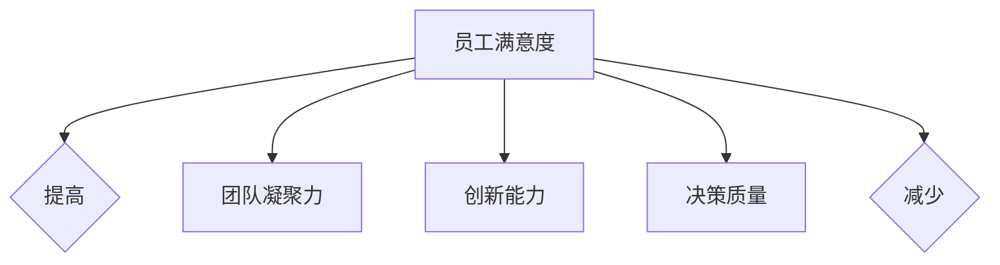

### 4.2 员工授权的实践

员工授权是指赋予员工决策权和责任，使其能够自主管理和解决问题。以下方法可以帮助实现员工授权：

**1. 明确职责与权限：** 制定清晰的职责分配和权限界定，确保员工了解自己的工作范围和决策权限。

**2. 提供培训和支持：** 为员工提供必要的培训和支持，提升其专业技能和管理能力。

**3. 营造信任氛围：** 建立信任关系，鼓励员工敢于尝试和承担责任。

**4. 鼓励自主决策：** 给予员工足够的自主权，让他们在决策过程中发挥创造力。

**5. 及时反馈与认可：** 对员工的工作成果进行及时反馈和认可，增强其自信心和责任感。

**伪代码：**
```python
class EmployeeEmpowerment:
    def __init__(self, responsibilities, training, trust, autonomy, feedback):
        self.responsibilities = responsibilities
        self.training = training
        self.trust = trust
        self.autonomy = autonomy
        self.feedback = feedback

    def assign_clear_responsibilities(self):
        # 分配明确职责
        self.responsibilities["员工A"] = "任务1"
        self.responsibilities["员工B"] = "任务2"

    def provide_training(self):
        # 提供培训
        self.training["员工A"] = "技能培训"
        self.training["员工B"] = "管理培训"

    def build_trust(self):
        # 建立信任
        self.trust = True

    def encourage_autonomous_decision-making(self):
        # 鼓励自主决策
        self.autonomy = True

    def give_feedback_and_recognition(self):
        # 及时反馈与认可
        self.feedback = "任务完成情况良好，给予表扬"
```

### 4.3 增强员工参与感和授权感的案例

**案例1：谷歌的员工参与**

谷歌通过开放式办公空间、定期员工交流会和在线论坛等方式，鼓励员工参与决策和分享观点。员工可以在内部平台上提出建议和反馈，公司会根据这些建议进行改进。这种做法不仅增强了员工的参与感，还提高了公司的创新能力和市场竞争力。

**案例2：IBM的员工授权**

IBM通过“领导力发展计划”，为员工提供晋升和发展机会，鼓励他们在工作中发挥领导作用。公司还实施了“管理创新基金”，支持员工自主开展创新项目。这种授权措施激发了员工的创造力和工作热情，推动了公司的持续发展。

**总结：**

员工参与与授权是提升团队激励的重要策略，通过营造参与和授权的文化氛围，可以有效提高员工的工作满意度和绩效。在接下来的章节中，我们将继续探讨其他激励策略。作者：AI天才研究院/AI Genius Institute & 禅与计算机程序设计艺术/Zen And The Art of Computer Programming

---

## 第5章：策略三：认可与奖励

认可与奖励是团队激励中不可或缺的一部分，它不仅能激励员工的工作积极性，还能提升团队的整体凝聚力。在这一章中，我们将深入探讨认可与奖励的重要性、如何设计有效的奖励计划，以及员工认可的最佳实践。

### 5.1 认可与奖励的重要性

认可与奖励在团队激励中具有重要作用，主要体现在以下几个方面：

**1. 提高员工满意度：** 通过认可与奖励，让员工感受到自己的工作得到认可和重视，从而提高工作满意度。

**2. 增强员工忠诚度：** 定期给予员工奖励，能够增强他们对组织的忠诚度，降低离职率。

**3. 激发员工积极性：** 奖励能够激发员工的积极性，促使他们为实现组织目标而努力。

**4. 促进团队合作：** 通过集体奖励，能够增强团队之间的协作和信任。

**5. 培养企业文化：** 正面的认可与奖励有助于塑造积极向上的企业文化，提升组织的整体形象。

**Mermaid 流程图：**

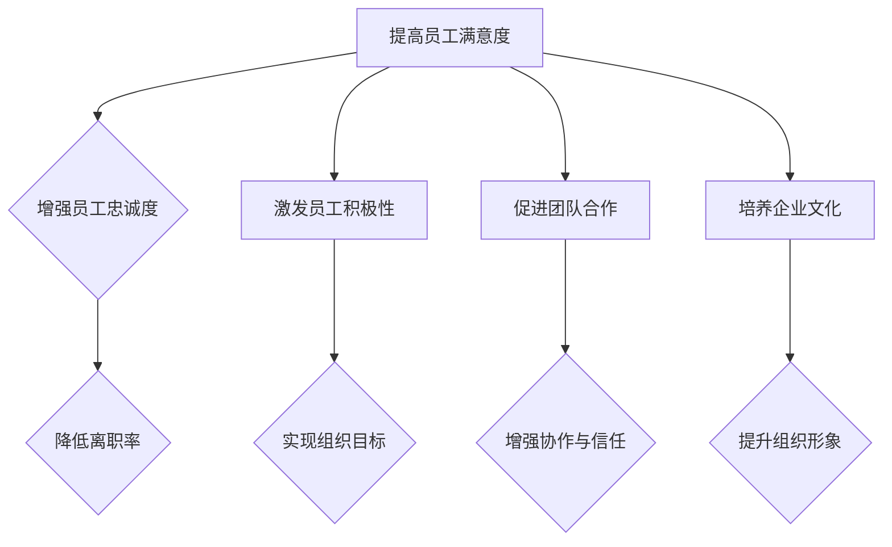

### 5.2 设计有效的奖励计划

设计有效的奖励计划需要考虑以下几个方面：

**1. 奖励类型：** 奖励可以分为物质奖励和精神奖励，根据员工的需求和贡献来选择。

**2. 奖励额度：** 奖励额度应与员工的贡献相匹配，既要激励员工，又不能过于夸张。

**3. 奖励时机：** 奖励应在员工取得显著成绩时进行，确保激励效果最大化。

**4. 奖励方式：** 奖励方式可以多样化，如现金奖励、晋升机会、休假等。

**5. 奖励透明度：** 奖励计划应公开透明，确保员工了解奖励的标准和分配方式。

**伪代码：**
```python
class RewardPlan:
    def __init__(self, reward_type, reward_amount, reward_time, reward_mode, transparency):
        self.reward_type = reward_type
        self.reward_amount = reward_amount
        self.reward_time = reward_time
        self.reward_mode = reward_mode
        self.transparency = transparency

    def determine_reward_type(self):
        # 根据员工贡献确定奖励类型
        if employee_contribution > 80:
            self.reward_type = "现金奖励"
        else:
            self.reward_type = "晋升机会"

    def set_reward_amount(self):
        # 设置奖励额度
        if employee_contribution > 90:
            self.reward_amount = "高额奖金"
        else:
            self.reward_amount = "小额奖金"

    def schedule_reward_time(self):
        # 设定奖励时机
        if significant_accomplishment:
            self.reward_time = "立即"
        else:
            self.reward_time = "后续"

    def select_reward_mode(self):
        # 选择奖励方式
        if employee_preference == "旅行":
            self.reward_mode = "休假"
        else:
            self.reward_mode = "现金"

    def ensure_transparency(self):
        # 确保奖励透明度
        self.transparency = True
```

### 5.3 员工认可的最佳实践

以下是一些员工认可的最佳实践：

**1. 定期表彰：** 定期举行表彰仪式，对员工的优秀表现进行公开表彰。

**2. 个人化奖励：** 根据员工的特点和贡献，设计个性化的奖励方案。

**3. 公开表扬：** 在公司内部网站上发布表扬邮件，让更多人了解员工的优秀表现。

**4. 领导认可：** 领导亲自对员工的优秀表现进行认可和感谢。

**5. 鼓励反馈：** 建立反馈机制，鼓励员工对自己的工作成果进行自我评估，并提出改进建议。

**总结：**

认可与奖励是团队激励的核心策略之一，通过有效的奖励计划和员工认可，可以激发员工的工作积极性，提高团队的整体绩效。在接下来的章节中，我们将继续探讨更多团队激励策略。作者：AI天才研究院/AI Genius Institute & 禅与计算机程序设计艺术/Zen And The Art of Computer Programming

---

## 第6章：策略四：培训与职业发展

### 6.1 培训对员工激励的影响

培训是提升员工技能和知识的重要手段，对员工的激励作用主要体现在以下几个方面：

**1. 提升技能水平：** 培训可以帮助员工掌握新的技能和知识，提高工作效率。

**2. 增强职业竞争力：** 通过培训，员工可以不断提升自己的职业竞争力，增强在职场中的优势。

**3. 提高工作满意度：** 当员工感到自己在不断进步和成长时，工作满意度会显著提高。

**4. 增强团队凝聚力：** 培训可以促进员工之间的交流和学习，增强团队凝聚力。

**5. 促进组织发展：** 培训有助于组织培养具备专业技能和综合素质的人才，推动组织的发展。

**Mermaid 流程图：**

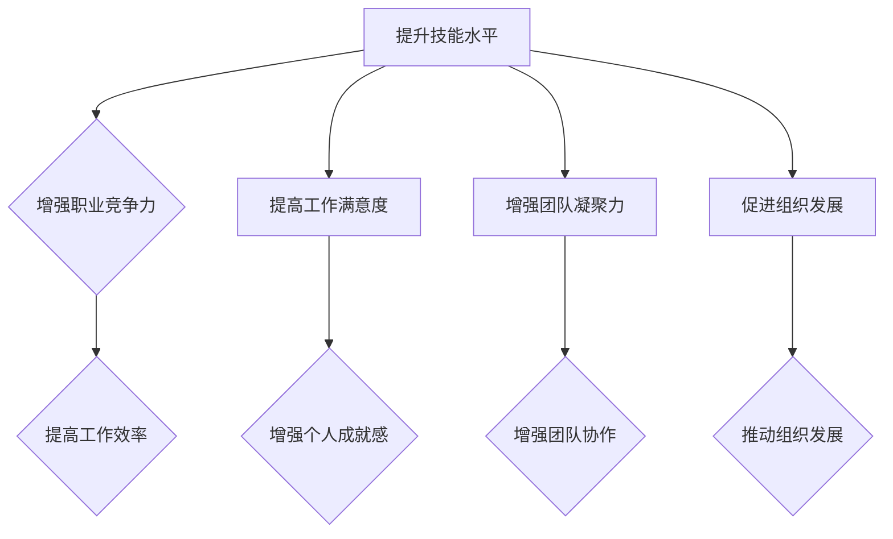

### 6.2 制定个性化的职业发展计划

为了更好地激励员工，企业需要根据员工的兴趣、能力和职业目标，制定个性化的职业发展计划。以下步骤有助于制定有效的职业发展计划：

**1. 员工自我评估：** 员工可以通过自我评估了解自己的优势和劣势，明确自己的职业目标。

**2. 职业规划咨询：** 企业可以提供职业规划咨询服务，帮助员工制定个性化的职业发展路径。

**3. 确定职业目标：** 员工需要明确自己的长期和短期职业目标，以便制定针对性的培训计划。

**4. 制定培训计划：** 根据员工的职业目标，制定详细的培训计划，包括培训内容、时间和方式。

**5. 跟进与评估：** 定期跟进员工的培训进度，并对培训效果进行评估，根据反馈进行调整。

**伪代码：**
```python
class CareerDevelopmentPlan:
    def __init__(self, employee_assessment, career_counseling, career_goals, training_plan, follow_up, evaluation):
        self.employee_assessment = employee_assessment
        self.career_counseling = career_counseling
        self.career_goals = career_goals
        self.training_plan = training_plan
        self.follow_up = follow_up
        self.evaluation = evaluation

    def conduct_employee_assessment(self):
        # 进行员工自我评估
        self.employee_assessment = True

    def provide_career_counseling(self):
        # 提供职业规划咨询
        self.career_counseling = True

    def determine_career_goals(self):
        # 确定职业目标
        self.career_goals = "成为高级项目经理"

    def create_training_plan(self):
        # 制定培训计划
        self.training_plan = "项目管理培训、领导力培训"

    def monitor_training_progress(self):
        # 跟进培训进度
        self.follow_up = True

    def evaluate_training效果的评估(self):
        # 对培训效果进行评估
        self.evaluation = True
```

### 6.3 提供职业发展的具体案例

以下是一个企业为员工提供职业发展的具体案例：

**案例：某科技公司的职业发展计划**

1. **员工自我评估：** 公司为每位员工提供职业发展问卷，帮助员工了解自己的职业兴趣和优势。

2. **职业规划咨询：** 公司邀请专业职业规划师为员工提供一对一咨询，帮助员工制定职业发展路径。

3. **确定职业目标：** 员工根据职业规划师的建议，确定自己的长期和短期职业目标，如成为技术专家、项目经理等。

4. **制定培训计划：** 公司根据员工的职业目标，制定详细的培训计划，包括技术培训、管理培训等。

5. **实施培训计划：** 公司为员工提供各种培训机会，如内部培训、外部培训、在线课程等。

6. **跟进与评估：** 定期跟进员工的培训进度，并对培训效果进行评估，根据反馈进行调整。

7. **职业发展支持：** 公司为员工提供职业发展支持，如晋升机会、项目参与等。

**总结：**

培训与职业发展是团队激励的重要策略，通过制定个性化的职业发展计划，可以激励员工不断提升自己的能力，实现职业目标。在接下来的章节中，我们将继续探讨更多团队激励策略。作者：AI天才研究院/AI Genius Institute & 禅与计算机程序设计艺术/Zen And The Art of Computer Programming

---

## 第7章：策略五：公平的绩效评价体系

### 7.1 绩效评价的原则

建立一个公平的绩效评价体系，对于激励员工、提升团队整体绩效具有重要意义。以下原则有助于确保绩效评价的公平性：

**1. 一致性：** 绩效评价标准应统一，避免因评价人员的不同而造成评价结果的差异。

**2. 客观性：** 绩效评价应基于客观的数据和事实，避免主观偏见。

**3. 全面性：** 绩效评价应涵盖员工的工作表现、能力和潜力等多个方面，确保评价的全面性。

**4. 公开透明：** 绩效评价的过程和结果应公开透明，确保员工了解评价标准和方法。

**5. 及时性：** 绩效评价应及时进行，以便于及时发现问题和采取措施。

**6. 可持续性：** 绩效评价体系应具备可持续性，能够适应组织的发展变化。

**Mermaid 流程图：**

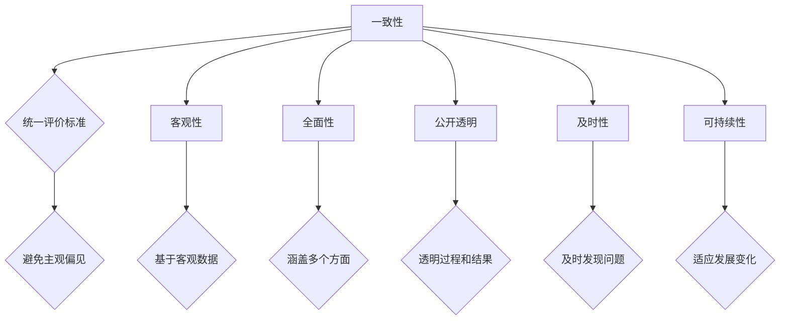

### 7.2 绩效评价的工具与方法

为了确保绩效评价的公平性和准确性，企业可以采用以下工具和方法：

**1. 360度评估：** 通过收集员工上级、同事、下属和客户的反馈，对员工进行全面评价。

**2. KPI（关键绩效指标）：** 根据员工的工作职责，设定具体、可衡量的绩效指标，对员工的工作进行量化评估。

**3. PBC（个人业务目标）：** 结合员工的个人目标和组织目标，设定个人业务目标，对员工的绩效进行评估。

**4. BEI（行为事件访谈）：** 通过对员工在工作中表现出的关键行为和事件进行访谈，评估员工的能力和潜力。

**5. 360度反馈：** 定期向员工提供来自不同来源的反馈，帮助他们了解自己的优点和不足。

**伪代码：**
```python
class PerformanceEvaluation:
    def __init__(self, evaluation_method, data_collection, feedback, goal_alignment):
        self.evaluation_method = evaluation_method
        self.data_collection = data_collection
        self.feedback = feedback
        self.goal_alignment = goal_alignment

    def set_evaluation_methods(self):
        # 设定绩效评价方法
        self.evaluation_method = ["360度评估", "KPI", "PBC", "BEI"]

    def collect_data(self):
        # 收集评价数据
        self.data_collection = True

    def provide_360_feedback(self):
        # 提供360度反馈
        self.feedback = True

    def align_goals(self):
        # 结合个人目标与组织目标
        self.goal_alignment = True
```

### 7.3 如何建立公平的绩效评价体系

建立公平的绩效评价体系需要以下步骤：

**1. 明确绩效目标：** 确定组织目标和各部门的目标，确保绩效评价与组织目标一致。

**2. 设计评价标准：** 制定明确的评价标准，包括绩效指标、评价维度和评价方法。

**3. 培训评价人员：** 对评价人员进行培训，确保他们了解评价标准和方法，提高评价的准确性。

**4. 定期评估和反馈：** 定期对绩效评价体系进行评估和反馈，根据反馈进行调整和优化。

**5. 建立反馈机制：** 建立员工反馈机制，鼓励员工对评价体系提出意见和建议。

**总结：**

公平的绩效评价体系是团队激励的重要手段，通过科学、客观的评价方法，可以有效激励员工，提升团队整体绩效。在接下来的章节中，我们将继续探讨更多团队激励策略。作者：AI天才研究院/AI Genius Institute & 禅与计算机程序设计艺术/Zen And The Art of Computer Programming

---

## 第8章：策略六：构建积极的团队文化

### 8.1 团队文化的内涵与作用

**团队文化** 是一个团队共同遵循的价值观、信念和行为准则，是团队内部凝聚力和协作力的源泉。积极的团队文化能够带来以下作用：

**1. 提高员工满意度：** 积极的团队文化能够创造一个愉悦、包容的工作环境，提高员工的工作满意度和幸福感。

**2. 增强团队凝聚力：** 共同的价值观和信念能够增强团队成员之间的信任和默契，提高团队凝聚力。

**3. 激发创新思维：** 积极的团队文化鼓励员工敢于尝试、勇于创新，推动团队不断进步。

**4. 提升整体绩效：** 团队文化对团队绩效有直接影响，积极的团队文化能够提高团队的整体绩效和竞争力。

**5. 增强员工忠诚度：** 良好的团队文化能够增加员工对组织的认同感和归属感，降低离职率。

**Mermaid 流程图：**

```mermaid
graph TD
A[提高员工满意度] --> B{增强团队凝聚力}
A --> C[激发创新思维]
A --> D[提升整体绩效]
A --> E[增强员工忠诚度}
B --> F{提高工作效率}
C --> G{促进团队发展}
D --> H{提升组织竞争力}
E --> I{降低离职率}
```

### 8.2 如何构建积极的团队文化

构建积极的团队文化需要以下步骤：

**1. 确立价值观：** 明确团队的核心价值观，确保所有成员都认同并践行。

**2. 强化沟通：** 建立良好的沟通机制，鼓励团队成员之间的开放和坦诚交流。

**3. 培养领导力：** 培养具备领导力的团队成员，推动团队文化的传播和实践。

**4. 定期活动：** 组织团队建设活动，增强团队成员之间的联系和信任。

**5. 领导示范：** 领导者应成为团队文化的表率，以身作则，树立积极的工作态度和行为。

**6. 反馈与改进：** 定期收集团队成员的反馈，根据反馈不断改进团队文化。

**伪代码：**
```python
class TeamCulture:
    def __init__(self, values, communication, leadership, activities, leadership_example, feedback):
        self.values = values
        self.communication = communication
        self.leadership = leadership
        self.activities = activities
        self.leadership_example = leadership_example
        self.feedback = feedback

    def establish_values(self):
        # 确立价值观
        self.values = "诚信、协作、创新"

    def strengthen_communication(self):
        # 强化沟通
        self.communication = True

    def cultivate_leadership(self):
        # 培养领导力
        self.leadership = True

    def organize_activities(self):
        # 组织团队建设活动
        self.activities = True

    def lead_by_example(self):
        # 领导示范
        self.leadership_example = True

    def collect_and_improve_feedback(self):
        # 收集反馈并改进
        self.feedback = True
```

### 8.3 团队文化建设案例

以下是一个企业成功构建积极团队文化的案例：

**案例：某互联网公司的团队文化建设**

1. **确立价值观：** 公司核心价值观为“用户至上、创新驱动、团队合作”。

2. **强化沟通：** 公司定期举办内部交流会，鼓励员工分享想法和经验，提高团队协作效率。

3. **培养领导力：** 公司提供领导力培训，帮助团队成员提升管理能力和领导力。

4. **定期活动：** 公司组织团队建设活动，如团队拓展训练、集体旅游等，增强员工之间的友谊和信任。

5. **领导示范：** 公司高层领导以身作则，积极参与团队活动和员工沟通，树立积极的工作榜样。

6. **反馈与改进：** 公司设立反馈机制，鼓励员工提出意见和建议，根据反馈不断改进团队文化。

**总结：**

构建积极的团队文化对于团队激励和整体绩效提升至关重要。通过确立价值观、强化沟通、培养领导力、组织团队活动、领导示范和反馈改进，企业可以营造一个健康、积极的工作环境。在接下来的章节中，我们将继续探讨更多团队激励策略。作者：AI天才研究院/AI Genius Institute & 禅与计算机程序设计艺术/Zen And The Art of Computer Programming

---

## 第9章：策略七：工作环境优化

### 9.1 优化工作环境的策略

一个良好的工作环境对员工的工作满意度和生产力至关重要。以下是一些优化工作环境的策略：

**1. 提供舒适的工作空间：** 确保办公室设施完善，如舒适的办公椅、良好的照明和通风等，以提高员工的工作舒适度。

**2. 灵活的工作安排：** 实施灵活的工作时间制度，如弹性工作制和远程办公，以满足员工的不同需求。

**3. 提供培训和发展机会：** 定期举办培训课程和工作坊，帮助员工提升技能和职业发展。

**4. 增加员工参与度：** 鼓励员工参与决策过程，提高他们对工作的参与感和满意度。

**5. 营造良好的团队氛围：** 通过团队建设活动和团队奖励，增强团队成员之间的信任和协作。

**6. 提供健康福利：** 如健身房会员、健康体检等，关注员工的身心健康。

**Mermaid 流程图：**

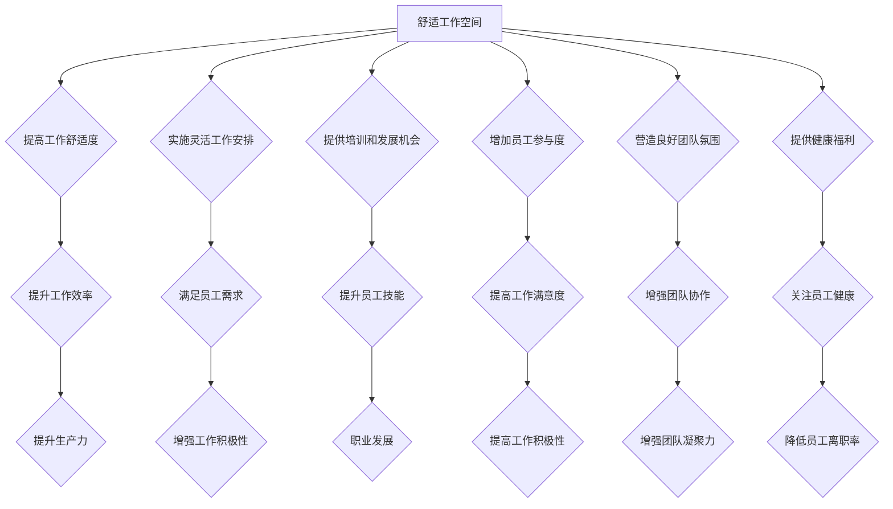

### 9.2 提高工作满意度的环境因素

以下是一些影响工作满意度的环境因素：

**1. 薪酬福利：** 竞争力的薪酬和福利制度能够提高员工的工作满意度和忠诚度。

**2. 工作条件：** 良好的工作条件和设施，如舒适的办公空间、良好的通风和照明等，对员工的工作满意度有显著影响。

**3. 工作安全：** 确保员工在工作中的安全，能够减少工作压力，提高工作满意度。

**4. 工作稳定性：** 工作稳定性能够增强员工对未来的信心，提高工作满意度。

**5. 职业发展机会：** 提供职业发展机会，帮助员工实现个人目标和职业规划，有助于提高工作满意度。

**6. 工作与生活的平衡：** 灵活的工作安排和休假政策，有助于员工更好地平衡工作与生活，提高工作满意度。

**Mermaid 流程图：**

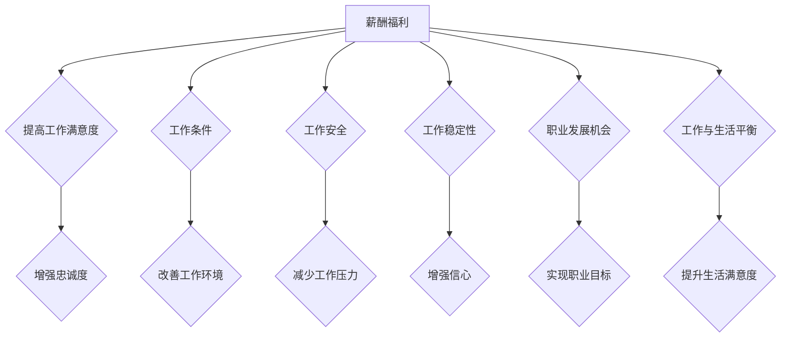

### 9.3 创造高效的工作环境

为了创造一个高效的工作环境，企业可以采取以下措施：

**1. 简化流程：** 优化工作流程，减少不必要的步骤和审批，提高工作效率。

**2. 提供工具和资源：** 为员工提供必要的工具和资源，确保他们能够高效地完成任务。

**3. 鼓励自主管理：** 给予员工更多的自主权，让他们自主规划和管理工作任务。

**4. 提供反馈和指导：** 定期给予员工反馈和指导，帮助他们不断提升工作能力。

**5. 营造积极氛围：** 通过团队建设活动和奖励机制，营造积极的工作氛围，激发员工的积极性。

**6. 关注员工心理健康：** 提供心理健康支持和咨询服务，帮助员工缓解工作压力。

**总结：**

优化工作环境是提升员工满意度和工作效率的重要策略。通过提供舒适的工作空间、灵活的工作安排、培训和发展机会、良好的团队氛围以及关注员工的身心健康，企业可以创造一个高效、积极的工作环境。在接下来的章节中，我们将继续探讨更多团队激励策略。作者：AI天才研究院/AI Genius Institute & 禅与计算机程序设计艺术/Zen And The Art of Computer Programming

---

## 第10章：策略八：灵活的工作安排

### 10.1 灵活工作安排的益处

灵活的工作安排是一种现代化的管理模式，它赋予员工更多的自主权，以满足他们的个人需求和工作偏好。以下是一些灵活工作安排的益处：

**1. 提高工作效率：** 通过灵活的工作安排，员工可以更好地管理自己的时间和任务，提高工作效率。

**2. 提升工作满意度：** 灵活的工作安排使员工能够更好地平衡工作与生活，从而提高工作满意度。

**3. 减少员工压力：** 灵活的工作安排减轻了员工的工作压力，有助于提高员工的心理健康。

**4. 促进员工忠诚度：** 当员工感受到组织对他们的尊重和关心时，他们的忠诚度会显著提高。

**5. 增强团队协作：** 虽然工作安排灵活，但通过适当的沟通和协作工具，团队仍然能够保持高效的协作。

**6. 提高创新能力：** 灵活的工作环境鼓励员工探索新的工作方式和方法，激发创新思维。

**Mermaid 流程图：**

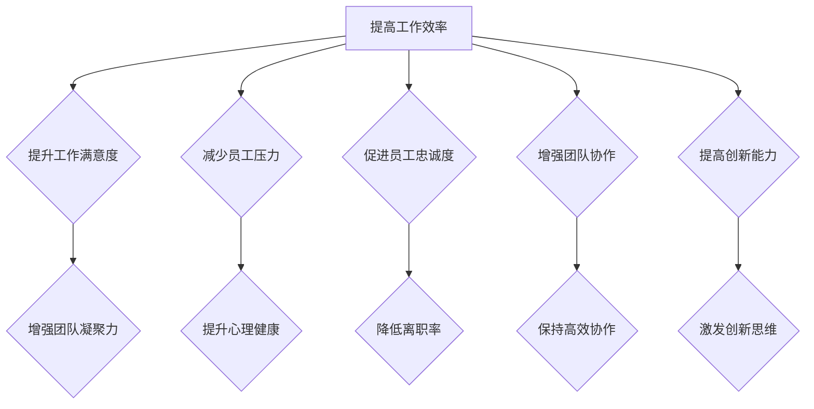

### 10.2 实施灵活工作安排的方法

要成功实施灵活工作安排，企业可以采取以下方法：

**1. 确定政策：** 制定明确的灵活工作安排政策，明确适用范围、实施步骤和员工的权利与义务。

**2. 培训员工：** 对员工进行培训，确保他们了解灵活工作安排的规则和最佳实践。

**3. 考核机制：** 建立灵活的工作绩效评估机制，确保员工在灵活工作安排下仍能保持高效率。

**4. 沟通工具：** 利用现代化的沟通工具，如视频会议、即时通讯和协作平台，确保团队成员之间能够有效沟通。

**5. 管理支持：** 提供必要的管理支持和资源，帮助员工在灵活工作安排下保持高效。

**伪代码：**
```python
class FlexibleWorkArrangement:
    def __init__(self, policy, employee_training, performance_evaluation, communication_tools, management_support):
        self.policy = policy
        self.employee_training = employee_training
        self.performance_evaluation = performance_evaluation
        self.communication_tools = communication_tools
        self.management_support = management_support

    def define_policy(self):
        # 制定灵活工作安排政策
        self.policy = "员工可以申请灵活的工作时间，但需保持高效的工作产出。"

    def train_employees(self):
        # 培训员工
        self.employee_training = True

    def establish_performance_evaluation(self):
        # 建立灵活工作绩效评估机制
        self.performance_evaluation = "根据员工的工作产出和质量进行评估。"

    def provide_communication_tools(self):
        # 提供沟通工具
        self.communication_tools = ["视频会议系统", "即时通讯工具", "协作平台"]

    def offer_management_support(self):
        # 提供管理支持
        self.management_support = True
```

### 10.3 灵活工作安排的案例分析

以下是一个企业成功实施灵活工作安排的案例：

**案例：某全球知名科技公司**

1. **政策制定：** 公司制定了详细的灵活工作安排政策，允许员工选择远程办公或弹性工作时间。

2. **员工培训：** 公司为员工提供了关于如何高效远程工作的培训，包括时间管理、沟通技巧和网络安全。

3. **绩效评估：** 公司建立了一套基于工作产出和团队协作的绩效评估体系，确保员工在灵活工作安排下仍能保持高效。

4. **沟通工具：** 公司提供了视频会议系统和即时通讯工具，确保团队成员之间的沟通畅通无阻。

5. **管理支持：** 公司设立了专门的管理团队，负责监督和支持灵活工作安排的执行，并提供必要的资源。

**总结：**

灵活工作安排能够显著提升员工的工作效率和满意度，同时降低员工压力和离职率。通过制定明确的政策、提供培训和支持、建立绩效评估体系和沟通工具，企业可以成功实施灵活工作安排。在接下来的章节中，我们将继续探讨更多团队激励策略。作者：AI天才研究院/AI Genius Institute & 禅与计算机程序设计艺术/Zen And The Art of Computer Programming

---

## 第11章：策略九：领导力与领导风格

### 11.1 领导力的定义与作用

领导力是指领导者通过影响和激励他人，引导团队实现共同目标的能力。领导力在团队激励中发挥着至关重要的作用：

**1. 激发员工潜能：** 领导者通过激励和鼓励，帮助员工发现和发挥自己的潜能，实现个人和团队目标。

**2. 建立团队凝聚力：** 领导者通过有效的沟通和协作，建立团队凝聚力，促进团队成员之间的信任和合作。

**3. 提升团队绩效：** 领导者通过明确目标和制定策略，提升团队的整体绩效和竞争力。

**4. 营造积极氛围：** 领导者通过树立榜样和传递正能量，营造积极向上的工作氛围，激发员工的积极性。

**5. 解决冲突和问题：** 领导者通过有效的冲突管理和问题解决，维护团队稳定和和谐，提高团队效率。

**Mermaid 流程图：**

```mermaid
graph TD
A[激发员工潜能] --> B{提升团队绩效}
A --> C[建立团队凝聚力]
A --> D[营造积极氛围]
A --> E[解决冲突和问题}
B --> F{提高团队竞争力}
C --> G{促进团队协作}
D --> H{激发员工积极性}
E --> I{维护团队稳定}
```

### 11.2 领导风格的类型与选择

领导风格是指领导者根据不同情境和团队成员特点，采取的领导方式。常见的领导风格包括：

**1. 指导型领导：** 领导者明确指示和指导团队成员，提供具体的工作指导和支持。

**2. 支持型领导：** 领导者关注团队成员的需求和感受，提供情感支持和鼓励。

**3. 参与型领导：** 领导者积极参与团队成员的工作和决策过程，共同解决问题。

**4. 挑战型领导：** 领导者设定高目标，激励团队成员挑战自我，发挥最大潜力。

**5. 做榜样型领导：** 领导者通过自己的行为和成就，树立榜样，影响和激励团队成员。

领导风格的选择应根据团队成员的个性、工作环境和组织目标来确定。有效的领导者会根据不同情境灵活调整领导风格，以达到最佳激励效果。

**Mermaid 流程图：**

```mermaid
graph TD
A[指导型领导] --> B{明确指示和支持}
A --> C[支持型领导]
A --> D[参与型领导]
A --> E[挑战型领导]
A --> F[做榜样型领导}
B --> G{具体指导和帮助}
C --> H{情感支持和鼓励}
D --> I{参与决策和问题解决}
E --> J{设定高目标和激励}
F --> K{树立榜样和影响}
```

### 11.3 提升领导力的实践策略

以下是一些提升领导力的实践策略：

**1. 持续学习和自我提升：** 领导者应不断学习新知识、新技能，提升自己的领导能力和管理素养。

**2. 建立良好的沟通：** 领导者应具备良好的沟通能力，善于倾听、表达和反馈，建立有效的沟通机制。

**3. 激励和认可员工：** 领导者应关注员工的需求和成长，通过激励和认可，激发员工的积极性和创造力。

**4. 培养团队协作：** 领导者应促进团队协作，营造积极向上的团队氛围，提升团队整体绩效。

**5. 解决问题和冲突：** 领导者应具备问题解决能力和冲突管理能力，及时解决团队中的问题和矛盾。

**6. 赋予员工责任：** 领导者应赋予员工责任和自主权，鼓励员工参与决策和承担责任，提升员工的领导力和团队凝聚力。

**伪代码：**
```python
class LeadershipDevelopment:
    def __init__(self, continuous_learning, effective_communication, employee_motivation, team_cohesion, problem_solving, responsibility_assignment):
        self.continuous_learning = continuous_learning
        self.effective_communication = effective_communication
        self.employee_motivation = employee_motivation
        self.team_cohesion = team_cohesion
        self.problem_solving = problem_solving
        self.responsibility_assignment = responsibility_assignment

    def encourage_learning(self):
        # 鼓励持续学习和自我提升
        self.continuous_learning = True

    def improve_communication(self):
        # 提升沟通能力
        self.effective_communication = True

    def motivate_employees(self):
        # 激励和认可员工
        self.employee_motivation = True

    def foster_teamwork(self):
        # 培养团队协作
        self.team_cohesion = True

    def solve_problems(self):
        # 解决问题和冲突
        self.problem_solving = True

    def delegate Responsibilities(self):
        # 赋予员工责任
        self.responsibility_assignment = True
```

### 11.4 领导力与团队激励的关系

领导力与团队激励密切相关，有效的领导力能够激发员工的积极性、提高团队绩效和实现组织目标。通过以下方式，领导力与团队激励相互促进：

**1. 领导激励：** 领导者通过激励和认可，激发员工的内在动力，提高员工的工作效率和创新能力。

**2. 团队激励：** 团队的积极氛围和良好的工作环境，能够提升领导者的领导力和管理效果。

**3. 相互反馈：** 领导者和团队成员之间的互动和反馈，有助于不断完善领导力和团队激励策略，实现持续改进。

**总结：**

领导力是团队激励的核心要素，通过有效的领导力，领导者可以激发员工的积极性，提升团队绩效和实现组织目标。在接下来的章节中，我们将继续探讨更多团队激励策略。作者：AI天才研究院/AI Genius Institute & 禅与计算机程序设计艺术/Zen And The Art of Computer Programming

---

## 第12章：策略十：平衡工作与生活

### 12.1 工作与生活的平衡重要性

工作与生活的平衡对于员工的身心健康和长期职业发展至关重要。以下是一些平衡工作与生活的重要性：

**1. 提高员工满意度：** 良好的工作与生活平衡能够提升员工的工作满意度，增强他们的工作动力。

**2. 降低员工压力：** 合理的工作与生活安排有助于减轻员工的工作压力，提高心理健康水平。

**3. 促进家庭和谐：** 工作与生活的平衡有助于员工更好地照顾家庭，增进家庭关系。

**4. 增强员工忠诚度：** 当员工感受到组织关心他们的生活时，他们的忠诚度和归属感会显著提高。

**5. 提升整体绩效：** 良好的工作与生活平衡能够提高员工的效率和创造力，从而提升团队和组织的整体绩效。

**Mermaid 流程图：**

```mermaid
graph TD
A[提高员工满意度] --> B{增强工作动力}
A --> C[降低员工压力}
A --> D[促进家庭和谐]
A --> E[增强员工忠诚度]
A --> F[提升整体绩效}
B --> G{提高工作效率}
C --> H{提升心理健康}
D --> I{增进家庭关系}
E --> J{降低离职率}
F --> K{提升团队绩效}
```

### 12.2 如何平衡工作与生活

为了实现工作与生活的平衡，企业可以采取以下措施：

**1. 设定明确的工作时间：** 制定明确的工作时间表，确保员工有足够的时间休息和家庭生活。

**2. 提供灵活的工作安排：** 实施弹性工作制、远程办公等灵活的工作安排，让员工更好地平衡工作和生活。

**3. 设立家庭日：** 定期安排家庭日或周末休息，让员工有足够的时间陪伴家人。

**4. 鼓励员工休假：** 鼓励员工充分利用年假和病假，确保他们有足够的休息时间。

**5. 提供心理咨询服务：** 为员工提供心理咨询服务，帮助他们应对工作和生活中的压力。

**6. 组织健康活动：** 定期组织健康活动，如健身课程、瑜伽课等，促进员工的身心健康。

**伪代码：**
```python
class WorkLifeBalance:
    def __init__(self, fixed_working_hours, flexible_arrangement, family_day, holiday_allowance, psychological_counseling, health_activities):
        self.fixed_working_hours = fixed_working_hours
        self.flexible_arrangement = flexible_arrangement
        self.family_day = family_day
        self.holiday_allowance = holiday_allowance
        self.psychological_counseling = psychological_counseling
        self.health_activities = health_activities

    def set_fixed_working_hours(self):
        # 设定明确的工作时间
        self.fixed_working_hours = True

    def provide_flexible_arrangement(self):
        # 提供灵活的工作安排
        self.flexible_arrangement = True

    def establish_family_day(self):
        # 设立家庭日
        self.family_day = True

    def encourage_holiday_usage(self):
        # 鼓励员工休假
        self.holiday_allowance = True

    def offer_psychological_services(self):
        # 提供心理咨询服务
        self.psychological_counseling = True

    def organize_health_activities(self):
        # 组织健康活动
        self.health_activities = True
```

### 12.3 实现工作与生活平衡的案例分析

以下是一个企业成功实现工作与生活平衡的案例分析：

**案例：某科技公司的平衡工作与生活策略**

1. **明确工作时间：** 公司制定了固定的工作时间表，确保员工有足够的时间休息和家庭生活。

2. **灵活工作安排：** 公司实施弹性工作制，允许员工根据个人需求调整工作时间，提高工作效率。

3. **设立家庭日：** 每月安排一天为家庭日，鼓励员工与家人共度时光，增进家庭关系。

4. **鼓励休假：** 公司鼓励员工充分利用年假和病假，确保他们有足够的休息时间。

5. **提供心理咨询服务：** 公司为员工提供免费的心理咨询服务，帮助他们应对工作和生活中的压力。

6. **组织健康活动：** 定期组织健康活动，如瑜伽课、健身比赛等，促进员工的身心健康。

**总结：**

平衡工作与生活对于员工的身心健康和长期职业发展至关重要。通过设定明确的工作时间、提供灵活的工作安排、设立家庭日、鼓励休假、提供心理咨询服务和健康活动，企业可以成功实现工作与生活的平衡，提高员工满意度和整体绩效。在接下来的章节中，我们将继续探讨更多团队激励策略。作者：AI天才研究院/AI Genius Institute & 禅与计算机程序设计艺术/Zen And The Art of Computer Programming

---

## 第13章：团队激励的实施策略

### 13.1 制定团队激励计划

制定有效的团队激励计划是确保激励策略成功实施的关键。以下步骤有助于制定团队激励计划：

**1. 分析员工需求：** 了解员工的兴趣、需求和期望，为他们提供个性化的激励。

**2. 确定激励目标：** 根据组织目标和团队发展需求，设定明确的激励目标。

**3. 设计激励方案：** 结合员工的兴趣和需求，设计多样化的激励方案，如奖金、晋升、培训等。

**4. 制定实施计划：** 制定详细的实施计划，包括激励方案的执行时间、流程和责任分配。

**5. 宣传和沟通：** 通过内部邮件、公告栏、团队会议等方式，宣传激励计划，确保员工了解和参与。

**伪代码：**
```python
class MotivationPlan:
    def __init__(self, employee_needs, motivation_goals, incentive_schemes, implementation_plan, communication):
        self.employee_needs = employee_needs
        self.motivation_goals = motivation_goals
        self.incentive_schemes = incentive_schemes
        self.implementation_plan = implementation_plan
        self.communication = communication

    def analyze_employee_needs(self):
        # 分析员工需求
        self.employee_needs = True

    def set_motivation_goals(self):
        # 确定激励目标
        self.motivation_goals = "提高团队绩效，增强员工满意度。"

    def design_incentive_schemes(self):
        # 设计激励方案
        self.incentive_schemes = ["奖金", "晋升机会", "培训计划"]

    def create_implementation_plan(self):
        # 制定实施计划
        self.implementation_plan = True

    def communicate_plan(self):
        # 宣传和沟通
        self.communication = True
```

### 13.2 实施团队激励计划的步骤

在制定团队激励计划后，需要按照以下步骤实施：

**1. 组织培训：** 为团队成员提供必要的培训，确保他们了解激励计划的内容和目标。

**2. 分配责任：** 根据团队成员的职责和特长，明确激励计划的实施责任。

**3. 监督实施：** 定期监督激励计划的执行情况，确保各项措施得到落实。

**4. 收集反馈：** 及时收集员工的反馈，了解激励计划的效果和改进空间。

**5. 调整和优化：** 根据反馈和实际情况，对激励计划进行调整和优化，确保其持续有效。

**伪代码：**
```python
class ImplementationSteps:
    def __init__(self, training, responsibility_assignment, supervision, feedback_collection, plan_adjustment):
        self.training = training
        self.responsibility_assignment = responsibility_assignment
        self.supervision = supervision
        self.feedback_collection = feedback_collection
        self.plan_adjustment = plan_adjustment

    def organize_training(self):
        # 组织培训
        self.training = True

    def assign_responsibilities(self):
        # 分配责任
        self.responsibility_assignment = True

    def monitor_implementation(self):
        # 监督实施
        self.supervision = True

    def collect_feedback(self):
        # 收集反馈
        self.feedback_collection = True

    def adjust_and_optimize(self):
        # 调整和优化
        self.plan_adjustment = True
```

### 13.3 团队激励计划的调整与优化

团队激励计划需要根据实际情况不断调整和优化，以保持其效果和适应性：

**1. 跟踪数据：** 收集和分析相关数据，如员工绩效、满意度调查等，了解激励计划的效果。

**2. 员工反馈：** 定期收集员工的反馈，了解他们对激励计划的看法和建议。

**3. 评估效果：** 对激励计划进行定期评估，分析其成功和不足之处。

**4. 调整策略：** 根据评估结果，对激励计划进行适当调整，如增加新的激励措施、改进现有措施等。

**5. 持续优化：** 不断优化激励计划，确保其与组织目标和个人发展目标保持一致，提高激励效果。

**总结：**

制定和实施有效的团队激励计划是提高员工满意度和绩效的关键。通过分析员工需求、设定明确目标、设计多样化的激励方案、实施详细的步骤和不断调整优化，企业可以确保团队激励计划的持续有效。在接下来的章节中，我们将探讨团队激励效果的评估方法。作者：AI天才研究院/AI Genius Institute & 禅与计算机程序设计艺术/Zen And The Art of Computer Programming

---

## 第14章：团队激励的评估方法

### 14.1 评估团队激励效果的标准

评估团队激励效果的标准是确保激励计划有效性的关键。以下是一些常用的评估标准：

**1. 工作绩效：** 通过绩效评估指标，如销售额、项目完成率、客户满意度等，评估员工的工作绩效。

**2. 员工满意度：** 通过员工满意度调查，了解员工对激励计划的整体感受和满意度。

**3. 团队凝聚力：** 通过团队活动参与度、团队沟通频率等指标，评估团队的凝聚力。

**4. 创新能力：** 通过员工提出的新想法、创新项目数量等指标，评估团队的创新力。

**5. 员工忠诚度：** 通过员工离职率、员工在公司的平均工作年限等指标，评估员工的忠诚度。

**6. 组织绩效：** 通过公司整体业绩、市场份额等指标，评估团队激励对组织绩效的影响。

**Mermaid 流程图：**

```mermaid
graph TD
A[工作绩效] --> B{销售额}
A --> C[团队凝聚力]
A --> D[创新能力]
A --> E[员工忠诚度]
A --> F[组织绩效}
B --> G{项目完成率}
C --> H{团队活动参与度}
D --> I{新想法提出数量}
E --> J{离职率}
F --> K{市场份额}
```

### 14.2 团队激励效果的评估工具

为了有效评估团队激励效果，企业可以使用以下评估工具：

**1. 绩效评估表：** 通过制定详细的绩效评估表，对员工的工作绩效进行量化评估。

**2. 员工满意度调查：** 通过问卷调查或面谈，收集员工对激励计划的满意度反馈。

**3. 团队评估报告：** 定期发布团队评估报告，总结团队的表现和激励效果。

**4. 数据分析工具：** 利用数据分析工具，如Excel、Python等，对相关数据进行分析，得出评估结果。

**5. 360度评估：** 通过收集团队成员、上级、下属和客户的反馈，对员工的工作绩效和团队激励效果进行全面评估。

**伪代码：**
```python
class EvaluationTools:
    def __init__(self, performance_evaluation, employee_satisfaction_survey, team_evaluation_report, data_analysis_tools, 360_evaluation):
        self.performance_evaluation = performance_evaluation
        self.employee_satisfaction_survey = employee_satisfaction_survey
        self.team_evaluation_report = team_evaluation_report
        self.data_analysis_tools = data_analysis_tools
        self.360_evaluation = 360_evaluation

    def conduct_performance_evaluation(self):
        # 进行绩效评估
        self.performance_evaluation = True

    def perform_employee_satisfaction_survey(self):
        # 进行员工满意度调查
        self.employee_satisfaction_survey = True

    def generate_team_evaluation_report(self):
        # 发布团队评估报告
        self.team_evaluation_report = True

    def use_data_analysis_tools(self):
        # 利用数据分析工具
        self.data_analysis_tools = True

    def perform_360_evaluation(self):
        # 进行360度评估
        self.360_evaluation = True
```

### 14.3 如何进行团队激励效果的评估

以下步骤有助于进行团队激励效果的评估：

**1. 设定评估指标：** 根据评估标准，确定具体的评估指标，如工作绩效、员工满意度等。

**2. 收集数据：** 通过绩效评估、员工满意度调查等方式，收集相关数据。

**3. 数据分析：** 利用数据分析工具，对收集到的数据进行分析，得出评估结果。

**4. 反馈与改进：** 根据评估结果，向员工和团队反馈激励效果，并根据反馈进行改进。

**5. 定期评估：** 定期进行团队激励效果的评估，以确保激励计划的持续有效。

**伪代码：**
```python
class EvaluationProcess:
    def __init__(self, assessment_metrics, data_collection, data_analysis, feedback, regular_evaluation):
        self.assessment_metrics = assessment_metrics
        self.data_collection = data_collection
        self.data_analysis = data_analysis
        self.feedback = feedback
        self.regular_evaluation = regular_evaluation

    def define_assessment_metrics(self):
        # 设定评估指标
        self.assessment_metrics = ["工作绩效", "员工满意度", "团队凝聚力"]

    def collect_data(self):
        # 收集数据
        self.data_collection = True

    def analyze_data(self):
        # 数据分析
        self.data_analysis = True

    def provide_feedback(self):
        # 反馈与改进
        self.feedback = True

    def conduct_regular_evaluation(self):
        # 定期评估
        self.regular_evaluation = True
```

### 14.4 评估团队激励效果的案例分析

以下是一个企业评估团队激励效果的案例分析：

**案例：某互联网公司的团队激励效果评估**

1. **设定评估指标：** 公司设定了工作绩效、员工满意度和团队凝聚力三个评估指标。

2. **收集数据：** 公司通过绩效评估、员工满意度调查和团队活动参与度等数据收集方式，收集了相关数据。

3. **数据分析：** 公司利用Excel和Python等数据分析工具，对收集到的数据进行分析，得出评估结果。

4. **反馈与改进：** 公司根据评估结果，向员工和团队反馈激励效果，并根据反馈调整了激励计划。

5. **定期评估：** 公司定期进行团队激励效果的评估，以确保激励计划的持续有效。

**总结：**

通过设定评估指标、收集数据、数据分析、反馈与改进和定期评估，企业可以有效地评估团队激励效果。这有助于企业不断优化激励计划，提高员工满意度和团队绩效。在接下来的章节中，我们将探讨团队激励的案例分析。作者：AI天才研究院/AI Genius Institute & 禅与计算机程序设计艺术/Zen And The Art of Computer Programming

---

## 第15章：团队激励的案例分析

### 15.1 国内外优秀团队的激励案例

为了更好地理解和应用团队激励策略，以下列举了一些国内外优秀团队的激励案例，分析其中的成功经验和不足之处。

### 案例一：谷歌的员工激励

**成功经验：**
- **灵活的工作安排：** 谷歌提供了灵活的工作时间、远程办公和休假政策，使员工能够更好地平衡工作与生活。
- **创新奖励：** 谷歌设立了“谷歌员工创新奖”，鼓励员工提出新想法和解决方案，激发了员工的创新活力。
- **内部培训：** 谷歌提供了丰富的培训资源，帮助员工不断提升技能和职业发展。

**不足之处：**
- **内部竞争：** 由于激励政策过于竞争，部分员工感到压力过大，影响了工作积极性。

### 案例二：阿里巴巴的团队激励

**成功经验：**
- **合伙人制度：** 阿里巴巴的合伙人制度，将员工的利益与公司的发展紧密相连，增强了员工的归属感和责任感。
- **文化传承：** 阿里巴巴注重文化传承，通过举办“阿里日”等活动，强化了公司的价值观和文化认同。
- **绩效奖励：** 阿里巴巴实施了严格的绩效评估体系，对表现优秀的员工给予高额奖励。

**不足之处：**
- **管理复杂：** 由于合伙人制度导致管理层次复杂，影响了决策效率。

### 案例三：华为的团队激励

**成功经验：**
- **股权激励：** 华为通过股权激励，让员工分享公司的发展成果，增强了员工的长期归属感和忠诚度。
- **全球视野：** 华为注重员工的国际视野，通过海外培训和项目，提升了员工的综合素质和职业竞争力。
- **人才培养：** 华为建立了完善的培训体系，为员工提供丰富的职业发展机会。

**不足之处：**
- **工作压力：** 华为的工作文化较为严格，部分员工感到工作压力较大。

### 案例四：特斯拉的团队激励

**成功经验：**
- **创新文化：** 特斯拉鼓励员工勇于创新，通过内部竞赛和奖励机制，激发了员工的创造力和创新精神。
- **扁平化管理：** 特斯拉采用了扁平化的管理模式，减少了管理层次，提高了决策效率。
- **绩效奖励：** 特斯拉对表现优秀的员工给予高额奖金和晋升机会，激励了员工的工作积极性。

**不足之处：**
- **工作强度：** 特斯拉的工作强度较大，部分员工感到疲劳和压力。

### 总结

通过分析这些优秀团队的激励案例，我们可以看到，成功的团队激励不仅依赖于灵活的工作安排、创新奖励和绩效奖励等策略，还需要关注员工的工作压力和心理健康。同时，每个团队的文化背景和管理模式也影响着激励策略的实施效果。企业应根据自身情况，借鉴成功经验，改进不足之处，制定适合自己团队的激励策略。

---

## 第16章：未来发展趋势与展望

### 16.1 团队激励的趋势分析

随着科技的发展和员工需求的变化，团队激励的趋势也在不断演进。以下是一些重要的趋势：

**1. 数字化激励：** 随着数字化技术的发展，越来越多的企业开始采用数字化工具进行员工激励，如在线绩效评估、虚拟奖励和数字化福利。

**2. 个人化激励：** 随着员工多样性的增加，个人化激励将成为趋势。企业需要根据员工的个性、需求和职业目标，提供个性化的激励方案。

**3. 健康与福祉：** 随着员工对健康和生活质量的需求增加，健康和福祉激励将成为重要趋势。企业将提供更多的健康福利和心理支持，关注员工的身心健康。

**4. 价值观驱动：** 企业越来越意识到价值观对团队激励的重要性。企业将注重培养和维护与员工价值观相一致的企业文化。

**5. 可持续发展：** 企业将更多地关注社会责任和可持续发展，通过环保、公益等形式的激励，提升员工的归属感和责任感。

### 16.2 团队激励的未来发展方向

团队激励的未来发展方向包括以下几个方面：

**1. 智能化：** 利用人工智能和大数据技术，实现更精准的员工需求分析和激励方案设计。

**2. 可持续激励：** 将可持续发展理念融入激励体系，通过环保、公益等形式的激励，提升员工的可持续发展意识。

**3. 全员参与：** 通过全员参与的方式，让更多员工参与到激励计划的制定和执行中，提高员工的参与感和满意度。

**4. 跨界合作：** 通过跨界合作，引入外部资源和经验，为员工提供更多的学习和发展机会。

**5. 培养领导力：** 将领导力培养融入团队激励体系，帮助员工提升领导能力和管理技能。

### 16.3 对企业人力资源管理的影响与建议

团队激励对企业人力资源管理具有重要影响，以下是一些建议：

**1. 注重员工需求：** 了解员工的多样化需求，制定个性化的激励方案。

**2. 加强培训与发展：** 提供持续的培训和发展机会，帮助员工提升技能和职业竞争力。

**3. 建立健康的企业文化：** 营造积极向上的企业文化，促进员工的心理健康和工作满意度。

**4. 利用数字化工具：** 采用数字化工具和平台，提高激励计划的效率和透明度。

**5. 长期规划与反馈：** 制定长期激励规划，并定期收集员工反馈，持续优化激励体系。

### 总结

随着科技的发展和员工需求的变化，团队激励将在未来呈现出智能化、个人化、健康与福祉、价值观驱动和可持续发展等趋势。企业应顺应这些趋势，通过加强员工需求了解、提供持续的培训与发展、建立健康的企业文化、利用数字化工具和制定长期规划与反馈，不断优化团队激励体系，提高员工的满意度和组织的整体绩效。作者：AI天才研究院/AI Genius Institute & 禅与计算机程序设计艺术/Zen And The Art of Computer Programming

