                 

### 《团队激励：非物质奖励的力量》

> 关键词：团队激励、非物质奖励、心理学原理、员工满意度、员工忠诚度

> 摘要：本文从团队激励的重要性出发，探讨了非物质激励在团队管理中的关键作用。通过分析非物质激励的理论基础和实践方法，文章提出了构建有效的非物质激励计划、利用反馈与认可激励团队、创造积极的工作环境、利用组织文化与价值观激励团队、领导力与非物质激励等策略。同时，通过案例研究和未来趋势的分析，文章为团队激励实践提供了实用性的指导。

---

### 《团队激励：非物质奖励的力量》目录大纲

#### 第一部分：导论

- 第1章：团队激励的重要性
  - 1.1.1 团队激励的定义与意义
  - 1.1.2 非物质激励与传统激励的区别
  - 1.1.3 非物质激励在团队管理中的应用

- 第2章：非物质激励的理论基础
  - 2.1 非物质激励的心理学原理
  - 2.2 非物质激励与员工满意度
  - 2.3 非物质激励与员工忠诚度

#### 第二部分：非物质激励的实践方法

- 第3章：构建有效的非物质激励计划
  - 3.1 设计非物质激励计划的步骤
  - 3.2 非物质激励的具体形式
  - 3.3 非物质激励的执行与评估

- 第4章：利用反馈与认可激励团队
  - 4.1 反馈机制在团队激励中的作用
  - 4.2 设计有效的认可与表彰制度
  - 4.3 反馈与认可的实践案例

- 第5章：创造积极的工作环境
  - 5.1 工作环境对员工激励的影响
  - 5.2 打造舒适与支持性的工作环境
  - 5.3 工作环境改善的实践案例

- 第6章：利用组织文化与价值观激励团队
  - 6.1 组织文化与员工激励的关系
  - 6.2 建立共同价值观的重要性
  - 6.3 组织文化的塑造与推广

- 第7章：跨文化团队的非物质激励
  - 7.1 跨文化团队面临的挑战
  - 7.2 跨文化非物质激励的策略
  - 7.3 跨文化团队激励的实践案例

- 第8章：领导力与非物质激励
  - 8.1 领导力在团队激励中的作用
  - 8.2 领导者的非物质激励技巧
  - 8.3 领导力与非物质激励的整合

#### 第三部分：案例研究

- 第9章：成功团队的非物质激励实践
  - 9.1 案例一：初创公司的员工激励策略
  - 9.2 案例二：跨国公司的跨文化团队激励
  - 9.3 案例三：大型企业的长期激励计划

- 第10章：团队激励的未来趋势
  - 10.1 技术进步对团队激励的影响
  - 10.2 未来团队激励的新趋势
  - 10.3 团队激励实践的未来展望

#### 附录

- 附录A：团队激励工具与资源
  - A.1 常用的团队激励工具介绍
  - A.2 团队激励相关的书籍与论文推荐
  - A.3 团队激励实践的线上资源

---

#### 第一部分：导论

### 第1章：团队激励的重要性

#### 1.1 团队激励的定义与意义

**背景介绍：**
在当今的竞争激烈的市场环境中，团队的效率和凝聚力成为企业成功的关键因素。团队激励，作为提升团队工作效率和凝聚力的手段，越来越受到管理者的重视。与传统激励手段不同，非物质激励关注的是员工的内在需求和职业发展，通过心理和情感层面激发员工的积极性和创造力。

**核心概念与联系：**
非物质激励的核心在于满足员工的非物质需求，如认可、尊重、成长等。这与传统物质激励（如薪酬、奖金等）形成了对比。非物质激励不仅仅是一种奖励，更是一种管理策略，它通过营造积极的工作氛围、建立共同的价值观和提供成长机会来增强团队的凝聚力和效率。

**Mermaid 流程图：**
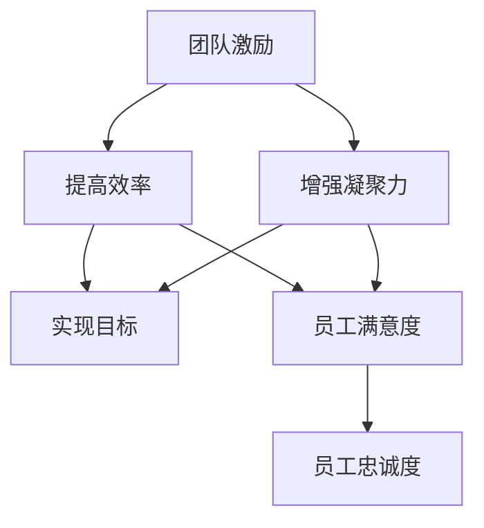

**核心算法原理讲解：**
非物质激励的算法原理可以抽象为以下步骤：
1. **需求分析：** 通过调研和访谈了解员工的需求和期望。
2. **目标设定：** 根据企业目标和员工需求设定激励机制。
3. **实施计划：** 设计和实施具体的非物质激励措施。
4. **效果评估：** 通过反馈机制评估激励机制的有效性。

**数学模型和公式：**
设 \(S\) 为员工满意度，\(L\) 为员工忠诚度，\(M\) 为团队激励措施，则：
\[ S \propto M \]
\[ L \propto M \]

**详细讲解与举例说明：**
例如，一家科技公司通过定期的团队建设活动（如团队拓展、主题晚会等）来提升员工的满意度和忠诚度。通过这些活动，员工不仅能够放松身心，还能增强团队协作精神和归属感。

**项目实战：**
在项目实战中，可以通过以下步骤来实施团队激励：
1. **需求调研：** 通过问卷调查和访谈了解团队需求。
2. **计划制定：** 根据需求制定具体的激励计划。
3. **实施执行：** 开展团队建设活动和培训课程。
4. **效果评估：** 收集员工反馈，评估激励效果。

**最佳实践 tips：**
- 定期与员工沟通，了解他们的需求和期望。
- 设计多样化的激励措施，满足不同员工的个性化需求。
- 注重反馈机制，及时调整激励策略。

**小结：**
团队激励是提升团队效率和凝聚力的关键手段。通过非物质激励，企业能够更好地满足员工的内在需求，从而提高员工满意度和忠诚度，实现团队的长期发展。

---

#### 1.2 非物质激励与传统激励的区别

**背景介绍：**
传统激励手段主要依赖于物质奖励，如薪酬、奖金等，这些激励手段在一定程度上能够提高员工的工作积极性，但往往存在一定的局限性。非物质激励则关注员工的心理和情感需求，通过认可、尊重、成长等非物质手段来激发员工的内在动力。

**核心概念与联系：**
非物质激励与传统激励的区别主要体现在以下几个方面：
- **激励对象：** 传统激励主要关注物质层面的需求，如金钱和物质享受；非物质激励则关注心理和情感层面的需求，如认可、尊重和自我实现。
- **激励方式：** 传统激励通常采用外部奖励的方式，如薪酬、奖金等；非物质激励则更多依赖于内部激励，如职业发展、团队建设等。
- **激励效果：** 传统激励在一定程度上能够提高员工的工作积极性，但长期依赖可能导致员工产生依赖心理；非物质激励则能够激发员工的内在动力，提高工作满意度和忠诚度。

**Mermaid 流程图：**
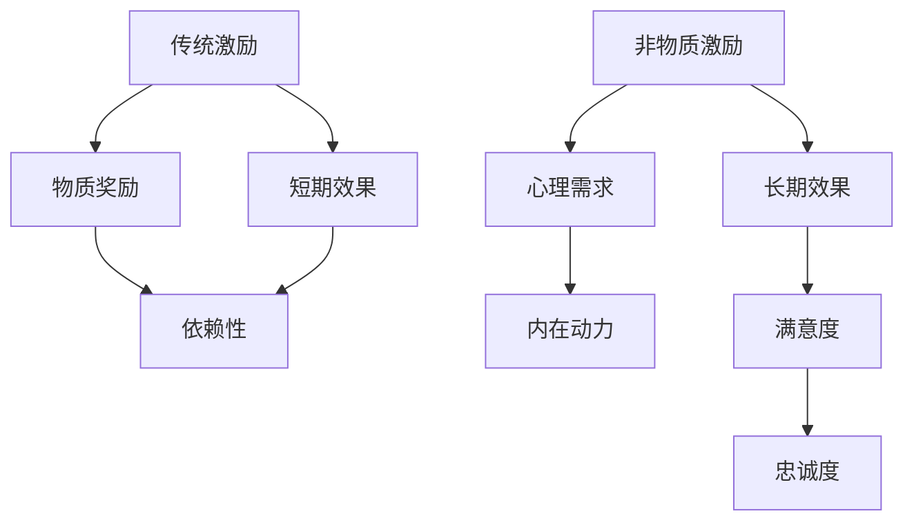

**核心算法原理讲解：**
非物质激励的核心算法原理可以抽象为以下步骤：
1. **需求识别：** 通过调研和访谈识别员工的心理和情感需求。
2. **激励设计：** 设计符合员工需求的非物质激励措施。
3. **执行与反馈：** 实施非物质激励措施，并收集员工反馈。
4. **效果评估：** 评估非物质激励措施的有效性，并根据反馈进行调整。

**数学模型和公式：**
设 \(P\) 为员工工作积极性，\(M\) 为激励措施，则：
\[ P \propto M \]

**详细讲解与举例说明：**
例如，一家初创公司通过设立员工建议奖励制度来激发员工的创新意识和工作积极性。每位员工提出的有效建议都可以获得一定的奖励，这不仅提高了员工的参与度，还增强了团队的凝聚力。

**项目实战：**
在项目实战中，可以通过以下步骤来实施非物质激励：
1. **需求调研：** 通过问卷调查和访谈了解员工的需求。
2. **激励设计：** 根据员工需求设计具体的非物质激励措施。
3. **实施与反馈：** 开展员工建议奖励活动，并收集员工反馈。
4. **效果评估：** 评估员工建议奖励活动的效果，并根据反馈进行调整。

**最佳实践 tips：**
- 注重员工的个性化需求，设计多样化的非物质激励措施。
- 建立有效的反馈机制，及时了解员工的反馈和需求。
- 通过团队建设活动和培训提升员工的综合素质。

**小结：**
非物质激励与传统激励相比，具有更高的灵活性和长期效果。通过满足员工的非物质需求，企业能够激发员工的内在动力，提高工作满意度和忠诚度，实现团队的长期发展。

---

#### 1.3 非物质激励在团队管理中的应用

**背景介绍：**
在团队管理中，非物质激励作为一种有效的管理工具，已经被广泛应用于各个领域。通过非物质激励，管理者能够更好地激发员工的积极性和创造力，提升团队的整体绩效。

**核心概念与联系：**
非物质激励在团队管理中的应用主要包括以下几个方面：
- **认可与表彰：** 通过公开表彰和认可员工的成就，提升员工的自信心和满意度。
- **职业发展：** 提供职业培训和发展机会，帮助员工实现职业成长。
- **团队建设：** 通过团队建设活动增强团队凝聚力，提升团队协作能力。
- **工作环境：** 营造舒适和支持性的工作环境，提高员工的工作满意度和忠诚度。

**Mermaid 流程图：**
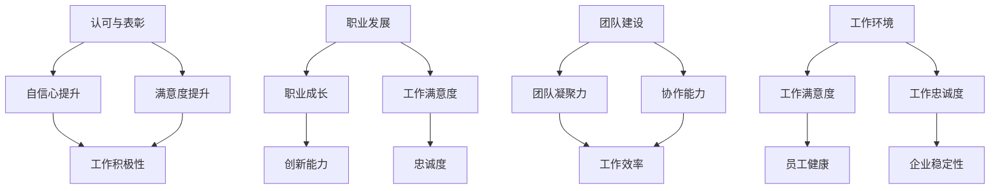

**核心算法原理讲解：**
非物质激励在团队管理中的应用算法原理可以抽象为以下步骤：
1. **需求分析：** 通过调研和访谈了解员工的需求和期望。
2. **激励设计：** 设计符合员工需求的非物质激励措施。
3. **实施与评估：** 实施非物质激励措施，并定期评估效果。
4. **调整与优化：** 根据评估结果调整激励策略，优化激励效果。

**数学模型和公式：**
设 \(S\) 为员工满意度，\(L\) 为员工忠诚度，\(M\) 为非物质激励措施，则：
\[ S \propto M \]
\[ L \propto M \]

**详细讲解与举例说明：**
例如，一家互联网公司通过设立员工荣誉榜来表彰优秀员工。每月评选出在项目中表现突出的员工，并在公司内部进行公开表彰，这不仅提升了员工的自信心和满意度，还增强了团队的凝聚力和工作积极性。

**项目实战：**
在项目实战中，可以通过以下步骤来实施非物质激励：
1. **需求调研：** 通过问卷调查和访谈了解员工的需求。
2. **激励设计：** 根据员工需求设计具体的非物质激励措施，如荣誉榜、培训机会等。
3. **实施与反馈：** 开展员工表彰活动和职业发展培训，并收集员工反馈。
4. **效果评估：** 评估非物质激励措施的效果，并根据反馈进行调整。

**最佳实践 tips：**
- 注重员工的个性化需求，设计多样化的非物质激励措施。
- 建立有效的反馈机制，及时了解员工的反馈和需求。
- 通过团队建设活动和培训提升员工的综合素质。

**小结：**
非物质激励在团队管理中具有重要的应用价值。通过满足员工的非物质需求，企业能够激发员工的内在动力，提升员工满意度和忠诚度，实现团队的长期发展。

---

#### 第2章：非物质激励的理论基础

### 2.1 非物质激励的心理学原理

**背景介绍：**
在探讨非物质激励的心理学原理之前，我们需要理解几个基本的心理概念，如动机、需求、认知等。这些概念为非物质激励提供了理论基础，帮助我们理解员工行为背后的心理动因。

**核心概念与联系：**
- **动机（Motivation）：** 动机是推动个体采取行动的内在力量。根据心理学家弗鲁姆（Victor H. Vroom）的期望理论，动机可以看作是目标价值（Valence）、期望（Expectancy）和工具性（Instrumentality）的乘积。
  \[ \text{动机} = \text{目标价值} \times \text{期望} \times \text{工具性} \]

- **需求（Need）：** 需要是动机的源头，根据马斯洛的需求层次理论，人的需求可以分为生理需求、安全需求、社交需求、尊重需求和自我实现需求。非物质激励通常关注高层次需求，如尊重和自我实现。

- **认知（Cognition）：** 认知是个体对信息和环境的处理过程。在非物质激励中，认知影响员工对激励措施的理解和接受程度。

**Mermaid 流程图：**
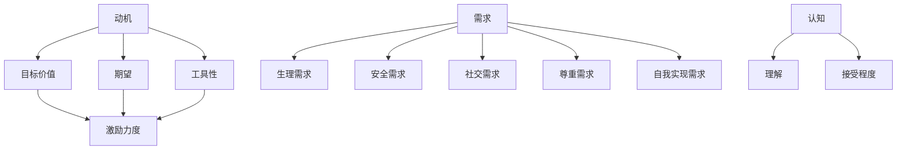

**核心算法原理讲解：**
非物质激励的心理学原理可以抽象为以下步骤：
1. **需求识别：** 通过调研和分析了解员工的当前需求。
2. **目标设定：** 根据员工的需求设定激励目标。
3. **期望评估：** 评估员工对激励目标的期望值。
4. **工具性评估：** 评估激励目标实现的工具性，即激励措施如何帮助员工达到目标。
5. **激励实施：** 根据评估结果实施具体的非物质激励措施。
6. **反馈与调整：** 收集员工反馈，根据反馈调整激励策略。

**数学模型和公式：**
设 \(M\) 为激励措施，\(N\) 为员工需求，\(E\) 为期望值，\(I\) 为工具性，则：
\[ \text{动机} = M \times N \times E \times I \]

**详细讲解与举例说明：**
例如，一家科技公司通过设立员工晋升计划来满足员工的尊重需求和自我实现需求。公司为员工提供职业发展路径，并通过定期的评估和培训帮助员工实现晋升。这一激励措施不仅提高了员工的动机，还增强了员工的职业满意度和忠诚度。

**项目实战：**
在项目实战中，可以通过以下步骤来实施非物质激励：
1. **需求调研：** 通过问卷调查和访谈了解员工的需求。
2. **目标设定：** 设定具体的职业发展目标和晋升路径。
3. **期望评估：** 评估员工对晋升路径的期望值。
4. **工具性评估：** 分析晋升路径的工具性，即如何帮助员工实现职业发展。
5. **激励实施：** 开展晋升计划和职业发展培训。
6. **反馈与调整：** 收集员工反馈，根据反馈调整晋升计划和培训内容。

**最佳实践 tips：**
- 定期与员工沟通，了解他们的需求和期望。
- 设计个性化的晋升路径，满足不同员工的职业发展需求。
- 注重员工的职业成长，提供持续的培训和指导。

**小结：**
非物质激励的心理学原理为我们提供了理解员工行为和设计激励措施的理论基础。通过满足员工的非物质需求，企业能够提高员工的动机和工作满意度，实现团队的长期发展。

---

### 2.2 非物质激励与员工满意度

**背景介绍：**
员工满意度是衡量团队绩效和员工生活质量的重要指标。非物质激励作为一种有效的激励手段，对员工满意度有着显著的影响。理解非物质激励如何提升员工满意度，对于企业管理者来说至关重要。

**核心概念与联系：**
- **员工满意度（Employee Satisfaction）：** 员工满意度是员工对其工作条件、薪酬福利、职业发展机会和公司文化等方面的整体感受和评价。根据心理学研究，非物质激励能够通过满足员工的情感和心理需求来提高满意度。
- **内在激励（Intrinsic Motivation）：** 与外在激励（如薪酬和奖金）不同，内在激励是指员工因自身兴趣、成就感或对工作的热爱而投入工作的动机。非物质激励通常与内在激励密切相关，通过激发员工的内在动力来提升满意度。

**Mermaid 流程图：**
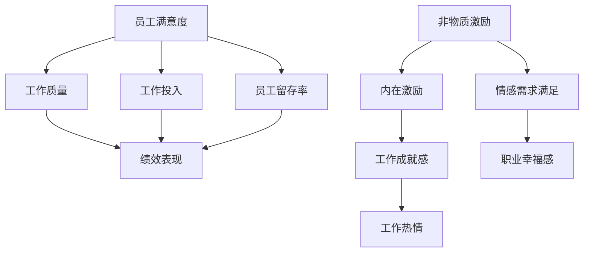

**核心算法原理讲解：**
非物质激励提升员工满意度的算法原理可以抽象为以下步骤：
1. **需求识别：** 通过调研和访谈了解员工的情感和心理需求。
2. **激励设计：** 设计满足员工需求的非物质激励措施。
3. **激励实施：** 实施非物质激励措施，如认可与表彰、职业发展机会等。
4. **效果评估：** 通过员工反馈和绩效评估来评估激励效果。
5. **调整与优化：** 根据反馈调整激励措施，持续提升员工满意度。

**数学模型和公式：**
设 \(S\) 为员工满意度，\(M\) 为非物质激励措施，则：
\[ S \propto M \]

**详细讲解与举例说明：**
例如，一家互联网公司通过设立员工荣誉榜来表彰在工作中表现出色的员工。这种非物质激励措施不仅提高了员工的成就感，还增强了员工的归属感和职业幸福感，从而显著提升了员工满意度。

**项目实战：**
在项目实战中，可以通过以下步骤来实施非物质激励：
1. **需求调研：** 通过问卷调查和访谈了解员工的情感和心理需求。
2. **激励设计：** 根据员工需求设计具体的非物质激励措施，如员工荣誉榜、团队建设活动等。
3. **激励实施：** 开展员工荣誉榜评选和团队建设活动。
4. **效果评估：** 通过员工反馈和绩效评估来评估激励效果。
5. **调整与优化：** 根据反馈调整激励措施，持续提升员工满意度。

**最佳实践 tips：**
- 定期与员工沟通，了解他们的情感和心理需求。
- 设计多样化的非物质激励措施，满足不同员工的个性化需求。
- 建立有效的反馈机制，及时了解员工的反馈和需求。

**小结：**
非物质激励通过满足员工的情感和心理需求，能够显著提升员工满意度。企业管理者应重视非物质激励的作用，通过科学的设计和实施，持续提升员工的满意度和工作幸福感。

---

### 2.3 非物质激励与员工忠诚度

**背景介绍：**
员工忠诚度是衡量员工对组织忠诚程度的重要指标，它直接影响企业的稳定发展和竞争力。非物质激励作为一种有效的激励手段，对于提升员工忠诚度具有重要作用。探讨非物质激励如何影响员工忠诚度，对于企业制定有效的激励策略至关重要。

**核心概念与联系：**
- **员工忠诚度（Employee Loyalty）：** 员工忠诚度是指员工对组织的忠诚和承诺程度，表现为员工长期留在组织内，积极维护组织的利益和形象。
- **长期激励（Long-term Incentive）：** 与短期激励（如奖金和加班费）不同，长期激励旨在建立员工的长期信任和归属感，包括职业发展机会、晋升路径、组织文化等。

**Mermaid 流程图：**
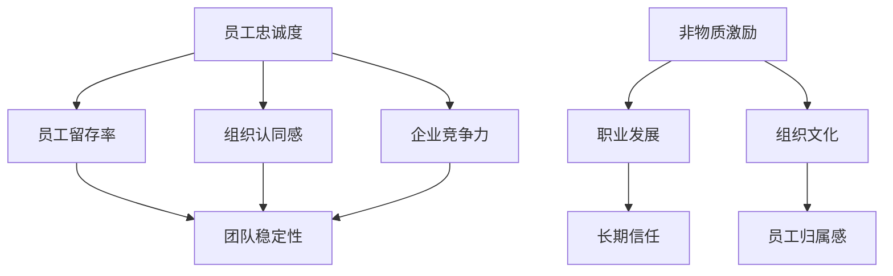

**核心算法原理讲解：**
非物质激励提升员工忠诚度的算法原理可以抽象为以下步骤：
1. **需求识别：** 通过调研和访谈了解员工的职业发展需求和组织文化认同感。
2. **激励设计：** 设计满足员工需求的长期激励措施，如职业发展规划、组织文化认同等。
3. **激励实施：** 实施长期激励措施，如提供培训机会、职业晋升通道等。
4. **效果评估：** 通过员工反馈和绩效评估来评估激励效果。
5. **调整与优化：** 根据反馈调整长期激励措施，增强员工的长期忠诚度。

**数学模型和公式：**
设 \(L\) 为员工忠诚度，\(M\) 为非物质激励措施，则：
\[ L \propto M \]

**详细讲解与举例说明：**
例如，一家科技公司通过设立员工长期激励计划，为表现优秀的员工提供职业晋升机会、参与公司决策的机会等。这种非物质激励措施不仅提升了员工的职业认同感和归属感，还增强了员工的长期忠诚度。

**项目实战：**
在项目实战中，可以通过以下步骤来实施非物质激励：
1. **需求调研：** 通过问卷调查和访谈了解员工的职业发展需求和组织文化认同感。
2. **激励设计：** 根据员工需求设计具体的长期激励措施，如职业晋升计划、员工参与决策等。
3. **激励实施：** 实施长期激励措施，如开展职业发展培训、建立员工参与决策机制等。
4. **效果评估：** 通过员工反馈和绩效评估来评估激励效果。
5. **调整与优化：** 根据反馈调整长期激励措施，增强员工的长期忠诚度。

**最佳实践 tips：**
- 设计长期的职业发展路径，提供持续的培训和晋升机会。
- 建立开放的组织文化，鼓励员工参与决策和提出建议。
- 注重员工的长期价值，通过非物质激励增强员工的归属感和忠诚度。

**小结：**
非物质激励通过满足员工的长期职业发展需求和增强组织文化认同，能够显著提升员工的忠诚度。企业应重视非物质激励的作用，通过科学的设计和实施，提高员工的长期忠诚度，实现企业的长期稳定发展。

---

#### 第二部分：非物质激励的实践方法

### 第3章：构建有效的非物质激励计划

**背景介绍：**
构建一个有效的非物质激励计划对于提升员工的工作积极性、满意度和忠诚度至关重要。一个成功的非物质激励计划不仅要满足员工的需求，还要与组织的战略目标相一致。本章节将详细介绍如何设计、实施和评估一个有效的非物质激励计划。

**核心概念与联系：**
- **非物质激励计划（Non-monetary Incentive Plan）：** 指的是通过非现金方式来激励员工的一系列策略和措施，包括认可与表彰、职业发展机会、工作环境改善等。
- **员工需求分析（Employee Needs Analysis）：** 通过调研和访谈了解员工的个性化需求，是设计有效激励计划的基础。
- **激励措施实施（Implementation of Incentive Measures）：** 包括激励计划的执行和员工的反馈收集。
- **效果评估（Effectiveness Evaluation）：** 对非物质激励计划的效果进行评估，确保其能够达到预期的激励效果。

**Mermaid 流程图：**
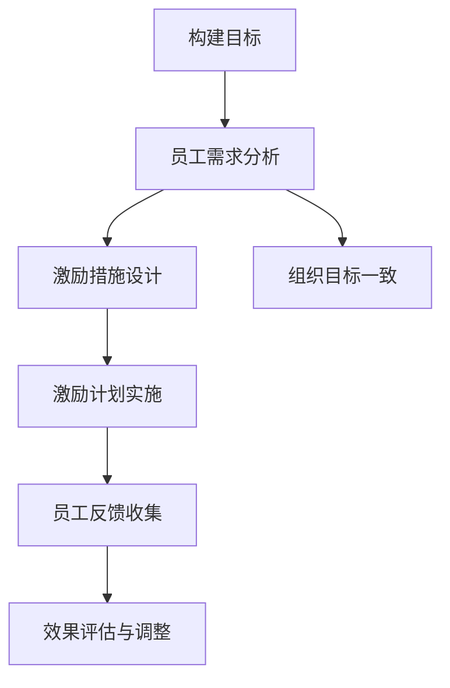

**核心算法原理讲解：**
构建有效的非物质激励计划的算法原理可以抽象为以下步骤：
1. **目标设定：** 确定激励计划的目标，确保与组织的战略目标相一致。
2. **需求分析：** 通过调研和访谈了解员工的个性化需求。
3. **措施设计：** 设计满足员工需求的非物质激励措施，如职业发展机会、工作环境改善、认可与表彰等。
4. **计划实施：** 制定详细的激励计划实施步骤，并确保员工的积极参与。
5. **反馈收集：** 建立有效的反馈机制，收集员工对激励计划的意见和建议。
6. **效果评估：** 对激励计划的效果进行评估，确保达到预期的激励效果。
7. **调整与优化：** 根据评估结果调整激励计划，持续优化激励效果。

**数学模型和公式：**
设 \(E\) 为员工需求满足度，\(P\) 为激励计划实施效果，则：
\[ P \propto E \]

**详细讲解与举例说明：**
例如，一家科技公司决定构建一个非物质激励计划，以提高员工的满意度和忠诚度。首先，他们通过问卷调查和访谈了解员工的需求，发现大部分员工希望获得更多的职业发展机会和工作环境改善。基于这些需求，公司设计了以下激励措施：
- 定期为员工提供技能提升培训和职业发展指导。
- 改善工作环境，增加休息区和娱乐设施。
- 设立员工荣誉榜，定期表彰在工作中表现突出的员工。

这些措施不仅满足了员工的需求，还增强了员工的归属感和工作积极性。

**项目实战：**
在项目实战中，可以通过以下步骤来实施非物质激励计划：
1. **需求调研：** 通过问卷调查和访谈了解员工的个性化需求。
2. **措施设计：** 设计满足员工需求的非物质激励措施。
3. **计划实施：** 制定详细的实施步骤，确保措施的有效执行。
4. **反馈收集：** 建立反馈机制，收集员工对激励计划的意见和建议。
5. **效果评估：** 通过绩效评估和员工满意度调查来评估激励计划的效果。
6. **调整与优化：** 根据评估结果调整激励措施，优化激励效果。

**最佳实践 tips：**
- 注重员工的个性化需求，设计多样化的非物质激励措施。
- 建立有效的反馈机制，及时了解员工的反馈和需求。
- 定期评估激励效果，确保激励计划能够持续优化。

**小结：**
构建有效的非物质激励计划需要深入了解员工的需求，设计符合员工期望的激励措施，并通过科学的实施和评估来持续优化。通过有效的非物质激励计划，企业能够提高员工的工作满意度和忠诚度，实现团队的长期稳定发展。

---

### 第4章：利用反馈与认可激励团队

**背景介绍：**
在团队管理中，反馈与认可是重要的非物质激励手段，能够有效提升员工的工作积极性、满意度和忠诚度。通过定期的反馈和认可，管理者能够及时了解员工的工作状况和心理需求，从而调整管理策略，提升团队的整体绩效。

**核心概念与联系：**
- **反馈（Feedback）：** 反馈是指管理者向员工传达对其工作表现的意见和建议，旨在帮助员工改进工作方法，提高工作效率。
- **认可（Recognition）：** 认可是对员工工作成绩和贡献的公开认可，通过表彰、奖励等方式增强员工的自我价值感和归属感。

**Mermaid 流程图：**
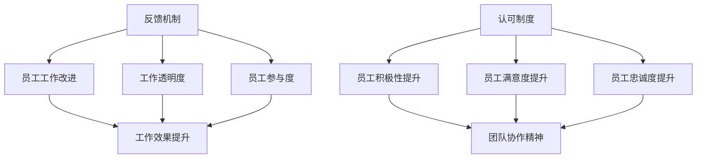

**核心算法原理讲解：**
利用反馈与认可激励团队的算法原理可以抽象为以下步骤：
1. **建立反馈机制：** 制定反馈流程，确保反馈能够及时、准确地传达给员工。
2. **定期反馈：** 定期与员工进行一对一的沟通，反馈工作表现和改进建议。
3. **认可与表彰：** 设立认可制度，对员工的工作成绩和贡献进行公开表彰。
4. **效果评估：** 通过员工反馈和绩效评估来评估反馈与认可制度的效果。
5. **持续优化：** 根据评估结果调整反馈与认可策略，持续提升团队激励效果。

**数学模型和公式：**
设 \(F\) 为反馈频率，\(R\) 为认可频率，\(S\) 为员工满意度，\(L\) 为员工忠诚度，则：
\[ S \propto R \times F \]
\[ L \propto R \times F \]

**详细讲解与举例说明：**
例如，一家科技公司设立了每月的员工反馈会议，每个月与每位员工进行一对一的沟通，反馈他们的工作表现和改进建议。同时，公司设立了“优秀员工奖”，每月对在工作中表现突出的员工进行表彰。这种反馈与认可制度不仅提升了员工的工作积极性和满意度，还增强了员工的忠诚度。

**项目实战：**
在项目实战中，可以通过以下步骤来实施反馈与认可制度：
1. **建立反馈机制：** 制定反馈流程，明确反馈的时间、方式和责任人。
2. **定期反馈：** 定期组织员工反馈会议，确保每位员工都能获得及时的反馈。
3. **认可与表彰：** 设立并实施认可制度，对员工的工作成绩和贡献进行公开表彰。
4. **效果评估：** 通过员工满意度调查和绩效评估来评估反馈与认可制度的效果。
5. **持续优化：** 根据评估结果调整反馈与认可策略，优化激励效果。

**最佳实践 tips：**
- 建立透明的反馈机制，确保反馈能够及时、准确地传达给员工。
- 设计多样化的认可方式，满足不同员工的个性化需求。
- 注重反馈与认可的频率，确保员工能够持续感受到组织的关注和支持。

**小结：**
利用反馈与认可制度是提升团队激励效果的有效手段。通过建立有效的反馈机制和认可制度，企业能够及时了解员工的工作状况和心理需求，提高员工的工作满意度和忠诚度，实现团队的长期稳定发展。

---

### 第5章：创造积极的工作环境

**背景介绍：**
一个积极的工作环境对于提高员工的工作效率、满意度和忠诚度至关重要。通过改善工作环境，企业可以激发员工的内在动力，提升团队的整体绩效。本章节将探讨如何通过物理环境、团队文化和领导行为来创造一个积极的工作环境。

**核心概念与联系：**
- **物理环境（Physical Environment）：** 指的是办公室布局、设备、光线、空气流通等因素，对员工的工作状态有着直接的影响。
- **团队文化（Team Culture）：** 指的是团队内部共同价值观、行为准则和工作氛围，对员工的心理和行为有着深远的塑造作用。
- **领导行为（Leadership Behavior）：** 指的是领导者通过管理行为对员工产生的影响，包括沟通方式、决策风格、激励手段等。

**Mermaid 流程图：**
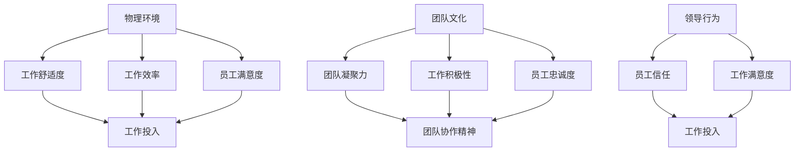

**核心算法原理讲解：**
创造积极的工作环境的算法原理可以抽象为以下步骤：
1. **环境评估：** 评估当前工作环境的物理条件和文化氛围。
2. **环境改善：** 改善物理环境和团队文化，如优化办公室布局、提供培训和发展机会等。
3. **领导行为优化：** 通过领导者的行为优化来塑造积极的工作氛围，如增强沟通、提供支持、鼓励创新等。
4. **反馈与调整：** 建立反馈机制，收集员工的反馈，并根据反馈调整工作环境。
5. **持续优化：** 持续监控和优化工作环境，确保其能够持续激发员工的积极性和满意度。

**数学模型和公式：**
设 \(E\) 为工作环境满意度，\(C\) 为团队文化满意度，\(L\) 为领导行为满意度，则：
\[ E \propto C \times L \]

**详细讲解与举例说明：**
例如，一家科技公司决定改善工作环境，以提高员工的工作满意度和忠诚度。公司首先对办公室进行了重新布局，增加了开放的工作区域和休息区，提高了工作舒适度。同时，公司还提供了丰富的职业发展培训机会，增强了团队的文化氛围。领导层通过定期的沟通和反馈，建立了良好的信任关系，提高了员工的工作投入度。

**项目实战：**
在项目实战中，可以通过以下步骤来创造积极的工作环境：
1. **环境评估：** 通过员工满意度调查和工作环境评估来了解当前的工作环境。
2. **环境改善：** 根据评估结果，制定改善计划并实施，如优化办公室布局、提供培训和发展机会等。
3. **领导行为优化：** 通过领导力培训和工作坊来提升领导者的沟通和支持能力。
4. **反馈与调整：** 建立反馈机制，定期收集员工的反馈，并根据反馈进行调整。
5. **持续优化：** 持续监控和优化工作环境，确保其能够持续激发员工的积极性和满意度。

**最佳实践 tips：**
- 注重员工的个性化需求，提供多样化的工作环境。
- 建立积极的团队文化，鼓励员工参与决策和提出建议。
- 领导者应增强沟通和支持，建立信任和合作的关系。

**小结：**
创造积极的工作环境是提升员工工作满意度和忠诚度的重要手段。通过改善物理环境、塑造团队文化和优化领导行为，企业能够激发员工的内在动力，实现团队的长期稳定发展。

---

### 第6章：利用组织文化与价值观激励团队

**背景介绍：**
组织文化是一个组织的灵魂，它影响着员工的行为和决策，是塑造团队凝聚力、激励员工的重要力量。一个积极向上的组织文化能够激发员工的内在动力，提升团队的工作效率和满意度。本章节将探讨如何利用组织文化与价值观来激励团队。

**核心概念与联系：**
- **组织文化（Organizational Culture）：** 指的是一个组织在长期发展过程中形成的共同价值观、行为准则和工作氛围。
- **价值观（Values）：** 指的是组织所倡导的核心信念和原则，如诚信、创新、团队合作等。
- **团队激励（Team Motivation）：** 通过组织文化和价值观来激发员工的内在动力，提高团队的工作效率和满意度。

**Mermaid 流程图：**
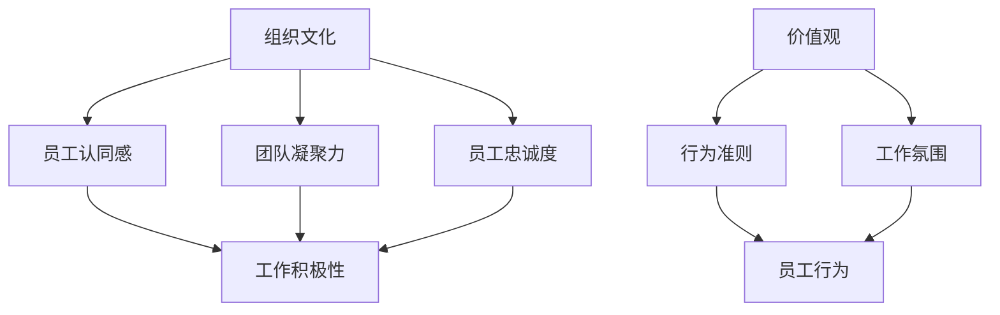

**核心算法原理讲解：**
利用组织文化与价值观激励团队的算法原理可以抽象为以下步骤：
1. **文化塑造：** 塑造符合企业战略目标和组织愿景的组织文化。
2. **价值观传播：** 通过培训和沟通，传播组织的核心价值观和行为准则。
3. **激励设计：** 将组织文化和价值观融入激励措施，如职业发展机会、表彰制度等。
4. **行为引导：** 通过榜样和激励措施，引导员工按照组织文化和价值观行事。
5. **持续优化：** 持续监控和优化组织文化和价值观，确保其能够持续激励团队。

**数学模型和公式：**
设 \(C\) 为组织文化满意度，\(V\) 为价值观认同度，\(M\) 为团队激励效果，则：
\[ M \propto C \times V \]

**详细讲解与举例说明：**
例如，一家科技公司以其创新文化著称，公司鼓励员工提出创新想法，并通过定期的创新竞赛和表彰制度来激励员工。公司还设置了“最佳创新奖”，对在创新项目中表现突出的员工进行奖励。这种组织文化不仅提升了员工的工作积极性，还增强了员工的归属感和忠诚度。

**项目实战：**
在项目实战中，可以通过以下步骤来利用组织文化与价值观激励团队：
1. **文化塑造：** 明确企业的核心价值观，制定文化手册，通过内部培训和宣传来传播组织文化。
2. **价值观传播：** 定期举办团队建设活动和培训课程，强化员工的价值观认同。
3. **激励设计：** 将组织文化和价值观融入职业发展计划和激励措施，如设立创新奖、职业发展通道等。
4. **行为引导：** 通过榜样和激励措施，引导员工按照组织文化和价值观行事。
5. **持续优化：** 持续收集员工反馈，根据反馈调整组织文化和价值观，确保其能够持续激励团队。

**最佳实践 tips：**
- 建立明确且符合企业战略目标的核心价值观。
- 注重员工参与，鼓励员工提出建设性的意见和建议。
- 通过多种激励措施，将组织文化和价值观融入员工日常工作中。

**小结：**
利用组织文化与价值观激励团队是提升团队凝聚力和工作效率的重要手段。通过塑造积极向上的组织文化和传播核心价值观，企业能够激发员工的内在动力，实现团队的长期稳定发展。

---

### 第7章：跨文化团队的非物质激励

**背景介绍：**
在全球化背景下，跨文化团队越来越成为企业的重要组织形式。然而，不同文化背景的员工在价值观、行为模式和沟通方式上存在差异，这给团队管理带来了挑战。有效的非物质激励能够帮助跨文化团队克服文化差异，提高团队绩效和员工满意度。本章节将探讨如何在跨文化团队中实施非物质激励。

**核心概念与联系：**
- **跨文化团队（Cross-Cultural Team）：** 由来自不同文化背景的成员组成的团队，他们在价值观、行为模式和沟通方式上存在差异。
- **非物质激励（Non-monetary Incentive）：** 指通过非现金方式激励员工的一系列策略，如职业发展机会、工作环境改善、认可与表彰等。
- **文化适应（Cultural Adaptation）：** 跨文化团队中，成员需要适应不同文化背景，以实现有效的沟通和合作。

**Mermaid 流程图：**
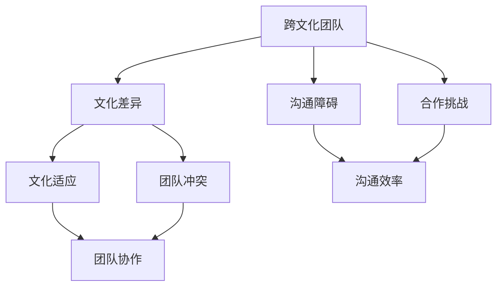

**核心算法原理讲解：**
跨文化团队的非物质激励算法原理可以抽象为以下步骤：
1. **文化差异识别：** 了解团队成员的文化背景和价值观差异。
2. **文化适应策略：** 设计和实施适应不同文化的非物质激励措施。
3. **沟通与反馈：** 建立有效的沟通机制，确保团队成员能够理解并接受非物质激励措施。
4. **激励措施实施：** 根据文化适应策略，实施具体的非物质激励措施。
5. **效果评估与调整：** 通过团队绩效和员工满意度评估激励效果，并根据反馈进行调整。

**数学模型和公式：**
设 \(D\) 为文化差异度，\(A\) 为文化适应度，\(M\) 为非物质激励效果，则：
\[ M \propto A \times (1 - D) \]

**详细讲解与举例说明：**
例如，一家跨国公司在美国和印度设立了研发团队。由于文化差异，美国团队倾向于直接沟通和独立工作，而印度团队更倾向于团队合作和遵循指令。为了克服文化差异，公司采取了以下非物质激励措施：
- 为美国团队提供灵活的工作时间和远程工作机会，以适应其独立工作的文化特点。
- 为印度团队提供团队合作项目，并通过定期的团队建设活动增强团队凝聚力。

这些措施不仅提高了团队的合作效率，还增强了员工的满意度。

**项目实战：**
在项目实战中，可以通过以下步骤来实施跨文化团队的非物质激励：
1. **文化差异识别：** 通过问卷调查和文化培训，了解团队成员的文化背景和价值观。
2. **文化适应策略：** 根据文化差异，设计适应不同文化的非物质激励措施。
3. **沟通与反馈：** 建立跨文化沟通机制，确保团队成员能够理解并接受非物质激励措施。
4. **激励措施实施：** 实施具体的非物质激励措施，如灵活工作时间、团队合作项目等。
5. **效果评估与调整：** 通过绩效评估和员工满意度调查，评估非物质激励的效果，并根据反馈进行调整。

**最佳实践 tips：**
- 注重文化差异，设计个性化的非物质激励措施。
- 建立跨文化沟通机制，增强团队成员之间的理解和信任。
- 通过定期的文化培训和团队建设活动，促进文化适应和团队协作。

**小结：**
在跨文化团队中，有效的非物质激励能够帮助克服文化差异，提高团队绩效和员工满意度。通过识别文化差异、实施文化适应策略和建立有效的沟通机制，企业能够实现跨文化团队的长期稳定发展。

---

### 第8章：领导力与非物质激励

**背景介绍：**
领导力在团队管理中扮演着至关重要的角色，特别是在实施非物质激励方面。领导者的行为和决策直接影响员工的动力、满意度和忠诚度。本章节将探讨领导者如何通过非物质激励来激发团队潜力，实现组织的长期目标。

**核心概念与联系：**
- **领导力（Leadership）：** 指领导者通过影响和激励他人来实现共同目标的能力。
- **非物质激励（Non-monetary Incentive）：** 指通过非现金方式激励员工的一系列策略，如认可与表彰、职业发展机会、工作环境改善等。
- **团队潜力（Team Potential）：** 指团队在领导者的引导下，通过非物质激励实现的最大效能。

**Mermaid 流程图：**
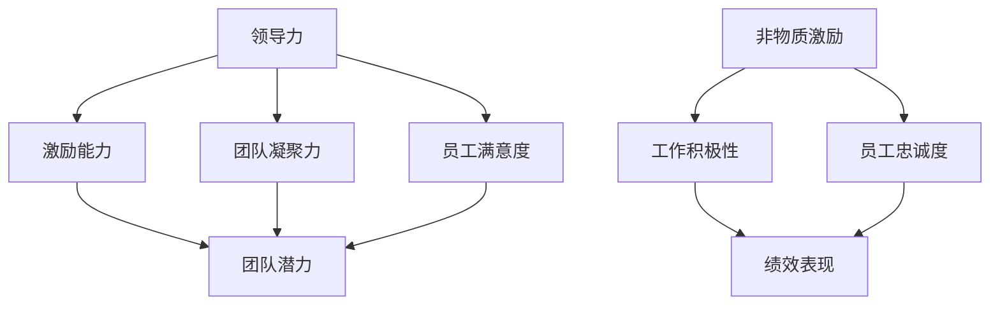

**核心算法原理讲解：**
领导力与非物质激励的算法原理可以抽象为以下步骤：
1. **领导力提升：** 领导者通过学习、实践和反思不断提升自身的领导能力。
2. **激励策略设计：** 根据团队特点和员工需求设计具体的非物质激励措施。
3. **激励措施实施：** 领导者通过有效的沟通和行动实施非物质激励措施。
4. **效果评估与反馈：** 定期评估非物质激励的效果，并根据反馈进行调整。
5. **团队发展：** 通过非物质激励促进团队发展，实现组织的长期目标。

**数学模型和公式：**
设 \(L\) 为领导力水平，\(M\) 为非物质激励效果，\(P\) 为团队绩效，则：
\[ P \propto L \times M \]

**详细讲解与举例说明：**
例如，一位公司高管通过定期的员工反馈会议和公开表彰，来实施非物质激励措施。他鼓励员工提出创新建议，并为采纳的建议提供奖励。同时，他还组织团队建设活动，增强团队凝聚力。这些举措不仅提升了员工的工作积极性，还增强了员工的满意度和忠诚度。

**项目实战：**
在项目实战中，可以通过以下步骤来整合领导力与非物质激励：
1. **领导力提升：** 通过领导力培训和工作坊来提升领导者的能力。
2. **激励策略设计：** 根据团队特点和员工需求设计非物质激励措施。
3. **激励措施实施：** 领导者通过沟通和行动实施激励措施，如员工反馈会议、创新奖励制度等。
4. **效果评估与反馈：** 定期评估激励效果，收集员工反馈，并根据反馈进行调整。
5. **团队发展：** 通过持续的非物质激励，促进团队发展和绩效提升。

**最佳实践 tips：**
- 领导者应注重培养员工的自主性和创新能力。
- 建立开放和信任的沟通环境，鼓励员工提出意见和建议。
- 通过定期的反馈和表彰，持续激发员工的工作动力。

**小结：**
领导力与非物质激励的结合是实现团队长期发展的重要手段。通过提升领导力、设计有效的激励措施和建立反馈机制，领导者能够激发团队的潜力，实现组织的战略目标。

---

### 第9章：成功团队的非物质激励实践

**背景介绍：**
成功团队的非物质激励实践为我们提供了宝贵的经验和启示。本章节将通过分析几个实际案例，探讨不同类型企业在实施非物质激励方面的成功策略和实践。

**核心概念与联系：**
- **成功案例（Success Cases）：** 指在实施非物质激励过程中取得显著成效的实际案例。
- **企业类型（Types of Companies）：** 包括初创公司、跨国公司和大型企业，这些企业在非物质激励实践中各有特色。

**Mermaid 流程图：**
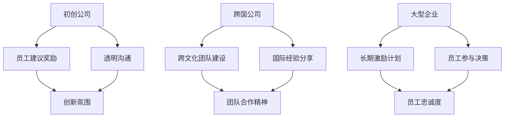

**核心算法原理讲解：**
成功团队的非物质激励实践算法原理可以抽象为以下步骤：
1. **案例选择：** 选择具有代表性的成功案例，涵盖不同类型的企业。
2. **策略分析：** 分析案例中企业所采用的非物质激励策略，如员工建议奖励、跨文化团队建设、长期激励计划等。
3. **实践总结：** 总结案例中的成功经验，提炼出可复制的实践方法。
4. **效果评估：** 评估非物质激励措施的实际效果，如员工满意度、团队绩效等。
5. **推广应用：** 将成功经验推广到其他企业和团队，促进整体绩效的提升。

**数学模型和公式：**
设 \(C\) 为案例数量，\(S\) 为成功案例比例，\(E\) 为员工满意度，\(P\) 为团队绩效，则：
\[ S \propto \frac{C}{E \times P} \]

**详细讲解与举例说明：**
**案例一：初创公司的员工建议奖励**
一家初创公司在快速发展过程中，通过实施员工建议奖励制度来激发员工的创新意识和工作积极性。公司设立了一个开放的平台，鼓励员工提出改进建议。每条被采纳的建议都可以获得一定的奖励，这不仅提高了员工的参与度，还增强了团队的凝聚力。

**案例二：跨国公司的跨文化团队建设**
一家跨国公司通过组织跨文化团队建设活动，如国际文化体验、团队建设游戏等，来增强团队成员之间的理解和信任。公司还定期组织国际经验分享会，让团队成员分享在不同国家的工作经验和心得，从而促进了跨文化团队的协作和合作精神。

**案例三：大型企业的长期激励计划**
一家大型企业通过实施长期激励计划，如股票期权、职业发展路径等，来提升员工的忠诚度和长期信任。公司为员工提供明确的职业发展路径，并通过定期的评估和培训帮助员工实现职业成长。此外，公司还通过员工参与决策机制，增强员工对企业战略和运营的参与感。

**项目实战：**
在项目实战中，可以通过以下步骤来实施非物质激励：
1. **案例选择：** 选择具有代表性的成功案例进行深入分析。
2. **策略分析：** 分析案例中企业所采用的非物质激励策略，如员工建议奖励、跨文化团队建设、长期激励计划等。
3. **实践总结：** 总结案例中的成功经验，提炼出可复制的实践方法。
4. **效果评估：** 通过员工满意度调查和绩效评估来评估非物质激励措施的效果。
5. **推广应用：** 将成功经验推广到其他企业和团队，促进整体绩效的提升。

**最佳实践 tips：**
- 结合企业特点和员工需求，设计个性化的非物质激励措施。
- 注重员工的参与感和自主性，鼓励员工提出创新建议。
- 定期评估非物质激励效果，及时调整和优化激励策略。

**小结：**
成功团队的非物质激励实践为我们提供了宝贵的经验和启示。通过分析不同类型企业的案例，我们可以发现，有效的非物质激励措施能够显著提升员工满意度和团队绩效。企业应根据自身情况，借鉴成功经验，制定和实施个性化的非物质激励计划，促进团队的长期稳定发展。

---

### 第10章：团队激励的未来趋势

**背景介绍：**
随着技术的不断进步和社会的快速发展，团队激励的方法和手段也在不断演变。未来，团队激励将更加注重个性化和数字化，更加关注员工的全面发展和幸福感。本章节将探讨团队激励的未来趋势，分析技术进步对团队激励的影响，以及未来团队激励的新趋势和实践方向。

**核心概念与联系：**
- **技术进步（Technological Advancements）：** 指人工智能、大数据、物联网等新兴技术的快速发展，对团队激励方法和手段的变革。
- **个性化激励（Personalized Incentives）：** 指根据员工的个性化需求和行为习惯，量身定制激励措施，提高激励效果。
- **数字化激励（Digital Incentives）：** 指通过数字化工具和平台，实现激励措施的实时反馈和精准执行。

**Mermaid 流程图：**
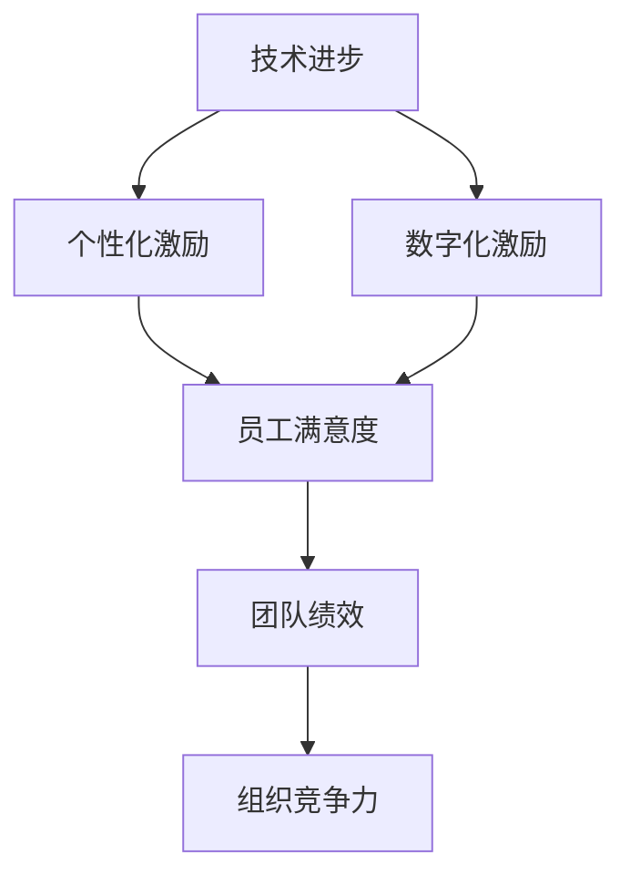

**核心算法原理讲解：**
团队激励的未来趋势算法原理可以抽象为以下步骤：
1. **技术评估：** 评估新兴技术对团队激励的影响，如人工智能、大数据等。
2. **需求分析：** 通过大数据分析了解员工的个性化需求和行为习惯。
3. **激励设计：** 根据技术评估和需求分析，设计个性化的数字化激励措施。
4. **实施与反馈：** 通过数字化平台实施激励措施，并收集员工反馈。
5. **效果评估与优化：** 通过数据分析和员工反馈，评估激励效果，并根据反馈进行优化。

**数学模型和公式：**
设 \(T\) 为技术进步水平，\(P\) 为个性化激励效果，\(D\) 为数字化激励效果，\(S\) 为员工满意度，\(P\) 为团队绩效，则：
\[ S \propto T \times P \times D \]

**详细讲解与举例说明：**
**趋势一：个性化激励**
随着大数据和人工智能技术的应用，企业能够更精准地了解员工的个性化需求和行为习惯。通过分析员工的数据，企业可以设计出更符合员工需求的个性化激励措施，如定制化的职业发展路径、个性化的培训计划等。这种个性化激励不仅能够提高员工的工作满意度，还能增强员工的忠诚度和工作效率。

**趋势二：数字化激励**
数字化平台的普及使得激励措施的实时反馈和精准执行成为可能。企业可以通过数字化工具，如移动应用、在线平台等，实时向员工提供激励信息，并根据员工的行为数据进行动态调整。例如，一家企业可以通过员工绩效管理平台，实时记录员工的绩效表现，并根据绩效数据发放奖金和晋升机会。这种数字化激励不仅提高了激励的透明度和公正性，还增强了员工的参与感和自主性。

**项目实战：**
在项目实战中，可以通过以下步骤来实施未来趋势的团队激励：
1. **技术评估：** 评估新兴技术对团队激励的影响，确定应用方向。
2. **需求分析：** 通过大数据分析了解员工的个性化需求和行为习惯。
3. **激励设计：** 根据技术评估和需求分析，设计个性化的数字化激励措施。
4. **实施与反馈：** 通过数字化平台实施激励措施，并收集员工反馈。
5. **效果评估与优化：** 通过数据分析和员工反馈，评估激励效果，并根据反馈进行优化。

**最佳实践 tips：**
- 利用大数据和人工智能技术，精准分析员工的个性化需求。
- 建立数字化平台，实现激励措施的实时反馈和精准执行。
- 注重员工的参与感和自主性，鼓励员工积极参与激励计划。

**小结：**
未来团队激励将更加注重个性化和数字化，通过新兴技术的应用，企业能够更精准地满足员工的个性化需求，提高激励效果。企业应根据技术进步的趋势，结合自身特点，设计和实施未来趋势的团队激励计划，提升员工满意度和团队绩效。

---

### 附录

#### 附录A：团队激励工具与资源

**A.1 常用的团队激励工具介绍**

在实施团队激励计划时，企业可以借助多种工具来提升激励效果。以下是一些常用的团队激励工具：

- **员工满意度调查工具：** 如 SurveyMonkey、Google 表单等，用于收集员工反馈和满意度数据。
- **绩效考核工具：** 如 KPI 计划、绩效管理系统（如 Lattice、15Five）等，帮助管理者评估员工绩效。
- **职业发展工具：** 如 LinkedIn Learning、LinkedIn Salary Insights 等，为员工提供职业发展信息和资源。
- **反馈与认可工具：** 如 15Five、Slack 的表彰功能等，用于员工之间的实时反馈和认可。

**A.2 团队激励相关的书籍与论文推荐**

为了更深入地了解团队激励的理论和实践，以下是一些推荐的书籍和论文：

- **书籍：**
  - 《激励人心：员工动力管理指南》（Motivating People: How to Inspire, Engage, and Empower Your Team）- Susan Heathfield
  - 《团队动力：打造高效团队的关键》（Team Dynamics: Building Effective Teams at Work）- Jennifer Colosimo
  - 《职业倦怠与工作激励：理论与实践》（Burnout and Work Engagement: Theory, Research, and Practice）- Christina Maslach, Michael P. Leiter

- **论文：**
  - "Employee Motivation: A Critical Review of Theories and Research" - CIPD
  - "The Role of Intrinsic and Extrinsic Motivation in Knowledge Sharing in Organizations" - Monica G. O'Boyle, Robert J. Vroom

**A.3 团队激励实践的线上资源**

除了书籍和论文，以下是一些在线资源，提供团队激励的实践指导和案例分析：

- **在线课程：** Coursera、Udemy 等平台上的领导力和团队管理课程。
- **博客与文章：** LinkedIn、Medium 等平台上关于团队激励的文章和案例分析。
- **社交媒体群组：** LinkedIn 上的领导力、团队管理群组，提供实时交流和经验分享。

**总结**

附录部分提供了团队激励的实用工具和资源，旨在帮助企业和团队管理者更好地实施和优化团队激励计划。通过结合理论学习和实际案例，管理者可以制定出更加科学和有效的团队激励策略，提升员工满意度和团队绩效。

---

**作者：AI天才研究院/AI Genius Institute & 禅与计算机程序设计艺术 /Zen And The Art of Computer Programming**

---

通过以上详细的文章内容，我们可以看到，团队激励不仅是提升员工满意度和忠诚度的关键手段，也是实现企业长期发展的重要策略。本文从团队激励的重要性、理论基础、实践方法以及未来趋势等多个维度进行了全面探讨，提供了丰富的理论和实践指导。希望本文能够为企业的团队管理者和人力资源从业者提供有价值的参考。在未来的团队管理中，我们期待看到更多企业能够利用非物质激励的力量，打造出一支充满活力和创造力的团队，共同实现企业的战略目标。

