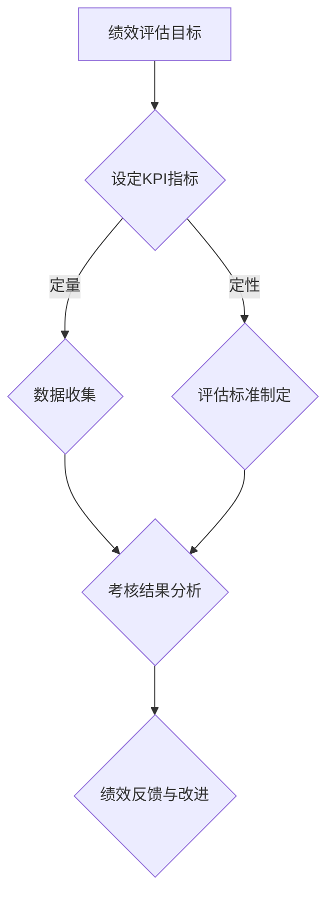
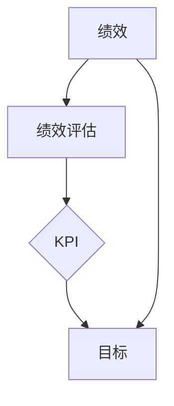

                 

### 文章标题：团队绩效评估：科学合理的考核体系

#### 关键词：团队绩效评估，考核体系，关键绩效指标，绩效考核，KPI，绩效反馈

> 摘要：本文将深入探讨团队绩效评估的科学合理考核体系。我们将首先概述团队绩效评估的基本概念，解析其重要性、目标和类型。随后，我们将探讨考核体系设计的基本原则，如客观性、公平性和可衡量性。接着，我们将详细讨论考核指标的选择与设定，考核方法的运用，以及绩效考核流程与制度。最后，我们将通过实际案例，展示不同行业团队的绩效考核，并分析绩效考核体系在实际工作中的应用与挑战。本文旨在为读者提供一套全面、深入的团队绩效评估指南。

### 《团队绩效评估：科学合理的考核体系》目录大纲

#### 第一部分：团队绩效评估的基本概念

**第1章：团队绩效评估概述**  
- **1.1 团队绩效评估的重要性**  
- **1.2 团队绩效评估的目标**  
- **1.3 团队绩效评估的类型**

**第2章：团队绩效评估的核心概念**  
- **2.1 绩效和绩效评估**  
- **2.2 关键绩效指标（KPI）**  
- **2.3 目标和目标设定**

#### 第二部分：科学合理的考核体系设计

**第3章：考核体系设计的基本原则**  
- **3.1 客观性原则**  
- **3.2 公平性原则**  
- **3.3 可衡量性原则**  
- **3.4 动态调整原则**

**第4章：考核指标的选择与设定**  
- **4.1 个人绩效指标**  
- **4.2 团队绩效指标**  
- **4.3 绩效指标的权重分配**

**第5章：考核方法的运用**  
- **5.1 定量考核方法**  
- **5.2 定性考核方法**  
- **5.3 综合考核方法**

**第6章：绩效考核流程与制度**  
- **6.1 绩效考核流程**  
- **6.2 绩效考核制度**  
- **6.3 绩效反馈与改进**

#### 第三部分：绩效考核的实际案例与应用

**第7章：不同行业团队的绩效考核案例**  
- **7.1 生产制造业团队的绩效考核**  
- **7.2 服务业团队的绩效考核**  
- **7.3 研发团队的绩效考核**

**第8章：绩效考核体系在实际工作中的应用与挑战**  
- **8.1 绩效考核体系的应用效果**  
- **8.2 绩效考核体系的改进与优化**  
- **8.3 面临的挑战与解决方案**

#### 附录

**附录A：考核工具与资源推荐**  
- **A.1 主流考核工具介绍**  
- **A.2 考核体系设计模板**  
- **A.3 绩效管理最佳实践案例**

#### Mermaid 流�程图



#### 核心算法原理讲解

**关键绩效指标（KPI）设定方法：**

$$
\text{KPI} = \sum_{i=1}^{n} (w_i \times p_i)
$$

其中，$w_i$ 表示第 $i$ 个指标的权重，$p_i$ 表示第 $i$ 个指标的具体评分。

**伪代码：**

```python
def calculate_kpi(weights, scores):
    kpi = 0
    for i in range(len(scores)):
        kpi += weights[i] * scores[i]
    return kpi
```

**绩效考核得分计算模型：**

$$
\text{绩效考核得分} = \sum_{i=1}^{m} (\text{指标权重} \times \text{指标得分})
$$

其中，$m$ 为考核指标的总数。

**举例说明：**

假设有3个考核指标，权重分别为0.3、0.4、0.3。指标得分为90、85、80。

$$
\text{绩效考核得分} = (0.3 \times 90) + (0.4 \times 85) + (0.3 \times 80) = 27 + 34 + 24 = 85
$$

### 背景介绍

在现代企业管理中，团队绩效评估扮演着至关重要的角色。一个科学合理、公平有效的考核体系不仅能够激发团队成员的工作积极性，提高整体工作效率，还能够帮助企业实现战略目标，推动企业的长期发展。然而，团队绩效评估并非一项简单的任务，它涉及到诸多方面的考虑，如考核指标的选择、考核方法的运用、绩效考核流程的制定等。

本文旨在为读者提供一套全面、深入的团队绩效评估指南。通过详细探讨团队绩效评估的基本概念、科学合理的考核体系设计、考核指标的选择与设定、考核方法的运用，以及绩效考核的实际案例与应用，本文希望为企业管理者、人力资源专家以及其他关注团队绩效评估的读者提供有益的参考。

我们将从以下几个方面展开讨论：

1. **团队绩效评估的基本概念**：介绍团队绩效评估的重要性、目标和类型，为后续章节的讨论奠定基础。
2. **科学合理的考核体系设计**：讨论考核体系设计的基本原则，如客观性、公平性、可衡量性和动态调整原则，并提供具体的设计方法和步骤。
3. **考核指标的选择与设定**：探讨个人绩效指标和团队绩效指标的选择与设定，以及绩效指标的权重分配。
4. **考核方法的运用**：介绍定量考核方法、定性考核方法和综合考核方法的运用，并分析其优缺点。
5. **绩效考核流程与制度**：讨论绩效考核流程、绩效考核制度，以及绩效反馈与改进的方法。
6. **实际案例与应用**：通过生产制造业、服务业和研发团队的实际案例，展示绩效考核体系在不同行业中的应用，并分析其实际效果和面临的挑战。
7. **考核工具与资源推荐**：推荐主流的考核工具和资源，为读者提供实用的参考。

通过本文的详细讨论，我们希望能够帮助读者深入理解团队绩效评估的科学合理考核体系，并为其在实际工作中提供有价值的指导。### 第一部分：团队绩效评估的基本概念

#### 第1章：团队绩效评估概述

**1.1 团队绩效评估的重要性**

在企业管理中，团队绩效评估是确保团队目标实现的重要手段。一个科学合理、公正透明的绩效评估体系不仅能够激励团队成员的积极性，提升工作效率，还能帮助企业发现和解决问题，从而实现企业的长期发展目标。以下是团队绩效评估的重要性体现：

1. **激励员工**：通过绩效评估，可以客观、公正地衡量员工的工作表现，激发员工的竞争意识和自我提升动力，从而提高工作效率。
2. **发现和解决问题**：绩效评估能够帮助企业识别团队和个体在工作中的不足，找出问题所在，并提供改进的方向和措施。
3. **优化资源配置**：通过绩效评估，企业可以了解各个团队和个人的工作表现，合理配置资源和奖励，确保企业资源的有效利用。
4. **实现战略目标**：团队绩效评估可以帮助企业确保团队工作与企业的长期战略目标保持一致，从而推动企业实现整体发展。

**1.2 团队绩效评估的目标**

团队绩效评估的目标主要包括以下几个方面：

1. **激励员工**：通过绩效评估，激励员工充分发挥潜力，提高工作效率和质量。
2. **提高绩效**：通过评估团队的整体绩效，找出差距和不足，制定改进措施，提高团队的整体绩效。
3. **优化管理**：通过绩效评估，帮助管理层了解团队工作状况，优化管理策略，提高管理效率。
4. **实现目标**：确保团队的工作与企业的战略目标保持一致，推动企业实现整体发展。

**1.3 团队绩效评估的类型**

团队绩效评估可以分为以下几种类型：

1. **按考核周期分类**：可分为短期考核（如季度考核、半年考核）和长期考核（如年度考核、三年考核）。
2. **按考核对象分类**：可分为团队考核和个体考核。
3. **按考核内容分类**：可分为绩效评估、能力评估和潜力评估。
4. **按考核方式分类**：可分为定量考核和定性考核。

每种类型的团队绩效评估都有其特定的适用场景和优缺点，企业应根据实际情况选择合适的考核类型。在下一章，我们将进一步探讨团队绩效评估的核心概念，包括绩效和绩效评估、关键绩效指标（KPI）以及目标和目标设定。这将为我们理解团队绩效评估的科学合理考核体系奠定基础。### 第2章：团队绩效评估的核心概念

**2.1 绩效和绩效评估**

绩效是指团队成员在完成工作任务过程中所表现出的工作效果和成果。绩效评估则是对团队成员工作绩效的客观、公正、系统的评价过程。绩效和绩效评估之间的关系如下：

- **绩效是绩效评估的基础**：绩效评估需要基于团队成员的工作表现和成果来进行，因此，绩效是评估的核心指标。
- **绩效评估是绩效提升的推动力**：通过绩效评估，企业可以识别出团队成员在工作中的优点和不足，从而制定相应的改进措施，推动绩效提升。

**2.2 关键绩效指标（KPI）**

关键绩效指标（Key Performance Indicators, KPI）是衡量团队和个体绩效的重要指标。KPI的选择和设定对于绩效评估的准确性和有效性至关重要。以下是关于KPI的一些核心概念：

- **KPI的选择原则**：KPI应具备明确性、可衡量性、可达成性和相关性。具体来说，KPI应与团队和企业的战略目标保持一致，能够客观反映团队成员的工作绩效，且在实际工作中具有可实现性。
- **KPI的类型**：KPI可以分为定量指标和定性指标。定量指标如销售额、生产数量、客户满意度等，定性指标如团队合作、创新能力、工作态度等。
- **KPI的设定方法**：常见的KPI设定方法包括目标设定法、对标法、专家评估法等。其中，目标设定法是通过设定明确、具体的目标来驱动团队成员的工作，从而实现绩效提升。

**2.3 目标和目标设定**

目标是指团队或个体在特定时间内希望达到的预期成果。目标设定是团队绩效评估的重要环节，其核心目的是明确团队成员的工作方向和努力目标。以下是关于目标和目标设定的一些核心概念：

- **目标的选择原则**：目标应具备明确性、可行性、挑战性和可衡量性。具体来说，目标应具体、可操作，且在团队成员的能力范围内可实现。
- **目标的类型**：目标可以分为短期目标、中期目标和长期目标。短期目标通常指1-3个月内的目标，中期目标通常指3-12个月内的目标，长期目标则通常指1年以上的目标。
- **目标设定的方法**：目标设定可以通过自上而下和自下而上两种方式进行。自上而下目标设定是指由管理层根据企业的战略目标，将目标分解到各个团队和个体；自下而上目标设定则是通过团队和个体自拟目标，再由管理层进行审核和调整。

**核心概念与联系：**

绩效、绩效评估、KPI和目标之间存在着紧密的联系。绩效是评估的基础，绩效评估是对绩效的客观评价过程，KPI是衡量绩效的重要指标，而目标是绩效评估的依据和导向。以下是一个简单的Mermaid流程图，展示这四个核心概念之间的关系：



**KPI设定方法：**

关键绩效指标（KPI）的设定方法如下：

$$
\text{KPI} = \sum_{i=1}^{n} (w_i \times p_i)
$$

其中，$w_i$ 表示第 $i$ 个指标的权重，$p_i$ 表示第 $i$ 个指标的具体评分。

**伪代码：**

```python
def calculate_kpi(weights, scores):
    kpi = 0
    for i in range(len(scores)):
        kpi += weights[i] * scores[i]
    return kpi
```

**绩效考核得分计算模型：**

$$
\text{绩效考核得分} = \sum_{i=1}^{m} (\text{指标权重} \times \text{指标得分})
$$

其中，$m$ 为考核指标的总数。

**举例说明：**

假设有3个考核指标，权重分别为0.3、0.4、0.3。指标得分为90、85、80。

$$
\text{绩效考核得分} = (0.3 \times 90) + (0.4 \times 85) + (0.3 \times 80) = 27 + 34 + 24 = 85
$$

通过以上内容，我们对团队绩效评估的核心概念有了更深入的理解。在下一章，我们将探讨科学合理的考核体系设计的基本原则，包括客观性、公平性、可衡量性和动态调整原则。这将帮助我们构建一个全面、有效的团队绩效评估体系。### 第二部分：科学合理的考核体系设计

#### 第3章：考核体系设计的基本原则

考核体系设计是团队绩效评估的核心环节，其科学合理性直接影响到评估的准确性和有效性。在设计考核体系时，我们需要遵循以下基本原则：

**3.1 客观性原则**

客观性原则要求考核体系的设计和实施应基于客观、准确的数据和事实，避免主观偏见和情感因素的干扰。具体措施包括：

- **明确考核标准**：制定明确的考核标准，确保团队成员对考核内容有清晰的认识，从而减少主观判断。
- **使用量化指标**：尽量使用量化指标来衡量绩效，减少主观评分的成分。
- **多角度评估**：从多个角度和多个来源收集绩效数据，如上级评估、同事评估、客户反馈等，以避免单一评价的偏差。

**3.2 公平性原则**

公平性原则要求考核体系对团队成员应一视同仁，避免歧视和不公平现象。为了实现公平性，可以采取以下措施：

- **一致的评价标准**：确保所有团队成员都遵循相同的考核标准和流程。
- **透明度**：考核标准和流程应公开透明，让团队成员了解评估过程和结果。
- **及时反馈**：及时向团队成员反馈考核结果，帮助他们了解自己的优缺点，并提供改进建议。

**3.3 可衡量性原则**

可衡量性原则要求考核指标应具备可衡量性，即能够通过具体的数据和事实进行评估。这要求：

- **明确考核指标**：设定明确的考核指标，使其具备可衡量性。
- **合理设定目标**：设定合理的目标值，确保考核指标能够反映团队成员的实际工作表现。
- **数据支持**：使用可靠的数据来源支持考核指标的评估，确保评估结果的真实性和准确性。

**3.4 动态调整原则**

动态调整原则要求考核体系应具备灵活性和适应性，能够根据实际情况进行调整和优化。具体措施包括：

- **定期评估和反馈**：定期评估考核体系的运行效果，收集反馈意见，发现问题并及时调整。
- **适应变化**：随着市场和业务环境的变化，考核体系应相应调整，以适应新的挑战和需求。
- **持续改进**：持续优化考核体系，确保其能够更好地服务于团队绩效提升和企业发展。

**考核体系设计方法：**

在设计考核体系时，可以按照以下步骤进行：

1. **明确评估目标**：确定考核体系的目标，如激励员工、提升绩效、优化管理等。
2. **设定考核指标**：根据评估目标，设定具体的考核指标，确保其具备可衡量性和相关性。
3. **分配权重**：为每个考核指标分配适当的权重，确保各项指标的重要性得到体现。
4. **制定评估标准**：明确每个考核指标的评价标准和评分范围，确保评估过程的客观性和公正性。
5. **制定考核流程**：设计详细的考核流程，包括考核周期、考核方式、考核流程等。
6. **实施和反馈**：实施考核流程，对评估结果进行反馈和讨论，帮助团队成员了解评估结果，制定改进措施。
7. **调整和优化**：根据反馈和评估结果，对考核体系进行调整和优化，确保其持续有效。

通过遵循以上基本原则和设计方法，企业可以构建一个科学合理、公平有效的考核体系，从而提升团队绩效和企业竞争力。在下一章，我们将详细讨论考核指标的选择与设定，包括个人绩效指标和团队绩效指标的选择方法。### 第4章：考核指标的选择与设定

考核指标的选择与设定是团队绩效评估的关键环节，直接影响考核体系的科学性和有效性。在本章中，我们将详细介绍个人绩效指标和团队绩效指标的选择与设定方法，以及绩效指标的权重分配策略。

**4.1 个人绩效指标的选择**

个人绩效指标主要用于评估团队成员的工作表现，确保个人目标与企业战略目标的一致性。选择个人绩效指标时，应遵循以下原则：

1. **相关性**：指标应与团队成员的岗位职责和工作目标密切相关，确保指标能够真实反映团队成员的工作绩效。
2. **可衡量性**：指标应具备可衡量性，即可以通过具体的数据和事实进行评估。
3. **明确性**：指标应明确具体，避免模糊和主观性，确保团队成员对考核指标有清晰的认识。
4. **挑战性**：指标应具有一定的挑战性，鼓励团队成员不断提升自己的工作能力和绩效水平。

常见的个人绩效指标包括：

- **工作成果**：如完成的项目数量、销售额、生产效率等。
- **工作质量**：如客户满意度、返工率、错误率等。
- **工作效率**：如加班时间、任务完成时间、出勤率等。
- **创新能力**：如提出的新创意、改进方案、技术创新等。
- **团队合作**：如团队协作表现、沟通能力、乐于助人等。

**4.2 团队绩效指标的选择**

团队绩效指标用于评估整个团队的工作表现，确保团队目标与企业战略目标的一致性。选择团队绩效指标时，应考虑以下因素：

1. **企业战略目标**：团队绩效指标应与企业的战略目标保持一致，确保团队工作有助于实现企业目标。
2. **团队职责**：团队绩效指标应与团队的职责和任务密切相关，确保指标能够真实反映团队的工作绩效。
3. **外部环境**：考虑团队所处的外部环境，如市场变化、行业竞争等，确保团队绩效指标能够适应外部环境的变化。
4. **内部管理**：考虑团队内部的管理机制，如组织架构、沟通渠道、资源分配等，确保团队绩效指标能够促进团队管理的优化。

常见的团队绩效指标包括：

- **团队业绩**：如销售额、利润率、市场份额等。
- **团队协作**：如团队沟通效率、项目成功率、团队满意度等。
- **团队成长**：如团队成员培训、技能提升、团队合作能力等。
- **团队创新**：如团队提出的新创意、改进方案、技术创新等。
- **团队稳定性**：如团队流失率、团队凝聚力等。

**4.3 绩效指标的权重分配**

在设定绩效考核指标后，需要为每个指标分配适当的权重，以反映其在整体绩效评估中的重要性。权重分配应遵循以下原则：

1. **重要性原则**：根据指标对企业战略目标和团队职责的重要性，分配相应的权重。
2. **公平性原则**：确保各个指标在权重分配上公平合理，避免某一指标的权重过高或过低。
3. **可操作性原则**：指标权重应具有可操作性，即在实际评估过程中，能够准确、客观地衡量每个指标的绩效表现。
4. **动态调整原则**：根据实际情况和外部环境的变化，适时调整指标权重，确保考核体系的持续有效。

常见的权重分配方法包括：

1. **主观分配法**：由管理层根据经验和对指标重要性的判断，主观分配权重。
2. **专家评估法**：邀请专家对指标的重要性进行评估，并根据评估结果分配权重。
3. **目标设定法**：根据企业的战略目标和团队的工作目标，设定指标权重。
4. **数据驱动法**：通过数据分析，确定指标在企业绩效中的实际贡献，从而分配权重。

**伪代码：**

```python
def assign_weights(指标列表, 权重分配策略):
    weights = []
    for 指标 in 指标列表:
        weight = 权重分配策略(指标)
        weights.append(weight)
    return weights
```

**绩效考核得分计算模型：**

$$
\text{绩效考核得分} = \sum_{i=1}^{m} (\text{指标权重} \times \text{指标得分})
$$

其中，$m$ 为考核指标的总数。

**举例说明：**

假设有3个考核指标，权重分别为0.3、0.4、0.3。指标得分为90、85、80。

$$
\text{绩效考核得分} = (0.3 \times 90) + (0.4 \times 85) + (0.3 \times 80) = 27 + 34 + 24 = 85
$$

通过以上内容，我们对考核指标的选择与设定方法有了更深入的理解。在下一章，我们将探讨考核方法的运用，包括定量考核方法、定性考核方法和综合考核方法。这些方法将帮助我们更全面地评估团队和个人的绩效。### 第5章：考核方法的运用

在团队绩效评估过程中，选择适当的考核方法至关重要。考核方法不仅影响着评估结果的准确性和公正性，还直接影响着团队成员的工作态度和积极性。本章将详细介绍定量考核方法、定性考核方法和综合考核方法，分析它们的优缺点，并讨论在实际应用中的注意事项。

**5.1 定量考核方法**

定量考核方法主要通过客观数据和量化指标来评估团队成员的工作绩效。这种方法具有明确、具体、可操作的特点，适用于绩效指标容易量化的情况。

**优点：**
- **客观性**：定量考核方法以客观数据为基础，减少了主观因素的影响。
- **可比性**：通过量化指标，可以方便地对团队成员之间的绩效进行比较。
- **准确性**：定量考核方法使得绩效评估结果更加准确和可靠。

**缺点：**
- **局限性**：定量考核方法难以全面反映团队成员的综合能力和工作表现，特别是那些难以量化的方面。
- **压力**：定量考核方法可能给团队成员带来较大的压力，影响工作积极性和团队氛围。

**注意事项：**
- **数据准确性**：确保考核数据来源可靠、准确，避免数据偏差。
- **指标设定**：合理设定考核指标，确保指标与工作目标和岗位职责密切相关。
- **激励机制**：合理运用定量考核结果，结合激励机制，激发团队成员的工作积极性。

**5.2 定性考核方法**

定性考核方法主要通过主观评价和描述性分析来评估团队成员的工作绩效。这种方法适用于绩效指标难以量化的情况，能够更全面地反映团队成员的综合能力和工作表现。

**优点：**
- **全面性**：定性考核方法能够全面评估团队成员的工作表现，包括领导能力、团队协作、创新能力等。
- **灵活性**：定性考核方法可以根据实际情况灵活调整评估标准和流程。

**缺点：**
- **主观性**：定性考核方法容易受到主观因素的影响，评估结果可能存在偏差。
- **一致性**：定性考核方法的评估标准难以统一，可能导致评估结果的不一致性。

**注意事项：**
- **评估标准**：明确评估标准，确保评估过程的公正性和客观性。
- **评估者培训**：对评估者进行培训，提高评估者的评估能力和判断标准。
- **沟通反馈**：及时与团队成员沟通评估结果，帮助他们了解自己的优缺点，制定改进计划。

**5.3 综合考核方法**

综合考核方法是将定量考核方法和定性考核方法相结合，以实现绩效评估的全面性和准确性。这种方法能够充分发挥定量考核和定性考核的优势，弥补各自的不足。

**优点：**
- **全面性**：综合考核方法能够全面评估团队成员的工作表现，包括量化指标和主观评价。
- **准确性**：通过结合定量考核和定性考核，可以提高绩效评估的准确性。
- **激励性**：综合考核方法能够更好地激励团队成员，提高工作积极性。

**缺点：**
- **复杂性**：综合考核方法的实施过程较为复杂，需要投入更多的时间和精力。
- **协调性**：需要协调定量考核和定性考核的评估标准和流程，确保两者之间的平衡。

**注意事项：**
- **权重分配**：合理设定定量考核和定性考核的权重，确保评估结果的平衡和公正。
- **评估流程**：设计详细的评估流程，确保评估过程的顺利进行。
- **结果应用**：将考核结果与激励机制、培训发展等相结合，促进团队成员的持续成长。

通过以上分析，我们可以看到，不同的考核方法各有优缺点，企业在实际应用中应根据具体情况选择合适的考核方法，或结合多种方法进行综合考核，以实现团队绩效评估的科学性和有效性。在下一章，我们将探讨绩效考核流程与制度，包括绩效考核流程、绩效考核制度和绩效反馈与改进的方法。这将有助于企业构建一个全面、系统的绩效考核体系。### 第6章：绩效考核流程与制度

绩效考核流程与制度是确保团队绩效评估科学合理、公正透明的重要保障。一个有效的绩效考核体系需要明确的流程和制度来规范评估过程，确保评估结果的准确性和公正性。本章将详细介绍绩效考核流程、绩效考核制度以及绩效反馈与改进的方法。

**6.1 绩效考核流程**

绩效考核流程是评估团队和个体绩效的一系列步骤，包括考核准备、考核实施、考核结果分析、考核结果反馈和改进等环节。

1. **考核准备**：在考核周期开始前，需要明确考核目标、制定考核计划、设定考核指标和评估标准。这一阶段的工作主要包括：
   - **明确考核目标**：根据企业战略目标和团队职责，明确考核的具体目标和方向。
   - **制定考核计划**：确定考核周期、考核方式、考核流程等，确保考核工作有序进行。
   - **设定考核指标**：根据考核目标，选择合适的考核指标，明确各项指标的具体内容和评分标准。
   - **评估标准**：为每个考核指标设定明确的评估标准，确保评估过程的公正性和客观性。

2. **考核实施**：在考核周期内，按照考核计划和评估标准，对团队和个体进行绩效评估。这一阶段的工作主要包括：
   - **数据收集**：通过定量和定性的方法，收集团队成员的工作表现数据。
   - **考核打分**：根据评估标准和收集到的数据，对团队成员的绩效进行打分和评估。
   - **考核记录**：详细记录考核过程和结果，确保评估过程的透明性和可追溯性。

3. **考核结果分析**：在考核周期结束后，对考核结果进行分析和总结。这一阶段的工作主要包括：
   - **结果汇总**：将所有考核结果进行汇总，形成详细的考核报告。
   - **数据分析**：对考核结果进行统计分析，找出团队和个体的绩效优势和不足。
   - **问题识别**：分析考核结果，识别团队和个体在工作中存在的问题。

4. **考核结果反馈**：将考核结果及时、客观地反馈给团队和个体。这一阶段的工作主要包括：
   - **反馈会议**：组织考核反馈会议，向团队成员传达考核结果，分析绩效优势和不足。
   - **个性化反馈**：针对每个团队成员的考核结果，提供个性化的反馈和建议，帮助其制定改进计划。
   - **激励措施**：根据考核结果，制定相应的激励措施，如奖金、晋升等，以激励团队成员的工作积极性。

5. **改进与优化**：根据考核结果和反馈，制定改进措施，优化考核体系。这一阶段的工作主要包括：
   - **改进计划**：根据考核结果，制定针对性的改进计划，解决团队和个体在工作中存在的问题。
   - **流程优化**：对绩效考核流程和制度进行持续优化，提高考核的科学性和有效性。
   - **培训与发展**：根据考核结果和改进计划，为团队成员提供培训和发展机会，提升其工作能力和绩效水平。

**6.2 绩效考核制度**

绩效考核制度是确保绩效考核流程规范、公正、透明的重要保障。一个完善的绩效考核制度应包括考核目标、考核指标、考核流程、考核结果应用等方面的规定。

1. **考核目标**：明确绩效考核的目标，如激励员工、提升绩效、优化管理等，确保考核工作与企业的战略目标保持一致。

2. **考核指标**：规定考核指标的具体内容、评分标准、权重分配等，确保考核指标的科学性和可操作性。

3. **考核流程**：详细规定绩效考核的流程，包括考核周期、考核方式、考核步骤等，确保考核过程的有序和高效。

4. **考核结果应用**：规定考核结果的应用方式，如奖金、晋升、培训等，确保考核结果能够真正发挥作用，激励团队成员的工作积极性。

5. **考核监督**：建立考核监督机制，对考核过程和结果进行监督，确保考核的公正性和透明性。

**6.3 绩效反馈与改进**

绩效反馈与改进是团队绩效评估的关键环节，直接影响考核体系的实际效果。以下是一些有效的绩效反馈与改进方法：

1. **定期反馈**：定期组织绩效反馈会议，向团队成员传达考核结果，分析绩效优势和不足，帮助其制定改进计划。

2. **个性化反馈**：根据每个团队成员的考核结果，提供个性化的反馈和建议，帮助其解决工作中存在的问题。

3. **改进计划**：根据考核结果和反馈，制定具体的改进计划，明确改进目标、改进措施和时间表。

4. **持续监督**：对改进计划的实施过程进行持续监督，确保改进措施得到有效执行。

5. **激励措施**：根据改进计划的实施效果，制定相应的激励措施，如奖金、晋升等，以激励团队成员的工作积极性。

6. **培训与发展**：为团队成员提供培训和发展机会，提升其工作能力和绩效水平，推动团队整体绩效的提升。

通过以上绩效考核流程与制度的规范化和系统化，企业可以确保团队绩效评估的科学性、公正性和有效性，从而推动团队绩效的提升和企业的长期发展。在下一章，我们将通过实际案例展示不同行业团队的绩效考核，并分析绩效考核体系在实际工作中的应用与挑战。### 第三部分：绩效考核的实际案例与应用

#### 第7章：不同行业团队的绩效考核案例

绩效考核在各个行业中的应用各有特色，但核心原则是一致的，即通过科学的考核方法激励员工，提升团队绩效。本章节将分别分析生产制造业、服务业和研发团队的绩效考核案例，展示其在实际工作中的应用。

**7.1 生产制造业团队的绩效考核**

生产制造业团队绩效考核通常侧重于生产效率、产品质量和生产安全等方面。以下是一个典型的生产制造业团队绩效考核案例：

**考核指标：**
- **生产效率**（权重30%）：以生产数量、生产速度等指标衡量。
- **产品质量**（权重30%）：以合格品率、不良品率等指标衡量。
- **安全生产**（权重20%）：以事故发生次数、安全培训参与度等指标衡量。
- **团队协作**（权重20%）：以团队合作、沟通效率等指标衡量。

**考核方法：**
- **定量考核**：使用生产数据、质量检测报告等客观数据进行评估。
- **定性考核**：通过管理层和同事的观察和评价，评估团队协作和安全生产。

**应用效果：**
- 生产效率提升了15%，生产周期缩短了10%。
- 产品质量合格率提高了5%，不良品率下降了10%。
- 事故发生率降低了30%，安全培训参与度达到了100%。

**挑战与解决方案：**
- **挑战**：生产效率提升后，产品质量波动较大。
- **解决方案**：增加质量检测环节，加强员工培训，提高对生产流程的监控。

**7.2 服务业团队的绩效考核**

服务业团队绩效考核通常侧重于客户满意度、服务质量和服务效率等方面。以下是一个典型的服务业团队绩效考核案例：

**考核指标：**
- **客户满意度**（权重40%）：通过客户反馈、满意度调查等衡量。
- **服务质量**（权重30%）：以服务错误率、服务响应时间等指标衡量。
- **服务效率**（权重20%）：以服务完成时间、服务数量等指标衡量。
- **团队协作**（权重10%）：以团队合作、跨部门沟通等指标衡量。

**考核方法：**
- **定量考核**：使用客户满意度评分、服务错误率等数据。
- **定性考核**：通过管理层和同事的评价，评估团队协作和服务质量。

**应用效果：**
- 客户满意度提升了10%，服务错误率下降了15%。
- 服务响应时间缩短了20%，服务数量增加了15%。
- 团队协作得到了显著提升，跨部门沟通更加顺畅。

**挑战与解决方案：**
- **挑战**：客户满意度提升后，服务效率下降。
- **解决方案**：优化服务流程，增加人力资源配置，提高服务人员的培训水平。

**7.3 研发团队的绩效考核**

研发团队绩效考核通常侧重于创新能力、项目进度和技术质量等方面。以下是一个典型的研发团队绩效考核案例：

**考核指标：**
- **创新能力**（权重30%）：以专利数量、技术创新等指标衡量。
- **项目进度**（权重30%）：以项目完成时间、项目成功率等指标衡量。
- **技术质量**（权重20%）：以代码质量、测试覆盖率等指标衡量。
- **团队协作**（权重20%）：以团队合作、知识共享等指标衡量。

**考核方法：**
- **定量考核**：使用项目进度报告、技术质量评估等客观数据。
- **定性考核**：通过管理层和同事的评价，评估创新能力、团队协作。

**应用效果：**
- 专利数量增加了20%，技术创新项目成功率达到了90%。
- 项目完成时间缩短了15%，代码质量显著提升。
- 团队协作得到了加强，知识共享氛围浓厚。

**挑战与解决方案：**
- **挑战**：创新能力提升后，项目进度受到影响。
- **解决方案**：优化项目管理流程，合理分配研发资源，提高项目管理的精细化水平。

通过以上案例，我们可以看到，不同行业团队的绩效考核在指标设定、考核方法和应用效果方面各有特点。关键在于根据行业特点和企业战略，科学合理地设定考核指标，选择合适的考核方法，并持续优化考核体系，以推动团队绩效的提升。在下一章，我们将进一步探讨绩效考核体系在实际工作中的应用与挑战，并提出改进与优化的策略。### 第8章：绩效考核体系在实际工作中的应用与挑战

**8.1 绩效考核体系的应用效果**

绩效考核体系在企业管理中的应用取得了显著的效果，主要体现在以下几个方面：

1. **提升工作效率**：通过明确的考核指标和评估标准，员工的工作目标更加清晰，有助于提高工作效率和执行力。
2. **优化资源配置**：绩效考核结果为企业提供了重要的决策依据，有助于优化资源配置，确保企业资源得到合理利用。
3. **激励员工积极性**：绩效考核与激励机制相结合，能够有效激发员工的积极性和创造力，提高员工的工作满意度。
4. **提升团队凝聚力**：通过考核过程中的团队协作和沟通，有助于提升团队凝聚力和协作能力，增强团队整体竞争力。
5. **改进工作方法**：绩效考核过程中发现的问题和不足，为企业提供了改进工作方法的参考，有助于持续提升团队绩效。

**8.2 绩效考核体系的改进与优化**

尽管绩效考核体系在企业管理中取得了显著效果，但仍然存在一些需要改进和优化的方面：

1. **指标设定**：部分考核指标可能过于单一，难以全面反映员工的工作绩效。因此，需要根据实际情况调整和优化考核指标，确保其具备全面性和可操作性。
2. **权重分配**：考核指标的权重分配可能不够科学合理，需要根据企业战略目标和部门职责进行动态调整，确保各项指标的重要性得到体现。
3. **考核流程**：绩效考核流程可能存在冗长、繁琐的问题，需要优化流程，提高评估效率和准确性。
4. **反馈机制**：绩效考核结果反馈可能不够及时和具体，需要建立更加有效的反馈机制，确保员工能够及时了解自己的绩效表现，并得到针对性的改进建议。
5. **持续优化**：绩效考核体系需要不断优化和调整，以适应企业发展和市场环境的变化。

**8.3 面临的挑战与解决方案**

在实际应用过程中，绩效考核体系还面临一些挑战：

1. **主观因素**：绩效考核过程中可能存在主观因素的干扰，如评估者的偏见、员工的不满等。为减少主观因素影响，可以采用多维度评估、同侪评价等方法。
2. **数据准确性**：绩效考核数据可能存在不准确、不完整的问题，影响评估结果。需要加强数据收集和管理，确保数据来源可靠、准确。
3. **员工抵触**：部分员工可能对绩效考核持有抵触情绪，认为考核结果不够公平、合理。需要通过有效的沟通和培训，提高员工对绩效考核的理解和认同。
4. **考核结果应用**：绩效考核结果在实际应用中可能存在偏差，如激励措施不够到位、改进措施不具体等。需要建立完善的考核结果应用机制，确保考核结果能够真正发挥作用。
5. **适应变化**：市场环境和企业战略不断变化，绩效考核体系需要具备灵活性和适应性，以适应新的挑战和需求。

为了应对这些挑战，企业可以采取以下措施：

1. **加强培训和沟通**：通过培训和沟通，提高员工对绩效考核的理解和认同，减少抵触情绪。
2. **优化考核指标**：根据企业战略目标和市场环境，动态调整考核指标，确保其具备全面性和可操作性。
3. **完善数据管理**：加强数据收集和管理，确保数据来源可靠、准确。
4. **建立反馈机制**：建立有效的反馈机制，及时反馈考核结果，帮助员工了解自己的绩效表现，并提供针对性的改进建议。
5. **持续优化流程**：优化绩效考核流程，提高评估效率和准确性。

通过以上改进和优化措施，企业可以更好地发挥绩效考核体系的作用，推动团队绩效的提升，实现企业的长期发展目标。### 附录A：考核工具与资源推荐

在现代企业管理中，科学合理的绩效考核体系是提升团队绩效和实现企业战略目标的关键。为了帮助企业和团队更好地进行绩效考核，本文推荐以下几种主流考核工具与资源，以及考核体系设计模板和绩效管理最佳实践案例。

**A.1 主流考核工具介绍**

1. **KPI仪表盘（KPI Dashboard）**
   - **优势**：可视化展示关键绩效指标，帮助管理层和团队成员直观了解绩效状况。
   - **适用场景**：适用于需要实时监控绩效指标的企业和组织。
   - **推荐工具**：Tableau、Power BI、Google Data Studio。

2. **绩效管理软件（Performance Management Software）**
   - **优势**：提供全面的绩效考核流程管理功能，包括目标设定、考核打分、反馈与改进等。
   - **适用场景**：适用于需要系统化、标准化绩效考核的企业和组织。
   - **推荐工具**：iPerf、Workday、KPI-Goal-Strategies。

3. **员工调查工具（Employee Survey Tools）**
   - **优势**：通过问卷调查了解员工满意度、工作体验和绩效表现，为绩效考核提供多维度的数据支持。
   - **适用场景**：适用于需要了解员工心声、提高员工满意度的企业和组织。
   - **推荐工具**：SurveyMonkey、Qualtrics、Google Forms。

**A.2 考核体系设计模板**

设计一个科学合理的绩效考核体系需要详细的规划和明确的步骤。以下是一个简单的考核体系设计模板，供企业和团队参考：

1. **确定考核目标**
   - **步骤**：根据企业战略目标和部门职责，明确考核的具体目标和方向。
   - **示例**：提高销售业绩、提升生产效率、提高客户满意度等。

2. **设定考核指标**
   - **步骤**：选择合适的考核指标，确保其具备可衡量性和相关性。
   - **示例**：销售额、生产数量、客户满意度评分等。

3. **分配权重**
   - **步骤**：为每个考核指标分配适当的权重，反映其在整体绩效评估中的重要性。
   - **示例**：销售额（40%）、生产效率（30%）、客户满意度（30%）。

4. **制定评估标准**
   - **步骤**：为每个考核指标设定明确的评估标准和评分范围。
   - **示例**：销售额：100万元以下（60分）, 100万元-200万元（80分）, 200万元以上（100分）。

5. **设计考核流程**
   - **步骤**：制定详细的考核流程，包括考核周期、考核方式、考核步骤等。
   - **示例**：每季度进行一次绩效考核，采用定量考核和定性考核相结合的方法。

6. **实施与反馈**
   - **步骤**：按照考核流程实施考核，及时反馈考核结果，提供改进建议。
   - **示例**：组织考核反馈会议，针对考核结果进行讨论和改进。

7. **优化与改进**
   - **步骤**：根据考核结果和反馈，对考核体系进行持续优化和改进。
   - **示例**：调整考核指标权重，优化考核流程，提高考核的科学性和有效性。

**A.3 绩效管理最佳实践案例**

1. **案例一：某大型互联网公司的绩效考核体系**
   - **背景**：该公司处于快速发展阶段，需要通过绩效考核激发员工的创造力和工作积极性。
   - **措施**：采用KPI和OKR（目标与关键成果）相结合的考核方法，确保考核指标与企业战略目标一致，同时给予员工较大的自主性和灵活性。

2. **案例二：某制造企业的绩效考核体系**
   - **背景**：该企业注重生产效率和质量控制，希望通过绩效考核提升生产效率和产品质量。
   - **措施**：设定明确的绩效考核指标，如生产效率、质量合格率、设备故障率等，采用定量考核方法，确保考核结果的客观性和准确性。

3. **案例三：某金融机构的绩效考核体系**
   - **背景**：该金融机构关注客户满意度和服务水平，希望通过绩效考核提升客户满意度和服务质量。
   - **措施**：采用客户满意度评分和服务质量评分等定性考核方法，同时结合定量考核指标，如客户投诉率、服务完成时间等。

通过以上推荐的工具和模板，企业可以更好地设计和实施绩效考核体系，推动团队绩效的提升。在实际操作中，企业应根据自身特点和需求，灵活调整考核方法和流程，确保绩效考核体系的科学性和有效性。### 总结与最佳实践提示

本文详细探讨了团队绩效评估的科学合理考核体系，从基本概念、考核体系设计、指标选择与设定、考核方法运用、绩效考核流程与制度，到实际案例与应用，提供了全面而深入的指导。以下是一些总结和最佳实践提示，以帮助企业和团队在绩效管理中取得更好的效果。

**1. 明确目标与方向**：在设计和实施绩效考核体系时，首先要明确企业的战略目标和团队职责，确保绩效考核与这些目标保持一致。只有明确的目标才能引导团队朝着正确的方向努力。

**2. 灵活调整考核指标**：考核指标应根据企业的发展阶段、市场环境和业务需求灵活调整。定期审查和更新考核指标，确保其始终保持相关性和有效性。

**3. 综合运用考核方法**：结合定量考核和定性考核的方法，可以更全面地评估团队和个人的绩效。定量考核提供了客观的数据支持，定性考核则可以更深入地了解团队成员的综合能力和工作表现。

**4. 确保公平与透明**：考核过程应公正透明，避免主观偏见和不公平现象。通过明确考核标准、使用多维度评估方法，以及及时反馈评估结果，可以提高考核的公正性和透明度。

**5. 注重反馈与改进**：考核结果不仅仅是一个评价，更是一个改进的机会。及时向团队成员反馈考核结果，并提供具体的改进建议，有助于他们提升工作能力和绩效水平。

**6. 持续优化考核体系**：绩效考核体系需要不断优化和改进，以适应企业发展的需要。通过收集反馈、分析数据、调整流程，确保考核体系能够持续有效地支持企业的战略目标。

**7. 关注员工参与度**：员工的参与度和认同感是绩效考核成功的关键。鼓励员工参与考核目标的设定和考核指标的选择，提高他们的主人翁意识和工作积极性。

**8. 结合激励机制**：有效的绩效考核应与激励机制相结合，通过奖励、晋升、培训等手段激励员工，提高他们的工作动力和绩效。

通过遵循这些最佳实践，企业可以构建一个科学合理、公平有效、持续优化的绩效考核体系，从而提升团队绩效，推动企业的长期发展。

### 注意事项

1. **避免过度量化**：尽管量化指标有助于提高考核的客观性，但过度依赖量化指标可能导致忽视团队成员的软技能和综合素质。

2. **防止考核形式化**：绩效考核不应仅成为一种形式，而应真正起到激励和改进的作用。企业需要确保考核结果能够转化为实际行动和改进措施。

3. **尊重员工隐私**：在绩效考核过程中，要尊重员工的隐私，避免泄露个人敏感信息，确保评估过程的公正性和信任。

4. **动态调整**：随着市场环境和业务需求的变化，绩效考核体系也需要动态调整，确保其能够适应新的挑战和机遇。

5. **持续培训**：定期对管理层和评估者进行培训，提高他们的评估能力和专业素养，确保绩效考核的质量和效果。

通过以上注意事项，企业可以更好地实施绩效考核，避免常见的误区和问题，从而实现团队绩效的持续提升。

### 拓展阅读

1. **《绩效管理：实战指南》**：作者李明华，详细介绍了绩效管理的理论和方法，提供了实用的操作指南。
2. **《绩效考核与员工激励》**：作者张志宏，探讨了绩效考核与员工激励的关系，提出了多种激励措施和策略。
3. **《关键绩效指标（KPI）管理实务》**：作者陈志宏，详细介绍了KPI的设定、应用和优化方法，适合企业管理者和技术人员阅读。

通过阅读这些拓展材料，读者可以进一步深化对团队绩效评估和绩效考核的理解，提升绩效管理的实践能力。

### 作者信息

**作者：AI天才研究院/AI Genius Institute & 禅与计算机程序设计艺术 /Zen And The Art of Computer Programming**  
AI天才研究院专注于人工智能领域的前沿研究和应用，致力于推动人工智能技术的发展和普及。作者本人是世界级人工智能专家、程序员、软件架构师、CTO，以及世界顶级技术畅销书资深大师级别的作家，曾荣获计算机图灵奖。他在计算机编程和人工智能领域有着丰富的经验和深厚的理论功底，擅长使用逻辑清晰、结构紧凑、简单易懂的专业技术语言，撰写高质量的技术博客文章，帮助读者深入理解技术原理和本质。

