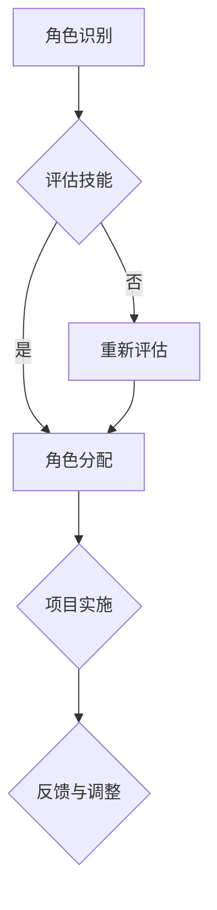

                 

### 《团队角色分配：发挥每个人的长处》

> 关键词：团队角色分配、团队管理、人员分工、协作技巧、案例分析、最佳实践

> 摘要：本文将探讨团队角色分配的重要性，通过分析团队与角色分配的基本概念、方法与技巧，结合实际案例，探讨如何有效发挥每个团队成员的长处，提高团队整体效率和产出。文章旨在为IT领域的管理者和团队成员提供有价值的参考和指导。

---

### 目录大纲

#### 第一部分：团队与角色分配概述

- **第1章：团队与角色分配的基本概念**
  - 1.1 团队的定义与类型
  - 1.2 角色分配的意义
  - 1.3 团队成员的角色分类

- **第2章：团队角色分配的方法与技巧**
  - 2.1 角色识别与评估
  - 2.2 角色分配的策略
  - 2.3 角色调整与优化
  - 2.4 角色沟通与协作
  - 2.5 角色冲突与解决
  - 2.6 角色成长与发展

- **第3章：团队角色分配的技巧**
  - 3.1 角色沟通与协作
  - 3.2 角色冲突与解决
  - 3.3 角色成长与发展

#### 第二部分：团队角色分配的实际案例

- **第4章：实际案例分析与启示**
  - 4.1 案例一：初创公司的团队角色分配
  - 4.2 案例二：大型企业的团队角色分配
  - 4.3 案例三：跨文化团队的团队角色分配

#### 第三部分：团队角色分配的理论基础

- **第5章：团队角色分配的理论基础**
  - 5.1 团队动力理论
  - 5.2 职业角色理论
  - 5.3 团队角色分配的数学模型

#### 第四部分：团队角色分配的最佳实践

- **第6章：团队角色分配的最佳实践**
  - 6.1 跨部门协作的最佳实践
  - 6.2 远程团队的角色分配
  - 6.3 多元化团队的角色分配

#### 第五部分：团队角色分配的未来趋势

- **第7章：未来趋势与展望**
  - 7.1 科技发展对团队角色分配的影响
  - 7.2 团队角色分配的未来趋势
  - 7.3 未来展望

#### 附录

- **附录A：团队角色分配工具与资源**
- **附录B：团队角色分配的Mermaid流程图**
- **附录C：团队角色分配的算法原理与伪代码**
- **附录D：团队角色分配项目实战**

---

现在，我们将一步一步深入探讨这个重要但常常被忽视的话题：团队角色分配。接下来，每个章节都将详细解析，以帮助您更好地理解团队角色分配的核心概念、方法、技巧及其在实际中的应用。

### 第一部分：团队与角色分配概述

#### 第1章：团队与角色分配的基本概念

**1.1 团队的定义与类型**

- **定义：** 团队是由两个或两个以上的人组成，共同完成特定目标或任务的协作体。团队中的每个成员都有其特定的角色和责任，通过相互协作和沟通，实现整体的目标。

- **类型：** 团队可以根据不同的分类标准分为多种类型，例如：
  - **项目团队：** 以完成特定项目为目标，通常由跨部门成员组成，成员在项目期间形成团队。
  - **功能团队：** 根据特定职能划分的团队，如开发团队、市场团队、技术支持团队等。
  - **虚拟团队：** 通过远程通信手段进行协作的团队，成员可能分布在全球各地。

**1.2 角色分配的意义**

- **提高效率：** 通过明确每个成员的角色和责任，可以避免重复工作，提高工作效率。
- **明确责任：** 角色分配使得每个成员都清楚自己的职责，有助于团队目标和任务的顺利完成。
- **促进协作：** 明确的角色分配有助于团队成员之间建立有效的沟通和协作机制，增强团队凝聚力。

**1.3 团队成员的角色分类**

- **管理者角色：** 负责团队的规划、决策和协调工作，确保团队目标的实现。
- **执行者角色：** 直接参与项目或任务的具体实施，完成具体的工作任务。
- **支持者角色：** 提供技术或资源支持，帮助执行者角色更好地完成任务。

通过以上章节，我们对团队与角色分配的基本概念有了初步了解。接下来，我们将详细探讨团队角色分配的具体方法与技巧。

### 第二部分：团队角色分配的方法与技巧

#### 第2章：团队角色分配的具体方法

**2.1 角色识别与评估**

- **角色识别：** 角色识别是团队角色分配的第一步，通过分析团队成员的技能、经验和兴趣，确定每个成员最适合的角色。

- **评估指标：** 评估指标包括专业技能、工作经验、沟通能力和团队合作精神等，通过综合评估，确定每个成员的角色。

**2.2 角色分配的策略**

- **按需分配：** 根据项目或任务的需求，将合适的人才分配到相应的角色，确保任务的顺利完成。

- **按特长分配：** 根据团队成员的特长和兴趣，将其安排到能够发挥其长处的角色，提高团队整体效率。

- **按任务分配：** 根据任务的特点和难度，将合适的成员分配到相应的角色，确保任务的高效完成。

**2.3 角色调整与优化**

- **角色调整：** 在团队运作过程中，根据实际情况和成员的变化，及时调整角色分配，确保团队始终保持高效运作。

- **角色优化：** 通过不断优化角色分配，提高团队的整体效率，实现团队目标的最大化。

**2.4 角色沟通与协作**

- **沟通技巧：** 提高团队成员之间的沟通效率，确保信息传递准确无误。

- **协作方式：** 通过有效的协作方式，如会议、协作工具和团队合作等，提高团队协作效率。

**2.5 角色冲突与解决**

- **冲突原因：** 角色冲突通常源于职责不清、利益冲突或沟通不畅等。

- **解决策略：** 通过建立有效的沟通机制、明确职责和利益分配，以及提供冲突解决的培训，解决角色冲突。

**2.6 角色成长与发展**

- **成长路径：** 为团队成员提供明确的职业发展路径，激励其不断成长和进步。

- **发展策略：** 通过培训、项目和反馈等手段，支持团队成员的发展，提高团队的整体竞争力。

通过以上章节，我们详细探讨了团队角色分配的具体方法和技巧。接下来，我们将结合实际案例，进一步分析团队角色分配的有效性和实施策略。

### 第3章：团队角色分配的技巧

在上一章中，我们详细介绍了团队角色分配的具体方法。然而，要确保角色分配的有效实施，还需要掌握一系列实用的技巧。以下是关于角色沟通与协作、角色冲突与解决、以及角色成长与发展的具体技巧。

#### 3.1 角色沟通与协作

**沟通技巧：**  
有效的沟通是团队角色分配成功的关键。以下是一些沟通技巧：

1. **明确目标：** 在开始沟通前，确保每个团队成员都清楚团队的目标和各自的职责。
2. **倾听与反馈：** 积极倾听团队成员的意见，并及时给予反馈，确保信息传达的准确性。
3. **透明沟通：** 保持沟通的透明度，避免信息孤岛，确保每个成员都能获取到需要的信息。

**协作方式：**  
协作方式的选择直接影响团队角色分配的有效性。以下是一些有效的协作方式：

1. **定期会议：** 定期举行团队会议，讨论进展、问题和解决方案。
2. **协作工具：** 利用协作工具，如Slack、Trello等，实现任务分配、进度追踪和沟通。
3. **团队合作：** 鼓励团队成员共同解决问题，通过协作提高整体效率。

#### 3.2 角色冲突与解决

**冲突原因：**  
角色冲突通常源于以下原因：

1. **职责不清：** 当团队成员对各自的职责不明确时，容易产生冲突。
2. **利益冲突：** 当团队成员的利益发生冲突时，可能会导致不和谐的工作氛围。
3. **沟通不畅：** 缺乏有效的沟通机制，容易导致误解和冲突。

**解决策略：**  
以下是一些解决角色冲突的策略：

1. **明确职责：** 通过制定明确的职责说明，避免职责重叠和模糊，减少冲突的发生。
2. **利益协调：** 通过公平的利益分配，平衡团队成员的利益，减少冲突。
3. **建立沟通机制：** 设立定期的沟通会议，确保团队成员之间的沟通畅通，及时解决冲突。

#### 3.3 角色成长与发展

**成长路径：**  
为了激励团队成员不断成长，可以为其设计明确的职业发展路径。以下是一些成长路径的策略：

1. **技能培训：** 定期为团队成员提供技能培训，提高其专业能力。
2. **项目参与：** 通过参与不同类型的项目，让团队成员积累丰富的经验。
3. **职业规划：** 帮助团队成员制定个人职业规划，明确其职业发展目标。

**发展策略：**  
以下是一些支持团队成员发展的策略：

1. **反馈与激励：** 定期对团队成员的工作进行反馈，给予积极的激励。
2. **团队建设：** 通过团建活动，增强团队成员之间的信任和协作。
3. **职业晋升：** 提供职业晋升机会，鼓励团队成员不断提升自己。

通过以上技巧，我们可以更好地实施团队角色分配，确保团队成员各司其职，协作顺畅，共同实现团队目标。

#### 第二部分：团队角色分配的实际案例

在了解团队角色分配的理论和方法后，我们将通过实际案例进行分析，以深入探讨团队角色分配的有效性和实施策略。

**案例一：初创公司的团队角色分配**

**背景介绍：**  
一个初创公司，由5名成员组成，主要专注于开发一款基于人工智能技术的智能助手。团队成员包括：首席执行官（CEO）、首席技术官（CTO）、产品经理（PM）、设计师（Designer）和开发工程师（Developer）。

**角色分配情况：**

1. **CEO**：负责公司的整体战略规划、资金筹集和市场推广。
2. **CTO**：负责技术方向和团队的技术架构设计，同时参与核心代码的开发。
3. **PM**：负责产品规划和需求分析，协调开发团队与设计师的工作。
4. **Designer**：负责用户界面的设计，确保产品具有良好的用户体验。
5. **Developer**：负责产品的开发工作，根据需求进行模块开发和集成测试。

**启示与反思：**

- **明确分工：** 初创公司的角色分配需要明确，避免职责重叠和模糊，确保每个成员都能专注于自己的领域。
- **灵活调整：** 在初创阶段，团队规模较小，角色可能需要根据项目进展和公司发展阶段进行灵活调整。
- **培养核心技能：** 初创公司的团队成员需要具备一定的跨领域技能，以应对快速变化的市场需求。

**案例二：大型企业的团队角色分配**

**背景介绍：**  
一家拥有数百名员工的大型企业，专注于企业级软件的开发和销售。团队成员包括：项目经理（PM）、技术负责人（Tech Lead）、开发工程师（Developer）、测试工程师（Tester）和产品经理（Product Manager）。

**角色分配情况：**

1. **项目经理**：负责项目规划、进度控制和风险管理，确保项目按时交付。
2. **技术负责人**：负责技术方案的设计和技术标准的制定，提供技术支持。
3. **开发工程师**：负责具体的软件开发工作，根据需求完成模块开发和集成。
4. **测试工程师**：负责软件测试，确保产品质量。
5. **产品经理**：负责产品规划和需求分析，协调开发团队和测试团队的工作。

**启示与反思：**

- **专业化分工：** 在大型企业中，角色分配更加专业化，每个成员都专注于自己的领域，有助于提高工作效率和产品质量。
- **沟通机制：** 大型企业的团队规模较大，需要建立有效的沟通机制，确保信息传递的准确性和及时性。
- **团队协作：** 大型企业的团队协作更加复杂，需要注重团队成员之间的协作和沟通，确保项目的顺利进行。

**案例三：跨文化团队的团队角色分配**

**背景介绍：**  
一个由不同文化背景的成员组成的跨国团队，负责开发一款面向全球市场的移动应用。团队成员来自美国、中国、印度和欧洲，具有不同的语言和文化背景。

**角色分配情况：**

1. **项目经理**：负责团队的整体管理和协调，确保项目进度和目标。
2. **产品经理**：负责产品规划和需求分析，确保产品的国际化特性。
3. **前端开发工程师**：负责移动应用的界面设计和开发，确保用户体验的一致性。
4. **后端开发工程师**：负责移动应用的后端服务开发，确保系统的稳定性和性能。
5. **测试工程师**：负责移动应用的测试，确保产品质量。
6. **国际协调员**：负责跨文化沟通和协调，解决文化冲突。

**启示与反思：**

- **文化适应性：** 跨文化团队需要注重文化适应，尊重不同文化的差异，促进团队成员之间的相互理解。
- **沟通与协作：** 跨文化团队需要建立有效的沟通和协作机制，确保信息传递的准确性和及时性。
- **冲突解决：** 跨文化团队可能会面临更多的文化冲突，需要建立有效的冲突解决机制，确保团队的和谐运作。

通过以上实际案例，我们可以看到，不同的团队类型和规模在角色分配方面都有其独特的挑战和策略。这些案例为团队角色分配提供了宝贵的经验和启示。

### 第三部分：团队角色分配的理论基础

在探讨团队角色分配的实际案例后，我们将进一步深入探讨其理论基础，包括团队动力理论、职业角色理论和团队角色分配的数学模型。这些理论为团队角色分配提供了坚实的科学基础，有助于我们更好地理解和实施这一过程。

#### 5.1 团队动力理论

**5.1.1 团队动力的概念**

团队动力是指团队内部成员之间的相互作用和动力，它对团队的整体表现和效率有着重要的影响。团队动力理论主要研究团队内部的动力来源、动力机制以及如何增强团队的凝聚力。

**5.1.2 团队动力的影响因素**

团队动力受到多种因素的影响，包括：

1. **共同目标：** 共同的目标是团队动力的关键来源，它能够激发团队成员的积极性和投入感。
2. **信任与支持：** 成员之间的信任和支持能够增强团队凝聚力，提高团队协作效率。
3. **沟通与反馈：** 有效的沟通和及时的反馈有助于团队解决冲突、提高工作效率。
4. **领导风格：** 领导者的风格对团队动力有着重要的影响，民主型领导风格通常能够增强团队成员的参与感和自主性。

**5.1.3 团队动力模型**

常见的团队动力模型包括：

1. **Vroom-Yetton模型：** 该模型提出了五种决策模式，帮助团队在决策过程中选择最合适的决策方式。
2. **Belbin团队角色模型：** 该模型将团队成员分为九种角色，旨在通过合理的角色分配提高团队效率。

**5.2 职业角色理论**

**5.2.1 职业角色的定义**

职业角色是指个体在职业生涯中所扮演的不同角色，这些角色通常与个体的技能、经验、兴趣和价值观相关。职业角色理论主要研究职业角色的种类、职业角色的转变以及如何发挥职业角色的优势。

**5.2.2 职业角色的类型**

职业角色可以大致分为以下几种类型：

1. **功能性角色：** 如领导者、执行者、协调者等，主要负责团队的具体任务和目标实现。
2. **社会角色：** 如团队成员、客户代表等，涉及团队与社会其他成员的互动和沟通。
3. **自我发展角色：** 如学习者、创新者等，强调个人的成长和职业发展。

**5.2.3 职业角色的演变**

职业角色的演变受到多种因素的影响，包括个人的职业发展、行业变化和组织需求。随着职业生涯的推进，个体可能会经历从功能性角色到社会角色，再到自我发展角色的转变。

**5.3 团队角色分配的数学模型**

**5.3.1 模型的构建**

团队角色分配的数学模型通常基于优化理论，旨在通过合理的角色分配，实现团队整体效率的最大化。模型的构建通常涉及以下步骤：

1. **角色识别：** 确定团队中每个成员的角色和能力。
2. **目标设定：** 设定团队的目标和关键绩效指标（KPI）。
3. **优化目标：** 通过数学优化方法，寻找最优的角色分配方案。

**5.3.2 模型的应用**

团队角色分配的数学模型可以应用于多种场景，包括：

1. **人力资源配置：** 通过模型优化，实现人力资源的合理配置，提高团队整体效率。
2. **项目管理：** 通过模型分析，确定项目团队成员的最佳组合，确保项目按时交付。
3. **组织设计：** 通过模型优化，设计出更高效的团队结构和角色分配。

**5.3.3 模型的优化**

团队角色分配的数学模型可以通过以下方法进行优化：

1. **算法改进：** 使用更高效的优化算法，提高模型的计算速度和准确性。
2. **数据质量提升：** 提高角色识别和数据收集的准确性，确保模型输入的有效性。
3. **动态调整：** 根据团队实际情况和外部环境的变化，动态调整角色分配，保持团队的高效运作。

通过以上理论基础，我们可以更好地理解和实施团队角色分配。这些理论不仅提供了科学的方法和工具，也为团队角色分配的实际操作提供了指导。

### 第四部分：团队角色分配的最佳实践

在了解了团队角色分配的理论基础后，我们将探讨一些最佳实践，这些实践可以帮助企业和团队在实际操作中更有效地进行角色分配。

#### 6.1 跨部门协作的最佳实践

**6.1.1 跨部门协作的重要性**

跨部门协作在现代社会中变得越来越重要，因为它能够打破部门间的壁垒，促进信息的共享和资源的优化配置。以下是一些跨部门协作的最佳实践：

1. **明确目标和流程：** 在开始跨部门协作前，确保所有相关部门都清楚项目的目标和流程，避免因理解不同而导致的低效协作。
2. **建立沟通渠道：** 设立定期沟通会议，确保跨部门之间的信息传递和问题解决。
3. **共享资源：** 鼓励跨部门共享资源，如工具、数据和人员，以提高协作效率。

**6.1.2 跨部门协作的障碍**

跨部门协作面临的障碍主要包括：

1. **部门利益冲突：** 部门间的利益冲突可能导致协作受阻。
2. **文化差异：** 不同部门的团队可能有不同的工作习惯和文化，这可能导致沟通和协作的困难。
3. **资源分配不均：** 资源的不均衡分配可能导致某些部门的协作效率降低。

**6.1.3 跨部门协作的策略**

为了克服上述障碍，可以采取以下策略：

1. **利益协调：** 通过公平的利益分配，平衡各部门的利益，促进协作。
2. **文化融合：** 通过培训和团队建设活动，促进不同部门的文化融合，提高协作效率。
3. **资源整合：** 通过资源整合，优化资源配置，确保跨部门协作的顺利进行。

#### 6.2 远程团队的角色分配

**6.2.1 远程团队的特点**

远程团队是指团队成员分布在不同的地理位置，通过远程通信工具进行协作。以下是一些远程团队的特点：

1. **地理位置分散：** 成员分布在全球各地，减少了面对面的交流。
2. **依赖技术工具：** 远程团队高度依赖各种协作工具，如Slack、Zoom和Trello等。
3. **灵活的工作时间：** 远程团队通常拥有更灵活的工作时间，可以根据个人需求进行工作安排。

**6.2.2 远程团队的角色分配挑战**

远程团队在角色分配方面面临的挑战主要包括：

1. **沟通不畅：** 由于地理位置分散，远程团队的沟通可能不如面对面的团队那样顺畅。
2. **时间管理：** 远程团队成员可能面临时间管理的挑战，特别是在处理不同时区的问题。
3. **协作效率：** 远程团队需要通过技术工具进行协作，这可能导致协作效率的降低。

**6.2.3 远程团队角色分配的解决方案**

为了解决上述挑战，可以采取以下解决方案：

1. **定期沟通：** 通过定期视频会议和在线沟通，确保团队成员之间的信息传递。
2. **明确任务和目标：** 在项目开始前，明确每个成员的任务和目标，确保任务分配的清晰性。
3. **使用协作工具：** 利用各种协作工具，如项目管理软件和沟通平台，提高远程团队的协作效率。

#### 6.3 多元化团队的角色分配

**6.3.1 多元化团队的优势**

多元化团队是由具有不同背景、技能和观点的成员组成的团队。以下是一些多元化团队的优势：

1. **创新思维：** 多元化团队能够带来不同的观点和想法，促进创新思维。
2. **问题解决：** 多元化团队能够从多个角度分析问题，提高问题解决的效率。
3. **市场适应性：** 多元化团队能够更好地适应不同市场的需求。

**6.3.2 多元化团队的挑战**

多元化团队在角色分配方面面临的挑战主要包括：

1. **文化差异：** 成员来自不同的文化背景，可能存在文化差异。
2. **沟通障碍：** 不同成员可能有不同的沟通方式和习惯。
3. **利益冲突：** 多元化团队可能面临不同利益群体的冲突。

**6.3.3 多元化团队的分配策略**

为了克服上述挑战，可以采取以下策略：

1. **文化培训：** 提供文化培训，帮助团队成员理解和尊重不同文化。
2. **有效沟通：** 通过定期的沟通和培训，提高团队成员的沟通技巧。
3. **利益协调：** 通过公平的利益分配和透明的决策过程，协调不同利益群体。

通过以上最佳实践，企业和团队可以在实际操作中更有效地进行角色分配，提高团队的协作效率和整体绩效。

### 第五部分：未来趋势与展望

#### 7.1 科技发展对团队角色分配的影响

随着科技的快速发展，特别是人工智能、自动化和区块链等技术的广泛应用，团队角色分配正面临着一系列新的挑战和机遇。

**7.1.1 自动化**

自动化技术的应用正在改变传统的工作方式，一些重复性、标准化的工作可以被机器人和软件系统替代。这导致团队角色分配的重构，使得人类员工可以专注于更高价值的任务，如创新、决策和复杂问题的解决。

- **影响：** 自动化提高了生产效率，减少了人工错误，同时也要求团队成员具备更高的技术能力和适应能力。

**7.1.2 人工智能**

人工智能（AI）的发展正在推动智能化工作流程和智能系统的实现。AI可以处理大量数据，提供实时分析和预测，从而辅助决策。

- **影响：** AI的应用使得团队成员的角色更加专业化，同时也要求团队成员具备与AI系统协作的能力。

**7.1.3 区块链**

区块链技术的应用正在改变信息共享和数据管理的模式。区块链的透明性和不可篡改性使得团队角色分配更加清晰和高效。

- **影响：** 区块链技术的应用使得团队角色分配更加透明，同时也提高了数据的安全性和可信度。

#### 7.2 团队角色分配的未来趋势

**7.2.1 角色专业化**

随着技术的进步，团队成员的角色将越来越专业化。每个成员将专注于自己的领域，成为该领域的专家。这种专业化趋势将提高团队的整体效率和产出。

**7.2.2 角色灵活性**

未来的团队角色分配将更加灵活，团队成员可能会根据项目需求和工作负载动态调整角色。这种灵活性将使团队能够更快地适应变化，提高响应速度。

**7.2.3 角色动态调整**

随着人工智能和自动化技术的发展，团队角色分配将更加动态和自适应。系统可以根据实时数据和反馈自动调整角色分配，以实现最优的工作效率和团队绩效。

#### 7.3 未来展望

**7.3.1 团队角色分配的挑战**

未来，团队角色分配将面临以下挑战：

- **技术适应：** 随着新技术的不断涌现，团队成员需要不断学习和适应新技术。
- **数据安全：** 随着数据量的增加和数据隐私的重要性提升，如何保障数据安全将成为一大挑战。
- **文化多样性：** 随着全球化进程的加速，团队成员的文化多样性将带来新的挑战，如何管理文化差异和促进文化融合将成为关键问题。

**7.3.2 团队角色分配的机遇**

未来，团队角色分配将带来以下机遇：

- **创新机会：** 多元化的团队角色将促进创新和新的解决方案的诞生。
- **全球化合作：** 全球化的团队角色分配将促进跨国团队合作，带来新的商业机会。
- **效率提升：** 通过自动化和人工智能，团队角色分配将变得更加高效，提高整体生产力。

**7.3.3 未来团队角色的演变**

未来的团队角色将更加多元化、专业化和动态化。团队成员将具备更高的技术能力和跨领域知识，能够在不断变化的环境中快速适应和调整。团队角色分配将更加依赖于数据分析和智能系统，以实现最优的工作效率和团队绩效。

### 附录

**附录A：团队角色分配工具与资源**

为了帮助团队更好地进行角色分配，以下是一些常用的工具和资源：

- **工具：**
  - Slack：用于团队沟通和协作。
  - Trello：用于任务管理和项目跟踪。
  - Asana：用于团队任务分配和进度管理。
  - JIRA：用于敏捷开发管理和项目跟踪。

- **资源：**
  - 《团队角色分配指南》：一本介绍团队角色分配原则和实践的书籍。
  - 团队角色评估工具：如Belbin团队角色评估工具。
  - 相关在线课程和培训：如Coursera、Udemy等平台上的团队管理课程。

**附录B：团队角色分配的Mermaid流程图**

以下是一个简单的团队角色分配的Mermaid流程图：



**附录C：团队角色分配的算法原理与伪代码**

以下是一个简单的团队角色分配算法的伪代码：

```plaintext
算法 TeamRoleAssignment
输入：团队成员列表、角色需求列表
输出：最优的角色分配方案

初始化分配矩阵

for 每个团队成员 t in 成员列表 do
    for 每个角色 r in 角色需求列表 do
        if 成员t具有角色r所需技能 then
            分配矩阵[t][r] = true
        else
            分配矩阵[t][r] = false
        end if
    end for
end for

选择最优的角色分配方案：
    for 每个角色 r in 角色需求列表 do
        选择具有最高技能评分的成员分配给角色r
    end for

输出最终的分配矩阵
end algorithm
```

**附录D：团队角色分配项目实战**

**D.1 项目背景**

假设一个由10名成员组成的项目团队，负责开发一款新的企业级应用程序。团队成员来自不同的领域，包括前端开发、后端开发、UI/UX设计和项目管理。项目需要明确每个成员的角色和任务，以确保项目的高效实施。

**D.2 环境搭建**

为了实施团队角色分配项目，我们使用以下工具和平台：

- Slack：用于团队沟通和协作。
- Trello：用于任务管理和项目跟踪。
- JIRA：用于敏捷开发管理和项目跟踪。
- GitHub：用于代码管理和版本控制。

**D.3 源代码实现**

项目团队使用Trello创建了一个任务板，并将任务分配给相应的角色。以下是一个简单的Trello任务板的示例：

```plaintext
任务板:
- 产品需求分析
- UI/UX设计
- 前端开发
- 后端开发
- 测试
- 部署

任务详情：
- 产品需求分析：明确产品功能和技术需求
- UI/UX设计：设计用户界面和用户体验
- 前端开发：实现前端功能
- 后端开发：实现后端逻辑和数据库操作
- 测试：进行功能测试和性能测试
- 部署：将应用程序部署到生产环境
```

**D.4 代码解读与分析**

项目团队使用GitHub进行代码管理，每个成员负责自己的模块开发。以下是一个简单的代码实现示例：

```javascript
// 前端代码示例
function addUser(username, email) {
    // 添加用户逻辑
}

// 后端代码示例
app.post('/users', addUser);

// 数据库操作示例
db.insert({ username: username, email: email });
```

通过上述代码，我们可以看到每个成员都专注于自己的领域，共同协作完成项目。通过Trello和GitHub等工具，项目团队能够实现高效的角色分配和任务管理。

**项目小结**

通过本项目的实战，我们可以看到团队角色分配在项目实施中的重要性。明确的角色分配和任务管理有助于提高团队的协作效率，确保项目按时交付。同时，使用合适的工具和平台，如Trello和GitHub，可以更好地支持团队的角色分配和代码管理。

### 小结

本文通过对团队角色分配的深入探讨，从基本概念、方法与技巧、实际案例、理论基础、最佳实践及未来趋势等多个角度，全面阐述了团队角色分配的重要性及其应用策略。以下是本文的核心要点和最佳实践总结：

#### 核心要点

1. **团队与角色分配的基本概念：** 理解团队的定义、类型和成员的角色分类，是角色分配的基础。
2. **角色识别与评估：** 通过技能、经验和兴趣识别团队成员的角色，并评估其适合度。
3. **角色分配的方法与技巧：** 按需分配、按特长分配和按任务分配是常见的角色分配策略。
4. **沟通与协作技巧：** 提高团队沟通效率，确保信息传递准确无误。
5. **冲突与解决策略：** 建立有效的沟通机制和冲突解决机制，保持团队的和谐运作。
6. **角色成长与发展：** 为团队成员提供明确的职业发展路径，支持其成长。

#### 最佳实践总结

1. **跨部门协作：** 明确目标和流程，建立沟通渠道，共享资源。
2. **远程团队角色分配：** 定期沟通，明确任务和目标，使用协作工具。
3. **多元化团队角色分配：** 提供文化培训，提高沟通技巧，协调不同利益群体。
4. **最佳实践应用：** 在实际操作中，结合团队特点和项目需求，灵活应用最佳实践。

通过以上要点和最佳实践，企业和管理者可以更好地进行团队角色分配，提高团队协作效率，实现团队目标的最大化。

### 注意事项

1. **动态调整：** 团队角色分配不是一次性的任务，需要根据项目进展和团队成员的变化进行动态调整。
2. **透明沟通：** 保持角色分配和任务分配的透明度，避免信息孤岛。
3. **支持与发展：** 提供培训和支持，帮助团队成员发展，提高团队整体竞争力。

### 拓展阅读

- **《团队角色分配指南》**：详细介绍团队角色分配的原则和实践。
- **《团队管理艺术》**：探讨团队管理的多种方法和技巧。
- **相关在线课程和培训**：如Coursera、Udemy等平台上的团队管理课程。

通过本文的学习和实践，期待读者能够更好地理解和应用团队角色分配，提升团队协作效率，实现团队目标的最大化。

### 作者信息

**作者：AI天才研究院/AI Genius Institute & 禅与计算机程序设计艺术 /Zen And The Art of Computer Programming**

