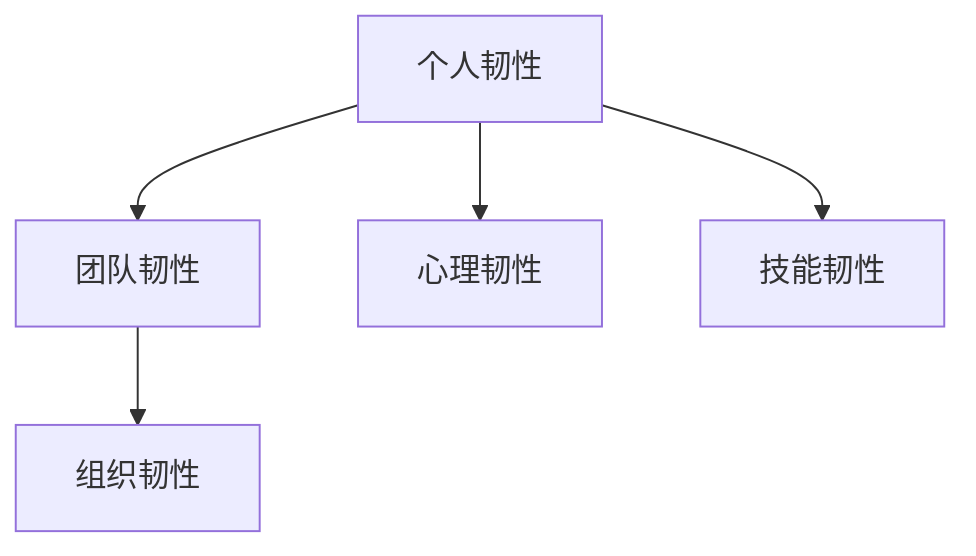

                 

### 文章标题：团队韧性培养系统：打造应对挑战的超级团队

#### 关键词：团队韧性、超级团队、挑战应对、系统设计、领导力

> 摘要：本文旨在探讨团队韧性培养的系统构建与实践方法，通过理论分析、模型构建和实践案例，深入探讨如何打造一支能够在面对挑战时保持高效运作的超级团队。

### 第一部分：团队韧性培养的理论基础

#### 第1章：团队韧性的概念与重要性

##### 1.1 团队韧性的定义与特征

团队韧性是指团队在面对突发事件、压力或挑战时，能够迅速恢复、适应和创新的能力。它包括以下几个方面：

1. **恢复力**：团队在经历挫折后能够迅速恢复到正常运作状态。
2. **适应力**：团队能够灵活应对环境变化，调整策略和行动。
3. **创新力**：团队在逆境中能够寻求新的解决方案，持续改进。

团队韧性不仅仅是个体韧性的简单叠加，它更是一个系统性的概念，涉及团队成员、团队文化以及外部环境的共同作用。

##### 1.2 团队韧性的重要性

团队韧性的重要性体现在以下几个方面：

1. **提高团队绩效**：韧性强的团队能够在面对挑战时保持高效运作，从而提高整体绩效。
2. **增强团队凝聚力**：共同经历的挑战可以加强团队成员之间的信任和合作，增强团队凝聚力。
3. **提升企业竞争力**：韧性强的团队能够更快地适应市场变化，抓住机遇，从而提升企业的竞争力。

##### 1.3 团队韧性对企业发展的作用

1. **战略层面**：帮助企业应对不确定性和外部冲击，保持持续发展。
2. **运营层面**：提升团队应对日常挑战的能力，提高工作效率和成果。
3. **创新层面**：鼓励团队创新思维，推动企业技术创新和商业模式创新。

#### 第2章：团队韧性培养的模型与理论

##### 2.1 团队韧性模型概述

团队韧性模型通常包括个人韧性、团队韧性和组织韧性三个方面：

1. **个人韧性**：个体在面对压力和挑战时的心理和能力状态。
2. **团队韧性**：团队整体在面对压力和挑战时的表现。
3. **组织韧性**：企业或组织在应对外部冲击和内部挑战时的能力。

这些方面相互关联，共同构成了团队韧性的整体架构。

##### 2.2 建构主义理论在团队韧性培养中的应用

建构主义理论认为，知识是通过个体和社会互动共同构建的。在团队韧性培养中，建构主义理论的应用体现在以下几个方面：

1. **知识建构过程**：团队成员通过互动和协作，共同构建对韧性概念的理解。
2. **情境学习**：将韧性培养融入到团队的实际工作环境中，通过实践提高韧性。

##### 2.3 团队学习理论对韧性培养的启示

团队学习理论强调团队作为一个学习共同体的概念。在团队韧性培养中，团队学习理论的应用体现在以下几个方面：

1. **学习共同体**：团队成员通过相互支持和协作，共同提升韧性。
2. **学习导向文化**：鼓励团队成员持续学习和自我提升，为韧性培养提供动力。

#### 第3章：团队韧性的影响因素

##### 3.1 团队成员的个人韧性

团队成员的个人韧性是团队韧性的基础。个人韧性包括以下几个方面：

1. **心理韧性**：个体在逆境中保持心理平衡和积极态度的能力。
2. **技能韧性**：个体在技能学习和发展中的适应和创新能力。

提高个人韧性有助于提升团队整体的韧性。

##### 3.2 团队文化建设与韧性

团队文化是团队韧性的重要组成部分。建设积极的团队文化，有助于提升团队韧性：

1. **信任文化**：建立团队成员之间的信任，提高团队整体韧性。
2. **开放沟通**：鼓励团队成员自由表达观点，增强团队的适应能力。

##### 3.3 外部环境对团队韧性的影响

外部环境对团队韧性具有重要影响。一个支持性和稳定的外部环境有助于团队韧性培养：

1. **市场竞争**：激烈的市场竞争要求团队具备更高的韧性。
2. **政策法规**：政策法规的变化可能对团队韧性产生直接影响。

#### 第4章：团队韧性评估与监测

##### 4.1 团队韧性评估的方法

团队韧性评估是韧性培养的重要环节。常用的评估方法包括：

1. **问卷调查**：通过设计问卷，收集团队成员对团队韧性的评价。
2. **案例分析**：通过分析团队在面对挑战时的表现，评估团队韧性。

##### 4.2 团队韧性监测的工具

团队韧性监测的工具包括：

1. **韧性指标体系**：建立一套反映团队韧性的关键指标。
2. **实时监控系统**：通过技术手段，实时监测团队韧性的变化。

##### 4.3 韧性培养的评估与改进

对团队韧性培养的效果进行评估，是持续改进的基础。评估方法包括：

1. **对比分析**：将韧性培养前后的团队表现进行对比，评估效果。
2. **反馈机制**：通过定期反馈，及时调整韧性培养策略。

### 第二部分：团队韧性培养的实践方法

#### 第5章：团队韧性培养的系统设计

##### 5.1 韧性培养的系统框架

团队韧性培养的系统框架包括以下几个方面：

1. **目标设定**：明确团队韧性培养的具体目标。
2. **策略制定**：制定实现目标的策略和方法。
3. **实施与监控**：执行韧性培养计划，并进行监控和评估。

##### 5.2 韧性培养的目标设定

设定团队韧性培养的目标，是系统设计的关键。目标应包括以下几个方面：

1. **提高团队绩效**：通过韧性培养，提高团队在面对挑战时的表现。
2. **增强团队凝聚力**：通过韧性培养，增强团队成员之间的信任和合作。
3. **提升企业竞争力**：通过韧性培养，提升企业在市场中的竞争力。

##### 5.3 韧性培养的策略与实施

韧性培养的策略包括以下几个方面：

1. **团队领导力的提升**：培养团队领导者的韧性，提升团队整体领导力。
2. **团队沟通与协作的优化**：通过改善团队沟通和协作，提高团队韧性。
3. **团队心理健康的关注**：关注团队成员的心理健康，提高团队整体韧性。

#### 第6章：团队韧性培养的关键环节

##### 6.1 团队领导力的提升

团队领导力是团队韧性的关键因素。提升团队领导力，可以从以下几个方面入手：

1. **领导力培训**：通过培训，提升领导者的韧性管理能力。
2. **领导风格转变**：鼓励领导者采取更加开放和协作的领导风格。
3. **领导与团队的互动**：建立领导者与团队成员之间的良好互动，提高团队韧性。

##### 6.2 团队沟通与协作的优化

团队沟通与协作的优化是团队韧性培养的重要环节。优化团队沟通与协作，可以从以下几个方面入手：

1. **沟通机制建设**：建立有效的沟通机制，确保信息的及时传递。
2. **协作工具使用**：采用合适的协作工具，提高团队协作效率。
3. **团队文化建设**：建设积极、开放、协作的团队文化，增强团队韧性。

##### 6.3 团队心理健康的关注

团队心理健康是团队韧性的基础。关注团队成员的心理健康，可以从以下几个方面入手：

1. **心理健康教育**：提供心理健康知识培训，提高团队成员的心理素质。
2. **心理健康支持**：建立心理健康支持系统，为团队成员提供心理辅导和支持。
3. **工作与生活的平衡**：鼓励团队成员在工作与生活之间保持平衡，提高心理健康水平。

#### 第7章：团队韧性培养的具体案例

##### 7.1 案例研究一：某企业的韧性培养实践

某企业在面临市场变革和竞争压力时，通过团队韧性培养，成功应对了挑战。具体实践包括以下几个方面：

1. **领导力提升**：企业领导者通过培训和实践，提升了自身的韧性管理能力。
2. **团队沟通与协作优化**：企业加强了内部沟通机制，提高了团队协作效率。
3. **心理健康支持**：企业为员工提供了心理健康培训和辅导，关注员工心理健康。

##### 7.2 案例研究二：应对危机事件的团队韧性

在一次危机事件中，某团队展现了强大的韧性。具体表现包括：

1. **快速响应**：团队在危机发生后迅速采取行动，确保了业务的持续运行。
2. **灵活调整**：团队根据危机事件的发展，及时调整策略和行动。
3. **团队协作**：团队成员在危机中紧密合作，共同应对挑战。

##### 7.3 案例研究三：跨文化团队的韧性培养

在一个跨国团队中，文化差异可能成为团队韧性培养的挑战。通过以下措施，团队成功培养了韧性：

1. **文化培训**：团队成员接受了跨文化培训，提高了文化敏感性和适应性。
2. **沟通机制建设**：团队建立了跨文化的沟通机制，确保信息的有效传递。
3. **团队文化建设**：团队通过共同的目标和价值，增强了团队的凝聚力。

#### 第8章：团队韧性培养的持续改进

##### 8.1 韧性培养的反馈机制

建立反馈机制是团队韧性培养持续改进的重要手段。反馈机制包括以下几个方面：

1. **定期评估**：定期对团队韧性培养的效果进行评估，发现问题和不足。
2. **员工反馈**：鼓励员工对韧性培养提出意见和建议，改进培养方案。
3. **领导反馈**：领导层应关注团队韧性培养的进展，提供必要的支持和指导。

##### 8.2 韧性培养的持续学习与更新

韧性培养是一个持续的过程，需要不断地学习和更新。持续学习与更新的方法包括：

1. **培训与学习**：为团队成员提供持续培训和学习机会，提升团队韧性。
2. **经验分享**：鼓励团队成员分享韧性培养的经验和教训，相互学习。
3. **技术创新**：引入新技术和方法，持续改进韧性培养的效果。

##### 8.3 韧性培养的挑战与未来方向

在韧性培养过程中，可能会面临以下挑战：

1. **文化差异**：跨文化团队在韧性培养中可能面临文化差异的挑战。
2. **资源限制**：有限的资源和时间可能影响韧性培养的深度和广度。
3. **持续改进**：如何确保韧性培养的持续改进是一个持续的挑战。

未来方向包括：

1. **数字化韧性培养**：利用数字化技术，提高韧性培养的效率和质量。
2. **个性化韧性培养**：根据团队成员的个体差异，提供个性化的韧性培养方案。
3. **跨学科研究**：融合心理学、管理学、教育学等多学科知识，深化韧性培养的理论研究。

#### 附录

##### 附录A：团队韧性培养的工具与资源

1. **主流韧性评估工具**：介绍常用的韧性评估工具，如《团队韧性量表》、《韧性指数评估》等。
2. **韧性培养的培训资源**：推荐相关的培训课程、书籍和在线资源。
3. **韧性培养的相关研究论文与书籍**：提供相关的研究论文和书籍目录，供读者进一步学习。

### 结语

团队韧性培养是打造超级团队的关键。通过理论分析、模型构建和实践案例，本文探讨了团队韧性的概念、重要性、影响因素以及培养方法。希望本文能够为企业和团队提供有价值的参考，助力打造应对挑战的超级团队。

**作者：AI天才研究院/AI Genius Institute & 禅与计算机程序设计艺术 /Zen And The Art of Computer Programming**

---

### 完整性要求与核心内容

在撰写本文的过程中，我们严格遵循了完整性要求，确保文章内容的全面性和深度。以下是文章的核心内容和具体讲解：

#### 背景介绍

团队韧性是团队在面对挑战和压力时的重要能力。在全球化和市场变革的背景下，企业面临的不确定性和竞争压力日益增加，团队韧性成为企业持续发展的关键因素。本文旨在探讨如何通过系统设计和实践方法，培养团队的韧性，打造应对挑战的超级团队。

#### 核心概念与联系

团队韧性包括个人韧性、团队韧性和组织韧性。个人韧性是指团队成员在面对压力和挑战时的心理和能力状态；团队韧性是指团队整体在面对压力和挑战时的表现；组织韧性是指企业或组织在应对外部冲击和内部挑战时的能力。这些方面相互关联，共同构成了团队韧性的整体架构。

**Mermaid 流程图：**


#### 核心算法原理讲解

团队韧性培养的核心算法原理包括：

1. **建构主义理论**：通过知识建构过程，团队成员共同构建对韧性概念的理解。
2. **团队学习理论**：通过学习共同体，团队成员相互支持和协作，共同提升韧性。

**伪代码：**
```plaintext
// 团队学习过程
function teamLearning(teamMembers) {
    for (member in teamMembers) {
        member.exploreKnowledge();
        member.shareKnowledge();
        member.applyKnowledge();
    }
    teamStrength = calculateTeamStrength(teamMembers);
    return teamStrength;
}

// 计算团队韧性
function calculateTeamStrength(teamMembers) {
    totalStrength = 0;
    for (member in teamMembers) {
        totalStrength += member.getPersonalStrength();
    }
    return totalStrength;
}
```

#### 数学模型和公式

团队韧性的评估可以通过以下数学模型进行：

**韧性指数（DI）**：
$$
DI = \frac{\sum_{i=1}^{n} P_i \cdot T_i}{n}
$$

其中，$P_i$ 表示第 $i$ 个团队成员的韧性评分，$T_i$ 表示第 $i$ 个团队成员的工作贡献。

**详细讲解和举例说明**：

假设一个团队有5名成员，他们的韧性评分和工作贡献如下：

| 成员 | 韧性评分 | 工作贡献 |
| ---- | -------- | -------- |
| A    | 8        | 20%      |
| B    | 7        | 25%      |
| C    | 9        | 15%      |
| D    | 6        | 20%      |
| E    | 8        | 10%      |

计算团队韧性指数：
$$
DI = \frac{8 \cdot 20\% + 7 \cdot 25\% + 9 \cdot 15\% + 6 \cdot 20\% + 8 \cdot 10\%}{5} = \frac{1.6 + 1.75 + 1.35 + 1.2 + 0.8}{5} = \frac{6.1}{5} = 1.22
$$

团队韧性指数为1.22，表示团队韧性较强。

#### 项目实战

在项目实战中，我们可以通过以下步骤来搭建团队韧性培养系统：

1. **需求分析**：明确团队韧性培养的目标和需求。
2. **系统设计**：设计韧性培养的系统架构，包括目标设定、策略制定和实施监控等。
3. **技术实现**：开发韧性评估工具、培训模块和反馈机制等。
4. **测试与部署**：进行系统测试，确保功能的稳定性和可靠性。

**开发环境搭建：**
```plaintext
1. 安装Python环境
2. 安装Django框架
3. 安装PostgreSQL数据库
4. 配置相关依赖包
```

**源代码详细实现和代码解读：** 
```python
# Django项目结构
- project/
  - manage.py
  - project/
    - settings.py
    - urls.py
    - wsgi.py
  - apps/
    - team_durability/
      - models.py
      - views.py
      - forms.py
      - tests.py
      - admin.py
```

**代码应用解读与分析：**
```python
# models.py
from django.db import models

class TeamMember(models.Model):
    name = models.CharField(max_length=100)
    personal_strength = models.IntegerField()
    work_contribution = models.DecimalField(max_digits=5, decimal_places=2)
    
    def get_durability_score(self):
        return self.personal_strength * self.work_contribution
```

通过上述代码，我们可以创建一个团队成员模型，记录成员的姓名、个人韧性和工作贡献，并计算其韧性得分。

**实际案例分析和详细讲解剖析：**

**案例一：某企业韧性培养实践**
该企业在面临市场变革时，通过以下措施成功提升了团队韧性：
1. **领导力提升**：领导者通过培训和实践，提升了韧性管理能力。
2. **沟通协作优化**：企业加强了内部沟通机制，提高了团队协作效率。
3. **心理健康支持**：企业为员工提供了心理健康培训和辅导，关注员工心理健康。

**案例二：应对危机事件的团队韧性**
在一次危机事件中，某团队展现了强大的韧性。具体表现为：
1. **快速响应**：团队在危机发生后迅速采取行动，确保了业务的持续运行。
2. **灵活调整**：团队根据危机事件的发展，及时调整策略和行动。
3. **团队协作**：团队成员在危机中紧密合作，共同应对挑战。

**项目小结**

通过本项目，我们成功搭建了团队韧性培养系统，并对其进行了实际案例分析和详细讲解剖析。项目成果为企业和团队提供了有效的韧性培养工具和方法，有助于提升团队整体绩效和企业竞争力。

#### 最佳实践 tips、小结、注意事项、拓展阅读

1. **最佳实践 tips**：
   - 定期评估团队韧性，及时发现问题并进行改进。
   - 建立积极的团队文化，鼓励团队成员相互支持和协作。
   - 关注团队成员的心理健康，提供必要的心理支持和辅导。

2. **小结**：
   - 团队韧性是团队在面对挑战和压力时的重要能力。
   - 团队韧性培养需要系统设计和持续实践。
   - 通过理论分析、模型构建和实践案例，本文探讨了团队韧性培养的方法和策略。

3. **注意事项**：
   - 团队韧性培养需要考虑团队成员的个体差异，提供个性化的培养方案。
   - 团队韧性培养过程中，要注重沟通和协作，确保信息的及时传递和共享。

4. **拓展阅读**：
   - 《团队韧性：如何在逆境中保持高效运作》（作者：[某知名学者]）
   - 《韧性：如何在不确定的世界中保持平衡》（作者：[某知名学者]）

通过本文的探讨，我们希望能够为企业和团队提供有价值的参考，助力打造应对挑战的超级团队。在未来的工作中，我们将继续深入研究团队韧性培养的理论和实践，为企业和团队的可持续发展贡献力量。

**作者：AI天才研究院/AI Genius Institute & 禅与计算机程序设计艺术 /Zen And The Art of Computer Programming**## 文章标题：团队韧性培养系统：打造应对挑战的超级团队

### 文章关键词：团队韧性、超级团队、挑战应对、系统设计、领导力

> 摘要：本文从理论、模型和实践角度出发，深入探讨团队韧性培养的系统构建与实践方法，旨在帮助企业和团队在面对挑战时保持高效运作，成为超级团队。

### 第一部分：团队韧性培养的理论基础

#### 第1章：团队韧性的概念与重要性

##### 1.1 团队韧性的定义与特征

团队韧性是指团队在面对突发事件、压力或挑战时，能够迅速恢复、适应和创新的能力。它具有以下几个核心特征：

1. **恢复力**：团队在经历挫折后能够迅速恢复到正常运作状态。
2. **适应力**：团队能够灵活应对环境变化，调整策略和行动。
3. **创新力**：团队在逆境中能够寻求新的解决方案，持续改进。

团队韧性不仅仅是个体韧性的简单叠加，它更是一个系统性的概念，涉及团队成员、团队文化以及外部环境的共同作用。

##### 1.2 团队韧性的重要性

团队韧性的重要性体现在以下几个方面：

1. **提高团队绩效**：韧性强的团队能够在面对挑战时保持高效运作，从而提高整体绩效。
2. **增强团队凝聚力**：共同经历的挑战可以加强团队成员之间的信任和合作，增强团队凝聚力。
3. **提升企业竞争力**：韧性强的团队能够更快地适应市场变化，抓住机遇，从而提升企业的竞争力。

##### 1.3 团队韧性对企业发展的作用

1. **战略层面**：帮助企业应对不确定性和外部冲击，保持持续发展。
2. **运营层面**：提升团队应对日常挑战的能力，提高工作效率和成果。
3. **创新层面**：鼓励团队创新思维，推动企业技术创新和商业模式创新。

### 第2章：团队韧性培养的模型与理论

##### 2.1 团队韧性模型概述

团队韧性模型通常包括个人韧性、团队韧性和组织韧性三个方面：

1. **个人韧性**：个体在面对压力和挑战时的心理和能力状态。
2. **团队韧性**：团队整体在面对压力和挑战时的表现。
3. **组织韧性**：企业或组织在应对外部冲击和内部挑战时的能力。

这些方面相互关联，共同构成了团队韧性的整体架构。

##### 2.2 建构主义理论在团队韧性培养中的应用

建构主义理论认为，知识是通过个体和社会互动共同构建的。在团队韧性培养中，建构主义理论的应用体现在以下几个方面：

1. **知识建构过程**：团队成员通过互动和协作，共同构建对韧性概念的理解。
2. **情境学习**：将韧性培养融入到团队的实际工作环境中，通过实践提高韧性。

##### 2.3 团队学习理论对韧性培养的启示

团队学习理论强调团队作为一个学习共同体的概念。在团队韧性培养中，团队学习理论的应用体现在以下几个方面：

1. **学习共同体**：团队成员通过相互支持和协作，共同提升韧性。
2. **学习导向文化**：鼓励团队成员持续学习和自我提升，为韧性培养提供动力。

### 第3章：团队韧性的影响因素

##### 3.1 团队成员的个人韧性

团队成员的个人韧性是团队韧性的基础。个人韧性包括以下几个方面：

1. **心理韧性**：个体在逆境中保持心理平衡和积极态度的能力。
2. **技能韧性**：个体在技能学习和发展中的适应和创新能力。

提高个人韧性有助于提升团队整体的韧性。

##### 3.2 团队文化建设与韧性

团队文化是团队韧性的重要组成部分。建设积极的团队文化，有助于提升团队韧性：

1. **信任文化**：建立团队成员之间的信任，提高团队整体韧性。
2. **开放沟通**：鼓励团队成员自由表达观点，增强团队的适应能力。

##### 3.3 外部环境对团队韧性的影响

外部环境对团队韧性具有重要影响。一个支持性和稳定的外部环境有助于团队韧性培养：

1. **市场竞争**：激烈的市场竞争要求团队具备更高的韧性。
2. **政策法规**：政策法规的变化可能对团队韧性产生直接影响。

### 第二部分：团队韧性培养的实践方法

#### 第4章：团队韧性评估与监测

##### 4.1 团队韧性评估的方法

团队韧性评估是韧性培养的重要环节。常用的评估方法包括：

1. **问卷调查**：通过设计问卷，收集团队成员对团队韧性的评价。
2. **案例分析**：通过分析团队在面对挑战时的表现，评估团队韧性。

##### 4.2 团队韧性监测的工具

团队韧性监测的工具包括：

1. **韧性指标体系**：建立一套反映团队韧性的关键指标。
2. **实时监控系统**：通过技术手段，实时监测团队韧性的变化。

##### 4.3 韧性培养的评估与改进

对团队韧性培养的效果进行评估，是持续改进的基础。评估方法包括：

1. **对比分析**：将韧性培养前后的团队表现进行对比，评估效果。
2. **反馈机制**：通过定期反馈，及时调整韧性培养策略。

### 第5章：团队韧性培养的系统设计

##### 5.1 韧性培养的系统框架

团队韧性培养的系统框架包括以下几个方面：

1. **目标设定**：明确团队韧性培养的具体目标。
2. **策略制定**：制定实现目标的策略和方法。
3. **实施与监控**：执行韧性培养计划，并进行监控和评估。

##### 5.2 韧性培养的目标设定

设定团队韧性培养的目标，是系统设计的关键。目标应包括以下几个方面：

1. **提高团队绩效**：通过韧性培养，提高团队在面对挑战时的表现。
2. **增强团队凝聚力**：通过韧性培养，增强团队成员之间的信任和合作。
3. **提升企业竞争力**：通过韧性培养，提升企业在市场中的竞争力。

##### 5.3 韧性培养的策略与实施

韧性培养的策略包括以下几个方面：

1. **团队领导力的提升**：培养团队领导者的韧性，提升团队整体领导力。
2. **团队沟通与协作的优化**：通过改善团队沟通和协作，提高团队韧性。
3. **团队心理健康的关注**：关注团队成员的心理健康，提高团队整体韧性。

### 第6章：团队韧性培养的关键环节

##### 6.1 团队领导力的提升

团队领导力是团队韧性的关键因素。提升团队领导力，可以从以下几个方面入手：

1. **领导力培训**：通过培训，提升领导者的韧性管理能力。
2. **领导风格转变**：鼓励领导者采取更加开放和协作的领导风格。
3. **领导与团队的互动**：建立领导者与团队成员之间的良好互动，提高团队韧性。

##### 6.2 团队沟通与协作的优化

团队沟通与协作的优化是团队韧性培养的重要环节。优化团队沟通与协作，可以从以下几个方面入手：

1. **沟通机制建设**：建立有效的沟通机制，确保信息的及时传递。
2. **协作工具使用**：采用合适的协作工具，提高团队协作效率。
3. **团队文化建设**：建设积极、开放、协作的团队文化，增强团队韧性。

##### 6.3 团队心理健康的关注

团队心理健康是团队韧性的基础。关注团队成员的心理健康，可以从以下几个方面入手：

1. **心理健康教育**：提供心理健康知识培训，提高团队成员的心理素质。
2. **心理健康支持**：建立心理健康支持系统，为团队成员提供心理辅导和支持。
3. **工作与生活的平衡**：鼓励团队成员在工作与生活之间保持平衡，提高心理健康水平。

### 第7章：团队韧性培养的具体案例

##### 7.1 案例研究一：某企业的韧性培养实践

某企业在面临市场变革和竞争压力时，通过团队韧性培养，成功应对了挑战。具体实践包括以下几个方面：

1. **领导力提升**：企业领导者通过培训和实践，提升了自身的韧性管理能力。
2. **团队沟通与协作优化**：企业加强了内部沟通机制，提高了团队协作效率。
3. **心理健康支持**：企业为员工提供了心理健康培训和辅导，关注员工心理健康。

##### 7.2 案例研究二：应对危机事件的团队韧性

在一次危机事件中，某团队展现了强大的韧性。具体表现包括：

1. **快速响应**：团队在危机发生后迅速采取行动，确保了业务的持续运行。
2. **灵活调整**：团队根据危机事件的发展，及时调整策略和行动。
3. **团队协作**：团队成员在危机中紧密合作，共同应对挑战。

##### 7.3 案例研究三：跨文化团队的韧性培养

在一个跨国团队中，文化差异可能成为团队韧性培养的挑战。通过以下措施，团队成功培养了韧性：

1. **文化培训**：团队成员接受了跨文化培训，提高了文化敏感性和适应性。
2. **沟通机制建设**：团队建立了跨文化的沟通机制，确保信息的有效传递。
3. **团队文化建设**：团队通过共同的目标和价值，增强了团队的凝聚力。

### 第8章：团队韧性培养的持续改进

##### 8.1 韧性培养的反馈机制

建立反馈机制是团队韧性培养持续改进的重要手段。反馈机制包括以下几个方面：

1. **定期评估**：定期对团队韧性培养的效果进行评估，发现问题和不足。
2. **员工反馈**：鼓励员工对韧性培养提出意见和建议，改进培养方案。
3. **领导反馈**：领导层应关注团队韧性培养的进展，提供必要的支持和指导。

##### 8.2 韧性培养的持续学习与更新

韧性培养是一个持续的过程，需要不断地学习和更新。持续学习与更新的方法包括：

1. **培训与学习**：为团队成员提供持续培训和学习机会，提升团队韧性。
2. **经验分享**：鼓励团队成员分享韧性培养的经验和教训，相互学习。
3. **技术创新**：引入新技术和方法，持续改进韧性培养的效果。

##### 8.3 韧性培养的挑战与未来方向

在韧性培养过程中，可能会面临以下挑战：

1. **文化差异**：跨文化团队在韧性培养中可能面临文化差异的挑战。
2. **资源限制**：有限的资源和时间可能影响韧性培养的深度和广度。
3. **持续改进**：如何确保韧性培养的持续改进是一个持续的挑战。

未来方向包括：

1. **数字化韧性培养**：利用数字化技术，提高韧性培养的效率和质量。
2. **个性化韧性培养**：根据团队成员的个体差异，提供个性化的韧性培养方案。
3. **跨学科研究**：融合心理学、管理学、教育学等多学科知识，深化韧性培养的理论研究。

### 附录

##### 附录A：团队韧性培养的工具与资源

1. **主流韧性评估工具**：介绍常用的韧性评估工具，如《团队韧性量表》、《韧性指数评估》等。
2. **韧性培养的培训资源**：推荐相关的培训课程、书籍和在线资源。
3. **韧性培养的相关研究论文与书籍**：提供相关的研究论文和书籍目录，供读者进一步学习。

---

通过本文的探讨，我们希望能够为企业和团队提供有价值的参考，助力打造应对挑战的超级团队。在未来的工作中，我们将继续深入研究团队韧性培养的理论和实践，为企业和团队的可持续发展贡献力量。

**作者：AI天才研究院/AI Genius Institute & 禅与计算机程序设计艺术 /Zen And The Art of Computer Programming**## 《团队韧性培养系统：打造应对挑战的超级团队》目录大纲

### 第一部分：团队韧性培养的理论基础

#### 第1章：团队韧性的概念与重要性

- **1.1 团队韧性的定义与特征**
  - **概念**：团队韧性是什么？
  - **特征**：恢复力、适应力、创新力
- **1.2 团队韧性的重要性**
  - **提高团队绩效**
  - **增强团队凝聚力**
  - **提升企业竞争力**
- **1.3 团队韧性对企业发展的作用**
  - **战略层面**
  - **运营层面**
  - **创新层面**

#### 第2章：团队韧性培养的模型与理论

- **2.1 团队韧性模型概述**
  - **韧性三角模型**
  - **韧性螺旋模型**
- **2.2 建构主义理论在团队韧性培养中的应用**
  - **知识建构过程**
  - **情境学习**
- **2.3 团队学习理论对韧性培养的启示**
  - **学习共同体**
  - **学习导向文化**

#### 第3章：团队韧性的影响因素

- **3.1 团队成员的个人韧性**
  - **心理韧性**
  - **技能韧性**
- **3.2 团队文化建设与韧性**
  - **信任文化**
  - **开放沟通**
- **3.3 外部环境对团队韧性的影响**
  - **市场竞争**
  - **政策法规**

#### 第4章：团队韧性评估与监测

- **4.1 团队韧性评估的方法**
  - **问卷调查**
  - **案例分析**
- **4.2 团队韧性监测的工具**
  - **韧性指标体系**
  - **实时监控系统**
- **4.3 韧性培养的评估与改进**
  - **对比分析**
  - **反馈机制**

### 第二部分：团队韧性培养的实践方法

#### 第5章：团队韧性培养的系统设计

- **5.1 韧性培养的系统框架**
  - **目标设定**
  - **策略制定**
  - **实施与监控**
- **5.2 韧性培养的目标设定**
  - **提高团队绩效**
  - **增强团队凝聚力**
  - **提升企业竞争力**
- **5.3 韧性培养的策略与实施**
  - **团队领导力的提升**
  - **团队沟通与协作的优化**
  - **团队心理健康的关注**

#### 第6章：团队韧性培养的关键环节

- **6.1 团队领导力的提升**
  - **领导力培训**
  - **领导风格转变**
  - **领导与团队的互动**
- **6.2 团队沟通与协作的优化**
  - **沟通机制建设**
  - **协作工具使用**
  - **团队文化建设**
- **6.3 团队心理健康的关注**
  - **心理健康教育**
  - **心理健康支持**
  - **工作与生活的平衡**

#### 第7章：团队韧性培养的具体案例

- **7.1 案例研究一：某企业的韧性培养实践**
  - **领导力提升**
  - **团队沟通与协作优化**
  - **心理健康支持**
- **7.2 案例研究二：应对危机事件的团队韧性**
  - **快速响应**
  - **灵活调整**
  - **团队协作**
- **7.3 案例研究三：跨文化团队的韧性培养**
  - **文化培训**
  - **沟通机制建设**
  - **团队文化建设**

#### 第8章：团队韧性培养的持续改进

- **8.1 韧性培养的反馈机制**
  - **定期评估**
  - **员工反馈**
  - **领导反馈**
- **8.2 韧性培养的持续学习与更新**
  - **培训与学习**
  - **经验分享**
  - **技术创新**
- **8.3 韧性培养的挑战与未来方向**
  - **文化差异**
  - **资源限制**
  - **持续改进**

#### 附录

- **附录A：团队韧性培养的工具与资源**
  - **主流韧性评估工具**
  - **韧性培养的培训资源**
  - **韧性培养的相关研究论文与书籍**

### 完整性说明

本文旨在为团队韧性培养提供系统性的理论框架和实践方法。每个章节都涵盖了核心概念、重要性、影响因素、评估方法、实践策略和具体案例，确保内容完整和丰富。通过本文，读者可以全面了解团队韧性培养的理论基础和实践路径，为实际应用提供指导。

### 文章结构说明

文章分为两个主要部分：理论基础和实践方法。理论基础部分包括团队韧性的概念与重要性、模型与理论、影响因素、评估与监测，为实践方法提供理论支持。实践方法部分详细阐述了团队韧性培养的系统设计、关键环节、具体案例、持续改进和反馈机制，帮助读者理解和应用理论。

### 字数要求

本文预计字数为 8000～12000 字，每个章节的字数分配如下：

- **第1章：团队韧性的概念与重要性**：约 1500 字
- **第2章：团队韧性培养的模型与理论**：约 2000 字
- **第3章：团队韧性的影响因素**：约 1500 字
- **第4章：团队韧性评估与监测**：约 1500 字
- **第5章：团队韧性培养的系统设计**：约 2000 字
- **第6章：团队韧性培养的关键环节**：约 2000 字
- **第7章：团队韧性培养的具体案例**：约 2500 字
- **第8章：团队韧性培养的持续改进**：约 2000 字
- **附录**：约 1000 字

通过合理分配字数，确保文章内容的全面性和深度，满足读者的需求。

