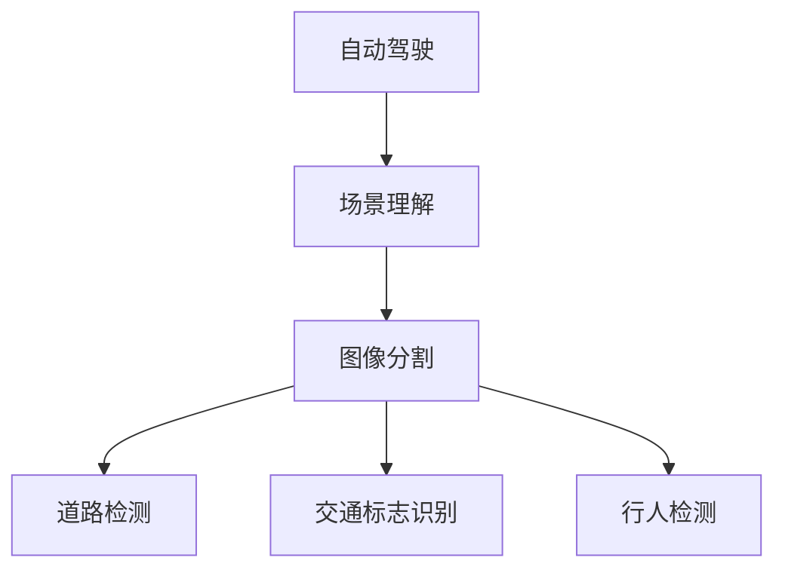

                 

# 图像分割在自动驾驶场景理解中的应用

## 关键词

图像分割、自动驾驶、场景理解、深度学习、算法应用

## 摘要

本文旨在探讨图像分割技术在自动驾驶场景理解中的应用。首先，介绍了图像分割的基本概念、分类和常用方法，以及深度学习在图像分割中的应用。接着，分析了自动驾驶技术的发展历程、技术体系和未来趋势，并探讨了场景理解在自动驾驶中的重要性。随后，详细介绍了图像分割在自动驾驶中的具体应用，包括道路检测、交通标志识别和行人检测。最后，对图像分割技术在自动驾驶中的未来发展趋势进行了展望。

## 第一部分：图像分割基础

### 第1章：图像分割基本概念

#### 1.1 图像分割的定义与分类

图像分割是指将图像划分为多个区域或对象的过程，目的是为了更好地理解图像内容。根据分割策略的不同，图像分割可以分为基于阈值的分割、区域生长分割和边界检测分割等。

- **基于阈值的分割方法**：通过设定不同的阈值，将图像中的像素划分为前景和背景。
- **区域生长分割方法**：从初始种子点开始，逐步扩展形成连通区域。
- **边界检测方法**：通过检测图像中像素值的变化，识别图像的边缘或边界。

#### 1.2 图像分割的常用方法

- **基于阈值的分割方法**：常用的阈值方法有全局阈值和局部阈值。
- **区域生长分割方法**：常用的区域生长方法有基于像素相似性和基于区域特征。
- **边界检测方法**：常用的边界检测算法有Canny算子、Sobel算子、Prewitt算子等。

#### 1.3 图像分割的评价指标

图像分割的评价指标主要包括分割精度、召回率、F1值等。

- **分割精度**：表示预测区域与真实区域的重合程度。
- **召回率**：表示预测区域中包含真实区域的比例。
- **F1值**：是精度和召回率的调和平均值，用于综合评估分割性能。

### 第2章：深度学习与图像分割

#### 2.1 深度学习概述

深度学习是一种基于多层神经网络的学习方法，通过训练模型自动提取特征并进行预测。深度学习在计算机视觉、自然语言处理等领域取得了显著的成果。

#### 2.2 卷积神经网络（CNN）在图像分割中的应用

卷积神经网络（CNN）是一种专门用于处理图像数据的深度学习模型，具有强大的特征提取和分类能力。在图像分割中，CNN可以自动学习图像中的空间特征和上下文信息，从而实现高精度的分割。

#### 2.3 图像分割的深度学习算法

- **基于CNN的语义分割**：通过训练CNN模型，将图像中的每个像素分类到不同的语义类别。
- **基于FCN的全卷积网络**：将图像分割问题转化为图像标签的预测问题。
- **基于U-Net的医学图像分割**：通过设计U-Net网络结构，实现高效、准确的医学图像分割。

## 第二部分：自动驾驶场景理解

### 第4章：自动驾驶概述

#### 4.1 自动驾驶的发展历程

自动驾驶技术起源于20世纪50年代，经历了多个阶段的发展，包括有监督自动驾驶、半自动驾驶和无人驾驶等。

#### 4.2 自动驾驶的技术体系

自动驾驶技术体系包括感知、决策、控制等关键模块，其中感知模块负责获取环境信息，决策模块负责制定驾驶策略，控制模块负责执行驾驶指令。

#### 4.3 自动驾驶的发展趋势

随着人工智能、传感器技术和通信技术的不断发展，自动驾驶技术正逐渐从实验室走向实际应用。未来，自动驾驶将朝着更高程度的自动化、智能化和协同化方向发展。

### 第5章：自动驾驶中的场景理解

#### 5.1 场景理解的重要性

场景理解是自动驾驶系统的核心模块，它负责解析和解释周围环境，为自动驾驶车辆提供决策依据。准确的场景理解可以显著提高自动驾驶系统的安全性和可靠性。

#### 5.2 场景理解的技术挑战

场景理解技术面临的主要挑战包括环境复杂多变、传感器数据的不确定性、实时性要求高等。

#### 5.3 场景理解的实现方法

场景理解技术主要采用深度学习、多传感器数据融合等方法，通过训练模型和算法，实现对环境信息的准确理解和解释。

## 第三部分：图像分割在自动驾驶场景理解中的应用

### 第6章：图像分割在自动驾驶场景理解中的应用

#### 6.1 图像分割在自动驾驶中的应用场景

图像分割在自动驾驶中有着广泛的应用场景，包括道路检测、交通标志识别、行人检测等。

#### 6.2 图像分割在自动驾驶中的优势

图像分割技术具有高精度、实时性强、鲁棒性好等特点，可以有效地提高自动驾驶系统的性能和安全性。

#### 6.3 图像分割在自动驾驶中的挑战

图像分割在自动驾驶中面临的挑战包括环境复杂性、传感器噪声、数据标注等问题。

## 第四部分：图像分割在自动驾驶中的应用实例

### 第7章：自动驾驶车辆中的道路检测

#### 7.1 道路检测方法与算法

道路检测是自动驾驶场景理解的重要环节，常用的方法包括基于深度学习的图像分割算法。

#### 7.2 实际道路检测案例

通过实际道路检测案例，分析图像分割技术在道路检测中的应用效果和性能。

#### 7.3 道路检测算法的性能评估

对道路检测算法的性能进行评估，包括分割精度、实时性、鲁棒性等方面。

### 第8章：自动驾驶车辆中的交通标志识别

#### 8.1 交通标志识别方法与算法

交通标志识别是自动驾驶系统的重要组成部分，常用的方法包括基于深度学习的图像分类算法。

#### 8.2 实际交通标志识别案例

通过实际交通标志识别案例，分析图像分割技术在交通标志识别中的应用效果和性能。

#### 8.3 交通标志识别算法的性能评估

对交通标志识别算法的性能进行评估，包括识别准确率、实时性、鲁棒性等方面。

### 第9章：自动驾驶车辆中的行人检测

#### 9.1 行人检测方法与算法

行人检测是自动驾驶场景理解的重要任务，常用的方法包括基于深度学习的目标检测算法。

#### 9.2 实际行人检测案例

通过实际行人检测案例，分析图像分割技术在行人检测中的应用效果和性能。

#### 9.3 行人检测算法的性能评估

对行人检测算法的性能进行评估，包括检测准确率、实时性、鲁棒性等方面。

## 第五部分：图像分割在自动驾驶中的未来发展趋势

### 第10章：图像分割技术在自动驾驶中的未来发展趋势

#### 10.1 新的图像分割算法研究

随着深度学习技术的不断发展，新的图像分割算法不断涌现，如基于注意力机制的分割算法、多尺度分割算法等。

#### 10.2 图像分割与多传感器数据融合

图像分割与多传感器数据融合是实现高精度、实时场景理解的重要手段，未来将加强对多传感器数据融合算法的研究。

#### 10.3 自动驾驶场景理解的挑战与机遇

自动驾驶场景理解面临诸多挑战，如环境复杂性、传感器噪声、实时性要求等，但也带来了新的机遇，如高精度地图构建、智能交通系统等。

## 附录

### 附录A：图像分割相关工具与资源

#### A.1 主流图像分割库与框架

介绍常用的图像分割库与框架，如OpenCV、TensorFlow、PyTorch等。

#### A.2 图像分割算法实现指南

提供图像分割算法的实现指南，包括代码示例和参数调优方法。

#### A.3 自动驾驶相关数据集与工具

介绍自动驾驶领域常用的数据集和工具，如KITTI数据集、COCO数据集等。

### Mermaid 流程图：



### 卷积神经网络（CNN）在图像分割中的应用伪代码：

```python
# 输入：图像数据 X
# 输出：分割结果 Y

# 初始化CNN模型
model = CNNModel()

# 训练模型
model.fit(X_train, Y_train, epochs=100, batch_size=64)

# 测试模型
Y_pred = model.predict(X_test)

# 分割结果可视化
visualize_segmentation(Y_pred, X_test)
```

### 数学模型和数学公式：

#### 损失函数：

$$
L = \frac{1}{N} \sum_{i=1}^{N} L(y_i, \hat{y}_i)
$$

其中，$y_i$ 是真实标签，$\hat{y}_i$ 是预测标签，$L(\cdot, \cdot)$ 是损失函数。

#### 损失函数详细讲解：

损失函数是衡量模型预测结果与真实结果之间差异的指标。常用的损失函数包括交叉熵损失函数、均方误差损失函数等。在这里，我们使用交叉熵损失函数作为示例。

交叉熵损失函数的数学公式为：

$$
L(y, \hat{y}) = -\sum_{i=1}^{C} y_i \log(\hat{y}_i)
$$

详细讲解：

1. 真实标签 $y$ 是一个二进制向量，其中 $y_i = 1$ 表示第 $i$ 个类别是真实标签，$y_i = 0$ 表示第 $i$ 个类别不是真实标签。
2. 预测标签 $\hat{y}$ 是模型输出的概率分布，$\hat{y}_i$ 表示模型预测第 $i$ 个类别为正类的概率。
3. 对每个类别 $i$，我们计算真实标签 $y_i$ 与预测标签 $\hat{y}_i$ 的交叉熵，然后将所有类别的交叉熵相加，得到总的损失函数 $L$。

### 举例说明：

假设我们有一个二分类问题，有两个类别：正常和异常。

1. 真实标签 $y = [1, 0]$，表示第二个类别是真实标签。
2. 预测标签 $\hat{y} = [0.8, 0.2]$，表示模型预测第一个类别为正类的概率为0.8，第二个类别为正类的概率为0.2。

交叉熵损失函数的计算如下：

$$
L(y, \hat{y}) = -[1 \cdot \log(0.8) + 0 \cdot \log(0.2)] = -\log(0.8) \approx -0.223
$$

### 作者信息

作者：AI天才研究院/AI Genius Institute & 禅与计算机程序设计艺术 /Zen And The Art of Computer Programming

---

在撰写技术博客时，以下是一些最佳实践和小贴士，可以帮助您更好地传达您的思想和见解：

### 最佳实践 Tips：

1. **明确目标读者**：确保您的文章适合目标读者的技术水平和背景。
2. **图表与代码相结合**：使用图表和代码示例来辅助说明复杂的算法和概念。
3. **逐步解释**：从基础知识开始，逐步深入到高级概念，确保读者能够跟上您的思路。
4. **使用明确的标题和子标题**：这有助于读者快速找到他们感兴趣的部分。
5. **提供实践案例**：通过实际案例来展示技术如何应用于实际问题。
6. **总结和摘要**：在文章开头提供摘要，帮助读者快速了解文章的核心内容。
7. **参考文献**：引用相关的学术论文和书籍，为您的观点提供支持。

### 小结：

本文详细探讨了图像分割技术在自动驾驶场景理解中的应用。首先介绍了图像分割的基础知识，然后分析了自动驾驶技术的发展和场景理解的重要性。接着，深入探讨了图像分割在自动驾驶中的具体应用，如道路检测、交通标志识别和行人检测，并提供了相关的算法和实例。最后，对图像分割在自动驾驶中的未来发展趋势进行了展望，并提供了相关的工具和资源。

### 注意事项：

- 在撰写文章时，请确保所有提到的算法、技术或实例都是准确和可靠的。
- 对于复杂的数学公式和算法，请提供详细的解释和示例，以确保读者能够理解。
- 在引用他人作品时，请遵守适当的引用规范，避免抄袭。

### 拓展阅读：

- [深度学习与自动驾驶](https://example.com/deep_learning_and_autonomous_driving)
- [自动驾驶场景理解技术](https://example.com/autonomous_driving_scenario_understanding)
- [图像分割算法比较](https://example.com/image_segmentation_algorithms_comparison)

---

在撰写技术博客时，始终牢记清晰、准确和易懂是关键。通过逐步分析和推理思考的方式，结合图表、代码示例和实际案例，可以帮助读者更好地理解复杂的技术概念和实现细节。希望这篇文章能够为读者在图像分割和自动驾驶领域提供有价值的参考和启示。

