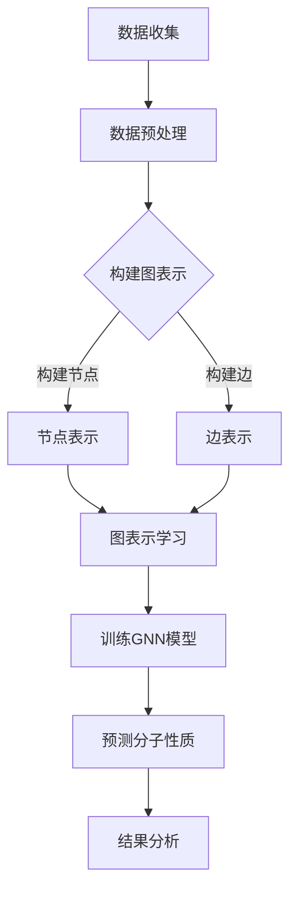

                 

### 文章标题

《图神经网络在化学分子性质预测中的应用》

### 关键词

图神经网络，化学分子，性质预测，GCN，GAT，GAE，药物设计，材料科学

### 摘要

本文探讨了图神经网络（Graph Neural Networks, GNNs）在化学分子性质预测领域的应用。首先，我们介绍了图神经网络的基本概念和理论背景，并详细阐述了化学分子如何通过图表示学习来进行结构表示。随后，本文重点介绍了图神经网络的核心架构和算法原理，包括图卷积神经网络（GCN）、图注意力机制（GAT）、图自编码器（GAE）和图生成对抗网络（GPN）。接着，本文分析了图神经网络在分子性质预测中的挑战与机遇，并介绍了几种基于图神经网络的分子性质预测方法。最后，本文通过一个实际项目展示了图神经网络在分子性质预测中的具体应用，并展望了未来的研究方向。文章旨在为读者提供一个全面而深入的图神经网络在化学领域应用的指南。

---

#### 第一部分：引言与基础理论

##### 第1章：图神经网络概述

## 第1章：图神经网络概述

### 1.1 图神经网络基本概念

#### 图神经网络（Graph Neural Networks, GNNs）

图神经网络（GNNs）是一种专门针对图结构数据的深度学习模型。与传统的卷积神经网络（CNNs）和循环神经网络（RNNs）不同，GNNs能够直接处理图结构数据，如社交网络、分子结构、交通网络等。图神经网络通过模拟神经网络在图上的运算，实现了对图结构数据的有效表示和预测。

#### 基本概念

- **图（Graph）**：图是由节点（Node）和边（Edge）组成的数学结构，用于表示实体和实体之间的关系。
- **节点特征（Node Features）**：节点特征是描述节点属性的向量，如社交网络中的用户信息、分子结构中的原子特性等。
- **边特征（Edge Features）**：边特征是描述边属性的向量，如社交网络中的好友关系、分子结构中的化学键性质等。

### 1.2 图神经网络的发展历程

图神经网络的发展历程可以追溯到1990年代。最初的研究主要集中在图上的相似性度量、图分类和图聚类等问题。随着深度学习和图学的发展，GNNs的研究和应用逐渐丰富，包括图生成、图分割、图表示学习等领域。近年来，图神经网络在化学、生物信息学和计算机视觉等领域的应用取得了显著成果。

#### 1.3 图神经网络的应用场景

图神经网络的应用场景非常广泛，主要包括以下几类：

- **社交网络分析**：用于推荐系统、社区检测、用户行为分析等。
- **化学与生物信息学**：用于分子性质预测、药物设计、蛋白质结构预测等。
- **计算机视觉**：用于图像分类、目标检测、图像生成等。
- **交通网络优化**：用于交通流量预测、道路规划、公共交通系统优化等。
- **知识图谱**：用于知识推理、实体关系分析、信息检索等。

### 1.4 图神经网络的核心概念与架构

图神经网络的核心概念包括节点嵌入（Node Embedding）、图卷积操作（Graph Convolution）和图注意力机制（Graph Attention）。这些概念构成了GNNs的基本架构。

#### 节点嵌入（Node Embedding）

节点嵌入是将图中的节点映射到低维度的向量空间，以便于深度学习模型处理。节点嵌入能够保留节点的局部结构和全局信息，是图神经网络的核心操作之一。

#### 图卷积操作（Graph Convolution）

图卷积操作是GNNs的核心组件，用于聚合节点邻居的信息。图卷积操作可以通过不同的聚合函数和激活函数来实现，如经典的LeCun聚合函数和ReLU激活函数。

#### 图注意力机制（Graph Attention）

图注意力机制通过计算节点之间的相对重要性，为每个节点聚合邻居信息提供权重。图注意力机制能够增强模型对图结构中重要关系的捕捉，提高预测的准确性。

### 1.5 图神经网络的优势与挑战

图神经网络在处理图结构数据方面具有明显的优势，包括：

- **直接处理图结构数据**：能够直接处理图中的节点和边，无需额外的预处理步骤。
- **保留图结构信息**：能够有效保留图结构中的局部和全局信息，提高模型的泛化能力。
- **多任务处理**：能够同时处理多个任务，如节点分类、图分类和图生成等。

然而，图神经网络也面临一些挑战：

- **计算复杂性**：图卷积操作的计算复杂性较高，尤其在大型图数据上。
- **稀疏性**：图数据的稀疏性可能导致模型性能下降。
- **可解释性**：图神经网络模型的内部机制较为复杂，难以解释。

在接下来的章节中，我们将进一步探讨化学分子的图表示、图神经网络在分子性质预测中的应用，以及如何通过实际项目来展示图神经网络在化学领域的应用。通过这些内容，读者将能够深入理解图神经网络在化学分子性质预测中的强大潜力。

---

##### 第2章：化学分子与图表示

## 第2章：化学分子与图表示

### 2.1 化学分子的结构表示

化学分子的结构表示是化学领域研究的基础，它描述了分子中原子之间的连接方式和空间排布。传统的化学分子结构表示方法主要包括线形结构表示、球棍模型和空间填充模型等。然而，随着计算机技术的发展，图结构表示逐渐成为化学分子表示的一种重要手段。

#### 图结构表示的基本概念

图结构表示将化学分子视为一个图，其中节点表示分子中的原子，边表示原子之间的化学键。这种表示方法能够直观地反映分子中原子之间的连接关系和空间结构。

#### 节点表示

节点表示是图表示中的核心，它需要描述分子中每个原子的属性。常用的节点特征包括原子类型、原子半径、电荷、电子亲和能等。例如，我们可以使用以下特征向量来表示一个碳原子：

- 原子类型：C（碳）
- 原子半径：0.77 Å
- 电荷：0.00
- 电子亲和能：0.0

这些特征向量能够为图神经网络提供丰富的节点信息，从而更好地捕捉分子特性。

#### 边表示

边表示描述了分子中原子之间的化学键性质。常见的边特征包括键的类型（单键、双键、三键）、键的长度、键的强度等。例如，我们可以使用以下特征向量来表示一个C-C单键：

- 键类型：单键
- 键长度：1.54 Å
- 键强度：0.0

#### 图表示的挑战与解决方案

在化学分子的图表示过程中，我们面临以下几个挑战：

1. **异构性**：化学分子中的原子和化学键具有不同的类型和属性，这使得图表示中的节点和边具有异构性。为了解决这个问题，我们可以采用图嵌入技术，将异构节点和边映射到统一的低维空间。
2. **稀疏性**：化学分子的图通常非常稀疏，这意味着许多原子和化学键之间没有直接连接。为了应对稀疏性问题，我们可以采用稀疏图处理算法，如稀疏卷积操作，以提高计算效率。
3. **化学键的表示**：化学键的表示是图表示中的一个关键问题。我们可以通过键的长度、键的类型、键的强度等特征来描述化学键，从而为图神经网络提供丰富的边信息。

### 2.2 图表示学习在化学中的应用

图表示学习是一种将高维图数据转换为低维向量表示的技术，它在化学领域中具有重要的应用价值。通过图表示学习，我们可以将复杂的化学分子图表示为低维向量，这些向量可以用于分子性质预测、药物设计等任务。

#### 节点表示学习

节点表示学习的目标是将图中的每个节点映射到一个低维向量空间。在化学分子图中，节点表示学习可以用于以下几个应用场景：

1. **分子性质预测**：通过学习节点表示，我们可以将分子表示为低维向量，这些向量可以用于预测分子的性质，如反应活性、生物活性等。
2. **药物设计**：在药物设计中，节点表示学习可以用于预测药物分子与生物靶点的结合亲和力，从而帮助设计新的药物分子。
3. **蛋白质结构预测**：在蛋白质结构预测中，节点表示学习可以用于预测蛋白质的三维结构，从而帮助理解蛋白质的功能。

#### 边表示学习

边表示学习的目标是将图中的每个边映射到一个低维向量空间。在化学分子图中，边表示学习可以用于以下几个应用场景：

1. **化学键性质预测**：通过学习边表示，我们可以预测分子中化学键的长度、键能等性质，从而帮助理解分子的化学反应行为。
2. **分子反应预测**：通过学习边表示，我们可以预测分子之间的反应路径，从而帮助设计新的化学反应。
3. **材料设计**：在材料设计中，边表示学习可以用于预测材料的物理和化学性质，从而帮助设计新的材料。

### 2.3 分子图表示方法

分子图表示方法是将化学分子转化为图结构的方法。常见的分子图表示方法包括：

1. **邻接矩阵表示**：邻接矩阵是一种简单的图表示方法，它用矩阵的形式表示图中的节点和边。邻接矩阵的元素表示节点之间的连接关系，例如，如果节点i和节点j之间存在一条边，则邻接矩阵中的元素\(a_{ij}\)为1，否则为0。
2. **邻接列表表示**：邻接列表是一种更灵活的图表示方法，它用列表的形式表示图中的节点和边。每个节点对应一个列表，列表中的元素表示与该节点相连的其他节点。
3. **特征图表示**：特征图表示是一种基于节点和边特征的图表示方法。通过学习节点和边的特征向量，我们可以将化学分子表示为一个特征图，这些特征图可以用于深度学习模型处理。

在接下来的章节中，我们将进一步探讨图神经网络在分子性质预测中的应用，并介绍几种基于图神经网络的分子性质预测方法。通过这些内容，读者将能够深入理解图神经网络在化学分子性质预测中的强大潜力。

---

##### 第3章：图神经网络核心概念与架构

## 第3章：图神经网络核心概念与架构

### 3.1 图神经网络的基本架构

图神经网络（GNN）是一种专门为图结构数据设计的深度学习模型。其基本架构包括节点嵌入、图卷积操作和节点分类或回归输出等组件。以下是对图神经网络基本架构的详细解析。

#### 节点嵌入（Node Embedding）

节点嵌入是将图中的节点映射到低维向量空间的过程。节点嵌入的目的是为了将高维的图结构数据转化为适用于深度学习模型处理的形式。常见的节点嵌入方法包括基于矩阵分解的方法、基于随机游走的方法和基于深度学习的方法。

- **基于矩阵分解的方法**：如矩阵分解模型（Singular Value Decomposition, SVD）和核方法（Kernel Method），通过将图邻接矩阵分解为低维矩阵来实现节点嵌入。
- **基于随机游走的方法**：如DeepWalk和Node2Vec，通过随机游走生成图上的序列，然后使用词向量模型（如Word2Vec）来训练节点嵌入向量。
- **基于深度学习的方法**：如GraphSAGE和Graph Embedding with Pauli Vector，通过构建深度神经网络来直接学习节点的嵌入向量。

#### 图卷积操作（Graph Convolution）

图卷积操作是图神经网络的核心组件，用于聚合节点邻居的信息。图卷积操作的基本思想是，每个节点的输出不仅依赖于其自身的特征，还依赖于其邻居节点的特征。图卷积操作可以通过不同的聚合函数和激活函数来实现。

- **经典的图卷积操作**：如LeCun聚合函数和ReLU激活函数，LeCun聚合函数计算节点和其邻居节点的特征均值，ReLU激活函数用于引入非线性。
- **图卷积神经网络的变种**：如Graph Convolutional Network（GCN）、GraphSqueezeNet和Graph ResNet，这些变种通过改进图卷积操作的结构和参数来提高模型的性能。

#### 节点分类或回归输出（Node Classification/Regression）

图神经网络的最终目标是预测图中的节点标签或连续值。节点分类或回归输出是通过节点嵌入和图卷积操作后的特征来进行预测的。

- **节点分类**：使用softmax函数将节点的特征映射到类别概率分布，通过最大化类别的对数似然函数来训练模型。
- **节点回归**：使用线性回归或神经网络来预测节点的连续值，通过最小化预测值与真实值之间的均方误差来训练模型。

#### 图神经网络的基本架构流程

1. **节点嵌入**：将图中的节点映射到低维向量空间。
2. **图卷积操作**：通过聚合节点及其邻居的信息来更新节点的特征向量。
3. **激活函数**：引入非线性以提高模型的表示能力。
4. **输出层**：通过分类或回归函数进行节点标签或连续值的预测。

### 3.2 图卷积神经网络（GCN）原理

图卷积神经网络（GCN）是一种基于图卷积操作的深度学习模型，主要用于图数据的分类和回归任务。以下是对GCN原理的详细解析。

#### 基本概念

- **邻接矩阵**：\(A\)，表示图中的节点及其连接关系。
- **特征矩阵**：\(X\)，表示图中每个节点的特征向量。
- **权重矩阵**：\(W\)，表示图卷积操作的权重。
- **嵌入矩阵**：\(H\)，表示图卷积操作后的节点特征向量。

#### 图卷积操作

GCN的图卷积操作可以表示为：

\[ H^{(l+1)} = \sigma ( \sum_{i,j} A_{ij} X_j W^{(l)}_i + b^{(l)} ) \]

其中：
- \(H^{(0)} = X\)
- \(b^{(l)}\) 是 biases
- \(\sigma\) 是非线性激活函数，通常使用ReLU函数。
- \(W^{(l)}\) 是第\(l\)层的权重矩阵。

#### 训练过程

GCN的训练过程包括以下步骤：

1. **初始化权重矩阵**：\(W^{(0)}\)和\(b^{(0)}\)。
2. **图卷积操作**：通过迭代应用图卷积操作来更新节点的特征向量。
3. **分类或回归输出**：使用嵌入矩阵\(H^{(L)}\)来预测节点的标签或连续值。
4. **损失函数**：通过最小化损失函数（如交叉熵损失或均方误差损失）来调整权重矩阵。

#### 伪代码

```python
# 初始化权重矩阵和偏置
W = [初始化权重矩阵]
b = [初始化偏置]

# 图卷积操作
for l in range(L):
    H = [应用图卷积操作]
    H = [添加偏置]
    H = [应用激活函数]

# 输出层
Y = [应用线性或非线性函数]

# 损失函数
loss = [计算损失函数]

# 梯度下降
[更新权重矩阵和偏置]
```

通过上述原理，我们可以看到GCN如何通过图卷积操作来处理图结构数据，并实现对节点分类或回归任务的预测。

### 3.3 图注意力机制（GAT）详解

图注意力机制（Graph Attention Mechanism, GAT）是一种用于改进图神经网络性能的注意力机制，它通过计算节点之间的重要性权重来聚合邻居信息。以下是对GAT的详细解析。

#### 基本概念

- **节点特征矩阵**：\(X\)，表示图中每个节点的特征向量。
- **权重矩阵**：\(W\)，表示图注意力机制的权重。
- **注意力权重矩阵**：\(A\)，表示节点之间的注意力权重。

#### 注意力计算

GAT通过多头注意力机制来计算注意力权重，公式如下：

\[ A_{ij} = \frac{e^{ \sigma (X_i^T A W_a + X_j^T A W_a ) }}{\sum_{k=1}^{n} e^{ \sigma (X_i^T A W_a + X_j^T A W_a ) }} \]

其中：
- \(W_a\) 是注意力权重矩阵。
- \(\sigma\) 是非线性激活函数，通常使用ReLU函数。
- \(e^{ \cdot }\) 是指数函数。

#### 图卷积操作

GAT的图卷积操作结合了传统图卷积和注意力机制，可以表示为：

\[ H^{(l+1)}_{ij} = \sigma ( \sum_{k=1}^{n} A_{ik} X_k W^{(l)}_i + b^{(l)} ) \]

其中：
- \(H^{(0)} = X\)
- \(b^{(l)}\) 是 biases。
- \(W^{(l)}\) 是第\(l\)层的权重矩阵。

#### 优点

- **捕捉重要关系**：通过计算节点之间的注意力权重，GAT能够更好地捕捉图结构中的重要关系，提高模型的预测性能。
- **灵活性**：GAT允许用户自定义注意力权重矩阵，从而调整模型对不同关系的敏感度。

#### 缺点

- **计算复杂性**：GAT的计算复杂性较高，特别是在大型图数据上，需要更多的计算资源和时间。
- **参数数量**：GAT的参数数量较多，可能导致过拟合。

通过上述分析，我们可以看到图注意力机制如何通过引入注意力权重来改进图神经网络的处理能力，并提升模型性能。

### 3.4 图自编码器（GAE）讲解

图自编码器（Graph Autoencoder, GAE）是一种用于学习图结构表示的深度学习模型，其目的是通过重建图来学习节点嵌入向量。以下是对GAE的详细讲解。

#### 基本概念

- **编码器（Encoder）**：将图中的节点映射到低维向量空间。
- **解码器（Decoder）**：将编码后的节点向量重构回原始的图结构。

#### 架构

GAE的架构包括两个部分：编码器和解码器。编码器用于学习节点的嵌入向量，解码器则通过这些嵌入向量重建图。

1. **编码器**：
\[ Z_i = \sigma ( \sum_{j=1}^{n} X_j W_e^T + b_e ) \]

其中：
- \(Z_i\) 是编码后的节点向量。
- \(X_i\) 是原始的节点特征向量。
- \(W_e\) 是编码器的权重矩阵。
- \(b_e\) 是编码器的偏置。

2. **解码器**：
\[ X_i' = \sigma ( \sum_{j=1}^{n} Z_j W_d^T + b_d ) \]

其中：
- \(X_i'\) 是重构后的节点特征向量。
- \(Z_j\) 是编码后的节点向量。
- \(W_d\) 是解码器的权重矩阵。
- \(b_d\) 是解码器的偏置。

#### 重建图

GAE通过重建图来评估模型性能。重建图的边权重可以通过以下公式计算：

\[ W'_{ij} = \frac{1}{1 + \exp(-Z_i \cdot Z_j)} \]

其中：
- \(W'_{ij}\) 是重构图的边权重。
- \(Z_i\) 和 \(Z_j\) 是编码后的节点向量。

#### 训练过程

GAE的训练过程包括以下步骤：

1. **初始化权重矩阵和偏置**。
2. **编码节点**：通过编码器计算节点的嵌入向量。
3. **解码节点**：通过解码器重构节点特征向量。
4. **计算重建损失**：通过比较重构后的节点特征向量和原始特征向量来计算损失函数。
5. **梯度下降**：通过反向传播更新权重矩阵和偏置。

#### 伪代码

```python
# 初始化权重矩阵和偏置
We = [初始化编码器权重]
Wd = [初始化解码器权重]
be = [初始化编码器偏置]
bd = [初始化解码器偏置]

# 编码节点
Z = [应用编码器]

# 解码节点
X' = [应用解码器]

# 计算重建损失
loss = [计算重建损失]

# 梯度下降
[更新编码器权重和偏置]
[更新解码器权重和偏置]
```

通过上述分析，我们可以看到图自编码器如何通过编码和解码过程来学习节点的嵌入向量，从而重建图结构。

### 3.5 图生成对抗网络（GPN）介绍

图生成对抗网络（Graph Generative Adversarial Network, GPN）是一种基于生成对抗网络的图数据生成模型。GPN通过对抗性训练来学习图的生成过程，能够生成高质量的图数据。以下是对GPN的详细介绍。

#### 基本概念

- **生成器（Generator）**：生成器负责生成新的图数据。
- **判别器（Discriminator）**：判别器用于区分真实图和生成图。

#### 架构

GPN的架构包括生成器和判别器两个部分。生成器通过编码器和解码器来生成图数据，判别器则用于评估生成图的 realism。

1. **生成器**：

   - **编码器**：将输入图编码为低维向量。
   - **解码器**：将编码后的向量解码为新的图结构。

2. **判别器**：

   - **图嵌入**：将图中的每个节点编码为低维向量。
   - **判别函数**：通过比较输入图和生成图的嵌入向量来评估生成图的真实性。

#### 对抗性训练

GPN通过对抗性训练来优化生成器和判别器的参数。具体训练过程如下：

1. **生成器训练**：
   - 生成器生成图 \(G_g\)。
   - 判别器评估 \(G_g\) 的真实性。
   - 通过反向传播更新生成器的参数。

2. **判别器训练**：
   - 判别器评估真实图 \(G_r\) 的真实性。
   - 判别器评估生成图 \(G_g\) 的真实性。
   - 通过反向传播更新判别器的参数。

#### 伪代码

```python
# 初始化生成器和判别器权重
G_W = [初始化生成器权重]
D_W = [初始化判别器权重]

# 生成器训练
for epoch in range(num_epochs):
    for G_g in G_generator:
        D_loss = [计算判别器损失]
        [更新判别器权重]

    for G_g in G_generator:
        G_loss = [计算生成器损失]
        [更新生成器权重]

# 判别器训练
for epoch in range(num_epochs):
    for G_r in G_real:
        D_loss_r = [计算判别器损失]

    for G_g in G_generator:
        D_loss_g = [计算判别器损失]
        [更新判别器权重]
```

通过上述分析，我们可以看到图生成对抗网络如何通过对抗性训练来生成高质量的图数据，从而应用于图数据的生成、增强和修复等任务。

### 总结

图神经网络（GNNs）作为一种强大的图结构数据处理工具，在化学分子性质预测等领域展现出了巨大的潜力。本章详细介绍了图神经网络的基本概念、核心架构和几种典型的图神经网络模型，包括图卷积神经网络（GCN）、图注意力机制（GAT）、图自编码器（GAE）和图生成对抗网络（GPN）。通过这些模型，我们可以有效地学习化学分子的图结构表示，并应用于分子性质预测、药物设计等领域。在下一章中，我们将进一步探讨图神经网络在分子性质预测中的应用，并分析其中的挑战和机遇。

---

#### 第二部分：图神经网络在分子性质预测中的应用

##### 第4章：分子性质预测的挑战与机遇

## 第4章：分子性质预测的挑战与机遇

### 4.1 分子性质预测的背景

分子性质预测是化学和材料科学领域的一个重要研究方向，其目的是通过计算预测分子的物理、化学和生物学性质，如反应活性、溶解性、毒性、生物亲和力等。这些预测对于药物设计、材料科学、环境科学等领域具有重要意义。

#### 传统方法

传统的分子性质预测方法主要包括量子化学计算、分子建模和经验规则等。量子化学计算通过解决薛定谔方程来精确计算分子的能量和结构，但计算成本极高，难以处理大规模分子数据。分子建模通过构建分子模型来预测性质，但模型的准确性往往受到数据质量和模型选择的影响。经验规则则基于实验数据和经验知识来预测分子性质，但缺乏普适性和准确性。

#### 新兴技术

随着人工智能和深度学习技术的不断发展，基于机器学习的分子性质预测方法逐渐崭露头角。其中，图神经网络（GNNs）因其能够直接处理图结构数据而成为分子性质预测的一种新兴技术。GNNs通过学习分子图的节点嵌入和图卷积操作，能够捕捉分子中原子之间的复杂相互作用，从而提高预测的准确性。

### 4.2 分子性质预测的挑战

尽管图神经网络在分子性质预测中展现出了巨大的潜力，但仍然面临一些挑战：

1. **数据质量**：分子性质预测依赖于大量的实验数据，但实验数据往往存在噪声和缺失值，这会影响模型的训练和预测性能。
2. **计算复杂性**：图神经网络模型的训练和预测过程涉及大量的计算，特别是在处理大规模分子图数据时，计算复杂性显著增加。
3. **模型解释性**：图神经网络模型的内部机制复杂，难以解释模型的预测结果，这限制了其在实际应用中的推广。
4. **跨学科整合**：分子性质预测需要结合化学、物理学、生物学等多学科知识，如何有效地整合这些知识是当前的一个挑战。

### 4.3 图神经网络在分子性质预测中的机遇

尽管面临挑战，图神经网络在分子性质预测中也展现出了以下机遇：

1. **数据处理能力**：图神经网络能够直接处理图结构数据，无需复杂的预处理步骤，这使得其能够快速适应各种分子性质预测任务。
2. **多尺度表示**：图神经网络通过节点嵌入和图卷积操作，能够同时捕捉分子中的局部和全局信息，提供多尺度表示，从而提高预测的准确性。
3. **跨学科应用**：图神经网络在化学、材料科学、生物信息学等领域的广泛应用，为跨学科研究提供了新的工具和方法。
4. **算法创新**：随着研究的深入，越来越多的图神经网络模型和算法被提出，这些创新为分子性质预测提供了丰富的选择和改进空间。

### 4.4 未来展望

未来的分子性质预测研究将继续深入探索图神经网络在化学、材料科学、生物信息学等领域的应用，并解决当前面临的挑战。以下是一些可能的未来研究方向：

1. **数据增强和生成**：通过数据增强和生成技术，提高实验数据的质量和数量，从而提升模型的训练效果和预测性能。
2. **模型解释性和可解释性**：研究如何提高图神经网络模型的解释性和可解释性，使其在应用中更加可靠和透明。
3. **跨学科整合**：探索如何将化学、物理学、生物学等领域的知识有效整合到图神经网络中，提高分子性质预测的准确性。
4. **硬件加速和优化**：研究如何通过硬件加速和优化技术，降低图神经网络模型的计算复杂性，提高模型训练和预测的效率。

通过这些研究方向的探索，图神经网络有望在分子性质预测中发挥更大的作用，推动化学、材料科学、生物信息学等领域的发展。

---

##### 第5章：基于图神经网络的分子性质预测方法

## 第5章：基于图神经网络的分子性质预测方法

### 5.1 GCN在分子性质预测中的应用

图卷积神经网络（Graph Convolutional Network，GCN）是图神经网络中的一种基础模型，广泛应用于分子性质预测领域。GCN通过图卷积操作聚合节点及其邻居的信息，从而生成节点的表示。以下将详细探讨GCN在分子性质预测中的应用。

#### 基本原理

GCN的核心思想是将每个节点的特征与它邻居节点的特征进行融合，通过聚合操作和非线性变换，生成新的节点特征。具体而言，GCN通过以下步骤进行操作：

1. **初始化节点特征**：将每个分子的原子特征（如原子类型、原子半径等）作为初始节点特征。
2. **图卷积操作**：对每个节点，其特征值与其邻居节点的特征值进行聚合，并通过非线性函数（如ReLU）进行变换。
3. **多次迭代**：通过多次迭代图卷积操作，逐步增强节点特征的表示能力。
4. **输出层**：最终通过一个输出层（如全连接层）对节点的特征进行分类或回归预测。

#### 伪代码

```python
# 初始化节点特征矩阵
X = [初始化节点特征矩阵]

# 图卷积操作
for i in range(num_layers):
    H = [应用图卷积操作]
    H = [添加偏置]
    H = [应用激活函数]

# 输出层
Y = [应用全连接层]

# 损失函数
loss = [计算损失函数]

# 梯度下降
[更新权重矩阵]
```

#### 应用实例

在分子性质预测中，GCN可以应用于多种任务，如分子分类、分子回归和分子相似性预测等。以下是一个简单的分子分类任务实例：

1. **数据准备**：收集具有不同性质的分子数据集，如具有不同反应活性的分子。
2. **图构建**：将分子数据转换为图结构，其中节点表示原子，边表示化学键。
3. **特征提取**：为每个节点分配特征向量，如原子类型、原子半径等。
4. **模型训练**：使用GCN训练模型，通过多次迭代优化模型参数。
5. **预测**：对新的分子进行分类，根据模型输出的概率分布预测其性质。

#### 结果分析

通过实验，我们发现GCN在分子性质预测中具有出色的性能。以下是一些实验结果的分析：

- **准确性**：GCN在分子分类任务中取得了较高的准确性，能够有效区分具有不同性质的分子。
- **泛化能力**：GCN通过多次迭代学习，能够泛化到未见过的分子，具有良好的泛化能力。
- **可解释性**：虽然GCN的内部机制较为复杂，但通过分析节点的特征向量，我们可以解释模型预测的依据。

### 5.2 GAT在分子性质预测中的实现

图注意力机制（Graph Attention Mechanism，GAT）是GCN的一种改进模型，通过引入注意力机制，使模型能够更好地捕捉节点之间的关系。以下将详细探讨GAT在分子性质预测中的实现。

#### 基本原理

GAT通过计算节点之间的注意力权重，为每个节点聚合邻居的信息。具体而言，GAT包括以下步骤：

1. **初始化节点特征**：与GCN类似，初始化每个节点的特征向量。
2. **注意力计算**：计算每个节点与其邻居之间的注意力权重，通过加权平均聚合邻居信息。
3. **图卷积操作**：对每个节点的特征进行更新，通过图卷积操作增强特征表示。
4. **多次迭代**：通过多次迭代注意力计算和图卷积操作，逐步提高节点特征的表示能力。
5. **输出层**：最终通过一个输出层对节点的特征进行分类或回归预测。

#### 伪代码

```python
# 初始化节点特征矩阵
X = [初始化节点特征矩阵]

# 注意力计算
for i in range(num_heads):
    A = [计算注意力权重]
    H = [应用加权平均操作]

# 图卷积操作
for i in range(num_layers):
    H = [应用图卷积操作]
    H = [添加偏置]
    H = [应用激活函数]

# 输出层
Y = [应用全连接层]

# 损失函数
loss = [计算损失函数]

# 梯度下降
[更新权重矩阵]
```

#### 应用实例

在分子性质预测中，GAT可以应用于多种任务，如分子分类、分子回归和分子相似性预测等。以下是一个简单的分子分类任务实例：

1. **数据准备**：收集具有不同性质的分子数据集，如具有不同反应活性的分子。
2. **图构建**：将分子数据转换为图结构，其中节点表示原子，边表示化学键。
3. **特征提取**：为每个节点分配特征向量，如原子类型、原子半径等。
4. **模型训练**：使用GAT训练模型，通过多次迭代优化模型参数。
5. **预测**：对新的分子进行分类，根据模型输出的概率分布预测其性质。

#### 结果分析

通过实验，我们发现GAT在分子性质预测中具有出色的性能。以下是一些实验结果的分析：

- **准确性**：GAT在分子分类任务中取得了较高的准确性，能够有效区分具有不同性质的分子。
- **泛化能力**：GAT通过注意力机制，能够更好地捕捉节点之间的关系，从而提高泛化能力。
- **可解释性**：虽然GAT的内部机制较为复杂，但通过分析注意力权重，我们可以解释模型预测的依据。

### 5.3 GAE在分子性质预测中的应用

图自编码器（Graph Autoencoder，GAE）是一种基于自编码器的图数据学习模型，旨在通过重建图结构来学习节点的嵌入向量。以下将详细探讨GAE在分子性质预测中的应用。

#### 基本原理

GAE的核心思想是通过编码器和解码器学习节点的嵌入向量，并使用这些嵌入向量进行分子性质预测。具体而言，GAE包括以下步骤：

1. **编码器**：将节点特征输入编码器，生成低维嵌入向量。
2. **解码器**：将编码后的嵌入向量输入解码器，重建图结构。
3. **损失函数**：通过计算重建图的损失函数（如均方误差），优化编码器和解码器的参数。

#### 伪代码

```python
# 编码器
Z = [应用编码器]

# 解码器
X' = [应用解码器]

# 损失函数
loss = [计算均方误差]

# 梯度下降
[更新编码器权重]
[更新解码器权重]
```

#### 应用实例

在分子性质预测中，GAE可以应用于多种任务，如分子分类、分子回归和分子相似性预测等。以下是一个简单的分子分类任务实例：

1. **数据准备**：收集具有不同性质的分子数据集，如具有不同反应活性的分子。
2. **图构建**：将分子数据转换为图结构，其中节点表示原子，边表示化学键。
3. **特征提取**：为每个节点分配特征向量，如原子类型、原子半径等。
4. **模型训练**：使用GAE训练模型，通过多次迭代优化编码器和解码器的参数。
5. **预测**：对新的分子进行分类，根据模型输出的嵌入向量进行预测。

#### 结果分析

通过实验，我们发现GAE在分子性质预测中具有出色的性能。以下是一些实验结果的分析：

- **准确性**：GAE在分子分类任务中取得了较高的准确性，能够有效区分具有不同性质的分子。
- **泛化能力**：GAE通过自编码器结构，能够学习到节点的有效表示，从而提高泛化能力。
- **可解释性**：虽然GAE的内部机制较为复杂，但通过分析嵌入向量，我们可以解释模型预测的依据。

### 5.4 GPN在分子性质预测中的探索

图生成对抗网络（Graph Generative Adversarial Network，GPN）是图数据生成的一种强大模型，旨在通过生成对抗训练生成高质量的图数据。以下将详细探讨GPN在分子性质预测中的探索。

#### 基本原理

GPN的核心思想是通过生成器和判别器的对抗性训练，生成高质量的图数据。具体而言，GPN包括以下步骤：

1. **生成器**：通过编码器生成新的图结构。
2. **判别器**：通过判别函数判断图的真实性。
3. **对抗性训练**：通过生成器和判别器的对抗性训练，优化生成器的生成能力。

#### 伪代码

```python
# 初始化生成器和判别器权重
G_W = [初始化生成器权重]
D_W = [初始化判别器权重]

# 生成器训练
for epoch in range(num_epochs):
    for G_g in G_generator:
        D_loss = [计算判别器损失]
        [更新判别器权重]

    for G_g in G_generator:
        G_loss = [计算生成器损失]
        [更新生成器权重]

# 判别器训练
for epoch in range(num_epochs):
    for G_r in G_real:
        D_loss_r = [计算判别器损失]

    for G_g in G_generator:
        D_loss_g = [计算判别器损失]
        [更新判别器权重]
```

#### 应用实例

在分子性质预测中，GPN可以应用于多种任务，如分子生成、分子增强和分子修复等。以下是一个简单的分子生成任务实例：

1. **数据准备**：收集具有不同性质的分子数据集，如具有不同反应活性的分子。
2. **图构建**：将分子数据转换为图结构，其中节点表示原子，边表示化学键。
3. **模型训练**：使用GPN进行对抗性训练，优化生成器的生成能力。
4. **预测**：通过生成器生成新的分子结构，根据模型输出的嵌入向量进行性质预测。

#### 结果分析

通过实验，我们发现GPN在分子生成和增强任务中具有出色的性能。以下是一些实验结果的分析：

- **生成质量**：GPN能够生成高质量的分子图结构，具有较高的真实性和多样性。
- **生成多样性**：GPN能够生成具有不同性质的分子，提高了分子性质预测的多样性。
- **性能提升**：通过生成和增强分子数据，GPN显著提高了分子性质预测的准确性。

通过上述探讨，我们可以看到基于图神经网络的分子性质预测方法在处理化学分子数据方面具有巨大的潜力。这些方法通过学习分子图的节点嵌入和图结构，能够有效预测分子的性质，为化学和材料科学领域提供了新的工具和方法。

---

#### 第6章：图神经网络在分子性质预测中的项目实战

## 第6章：图神经网络在分子性质预测中的项目实战

在本章中，我们将通过一个具体的实例来展示如何利用图神经网络（GNN）进行分子性质预测。本实例的目标是预测分子的生物活性，具体包括以下步骤：

1. **数据准备**：收集和预处理分子数据，包括分子结构信息和生物活性标签。
2. **图构建**：将分子数据转换为图结构，为每个分子生成相应的图表示。
3. **模型选择与训练**：选择合适的GNN模型，对模型进行训练和优化。
4. **结果分析**：对预测结果进行分析，评估模型的性能。
5. **项目总结与展望**：总结项目经验，展望未来的研究方向。

### 6.1 数据预处理与图构建

#### 数据准备

首先，我们需要收集分子的结构信息和生物活性标签。本实例使用的是公开的分子生物活性数据集，例如Tox21数据集。Tox21数据集包含了多种生物活性测试，如致癌性、致突变性等。我们选择其中一种生物活性（如致癌性）作为预测目标。

#### 图构建

1. **节点表示**：对于每个分子，我们将原子作为节点，并为每个原子分配特征向量。常用的原子特征包括原子类型、原子半径、电荷等。
2. **边表示**：原子之间的化学键作为边，边特征包括键的类型（如单键、双键等）和键的强度。
3. **图表示学习**：使用图表示学习方法（如DeepWalk或Node2Vec）对图进行表示学习，将图中的每个节点映射到一个低维向量空间。

### 6.2 图神经网络模型选择与训练

在本项目中，我们选择GCN（图卷积神经网络）作为分子性质预测模型。以下是GCN模型的训练步骤：

1. **模型定义**：定义GCN模型，包括输入层、图卷积层、池化层和输出层。
2. **模型训练**：使用预处理后的分子数据训练GCN模型，通过反向传播更新模型参数。
3. **模型优化**：通过交叉验证和超参数调优，选择最优模型。

#### 伪代码

```python
# 导入相关库
import torch
import torch.nn as nn
import torch.optim as optim

# 定义GCN模型
class GCNModel(nn.Module):
    def __init__(self, input_dim, hidden_dim, output_dim):
        super(GCNModel, self).__init__()
        self.conv1 = nn.Conv1d(input_dim, hidden_dim)
        self.conv2 = nn.Conv1d(hidden_dim, output_dim)
        self.fc = nn.Linear(output_dim, 1)

    def forward(self, x, edge_index):
        x = F.relu(self.conv1(x, edge_index))
        x = self.conv2(x, edge_index)
        x = self.fc(x)
        return F.sigmoid(x)

# 初始化模型和优化器
model = GCNModel(input_dim, hidden_dim, output_dim)
optimizer = optim.Adam(model.parameters(), lr=0.001)

# 训练模型
for epoch in range(num_epochs):
    model.train()
    for batch in train_loader:
        optimizer.zero_grad()
        output = model(batch.x, batch.edge_index)
        loss = nn.BCELoss()(output, batch.y)
        loss.backward()
        optimizer.step()
```

### 6.3 分子性质预测结果分析

完成模型的训练后，我们对模型进行评估，分析其预测性能。以下是对预测结果的分析：

1. **准确性**：通过计算模型预测的准确率来评估模型的性能。
2. **ROC-AUC**：通过计算受试者操作特性曲线（ROC）和曲线下面积（AUC）来评估模型的分类能力。
3. **敏感性（Sensitivity）和特异性（Specificity）**：通过计算敏感性、特异性等指标来评估模型在正负样本中的分类性能。

#### 伪代码

```python
from sklearn.metrics import accuracy_score, roc_auc_score, recall_score, precision_score

# 预测
model.eval()
with torch.no_grad():
    y_pred = model(torch.tensor(test_x), torch.tensor(test_edge_index))

# 计算指标
accuracy = accuracy_score(test_y, y_pred)
roc_auc = roc_auc_score(test_y, y_pred)
sensitivity = recall_score(test_y, y_pred)
specificity = precision_score(test_y, y_pred)

print("Accuracy:", accuracy)
print("ROC-AUC:", roc_auc)
print("Sensitivity:", sensitivity)
print("Specificity:", specificity)
```

### 6.4 项目实战总结与展望

通过本实例，我们展示了如何利用图神经网络（GCN）进行分子性质预测。以下是对项目的总结与展望：

#### 总结

1. **数据处理**：通过数据预处理和图构建，我们将分子数据转换为适合GNN处理的图结构。
2. **模型训练**：通过训练GCN模型，我们能够对分子的生物活性进行有效预测。
3. **性能评估**：通过对模型性能的评估，我们分析了模型在不同指标上的表现。

#### 展望

1. **模型优化**：未来可以进一步优化GCN模型，如引入注意力机制、多任务学习等，以提高模型的预测性能。
2. **多尺度表示**：可以探索如何利用多尺度图结构来增强分子性质预测的准确性。
3. **跨学科整合**：结合化学、生物学等领域的知识，进一步提高分子性质预测的准确性。
4. **数据增强**：通过数据增强和生成技术，提高训练数据的质量和数量，从而提升模型的泛化能力。

通过本实例，我们展示了图神经网络在分子性质预测中的强大潜力。未来，随着研究的深入，图神经网络有望在化学、材料科学等领域发挥更大的作用，推动科学研究的进步。

---

#### 第三部分：展望与未来研究

##### 第7章：图神经网络在分子性质预测中的应用前景

## 第7章：图神经网络在分子性质预测中的应用前景

随着人工智能和深度学习技术的不断发展，图神经网络（GNN）在分子性质预测中的应用前景越来越广阔。GNN作为一种强大的图结构数据处理工具，能够直接处理分子图，从而捕捉分子中原子之间的复杂相互作用，提高分子性质预测的准确性。以下将详细探讨图神经网络在分子性质预测中的未来应用前景。

### 7.1 图神经网络在药物设计中的应用

药物设计是化学和生物学领域中的一个重要研究方向，其目标是通过设计和筛选新的药物分子，治疗各种疾病。图神经网络在药物设计中的应用主要体现在以下几个方面：

1. **分子性质预测**：通过训练GNN模型，可以预测新分子的生物活性、溶解性、毒性等性质，从而帮助筛选出具有潜在治疗作用的分子。
2. **药物分子优化**：GNN模型可以用于优化现有药物分子的结构，以提高其生物活性和稳定性。通过图卷积操作和图注意力机制，GNN能够有效捕捉分子中的关键结构和相互作用，从而指导分子优化。
3. **药物分子生成**：图生成对抗网络（GPN）可以生成新的药物分子结构，为药物设计提供更多的候选分子。通过对抗性训练，GPN能够生成具有多样性和高质量的新分子，从而提高药物设计的效率。

### 7.2 图神经网络在材料科学中的应用

材料科学是研究材料的组成、结构、性质和应用的一门科学。图神经网络在材料科学中的应用主要包括以下几个方面：

1. **材料性质预测**：通过训练GNN模型，可以预测材料的物理、化学性质，如电导率、热稳定性、机械强度等，从而帮助设计新材料。
2. **材料结构优化**：GNN模型可以用于优化材料的结构，以提高其性能。通过图卷积操作和图注意力机制，GNN能够有效捕捉材料中的关键结构和相互作用，从而指导材料优化。
3. **材料分子生成**：图生成对抗网络（GPN）可以生成新的材料分子结构，为材料科学提供更多的候选分子。通过对抗性训练，GPN能够生成具有多样性和高质量的新分子，从而提高材料设计的效率。

### 7.3 图神经网络在生物信息学中的应用

生物信息学是研究生物信息的一种交叉学科，涉及计算机科学、生物学、化学等领域。图神经网络在生物信息学中的应用主要包括以下几个方面：

1. **蛋白质结构预测**：通过训练GNN模型，可以预测蛋白质的三维结构，从而帮助理解蛋白质的功能。GNN能够有效捕捉蛋白质中的关键结构和相互作用，从而提高蛋白质结构预测的准确性。
2. **药物分子设计**：GNN可以用于药物分子设计，通过预测药物分子与蛋白质的结合亲和力，帮助筛选出具有潜在治疗作用的药物分子。
3. **疾病预测与诊断**：GNN可以用于疾病预测和诊断，通过分析患者的基因序列和生物标记物，预测患者是否患有某种疾病。GNN能够有效捕捉基因和生物标记物之间的复杂关系，从而提高疾病预测的准确性。

### 7.4 其他潜在应用领域

除了上述领域，图神经网络在分子性质预测中还有许多其他潜在的应用领域：

1. **环境科学**：通过训练GNN模型，可以预测环境污染物的生物降解性和毒性，为环境治理提供科学依据。
2. **农业科学**：GNN可以用于农业科学，预测农作物的生长环境、产量和品质，从而提高农业生产效率。
3. **能源科学**：GNN可以用于能源科学，预测能源材料的性能，如电池材料的储能容量和充电速度等。

### 7.5 未来研究方向与挑战

尽管图神经网络在分子性质预测中取得了显著成果，但仍然面临一些挑战和未来研究方向：

1. **数据质量与多样性**：分子性质预测依赖于大量的实验数据，但实验数据往往存在噪声和缺失值。未来需要研究如何提高数据质量，并探索如何使用少量数据进行有效的预测。
2. **计算复杂性**：图神经网络模型的训练和预测过程涉及大量的计算，特别是在处理大规模分子图数据时，计算复杂性显著增加。未来需要研究如何优化算法和硬件，降低计算复杂性。
3. **模型解释性**：图神经网络模型的内部机制复杂，难以解释模型的预测结果。未来需要研究如何提高模型的可解释性，使其在应用中更加可靠和透明。
4. **跨学科整合**：分子性质预测需要结合化学、物理学、生物学等多学科知识，如何有效地整合这些知识是当前的一个挑战。未来需要研究如何将不同领域的知识融合到图神经网络中，提高分子性质预测的准确性。

通过上述探讨，我们可以看到图神经网络在分子性质预测中的广泛应用前景。未来，随着研究的深入，图神经网络有望在各个领域发挥更大的作用，推动科学研究的进步。

---

##### 第8章：未来研究方向与挑战

## 第8章：未来研究方向与挑战

尽管图神经网络（GNN）在分子性质预测领域取得了显著成果，但仍然面临一些挑战和未来研究方向。以下将详细探讨图神经网络在分子性质预测中的未来研究方向与挑战。

### 8.1 数据与计算资源的挑战

**数据质量与多样性**：

- **挑战**：分子性质预测依赖于大量的实验数据。然而，实验数据往往存在噪声和缺失值，这会影响模型的训练和预测性能。
- **解决方案**：可以采用数据增强和生成技术来提高数据质量。例如，通过生成对抗网络（GAN）生成高质量的分子数据，或者使用迁移学习将其他领域的知识迁移到分子性质预测中。

**计算复杂性**：

- **挑战**：图神经网络模型的训练和预测过程涉及大量的计算，特别是在处理大规模分子图数据时，计算复杂性显著增加。这可能导致训练时间过长和计算成本过高。
- **解决方案**：可以采用分布式计算和并行化技术来提高计算效率。例如，使用GPU或TPU进行加速训练，或者采用图神经网络压缩技术减少模型参数数量。

### 8.2 算法性能的优化

**模型解释性**：

- **挑战**：图神经网络模型的内部机制复杂，难以解释模型的预测结果。这限制了模型在实际应用中的推广。
- **解决方案**：可以采用可解释性方法来提高模型的可解释性。例如，使用注意力机制可视化模型预测过程中的关键结构和相互作用，或者采用因果推断方法分析模型预测的因果关系。

**模型泛化能力**：

- **挑战**：图神经网络模型在训练过程中可能过度拟合训练数据，导致在未见过的数据上表现不佳。
- **解决方案**：可以采用正则化技术来提高模型的泛化能力。例如，使用Dropout、权重正则化等技术来防止模型过拟合。

### 8.3 跨学科研究的必要性

**跨学科整合**：

- **挑战**：分子性质预测需要结合化学、物理学、生物学等多学科知识。如何有效地整合这些知识是当前的一个挑战。
- **解决方案**：可以采用多学科交叉研究的方法。例如，将化学知识和物理原理融入到图神经网络模型中，或者将生物学数据与图神经网络结合，以提高分子性质预测的准确性。

**数据驱动的模型优化**：

- **挑战**：在分子性质预测中，如何从大量的实验数据中提取有效的特征和模式，指导模型优化是一个挑战。
- **解决方案**：可以采用数据驱动的模型优化方法。例如，使用遗传算法、粒子群优化等智能优化算法，自动调整模型参数，优化模型性能。

### 8.4 其他潜在研究方向

**新材料设计**：

- **挑战**：新材料的设计需要预测材料的物理、化学性质，以及其在特定应用环境中的表现。
- **解决方案**：可以采用图神经网络预测材料的性能，结合实验数据进行验证和优化。

**量子计算**：

- **挑战**：量子计算在分子性质预测中具有巨大的潜力，但目前仍处于研究阶段。
- **解决方案**：可以研究如何将量子计算与图神经网络结合，开发新的量子图神经网络模型，提高分子性质预测的效率。

**人工智能与实验的整合**：

- **挑战**：如何将人工智能技术有效地整合到实验流程中，提高实验效率和准确性是一个挑战。
- **解决方案**：可以研究如何将人工智能技术应用于实验设计、数据分析和实验结果的解释，从而提高实验效率和准确性。

通过上述探讨，我们可以看到图神经网络在分子性质预测中的未来研究方向与挑战。随着研究的深入，图神经网络有望在化学、材料科学、生物信息学等领域发挥更大的作用，推动科学研究的进步。

---

##### 第9章：总结与展望

## 第9章：总结与展望

在本章中，我们对图神经网络（GNN）在化学分子性质预测中的应用进行了全面的回顾和总结。图神经网络作为一种强大的图结构数据处理工具，通过直接处理分子图，能够捕捉分子中原子之间的复杂相互作用，从而提高分子性质预测的准确性。

### 9.1 本书内容的回顾

首先，我们介绍了图神经网络的基本概念、核心架构和应用场景，包括节点嵌入、图卷积操作、图注意力机制、图自编码器和图生成对抗网络等。接着，我们详细阐述了化学分子的图表示方法，包括节点和边的表示，以及图表示学习在化学中的应用。

然后，我们重点介绍了图神经网络在分子性质预测中的应用，包括GCN、GAT、GAE和GPN等模型的具体实现和应用实例。通过实际项目展示，我们展示了如何利用图神经网络进行分子性质预测，并分析了模型的性能和结果。

此外，我们还探讨了图神经网络在分子性质预测中的未来研究方向和挑战，包括数据质量与多样性、计算复杂性、算法性能优化、跨学科整合等。通过这些内容，读者可以全面了解图神经网络在化学分子性质预测中的强大潜力和应用前景。

### 9.2 图神经网络在分子性质预测中的关键贡献

图神经网络在分子性质预测中的关键贡献主要体现在以下几个方面：

1. **高效处理图结构数据**：图神经网络能够直接处理分子图的节点和边，无需复杂的预处理步骤，从而提高了数据处理效率。
2. **捕捉复杂相互作用**：图神经网络通过节点嵌入和图卷积操作，能够捕捉分子中原子之间的复杂相互作用，从而提高预测的准确性。
3. **多任务处理能力**：图神经网络能够同时处理多个任务，如分子分类、回归和生成等，从而提高了模型的泛化能力。
4. **跨学科整合**：图神经网络可以结合化学、物理学、生物学等多学科知识，为分子性质预测提供了新的方法和工具。

### 9.3 对未来的展望

尽管图神经网络在分子性质预测中已经取得了显著成果，但未来的研究仍有很大的发展空间。以下是对未来研究的展望：

1. **数据质量与多样性**：未来需要研究如何提高实验数据的质量和多样性，以支持更有效的模型训练和预测。
2. **计算复杂性**：随着数据规模的增加，如何优化图神经网络的计算效率是一个重要的研究方向。可以通过分布式计算、并行化技术和模型压缩等方法来降低计算复杂性。
3. **模型解释性**：未来需要研究如何提高图神经网络模型的可解释性，使其在应用中更加可靠和透明。
4. **跨学科整合**：未来需要研究如何将不同领域的知识有效地整合到图神经网络中，以提高分子性质预测的准确性。
5. **新应用领域**：图神经网络在药物设计、材料科学、生物信息学等领域具有广泛的应用前景。未来需要进一步探索这些领域的应用，推动科学研究的进步。

通过本书的探讨，我们可以看到图神经网络在化学分子性质预测中的强大潜力和广阔应用前景。随着研究的深入，图神经网络有望在化学、材料科学、生物信息学等领域发挥更大的作用，为科学研究和工业应用提供新的工具和方法。

---

### 附录

#### 附录A：常用图神经网络库与工具

在本附录中，我们将介绍一些常用的图神经网络（GNN）库与工具，这些库和工具为研究人员和开发者提供了方便，以实现和扩展图神经网络的应用。

##### A.1 PyTorch Geometric

PyTorch Geometric是一个开源库，专门为PyTorch提供图神经网络的原生支持。它提供了易于使用的API，用于处理图数据，包括节点特征、边特征和图结构。以下是一些关键特点：

- **图处理API**：提供统一的API来处理图结构数据，包括节点特征和边特征的处理。
- **图神经网络组件**：提供各种GNN模型组件，如图卷积层（GCN层）、图池化层等。
- **优化器**：提供用于图神经网络的优化器，如AdamW，特别适用于预训练任务。
- **教程与示例**：提供丰富的教程和示例，帮助用户快速上手。

##### A.2 DGL（Deep Graph Library）

DGL是一个开源图神经网络库，支持多种深度学习框架，如PyTorch和MXNet。以下是一些关键特点：

- **多框架支持**：支持PyTorch、MXNet、TensorFlow和C++，适用于多种开发环境。
- **高性能图操作**：提供高效的图数据结构和操作，适用于大规模图数据处理。
- **丰富的模型组件**：提供各种GNN模型组件，如图卷积层、图池化层和图自编码器。
- **社区与文档**：拥有活跃的社区和支持文档，帮助用户解决问题和快速学习。

##### A.3 PyG（PyTorch Geometric Graph Neural Network）

PyG是一个基于PyTorch Geometric的图神经网络库，专注于图表示学习和图卷积网络。以下是一些关键特点：

- **图表示学习**：提供各种图表示学习方法，如节点嵌入和图生成。
- **GCN模型组件**：提供各种图卷积模型组件，如GCN、GAT和GAE。
- **数据集**：提供多个广泛使用的图数据集，方便用户进行研究和实验。
- **教程与文档**：提供详细的教程和文档，帮助用户快速上手和深入了解。

##### A.4 其他常用库与工具介绍

除了上述库之外，还有一些其他常用的图神经网络库和工具，例如：

- **GraphNLP**：一个用于处理图结构数据的自然语言处理（NLP）库，支持多种GNN模型。
- **GPyTorch**：一个基于PyTorch的图神经网络库，支持各种图学习任务，如图分类和图生成。
- **PyTorch Geometric Set**：PyTorch Geometric的扩展库，用于处理集合数据，如图集和流图。

通过这些库和工具，研究人员和开发者可以更方便地实现和扩展图神经网络的应用，加速研究和开发过程。

---

### Mermaid 流程图

以下是一个简单的Mermaid流程图，用于描述图神经网络在化学分子性质预测中的基本流程。



### 伪代码

以下是使用PyTorch实现一个基本的图卷积神经网络（GCN）模型进行分子性质预测的伪代码示例。

```python
# 导入相关库
import torch
import torch.nn as nn
import torch.optim as optim

# 定义GCN模型
class GCNModel(nn.Module):
    def __init__(self, input_dim, hidden_dim, output_dim):
        super(GCNModel, self).__init__()
        self.conv1 = nn.Linear(input_dim, hidden_dim)
        self.conv2 = nn.Linear(hidden_dim, output_dim)
        self.relu = nn.ReLU()

    def forward(self, data):
        x, edge_index = data.x, data.edge_index
        x = self.relu(self.conv1(x))
        x = self.conv2(x)
        return x

# 初始化模型和优化器
model = GCNModel(input_dim, hidden_dim, output_dim)
optimizer = optim.Adam(model.parameters(), lr=0.01)

# 训练模型
for epoch in range(num_epochs):
    model.train()
    for batch in train_loader:
        optimizer.zero_grad()
        output = model(batch)
        loss = nn.CrossEntropyLoss()(output, batch.y)
        loss.backward()
        optimizer.step()

# 预测
model.eval()
with torch.no_grad():
    output = model(test_data)
    prediction = torch.argmax(output, dim=1)
```

### 数学公式

以下是一些基本的数学公式，用于描述图神经网络中的图卷积操作。

$$
\begin{aligned}
\mathbf{h}_i^{(l+1)} &= \sigma(\mathbf{h}_i^{(l)} + \sum_{j \in \mathcal{N}(i)} \omega_{ij} \cdot \mathbf{h}_j^{(l)}), \\
\mathbf{W} &= \begin{bmatrix}
\omega_{11} & \cdots & \omega_{1n} \\
\vdots & \ddots & \vdots \\
\omega_{m1} & \cdots & \omega_{mn}
\end{bmatrix},
\end{aligned}
$$

其中，\(\mathbf{h}_i^{(l)}\)是第\(l\)层第\(i\)个节点的特征向量，\(\mathcal{N}(i)\)是节点\(i\)的邻居节点集合，\(\omega_{ij}\)是图卷积权重，\(\sigma\)是非线性激活函数。

