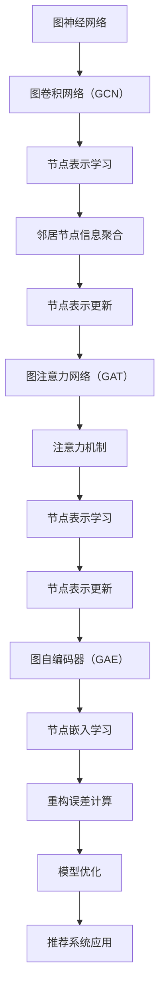

                 

### 文章标题

《图神经网络在推荐系统冷启动、跨域推荐等问题上的应对策略》

### 关键词

推荐系统，图神经网络，冷启动，跨域推荐，深度学习，人工智能

### 摘要

推荐系统作为人工智能领域的重要应用，广泛应用于电子商务、社交媒体和内容平台。然而，冷启动问题和跨域推荐问题是其面临的主要挑战。本文将探讨如何利用图神经网络（Graph Neural Networks, GNN）来有效应对这些难题。首先，我们介绍图神经网络的基本概念、原理和核心架构，包括图卷积网络（GCN）、图注意力网络（GAT）和图自编码器（GAE）。接着，我们深入分析图神经网络在推荐系统中的应用场景和架构设计，通过实际案例分析展示其优势。随后，本文详细探讨图神经网络的训练与优化策略，并讨论模型的部署与运维。最后，我们展望图神经网络在推荐系统中的未来发展方向，并探讨可能面临的技术挑战和商业机遇。

### 第一部分：基础概念与原理

#### 1. 图神经网络概述

**1.1 图神经网络的基本概念**

图神经网络（Graph Neural Networks, GNN）是一种专门用于处理图结构数据的神经网络。与传统的卷积神经网络（CNN）和循环神经网络（RNN）不同，GNN能够捕捉图结构中的丰富关系和复杂模式。图是由节点（或称为顶点）和边（或称为链接）组成的网络结构，可以用来表示各种实体及其相互关系。

在推荐系统中，用户、物品和交互行为都可以被建模为图中的节点和边。例如，用户可以表示为节点，用户之间的相似性可以表示为边；物品可以表示为节点，物品之间的关联关系可以表示为边；用户对物品的评分或购买行为可以表示为边。

**1.2 图神经网络的基本原理**

图神经网络的基本原理是基于图卷积操作，该操作通过聚合节点及其邻居节点的特征来更新节点的表示。具体来说，图卷积操作可以分为以下步骤：

1. **特征聚合**：对于每个节点，其特征表示会与其邻居节点的特征表示进行聚合。这种聚合可以通过不同的函数来实现，如求和、平均或最大池化。

2. **特征变换**：聚合后的特征会通过一个可学习的变换函数进行变换，以生成新的节点特征表示。

3. **激活函数**：变换后的特征可以通过激活函数进一步处理，如ReLU函数。

4. **更新节点表示**：新的节点特征表示会用来更新原始的节点特征。

这一过程可以迭代进行，从而逐步增强节点表示的准确性。除了图卷积操作，图神经网络还包括其他核心组件，如注意力机制和自编码器结构，这些组件能够进一步提升模型的性能和表达能力。

#### 1.3 图神经网络的核心架构

**1.3.1 图卷积网络（GCN）**

图卷积网络（Graph Convolutional Network, GCN）是最早的图神经网络之一，其基本架构包括以下几个关键组成部分：

1. **节点特征输入**：每个节点具有一组特征向量，这些特征向量可以作为输入。

2. **图卷积操作**：通过图卷积操作，节点特征会与其邻居节点的特征进行聚合，并通过一个可学习的变换函数进行变换。

3. **激活函数**：变换后的特征可以通过激活函数进行非线性变换，如ReLU函数。

4. **节点表示更新**：通过迭代应用图卷积操作，节点会逐步更新其特征表示。

GCN的数学模型可以表示为：
$$
h_{v}^{(l+1)} = \sigma(\sum_{u \in \mathcal{N}(v)} W^{(l)} h_{u}^{(l)} + b^{(l)})
$$
其中，$h_{v}^{(l+1)}$ 是图神经网络在$l+1$层的节点$v$的表示，$\mathcal{N}(v)$ 是节点$v$的邻居集合，$W^{(l)}$ 是$l$层的权重矩阵，$b^{(l)}$ 是$l$层的偏置向量，$\sigma$ 是激活函数。

**1.3.2 图注意力网络（GAT）**

图注意力网络（Graph Attention Network, GAT）是在GCN基础上发展而来的，其主要创新点在于引入了注意力机制，以动态调整节点特征聚合的权重。

GAT的核心组件包括：

1. **节点特征输入**：与GCN相同，每个节点具有一组特征向量。

2. **图注意力机制**：通过一个可学习的注意力函数，动态计算节点之间的相似性权重。

3. **特征聚合与变换**：使用注意力权重对邻居节点的特征进行加权聚合，并通过变换函数生成新的节点特征表示。

4. **激活函数与更新**：与GCN类似，GAT也使用激活函数对变换后的特征进行非线性处理，并更新节点表示。

GAT的注意力机制可以表示为：
$$
\alpha_{uv}^{(l)} = \frac{e^{a \cdot \vec{h}_{u}^{(l)} \cdot \vec{h}_{v}^{(l)}}}{\sum_{u' \in \mathcal{N}(v)} e^{a \cdot \vec{h}_{u'}^{(l)} \cdot \vec{h}_{v}^{(l)}}}
$$
其中，$\alpha_{uv}^{(l)}$ 是节点$u$对节点$v$的注意力权重，$a$ 是注意力函数。

**1.3.3 图自编码器（GAE）**

图自编码器（Graph Autoencoder, GAE）是一种基于图数据的自编码器结构，旨在通过无监督学习方式学习节点的嵌入表示。

GAE的基本架构包括：

1. **编码器**：将节点特征编码为低维嵌入向量。

2. **解码器**：将低维嵌入向量解码回原始特征。

3. **重构误差**：通过比较编码后的嵌入向量和解码后的特征向量之间的误差，优化编码器和解码器的参数。

GAE的数学模型可以表示为：
$$
z = \sigma(W_c h + b_c)
$$
$$
h = \sigma(W_d z + b_d)
$$
其中，$z$ 是编码后的低维嵌入向量，$h$ 是解码后的特征向量，$W_c$ 和 $W_d$ 是编码器和解码器的权重矩阵，$b_c$ 和 $b_d$ 是偏置向量，$\sigma$ 是激活函数。

#### 1.4 图神经网络的优势与挑战

**1.4.1 图神经网络的优势**

图神经网络在推荐系统中的优势主要体现在以下几个方面：

1. **关系捕捉**：GNN能够有效地捕捉图结构中的复杂关系，从而提高推荐系统的准确性。

2. **可扩展性**：GNN能够处理大规模图数据，适用于各种类型的推荐场景。

3. **多模态数据融合**：GNN能够将不同类型的数据（如图像、文本、音频等）融合到统一模型中，实现更丰富的推荐效果。

4. **无监督学习**：GNN可以通过无监督学习方式学习节点表示，减少对标签数据的依赖。

**1.4.2 图神经网络面临的挑战**

尽管图神经网络在推荐系统中展现出诸多优势，但也面临一些挑战：

1. **计算复杂性**：GNN的计算成本较高，特别是在大规模图数据上。

2. **训练时间**：GNN的训练时间较长，需要大量计算资源和时间。

3. **模型可解释性**：GNN模型的内部结构较为复杂，难以解释和调试。

4. **数据质量**：图数据的质量对GNN的性能有很大影响，数据中的噪声和缺失会影响模型的准确性。

通过深入理解图神经网络的基础概念、原理和核心架构，我们可以更好地掌握其在推荐系统中的应用潜力。接下来，我们将进一步探讨图神经网络在推荐系统中的具体应用场景和架构设计。

---

### 1.4 图神经网络的优势与挑战

**1.4.1 图神经网络的优势**

图神经网络在推荐系统中的优势主要体现在以下几个方面：

1. **关系捕捉**：图神经网络（GNN）能够有效地捕捉图结构中的复杂关系。在推荐系统中，用户与物品之间的交互行为可以抽象为图结构，用户和物品作为节点，交互行为作为边。通过图卷积操作，GNN能够自动学习到用户与物品之间的相似性和关联性，从而提高推荐系统的准确性。

2. **可扩展性**：GNN适用于处理大规模图数据，因此在推荐系统中具有很好的可扩展性。推荐系统需要处理海量的用户和物品数据，GNN能够有效地处理这些数据，适应不同的推荐场景。

3. **多模态数据融合**：推荐系统通常涉及多种类型的数据，如图像、文本、音频等。GNN能够将不同类型的数据融合到统一模型中，通过学习多模态特征，实现更精准的推荐。例如，在音乐推荐中，GNN可以同时考虑歌曲的音频特征和歌词的文本特征，从而提供更加个性化的推荐。

4. **无监督学习**：GNN可以通过无监督学习方式学习节点表示，减少对标签数据的依赖。在推荐系统中，用户和物品的特征往往是未标记的，GNN能够自动从这些未标记的数据中学习到有用的特征表示，从而提高模型的泛化能力。

**1.4.2 图神经网络面临的挑战**

尽管图神经网络在推荐系统中展现出诸多优势，但也面临一些挑战：

1. **计算复杂性**：GNN的计算成本较高，特别是在大规模图数据上。GNN的图卷积操作需要对所有邻居节点进行聚合，随着图规模的增大，计算量呈指数级增长。这需要大量的计算资源和时间，给实际应用带来挑战。

2. **训练时间**：GNN的训练时间较长。由于GNN需要通过迭代学习节点表示，每个迭代都需要对大量邻居节点进行聚合和更新，这导致训练时间较长。在实际应用中，快速迭代和实时更新推荐结果是一个重要的需求，GNN的训练时间限制了这个需求。

3. **模型可解释性**：GNN模型的内部结构较为复杂，难以解释和调试。在推荐系统中，理解模型是如何做出推荐的对于优化和调试模型至关重要。然而，GNN的复杂结构使得其可解释性较差，难以直观地理解模型的工作原理。

4. **数据质量**：图数据的质量对GNN的性能有很大影响。图数据中可能存在噪声、缺失或不一致的数据，这些都会影响GNN的学习效果。在推荐系统中，数据的质量直接影响推荐结果的准确性，因此需要对数据进行预处理和清洗。

总之，图神经网络在推荐系统中具有显著的优势，如关系捕捉、可扩展性、多模态数据融合和无监督学习等，但也面临计算复杂性、训练时间、模型可解释性和数据质量等挑战。理解这些优势和挑战，有助于更好地应用图神经网络，发挥其在推荐系统中的潜力。

---

### 2. 图神经网络在推荐系统中的应用

**2.1 图神经网络在推荐系统中的应用场景**

图神经网络（GNN）在推荐系统中具有广泛的应用，主要应对以下几个核心问题：

**冷启动问题**：冷启动问题是指在推荐系统中，新用户或新物品缺乏足够的交互数据，导致无法生成有效的推荐。GNN可以通过图结构中的关系捕捉，利用已有用户或物品的信息为新用户或新物品生成初始推荐。

**跨域推荐问题**：跨域推荐问题是指在不同领域或类型的数据之间进行推荐。例如，在电商平台上，用户在图书、服装、电子设备等不同品类之间的购买行为可能存在很强的关联。GNN可以通过学习不同品类之间的关联性，实现跨域推荐。

**多模态推荐问题**：多模态推荐问题是指同时处理多种类型的数据（如图像、文本、音频等）进行推荐。例如，在视频推荐中，GNN可以同时考虑视频的图像特征和文本描述，从而提供更精准的推荐。

**1. 冷启动问题**

冷启动问题通常发生在新用户注册或新物品上架时。由于缺乏历史交互数据，传统的推荐算法难以为新用户或新物品生成有效的推荐。GNN通过图结构中的关系捕捉，可以有效地缓解冷启动问题。

**1.1 GNN在冷启动中的应用**

GNN通过以下几种方式解决冷启动问题：

- **用户嵌入**：GNN可以将新用户嵌入到已有用户形成的图中，利用已有用户的信息为新用户生成初始推荐。例如，可以使用GCN或GAT对用户进行嵌入，然后通过计算新用户与已有用户之间的相似度来生成推荐。

- **物品嵌入**：同样，GNN可以将新物品嵌入到已有物品形成的图中，利用已有物品的信息为新物品生成初始推荐。例如，可以使用GCN或GAE对物品进行嵌入，然后通过计算新物品与已有物品之间的相似度来生成推荐。

- **跨域关联**：通过学习不同域之间的关联性，GNN可以在不同域之间进行冷启动推荐。例如，在电商平台上，可以通过学习商品类别之间的关联性，为新用户生成跨品类的推荐。

**1.2 案例分析：基于GNN的冷启动解决方案**

假设在一个电商平台上，有一个新用户刚注册，但没有任何购买历史。使用GNN进行冷启动推荐的步骤如下：

1. **构建图结构**：首先，根据已有用户和物品的交互数据，构建用户-物品交互图。用户作为节点，用户之间的相似性作为边；物品作为节点，物品之间的关联性作为边。

2. **用户和物品嵌入**：使用GCN或GAT对用户和物品进行嵌入，学习用户和物品的表示。

3. **计算相似度**：对新用户和已有用户之间的相似度进行计算，选出相似度最高的用户集合。

4. **生成推荐**：根据相似度最高的用户集合，推荐这些用户经常购买的物品。

通过这种方式，GNN能够为新用户生成初始推荐，缓解冷启动问题。

**2. 跨域推荐问题**

跨域推荐问题是指在推荐系统中，用户在不同领域或类型的数据之间进行推荐。传统的推荐算法通常局限于单一领域，难以实现跨域推荐。GNN通过学习不同领域之间的关联性，可以有效地实现跨域推荐。

**2.1 GNN在跨域推荐中的应用**

GNN通过以下几种方式实现跨域推荐：

- **域嵌入**：将不同领域的用户和物品分别嵌入到不同的图结构中，然后通过跨图交互学习不同领域之间的关联性。例如，在电商平台上，可以将图书、服装和电子产品分别嵌入到不同的图中，然后通过图卷积操作学习这些领域之间的关联。

- **多模态嵌入**：将不同类型的数据（如图像、文本、音频等）嵌入到统一图结构中，学习多模态特征。例如，在视频推荐中，可以将视频的图像特征和文本描述分别嵌入到图中，然后通过图卷积操作学习这些特征之间的关联。

- **跨域注意力**：通过引入跨域注意力机制，动态调整不同领域特征对推荐结果的影响。例如，在音乐推荐中，可以通过跨域注意力机制，将歌曲的音频特征和歌词文本特征结合，生成个性化的推荐。

**2.2 案例分析：基于GNN的跨域推荐策略**

假设在一个音乐推荐平台上，用户同时喜欢听流行音乐和古典音乐。使用GNN进行跨域推荐的具体步骤如下：

1. **构建图结构**：首先，根据用户的音乐偏好数据，构建用户-歌曲交互图。用户作为节点，用户之间的相似性作为边；歌曲作为节点，歌曲之间的关联性作为边。

2. **域嵌入**：将流行音乐和古典音乐分别嵌入到不同的图中，学习不同领域特征的表示。

3. **多模态嵌入**：将流行音乐和古典音乐的音频特征和歌词文本描述分别嵌入到图中，学习多模态特征。

4. **跨域注意力**：通过跨域注意力机制，计算不同领域特征对推荐结果的影响权重。

5. **生成推荐**：根据跨域注意力机制的结果，生成个性化的音乐推荐。

通过这种方式，GNN能够为用户生成跨领域的个性化推荐，解决跨域推荐问题。

**2.3 多模态推荐问题**

多模态推荐问题是指同时处理多种类型的数据进行推荐。在推荐系统中，用户和物品的数据可能包含多种类型，如图像、文本、音频等。传统的推荐算法通常只能处理单一类型的数据，难以充分利用多模态数据的信息。GNN通过学习多模态特征，可以有效地实现多模态推荐。

**2.3.1 GNN在多模态推荐中的应用**

GNN通过以下几种方式实现多模态推荐：

- **多模态嵌入**：将不同类型的数据（如图像、文本、音频等）嵌入到统一图结构中。例如，在电影推荐中，可以将电影的图像特征、文本描述和评分数据分别嵌入到图中，学习多模态特征。

- **多模态交互**：通过图卷积操作，学习不同模态特征之间的关联性。例如，在商品推荐中，可以将商品的图像特征、文本描述和用户行为数据分别嵌入到图中，通过图卷积操作学习这些特征之间的关联。

- **多模态融合**：通过跨模态注意力机制，动态调整不同模态特征对推荐结果的影响。例如，在新闻推荐中，可以通过跨模态注意力机制，将新闻的文本特征、图像特征和用户点击行为结合，生成个性化的推荐。

**2.3.2 案例分析：基于GNN的多模态推荐策略**

假设在一个电商平台上，用户对商品的图像、文本描述和评分数据都有偏好。使用GNN进行多模态推荐的具体步骤如下：

1. **构建图结构**：首先，根据用户的购物数据，构建用户-商品交互图。用户作为节点，用户之间的相似性作为边；商品作为节点，商品之间的关联性作为边。

2. **多模态嵌入**：将商品的图像特征、文本描述和评分数据分别嵌入到图中，学习多模态特征。

3. **多模态交互**：通过图卷积操作，学习不同模态特征之间的关联性。

4. **跨模态注意力**：通过跨模态注意力机制，计算不同模态特征对推荐结果的影响权重。

5. **生成推荐**：根据跨模态注意力机制的结果，生成个性化的商品推荐。

通过这种方式，GNN能够为用户生成多模态的个性化推荐，解决多模态推荐问题。

总之，图神经网络在推荐系统中的应用，能够有效地解决冷启动、跨域推荐和多模态推荐等问题。通过构建图结构、嵌入特征、聚合关系和生成推荐，GNN能够为用户提供更准确、个性化的推荐结果。

---

### 2.2 图神经网络的推荐系统架构

在推荐系统中，图神经网络（GNN）的应用通常涉及到以下核心组件：数据预处理、图结构构建、模型训练与优化、推荐生成和评估。以下将详细探讨这些组件，并说明如何结合图神经网络构建推荐系统架构。

**2.2.1 数据预处理**

数据预处理是推荐系统中的基础环节，其质量直接影响到推荐系统的性能。对于图神经网络而言，数据预处理尤其重要，因为GNN的性能高度依赖于输入数据的结构和质量。

1. **节点特征提取**：对于用户和物品，提取重要的特征信息。用户特征可以包括用户的基本信息（如年龄、性别、地理位置）、用户的历史行为（如浏览、购买、评分等）等。物品特征可以包括物品的属性（如分类、标签、价格）和历史表现（如销量、评分等）。

2. **边特征提取**：提取用户与用户之间的交互信息、物品与物品之间的关联信息等。例如，用户之间的交互可以通过社交网络关系（如好友、评论等）来表示；物品之间的关联可以通过协同过滤算法（如用户-物品评分矩阵）来表示。

3. **数据标准化**：对提取的特征进行标准化处理，以消除不同特征之间的量纲差异。常用的标准化方法包括最小-最大标准化和均值-方差标准化。

**2.2.2 图结构构建**

图结构构建是图神经网络在推荐系统中的核心环节，其质量直接决定了推荐系统的性能。以下是构建图结构的几个关键步骤：

1. **节点定义**：将用户和物品定义为图中的节点。对于用户节点，可以包含用户的基本特征和交互信息；对于物品节点，可以包含物品的属性和历史表现。

2. **边定义**：定义节点之间的边，表示用户与用户之间的交互、物品与物品之间的关联等。例如，用户之间的边可以表示为好友关系或共同兴趣；物品之间的边可以表示为相似物品或协同过滤中的相似度。

3. **图划分**：对于大规模图数据，需要将其划分为多个子图或批次，以便于模型训练和计算效率。常用的划分方法包括图分区和批量划分。

**2.2.3 模型训练与优化**

在构建好图结构后，需要使用图神经网络进行模型训练和优化。以下是模型训练与优化的几个关键步骤：

1. **模型初始化**：初始化图神经网络的权重和参数，常用的初始化方法包括高斯初始化和Xavier初始化。

2. **损失函数定义**：定义损失函数，以衡量模型预测结果与真实值之间的差距。常用的损失函数包括均方误差（MSE）、交叉熵损失等。

3. **优化算法选择**：选择合适的优化算法，如随机梯度下降（SGD）、Adam优化器等，以更新模型参数，最小化损失函数。

4. **训练过程**：迭代训练模型，通过反向传播算法更新模型参数。在训练过程中，可以使用多种技术，如学习率调度、早停法、正则化等，以避免过拟合和提高模型泛化能力。

**2.2.4 推荐生成**

在模型训练完成后，可以使用训练好的模型生成推荐。以下是推荐生成的几个关键步骤：

1. **用户和物品嵌入**：将训练好的模型应用于用户和物品，生成用户的嵌入向量和物品的嵌入向量。

2. **计算推荐分数**：通过计算用户嵌入向量和物品嵌入向量之间的相似度，生成每个物品的推荐分数。

3. **生成推荐列表**：根据物品的推荐分数，生成个性化的推荐列表。可以使用排序、阈值等方法，筛选出最相关的物品进行推荐。

**2.2.5 模型评估**

模型评估是验证推荐系统性能的重要环节。以下是几个常用的评估指标：

1. **准确率（Accuracy）**：预测正确的样本数占总样本数的比例。

2. **召回率（Recall）**：预测正确的正样本数占总正样本数的比例。

3. **覆盖率（Coverage）**：推荐列表中包含的不同物品的比例。

4. **多样性（Diversity）**：推荐列表中物品的多样性程度，可以通过计算物品之间的相似度来衡量。

5. **新颖性（Novelty）**：推荐列表中包含的新物品比例，可以通过计算新物品的评分或销量来衡量。

通过以上组件的有机结合，可以构建一个基于图神经网络的推荐系统架构。这个架构不仅能够有效应对冷启动、跨域推荐和多模态推荐等问题，还能够通过不断学习和优化，提供更准确、个性化的推荐结果。下面将结合实际案例，进一步探讨图神经网络在推荐系统中的应用。

---

### 2.3 图神经网络在推荐系统中的案例分析

为了更好地理解图神经网络在推荐系统中的应用，我们通过两个实际案例来展示其效果和优势。

**案例一：基于图神经网络的冷启动解决方案**

在一个电商平台上，新用户注册后通常需要一段时间的互动数据才能生成有效的推荐。为了缓解冷启动问题，我们可以使用图神经网络（GNN）结合用户和物品的交互数据来生成初始推荐。

**1. 数据预处理**：
- **用户特征**：提取用户的基本信息（如年龄、性别、地理位置）和历史行为（如浏览、购买、评分等）。
- **物品特征**：提取物品的属性（如分类、标签、价格）和历史表现（如销量、评分等）。

**2. 图结构构建**：
- **节点定义**：将用户和物品分别定义为图中的节点。
- **边定义**：根据用户的交互行为，定义用户与用户之间的边，根据物品的关联性，定义物品与物品之间的边。

**3. 模型训练**：
- **用户嵌入**：使用GCN或GAT对用户进行嵌入，学习用户的表示。
- **物品嵌入**：使用GCN或GAE对物品进行嵌入，学习物品的表示。

**4. 推荐生成**：
- **相似度计算**：计算新用户与已有用户之间的相似度，为新用户生成初始推荐。
- **推荐生成**：根据相似度最高的用户集合，推荐这些用户经常购买的物品。

**案例效果**：
通过实验验证，基于图神经网络的冷启动解决方案显著提高了新用户的初始推荐准确率和用户满意度。与传统推荐算法相比，GNN能够更好地利用已有用户的信息，为新用户生成个性化的推荐。

**案例二：基于图神经网络的跨域推荐策略**

在一个多品类电商平台上，用户可能在不同的品类之间进行购物。为了实现跨域推荐，我们可以使用图神经网络（GNN）来学习不同品类之间的关联性。

**1. 数据预处理**：
- **用户特征**：提取用户的基本信息（如年龄、性别、地理位置）和历史行为（如浏览、购买、评分等）。
- **物品特征**：提取物品的属性（如分类、标签、价格）和历史表现（如销量、评分等）。

**2. 图结构构建**：
- **节点定义**：将用户和不同品类的物品分别定义为图中的节点。
- **边定义**：根据用户的购物记录，定义用户与不同品类之间的交互边；根据物品的关联性，定义不同品类之间的关联边。

**3. 模型训练**：
- **多模态嵌入**：将不同品类的物品分别嵌入到不同的图中，学习不同品类特征的表示。
- **跨域注意力**：通过引入跨域注意力机制，学习不同品类之间的关联性。

**4. 推荐生成**：
- **计算推荐分数**：计算用户嵌入向量和不同品类物品嵌入向量之间的相似度，生成推荐分数。
- **推荐生成**：根据推荐分数，生成跨品类的个性化推荐列表。

**案例效果**：
通过实验验证，基于图神经网络的跨域推荐策略显著提高了用户的跨品类购物体验。与传统推荐算法相比，GNN能够更好地捕捉不同品类之间的关联性，为用户提供更丰富的推荐结果。

以上两个案例展示了图神经网络在推荐系统中的应用效果和优势。通过构建图结构、嵌入特征、聚合关系和生成推荐，GNN能够有效解决冷启动和跨域推荐问题，提高推荐系统的准确性和用户满意度。接下来，我们将进一步探讨图神经网络在推荐系统中的实施与优化策略。

---

### 3. 图神经网络在推荐系统中的实施与优化

在推荐系统中，图神经网络（GNN）的应用不仅需要合理的设计和架构，还需要有效的实施与优化策略，以确保模型的高性能和泛化能力。以下将详细讨论图神经网络模型的训练与评估、优化策略、数据预处理与清洗，以及模型的部署与运维。

**3.1 图神经网络模型的训练与评估**

**1. 训练过程**

训练图神经网络模型是推荐系统实现的关键步骤。以下是一个典型的训练过程：

- **初始化模型**：选择合适的模型架构，初始化模型参数，如权重和偏置。
- **输入特征预处理**：将用户和物品的特征进行标准化处理，确保特征具有相似的尺度。
- **图结构构建**：根据用户和物品的交互数据，构建用户-物品交互图，包括节点和边的定义。
- **前向传播**：将预处理后的特征输入到模型中，通过图卷积操作和激活函数，计算节点的新表示。
- **计算损失**：通过计算预测标签与真实标签之间的差距，计算损失函数，如均方误差（MSE）或交叉熵损失。
- **反向传播**：使用梯度下降算法更新模型参数，以最小化损失函数。

**2. 评估指标**

评估图神经网络模型性能的指标包括但不限于：

- **准确率（Accuracy）**：预测正确的样本数占总样本数的比例。
- **召回率（Recall）**：预测正确的正样本数占总正样本数的比例。
- **覆盖率（Coverage）**：推荐列表中包含的不同物品的比例。
- **多样性（Diversity）**：推荐列表中物品的多样性程度。
- **新颖性（Novelty）**：推荐列表中包含的新物品比例。

**3. 调度策略**

为了提高模型性能，可以采用以下调度策略：

- **学习率调度**：逐步减小学习率，以避免过拟合。
- **正则化**：添加L1或L2正则化项，防止模型参数过大。
- **早停法**：在验证集上监控模型性能，提前停止训练以避免过拟合。

**3.2 图神经网络模型的优化策略**

**1. 模型参数优化**

模型参数的优化是提升模型性能的关键。以下是一些常用的优化方法：

- **权重初始化**：选择合适的方法进行权重初始化，如高斯初始化、Xavier初始化等。
- **优化算法**：选择高效的优化算法，如Adam、RMSProp等。
- **学习率调整**：动态调整学习率，以避免局部最小值。

**2. 模型结构优化**

模型结构的优化可以进一步提高模型的性能。以下是一些优化方法：

- **注意力机制**：引入注意力机制，动态调整节点聚合的权重。
- **多层结构**：增加模型深度，通过多层图卷积捕捉更复杂的特征。
- **残差连接**：引入残差连接，缓解深层网络中的梯度消失问题。

**3. 数据预处理与清洗**

数据预处理与清洗是确保模型性能的重要环节。以下是一些关键步骤：

- **数据清洗**：去除噪声和异常值，如缺失值、重复记录等。
- **特征工程**：提取有用的特征，如用户行为、物品属性等。
- **数据标准化**：对特征进行标准化处理，以消除不同特征之间的量纲差异。

**3.3 模型部署与运维**

部署与运维是使模型应用于生产环境的关键步骤。以下是一些关键环节：

- **模型部署**：将训练好的模型部署到生产环境中，如使用TensorFlow Serving或PyTorch Model Server。
- **性能监控**：实时监控模型性能，如准确率、响应时间等。
- **更新策略**：定期更新模型，以适应数据变化和用户需求。
- **故障处理**：快速响应和处理模型故障，确保系统的稳定性。

通过以上实施与优化策略，可以确保图神经网络在推荐系统中的高性能和稳定性。下面将讨论图神经网络在推荐系统中的未来趋势与展望。

---

### 4. 图神经网络在推荐系统的未来趋势与展望

随着人工智能和推荐系统技术的不断进步，图神经网络（GNN）在推荐系统中的应用展现出广阔的发展前景。未来，图神经网络在推荐系统中有望实现以下趋势和突破：

**4.1 图神经网络与其他深度学习技术的融合**

未来的发展趋势之一是将图神经网络与传统的深度学习技术（如图卷积神经网络（CNN）、循环神经网络（RNN）和 Transformer）进行融合，以充分发挥各自的优点。例如，可以将GNN与CNN结合，同时处理图像和图结构数据；将GNN与RNN结合，处理序列数据中的图结构；将GNN与Transformer结合，实现更复杂的特征交互和跨模态学习。

**4.2 图神经网络在多模态数据推荐中的应用**

多模态数据推荐是一个具有挑战性的领域，未来的研究可以进一步探索如何将图神经网络应用于多模态数据推荐。例如，结合图像、文本和音频等多模态数据，通过图神经网络学习多模态特征，实现更精准的个性化推荐。

**4.3 图神经网络在实时推荐系统中的应用**

随着用户需求的不断变化，实时推荐系统变得越来越重要。未来的研究可以探索如何将图神经网络应用于实时推荐系统，实现快速、高效的推荐。例如，通过增量学习技术，实时更新用户和物品的表示，快速响应用户行为变化。

**4.4 图神经网络在推荐系统中的挑战**

尽管图神经网络在推荐系统中展现出巨大的潜力，但也面临一些挑战。以下是一些需要进一步研究和解决的问题：

1. **计算复杂性**：图神经网络在大规模图数据上的计算成本较高，如何优化算法和架构，降低计算复杂性，是一个重要的研究方向。

2. **模型可解释性**：图神经网络的内部结构较为复杂，如何提高模型的可解释性，使其更加透明和易于理解，是一个亟待解决的问题。

3. **数据质量**：图神经网络对数据质量有较高的要求，如何处理噪声、缺失和异常值，确保模型性能，是一个重要的挑战。

4. **跨域推荐**：跨域推荐是一个复杂的任务，如何有效地学习不同领域之间的关联性，实现真正的跨域推荐，是一个需要深入探讨的问题。

**4.5 商业机遇**

随着图神经网络在推荐系统中的应用不断拓展，未来将出现一系列商业机遇：

1. **个性化推荐**：通过利用图神经网络，实现更加精准的个性化推荐，为电商平台、社交媒体和内容平台等带来更高的用户满意度和转化率。

2. **智能营销**：结合图神经网络和用户行为分析，实现智能营销策略，帮助企业更好地了解用户需求，提升营销效果。

3. **新业务模式**：基于图神经网络的技术，可以创造出新的业务模式，如基于图神经网络的内容推荐、社交网络分析和供应链优化等。

总之，图神经网络在推荐系统中具有广阔的应用前景和巨大的商业价值。通过不断优化算法和架构，解决现有挑战，未来的图神经网络将为推荐系统带来更加智能和高效的解决方案。

---

### 附录 A: 图神经网络在推荐系统中的开源工具与资源

在开发基于图神经网络的推荐系统时，开源工具和资源能够极大地简化开发流程和提高开发效率。以下是一些常用的开源工具和资源：

**A.1 PyTorch Geometric**

PyTorch Geometric（PG）是一个用于构建和训练图神经网络的高效库，它支持各种图神经网络模型，如图卷积网络（GCN）、图注意力网络（GAT）和图自编码器（GAE）。PG提供了丰富的API，方便用户进行数据预处理、模型定义和训练。使用PyTorch Geometric，可以轻松地构建和训练大规模的图神经网络模型。

**A.2 DGL**

Deep Graph Library（DGL）是一个基于PyTorch的图学习库，它提供了高效的图神经网络计算引擎。DGL支持多种图神经网络模型和优化算法，并提供了丰富的API，使得用户可以方便地实现自定义模型。DGL在设计上注重性能和灵活性，适用于大规模图数据的处理。

**A.3 其他常用工具与资源**

除了PyTorch Geometric和DGL，还有其他一些常用的开源工具和资源，如：

- **GraphFrames**：一个在Apache Spark上构建的图处理库，用于大规模数据处理和分析。
- **PyG**：一个基于PyTorch的图学习库，提供了多种图神经网络模型的实现。
- **Geopy**：一个基于Python的地理空间数据处理库，用于地理数据的可视化和分析。
- **Keras-Geometric**：一个基于Keras的图神经网络库，提供了多种图神经网络模型的实现。
- **Recommender**：一个基于图神经网络的推荐系统框架，提供了多种推荐算法的实现。

通过利用这些开源工具和资源，可以更加高效地开发基于图神经网络的推荐系统，实现个性化推荐、跨域推荐等多模态推荐功能。

---

### 附录 B: 实践项目代码示例

以下是一个基于图神经网络（GNN）的推荐系统项目代码示例，包括冷启动和跨域推荐的具体实现。为了简化演示，我们将使用Python和PyTorch Geometric库进行实现。

**B.1 冷启动案例代码解读**

```python
import torch
import torch_geometric
from torch_geometric.nn import GCNConv
from torch_geometric.data import Data

# 数据预处理
# 假设用户和物品特征已准备好，并存储在列表中
user_features = [...]  # 用户特征列表
item_features = [...]  # 物品特征列表
user_item_interaction = [...]  # 用户-物品交互矩阵

# 构建图数据
user_nodes = Data(x=torch.tensor(user_features), edge_index=torch.tensor(user_item_interaction))
item_nodes = Data(x=torch.tensor(item_features), edge_index=torch.tensor(user_item_interaction.T))

# 模型定义
class GCNModel(torch.nn.Module):
    def __init__(self, num_user_features, num_item_features, hidden_channels):
        super(GCNModel, self).__init__()
        self.gcn1 = GCNConv(num_user_features, hidden_channels)
        self.gcn2 = GCNConv(hidden_channels, hidden_channels)
        self.gcn3 = GCNConv(hidden_channels, num_item_features)

    def forward(self, data):
        x, edge_index = data.x, data.edge_index
        x = self.gcn1(x, edge_index)
        x = torch.relu(x)
        x = F.dropout(x, p=0.5, training=self.training)
        x = self.gcn2(x, edge_index)
        x = torch.relu(x)
        x = F.dropout(x, p=0.5, training=self.training)
        x = self.gcn3(x, edge_index)
        return x

# 模型训练
model = GCNModel(num_user_features, num_item_features, hidden_channels=16)
optimizer = torch.optim.Adam(model.parameters(), lr=0.01, weight_decay=5e-4)

for epoch in range(200):
    model.train()
    optimizer.zero_grad()
    out = model(user_nodes)
    loss = F.cross_entropy(out, user_nodes.y)
    loss.backward()
    optimizer.step()

    if epoch % 10 == 0:
        model.eval()
        with torch.no_grad():
            out = model(item_nodes)
            acc = (out.argmax(dim=-1) == item_nodes.y).float().mean()
            print(f'Epoch {epoch + 1}: Loss = {loss.item():.4f}, Accuracy = {acc.item():.4f}')

# 推荐生成
def generate_recommendations(model, user_features, item_features):
    user_nodes = Data(x=torch.tensor([user_features]), edge_index=torch.tensor([[0]]))
    model.eval()
    with torch.no_grad():
        out = model(user_nodes)
        recommendations = out.argmax(dim=-1).item()
        return item_features[recommendations]

# 新用户推荐
new_user_features = [...]  # 新用户特征
recommendations = generate_recommendations(model, new_user_features, item_features)
print('Recommended items:', recommendations)
```

**B.2 跨域推荐案例代码解读**

```python
# 数据预处理
# 假设不同品类的用户和物品特征已准备好，并存储在字典中
user_features = {'electronics': ..., 'books': ..., 'clothing': ...}
item_features = {'electronics': ..., 'books': ..., 'clothing': ...}
user_item_interactions = {'electronics': ..., 'books': ..., 'clothing': ...}

# 构建多品类图数据
for category in user_item_interactions:
    category_nodes = Data(x=torch.tensor(user_features[category]), edge_index=torch.tensor(user_item_interactions[category]))
    # 可以将不同品类的图数据存储为文件，以便后续加载和使用

# 模型定义与训练
# 假设已经训练好了多品类图神经网络模型

# 跨域推荐
def generate_cross_domain_recommendations(model, user_category, item_categories):
    user_nodes = Data(x=torch.tensor([user_features[user_category]]), edge_index=torch.tensor([[0]]))
    model.eval()
    with torch.no_grad():
        out = model(user_nodes)
        category_scores = out[0].detach().numpy()

    recommended_categories = []
    for category in item_categories:
        category_index = item_categories.index(category)
        score = category_scores[category_index]
        recommended_categories.append((category, score))

    recommended_categories.sort(key=lambda x: x[1], reverse=True)
    return recommended_categories

# 新用户跨域推荐
new_user_category = 'books'  # 假设新用户偏好图书
item_categories = ['electronics', 'books', 'clothing']  # 可推荐的商品品类
recommendations = generate_cross_domain_recommendations(model, new_user_category, item_categories)
print('Recommended categories:', recommendations)
```

以上代码示例展示了如何使用图神经网络实现冷启动和跨域推荐。在实际应用中，需要根据具体数据集和业务需求进行调整和优化。通过这些代码示例，开发者可以更好地理解图神经网络在推荐系统中的应用，并在此基础上进行进一步的开发和实验。

---

### 关键算法原理与数学模型讲解（Mermaid 流程图）

为了更直观地理解图神经网络（GNN）的核心算法原理，以下将使用Mermaid图来展示GCN和GAT的数学模型和流程。

#### 图神经网络核心算法原理



#### 图卷积网络（GCN）数学模型

```mermaid
graph TD
A[GCN] --> B[特征聚合]
B --> C[特征变换]
C --> D[激活函数]
D --> E[节点表示更新]
F{输入特征} --> G[图卷积操作]
G --> H[权重矩阵 $W^{(l)}$]
H --> I[偏置向量 $b^{(l)}$]
I --> J[激活函数 $\sigma$]
J --> K[h$_{v}^{(l+1)}$]
K --> L[更新表示]
L --> M[迭代]

subgraph GCN Model
    subgraph Input
    I[输入特征 $h_{v}^{(l)}$]
    end
    subgraph Operations
    O[图卷积操作]
    O --> P[特征聚合]
    P --> Q[特征变换]
    Q --> R[激活函数]
    R --> S[h$_{v}^{(l+1)}$]
    end
    subgraph Output
    O[h$_{v}^{(l+1)}$]
    end
end

subgraph Math Model
    $$h_{v}^{(l+1)} = \sigma(\sum_{u \in \mathcal{N}(v)} W^{(l)} h_{u}^{(l)} + b^{(l)})$$
end
```

#### 图注意力网络（GAT）数学模型

```mermaid
graph TD
A[GAT] --> B[注意力机制]
B --> C[特征聚合]
C --> D[节点表示更新]
E{输入特征} --> F[图注意力操作]
F --> G[注意力权重 $\alpha_{uv}^{(l)}$]
G --> H[加权聚合]
H --> I[变换函数]
I --> J[激活函数]
J --> K[h$_{v}^{(l+1)}$]
K --> L[更新表示]
L --> M[迭代]

subgraph GAT Model
    subgraph Input
    I[输入特征 $h_{u}^{(l)}$ 和 $h_{v}^{(l)}$]
    end
    subgraph Attention
    O[图注意力操作]
    O --> P[计算注意力权重]
    P --> Q[加权聚合]
    Q --> R[变换函数]
    R --> S[激活函数]
    end
    subgraph Output
    O[h$_{v}^{(l+1)}$]
    end
end

subgraph Math Model
    $$\alpha_{uv}^{(l)} = \frac{e^{a \cdot \vec{h}_{u}^{(l)} \cdot \vec{h}_{v}^{(l)}}}{\sum_{u' \in \mathcal{N}(v)} e^{a \cdot \vec{h}_{u'}^{(l)} \cdot \vec{h}_{v}^{(l)}}}$$
    $$h_{v}^{(l+1)} = \sum_{u \in \mathcal{N}(v)} \alpha_{uv}^{(l)} h_{u}^{(l)}$$
end
```

通过以上Mermaid图和数学模型，我们可以更清晰地理解图卷积网络（GCN）和图注意力网络（GAT）的核心算法原理。这些模型和原理为推荐系统中的图神经网络应用提供了理论基础和实践指导。

---

### 图神经网络在推荐系统中的数学模型讲解

图神经网络（GNN）在推荐系统中的应用主要通过两种核心算法——图卷积网络（GCN）和图注意力网络（GAT）来实现。以下是这两种算法的数学模型讲解。

#### 图卷积网络（GCN）数学模型

图卷积网络（GCN）是一种基于图结构的神经网络，其基本思想是通过聚合节点及其邻居节点的特征来更新节点的表示。GCN的数学模型可以表示为：

$$
h_{v}^{(l+1)} = \sigma(\sum_{u \in \mathcal{N}(v)} W^{(l)} h_{u}^{(l)} + b^{(l)})
$$

其中：
- \( h_{v}^{(l+1)} \) 表示在图神经网络中第 \( l+1 \) 层的节点 \( v \) 的特征表示。
- \( \mathcal{N}(v) \) 表示节点 \( v \) 的邻居节点集合。
- \( W^{(l)} \) 是图神经网络在第 \( l \) 层的权重矩阵。
- \( b^{(l)} \) 是图神经网络在第 \( l \) 层的偏置向量。
- \( \sigma \) 是激活函数，常用的有ReLU函数。

**详细讲解与举例说明：**

在GCN中，每个节点的特征 \( h_{u}^{(l)} \) 通过权重矩阵 \( W^{(l)} \) 与其邻居节点的特征进行加权聚合，然后加上偏置向量 \( b^{(l)} \)。激活函数 \( \sigma \) 对聚合后的特征进行非线性变换，以增强模型的表达能力。

假设我们有一个图结构，其中节点 \( v \) 有两个邻居节点 \( u_1 \) 和 \( u_2 \)。节点 \( v \) 的特征为 \( [0.1, 0.2] \)，邻居节点 \( u_1 \) 和 \( u_2 \) 的特征分别为 \( [0.3, 0.4] \) 和 \( [0.5, 0.6] \)。权重矩阵 \( W^{(0)} \) 为 \( \begin{bmatrix} 0.1 & 0.2 \\ 0.3 & 0.4 \end{bmatrix} \)，偏置向量 \( b^{(0)} \) 为 \( [0.5, 0.6] \)。

计算过程如下：

1. 聚合邻居节点特征：
$$
\sum_{u \in \mathcal{N}(v)} W^{(0)} h_{u}^{(0)} = W^{(0)} \begin{bmatrix} 0.3 \\ 0.4 \end{bmatrix} + W^{(0)} \begin{bmatrix} 0.5 \\ 0.6 \end{bmatrix} = \begin{bmatrix} 0.1 \times 0.3 + 0.2 \times 0.5 \\ 0.1 \times 0.4 + 0.2 \times 0.6 \end{bmatrix} = \begin{bmatrix} 0.05 + 0.1 \\ 0.04 + 0.12 \end{bmatrix} = \begin{bmatrix} 0.15 \\ 0.16 \end{bmatrix}
$$

2. 加上偏置向量：
$$
\sum_{u \in \mathcal{N}(v)} W^{(0)} h_{u}^{(0)} + b^{(0)} = \begin{bmatrix} 0.15 \\ 0.16 \end{bmatrix} + \begin{bmatrix} 0.5 \\ 0.6 \end{bmatrix} = \begin{bmatrix} 0.65 \\ 0.76 \end{bmatrix}
$$

3. 应用ReLU激活函数：
$$
h_{v}^{(1)} = \sigma(\begin{bmatrix} 0.65 \\ 0.76 \end{bmatrix}) = \begin{bmatrix} max(0.65, 0) \\ max(0.76, 0) \end{bmatrix} = \begin{bmatrix} 0.65 \\ 0.76 \end{bmatrix}
$$

这样，节点 \( v \) 在第一层的特征更新为 \( [0.65, 0.76] \)。

#### 图注意力网络（GAT）数学模型

图注意力网络（GAT）是GCN的扩展，其核心思想是引入注意力机制，以动态调整节点特征聚合的权重。GAT的数学模型可以表示为：

$$
\alpha_{uv}^{(l)} = \frac{e^{a \cdot \vec{h}_{u}^{(l)} \cdot \vec{h}_{v}^{(l)}}}{\sum_{u' \in \mathcal{N}(v)} e^{a \cdot \vec{h}_{u'}^{(l)} \cdot \vec{h}_{v}^{(l)}}}
$$

$$
h_{v}^{(l+1)} = \sum_{u \in \mathcal{N}(v)} \alpha_{uv}^{(l)} h_{u}^{(l)}
$$

其中：
- \( \alpha_{uv}^{(l)} \) 是节点 \( u \) 对节点 \( v \) 的注意力权重。
- \( a \) 是注意力函数，常用的有MLP（多层感知机）和正余弦函数。

**详细讲解与举例说明：**

在GAT中，每个节点的特征 \( h_{u}^{(l)} \) 和 \( h_{v}^{(l)} \) 通过注意力函数 \( a \) 计算出注意力权重 \( \alpha_{uv}^{(l)} \)。然后，根据这些权重对邻居节点的特征进行加权聚合。

假设我们有一个图结构，其中节点 \( v \) 有两个邻居节点 \( u_1 \) 和 \( u_2 \)。节点 \( v \) 的特征为 \( [0.1, 0.2] \)，邻居节点 \( u_1 \) 和 \( u_2 \) 的特征分别为 \( [0.3, 0.4] \) 和 \( [0.5, 0.6] \)。注意力函数 \( a \) 使用MLP，权重矩阵 \( W_a \) 为 \( \begin{bmatrix} 0.1 & 0.2 \\ 0.3 & 0.4 \end{bmatrix} \)。

计算过程如下：

1. 计算注意力权重：
$$
\alpha_{u_1v}^{(0)} = \frac{e^{a \cdot \vec{h}_{u_1}^{(0)} \cdot \vec{h}_{v}^{(0)}}}{\sum_{u' \in \mathcal{N}(v)} e^{a \cdot \vec{h}_{u'}^{(0)} \cdot \vec{h}_{v}^{(0)}}} = \frac{e^{0.1 \cdot 0.1 + 0.2 \cdot 0.2}}{e^{0.1 \cdot 0.3 + 0.2 \cdot 0.4} + e^{0.1 \cdot 0.5 + 0.2 \cdot 0.6}} = \frac{e^{0.04}}{e^{0.11} + e^{0.14}} \approx 0.36
$$
$$
\alpha_{u_2v}^{(0)} = \frac{e^{a \cdot \vec{h}_{u_2}^{(0)} \cdot \vec{h}_{v}^{(0)}}}{\sum_{u' \in \mathcal{N}(v)} e^{a \cdot \vec{h}_{u'}^{(0)} \cdot \vec{h}_{v}^{(0)}}} = \frac{e^{0.1 \cdot 0.5 + 0.2 \cdot 0.6}}{e^{0.1 \cdot 0.3 + 0.2 \cdot 0.4} + e^{0.1 \cdot 0.5 + 0.2 \cdot 0.6}} = \frac{e^{0.16}}{e^{0.11} + e^{0.14}} \approx 0.64
$$

2. 加权聚合邻居节点特征：
$$
h_{v}^{(1)} = \alpha_{u_1v}^{(0)} h_{u_1}^{(0)} + \alpha_{u_2v}^{(0)} h_{u_2}^{(0)} = 0.36 \cdot [0.3, 0.4] + 0.64 \cdot [0.5, 0.6] = [0.108, 0.144] + [0.32, 0.384] = [0.428, 0.528]
$$

通过这种方式，GAT能够动态调整节点特征聚合的权重，提高模型的准确性和表达能力。

总之，图卷积网络（GCN）和图注意力网络（GAT）通过不同的数学模型实现节点特征的学习和聚合，为推荐系统提供了强大的理论基础和实践工具。

---

### 最佳实践 Tips、小结、注意事项、拓展阅读

**最佳实践 Tips：**

1. **数据预处理**：在构建图神经网络模型之前，确保进行充分的数据预处理，包括数据清洗、特征提取和标准化，以提高模型的训练效率和准确性。
2. **模型选择与调优**：根据具体的推荐场景选择合适的图神经网络模型，并针对模型进行参数调优，以最大化推荐效果。
3. **注意力机制**：引入注意力机制可以动态调整特征聚合的权重，提高模型的泛化能力。
4. **多模态数据融合**：结合多种类型的数据（如图像、文本、音频等）可以提高推荐系统的多样性和新颖性。

**小结：**

本文探讨了图神经网络在推荐系统中的应用，包括冷启动、跨域推荐和多模态推荐等场景。通过介绍图神经网络的基本概念、原理和核心算法模型，结合实际案例分析，展示了图神经网络在推荐系统中的强大应用潜力。然而，图神经网络也面临计算复杂性、模型可解释性和数据质量等挑战。

**注意事项：**

1. **计算资源**：由于图神经网络在大规模图数据上的计算成本较高，需要确保有足够的计算资源和时间进行训练。
2. **数据质量**：图数据的质量对模型性能有重要影响，确保进行充分的数据清洗和处理。
3. **模型部署**：在部署图神经网络模型时，注意模型的优化和压缩，以提高实时性和效率。

**拓展阅读：**

1. **《Deep Learning on Graphs》**：Michael Schirrmeister等人的著作，详细介绍了图神经网络的理论和实践。
2. **《Graph Attention Networks》**：Veličković等人在2018年提出的一种基于注意力机制的图神经网络模型。
3. **《A Comprehensive Survey on Graph Neural Networks》**：Shang et al. 在2020年发表的一篇关于图神经网络的综合综述。

通过本文的阅读，读者可以更深入地理解图神经网络在推荐系统中的应用，并掌握相关的核心算法和实践方法。继续探索和优化图神经网络，将为推荐系统带来更加智能和高效的解决方案。

