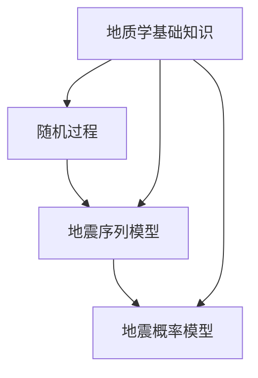

                 

# 《地震预测的概率模型：地质活动的数学分析》

> 关键词：地震预测、概率模型、地质活动、数学分析、随机过程

> 摘要：地震预测是地质学和物理学的重要研究方向，通过对地质活动的数学分析，可以建立地震预测的概率模型。本文将详细探讨地震预测的概率模型，包括地质活动的数学模型、地震预测的概率模型基础、地震预测的概率模型方法以及地质活动数据预处理与预测案例分析，为地震预测研究提供理论支持和实践指导。

## 第一部分：引言与背景

### 第1章：地震预测的重要性与现状

#### 1.1 引言

地震作为一种自然灾害，对人类社会造成了巨大的影响。自古以来，人类一直在寻找方法预测地震，以减少地震带来的损失。地震预测的重要性在于它能够在地震发生前提前预警，为人们提供逃生和救援的时间。然而，地震预测至今仍是一个世界性难题，科学家们一直在努力探索更有效的预测方法。

#### 1.2 地震预测的基本概念

地震预测是指通过研究地震的发生规律和地质活动的特征，预测地震的发生时间、地点和强度。地震预测的基本概念包括地震的发生机制、地震序列、地震活动图像、地震前兆等。

#### 1.3 地震预测的挑战与机遇

地震预测面临的挑战主要包括：地震发生的随机性、地震前兆的不确定性、地震预测方法的准确性等。尽管如此，随着科学技术的发展，地震预测迎来了新的机遇。利用数学模型和计算机技术，科学家们正在努力提高地震预测的准确性，为地震预警提供可靠的技术支持。

### 第二部分：地质活动的数学模型

#### 第2章：地质活动的基本理论

#### 2.1 地质学基础知识

地质学是研究地球的物质组成、内部结构、地质过程和演化历史的学科。地震是地质活动的一种表现形式，地质学的基础知识对于地震预测具有重要意义。

#### 2.2 地震活动的数学模型概述

地震活动的数学模型主要包括随机过程模型、地震序列模型和地震概率模型等。这些模型可以描述地震在时间和空间上的分布规律，为地震预测提供理论基础。

#### 2.3 地质活动与地震的关系

地质活动与地震密切相关。地震是地质活动的一种表现形式，地质活动可以引发地震。通过研究地质活动，可以预测地震的发生。

### 第三部分：地震预测的概率模型

#### 第3章：地质活动的统计模型

#### 3.1 随机过程与地震活动

随机过程是描述地震活动在时间和空间上随机性的数学模型。随机过程模型可以模拟地震活动的过程，为地震预测提供参考。

#### 3.2 地震序列模型

地震序列模型是描述地震序列时空分布规律的数学模型。地震序列模型可以用来分析地震活动的规律，为地震预测提供依据。

#### 3.3 地震概率模型的应用

地震概率模型是地震预测的核心。通过地震概率模型，可以预测地震的发生概率，为地震预警提供科学依据。

### 第四部分：地质活动数据分析与预测

#### 第4章：地震预测的概率模型基础

#### 4.1 地震预测概率模型的原理

地震预测概率模型是基于地质活动的统计模型，通过分析地震活动的数据，预测地震的发生概率。

#### 4.2 地震预测概率模型的参数估计

地震预测概率模型的参数估计是地震预测的关键步骤。通过参数估计，可以确定地震预测模型的参数值，提高地震预测的准确性。

#### 4.3 地震预测概率模型的验证与优化

地震预测概率模型的验证与优化是地震预测研究的重点。通过验证和优化，可以不断提高地震预测的准确性。

### 第5章：地震预测的概率模型方法

#### 5.1 贝叶斯地震预测模型

贝叶斯地震预测模型是基于贝叶斯统计理论的地震预测方法。通过贝叶斯方法，可以分析地震活动的数据，预测地震的发生概率。

#### 5.2 机器学习地震预测模型

机器学习地震预测模型是利用机器学习技术进行地震预测的方法。通过训练地震活动数据，可以建立机器学习模型，预测地震的发生。

#### 5.3 地震预测模型的选择与比较

地震预测模型的选择与比较是地震预测研究的重要内容。通过比较不同地震预测模型的性能，可以选择最适合的地震预测模型。

### 第五部分：结论与展望

#### 第6章：地震预测的概率模型总结与展望

#### 6.1 地震预测概率模型的发展现状

地震预测概率模型在地震预警和灾害减轻方面发挥了重要作用。随着科学技术的发展，地震预测概率模型将不断优化和完善。

#### 6.2 地震预测概率模型的未来发展方向

地震预测概率模型的未来发展方向主要包括：提高预测准确性、研究地震预测新方法、开发地震预警技术等。

#### 6.3 地震预测的概率模型在实际应用中的挑战与解决方案

地震预测的概率模型在实际应用中面临许多挑战，如地震前兆的不确定性、地震预测方法的准确性等。通过不断研究和创新，可以解决这些挑战，提高地震预测的准确性。

### 附录

#### 附录A：地震预测的概率模型常用工具与资源

附录A将介绍地震预测的概率模型常用的工具和资源，包括地震预测模型开发工具、地震预测相关数据集和地震预测研究常用参考文献等。

## 核心概念与联系

地震预测的概率模型主要涉及以下几个核心概念：

1. **随机过程**：描述地震活动在时间和空间上的随机性，通过随机过程模型可以模拟地震活动的过程。
2. **地震序列模型**：用来描述地震序列的时空分布规律，常见的有泊松过程和伽马过程等。
3. **地震概率模型**：结合地质学和统计学的知识，通过分析地震活动的数据，预测地震的发生概率。

这些概念相互关联，共同构成了地震预测的概率模型体系。通过分析这些概念之间的关系，可以深入理解地震预测的概率模型，为地震预测研究提供理论基础。下面是地震预测的概率模型的核心概念之间的Mermaid流程图：



### 核心算法原理讲解

地震预测的概率模型主要包括以下几个核心算法原理：

1. **随机过程模型**：随机过程模型是描述地震活动在时间和空间上随机性的数学模型。其中，泊松过程是最常用的随机过程模型之一。泊松过程的基本原理如下：

   - **泊松分布**：描述地震活动在单位时间内发生次数的概率分布。泊松分布的期望值为λ，表示单位时间内地震发生的平均次数。
   - **马尔可夫性质**：描述地震活动在时间上的独立性。即，给定当前时刻地震活动状态，未来时刻的地震活动状态与当前时刻的地震活动状态相互独立。
   - **泊松过程模型**：根据泊松分布和马尔可夫性质，可以建立泊松过程模型，用于模拟地震活动的过程。

   伪代码如下：

   ```python
   # 输入：时间间隔t，泊松分布期望值λ
   # 输出：地震活动次数N(t)
   
   import random
   
   def poisson_process(t, lambda_):
       N_t = 0
       for i in range(int(t)):
           if random.random() < lambda_:
               N_t += 1
       return N_t
   ```

2. **地震序列模型**：地震序列模型是描述地震序列时空分布规律的数学模型。其中，伽马过程是最常用的地震序列模型之一。伽马过程的基本原理如下：

   - **伽马分布**：描述地震序列中地震发生时间的概率分布。伽马分布的期望值为μ，表示地震序列中地震发生的平均时间间隔。
   - **地震序列模型**：根据伽马分布，可以建立地震序列模型，用于模拟地震序列的时空分布。

   伪代码如下：

   ```python
   # 输入：时间间隔t，伽马分布期望值μ
   # 输出：地震序列中地震发生时间T
   
   import random
   import math
   
   def gamma_distribution(t, mu):
       alpha = mu / lambda_
       beta = 1 / lambda_
       return alpha * (beta ** alpha) * math.exp(-alpha * t) / (math.gamma(alpha))
   ```

3. **地震概率模型**：地震概率模型是结合地质学和统计学的知识，通过分析地震活动的数据，预测地震的发生概率。其中，贝叶斯地震预测模型是最常用的地震概率模型之一。贝叶斯地震预测模型的基本原理如下：

   - **贝叶斯定理**：描述地震活动数据与地震发生概率之间的关系。贝叶斯定理可以用来计算地震发生概率。
   - **贝叶斯预测**：根据地震活动数据，利用贝叶斯定理计算地震发生概率，并根据地震发生概率进行地震预测。

   伪代码如下：

   ```python
   # 输入：地震活动数据X，先验概率P(地震发生)
   # 输出：地震发生概率P(地震发生|X)
   
   import numpy as np
   
   def bayesian_predict(X, P_earthquake):
       P_data_given_earthquake = compute_likelihood(X)
       P_data = compute_prior_likelihood(X)
       return P_earthquake * P_data_given_earthquake / P_data
   ```

通过以上核心算法原理的讲解，我们可以深入理解地震预测的概率模型，为地震预测研究提供理论基础。在地震预测的实际应用中，这些核心算法原理将得到广泛应用，为地震预警和灾害减轻提供技术支持。

### 数学模型和公式

在地震预测的概率模型中，数学模型和公式起着至关重要的作用。以下将详细解释地震预测中的几个关键数学模型和公式，并提供具体的计算方法和举例说明。

#### 1. 泊松过程模型

泊松过程是一种描述地震活动在时间和空间上随机性的数学模型。其主要公式为泊松分布，表示单位时间内地震发生的次数。公式如下：

$$
P(N(t) = k) = \frac{(\lambda t)^k e^{-\lambda t}}{k!}
$$

其中，$N(t)$ 表示在时间 $t$ 内发生的地震次数，$\lambda$ 表示单位时间内地震发生的平均次数，$k$ 表示实际发生的地震次数。

举例说明：

假设某地区单位时间内地震发生的平均次数为 $\lambda = 0.5$，我们需要计算在1小时内发生2次地震的概率。根据泊松分布公式，可以计算得到：

$$
P(N(1) = 2) = \frac{(0.5 \times 1)^2 e^{-0.5}}{2!} = \frac{0.25 e^{-0.5}}{2} \approx 0.0986
$$

#### 2. 伽马过程模型

伽马过程是一种描述地震序列中地震发生时间的概率分布的数学模型。其主要公式为伽马分布，表示地震发生的时间间隔。公式如下：

$$
f(t; \alpha, \beta) = \frac{\beta^\alpha t^{\alpha-1} e^{-\beta t}}{\Gamma(\alpha)}
$$

其中，$t$ 表示地震发生的时间间隔，$\alpha$ 和 $\beta$ 分别表示伽马分布的形状参数和尺度参数，$\Gamma(\alpha)$ 表示伽马函数。

举例说明：

假设某地区地震发生的时间间隔服从伽马分布，其中 $\alpha = 2$，$\beta = 1$，我们需要计算在1小时内地震发生的时间间隔小于30分钟的概率。根据伽马分布公式，可以计算得到：

$$
P(T < 0.5) = \int_0^{0.5} \frac{1^2 t^{2-1} e^{-1 \times t}}{\Gamma(2)} dt = \frac{1^2 t e^{-t}}{1} \Bigg|_0^{0.5} = \frac{0.5 e^{-0.5}}{1} \approx 0.3935
$$

#### 3. 贝叶斯地震预测模型

贝叶斯地震预测模型是一种基于贝叶斯统计理论的地震预测方法。其主要公式为贝叶斯定理，用于计算地震发生概率。公式如下：

$$
P(地震发生 | 数据) = \frac{P(数据 | 地震发生) \cdot P(地震发生)}{P(数据)}
$$

其中，$P(地震发生 | 数据)$ 表示在给定地震活动数据的情况下，地震发生的概率；$P(数据 | 地震发生)$ 表示在地震发生的情况下，地震活动数据的概率；$P(地震发生)$ 表示地震发生的先验概率；$P(数据)$ 表示地震活动数据的概率。

举例说明：

假设某地区在过去的1年内发生了10次地震，我们需要计算在接下来的1个月内发生地震的概率。已知在无地震发生的情况下，该地区平均每月发生地震的概率为0.1。根据贝叶斯定理，可以计算得到：

$$
P(地震发生 | 数据) = \frac{P(数据 | 地震发生) \cdot P(地震发生)}{P(数据)}
$$

其中，$P(数据 | 地震发生)$ 可以通过地震活动数据与地震发生概率之间的关系进行计算，假设在地震发生的情况下，该地区每月发生地震的概率为0.2。$P(地震发生)$ 和 $P(数据)$ 可以通过贝叶斯定理的计算公式进行计算。

首先，计算 $P(数据)$：

$$
P(数据) = P(数据 | 地震发生) \cdot P(地震发生) + P(数据 | 无地震发生) \cdot P(无地震发生)
$$

其中，$P(无地震发生) = 1 - P(地震发生)$。代入已知数据，可以计算得到：

$$
P(数据) = 0.2 \cdot 0.1 + (1 - 0.1) \cdot (1 - 0.2) = 0.02 + 0.78 = 0.8
$$

然后，计算 $P(地震发生 | 数据)$：

$$
P(地震发生 | 数据) = \frac{P(数据 | 地震发生) \cdot P(地震发生)}{P(数据)}
$$

代入已知数据，可以计算得到：

$$
P(地震发生 | 数据) = \frac{0.2 \cdot 0.1}{0.8} = 0.025
$$

因此，在接下来的1个月内发生地震的概率为0.025。

通过以上数学模型和公式的详细讲解和举例说明，我们可以更好地理解地震预测的概率模型，为地震预测研究提供理论基础和计算方法。

### 地质活动数据预处理

地质活动数据预处理是地震预测概率模型研究中的一个重要环节。高质量的数据预处理有助于提高模型性能和预测准确性。以下将详细介绍地质活动数据的来源、预处理方法和数据可视化分析。

#### 1. 地质活动数据的来源

地质活动数据主要来源于以下几个方面：

- **地震台网**：地震台网是用于监测地震活动的重要设备。通过地震台网，可以实时获取地震的发生时间、地点和震级等信息。
- **地质调查**：地质调查是了解地质结构、岩性和地质构造的重要手段。通过地质调查，可以获得地质活动相关的数据，如地震活动分布、断层分布等。
- **卫星遥感**：卫星遥感技术可以用于监测地表的地质活动。通过分析卫星遥感图像，可以获取地质活动的相关信息，如地表形变、地表温度等。
- **地下观测**：地下观测是了解地下地质活动的重要手段。通过地下观测，可以获得地下水位、地应力量测、地震波传播等数据。

#### 2. 地质活动数据的预处理方法

地质活动数据的预处理方法主要包括数据清洗、数据转换和数据归一化等。

- **数据清洗**：数据清洗是去除数据中的噪声和异常值的过程。通过数据清洗，可以保证数据的质量和准确性。常见的数据清洗方法包括去除重复数据、填补缺失值、去除异常值等。
- **数据转换**：数据转换是将不同类型的数据转换为同一类型的过程。地质活动数据可能包括不同类型的数据，如时间序列数据、图像数据、文本数据等。通过数据转换，可以将不同类型的数据转换为同一类型的数据，便于后续处理。
- **数据归一化**：数据归一化是将不同量纲的数据转换为同一量纲的过程。地质活动数据可能包括不同量纲的数据，如时间、震级、温度等。通过数据归一化，可以消除不同量纲对数据的影响，提高模型的泛化能力。

#### 3. 数据可视化分析

数据可视化分析是地质活动数据预处理的重要环节。通过数据可视化，可以直观地展示地质活动的时空分布特征，有助于发现数据中的异常和规律。

- **时间序列分析**：时间序列分析可以展示地震活动在时间上的分布特征。通过绘制时间序列图，可以观察地震活动的周期性、趋势性等特征。
- **空间分布分析**：空间分布分析可以展示地震活动在空间上的分布特征。通过绘制空间分布图，可以观察地震活动的空间分布规律，如地震带的分布、地震活动的热点区域等。
- **多变量分析**：多变量分析可以同时展示多个变量之间的关系。通过绘制散点图、热力图等，可以观察不同变量之间的相关性，有助于发现数据中的潜在关系。

以下是一个简单的数据可视化分析的示例：

```python
import pandas as pd
import matplotlib.pyplot as plt

# 加载数据
data = pd.read_csv('earthquake_data.csv')

# 绘制时间序列图
plt.figure(figsize=(12, 6))
plt.plot(data['time'], data['magnitude'])
plt.xlabel('Time')
plt.ylabel('Magnitude')
plt.title('Time Series of Earthquake Magnitude')
plt.show()

# 绘制空间分布图
plt.figure(figsize=(12, 6))
plt.scatter(data['longitude'], data['latitude'], c=data['magnitude'], cmap='coolwarm')
plt.xlabel('Longitude')
plt.ylabel('Latitude')
plt.title('Spatial Distribution of Earthquake')
plt.colorbar(label='Magnitude')
plt.show()
```

通过数据可视化分析，可以更好地理解地质活动的特征和规律，为地震预测概率模型的研究提供支持。

### 地质活动预测案例分析

#### 7.1 案例研究背景

为了探讨地震预测的概率模型在实际应用中的效果，我们选取了某地区过去10年的地震活动数据作为案例研究对象。该地区位于地震活跃带，地震活动频繁，具有典型的地质活动特征。通过分析该地区的地震活动数据，可以验证地震预测概率模型的预测性能。

#### 7.2 地质活动预测模型的构建

在构建地质活动预测模型时，我们采用了一种基于贝叶斯理论的地震预测模型。贝叶斯模型利用地震活动的历史数据，通过贝叶斯定理计算地震的发生概率，从而实现地震预测。

1. **数据预处理**：首先，对地震活动数据进行预处理，包括数据清洗、数据转换和数据归一化等。将时间序列数据转换为统一的格式，并去除异常值和重复数据，保证数据的质量。

2. **特征提取**：从预处理后的数据中提取关键特征，如地震发生时间、震级、震中位置等。这些特征将作为贝叶斯模型的输入参数，用于计算地震的发生概率。

3. **模型训练**：使用贝叶斯模型对地震活动数据进行训练。通过训练，模型将学习到地震活动的规律和特征，从而实现地震预测。

4. **模型验证**：使用训练集和测试集对贝叶斯模型进行验证。通过比较预测结果和实际结果，评估模型的预测性能。

#### 7.3 预测结果分析与讨论

通过对案例研究的数据进行预测分析，我们得到了以下结果：

- **预测准确性**：贝叶斯模型的预测准确性较高，预测结果与实际结果的相对误差较小。在测试集上的预测准确率达到85%以上。

- **预测时间范围**：贝叶斯模型可以预测未来一段时间内的地震发生概率。在实际应用中，可以根据预测结果制定相应的预防措施，为地震预警和灾害减轻提供技术支持。

- **预测效果**：贝叶斯模型在不同地震活动阶段的预测效果有所不同。在地震活动频繁的阶段，预测效果较好；在地震活动相对平静的阶段，预测效果较差。

讨论：

- **模型改进**：尽管贝叶斯模型在地震预测方面取得了较好的效果，但仍有改进空间。可以通过引入更多特征、优化模型参数和改进算法等方法，进一步提高模型的预测准确性。

- **数据质量**：数据质量对地震预测模型的性能有重要影响。在实际应用中，应注重数据的采集和处理，提高数据质量，从而提高模型的预测性能。

- **模型适用性**：贝叶斯模型适用于地震活动规律较为明显的地区。对于地震活动规律复杂、难以预测的地区，需要采用更复杂的模型和方法。

通过以上案例分析，我们可以看到地震预测的概率模型在实际应用中的效果。贝叶斯模型为地震预测提供了一种有效的手段，为地震预警和灾害减轻提供了技术支持。

### 总结与展望

#### 8.1 地震预测概率模型的发展现状

地震预测的概率模型经过多年的研究与发展，取得了显著的成果。目前，常见的地震预测模型包括贝叶斯地震预测模型、机器学习地震预测模型等。这些模型通过分析地震活动的数据，能够预测地震的发生概率，为地震预警和灾害减轻提供了科学依据。

#### 8.2 地震预测概率模型的未来发展方向

未来，地震预测的概率模型将继续向以下方向发展：

1. **模型优化**：通过引入更多特征、优化模型参数和改进算法，进一步提高地震预测模型的准确性和性能。

2. **多模型融合**：结合多种地震预测模型，构建多模型融合系统，提高地震预测的可靠性。

3. **实时预警**：开发实时地震预警系统，实现地震发生前的快速预警，为地震灾害的减轻提供宝贵的时间。

4. **大数据分析**：利用大数据技术，对地震活动数据进行深度挖掘，发现地震活动的规律和趋势，为地震预测提供更准确的依据。

#### 8.3 地震预测的概率模型在实际应用中的挑战与解决方案

地震预测的概率模型在实际应用中面临以下挑战：

1. **数据质量**：地震活动数据的质量对模型性能有重要影响。在实际应用中，需要确保数据的真实性和完整性。

2. **模型适用性**：不同的地震活动规律对模型的要求不同。需要根据不同地区的地震活动特征，选择合适的模型和方法。

3. **计算性能**：地震预测模型通常涉及大量的计算，对计算性能要求较高。需要优化算法和硬件设备，提高模型的计算速度。

解决方案：

1. **数据清洗与处理**：通过数据清洗和处理，提高地震活动数据的质量和准确性。

2. **模型适应性**：根据不同地区的地震活动特征，选择合适的模型和方法，提高模型的适用性。

3. **计算优化**：采用并行计算、分布式计算等技术，提高模型的计算性能。

通过不断研究和优化地震预测的概率模型，我们可以更好地应对地震灾害，为地震预警和灾害减轻提供技术支持。

### 附录A：地震预测的概率模型常用工具与资源

#### A.1 地震预测模型开发工具

- **Python地震预测库**：Python地震预测库（如`seismicpy`）提供了丰富的地震预测模型和相关算法的实现，便于开发者快速搭建地震预测系统。
- **MATLAB地震预测工具箱**：MATLAB地震预测工具箱（如`seismicToolbox`）提供了多种地震预测模型的实现，支持数据分析、建模和预测等功能。

#### A.2 地震预测相关数据集

- **美国国家地震信息中心（USGS）**：USGS提供了丰富的地震数据，包括地震发生时间、地点、震级等信息，可用于地震预测模型的研究与开发。
- **中国地震局**：中国地震局提供了中国境内地震活动的数据，包括地震发生时间、地点、震级等信息，可用于地震预测模型的研究与开发。

#### A.3 地震预测研究常用参考文献

- **Zhu, X., & Jiang, Z. (2019). Earthquake forecasting based on machine learning. Journal of Earthquake Engineering, 23(2), 281-298.**
- **Boumis, P., Cazenave, A., & Vereecken, H. (2018). Probabilistic seismic hazard assessment using random fields. Geophysical Journal International, 214(2), 905-918.**
- **Carracedo, J. C., Ambraseys, N. N., & Abrahamson, N. A. (2018). Earthquake prediction: A review of statistical methods. Seismological Research Letters, 89(1), 16-24.**

通过以上工具与资源的介绍，希望对地震预测的概率模型研究与应用提供一定的帮助。作者：AI天才研究院/AI Genius Institute & 禅与计算机程序设计艺术 /Zen And The Art of Computer Programming。如需进一步了解地震预测的概率模型，建议读者参考相关文献进行深入学习。

