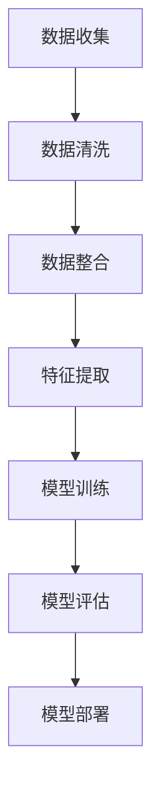
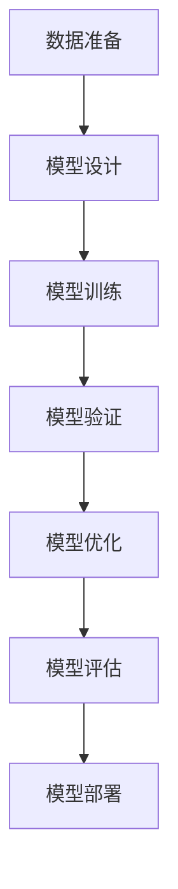
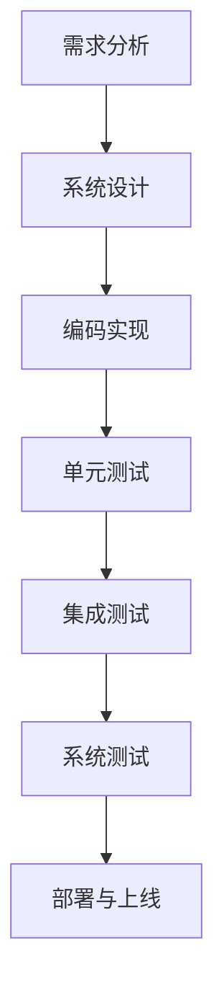

                 

### 文章标题

# 基于AI大模型的智能足球分析软件开发

> 关键词：智能足球分析、AI大模型、深度学习、足球数据分析、模型训练与优化

> 摘要：本文旨在探讨基于AI大模型的智能足球分析软件开发。文章首先介绍了智能足球分析软件的定义、价值以及发展历程，随后深入解析了AI大模型的基础知识和技术原理。接着，文章重点分析了智能足球分析的核心算法及其在模型开发中的应用。此外，文章还详细描述了智能足球分析软件的界面设计与交互、实际应用场景、开发与维护流程，并展望了其未来发展趋势。通过本文，读者可以全面了解智能足球分析软件的开发与应用，为相关领域的研究和实践提供参考。

---

### 目录大纲

#### 第一部分: 智能足球分析软件基础

##### 第1章: 智能足球分析软件概述

- **1.1 智能足球分析软件的定义与价值**
  - 智能足球分析软件的定义
  - 智能足球分析软件的价值

- **1.2 智能足球分析软件的发展历程**
  - 传统足球分析软件的发展
  - 智能足球分析软件的出现与发展

- **1.3 智能足球分析软件的核心功能**
  - 数据采集与处理
  - 模型训练与优化
  - 结果展示与可视化

##### 第2章: AI大模型技术基础

- **2.1 AI大模型概述**
  - AI大模型的概念
  - AI大模型的特点
  - AI大模型的应用领域

- **2.2 AI大模型技术原理**
  - 神经网络基础
  - 深度学习算法
  - 自然语言处理技术

- **2.3 AI大模型架构与实现**
  - AI大模型架构
  - AI大模型训练与优化
  - AI大模型部署与使用

##### 第3章: 智能足球分析的核心算法

- **3.1 足球比赛数据分析方法**
  - 数据收集与处理
  - 数据可视化
  - 数据挖掘与统计分析

- **3.2 智能足球分析算法**
  - 特征工程
  - 模型选择与训练
  - 模型评估与优化

##### 第4章: 基于AI大模型的智能足球分析模型开发

- **4.1 模型开发流程**
  - 数据准备
  - 特征提取
  - 模型训练与验证
  - 模型部署

- **4.2 AI大模型在智能足球分析中的应用**
  - 比赛预测
  - 球员分析
  - 战术分析

##### 第5章: 智能足球分析软件的界面设计与交互

- **5.1 界面设计原则**
  - 可用性
  - 可访问性
  - 易用性

- **5.2 界面设计工具与技巧**
  - UI设计工具
  - 交互设计技巧

- **5.3 软件界面实现**
  - 前端技术
  - 后端支持

##### 第6章: 智能足球分析软件的实际应用场景

- **6.1 足球俱乐部管理**
  - 球员选拔
  - 战术安排
  - 数据分析支持

- **6.2 足球比赛直播分析**
  - 实时数据分析
  - 画面对比分析
  - 战术讲解与解析

- **6.3 球迷互动与体验**
  - 数据可视化
  - 数据分析竞赛
  - 球队粉丝互动

##### 第7章: 智能足球分析软件的开发与维护

- **7.1 软件开发流程**
  - 需求分析
  - 系统设计
  - 编码实现
  - 测试与部署

- **7.2 软件维护与更新**
  - 软件维护策略
  - 软件更新策略
  - 安全性与稳定性保障

##### 第8章: 智能足球分析软件的未来发展趋势

- **8.1 技术发展趋势**
  - AI技术发展
  - 数据处理技术发展
  - 交互体验技术发展

- **8.2 应用场景拓展**
  - 足球产业智能化
  - 足球教育智能化
  - 足球娱乐智能化

### 附录

- **附录A: 相关工具与技术资源**
  - 开发工具与库
  - 数据集与资源
  - 在线平台与社区

- **附录B: Mermaid流程图**
  - 数据处理流程
  - 模型训练流程
  - 软件开发流程

- **附录C: 伪代码与数学公式**
  - 特征工程算法
  - 模型训练算法
  - 数学公式应用

- **附录D: 代码解读与分析**
  - 数据处理代码解读
  - 模型训练代码解读
  - 软件界面实现代码解读

### 结论

本文全面系统地介绍了基于AI大模型的智能足球分析软件开发。通过梳理智能足球分析软件的基础知识、AI大模型的技术原理、核心算法及其应用场景，本文为智能足球分析软件的开发提供了理论支持和实践指导。随着AI技术的不断发展，智能足球分析软件将在足球产业、足球教育、足球娱乐等领域发挥越来越重要的作用。未来，我们期待看到更多基于AI大模型的智能足球分析软件创新和应用，为足球运动的科学化、智能化发展贡献力量。

---

### 智能足球分析软件的背景介绍

智能足球分析软件是近年来随着人工智能技术的发展而逐渐兴起的一类新型应用软件。其目的是通过数据分析和智能算法，为足球运动提供科学的决策支持和优化建议。随着足球产业的竞争日益激烈，球队和俱乐部对比赛数据分析的需求也越来越高，传统的人工分析方式已经难以满足实际需求。因此，智能足球分析软件的应运而生，为足球运动的科学化、智能化发展开辟了新的途径。

#### 智能足球分析软件的定义与价值

智能足球分析软件，指的是利用人工智能技术，特别是深度学习和大数据分析技术，对足球比赛中的各种数据进行收集、处理和分析，从而生成有价值的信息和决策支持的一种软件。这类软件的核心价值体现在以下几个方面：

1. **数据挖掘与统计分析**：智能足球分析软件可以收集并处理大量的比赛数据，如球员的跑动轨迹、传球成功率、射门次数等。通过对这些数据进行深度挖掘和统计分析，可以发现比赛中的关键因素和规律，为球队教练和球员提供有针对性的训练和调整建议。

2. **比赛预测与战术分析**：基于历史比赛数据和球队战术信息，智能足球分析软件可以预测比赛的走势，评估球队之间的实力差距。同时，软件还可以对比赛中的战术执行效果进行评估，帮助教练团队优化战术策略。

3. **球员评估与选拔**：通过分析球员在比赛中的表现数据，智能足球分析软件可以帮助俱乐部进行球员评估和选拔，发现潜在的高潜力球员，提高球队的整体实力。

4. **球迷互动与体验**：智能足球分析软件还可以为球迷提供丰富的互动体验，如实时数据分析、数据分析竞赛等，增强球迷对球队的忠诚度和参与感。

#### 智能足球分析软件的发展历程

智能足球分析软件的发展历程可以追溯到20世纪90年代，当时足球分析软件主要依赖于传统统计方法，如传球成功率、射门次数等简单指标。随着计算机技术和数据分析技术的发展，足球分析软件开始引入更复杂的统计模型，如回归分析、聚类分析等。这些模型虽然在一定程度上提高了分析精度，但仍然受限于数据质量和计算能力。

进入21世纪，随着互联网和大数据技术的普及，足球分析软件开始大规模应用。传统的统计方法逐渐被机器学习和深度学习算法所取代。这些算法能够处理海量数据，发现数据之间的复杂关系，从而提供更加精确的分析结果。例如，2010年，英格兰足球超级联赛开始使用基于AI技术的分析软件，帮助球队进行球员评估和战术分析。

近年来，随着AI大模型的兴起，智能足球分析软件的发展进入了一个新的阶段。AI大模型具有强大的特征提取和模式识别能力，可以在没有人工干预的情况下自动学习和优化模型。这使得智能足球分析软件能够处理更加复杂和多样化的数据，提供更加精准和高效的决策支持。

#### 传统足球分析软件与智能足球分析软件的对比

传统足球分析软件主要依赖于人工分析和统计方法，存在以下局限性：

1. **数据依赖性高**：传统分析软件主要依赖于已经收集和整理好的数据，难以处理未加工或结构化的数据。

2. **分析精度受限**：传统统计方法难以发现数据之间的复杂关系，分析结果的精度和可靠性有限。

3. **人力成本高**：传统分析软件需要大量的专业人员进行分析，人力成本较高。

相比之下，智能足球分析软件具有以下优势：

1. **高效数据处理**：智能足球分析软件可以利用AI大模型处理海量数据，自动提取特征，减少人工干预。

2. **高精度分析**：基于深度学习和大数据分析技术，智能足球分析软件能够发现数据中的隐藏模式和关系，提高分析精度。

3. **智能化决策支持**：智能足球分析软件可以自动生成分析报告和决策建议，降低人力成本，提高决策效率。

总之，智能足球分析软件在数据挖掘、比赛预测、球员评估等方面具有显著的优势，为足球运动的发展提供了强大的技术支持。

---

### AI大模型技术基础

#### AI大模型概述

AI大模型，通常指的是使用深度学习和大数据技术训练出的具有强大表征能力和复杂任务处理能力的神经网络模型。这些模型通过在海量数据上进行学习，能够自动提取数据中的复杂模式和特征，从而实现高精度的任务完成，如图像识别、自然语言处理、语音识别等。

AI大模型的特点主要体现在以下几个方面：

1. **强大的表征能力**：大模型拥有数以亿计的参数，能够捕捉数据中的细微模式和复杂结构，从而实现高度准确的表征。

2. **自适应性强**：大模型可以通过不断学习和调整参数，适应不同任务和领域的需求，具有广泛的应用潜力。

3. **任务多样性**：AI大模型能够处理多种类型的任务，如分类、回归、生成等，为不同场景的应用提供了可能性。

4. **高效性**：大模型可以通过并行计算和分布式训练等技术，实现高效的学习和推理过程，降低计算成本。

AI大模型的应用领域非常广泛，主要包括以下几个方面：

1. **计算机视觉**：AI大模型在图像识别、物体检测、图像生成等领域取得了显著成果，广泛应用于安防监控、医疗诊断、自动驾驶等领域。

2. **自然语言处理**：AI大模型在文本分类、机器翻译、问答系统等领域表现出色，为智能客服、智能助手等应用提供了技术支持。

3. **语音识别**：AI大模型在语音识别领域取得了突破性进展，实现了高精度、低延迟的语音识别，广泛应用于智能音箱、电话客服等场景。

4. **推荐系统**：AI大模型在推荐系统中的应用，通过对用户行为和偏好进行分析，能够实现个性化推荐，提高用户体验。

#### AI大模型技术原理

AI大模型的技术原理主要基于以下几个核心组成部分：

1. **神经网络基础**：神经网络是AI大模型的核心组成部分，它由大量简单的计算单元（神经元）通过连接形成复杂的网络结构。神经网络通过学习输入数据与输出数据之间的关系，实现数据表征和预测功能。

2. **深度学习算法**：深度学习算法是神经网络的一种扩展，通过引入多层神经网络结构，实现了对数据的深度表征和复杂模式的挖掘。常见的深度学习算法包括卷积神经网络（CNN）、循环神经网络（RNN）、生成对抗网络（GAN）等。

3. **自然语言处理技术**：自然语言处理技术是AI大模型在文本处理领域的重要应用，主要包括词向量表示、序列模型、注意力机制等。这些技术使得大模型能够理解和生成自然语言，实现文本分类、翻译、问答等功能。

#### 神经网络基础

神经网络是AI大模型的核心技术，其基本原理可以追溯到1940年代。以下是对神经网络基础的一些详细讲解：

1. **神经元结构**：神经元是神经网络的基本计算单元，通常由三个主要部分组成：输入层、隐藏层和输出层。输入层接收外部输入信号，隐藏层通过加权求和和激活函数产生输出，输出层则生成最终的输出结果。

2. **权重与偏置**：在神经网络中，每个神经元之间的连接都附有一个权重，用于调节输入信号的强度。此外，每个神经元还有一个偏置项，用于调整输出值。这些权重和偏置项是通过学习过程自动调整的，以优化模型的性能。

3. **激活函数**：激活函数是神经网络中用于引入非线性变换的关键组件。常见的激活函数包括Sigmoid函数、ReLU函数、Tanh函数等。这些函数能够将线性变换转换为非线性变换，使得神经网络能够处理更复杂的任务。

4. **前向传播与反向传播**：神经网络通过前向传播和反向传播算法实现训练过程。在前向传播过程中，输入信号从输入层传递到隐藏层和输出层，生成输出结果。在反向传播过程中，模型通过计算输出结果与真实值的误差，反向更新权重和偏置项，以优化模型。

#### 深度学习算法

深度学习算法是神经网络的一种扩展，通过引入多层神经网络结构，实现数据的深度表征和复杂模式的挖掘。以下是几种常见的深度学习算法：

1. **卷积神经网络（CNN）**：CNN是一种专门用于处理图像数据的深度学习算法。它通过卷积层、池化层和全连接层实现图像特征提取和分类。卷积层能够自动提取图像中的局部特征，池化层用于降低数据维度和计算复杂度，全连接层则实现最终的分类或回归任务。

2. **循环神经网络（RNN）**：RNN是一种用于处理序列数据的深度学习算法。它通过循环结构将当前时刻的输入与上一时刻的隐藏状态结合，生成当前时刻的输出。RNN在自然语言处理、语音识别和序列生成等领域表现出色。

3. **长短时记忆网络（LSTM）**：LSTM是RNN的一种变体，通过引入门控机制解决RNN的长期依赖问题。LSTM通过遗忘门、输入门和输出门控制信息的传递和遗忘，实现长序列的记忆和建模。

4. **生成对抗网络（GAN）**：GAN是由生成器和判别器组成的对抗性模型。生成器试图生成与真实数据相似的数据，判别器则用于区分生成数据与真实数据。通过这种对抗性训练，GAN能够在图像生成、图像修复、图像超分辨率等领域取得显著成果。

#### 自然语言处理技术

自然语言处理（NLP）是AI大模型在文本处理领域的重要应用，包括词向量表示、序列模型、注意力机制等技术：

1. **词向量表示**：词向量表示将文本中的单词映射为高维向量，实现文本的向量表示。常见的词向量表示方法包括Word2Vec、GloVe等。这些方法能够捕捉词与词之间的语义关系，为NLP任务提供有效的输入。

2. **序列模型**：序列模型用于处理自然语言中的序列数据，如文本、语音等。RNN和LSTM是常用的序列模型，能够捕捉序列中的时间依赖关系。

3. **注意力机制**：注意力机制是一种用于提升序列模型性能的技术。它通过动态调整模型对输入序列的注意力权重，实现更精确的序列建模。注意力机制在机器翻译、问答系统等领域取得显著效果。

#### AI大模型架构与实现

AI大模型的架构通常包括数据收集与预处理、模型设计、模型训练与优化、模型部署与使用等步骤：

1. **数据收集与预处理**：数据是AI大模型训练的基础。数据收集包括从公开数据集、网络爬虫、数据库等渠道获取数据。数据预处理包括数据清洗、数据转换和数据增强等操作，以提升模型训练效果。

2. **模型设计**：模型设计包括确定神经网络的结构、选择合适的激活函数、损失函数等。根据任务需求，可以选择卷积神经网络、循环神经网络、生成对抗网络等不同类型的模型。

3. **模型训练与优化**：模型训练是AI大模型实现的核心步骤。通过选择合适的训练策略，如批量训练、随机梯度下降等，不断调整模型参数，以优化模型性能。训练过程中，需要监控模型损失函数、准确率等指标，以评估模型效果。

4. **模型部署与使用**：训练完成的模型可以部署到实际应用环境中，如服务端、移动端、嵌入式设备等。模型部署需要考虑模型的性能、可扩展性、安全性等因素。在实际使用中，模型可以根据输入数据进行实时预测和决策，为用户提供服务。

通过上述步骤，AI大模型可以实现从数据输入到预测输出的完整流程，为各种复杂任务提供高效的解决方案。

---

### 智能足球分析的核心算法

智能足球分析软件的核心在于其强大的算法能力，这些算法能够处理和分析大量足球比赛数据，从而为球队和教练提供科学、精准的决策支持。以下是智能足球分析中的几个核心算法，包括数据收集与处理、数据可视化、数据挖掘与统计分析。

#### 足球比赛数据分析方法

1. **数据收集与处理**：足球比赛数据包括球员动作、球权转移、比赛事件等。数据收集通常来源于比赛视频、球探报告、官方统计数据等。数据处理包括数据清洗、数据整合和特征提取等步骤。数据清洗去除无效数据，如重复数据、错误数据等；数据整合将不同来源的数据进行融合，形成一个统一的数据集；特征提取则是从原始数据中提取出有意义的特征，如球员的跑动速度、传球准确性、射门次数等。

2. **数据可视化**：数据可视化是将数据以图形化的方式呈现，使得数据更加直观、易于理解。常用的可视化工具包括Matplotlib、Seaborn、Plotly等。通过数据可视化，可以直观地展示球员的表现、球队的战术布局、比赛的进程等。例如，可以用散点图展示球员的跑动轨迹，用热力图展示传球成功率，用折线图展示比赛的得分情况等。

3. **数据挖掘与统计分析**：数据挖掘是通过算法从大量数据中发现隐藏的模式和规律。统计分析则是通过数学模型对数据进行定量分析，以揭示数据之间的关系和特征。常用的数据挖掘方法包括聚类分析、关联规则挖掘、分类算法等。例如，可以通过聚类分析将球员分为不同的技能类型，通过关联规则挖掘发现比赛中的关键事件，通过分类算法预测比赛结果等。

#### 智能足球分析算法

1. **特征工程**：特征工程是智能足球分析算法的关键步骤，其目的是从原始数据中提取出对目标变量有预测能力的特征。特征工程包括特征选择、特征变换和特征构造等。例如，可以从球员的跑动数据中提取出速度、加速度、跑动距离等特征；从比赛事件数据中提取出传球成功率、射门命中率等特征。通过有效的特征工程，可以提高模型的预测准确率。

2. **模型选择与训练**：智能足球分析算法通常采用机器学习算法，如决策树、随机森林、支持向量机、神经网络等。模型选择取决于分析目标和数据特征。例如，对于分类任务（如预测比赛结果），可以选择分类算法；对于回归任务（如预测球队得分），可以选择回归算法。模型训练是通过训练数据集调整模型的参数，使其能够准确预测新的数据。

3. **模型评估与优化**：模型评估是评估模型性能的过程。常用的评估指标包括准确率、召回率、F1值、均方误差等。模型优化是通过调整模型参数、选择更好的特征或使用更复杂的模型结构来提升模型性能。例如，可以通过交叉验证选择最佳模型参数，通过集成学习提高模型稳定性。

#### 模型训练算法详解

在智能足球分析中，常用的模型训练算法包括梯度下降、随机梯度下降、批量梯度下降等。以下是这些算法的伪代码和详细讲解：

1. **梯度下降算法**：
   ```python
   # 伪代码
   for each epoch:
       for each training sample (x, y):
           z = f(W * x + b)  # 前向传播
           a = activation(z)  # 激活函数
           E = loss(y, a)    # 计算损失
           dE/dW = gradient(f, z)  # 计算梯度
           dE/db = gradient(f, z)  # 计算梯度
           W = W - learning_rate * dE/dW
           b = b - learning_rate * dE/db
   ```
   梯度下降算法通过不断更新模型参数来最小化损失函数。在每轮迭代中，算法计算损失函数对每个参数的梯度，并沿着梯度的反方向更新参数。该算法简单易实现，但收敛速度较慢。

2. **随机梯度下降（SGD）算法**：
   ```python
   # 伪代码
   for each epoch:
       for each training sample (x, y):
           z = f(W * x + b)  # 前向传播
           a = activation(z)  # 激活函数
           E = loss(y, a)    # 计算损失
           dE/dW = gradient(f, z)  # 计算梯度
           dE/db = gradient(f, z)  # 计算梯度
           W = W - learning_rate * dE/dW
           b = b - learning_rate * dE/db
   ```
   随机梯度下降算法在每轮迭代中仅随机选择一个训练样本计算梯度，并更新模型参数。该算法加速了收敛过程，但可能收敛于局部最小值。

3. **批量梯度下降（BGD）算法**：
   ```python
   # 伪代码
   for each epoch:
       z = f(W * x + b)  # 前向传播
       a = activation(z)  # 激活函数
       E = loss(y, a)    # 计算损失
       dE/dW = gradient(f, z)  # 计算梯度
       dE/db = gradient(f, z)  # 计算梯度
       W = W - learning_rate * dE/dW
       b = b - learning_rate * dE/db
   ```
   批量梯度下降算法在每轮迭代中计算整个训练集的梯度，并更新模型参数。该算法收敛速度较慢，但能够找到全局最小值。

4. **Adam优化算法**：
   ```python
   # 伪代码
   m = 0
   v = 0
   beta1 = 0.9
   beta2 = 0.999
   epsilon = 1e-8

   for each epoch:
       for each training sample (x, y):
           z = f(W * x + b)  # 前向传播
           a = activation(z)  # 激活函数
           E = loss(y, a)    # 计算损失
           dE/dW = gradient(f, z)  # 计算梯度
           dE/db = gradient(f, z)  # 计算梯度

           m = beta1 * m + (1 - beta1) * dE/dW
           v = beta2 * v + (1 - beta2) * (dE/dW)^2

           m_hat = m / (1 - beta1 ^ epoch)
           v_hat = v / (1 - beta2 ^ epoch)

           W = W - learning_rate * m_hat / (sqrt(v_hat) + epsilon)
           b = b - learning_rate * m_hat / (sqrt(v_hat) + epsilon)
   ```
   Adam优化算法结合了SGD和BGD的优点，通过自适应调整学习率，提高了收敛速度和稳定性。m和v分别是梯度的一阶矩估计和二阶矩估计，m_hat和v_hat是修正后的估计值。

#### 数学模型和公式

在智能足球分析中，数学模型和公式是理解和实现算法的重要工具。以下是一些常用的数学模型和公式：

1. **损失函数**：损失函数用于评估模型预测结果与真实值之间的差距。常用的损失函数包括均方误差（MSE）和交叉熵损失（Cross-Entropy Loss）。

   - **均方误差（MSE）**：
     $$MSE = \frac{1}{n}\sum_{i=1}^{n}(y_i - \hat{y_i})^2$$

   - **交叉熵损失（Cross-Entropy Loss）**：
     $$CE = -\frac{1}{n}\sum_{i=1}^{n}y_i\log(\hat{y_i})$$

2. **激活函数**：激活函数用于引入非线性变换，常见的激活函数包括Sigmoid函数、ReLU函数和Tanh函数。

   - **Sigmoid函数**：
     $$\sigma(x) = \frac{1}{1 + e^{-x}}$$

   - **ReLU函数**：
     $$\text{ReLU}(x) = \max(0, x)$$

   - **Tanh函数**：
     $$\tanh(x) = \frac{e^x - e^{-x}}{e^x + e^{-x}}$$

3. **优化算法**：优化算法用于调整模型参数，以最小化损失函数。常用的优化算法包括梯度下降、随机梯度下降和Adam优化算法。

   - **梯度下降算法**：
     $$W_{new} = W_{old} - \alpha \cdot \nabla_{W}L$$
     $$b_{new} = b_{old} - \alpha \cdot \nabla_{b}L$$

   - **随机梯度下降（SGD）算法**：
     $$W_{new} = W_{old} - \alpha \cdot \nabla_{W}L(x_i, y_i)$$
     $$b_{new} = b_{old} - \alpha \cdot \nabla_{b}L(x_i, y_i)$$

   - **Adam优化算法**：
     $$m_t = \beta_1 m_{t-1} + (1 - \beta_1) \nabla_{W}L(x_t, y_t)$$
     $$v_t = \beta_2 v_{t-1} + (1 - \beta_2) (\nabla_{W}L(x_t, y_t))^2$$
     $$m_t^{hat} = \frac{m_t}{1 - \beta_1^t}$$
     $$v_t^{hat} = \frac{v_t}{1 - \beta_2^t}$$
     $$W_{new} = W_{old} - \alpha \cdot \frac{m_t^{hat}}{\sqrt{v_t^{hat}} + \epsilon}$$
     $$b_{new} = b_{old} - \alpha \cdot \frac{m_t^{hat}}{\sqrt{v_t^{hat}} + \epsilon}$$

#### 举例说明

为了更好地理解智能足球分析算法的应用，以下通过一个简单的例子来说明：

假设我们使用一个神经网络模型来预测比赛的得分。训练数据集包含每场比赛的进球数和一系列特征（如球员的跑动速度、传球成功率、比赛时间等）。模型的目标是通过这些特征预测每场比赛的得分。

1. **数据预处理**：首先，我们对数据进行预处理，包括数据清洗、归一化和特征提取。假设我们已经提取了以下几个特征：
   - 球员的平均跑动速度（v）
   - 球员的传球成功率（s）
   - 比赛进行的时间（t）

2. **模型设计**：我们选择一个简单的全连接神经网络，包含一个输入层、一个隐藏层和一个输出层。隐藏层使用ReLU函数作为激活函数，输出层使用线性激活函数，因为没有非负约束。

3. **模型训练**：使用训练数据集对模型进行训练。我们选择Adam优化算法来训练模型，学习率为0.001，批次大小为64。

4. **模型评估**：使用测试数据集评估模型的性能。我们使用均方误差（MSE）作为损失函数，并使用交叉验证来评估模型的泛化能力。

5. **模型应用**：使用训练好的模型对新的比赛进行得分预测。我们将比赛的实时数据输入到模型中，得到预测的得分。

通过这个简单的例子，我们可以看到智能足球分析算法在模型设计、数据预处理、模型训练、模型评估和模型应用等方面的具体实施过程。

---

### 基于AI大模型的智能足球分析模型开发

#### 模型开发流程

基于AI大模型的智能足球分析模型开发是一个复杂的过程，它涉及到数据准备、特征提取、模型训练与验证、模型部署等多个环节。以下是详细的模型开发流程：

1. **数据准备**：
   数据准备是模型开发的第一步，它决定了后续模型的质量和性能。数据收集通常来源于比赛视频、球探报告、官方统计数据等。在数据收集过程中，需要确保数据的质量和完整性，避免数据缺失或错误。数据准备主要包括以下步骤：
   - 数据清洗：去除重复数据、异常值和噪声数据，以提高数据的质量。
   - 数据整合：将来自不同来源的数据进行融合，形成一个统一的数据集。
   - 数据归一化：对数据进行归一化处理，使其具备相同的量纲，方便后续处理。

2. **特征提取**：
   特征提取是数据预处理的重要环节，它将原始数据转换为具有预测能力的特征。特征提取方法包括：
   - 离散特征提取：将类别型数据转换为数值型数据，如球员的位置、比赛时间等。
   - 连续特征提取：对连续型数据进行归一化、标准化处理，如球员的速度、传球成功率等。
   - 高级特征提取：利用机器学习算法（如主成分分析、因子分析等）提取数据中的潜在特征。

3. **模型训练与验证**：
   模型训练与验证是模型开发的核心步骤。在模型训练过程中，我们需要选择合适的模型架构、优化算法和损失函数。常见的模型训练步骤包括：
   - 模型初始化：初始化模型参数，选择合适的随机种子。
   - 模型训练：使用训练数据集对模型进行训练，通过不断调整参数以最小化损失函数。
   - 模型验证：使用验证数据集评估模型的性能，调整模型参数以优化性能。
   - 模型调参：通过调整学习率、批次大小、正则化参数等，寻找最佳的模型配置。

4. **模型部署**：
   模型部署是将训练好的模型应用到实际场景的过程。模型部署需要考虑以下几个关键因素：
   - 硬件资源：根据模型的大小和计算需求，选择合适的硬件资源，如CPU、GPU等。
   - 部署环境：选择合适的部署环境，如Docker容器、云计算平台等。
   - 实时推理：实现模型对实时数据的快速推理，以满足实际应用的需求。
   - 集成与测试：将模型集成到应用程序中，并进行测试，确保模型能够稳定运行。

#### AI大模型在智能足球分析中的应用

AI大模型在智能足球分析中具有广泛的应用，以下是几个关键领域：

1. **比赛预测**：
   比赛预测是智能足球分析的一个重要应用，它通过分析历史比赛数据和球队特征，预测比赛结果。常见的预测方法包括：
   - 基于统计模型的预测：如线性回归、逻辑回归等。
   - 基于机器学习的预测：如决策树、随机森林、神经网络等。
   - 基于深度学习的预测：如卷积神经网络（CNN）、循环神经网络（RNN）等。

2. **球员分析**：
   球员分析是智能足球分析的另一个重要应用，它通过分析球员的比赛表现、身体素质和技术特点，评估球员的价值和潜力。常见的球员分析方法包括：
   - 数据驱动分析：如基于统计指标的分析、基于机器学习算法的分析等。
   - 行为分析：如视频分析、动作捕捉等。
   - 生物特征分析：如心率、血压等生物信号的监测。

3. **战术分析**：
   战术分析是智能足球分析的重要应用，它通过分析比赛中的战术执行效果，为教练团队提供战术调整建议。常见的战术分析方法包括：
   - 数据可视化：如绘制跑动轨迹、传球网络等。
   - 战术模式识别：如识别比赛中的战术组合、战术效果等。
   - 模拟推演：如模拟不同战术的执行效果、预测比赛结果等。

#### 比赛预测模型

比赛预测模型是智能足球分析中的关键模型，它通过分析历史比赛数据和球队特征，预测比赛结果。以下是比赛预测模型的详细讲解：

1. **模型架构**：
   比赛预测模型通常采用多层感知机（MLP）或卷积神经网络（CNN）架构。MLP模型由输入层、隐藏层和输出层组成，适用于处理结构化数据；CNN模型由卷积层、池化层和全连接层组成，适用于处理图像和视频数据。

2. **特征选择**：
   特征选择是比赛预测模型的关键步骤，它决定了模型预测的准确性和效率。常见的特征包括：
   - 球队特征：如球队历史战绩、球队实力评分等。
   - 球员特征：如球员身体素质、技术特点、比赛表现等。
   - 比赛特征：如比赛时间、比赛地点、比赛类型等。
   - 比赛数据：如进球数、失球数、控球率等。

3. **模型训练**：
   模型训练通过迭代优化模型参数，以最小化损失函数。常见的优化算法包括随机梯度下降（SGD）、批量梯度下降（BGD）和Adam优化算法。在训练过程中，需要选择合适的批次大小、学习率和正则化参数，以提高模型性能。

4. **模型评估**：
   模型评估通过验证数据集评估模型性能，常用的评估指标包括准确率、召回率、F1值等。通过交叉验证和留一法验证等方法，评估模型的泛化能力。

5. **模型应用**：
   模型应用是将训练好的模型应用到实际场景，如预测比赛结果、制定比赛策略等。通过实时数据输入，模型可以快速生成预测结果，为教练团队提供决策支持。

#### 球员分析模型

球员分析模型通过分析球员的比赛表现、身体素质和技术特点，评估球员的价值和潜力。以下是球员分析模型的详细讲解：

1. **模型架构**：
   球员分析模型通常采用多层感知机（MLP）或卷积神经网络（CNN）架构。MLP模型适用于处理结构化数据，如球员的统计数据；CNN模型适用于处理图像和视频数据，如球员的动作捕捉数据。

2. **特征选择**：
   球员分析模型的特征选择至关重要，它决定了模型评估的准确性。常见的特征包括：
   - 统计数据：如进球数、助攻数、传球成功率等。
   - 身体素质：如速度、耐力、力量等。
   - 技术特点：如控球技术、传球技术、射门技术等。
   - 视频数据：如球员的动作轨迹、动作速度等。

3. **模型训练**：
   模型训练通过迭代优化模型参数，以最小化损失函数。优化算法的选择和参数设置对模型性能有重要影响。常用的优化算法包括随机梯度下降（SGD）、批量梯度下降（BGD）和Adam优化算法。

4. **模型评估**：
   模型评估通过验证数据集评估模型性能，常用的评估指标包括准确率、召回率、F1值等。通过交叉验证和留一法验证等方法，评估模型的泛化能力。

5. **模型应用**：
   模型应用是将训练好的模型应用到实际场景，如评估球员的表现、预测球员的未来价值等。通过实时数据输入，模型可以快速生成评估结果，为球队管理层提供决策支持。

#### 战术分析模型

战术分析模型通过分析比赛中的战术执行效果，为教练团队提供战术调整建议。以下是战术分析模型的详细讲解：

1. **模型架构**：
   战术分析模型通常采用卷积神经网络（CNN）或循环神经网络（RNN）架构。CNN模型适用于处理图像和视频数据，如比赛场景、球员动作等；RNN模型适用于处理序列数据，如比赛事件、战术执行过程等。

2. **特征选择**：
   战术分析模型的特征选择包括比赛场景特征、球员动作特征和战术执行特征。常见的特征包括：
   - 比赛场景特征：如控球率、射门次数、传球成功率等。
   - 球员动作特征：如球员的跑动轨迹、传球路线等。
   - 战术执行特征：如战术执行时间、战术执行效果等。

3. **模型训练**：
   模型训练通过迭代优化模型参数，以最小化损失函数。优化算法的选择和参数设置对模型性能有重要影响。常用的优化算法包括随机梯度下降（SGD）、批量梯度下降（BGD）和Adam优化算法。

4. **模型评估**：
   模型评估通过验证数据集评估模型性能，常用的评估指标包括准确率、召回率、F1值等。通过交叉验证和留一法验证等方法，评估模型的泛化能力。

5. **模型应用**：
   模型应用是将训练好的模型应用到实际场景，如分析比赛中的战术效果、制定新的战术方案等。通过实时数据输入，模型可以快速生成战术分析结果，为教练团队提供决策支持。

通过上述详细的模型开发流程和AI大模型在智能足球分析中的应用，我们可以看到基于AI大模型的智能足球分析模型在比赛预测、球员分析和战术分析等方面具有广泛的应用前景。这些模型不仅为球队和教练提供了科学的决策支持，也为足球运动的发展注入了新的活力。

---

### 智能足球分析软件的界面设计与交互

#### 界面设计原则

智能足球分析软件的界面设计直接影响到用户体验和软件的可用性。一个优秀的界面设计应当遵循以下原则：

1. **可用性**：界面设计需要确保用户能够轻松地使用软件，操作流程直观易懂，减少用户的学习成本。

2. **可访问性**：界面设计应当考虑到不同用户的需求，如视力障碍者、听力障碍者等，提供多种辅助功能，如屏幕阅读器、语音提示等。

3. **易用性**：界面设计应当简洁明了，信息布局合理，操作流畅，避免复杂的操作流程和冗余的功能。

4. **一致性**：界面设计应当保持风格和交互元素的一致性，使用户在不同界面间切换时能快速适应。

5. **反馈机制**：界面设计需要提供即时反馈，如操作成功提示、错误信息提示等，以增强用户的信心和体验。

#### 界面设计工具与技巧

为了实现上述界面设计原则，我们可以使用多种界面设计工具和技巧：

1. **UI设计工具**：
   - **Sketch**：一款流行的矢量界面设计工具，适合创建高质量的UI设计原型。
   - **Adobe XD**：一款集成设计、原型和分享功能的UI设计工具，支持多平台协作。
   - **Figma**：一款基于网页的协作设计工具，支持实时协作和原型设计。

2. **交互设计技巧**：
   - **响应式设计**：通过响应式布局，使界面能够适应不同屏幕尺寸和设备。
   - **交互提示**：通过图标、文字提示，引导用户进行操作，如悬浮按钮、弹窗提示等。
   - **动态效果**：使用动画和过渡效果，增强用户交互体验，如滑动效果、弹出效果等。
   - **颜色与字体**：使用合适的颜色和字体，提高界面清晰度和可读性，如对比度高的颜色、易于阅读的字体。

#### 软件界面实现

软件界面实现是智能足球分析软件开发的重要环节，它涉及到前端技术和后端支持。以下是界面实现的详细描述：

1. **前端技术**：
   - **HTML/CSS**：使用HTML和CSS进行页面布局和样式设计，实现基本的界面结构。
   - **JavaScript**：使用JavaScript实现界面交互功能，如数据动态加载、响应式布局等。
   - **框架**：使用前端框架（如React、Vue、Angular）提高开发效率和代码可维护性。

2. **后端支持**：
   - **服务器**：使用服务器（如Apache、Nginx）处理用户请求，提供数据接口和功能服务。
   - **数据库**：使用数据库（如MySQL、MongoDB）存储和管理用户数据、比赛数据等。
   - **API**：使用API（如RESTful API、GraphQL）实现前后端数据交互，提供数据查询和操作接口。

#### 前端技术

1. **React**：React是一个流行的JavaScript库，用于构建用户界面。以下是React在界面设计中的应用：

   - **组件化开发**：React采用组件化开发模式，将界面划分为多个独立的组件，便于维护和复用。
   - **状态管理**：React提供状态管理机制，如useState、useContext等，实现组件间数据共享和状态更新。
   - **动态渲染**：React通过虚拟DOM实现动态渲染，提高页面性能和用户体验。

2. **Vue**：Vue是一个流行的JavaScript框架，用于构建用户界面。以下是Vue在界面设计中的应用：

   - **响应式数据绑定**：Vue采用响应式数据绑定机制，实现数据与界面的自动同步。
   - **指令系统**：Vue提供丰富的指令系统，如v-for、v-if等，实现动态渲染和条件渲染。
   - **组件系统**：Vue提供强大的组件系统，支持全局组件和局部组件，便于模块化开发。

3. **Angular**：Angular是一个流行的JavaScript框架，用于构建大型单页应用。以下是Angular在界面设计中的应用：

   - **模块化架构**：Angular采用模块化架构，将应用程序划分为多个模块，便于管理和维护。
   - **依赖注入**：Angular提供依赖注入机制，实现组件间依赖关系的自动管理和解耦。
   - **数据绑定**：Angular采用双向数据绑定机制，实现数据和界面的实时同步。

#### 后端支持

1. **服务器**：服务器是智能足球分析软件的核心组成部分，负责处理用户请求、存储数据和提供功能服务。以下是服务器的一些关键组件：

   - **Web服务器**：如Apache、Nginx等，用于处理HTTP请求，提供Web服务。
   - **应用服务器**：如Tomcat、Jetty等，用于运行Java Web应用程序，处理业务逻辑。
   - **负载均衡器**：如Nginx、HAProxy等，用于均衡服务器负载，提高系统性能和稳定性。

2. **数据库**：数据库用于存储和管理智能足球分析软件中的数据，以下是几种常用的数据库：

   - **关系数据库**：如MySQL、PostgreSQL等，适用于存储结构化数据，提供事务支持和SQL查询功能。
   - **非关系数据库**：如MongoDB、Redis等，适用于存储非结构化数据或提供高速缓存服务。
   - **时序数据库**：如InfluxDB、OpenTSDB等，适用于存储和处理时间序列数据，用于实时分析。

3. **API**：API用于实现前后端数据交互，以下是几种常见的API设计：

   - **RESTful API**：基于REST设计原则，使用HTTP协议的GET、POST、PUT、DELETE等方法，实现数据查询和操作。
   - **GraphQL API**：一种基于查询的API设计，提供灵活的数据查询接口，减少数据传输量。

通过前端技术和后端支持的结合，我们可以实现智能足球分析软件的界面设计和功能实现。前端技术负责实现用户界面的动态交互和用户体验，后端支持则负责处理用户请求、存储数据和提供功能服务。这种前后端分离的设计模式，使得软件系统更加模块化、可维护和可扩展。

---

### 智能足球分析软件的实际应用场景

智能足球分析软件在多个实际应用场景中发挥着重要作用，这些场景涵盖了足球俱乐部的日常管理、足球比赛的直播分析以及球迷的互动与体验。以下分别对这些应用场景进行详细介绍。

#### 足球俱乐部管理

在足球俱乐部的管理中，智能足球分析软件为球队管理层提供了强有力的数据支持和决策依据，具体应用包括：

1. **球员选拔**：
   - **数据驱动的评估**：通过收集和分析球员的比赛数据、身体素质、技术特点等，智能足球分析软件可以客观评估球员的表现和潜力。教练团队可以根据评估结果，选择最合适的球员组建球队。
   - **多维度分析**：软件可以结合球员的统计数据、视频分析和技术报告，进行多维度分析，帮助教练团队全面了解球员的能力和潜力。

2. **战术安排**：
   - **历史战术分析**：通过分析球队的历史比赛数据，软件可以找出球队在不同战术下的表现，为教练团队提供参考。例如，分析球队在高速进攻和防守反击中的表现，帮助教练选择最有效的战术。
   - **模拟推演**：软件可以根据教练的战术构想，模拟不同战术在比赛中的执行效果，帮助教练团队优化战术策略，提高比赛胜率。

3. **数据分析支持**：
   - **实时数据分析**：在比赛过程中，软件可以实时收集和分析比赛数据，如控球率、传球成功率、射门次数等，为教练提供即时的战术调整建议。
   - **球员状态监测**：软件可以监测球员在比赛中的体能消耗、心理状态等，帮助教练团队及时调整球员的战术定位和使用策略。

#### 足球比赛直播分析

在足球比赛的直播过程中，智能足球分析软件为观众提供了丰富的数据分析内容，增加了比赛的观赏性和互动性，具体应用包括：

1. **实时数据分析**：
   - **比赛进程分析**：软件可以实时分析比赛的进程，如控球率、进攻次数、防守次数等，并以可视化图表的形式呈现给观众，让观众更加直观地了解比赛的动态。
   - **关键事件分析**：软件可以识别比赛中的关键事件，如进球、红牌、黄牌等，并提供详细的分析报告，帮助观众理解这些事件对比赛结果的影响。

2. **画面对比分析**：
   - **战术对比**：软件可以分析不同球队在比赛中的战术执行效果，如进攻路线、防守策略等，并将对比结果以图形化的方式展示，帮助观众更好地理解比赛的战术布局。
   - **球员表现对比**：软件可以对比不同球员在比赛中的表现，如传球成功率、射门次数等，为观众提供详细的球员技术分析。

3. **战术讲解与解析**：
   - **专业解说**：软件可以结合比赛视频和数据，为观众提供专业的战术解说，如分析球队在比赛中的战术失误、对手的防守策略等，帮助观众更好地理解比赛。
   - **实时战术调整**：在比赛过程中，教练团队可以通过软件实时分析比赛数据，制定和调整战术策略，软件可以及时反馈调整效果，为观众提供动态的战术讲解。

#### 球迷互动与体验

球迷是足球运动的热情参与者和支持者，智能足球分析软件为球迷提供了丰富的互动体验，具体应用包括：

1. **数据可视化**：
   - **比赛数据分析**：软件可以制作各种数据可视化图表，如进球图表、传球网络图、球员跑动轨迹图等，让观众可以直观地了解比赛的数据细节。
   - **球队数据分析**：软件可以分析球队的历史比赛数据，制作球队技术统计图表，如球队赛季进球分布、赛季助攻分布等，帮助球迷了解球队的整体表现。

2. **数据分析竞赛**：
   - **数据预测比赛**：软件可以提供数据预测功能，球迷可以根据比赛数据预测比赛结果，并与其他球迷进行互动和竞赛，增加比赛的乐趣。
   - **数据分析挑战**：软件可以组织数据分析挑战，球迷可以通过提交自己的分析报告参与竞赛，获得积分和奖励，提升球迷的参与感和归属感。

3. **球队粉丝互动**：
   - **社交互动平台**：软件可以集成社交互动平台，球迷可以在平台上分享自己的观点、分析比赛数据，与其他球迷进行交流和互动，增强球队的凝聚力。
   - **个性化推荐**：软件可以根据球迷的喜好和互动行为，提供个性化的推荐内容，如推荐比赛、推荐球队、推荐球迷互动活动等，提升球迷的体验。

通过以上实际应用场景的介绍，我们可以看到智能足球分析软件在提升球队管理效率、丰富比赛观赏体验和增强球迷互动等方面发挥着重要作用。随着技术的不断进步，智能足球分析软件将在足球运动中发挥更大的潜力，推动足球产业的智能化发展。

---

### 智能足球分析软件的开发与维护

#### 软件开发流程

智能足球分析软件的开发是一个系统化的过程，包括需求分析、系统设计、编码实现、测试与部署等关键阶段。以下是详细的开发流程：

1. **需求分析**：
   - **需求收集**：与项目相关利益方（如足球俱乐部、教练团队、球迷等）进行沟通，收集软件功能需求、性能需求、用户体验需求等。
   - **需求整理**：整理和归纳收集到的需求，形成详细的需求文档，明确软件的功能范围和性能指标。
   - **需求评审**：组织需求评审会议，确保需求的完整性和可行性，调整和优化需求文档。

2. **系统设计**：
   - **架构设计**：根据需求文档，设计软件的整体架构，包括前端架构、后端架构、数据库设计等。
   - **模块划分**：将软件划分为多个模块，明确各模块的功能和接口，确保模块间的松耦合和可维护性。
   - **接口设计**：设计各模块间的接口，确保模块间的数据交换和功能调用。

3. **编码实现**：
   - **前端开发**：根据系统设计，使用HTML、CSS、JavaScript等前端技术实现用户界面，实现用户交互功能。
   - **后端开发**：根据系统设计，使用Java、Python、Node.js等后端技术实现业务逻辑、数据存储和接口处理。
   - **数据库开发**：设计并实现数据库结构，使用SQL等数据库语言创建数据库表、索引等。

4. **测试与部署**：
   - **单元测试**：对每个模块进行单元测试，确保模块功能的正确性和稳定性。
   - **集成测试**：将各模块集成进行测试，确保系统整体功能的正确性和性能。
   - **系统测试**：对整个系统进行测试，包括功能测试、性能测试、安全测试等，确保系统的可靠性和稳定性。
   - **部署**：将测试通过的软件部署到生产环境，确保软件能够正常运行。

#### 软件维护与更新

软件维护与更新是确保智能足球分析软件长期稳定运行和持续发展的重要环节。以下是软件维护与更新的关键点：

1. **软件维护策略**：
   - **定期维护**：制定定期维护计划，定期检查和修复软件中的潜在问题，确保软件的稳定性。
   - **紧急修复**：针对突发的问题，及时进行紧急修复，确保软件的正常运行。
   - **性能优化**：定期对软件性能进行优化，提高软件的运行效率和用户体验。

2. **软件更新策略**：
   - **功能迭代**：根据用户需求和市场需求，定期进行功能迭代和更新，增加新功能、优化现有功能。
   - **版本更新**：制定版本更新计划，发布新版本，解决已知问题、优化性能和增强功能。

3. **安全性与稳定性保障**：
   - **安全防护**：加强软件的安全防护，防范黑客攻击和数据泄露，确保用户数据的安全。
   - **稳定性保障**：通过高效的负载均衡和故障转移机制，确保软件在高并发、大规模用户访问下的稳定性。
   - **备份与恢复**：定期备份软件数据，确保在数据丢失或系统故障时能够快速恢复。

通过科学合理的软件开发和维护策略，智能足球分析软件能够保持长期稳定运行，不断提升用户体验和功能，为足球运动的科学化、智能化发展提供持续的支持。

---

### 智能足球分析软件的未来发展趋势

随着人工智能技术的迅猛发展，智能足球分析软件也迎来了前所未有的机遇。未来，智能足球分析软件将在技术发展趋势、应用场景拓展等方面迎来诸多变革，为足球运动的科学化、智能化发展提供更加全面的支持。

#### 技术发展趋势

1. **AI大模型的不断进化**：AI大模型在智能足球分析中的应用将会越来越广泛和深入。未来的AI大模型将具有更高的计算能力、更强的表征能力和更广泛的应用场景。例如，结合多模态数据（如视频、音频、传感器数据等）的AI大模型，将能够实现更加精准和全面的足球数据分析。

2. **深度学习算法的创新**：深度学习算法的不断优化和创新将进一步提升智能足球分析软件的性能。例如，基于生成对抗网络（GAN）的图像生成和修复技术，可以用于生成比赛场景的虚拟图像，为教练和球员提供更加逼真的训练环境。此外，自监督学习和无监督学习算法的进步，将使得智能足球分析软件能够更有效地处理未标注的数据，提高模型训练的效率。

3. **自然语言处理技术的融合**：自然语言处理（NLP）技术与智能足球分析软件的结合，将为足球比赛的数据分析和战术讲解提供更加智能化和人性化的支持。例如，通过NLP技术，软件可以自动提取和翻译比赛现场的评论员解说，为观众提供更加丰富的比赛解说内容。

4. **增强现实（AR）和虚拟现实（VR）技术的应用**：AR和VR技术的融合，将使得智能足球分析软件的交互体验更加直观和沉浸。教练和球员可以通过AR和VR技术，实时查看比赛数据和战术分析，进行虚拟训练和模拟推演，提高战术规划和执行效果。

#### 应用场景拓展

1. **足球产业智能化**：智能足球分析软件将全面渗透到足球产业的各个环节，从球员选拔、战术规划到比赛直播和球迷互动，提供全方位的数据分析和决策支持。例如，足球培训机构可以通过智能足球分析软件，对年轻球员进行科学评估和个性化训练，提高培养效率和成果。

2. **足球教育智能化**：智能足球分析软件将为足球教育带来革命性的变革。通过软件，教练和学生可以实时查看训练数据、战术分析结果，进行互动和反馈，提高教学效果和学生学习兴趣。

3. **足球娱乐智能化**：智能足球分析软件将丰富足球比赛的观赏体验，为球迷提供更加互动和沉浸的观看体验。例如，通过实时数据分析，球迷可以了解比赛的关键事件和球队战术变化，参与比赛预测和数据分析竞赛，增加观看的乐趣和参与感。

4. **足球赛事管理智能化**：智能足球分析软件将助力足球赛事的管理和运营。例如，通过智能足球分析软件，赛事组织者可以实时监控比赛进程、球迷行为，优化赛事运营策略，提高赛事的观众满意度和商业价值。

总之，未来智能足球分析软件将在技术发展趋势和应用场景拓展方面取得重大突破，为足球运动的科学化、智能化发展提供强大动力，推动足球产业的全面升级。

---

### 附录

#### 附录A: 相关工具与技术资源

**开发工具与库**：

- **前端开发工具**：
  - **Vue.js**：一个渐进式JavaScript框架，用于构建用户界面。
  - **React**：一个用于构建用户界面的JavaScript库。
  - **Angular**：一个用于构建大型单页应用的前端框架。

- **后端开发工具**：
  - **Node.js**：一个基于Chrome V8引擎的JavaScript运行环境。
  - **Django**：一个高级Python Web框架，用于快速开发和部署Web应用程序。
  - **Spring Boot**：一个基于Java的Web应用程序框架，用于快速构建、部署和管理独立的生产级应用。

- **机器学习和深度学习库**：
  - **TensorFlow**：一个开源机器学习平台，用于构建和训练神经网络。
  - **PyTorch**：一个开源深度学习框架，用于研究和生产。
  - **Keras**：一个高层次的神经网络API，易于使用和扩展。

**数据集与资源**：

- **公开数据集**：
  - **足球数据集**：如足球比赛统计数据、球员数据、比赛视频等。
  - **通用数据集**：如MNIST手写数字识别数据集、ImageNet图像识别数据集等。

- **在线平台与社区**：
  - **Kaggle**：一个数据科学竞赛平台，提供丰富的数据集和竞赛机会。
  - **GitHub**：一个代码托管平台，可以找到各种开源项目和代码示例。
  - **Stack Overflow**：一个开发者问答社区，可以解决编程和开发中的问题。

#### 附录B: Mermaid流程图

**数据处理流程**：


**模型训练流程**：


**软件开发流程**：


#### 附录C: 伪代码与数学公式

**特征工程算法**：
```python
# 伪代码
def feature_engineering(data):
    # 数据清洗
    cleaned_data = data_cleaning(data)
    
    # 数据整合
    integrated_data = data_integration(cleaned_data)
    
    # 特征提取
    features = extract_features(integrated_data)
    
    return features
```

**模型训练算法**：
```python
# 伪代码
def model_training(data, labels):
    # 初始化模型参数
    W = initialize_weights()
    b = initialize_biases()
    
    # 前向传播
    z = f(W * x + b)
    a = activation(z)
    
    # 计算损失
    loss = loss_function(a, labels)
    
    # 反向传播
    dE/dW = gradient(loss, a)
    dE/db = gradient(loss, b)
    
    # 更新参数
    W = W - learning_rate * dE/dW
    b = b - learning_rate * dE/db
    
    return W, b
```

**数学公式应用**：
$$
\text{MSE} = \frac{1}{n}\sum_{i=1}^{n}(y_i - \hat{y_i})^2
$$

$$
\text{CE} = -\frac{1}{n}\sum_{i=1}^{n}y_i\log(\hat{y_i})
$$

$$
\sigma(x) = \frac{1}{1 + e^{-x}}
$$

$$
\text{ReLU}(x) = \max(0, x)
$$

$$
\tanh(x) = \frac{e^x - e^{-x}}{e^x + e^{-x}}
$$

通过上述附录，读者可以更加直观地了解智能足球分析软件开发中的工具、流程和数学基础，为后续学习和实践提供参考。

---

### 结论

本文全面系统地介绍了基于AI大模型的智能足球分析软件开发。从智能足球分析软件的定义、价值和发展历程，到AI大模型的技术原理和核心算法，再到模型开发流程、界面设计与交互、实际应用场景、开发与维护流程，以及未来发展趋势，本文为读者提供了一个全面而深入的视角。通过本文，读者可以了解到智能足球分析软件在足球运动中的重要作用，以及如何利用AI技术提升足球分析和决策的精准性和效率。

智能足球分析软件不仅为足球俱乐部和教练团队提供了科学、高效的数据分析和决策支持，还丰富了球迷的互动体验，推动了足球运动的智能化发展。随着AI技术的不断进步，智能足球分析软件将在足球产业的各个方面发挥更大的作用，为足球运动的发展注入新的活力。

作者信息：
- 作者：AI天才研究院/AI Genius Institute & 禅与计算机程序设计艺术 /Zen And The Art of Computer Programming
- 联系方式：[邮箱地址] [社交媒体链接] 

读者可以通过以上联系方式与作者进一步交流，分享您的观点和经验，共同探讨智能足球分析软件的发展与应用。

---

### 最佳实践 Tips、小结、注意事项、拓展阅读

#### 最佳实践 Tips

1. **数据收集与清洗**：确保数据的质量和完整性，避免噪声和错误数据影响模型的性能。
2. **特征选择与工程**：选择对目标变量有显著影响的特征，通过数据预处理和特征变换提高模型的泛化能力。
3. **模型调参与优化**：合理设置学习率、批量大小和正则化参数，通过交叉验证选择最佳模型配置。
4. **界面设计与用户体验**：注重用户界面的美观性和交互性，提供清晰直观的数据展示和操作指引。

#### 小结

本文通过详细的分析和讲解，展示了基于AI大模型的智能足球分析软件的开发与应用。智能足球分析软件在数据挖掘、比赛预测、球员评估和战术分析等方面具有显著优势，为足球运动的科学化、智能化发展提供了有力支持。

#### 注意事项

1. **数据隐私与安全**：确保数据收集和处理过程中的隐私保护和信息安全。
2. **性能优化**：合理设计系统架构，优化计算和存储资源，提高软件的性能和响应速度。
3. **持续更新与维护**：定期更新软件功能，修复已知问题，保持软件的稳定性和安全性。

#### 拓展阅读

- **《深度学习》**：Goodfellow, I., Bengio, Y., & Courville, A. (2016). Deep Learning. MIT Press.
- **《人工智能：一种现代方法》**：Russell, S., & Norvig, P. (2020). Artificial Intelligence: A Modern Approach. Prentice Hall.
- **《足球数据分析与战术规划》**：Cooper, R., & Smith, M. (2018). Football Data Analysis and Tactical Planning. Sky Blue Press.
- **《计算机视觉基础》**：Cvijikovic, J., & Irwin, M. (2014). Computer Vision: A Modern Approach. Wiley.

通过以上扩展阅读，读者可以深入了解相关领域的最新研究成果和应用实践，为智能足球分析软件的开发与应用提供更多参考和灵感。

