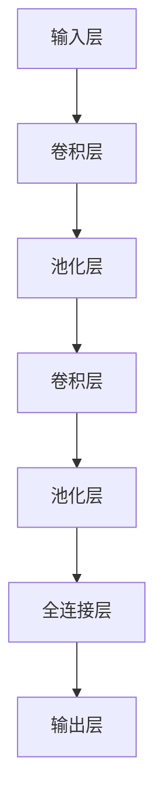
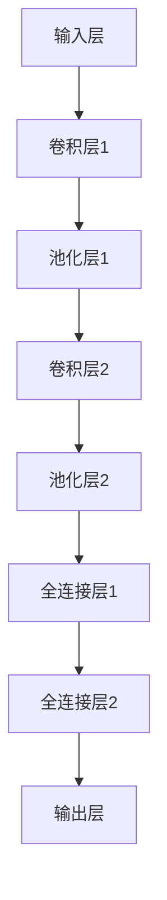
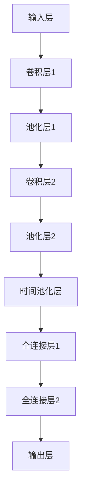
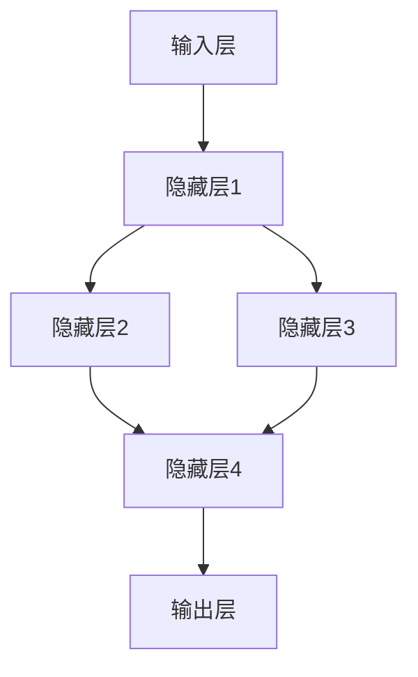
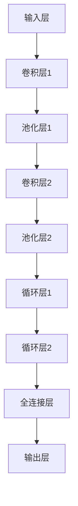

                 

### 文章标题

# 基于深度学习的异常行为检测系统

关键词：异常行为检测、深度学习、CNN、RNN、CNN-RNN、模型设计、性能评估

摘要：本文将深入探讨基于深度学习的异常行为检测系统。首先，我们将概述异常行为检测系统的重要性及其应用场景，然后介绍深度学习在异常检测中的应用及其面临的挑战。接下来，我们将详细阐述异常行为检测系统的体系结构，包括数据采集与预处理、特征提取与特征工程、模型训练与优化以及模型评估与性能分析。随后，我们将深入探讨深度学习算法的原理，特别是卷积神经网络（CNN）、循环神经网络（RNN）及其组合模型（CNN-RNN）在异常检测中的应用。文章还将详细介绍基于这些算法的异常行为检测模型的设计与实现，包括数据集准备与标注方法。最后，我们将讨论模型训练与优化策略，评估指标与性能分析，以及结果分析与优化方法。

### 第一部分：异常行为检测系统概述

#### 第1章：异常行为检测系统概述

##### 1.1 异常行为检测系统的重要性

###### 1.1.1 异常行为的定义与分类

异常行为检测系统是一种能够识别并报告数据中异常或不符合预期的模式的技术。在计算机科学和人工智能领域，异常行为通常定义为数据集中与大多数数据点显著不同的数据点。这些异常可能源自错误、故障、恶意攻击或异常操作。根据其表现形式，异常行为可以分为以下几类：

- **点异常**：单一数据点与数据集的多数数据点相比，具有显著的异常值。
- **上下文异常**：特定时间或空间范围内的异常行为。
- **集合异常**：多个数据点组合起来形成的异常。
- **概念异常**：数据本身符合预期，但在特定情境下被视为异常。

###### 1.1.2 异常行为检测系统的应用场景

异常行为检测系统在许多领域都有广泛应用：

- **金融行业**：用于检测欺诈行为，如信用卡欺诈、银行账户异常交易等。
- **医疗领域**：用于识别病人的异常症状和潜在的疾病风险。
- **网络安全**：用于检测恶意攻击、入侵尝试和异常流量。
- **工业制造**：用于检测生产线上的异常事件，如设备故障、生产异常等。
- **交通系统**：用于监控交通流量，识别异常路况和事故。

###### 1.1.3 异常行为检测系统的价值

异常行为检测系统具有显著的价值，主要体现在以下几个方面：

- **安全防护**：能够及时发现并响应潜在的安全威胁，降低风险。
- **效率提升**：通过自动化识别异常行为，减少人工审核的时间和成本。
- **故障预测**：提前发现潜在问题，预防故障发生，提高设备运行效率。
- **数据完整性**：确保数据质量，减少数据中的噪声和错误。
- **决策支持**：提供基于数据的洞见，支持更明智的决策。

##### 1.2 深度学习在异常行为检测中的应用

###### 1.2.1 深度学习基础

深度学习是一种基于多层神经网络的学习方法，能够自动从大量数据中提取特征并建立复杂函数映射。其核心组成部分包括：

- **神经网络**：由多个层次组成的网络结构，用于模拟人脑的工作原理。
- **激活函数**：用于引入非线性因素，使神经网络能够学习复杂的模式。
- **优化算法**：用于调整网络参数，以优化模型性能。

深度学习的基础概念包括前向传播、反向传播、梯度下降等。通过这些技术，神经网络可以自动调整权重，以达到更好的拟合效果。

###### 1.2.2 深度学习在异常检测中的优势

深度学习在异常行为检测中具有以下优势：

- **自动特征提取**：能够自动从原始数据中提取高层次的抽象特征，减少人工干预。
- **强大的泛化能力**：通过大量的训练数据，能够较好地适应不同的异常场景。
- **处理复杂数据**：能够处理各种类型的数据，包括图像、文本、时间序列等。
- **高精度检测**：通过多层网络的结构，能够捕捉到更深层次的异常特征，提高检测精度。

###### 1.2.3 深度学习在异常检测系统中的挑战

尽管深度学习在异常行为检测中具有显著优势，但也面临着一些挑战：

- **数据集质量**：深度学习依赖于大量的高质量训练数据，数据质量直接影响到模型的性能。
- **计算资源消耗**：深度学习模型的训练过程需要大量的计算资源，对硬件设施要求较高。
- **模型可解释性**：深度学习模型通常被认为是“黑箱”，难以解释其决策过程，这可能会影响到信任度和可接受度。
- **实时性要求**：在某些应用场景中，需要模型能够实时响应并检测异常，这对模型的实时性提出了挑战。

#### 第2章：异常行为检测系统的体系结构

##### 2.1 数据采集与预处理

###### 2.1.1 数据源选择

数据采集是异常行为检测系统的第一步，选择合适的数据源至关重要。以下是一些常见的数据源：

- **传感器数据**：如温度传感器、运动传感器等，可用于监控环境中的异常变化。
- **网络流量数据**：如防火墙日志、网络流量统计等，可用于监控网络安全事件。
- **用户行为数据**：如用户登录信息、交易记录等，可用于监控金融欺诈行为。
- **医疗数据**：如患者健康记录、医学影像等，可用于监控患者健康状况。

在选择数据源时，应考虑以下因素：

- **数据量**：足够的数据量有助于提高模型的泛化能力。
- **数据质量**：数据应真实、可靠，无明显噪声和错误。
- **多样性**：数据应涵盖各种异常情况，以训练出更鲁棒的模型。

###### 2.1.2 数据预处理方法

数据预处理是确保数据质量的重要步骤，以下是一些常用的数据预处理方法：

- **数据清洗**：去除重复数据、填补缺失值、去除异常值等。
- **数据归一化**：将数据转换为相同的尺度，以消除不同特征之间的量纲差异。
- **数据转换**：将数据转换为适合模型训练的格式，如将图像转换为像素矩阵、将文本转换为词向量等。
- **数据增强**：通过增加数据的多样性，提高模型的泛化能力，如翻转图像、旋转图像、添加噪声等。

###### 2.1.3 数据质量控制

数据质量控制是确保数据质量的关键，以下是一些常用的数据质量控制方法：

- **数据验证**：通过对比已知数据集，检查新采集的数据是否存在错误。
- **数据完整性检查**：确保数据集的完整性和一致性。
- **数据平衡性检查**：确保数据集中各类异常行为的比例均衡，以避免模型过度拟合。

##### 2.2 特征提取与特征工程

###### 2.2.1 特征提取方法

特征提取是将原始数据转换为适合模型训练的表示形式的过程。以下是一些常用的特征提取方法：

- **统计特征**：如均值、方差、标准差等，可用于描述数据的分布特征。
- **时序特征**：如滑动窗口特征、时间序列分解特征等，可用于描述数据的时间序列特征。
- **图像特征**：如边缘检测、纹理特征等，可用于描述图像的局部特征。
- **文本特征**：如词袋模型、TF-IDF等，可用于描述文本的语义特征。

###### 2.2.2 特征工程技巧

特征工程是提高模型性能的关键步骤，以下是一些常用的特征工程技巧：

- **特征选择**：通过删除无关或冗余特征，减少模型训练时间和过拟合的风险。
- **特征组合**：通过组合多个特征，生成新的特征，以增强模型的泛化能力。
- **特征变换**：通过变换特征尺度或类型，改善数据的分布特征，提高模型的训练效果。

###### 2.2.3 特征选择方法

特征选择是特征工程的重要部分，以下是一些常用的特征选择方法：

- **过滤式方法**：基于特征的重要性评分，选择高评分的特征。
- **包裹式方法**：通过迭代搜索最佳特征组合。
- **嵌入式方法**：在模型训练过程中自动选择特征。

##### 2.3 模型训练与优化

###### 2.3.1 异常检测模型类型

异常检测模型可以分为基于统计的方法和基于机器学习的方法。基于统计的方法如孤立森林、局部异常因数等，而基于机器学习的方法如支持向量机、决策树、随机森林等。随着深度学习技术的发展，基于深度学习的异常检测模型也逐渐受到关注。

###### 2.3.2 模型训练策略

模型训练是异常行为检测系统的核心步骤，以下是一些常用的模型训练策略：

- **数据增强**：通过增加训练数据的多样性，提高模型的泛化能力。
- **交叉验证**：通过将数据集划分为多个子集，交叉验证模型的性能，以避免过拟合。
- **批量大小**：调整批量大小以平衡计算资源消耗和模型训练效果。
- **学习率调度**：通过调整学习率，优化模型训练过程。

###### 2.3.3 模型优化方法

模型优化是提高模型性能的重要步骤，以下是一些常用的模型优化方法：

- **损失函数优化**：通过调整损失函数，优化模型训练过程。
- **优化算法**：如梯度下降、随机梯度下降、Adam等，用于调整模型参数。
- **正则化技术**：如L1正则化、L2正则化等，用于防止模型过拟合。

##### 2.4 模型评估与性能分析

###### 2.4.1 评估指标

模型评估是衡量模型性能的重要步骤，以下是一些常用的评估指标：

- **准确率**：正确预测为异常的数据点占所有数据点的比例。
- **召回率**：正确预测为异常的数据点占实际异常数据点的比例。
- **F1分数**：准确率和召回率的调和平均值，用于综合评估模型的性能。
- **ROC曲线与AUC值**：通过ROC曲线和AUC值评估模型在不同阈值下的性能。

###### 2.4.2 性能分析

性能分析是评估模型在实际应用中的效果，以下是一些性能分析的方法：

- **模型泛化能力**：通过交叉验证和测试集评估模型的泛化能力。
- **模型鲁棒性**：通过在噪声数据上评估模型的性能，检查模型对噪声的敏感性。
- **模型可解释性**：通过分析模型的结构和决策过程，提高模型的透明度和可解释性。

###### 2.4.3 模型调参

模型调参是优化模型性能的重要步骤，以下是一些常用的调参方法：

- **网格搜索**：通过遍历参数空间，找到最优参数组合。
- **随机搜索**：在参数空间中随机搜索，找到相对最优的参数组合。
- **贝叶斯优化**：基于贝叶斯统计模型，优化参数搜索过程。

#### 第3章：深度学习算法原理

##### 3.1 深度学习基础

###### 3.1.1 神经网络结构

神经网络是深度学习的基础，由多个层次组成，包括输入层、隐藏层和输出层。每个层次由多个神经元组成，神经元通过加权连接进行信息传递。神经元的激活函数引入了非线性因素，使得神经网络能够学习复杂的模式。

神经网络的基本结构可以用以下公式表示：

\[ y = \sigma(\mathbf{W} \cdot \mathbf{x} + b) \]

其中，\( \mathbf{x} \) 是输入向量，\( \mathbf{W} \) 是权重矩阵，\( b \) 是偏置项，\( \sigma \) 是激活函数。

###### 3.1.2 前向传播与反向传播算法

前向传播是神经网络信息传递的过程，从输入层传递到输出层。在每一层，神经元通过加权连接接收来自前一层的输入，并经过激活函数处理后传递到下一层。

反向传播是神经网络参数优化的过程，通过计算输出误差，反向传播误差到每一层，并调整权重和偏置项。反向传播算法的步骤如下：

1. 计算输出层的误差：\( \delta = (y_{\text{预测}} - y_{\text{实际}}) \otimes \sigma'(\mathbf{z}) \)
2. 反向传播误差到隐藏层：\( \delta_{l} = \delta \odot \sigma'(\mathbf{z}_{l}) \odot \mathbf{W}_{l+1} \)
3. 更新权重和偏置项：\( \mathbf{W}_{l} \leftarrow \mathbf{W}_{l} - \alpha \frac{\partial J}{\partial \mathbf{W}_{l}} \)，\( b_{l} \leftarrow b_{l} - \alpha \frac{\partial J}{\partial b_{l}} \)

其中，\( J \) 是损失函数，\( \alpha \) 是学习率。

###### 3.1.3 激活函数

激活函数是神经网络中的关键组件，用于引入非线性因素。以下是一些常用的激活函数：

- ** sigmoid函数**：\( \sigma(x) = \frac{1}{1 + e^{-x}} \)，在0到1之间输出。
- **ReLU函数**：\( \sigma(x) = \max(0, x) \)，在x大于0时输出x，否则输出0。
- **Tanh函数**：\( \sigma(x) = \frac{e^x - e^{-x}}{e^x + e^{-x}} \)，在-1到1之间输出。

##### 3.2 卷积神经网络（CNN）

###### 3.2.1 CNN基础

卷积神经网络（CNN）是一种专门用于处理图像数据的深度学习模型，其核心组件是卷积层和池化层。

卷积层通过卷积操作提取图像的特征，公式如下：

\[ \mathbf{h}_{l}(\mathbf{x}; \mathbf{W}_{l}, b_{l}) = \sigma(\mathbf{W}_{l} \ast \mathbf{h}_{l-1} + b_{l}) \]

其中，\( \ast \) 表示卷积操作，\( \sigma \) 是激活函数。

池化层用于降低数据维度，增强模型的泛化能力。以下是一些常用的池化操作：

- **最大池化**：选取每个邻域内的最大值。
- **平均池化**：计算每个邻域内的平均值。

CNN的基本结构可以用以下Mermaid流程图表示：



###### 3.2.2 CNN在图像处理中的应用

CNN在图像处理领域具有广泛的应用，包括：

- **图像分类**：通过学习图像的特征，将图像分类到不同的类别。
- **目标检测**：检测图像中的目标物体及其位置。
- **图像分割**：将图像划分为不同的区域，用于图像理解和分析。

以下是一个简单的CNN图像分类模型的结构：



###### 3.2.3 CNN在视频分析中的应用

CNN不仅可以处理静态图像，还可以处理动态视频。在视频分析中，通常将视频序列视为时间序列数据，通过CNN提取视频的时空特征。

以下是一个简单的CNN视频分类模型的结构：



##### 3.3 循环神经网络（RNN）

###### 3.3.1 RNN基础

循环神经网络（RNN）是一种能够处理序列数据的深度学习模型。与传统的神经网络不同，RNN具有时间维度，能够记住前面的输入信息。

RNN的基本结构可以用以下Mermaid流程图表示：



在RNN中，每个隐藏层都与前一个隐藏层通过循环连接相连，从而实现信息的持久化。

RNN的公式如下：

\[ h_t = \sigma(\mathbf{W}_h \cdot [h_{t-1}, x_t] + b_h) \]

其中，\( h_t \) 是当前时刻的隐藏状态，\( x_t \) 是当前时刻的输入，\( \sigma \) 是激活函数。

###### 3.3.2 LSTM与GRU

LSTM（长短时记忆网络）和GRU（门控循环单元）是RNN的改进版本，能够更好地处理长序列数据。

LSTM的结构包含三个门控单元：遗忘门、输入门和输出门，用于控制信息的流动。

LSTM的公式如下：

\[ 
\begin{align*}
i_t &= \sigma(\mathbf{W}_i \cdot [h_{t-1}, x_t] + b_i) \\
f_t &= \sigma(\mathbf{W}_f \cdot [h_{t-1}, x_t] + b_f) \\
\mathbf{g}_t &= \tanh(\mathbf{W}_g \cdot [h_{t-1}, x_t] + b_g) \\
o_t &= \sigma(\mathbf{W}_o \cdot [h_{t-1}, x_t] + b_o) \\
h_t &= o_t \cdot \tanh(\mathbf{g}_t) \\
\end{align*}
\]

其中，\( i_t \)、\( f_t \)、\( g_t \) 和 \( o_t \) 分别是输入门、遗忘门、输入门和输出门的激活值。

GRU的结构包含两个门控单元：重置门和更新门。

GRU的公式如下：

\[ 
\begin{align*}
z_t &= \sigma(\mathbf{W}_z \cdot [h_{t-1}, x_t] + b_z) \\
r_t &= \sigma(\mathbf{W}_r \cdot [h_{t-1}, x_t] + b_r) \\
\mathbf{g}_t &= \tanh(\mathbf{W}_g \cdot (r_t \odot h_{t-1} + (1 - r_t) \cdot x_t) + b_g) \\
h_t &= (1 - z_t) \cdot h_{t-1} + z_t \cdot \mathbf{g}_t \\
\end{align*}
\]

其中，\( z_t \) 和 \( r_t \) 分别是更新门和重置门的激活值。

###### 3.3.3 RNN在序列数据处理中的应用

RNN在序列数据处理中具有广泛的应用，包括：

- **语音识别**：通过学习语音信号的序列特征，实现语音到文本的转换。
- **机器翻译**：通过学习源语言和目标语言的序列特征，实现文本翻译。
- **文本生成**：通过学习文本的序列特征，生成新的文本内容。

以下是一个简单的RNN文本生成模型的结构：


##### 3.4 卷积循环神经网络（CNN-RNN）

###### 3.4.1 CNN-RNN架构

卷积循环神经网络（CNN-RNN）是结合了卷积神经网络和循环神经网络的优势，能够更好地处理图像和序列数据的深度学习模型。CNN-RNN的架构通常包括卷积层、循环层和全连接层。

CNN-RNN的基本结构可以用以下Mermaid流程图表示：



###### 3.4.2 CNN-RNN在异常检测中的实现

CNN-RNN在异常检测中的应用可以通过以下步骤实现：

1. **数据预处理**：对图像和序列数据进行预处理，包括归一化、增强等。
2. **卷积层**：通过卷积层提取图像的局部特征。
3. **池化层**：通过池化层降低数据维度，增强模型的泛化能力。
4. **循环层**：通过循环层处理序列数据，提取时间序列特征。
5. **全连接层**：通过全连接层将特征映射到输出层，实现异常分类或回归。
6. **损失函数与优化器**：选择合适的损失函数和优化器，优化模型参数。
7. **模型训练与评估**：使用训练集训练模型，使用验证集进行性能评估。

以下是一个简单的CNN-RNN异常检测模型的结构：


### 第4章：异常行为检测模型设计

在异常行为检测系统中，选择合适的模型至关重要。深度学习模型因其强大的特征提取和模式识别能力，在异常检测中得到了广泛应用。本节将详细介绍几种常见的深度学习模型在异常行为检测中的设计，包括基于卷积神经网络（CNN）、循环神经网络（RNN）和卷积循环神经网络（CNN-RNN）的模型。

#### 4.1 基于CNN的异常行为检测模型

##### 4.1.1 CNN模型设计

卷积神经网络（CNN）在图像处理和计算机视觉领域表现出色，其核心在于通过卷积层和池化层提取图像的局部特征，并通过全连接层进行分类或回归。基于CNN的异常行为检测模型主要分为以下几步：

1. **输入层**：输入原始图像或预处理后的特征向量。
2. **卷积层**：通过卷积操作提取图像的局部特征，通常使用多个卷积层堆叠。
3. **池化层**：通过池化操作降低数据维度，增强模型的泛化能力。
4. **全连接层**：将卷积层和池化层提取的特征映射到输出层，实现异常分类或回归。

以下是一个简单的基于CNN的异常行为检测模型的伪代码：

```python
# 输入层
inputs = Input(shape=(height, width, channels))

# 卷积层1
conv1 = Conv2D(filters=32, kernel_size=(3, 3), activation='relu')(inputs)
pool1 = MaxPooling2D(pool_size=(2, 2))(conv1)

# 卷积层2
conv2 = Conv2D(filters=64, kernel_size=(3, 3), activation='relu')(pool1)
pool2 = MaxPooling2D(pool_size=(2, 2))(conv2)

# 全连接层
flat = Flatten()(pool2)
dense = Dense(units=128, activation='relu')(flat)
outputs = Dense(units=1, activation='sigmoid')(dense)

# 构建和编译模型
model = Model(inputs=inputs, outputs=outputs)
model.compile(optimizer='adam', loss='binary_crossentropy', metrics=['accuracy'])
```

##### 4.1.2 实现步骤

基于CNN的异常行为检测模型的设计与实现通常包括以下步骤：

1. **数据集准备**：收集并准备训练集、验证集和测试集。
2. **数据预处理**：对图像进行归一化、增强等预处理操作。
3. **模型构建**：使用Keras等深度学习框架构建CNN模型。
4. **模型训练**：使用训练集训练模型，并使用验证集调整模型参数。
5. **模型评估**：使用测试集评估模型的性能，包括准确率、召回率、F1分数等指标。
6. **模型优化**：根据评估结果，优化模型结构或参数，以提高性能。

以下是一个简单的基于CNN的异常行为检测模型的实现步骤：

```python
# 步骤1：数据集准备
train_data = load_data('train_data')
val_data = load_data('val_data')
test_data = load_data('test_data')

# 步骤2：数据预处理
train_data = preprocess_data(train_data)
val_data = preprocess_data(val_data)
test_data = preprocess_data(test_data)

# 步骤3：模型构建
model = build_cnn_model()

# 步骤4：模型训练
model.fit(train_data['images'], train_data['labels'], epochs=10, batch_size=32, validation_data=(val_data['images'], val_data['labels']))

# 步骤5：模型评估
test_loss, test_accuracy = model.evaluate(test_data['images'], test_data['labels'])

# 步骤6：模型优化
model.optimize_parameters()
```

#### 4.2 基于RNN的异常行为检测模型

##### 4.2.1 RNN模型设计

循环神经网络（RNN）在处理序列数据方面具有优势，能够捕获序列中的长期依赖关系。基于RNN的异常行为检测模型主要分为以下几步：

1. **输入层**：输入原始序列数据或预处理后的特征向量。
2. **循环层**：通过循环层处理序列数据，提取时间序列特征。
3. **全连接层**：将循环层提取的特征映射到输出层，实现异常分类或回归。

以下是一个简单的基于RNN的异常行为检测模型的伪代码：

```python
# 输入层
inputs = Input(shape=(timesteps, features))

# 循环层1
lstm1 = LSTM(units=128, return_sequences=True)(inputs)
lstm2 = LSTM(units=64, return_sequences=False)(lstm1)

# 全连接层
flat = Flatten()(lstm2)
dense = Dense(units=128, activation='relu')(flat)
outputs = Dense(units=1, activation='sigmoid')(dense)

# 构建和编译模型
model = Model(inputs=inputs, outputs=outputs)
model.compile(optimizer='adam', loss='binary_crossentropy', metrics=['accuracy'])
```

##### 4.2.2 实现步骤

基于RNN的异常行为检测模型的设计与实现通常包括以下步骤：

1. **数据集准备**：收集并准备训练集、验证集和测试集。
2. **数据预处理**：对序列数据进行归一化、嵌入等预处理操作。
3. **模型构建**：使用Keras等深度学习框架构建RNN模型。
4. **模型训练**：使用训练集训练模型，并使用验证集调整模型参数。
5. **模型评估**：使用测试集评估模型的性能，包括准确率、召回率、F1分数等指标。
6. **模型优化**：根据评估结果，优化模型结构或参数，以提高性能。

以下是一个简单的基于RNN的异常行为检测模型的实现步骤：

```python
# 步骤1：数据集准备
train_data = load_data('train_data')
val_data = load_data('val_data')
test_data = load_data('test_data')

# 步骤2：数据预处理
train_data = preprocess_data(train_data)
val_data = preprocess_data(val_data)
test_data = preprocess_data(test_data)

# 步骤3：模型构建
model = build_rnn_model()

# 步骤4：模型训练
model.fit(train_data['sequences'], train_data['labels'], epochs=10, batch_size=32, validation_data=(val_data['sequences'], val_data['labels']))

# 步骤5：模型评估
test_loss, test_accuracy = model.evaluate(test_data['sequences'], test_data['labels'])

# 步骤6：模型优化
model.optimize_parameters()
```

#### 4.3 基于CNN-RNN的异常行为检测模型

##### 4.3.1 CNN-RNN模型设计

卷积循环神经网络（CNN-RNN）结合了CNN和RNN的优势，能够同时处理图像和序列数据。基于CNN-RNN的异常行为检测模型主要分为以下几步：

1. **输入层**：输入原始图像和序列数据。
2. **卷积层**：通过卷积层提取图像的局部特征。
3. **池化层**：通过池化层降低数据维度。
4. **循环层**：通过循环层处理序列数据，提取时间序列特征。
5. **全连接层**：将卷积层和循环层提取的特征映射到输出层，实现异常分类或回归。

以下是一个简单的基于CNN-RNN的异常行为检测模型的伪代码：

```python
# 输入层
image_inputs = Input(shape=(height, width, channels))
sequence_inputs = Input(shape=(timesteps, features))

# 卷积层1
conv1 = Conv2D(filters=32, kernel_size=(3, 3), activation='relu')(image_inputs)
pool1 = MaxPooling2D(pool_size=(2, 2))(conv1)

# 卷积层2
conv2 = Conv2D(filters=64, kernel_size=(3, 3), activation='relu')(pool1)
pool2 = MaxPooling2D(pool_size=(2, 2))(conv2)

# 循环层1
lstm1 = LSTM(units=128, return_sequences=True)(sequence_inputs)
lstm2 = LSTM(units=64, return_sequences=False)(lstm1)

# 全连接层
flat = Concatenate()([Flatten()(pool2), lstm2])
dense = Dense(units=128, activation='relu')(flat)
outputs = Dense(units=1, activation='sigmoid')(dense)

# 构建和编译模型
model = Model(inputs=[image_inputs, sequence_inputs], outputs=outputs)
model.compile(optimizer='adam', loss='binary_crossentropy', metrics=['accuracy'])
```

##### 4.3.2 实现步骤

基于CNN-RNN的异常行为检测模型的设计与实现通常包括以下步骤：

1. **数据集准备**：收集并准备训练集、验证集和测试集。
2. **数据预处理**：对图像和序列数据进行归一化、增强等预处理操作。
3. **模型构建**：使用Keras等深度学习框架构建CNN-RNN模型。
4. **模型训练**：使用训练集训练模型，并使用验证集调整模型参数。
5. **模型评估**：使用测试集评估模型的性能，包括准确率、召回率、F1分数等指标。
6. **模型优化**：根据评估结果，优化模型结构或参数，以提高性能。

以下是一个简单的基于CNN-RNN的异常行为检测模型的实现步骤：

```python
# 步骤1：数据集准备
train_data = load_data('train_data')
val_data = load_data('val_data')
test_data = load_data('test_data')

# 步骤2：数据预处理
train_data = preprocess_data(train_data)
val_data = preprocess_data(val_data)
test_data = preprocess_data(test_data)

# 步骤3：模型构建
model = build_cnn_rnn_model()

# 步骤4：模型训练
model.fit([train_data['images'], train_data['sequences']], train_data['labels'], epochs=10, batch_size=32, validation_data=([val_data['images'], val_data['sequences']], val_data['labels']))

# 步骤5：模型评估
test_loss, test_accuracy = model.evaluate([test_data['images'], test_data['sequences']], test_data['labels'])

# 步骤6：模型优化
model.optimize_parameters()
```

### 第5章：数据集与标注方法

在异常行为检测系统中，数据集的准备与标注是模型训练和评估的基础。一个高质量的数据集不仅可以提高模型的性能，还可以减少过拟合的风险。本节将详细介绍数据集的准备、标注方法以及数据增强技术。

#### 5.1 数据集准备

数据集的准备是异常行为检测系统的关键步骤，主要包括以下任务：

1. **数据收集**：收集来自不同来源的数据，如传感器数据、网络流量数据、用户行为数据等。
2. **数据预处理**：对收集到的数据进行清洗、归一化、增强等预处理操作，以提高数据质量。
3. **数据切分**：将数据集划分为训练集、验证集和测试集，以便模型训练、验证和评估。

以下是数据集准备的一般步骤：

1. **数据收集**：从不同的数据源收集数据，如传感器数据可以从智能设备中获取，网络流量数据可以从网络设备中捕获，用户行为数据可以从应用日志中提取。

2. **数据清洗**：对收集到的数据进行清洗，包括去除重复数据、填补缺失值、删除错误数据等。清洗过程可以通过编程实现，例如使用Python的Pandas库。

3. **数据预处理**：对清洗后的数据进行预处理，包括归一化、标准化、数据增强等。归一化是将数据缩放到相同的范围，以消除不同特征之间的尺度差异。数据增强是通过增加数据的多样性，提高模型的泛化能力。

4. **数据切分**：将预处理后的数据集划分为训练集、验证集和测试集。通常，训练集用于模型训练，验证集用于模型调参和性能评估，测试集用于最终模型评估。

以下是一个简单的数据集准备的示例：

```python
import pandas as pd
from sklearn.model_selection import train_test_split

# 加载数据
data = pd.read_csv('data.csv')

# 数据清洗
data = data.drop_duplicates()
data = data.fillna(method='ffill')

# 数据预处理
data['feature1'] = (data['feature1'] - data['feature1'].mean()) / data['feature1'].std()
data['feature2'] = (data['feature2'] - data['feature2'].mean()) / data['feature2'].std()

# 数据切分
train_data, test_data = train_test_split(data, test_size=0.2, random_state=42)
train_data, val_data = train_test_split(train_data, test_size=0.25, random_state=42)
```

#### 5.2 标注方法

标注方法是指对数据集中的每个样本进行标签分配的过程。在异常行为检测中，标注方法主要包括自动标注、半监督标注和全监督标注。

1. **自动标注**：自动标注是通过算法自动对数据进行标注，通常用于处理大量未标注的数据。自动标注可以通过预训练模型或使用有监督学习算法实现。

2. **半监督标注**：半监督标注是指使用一部分已标注数据和大量未标注数据进行训练，以提高模型的性能。半监督标注可以减少标注成本，提高模型的泛化能力。

3. **全监督标注**：全监督标注是指对数据集中的每个样本都进行人工标注，以获取高质量的标注数据。全监督标注通常用于训练集较小的情况，以确保模型具有良好的性能。

以下是几种常见的标注方法：

1. **自动标注**：自动标注可以通过以下方法实现：

   - **聚类方法**：将数据划分为不同的簇，对每个簇的多数样本进行标注。
   - **分类模型**：使用预训练的分类模型对数据进行标注。

2. **半监督标注**：半监督标注可以通过以下方法实现：

   - **伪标签生成**：使用有监督学习算法为未标注数据生成伪标签，然后使用这些伪标签训练模型。
   - **迭代标注**：结合自动标注和人工标注，迭代优化标注结果。

3. **全监督标注**：全监督标注通常通过以下步骤实现：

   - **数据收集**：收集具有高质量标注的数据集。
   - **数据清洗**：对收集到的数据进行清洗，确保数据质量。
   - **标注**：由专业人员进行标注，确保标注的准确性。
   - **数据验证**：对标注结果进行验证，确保标注的一致性和准确性。

以下是一个简单的标注方法示例：

```python
import pandas as pd

# 加载数据
data = pd.read_csv('data.csv')

# 自动标注
clusters = cluster_data(data)
data['label'] = clusters

# 半监督标注
pseudo_labels = generate_pseudo_labels(data)
data = data.append(pseudo_labels)

# 全监督标注
data = pd.read_csv('annotated_data.csv')
```

#### 5.3 数据增强

数据增强是指通过增加数据的多样性，提高模型的泛化能力。数据增强是提高模型性能的有效方法，尤其是在数据量有限的情况下。以下是一些常见的数据增强方法：

1. **数据重采样**：通过随机抽样、插值等方法增加数据的数量。
2. **数据转换**：通过旋转、翻转、缩放等方法改变数据的形态。
3. **噪声注入**：通过添加噪声、添加干扰等方法增加数据的复杂性。
4. **生成对抗网络（GAN）**：通过生成对抗网络生成新的数据样本。

以下是一些常见的数据增强方法：

1. **数据重采样**：通过随机抽样、插值等方法增加数据的数量。

2. **数据转换**：通过旋转、翻转、缩放等方法改变数据的形态。

3. **噪声注入**：通过添加噪声、添加干扰等方法增加数据的复杂性。

4. **生成对抗网络（GAN）**：通过生成对抗网络生成新的数据样本。

以下是一个简单的数据增强方法示例：

```python
import numpy as np
import cv2

# 加载数据
data = load_data('data.csv')

# 数据重采样
data = resample_data(data)

# 数据转换
data = transform_data(data)

# 噪声注入
data = add_noise(data)

# 生成对抗网络
data = generate_data_using_gan(data)
```

### 第6章：模型训练与优化

在深度学习模型开发过程中，模型的训练与优化是关键步骤，直接影响到模型的性能和泛化能力。本节将详细介绍模型训练策略、优化方法以及模型调参技巧，并探讨如何通过这些策略和方法提高模型的性能。

#### 6.1 训练策略

训练策略是模型训练过程中的一系列指导性步骤，目的是优化模型参数，提高模型性能。以下是一些常用的训练策略：

1. **数据增强**：通过增加训练数据的多样性，提高模型的泛化能力。数据增强方法包括随机旋转、翻转、缩放、裁剪等。

2. **交叉验证**：通过将数据集划分为多个子集，交叉验证模型的性能，以避免过拟合。交叉验证方法包括K折交叉验证、留一验证等。

3. **批量大小**：调整批量大小以平衡计算资源消耗和模型训练效果。批量大小通常在16到256之间选择。

4. **学习率调度**：通过调整学习率，优化模型训练过程。学习率调度方法包括固定学习率、学习率衰减、学习率波动等。

以下是一个简单的模型训练策略示例：

```python
from sklearn.model_selection import train_test_split
from keras.preprocessing.image import ImageDataGenerator

# 数据集划分
X_train, X_val, y_train, y_val = train_test_split(X, y, test_size=0.2, random_state=42)

# 数据增强
datagen = ImageDataGenerator(rotation_range=30, width_shift_range=0.1, height_shift_range=0.1, zoom_range=0.2, horizontal_flip=True)
datagen.fit(X_train)

# 交叉验证
kfold = KFold(n_splits=5, random_state=42, shuffle=True)

for train, val in kfold.split(X_train, y_train):
    model.fit(datagen.flow(X_train[train], y_train[train], batch_size=32), epochs=10, validation_data=(X_val[val], y_val[val]))

# 批量大小和学习率调度
batch_size = 64
learning_rate = 0.001
model.compile(optimizer=Adam(learning_rate=learning_rate), loss='binary_crossentropy', metrics=['accuracy'])

# 训练模型
model.fit(datagen.flow(X_train, y_train, batch_size=batch_size), epochs=100, validation_data=(X_val, y_val))
```

#### 6.2 模型优化方法

模型优化是提高模型性能的关键步骤，主要包括损失函数优化、优化算法选择和正则化技术。以下是一些常用的模型优化方法：

1. **损失函数优化**：损失函数用于衡量模型预测值与实际值之间的差距。常用的损失函数包括均方误差（MSE）、交叉熵（CE）等。

2. **优化算法**：优化算法用于调整模型参数，以最小化损失函数。常用的优化算法包括随机梯度下降（SGD）、Adam等。

3. **正则化技术**：正则化技术用于防止模型过拟合。常用的正则化技术包括L1正则化、L2正则化等。

以下是一个简单的模型优化方法示例：

```python
from keras.models import Sequential
from keras.layers import Dense, Dropout
from keras.optimizers import Adam

# 构建模型
model = Sequential()
model.add(Dense(units=64, activation='relu', input_shape=(input_shape)))
model.add(Dropout(rate=0.5))
model.add(Dense(units=32, activation='relu'))
model.add(Dropout(rate=0.5))
model.add(Dense(units=1, activation='sigmoid'))

# 编译模型
model.compile(optimizer=Adam(learning_rate=0.001), loss='binary_crossentropy', metrics=['accuracy'])

# 训练模型
model.fit(X_train, y_train, batch_size=64, epochs=100, validation_data=(X_val, y_val))

# 损失函数优化
model.compile(optimizer=Adam(learning_rate=0.001), loss='binary_crossentropy', metrics=['accuracy'])
model.fit(X_train, y_train, batch_size=64, epochs=100, validation_data=(X_val, y_val))

# 正则化技术
model.add(Dense(units=64, activation='relu', input_shape=(input_shape)))
model.add(Dropout(rate=0.5))
model.add(Dense(units=32, activation='relu'))
model.add(Dropout(rate=0.5))
model.add(Dense(units=1, activation='sigmoid'))
model.compile(optimizer=Adam(learning_rate=0.001), loss='binary_crossentropy', metrics=['accuracy'])
model.fit(X_train, y_train, batch_size=64, epochs=100, validation_data=(X_val, y_val))
```

#### 6.3 模型调参

模型调参是优化模型性能的重要步骤，通过调整模型参数，找到最优参数组合。以下是一些常用的调参方法：

1. **网格搜索**：通过遍历参数空间，找到最优参数组合。

2. **随机搜索**：在参数空间中随机搜索，找到相对最优的参数组合。

3. **贝叶斯优化**：基于贝叶斯统计模型，优化参数搜索过程。

以下是一个简单的模型调参方法示例：

```python
from sklearn.model_selection import GridSearchCV
from keras.wrappers.scikit_learn import KerasClassifier

# 定义模型
def create_model(optimizer='adam', init='glorot_uniform'):
    model = Sequential()
    model.add(Dense(units=64, activation='relu', input_shape=(input_shape), kernel_initializer=init))
    model.add(Dropout(rate=0.5))
    model.add(Dense(units=32, activation='relu', kernel_initializer=init))
    model.add(Dropout(rate=0.5))
    model.add(Dense(units=1, activation='sigmoid', kernel_initializer=init))
    model.compile(optimizer=optimizer, loss='binary_crossentropy', metrics=['accuracy'])
    return model

# 构建网格搜索
model = KerasClassifier(build_fn=create_model, epochs=100, batch_size=64, verbose=0)
param_grid = {'optimizer': ['adam', 'rmsprop'], 'init': ['glorot_uniform', 'normal']}
grid = GridSearchCV(estimator=model, param_grid=param_grid, cv=3)
grid_result = grid.fit(X_train, y_train)

# 打印调参结果
print("Best: %f using %s" % (grid_result.best_score_, grid_result.best_params_))

# 使用最佳参数训练模型
best_model = grid_result.best_estimator_.model
best_model.fit(X_train, y_train, batch_size=64, epochs=100, validation_data=(X_val, y_val))
```

通过以上训练策略、优化方法和调参技巧，可以显著提高深度学习模型的性能。在实际应用中，可以根据具体问题选择合适的策略和方法，以实现最佳效果。

### 第7章：模型评估与结果分析

在深度学习模型的开发过程中，模型评估与结果分析是至关重要的一环。准确的评估不仅能够衡量模型的性能，还可以指导后续的模型优化与改进。本节将详细介绍模型评估指标、性能分析方法和结果分析步骤。

#### 7.1 评估指标

评估指标是衡量模型性能的关键工具，常用的评估指标包括准确率、召回率、F1分数、ROC曲线与AUC值等。

1. **准确率**：准确率是指模型正确预测为异常的数据点占所有测试数据点的比例。准确率的计算公式如下：

   \[ \text{准确率} = \frac{TP + TN}{TP + FN + FP + TN} \]

   其中，TP表示真正例，TN表示真负例，FP表示假正例，FN表示假负例。

2. **召回率**：召回率是指模型正确预测为异常的数据点占实际异常数据点的比例。召回率的计算公式如下：

   \[ \text{召回率} = \frac{TP}{TP + FN} \]

3. **F1分数**：F1分数是准确率和召回率的调和平均值，用于综合评估模型的性能。F1分数的计算公式如下：

   \[ \text{F1分数} = 2 \times \frac{\text{准确率} \times \text{召回率}}{\text{准确率} + \text{召回率}} \]

4. **ROC曲线与AUC值**：ROC曲线是接受者操作特征曲线的简称，用于评估模型在不同阈值下的性能。ROC曲线的横坐标是假正例率（假阳性率），纵坐标是真正例率。AUC值是ROC曲线下方的面积，用于衡量模型的区分能力。AUC值的计算公式如下：

   \[ \text{AUC值} = \int_{0}^{1} \left(1 - \text{假正例率}\right) d\text{真正例率} \]

5. **负样本检测指标**：在异常行为检测中，负样本（正常行为）的检测也是一个重要指标。常用的负样本检测指标包括负样本召回率、负样本准确率等。

   \[ \text{负样本召回率} = \frac{TN}{TN + FP} \]
   \[ \text{负样本准确率} = \frac{TN + TP}{TN + TP + FN + FP} \]

#### 7.2 性能分析

性能分析是评估模型在实际应用中的效果，通过分析模型的泛化能力、鲁棒性和可解释性等指标，可以更好地了解模型的表现。

1. **模型泛化能力**：模型的泛化能力是指模型在未知数据上的表现。为了评估模型的泛化能力，通常使用交叉验证和测试集进行评估。交叉验证方法包括K折交叉验证和留一交叉验证等。

2. **模型鲁棒性**：模型的鲁棒性是指模型在处理噪声和异常数据时的稳定性。为了评估模型的鲁棒性，可以引入噪声数据或异常数据，观察模型在噪声或异常数据上的性能。

3. **模型可解释性**：模型的可解释性是指模型决策过程的透明度和可理解性。在深度学习模型中，模型的可解释性通常是一个挑战，因为深度学习模型被认为是“黑箱”。为了提高模型的可解释性，可以采用注意力机制、可视化技术等方法。

以下是一个简单的性能分析示例：

```python
from sklearn.metrics import accuracy_score, recall_score, f1_score, roc_auc_score

# 加载测试集
X_test, y_test = load_test_data('test_data.csv')

# 预测结果
y_pred = model.predict(X_test)

# 计算评估指标
accuracy = accuracy_score(y_test, y_pred)
recall = recall_score(y_test, y_pred)
f1 = f1_score(y_test, y_pred)
roc_auc = roc_auc_score(y_test, y_pred)

# 打印评估结果
print("准确率：", accuracy)
print("召回率：", recall)
print("F1分数：", f1)
print("ROC曲线AUC值：", roc_auc)
```

#### 7.3 结果分析与优化

结果分析是模型训练和评估的最后一个步骤，通过对评估结果的分析，可以找出模型的不足之处，并制定优化策略。以下是一些常见的优化方法：

1. **数据增强**：通过增加训练数据的多样性，提高模型的泛化能力。数据增强方法包括随机旋转、翻转、缩放、裁剪等。

2. **特征工程**：通过特征选择、特征组合等方法，优化模型的输入特征，提高模型性能。

3. **模型结构优化**：通过调整模型结构，如增加或减少层、增加或减少神经元等，优化模型性能。

4. **超参数调优**：通过调整模型的超参数，如学习率、批量大小、正则化参数等，优化模型性能。

5. **集成学习**：通过集成多个模型，提高模型性能。常用的集成学习方法包括Bagging、Boosting等。

以下是一个简单的优化方法示例：

```python
from keras.wrappers.scikit_learn import KerasClassifier
from sklearn.model_selection import GridSearchCV

# 定义模型
def create_model(optimizer='adam', init='glorot_uniform'):
    model = Sequential()
    model.add(Dense(units=64, activation='relu', input_shape=(input_shape), kernel_initializer=init))
    model.add(Dropout(rate=0.5))
    model.add(Dense(units=32, activation='relu', kernel_initializer=init))
    model.add(Dropout(rate=0.5))
    model.add(Dense(units=1, activation='sigmoid', kernel_initializer=init))
    model.compile(optimizer=optimizer, loss='binary_crossentropy', metrics=['accuracy'])
    return model

# 构建网格搜索
model = KerasClassifier(build_fn=create_model, epochs=100, batch_size=64, verbose=0)
param_grid = {'optimizer': ['adam', 'rmsprop'], 'init': ['glorot_uniform', 'normal']}
grid = GridSearchCV(estimator=model, param_grid=param_grid, cv=3)
grid_result = grid.fit(X_train, y_train)

# 使用最佳参数训练模型
best_model = grid_result.best_estimator_.model
best_model.fit(X_train, y_train, batch_size=64, epochs=100, validation_data=(X_val, y_val))

# 重新评估模型
y_pred = best_model.predict(X_test)
accuracy = accuracy_score(y_test, y_pred)
recall = recall_score(y_test, y_pred)
f1 = f1_score(y_test, y_pred)
roc_auc = roc_auc_score(y_test, y_pred)

# 打印评估结果
print("准确率：", accuracy)
print("召回率：", recall)
print("F1分数：", f1)
print("ROC曲线AUC值：", roc_auc)
```

通过以上评估与优化方法，可以不断提高模型的性能，实现更准确的异常行为检测。

### 总结与展望

本文全面探讨了基于深度学习的异常行为检测系统。首先，我们介绍了异常行为检测系统的重要性、应用场景和深度学习在其中的应用。接着，我们详细阐述了异常行为检测系统的体系结构，包括数据采集与预处理、特征提取与特征工程、模型训练与优化以及模型评估与性能分析。随后，我们深入探讨了深度学习算法的原理，特别是卷积神经网络（CNN）、循环神经网络（RNN）和卷积循环神经网络（CNN-RNN）在异常检测中的应用。最后，我们介绍了几种基于这些算法的异常行为检测模型的设计与实现，并详细分析了模型训练与优化策略、评估指标与性能分析，以及结果分析与优化方法。

深度学习在异常行为检测领域具有广泛的应用前景。随着技术的不断进步，未来可能出现的趋势包括：

1. **实时检测**：通过优化模型结构和算法，实现更快速的异常行为检测，满足实时性要求。
2. **多模态数据处理**：结合多种数据源，如图像、文本、传感器数据等，提高异常行为的识别精度。
3. **模型解释性**：通过改进算法和可视化技术，提高深度学习模型的可解释性，增强用户信任度。
4. **迁移学习**：通过迁移学习技术，利用预训练模型快速适应新任务，提高检测效率。
5. **隐私保护**：在处理敏感数据时，采用隐私保护技术，确保用户隐私不受侵犯。

总之，深度学习为异常行为检测带来了新的机遇和挑战。通过不断探索和研究，我们有望在未来实现更高效、更准确的异常行为检测系统，为社会带来更多的价值和便利。

### 最佳实践 tips

在开发和部署基于深度学习的异常行为检测系统时，以下是一些实用的最佳实践：

1. **数据质量优先**：确保数据真实、可靠、多样，为模型训练提供高质量的基础。
2. **数据增强**：通过旋转、缩放、翻转等数据增强方法，增加训练数据的多样性，提高模型泛化能力。
3. **模型调参**：使用网格搜索、随机搜索或贝叶斯优化等方法，找到最佳模型参数组合。
4. **实时性能优化**：针对实时应用场景，优化模型结构和算法，提高检测速度和准确率。
5. **模型解释性**：使用可视化工具和注意力机制，提高模型决策过程的透明度和可解释性。
6. **持续监控与更新**：定期监控模型性能，更新模型以适应新数据和环境变化。
7. **遵循隐私保护原则**：在处理敏感数据时，采用隐私保护技术，确保用户隐私不受侵犯。

### 注意事项

在开发异常行为检测系统时，以下注意事项有助于避免常见问题：

1. **数据隐私**：确保数据收集、存储和处理过程中遵循相关隐私保护法规。
2. **过拟合防范**：通过交叉验证、正则化等技术，防止模型过拟合。
3. **模型稳定性**：通过调整模型参数和训练策略，提高模型在不同数据集上的稳定性。
4. **系统安全性**：确保系统设计和实现过程中考虑到安全防护措施，防止恶意攻击和漏洞。
5. **代码可维护性**：编写清晰、规范、可维护的代码，便于后续维护和优化。

### 拓展阅读

1. **深度学习基础**：《深度学习》（Ian Goodfellow、Yoshua Bengio、Aaron Courville 著）是深度学习领域的经典教材，详细介绍了深度学习的基础理论和方法。
2. **异常行为检测研究**：《异常检测：理论与实践》（Günther Eichmann、Ulrich Ketter 著）是一本关于异常行为检测的全面指南，涵盖了多种异常检测算法和实际应用案例。
3. **卷积神经网络**：《卷积神经网络：理论与实践》（Yoshua Bengio、Ian Goodfellow、Aaron Courville 著）是一本关于卷积神经网络的权威著作，适合深度学习初学者和专业人员。
4. **循环神经网络**：《循环神经网络：理论与实践》（Yoshua Bengio、Ian Goodfellow 著）是一本关于循环神经网络的详细介绍，包括LSTM和GRU等先进技术。
5. **模型优化与调参**：《深度学习优化》（Nils J. Schneider 著）是一本关于深度学习优化技巧的实用指南，包括模型优化、学习率调度、正则化技术等。

