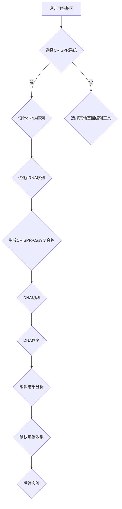

                 

### 文章标题

《基因编辑的组合优化：CRISPR设计的数学方法》

> 关键词：基因编辑、CRISPR技术、组合优化、数学模型、算法设计

> 摘要：本文深入探讨了基因编辑领域中的CRISPR技术，并重点阐述了如何运用数学模型和算法优化方法来提升CRISPR设计的效率与准确性。通过对CRISPR系统的工作原理、组合优化问题的定义及其在基因编辑中的应用进行详细分析，本文为从事基因编辑研究的科研人员提供了实用的理论指导和实践案例。

## 第一部分：基因编辑与CRISPR技术基础

### 第1章：基因编辑概述

#### 1.1 基因编辑的定义与重要性

基因编辑，是指通过人工手段对生物体的基因组进行精确的修改。这一技术不仅有助于揭示基因功能，还为医学、农业、生物技术等多个领域带来了革命性的变革。基因编辑的重要性体现在以下几个方面：

1. **医学治疗**：通过基因编辑技术，可以纠正遗传性疾病患者体内的缺陷基因，从而治愈疾病。
2. **生物制造**：基因编辑技术可以用于生产生物药品、生物燃料等具有重要经济价值的产品。
3. **农业改良**：通过基因编辑，可以提高作物的抗病性、产量和营养价值，为解决全球粮食问题提供新途径。

#### 1.2 基因编辑技术的发展历程

基因编辑技术经历了数十年的发展，从最初的DNA重组技术到CRISPR/Cas9等高效的基因编辑工具，技术不断进步和优化。

1. **1970年代：DNA重组技术**：科学家首次实现了基因在物种间的转移，开创了基因编辑的先河。
2. **1990年代：锌指核酸酶（ZFN）与转录激活因子样效应器核酸酶（TALEN）**：这些人工设计的核酸酶提高了基因编辑的精度和效率。
3. **2010年代至今：CRISPR/Cas9技术**：CRISPR/Cas9系统以其简单、高效和低成本的特点迅速成为基因编辑领域的热点。

#### 1.3 基因编辑的应用领域

基因编辑技术在多个领域有着广泛的应用：

1. **医学**：基因编辑可用于治疗遗传性疾病，如囊性纤维化、β-地中海贫血等。
2. **农业**：通过基因编辑，可以培育出抗病虫害、高产的农作物。
3. **生物技术**：基因编辑技术可以用于生产生物药品、生物燃料等。

#### 1.4 基因编辑的伦理与法规问题

基因编辑技术的快速发展引发了诸多伦理和法规问题：

1. **基因编辑的伦理争议**：涉及基因改造、人类胚胎编辑等伦理问题。
2. **法规监管**：各国政府纷纷制定相关法规，以确保基因编辑技术的安全性和道德合法性。

### 第2章：CRISPR/Cas9技术原理

#### 2.1 CRISPR/Cas9系统的基本组成

CRISPR/Cas9系统由两部分组成：引导RNA（gRNA）和Cas9核酸酶。

1. **引导RNA（gRNA）**：gRNA负责定位特定的DNA序列，类似于分子尺度的指南针。
2. **Cas9核酸酶**：Cas9是一种双链DNA核酸酶，负责切割DNA链，诱导双链断裂。

#### 2.2 CRISPR/Cas9的机制

CRISPR/Cas9系统的工作机制可分为以下几个步骤：

1. **设计gRNA**：根据目标基因序列设计特异的gRNA。
2. **gRNA与Cas9结合**：gRNA与Cas9核酸酶结合，形成复合物。
3. **DNA切割**：Cas9复合物在gRNA的引导下识别并结合到特定的DNA序列，诱导双链断裂。
4. **DNA修复**：细胞通过非同源末端连接（NHEJ）或同源定向修复（HDR）机制修复双链断裂。

#### 2.3 CRISPR/Cas9的应用扩展

CRISPR/Cas9技术不仅可以用于基因敲除和基因插入，还可以用于基因修饰、基因敲降等。

1. **基因敲除**：通过双链断裂诱导基因失活。
2. **基因插入**：通过双链断裂后同源臂引导的修复（HDR）实现。
3. **基因修饰**：通过引导特定的核苷酸替换，实现基因的精确修饰。

## 第二部分：数学模型在基因编辑中的应用

### 第3章：组合优化的基本概念

#### 3.1 组合优化问题的定义

组合优化问题是指从一组可能的方案中选择一个最优的方案。在基因编辑领域，组合优化问题主要体现在以下几个方面：

1. **目标函数**：目标函数是评价方案优劣的准则，如最小化编辑距离、最大化基因编辑效率等。
2. **约束条件**：约束条件限制了方案的选择范围，如基因编辑的特定区域、特定的编辑位点等。

#### 3.2 组合优化的求解方法

组合优化的求解方法可分为精确算法和启发式算法。

1. **精确算法**：如动态规划、分支限界法等，可以保证找到最优解，但计算复杂度高。
2. **启发式算法**：如遗传算法、模拟退火等，可以在合理时间内找到近似最优解。

#### 3.3 组合优化在基因编辑中的应用

组合优化在基因编辑中的应用主要包括：

1. **gRNA设计**：通过组合优化方法设计最优的gRNA序列，提高编辑效率。
2. **编辑位点选择**：通过组合优化方法选择最优的编辑位点，降低脱靶率。

### 第4章：CRISPR设计中的数学模型

#### 4.1 CRISPR设计的关键参数

CRISPR设计中的关键参数包括：

1. **gRNA序列**：gRNA序列直接影响编辑效率和脱靶率。
2. **PAM序列**：PAM（Protospacer Adjacent Motif）序列是Cas9核酸酶结合的目标序列，影响编辑特异性。
3. **编辑位点**：编辑位点是基因编辑的目标区域，影响编辑效率和脱靶率。

#### 4.2 CRISPR设计中的数学公式

CRISPR设计中的数学公式主要包括：

1. **编辑效率**：$$E = \frac{E_{on}}{E_{total}}$$，其中$E_{on}$为有效编辑效率，$E_{total}$为总编辑效率。
2. **脱靶率**：$$D = \frac{D_{off}}{D_{total}}$$，其中$D_{off}$为脱靶编辑率，$D_{total}$为总编辑率。

#### 4.3 数学模型在CRISPR设计中的应用实例

数学模型在CRISPR设计中的应用实例包括：

1. **gRNA序列设计**：通过计算gRNA序列与目标DNA序列的匹配度，选择最优的gRNA序列。
2. **编辑位点选择**：通过计算编辑位点的编辑效率和脱靶率，选择最优的编辑位点。

### 第5章：CRISPR设计的算法与优化

#### 5.1 现有的CRISPR设计算法

现有的CRISPR设计算法主要包括：

1. **基于穷举法的算法**：通过遍历所有可能的gRNA序列和编辑位点，找到最优的编辑方案。
2. **基于启发式的算法**：如遗传算法、模拟退火等，通过迭代搜索找到最优的编辑方案。

#### 5.2 算法优化方法

算法优化方法主要包括：

1. **并行计算**：通过分布式计算加速算法的收敛速度。
2. **多目标优化**：考虑多个目标函数，如编辑效率和脱靶率，找到整体最优的编辑方案。

#### 5.3 优化算法在CRISPR设计中的应用实例

优化算法在CRISPR设计中的应用实例包括：

1. **gRNA序列优化**：通过遗传算法优化gRNA序列，提高编辑效率。
2. **编辑位点优化**：通过模拟退火算法优化编辑位点，降低脱靶率。

### 第6章：数学模型在基因编辑安全性评估中的应用

#### 6.1 安全性评估的数学模型

安全性评估的数学模型主要包括：

1. **编辑效率与脱靶率的关系模型**：通过建立编辑效率和脱靶率的关系模型，预测编辑方案的安全性。
2. **脱靶位点风险评估模型**：通过计算脱靶位点的潜在风险，评估编辑方案的安全性。

#### 6.2 数学模型在基因编辑安全性分析中的应用

数学模型在基因编辑安全性分析中的应用主要包括：

1. **脱靶位点预测**：通过数学模型预测潜在的脱靶位点，评估编辑方案的安全性。
2. **编辑效率优化**：通过数学模型优化编辑效率，降低脱靶率，提高安全性。

#### 6.3 实例分析：基于数学模型的基因编辑安全性评估

实例分析基于数学模型的基因编辑安全性评估，包括：

1. **案例分析**：分析特定基因编辑方案的编辑效率和脱靶率，评估其安全性。
2. **改进措施**：提出改进措施，优化编辑方案，提高安全性。

## 第三部分：项目实战与案例研究

### 第7章：CRISPR设计项目实战

#### 7.1 实战项目概述

实战项目是关于设计一个CRISPR系统，用于基因编辑特定目标基因。项目目标是实现高效、准确的基因编辑，同时确保低脱靶率。

#### 7.2 开发环境搭建

开发环境搭建包括：

1. **软件环境**：安装CRISPR设计工具，如CRISPResso、CPool等。
2. **硬件环境**：配置高性能计算资源，以支持并行计算。

#### 7.3 源代码实现与解读

源代码实现与解读包括：

1. **算法实现**：实现CRISPR设计算法，包括gRNA序列设计和编辑位点选择。
2. **代码解读**：详细解读源代码，分析算法的执行流程和关键参数。

### 第8章：案例研究：数学模型在CRISPR设计中的应用

#### 8.1 案例背景

案例研究基于一个真实的基因编辑项目，目标是编辑特定基因，以研究其功能。项目涉及多个实验组和对照组，通过CRISPR技术实现基因编辑。

#### 8.2 数学模型的应用

数学模型在案例研究中的应用包括：

1. **gRNA序列设计**：使用数学模型优化gRNA序列，提高编辑效率。
2. **编辑位点选择**：使用数学模型选择最优的编辑位点，降低脱靶率。

#### 8.3 案例分析

案例分析包括：

1. **编辑效率分析**：分析不同编辑方案下的编辑效率，评估数学模型的应用效果。
2. **脱靶率分析**：分析不同编辑方案下的脱靶率，评估数学模型的应用效果。

### 附录

#### 附录A：CRISPR设计相关工具与资源

附录A介绍CRISPR设计相关的工具与资源，包括：

1. **CRISPR设计工具**：介绍常用的CRISPR设计工具，如CRISPResso、CPool等。
2. **相关数据库**：介绍与CRISPR技术相关的数据库，如CRISPR-db、CRISPResso数据库等。
3. **进一步阅读资料**：推荐进一步阅读的文献和资料，以深入了解CRISPR技术。

#### 附录B：基因编辑与CRISPR技术的Mermaid流程图

附录B提供基因编辑与CRISPR技术的Mermaid流程图，包括：

1. **CRISPR/Cas9系统的工作流程**：展示CRISPR/Cas9系统的工作流程，包括gRNA设计、Cas9结合、DNA切割和DNA修复等步骤。
2. **CRISPR设计流程**：展示CRISPR设计的流程，包括目标基因选择、gRNA序列设计、编辑位点选择和编辑效率评估等步骤。

## 结论

本文系统地阐述了基因编辑与CRISPR技术的数学方法，包括组合优化问题、数学模型、算法优化方法以及安全性评估。通过项目实战和案例研究，展示了数学模型在CRISPR设计中的应用效果。未来，随着数学模型的不断优化和应用，基因编辑技术将在医学、农业、生物技术等领域发挥更加重要的作用。作者希望本文能为从事基因编辑研究的科研人员提供有价值的参考和启示。作者：AI天才研究院/AI Genius Institute & 禅与计算机程序设计艺术 /Zen And The Art of Computer Programming。

### 附录A：CRISPR设计相关工具与资源

#### A.1 CRISPR设计工具介绍

1. **CRISPResso**：
   - **功能**：用于评估CRISPR/Cas9或CRISPR/Cas12a系统的gRNA设计，提供编辑效率和脱靶风险评估。
   - **特点**：界面友好，计算速度快，支持多种物种和基因组。
   - **使用方法**：上传目标基因序列，选择Cas9或Cas12a，软件自动推荐适合的gRNA。

2. **CPool**：
   - **功能**：用于高通量筛选和优化CRISPR组件，提高编辑效率和减少脱靶。
   - **特点**：支持多物种，自动优化gRNA和Cas9组合，提供详细的数据分析。
   - **使用方法**：上传目标基因序列，软件自动生成最优的gRNA和Cas9组合。

#### A.2 相关数据库与资源链接

1. **CRISPR-db**：
   - **链接**：[CRISPR-db](http://crispr-database.net/)
   - **功能**：提供CRISPR相关的数据库资源，包括CRISPR序列、Cas蛋白、gRNA等。
   - **特点**：数据丰富，可进行多种查询和筛选。

2. **CRISPResso数据库**：
   - **链接**：[CRISPResso database](https://crispresso.broadinstitute.org/)
   - **功能**：提供CRISPR设计相关的数据，包括gRNA序列、编辑位点等。
   - **特点**：与CRISPResso工具紧密结合，便于数据分析。

#### A.3 进一步阅读资料推荐

1. **“CRISPR: A Revolution in Gene Editing”**：
   - **作者**：Jennifer A. Doudna, Emmanuelle Charpentier
   - **链接**：[Book on CRISPR](https://www.nature.com/books/crispr/)
   - **内容**：详细介绍CRISPR技术的发展历程、工作原理及应用。

2. **“CRISPR-Cas9 Guidebook”**：
   - **作者**：Bradley E. Bernstein
   - **链接**：[CRISPR-Cas9 Guidebook](https://www.nature.com/books/crispr-cas9/)
   - **内容**：系统介绍CRISPR-Cas9技术的原理、操作方法和应用。

3. **“Mathematical Modeling in CRISPR/Cas9 Gene Editing”**：
   - **作者**：多个作者
   - **链接**：[Journal articles on CRISPR modeling](https://www.cell.com/trends/genetics/fulltext/S0168-9525(18)30119-5)
   - **内容**：探讨数学模型在CRISPR/Cas9基因编辑中的应用和研究进展。

### 附录B：基因编辑与CRISPR技术的Mermaid流程图

以下是一个使用Mermaid语言绘制的基因编辑与CRISPR技术的流程图示例：

这个流程图展示了从设计目标基因到完成基因编辑的整个过程，包括gRNA序列设计、优化、CRISPR-Cas9复合物的生成、DNA切割、修复以及编辑结果分析等步骤。通过这个流程图，可以更直观地理解基因编辑与CRISPR技术的基本操作流程。

