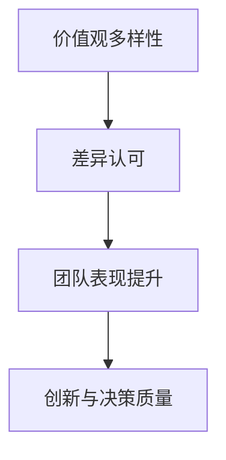
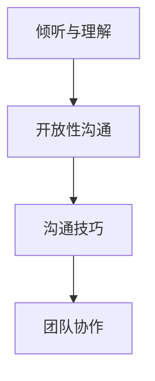
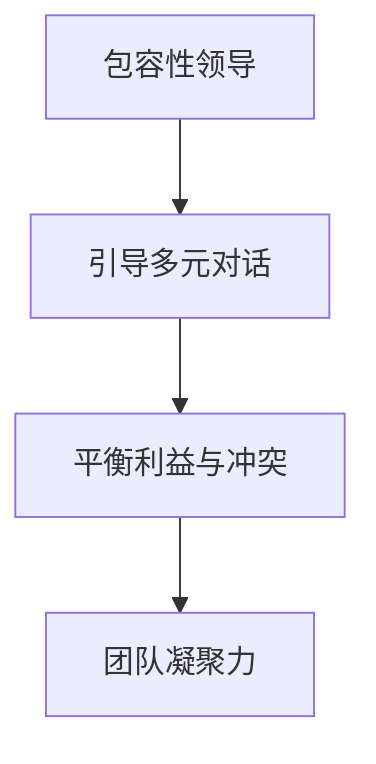

                 


### 文章标题：多元化管理：maximizing团队差异化优势

> 关键词：多元化管理、团队差异、差异化优势、组织文化、人力资源管理、领导力发展、战略规划

> 摘要：本文将深入探讨多元化管理的概念、重要性及其在组织各个层面的应用，通过一系列的步骤分析和推理，揭示多元化管理如何最大化团队的差异化优势，为组织带来创新和竞争力。

---

### 《多元化管理：maximizing团队差异化优势》目录大纲

#### 第一部分：多元化管理的基础

#### 第1章：多元化管理的概念与重要性

#### 第2章：多元化管理的核心原则

#### 第3章：构建多元化的团队

#### 第二部分：多元化管理的实践应用

#### 第4章：多元化管理在组织文化中的应用

#### 第5章：多元化管理在人力资源管理中的应用

#### 第6章：多元化管理在领导力发展中的应用

#### 第7章：多元化管理在战略规划中的应用

#### 第三部分：多元化管理的案例研究

#### 第8章：多元化管理实践案例

#### 第9章：多元化管理的未来趋势与展望

#### 附录

#### 附录A：多元化管理相关的工具与方法

---

### 第一部分：多元化管理的基础

#### 第1章：多元化管理的概念与重要性

多元化管理指的是在组织的管理活动中，充分利用员工之间的差异性，包括性别、年龄、教育背景、工作经验、文化背景等多方面的差异，来提高组织的创新能力和竞争力。

##### 1.1 多元化的定义

多元化不仅仅是种族、性别、年龄等表面的差异，它还包括认知风格、沟通方式、工作经验、教育背景等深层次的差异。这些差异可以使得团队在解决问题时拥有更广阔的视角和不同的思维方式。

##### 1.2 多元化管理的意义

多元化管理具有以下几个重要意义：

- **增强创新能力**：多元化团队在解决问题时能够从不同的角度出发，提供多元化的解决方案，从而提高创新的可能性。

- **提高决策质量**：多元化的团队可以提供更加全面和深入的信息，有助于决策者做出更为明智的决策。

- **增强团队合作**：多元化的团队能够更好地处理冲突和沟通，提高团队的整体合作效率。

- **提高员工满意度**：尊重和利用多元化的团队可以增加员工的归属感和满意度。

##### 1.3 多元化管理的挑战

尽管多元化管理具有很多优势，但也面临着一些挑战：

- **文化冲突**：由于文化差异，团队成员之间可能会产生误解和冲突。

- **沟通障碍**：不同背景的团队成员在沟通时可能会存在障碍，影响团队合作。

- **管理复杂性**：多元化团队的管理需要更高的管理技巧和策略。

---

#### 第2章：多元化管理的核心原则

##### 2.1 尊重差异

尊重差异是多元化管理的核心原则之一。在多元化的团队中，每个成员都应该受到尊重和平等对待，无论其背景如何。管理者需要认识到团队成员之间的差异，并利用这些差异来提高团队的表现。

###### 核心概念与联系

在多元化管理中，尊重差异的核心概念包括：

- **价值观的多样性**：团队成员拥有不同的价值观，这些价值观可能来自于不同的文化背景、教育经历或个人信仰。

- **差异的认可**：管理者需要认可并庆祝团队成员之间的差异，而不是试图消除这些差异。

Mermaid 流程图：



###### 背景介绍

在全球化背景下，企业面临着越来越多元化的员工群体。尊重差异不仅有助于提高团队的绩效，还能够增强员工的归属感和满意度。

##### 2.2 沟通与交流

有效的沟通和交流是多元化管理的关键。在多元化的团队中，沟通不仅仅是信息的传递，更是文化、价值观和思维方式的交流。

###### 核心概念与联系

多元化管理的沟通与交流的核心概念包括：

- **倾听与理解**：管理者需要学会倾听和理解团队成员的观点和需求。

- **开放性沟通**：鼓励团队成员在团队中自由表达自己的观点和想法。

- **沟通技巧**：管理者需要具备跨文化沟通技巧，以便更好地处理多元化团队中的沟通障碍。

Mermaid 流程图：



###### 背景介绍

在多元化的团队中，有效的沟通可以帮助成员更好地理解彼此，减少误解和冲突，从而提高团队的协作效率和创新能力。

##### 2.3 多元化领导力

多元化领导力是多元化管理的另一个核心原则。多元化领导者不仅需要具备传统的领导力技能，还需要能够应对多元化团队的特殊需求。

###### 核心概念与联系

多元化领导力的核心概念包括：

- **包容性领导**：领导者需要营造一个包容的环境，让每个团队成员都能感到被尊重和重视。

- **引导多元对话**：领导者需要促进团队成员之间的多元对话，鼓励他们分享观点和想法。

- **平衡利益与冲突**：领导者需要平衡团队成员之间的利益和冲突，确保团队目标的实现。

Mermaid 流程图：



###### 背景介绍

多元化领导力在多元化的团队中尤为重要。领导者需要具备跨文化领导能力，能够理解和尊重团队成员的差异性，从而有效地引导团队实现目标。

---

#### 第3章：构建多元化的团队

构建多元化的团队是多元化管理的第一步。一个多元化的团队应该包括不同性别、年龄、教育背景、工作经验和文化背景的成员，以充分利用他们之间的差异性。

##### 3.1 多元化团队的构建步骤

构建多元化团队可以分为以下几个步骤：

1. **明确多元化目标**：在构建团队之前，组织需要明确多元化的目标，并确保所有团队成员都认同这些目标。

2. **多样化招聘策略**：组织需要采用多样化的招聘策略，以吸引不同背景的候选人。

3. **建立多元化文化**：组织需要建立多元化的文化，鼓励员工尊重和欣赏彼此的差异。

4. **培训与发展**：组织应该为团队成员提供培训和发展机会，帮助他们更好地理解和应对多元化的团队环境。

###### 核心算法原理讲解

构建多元化团队的算法原理可以概括为以下步骤：

```python
# 多元化团队构建算法

def build_diverse_team():
    # 明确多元化目标
    set_diversity_goals()
    
    # 多元化招聘策略
    recruit_diverse_candidates()
    
    # 建立多元化文化
    establish_diverse_culture()
    
    # 培训与发展
    provide_training_and_development()
    
    # 完成团队构建
    return "Diverse Team Built"

# 执行算法
build_diverse_team()
```

###### 详细讲解与举例说明

以某科技公司为例，该公司在构建多元化团队时，首先明确了多元化目标，包括提高创新能力和增强员工满意度。然后，他们采用了多样化的招聘策略，通过线上招聘、校园招聘和社会招聘等多种方式吸引不同背景的候选人。此外，公司还建立了多元化的文化，通过内部活动、培训等方式，鼓励员工尊重和欣赏彼此的差异。最后，公司为团队成员提供了丰富的培训和发展机会，帮助他们更好地适应多元化的团队环境。

---

### 第二部分：多元化管理的实践应用

#### 第4章：多元化管理在组织文化中的应用

组织文化是多元化管理的重要组成部分。一个积极、包容的组织文化能够促进多元化管理的实施和团队绩效的提升。

##### 4.1 塑造多元化组织文化

塑造多元化组织文化需要从以下几个方面入手：

- **领导层的支持**：领导层需要明确表达对多元化文化的支持，并将其融入到组织的战略和价值观中。

- **价值观的嵌入**：组织需要将多元化价值观融入到日常工作中，使其成为员工行为和决策的一部分。

- **培训和沟通**：组织需要定期举办培训活动，提高员工对多元化文化的认识和接受程度，并通过内部沟通渠道传递多元化文化的重要性。

###### 数学模型与公式

塑造多元化组织文化的数学模型可以采用以下公式：

```math
Culture\_Effectiveness = f(Diversity, Leadership, Embedding, Training)
```

其中，`Diversity`代表多元化程度，`Leadership`代表领导层的支持，`Embedding`代表价值观的嵌入，`Training`代表培训和沟通。

###### 详细讲解与举例说明

以某金融企业为例，该公司通过以下措施塑造了多元化的组织文化：

1. 领导层的支持：公司高管层明确表达了他们对多元化文化的支持，并在公司内部会议上强调多元化的重要性。

2. 价值观的嵌入：公司通过制定多元化价值观，并将其融入到公司的使命、愿景和价值观中，确保所有员工都能够理解和接受这些价值观。

3. 培训和沟通：公司定期举办多元化培训课程，提高员工对多元化文化的认识和接受程度，并通过内部邮件、公告栏和员工大会等渠道传递多元化文化的重要性。

---

#### 第5章：多元化管理在人力资源管理中的应用

多元化管理在人力资源管理中的应用主要包括多元化招聘、多元化培训与发展、多元化绩效考核与激励等方面。

##### 5.1 多元化招聘策略

多元化招聘策略旨在吸引和选拔来自不同背景的优秀人才，以提高组织的创新能力和竞争力。

- **多样性的招聘渠道**：组织应采用多样化的招聘渠道，包括线上招聘、校园招聘、社会招聘等，以吸引不同背景的候选人。

- **公平的招聘流程**：组织应确保招聘流程的公平性，避免因性别、年龄、种族等因素而歧视候选人。

- **多样化的评估标准**：组织应采用多样化的评估标准，以全面评估候选人的能力和潜力。

###### 数学模型与公式

多元化招聘策略的数学模型可以采用以下公式：

```math
Diversity\_Score = f(Sources, Process, Standards)
```

其中，`Sources`代表招聘渠道的多样性，`Process`代表招聘流程的公平性，`Standards`代表评估标准的多样性。

###### 详细讲解与举例说明

以某科技企业为例，该公司在实施多元化招聘策略时采取了以下措施：

1. 多样性的招聘渠道：公司通过线上招聘平台、社交媒体、校园招聘和猎头公司等多种渠道进行招聘，以吸引不同背景的候选人。

2. 公平的招聘流程：公司确保招聘流程的公平性，对所有候选人进行同等的面试和评估，避免因性别、年龄、种族等因素而歧视候选人。

3. 多样化的评估标准：公司采用多样化的评估标准，包括技术能力、沟通能力、团队合作能力等多个方面，全面评估候选人的能力和潜力。

---

#### 第6章：多元化管理在领导力发展中的应用

多元化管理在领导力发展中的应用旨在培养具有多元化思维和领导力的领导者，以应对多元化团队的需求。

##### 6.1 多元化领导力的培养

多元化领导力的培养可以从以下几个方面入手：

- **跨文化领导力培训**：组织应提供跨文化领导力培训，帮助领导者理解和应对不同文化背景的员工。

- **领导力发展项目**：组织应建立领导力发展项目，帮助领导者提升领导技能和管理能力。

- **导师制度**：组织可以建立导师制度，让经验丰富的领导者指导新晋领导者，帮助他们更好地适应多元化团队的管理。

###### 数学模型与公式

多元化领导力的培养的数学模型可以采用以下公式：

```math
Leadership_Diversity = f(Cross-Cultural Training, Development Programs, Mentorship)
```

其中，`Cross-Cultural Training`代表跨文化领导力培训，`Development Programs`代表领导力发展项目，`Mentorship`代表导师制度。

###### 详细讲解与举例说明

以某跨国公司为例，该公司在培养多元化领导力时采取了以下措施：

1. 跨文化领导力培训：公司定期举办跨文化领导力培训课程，帮助领导者了解不同文化背景的员工，提高跨文化沟通和协作能力。

2. 领导力发展项目：公司建立了领导力发展项目，为新晋领导者提供培训和指导，帮助他们提升领导技能和管理能力。

3. 导师制度：公司建立了导师制度，让经验丰富的领导者指导新晋领导者，分享他们的经验和教训，帮助他们更好地适应多元化团队的管理。

---

#### 第7章：多元化管理在战略规划中的应用

多元化管理在战略规划中的应用旨在通过多元化战略的制定、实施和评估，提高组织的竞争力和创新能力。

##### 7.1 多元化战略的制定

多元化战略的制定需要考虑以下几个方面：

- **市场分析**：组织应进行市场分析，了解目标市场的多元化需求，为多元化战略提供依据。

- **资源分配**：组织应合理分配资源，确保多元化战略的实施。

- **目标设定**：组织应设定明确的目标，以确保多元化战略的有效实施。

###### 数学模型与公式

多元化战略的制定的数学模型可以采用以下公式：

```math
Strategic_Diversity = f(Market_Analysis, Resource_Allocation, Goal_Setting)
```

其中，`Market_Analysis`代表市场分析，`Resource_Allocation`代表资源分配，`Goal_Setting`代表目标设定。

###### 详细讲解与举例说明

以某制造企业为例，该公司在制定多元化战略时采取了以下措施：

1. 市场分析：公司进行了详细的市场分析，了解了目标市场的多元化需求，为多元化战略提供了依据。

2. 资源分配：公司根据市场分析结果，合理分配资源，确保多元化战略的实施。

3. 目标设定：公司设定了明确的目标，包括扩大市场份额、提高产品创新能力和提升客户满意度等，以确保多元化战略的有效实施。

---

### 第三部分：多元化管理的案例研究

#### 第8章：多元化管理实践案例

通过以下三个实践案例，我们可以看到多元化管理在不同组织中的应用和成效。

##### 8.1 案例一：某科技公司的多元化管理实践

某科技公司通过多元化管理实践，取得了显著的成效。以下是该公司的具体实践措施：

1. 多元化团队建设：公司通过多样化的招聘渠道，吸引不同背景的员工，建立了一个多元化的团队。

2. 多元化文化塑造：公司建立了包容性文化，鼓励员工尊重和欣赏彼此的差异，并通过内部活动和培训，强化了多元化文化。

3. 多元化领导力培养：公司为领导者提供跨文化领导力培训，帮助他们提升领导技能和管理能力，以应对多元化团队的管理挑战。

结果：公司的创新能力和竞争力得到了显著提升，员工满意度和团队凝聚力也显著提高。

##### 8.2 案例二：某金融企业的多元化管理实践

某金融企业通过多元化管理实践，成功应对了市场多元化挑战。以下是该企业的具体实践措施：

1. 多元化招聘策略：公司采用多样化的招聘渠道，吸引来自不同文化背景的候选人，确保招聘流程的公平性。

2. 多元化培训与发展：公司为员工提供多样化的培训和发展机会，帮助他们提升跨文化沟通和协作能力。

3. 多元化绩效考核与激励：公司采用多元化的绩效考核标准，激励员工发挥各自优势，提高团队的整体绩效。

结果：公司的市场份额和客户满意度得到了显著提升，员工流动率和离职率显著降低。

##### 8.3 案例三：某跨国公司的多元化管理实践

某跨国公司通过多元化管理实践，成功实现了全球业务的多元化发展。以下是该公司的具体实践措施：

1. 多元化战略制定：公司进行详细的市场分析，了解不同市场的多元化需求，制定相应的多元化战略。

2. 多元化资源分配：公司根据市场分析结果，合理分配资源，确保多元化战略的实施。

3. 多元化目标设定：公司设定了明确的目标，包括市场份额、产品创新和客户满意度等，以确保多元化战略的有效实施。

结果：公司的全球业务得到了显著提升，创新能力得到了增强，员工满意度和团队凝聚力也显著提高。

---

#### 第9章：多元化管理的未来趋势与展望

多元化管理在未来将继续发展，并将在以下几个方面取得突破：

1. **技术的推动**：人工智能、大数据等技术将使得多元化管理更加智能化和精准化。

2. **文化的变革**：组织文化将更加注重多元化和包容性，成为多元化管理的重要组成部分。

3. **全球化的深化**：随着全球化的深化，多元化管理将更加普及和广泛应用。

4. **领导力的演变**：多元化领导力将逐渐成为领导者的必备技能，领导力培训将更加注重多元化领导力的培养。

展望未来，多元化管理将成为组织发展的关键因素，为企业带来持续的创新和竞争力。

---

### 附录

#### 附录A：多元化管理相关的工具与方法

为了帮助组织更好地实施多元化管理，以下是几种常见的工具和方法：

1. **多元化评估工具**：如Diversity Assessment Tool、Cultural Competence Assessment等，用于评估组织的多元化现状和效果。

2. **多元化沟通技巧**：如Active Listening、Emotional Intelligence等，帮助团队成员提高沟通效果和减少误解。

3. **多元化领导力模型**：如The Inclusionary Leadership Model、Diversity Competence Model等，指导领导者如何应对多元化团队的管理挑战。

4. **多元化管理相关的参考书籍与资源列表**：包括《The Diversity Challenge》、《Leading Diversity》等，提供多元化管理的理论指导和实践参考。

---

### 作者信息

作者：AI天才研究院/AI Genius Institute & 禅与计算机程序设计艺术 /Zen And The Art of Computer Programming

