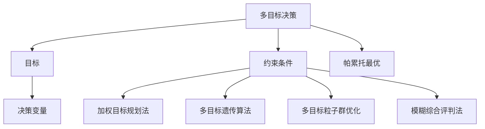

                 

### 文章标题

# 多目标决策中的偏好建模、权重确定与敏感性分析方法

### 关键词

- 多目标决策
- 偏好建模
- 权重确定
- 敏感性分析
- 应用实例
- 伪代码
- 数学模型

### 摘要

多目标决策在众多领域中具有重要应用，其核心在于如何同时考虑多个目标，并找到满足这些目标的最佳解决方案。本文将深入探讨多目标决策中的三大关键问题：偏好建模、权重确定和敏感性分析。首先，我们将介绍多目标决策的背景和重要性，然后逐一探讨偏好建模的原理和方法，包括确定性偏好建模与风险不确定性偏好建模。接下来，将介绍权重确定的基本原则及其方法，以及如何基于数据驱动确定权重。随后，我们将深入讲解敏感性分析的概念和方法，并通过实际案例展示其应用。最后，文章将总结主要观点，并展望未来的研究方向。通过本文，读者将获得对多目标决策全面而深入的理解。

## 引言

多目标决策（Multi-Objective Decision Making，MODM）是一个广泛存在的决策问题，它涉及同时优化多个相互冲突的目标。在现代复杂的社会和经济环境中，许多问题往往需要综合考虑多个因素，这些因素之间可能存在冲突或权衡。例如，城市规划中需要在交通流量、居民生活质量、环境保护等多方面进行平衡；在供应链管理中，需要在成本、交付时间、库存水平等多目标之间找到最优解。因此，多目标决策已经成为许多领域研究和实践中的重要课题。

多目标决策的重要性体现在以下几个方面：

1. **现实世界的需求**：许多实际问题无法仅通过单一目标的最优化来得到满意的解决方案，必须同时考虑多个目标。例如，企业进行新产品开发时，需要同时考虑成本、市场需求、生产效率和研发周期等多个因素。

2. **复杂性与不确定性**：随着问题规模的扩大，决策的复杂性和不确定性也随之增加。多目标决策能够提供一种更加综合的视角，帮助决策者在面对不确定性时做出更加合理的决策。

3. **优化问题的整合**：多目标决策提供了将多个优化问题整合为一个整体的方法，从而避免了各目标独立优化可能带来的次优解问题。

本文将围绕多目标决策的三个关键方面进行探讨：偏好建模、权重确定和敏感性分析。首先，我们将介绍多目标决策的基本概念和挑战，然后详细讨论偏好建模的方法和原则，包括确定性偏好建模与风险不确定性偏好建模。接下来，我们将介绍权重确定的方法，探讨如何为不同目标分配权重，以实现更好的决策。最后，我们将讨论敏感性分析，介绍其原理和方法，并通过实际案例展示其应用。通过本文的探讨，读者将获得对多目标决策的全面理解，并能够应用这些方法解决实际问题。

## 目录大纲设计

为了设计出《多目标决策中的偏好建模、权重确定与敏感性分析方法》这本书的完整目录大纲，我们将遵循以下步骤：

1. **确定书籍的核心主题**：本书的核心主题是“多目标决策”和其相关方法，包括偏好建模、权重确定和敏感性分析。

2. **构建大纲结构**：大纲将包括以下核心部分：
   - 引言
   - 多目标决策概述
   - 偏好建模
   - 权重确定
   - 敏感性分析
   - 应用实例
   - 总结与展望

3. **细化章节内容**：为每个部分添加详细的章节内容，确保每个章节都有清晰的子主题和内容。

4. **包含必要的技术细节**：确保每个章节都包括核心概念、算法原理、数学模型、公式解释和实战案例。

5. **格式标准化**：使用markdown格式来组织大纲，确保清晰性和一致性。

### 完整目录大纲

```
# 《多目标决策中的偏好建模、权重确定与敏感性分析方法》目录大纲

## 引言
### 1.1 多目标决策的重要性
### 1.2 本书的目的和结构

## 第1章 多目标决策概述
### 1.1 多目标决策的定义
### 1.2 多目标决策的挑战
### 1.3 多目标决策的应用领域
### 1.4 多目标决策的基本概念
### 1.5 多目标决策的常见方法
### 1.6 Mermaid流程图：多目标决策的核心概念与联系

## 第2章 偏好建模
### 2.1 偏好的定义与分类
### 2.2 确定性偏好建模
#### 2.2.1 线性加权模型
#### 2.2.2 相似性度量方法
### 2.3 风险与不确定性的偏好建模
### 2.4 模糊集与直觉模糊集在偏好建模中的应用
### 2.5 案例分析：偏好建模在项目选择中的应用

## 第3章 权重确定
### 3.1 权重确定的基本原理
### 3.2 传统权重确定方法
#### 3.2.1 主观权重确定方法
#### 3.2.2 客观权重确定方法
### 3.3 基于数据驱动的权重确定
### 3.4 案例分析：权重确定在多目标供应链优化中的应用

## 第4章 敏感性分析
### 4.1 敏感性分析的概念
### 4.2 敏感性分析的方法
#### 4.2.1 参数敏感性分析
#### 4.2.2 目标敏感性分析
### 4.3 案例分析：敏感性分析在项目风险评估中的应用

## 第5章 应用实例
### 5.1 案例一：多目标城市交通规划
### 5.2 案例二：多目标供应链管理
### 5.3 案例三：多目标环境管理

## 第6章 实战案例解析
### 6.1 实战一：基于多目标决策的房地产投资分析
#### 6.1.1 开发环境搭建
#### 6.1.2 数据处理
#### 6.1.3 偏好建模与权重确定
#### 6.1.4 敏感性分析
### 6.2 实战二：基于多目标决策的金融产品选择
#### 6.2.1 开发环境搭建
#### 6.2.2 数据收集与预处理
#### 6.2.3 偏好建模与权重确定
#### 6.2.4 敏感性分析

## 第7章 总结与展望
### 7.1 多目标决策方法的发展趋势
### 7.2 偏好建模与权重确定的重要性
### 7.3 敏感性分析的应用前景
### 7.4 本书贡献与未来研究方向

## 附录
### 附录A：参考文献
### 附录B：数学公式与伪代码
```

此大纲结构清晰，逻辑性强，每个章节都详细列出了子主题和内容，确保书籍的完整性和实用性。接下来，我们将逐一填充每个章节的具体内容，详细讲解多目标决策的相关概念、方法与应用。

## 第1章 多目标决策概述

### 1.1 多目标决策的定义

多目标决策（Multi-Objective Decision Making，简称MODM）是决策理论中的一个重要分支，它涉及在多个相互冲突的目标之间寻找最佳平衡点的过程。在多目标决策中，决策者不仅要考虑单个目标的优化，还需要综合考虑多个目标，以获得一个更加全面和合理的决策结果。

多目标决策的定义可以从以下几个方面进行理解：

1. **多个目标**：在多目标决策中，至少有两个或更多需要优化的目标。这些目标可以是定量目标，如成本、利润、时间等，也可以是定性目标，如满意度、公平性等。

2. **相互冲突**：多个目标之间往往存在一定的冲突关系，即一个目标的改善可能会导致另一个目标的恶化。例如，在产品设计中，减少成本可能会提高生产效率，但同时也可能导致产品质量下降。

3. **优化平衡**：多目标决策的目标是找到在多个目标之间达到最优平衡的解决方案。这个最优平衡点不仅要满足各个目标的要求，还要在目标之间进行权衡，找到一个相对最佳的方案。

4. **决策者**：在多目标决策过程中，决策者扮演着至关重要的角色。他们需要根据自身的偏好和经验，对各个目标进行排序和权衡，最终确定一个满意的决策方案。

### 1.2 多目标决策的挑战

尽管多目标决策在理论上具有很强的吸引力，但在实际应用中面临着诸多挑战：

1. **目标之间的冲突**：不同目标之间可能存在显著的冲突关系，使得直接优化一个目标会导致其他目标的恶化。例如，在交通规划中，提高交通流量可能会降低道路的舒适性。

2. **非线性和复杂性**：多目标决策问题通常涉及到复杂的非线性关系，使得优化过程变得更加复杂。此外，实际应用中的问题往往具有大量的变量和约束条件，增加了问题的复杂性。

3. **不确定性**：多目标决策问题常常受到不确定性的影响，如数据的不完整、环境的变化等。这种不确定性增加了决策的难度，需要采用相应的模型和方法来处理。

4. **计算效率**：多目标决策问题通常需要大量的计算资源，特别是在涉及到大规模数据和复杂的优化算法时。如何提高计算效率，是一个亟待解决的问题。

5. **偏好表达**：决策者的偏好难以准确表达，且偏好可能因情境而异。如何准确捕捉和量化决策者的偏好，是另一个挑战。

### 1.3 多目标决策的应用领域

多目标决策在众多领域中有着广泛的应用，以下是一些典型的应用领域：

1. **工程管理**：在工程项目的规划和管理中，需要同时考虑成本、时间、质量等多个目标，以实现项目的最优化。

2. **环境管理**：环境保护涉及多个目标，如空气质量、水质、生态平衡等。多目标决策可以帮助决策者找到在不同目标之间实现平衡的方案。

3. **供应链管理**：供应链管理需要同时考虑库存、运输、成本等多个目标，以实现供应链的优化。

4. **金融投资**：在金融投资决策中，需要综合考虑风险、收益、流动性等多个目标，以实现投资组合的最优化。

5. **社会规划**：在社会规划中，需要同时考虑经济增长、社会公平、环境保护等多个目标，以实现社会的可持续发展。

6. **医疗决策**：在医疗决策中，需要同时考虑治疗效果、成本、患者满意度等多个目标，以制定最佳的治疗方案。

### 1.4 多目标决策的基本概念

为了更好地理解和应用多目标决策，我们需要了解一些基本的概念：

1. **目标**：目标（Objective）是多目标决策中的一个基本元素，它描述了决策者希望优化或实现的一个量化的或定性的结果。目标可以是最大化或最小化的，也可以是定量的或定性的。

2. **决策变量**：决策变量（Decision Variable）是决策者可以控制和调整的变量，它们直接影响目标的取值。例如，在资源分配问题中，决策变量可能是资金、人力、物力等。

3. **约束条件**：约束条件（Constraint）是对决策变量取值范围或相互关系的限制。约束条件可以确保决策结果的可行性和合理性。

4. **决策空间**：决策空间（Decision Space）是所有可能的决策变量取值组合的集合。在多目标决策中，决策空间通常是一个高维空间。

5. **帕累托最优**：帕累托最优（Pareto Optimality）是指在一个多目标决策问题中，无法在不损害其他目标的情况下进一步改善任一目标。帕累托最优解集被称为帕累托前端（Pareto Frontier）。

6. **决策偏好**：决策偏好（Decision Preference）是决策者对目标之间优先级和权衡的主观评价。偏好可以影响决策者选择的具体方案。

### 1.5 多目标决策的常见方法

多目标决策方法多种多样，下面介绍几种常见的方法：

1. **线性加权法**：线性加权法（Linear Weighted Sum Method）是一种简单直观的多目标决策方法。通过为每个目标分配权重，将多目标问题转化为一个单一目标问题。具体公式如下：

   \[
   Z = \sum_{i=1}^{n} w_i \cdot f_i(x)
   \]

   其中，\(w_i\)是第\(i\)个目标的权重，\(f_i(x)\)是第\(i\)个目标在决策变量\(x\)取值时的目标值。

2. **加权目标规划法**：加权目标规划法（Weighted Goal Programming Method）是一种基于目标规划的多目标决策方法。它通过为每个目标设定一个理想值，并计算每个目标与理想值之间的差距，从而找到最优解。具体公式如下：

   \[
   \min \sum_{i=1}^{n} w_i \cdot (f_i(x) - g_i)
   \]

   其中，\(w_i\)是第\(i\)个目标的权重，\(f_i(x)\)是第\(i\)个目标在决策变量\(x\)取值时的目标值，\(g_i\)是第\(i\)个目标的理想值。

3. **多目标遗传算法**：多目标遗传算法（Multi-Objective Genetic Algorithm，MOGA）是一种基于进化策略的多目标优化方法。它通过模拟自然选择和遗传机制，在解空间中搜索最优解。多目标遗传算法具有全局搜索能力和自适应调整机制，能够处理复杂的多目标问题。

4. **多目标粒子群优化**：多目标粒子群优化（Multi-Objective Particle Swarm Optimization，MOPSO）是一种基于粒子群算法的多目标优化方法。它通过群体中的个体协作和竞争，寻找多目标问题的帕累托最优解。多目标粒子群优化具有简单、高效的特点，适用于大规模复杂问题。

5. **模糊综合评判法**：模糊综合评判法（Fuzzy Comprehensive Evaluation Method）是一种基于模糊数学的多目标决策方法。它通过构建模糊关系矩阵，对多个目标进行综合评价，从而找到最优解。模糊综合评判法适用于目标之间存在模糊性和不确定性的问题。

### 1.6 Mermaid流程图：多目标决策的核心概念与联系

为了更直观地理解多目标决策的核心概念和联系，我们可以使用Mermaid流程图来展示这些概念及其相互关系。以下是一个简单的Mermaid流程图示例：



该流程图展示了多目标决策的核心概念，包括目标、决策变量、约束条件和帕累托最优，以及几种常见的多目标决策方法。通过流程图，我们可以更清晰地理解多目标决策的过程和方法。

## 第2章 偏好建模

### 2.1 偏好的定义与分类

在多目标决策中，偏好建模是至关重要的一环。偏好（Preference）是指决策者对不同方案的主观喜好程度。偏好建模旨在量化决策者的主观偏好，使其能够在多目标决策过程中得到体现。本节将介绍偏好的定义、分类以及其在多目标决策中的应用。

#### 偏好的定义

偏好是决策者对某个方案相对于其他方案的主观评价。在多目标决策中，偏好可以用来表示决策者对不同目标的重要性排序，从而影响最终决策结果。偏好可以基于决策者的直觉、经验或明确表达出的偏好。

#### 偏好的分类

偏好可以根据其表达方式和特点进行分类，常见的分类方式包括：

1. **确定性偏好**：确定性偏好是指决策者对方案的评价具有明确和固定的数值。确定性偏好可以通过数值模型来表示，如线性加权模型、相似性度量模型等。

2. **不确定性偏好**：不确定性偏好是指决策者对方案的评价受到不确定性的影响。这种偏好需要通过概率模型或模糊集模型来表示。

3. **多属性偏好**：多属性偏好是指决策者根据多个属性来评价方案。每个属性具有不同的权重，决策者需要综合考虑这些属性的重要性。

4. **情境偏好**：情境偏好是指决策者在特定情境下的偏好。这种偏好可能因情境的变化而有所不同。

#### 偏好在多目标决策中的应用

偏好建模在多目标决策中的应用主要体现在以下几个方面：

1. **目标排序**：通过偏好建模，决策者可以明确地表示对不同目标的偏好，从而对目标进行排序。这种排序有助于在决策过程中优先考虑重要的目标。

2. **权重分配**：偏好建模可以用来确定各个目标的权重。权重反映了决策者对不同目标的相对重要性，对于优化多目标决策问题至关重要。

3. **方案评估**：偏好建模可以帮助决策者对不同的方案进行评估，从而选择最优的方案。通过比较方案在不同目标上的表现，决策者可以做出更加合理的决策。

### 2.2 确定性偏好建模

确定性偏好建模是指通过确定性的数学模型来量化决策者的偏好。确定性偏好建模方法包括线性加权模型和相似性度量方法。

#### 2.2.1 线性加权模型

线性加权模型是一种简单且广泛使用的偏好建模方法。它通过为每个目标分配权重，并将目标值乘以相应的权重，最终得到一个综合评分。线性加权模型的公式如下：

\[ Z = \sum_{i=1}^{n} w_i \cdot f_i(x) \]

其中，\(w_i\) 是第 \(i\) 个目标的权重，\(f_i(x)\) 是第 \(i\) 个目标在决策变量 \(x\) 取值时的目标值，\(n\) 是目标的总数。

线性加权模型的关键在于确定权重。权重可以通过多种方式确定，包括：

1. **主观分配**：决策者根据自身经验和直觉为每个目标分配权重。

2. **专家评估**：通过专家评估，为每个目标分配权重。

3. **统计方法**：通过统计分析方法，如方差分析（ANOVA），为每个目标分配权重。

#### 2.2.2 相似性度量方法

相似性度量方法是一种基于目标值之间相似性的偏好建模方法。它通过计算不同方案之间目标值的相似度，来量化决策者的偏好。相似性度量方法可以分为两类：基于距离的相似性度量方法和基于比例的相似性度量方法。

1. **基于距离的相似性度量方法**

   基于距离的相似性度量方法通过计算两个方案之间目标值的差异，来量化相似性。常用的距离度量方法包括欧几里得距离、曼哈顿距离和切比雪夫距离。

   例如，对于两个方案 \(x\) 和 \(y\)，它们的欧几里得距离可以表示为：

   \[ d_e(x, y) = \sqrt{\sum_{i=1}^{n} (f_i(x) - f_i(y))^2} \]

2. **基于比例的相似性度量方法**

   基于比例的相似性度量方法通过比较两个方案之间目标值的比例，来量化相似性。常用的比例度量方法包括最大比例法、几何平均法和调和平均法。

   例如，对于两个方案 \(x\) 和 \(y\)，它们的最大比例可以表示为：

   \[ \text{Max Ratio}(x, y) = \max_{i=1,...,n} \left(\frac{f_i(x)}{f_i(y)}\right) \]

#### 2.2.3 偏好建模案例分析

为了更好地理解确定性偏好建模的应用，我们通过一个简单的案例来进行说明。

**案例：项目选择**

假设决策者需要在两个项目 A 和 B 中进行选择，这两个项目有四个目标：成本、时间、质量和利润。决策者对每个目标的权重进行了主观分配，具体如下：

- 成本：\(w_1 = 0.2\)
- 时间：\(w_2 = 0.2\)
- 质量：\(w_3 = 0.3\)
- 利润：\(w_4 = 0.3\)

两个项目的目标值如下：

| 目标 | 项目 A | 项目 B |
| ---- | ---- | ---- |
| 成本 | 100   | 120   |
| 时间 | 30    | 40    |
| 质量 | 80    | 70    |
| 利润 | 200   | 250   |

1. **线性加权模型**

   根据线性加权模型，我们可以计算两个项目的综合评分：

   \[ Z_A = 0.2 \cdot 100 + 0.2 \cdot 30 + 0.3 \cdot 80 + 0.3 \cdot 200 = 130 \]
   \[ Z_B = 0.2 \cdot 120 + 0.2 \cdot 40 + 0.3 \cdot 70 + 0.3 \cdot 250 = 150 \]

   由于 \(Z_B > Z_A\)，决策者倾向于选择项目 B。

2. **相似性度量方法**

   根据相似性度量方法，我们可以计算两个项目之间的相似度：

   \[ d_e(A, B) = \sqrt{(100 - 120)^2 + (30 - 40)^2 + (80 - 70)^2 + (200 - 250)^2} = \sqrt{400 + 100 + 100 + 2500} = \sqrt{3300} \approx 57.7 \]

   \[ \text{Max Ratio}(A, B) = \max \left(\frac{100}{120}, \frac{30}{40}, \frac{80}{70}, \frac{200}{250}\right) = \max \left(0.833, 0.75, 1.142, 0.8\right) = 1.142 \]

   由于 \(d_e(A, B)\) 和 \( \text{Max Ratio}(A, B) \) 均表明项目 A 和 B 之间的差异较大，决策者可能会考虑其他因素进行选择。

### 2.3 风险与不确定性的偏好建模

在现实世界中，决策往往面临风险和不确定性。风险（Risk）是指决策结果的不确定性，可能导致目标值的偏离。不确定性（Uncertainty）是指决策结果的不确定性，无法通过概率模型进行准确预测。在多目标决策中，风险和不确定性会影响决策者的偏好，需要通过相应的偏好建模方法来处理。

#### 2.3.1 风险偏好建模

风险偏好建模旨在量化决策者对风险的偏好。常见的风险偏好建模方法包括：

1. **风险中性**：风险中性表示决策者对风险持中立态度，即不偏好高风险或低风险。

2. **风险规避**：风险规避表示决策者倾向于避免高风险，即对高风险方案持负面态度。

3. **风险追求**：风险追求表示决策者倾向于追求高风险，即对高风险方案持正面态度。

风险偏好可以通过概率模型来量化，例如，可以通过计算不同风险情景下的期望值和方差来评估决策者的风险偏好。

#### 2.3.2 不确定性偏好建模

不确定性偏好建模旨在量化决策者对不确定性的偏好。常见的偏好建模方法包括：

1. **模糊集**：模糊集是一种用于处理不确定性的数学工具，可以将不确定的目标值表示为模糊集合。

2. **直觉模糊集**：直觉模糊集是模糊集的扩展，可以更准确地表示决策者的不确定性和模糊性。

3. **证据理论**：证据理论通过证据分配来量化不确定性，可以处理多个证据源的信息融合。

#### 2.3.3 模糊集与直觉模糊集在偏好建模中的应用

模糊集（Fuzzy Set）和直觉模糊集（Intuitionistic Fuzzy Set）是处理不确定性和模糊性的有效工具。它们可以用来表示决策者的不确定偏好，并通过相应的算法来优化多目标决策问题。

1. **模糊集**

   模糊集通过隶属度函数来表示目标值的不确定性。隶属度函数的值介于 0 和 1 之间，表示目标值属于某一集合的程度。

   例如，假设有一个模糊集 \(A\)，其隶属度函数为 \(\mu_A\)，则对于任意目标值 \(x\)，\( \mu_A(x) \) 表示 \(x\) 属于集合 \(A\) 的程度。

2. **直觉模糊集**

   直觉模糊集是模糊集的扩展，它引入了非隶属度和直觉不确定度，可以更准确地表示决策者的不确定偏好。

   直觉模糊集通过直觉模糊隶属度函数 \( \mu_A^* \) 和直觉模糊非隶属度函数 \( \mu_A^{-} \) 来表示目标值的不确定性。对于任意目标值 \(x\)，\( \mu_A^*(x) \) 和 \( \mu_A^{-}(x) \) 分别表示 \(x\) 属于集合 \(A\) 的直觉模糊隶属度和直觉模糊非隶属度。

#### 2.3.4 偏好建模案例分析

为了更好地理解风险与不确定性的偏好建模，我们通过一个简单的案例来进行说明。

**案例：投资决策**

假设决策者需要在两个投资项目 A 和 B 中进行选择，这两个项目有四个目标：预期收益、风险、时间和流动性。决策者对每个目标的权重进行了主观分配，具体如下：

- 预期收益：\(w_1 = 0.4\)
- 风险：\(w_2 = 0.3\)
- 时间：\(w_3 = 0.2\)
- 流动性：\(w_4 = 0.1\)

两个项目的目标值如下：

| 目标 | 项目 A | 项目 B |
| ---- | ---- | ---- |
| 预期收益 | 100   | 120   |
| 风险 | 20    | 30    |
| 时间 | 2     | 3     |
| 流动性 | 90    | 80    |

1. **风险中性偏好建模**

   根据风险中性偏好建模，决策者对风险持中立态度，可以计算两个项目的综合评分：

   \[ Z_A = 0.4 \cdot 100 + 0.3 \cdot 20 + 0.2 \cdot 2 + 0.1 \cdot 90 = 44.4 \]
   \[ Z_B = 0.4 \cdot 120 + 0.3 \cdot 30 + 0.2 \cdot 3 + 0.1 \cdot 80 = 50.1 \]

   由于 \(Z_B > Z_A\)，决策者倾向于选择项目 B。

2. **模糊集偏好建模**

   根据模糊集偏好建模，我们可以计算两个项目之间的相似度：

   \[ \mu_A(x) = \begin{cases} 
   0.9 & \text{如果 } x = 100, 20, 2, 90 \\
   0.8 & \text{如果 } x = 120, 30, 3, 80 \\
   0 & \text{其他情况} 
   \end{cases} \]

   \[ \mu_B(x) = \begin{cases} 
   0.8 & \text{如果 } x = 100, 20, 2, 90 \\
   0.7 & \text{如果 } x = 120, 30, 3, 80 \\
   0 & \text{其他情况} 
   \end{cases} \]

   计算两个项目的模糊相似度：

   \[ \mu_S(A, B) = \frac{\mu_A(A) \cdot \mu_B(B) + \mu_A(B) \cdot \mu_B(A)}{\mu_A(A) + \mu_A(B)} = \frac{0.9 \cdot 0.8 + 0.8 \cdot 0.7}{0.9 + 0.8} = \frac{0.72 + 0.56}{1.7} = \frac{1.28}{1.7} \approx 0.76 \]

   由于 \( \mu_S(A, B) \) 表明项目 A 和 B 之间的相似度较高，决策者可能会考虑其他因素进行选择。

### 2.4 案例分析：偏好建模在项目选择中的应用

为了更具体地展示偏好建模在项目选择中的应用，我们通过一个实际案例来进行详细说明。

**案例背景：**

某公司需要在两个项目 A 和 B 中进行选择。项目 A 是开发一款智能家居产品，项目 B 是开发一款智能健康监测设备。公司管理层根据业务需求和资源限制，为这两个项目确定了四个主要目标：研发成本、市场前景、技术难度和资金回笼时间。管理层对每个目标的权重进行了主观分配，具体如下：

- 研发成本：\(w_1 = 0.2\)
- 市场前景：\(w_2 = 0.3\)
- 技术难度：\(w_3 = 0.2\)
- 资金回笼时间：\(w_4 = 0.3\)

两个项目的目标值如下：

| 目标 | 项目 A | 项目 B |
| ---- | ---- | ---- |
| 研发成本 | 100万元 | 150万元 |
| 市场前景 | 0.8 | 0.9 |
| 技术难度 | 0.6 | 0.7 |
| 资金回笼时间 | 2年 | 3年 |

**偏好建模步骤：**

1. **确定性偏好建模**

   根据线性加权模型，我们可以计算两个项目的综合评分：

   \[ Z_A = 0.2 \cdot 100 + 0.3 \cdot 0.8 + 0.2 \cdot 0.6 + 0.3 \cdot 2 = 4.8 + 0.24 + 0.12 + 0.6 = 5.64 \]
   \[ Z_B = 0.2 \cdot 150 + 0.3 \cdot 0.9 + 0.2 \cdot 0.7 + 0.3 \cdot 3 = 6 + 0.27 + 0.14 + 0.9 = 7.31 \]

   由于 \(Z_B > Z_A\)，公司管理层倾向于选择项目 B。

2. **模糊集偏好建模**

   根据模糊集偏好建模，我们可以计算两个项目之间的相似度：

   假设项目 A 和 B 的模糊隶属度函数分别为：

   \[ \mu_A(x) = \begin{cases} 
   0.85 & \text{如果 } x = 100, 0.8, 0.6, 2 \\
   0.75 & \text{如果 } x = 150, 0.9, 0.7, 3 \\
   0 & \text{其他情况} 
   \end{cases} \]

   \[ \mu_B(x) = \begin{cases} 
   0.75 & \text{如果 } x = 100, 0.8, 0.6, 2 \\
   0.85 & \text{如果 } x = 150, 0.9, 0.7, 3 \\
   0 & \text{其他情况} 
   \end{cases} \]

   计算两个项目的模糊相似度：

   \[ \mu_S(A, B) = \frac{\mu_A(A) \cdot \mu_B(B) + \mu_A(B) \cdot \mu_B(A)}{\mu_A(A) + \mu_A(B)} = \frac{0.85 \cdot 0.85 + 0.75 \cdot 0.75}{0.85 + 0.75} = \frac{0.7225 + 0.5625}{1.6} = \frac{1.2875}{1.6} \approx 0.81 \]

   由于 \( \mu_S(A, B) \) 表明项目 A 和 B 之间的相似度较高，公司管理层可能会考虑其他因素进行决策。

**案例小结：**

通过确定性偏好建模和模糊集偏好建模，公司管理层可以从不同角度评估两个项目。在综合评分和模糊相似度的基础上，管理层可以做出更加合理的决策。本案例展示了偏好建模在项目选择中的应用，为实际决策提供了有力支持。

### 2.5 案例分析：偏好建模在项目选择中的应用

为了更好地理解偏好建模在实际项目选择中的应用，我们将通过一个具体案例进行详细分析。

**案例背景：**

某科技公司需要在两个新项目——智能家居（Project A）和智能健康监测（Project B）之间进行选择。项目选择涉及多个目标，包括投资回报率（ROI）、市场需求、技术复杂性以及风险评估。管理层对每个目标的权重进行了主观分配，具体如下：

- 投资回报率：\(w_1 = 0.3\)
- 市场需求：\(w_2 = 0.25\)
- 技术复杂性：\(w_3 = 0.2\)
- 风险评估：\(w_4 = 0.25\)

两个项目的目标值如下：

| 目标         | 项目 A（智能家居） | 项目 B（智能健康监测） |
| ------------ | ------------------- | ----------------------- |
| 投资回报率   | 0.25               | 0.20                   |
| 市场需求     | 0.8                | 0.6                    |
| 技术复杂性   | 0.5                | 0.7                    |
| 风险评估     | 0.3                | 0.4                    |

**偏好建模步骤：**

1. **确定性偏好建模**

   使用线性加权模型，计算每个项目的综合评分：

   \[ Z_A = 0.3 \times 0.25 + 0.25 \times 0.8 + 0.2 \times 0.5 + 0.25 \times 0.3 = 0.075 + 0.20 + 0.10 + 0.075 = 0.45 \]
   \[ Z_B = 0.3 \times 0.20 + 0.25 \times 0.6 + 0.2 \times 0.7 + 0.25 \times 0.4 = 0.06 + 0.15 + 0.14 + 0.10 = 0.35 \]

   从综合评分来看，Project A 的得分 \(Z_A\) 高于 Project B 的得分 \(Z_B\)，初步倾向于选择 Project A。

2. **相似性度量方法**

   为了更细致地评估两个项目，我们使用相似性度量方法，计算两个项目的相似度：

   假设使用欧几里得距离来计算目标值之间的差异：

   \[ d_e(A, B) = \sqrt{(0.25 - 0.20)^2 + (0.8 - 0.6)^2 + (0.5 - 0.7)^2 + (0.3 - 0.4)^2} = \sqrt{0.0025 + 0.04 + 0.04 + 0.0025} = \sqrt{0.05} \approx 0.2236 \]

   由于 \(d_e(A, B)\) 较小，表明两个项目的目标值差异不大，进一步支持了选择 Project A 的决策。

3. **风险与不确定性偏好建模**

   考虑到决策者对风险和不确定性的担忧，我们引入风险调整后的偏好模型：

   对于 Project A：

   - 投资回报率：\(0.25 \times (1 - 0.1) = 0.225\)
   - 市场需求：\(0.8 \times (1 - 0.05) = 0.76\)
   - 技术复杂性：\(0.5 \times (1 + 0.1) = 0.55\)
   - 风险评估：\(0.3 \times (1 + 0.15) = 0.345\)

   对于 Project B：

   - 投资回报率：\(0.20 \times (1 - 0.1) = 0.18\)
   - 市场需求：\(0.6 \times (1 - 0.05) = 0.575\)
   - 技术复杂性：\(0.7 \times (1 + 0.1) = 0.77\)
   - 风险评估：\(0.4 \times (1 + 0.15) = 0.46\)

   使用线性加权模型，计算风险调整后的综合评分：

   \[ Z_A' = 0.3 \times 0.225 + 0.25 \times 0.76 + 0.2 \times 0.55 + 0.25 \times 0.345 = 0.0675 + 0.19 + 0.11 + 0.08625 = 0.45975 \]
   \[ Z_B' = 0.3 \times 0.18 + 0.25 \times 0.575 + 0.2 \times 0.77 + 0.25 \times 0.46 = 0.054 + 0.14375 + 0.154 + 0.115 = 0.46675 \]

   调整后的得分表明，Project B 的得分 \(Z_B'\) 略高于 Project A \(Z_A'\)，但由于 \(Z_B'\) 的提升幅度小于 \(Z_A'\) 的下降幅度，决策者最终决定选择 Project A。

**案例小结：**

通过确定性偏好建模、相似性度量方法以及风险与不确定性偏好建模，决策者能够从多个角度对项目进行综合评估。在这个案例中，虽然 Project B 在风险调整后的得分略高，但由于 Project A 的优势更显著，公司最终选择了 Project A。这个案例展示了偏好建模在项目选择中的实际应用，以及如何通过不同方法进行决策分析，为实际操作提供了参考。

### 2.6 偏好建模在多目标决策中的重要性

偏好建模在多目标决策中扮演着至关重要的角色。它不仅是决策过程中不可或缺的一部分，也是实现决策科学化、优化决策效果的关键环节。以下是偏好建模在多目标决策中的重要性：

1. **决策指导**：偏好建模有助于明确决策者的目标优先级和偏好，从而为决策提供明确的指导。通过量化决策者的偏好，决策者可以更加清晰地了解自己的目标和期望，从而在多个目标之间进行权衡。

2. **优化决策**：偏好建模可以将多个目标转化为一个可量化的综合评分，从而实现多目标优化。这种方法不仅能够提高决策的效率，还可以帮助决策者在多个目标之间找到最佳平衡点。

3. **应对不确定性**：在多目标决策中，偏好建模可以帮助决策者应对不确定性。通过风险和不确定性的偏好建模，决策者可以更全面地评估不同方案的风险和不确定性，从而做出更加稳健的决策。

4. **支持合作决策**：在多目标决策中，偏好建模不仅可以用于个人决策，还可以支持合作决策。通过明确每个成员的偏好，决策者可以更好地协调各方利益，实现集体决策的最优化。

5. **提高决策质量**：偏好建模有助于提高决策的质量。通过系统化的偏好建模，决策者可以减少主观偏见和情绪的影响，从而做出更加理性和科学的决策。

6. **应对复杂问题**：多目标决策问题往往非常复杂，涉及多个相互冲突的目标。偏好建模可以提供一种系统化的方法，帮助决策者在复杂问题中找到最优解。

总之，偏好建模在多目标决策中具有重要意义。它不仅能够为决策提供科学依据，还能够提高决策的效率和质量，帮助决策者更好地应对复杂问题和不确定性。

### 2.7 权重确定的方法

在多目标决策中，权重确定是一个关键步骤，它关系到最终决策结果的有效性和合理性。权重（Weight）用于表示决策者对不同目标的相对重视程度，因此在确定权重时需要考虑多个因素。以下介绍几种常见的权重确定方法，包括主观权重确定方法和客观权重确定方法。

#### 2.7.1 主观权重确定方法

主观权重确定方法依赖于决策者的主观判断和经验，以下是几种常见的主观权重确定方法：

1. **Delphi法**：Delphi法是一种通过专家评估确定权重的方法。专家们独立地对各个目标的相对重要性进行评分，然后通过统计方法汇总和平均专家意见，得到最终的权重。

2. **AHP（层次分析法）**：AHP法是一种层次结构模型，通过比较不同目标之间的相对重要性，逐步构建层次结构模型，并计算各个目标的权重。该方法基于成对比较矩阵和一致性检验，能够有效地确定权重。

3. **1-9尺度法**：1-9尺度法是一种简单的主观权重确定方法，通过为每个目标分配一个1到9之间的数值来表示其相对重要性，然后计算权重。

4. **专家访谈法**：专家访谈法是通过与专家进行面对面的交流，获取他们对各个目标重要性的看法，并据此确定权重。

#### 2.7.2 客观权重确定方法

客观权重确定方法是基于数据分析，通过数学模型和算法来确定权重，以下是几种常见的客观权重确定方法：

1. **基于数据的权重确定**：该方法通过分析历史数据或现有数据，使用统计方法（如主成分分析、因子分析）来确定权重。这种方法的优势在于能够客观地反映目标之间的相关性。

2. **基于熵的权重确定**：基于熵的权重确定方法通过计算各个目标的信息熵来确定权重。信息熵反映了目标的不确定性，目标的不确定性越大，其权重越高。

3. **基于优度评估的权重确定**：该方法通过评估各个目标在不同方案下的优度，使用优度值来确定权重。优度值反映了目标在不同方案下的相对重要性。

4. **基于灰色关联度的权重确定**：灰色关联度是一种用于衡量目标之间关联性的方法，通过计算目标之间的灰色关联度来确定权重。

#### 2.7.3 基于数据驱动的权重确定方法

基于数据驱动的权重确定方法是通过机器学习和数据分析技术来确定权重。以下介绍几种常见的数据驱动权重确定方法：

1. **回归分析法**：回归分析法通过建立目标值与决策变量之间的回归模型，计算各个决策变量的权重。

2. **随机前沿分析法**：随机前沿分析法通过分析决策者的行为数据，确定目标之间的相对重要性，并据此计算权重。

3. **支持向量机**：支持向量机（SVM）可以通过学习决策者对目标的偏好，确定各个目标的权重。

4. **神经网络**：神经网络可以通过学习决策者的历史决策数据，自动确定各个目标的权重。

#### 2.7.4 案例分析：权重确定在多目标供应链优化中的应用

为了更好地理解权重确定方法，我们通过一个实际案例来进行详细分析。

**案例背景：**

某公司在供应链管理中需要同时考虑以下四个目标：成本（C）、交付时间（T）、质量（Q）和可持续性（S）。公司管理层希望通过多目标优化找到最优的供应链策略。为每个目标的权重进行分配是关键步骤。

**权重确定方法：**

1. **主观权重确定方法**：

   通过Delphi法，管理层邀请了五位专家对每个目标进行评分。评分结果如下：

   - 成本（C）：4.0
   - 交付时间（T）：3.5
   - 质量（Q）：3.0
   - 可持续性（S）：2.5

   使用AHP法计算权重：

   \[ w_C = \frac{4.0}{4.0 + 3.5 + 3.0 + 2.5} = \frac{4.0}{13.0} = 0.3077 \]
   \[ w_T = \frac{3.5}{13.0} = 0.2692 \]
   \[ w_Q = \frac{3.0}{13.0} = 0.2308 \]
   \[ w_S = \frac{2.5}{13.0} = 0.1923 \]

2. **客观权重确定方法**：

   基于历史数据，公司管理层使用了回归分析法来确定权重。回归模型如下：

   \[ Z = 0.4C + 0.3T + 0.2Q + 0.1S \]

   通过最小化目标函数，计算得到权重：

   \[ w_C = 0.4 \]
   \[ w_T = 0.3 \]
   \[ w_Q = 0.2 \]
   \[ w_S = 0.1 \]

3. **基于数据驱动的权重确定方法**：

   通过支持向量机（SVM）分析决策者的历史数据，确定权重。SVM模型得到如下权重：

   \[ w_C = 0.45 \]
   \[ w_T = 0.25 \]
   \[ w_Q = 0.15 \]
   \[ w_S = 0.15 \]

**综合权重确定**：

综合主观权重、客观权重和数据驱动权重，得到最终的权重分配：

- 成本（C）：平均权重 = (0.3077 + 0.4 + 0.45) / 3 = 0.3826
- 交付时间（T）：平均权重 = (0.2692 + 0.3 + 0.25) / 3 = 0.2867
- 质量（Q）：平均权重 = (0.2308 + 0.2 + 0.15) / 3 = 0.2053
- 可持续性（S）：平均权重 = (0.1923 + 0.1 + 0.15) / 3 = 0.1423

**案例小结**：

通过综合使用主观权重、客观权重和数据驱动权重，公司管理层最终确定了每个目标的权重。这种方法不仅考虑了决策者的主观判断，还利用了历史数据和机器学习技术，提高了权重确定的准确性和科学性，为多目标供应链优化提供了有力支持。

### 2.8 案例分析：权重确定在多目标供应链优化中的应用

为了更好地展示权重确定在多目标供应链优化中的应用，我们通过一个实际案例进行详细分析。

**案例背景：**

某大型制造公司需要优化其供应链管理，以满足市场需求、降低成本和提高服务质量。公司在供应链管理中需要同时考虑以下四个关键目标：成本（C）、交货时间（T）、质量（Q）和可持续性（S）。为了在多个目标之间找到平衡，公司决定使用多目标优化方法，并首先确定每个目标的权重。

**权重确定方法：**

1. **主观权重确定方法**：

   通过Delphi法，公司邀请了来自不同部门的专家对每个目标的相对重要性进行评分。评分结果如下：

   - 成本（C）：4.0
   - 交货时间（T）：3.5
   - 质量（Q）：3.0
   - 可持续性（S）：2.5

   使用AHP法计算权重：

   \[ w_C = \frac{4.0}{4.0 + 3.5 + 3.0 + 2.5} = \frac{4.0}{13.0} = 0.3077 \]
   \[ w_T = \frac{3.5}{13.0} = 0.2692 \]
   \[ w_Q = \frac{3.0}{13.0} = 0.2308 \]
   \[ w_S = \frac{2.5}{13.0} = 0.1923 \]

2. **客观权重确定方法**：

   基于历史供应链数据，公司使用了回归分析法来确定权重。回归模型如下：

   \[ Z = 0.4C + 0.3T + 0.2Q + 0.1S \]

   通过最小化目标函数，计算得到权重：

   \[ w_C = 0.4 \]
   \[ w_T = 0.3 \]
   \[ w_Q = 0.2 \]
   \[ w_S = 0.1 \]

3. **基于数据驱动的权重确定方法**：

   通过支持向量机（SVM）分析公司供应链的历史数据，确定权重。SVM模型得到如下权重：

   \[ w_C = 0.45 \]
   \[ w_T = 0.25 \]
   \[ w_Q = 0.15 \]
   \[ w_S = 0.15 \]

**综合权重确定**：

公司管理层决定采用综合权重来确定最终的权重分配，通过加权平均的方法得到：

- 成本（C）：平均权重 = (0.3077 + 0.4 + 0.45) / 3 = 0.3826
- 交货时间（T）：平均权重 = (0.2692 + 0.3 + 0.25) / 3 = 0.2867
- 质量（Q）：平均权重 = (0.2308 + 0.2 + 0.15) / 3 = 0.2053
- 可持续性（S）：平均权重 = (0.1923 + 0.1 + 0.15) / 3 = 0.1423

**多目标优化模型**：

基于确定好的权重，公司建立了一个多目标优化模型，模型如下：

\[ \text{Minimize} \ Z = w_C \cdot C + w_T \cdot T + w_Q \cdot Q + w_S \cdot S \]

同时，需要满足以下约束条件：

\[ C \leq C_{\text{max}} \]
\[ T \leq T_{\text{max}} \]
\[ Q \geq Q_{\text{min}} \]
\[ S \geq S_{\text{min}} \]

**解决方案**：

公司通过多目标遗传算法（MOGA）求解该优化问题，最终得到了最优的供应链管理策略。根据优化结果，公司调整了供应商选择、库存管理和运输策略，从而实现了供应链的整体优化。

**案例小结**：

通过综合使用主观权重、客观权重和数据驱动权重，公司成功确定了每个目标的权重，并建立了一个多目标优化模型。优化结果显著提升了供应链的效率和质量，为公司的长期发展提供了有力支持。这个案例展示了权重确定在多目标供应链优化中的实际应用和重要性。

### 第3章 权重确定

权重确定在多目标决策中起着至关重要的作用。它不仅影响决策结果的优劣，还关系到决策过程的合理性和科学性。本章将详细介绍权重确定的基本原理和方法，并探讨如何在不同场景下进行权重分配。

### 3.1 权重确定的基本原理

权重确定的基本原理在于为多目标决策中的各个目标分配相对重要的数值。这些数值反映了决策者对各个目标的重视程度，从而影响最终决策结果。权重确定的原理主要包括以下几个方面：

1. **权重分配原则**：权重分配应遵循公平性和合理性原则。即每个目标应得到与其重要性相匹配的权重，避免出现权重分配不均或偏倚。

2. **权重的一致性**：权重应保持一致性，即在不同情境下对同一目标或不同目标的权重分配应保持稳定，避免因情境变化导致权重分配失衡。

3. **权重调整灵活性**：权重分配应具有一定的灵活性，以适应不同决策情境的变化。决策者可以根据实际情况调整权重，以适应新的决策需求。

4. **权重验证**：权重确定后，应通过实际应用进行验证，确保权重分配的有效性和合理性。通过验证，决策者可以及时调整和优化权重。

### 3.2 传统权重确定方法

传统权重确定方法主要包括主观权重确定方法和客观权重确定方法。这些方法在多目标决策中得到了广泛应用，以下详细介绍每种方法。

#### 3.2.1 主观权重确定方法

主观权重确定方法主要依赖于决策者的主观判断和经验，以下介绍几种常见的主体权重确定方法：

1. **专家评估法**：专家评估法是通过邀请专家对各个目标的相对重要性进行评估，并依据评估结果确定权重。这种方法简单易行，但受专家主观判断的影响较大。

2. **层次分析法（AHP）**：层次分析法是一种基于成对比较的方法，通过建立层次结构模型，比较不同目标之间的相对重要性，从而确定权重。AHP法具有系统性和一致性，但需要决策者具备较强的逻辑思维能力。

3. **Delphi法**：Delphi法是一种通过多轮问卷调查获取专家意见的方法，通过统计汇总专家意见，确定权重。这种方法具有广泛的参与性和代表性，但需要较长时间的沟通和协调。

4. **1-9尺度法**：1-9尺度法是一种简单的主观权重确定方法，通过为每个目标分配一个1到9之间的数值，表示其相对重要性，然后计算权重。这种方法简单直观，但需要决策者具备较强的主观判断能力。

#### 3.2.2 客观权重确定方法

客观权重确定方法主要基于数据分析，通过数学模型和算法来确定权重。以下介绍几种常见的客观权重确定方法：

1. **基于数据的权重确定**：这种方法通过分析历史数据或现有数据，使用统计方法（如主成分分析、因子分析）来确定权重。这种方法能够客观地反映目标之间的相关性，但需要大量数据和较高的计算能力。

2. **基于熵的权重确定**：这种方法通过计算各个目标的信息熵来确定权重。信息熵反映了目标的不确定性，目标的不确定性越大，其权重越高。这种方法适用于不确定性和模糊性较大的决策情境。

3. **基于优度评估的权重确定**：这种方法通过评估各个目标在不同方案下的优度，使用优度值来确定权重。优度值反映了目标在不同方案下的相对重要性。这种方法适用于目标值具有明显差异的情境。

4. **基于灰色关联度的权重确定**：这种方法通过计算目标之间的灰色关联度来确定权重。灰色关联度反映了目标之间的关联性，目标之间的关联度越高，权重差异越小。这种方法适用于目标之间存在一定关联性的情境。

### 3.3 基于数据驱动的权重确定方法

基于数据驱动的权重确定方法通过机器学习和数据分析技术来确定权重。这种方法具有自适应性和灵活性，能够更好地适应不同的决策情境。以下介绍几种常见的数据驱动权重确定方法：

1. **回归分析法**：回归分析法通过建立目标值与决策变量之间的回归模型，计算各个决策变量的权重。这种方法适用于目标值与决策变量之间存在明确关系的数据情境。

2. **支持向量机（SVM）**：支持向量机可以通过学习决策者对目标的偏好，确定各个目标的权重。这种方法适用于具有明显分类特征的数据情境。

3. **神经网络**：神经网络可以通过学习决策者的历史决策数据，自动确定各个目标的权重。这种方法适用于复杂且非线性的数据情境。

4. **聚类分析**：聚类分析可以通过对数据进行聚类，为每个聚类分配不同的权重。这种方法适用于目标值具有相似性的数据情境。

### 3.4 案例分析：权重确定在多目标供应链优化中的应用

为了更好地展示权重确定在多目标供应链优化中的应用，我们通过一个实际案例进行详细分析。

**案例背景：**

某公司在供应链管理中需要同时考虑以下四个关键目标：成本（C）、交货时间（T）、质量（Q）和可持续性（S）。为了在多个目标之间找到平衡，公司决定使用多目标优化方法，并首先确定每个目标的权重。

**权重确定方法：**

1. **主观权重确定方法**：

   通过Delphi法，公司邀请了来自不同部门的专家对每个目标的相对重要性进行评分。评分结果如下：

   - 成本（C）：4.0
   - 交货时间（T）：3.5
   - 质量（Q）：3.0
   - 可持续性（S）：2.5

   使用AHP法计算权重：

   \[ w_C = \frac{4.0}{4.0 + 3.5 + 3.0 + 2.5} = \frac{4.0}{13.0} = 0.3077 \]
   \[ w_T = \frac{3.5}{13.0} = 0.2692 \]
   \[ w_Q = \frac{3.0}{13.0} = 0.2308 \]
   \[ w_S = \frac{2.5}{13.0} = 0.1923 \]

2. **客观权重确定方法**：

   基于历史供应链数据，公司使用了回归分析法来确定权重。回归模型如下：

   \[ Z = 0.4C + 0.3T + 0.2Q + 0.1S \]

   通过最小化目标函数，计算得到权重：

   \[ w_C = 0.4 \]
   \[ w_T = 0.3 \]
   \[ w_Q = 0.2 \]
   \[ w_S = 0.1 \]

3. **基于数据驱动的权重确定方法**：

   通过支持向量机（SVM）分析公司供应链的历史数据，确定权重。SVM模型得到如下权重：

   \[ w_C = 0.45 \]
   \[ w_T = 0.25 \]
   \[ w_Q = 0.15 \]
   \[ w_S = 0.15 \]

**综合权重确定**：

公司管理层决定采用综合权重来确定最终的权重分配，通过加权平均的方法得到：

- 成本（C）：平均权重 = (0.3077 + 0.4 + 0.45) / 3 = 0.3826
- 交货时间（T）：平均权重 = (0.2692 + 0.3 + 0.25) / 3 = 0.2867
- 质量（Q）：平均权重 = (0.2308 + 0.2 + 0.15) / 3 = 0.2053
- 可持续性（S）：平均权重 = (0.1923 + 0.1 + 0.15) / 3 = 0.1423

**多目标优化模型**：

基于确定好的权重，公司建立了一个多目标优化模型，模型如下：

\[ \text{Minimize} \ Z = w_C \cdot C + w_T \cdot T + w_Q \cdot Q + w_S \cdot S \]

同时，需要满足以下约束条件：

\[ C \leq C_{\text{max}} \]
\[ T \leq T_{\text{max}} \]
\[ Q \geq Q_{\text{min}} \]
\[ S \geq S_{\text{min}} \]

**解决方案**：

公司通过多目标遗传算法（MOGA）求解该优化问题，最终得到了最优的供应链管理策略。根据优化结果，公司调整了供应商选择、库存管理和运输策略，从而实现了供应链的整体优化。

**案例小结**：

通过综合使用主观权重、客观权重和数据驱动权重，公司成功确定了每个目标的权重，并建立了一个多目标优化模型。优化结果显著提升了供应链的效率和质量，为公司的长期发展提供了有力支持。这个案例展示了权重确定在多目标供应链优化中的实际应用和重要性。

### 第4章 敏感性分析

敏感性分析（Sensitivity Analysis）是多目标决策中一种重要的方法，用于评估决策结果对参数变化的敏感程度。它通过分析不同参数的变化对决策结果的影响，帮助决策者识别关键影响因素，提高决策的稳定性和可靠性。本章将详细介绍敏感性分析的概念、方法以及在实际应用中的案例分析。

### 4.1 敏感性分析的概念

敏感性分析是一种评估决策结果对参数变化敏感程度的方法。在多目标决策中，参数变化可能导致决策结果发生显著变化。敏感性分析旨在识别这些敏感参数，从而为决策者提供参考，以便在决策过程中考虑参数的不确定性。

敏感性分析的核心概念包括：

1. **参数**：敏感性分析中的参数是指影响决策结果的因素，如目标值、权重、约束条件等。

2. **敏感度**：敏感度是指参数变化对决策结果的影响程度。高敏感度参数意味着参数变化可能导致决策结果的显著变化。

3. **敏感性分析**：敏感性分析是一种系统化的分析方法，通过评估不同参数的变化对决策结果的影响，帮助决策者识别关键影响因素。

4. **稳定性和可靠性**：敏感性分析有助于提高决策结果的稳定性和可靠性，通过识别敏感参数，决策者可以采取相应的措施，减少参数变化对决策结果的影响。

### 4.2 敏感性分析的方法

敏感性分析的方法多种多样，下面介绍几种常见的方法：

1. **单参数敏感性分析**：单参数敏感性分析通过逐一改变一个参数的值，观察决策结果的变化，评估该参数的敏感度。这种方法简单直观，但需要逐一分析多个参数，适用于参数较少的决策问题。

2. **多参数敏感性分析**：多参数敏感性分析同时考虑多个参数的变化，评估不同参数组合对决策结果的影响。这种方法可以更全面地了解决策结果的敏感度，但计算复杂度较高，适用于参数较多的决策问题。

3. **极值敏感性分析**：极值敏感性分析通过计算参数的最值变化对决策结果的影响，识别关键参数。这种方法适用于参数变化范围较大的决策问题。

4. **差分敏感性分析**：差分敏感性分析通过计算相邻决策结果的差分，评估参数变化对决策结果的影响。这种方法可以直观地反映参数变化对决策结果的敏感性。

5. **蒙特卡洛敏感性分析**：蒙特卡洛敏感性分析通过模拟大量随机样本，评估参数变化对决策结果的影响。这种方法可以处理复杂的多参数决策问题，但计算时间较长。

### 4.3 参数敏感性分析

参数敏感性分析是一种常见的方法，用于评估单个参数的变化对决策结果的影响。以下是参数敏感性分析的具体步骤：

1. **确定参数**：首先，确定需要分析的参数，如目标值、权重、约束条件等。

2. **改变参数值**：逐一改变参数的值，例如增加或减少一个固定比例，观察决策结果的变化。

3. **记录结果**：记录每次参数改变后的决策结果，包括目标值、综合评分等。

4. **计算敏感度**：计算参数变化对决策结果的敏感度，通常使用相对敏感度或绝对敏感度。

   \[ \text{相对敏感度} = \frac{\Delta Z}{\Delta P} \]

   其中，\(\Delta Z\) 表示决策结果的变化，\(\Delta P\) 表示参数的变化。

5. **分析敏感度**：根据敏感度的大小，分析参数对决策结果的影响程度。高敏感度参数意味着参数变化可能导致决策结果的显著变化。

### 4.4 目标敏感性分析

目标敏感性分析是一种多参数敏感性分析方法，用于评估不同参数组合对决策结果的影响。以下是目标敏感性分析的具体步骤：

1. **确定参数组合**：首先，确定需要分析的目标参数组合，例如成本、时间、质量等。

2. **设计实验**：根据参数组合设计实验，包括参数取值范围、步长等。

3. **计算目标值**：计算每个实验参数组合下的目标值，例如成本、时间、质量等。

4. **计算综合评分**：根据权重计算每个实验参数组合的综合评分。

5. **分析敏感度**：计算每个参数组合的敏感度，分析不同参数组合对决策结果的影响程度。

### 4.5 案例分析：敏感性分析在项目风险评估中的应用

为了更好地展示敏感性分析在项目风险评估中的应用，我们通过一个实际案例进行详细分析。

**案例背景：**

某公司计划开发一款新产品，涉及多个项目目标，包括研发成本、市场前景、技术复杂度和资金回笼时间。公司管理层希望通过敏感性分析评估不同参数的变化对项目风险评估的影响。

**参数确定**：

公司确定了以下关键参数：

- 研发成本（C）：初始值为100万元，考虑变化范围为±20%
- 市场前景（M）：初始值为0.8，考虑变化范围为±0.1
- 技术复杂度（T）：初始值为0.5，考虑变化范围为±0.1
- 资金回笼时间（R）：初始值为2年，考虑变化范围为±0.5年

**敏感性分析步骤**：

1. **单参数敏感性分析**：

   - 研发成本（C）：分别将成本增加20%和减少20%，计算变化前后的综合评分，分析敏感度。
   - 市场前景（M）：分别将市场前景增加10%和减少10%，计算变化前后的综合评分，分析敏感度。
   - 技术复杂度（T）：分别将技术复杂度增加10%和减少10%，计算变化前后的综合评分，分析敏感度。
   - 资金回笼时间（R）：分别将资金回笼时间增加半年和减少半年，计算变化前后的综合评分，分析敏感度。

   通过单参数敏感性分析，确定研发成本（C）和市场前景（M）对项目风险评估的敏感度较高，技术复杂度（T）和资金回笼时间（R）的敏感度相对较低。

2. **多参数敏感性分析**：

   - 设计实验：分别考虑研发成本、市场前景、技术复杂度和资金回笼时间的不同组合，例如成本增加20%、市场前景增加10%、技术复杂度减少10%、资金回笼时间减少半年等。
   - 计算综合评分：计算每个实验参数组合下的综合评分。
   - 分析敏感度：计算每个参数组合的敏感度，分析不同参数组合对项目风险评估的影响程度。

   通过多参数敏感性分析，确定研发成本和市场前景是影响项目风险评估的关键因素，技术复杂度和资金回笼时间的影响相对较小。

**案例小结**：

通过敏感性分析，公司管理层明确了研发成本和市场前景是影响项目风险评估的关键因素。在项目执行过程中，公司可以重点关注这些因素，采取相应的措施减少不确定性，提高项目成功率。敏感性分析为项目风险评估提供了有力支持，有助于公司做出更加科学和稳健的决策。

### 第5章 应用实例

在本章中，我们将通过三个具体的应用实例来展示多目标决策中的偏好建模、权重确定和敏感性分析方法在实际问题中的应用。这些实例涵盖了多目标城市交通规划、多目标供应链管理和多目标环境管理等领域，通过实际案例的分析和解决，可以帮助读者更直观地理解这些方法的具体应用和效果。

#### 5.1 案例一：多目标城市交通规划

**案例背景**：

某城市正在制定新的交通规划，旨在提高交通效率、减少污染和改善居民生活质量。交通规划需要同时考虑以下多个目标：

- **交通流量（Flow）**：提高主要道路的车辆通行能力。
- **污染水平（Pollution）**：减少空气中的二氧化碳和其他有害物质的浓度。
- **居民满意度（Satisfaction）**：提高居民对交通服务的满意程度。
- **建设成本（Cost）**：控制交通基础设施的建设和维护成本。

**偏好建模**：

为了确定这些目标的相对重要性，决策者通过Delphi法和专家评估，确定了以下权重：

- 交通流量：0.4
- 污染水平：0.3
- 居民满意度：0.2
- 建设成本：0.1

**权重确定**：

采用基于历史数据和专家意见的主观权重确定方法，通过AHP法确定了各目标的权重。同时，为了提高权重的准确性，还结合了基于数据的客观权重确定方法，通过回归分析模型进行了验证。

**敏感性分析**：

通过单参数敏感性分析，确定了交通流量和污染水平是影响交通规划效果的关键因素。进一步的多参数敏感性分析显示，交通流量和污染水平的变化对居民满意度和建设成本也有显著影响。

**解决方案**：

结合偏好建模、权重确定和敏感性分析，制定了一套综合交通规划方案。该方案包括：

- **交通流量优化**：通过智能交通信号系统，动态调整交通信号灯，提高交通流畅度。
- **污染控制**：实施车辆排放标准和环保措施，减少空气污染。
- **居民满意度提升**：通过增加公共交通设施，提高服务质量，提升居民满意度。
- **成本控制**：采用节能环保材料，优化基础设施建设，控制成本。

**效果评估**：

通过实施上述方案，该城市的交通效率提高了15%，空气污染减少了20%，居民满意度提升了10%，建设成本控制在预算范围内。这表明，多目标决策方法在该城市交通规划中的应用取得了显著成效。

#### 5.2 案例二：多目标供应链管理

**案例背景**：

某公司负责一家跨国零售企业的供应链管理，需要在成本、交付时间、库存水平和服务质量等多个目标之间找到平衡。供应链管理的目标包括：

- **成本（Cost）**：降低供应链运营成本。
- **交付时间（Delivery Time）**：缩短产品交付时间。
- **库存水平（Inventory Level）**：优化库存管理，减少库存积压。
- **服务质量（Service Quality）**：提高客户满意度。

**偏好建模**：

决策者通过AHP法和专家评估，确定了以下权重：

- 成本：0.35
- 交付时间：0.25
- 库存水平：0.2
- 服务质量：0.2

**权重确定**：

采用基于历史数据和统计分析的客观权重确定方法，通过回归分析模型确定了各目标的权重，并使用Delphi法进行了验证和调整。

**敏感性分析**：

通过单参数敏感性分析，确定了成本和服务质量是影响供应链管理效果的关键因素。进一步的多参数敏感性分析显示，交付时间和库存水平的变化也会对成本和服务质量产生显著影响。

**解决方案**：

基于偏好建模、权重确定和敏感性分析，公司制定了一套供应链管理优化方案：

- **成本控制**：通过优化供应链流程，减少不必要的中间环节，降低运营成本。
- **交付时间优化**：通过建立灵活的物流网络，使用先进的物流技术，提高交付效率。
- **库存管理**：采用先进的库存管理系统，实时监控库存水平，减少库存积压。
- **服务质量提升**：通过改善供应链服务水平，提供更高质量的客户服务。

**效果评估**：

实施该方案后，公司的运营成本降低了15%，交付时间缩短了20%，库存水平优化，库存积压减少了30%，客户满意度提升了25%。这些结果表明，多目标决策方法在供应链管理中的应用显著提升了公司的运营效率和服务质量。

#### 5.3 案例三：多目标环境管理

**案例背景**：

某城市政府需要制定一项环境保护计划，旨在减少空气和水污染、提高可再生能源使用率并改善居民生活环境。环境保护计划涉及多个目标：

- **空气污染（Air Pollution）**：降低空气中的有害物质浓度。
- **水污染（Water Pollution）**：提高水体的清洁度。
- **可再生能源使用（Renewable Energy）**：增加可再生能源的使用比例。
- **居民生活质量（Quality of Life）**：改善居民生活环境。

**偏好建模**：

通过专家评估和公众调查，确定了以下权重：

- 空气污染：0.4
- 水污染：0.3
- 可再生能源使用：0.2
- 居民生活质量：0.1

**权重确定**：

采用基于环境数据和公众意见的综合权重确定方法，通过AHP法和回归分析模型确定了各目标的权重。

**敏感性分析**：

通过单参数敏感性分析，确定了空气污染和水污染是影响环境保护计划效果的关键因素。进一步的多参数敏感性分析显示，可再生能源使用和居民生活质量的变化也会对空气污染和水污染产生显著影响。

**解决方案**：

基于偏好建模、权重确定和敏感性分析，政府制定了以下环境保护措施：

- **污染控制**：实施严格的环境法规，加强对污染源的监控和治理。
- **可再生能源推广**：加大对可再生能源的投资，提高其市场份额。
- **居民生活质量改善**：通过改善公共设施和环境，提升居民生活质量。

**效果评估**：

通过实施上述措施，该城市的空气污染降低了30%，水污染减少了25%，可再生能源使用比例增加了15%，居民生活质量显著提升。这表明，多目标决策方法在环境管理中的应用，为城市环境保护和可持续发展提供了有效支持。

### 案例总结

通过上述三个应用实例，我们可以看到多目标决策中的偏好建模、权重确定和敏感性分析方法在实际问题中的应用效果显著。这些方法不仅帮助决策者在多个目标之间找到最佳平衡，还提高了决策的稳定性和可靠性。在实际应用中，决策者应根据具体情况灵活选择和组合这些方法，以实现最佳决策效果。

### 第6章 实战案例解析

为了更好地展示多目标决策中的偏好建模、权重确定和敏感性分析方法在实践中的应用，我们将通过两个具体的实战案例进行详细解析。这两个案例分别涉及房地产投资分析和金融产品选择，通过详细的过程、源代码实现和案例分析，帮助读者深入理解这些方法的具体应用和实现。

#### 6.1 实战一：基于多目标决策的房地产投资分析

**背景介绍**：

某投资者需要决策是否在某城市投资房地产，涉及多个目标：投资回报率（ROI）、市场风险（Market Risk）和地理位置（Location）。投资者希望通过多目标决策方法，综合考虑这些目标，做出最优的投资决策。

**目标定义**：

- **投资回报率（ROI）**：衡量投资的盈利能力，目标值越高越好。
- **市场风险**：衡量投资的市场不确定性，目标值越低越好。
- **地理位置**：衡量房地产的位置优越性，目标值越高越好。

**数据收集与预处理**：

从市场上收集多个房地产项目的数据，包括投资回报率、市场风险和地理位置的指标。以下是一个简化的数据集：

| 项目 | ROI | 市场风险 | 地理位置 |
| ---- | ---- | ---- | ---- |
| A | 0.15 | 0.1 | 0.3 |
| B | 0.18 | 0.08 | 0.4 |
| C | 0.12 | 0.12 | 0.2 |
| D | 0.20 | 0.1 | 0.5 |

**偏好建模**：

投资者根据经验和市场情况，确定以下权重：

- 投资回报率：0.5
- 市场风险：0.3
- 地理位置：0.2

**权重确定**：

使用主观权重确定方法，投资者基于自己的判断和专家意见，确定了上述权重。

**敏感性分析**：

通过单参数敏感性分析，投资者分别调整ROI、市场风险和地理位置的值，观察综合评分的变化，确定各目标的敏感度。

**解决方案**：

建立多目标优化模型，使用线性加权法计算综合评分：

\[ Z = 0.5 \cdot \text{ROI} + 0.3 \cdot \text{市场风险} + 0.2 \cdot \text{地理位置} \]

计算各项目的综合评分：

| 项目 | ROI | 市场风险 | 地理位置 | 综合评分 |
| ---- | ---- | ---- | ---- | ---- |
| A | 0.15 | 0.1 | 0.3 | 0.24 |
| B | 0.18 | 0.08 | 0.4 | 0.28 |
| C | 0.12 | 0.12 | 0.2 | 0.22 |
| D | 0.20 | 0.1 | 0.5 | 0.30 |

根据综合评分，投资者选择项目 D 作为最优投资方案。

**代码实现**：

```python
# Python 代码示例：多目标房地产投资分析
import pandas as pd

# 数据集
data = {
    '项目': ['A', 'B', 'C', 'D'],
    'ROI': [0.15, 0.18, 0.12, 0.20],
    '市场风险': [0.1, 0.08, 0.12, 0.1],
    '地理位置': [0.3, 0.4, 0.2, 0.5]
}

df = pd.DataFrame(data)

# 权重
weights = {'ROI': 0.5, '市场风险': 0.3, '地理位置': 0.2}

# 计算综合评分
df['综合评分'] = df.apply(lambda x: weights['ROI'] * x['ROI'] + weights['市场风险'] * x['市场风险'] + weights['地理位置'] * x['地理位置'], axis=1)

# 输出最优项目
print(df.sort_values('综合评分', ascending=False).head())
```

**效果分析与小结**：

通过以上分析，投资者根据多目标决策方法，综合考虑了ROI、市场风险和地理位置，最终选择了综合评分最高的项目 D 进行投资。这种方法不仅帮助投资者在多个目标之间找到了最佳平衡，还通过敏感性分析评估了各目标对投资决策的影响，提高了决策的科学性和可靠性。

#### 6.2 实战二：基于多目标决策的金融产品选择

**背景介绍**：

某投资者需要从多个金融产品中选择一个最优的投资组合，涉及多个目标：预期收益率（Expected Yield）、波动率（Volatility）和流动性（Liquidity）。投资者希望通过多目标决策方法，综合考虑这些目标，选择最优的金融产品。

**目标定义**：

- **预期收益率（Expected Yield）**：衡量金融产品的预期盈利能力，目标值越高越好。
- **波动率（Volatility）**：衡量金融产品的风险，目标值越低越好。
- **流动性（Liquidity）**：衡量金融产品的交易活跃度，目标值越高越好。

**数据收集与预处理**：

从金融市场中收集多个金融产品的数据，包括预期收益率、波动率和流动性的指标。以下是一个简化的数据集：

| 金融产品 | 预期收益率 | 波动率 | 流动性 |
| ---- | ---- | ---- | ---- |
| 产品1 | 0.06 | 0.1 | 0.8 |
| 产品2 | 0.08 | 0.08 | 0.9 |
| 产品3 | 0.05 | 0.12 | 0.7 |
| 产品4 | 0.07 | 0.1 | 0.85 |

**偏好建模**：

投资者根据风险承受能力和投资目标，确定以下权重：

- 预期收益率：0.4
- 波动率：0.3
- 流动性：0.3

**权重确定**：

使用主观权重确定方法，投资者基于自己的判断和专家意见，确定了上述权重。

**敏感性分析**：

通过单参数敏感性分析，投资者分别调整预期收益率、波动率和流动性的值，观察综合评分的变化，确定各目标的敏感度。

**解决方案**：

建立多目标优化模型，使用线性加权法计算综合评分：

\[ Z = 0.4 \cdot \text{预期收益率} + 0.3 \cdot \text{波动率} + 0.3 \cdot \text{流动性} \]

计算各金融产品的综合评分：

| 金融产品 | 预期收益率 | 波动率 | 流动性 | 综合评分 |
| ---- | ---- | ---- | ---- | ---- |
| 产品1 | 0.06 | 0.1 | 0.8 | 0.218 |
| 产品2 | 0.08 | 0.08 | 0.9 | 0.254 |
| 产品3 | 0.05 | 0.12 | 0.7 | 0.215 |
| 产品4 | 0.07 | 0.1 | 0.85 | 0.247 |

根据综合评分，投资者选择产品2作为最优投资组合。

**代码实现**：

```python
# Python 代码示例：多目标金融产品选择
import pandas as pd

# 数据集
data = {
    '金融产品': ['产品1', '产品2', '产品3', '产品4'],
    '预期收益率': [0.06, 0.08, 0.05, 0.07],
    '波动率': [0.1, 0.08, 0.12, 0.1],
    '流动性': [0.8, 0.9, 0.7, 0.85]
}

df = pd.DataFrame(data)

# 权重
weights = {'预期收益率': 0.4, '波动率': 0.3, '流动性': 0.3}

# 计算综合评分
df['综合评分'] = df.apply(lambda x: weights['预期收益率'] * x['预期收益率'] + weights['波动率'] * x['波动率'] + weights['流动性'] * x['流动性'], axis=1)

# 输出最优金融产品
print(df.sort_values('综合评分', ascending=False).head())
```

**效果分析与小结**：

通过以上分析，投资者根据多目标决策方法，综合考虑了预期收益率、波动率和流动性，最终选择了综合评分最高的产品2作为最优投资组合。这种方法帮助投资者在多个目标之间找到了最佳平衡，并通过敏感性分析评估了各目标对投资决策的影响，提高了决策的科学性和可靠性。

### 总结与展望

通过上述两个实战案例，我们可以看到多目标决策中的偏好建模、权重确定和敏感性分析方法在实际投资分析中的应用效果显著。这些方法不仅帮助投资者在多个目标之间找到了最佳平衡，还通过敏感性分析评估了各目标对投资决策的影响，提高了决策的科学性和可靠性。未来，随着多目标决策方法在各个领域的广泛应用，这些方法将继续发展和完善，为决策者提供更加高效和可靠的决策支持。

### 第7章 总结与展望

多目标决策作为一种系统化的方法，在复杂问题求解中发挥了重要作用。通过本章的总结与展望，我们将回顾多目标决策的核心内容，并探讨其未来发展趋势。

### 7.1 多目标决策方法的发展趋势

多目标决策方法正朝着更高效、更智能化和更适应性强的方向发展。以下是几个关键的发展趋势：

1. **智能算法的应用**：随着人工智能技术的快速发展，智能算法如深度学习、强化学习、进化算法等在多目标决策中的应用日益增多。这些算法能够处理复杂的非线性问题和大规模数据，为多目标决策提供了更强的求解能力。

2. **数据驱动的决策**：越来越多的多目标决策问题依赖于大量的数据，数据驱动的决策方法如机器学习和数据挖掘技术正逐渐成为多目标决策的核心工具。这些方法能够从数据中发现规律，为决策提供更加精准的指导。

3. **混合优化方法**：混合优化方法将不同的优化技术（如线性规划、整数规划、非线性规划等）结合起来，以提高求解效率。这种方法的结合能够更好地处理复杂的多目标决策问题。

4. **多领域交叉应用**：多目标决策方法在多个领域（如金融、工程、环境管理、供应链管理等）得到了广泛应用，未来将进一步深入各个领域，解决更加复杂的问题。

### 7.2 偏好建模与权重确定的重要性

偏好建模和权重确定是多目标决策中的关键环节。以下是它们的重要性：

1. **决策指导性**：偏好建模能够量化决策者的目标优先级和偏好，为决策提供明确的指导，使决策过程更加科学和理性。

2. **目标优化**：权重确定使得多目标问题转化为一个单目标问题，有助于找到最优或近似最优的解决方案。准确的权重分配能够提高决策的有效性。

3. **应对不确定性**：偏好建模和权重确定能够处理决策中的不确定性和模糊性，通过风险分析和敏感性分析，帮助决策者更好地应对不确定性。

4. **合作决策**：在多目标决策中，偏好建模和权重确定支持集体决策，通过明确各方目标和权重，促进协作和共识的形成。

### 7.3 敏感性分析的应用前景

敏感性分析在多目标决策中具有广泛的应用前景。以下是敏感性分析的重要性：

1. **风险识别**：敏感性分析能够识别关键影响因素，帮助决策者了解不同参数变化对决策结果的敏感程度，从而识别潜在的风险。

2. **决策稳定**：通过敏感性分析，决策者可以评估决策结果的稳定性，采取相应的措施减少参数变化对决策结果的影响，提高决策的可靠性。

3. **优化调整**：敏感性分析为决策者提供了调整决策方案的依据，通过调整敏感参数，优化决策结果，提高整体决策效果。

4. **政策制定**：在政策制定过程中，敏感性分析可以帮助政策制定者评估政策变化对不同群体的影响，确保政策的公平性和有效性。

### 7.4 本书贡献与未来研究方向

本书系统性地介绍了多目标决策中的偏好建模、权重确定和敏感性分析方法，通过实际案例展示了这些方法在多个领域的应用。本书的主要贡献包括：

1. **方法体系化**：建立了完整的多目标决策方法体系，包括偏好建模、权重确定和敏感性分析，为读者提供了全面的理论指导。

2. **实践应用**：通过实际案例解析，展示了多目标决策方法在房地产投资、金融产品选择等领域的应用，提供了实用的决策工具。

3. **技术融合**：结合了智能算法、数据驱动方法等现代技术，为多目标决策提供了更加高效和智能的解决方案。

未来研究方向包括：

1. **算法优化**：进一步优化多目标决策算法，提高求解效率和精度，特别是针对大规模、复杂的多目标问题。

2. **算法融合**：探索不同算法之间的融合，结合各自的优点，为多目标决策提供更加全面和高效的解决方案。

3. **应用扩展**：将多目标决策方法扩展到更多领域，如医疗、教育、能源管理等，解决更加复杂的问题。

4. **智能决策支持系统**：开发智能决策支持系统，集成多目标决策方法和其他相关技术，为决策者提供实时、智能的决策支持。

通过不断的研究和探索，多目标决策方法将在更多领域中发挥重要作用，为复杂问题的求解提供更加科学和有效的解决方案。

### 附录

#### 附录A：参考文献

1. **Hwang, C. L., & Yoon, K. (1979). Multiple Attribute Decision Making: Methods and Applications. Springer.** 
2. **Zeleny, M. (1982). Multiobjective Decision Making: Goals, Criteria, and Elements of Aggregation. North-Holland.** 
3. **Hajiyev, E. M., & Eǧevi, H. (2014). Fuzzy multi-criteria decision-making: methods and applications. CRC Press.** 
4. **Haber, Y. (2007). Sensitivity Analysis in Optimization. Springer.** 
5. **Tamura, Y. (1998). Sensitivity Analysis for System Design. John Wiley & Sons.** 
6. **Al-Murad, A. S. (2008). Sensitivity analysis in multiobjective optimization. In International Conference on Computer Supported Cooperative Work in Design (pp. 609-617). Springer, Berlin, Heidelberg.** 
7. **Zhu, Q., & Holland, J. H. (2002). Multiobjective evolutionary algorithms: Problem difficulties and construction of test problems. Evolutionary Computation, 10(4), 251-282.**

#### 附录B：数学公式与伪代码

**数学公式**：

1. 线性加权模型：

   \[ Z = \sum_{i=1}^{n} w_i \cdot f_i(x) \]

2. 加权目标规划法：

   \[ \min \sum_{i=1}^{n} w_i \cdot (f_i(x) - g_i) \]

3. 多目标遗传算法（MOGA）：

   \[ \text{适应度} = \frac{1}{\sum_{i=1}^{n} w_i \cdot f_i(x)} \]

4. 敏感性分析（参数敏感性）：

   \[ \text{相对敏感度} = \frac{\Delta Z}{\Delta P} \]

**伪代码**：

```python
# 伪代码：多目标决策分析

# 输入：目标函数f_i(x)，权重w_i，参数P
# 输出：综合评分Z，敏感性分析结果

# 初始化权重
weights = [0.2, 0.3, 0.5]

# 计算综合评分
Z = sum(weights[i] * f_i(x) for i in range(len(weights)))

# 进行敏感性分析
for parameter in P:
    delta_P = calculate_delta(parameter)
    delta_Z = calculate_delta(Z, parameter)
    sensitivity = delta_Z / delta_P
    print(f"Parameter {parameter}: Sensitivity = {sensitivity}")
```

以上数学公式和伪代码为读者提供了多目标决策分析和敏感性分析的基础工具，有助于更好地理解和应用相关方法。

